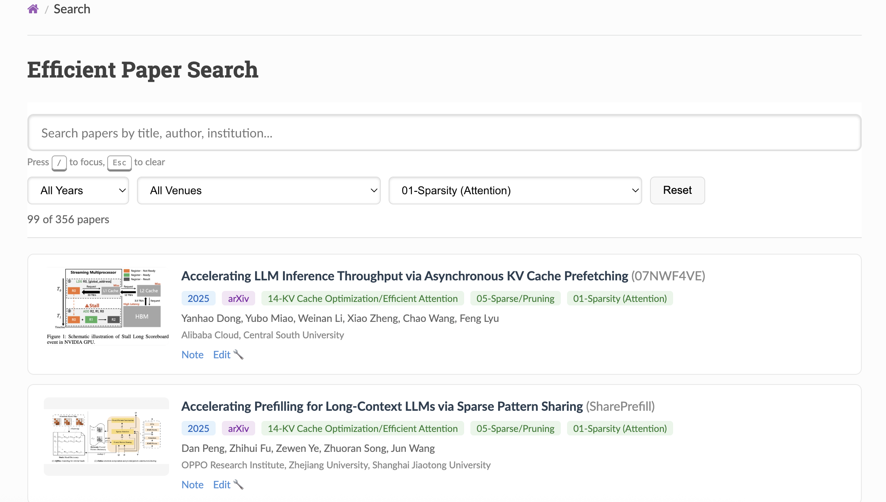

# Paper Metadata Editor

一个用于管理和编辑论文元数据的可视化工具，支持从 PDF 自动提取信息、在线编辑和部署到 GitHub Pages。

## 快速开始

### 第一步：添加论文信息

使用 `add_paper_info.sh` 脚本从 PDF 文件自动提取论文信息：

```bash
./add_paper_info.sh ~/Downloads/2512.01278v1.pdf
```

这个脚本会：
- 自动从 PDF 提取论文标题、作者、摘要等信息
- 在 `meta/YYYY/` 目录下创建对应的 `.prototxt` 文件
- 在 `notes/YYYY/{paper_id}/` 目录下创建笔记文件

### 第二步：启动编辑器并编辑

运行编辑器服务：

```bash
./start_editor.sh
```

这个脚本会同时启动：
- **MkDocs 服务** (端口 8000) - 提供搜索和预览界面
- **Paper Editor API** (端口 8001) - 提供编辑功能的后端 API

然后访问搜索页面：

```
http://localhost:8000/search/
```



在搜索页面中：
1. **查找论文** - 使用搜索框或筛选器找到刚添加的论文
2. **点击 Edit** - 点击论文卡片上的 "Edit" 链接
3. **编辑信息** - 在可视化表单中完善论文信息：
   - 补充或修正标题、作者、机构
   - 选择发表会议/期刊和年份
   - 添加代码仓库链接
   - 选择关键词标签
   - 上传封面图片
   - 添加 baseline methods（格式：`年份/方法名`，如 `2024/StreamingLLM`）
4. **保存** - 点击 "Save Changes" 按钮
   - 系统会弹出提示：保存后需要运行 `./start_editor.sh` 重新生成静态文件
   - 点击 OK 确认保存

**保存后的自动更新：**
- 上传封面图片后，`note.md` 中的图片引用会自动更新为新上传的图片路径
- Baseline methods 列表会自动刷新，下次编辑时能看到刚保存的方法

### 第三步：确认并部署到 GitHub

确认编辑无误后，使用 `refresh_readme.sh` 部署到 GitHub：

```bash
./refresh_readme.sh 'update paper info'
```

这个脚本会：
- 重新生成搜索数据 (`papers.json`)
- 更新分类页面和统计信息
- 提交所有更改到 Git
- 推送到 GitHub 远程仓库
- 自动触发 GitHub Pages 部署

## 详细功能说明

### 字段说明

#### Paper Information (论文信息)
- **Title**: 论文标题 (必填)
- **Abbreviation**: 简称/缩写
- **Paper URL**: 论文链接 (通常是 arXiv 或会议链接)
- **Authors**: 作者列表 (可动态添加/删除)
- **Institutions**: 机构列表 (可动态添加/删除)

#### Publication (发表信息)
- **Venue**: 发表会议/期刊 (下拉选择)
  - 支持：arXiv, ICML, NeurIPS, ICLR, CVPR, ICCV, ECCV, ACL, EMNLP, NAACL, AAAI, IJCAI, SIGMOD, KDD
- **Year**: 发表年份 (必填)

#### Code (代码)
- **Code Type**: 代码框架 (PyTorch, TensorFlow, JAX, Others)
- **Code Repository URL**: 代码仓库链接

#### Keywords (关键词)
使用复选框选择适用的关键词：
- Attention Sparsity
- Activation Sparsity
- Weight Sparsity
- Structured Sparsity
- Sparse Pruning
- KV Cache Quantization
- Quantization
- Overlap
- Performance Modeling
- Deployment
- Survey
- Structure Design
- Low Rank
- KV Cache
- Fusion
- Efficient Training
- Tool
- Benchmark

#### Cover Image (封面图)
- **上传图片**: 点击 "Choose Image" 按钮
  - 支持格式：PNG, JPG, JPEG, GIF, WebP
  - 图片自动保存到 `notes/{year}/{paper_id}/` 目录
  - 文件名自动命名为 `cover.{ext}`
  - 上传成功后会显示预览
  - 自动更新 `note.md` 中的图片引用

#### Baseline Methods (基线方法)
- **格式**: `年份/方法缩写`，例如：`2024/StreamingLLM`、`2025/BLASST`
- **智能搜索**:
  - 开始输入时会自动显示匹配的现有方法
  - 使用 ↑↓ 键导航，Enter 选择
  - 点击下拉列表中的方法快速选择
  - 也可以直接输入新的方法名
  - 保存后列表会自动刷新

## 文件结构

```
EfficientPaper/
├── add_paper_info.sh           # 添加论文脚本
├── start_editor.sh              # 启动编辑器
├── refresh_readme.sh            # 部署到 GitHub
├── docs/
│   ├── edit.html                # 编辑页面
│   ├── images/
│   │   └── search.png           # 搜索页面截图
│   └── js/
│       └── papers.json          # 论文搜索数据
├── scripts/
│   ├── paper_editor_server.py   # 编辑器后端 API
│   └── generate_search_data.py  # 生成搜索数据
├── meta/
│   └── {year}/
│       └── {paper_id}.prototxt  # 论文元数据
└── notes/
    └── {year}/
        └── {paper_id}/
            ├── note.md          # 论文笔记
            └── cover.png        # 封面图片
```

## API 端点

编辑器后端提供以下 API：

### GET /api/load-paper?path={path}
加载指定的 prototxt 文件

**参数:**
- `path`: prototxt 文件路径，例如 `meta/2025/BLASST.prototxt`

**响应:**
```json
{
  "paper": { "title": "...", "abbr": "...", ... },
  "pub": { "where": "...", "year": 2025 },
  "code": { "type": "...", "url": "..." },
  "keyword": { "words": [...] },
  "cover": { "url": "..." },
  "baseline": { "methods": [...] }
}
```

### POST /api/save-paper
保存论文元数据

**请求体:**
```json
{
  "path": "meta/2025/BLASST.prototxt",
  "data": { ... }
}
```

**响应:**
```json
{
  "success": true,
  "message": "Paper saved successfully. Run ./start_editor.sh to see updates."
}
```

### GET /api/get-baseline-methods
获取所有可用的 baseline methods（格式：`年份/abbr`）

**响应:**
```json
{
  "methods": ["2024/StreamingLLM", "2025/BLASST", ...]
}
```

### POST /api/upload-cover
上传封面图片

**请求**: multipart/form-data
- `file`: 图片文件
- `path`: prototxt 文件路径

**响应:**
```json
{
  "success": true,
  "filename": "cover.png",
  "url": "/notes/2025/BLASST/cover.png",
  "message": "Image uploaded successfully. Run ./start_editor.sh to see updates."
}
```

## 技术细节

- **前端**: 纯 HTML/CSS/JavaScript，无需构建工具
- **后端**: Python HTTP 服务器 + Protocol Buffers
- **数据格式**: Protocol Buffers (prototxt)
- **通信**: REST API (JSON)
- **自动化**:
  - 上传图片后自动更新 `note.md` 中的图片引用
  - 保存后自动刷新 baseline methods 列表

## 注意事项

1. **端口占用**: 确保 8000 和 8001 端口未被占用
2. **保存提示**: 保存后会弹出确认对话框，提示需要重新运行 `./start_editor.sh`
3. **图片路径**: 上传的封面图片会自动更新到 `note.md`，无需手动修改
4. **Baseline Methods**: 使用 `年份/abbr` 格式，系统会自动从所有论文中提取可用列表
5. **部署**: 使用 `refresh_readme.sh` 部署前，请确保本地编辑无误

## 常见问题

**Q: 保存后看不到更新？**
A: 需要重新运行 `./start_editor.sh` 来重新生成静态文件。

**Q: Baseline methods 列表不更新？**
A: 保存成功后会自动刷新列表，如果还是看不到，请刷新浏览器页面。

**Q: 上传图片后 note.md 没有更新？**
A: 系统会自动替换 `` 或 ``  为新上传的图片路径。

**Q: 如何添加新的会议/期刊选项？**
A: 编辑 `docs/edit.html` 中的 venue 下拉列表选项。
