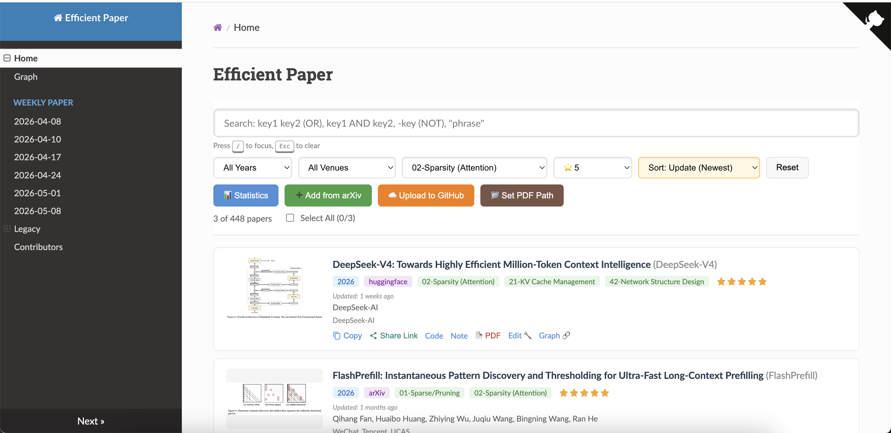
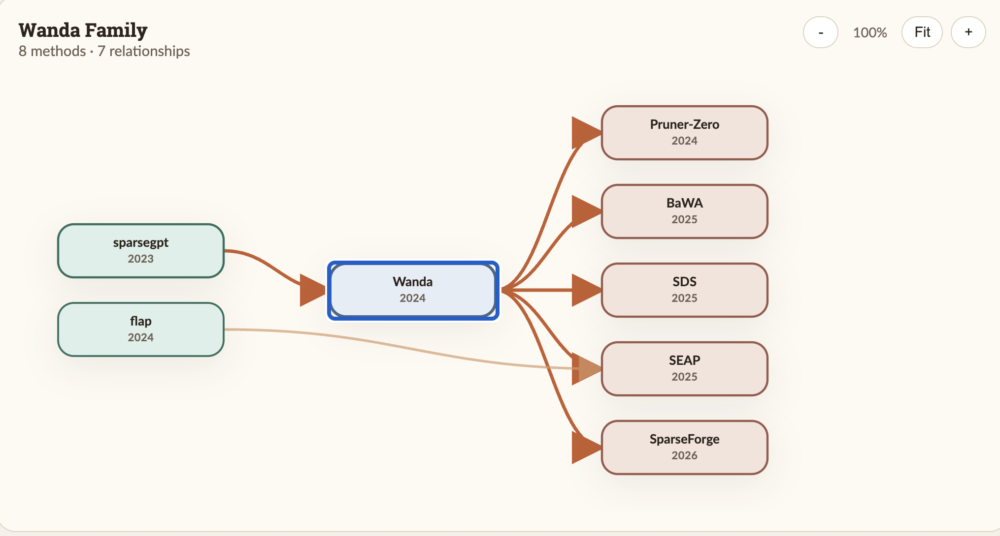
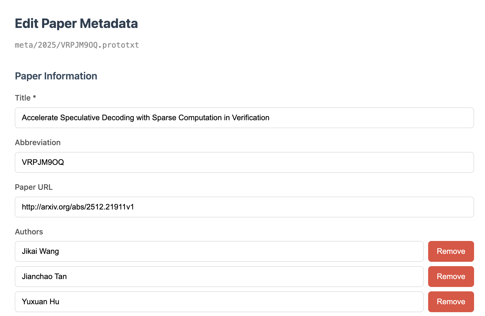
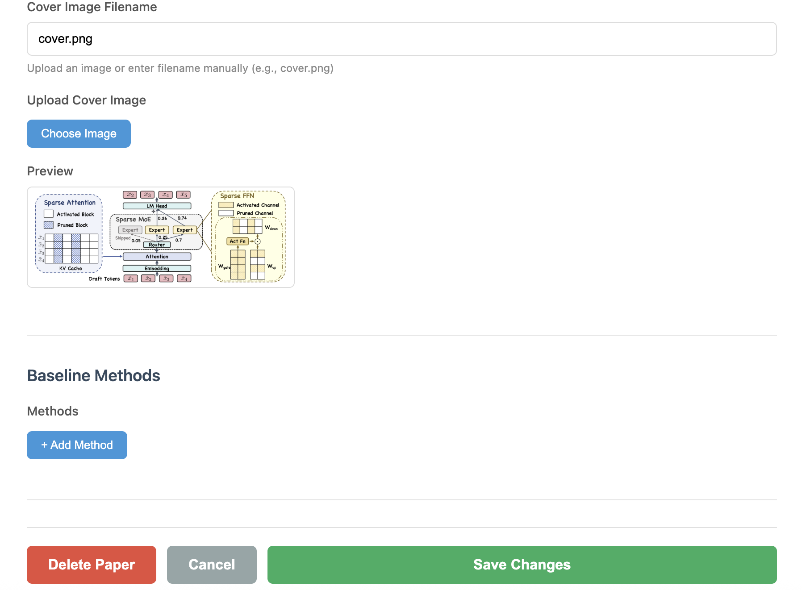
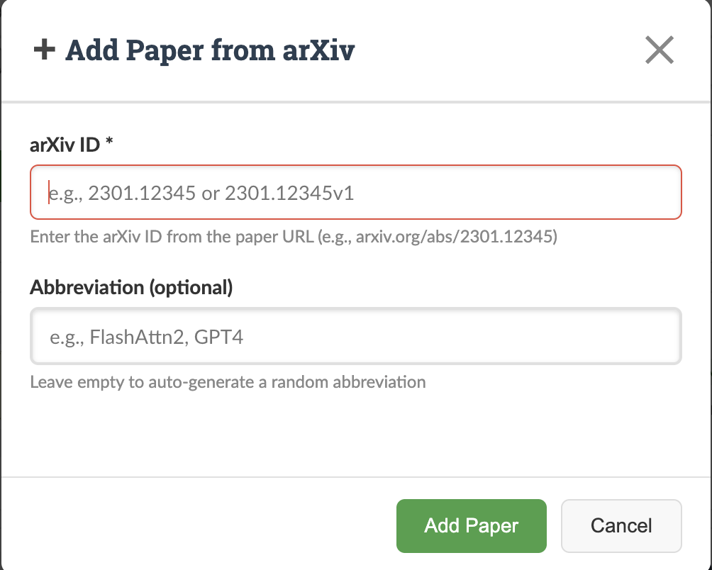
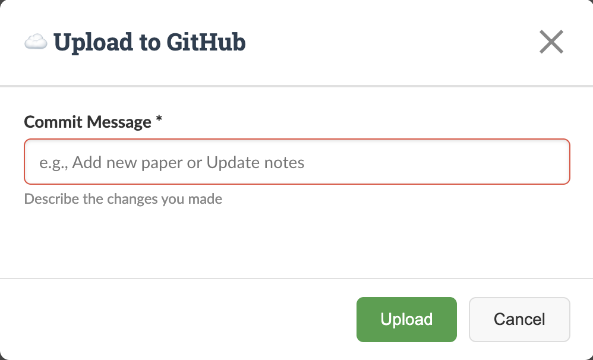
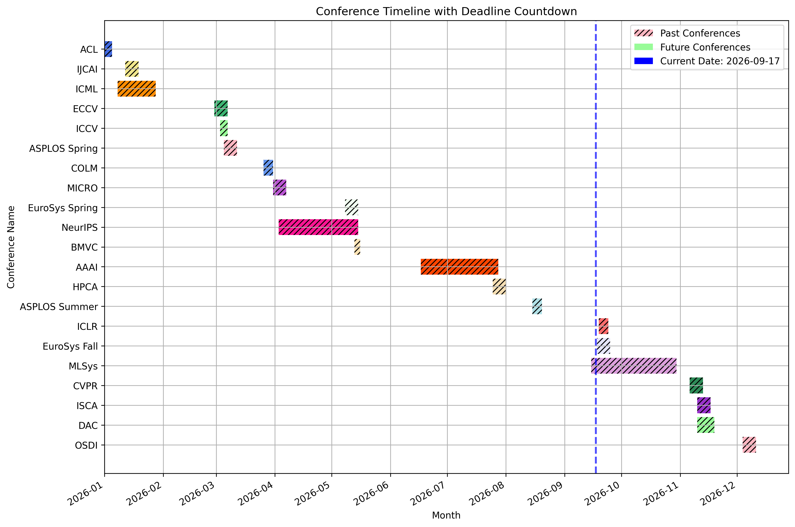

# EfficientPaper

[](https://github.com/hustzxd/EfficientPaper)
[](https://github.com/hustzxd/EfficientPaper)
[](https://github.com/hustzxd/EfficientPaper)

EfficientPaper is a MkDocs-based paper collection site for efficient AI research. It currently indexes **473** papers on **Pruning**, **Quantization**, **KV Cache**, **Speculative Decoding**, **Efficient Inference/Training**, and related system optimization topics.

The main experience is the Home page at `docs/index.md`: a searchable paper workspace with local editing, graph navigation, arXiv import, PDF lookup, and GitHub sync.

<p align="center">
  
</p>

## What the UI Supports

### 1. Searchable paper workspace

The Home page combines search, filters, stats, and paper actions in one place.

- Keyword search supports plain terms, quoted phrases, `AND`, and negative terms like `-kv`.
- Filters include year, venue, keyword, rating, and sort order.
- Result cards support selection, copy/share, note jumping, graph jumping, local PDF lookup, and quick rating.
- A right-side detail drawer shows cover, authors, institutions, tags, note preview, and paper links.

### 2. Interactive method graph

The graph page links baseline methods and derived work, and can jump back to the corresponding paper on Home.

<p align="center">
  
</p>

### 3. Local paper metadata editor

`docs/edit.html` provides a standalone editor for `.prototxt` metadata, including title, abbreviation, venue, authors, institutions, keywords, code URL, rating, and update time.

<p align="center">
  
</p>

The same editor also supports cover upload, preview, baseline method linking, save, and guarded deletion.

<p align="center">
  
</p>

### 4. Add papers from arXiv

When the local editor server is running, the Home page can search arXiv by ID, inspect the detected paper, and create a new paper entry with an optional custom abbreviation.

<p align="center">
  
</p>

### 5. Upload local changes to GitHub

The site can trigger the local refresh and upload flow from the browser. This is intended for local use and depends on the editor server.

<p align="center">
  
</p>

## Quick Start

### 1. Clone and install dependencies

```bash
git clone https://github.com/hustzxd/EfficientPaper
cd EfficientPaper
pip install protobuf==5.27.2 pandas arxiv openai mkdocs mkdocs-glightbox mkdocs-literate-nav mkdocs-macros-plugin watchdog
```

If `protoc` is not installed on your machine, install Protocol Buffers first.

### 2. Optional MiMo API key

Adding papers can call Xiaomi MiMo LLM (`mimo-v2-flash`) to auto-generate Chinese summaries and keyword suggestions:

```bash
export MIMO_API_KEY="your-mimo-api-key"
```

If this variable is not set, paper creation still works, but auto summarization and keyword suggestion are skipped.

### 3. Start the local site and editor server

```bash
./start_editor.sh
```

This script will:

- regenerate derived data with `refresh_and_upload.sh`
- start MkDocs at `http://localhost:8000`
- start the editor API at `http://localhost:8001`
- watch `meta/` and `notes/` for changes and auto-refresh generated data

## Typical Workflow

### Add from arXiv ID or UI

```bash
./add_paper_info.sh 2512.01278v1
```

This wraps `scripts/add_paper.py`, looks up the paper by arXiv ID, and creates a new `.prototxt` paper entry plus a note directory under `notes/<year>/<paper_id>/`.

You can also open the Home page and use `Add from arXiv` when the local server is available.

### Edit metadata and notes in browser

- Visit `http://localhost:8000`
- Use the paper card `Edit` action to open `docs/edit.html`
- Open the paper note page to edit `notes/<year>/<paper>/note.md` in browser

### Refresh generated assets

```bash
./refresh_and_upload.sh
```

This regenerates protobuf templates, split metadata, graph data, and the search dataset.

### Commit, push, and deploy

```bash
./refresh_and_upload.sh "update_paper_info"
```

With a commit message, the script additionally runs:

- `git add .`
- `git commit -m ...`
- `git push`
- `mkdocs build`
- `./build_and_deploy.sh`

## Repository Layout

```text
docs/index.md                        # Main searchable home page
docs/baseline_methods_graph_interactive.md
docs/edit.html                       # Local metadata editor
docs/js/papers.json                  # Frontend search dataset
docs/js/paper_graph_map.json         # Home <-> graph mapping
meta/<year>/*.prototxt               # Structured paper metadata
notes/<year>/<paper>/note.md         # Paper notes
notes/<year>/<paper>/cover.*         # Paper cover assets
scripts/paper_editor_server.py       # Local editor / upload / pull / PDF API
scripts/generate_search_data.py      # Search dataset generator
```

## Local-server-aware Features

Several UI actions depend on `http://localhost:8001` and are intentionally disabled when the server is unavailable:

- `Add from arXiv`
- `Upload to GitHub`
- `Pull from GitHub`
- `Set PDF Path`
- card-level `PDF`
- card-level `Edit`
- card-level delete

This graceful degradation is part of the intended local workflow.

## Contributing

To add or update a paper:

1. Run `./add_paper_info.sh <arxiv_id>` or use `Add from arXiv`.
2. Start the local tools with `./start_editor.sh`.
3. Edit metadata, note content, cover image, keywords, and baseline links in the browser.
4. Run `./refresh_and_upload.sh` to regenerate derived data.
5. Submit a Pull Request, or use the local GitHub upload flow if you are maintaining your own deployment.

## Conference Timeline

<p align="center">
  
</p>

## 招聘

如果您对论文涉及到的研究内容感兴趣，同时有求职意向（[实习生/校招/社招](https://m.zhipin.com/gongsi/job/dc8e21b748a34c331HZz3Nu-GFU~.html?ka=m_seo_companys_all_jobs_boss)），可以发送简历到 zhaoxiandong27@gmail.com，欢迎沟通交流。

## References

1. [Awesome-LLM-Long-Context-Modeling](https://github.com/Xnhyacinth/Awesome-LLM-Long-Context-Modeling) [](https://github.com/Xnhyacinth/Awesome-LLM-Long-Context-Modeling)
2. [Awesome-Efficient-Arch](https://github.com/weigao266/Awesome-Efficient-Arch) [](https://github.com/weigao266/Awesome-Efficient-Arch)
3. [Awesome-Efficient-LLM](https://github.com/horseee/Awesome-Efficient-LLM) [](https://github.com/horseee/Awesome-Efficient-LLM)
4. [Awesome-Diffusion-Inference](https://github.com/DefTruth/Awesome-Diffusion-Inference) [](https://github.com/DefTruth/Awesome-Diffusion-Inference)
5. [Awesome-LLM-Inference](https://github.com/DefTruth/Awesome-LLM-Inference) [](https://github.com/DefTruth/Awesome-LLM-Inference)
6. [LLMSys-PaperList](https://github.com/AmberLJC/LLMSys-PaperList) [](https://github.com/AmberLJC/LLMSys-PaperList)
7. [Awesome-LLM](https://github.com/Hannibal046/Awesome-LLM) [](https://github.com/Hannibal046/Awesome-LLM)
8. [Awesome-LLM-System-Papers](https://github.com/AmadeusChan/Awesome-LLM-System-Papers) [](https://github.com/AmadeusChan/Awesome-LLM-System-Papers)
9. [compiler-and-arch](https://github.com/KnowingNothing/compiler-and-arch) [](https://github.com/KnowingNothing/compiler-and-arch)
10. [PaperCopilot](https://papercopilot.com/paper-list)
11. [Awesome-KV-Cache-Management](https://github.com/TreeAI-Lab/Awesome-KV-Cache-Management) [](https://github.com/TreeAI-Lab/Awesome-KV-Cache-Management)
12. [Awesome-KV-Cache-Compression](https://github.com/October2001/Awesome-KV-Cache-Compression) [](https://github.com/October2001/Awesome-KV-Cache-Compression)
13. [Awesome-Pruning](https://github.com/he-y/Awesome-Pruning) [](https://github.com/he-y/Awesome-Pruning)
14. [awesome-model-quantization](https://github.com/htqin/awesome-model-quantization) [](https://github.com/htqin/awesome-model-quantization)
15. [Awesome-Deep-Neural-Network-Compression](https://github.com/csyhhu/Awesome-Deep-Neural-Network-Compression) [](https://github.com/csyhhu/Awesome-Deep-Neural-Network-Compression)
16. [Efficient-Deep-Learning](https://github.com/AojunZhou/Efficient-Deep-Learning) [](https://github.com/AojunZhou/Efficient-Deep-Learning)
17. [Model-Compression-Papers](https://github.com/chester256/Model-Compression-Papers) [](https://github.com/chester256/Model-Compression-Papers)
