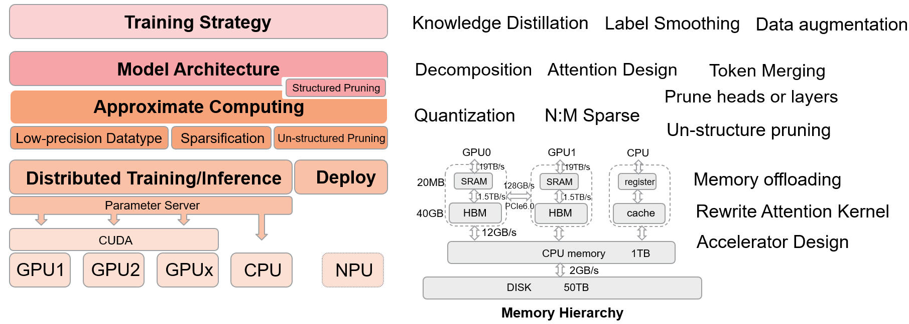
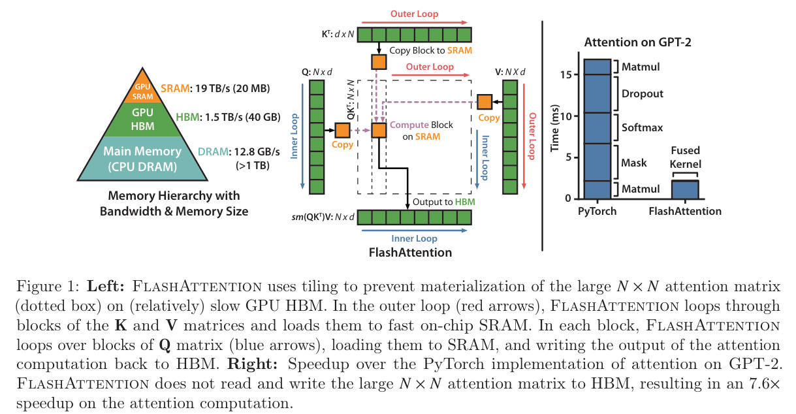
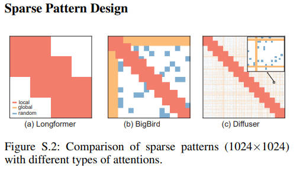

# EfficientPaper
Pruning, Quantization and efficient-inference/training paper list.

## Table of Contents
- [EfficientPaper](#efficientpaper)
  - [Table of Contents](#table-of-contents)
  - [Getting Started](#getting-started)
  - [Optimization Hierarchy for LLM](#optimization-hierarchy-for-llm)
  - [:sparkles: Paper List](#paper-list)
    - [keyword](#keyword)
    - [year](#year)
    - [publication](#publication)
    - [instution](#instution)
    - [author](#author)
  - [Reference](#reference)


## Getting Started
1. Add paper information by `./add_paper_info.sh` or  `./add_paper_info.sh <name>`
2. Run `./refresh_readme.sh`

<details><summary><b>sparsegpt.prototxt</b></summary>	
<p>

```
paper {
  title: "SparseGPT: Massive Language Models Can be Accurately Pruned in one-shot."
  abbr: "SparseGPT"
  url: "https://arxiv.org/pdf/2301.00774.pdf"
  authors: "Elias Frantar"
  authors: "Dan Alistarh"
  institutions: "IST Austria"
  institutions: "Neural Magic"
}
pub {
  where: "arXiv"
  year: 2023
}
code {
  type: "Pytorch"
  url: "https://github.com/IST-DASLab/sparsegpt"
}
note {
  url: "SparseGPT.md"
}
keyword {
  words: "sparsity"
}
```

</p>
</details>

## Optimization Hierarchy for LLM

<p align="center">
  
</p>


## Paper List

<details open><summary>

### keyword
</summary> 
<p>

<details open><summary><b>0 Working</b></summary> 
<p>

|    | meta                                         | ttttttttttttttttttttttttttttttitle                                                                                                                                              | ccccccccccccccccccover                                               | pub          |   year | code                                                                | note                                                                                                                  |
|---:|:---------------------------------------------|:--------------------------------------------------------------------------------------------------------------------------------------------------------------------------------|:---------------------------------------------------------------------|:-------------|-------:|:--------------------------------------------------------------------|:----------------------------------------------------------------------------------------------------------------------|
|  0 | [blocksparse](./meta/blocksparse.prototxt)   | [GPU Kernels for Block-Sparse Weights](https://cdn.openai.com/blocksparse/blocksparsepaper.pdfs)                                                                                |                                                                      | arXiv        |      0 | [TensorFlow](https://github.com/openai/blocksparse)                 |                                                                                                                       |
|  1 | [FisherPruning](./meta/QA8XN7TU.prototxt)    | [A Fast Post-Training Pruning Framework for Transformers](https://arxiv.org/abs/2204.09656)                                                                                     |  | NeurIPS      |   2022 | [Pytorch](https://github.com/WoosukKwon/retraining-free-pruning)    | [note](https://confluence.xilinx.com/pages/viewpage.action?pageId=969271620)                                          |
|  2 | [SIMPLE](./meta/simple.prototxt)             | [Structured Pruning for Efficient Generative Pre-trained Language Models](https://aclanthology.org/2023.findings-acl.692.pdf)                                                   |          | ACL Findings |   2023 |                                                                     | [note](./notes/simple/index.md)                                                                                       |
|  3 | [Deja Vu](./meta/dejavu.prototxt)            | [Deja Vu: Contextual Sparsity for Efficient LLMs at Inference Time](https://openreview.net/forum?id=wIPIhHd00i)                                                                 |         | ICML         |   2023 | [Pytorch](https://github.com/FMInference/DejaVu)                    |                                                                                                                       |
|  4 | [nmSPARSE](./meta/nmSPARSE.prototxt)         | [Efficient GPU Kernels for N:M-Sparse Weights in Deep Learning](https://proceedings.mlsys.org/paper_files/paper/2023/file/4552cedd396a308320209f75f56a5ad5-Paper-mlsys2023.pdf) |                                                                      | MLSys        |   2023 | [CUDA](https://github.com/microsoft/SparTA/tree/nmsparse)           |                                                                                                                       |
|  5 | [ZipLM](./meta/ZipLM.prototxt)               | [ZipLM: Inference-Aware Structured Pruning of Language Models](https://openreview.net/pdf?id=bPFFPueAxm)                                                                        |           | NeurIPS      |   2023 | [Pytorch](https://github.com/IST-DASLab/ZipLM)                      |                                                                                                                       |
|  6 | [Compresso](./meta/Compresso.prototxt)       | [Compresso: Structured Pruning with Collaborative Prompting Learns Compact Large Language Models](https://arxiv.org/abs/2310.05015)                                             |       | arXiv        |   2023 | [PyTorch](https://github.com/microsoft/Moonlit/blob/main/Compresso) | [note](./notes/compresso/note.md)                                                                                     |
|  7 | [K-pruning](./meta/k_pruning.prototxt)       | [Knowledge-preserving Pruning for Pre-trained Language Models without Retraining](https://arxiv.org/abs/2308.03449)                                                             |          | arXiv        |   2023 |                                                                     | [note](./notes/k_pruning/note.md)                                                                                     |
|  8 | [LLM-Pruner](./meta/llmpruner.prototxt)      | [LLM-Pruner: On the Structural Pruning of Large Language Models](https://arxiv.org/abs/2305.11627)                                                                              |      | arXiv        |   2023 | [Pytorch](https://github.com/horseee/LLM-Pruner)                    | [note](https://confluence.xilinx.com/display/aialgo/LLM-Pruner%3A+On+the+Structural+Pruning+of+Large+Language+Models) |
|  9 | [OWL](./meta/owl.prototxt)                   | [Outlier Weighed Layerwise Sparsity (OWL): A Missing Secret Sauce for Pruning LLMs to High Sparsity](https://arxiv.org/pdf/2310.05175.pdf)                                      |             | arXiv        |   2023 | [Pytorch](https://github.com/luuyin/OWL)                            |                                                                                                                       |
| 10 | [GBDT](./meta/gbdt.prototxt)                 | [Pruning Large Language Models via Accuracy Predictor](https://arxiv.org/abs/2309.09507)                                                                                        |             | arXiv        |   2023 |                                                                     |                                                                                                                       |
| 11 | [LLM-shearing](./meta/LLM_shearing.prototxt) | [Sheared LLaMA: Accelerating Language Model Pre-training via Structured Pruning](https://xiamengzhou.github.io/sheared-llama/)                                                  |    | arXiv        |   2023 | [Soon](https://github.com/princeton-nlp/LLM-Shearing)               | [note](./notes/llm_shearing/note.md)                                                                                  |
| 12 | [SquareHead](./meta/SquareHead.prototxt)     | [Sparse Fine-tuning for Inference Acceleration of Large Language Models](https://arxiv.org/pdf/2310.06927.pdf)                                                                  |      | arXiv        |   2023 | [Pytorch](https://github.com/IST-DASLab/SparseFinetuning)           |                                                                                                                       |
| 13 | [Flash-LLM](./meta/flash_llm.prototxt)       | [Flash-LLM: Enabling Cost-Effective and Highly-Efficient Large Generative Model Inference with Unstructured Sparsity](https://arxiv.org/abs/2309.10285)                         |       | VLDB         |   2024 | [Pytorch](https://github.com/AlibabaResearch/flash-llm/tree/main)   | [note](./notes/flash_llm/index.md)                                                                                    |</p>
</details>
<details open><summary><b>Layer Fusion (Reduce IO)</b></summary> 
<p>

|    | meta                                                | ttttttttttttttttttttttttttttttitle                                                                                   | ccccccccccccccccccover                                               | pub     |   year | code                                                    | note   |
|---:|:----------------------------------------------------|:---------------------------------------------------------------------------------------------------------------------|:---------------------------------------------------------------------|:--------|-------:|:--------------------------------------------------------|:-------|
|  0 | [FlashAttention](./meta/flashattention.prototxt)    | [FlashAttention: Fast and Memory-Efficient Exact Attention with IO-Awareness](https://arxiv.org/abs/2205.14135)      |  | NeurIPS |   2022 | [Pytorch](https://github.com/Dao-AILab/flash-attention) |        |
|  1 | [FlashAttention-2](./meta/flashattention2.prototxt) | [FlashAttention-2: Faster Attention with Better Parallelism and Work Partitioning](https://arxiv.org/abs/2307.08691) |                                                                      | arXiv   |   2023 | [Pytorch](https://github.com/Dao-AILab/flash-attention) |        |</p>
</details>
<details open><summary><b>Low Rank Decomposition</b></summary> 
<p>

|    | meta                                 | ttttttttttttttttttttttttttttttitle                                                                                             | ccccccccccccccccccover                                            | pub   |   year | code                                              | note   |
|---:|:-------------------------------------|:-------------------------------------------------------------------------------------------------------------------------------|:------------------------------------------------------------------|:------|-------:|:--------------------------------------------------|:-------|
|  0 | [LoRA](./meta/lora.prototxt)         | [LoRA: Low-rank adaptation of large language models](https://arxiv.org/abs/2106.09685)                                         |          | ICLR  |   2022 | [Pytorch](https://github.com/microsoft/LoRA)      |        |
|  1 | [AdaLoRA](./meta/adalora.prototxt)   | [AdaLoRA: Adaptive Budget Allocation for Parameter-Efficient Fine-Tuning](https://arxiv.org/pdf/2303.10512.pdf)                |    | ICLR  |   2023 | [Pytorch](https://github.com/QingruZhang/AdaLoRA) |        |
|  2 | [LoSparse](./meta/LoSparse.prototxt) | [Structured Compression of Large Language Models based on Low-Rank and Sparse Approximation](https://arxiv.org/abs/2306.11222) |  | ICML  |   2023 | [Pytorch](https://github.com/yxli2123/LoSparse)   |        |
|  3 | [QLoRA](./meta/qlora.prototxt)       | [QLoRA: Efficient Finetuning of Quantized LLMs](https://arxiv.org/abs/2305.14314)                                              |        | arXiv |   2023 | [Pytorch](https://github.com/artidoro/qlora)      |        |</p>
</details>
<details open><summary><b>Quantization</b></summary> 
<p>

|    | meta                                                | ttttttttttttttttttttttttttttttitle                                                                                                               | ccccccccccccccccccover                                                   | pub     |   year | code                                                                   | note                                                                          |
|---:|:----------------------------------------------------|:-------------------------------------------------------------------------------------------------------------------------------------------------|:-------------------------------------------------------------------------|:--------|-------:|:-----------------------------------------------------------------------|:------------------------------------------------------------------------------|
|  0 | [Deep Compression](./meta/deepcompression.prototxt) | [Deep Compression: Compressing Deep Neural Networks with Pruning, Trained Quantization and Huffman Coding](https://arxiv.org/pdf/1510.00149.pdf) |                                                                          | ICLR    |   2016 |                                                                        |                                                                               |
|  1 | [ActNN](./meta/actnn.prototxt)                      | [ActNN: Reducing Training Memory Footprint via 2-Bit Activation Compressed Training](https://arxiv.org/pdf/2104.14129.pdf)                       |                                                                          | ICML    |   2019 | [Pytorch](https://github.com/ucbrise/actnn)                            |                                                                               |
|  2 | [BRECQ](./meta/brecq.prototxt)                      | [BRECQ: Pushing the Limit of Post-Training Quantization by Block Reconstruction](https://openreview.net/pdf?id=POWv6hDd9XH)                      |                                                                          | ICLR    |   2021 | [Pytorch](https://github.com/yhhhli/BRECQ)                             |                                                                               |
|  3 | [GPFQ](./meta/gpfq.prototxt)                        | [A Greedy Algorithm for Quantizing Neural Networks](https://jmlr.csail.mit.edu/papers/volume22/20-1233/20-1233.pdf)                              |                                                                          | JMLR    |   2021 | [Pytorch](https://gitenterprise.xilinx.com/xiandong/GPFA)              | [note](https://confluence.xilinx.com/pages/viewpage.action?pageId=1005133974) |
|  4 | [m](./meta/QZ2EJHG9.prototxt)                       | [On-Device Training Under 256KB Memory](https://arxiv.org/abs/2206.15472)                                                                        |  | NeurIPS |   2022 | [mit.edu](https://tinyml.mit.edu/on-device-training/)                  | [note](https://tinyml.mit.edu/on-device-training/)                            |
|  5 | [OBC](./meta/obc.prototxt)                          | [Optimal Brain Compression: A Framework for Accurate Post-Training Quantization and Pruning](https://openreview.net/pdf?id=ksVGCOlOEba)          |                                                                          | NeurIPS |   2022 | [IST-DASLab/OBC](https://github.com/IST-DASLab/OBC)                    |                                                                               |
|  6 | [ZeroQuant](./meta/zeroquant.prototxt)              | [ZeroQuant: Efficient and Affordable Post-Training Quantization for Large-Scale Transformers](https://openreview.net/forum?id=f-fVCElZ-G1)       |                                                                          | NeurIPS |   2022 | [DeepSpeed](https://github.com/microsoft/DeepSpeed)                    |                                                                               |
|  7 | [GPTQ](./meta/gptq.prototxt)                        | [GPTQ: Accurate Post-Training Quantization for Generative Pre-trained Transformers](https://arxiv.org/pdf/2210.17323.pdf)                        |                                                                          | ICLR    |   2023 | [Pytorch](https://github.com/IST-DASLab/gptq)                          |                                                                               |
|  8 | [AWQ](./meta/awq.prototxt)                          | [AWQ: Activation-aware Weight Quantization for LLM Compression and Acceleration](https://arxiv.org/pdf/2306.00978.pdf)                           |                                                                          | arXiv   |   2023 | [Pytorch](https://github.com/mit-han-lab/llm-awq)                      |                                                                               |
|  9 | [OmniQuant](./meta/omniquant.prototxt)              | [OmniQuant: Omnidirectionally Calibrated Quantization for Large Language Models](https://arxiv.org/abs/2308.13137)                               |       | arXiv   |   2023 | [Pytorch](https://github.com/OpenGVLab/OmniQuant)                      |                                                                               |
| 10 | [GPFQv2](./meta/gpfqv2.prototxt)                    | [Post-training Quantization for Neural Networks with Provable Guarantees](https://arxiv.org/pdf/2201.11113.pdf)                                  |                                                                          | arXiv   |   2023 | [Pytorch](https://gitenterprise.xilinx.com/xiandong/GPFA)              | [note](https://confluence.xilinx.com/pages/viewpage.action?pageId=1005133974) |
| 11 | [QLoRA](./meta/qlora.prototxt)                      | [QLoRA: Efficient Finetuning of Quantized LLMs](https://arxiv.org/abs/2305.14314)                                                                |               | arXiv   |   2023 | [Pytorch](https://github.com/artidoro/qlora)                           |                                                                               |
| 12 | [QuIP](./meta/QuIP.prototxt)                        | [QuIP: Quantization with Incoherence Processing](https://arxiv.org/pdf/2307.13304.pdf)                                                           |                                                                          | arXiv   |   2023 | [Pytorch](https://github.com/jerry-chee/QuIP)                          |                                                                               |
| 13 | [RPTQ](./meta/RPTQ.prototxt)                        | [RPTQ: Reorder-based Post-training Quantization for Large Language Models](https://arxiv.org/pdf/2304.01089.pdf)                                 |                                                                          | arXiv   |   2023 | [PyTorch](https://github.com/hahnyuan/RPTQ4LLM)                        |                                                                               |
| 14 | [SpQR](./meta/spqr.prototxt)                        | [SpQR: A Sparse-Quantized Representation for Near-Lossless LLM Weight Compression](https://arxiv.org/pdf/2306.03078.pdf)                         |                                                                          | arXiv   |   2023 | [Pytorch](https://github.com/Vahe1994/SpQR)                            |                                                                               |
| 15 | [SqueezeLLM](./meta/SqueezeLLM.prototxt)            | [SqueezeLLM: Dense-and-Sparse Quantization](https://arxiv.org/abs/2306.07629)                                                                    |                                                                          | arXiv   |   2023 | [Pytorch](https://github.com/SqueezeAILab/SqueezeLLM)                  |                                                                               |
| 16 | [m](./meta/23LQ9SVH.prototxt)                       | [Training Transformers with 4-bit Integers](https://arxiv.org/abs//2306.11987)                                                                   |                                                                          | arXiv   |   2023 | [pytorch-CUDA](https://github.com/xijiu9/Train_Transformers_with_INT4) |                                                                               |
| 17 | [ZeroQuant-V2](./meta/ZeroQuant-V2.prototxt)        | [ZeroQuant-V2: Exploring Post-training Quantization in LLMs from Comprehensive Study to Low Rank Compensation](https://arxiv.org/abs/2303.08302) |                                                                          | arXiv   |   2023 | [DeepSpeed](https://github.com/microsoft/DeepSpeed)                    |                                                                               |</p>
</details>
<details open><summary><b>Sparse/Pruning</b></summary> 
<p>

|    | meta                                                                       | ttttttttttttttttttttttttttttttitle                                                                                                                                                                                                       | ccccccccccccccccccover                                                                                  | pub                                    |   year | code                                                                                                       | note                                                                                                                            |
|---:|:---------------------------------------------------------------------------|:-----------------------------------------------------------------------------------------------------------------------------------------------------------------------------------------------------------------------------------------|:--------------------------------------------------------------------------------------------------------|:---------------------------------------|-------:|:-----------------------------------------------------------------------------------------------------------|:--------------------------------------------------------------------------------------------------------------------------------|
|  0 | [OBD](./meta/obd.prototxt)                                                 | [Optimal Brain Damage](https://proceedings.neurips.cc/paper_files/paper/1989/file/6c9882bbac1c7093bd25041881277658-Paper.pdf)                                                                                                            |                                                                                                         | NeurIPS                                |   1989 |                                                                                                            |                                                                                                                                 |
|  1 | [OBS](./meta/obs.prototxt)                                                 | [Optimal Brain Surgeon and general network pruning](https://ieeexplore.ieee.org/stamp/stamp.jsp?tp=&arnumber=298572&tag=1)                                                                                                               |                                                                                                         |                                        |   1993 |                                                                                                            |                                                                                                                                 |
|  2 | [DSD](./meta/dsd.prototxt)                                                 | [DSD: Dense-Sparse-Dense Training for Deep Neural Networks](https://arxiv.org/pdf/1607.04381.pdf)                                                                                                                                        |                                                                                                         | ICLR                                   |   2017 |                                                                                                            | [note](https://confluence.xilinx.com/display/aialgo/DSD%3A+Dense-Sparse-Dense+Training+for+Deep+Neural+Networks)                |
|  3 | [L-OBS](./meta/lobs.prototxt)                                              | [Learning to Prune Deep Neural Networks via Layer-wise Optimal Brain Surgeon](https://arxiv.org/pdf/1705.07565.pdf)                                                                                                                      |                                                                                                         | NeurIPS                                |   2017 | [Pytorch/TF](https://github.com/csyhhu/L-OBS)                                                              |                                                                                                                                 |
|  4 | [ADMM-pruning](./meta/Z9R72EAT.prototxt)                                   | [A Systematic DNN Weight Pruning Framework using Alternating Direction Method of Multipliers](https://arxiv.org/abs/1804.03294)                                                                                                          |                                                                                                         | ECCV                                   |   2018 | [Pytorch](https://github.com/bzantium/pytorch-admm-pruning)                                                |                                                                                                                                 |
|  5 | [m](./meta/2AL79IUH.prototxt)                                              | [Fast Sparse ConvNets](https://openaccess.thecvf.com/content_CVPR_2020/papers/Elsen_Fast_Sparse_ConvNets_CVPR_2020_paper.pdf)                                                                                                            |                                                                                                         | CVPR                                   |   2020 | [C](https://github.com/fastconvnets/cvpr2020)                                                              |                                                                                                                                 |
|  6 | [m](./meta/V3MFIRLV.prototxt)                                              | [Inducing and Exploiting Activation Sparsity for Fast Neural Network Inference](http://proceedings.mlr.press/v119/kurtz20a/kurtz20a.pdf)                                                                                                 |                                                                                                         | ICML                                   |   2020 |                                                                                                            |                                                                                                                                 |
|  7 | [Movement Pruning](./meta/movement_pruning.prototxt)                       | [Movement Pruning: Adaptive Sparsity by Fine-Tuning](https://arxiv.org/abs/2005.07683)                                                                                                                                                   |                                      | NeurIPS                                |   2020 | [Pytorch](https://github.com/huggingface/block_movement_pruning)                                           |                                                                                                                                 |
|  8 | [OpenVINO](./meta/OpenVINO.prototxt)                                       | [Post-training deep neural network pruning via layer-wise calibration](https://openaccess.thecvf.com/content/ICCV2021W/LPCV/papers/Lazarevich_Post-Training_Deep_Neural_Network_Pruning_via_Layer-Wise_Calibration_ICCVW_2021_paper.pdf) |                                                                                                         | ICCV workshop                          |   2021 | [EfficientCNN](https://gitenterprise.xilinx.com/xiandong/EfficientCNN/tree/post-training-sparsity)         | [note](https://confluence.xilinx.com/pages/viewpage.action?pageId=1005133974)                                                   |
|  9 | [m](./meta/K7GSWQIC.prototxt)                                              | [Channel Permutations for N:M Sparsity](https://proceedings.neurips.cc/paper/2021/hash/6e8404c3b93a9527c8db241a1846599a-Abstract.html)                                                                                                   |                                                                                                         | NeurIPS                                |   2021 | [Pytorch](https://gitenterprise.xilinx.com/xiandong/permutation_nm_sparse)                                 | [note](https://confluence.xilinx.com/display/aialgo/Channel+Permutation+for+N%3AM+Sparsity)                                     |
| 10 | [NMSparse](./meta/PUHJMVCM.prototxt)                                       | [Accelerating Sparse Deep Neural Networks](https://arxiv.org/abs/2104.08378)                                                                                                                                                             |                                                                                                         | arXiv                                  |   2021 |                                                                                                            |                                                                                                                                 |
| 11 | [m](./meta/ITZS3TU3.prototxt)                                              | [Sparsity in Deep Learning: Pruning and growth for efficient inference and training in neural networks](https://arxiv.org/abs/2102.00554)                                                                                                |                                                                                                         | arXiv                                  |   2021 |                                                                                                            |                                                                                                                                 |
| 12 | [m](./meta/XZBX1Z9G.prototxt)                                              | [Sparse Progressive Distillation: Resolving Overfitting under Pretrain-and-Finetune Paradigm](https://aclanthology.org/2022.acl-long.16/)                                                                                                |                                                                                                         | ACL                                    |   2022 | [Pytorch](https://github.com/shaoyiHusky/SparseProgressiveDistillation)                                    |                                                                                                                                 |
| 13 | [TextPruner](./meta/TextPruner.prototxt)                                   | [TextPruner: A Model Pruning Toolkit for Pre-Trained Language Models](https://arxiv.org/abs/2203.15996)                                                                                                                                  |                                    | ACL                                    |   2022 | [Pytorch](https://github.com/airaria/TextPruner)                                                           |                                                                                                                                 |
| 14 | [m](./meta/2EQV34KV.prototxt)                                              | [Creating Sparse GPT-3 Models with Iterative Pruning](https://www.cerebras.net/blog/creating-sparse-gpt-3-models-with-iterative-pruning)                                                                                                 |                                                                                                         | Blog                                   |   2022 |                                                                                                            |                                                                                                                                 |
| 15 | [SPDY](./meta/spdy.prototxt)                                               | [SPDY: Accurate Pruning with Speedup Guarantees](https://arxiv.org/abs/2201.13096)                                                                                                                                                       |                                               | ICML                                   |   2022 | [Pytorch](https://github.com/IST-DASLab/spdy)                                                              | [note](./notes/spdy/index.md)                                                                                                   |
| 16 | [Sprint](./meta/Sprint.prototxt)                                           | [Sparse Attention Acceleration with Synergistic In-Memory Pruning and On-Chip Recomputation](https://arxiv.org/abs/2209.00606)                                                                                                           |                                                                                                         | MICRO                                  |   2022 |                                                                                                            |                                                                                                                                 |
| 17 | [FisherPruning](./meta/QA8XN7TU.prototxt)                                  | [A Fast Post-Training Pruning Framework for Transformers](https://arxiv.org/abs/2204.09656)                                                                                                                                              |                                     | NeurIPS                                |   2022 | [Pytorch](https://github.com/WoosukKwon/retraining-free-pruning)                                           | [note](https://confluence.xilinx.com/pages/viewpage.action?pageId=969271620)                                                    |
| 18 | [m](./meta/QZ2EJHG9.prototxt)                                              | [On-Device Training Under 256KB Memory](https://arxiv.org/abs/2206.15472)                                                                                                                                                                |                                 | NeurIPS                                |   2022 | [mit.edu](https://tinyml.mit.edu/on-device-training/)                                                      | [note](https://tinyml.mit.edu/on-device-training/)                                                                              |
| 19 | [OBC](./meta/obc.prototxt)                                                 | [Optimal Brain Compression: A Framework for Accurate Post-Training Quantization and Pruning](https://openreview.net/pdf?id=ksVGCOlOEba)                                                                                                  |                                                                                                         | NeurIPS                                |   2022 | [IST-DASLab/OBC](https://github.com/IST-DASLab/OBC)                                                        |                                                                                                                                 |
| 20 | [Complementary Sparsity](./meta/ComplementarySparsity.prototxt)            | [Two Sparsities Are Better Than One: Unlocking the Performance Benefits of Sparse-Sparse Networks](https://iopscience.iop.org/article/10.1088/2634-4386/ac7c8a)                                                                          |                              | Neuromorphic Computing and Engineering |   2022 |                                                                                                            | [note](./notes/ComplementarySparsity/note.md)                                                                                   |
| 21 | [STA](./meta/44KWQAWO.prototxt)                                            | [An Algorithm-Hardware Co-Optimized Framework for Accelerating N:M Sparse Transformers](https://arxiv.org/abs/2208.06118)                                                                                                                |                                                                                                         | VLSI                                   |   2022 |                                                                                                            |                                                                                                                                 |
| 22 | [oBERT](./meta/oBERT.prototxt)                                             | [The Optimal BERT Surgeon: Scalable and Accurate Second-Order Pruning for Large Language Models](https://arxiv.org/pdf/2203.07259.pdf)                                                                                                   |                                                                                                         | arXiv                                  |   2022 | [Pytorch](https://github.com/neuralmagic/sparseml/blob/main/research/optimal_BERT_surgeon_oBERT/README.md) |                                                                                                                                 |
| 23 | [Diffuser](./meta/diffuser.prototxt)                                       | [Diffuser: Efficient Transformers with Multi-hop Attention Diffusion for Long Sequences](https://arxiv.org/abs/2210.11794)                                                                                                               |                                        | AAAI                                   |   2023 | [Pytorch](https://github.com/asFeng/Diffuser)                                                              |                                                                                                                                 |
| 24 | [GRAIN](./meta/grain.prototxt)                                             | [Gradient-based Intra-attention Pruning on Pre-trained Language Models](https://arxiv.org/abs/2212.07634)                                                                                                                                |                                              | ACL                                    |   2023 | [Pytorch](https://github.com/airaria/GRAIN)                                                                | [note](./notes/grain/index.md)                                                                                                  |
| 25 | [SMP](./meta/smp.prototxt)                                                 | [Pruning Pre-trained Language Models Without Fine-Tuning](https://aclanthology.org/2023.acl-long.35.pdf)                                                                                                                                 |                                                  | ACL                                    |   2023 | [Pytorch](https://github.com/kongds/SMP)                                                                   |                                                                                                                                 |
| 26 | [PINS](./meta/PINS.prototxt)                                               | [Pruning Pre-trained Language Models with Principled Importance and Self-regularization](https://aclanthology.org/2023.findings-acl.573/)                                                                                                |                                                                                                         | ACL Findings                           |   2023 | [Pytorch](https://github.com/drsy/pins)                                                                    |                                                                                                                                 |
| 27 | [SIMPLE](./meta/simple.prototxt)                                           | [Structured Pruning for Efficient Generative Pre-trained Language Models](https://aclanthology.org/2023.findings-acl.692.pdf)                                                                                                            |                                             | ACL Findings                           |   2023 |                                                                                                            | [note](./notes/simple/index.md)                                                                                                 |
| 28 | [m](./meta/WDCO13S6.prototxt)                                              | [Structural Pruning of Large Language Models via Neural Architecture Search](https://openreview.net/forum?id=SHlZcInS6C)                                                                                                                 |                                  | AutoML Workshop                        |   2023 | [Pytorch](https://github.com/awslabs/syne-tune/tree/nas/benchmarking/nursery/nas_llm)                      |                                                                                                                                 |
| 29 | [SparseViT](./meta/SparseViT.prototxt)                                     | [SparseViT: Revisiting Activation Sparsity for Efficient High-Resolution Vision Transformer](https://arxiv.org/abs/2303.17605)                                                                                                           |                                      | CVPR                                   |   2023 | [Pytorch](https://github.com/mit-han-lab/sparsevit)                                                        | [note](./notes/sparsevit/index.md)                                                                                              |
| 30 | [TorchSparse++](./meta/TorchSparse.prototxt)                               | [TorchSparse++: Efficient Point Cloud Engine](https://openaccess.thecvf.com/content/CVPR2023W/WAD/papers/Tang_TorchSparse_Efficient_Point_Cloud_Engine_CVPRW_2023_paper.pdf)                                                             |                                                                                                         | CVPR workshop                          |   2023 | [mit.edu](https://github.com/mit-han-lab/torchsparse)                                                      |                                                                                                                                 |
| 31 | [MVUE](./meta/MVUE.prototxt)                                               | [Minimum Variance Unbiased N:M Sparsity for the Neural Gradients](https://openreview.net/pdf?id=vuD2xEtxZcj)                                                                                                                             |                                                                                                         | ICLR                                   |   2023 |                                                                                                            |                                                                                                                                 |
| 32 | [m](./meta/WMMGA0AR.prototxt)                                              | [The Lazy Neuron Phenomenon: On Emergence of Activation Sparsity in Transformers](https://openreview.net/forum?id=TJ2nxciYCk-)                                                                                                           |                                                                                                         | ICLR                                   |   2023 |                                                                                                            |                                                                                                                                 |
| 33 | [Deja Vu](./meta/dejavu.prototxt)                                          | [Deja Vu: Contextual Sparsity for Efficient LLMs at Inference Time](https://openreview.net/forum?id=wIPIhHd00i)                                                                                                                          |                                            | ICML                                   |   2023 | [Pytorch](https://github.com/FMInference/DejaVu)                                                           |                                                                                                                                 |
| 34 | [LoSparse](./meta/LoSparse.prototxt)                                       | [Structured Compression of Large Language Models based on Low-Rank and Sparse Approximation](https://arxiv.org/abs/2306.11222)                                                                                                           |                                        | ICML                                   |   2023 | [Pytorch](https://github.com/yxli2123/LoSparse)                                                            |                                                                                                                                 |
| 35 | [ZipLM](./meta/ZipLM.prototxt)                                             | [ZipLM: Inference-Aware Structured Pruning of Language Models](https://openreview.net/pdf?id=bPFFPueAxm)                                                                                                                                 |                                              | NeurIPS                                |   2023 | [Pytorch](https://github.com/IST-DASLab/ZipLM)                                                             |                                                                                                                                 |
| 36 | [Wanda](./meta/wanda.prototxt)                                             | [A Simple and Effective Pruning Approach for Large Language Models](https://arxiv.org/pdf/2306.11695.pdf)                                                                                                                                |                                                                                                         | arXiv                                  |   2023 | [Pytorch](https://github.com/locuslab/wanda)                                                               | [note](https://confluence.xilinx.com/display/aialgo/Wanda%3A+A+Simple+and+Effective+Pruning+Approach+for+Large+Language+Models) |
| 37 | [Compresso](./meta/Compresso.prototxt)                                     | [Compresso: Structured Pruning with Collaborative Prompting Learns Compact Large Language Models](https://arxiv.org/abs/2310.05015)                                                                                                      |                                          | arXiv                                  |   2023 | [PyTorch](https://github.com/microsoft/Moonlit/blob/main/Compresso)                                        | [note](./notes/compresso/note.md)                                                                                               |
| 38 | [Adaptively Sparse Attention](./meta/adaptively_sparse_attention.prototxt) | [Dynamic Context Pruning for Efficient and Interpretable Autoregressive Transformers](https://arxiv.org/abs/2305.15805)                                                                                                                  |  | arXiv                                  |   2023 |                                                                                                            |                                                                                                                                 |
| 39 | [KCM](./meta/kcm.prototxt)                                                 | [Gradient-Free Structured Pruning with Unlabeled Data](https://arxiv.org/abs/2303.04185)                                                                                                                                                 |                                                  | arXiv                                  |   2023 |                                                                                                            | [note](https://confluence.xilinx.com/display/aialgo/Gradient-Free+Structured+Pruning+with+Unlabeled+Data?moved=true)            |
| 40 | [K-pruning](./meta/k_pruning.prototxt)                                     | [Knowledge-preserving Pruning for Pre-trained Language Models without Retraining](https://arxiv.org/abs/2308.03449)                                                                                                                      |                                             | arXiv                                  |   2023 |                                                                                                            | [note](./notes/k_pruning/note.md)                                                                                               |
| 41 | [LLM-Pruner](./meta/llmpruner.prototxt)                                    | [LLM-Pruner: On the Structural Pruning of Large Language Models](https://arxiv.org/abs/2305.11627)                                                                                                                                       |                                         | arXiv                                  |   2023 | [Pytorch](https://github.com/horseee/LLM-Pruner)                                                           | [note](https://confluence.xilinx.com/display/aialgo/LLM-Pruner%3A+On+the+Structural+Pruning+of+Large+Language+Models)           |
| 42 | [OWL](./meta/owl.prototxt)                                                 | [Outlier Weighed Layerwise Sparsity (OWL): A Missing Secret Sauce for Pruning LLMs to High Sparsity](https://arxiv.org/pdf/2310.05175.pdf)                                                                                               |                                                | arXiv                                  |   2023 | [Pytorch](https://github.com/luuyin/OWL)                                                                   |                                                                                                                                 |
| 43 | [GBDT](./meta/gbdt.prototxt)                                               | [Pruning Large Language Models via Accuracy Predictor](https://arxiv.org/abs/2309.09507)                                                                                                                                                 |                                                | arXiv                                  |   2023 |                                                                                                            |                                                                                                                                 |
| 44 | [LLM-shearing](./meta/LLM_shearing.prototxt)                               | [Sheared LLaMA: Accelerating Language Model Pre-training via Structured Pruning](https://xiamengzhou.github.io/sheared-llama/)                                                                                                           |                                       | arXiv                                  |   2023 | [Soon](https://github.com/princeton-nlp/LLM-Shearing)                                                      | [note](./notes/llm_shearing/note.md)                                                                                            |
| 45 | [SquareHead](./meta/SquareHead.prototxt)                                   | [Sparse Fine-tuning for Inference Acceleration of Large Language Models](https://arxiv.org/pdf/2310.06927.pdf)                                                                                                                           |                                         | arXiv                                  |   2023 | [Pytorch](https://github.com/IST-DASLab/SparseFinetuning)                                                  |                                                                                                                                 |
| 46 | [SMS](./meta/sms.prototxt)                                                 | [Sparse Model Soups: A Recipe for Improved Pruning via Model Averaging](https://arxiv.org/abs/2306.16788)                                                                                                                                |                                                  | arXiv                                  |   2023 | [Pytorch](https://github.com/ZIB-IOL/SMS)                                                                  | [note](https://confluence.xilinx.com/display/aialgo/Sparse+Model+Soups%3A+A+Recipe+for+Improved+Pruning+via+Model+Averaging)    |
| 47 | [SparseGPT](./meta/sparsegpt.prototxt)                                     | [SparseGPT: Massive Language Models Can be Accurately Pruned in one-shot.](https://arxiv.org/pdf/2301.00774.pdf)                                                                                                                         |                                                                                                         | arXiv                                  |   2023 | [Pytorch](https://github.com/IST-DASLab/sparsegpt)                                                         | [note](./notes/SparseGPT.md)                                                                                                    |
| 48 | [m](./meta/AYB1XUO5.prototxt)                                              | [Ten Lessons We Have Learned in the New Sparseland: A Short Handbook for Sparse Neural Network Researchers](https://arxiv.org/abs/2302.02596)                                                                                            |                                                                                                         | arXiv                                  |   2023 |                                                                                                            |                                                                                                                                 |
| 49 | [Essential Sparsity](./meta/EssentialSparsity.prototxt)                    | [The Emergence of Essential Sparsity in Large Pre-trained Models: The Weights that Matter](https://arxiv.org/abs/2306.03805)                                                                                                             |                                                                                                         | arXiv                                  |   2023 | [Pytorch](https://github.com/VITA-Group/essential_sparsity/tree/main)                                      |                                                                                                                                 |
| 50 | [Selective Context](./meta/selective_context.prototxt)                     | [Unlocking Context Constraints of LLMs: Enhancing Context Efficiency of LLMs with Self-Information-Based Content Filtering](https://arxiv.org/abs/2304.12102)                                                                            |                      | arXiv                                  |   2023 | [Pytorch](https://github.com/liyucheng09/Selective_Context)                                                |                                                                                                                                 |
| 51 | [Flash-LLM](./meta/flash_llm.prototxt)                                     | [Flash-LLM: Enabling Cost-Effective and Highly-Efficient Large Generative Model Inference with Unstructured Sparsity](https://arxiv.org/abs/2309.10285)                                                                                  |                                          | VLDB                                   |   2024 | [Pytorch](https://github.com/AlibabaResearch/flash-llm/tree/main)                                          | [note](./notes/flash_llm/index.md)                                                                                              |</p>
</details>
<details open><summary><b>Survey</b></summary> 
<p>

|    | meta                          | ttttttttttttttttttttttttttttttitle                                                                                                            | ccccccccccccccccccover   | pub   |   year | code   | note   |
|---:|:------------------------------|:----------------------------------------------------------------------------------------------------------------------------------------------|:-------------------------|:------|-------:|:-------|:-------|
|  0 | [m](./meta/ITZS3TU3.prototxt) | [Sparsity in Deep Learning: Pruning and growth for efficient inference and training in neural networks](https://arxiv.org/abs/2102.00554)     |                          | arXiv |   2021 |        |        |
|  1 | [m](./meta/AYB1XUO5.prototxt) | [Ten Lessons We Have Learned in the New Sparseland: A Short Handbook for Sparse Neural Network Researchers](https://arxiv.org/abs/2302.02596) |                          | arXiv |   2023 |        |        |</p>
</details>
<details open><summary><b>Tool</b></summary> 
<p>

|    | meta                                   | ttttttttttttttttttttttttttttttitle                               | ccccccccccccccccccover   | pub    |   year | code                                                   | note   |
|---:|:---------------------------------------|:-----------------------------------------------------------------|:-------------------------|:-------|-------:|:-------------------------------------------------------|:-------|
|  0 | [FT](./meta/fastertransfomer.prototxt) | [FasterTransformer](https://github.com/NVIDIA/FasterTransformer) |                          | github |   2023 | [Pytorch](https://github.com/NVIDIA/FasterTransformer) |        |</p>
</details>
</p>
</details>

<details><summary>

### year
</summary> 
<p>

<details><summary><b>1989</b></summary> 
<p>

|    | meta                       | ttttttttttttttttttttttttttttttitle                                                                                            | ccccccccccccccccccover   | pub     |   year | code   | note   |
|---:|:---------------------------|:------------------------------------------------------------------------------------------------------------------------------|:-------------------------|:--------|-------:|:-------|:-------|
|  0 | [OBD](./meta/obd.prototxt) | [Optimal Brain Damage](https://proceedings.neurips.cc/paper_files/paper/1989/file/6c9882bbac1c7093bd25041881277658-Paper.pdf) |                          | NeurIPS |   1989 |        |        |</p>
</details>
<details><summary><b>1993</b></summary> 
<p>

|    | meta                       | ttttttttttttttttttttttttttttttitle                                                                                         | ccccccccccccccccccover   | pub   |   year | code   | note   |
|---:|:---------------------------|:---------------------------------------------------------------------------------------------------------------------------|:-------------------------|:------|-------:|:-------|:-------|
|  0 | [OBS](./meta/obs.prototxt) | [Optimal Brain Surgeon and general network pruning](https://ieeexplore.ieee.org/stamp/stamp.jsp?tp=&arnumber=298572&tag=1) |                          |       |   1993 |        |        |</p>
</details>
<details><summary><b>2016</b></summary> 
<p>

|    | meta                                                | ttttttttttttttttttttttttttttttitle                                                                                                               | ccccccccccccccccccover   | pub   |   year | code   | note   |
|---:|:----------------------------------------------------|:-------------------------------------------------------------------------------------------------------------------------------------------------|:-------------------------|:------|-------:|:-------|:-------|
|  0 | [Deep Compression](./meta/deepcompression.prototxt) | [Deep Compression: Compressing Deep Neural Networks with Pruning, Trained Quantization and Huffman Coding](https://arxiv.org/pdf/1510.00149.pdf) |                          | ICLR  |   2016 |        |        |</p>
</details>
<details><summary><b>2017</b></summary> 
<p>

|    | meta                          | ttttttttttttttttttttttttttttttitle                                                                                  | ccccccccccccccccccover   | pub     |   year | code                                          | note                                                                                                             |
|---:|:------------------------------|:--------------------------------------------------------------------------------------------------------------------|:-------------------------|:--------|-------:|:----------------------------------------------|:-----------------------------------------------------------------------------------------------------------------|
|  0 | [DSD](./meta/dsd.prototxt)    | [DSD: Dense-Sparse-Dense Training for Deep Neural Networks](https://arxiv.org/pdf/1607.04381.pdf)                   |                          | ICLR    |   2017 |                                               | [note](https://confluence.xilinx.com/display/aialgo/DSD%3A+Dense-Sparse-Dense+Training+for+Deep+Neural+Networks) |
|  1 | [L-OBS](./meta/lobs.prototxt) | [Learning to Prune Deep Neural Networks via Layer-wise Optimal Brain Surgeon](https://arxiv.org/pdf/1705.07565.pdf) |                          | NeurIPS |   2017 | [Pytorch/TF](https://github.com/csyhhu/L-OBS) |                                                                                                                  |</p>
</details>
<details><summary><b>2018</b></summary> 
<p>

|    | meta                                     | ttttttttttttttttttttttttttttttitle                                                                                              | ccccccccccccccccccover   | pub   |   year | code                                                        | note   |
|---:|:-----------------------------------------|:--------------------------------------------------------------------------------------------------------------------------------|:-------------------------|:------|-------:|:------------------------------------------------------------|:-------|
|  0 | [ADMM-pruning](./meta/Z9R72EAT.prototxt) | [A Systematic DNN Weight Pruning Framework using Alternating Direction Method of Multipliers](https://arxiv.org/abs/1804.03294) |                          | ECCV  |   2018 | [Pytorch](https://github.com/bzantium/pytorch-admm-pruning) |        |</p>
</details>
<details><summary><b>2019</b></summary> 
<p>

|    | meta                           | ttttttttttttttttttttttttttttttitle                                                                                         | ccccccccccccccccccover   | pub   |   year | code                                        | note   |
|---:|:-------------------------------|:---------------------------------------------------------------------------------------------------------------------------|:-------------------------|:------|-------:|:--------------------------------------------|:-------|
|  0 | [ActNN](./meta/actnn.prototxt) | [ActNN: Reducing Training Memory Footprint via 2-Bit Activation Compressed Training](https://arxiv.org/pdf/2104.14129.pdf) |                          | ICML  |   2019 | [Pytorch](https://github.com/ucbrise/actnn) |        |</p>
</details>
<details><summary><b>2020</b></summary> 
<p>

|    | meta                                                 | ttttttttttttttttttttttttttttttitle                                                                                                       | ccccccccccccccccccover                                              | pub     |   year | code                                                             | note   |
|---:|:-----------------------------------------------------|:-----------------------------------------------------------------------------------------------------------------------------------------|:--------------------------------------------------------------------|:--------|-------:|:-----------------------------------------------------------------|:-------|
|  0 | [m](./meta/2AL79IUH.prototxt)                        | [Fast Sparse ConvNets](https://openaccess.thecvf.com/content_CVPR_2020/papers/Elsen_Fast_Sparse_ConvNets_CVPR_2020_paper.pdf)            |                                                                     | CVPR    |   2020 | [C](https://github.com/fastconvnets/cvpr2020)                    |        |
|  1 | [m](./meta/V3MFIRLV.prototxt)                        | [Inducing and Exploiting Activation Sparsity for Fast Neural Network Inference](http://proceedings.mlr.press/v119/kurtz20a/kurtz20a.pdf) |                                                                     | ICML    |   2020 |                                                                  |        |
|  2 | [Movement Pruning](./meta/movement_pruning.prototxt) | [Movement Pruning: Adaptive Sparsity by Fine-Tuning](https://arxiv.org/abs/2005.07683)                                                   |  | NeurIPS |   2020 | [Pytorch](https://github.com/huggingface/block_movement_pruning) |        |</p>
</details>
<details><summary><b>2021</b></summary> 
<p>

|    | meta                                 | ttttttttttttttttttttttttttttttitle                                                                                                                                                                                                       | ccccccccccccccccccover   | pub           |   year | code                                                                                               | note                                                                                        |
|---:|:-------------------------------------|:-----------------------------------------------------------------------------------------------------------------------------------------------------------------------------------------------------------------------------------------|:-------------------------|:--------------|-------:|:---------------------------------------------------------------------------------------------------|:--------------------------------------------------------------------------------------------|
|  0 | [OpenVINO](./meta/OpenVINO.prototxt) | [Post-training deep neural network pruning via layer-wise calibration](https://openaccess.thecvf.com/content/ICCV2021W/LPCV/papers/Lazarevich_Post-Training_Deep_Neural_Network_Pruning_via_Layer-Wise_Calibration_ICCVW_2021_paper.pdf) |                          | ICCV workshop |   2021 | [EfficientCNN](https://gitenterprise.xilinx.com/xiandong/EfficientCNN/tree/post-training-sparsity) | [note](https://confluence.xilinx.com/pages/viewpage.action?pageId=1005133974)               |
|  1 | [BRECQ](./meta/brecq.prototxt)       | [BRECQ: Pushing the Limit of Post-Training Quantization by Block Reconstruction](https://openreview.net/pdf?id=POWv6hDd9XH)                                                                                                              |                          | ICLR          |   2021 | [Pytorch](https://github.com/yhhhli/BRECQ)                                                         |                                                                                             |
|  2 | [GPFQ](./meta/gpfq.prototxt)         | [A Greedy Algorithm for Quantizing Neural Networks](https://jmlr.csail.mit.edu/papers/volume22/20-1233/20-1233.pdf)                                                                                                                      |                          | JMLR          |   2021 | [Pytorch](https://gitenterprise.xilinx.com/xiandong/GPFA)                                          | [note](https://confluence.xilinx.com/pages/viewpage.action?pageId=1005133974)               |
|  3 | [m](./meta/K7GSWQIC.prototxt)        | [Channel Permutations for N:M Sparsity](https://proceedings.neurips.cc/paper/2021/hash/6e8404c3b93a9527c8db241a1846599a-Abstract.html)                                                                                                   |                          | NeurIPS       |   2021 | [Pytorch](https://gitenterprise.xilinx.com/xiandong/permutation_nm_sparse)                         | [note](https://confluence.xilinx.com/display/aialgo/Channel+Permutation+for+N%3AM+Sparsity) |
|  4 | [NMSparse](./meta/PUHJMVCM.prototxt) | [Accelerating Sparse Deep Neural Networks](https://arxiv.org/abs/2104.08378)                                                                                                                                                             |                          | arXiv         |   2021 |                                                                                                    |                                                                                             |
|  5 | [m](./meta/ITZS3TU3.prototxt)        | [Sparsity in Deep Learning: Pruning and growth for efficient inference and training in neural networks](https://arxiv.org/abs/2102.00554)                                                                                                |                          | arXiv         |   2021 |                                                                                                    |                                                                                             |</p>
</details>
<details><summary><b>2022</b></summary> 
<p>

|    | meta                                                            | ttttttttttttttttttttttttttttttitle                                                                                                                              | ccccccccccccccccccover                                                      | pub                                    |   year | code                                                                                                       | note                                                                         |
|---:|:----------------------------------------------------------------|:----------------------------------------------------------------------------------------------------------------------------------------------------------------|:----------------------------------------------------------------------------|:---------------------------------------|-------:|:-----------------------------------------------------------------------------------------------------------|:-----------------------------------------------------------------------------|
|  0 | [m](./meta/XZBX1Z9G.prototxt)                                   | [Sparse Progressive Distillation: Resolving Overfitting under Pretrain-and-Finetune Paradigm](https://aclanthology.org/2022.acl-long.16/)                       |                                                                             | ACL                                    |   2022 | [Pytorch](https://github.com/shaoyiHusky/SparseProgressiveDistillation)                                    |                                                                              |
|  1 | [TextPruner](./meta/TextPruner.prototxt)                        | [TextPruner: A Model Pruning Toolkit for Pre-Trained Language Models](https://arxiv.org/abs/2203.15996)                                                         |        | ACL                                    |   2022 | [Pytorch](https://github.com/airaria/TextPruner)                                                           |                                                                              |
|  2 | [m](./meta/2EQV34KV.prototxt)                                   | [Creating Sparse GPT-3 Models with Iterative Pruning](https://www.cerebras.net/blog/creating-sparse-gpt-3-models-with-iterative-pruning)                        |                                                                             | Blog                                   |   2022 |                                                                                                            |                                                                              |
|  3 | [LoRA](./meta/lora.prototxt)                                    | [LoRA: Low-rank adaptation of large language models](https://arxiv.org/abs/2106.09685)                                                                          |                    | ICLR                                   |   2022 | [Pytorch](https://github.com/microsoft/LoRA)                                                               |                                                                              |
|  4 | [SPDY](./meta/spdy.prototxt)                                    | [SPDY: Accurate Pruning with Speedup Guarantees](https://arxiv.org/abs/2201.13096)                                                                              |                   | ICML                                   |   2022 | [Pytorch](https://github.com/IST-DASLab/spdy)                                                              | [note](./notes/spdy/index.md)                                                |
|  5 | [Sprint](./meta/Sprint.prototxt)                                | [Sparse Attention Acceleration with Synergistic In-Memory Pruning and On-Chip Recomputation](https://arxiv.org/abs/2209.00606)                                  |                                                                             | MICRO                                  |   2022 |                                                                                                            |                                                                              |
|  6 | [FisherPruning](./meta/QA8XN7TU.prototxt)                       | [A Fast Post-Training Pruning Framework for Transformers](https://arxiv.org/abs/2204.09656)                                                                     |         | NeurIPS                                |   2022 | [Pytorch](https://github.com/WoosukKwon/retraining-free-pruning)                                           | [note](https://confluence.xilinx.com/pages/viewpage.action?pageId=969271620) |
|  7 | [FlashAttention](./meta/flashattention.prototxt)                | [FlashAttention: Fast and Memory-Efficient Exact Attention with IO-Awareness](https://arxiv.org/abs/2205.14135)                                                 |         | NeurIPS                                |   2022 | [Pytorch](https://github.com/Dao-AILab/flash-attention)                                                    |                                                                              |
|  8 | [m](./meta/QZ2EJHG9.prototxt)                                   | [On-Device Training Under 256KB Memory](https://arxiv.org/abs/2206.15472)                                                                                       |     | NeurIPS                                |   2022 | [mit.edu](https://tinyml.mit.edu/on-device-training/)                                                      | [note](https://tinyml.mit.edu/on-device-training/)                           |
|  9 | [OBC](./meta/obc.prototxt)                                      | [Optimal Brain Compression: A Framework for Accurate Post-Training Quantization and Pruning](https://openreview.net/pdf?id=ksVGCOlOEba)                         |                                                                             | NeurIPS                                |   2022 | [IST-DASLab/OBC](https://github.com/IST-DASLab/OBC)                                                        |                                                                              |
| 10 | [ZeroQuant](./meta/zeroquant.prototxt)                          | [ZeroQuant: Efficient and Affordable Post-Training Quantization for Large-Scale Transformers](https://openreview.net/forum?id=f-fVCElZ-G1)                      |                                                                             | NeurIPS                                |   2022 | [DeepSpeed](https://github.com/microsoft/DeepSpeed)                                                        |                                                                              |
| 11 | [Complementary Sparsity](./meta/ComplementarySparsity.prototxt) | [Two Sparsities Are Better Than One: Unlocking the Performance Benefits of Sparse-Sparse Networks](https://iopscience.iop.org/article/10.1088/2634-4386/ac7c8a) |  | Neuromorphic Computing and Engineering |   2022 |                                                                                                            | [note](./notes/ComplementarySparsity/note.md)                                |
| 12 | [STA](./meta/44KWQAWO.prototxt)                                 | [An Algorithm-Hardware Co-Optimized Framework for Accelerating N:M Sparse Transformers](https://arxiv.org/abs/2208.06118)                                       |                                                                             | VLSI                                   |   2022 |                                                                                                            |                                                                              |
| 13 | [oBERT](./meta/oBERT.prototxt)                                  | [The Optimal BERT Surgeon: Scalable and Accurate Second-Order Pruning for Large Language Models](https://arxiv.org/pdf/2203.07259.pdf)                          |                                                                             | arXiv                                  |   2022 | [Pytorch](https://github.com/neuralmagic/sparseml/blob/main/research/optimal_BERT_surgeon_oBERT/README.md) |                                                                              |</p>
</details>
<details><summary><b>2023</b></summary> 
<p>

|    | meta                                                                       | ttttttttttttttttttttttttttttttitle                                                                                                                                              | ccccccccccccccccccover                                                                                  | pub             |   year | code                                                                                  | note                                                                                                                            |
|---:|:---------------------------------------------------------------------------|:--------------------------------------------------------------------------------------------------------------------------------------------------------------------------------|:--------------------------------------------------------------------------------------------------------|:----------------|-------:|:--------------------------------------------------------------------------------------|:--------------------------------------------------------------------------------------------------------------------------------|
|  0 | [Diffuser](./meta/diffuser.prototxt)                                       | [Diffuser: Efficient Transformers with Multi-hop Attention Diffusion for Long Sequences](https://arxiv.org/abs/2210.11794)                                                      |                                        | AAAI            |   2023 | [Pytorch](https://github.com/asFeng/Diffuser)                                         |                                                                                                                                 |
|  1 | [GRAIN](./meta/grain.prototxt)                                             | [Gradient-based Intra-attention Pruning on Pre-trained Language Models](https://arxiv.org/abs/2212.07634)                                                                       |                                              | ACL             |   2023 | [Pytorch](https://github.com/airaria/GRAIN)                                           | [note](./notes/grain/index.md)                                                                                                  |
|  2 | [SMP](./meta/smp.prototxt)                                                 | [Pruning Pre-trained Language Models Without Fine-Tuning](https://aclanthology.org/2023.acl-long.35.pdf)                                                                        |                                                  | ACL             |   2023 | [Pytorch](https://github.com/kongds/SMP)                                              |                                                                                                                                 |
|  3 | [PINS](./meta/PINS.prototxt)                                               | [Pruning Pre-trained Language Models with Principled Importance and Self-regularization](https://aclanthology.org/2023.findings-acl.573/)                                       |                                                                                                         | ACL Findings    |   2023 | [Pytorch](https://github.com/drsy/pins)                                               |                                                                                                                                 |
|  4 | [SIMPLE](./meta/simple.prototxt)                                           | [Structured Pruning for Efficient Generative Pre-trained Language Models](https://aclanthology.org/2023.findings-acl.692.pdf)                                                   |                                             | ACL Findings    |   2023 |                                                                                       | [note](./notes/simple/index.md)                                                                                                 |
|  5 | [m](./meta/WDCO13S6.prototxt)                                              | [Structural Pruning of Large Language Models via Neural Architecture Search](https://openreview.net/forum?id=SHlZcInS6C)                                                        |                                  | AutoML Workshop |   2023 | [Pytorch](https://github.com/awslabs/syne-tune/tree/nas/benchmarking/nursery/nas_llm) |                                                                                                                                 |
|  6 | [SparseViT](./meta/SparseViT.prototxt)                                     | [SparseViT: Revisiting Activation Sparsity for Efficient High-Resolution Vision Transformer](https://arxiv.org/abs/2303.17605)                                                  |                                      | CVPR            |   2023 | [Pytorch](https://github.com/mit-han-lab/sparsevit)                                   | [note](./notes/sparsevit/index.md)                                                                                              |
|  7 | [TorchSparse++](./meta/TorchSparse.prototxt)                               | [TorchSparse++: Efficient Point Cloud Engine](https://openaccess.thecvf.com/content/CVPR2023W/WAD/papers/Tang_TorchSparse_Efficient_Point_Cloud_Engine_CVPRW_2023_paper.pdf)    |                                                                                                         | CVPR workshop   |   2023 | [mit.edu](https://github.com/mit-han-lab/torchsparse)                                 |                                                                                                                                 |
|  8 | [AdaLoRA](./meta/adalora.prototxt)                                         | [AdaLoRA: Adaptive Budget Allocation for Parameter-Efficient Fine-Tuning](https://arxiv.org/pdf/2303.10512.pdf)                                                                 |                                          | ICLR            |   2023 | [Pytorch](https://github.com/QingruZhang/AdaLoRA)                                     |                                                                                                                                 |
|  9 | [GPTQ](./meta/gptq.prototxt)                                               | [GPTQ: Accurate Post-Training Quantization for Generative Pre-trained Transformers](https://arxiv.org/pdf/2210.17323.pdf)                                                       |                                                                                                         | ICLR            |   2023 | [Pytorch](https://github.com/IST-DASLab/gptq)                                         |                                                                                                                                 |
| 10 | [MVUE](./meta/MVUE.prototxt)                                               | [Minimum Variance Unbiased N:M Sparsity for the Neural Gradients](https://openreview.net/pdf?id=vuD2xEtxZcj)                                                                    |                                                                                                         | ICLR            |   2023 |                                                                                       |                                                                                                                                 |
| 11 | [m](./meta/WMMGA0AR.prototxt)                                              | [The Lazy Neuron Phenomenon: On Emergence of Activation Sparsity in Transformers](https://openreview.net/forum?id=TJ2nxciYCk-)                                                  |                                                                                                         | ICLR            |   2023 |                                                                                       |                                                                                                                                 |
| 12 | [Deja Vu](./meta/dejavu.prototxt)                                          | [Deja Vu: Contextual Sparsity for Efficient LLMs at Inference Time](https://openreview.net/forum?id=wIPIhHd00i)                                                                 |                                            | ICML            |   2023 | [Pytorch](https://github.com/FMInference/DejaVu)                                      |                                                                                                                                 |
| 13 | [LoSparse](./meta/LoSparse.prototxt)                                       | [Structured Compression of Large Language Models based on Low-Rank and Sparse Approximation](https://arxiv.org/abs/2306.11222)                                                  |                                        | ICML            |   2023 | [Pytorch](https://github.com/yxli2123/LoSparse)                                       |                                                                                                                                 |
| 14 | [nmSPARSE](./meta/nmSPARSE.prototxt)                                       | [Efficient GPU Kernels for N:M-Sparse Weights in Deep Learning](https://proceedings.mlsys.org/paper_files/paper/2023/file/4552cedd396a308320209f75f56a5ad5-Paper-mlsys2023.pdf) |                                                                                                         | MLSys           |   2023 | [CUDA](https://github.com/microsoft/SparTA/tree/nmsparse)                             |                                                                                                                                 |
| 15 | [ZipLM](./meta/ZipLM.prototxt)                                             | [ZipLM: Inference-Aware Structured Pruning of Language Models](https://openreview.net/pdf?id=bPFFPueAxm)                                                                        |                                              | NeurIPS         |   2023 | [Pytorch](https://github.com/IST-DASLab/ZipLM)                                        |                                                                                                                                 |
| 16 | [Wanda](./meta/wanda.prototxt)                                             | [A Simple and Effective Pruning Approach for Large Language Models](https://arxiv.org/pdf/2306.11695.pdf)                                                                       |                                                                                                         | arXiv           |   2023 | [Pytorch](https://github.com/locuslab/wanda)                                          | [note](https://confluence.xilinx.com/display/aialgo/Wanda%3A+A+Simple+and+Effective+Pruning+Approach+for+Large+Language+Models) |
| 17 | [AWQ](./meta/awq.prototxt)                                                 | [AWQ: Activation-aware Weight Quantization for LLM Compression and Acceleration](https://arxiv.org/pdf/2306.00978.pdf)                                                          |                                                                                                         | arXiv           |   2023 | [Pytorch](https://github.com/mit-han-lab/llm-awq)                                     |                                                                                                                                 |
| 18 | [Compresso](./meta/Compresso.prototxt)                                     | [Compresso: Structured Pruning with Collaborative Prompting Learns Compact Large Language Models](https://arxiv.org/abs/2310.05015)                                             |                                          | arXiv           |   2023 | [PyTorch](https://github.com/microsoft/Moonlit/blob/main/Compresso)                   | [note](./notes/compresso/note.md)                                                                                               |
| 19 | [Adaptively Sparse Attention](./meta/adaptively_sparse_attention.prototxt) | [Dynamic Context Pruning for Efficient and Interpretable Autoregressive Transformers](https://arxiv.org/abs/2305.15805)                                                         |  | arXiv           |   2023 |                                                                                       |                                                                                                                                 |
| 20 | [MeZO](./meta/mezo.prototxt)                                               | [Fine-Tuning Language Models with Just Forward Passes](https://arxiv.org/pdf/2305.17333.pdf)                                                                                    |                                                                                                         | arXiv           |   2023 | [Pytorch](https://github.com/princeton-nlp/MeZO)                                      | [note](https://confluence.xilinx.com/display/aialgo/Fine-Tuning+Language+Models+with+Just+Forward+Passes)                       |
| 21 | [FlashAttention-2](./meta/flashattention2.prototxt)                        | [FlashAttention-2: Faster Attention with Better Parallelism and Work Partitioning](https://arxiv.org/abs/2307.08691)                                                            |                                                                                                         | arXiv           |   2023 | [Pytorch](https://github.com/Dao-AILab/flash-attention)                               |                                                                                                                                 |
| 22 | [KCM](./meta/kcm.prototxt)                                                 | [Gradient-Free Structured Pruning with Unlabeled Data](https://arxiv.org/abs/2303.04185)                                                                                        |                                                  | arXiv           |   2023 |                                                                                       | [note](https://confluence.xilinx.com/display/aialgo/Gradient-Free+Structured+Pruning+with+Unlabeled+Data?moved=true)            |
| 23 | [K-pruning](./meta/k_pruning.prototxt)                                     | [Knowledge-preserving Pruning for Pre-trained Language Models without Retraining](https://arxiv.org/abs/2308.03449)                                                             |                                             | arXiv           |   2023 |                                                                                       | [note](./notes/k_pruning/note.md)                                                                                               |
| 24 | [LLM-Pruner](./meta/llmpruner.prototxt)                                    | [LLM-Pruner: On the Structural Pruning of Large Language Models](https://arxiv.org/abs/2305.11627)                                                                              |                                         | arXiv           |   2023 | [Pytorch](https://github.com/horseee/LLM-Pruner)                                      | [note](https://confluence.xilinx.com/display/aialgo/LLM-Pruner%3A+On+the+Structural+Pruning+of+Large+Language+Models)           |
| 25 | [OmniQuant](./meta/omniquant.prototxt)                                     | [OmniQuant: Omnidirectionally Calibrated Quantization for Large Language Models](https://arxiv.org/abs/2308.13137)                                                              |                                      | arXiv           |   2023 | [Pytorch](https://github.com/OpenGVLab/OmniQuant)                                     |                                                                                                                                 |
| 26 | [OWL](./meta/owl.prototxt)                                                 | [Outlier Weighed Layerwise Sparsity (OWL): A Missing Secret Sauce for Pruning LLMs to High Sparsity](https://arxiv.org/pdf/2310.05175.pdf)                                      |                                                | arXiv           |   2023 | [Pytorch](https://github.com/luuyin/OWL)                                              |                                                                                                                                 |
| 27 | [GPFQv2](./meta/gpfqv2.prototxt)                                           | [Post-training Quantization for Neural Networks with Provable Guarantees](https://arxiv.org/pdf/2201.11113.pdf)                                                                 |                                                                                                         | arXiv           |   2023 | [Pytorch](https://gitenterprise.xilinx.com/xiandong/GPFA)                             | [note](https://confluence.xilinx.com/pages/viewpage.action?pageId=1005133974)                                                   |
| 28 | [GBDT](./meta/gbdt.prototxt)                                               | [Pruning Large Language Models via Accuracy Predictor](https://arxiv.org/abs/2309.09507)                                                                                        |                                                | arXiv           |   2023 |                                                                                       |                                                                                                                                 |
| 29 | [QLoRA](./meta/qlora.prototxt)                                             | [QLoRA: Efficient Finetuning of Quantized LLMs](https://arxiv.org/abs/2305.14314)                                                                                               |                                              | arXiv           |   2023 | [Pytorch](https://github.com/artidoro/qlora)                                          |                                                                                                                                 |
| 30 | [QuIP](./meta/QuIP.prototxt)                                               | [QuIP: Quantization with Incoherence Processing](https://arxiv.org/pdf/2307.13304.pdf)                                                                                          |                                                                                                         | arXiv           |   2023 | [Pytorch](https://github.com/jerry-chee/QuIP)                                         |                                                                                                                                 |
| 31 | [RPTQ](./meta/RPTQ.prototxt)                                               | [RPTQ: Reorder-based Post-training Quantization for Large Language Models](https://arxiv.org/pdf/2304.01089.pdf)                                                                |                                                                                                         | arXiv           |   2023 | [PyTorch](https://github.com/hahnyuan/RPTQ4LLM)                                       |                                                                                                                                 |
| 32 | [LLM-shearing](./meta/LLM_shearing.prototxt)                               | [Sheared LLaMA: Accelerating Language Model Pre-training via Structured Pruning](https://xiamengzhou.github.io/sheared-llama/)                                                  |                                       | arXiv           |   2023 | [Soon](https://github.com/princeton-nlp/LLM-Shearing)                                 | [note](./notes/llm_shearing/note.md)                                                                                            |
| 33 | [SpQR](./meta/spqr.prototxt)                                               | [SpQR: A Sparse-Quantized Representation for Near-Lossless LLM Weight Compression](https://arxiv.org/pdf/2306.03078.pdf)                                                        |                                                                                                         | arXiv           |   2023 | [Pytorch](https://github.com/Vahe1994/SpQR)                                           |                                                                                                                                 |
| 34 | [SquareHead](./meta/SquareHead.prototxt)                                   | [Sparse Fine-tuning for Inference Acceleration of Large Language Models](https://arxiv.org/pdf/2310.06927.pdf)                                                                  |                                         | arXiv           |   2023 | [Pytorch](https://github.com/IST-DASLab/SparseFinetuning)                             |                                                                                                                                 |
| 35 | [SMS](./meta/sms.prototxt)                                                 | [Sparse Model Soups: A Recipe for Improved Pruning via Model Averaging](https://arxiv.org/abs/2306.16788)                                                                       |                                                  | arXiv           |   2023 | [Pytorch](https://github.com/ZIB-IOL/SMS)                                             | [note](https://confluence.xilinx.com/display/aialgo/Sparse+Model+Soups%3A+A+Recipe+for+Improved+Pruning+via+Model+Averaging)    |
| 36 | [SparseGPT](./meta/sparsegpt.prototxt)                                     | [SparseGPT: Massive Language Models Can be Accurately Pruned in one-shot.](https://arxiv.org/pdf/2301.00774.pdf)                                                                |                                                                                                         | arXiv           |   2023 | [Pytorch](https://github.com/IST-DASLab/sparsegpt)                                    | [note](./notes/SparseGPT.md)                                                                                                    |
| 37 | [SqueezeLLM](./meta/SqueezeLLM.prototxt)                                   | [SqueezeLLM: Dense-and-Sparse Quantization](https://arxiv.org/abs/2306.07629)                                                                                                   |                                                                                                         | arXiv           |   2023 | [Pytorch](https://github.com/SqueezeAILab/SqueezeLLM)                                 |                                                                                                                                 |
| 38 | [m](./meta/AYB1XUO5.prototxt)                                              | [Ten Lessons We Have Learned in the New Sparseland: A Short Handbook for Sparse Neural Network Researchers](https://arxiv.org/abs/2302.02596)                                   |                                                                                                         | arXiv           |   2023 |                                                                                       |                                                                                                                                 |
| 39 | [Essential Sparsity](./meta/EssentialSparsity.prototxt)                    | [The Emergence of Essential Sparsity in Large Pre-trained Models: The Weights that Matter](https://arxiv.org/abs/2306.03805)                                                    |                                                                                                         | arXiv           |   2023 | [Pytorch](https://github.com/VITA-Group/essential_sparsity/tree/main)                 |                                                                                                                                 |
| 40 | [m](./meta/23LQ9SVH.prototxt)                                              | [Training Transformers with 4-bit Integers](https://arxiv.org/abs//2306.11987)                                                                                                  |                                                                                                         | arXiv           |   2023 | [pytorch-CUDA](https://github.com/xijiu9/Train_Transformers_with_INT4)                |                                                                                                                                 |
| 41 | [Selective Context](./meta/selective_context.prototxt)                     | [Unlocking Context Constraints of LLMs: Enhancing Context Efficiency of LLMs with Self-Information-Based Content Filtering](https://arxiv.org/abs/2304.12102)                   |                      | arXiv           |   2023 | [Pytorch](https://github.com/liyucheng09/Selective_Context)                           |                                                                                                                                 |
| 42 | [ZeroQuant-V2](./meta/ZeroQuant-V2.prototxt)                               | [ZeroQuant-V2: Exploring Post-training Quantization in LLMs from Comprehensive Study to Low Rank Compensation](https://arxiv.org/abs/2303.08302)                                |                                                                                                         | arXiv           |   2023 | [DeepSpeed](https://github.com/microsoft/DeepSpeed)                                   |                                                                                                                                 |
| 43 | [FT](./meta/fastertransfomer.prototxt)                                     | [FasterTransformer](https://github.com/NVIDIA/FasterTransformer)                                                                                                                |                                                                                                         | github          |   2023 | [Pytorch](https://github.com/NVIDIA/FasterTransformer)                                |                                                                                                                                 |</p>
</details>
<details><summary><b>2024</b></summary> 
<p>

|    | meta                                   | ttttttttttttttttttttttttttttttitle                                                                                                                      | ccccccccccccccccccover                                          | pub   |   year | code                                                              | note                               |
|---:|:---------------------------------------|:--------------------------------------------------------------------------------------------------------------------------------------------------------|:----------------------------------------------------------------|:------|-------:|:------------------------------------------------------------------|:-----------------------------------|
|  0 | [Flash-LLM](./meta/flash_llm.prototxt) | [Flash-LLM: Enabling Cost-Effective and Highly-Efficient Large Generative Model Inference with Unstructured Sparsity](https://arxiv.org/abs/2309.10285) |  | VLDB  |   2024 | [Pytorch](https://github.com/AlibabaResearch/flash-llm/tree/main) | [note](./notes/flash_llm/index.md) |</p>
</details>
</p>
</details>

<details><summary>

### publication
</summary> 
<p>

<details><summary><b>AAAI</b></summary> 
<p>

|    | meta                                 | ttttttttttttttttttttttttttttttitle                                                                                         | ccccccccccccccccccover                                            | pub   |   year | code                                          | note   |
|---:|:-------------------------------------|:---------------------------------------------------------------------------------------------------------------------------|:------------------------------------------------------------------|:------|-------:|:----------------------------------------------|:-------|
|  0 | [Diffuser](./meta/diffuser.prototxt) | [Diffuser: Efficient Transformers with Multi-hop Attention Diffusion for Long Sequences](https://arxiv.org/abs/2210.11794) |  | AAAI  |   2023 | [Pytorch](https://github.com/asFeng/Diffuser) |        |</p>
</details>
<details><summary><b>ACL</b></summary> 
<p>

|    | meta                                     | ttttttttttttttttttttttttttttttitle                                                                                                        | ccccccccccccccccccover                                                | pub   |   year | code                                                                    | note                           |
|---:|:-----------------------------------------|:------------------------------------------------------------------------------------------------------------------------------------------|:----------------------------------------------------------------------|:------|-------:|:------------------------------------------------------------------------|:-------------------------------|
|  0 | [m](./meta/XZBX1Z9G.prototxt)            | [Sparse Progressive Distillation: Resolving Overfitting under Pretrain-and-Finetune Paradigm](https://aclanthology.org/2022.acl-long.16/) |                                                                       | ACL   |   2022 | [Pytorch](https://github.com/shaoyiHusky/SparseProgressiveDistillation) |                                |
|  1 | [TextPruner](./meta/TextPruner.prototxt) | [TextPruner: A Model Pruning Toolkit for Pre-Trained Language Models](https://arxiv.org/abs/2203.15996)                                   |  | ACL   |   2022 | [Pytorch](https://github.com/airaria/TextPruner)                        |                                |
|  2 | [GRAIN](./meta/grain.prototxt)           | [Gradient-based Intra-attention Pruning on Pre-trained Language Models](https://arxiv.org/abs/2212.07634)                                 |            | ACL   |   2023 | [Pytorch](https://github.com/airaria/GRAIN)                             | [note](./notes/grain/index.md) |
|  3 | [SMP](./meta/smp.prototxt)               | [Pruning Pre-trained Language Models Without Fine-Tuning](https://aclanthology.org/2023.acl-long.35.pdf)                                  |                | ACL   |   2023 | [Pytorch](https://github.com/kongds/SMP)                                |                                |</p>
</details>
<details><summary><b>ACL Findings</b></summary> 
<p>

|    | meta                             | ttttttttttttttttttttttttttttttitle                                                                                                        | ccccccccccccccccccover                                       | pub          |   year | code                                    | note                            |
|---:|:---------------------------------|:------------------------------------------------------------------------------------------------------------------------------------------|:-------------------------------------------------------------|:-------------|-------:|:----------------------------------------|:--------------------------------|
|  0 | [PINS](./meta/PINS.prototxt)     | [Pruning Pre-trained Language Models with Principled Importance and Self-regularization](https://aclanthology.org/2023.findings-acl.573/) |                                                              | ACL Findings |   2023 | [Pytorch](https://github.com/drsy/pins) |                                 |
|  1 | [SIMPLE](./meta/simple.prototxt) | [Structured Pruning for Efficient Generative Pre-trained Language Models](https://aclanthology.org/2023.findings-acl.692.pdf)             |  | ACL Findings |   2023 |                                         | [note](./notes/simple/index.md) |</p>
</details>
<details><summary><b>AutoML Workshop</b></summary> 
<p>

|    | meta                          | ttttttttttttttttttttttttttttttitle                                                                                       | ccccccccccccccccccover                                                  | pub             |   year | code                                                                                  | note   |
|---:|:------------------------------|:-------------------------------------------------------------------------------------------------------------------------|:------------------------------------------------------------------------|:----------------|-------:|:--------------------------------------------------------------------------------------|:-------|
|  0 | [m](./meta/WDCO13S6.prototxt) | [Structural Pruning of Large Language Models via Neural Architecture Search](https://openreview.net/forum?id=SHlZcInS6C) |  | AutoML Workshop |   2023 | [Pytorch](https://github.com/awslabs/syne-tune/tree/nas/benchmarking/nursery/nas_llm) |        |</p>
</details>
<details><summary><b>Blog</b></summary> 
<p>

|    | meta                          | ttttttttttttttttttttttttttttttitle                                                                                                       | ccccccccccccccccccover   | pub   |   year | code   | note   |
|---:|:------------------------------|:-----------------------------------------------------------------------------------------------------------------------------------------|:-------------------------|:------|-------:|:-------|:-------|
|  0 | [m](./meta/2EQV34KV.prototxt) | [Creating Sparse GPT-3 Models with Iterative Pruning](https://www.cerebras.net/blog/creating-sparse-gpt-3-models-with-iterative-pruning) |                          | Blog  |   2022 |        |        |</p>
</details>
<details><summary><b>CVPR</b></summary> 
<p>

|    | meta                                   | ttttttttttttttttttttttttttttttitle                                                                                             | ccccccccccccccccccover                                              | pub   |   year | code                                                | note                               |
|---:|:---------------------------------------|:-------------------------------------------------------------------------------------------------------------------------------|:--------------------------------------------------------------------|:------|-------:|:----------------------------------------------------|:-----------------------------------|
|  0 | [m](./meta/2AL79IUH.prototxt)          | [Fast Sparse ConvNets](https://openaccess.thecvf.com/content_CVPR_2020/papers/Elsen_Fast_Sparse_ConvNets_CVPR_2020_paper.pdf)  |                                                                     | CVPR  |   2020 | [C](https://github.com/fastconvnets/cvpr2020)       |                                    |
|  1 | [SparseViT](./meta/SparseViT.prototxt) | [SparseViT: Revisiting Activation Sparsity for Efficient High-Resolution Vision Transformer](https://arxiv.org/abs/2303.17605) |  | CVPR  |   2023 | [Pytorch](https://github.com/mit-han-lab/sparsevit) | [note](./notes/sparsevit/index.md) |</p>
</details>
<details><summary><b>CVPR workshop</b></summary> 
<p>

|    | meta                                         | ttttttttttttttttttttttttttttttitle                                                                                                                                           | ccccccccccccccccccover   | pub           |   year | code                                                  | note   |
|---:|:---------------------------------------------|:-----------------------------------------------------------------------------------------------------------------------------------------------------------------------------|:-------------------------|:--------------|-------:|:------------------------------------------------------|:-------|
|  0 | [TorchSparse++](./meta/TorchSparse.prototxt) | [TorchSparse++: Efficient Point Cloud Engine](https://openaccess.thecvf.com/content/CVPR2023W/WAD/papers/Tang_TorchSparse_Efficient_Point_Cloud_Engine_CVPRW_2023_paper.pdf) |                          | CVPR workshop |   2023 | [mit.edu](https://github.com/mit-han-lab/torchsparse) |        |</p>
</details>
<details><summary><b>ECCV</b></summary> 
<p>

|    | meta                                     | ttttttttttttttttttttttttttttttitle                                                                                              | ccccccccccccccccccover   | pub   |   year | code                                                        | note   |
|---:|:-----------------------------------------|:--------------------------------------------------------------------------------------------------------------------------------|:-------------------------|:------|-------:|:------------------------------------------------------------|:-------|
|  0 | [ADMM-pruning](./meta/Z9R72EAT.prototxt) | [A Systematic DNN Weight Pruning Framework using Alternating Direction Method of Multipliers](https://arxiv.org/abs/1804.03294) |                          | ECCV  |   2018 | [Pytorch](https://github.com/bzantium/pytorch-admm-pruning) |        |</p>
</details>
<details><summary><b>ICCV workshop</b></summary> 
<p>

|    | meta                                 | ttttttttttttttttttttttttttttttitle                                                                                                                                                                                                       | ccccccccccccccccccover   | pub           |   year | code                                                                                               | note                                                                          |
|---:|:-------------------------------------|:-----------------------------------------------------------------------------------------------------------------------------------------------------------------------------------------------------------------------------------------|:-------------------------|:--------------|-------:|:---------------------------------------------------------------------------------------------------|:------------------------------------------------------------------------------|
|  0 | [OpenVINO](./meta/OpenVINO.prototxt) | [Post-training deep neural network pruning via layer-wise calibration](https://openaccess.thecvf.com/content/ICCV2021W/LPCV/papers/Lazarevich_Post-Training_Deep_Neural_Network_Pruning_via_Layer-Wise_Calibration_ICCVW_2021_paper.pdf) |                          | ICCV workshop |   2021 | [EfficientCNN](https://gitenterprise.xilinx.com/xiandong/EfficientCNN/tree/post-training-sparsity) | [note](https://confluence.xilinx.com/pages/viewpage.action?pageId=1005133974) |</p>
</details>
<details><summary><b>ICLR</b></summary> 
<p>

|    | meta                                                | ttttttttttttttttttttttttttttttitle                                                                                                               | ccccccccccccccccccover                                          | pub   |   year | code                                              | note                                                                                                             |
|---:|:----------------------------------------------------|:-------------------------------------------------------------------------------------------------------------------------------------------------|:----------------------------------------------------------------|:------|-------:|:--------------------------------------------------|:-----------------------------------------------------------------------------------------------------------------|
|  0 | [Deep Compression](./meta/deepcompression.prototxt) | [Deep Compression: Compressing Deep Neural Networks with Pruning, Trained Quantization and Huffman Coding](https://arxiv.org/pdf/1510.00149.pdf) |                                                                 | ICLR  |   2016 |                                                   |                                                                                                                  |
|  1 | [DSD](./meta/dsd.prototxt)                          | [DSD: Dense-Sparse-Dense Training for Deep Neural Networks](https://arxiv.org/pdf/1607.04381.pdf)                                                |                                                                 | ICLR  |   2017 |                                                   | [note](https://confluence.xilinx.com/display/aialgo/DSD%3A+Dense-Sparse-Dense+Training+for+Deep+Neural+Networks) |
|  2 | [BRECQ](./meta/brecq.prototxt)                      | [BRECQ: Pushing the Limit of Post-Training Quantization by Block Reconstruction](https://openreview.net/pdf?id=POWv6hDd9XH)                      |                                                                 | ICLR  |   2021 | [Pytorch](https://github.com/yhhhli/BRECQ)        |                                                                                                                  |
|  3 | [LoRA](./meta/lora.prototxt)                        | [LoRA: Low-rank adaptation of large language models](https://arxiv.org/abs/2106.09685)                                                           |        | ICLR  |   2022 | [Pytorch](https://github.com/microsoft/LoRA)      |                                                                                                                  |
|  4 | [AdaLoRA](./meta/adalora.prototxt)                  | [AdaLoRA: Adaptive Budget Allocation for Parameter-Efficient Fine-Tuning](https://arxiv.org/pdf/2303.10512.pdf)                                  |  | ICLR  |   2023 | [Pytorch](https://github.com/QingruZhang/AdaLoRA) |                                                                                                                  |
|  5 | [GPTQ](./meta/gptq.prototxt)                        | [GPTQ: Accurate Post-Training Quantization for Generative Pre-trained Transformers](https://arxiv.org/pdf/2210.17323.pdf)                        |                                                                 | ICLR  |   2023 | [Pytorch](https://github.com/IST-DASLab/gptq)     |                                                                                                                  |
|  6 | [MVUE](./meta/MVUE.prototxt)                        | [Minimum Variance Unbiased N:M Sparsity for the Neural Gradients](https://openreview.net/pdf?id=vuD2xEtxZcj)                                     |                                                                 | ICLR  |   2023 |                                                   |                                                                                                                  |
|  7 | [m](./meta/WMMGA0AR.prototxt)                       | [The Lazy Neuron Phenomenon: On Emergence of Activation Sparsity in Transformers](https://openreview.net/forum?id=TJ2nxciYCk-)                   |                                                                 | ICLR  |   2023 |                                                   |                                                                                                                  |</p>
</details>
<details><summary><b>ICML</b></summary> 
<p>

|    | meta                                 | ttttttttttttttttttttttttttttttitle                                                                                                       | ccccccccccccccccccover                                            | pub   |   year | code                                             | note                          |
|---:|:-------------------------------------|:-----------------------------------------------------------------------------------------------------------------------------------------|:------------------------------------------------------------------|:------|-------:|:-------------------------------------------------|:------------------------------|
|  0 | [ActNN](./meta/actnn.prototxt)       | [ActNN: Reducing Training Memory Footprint via 2-Bit Activation Compressed Training](https://arxiv.org/pdf/2104.14129.pdf)               |                                                                   | ICML  |   2019 | [Pytorch](https://github.com/ucbrise/actnn)      |                               |
|  1 | [m](./meta/V3MFIRLV.prototxt)        | [Inducing and Exploiting Activation Sparsity for Fast Neural Network Inference](http://proceedings.mlr.press/v119/kurtz20a/kurtz20a.pdf) |                                                                   | ICML  |   2020 |                                                  |                               |
|  2 | [SPDY](./meta/spdy.prototxt)         | [SPDY: Accurate Pruning with Speedup Guarantees](https://arxiv.org/abs/2201.13096)                                                       |         | ICML  |   2022 | [Pytorch](https://github.com/IST-DASLab/spdy)    | [note](./notes/spdy/index.md) |
|  3 | [Deja Vu](./meta/dejavu.prototxt)    | [Deja Vu: Contextual Sparsity for Efficient LLMs at Inference Time](https://openreview.net/forum?id=wIPIhHd00i)                          |      | ICML  |   2023 | [Pytorch](https://github.com/FMInference/DejaVu) |                               |
|  4 | [LoSparse](./meta/LoSparse.prototxt) | [Structured Compression of Large Language Models based on Low-Rank and Sparse Approximation](https://arxiv.org/abs/2306.11222)           |  | ICML  |   2023 | [Pytorch](https://github.com/yxli2123/LoSparse)  |                               |</p>
</details>
<details><summary><b>JMLR</b></summary> 
<p>

|    | meta                         | ttttttttttttttttttttttttttttttitle                                                                                  | ccccccccccccccccccover   | pub   |   year | code                                                      | note                                                                          |
|---:|:-----------------------------|:--------------------------------------------------------------------------------------------------------------------|:-------------------------|:------|-------:|:----------------------------------------------------------|:------------------------------------------------------------------------------|
|  0 | [GPFQ](./meta/gpfq.prototxt) | [A Greedy Algorithm for Quantizing Neural Networks](https://jmlr.csail.mit.edu/papers/volume22/20-1233/20-1233.pdf) |                          | JMLR  |   2021 | [Pytorch](https://gitenterprise.xilinx.com/xiandong/GPFA) | [note](https://confluence.xilinx.com/pages/viewpage.action?pageId=1005133974) |</p>
</details>
<details><summary><b>MICRO</b></summary> 
<p>

|    | meta                             | ttttttttttttttttttttttttttttttitle                                                                                             | ccccccccccccccccccover   | pub   |   year | code   | note   |
|---:|:---------------------------------|:-------------------------------------------------------------------------------------------------------------------------------|:-------------------------|:------|-------:|:-------|:-------|
|  0 | [Sprint](./meta/Sprint.prototxt) | [Sparse Attention Acceleration with Synergistic In-Memory Pruning and On-Chip Recomputation](https://arxiv.org/abs/2209.00606) |                          | MICRO |   2022 |        |        |</p>
</details>
<details><summary><b>MLSys</b></summary> 
<p>

|    | meta                                 | ttttttttttttttttttttttttttttttitle                                                                                                                                              | ccccccccccccccccccover   | pub   |   year | code                                                      | note   |
|---:|:-------------------------------------|:--------------------------------------------------------------------------------------------------------------------------------------------------------------------------------|:-------------------------|:------|-------:|:----------------------------------------------------------|:-------|
|  0 | [nmSPARSE](./meta/nmSPARSE.prototxt) | [Efficient GPU Kernels for N:M-Sparse Weights in Deep Learning](https://proceedings.mlsys.org/paper_files/paper/2023/file/4552cedd396a308320209f75f56a5ad5-Paper-mlsys2023.pdf) |                          | MLSys |   2023 | [CUDA](https://github.com/microsoft/SparTA/tree/nmsparse) |        |</p>
</details>
<details><summary><b>NeurIPS</b></summary> 
<p>

|    | meta                                                 | ttttttttttttttttttttttttttttttitle                                                                                                         | ccccccccccccccccccover                                                   | pub     |   year | code                                                                       | note                                                                                        |
|---:|:-----------------------------------------------------|:-------------------------------------------------------------------------------------------------------------------------------------------|:-------------------------------------------------------------------------|:--------|-------:|:---------------------------------------------------------------------------|:--------------------------------------------------------------------------------------------|
|  0 | [OBD](./meta/obd.prototxt)                           | [Optimal Brain Damage](https://proceedings.neurips.cc/paper_files/paper/1989/file/6c9882bbac1c7093bd25041881277658-Paper.pdf)              |                                                                          | NeurIPS |   1989 |                                                                            |                                                                                             |
|  1 | [L-OBS](./meta/lobs.prototxt)                        | [Learning to Prune Deep Neural Networks via Layer-wise Optimal Brain Surgeon](https://arxiv.org/pdf/1705.07565.pdf)                        |                                                                          | NeurIPS |   2017 | [Pytorch/TF](https://github.com/csyhhu/L-OBS)                              |                                                                                             |
|  2 | [Movement Pruning](./meta/movement_pruning.prototxt) | [Movement Pruning: Adaptive Sparsity by Fine-Tuning](https://arxiv.org/abs/2005.07683)                                                     |       | NeurIPS |   2020 | [Pytorch](https://github.com/huggingface/block_movement_pruning)           |                                                                                             |
|  3 | [m](./meta/K7GSWQIC.prototxt)                        | [Channel Permutations for N:M Sparsity](https://proceedings.neurips.cc/paper/2021/hash/6e8404c3b93a9527c8db241a1846599a-Abstract.html)     |                                                                          | NeurIPS |   2021 | [Pytorch](https://gitenterprise.xilinx.com/xiandong/permutation_nm_sparse) | [note](https://confluence.xilinx.com/display/aialgo/Channel+Permutation+for+N%3AM+Sparsity) |
|  4 | [FisherPruning](./meta/QA8XN7TU.prototxt)            | [A Fast Post-Training Pruning Framework for Transformers](https://arxiv.org/abs/2204.09656)                                                |      | NeurIPS |   2022 | [Pytorch](https://github.com/WoosukKwon/retraining-free-pruning)           | [note](https://confluence.xilinx.com/pages/viewpage.action?pageId=969271620)                |
|  5 | [FlashAttention](./meta/flashattention.prototxt)     | [FlashAttention: Fast and Memory-Efficient Exact Attention with IO-Awareness](https://arxiv.org/abs/2205.14135)                            |      | NeurIPS |   2022 | [Pytorch](https://github.com/Dao-AILab/flash-attention)                    |                                                                                             |
|  6 | [m](./meta/QZ2EJHG9.prototxt)                        | [On-Device Training Under 256KB Memory](https://arxiv.org/abs/2206.15472)                                                                  |  | NeurIPS |   2022 | [mit.edu](https://tinyml.mit.edu/on-device-training/)                      | [note](https://tinyml.mit.edu/on-device-training/)                                          |
|  7 | [OBC](./meta/obc.prototxt)                           | [Optimal Brain Compression: A Framework for Accurate Post-Training Quantization and Pruning](https://openreview.net/pdf?id=ksVGCOlOEba)    |                                                                          | NeurIPS |   2022 | [IST-DASLab/OBC](https://github.com/IST-DASLab/OBC)                        |                                                                                             |
|  8 | [ZeroQuant](./meta/zeroquant.prototxt)               | [ZeroQuant: Efficient and Affordable Post-Training Quantization for Large-Scale Transformers](https://openreview.net/forum?id=f-fVCElZ-G1) |                                                                          | NeurIPS |   2022 | [DeepSpeed](https://github.com/microsoft/DeepSpeed)                        |                                                                                             |
|  9 | [ZipLM](./meta/ZipLM.prototxt)                       | [ZipLM: Inference-Aware Structured Pruning of Language Models](https://openreview.net/pdf?id=bPFFPueAxm)                                   |               | NeurIPS |   2023 | [Pytorch](https://github.com/IST-DASLab/ZipLM)                             |                                                                                             |</p>
</details>
<details><summary><b>Neuromorphic Computing and Engineering</b></summary> 
<p>

|    | meta                                                            | ttttttttttttttttttttttttttttttitle                                                                                                                              | ccccccccccccccccccover                                                      | pub                                    |   year | code   | note                                          |
|---:|:----------------------------------------------------------------|:----------------------------------------------------------------------------------------------------------------------------------------------------------------|:----------------------------------------------------------------------------|:---------------------------------------|-------:|:-------|:----------------------------------------------|
|  0 | [Complementary Sparsity](./meta/ComplementarySparsity.prototxt) | [Two Sparsities Are Better Than One: Unlocking the Performance Benefits of Sparse-Sparse Networks](https://iopscience.iop.org/article/10.1088/2634-4386/ac7c8a) |  | Neuromorphic Computing and Engineering |   2022 |        | [note](./notes/ComplementarySparsity/note.md) |</p>
</details>
<details><summary><b>VLDB</b></summary> 
<p>

|    | meta                                   | ttttttttttttttttttttttttttttttitle                                                                                                                      | ccccccccccccccccccover                                          | pub   |   year | code                                                              | note                               |
|---:|:---------------------------------------|:--------------------------------------------------------------------------------------------------------------------------------------------------------|:----------------------------------------------------------------|:------|-------:|:------------------------------------------------------------------|:-----------------------------------|
|  0 | [Flash-LLM](./meta/flash_llm.prototxt) | [Flash-LLM: Enabling Cost-Effective and Highly-Efficient Large Generative Model Inference with Unstructured Sparsity](https://arxiv.org/abs/2309.10285) |  | VLDB  |   2024 | [Pytorch](https://github.com/AlibabaResearch/flash-llm/tree/main) | [note](./notes/flash_llm/index.md) |</p>
</details>
<details><summary><b>VLSI</b></summary> 
<p>

|    | meta                            | ttttttttttttttttttttttttttttttitle                                                                                        | ccccccccccccccccccover   | pub   |   year | code   | note   |
|---:|:--------------------------------|:--------------------------------------------------------------------------------------------------------------------------|:-------------------------|:------|-------:|:-------|:-------|
|  0 | [STA](./meta/44KWQAWO.prototxt) | [An Algorithm-Hardware Co-Optimized Framework for Accelerating N:M Sparse Transformers](https://arxiv.org/abs/2208.06118) |                          | VLSI  |   2022 |        |        |</p>
</details>
<details><summary><b>arXiv</b></summary> 
<p>

|    | meta                                                                       | ttttttttttttttttttttttttttttttitle                                                                                                                            | ccccccccccccccccccover                                                                                  | pub   |   year | code                                                                                                       | note                                                                                                                            |
|---:|:---------------------------------------------------------------------------|:--------------------------------------------------------------------------------------------------------------------------------------------------------------|:--------------------------------------------------------------------------------------------------------|:------|-------:|:-----------------------------------------------------------------------------------------------------------|:--------------------------------------------------------------------------------------------------------------------------------|
|  0 | [blocksparse](./meta/blocksparse.prototxt)                                 | [GPU Kernels for Block-Sparse Weights](https://cdn.openai.com/blocksparse/blocksparsepaper.pdfs)                                                              |                                                                                                         | arXiv |      0 | [TensorFlow](https://github.com/openai/blocksparse)                                                        |                                                                                                                                 |
|  1 | [NMSparse](./meta/PUHJMVCM.prototxt)                                       | [Accelerating Sparse Deep Neural Networks](https://arxiv.org/abs/2104.08378)                                                                                  |                                                                                                         | arXiv |   2021 |                                                                                                            |                                                                                                                                 |
|  2 | [m](./meta/ITZS3TU3.prototxt)                                              | [Sparsity in Deep Learning: Pruning and growth for efficient inference and training in neural networks](https://arxiv.org/abs/2102.00554)                     |                                                                                                         | arXiv |   2021 |                                                                                                            |                                                                                                                                 |
|  3 | [oBERT](./meta/oBERT.prototxt)                                             | [The Optimal BERT Surgeon: Scalable and Accurate Second-Order Pruning for Large Language Models](https://arxiv.org/pdf/2203.07259.pdf)                        |                                                                                                         | arXiv |   2022 | [Pytorch](https://github.com/neuralmagic/sparseml/blob/main/research/optimal_BERT_surgeon_oBERT/README.md) |                                                                                                                                 |
|  4 | [Wanda](./meta/wanda.prototxt)                                             | [A Simple and Effective Pruning Approach for Large Language Models](https://arxiv.org/pdf/2306.11695.pdf)                                                     |                                                                                                         | arXiv |   2023 | [Pytorch](https://github.com/locuslab/wanda)                                                               | [note](https://confluence.xilinx.com/display/aialgo/Wanda%3A+A+Simple+and+Effective+Pruning+Approach+for+Large+Language+Models) |
|  5 | [AWQ](./meta/awq.prototxt)                                                 | [AWQ: Activation-aware Weight Quantization for LLM Compression and Acceleration](https://arxiv.org/pdf/2306.00978.pdf)                                        |                                                                                                         | arXiv |   2023 | [Pytorch](https://github.com/mit-han-lab/llm-awq)                                                          |                                                                                                                                 |
|  6 | [Compresso](./meta/Compresso.prototxt)                                     | [Compresso: Structured Pruning with Collaborative Prompting Learns Compact Large Language Models](https://arxiv.org/abs/2310.05015)                           |                                          | arXiv |   2023 | [PyTorch](https://github.com/microsoft/Moonlit/blob/main/Compresso)                                        | [note](./notes/compresso/note.md)                                                                                               |
|  7 | [Adaptively Sparse Attention](./meta/adaptively_sparse_attention.prototxt) | [Dynamic Context Pruning for Efficient and Interpretable Autoregressive Transformers](https://arxiv.org/abs/2305.15805)                                       |  | arXiv |   2023 |                                                                                                            |                                                                                                                                 |
|  8 | [MeZO](./meta/mezo.prototxt)                                               | [Fine-Tuning Language Models with Just Forward Passes](https://arxiv.org/pdf/2305.17333.pdf)                                                                  |                                                                                                         | arXiv |   2023 | [Pytorch](https://github.com/princeton-nlp/MeZO)                                                           | [note](https://confluence.xilinx.com/display/aialgo/Fine-Tuning+Language+Models+with+Just+Forward+Passes)                       |
|  9 | [FlashAttention-2](./meta/flashattention2.prototxt)                        | [FlashAttention-2: Faster Attention with Better Parallelism and Work Partitioning](https://arxiv.org/abs/2307.08691)                                          |                                                                                                         | arXiv |   2023 | [Pytorch](https://github.com/Dao-AILab/flash-attention)                                                    |                                                                                                                                 |
| 10 | [KCM](./meta/kcm.prototxt)                                                 | [Gradient-Free Structured Pruning with Unlabeled Data](https://arxiv.org/abs/2303.04185)                                                                      |                                                  | arXiv |   2023 |                                                                                                            | [note](https://confluence.xilinx.com/display/aialgo/Gradient-Free+Structured+Pruning+with+Unlabeled+Data?moved=true)            |
| 11 | [K-pruning](./meta/k_pruning.prototxt)                                     | [Knowledge-preserving Pruning for Pre-trained Language Models without Retraining](https://arxiv.org/abs/2308.03449)                                           |                                             | arXiv |   2023 |                                                                                                            | [note](./notes/k_pruning/note.md)                                                                                               |
| 12 | [LLM-Pruner](./meta/llmpruner.prototxt)                                    | [LLM-Pruner: On the Structural Pruning of Large Language Models](https://arxiv.org/abs/2305.11627)                                                            |                                         | arXiv |   2023 | [Pytorch](https://github.com/horseee/LLM-Pruner)                                                           | [note](https://confluence.xilinx.com/display/aialgo/LLM-Pruner%3A+On+the+Structural+Pruning+of+Large+Language+Models)           |
| 13 | [OmniQuant](./meta/omniquant.prototxt)                                     | [OmniQuant: Omnidirectionally Calibrated Quantization for Large Language Models](https://arxiv.org/abs/2308.13137)                                            |                                      | arXiv |   2023 | [Pytorch](https://github.com/OpenGVLab/OmniQuant)                                                          |                                                                                                                                 |
| 14 | [OWL](./meta/owl.prototxt)                                                 | [Outlier Weighed Layerwise Sparsity (OWL): A Missing Secret Sauce for Pruning LLMs to High Sparsity](https://arxiv.org/pdf/2310.05175.pdf)                    |                                                | arXiv |   2023 | [Pytorch](https://github.com/luuyin/OWL)                                                                   |                                                                                                                                 |
| 15 | [GPFQv2](./meta/gpfqv2.prototxt)                                           | [Post-training Quantization for Neural Networks with Provable Guarantees](https://arxiv.org/pdf/2201.11113.pdf)                                               |                                                                                                         | arXiv |   2023 | [Pytorch](https://gitenterprise.xilinx.com/xiandong/GPFA)                                                  | [note](https://confluence.xilinx.com/pages/viewpage.action?pageId=1005133974)                                                   |
| 16 | [GBDT](./meta/gbdt.prototxt)                                               | [Pruning Large Language Models via Accuracy Predictor](https://arxiv.org/abs/2309.09507)                                                                      |                                                | arXiv |   2023 |                                                                                                            |                                                                                                                                 |
| 17 | [QLoRA](./meta/qlora.prototxt)                                             | [QLoRA: Efficient Finetuning of Quantized LLMs](https://arxiv.org/abs/2305.14314)                                                                             |                                              | arXiv |   2023 | [Pytorch](https://github.com/artidoro/qlora)                                                               |                                                                                                                                 |
| 18 | [QuIP](./meta/QuIP.prototxt)                                               | [QuIP: Quantization with Incoherence Processing](https://arxiv.org/pdf/2307.13304.pdf)                                                                        |                                                                                                         | arXiv |   2023 | [Pytorch](https://github.com/jerry-chee/QuIP)                                                              |                                                                                                                                 |
| 19 | [RPTQ](./meta/RPTQ.prototxt)                                               | [RPTQ: Reorder-based Post-training Quantization for Large Language Models](https://arxiv.org/pdf/2304.01089.pdf)                                              |                                                                                                         | arXiv |   2023 | [PyTorch](https://github.com/hahnyuan/RPTQ4LLM)                                                            |                                                                                                                                 |
| 20 | [LLM-shearing](./meta/LLM_shearing.prototxt)                               | [Sheared LLaMA: Accelerating Language Model Pre-training via Structured Pruning](https://xiamengzhou.github.io/sheared-llama/)                                |                                       | arXiv |   2023 | [Soon](https://github.com/princeton-nlp/LLM-Shearing)                                                      | [note](./notes/llm_shearing/note.md)                                                                                            |
| 21 | [SpQR](./meta/spqr.prototxt)                                               | [SpQR: A Sparse-Quantized Representation for Near-Lossless LLM Weight Compression](https://arxiv.org/pdf/2306.03078.pdf)                                      |                                                                                                         | arXiv |   2023 | [Pytorch](https://github.com/Vahe1994/SpQR)                                                                |                                                                                                                                 |
| 22 | [SquareHead](./meta/SquareHead.prototxt)                                   | [Sparse Fine-tuning for Inference Acceleration of Large Language Models](https://arxiv.org/pdf/2310.06927.pdf)                                                |                                         | arXiv |   2023 | [Pytorch](https://github.com/IST-DASLab/SparseFinetuning)                                                  |                                                                                                                                 |
| 23 | [SMS](./meta/sms.prototxt)                                                 | [Sparse Model Soups: A Recipe for Improved Pruning via Model Averaging](https://arxiv.org/abs/2306.16788)                                                     |                                                  | arXiv |   2023 | [Pytorch](https://github.com/ZIB-IOL/SMS)                                                                  | [note](https://confluence.xilinx.com/display/aialgo/Sparse+Model+Soups%3A+A+Recipe+for+Improved+Pruning+via+Model+Averaging)    |
| 24 | [SparseGPT](./meta/sparsegpt.prototxt)                                     | [SparseGPT: Massive Language Models Can be Accurately Pruned in one-shot.](https://arxiv.org/pdf/2301.00774.pdf)                                              |                                                                                                         | arXiv |   2023 | [Pytorch](https://github.com/IST-DASLab/sparsegpt)                                                         | [note](./notes/SparseGPT.md)                                                                                                    |
| 25 | [SqueezeLLM](./meta/SqueezeLLM.prototxt)                                   | [SqueezeLLM: Dense-and-Sparse Quantization](https://arxiv.org/abs/2306.07629)                                                                                 |                                                                                                         | arXiv |   2023 | [Pytorch](https://github.com/SqueezeAILab/SqueezeLLM)                                                      |                                                                                                                                 |
| 26 | [m](./meta/AYB1XUO5.prototxt)                                              | [Ten Lessons We Have Learned in the New Sparseland: A Short Handbook for Sparse Neural Network Researchers](https://arxiv.org/abs/2302.02596)                 |                                                                                                         | arXiv |   2023 |                                                                                                            |                                                                                                                                 |
| 27 | [Essential Sparsity](./meta/EssentialSparsity.prototxt)                    | [The Emergence of Essential Sparsity in Large Pre-trained Models: The Weights that Matter](https://arxiv.org/abs/2306.03805)                                  |                                                                                                         | arXiv |   2023 | [Pytorch](https://github.com/VITA-Group/essential_sparsity/tree/main)                                      |                                                                                                                                 |
| 28 | [m](./meta/23LQ9SVH.prototxt)                                              | [Training Transformers with 4-bit Integers](https://arxiv.org/abs//2306.11987)                                                                                |                                                                                                         | arXiv |   2023 | [pytorch-CUDA](https://github.com/xijiu9/Train_Transformers_with_INT4)                                     |                                                                                                                                 |
| 29 | [Selective Context](./meta/selective_context.prototxt)                     | [Unlocking Context Constraints of LLMs: Enhancing Context Efficiency of LLMs with Self-Information-Based Content Filtering](https://arxiv.org/abs/2304.12102) |                      | arXiv |   2023 | [Pytorch](https://github.com/liyucheng09/Selective_Context)                                                |                                                                                                                                 |
| 30 | [ZeroQuant-V2](./meta/ZeroQuant-V2.prototxt)                               | [ZeroQuant-V2: Exploring Post-training Quantization in LLMs from Comprehensive Study to Low Rank Compensation](https://arxiv.org/abs/2303.08302)              |                                                                                                         | arXiv |   2023 | [DeepSpeed](https://github.com/microsoft/DeepSpeed)                                                        |                                                                                                                                 |</p>
</details>
<details><summary><b>github</b></summary> 
<p>

|    | meta                                   | ttttttttttttttttttttttttttttttitle                               | ccccccccccccccccccover   | pub    |   year | code                                                   | note   |
|---:|:---------------------------------------|:-----------------------------------------------------------------|:-------------------------|:-------|-------:|:-------------------------------------------------------|:-------|
|  0 | [FT](./meta/fastertransfomer.prototxt) | [FasterTransformer](https://github.com/NVIDIA/FasterTransformer) |                          | github |   2023 | [Pytorch](https://github.com/NVIDIA/FasterTransformer) |        |</p>
</details>
</p>
</details>

<details><summary>

### instution
</summary> 
<p>

<details><summary><b>AWS AI Labs</b></summary> 
<p>

|    | meta                          | ttttttttttttttttttttttttttttttitle                                                                                       | ccccccccccccccccccover                                                  | pub             |   year | code                                                                                  | note   |
|---:|:------------------------------|:-------------------------------------------------------------------------------------------------------------------------|:------------------------------------------------------------------------|:----------------|-------:|:--------------------------------------------------------------------------------------|:-------|
|  0 | [m](./meta/WDCO13S6.prototxt) | [Structural Pruning of Large Language Models via Neural Architecture Search](https://openreview.net/forum?id=SHlZcInS6C) |  | AutoML Workshop |   2023 | [Pytorch](https://github.com/awslabs/syne-tune/tree/nas/benchmarking/nursery/nas_llm) |        |</p>
</details>
<details><summary><b>Alibaba Group</b></summary> 
<p>

|    | meta                                   | ttttttttttttttttttttttttttttttitle                                                                                                                      | ccccccccccccccccccover                                          | pub   |   year | code                                                              | note                               |
|---:|:---------------------------------------|:--------------------------------------------------------------------------------------------------------------------------------------------------------|:----------------------------------------------------------------|:------|-------:|:------------------------------------------------------------------|:-----------------------------------|
|  0 | [Flash-LLM](./meta/flash_llm.prototxt) | [Flash-LLM: Enabling Cost-Effective and Highly-Efficient Large Generative Model Inference with Unstructured Sparsity](https://arxiv.org/abs/2309.10285) |  | VLDB  |   2024 | [Pytorch](https://github.com/AlibabaResearch/flash-llm/tree/main) | [note](./notes/flash_llm/index.md) |</p>
</details>
<details><summary><b>Beihang University</b></summary> 
<p>

|    | meta                       | ttttttttttttttttttttttttttttttitle                                                                       | ccccccccccccccccccover                                  | pub   |   year | code                                     | note   |
|---:|:---------------------------|:---------------------------------------------------------------------------------------------------------|:--------------------------------------------------------|:------|-------:|:-----------------------------------------|:-------|
|  0 | [SMP](./meta/smp.prototxt) | [Pruning Pre-trained Language Models Without Fine-Tuning](https://aclanthology.org/2023.acl-long.35.pdf) |  | ACL   |   2023 | [Pytorch](https://github.com/kongds/SMP) |        |</p>
</details>
<details><summary><b>Carnegie Mellon University</b></summary> 
<p>

|    | meta                           | ttttttttttttttttttttttttttttttitle                                                                        | ccccccccccccccccccover   | pub   |   year | code                                         | note                                                                                                                            |
|---:|:-------------------------------|:----------------------------------------------------------------------------------------------------------|:-------------------------|:------|-------:|:---------------------------------------------|:--------------------------------------------------------------------------------------------------------------------------------|
|  0 | [Wanda](./meta/wanda.prototxt) | [A Simple and Effective Pruning Approach for Large Language Models](https://arxiv.org/pdf/2306.11695.pdf) |                          | arXiv |   2023 | [Pytorch](https://github.com/locuslab/wanda) | [note](https://confluence.xilinx.com/display/aialgo/Wanda%3A+A+Simple+and+Effective+Pruning+Approach+for+Large+Language+Models) |</p>
</details>
<details><summary><b>Chongqing University</b></summary> 
<p>

|    | meta                         | ttttttttttttttttttttttttttttttitle                                                       | ccccccccccccccccccover                                    | pub   |   year | code   | note   |
|---:|:-----------------------------|:-----------------------------------------------------------------------------------------|:----------------------------------------------------------|:------|-------:|:-------|:-------|
|  0 | [GBDT](./meta/gbdt.prototxt) | [Pruning Large Language Models via Accuracy Predictor](https://arxiv.org/abs/2309.09507) |  | arXiv |   2023 |        |        |</p>
</details>
<details><summary><b>Cornell University</b></summary> 
<p>

|    | meta                                                 | ttttttttttttttttttttttttttttttitle                                                     | ccccccccccccccccccover                                              | pub     |   year | code                                                             | note   |
|---:|:-----------------------------------------------------|:---------------------------------------------------------------------------------------|:--------------------------------------------------------------------|:--------|-------:|:-----------------------------------------------------------------|:-------|
|  0 | [Movement Pruning](./meta/movement_pruning.prototxt) | [Movement Pruning: Adaptive Sparsity by Fine-Tuning](https://arxiv.org/abs/2005.07683) |  | NeurIPS |   2020 | [Pytorch](https://github.com/huggingface/block_movement_pruning) |        |
|  1 | [QuIP](./meta/QuIP.prototxt)                         | [QuIP: Quantization with Incoherence Processing](https://arxiv.org/pdf/2307.13304.pdf) |                                                                     | arXiv   |   2023 | [Pytorch](https://github.com/jerry-chee/QuIP)                    |        |</p>
</details>
<details><summary><b>DeepMind</b></summary> 
<p>

|    | meta                          | ttttttttttttttttttttttttttttttitle                                                                                            | ccccccccccccccccccover   | pub   |   year | code                                          | note   |
|---:|:------------------------------|:------------------------------------------------------------------------------------------------------------------------------|:-------------------------|:------|-------:|:----------------------------------------------|:-------|
|  0 | [m](./meta/2AL79IUH.prototxt) | [Fast Sparse ConvNets](https://openaccess.thecvf.com/content_CVPR_2020/papers/Elsen_Fast_Sparse_ConvNets_CVPR_2020_paper.pdf) |                          | CVPR  |   2020 | [C](https://github.com/fastconvnets/cvpr2020) |        |</p>
</details>
<details><summary><b>Eindhoven University of Technology</b></summary> 
<p>

|    | meta                       | ttttttttttttttttttttttttttttttitle                                                                                                         | ccccccccccccccccccover                                    | pub   |   year | code                                     | note   |
|---:|:---------------------------|:-------------------------------------------------------------------------------------------------------------------------------------------|:----------------------------------------------------------|:------|-------:|:-----------------------------------------|:-------|
|  0 | [OWL](./meta/owl.prototxt) | [Outlier Weighed Layerwise Sparsity (OWL): A Missing Secret Sauce for Pruning LLMs to High Sparsity](https://arxiv.org/pdf/2310.05175.pdf) |  | arXiv |   2023 | [Pytorch](https://github.com/luuyin/OWL) |        |</p>
</details>
<details><summary><b>Georgia Institute of Technology</b></summary> 
<p>

|    | meta                               | ttttttttttttttttttttttttttttttitle                                                                              | ccccccccccccccccccover                                          | pub   |   year | code                                              | note   |
|---:|:-----------------------------------|:----------------------------------------------------------------------------------------------------------------|:----------------------------------------------------------------|:------|-------:|:--------------------------------------------------|:-------|
|  0 | [AdaLoRA](./meta/adalora.prototxt) | [AdaLoRA: Adaptive Budget Allocation for Parameter-Efficient Fine-Tuning](https://arxiv.org/pdf/2303.10512.pdf) |  | ICLR  |   2023 | [Pytorch](https://github.com/QingruZhang/AdaLoRA) |        |</p>
</details>
<details><summary><b>Google</b></summary> 
<p>

|    | meta                             | ttttttttttttttttttttttttttttttitle                                                                                             | ccccccccccccccccccover                                  | pub   |   year | code                                          | note                                                                                                                 |
|---:|:---------------------------------|:-------------------------------------------------------------------------------------------------------------------------------|:--------------------------------------------------------|:------|-------:|:----------------------------------------------|:---------------------------------------------------------------------------------------------------------------------|
|  0 | [m](./meta/2AL79IUH.prototxt)    | [Fast Sparse ConvNets](https://openaccess.thecvf.com/content_CVPR_2020/papers/Elsen_Fast_Sparse_ConvNets_CVPR_2020_paper.pdf)  |                                                         | CVPR  |   2020 | [C](https://github.com/fastconvnets/cvpr2020) |                                                                                                                      |
|  1 | [Sprint](./meta/Sprint.prototxt) | [Sparse Attention Acceleration with Synergistic In-Memory Pruning and On-Chip Recomputation](https://arxiv.org/abs/2209.00606) |                                                         | MICRO |   2022 |                                               |                                                                                                                      |
|  2 | [m](./meta/WMMGA0AR.prototxt)    | [The Lazy Neuron Phenomenon: On Emergence of Activation Sparsity in Transformers](https://openreview.net/forum?id=TJ2nxciYCk-) |                                                         | ICLR  |   2023 |                                               |                                                                                                                      |
|  3 | [KCM](./meta/kcm.prototxt)       | [Gradient-Free Structured Pruning with Unlabeled Data](https://arxiv.org/abs/2303.04185)                                       |  | arXiv |   2023 |                                               | [note](https://confluence.xilinx.com/display/aialgo/Gradient-Free+Structured+Pruning+with+Unlabeled+Data?moved=true) |</p>
</details>
<details><summary><b>Google Research</b></summary> 
<p>

|    | meta                       | ttttttttttttttttttttttttttttttitle                                                                                                         | ccccccccccccccccccover                                    | pub   |   year | code                                     | note   |
|---:|:---------------------------|:-------------------------------------------------------------------------------------------------------------------------------------------|:----------------------------------------------------------|:------|-------:|:-----------------------------------------|:-------|
|  0 | [OWL](./meta/owl.prototxt) | [Outlier Weighed Layerwise Sparsity (OWL): A Missing Secret Sauce for Pruning LLMs to High Sparsity](https://arxiv.org/pdf/2310.05175.pdf) |  | arXiv |   2023 | [Pytorch](https://github.com/luuyin/OWL) |        |</p>
</details>
<details><summary><b>Habana Labs</b></summary> 
<p>

|    | meta                         | ttttttttttttttttttttttttttttttitle                                                                           | ccccccccccccccccccover   | pub   |   year | code   | note   |
|---:|:-----------------------------|:-------------------------------------------------------------------------------------------------------------|:-------------------------|:------|-------:|:-------|:-------|
|  0 | [MVUE](./meta/MVUE.prototxt) | [Minimum Variance Unbiased N:M Sparsity for the Neural Gradients](https://openreview.net/pdf?id=vuD2xEtxZcj) |                          | ICLR  |   2023 |        |        |</p>
</details>
<details><summary><b>Harbin Institute of Technology</b></summary> 
<p>

|    | meta                                     | ttttttttttttttttttttttttttttttitle                                                                        | ccccccccccccccccccover                                                | pub   |   year | code                                             | note                           |
|---:|:-----------------------------------------|:----------------------------------------------------------------------------------------------------------|:----------------------------------------------------------------------|:------|-------:|:-------------------------------------------------|:-------------------------------|
|  0 | [TextPruner](./meta/TextPruner.prototxt) | [TextPruner: A Model Pruning Toolkit for Pre-Trained Language Models](https://arxiv.org/abs/2203.15996)   |  | ACL   |   2022 | [Pytorch](https://github.com/airaria/TextPruner) |                                |
|  1 | [GRAIN](./meta/grain.prototxt)           | [Gradient-based Intra-attention Pruning on Pre-trained Language Models](https://arxiv.org/abs/2212.07634) |            | ACL   |   2023 | [Pytorch](https://github.com/airaria/GRAIN)      | [note](./notes/grain/index.md) |</p>
</details>
<details><summary><b>Houmo AI</b></summary> 
<p>

|    | meta                         | ttttttttttttttttttttttttttttttitle                                                                               | ccccccccccccccccccover   | pub   |   year | code                                            | note   |
|---:|:-----------------------------|:-----------------------------------------------------------------------------------------------------------------|:-------------------------|:------|-------:|:------------------------------------------------|:-------|
|  0 | [RPTQ](./meta/RPTQ.prototxt) | [RPTQ: Reorder-based Post-training Quantization for Large Language Models](https://arxiv.org/pdf/2304.01089.pdf) |                          | arXiv |   2023 | [PyTorch](https://github.com/hahnyuan/RPTQ4LLM) |        |</p>
</details>
<details><summary><b>Huawei Noah's Ark Lab</b></summary> 
<p>

|    | meta                             | ttttttttttttttttttttttttttttttitle                                                                                            | ccccccccccccccccccover                                       | pub          |   year | code   | note                            |
|---:|:---------------------------------|:------------------------------------------------------------------------------------------------------------------------------|:-------------------------------------------------------------|:-------------|-------:|:-------|:--------------------------------|
|  0 | [SIMPLE](./meta/simple.prototxt) | [Structured Pruning for Efficient Generative Pre-trained Language Models](https://aclanthology.org/2023.findings-acl.692.pdf) |  | ACL Findings |   2023 |        | [note](./notes/simple/index.md) |</p>
</details>
<details><summary><b>Hugging Face</b></summary> 
<p>

|    | meta                                                 | ttttttttttttttttttttttttttttttitle                                                     | ccccccccccccccccccover                                              | pub     |   year | code                                                             | note   |
|---:|:-----------------------------------------------------|:---------------------------------------------------------------------------------------|:--------------------------------------------------------------------|:--------|-------:|:-----------------------------------------------------------------|:-------|
|  0 | [Movement Pruning](./meta/movement_pruning.prototxt) | [Movement Pruning: Adaptive Sparsity by Fine-Tuning](https://arxiv.org/abs/2005.07683) |  | NeurIPS |   2020 | [Pytorch](https://github.com/huggingface/block_movement_pruning) |        |</p>
</details>
<details><summary><b>IST Austria</b></summary> 
<p>

|    | meta                                     | ttttttttttttttttttttttttttttttitle                                                                                                        | ccccccccccccccccccover                                           | pub     |   year | code                                                                                                       | note                          |
|---:|:-----------------------------------------|:------------------------------------------------------------------------------------------------------------------------------------------|:-----------------------------------------------------------------|:--------|-------:|:-----------------------------------------------------------------------------------------------------------|:------------------------------|
|  0 | [m](./meta/V3MFIRLV.prototxt)            | [Inducing and Exploiting Activation Sparsity for Fast Neural Network Inference](http://proceedings.mlr.press/v119/kurtz20a/kurtz20a.pdf)  |                                                                  | ICML    |   2020 |                                                                                                            |                               |
|  1 | [m](./meta/ITZS3TU3.prototxt)            | [Sparsity in Deep Learning: Pruning and growth for efficient inference and training in neural networks](https://arxiv.org/abs/2102.00554) |                                                                  | arXiv   |   2021 |                                                                                                            |                               |
|  2 | [SPDY](./meta/spdy.prototxt)             | [SPDY: Accurate Pruning with Speedup Guarantees](https://arxiv.org/abs/2201.13096)                                                        |        | ICML    |   2022 | [Pytorch](https://github.com/IST-DASLab/spdy)                                                              | [note](./notes/spdy/index.md) |
|  3 | [OBC](./meta/obc.prototxt)               | [Optimal Brain Compression: A Framework for Accurate Post-Training Quantization and Pruning](https://openreview.net/pdf?id=ksVGCOlOEba)   |                                                                  | NeurIPS |   2022 | [IST-DASLab/OBC](https://github.com/IST-DASLab/OBC)                                                        |                               |
|  4 | [oBERT](./meta/oBERT.prototxt)           | [The Optimal BERT Surgeon: Scalable and Accurate Second-Order Pruning for Large Language Models](https://arxiv.org/pdf/2203.07259.pdf)    |                                                                  | arXiv   |   2022 | [Pytorch](https://github.com/neuralmagic/sparseml/blob/main/research/optimal_BERT_surgeon_oBERT/README.md) |                               |
|  5 | [GPTQ](./meta/gptq.prototxt)             | [GPTQ: Accurate Post-Training Quantization for Generative Pre-trained Transformers](https://arxiv.org/pdf/2210.17323.pdf)                 |                                                                  | ICLR    |   2023 | [Pytorch](https://github.com/IST-DASLab/gptq)                                                              |                               |
|  6 | [ZipLM](./meta/ZipLM.prototxt)           | [ZipLM: Inference-Aware Structured Pruning of Language Models](https://openreview.net/pdf?id=bPFFPueAxm)                                  |       | NeurIPS |   2023 | [Pytorch](https://github.com/IST-DASLab/ZipLM)                                                             |                               |
|  7 | [SpQR](./meta/spqr.prototxt)             | [SpQR: A Sparse-Quantized Representation for Near-Lossless LLM Weight Compression](https://arxiv.org/pdf/2306.03078.pdf)                  |                                                                  | arXiv   |   2023 | [Pytorch](https://github.com/Vahe1994/SpQR)                                                                |                               |
|  8 | [SquareHead](./meta/SquareHead.prototxt) | [Sparse Fine-tuning for Inference Acceleration of Large Language Models](https://arxiv.org/pdf/2310.06927.pdf)                            |  | arXiv   |   2023 | [Pytorch](https://github.com/IST-DASLab/SparseFinetuning)                                                  |                               |
|  9 | [SparseGPT](./meta/sparsegpt.prototxt)   | [SparseGPT: Massive Language Models Can be Accurately Pruned in one-shot.](https://arxiv.org/pdf/2301.00774.pdf)                          |                                                                  | arXiv   |   2023 | [Pytorch](https://github.com/IST-DASLab/sparsegpt)                                                         | [note](./notes/SparseGPT.md)  |</p>
</details>
<details><summary><b>Intel Corporation</b></summary> 
<p>

|    | meta                                 | ttttttttttttttttttttttttttttttitle                                                                                                                                                                                                       | ccccccccccccccccccover   | pub           |   year | code                                                                                               | note                                                                          |
|---:|:-------------------------------------|:-----------------------------------------------------------------------------------------------------------------------------------------------------------------------------------------------------------------------------------------|:-------------------------|:--------------|-------:|:---------------------------------------------------------------------------------------------------|:------------------------------------------------------------------------------|
|  0 | [OpenVINO](./meta/OpenVINO.prototxt) | [Post-training deep neural network pruning via layer-wise calibration](https://openaccess.thecvf.com/content/ICCV2021W/LPCV/papers/Lazarevich_Post-Training_Deep_Neural_Network_Pruning_via_Layer-Wise_Calibration_ICCVW_2021_paper.pdf) |                          | ICCV workshop |   2021 | [EfficientCNN](https://gitenterprise.xilinx.com/xiandong/EfficientCNN/tree/post-training-sparsity) | [note](https://confluence.xilinx.com/pages/viewpage.action?pageId=1005133974) |</p>
</details>
<details><summary><b>MIT</b></summary> 
<p>

|    | meta                                         | ttttttttttttttttttttttttttttttitle                                                                                                                                           | ccccccccccccccccccover                                                   | pub           |   year | code                                                  | note                                               |
|---:|:---------------------------------------------|:-----------------------------------------------------------------------------------------------------------------------------------------------------------------------------|:-------------------------------------------------------------------------|:--------------|-------:|:------------------------------------------------------|:---------------------------------------------------|
|  0 | [m](./meta/QZ2EJHG9.prototxt)                | [On-Device Training Under 256KB Memory](https://arxiv.org/abs/2206.15472)                                                                                                    |  | NeurIPS       |   2022 | [mit.edu](https://tinyml.mit.edu/on-device-training/) | [note](https://tinyml.mit.edu/on-device-training/) |
|  1 | [SparseViT](./meta/SparseViT.prototxt)       | [SparseViT: Revisiting Activation Sparsity for Efficient High-Resolution Vision Transformer](https://arxiv.org/abs/2303.17605)                                               |       | CVPR          |   2023 | [Pytorch](https://github.com/mit-han-lab/sparsevit)   | [note](./notes/sparsevit/index.md)                 |
|  2 | [TorchSparse++](./meta/TorchSparse.prototxt) | [TorchSparse++: Efficient Point Cloud Engine](https://openaccess.thecvf.com/content/CVPR2023W/WAD/papers/Tang_TorchSparse_Efficient_Point_Cloud_Engine_CVPRW_2023_paper.pdf) |                                                                          | CVPR workshop |   2023 | [mit.edu](https://github.com/mit-han-lab/torchsparse) |                                                    |
|  3 | [AWQ](./meta/awq.prototxt)                   | [AWQ: Activation-aware Weight Quantization for LLM Compression and Acceleration](https://arxiv.org/pdf/2306.00978.pdf)                                                       |                                                                          | arXiv         |   2023 | [Pytorch](https://github.com/mit-han-lab/llm-awq)     |                                                    |</p>
</details>
<details><summary><b>Meta</b></summary> 
<p>

|    | meta                           | ttttttttttttttttttttttttttttttitle                                                                        | ccccccccccccccccccover   | pub   |   year | code                                         | note                                                                                                                            |
|---:|:-------------------------------|:----------------------------------------------------------------------------------------------------------|:-------------------------|:------|-------:|:---------------------------------------------|:--------------------------------------------------------------------------------------------------------------------------------|
|  0 | [Wanda](./meta/wanda.prototxt) | [A Simple and Effective Pruning Approach for Large Language Models](https://arxiv.org/pdf/2306.11695.pdf) |                          | arXiv |   2023 | [Pytorch](https://github.com/locuslab/wanda) | [note](https://confluence.xilinx.com/display/aialgo/Wanda%3A+A+Simple+and+Effective+Pruning+Approach+for+Large+Language+Models) |</p>
</details>
<details><summary><b>Microsoft</b></summary> 
<p>

|    | meta                                         | ttttttttttttttttttttttttttttttitle                                                                                                               | ccccccccccccccccccover                                            | pub     |   year | code                                                                | note                              |
|---:|:---------------------------------------------|:-------------------------------------------------------------------------------------------------------------------------------------------------|:------------------------------------------------------------------|:--------|-------:|:--------------------------------------------------------------------|:----------------------------------|
|  0 | [LoRA](./meta/lora.prototxt)                 | [LoRA: Low-rank adaptation of large language models](https://arxiv.org/abs/2106.09685)                                                           |          | ICLR    |   2022 | [Pytorch](https://github.com/microsoft/LoRA)                        |                                   |
|  1 | [ZeroQuant](./meta/zeroquant.prototxt)       | [ZeroQuant: Efficient and Affordable Post-Training Quantization for Large-Scale Transformers](https://openreview.net/forum?id=f-fVCElZ-G1)       |                                                                   | NeurIPS |   2022 | [DeepSpeed](https://github.com/microsoft/DeepSpeed)                 |                                   |
|  2 | [LoSparse](./meta/LoSparse.prototxt)         | [Structured Compression of Large Language Models based on Low-Rank and Sparse Approximation](https://arxiv.org/abs/2306.11222)                   |  | ICML    |   2023 | [Pytorch](https://github.com/yxli2123/LoSparse)                     |                                   |
|  3 | [Compresso](./meta/Compresso.prototxt)       | [Compresso: Structured Pruning with Collaborative Prompting Learns Compact Large Language Models](https://arxiv.org/abs/2310.05015)              |    | arXiv   |   2023 | [PyTorch](https://github.com/microsoft/Moonlit/blob/main/Compresso) | [note](./notes/compresso/note.md) |
|  4 | [ZeroQuant-V2](./meta/ZeroQuant-V2.prototxt) | [ZeroQuant-V2: Exploring Post-training Quantization in LLMs from Comprehensive Study to Low Rank Compensation](https://arxiv.org/abs/2303.08302) |                                                                   | arXiv   |   2023 | [DeepSpeed](https://github.com/microsoft/DeepSpeed)                 |                                   |</p>
</details>
<details><summary><b>Microsoft Azure AI</b></summary> 
<p>

|    | meta                               | ttttttttttttttttttttttttttttttitle                                                                              | ccccccccccccccccccover                                          | pub   |   year | code                                              | note   |
|---:|:-----------------------------------|:----------------------------------------------------------------------------------------------------------------|:----------------------------------------------------------------|:------|-------:|:--------------------------------------------------|:-------|
|  0 | [AdaLoRA](./meta/adalora.prototxt) | [AdaLoRA: Adaptive Budget Allocation for Parameter-Efficient Fine-Tuning](https://arxiv.org/pdf/2303.10512.pdf) |  | ICLR  |   2023 | [Pytorch](https://github.com/QingruZhang/AdaLoRA) |        |</p>
</details>
<details><summary><b>Microsoft Research</b></summary> 
<p>

|    | meta                                 | ttttttttttttttttttttttttttttttitle                                                                                                                                              | ccccccccccccccccccover   | pub   |   year | code                                                      | note   |
|---:|:-------------------------------------|:--------------------------------------------------------------------------------------------------------------------------------------------------------------------------------|:-------------------------|:------|-------:|:----------------------------------------------------------|:-------|
|  0 | [nmSPARSE](./meta/nmSPARSE.prototxt) | [Efficient GPU Kernels for N:M-Sparse Weights in Deep Learning](https://proceedings.mlsys.org/paper_files/paper/2023/file/4552cedd396a308320209f75f56a5ad5-Paper-mlsys2023.pdf) |                          | MLSys |   2023 | [CUDA](https://github.com/microsoft/SparTA/tree/nmsparse) |        |</p>
</details>
<details><summary><b>NVIDIA</b></summary> 
<p>

|    | meta                                   | ttttttttttttttttttttttttttttttitle                                                                                                     | ccccccccccccccccccover   | pub     |   year | code                                                                       | note                                                                                        |
|---:|:---------------------------------------|:---------------------------------------------------------------------------------------------------------------------------------------|:-------------------------|:--------|-------:|:---------------------------------------------------------------------------|:--------------------------------------------------------------------------------------------|
|  0 | [m](./meta/K7GSWQIC.prototxt)          | [Channel Permutations for N:M Sparsity](https://proceedings.neurips.cc/paper/2021/hash/6e8404c3b93a9527c8db241a1846599a-Abstract.html) |                          | NeurIPS |   2021 | [Pytorch](https://gitenterprise.xilinx.com/xiandong/permutation_nm_sparse) | [note](https://confluence.xilinx.com/display/aialgo/Channel+Permutation+for+N%3AM+Sparsity) |
|  1 | [NMSparse](./meta/PUHJMVCM.prototxt)   | [Accelerating Sparse Deep Neural Networks](https://arxiv.org/abs/2104.08378)                                                           |                          | arXiv   |   2021 |                                                                            |                                                                                             |
|  2 | [FT](./meta/fastertransfomer.prototxt) | [FasterTransformer](https://github.com/NVIDIA/FasterTransformer)                                                                       |                          | github  |   2023 | [Pytorch](https://github.com/NVIDIA/FasterTransformer)                     |                                                                                             |</p>
</details>
<details><summary><b>Nanjing University</b></summary> 
<p>

|    | meta                            | ttttttttttttttttttttttttttttttitle                                                                                        | ccccccccccccccccccover   | pub   |   year | code   | note   |
|---:|:--------------------------------|:--------------------------------------------------------------------------------------------------------------------------|:-------------------------|:------|-------:|:-------|:-------|
|  0 | [STA](./meta/44KWQAWO.prototxt) | [An Algorithm-Hardware Co-Optimized Framework for Accelerating N:M Sparse Transformers](https://arxiv.org/abs/2208.06118) |                          | VLSI  |   2022 |        |        |</p>
</details>
<details><summary><b>Nanyang Technological University</b></summary> 
<p>

|    | meta                          | ttttttttttttttttttttttttttttttitle                                                                                  | ccccccccccccccccccover   | pub     |   year | code                                          | note   |
|---:|:------------------------------|:--------------------------------------------------------------------------------------------------------------------|:-------------------------|:--------|-------:|:----------------------------------------------|:-------|
|  0 | [L-OBS](./meta/lobs.prototxt) | [Learning to Prune Deep Neural Networks via Layer-wise Optimal Brain Surgeon](https://arxiv.org/pdf/1705.07565.pdf) |                          | NeurIPS |   2017 | [Pytorch/TF](https://github.com/csyhhu/L-OBS) |        |</p>
</details>
<details><summary><b>National University of Singapore</b></summary> 
<p>

|    | meta                                    | ttttttttttttttttttttttttttttttitle                                                                 | ccccccccccccccccccover                                           | pub   |   year | code                                             | note                                                                                                                  |
|---:|:----------------------------------------|:---------------------------------------------------------------------------------------------------|:-----------------------------------------------------------------|:------|-------:|:-------------------------------------------------|:----------------------------------------------------------------------------------------------------------------------|
|  0 | [LLM-Pruner](./meta/llmpruner.prototxt) | [LLM-Pruner: On the Structural Pruning of Large Language Models](https://arxiv.org/abs/2305.11627) |  | arXiv |   2023 | [Pytorch](https://github.com/horseee/LLM-Pruner) | [note](https://confluence.xilinx.com/display/aialgo/LLM-Pruner%3A+On+the+Structural+Pruning+of+Large+Language+Models) |</p>
</details>
<details><summary><b>Neural Magic</b></summary> 
<p>

|    | meta                                     | ttttttttttttttttttttttttttttttitle                                                                                                       | ccccccccccccccccccover                                           | pub     |   year | code                                                                                                       | note                          |
|---:|:-----------------------------------------|:-----------------------------------------------------------------------------------------------------------------------------------------|:-----------------------------------------------------------------|:--------|-------:|:-----------------------------------------------------------------------------------------------------------|:------------------------------|
|  0 | [m](./meta/V3MFIRLV.prototxt)            | [Inducing and Exploiting Activation Sparsity for Fast Neural Network Inference](http://proceedings.mlr.press/v119/kurtz20a/kurtz20a.pdf) |                                                                  | ICML    |   2020 |                                                                                                            |                               |
|  1 | [SPDY](./meta/spdy.prototxt)             | [SPDY: Accurate Pruning with Speedup Guarantees](https://arxiv.org/abs/2201.13096)                                                       |        | ICML    |   2022 | [Pytorch](https://github.com/IST-DASLab/spdy)                                                              | [note](./notes/spdy/index.md) |
|  2 | [OBC](./meta/obc.prototxt)               | [Optimal Brain Compression: A Framework for Accurate Post-Training Quantization and Pruning](https://openreview.net/pdf?id=ksVGCOlOEba)  |                                                                  | NeurIPS |   2022 | [IST-DASLab/OBC](https://github.com/IST-DASLab/OBC)                                                        |                               |
|  3 | [oBERT](./meta/oBERT.prototxt)           | [The Optimal BERT Surgeon: Scalable and Accurate Second-Order Pruning for Large Language Models](https://arxiv.org/pdf/2203.07259.pdf)   |                                                                  | arXiv   |   2022 | [Pytorch](https://github.com/neuralmagic/sparseml/blob/main/research/optimal_BERT_surgeon_oBERT/README.md) |                               |
|  4 | [GPTQ](./meta/gptq.prototxt)             | [GPTQ: Accurate Post-Training Quantization for Generative Pre-trained Transformers](https://arxiv.org/pdf/2210.17323.pdf)                |                                                                  | ICLR    |   2023 | [Pytorch](https://github.com/IST-DASLab/gptq)                                                              |                               |
|  5 | [ZipLM](./meta/ZipLM.prototxt)           | [ZipLM: Inference-Aware Structured Pruning of Language Models](https://openreview.net/pdf?id=bPFFPueAxm)                                 |       | NeurIPS |   2023 | [Pytorch](https://github.com/IST-DASLab/ZipLM)                                                             |                               |
|  6 | [SpQR](./meta/spqr.prototxt)             | [SpQR: A Sparse-Quantized Representation for Near-Lossless LLM Weight Compression](https://arxiv.org/pdf/2306.03078.pdf)                 |                                                                  | arXiv   |   2023 | [Pytorch](https://github.com/Vahe1994/SpQR)                                                                |                               |
|  7 | [SquareHead](./meta/SquareHead.prototxt) | [Sparse Fine-tuning for Inference Acceleration of Large Language Models](https://arxiv.org/pdf/2310.06927.pdf)                           |  | arXiv   |   2023 | [Pytorch](https://github.com/IST-DASLab/SparseFinetuning)                                                  |                               |
|  8 | [SparseGPT](./meta/sparsegpt.prototxt)   | [SparseGPT: Massive Language Models Can be Accurately Pruned in one-shot.](https://arxiv.org/pdf/2301.00774.pdf)                         |                                                                  | arXiv   |   2023 | [Pytorch](https://github.com/IST-DASLab/sparsegpt)                                                         | [note](./notes/SparseGPT.md)  |</p>
</details>
<details><summary><b>Northeastern University</b></summary> 
<p>

|    | meta                                     | ttttttttttttttttttttttttttttttitle                                                                                              | ccccccccccccccccccover   | pub   |   year | code                                                        | note   |
|---:|:-----------------------------------------|:--------------------------------------------------------------------------------------------------------------------------------|:-------------------------|:------|-------:|:------------------------------------------------------------|:-------|
|  0 | [ADMM-pruning](./meta/Z9R72EAT.prototxt) | [A Systematic DNN Weight Pruning Framework using Alternating Direction Method of Multipliers](https://arxiv.org/abs/1804.03294) |                          | ECCV  |   2018 | [Pytorch](https://github.com/bzantium/pytorch-admm-pruning) |        |</p>
</details>
<details><summary><b>Numenta</b></summary> 
<p>

|    | meta                                                            | ttttttttttttttttttttttttttttttitle                                                                                                                              | ccccccccccccccccccover                                                      | pub                                    |   year | code   | note                                          |
|---:|:----------------------------------------------------------------|:----------------------------------------------------------------------------------------------------------------------------------------------------------------|:----------------------------------------------------------------------------|:---------------------------------------|-------:|:-------|:----------------------------------------------|
|  0 | [Complementary Sparsity](./meta/ComplementarySparsity.prototxt) | [Two Sparsities Are Better Than One: Unlocking the Performance Benefits of Sparse-Sparse Networks](https://iopscience.iop.org/article/10.1088/2634-4386/ac7c8a) |  | Neuromorphic Computing and Engineering |   2022 |        | [note](./notes/ComplementarySparsity/note.md) |</p>
</details>
<details><summary><b>OpenAI</b></summary> 
<p>

|    | meta                                       | ttttttttttttttttttttttttttttttitle                                                               | ccccccccccccccccccover   | pub   |   year | code                                                | note   |
|---:|:-------------------------------------------|:-------------------------------------------------------------------------------------------------|:-------------------------|:------|-------:|:----------------------------------------------------|:-------|
|  0 | [blocksparse](./meta/blocksparse.prototxt) | [GPU Kernels for Block-Sparse Weights](https://cdn.openai.com/blocksparse/blocksparsepaper.pdfs) |                          | arXiv |      0 | [TensorFlow](https://github.com/openai/blocksparse) |        |</p>
</details>
<details><summary><b>OpenGVLab</b></summary> 
<p>

|    | meta                                   | ttttttttttttttttttttttttttttttitle                                                                                 | ccccccccccccccccccover                                              | pub   |   year | code                                              | note   |
|---:|:---------------------------------------|:-------------------------------------------------------------------------------------------------------------------|:--------------------------------------------------------------------|:------|-------:|:--------------------------------------------------|:-------|
|  0 | [OmniQuant](./meta/omniquant.prototxt) | [OmniQuant: Omnidirectionally Calibrated Quantization for Large Language Models](https://arxiv.org/abs/2308.13137) |  | arXiv |   2023 | [Pytorch](https://github.com/OpenGVLab/OmniQuant) |        |</p>
</details>
<details><summary><b>Princeton University</b></summary> 
<p>

|    | meta                                         | ttttttttttttttttttttttttttttttitle                                                                                             | ccccccccccccccccccover                                             | pub   |   year | code                                                  | note                                                                                                      |
|---:|:---------------------------------------------|:-------------------------------------------------------------------------------------------------------------------------------|:-------------------------------------------------------------------|:------|-------:|:------------------------------------------------------|:----------------------------------------------------------------------------------------------------------|
|  0 | [AdaLoRA](./meta/adalora.prototxt)           | [AdaLoRA: Adaptive Budget Allocation for Parameter-Efficient Fine-Tuning](https://arxiv.org/pdf/2303.10512.pdf)                |     | ICLR  |   2023 | [Pytorch](https://github.com/QingruZhang/AdaLoRA)     |                                                                                                           |
|  1 | [MeZO](./meta/mezo.prototxt)                 | [Fine-Tuning Language Models with Just Forward Passes](https://arxiv.org/pdf/2305.17333.pdf)                                   |                                                                    | arXiv |   2023 | [Pytorch](https://github.com/princeton-nlp/MeZO)      | [note](https://confluence.xilinx.com/display/aialgo/Fine-Tuning+Language+Models+with+Just+Forward+Passes) |
|  2 | [LLM-shearing](./meta/LLM_shearing.prototxt) | [Sheared LLaMA: Accelerating Language Model Pre-training via Structured Pruning](https://xiamengzhou.github.io/sheared-llama/) |  | arXiv |   2023 | [Soon](https://github.com/princeton-nlp/LLM-Shearing) | [note](./notes/llm_shearing/note.md)                                                                      |</p>
</details>
<details><summary><b>Rice University</b></summary> 
<p>

|    | meta                              | ttttttttttttttttttttttttttttttitle                                                                              | ccccccccccccccccccover                                        | pub   |   year | code                                             | note   |
|---:|:----------------------------------|:----------------------------------------------------------------------------------------------------------------|:--------------------------------------------------------------|:------|-------:|:-------------------------------------------------|:-------|
|  0 | [Deja Vu](./meta/dejavu.prototxt) | [Deja Vu: Contextual Sparsity for Efficient LLMs at Inference Time](https://openreview.net/forum?id=wIPIhHd00i) |  | ICML  |   2023 | [Pytorch](https://github.com/FMInference/DejaVu) |        |</p>
</details>
<details><summary><b>SenseTime Research</b></summary> 
<p>

|    | meta                           | ttttttttttttttttttttttttttttttitle                                                                                          | ccccccccccccccccccover   | pub   |   year | code                                       | note   |
|---:|:-------------------------------|:----------------------------------------------------------------------------------------------------------------------------|:-------------------------|:------|-------:|:-------------------------------------------|:-------|
|  0 | [BRECQ](./meta/brecq.prototxt) | [BRECQ: Pushing the Limit of Post-Training Quantization by Block Reconstruction](https://openreview.net/pdf?id=POWv6hDd9XH) |                          | ICLR  |   2021 | [Pytorch](https://github.com/yhhhli/BRECQ) |        |</p>
</details>
<details><summary><b>Seoul National University</b></summary> 
<p>

|    | meta                                   | ttttttttttttttttttttttttttttttitle                                                                                  | ccccccccccccccccccover                                       | pub   |   year | code   | note                              |
|---:|:---------------------------------------|:--------------------------------------------------------------------------------------------------------------------|:-------------------------------------------------------------|:------|-------:|:-------|:----------------------------------|
|  0 | [K-pruning](./meta/k_pruning.prototxt) | [Knowledge-preserving Pruning for Pre-trained Language Models without Retraining](https://arxiv.org/abs/2308.03449) |  | arXiv |   2023 |        | [note](./notes/k_pruning/note.md) |</p>
</details>
<details><summary><b>Shanghai Jiao Tong University</b></summary> 
<p>

|    | meta                         | ttttttttttttttttttttttttttttttitle                                                                                                        | ccccccccccccccccccover   | pub          |   year | code                                    | note   |
|---:|:-----------------------------|:------------------------------------------------------------------------------------------------------------------------------------------|:-------------------------|:-------------|-------:|:----------------------------------------|:-------|
|  0 | [PINS](./meta/PINS.prototxt) | [Pruning Pre-trained Language Models with Principled Importance and Self-regularization](https://aclanthology.org/2023.findings-acl.573/) |                          | ACL Findings |   2023 | [Pytorch](https://github.com/drsy/pins) |        |</p>
</details>
<details><summary><b>Stanford University</b></summary> 
<p>

|    | meta                                                | ttttttttttttttttttttttttttttttitle                                                                                                               | ccccccccccccccccccover                                               | pub     |   year | code                                                    | note                                                                                                             |
|---:|:----------------------------------------------------|:-------------------------------------------------------------------------------------------------------------------------------------------------|:---------------------------------------------------------------------|:--------|-------:|:--------------------------------------------------------|:-----------------------------------------------------------------------------------------------------------------|
|  0 | [Deep Compression](./meta/deepcompression.prototxt) | [Deep Compression: Compressing Deep Neural Networks with Pruning, Trained Quantization and Huffman Coding](https://arxiv.org/pdf/1510.00149.pdf) |                                                                      | ICLR    |   2016 |                                                         |                                                                                                                  |
|  1 | [DSD](./meta/dsd.prototxt)                          | [DSD: Dense-Sparse-Dense Training for Deep Neural Networks](https://arxiv.org/pdf/1607.04381.pdf)                                                |                                                                      | ICLR    |   2017 |                                                         | [note](https://confluence.xilinx.com/display/aialgo/DSD%3A+Dense-Sparse-Dense+Training+for+Deep+Neural+Networks) |
|  2 | [FlashAttention](./meta/flashattention.prototxt)    | [FlashAttention: Fast and Memory-Efficient Exact Attention with IO-Awareness](https://arxiv.org/abs/2205.14135)                                  |  | NeurIPS |   2022 | [Pytorch](https://github.com/Dao-AILab/flash-attention) |                                                                                                                  |
|  3 | [Deja Vu](./meta/dejavu.prototxt)                   | [Deja Vu: Contextual Sparsity for Efficient LLMs at Inference Time](https://openreview.net/forum?id=wIPIhHd00i)                                  |         | ICML    |   2023 | [Pytorch](https://github.com/FMInference/DejaVu)        |                                                                                                                  |
|  4 | [FlashAttention-2](./meta/flashattention2.prototxt) | [FlashAttention-2: Faster Attention with Better Parallelism and Work Partitioning](https://arxiv.org/abs/2307.08691)                             |                                                                      | arXiv   |   2023 | [Pytorch](https://github.com/Dao-AILab/flash-attention) |                                                                                                                  |</p>
</details>
<details><summary><b>Tencent AI Lab</b></summary> 
<p>

|    | meta                         | ttttttttttttttttttttttttttttttitle                                                                               | ccccccccccccccccccover   | pub   |   year | code                                            | note   |
|---:|:-----------------------------|:-----------------------------------------------------------------------------------------------------------------|:-------------------------|:------|-------:|:------------------------------------------------|:-------|
|  0 | [RPTQ](./meta/RPTQ.prototxt) | [RPTQ: Reorder-based Post-training Quantization for Large Language Models](https://arxiv.org/pdf/2304.01089.pdf) |                          | arXiv |   2023 | [PyTorch](https://github.com/hahnyuan/RPTQ4LLM) |        |</p>
</details>
<details><summary><b>The University of Hong Kong</b></summary> 
<p>

|    | meta                                   | ttttttttttttttttttttttttttttttitle                                                                                            | ccccccccccccccccccover                                              | pub          |   year | code                                              | note                            |
|---:|:---------------------------------------|:------------------------------------------------------------------------------------------------------------------------------|:--------------------------------------------------------------------|:-------------|-------:|:--------------------------------------------------|:--------------------------------|
|  0 | [SIMPLE](./meta/simple.prototxt)       | [Structured Pruning for Efficient Generative Pre-trained Language Models](https://aclanthology.org/2023.findings-acl.692.pdf) |         | ACL Findings |   2023 |                                                   | [note](./notes/simple/index.md) |
|  1 | [OmniQuant](./meta/omniquant.prototxt) | [OmniQuant: Omnidirectionally Calibrated Quantization for Large Language Models](https://arxiv.org/abs/2308.13137)            |  | arXiv        |   2023 | [Pytorch](https://github.com/OpenGVLab/OmniQuant) |                                 |</p>
</details>
<details><summary><b>The University of Texas at Austin</b></summary> 
<p>

|    | meta                          | ttttttttttttttttttttttttttttttitle                                                                                                            | ccccccccccccccccccover   | pub   |   year | code   | note   |
|---:|:------------------------------|:----------------------------------------------------------------------------------------------------------------------------------------------|:-------------------------|:------|-------:|:-------|:-------|
|  0 | [m](./meta/AYB1XUO5.prototxt) | [Ten Lessons We Have Learned in the New Sparseland: A Short Handbook for Sparse Neural Network Researchers](https://arxiv.org/abs/2302.02596) |                          | arXiv |   2023 |        |        |</p>
</details>
<details><summary><b>Tongji University</b></summary> 
<p>

|    | meta                         | ttttttttttttttttttttttttttttttitle                                                       | ccccccccccccccccccover                                    | pub   |   year | code   | note   |
|---:|:-----------------------------|:-----------------------------------------------------------------------------------------|:----------------------------------------------------------|:------|-------:|:-------|:-------|
|  0 | [GBDT](./meta/gbdt.prototxt) | [Pruning Large Language Models via Accuracy Predictor](https://arxiv.org/abs/2309.09507) |  | arXiv |   2023 |        |        |</p>
</details>
<details><summary><b>Tsinghua University</b></summary> 
<p>

|    | meta                                                | ttttttttttttttttttttttttttttttitle                                                                                                                                              | ccccccccccccccccccover   | pub   |   year | code                                                                   | note   |
|---:|:----------------------------------------------------|:--------------------------------------------------------------------------------------------------------------------------------------------------------------------------------|:-------------------------|:------|-------:|:-----------------------------------------------------------------------|:-------|
|  0 | [Deep Compression](./meta/deepcompression.prototxt) | [Deep Compression: Compressing Deep Neural Networks with Pruning, Trained Quantization and Huffman Coding](https://arxiv.org/pdf/1510.00149.pdf)                                |                          | ICLR  |   2016 |                                                                        |        |
|  1 | [nmSPARSE](./meta/nmSPARSE.prototxt)                | [Efficient GPU Kernels for N:M-Sparse Weights in Deep Learning](https://proceedings.mlsys.org/paper_files/paper/2023/file/4552cedd396a308320209f75f56a5ad5-Paper-mlsys2023.pdf) |                          | MLSys |   2023 | [CUDA](https://github.com/microsoft/SparTA/tree/nmsparse)              |        |
|  2 | [AWQ](./meta/awq.prototxt)                          | [AWQ: Activation-aware Weight Quantization for LLM Compression and Acceleration](https://arxiv.org/pdf/2306.00978.pdf)                                                          |                          | arXiv |   2023 | [Pytorch](https://github.com/mit-han-lab/llm-awq)                      |        |
|  3 | [m](./meta/23LQ9SVH.prototxt)                       | [Training Transformers with 4-bit Integers](https://arxiv.org/abs//2306.11987)                                                                                                  |                          | arXiv |   2023 | [pytorch-CUDA](https://github.com/xijiu9/Train_Transformers_with_INT4) |        |</p>
</details>
<details><summary><b>UC Berkeley</b></summary> 
<p>

|    | meta                                      | ttttttttttttttttttttttttttttttitle                                                                                         | ccccccccccccccccccover                                               | pub     |   year | code                                                             | note                                                                         |
|---:|:------------------------------------------|:---------------------------------------------------------------------------------------------------------------------------|:---------------------------------------------------------------------|:--------|-------:|:-----------------------------------------------------------------|:-----------------------------------------------------------------------------|
|  0 | [ActNN](./meta/actnn.prototxt)            | [ActNN: Reducing Training Memory Footprint via 2-Bit Activation Compressed Training](https://arxiv.org/pdf/2104.14129.pdf) |                                                                      | ICML    |   2019 | [Pytorch](https://github.com/ucbrise/actnn)                      |                                                                              |
|  1 | [FisherPruning](./meta/QA8XN7TU.prototxt) | [A Fast Post-Training Pruning Framework for Transformers](https://arxiv.org/abs/2204.09656)                                |  | NeurIPS |   2022 | [Pytorch](https://github.com/WoosukKwon/retraining-free-pruning) | [note](https://confluence.xilinx.com/pages/viewpage.action?pageId=969271620) |
|  2 | [SqueezeLLM](./meta/SqueezeLLM.prototxt)  | [SqueezeLLM: Dense-and-Sparse Quantization](https://arxiv.org/abs/2306.07629)                                              |                                                                      | arXiv   |   2023 | [Pytorch](https://github.com/SqueezeAILab/SqueezeLLM)            |                                                                              |</p>
</details>
<details><summary><b>UCSD</b></summary> 
<p>

|    | meta                             | ttttttttttttttttttttttttttttttitle                                                                                  | ccccccccccccccccccover   | pub   |   year | code                                                      | note                                                                          |
|---:|:---------------------------------|:--------------------------------------------------------------------------------------------------------------------|:-------------------------|:------|-------:|:----------------------------------------------------------|:------------------------------------------------------------------------------|
|  0 | [GPFQ](./meta/gpfq.prototxt)     | [A Greedy Algorithm for Quantizing Neural Networks](https://jmlr.csail.mit.edu/papers/volume22/20-1233/20-1233.pdf) |                          | JMLR  |   2021 | [Pytorch](https://gitenterprise.xilinx.com/xiandong/GPFA) | [note](https://confluence.xilinx.com/pages/viewpage.action?pageId=1005133974) |
|  1 | [GPFQv2](./meta/gpfqv2.prototxt) | [Post-training Quantization for Neural Networks with Provable Guarantees](https://arxiv.org/pdf/2201.11113.pdf)     |                          | arXiv |   2023 | [Pytorch](https://gitenterprise.xilinx.com/xiandong/GPFA) | [note](https://confluence.xilinx.com/pages/viewpage.action?pageId=1005133974) |</p>
</details>
<details><summary><b>Univeristy of Sydney</b></summary> 
<p>

|    | meta                                   | ttttttttttttttttttttttttttttttitle                                                                                                                      | ccccccccccccccccccover                                          | pub   |   year | code                                                              | note                               |
|---:|:---------------------------------------|:--------------------------------------------------------------------------------------------------------------------------------------------------------|:----------------------------------------------------------------|:------|-------:|:------------------------------------------------------------------|:-----------------------------------|
|  0 | [Flash-LLM](./meta/flash_llm.prototxt) | [Flash-LLM: Enabling Cost-Effective and Highly-Efficient Large Generative Model Inference with Unstructured Sparsity](https://arxiv.org/abs/2309.10285) |  | VLDB  |   2024 | [Pytorch](https://github.com/AlibabaResearch/flash-llm/tree/main) | [note](./notes/flash_llm/index.md) |</p>
</details>
<details><summary><b>University of Basel</b></summary> 
<p>

|    | meta                                                                       | ttttttttttttttttttttttttttttttitle                                                                                      | ccccccccccccccccccover                                                                                  | pub   |   year | code   | note   |
|---:|:---------------------------------------------------------------------------|:------------------------------------------------------------------------------------------------------------------------|:--------------------------------------------------------------------------------------------------------|:------|-------:|:-------|:-------|
|  0 | [Adaptively Sparse Attention](./meta/adaptively_sparse_attention.prototxt) | [Dynamic Context Pruning for Efficient and Interpretable Autoregressive Transformers](https://arxiv.org/abs/2305.15805) |  | arXiv |   2023 |        |        |</p>
</details>
<details><summary><b>University of Connecticut</b></summary> 
<p>

|    | meta                          | ttttttttttttttttttttttttttttttitle                                                                                                        | ccccccccccccccccccover   | pub   |   year | code                                                                    | note   |
|---:|:------------------------------|:------------------------------------------------------------------------------------------------------------------------------------------|:-------------------------|:------|-------:|:------------------------------------------------------------------------|:-------|
|  0 | [m](./meta/XZBX1Z9G.prototxt) | [Sparse Progressive Distillation: Resolving Overfitting under Pretrain-and-Finetune Paradigm](https://aclanthology.org/2022.acl-long.16/) |                          | ACL   |   2022 | [Pytorch](https://github.com/shaoyiHusky/SparseProgressiveDistillation) |        |</p>
</details>
<details><summary><b>University of Electronic Science and Technology of China</b></summary> 
<p>

|    | meta                           | ttttttttttttttttttttttttttttttitle                                                                                          | ccccccccccccccccccover   | pub   |   year | code                                       | note   |
|---:|:-------------------------------|:----------------------------------------------------------------------------------------------------------------------------|:-------------------------|:------|-------:|:-------------------------------------------|:-------|
|  0 | [BRECQ](./meta/brecq.prototxt) | [BRECQ: Pushing the Limit of Post-Training Quantization by Block Reconstruction](https://openreview.net/pdf?id=POWv6hDd9XH) |                          | ICLR  |   2021 | [Pytorch](https://github.com/yhhhli/BRECQ) |        |</p>
</details>
<details><summary><b>University of Surrey, UK</b></summary> 
<p>

|    | meta                                                   | ttttttttttttttttttttttttttttttitle                                                                                                                            | ccccccccccccccccccover                                                              | pub   |   year | code                                                        | note   |
|---:|:-------------------------------------------------------|:--------------------------------------------------------------------------------------------------------------------------------------------------------------|:------------------------------------------------------------------------------------|:------|-------:|:------------------------------------------------------------|:-------|
|  0 | [Selective Context](./meta/selective_context.prototxt) | [Unlocking Context Constraints of LLMs: Enhancing Context Efficiency of LLMs with Self-Information-Based Content Filtering](https://arxiv.org/abs/2304.12102) |  | arXiv |   2023 | [Pytorch](https://github.com/liyucheng09/Selective_Context) |        |</p>
</details>
<details><summary><b>University of Texas at Austin</b></summary> 
<p>

|    | meta                                                    | ttttttttttttttttttttttttttttttitle                                                                                                         | ccccccccccccccccccover                                    | pub   |   year | code                                                                  | note   |
|---:|:--------------------------------------------------------|:-------------------------------------------------------------------------------------------------------------------------------------------|:----------------------------------------------------------|:------|-------:|:----------------------------------------------------------------------|:-------|
|  0 | [OWL](./meta/owl.prototxt)                              | [Outlier Weighed Layerwise Sparsity (OWL): A Missing Secret Sauce for Pruning LLMs to High Sparsity](https://arxiv.org/pdf/2310.05175.pdf) |  | arXiv |   2023 | [Pytorch](https://github.com/luuyin/OWL)                              |        |
|  1 | [Essential Sparsity](./meta/EssentialSparsity.prototxt) | [The Emergence of Essential Sparsity in Large Pre-trained Models: The Weights that Matter](https://arxiv.org/abs/2306.03805)               |                                                           | arXiv |   2023 | [Pytorch](https://github.com/VITA-Group/essential_sparsity/tree/main) |        |</p>
</details>
<details><summary><b>University of Washington</b></summary> 
<p>

|    | meta                           | ttttttttttttttttttttttttttttttitle                                                                                                         | ccccccccccccccccccover                                      | pub   |   year | code                                         | note   |
|---:|:-------------------------------|:-------------------------------------------------------------------------------------------------------------------------------------------|:------------------------------------------------------------|:------|-------:|:---------------------------------------------|:-------|
|  0 | [OWL](./meta/owl.prototxt)     | [Outlier Weighed Layerwise Sparsity (OWL): A Missing Secret Sauce for Pruning LLMs to High Sparsity](https://arxiv.org/pdf/2310.05175.pdf) |    | arXiv |   2023 | [Pytorch](https://github.com/luuyin/OWL)     |        |
|  1 | [QLoRA](./meta/qlora.prototxt) | [QLoRA: Efficient Finetuning of Quantized LLMs](https://arxiv.org/abs/2305.14314)                                                          |  | arXiv |   2023 | [Pytorch](https://github.com/artidoro/qlora) |        |</p>
</details>
<details><summary><b>VITA Group</b></summary> 
<p>

|    | meta                                                    | ttttttttttttttttttttttttttttttitle                                                                                                            | ccccccccccccccccccover   | pub   |   year | code                                                                  | note   |
|---:|:--------------------------------------------------------|:----------------------------------------------------------------------------------------------------------------------------------------------|:-------------------------|:------|-------:|:----------------------------------------------------------------------|:-------|
|  0 | [m](./meta/AYB1XUO5.prototxt)                           | [Ten Lessons We Have Learned in the New Sparseland: A Short Handbook for Sparse Neural Network Researchers](https://arxiv.org/abs/2302.02596) |                          | arXiv |   2023 |                                                                       |        |
|  1 | [Essential Sparsity](./meta/EssentialSparsity.prototxt) | [The Emergence of Essential Sparsity in Large Pre-trained Models: The Weights that Matter](https://arxiv.org/abs/2306.03805)                  |                          | arXiv |   2023 | [Pytorch](https://github.com/VITA-Group/essential_sparsity/tree/main) |        |</p>
</details>
<details><summary><b>Xiamen University</b></summary> 
<p>

|    | meta                                   | ttttttttttttttttttttttttttttttitle                                                                                                  | ccccccccccccccccccover                                          | pub   |   year | code                                                                | note                              |
|---:|:---------------------------------------|:------------------------------------------------------------------------------------------------------------------------------------|:----------------------------------------------------------------|:------|-------:|:--------------------------------------------------------------------|:----------------------------------|
|  0 | [Compresso](./meta/Compresso.prototxt) | [Compresso: Structured Pruning with Collaborative Prompting Learns Compact Large Language Models](https://arxiv.org/abs/2310.05015) |  | arXiv |   2023 | [PyTorch](https://github.com/microsoft/Moonlit/blob/main/Compresso) | [note](./notes/compresso/note.md) |</p>
</details>
<details><summary><b>Yale University</b></summary> 
<p>

|    | meta                                 | ttttttttttttttttttttttttttttttitle                                                                                         | ccccccccccccccccccover                                            | pub   |   year | code                                          | note   |
|---:|:-------------------------------------|:---------------------------------------------------------------------------------------------------------------------------|:------------------------------------------------------------------|:------|-------:|:----------------------------------------------|:-------|
|  0 | [Diffuser](./meta/diffuser.prototxt) | [Diffuser: Efficient Transformers with Multi-hop Attention Diffusion for Long Sequences](https://arxiv.org/abs/2210.11794) |  | AAAI  |   2023 | [Pytorch](https://github.com/asFeng/Diffuser) |        |</p>
</details>
<details><summary><b>Zhe Jiang University</b></summary> 
<p>

|    | meta                              | ttttttttttttttttttttttttttttttitle                                                                              | ccccccccccccccccccover                                        | pub   |   year | code                                             | note   |
|---:|:----------------------------------|:----------------------------------------------------------------------------------------------------------------|:--------------------------------------------------------------|:------|-------:|:-------------------------------------------------|:-------|
|  0 | [Deja Vu](./meta/dejavu.prototxt) | [Deja Vu: Contextual Sparsity for Efficient LLMs at Inference Time](https://openreview.net/forum?id=wIPIhHd00i) |  | ICML  |   2023 | [Pytorch](https://github.com/FMInference/DejaVu) |        |</p>
</details>
<details><summary><b>Zhongguancun Laboratory</b></summary> 
<p>

|    | meta                       | ttttttttttttttttttttttttttttttitle                                                                       | ccccccccccccccccccover                                  | pub   |   year | code                                     | note   |
|---:|:---------------------------|:---------------------------------------------------------------------------------------------------------|:--------------------------------------------------------|:------|-------:|:-----------------------------------------|:-------|
|  0 | [SMP](./meta/smp.prototxt) | [Pruning Pre-trained Language Models Without Fine-Tuning](https://aclanthology.org/2023.acl-long.35.pdf) |  | ACL   |   2023 | [Pytorch](https://github.com/kongds/SMP) |        |</p>
</details>
<details><summary><b>iFLYTEK Research</b></summary> 
<p>

|    | meta                           | ttttttttttttttttttttttttttttttitle                                                                        | ccccccccccccccccccover                                      | pub   |   year | code                                        | note                           |
|---:|:-------------------------------|:----------------------------------------------------------------------------------------------------------|:------------------------------------------------------------|:------|-------:|:--------------------------------------------|:-------------------------------|
|  0 | [GRAIN](./meta/grain.prototxt) | [Gradient-based Intra-attention Pruning on Pre-trained Language Models](https://arxiv.org/abs/2212.07634) |  | ACL   |   2023 | [Pytorch](https://github.com/airaria/GRAIN) | [note](./notes/grain/index.md) |</p>
</details>
</p>
</details>

<details><summary>

### author
</summary> 
<p>

<details><summary><b>Aaron Klein</b></summary> 
<p>

|    | meta                          | ttttttttttttttttttttttttttttttitle                                                                                       | ccccccccccccccccccover                                                  | pub             |   year | code                                                                                  | note   |
|---:|:------------------------------|:-------------------------------------------------------------------------------------------------------------------------|:------------------------------------------------------------------------|:----------------|-------:|:--------------------------------------------------------------------------------------|:-------|
|  0 | [m](./meta/WDCO13S6.prototxt) | [Structural Pruning of Large Language Models via Neural Architecture Search](https://openreview.net/forum?id=SHlZcInS6C) |  | AutoML Workshop |   2023 | [Pytorch](https://github.com/awslabs/syne-tune/tree/nas/benchmarking/nursery/nas_llm) |        |</p>
</details>
<details><summary><b>Ajay Jaiswal</b></summary> 
<p>

|    | meta                                                    | ttttttttttttttttttttttttttttttitle                                                                                           | ccccccccccccccccccover   | pub   |   year | code                                                                  | note   |
|---:|:--------------------------------------------------------|:-----------------------------------------------------------------------------------------------------------------------------|:-------------------------|:------|-------:|:----------------------------------------------------------------------|:-------|
|  0 | [Essential Sparsity](./meta/EssentialSparsity.prototxt) | [The Emergence of Essential Sparsity in Large Pre-trained Models: The Weights that Matter](https://arxiv.org/abs/2306.03805) |                          | arXiv |   2023 | [Pytorch](https://github.com/VITA-Group/essential_sparsity/tree/main) |        |</p>
</details>
<details><summary><b>Alexander Bukharin</b></summary> 
<p>

|    | meta                               | ttttttttttttttttttttttttttttttitle                                                                              | ccccccccccccccccccover                                          | pub   |   year | code                                              | note   |
|---:|:-----------------------------------|:----------------------------------------------------------------------------------------------------------------|:----------------------------------------------------------------|:------|-------:|:--------------------------------------------------|:-------|
|  0 | [AdaLoRA](./meta/adalora.prototxt) | [AdaLoRA: Adaptive Budget Allocation for Parameter-Efficient Fine-Tuning](https://arxiv.org/pdf/2303.10512.pdf) |  | ICLR  |   2023 | [Pytorch](https://github.com/QingruZhang/AdaLoRA) |        |</p>
</details>
<details><summary><b>Alexander M. Rush</b></summary> 
<p>

|    | meta                                                 | ttttttttttttttttttttttttttttttitle                                                     | ccccccccccccccccccover                                              | pub     |   year | code                                                             | note   |
|---:|:-----------------------------------------------------|:---------------------------------------------------------------------------------------|:--------------------------------------------------------------------|:--------|-------:|:-----------------------------------------------------------------|:-------|
|  0 | [Movement Pruning](./meta/movement_pruning.prototxt) | [Movement Pruning: Adaptive Sparsity by Fine-Tuning](https://arxiv.org/abs/2005.07683) |  | NeurIPS |   2020 | [Pytorch](https://github.com/huggingface/block_movement_pruning) |        |</p>
</details>
<details><summary><b>Amir Gholami</b></summary> 
<p>

|    | meta                                      | ttttttttttttttttttttttttttttttitle                                                          | ccccccccccccccccccover                                               | pub     |   year | code                                                             | note                                                                         |
|---:|:------------------------------------------|:--------------------------------------------------------------------------------------------|:---------------------------------------------------------------------|:--------|-------:|:-----------------------------------------------------------------|:-----------------------------------------------------------------------------|
|  0 | [FisherPruning](./meta/QA8XN7TU.prototxt) | [A Fast Post-Training Pruning Framework for Transformers](https://arxiv.org/abs/2204.09656) |  | NeurIPS |   2022 | [Pytorch](https://github.com/WoosukKwon/retraining-free-pruning) | [note](https://confluence.xilinx.com/pages/viewpage.action?pageId=969271620) |</p>
</details>
<details><summary><b>Amir Yazdanbakhsh</b></summary> 
<p>

|    | meta                             | ttttttttttttttttttttttttttttttitle                                                                                             | ccccccccccccccccccover   | pub   |   year | code   | note   |
|---:|:---------------------------------|:-------------------------------------------------------------------------------------------------------------------------------|:-------------------------|:------|-------:|:-------|:-------|
|  0 | [Sprint](./meta/Sprint.prototxt) | [Sparse Attention Acceleration with Synergistic In-Memory Pruning and On-Chip Recomputation](https://arxiv.org/abs/2209.00606) |                          | MICRO |   2022 |        |        |</p>
</details>
<details><summary><b>Anshul Samar</b></summary> 
<p>

|    | meta                          | ttttttttttttttttttttttttttttttitle                                                                                                       | ccccccccccccccccccover   | pub   |   year | code   | note   |
|---:|:------------------------------|:-----------------------------------------------------------------------------------------------------------------------------------------|:-------------------------|:------|-------:|:-------|:-------|
|  0 | [m](./meta/2EQV34KV.prototxt) | [Creating Sparse GPT-3 Models with Iterative Pruning](https://www.cerebras.net/blog/creating-sparse-gpt-3-models-with-iterative-pruning) |                          | Blog  |   2022 |        |        |</p>
</details>
<details><summary><b>Aosong Feng</b></summary> 
<p>

|    | meta                                 | ttttttttttttttttttttttttttttttitle                                                                                         | ccccccccccccccccccover                                            | pub   |   year | code                                          | note   |
|---:|:-------------------------------------|:---------------------------------------------------------------------------------------------------------------------------|:------------------------------------------------------------------|:------|-------:|:----------------------------------------------|:-------|
|  0 | [Diffuser](./meta/diffuser.prototxt) | [Diffuser: Efficient Transformers with Multi-hop Attention Diffusion for Long Sequences](https://arxiv.org/abs/2210.11794) |  | AAAI  |   2023 | [Pytorch](https://github.com/asFeng/Diffuser) |        |</p>
</details>
<details><summary><b>Artidoro Pagnoni</b></summary> 
<p>

|    | meta                           | ttttttttttttttttttttttttttttttitle                                                | ccccccccccccccccccover                                      | pub   |   year | code                                         | note   |
|---:|:-------------------------------|:----------------------------------------------------------------------------------|:------------------------------------------------------------|:------|-------:|:---------------------------------------------|:-------|
|  0 | [QLoRA](./meta/qlora.prototxt) | [QLoRA: Efficient Finetuning of Quantized LLMs](https://arxiv.org/abs/2305.14314) |  | arXiv |   2023 | [Pytorch](https://github.com/artidoro/qlora) |        |</p>
</details>
<details><summary><b>Asit Mishra</b></summary> 
<p>

|    | meta                                 | ttttttttttttttttttttttttttttttitle                                           | ccccccccccccccccccover   | pub   |   year | code   | note   |
|---:|:-------------------------------------|:-----------------------------------------------------------------------------|:-------------------------|:------|-------:|:-------|:-------|
|  0 | [NMSparse](./meta/PUHJMVCM.prototxt) | [Accelerating Sparse Deep Neural Networks](https://arxiv.org/abs/2104.08378) |                          | arXiv |   2021 |        |        |</p>
</details>
<details><summary><b>Azade Nova</b></summary> 
<p>

|    | meta                       | ttttttttttttttttttttttttttttttitle                                                       | ccccccccccccccccccover                                  | pub   |   year | code   | note                                                                                                                 |
|---:|:---------------------------|:-----------------------------------------------------------------------------------------|:--------------------------------------------------------|:------|-------:|:-------|:---------------------------------------------------------------------------------------------------------------------|
|  0 | [KCM](./meta/kcm.prototxt) | [Gradient-Free Structured Pruning with Unlabeled Data](https://arxiv.org/abs/2303.04185) |  | arXiv |   2023 |        | [note](https://confluence.xilinx.com/display/aialgo/Gradient-Free+Structured+Pruning+with+Unlabeled+Data?moved=true) |</p>
</details>
<details><summary><b>Beidi Chen</b></summary> 
<p>

|    | meta                              | ttttttttttttttttttttttttttttttitle                                                                              | ccccccccccccccccccover                                        | pub   |   year | code                                             | note   |
|---:|:----------------------------------|:----------------------------------------------------------------------------------------------------------------|:--------------------------------------------------------------|:------|-------:|:-------------------------------------------------|:-------|
|  0 | [Deja Vu](./meta/dejavu.prototxt) | [Deja Vu: Contextual Sparsity for Efficient LLMs at Inference Time](https://openreview.net/forum?id=wIPIhHd00i) |  | ICML  |   2023 | [Pytorch](https://github.com/FMInference/DejaVu) |        |</p>
</details>
<details><summary><b>Bin Lin</b></summary> 
<p>

|    | meta                                 | ttttttttttttttttttttttttttttttitle                                                                                                                                              | ccccccccccccccccccover   | pub   |   year | code                                                      | note   |
|---:|:-------------------------------------|:--------------------------------------------------------------------------------------------------------------------------------------------------------------------------------|:-------------------------|:------|-------:|:----------------------------------------------------------|:-------|
|  0 | [nmSPARSE](./meta/nmSPARSE.prototxt) | [Efficient GPU Kernels for N:M-Sparse Weights in Deep Learning](https://proceedings.mlsys.org/paper_files/paper/2023/file/4552cedd396a308320209f75f56a5ad5-Paper-mlsys2023.pdf) |                          | MLSys |   2023 | [CUDA](https://github.com/microsoft/SparTA/tree/nmsparse) |        |</p>
</details>
<details><summary><b>Bingzhe Wu</b></summary> 
<p>

|    | meta                         | ttttttttttttttttttttttttttttttitle                                                                               | ccccccccccccccccccover   | pub   |   year | code                                            | note   |
|---:|:-----------------------------|:-----------------------------------------------------------------------------------------------------------------|:-------------------------|:------|-------:|:------------------------------------------------|:-------|
|  0 | [RPTQ](./meta/RPTQ.prototxt) | [RPTQ: Reorder-based Post-training Quantization for Large Language Models](https://arxiv.org/pdf/2304.01089.pdf) |                          | arXiv |   2023 | [PyTorch](https://github.com/hahnyuan/RPTQ4LLM) |        |</p>
</details>
<details><summary><b>Brian Chmiel</b></summary> 
<p>

|    | meta                         | ttttttttttttttttttttttttttttttitle                                                                           | ccccccccccccccccccover   | pub   |   year | code   | note   |
|---:|:-----------------------------|:-------------------------------------------------------------------------------------------------------------|:-------------------------|:------|-------:|:-------|:-------|
|  0 | [MVUE](./meta/MVUE.prototxt) | [Minimum Variance Unbiased N:M Sparsity for the Neural Gradients](https://openreview.net/pdf?id=vuD2xEtxZcj) |                          | ICLR  |   2023 |        |        |</p>
</details>
<details><summary><b>Caiwen Ding</b></summary> 
<p>

|    | meta                          | ttttttttttttttttttttttttttttttitle                                                                                                        | ccccccccccccccccccover   | pub   |   year | code                                                                    | note   |
|---:|:------------------------------|:------------------------------------------------------------------------------------------------------------------------------------------|:-------------------------|:------|-------:|:------------------------------------------------------------------------|:-------|
|  0 | [m](./meta/XZBX1Z9G.prototxt) | [Sparse Progressive Distillation: Resolving Overfitting under Pretrain-and-Finetune Paradigm](https://aclanthology.org/2022.acl-long.16/) |                          | ACL   |   2022 | [Pytorch](https://github.com/shaoyiHusky/SparseProgressiveDistillation) |        |</p>
</details>
<details><summary><b>Cedric Archambeau</b></summary> 
<p>

|    | meta                          | ttttttttttttttttttttttttttttttitle                                                                                       | ccccccccccccccccccover                                                  | pub             |   year | code                                                                                  | note   |
|---:|:------------------------------|:-------------------------------------------------------------------------------------------------------------------------|:------------------------------------------------------------------------|:----------------|-------:|:--------------------------------------------------------------------------------------|:-------|
|  0 | [m](./meta/WDCO13S6.prototxt) | [Structural Pruning of Large Language Models via Neural Architecture Search](https://openreview.net/forum?id=SHlZcInS6C) |  | AutoML Workshop |   2023 | [Pytorch](https://github.com/awslabs/syne-tune/tree/nas/benchmarking/nursery/nas_llm) |        |</p>
</details>
<details><summary><b>Chao Fang</b></summary> 
<p>

|    | meta                            | ttttttttttttttttttttttttttttttitle                                                                                        | ccccccccccccccccccover   | pub   |   year | code   | note   |
|---:|:--------------------------------|:--------------------------------------------------------------------------------------------------------------------------|:-------------------------|:------|-------:|:-------|:-------|
|  0 | [STA](./meta/44KWQAWO.prototxt) | [An Algorithm-Hardware Co-Optimized Framework for Accelerating N:M Sparse Transformers](https://arxiv.org/abs/2208.06118) |                          | VLSI  |   2022 |        |        |</p>
</details>
<details><summary><b>Chaofan Tao</b></summary> 
<p>

|    | meta                             | ttttttttttttttttttttttttttttttitle                                                                                            | ccccccccccccccccccover                                       | pub          |   year | code   | note                            |
|---:|:---------------------------------|:------------------------------------------------------------------------------------------------------------------------------|:-------------------------------------------------------------|:-------------|-------:|:-------|:--------------------------------|
|  0 | [SIMPLE](./meta/simple.prototxt) | [Structured Pruning for Efficient Generative Pre-trained Language Models](https://aclanthology.org/2023.findings-acl.692.pdf) |  | ACL Findings |   2023 |        | [note](./notes/simple/index.md) |</p>
</details>
<details><summary><b>Cheng-Yu Hsieh</b></summary> 
<p>

|    | meta                       | ttttttttttttttttttttttttttttttitle                                                                                                         | ccccccccccccccccccover                                    | pub   |   year | code                                     | note   |
|---:|:---------------------------|:-------------------------------------------------------------------------------------------------------------------------------------------|:----------------------------------------------------------|:------|-------:|:-----------------------------------------|:-------|
|  0 | [OWL](./meta/owl.prototxt) | [Outlier Weighed Layerwise Sparsity (OWL): A Missing Secret Sauce for Pruning LLMs to High Sparsity](https://arxiv.org/pdf/2310.05175.pdf) |  | arXiv |   2023 | [Pytorch](https://github.com/luuyin/OWL) |        |</p>
</details>
<details><summary><b>Chong You</b></summary> 
<p>

|    | meta                          | ttttttttttttttttttttttttttttttitle                                                                                             | ccccccccccccccccccover   | pub   |   year | code   | note   |
|---:|:------------------------------|:-------------------------------------------------------------------------------------------------------------------------------|:-------------------------|:------|-------:|:-------|:-------|
|  0 | [m](./meta/WMMGA0AR.prototxt) | [The Lazy Neuron Phenomenon: On Emergence of Activation Sparsity in Transformers](https://openreview.net/forum?id=TJ2nxciYCk-) |                          | ICLR  |   2023 |        |        |</p>
</details>
<details><summary><b>Chong Yu</b></summary> 
<p>

|    | meta                          | ttttttttttttttttttttttttttttttitle                                                                                                     | ccccccccccccccccccover   | pub     |   year | code                                                                       | note                                                                                        |
|---:|:------------------------------|:---------------------------------------------------------------------------------------------------------------------------------------|:-------------------------|:--------|-------:|:---------------------------------------------------------------------------|:--------------------------------------------------------------------------------------------|
|  0 | [m](./meta/K7GSWQIC.prototxt) | [Channel Permutations for N:M Sparsity](https://proceedings.neurips.cc/paper/2021/hash/6e8404c3b93a9527c8db241a1846599a-Abstract.html) |                          | NeurIPS |   2021 | [Pytorch](https://gitenterprise.xilinx.com/xiandong/permutation_nm_sparse) | [note](https://confluence.xilinx.com/display/aialgo/Channel+Permutation+for+N%3AM+Sparsity) |</p>
</details>
<details><summary><b>Christopher</b></summary> 
<p>

|    | meta                                             | ttttttttttttttttttttttttttttttitle                                                                              | ccccccccccccccccccover                                               | pub     |   year | code                                                    | note   |
|---:|:-------------------------------------------------|:----------------------------------------------------------------------------------------------------------------|:---------------------------------------------------------------------|:--------|-------:|:--------------------------------------------------------|:-------|
|  0 | [FlashAttention](./meta/flashattention.prototxt) | [FlashAttention: Fast and Memory-Efficient Exact Attention with IO-Awareness](https://arxiv.org/abs/2205.14135) |  | NeurIPS |   2022 | [Pytorch](https://github.com/Dao-AILab/flash-attention) |        |</p>
</details>
<details><summary><b>Christopher De Sa</b></summary> 
<p>

|    | meta                         | ttttttttttttttttttttttttttttttitle                                                     | ccccccccccccccccccover   | pub   |   year | code                                          | note   |
|---:|:-----------------------------|:---------------------------------------------------------------------------------------|:-------------------------|:------|-------:|:----------------------------------------------|:-------|
|  0 | [QuIP](./meta/QuIP.prototxt) | [QuIP: Quantization with Incoherence Processing](https://arxiv.org/pdf/2307.13304.pdf) |                          | arXiv |   2023 | [Pytorch](https://github.com/jerry-chee/QuIP) |        |</p>
</details>
<details><summary><b>Dale Schuurmans</b></summary> 
<p>

|    | meta                       | ttttttttttttttttttttttttttttttitle                                                       | ccccccccccccccccccover                                  | pub   |   year | code   | note                                                                                                                 |
|---:|:---------------------------|:-----------------------------------------------------------------------------------------|:--------------------------------------------------------|:------|-------:|:-------|:---------------------------------------------------------------------------------------------------------------------|
|  0 | [KCM](./meta/kcm.prototxt) | [Gradient-Free Structured Pruning with Unlabeled Data](https://arxiv.org/abs/2303.04185) |  | arXiv |   2023 |        | [note](https://confluence.xilinx.com/display/aialgo/Gradient-Free+Structured+Pruning+with+Unlabeled+Data?moved=true) |</p>
</details>
<details><summary><b>Dan Alistarh</b></summary> 
<p>

|    | meta                                     | ttttttttttttttttttttttttttttttitle                                                                                                        | ccccccccccccccccccover                                           | pub     |   year | code                                                                                                       | note                          |
|---:|:-----------------------------------------|:------------------------------------------------------------------------------------------------------------------------------------------|:-----------------------------------------------------------------|:--------|-------:|:-----------------------------------------------------------------------------------------------------------|:------------------------------|
|  0 | [m](./meta/V3MFIRLV.prototxt)            | [Inducing and Exploiting Activation Sparsity for Fast Neural Network Inference](http://proceedings.mlr.press/v119/kurtz20a/kurtz20a.pdf)  |                                                                  | ICML    |   2020 |                                                                                                            |                               |
|  1 | [m](./meta/ITZS3TU3.prototxt)            | [Sparsity in Deep Learning: Pruning and growth for efficient inference and training in neural networks](https://arxiv.org/abs/2102.00554) |                                                                  | arXiv   |   2021 |                                                                                                            |                               |
|  2 | [SPDY](./meta/spdy.prototxt)             | [SPDY: Accurate Pruning with Speedup Guarantees](https://arxiv.org/abs/2201.13096)                                                        |        | ICML    |   2022 | [Pytorch](https://github.com/IST-DASLab/spdy)                                                              | [note](./notes/spdy/index.md) |
|  3 | [OBC](./meta/obc.prototxt)               | [Optimal Brain Compression: A Framework for Accurate Post-Training Quantization and Pruning](https://openreview.net/pdf?id=ksVGCOlOEba)   |                                                                  | NeurIPS |   2022 | [IST-DASLab/OBC](https://github.com/IST-DASLab/OBC)                                                        |                               |
|  4 | [oBERT](./meta/oBERT.prototxt)           | [The Optimal BERT Surgeon: Scalable and Accurate Second-Order Pruning for Large Language Models](https://arxiv.org/pdf/2203.07259.pdf)    |                                                                  | arXiv   |   2022 | [Pytorch](https://github.com/neuralmagic/sparseml/blob/main/research/optimal_BERT_surgeon_oBERT/README.md) |                               |
|  5 | [GPTQ](./meta/gptq.prototxt)             | [GPTQ: Accurate Post-Training Quantization for Generative Pre-trained Transformers](https://arxiv.org/pdf/2210.17323.pdf)                 |                                                                  | ICLR    |   2023 | [Pytorch](https://github.com/IST-DASLab/gptq)                                                              |                               |
|  6 | [ZipLM](./meta/ZipLM.prototxt)           | [ZipLM: Inference-Aware Structured Pruning of Language Models](https://openreview.net/pdf?id=bPFFPueAxm)                                  |       | NeurIPS |   2023 | [Pytorch](https://github.com/IST-DASLab/ZipLM)                                                             |                               |
|  7 | [SpQR](./meta/spqr.prototxt)             | [SpQR: A Sparse-Quantized Representation for Near-Lossless LLM Weight Compression](https://arxiv.org/pdf/2306.03078.pdf)                  |                                                                  | arXiv   |   2023 | [Pytorch](https://github.com/Vahe1994/SpQR)                                                                |                               |
|  8 | [SquareHead](./meta/SquareHead.prototxt) | [Sparse Fine-tuning for Inference Acceleration of Large Language Models](https://arxiv.org/pdf/2310.06927.pdf)                            |  | arXiv   |   2023 | [Pytorch](https://github.com/IST-DASLab/SparseFinetuning)                                                  |                               |
|  9 | [SparseGPT](./meta/sparsegpt.prototxt)   | [SparseGPT: Massive Language Models Can be Accurately Pruned in one-shot.](https://arxiv.org/pdf/2301.00774.pdf)                          |                                                                  | arXiv   |   2023 | [Pytorch](https://github.com/IST-DASLab/sparsegpt)                                                         | [note](./notes/SparseGPT.md)  |</p>
</details>
<details><summary><b>Daniel Soudry</b></summary> 
<p>

|    | meta                         | ttttttttttttttttttttttttttttttitle                                                                           | ccccccccccccccccccover   | pub   |   year | code   | note   |
|---:|:-----------------------------|:-------------------------------------------------------------------------------------------------------------|:-------------------------|:------|-------:|:-------|:-------|
|  0 | [MVUE](./meta/MVUE.prototxt) | [Minimum Variance Unbiased N:M Sparsity for the Neural Gradients](https://openreview.net/pdf?id=vuD2xEtxZcj) |                          | ICLR  |   2023 |        |        |</p>
</details>
<details><summary><b>Denis Kuznedelev</b></summary> 
<p>

|    | meta                                     | ttttttttttttttttttttttttttttttitle                                                                             | ccccccccccccccccccover                                           | pub   |   year | code                                                      | note   |
|---:|:-----------------------------------------|:---------------------------------------------------------------------------------------------------------------|:-----------------------------------------------------------------|:------|-------:|:----------------------------------------------------------|:-------|
|  0 | [SquareHead](./meta/SquareHead.prototxt) | [Sparse Fine-tuning for Inference Acceleration of Large Language Models](https://arxiv.org/pdf/2310.06927.pdf) |  | arXiv |   2023 | [Pytorch](https://github.com/IST-DASLab/SparseFinetuning) |        |</p>
</details>
<details><summary><b>Deqing Wang</b></summary> 
<p>

|    | meta                       | ttttttttttttttttttttttttttttttitle                                                                       | ccccccccccccccccccover                                  | pub   |   year | code                                     | note   |
|---:|:---------------------------|:---------------------------------------------------------------------------------------------------------|:--------------------------------------------------------|:------|-------:|:-----------------------------------------|:-------|
|  0 | [SMP](./meta/smp.prototxt) | [Pruning Pre-trained Language Models Without Fine-Tuning](https://aclanthology.org/2023.acl-long.35.pdf) |  | ACL   |   2023 | [Pytorch](https://github.com/kongds/SMP) |        |</p>
</details>
<details><summary><b>Diederik P. Kingma</b></summary> 
<p>

|    | meta                                       | ttttttttttttttttttttttttttttttitle                                                               | ccccccccccccccccccover   | pub   |   year | code                                                | note   |
|---:|:-------------------------------------------|:-------------------------------------------------------------------------------------------------|:-------------------------|:------|-------:|:----------------------------------------------------|:-------|
|  0 | [blocksparse](./meta/blocksparse.prototxt) | [GPU Kernels for Block-Sparse Weights](https://cdn.openai.com/blocksparse/blocksparsepaper.pdfs) |                          | arXiv |      0 | [TensorFlow](https://github.com/openai/blocksparse) |        |</p>
</details>
<details><summary><b>Dongkuan Xu</b></summary> 
<p>

|    | meta                          | ttttttttttttttttttttttttttttttitle                                                                                                        | ccccccccccccccccccover   | pub   |   year | code                                                                    | note   |
|---:|:------------------------------|:------------------------------------------------------------------------------------------------------------------------------------------|:-------------------------|:------|-------:|:------------------------------------------------------------------------|:-------|
|  0 | [m](./meta/XZBX1Z9G.prototxt) | [Sparse Progressive Distillation: Resolving Overfitting under Pretrain-and-Finetune Paradigm](https://aclanthology.org/2022.acl-long.16/) |                          | ACL   |   2022 | [Pytorch](https://github.com/shaoyiHusky/SparseProgressiveDistillation) |        |</p>
</details>
<details><summary><b>Donglin Zhuang</b></summary> 
<p>

|    | meta                                   | ttttttttttttttttttttttttttttttitle                                                                                                                      | ccccccccccccccccccover                                          | pub   |   year | code                                                              | note                               |
|---:|:---------------------------------------|:--------------------------------------------------------------------------------------------------------------------------------------------------------|:----------------------------------------------------------------|:------|-------:|:------------------------------------------------------------------|:-----------------------------------|
|  0 | [Flash-LLM](./meta/flash_llm.prototxt) | [Flash-LLM: Enabling Cost-Effective and Highly-Efficient Large Generative Model Inference with Unstructured Sparsity](https://arxiv.org/abs/2309.10285) |  | VLDB  |   2024 | [Pytorch](https://github.com/AlibabaResearch/flash-llm/tree/main) | [note](./notes/flash_llm/index.md) |</p>
</details>
<details><summary><b>Edward Hu</b></summary> 
<p>

|    | meta                         | ttttttttttttttttttttttttttttttitle                                                     | ccccccccccccccccccover                                    | pub   |   year | code                                         | note   |
|---:|:-----------------------------|:---------------------------------------------------------------------------------------|:----------------------------------------------------------|:------|-------:|:---------------------------------------------|:-------|
|  0 | [LoRA](./meta/lora.prototxt) | [LoRA: Low-rank adaptation of large language models](https://arxiv.org/abs/2106.09685) |  | ICLR  |   2022 | [Pytorch](https://github.com/microsoft/LoRA) |        |</p>
</details>
<details><summary><b>Eldar Kurtic</b></summary> 
<p>

|    | meta                                     | ttttttttttttttttttttttttttttttitle                                                                                                     | ccccccccccccccccccover                                           | pub     |   year | code                                                                                                       | note   |
|---:|:-----------------------------------------|:---------------------------------------------------------------------------------------------------------------------------------------|:-----------------------------------------------------------------|:--------|-------:|:-----------------------------------------------------------------------------------------------------------|:-------|
|  0 | [oBERT](./meta/oBERT.prototxt)           | [The Optimal BERT Surgeon: Scalable and Accurate Second-Order Pruning for Large Language Models](https://arxiv.org/pdf/2203.07259.pdf) |                                                                  | arXiv   |   2022 | [Pytorch](https://github.com/neuralmagic/sparseml/blob/main/research/optimal_BERT_surgeon_oBERT/README.md) |        |
|  1 | [ZipLM](./meta/ZipLM.prototxt)           | [ZipLM: Inference-Aware Structured Pruning of Language Models](https://openreview.net/pdf?id=bPFFPueAxm)                               |       | NeurIPS |   2023 | [Pytorch](https://github.com/IST-DASLab/ZipLM)                                                             |        |
|  2 | [SquareHead](./meta/SquareHead.prototxt) | [Sparse Fine-tuning for Inference Acceleration of Large Language Models](https://arxiv.org/pdf/2310.06927.pdf)                         |  | arXiv   |   2023 | [Pytorch](https://github.com/IST-DASLab/SparseFinetuning)                                                  |        |</p>
</details>
<details><summary><b>Elias Frantar</b></summary> 
<p>

|    | meta                                     | ttttttttttttttttttttttttttttttitle                                                                                                      | ccccccccccccccccccover                                           | pub     |   year | code                                                      | note                          |
|---:|:-----------------------------------------|:----------------------------------------------------------------------------------------------------------------------------------------|:-----------------------------------------------------------------|:--------|-------:|:----------------------------------------------------------|:------------------------------|
|  0 | [SPDY](./meta/spdy.prototxt)             | [SPDY: Accurate Pruning with Speedup Guarantees](https://arxiv.org/abs/2201.13096)                                                      |        | ICML    |   2022 | [Pytorch](https://github.com/IST-DASLab/spdy)             | [note](./notes/spdy/index.md) |
|  1 | [OBC](./meta/obc.prototxt)               | [Optimal Brain Compression: A Framework for Accurate Post-Training Quantization and Pruning](https://openreview.net/pdf?id=ksVGCOlOEba) |                                                                  | NeurIPS |   2022 | [IST-DASLab/OBC](https://github.com/IST-DASLab/OBC)       |                               |
|  2 | [GPTQ](./meta/gptq.prototxt)             | [GPTQ: Accurate Post-Training Quantization for Generative Pre-trained Transformers](https://arxiv.org/pdf/2210.17323.pdf)               |                                                                  | ICLR    |   2023 | [Pytorch](https://github.com/IST-DASLab/gptq)             |                               |
|  3 | [ZipLM](./meta/ZipLM.prototxt)           | [ZipLM: Inference-Aware Structured Pruning of Language Models](https://openreview.net/pdf?id=bPFFPueAxm)                                |       | NeurIPS |   2023 | [Pytorch](https://github.com/IST-DASLab/ZipLM)            |                               |
|  4 | [SquareHead](./meta/SquareHead.prototxt) | [Sparse Fine-tuning for Inference Acceleration of Large Language Models](https://arxiv.org/pdf/2310.06927.pdf)                          |  | arXiv   |   2023 | [Pytorch](https://github.com/IST-DASLab/SparseFinetuning) |                               |
|  5 | [SparseGPT](./meta/sparsegpt.prototxt)   | [SparseGPT: Massive Language Models Can be Accurately Pruned in one-shot.](https://arxiv.org/pdf/2301.00774.pdf)                        |                                                                  | arXiv   |   2023 | [Pytorch](https://github.com/IST-DASLab/sparsegpt)        | [note](./notes/SparseGPT.md)  |</p>
</details>
<details><summary><b>Eric Lybrand</b></summary> 
<p>

|    | meta                         | ttttttttttttttttttttttttttttttitle                                                                                  | ccccccccccccccccccover   | pub   |   year | code                                                      | note                                                                          |
|---:|:-----------------------------|:--------------------------------------------------------------------------------------------------------------------|:-------------------------|:------|-------:|:----------------------------------------------------------|:------------------------------------------------------------------------------|
|  0 | [GPFQ](./meta/gpfq.prototxt) | [A Greedy Algorithm for Quantizing Neural Networks](https://jmlr.csail.mit.edu/papers/volume22/20-1233/20-1233.pdf) |                          | JMLR  |   2021 | [Pytorch](https://gitenterprise.xilinx.com/xiandong/GPFA) | [note](https://confluence.xilinx.com/pages/viewpage.action?pageId=1005133974) |</p>
</details>
<details><summary><b>Erich Elsen</b></summary> 
<p>

|    | meta                          | ttttttttttttttttttttttttttttttitle                                                                                            | ccccccccccccccccccover   | pub   |   year | code                                          | note   |
|---:|:------------------------------|:------------------------------------------------------------------------------------------------------------------------------|:-------------------------|:------|-------:|:----------------------------------------------|:-------|
|  0 | [m](./meta/2AL79IUH.prototxt) | [Fast Sparse ConvNets](https://openaccess.thecvf.com/content_CVPR_2020/papers/Elsen_Fast_Sparse_ConvNets_CVPR_2020_paper.pdf) |                          | CVPR  |   2020 | [C](https://github.com/fastconvnets/cvpr2020) |        |</p>
</details>
<details><summary><b>Fan Yang</b></summary> 
<p>

|    | meta                                 | ttttttttttttttttttttttttttttttitle                                                                                                                                              | ccccccccccccccccccover   | pub   |   year | code                                                      | note   |
|---:|:-------------------------------------|:--------------------------------------------------------------------------------------------------------------------------------------------------------------------------------|:-------------------------|:------|-------:|:----------------------------------------------------------|:-------|
|  0 | [nmSPARSE](./meta/nmSPARSE.prototxt) | [Efficient GPU Kernels for N:M-Sparse Weights in Deep Learning](https://proceedings.mlsys.org/paper_files/paper/2023/file/4552cedd396a308320209f75f56a5ad5-Paper-mlsys2023.pdf) |                          | MLSys |   2023 | [CUDA](https://github.com/microsoft/SparTA/tree/nmsparse) |        |</p>
</details>
<details><summary><b>Feng Xia</b></summary> 
<p>

|    | meta                       | ttttttttttttttttttttttttttttttitle                                                                       | ccccccccccccccccccover                                  | pub   |   year | code                                     | note   |
|---:|:---------------------------|:---------------------------------------------------------------------------------------------------------|:--------------------------------------------------------|:------|-------:|:-----------------------------------------|:-------|
|  0 | [SMP](./meta/smp.prototxt) | [Pruning Pre-trained Language Models Without Fine-Tuning](https://aclanthology.org/2023.acl-long.35.pdf) |  | ACL   |   2023 | [Pytorch](https://github.com/kongds/SMP) |        |</p>
</details>
<details><summary><b>Fuzhen Zhuang</b></summary> 
<p>

|    | meta                       | ttttttttttttttttttttttttttttttitle                                                                       | ccccccccccccccccccover                                  | pub   |   year | code                                     | note   |
|---:|:---------------------------|:---------------------------------------------------------------------------------------------------------|:--------------------------------------------------------|:------|-------:|:-----------------------------------------|:-------|
|  0 | [SMP](./meta/smp.prototxt) | [Pruning Pre-trained Language Models Without Fine-Tuning](https://aclanthology.org/2023.acl-long.35.pdf) |  | ACL   |   2023 | [Pytorch](https://github.com/kongds/SMP) |        |</p>
</details>
<details><summary><b>Haocheng Xi</b></summary> 
<p>

|    | meta                          | ttttttttttttttttttttttttttttttitle                                             | ccccccccccccccccccover   | pub   |   year | code                                                                   | note   |
|---:|:------------------------------|:-------------------------------------------------------------------------------|:-------------------------|:------|-------:|:-----------------------------------------------------------------------|:-------|
|  0 | [m](./meta/23LQ9SVH.prototxt) | [Training Transformers with 4-bit Integers](https://arxiv.org/abs//2306.11987) |                          | arXiv |   2023 | [pytorch-CUDA](https://github.com/xijiu9/Train_Transformers_with_INT4) |        |</p>
</details>
<details><summary><b>Haojun Xia</b></summary> 
<p>

|    | meta                                   | ttttttttttttttttttttttttttttttitle                                                                                                                      | ccccccccccccccccccover                                          | pub   |   year | code                                                              | note                               |
|---:|:---------------------------------------|:--------------------------------------------------------------------------------------------------------------------------------------------------------|:----------------------------------------------------------------|:------|-------:|:------------------------------------------------------------------|:-----------------------------------|
|  0 | [Flash-LLM](./meta/flash_llm.prototxt) | [Flash-LLM: Enabling Cost-Effective and Highly-Efficient Large Generative Model Inference with Unstructured Sparsity](https://arxiv.org/abs/2309.10285) |  | VLDB  |   2024 | [Pytorch](https://github.com/AlibabaResearch/flash-llm/tree/main) | [note](./notes/flash_llm/index.md) |</p>
</details>
<details><summary><b>Haotian Tang</b></summary> 
<p>

|    | meta                                         | ttttttttttttttttttttttttttttttitle                                                                                                                                           | ccccccccccccccccccover   | pub           |   year | code                                                  | note   |
|---:|:---------------------------------------------|:-----------------------------------------------------------------------------------------------------------------------------------------------------------------------------|:-------------------------|:--------------|-------:|:------------------------------------------------------|:-------|
|  0 | [TorchSparse++](./meta/TorchSparse.prototxt) | [TorchSparse++: Efficient Point Cloud Engine](https://openaccess.thecvf.com/content/CVPR2023W/WAD/papers/Tang_TorchSparse_Efficient_Point_Cloud_Engine_CVPRW_2023_paper.pdf) |                          | CVPR workshop |   2023 | [mit.edu](https://github.com/mit-han-lab/torchsparse) |        |</p>
</details>
<details><summary><b>Hojun Choi</b></summary> 
<p>

|    | meta                                   | ttttttttttttttttttttttttttttttitle                                                                                  | ccccccccccccccccccover                                       | pub   |   year | code   | note                              |
|---:|:---------------------------------------|:--------------------------------------------------------------------------------------------------------------------|:-------------------------------------------------------------|:------|-------:|:-------|:----------------------------------|
|  0 | [K-pruning](./meta/k_pruning.prototxt) | [Knowledge-preserving Pruning for Pre-trained Language Models without Retraining](https://arxiv.org/abs/2308.03449) |  | arXiv |   2023 |        | [note](./notes/k_pruning/note.md) |</p>
</details>
<details><summary><b>Huizi Mao</b></summary> 
<p>

|    | meta                                                | ttttttttttttttttttttttttttttttitle                                                                                                               | ccccccccccccccccccover   | pub   |   year | code   | note   |
|---:|:----------------------------------------------------|:-------------------------------------------------------------------------------------------------------------------------------------------------|:-------------------------|:------|-------:|:-------|:-------|
|  0 | [Deep Compression](./meta/deepcompression.prototxt) | [Deep Compression: Compressing Deep Neural Networks with Pruning, Trained Quantization and Huffman Coding](https://arxiv.org/pdf/1510.00149.pdf) |                          | ICLR  |   2016 |        |        |</p>
</details>
<details><summary><b>Ivan Lazarevich</b></summary> 
<p>

|    | meta                                 | ttttttttttttttttttttttttttttttitle                                                                                                                                                                                                       | ccccccccccccccccccover   | pub           |   year | code                                                                                               | note                                                                          |
|---:|:-------------------------------------|:-----------------------------------------------------------------------------------------------------------------------------------------------------------------------------------------------------------------------------------------|:-------------------------|:--------------|-------:|:---------------------------------------------------------------------------------------------------|:------------------------------------------------------------------------------|
|  0 | [OpenVINO](./meta/OpenVINO.prototxt) | [Post-training deep neural network pruning via layer-wise calibration](https://openaccess.thecvf.com/content/ICCV2021W/LPCV/papers/Lazarevich_Post-Training_Deep_Neural_Network_Pruning_via_Layer-Wise_Calibration_ICCVW_2021_paper.pdf) |                          | ICCV workshop |   2021 | [EfficientCNN](https://gitenterprise.xilinx.com/xiandong/EfficientCNN/tree/post-training-sparsity) | [note](https://confluence.xilinx.com/pages/viewpage.action?pageId=1005133974) |</p>
</details>
<details><summary><b>J. Zico Kolter</b></summary> 
<p>

|    | meta                           | ttttttttttttttttttttttttttttttitle                                                                        | ccccccccccccccccccover   | pub   |   year | code                                         | note                                                                                                                            |
|---:|:-------------------------------|:----------------------------------------------------------------------------------------------------------|:-------------------------|:------|-------:|:---------------------------------------------|:--------------------------------------------------------------------------------------------------------------------------------|
|  0 | [Wanda](./meta/wanda.prototxt) | [A Simple and Effective Pruning Approach for Large Language Models](https://arxiv.org/pdf/2306.11695.pdf) |                          | arXiv |   2023 | [Pytorch](https://github.com/locuslab/wanda) | [note](https://confluence.xilinx.com/display/aialgo/Wanda%3A+A+Simple+and+Effective+Pruning+Approach+for+Large+Language+Models) |</p>
</details>
<details><summary><b>Jacek Golebiowski</b></summary> 
<p>

|    | meta                          | ttttttttttttttttttttttttttttttitle                                                                                       | ccccccccccccccccccover                                                  | pub             |   year | code                                                                                  | note   |
|---:|:------------------------------|:-------------------------------------------------------------------------------------------------------------------------|:------------------------------------------------------------------------|:----------------|-------:|:--------------------------------------------------------------------------------------|:-------|
|  0 | [m](./meta/WDCO13S6.prototxt) | [Structural Pruning of Large Language Models via Neural Architecture Search](https://openreview.net/forum?id=SHlZcInS6C) |  | AutoML Workshop |   2023 | [Pytorch](https://github.com/awslabs/syne-tune/tree/nas/benchmarking/nursery/nas_llm) |        |</p>
</details>
<details><summary><b>Jeff Pool</b></summary> 
<p>

|    | meta                          | ttttttttttttttttttttttttttttttitle                                                                                                     | ccccccccccccccccccover   | pub     |   year | code                                                                       | note                                                                                        |
|---:|:------------------------------|:---------------------------------------------------------------------------------------------------------------------------------------|:-------------------------|:--------|-------:|:---------------------------------------------------------------------------|:--------------------------------------------------------------------------------------------|
|  0 | [m](./meta/K7GSWQIC.prototxt) | [Channel Permutations for N:M Sparsity](https://proceedings.neurips.cc/paper/2021/hash/6e8404c3b93a9527c8db241a1846599a-Abstract.html) |                          | NeurIPS |   2021 | [Pytorch](https://gitenterprise.xilinx.com/xiandong/permutation_nm_sparse) | [note](https://confluence.xilinx.com/display/aialgo/Channel+Permutation+for+N%3AM+Sparsity) |</p>
</details>
<details><summary><b>Jerry Chee</b></summary> 
<p>

|    | meta                         | ttttttttttttttttttttttttttttttitle                                                     | ccccccccccccccccccover   | pub   |   year | code                                          | note   |
|---:|:-----------------------------|:---------------------------------------------------------------------------------------|:-------------------------|:------|-------:|:----------------------------------------------|:-------|
|  0 | [QuIP](./meta/QuIP.prototxt) | [QuIP: Quantization with Incoherence Processing](https://arxiv.org/pdf/2307.13304.pdf) |                          | arXiv |   2023 | [Pytorch](https://github.com/jerry-chee/QuIP) |        |</p>
</details>
<details><summary><b>Ji Lin</b></summary> 
<p>

|    | meta                          | ttttttttttttttttttttttttttttttitle                                                                                     | ccccccccccccccccccover                                                   | pub     |   year | code                                                  | note                                               |
|---:|:------------------------------|:-----------------------------------------------------------------------------------------------------------------------|:-------------------------------------------------------------------------|:--------|-------:|:------------------------------------------------------|:---------------------------------------------------|
|  0 | [m](./meta/QZ2EJHG9.prototxt) | [On-Device Training Under 256KB Memory](https://arxiv.org/abs/2206.15472)                                              |  | NeurIPS |   2022 | [mit.edu](https://tinyml.mit.edu/on-device-training/) | [note](https://tinyml.mit.edu/on-device-training/) |
|  1 | [AWQ](./meta/awq.prototxt)    | [AWQ: Activation-aware Weight Quantization for LLM Compression and Acceleration](https://arxiv.org/pdf/2306.00978.pdf) |                                                                          | arXiv   |   2023 | [Pytorch](https://github.com/mit-han-lab/llm-awq)     |                                                    |</p>
</details>
<details><summary><b>Jiahang Xu</b></summary> 
<p>

|    | meta                                   | ttttttttttttttttttttttttttttttitle                                                                                                  | ccccccccccccccccccover                                          | pub   |   year | code                                                                | note                              |
|---:|:---------------------------------------|:------------------------------------------------------------------------------------------------------------------------------------|:----------------------------------------------------------------|:------|-------:|:--------------------------------------------------------------------|:----------------------------------|
|  0 | [Compresso](./meta/Compresso.prototxt) | [Compresso: Structured Pruning with Collaborative Prompting Learns Compact Large Language Models](https://arxiv.org/abs/2310.05015) |  | arXiv |   2023 | [PyTorch](https://github.com/microsoft/Moonlit/blob/main/Compresso) | [note](./notes/compresso/note.md) |</p>
</details>
<details><summary><b>Jianfei Chen</b></summary> 
<p>

|    | meta                           | ttttttttttttttttttttttttttttttitle                                                                                         | ccccccccccccccccccover   | pub   |   year | code                                        | note   |
|---:|:-------------------------------|:---------------------------------------------------------------------------------------------------------------------------|:-------------------------|:------|-------:|:--------------------------------------------|:-------|
|  0 | [ActNN](./meta/actnn.prototxt) | [ActNN: Reducing Training Memory Footprint via 2-Bit Activation Compressed Training](https://arxiv.org/pdf/2104.14129.pdf) |                          | ICML  |   2019 | [Pytorch](https://github.com/ucbrise/actnn) |        |</p>
</details>
<details><summary><b>Jinjie Zhang</b></summary> 
<p>

|    | meta                             | ttttttttttttttttttttttttttttttitle                                                                              | ccccccccccccccccccover   | pub   |   year | code                                                      | note                                                                          |
|---:|:---------------------------------|:----------------------------------------------------------------------------------------------------------------|:-------------------------|:------|-------:|:----------------------------------------------------------|:------------------------------------------------------------------------------|
|  0 | [GPFQv2](./meta/gpfqv2.prototxt) | [Post-training Quantization for Neural Networks with Provable Guarantees](https://arxiv.org/pdf/2201.11113.pdf) |                          | arXiv |   2023 | [Pytorch](https://gitenterprise.xilinx.com/xiandong/GPFA) | [note](https://confluence.xilinx.com/pages/viewpage.action?pageId=1005133974) |</p>
</details>
<details><summary><b>Jiucai Liu</b></summary> 
<p>

|    | meta                         | ttttttttttttttttttttttttttttttitle                                                       | ccccccccccccccccccover                                    | pub   |   year | code   | note   |
|---:|:-----------------------------|:-----------------------------------------------------------------------------------------|:----------------------------------------------------------|:------|-------:|:-------|:-------|
|  0 | [GBDT](./meta/gbdt.prototxt) | [Pruning Large Language Models via Accuracy Predictor](https://arxiv.org/abs/2309.09507) |  | arXiv |   2023 |        |        |</p>
</details>
<details><summary><b>Joseph E. Gonzalez</b></summary> 
<p>

|    | meta                           | ttttttttttttttttttttttttttttttitle                                                                                         | ccccccccccccccccccover   | pub   |   year | code                                        | note   |
|---:|:-------------------------------|:---------------------------------------------------------------------------------------------------------------------------|:-------------------------|:------|-------:|:--------------------------------------------|:-------|
|  0 | [ActNN](./meta/actnn.prototxt) | [ActNN: Reducing Training Memory Footprint via 2-Bit Activation Compressed Training](https://arxiv.org/pdf/2104.14129.pdf) |                          | ICML  |   2019 | [Pytorch](https://github.com/ucbrise/actnn) |        |</p>
</details>
<details><summary><b>Jun Zhu</b></summary> 
<p>

|    | meta                          | ttttttttttttttttttttttttttttttitle                                             | ccccccccccccccccccover   | pub   |   year | code                                                                   | note   |
|---:|:------------------------------|:-------------------------------------------------------------------------------|:-------------------------|:------|-------:|:-----------------------------------------------------------------------|:-------|
|  0 | [m](./meta/23LQ9SVH.prototxt) | [Training Transformers with 4-bit Integers](https://arxiv.org/abs//2306.11987) |                          | arXiv |   2023 | [pytorch-CUDA](https://github.com/xijiu9/Train_Transformers_with_INT4) |        |</p>
</details>
<details><summary><b>Karen Simonyan</b></summary> 
<p>

|    | meta                          | ttttttttttttttttttttttttttttttitle                                                                                            | ccccccccccccccccccover   | pub   |   year | code                                          | note   |
|---:|:------------------------------|:------------------------------------------------------------------------------------------------------------------------------|:-------------------------|:------|-------:|:----------------------------------------------|:-------|
|  0 | [m](./meta/2AL79IUH.prototxt) | [Fast Sparse ConvNets](https://openaccess.thecvf.com/content_CVPR_2020/papers/Elsen_Fast_Sparse_ConvNets_CVPR_2020_paper.pdf) |                          | CVPR  |   2020 | [C](https://github.com/fastconvnets/cvpr2020) |        |</p>
</details>
<details><summary><b>Kenny Q. Zhu</b></summary> 
<p>

|    | meta                         | ttttttttttttttttttttttttttttttitle                                                                                                        | ccccccccccccccccccover   | pub          |   year | code                                    | note   |
|---:|:-----------------------------|:------------------------------------------------------------------------------------------------------------------------------------------|:-------------------------|:-------------|-------:|:----------------------------------------|:-------|
|  0 | [PINS](./meta/PINS.prototxt) | [Pruning Pre-trained Language Models with Principled Importance and Self-regularization](https://aclanthology.org/2023.findings-acl.573/) |                          | ACL Findings |   2023 | [Pytorch](https://github.com/drsy/pins) |        |</p>
</details>
<details><summary><b>Kevin Hunter</b></summary> 
<p>

|    | meta                                                            | ttttttttttttttttttttttttttttttitle                                                                                                                              | ccccccccccccccccccover                                                      | pub                                    |   year | code   | note                                          |
|---:|:----------------------------------------------------------------|:----------------------------------------------------------------------------------------------------------------------------------------------------------------|:----------------------------------------------------------------------------|:---------------------------------------|-------:|:-------|:----------------------------------------------|
|  0 | [Complementary Sparsity](./meta/ComplementarySparsity.prototxt) | [Two Sparsities Are Better Than One: Unlocking the Performance Benefits of Sparse-Sparse Networks](https://iopscience.iop.org/article/10.1088/2634-4386/ac7c8a) |  | Neuromorphic Computing and Engineering |   2022 |        | [note](./notes/ComplementarySparsity/note.md) |</p>
</details>
<details><summary><b>Kurt Keutzer</b></summary> 
<p>

|    | meta                                     | ttttttttttttttttttttttttttttttitle                                            | ccccccccccccccccccover   | pub   |   year | code                                                  | note   |
|---:|:-----------------------------------------|:------------------------------------------------------------------------------|:-------------------------|:------|-------:|:------------------------------------------------------|:-------|
|  0 | [SqueezeLLM](./meta/SqueezeLLM.prototxt) | [SqueezeLLM: Dense-and-Sparse Quantization](https://arxiv.org/abs/2306.07629) |                          | arXiv |   2023 | [Pytorch](https://github.com/SqueezeAILab/SqueezeLLM) |        |</p>
</details>
<details><summary><b>Lawrence Spracklen</b></summary> 
<p>

|    | meta                                                            | ttttttttttttttttttttttttttttttitle                                                                                                                              | ccccccccccccccccccover                                                      | pub                                    |   year | code   | note                                          |
|---:|:----------------------------------------------------------------|:----------------------------------------------------------------------------------------------------------------------------------------------------------------|:----------------------------------------------------------------------------|:---------------------------------------|-------:|:-------|:----------------------------------------------|
|  0 | [Complementary Sparsity](./meta/ComplementarySparsity.prototxt) | [Two Sparsities Are Better Than One: Unlocking the Performance Benefits of Sparse-Sparse Networks](https://iopscience.iop.org/article/10.1088/2634-4386/ac7c8a) |  | Neuromorphic Computing and Engineering |   2022 |        | [note](./notes/ComplementarySparsity/note.md) |</p>
</details>
<details><summary><b>Li Lyna Zhang</b></summary> 
<p>

|    | meta                                   | ttttttttttttttttttttttttttttttitle                                                                                                  | ccccccccccccccccccover                                          | pub   |   year | code                                                                | note                              |
|---:|:---------------------------------------|:------------------------------------------------------------------------------------------------------------------------------------|:----------------------------------------------------------------|:------|-------:|:--------------------------------------------------------------------|:----------------------------------|
|  0 | [Compresso](./meta/Compresso.prototxt) | [Compresso: Structured Pruning with Collaborative Prompting Learns Compact Large Language Models](https://arxiv.org/abs/2310.05015) |  | arXiv |   2023 | [PyTorch](https://github.com/microsoft/Moonlit/blob/main/Compresso) | [note](./notes/compresso/note.md) |</p>
</details>
<details><summary><b>Lu Yin</b></summary> 
<p>

|    | meta                       | ttttttttttttttttttttttttttttttitle                                                                                                         | ccccccccccccccccccover                                    | pub   |   year | code                                     | note   |
|---:|:---------------------------|:-------------------------------------------------------------------------------------------------------------------------------------------|:----------------------------------------------------------|:------|-------:|:-----------------------------------------|:-------|
|  0 | [OWL](./meta/owl.prototxt) | [Outlier Weighed Layerwise Sparsity (OWL): A Missing Secret Sauce for Pruning LLMs to High Sparsity](https://arxiv.org/pdf/2310.05175.pdf) |  | arXiv |   2023 | [Pytorch](https://github.com/luuyin/OWL) |        |</p>
</details>
<details><summary><b>Mao Yang</b></summary> 
<p>

|    | meta                                   | ttttttttttttttttttttttttttttttitle                                                                                                  | ccccccccccccccccccover                                          | pub   |   year | code                                                                | note                              |
|---:|:---------------------------------------|:------------------------------------------------------------------------------------------------------------------------------------|:----------------------------------------------------------------|:------|-------:|:--------------------------------------------------------------------|:----------------------------------|
|  0 | [Compresso](./meta/Compresso.prototxt) | [Compresso: Structured Pruning with Collaborative Prompting Learns Compact Large Language Models](https://arxiv.org/abs/2310.05015) |  | arXiv |   2023 | [PyTorch](https://github.com/microsoft/Moonlit/blob/main/Compresso) | [note](./notes/compresso/note.md) |</p>
</details>
<details><summary><b>Mark Kurtz</b></summary> 
<p>

|    | meta                          | ttttttttttttttttttttttttttttttitle                                                                                                       | ccccccccccccccccccover   | pub   |   year | code   | note   |
|---:|:------------------------------|:-----------------------------------------------------------------------------------------------------------------------------------------|:-------------------------|:------|-------:|:-------|:-------|
|  0 | [m](./meta/V3MFIRLV.prototxt) | [Inducing and Exploiting Activation Sparsity for Fast Neural Network Inference](http://proceedings.mlr.press/v119/kurtz20a/kurtz20a.pdf) |                          | ICML  |   2020 |        |        |</p>
</details>
<details><summary><b>Max Zimmer</b></summary> 
<p>

|    | meta                       | ttttttttttttttttttttttttttttttitle                                                                        | ccccccccccccccccccover                                  | pub   |   year | code                                      | note                                                                                                                         |
|---:|:---------------------------|:----------------------------------------------------------------------------------------------------------|:--------------------------------------------------------|:------|-------:|:------------------------------------------|:-----------------------------------------------------------------------------------------------------------------------------|
|  0 | [SMS](./meta/sms.prototxt) | [Sparse Model Soups: A Recipe for Improved Pruning via Model Averaging](https://arxiv.org/abs/2306.16788) |  | arXiv |   2023 | [Pytorch](https://github.com/ZIB-IOL/SMS) | [note](https://confluence.xilinx.com/display/aialgo/Sparse+Model+Soups%3A+A+Recipe+for+Improved+Pruning+via+Model+Averaging) |</p>
</details>
<details><summary><b>Mengzhou Xia</b></summary> 
<p>

|    | meta                                         | ttttttttttttttttttttttttttttttitle                                                                                             | ccccccccccccccccccover                                             | pub   |   year | code                                                  | note                                 |
|---:|:---------------------------------------------|:-------------------------------------------------------------------------------------------------------------------------------|:-------------------------------------------------------------------|:------|-------:|:------------------------------------------------------|:-------------------------------------|
|  0 | [LLM-shearing](./meta/LLM_shearing.prototxt) | [Sheared LLaMA: Accelerating Language Model Pre-training via Structured Pruning](https://xiamengzhou.github.io/sheared-llama/) |  | arXiv |   2023 | [Soon](https://github.com/princeton-nlp/LLM-Shearing) | [note](./notes/llm_shearing/note.md) |</p>
</details>
<details><summary><b>Michael Goin</b></summary> 
<p>

|    | meta                                     | ttttttttttttttttttttttttttttttitle                                                                             | ccccccccccccccccccover                                           | pub   |   year | code                                                      | note   |
|---:|:-----------------------------------------|:---------------------------------------------------------------------------------------------------------------|:-----------------------------------------------------------------|:------|-------:|:----------------------------------------------------------|:-------|
|  0 | [SquareHead](./meta/SquareHead.prototxt) | [Sparse Fine-tuning for Inference Acceleration of Large Language Models](https://arxiv.org/pdf/2310.06927.pdf) |  | arXiv |   2023 | [Pytorch](https://github.com/IST-DASLab/SparseFinetuning) |        |</p>
</details>
<details><summary><b>Mingjie Sun</b></summary> 
<p>

|    | meta                           | ttttttttttttttttttttttttttttttitle                                                                        | ccccccccccccccccccover   | pub   |   year | code                                         | note                                                                                                                            |
|---:|:-------------------------------|:----------------------------------------------------------------------------------------------------------|:-------------------------|:------|-------:|:---------------------------------------------|:--------------------------------------------------------------------------------------------------------------------------------|
|  0 | [Wanda](./meta/wanda.prototxt) | [A Simple and Effective Pruning Approach for Large Language Models](https://arxiv.org/pdf/2306.11695.pdf) |                          | arXiv |   2023 | [Pytorch](https://github.com/locuslab/wanda) | [note](https://confluence.xilinx.com/display/aialgo/Wanda%3A+A+Simple+and+Effective+Pruning+Approach+for+Large+Language+Models) |</p>
</details>
<details><summary><b>Mingu Kang</b></summary> 
<p>

|    | meta                             | ttttttttttttttttttttttttttttttitle                                                                                             | ccccccccccccccccccover   | pub   |   year | code   | note   |
|---:|:---------------------------------|:-------------------------------------------------------------------------------------------------------------------------------|:-------------------------|:------|-------:|:-------|:-------|
|  0 | [Sprint](./meta/Sprint.prototxt) | [Sparse Attention Acceleration with Synergistic In-Memory Pruning and On-Chip Recomputation](https://arxiv.org/abs/2209.00606) |                          | MICRO |   2022 |        |        |</p>
</details>
<details><summary><b>Minshuo Chen</b></summary> 
<p>

|    | meta                               | ttttttttttttttttttttttttttttttitle                                                                              | ccccccccccccccccccover                                          | pub   |   year | code                                              | note   |
|---:|:-----------------------------------|:----------------------------------------------------------------------------------------------------------------|:----------------------------------------------------------------|:------|-------:|:--------------------------------------------------|:-------|
|  0 | [AdaLoRA](./meta/adalora.prototxt) | [AdaLoRA: Adaptive Budget Allocation for Parameter-Efficient Fine-Tuning](https://arxiv.org/pdf/2303.10512.pdf) |  | ICLR  |   2023 | [Pytorch](https://github.com/QingruZhang/AdaLoRA) |        |</p>
</details>
<details><summary><b>Mykola Pechenizkiy</b></summary> 
<p>

|    | meta                       | ttttttttttttttttttttttttttttttitle                                                                                                         | ccccccccccccccccccover                                    | pub   |   year | code                                     | note   |
|---:|:---------------------------|:-------------------------------------------------------------------------------------------------------------------------------------------|:----------------------------------------------------------|:------|-------:|:-----------------------------------------|:-------|
|  0 | [OWL](./meta/owl.prototxt) | [Outlier Weighed Layerwise Sparsity (OWL): A Missing Secret Sauce for Pruning LLMs to High Sparsity](https://arxiv.org/pdf/2310.05175.pdf) |  | arXiv |   2023 | [Pytorch](https://github.com/luuyin/OWL) |        |</p>
</details>
<details><summary><b>Ngai Wong</b></summary> 
<p>

|    | meta                             | ttttttttttttttttttttttttttttttitle                                                                                            | ccccccccccccccccccover                                       | pub          |   year | code   | note                            |
|---:|:---------------------------------|:------------------------------------------------------------------------------------------------------------------------------|:-------------------------------------------------------------|:-------------|-------:|:-------|:--------------------------------|
|  0 | [SIMPLE](./meta/simple.prototxt) | [Structured Pruning for Efficient Generative Pre-trained Language Models](https://aclanthology.org/2023.findings-acl.692.pdf) |  | ACL Findings |   2023 |        | [note](./notes/simple/index.md) |</p>
</details>
<details><summary><b>Nikita Malinin</b></summary> 
<p>

|    | meta                                 | ttttttttttttttttttttttttttttttitle                                                                                                                                                                                                       | ccccccccccccccccccover   | pub           |   year | code                                                                                               | note                                                                          |
|---:|:-------------------------------------|:-----------------------------------------------------------------------------------------------------------------------------------------------------------------------------------------------------------------------------------------|:-------------------------|:--------------|-------:|:---------------------------------------------------------------------------------------------------|:------------------------------------------------------------------------------|
|  0 | [OpenVINO](./meta/OpenVINO.prototxt) | [Post-training deep neural network pruning via layer-wise calibration](https://openaccess.thecvf.com/content/ICCV2021W/LPCV/papers/Lazarevich_Post-Training_Deep_Neural_Network_Pruning_via_Layer-Wise_Calibration_ICCVW_2021_paper.pdf) |                          | ICCV workshop |   2021 | [EfficientCNN](https://gitenterprise.xilinx.com/xiandong/EfficientCNN/tree/post-training-sparsity) | [note](https://confluence.xilinx.com/pages/viewpage.action?pageId=1005133974) |</p>
</details>
<details><summary><b>Paulius Micikevicius</b></summary> 
<p>

|    | meta                                 | ttttttttttttttttttttttttttttttitle                                           | ccccccccccccccccccover   | pub   |   year | code   | note   |
|---:|:-------------------------------------|:-----------------------------------------------------------------------------|:-------------------------|:------|-------:|:-------|:-------|
|  0 | [NMSparse](./meta/PUHJMVCM.prototxt) | [Accelerating Sparse Deep Neural Networks](https://arxiv.org/abs/2104.08378) |                          | arXiv |   2021 |        |        |</p>
</details>
<details><summary><b>Pengcheng He</b></summary> 
<p>

|    | meta                               | ttttttttttttttttttttttttttttttitle                                                                              | ccccccccccccccccccover                                          | pub   |   year | code                                              | note   |
|---:|:-----------------------------------|:----------------------------------------------------------------------------------------------------------------|:----------------------------------------------------------------|:------|-------:|:--------------------------------------------------|:-------|
|  0 | [AdaLoRA](./meta/adalora.prototxt) | [AdaLoRA: Adaptive Budget Allocation for Parameter-Efficient Fine-Tuning](https://arxiv.org/pdf/2303.10512.pdf) |  | ICLR  |   2023 | [Pytorch](https://github.com/QingruZhang/AdaLoRA) |        |</p>
</details>
<details><summary><b>Ping Luo</b></summary> 
<p>

|    | meta                                   | ttttttttttttttttttttttttttttttitle                                                                                 | ccccccccccccccccccover                                              | pub   |   year | code                                              | note   |
|---:|:---------------------------------------|:-------------------------------------------------------------------------------------------------------------------|:--------------------------------------------------------------------|:------|-------:|:--------------------------------------------------|:-------|
|  0 | [OmniQuant](./meta/omniquant.prototxt) | [OmniQuant: Omnidirectionally Calibrated Quantization for Large Language Models](https://arxiv.org/abs/2308.13137) |  | arXiv |   2023 | [Pytorch](https://github.com/OpenGVLab/OmniQuant) |        |</p>
</details>
<details><summary><b>Qingru Zhang</b></summary> 
<p>

|    | meta                               | ttttttttttttttttttttttttttttttitle                                                                              | ccccccccccccccccccover                                          | pub   |   year | code                                              | note   |
|---:|:-----------------------------------|:----------------------------------------------------------------------------------------------------------------|:----------------------------------------------------------------|:------|-------:|:--------------------------------------------------|:-------|
|  0 | [AdaLoRA](./meta/adalora.prototxt) | [AdaLoRA: Adaptive Budget Allocation for Parameter-Efficient Fine-Tuning](https://arxiv.org/pdf/2303.10512.pdf) |  | ICLR  |   2023 | [Pytorch](https://github.com/QingruZhang/AdaLoRA) |        |</p>
</details>
<details><summary><b>Rayan Saab</b></summary> 
<p>

|    | meta                             | ttttttttttttttttttttttttttttttitle                                                                                  | ccccccccccccccccccover   | pub   |   year | code                                                      | note                                                                          |
|---:|:---------------------------------|:--------------------------------------------------------------------------------------------------------------------|:-------------------------|:------|-------:|:----------------------------------------------------------|:------------------------------------------------------------------------------|
|  0 | [GPFQ](./meta/gpfq.prototxt)     | [A Greedy Algorithm for Quantizing Neural Networks](https://jmlr.csail.mit.edu/papers/volume22/20-1233/20-1233.pdf) |                          | JMLR  |   2021 | [Pytorch](https://gitenterprise.xilinx.com/xiandong/GPFA) | [note](https://confluence.xilinx.com/pages/viewpage.action?pageId=1005133974) |
|  1 | [GPFQv2](./meta/gpfqv2.prototxt) | [Post-training Quantization for Neural Networks with Provable Guarantees](https://arxiv.org/pdf/2201.11113.pdf)     |                          | arXiv |   2023 | [Pytorch](https://gitenterprise.xilinx.com/xiandong/GPFA) | [note](https://confluence.xilinx.com/pages/viewpage.action?pageId=1005133974) |</p>
</details>
<details><summary><b>Rex Ying</b></summary> 
<p>

|    | meta                                 | ttttttttttttttttttttttttttttttitle                                                                                         | ccccccccccccccccccover                                            | pub   |   year | code                                          | note   |
|---:|:-------------------------------------|:---------------------------------------------------------------------------------------------------------------------------|:------------------------------------------------------------------|:------|-------:|:----------------------------------------------|:-------|
|  0 | [Diffuser](./meta/diffuser.prototxt) | [Diffuser: Efficient Transformers with Multi-hop Attention Diffusion for Long Sequences](https://arxiv.org/abs/2210.11794) |  | AAAI  |   2023 | [Pytorch](https://github.com/asFeng/Diffuser) |        |</p>
</details>
<details><summary><b>Ruobing Xie</b></summary> 
<p>

|    | meta                       | ttttttttttttttttttttttttttttttitle                                                                       | ccccccccccccccccccover                                  | pub   |   year | code                                     | note   |
|---:|:---------------------------|:---------------------------------------------------------------------------------------------------------|:--------------------------------------------------------|:------|-------:|:-----------------------------------------|:-------|
|  0 | [SMP](./meta/smp.prototxt) | [Pruning Pre-trained Language Models Without Fine-Tuning](https://aclanthology.org/2023.acl-long.35.pdf) |  | ACL   |   2023 | [Pytorch](https://github.com/kongds/SMP) |        |</p>
</details>
<details><summary><b>Sadhika Malladi</b></summary> 
<p>

|    | meta                         | ttttttttttttttttttttttttttttttitle                                                           | ccccccccccccccccccover   | pub   |   year | code                                             | note                                                                                                      |
|---:|:-----------------------------|:---------------------------------------------------------------------------------------------|:-------------------------|:------|-------:|:-------------------------------------------------|:----------------------------------------------------------------------------------------------------------|
|  0 | [MeZO](./meta/mezo.prototxt) | [Fine-Tuning Language Models with Just Forward Passes](https://arxiv.org/pdf/2305.17333.pdf) |                          | arXiv |   2023 | [Pytorch](https://github.com/princeton-nlp/MeZO) | [note](https://confluence.xilinx.com/display/aialgo/Fine-Tuning+Language+Models+with+Just+Forward+Passes) |</p>
</details>
<details><summary><b>Sanjeev Arora</b></summary> 
<p>

|    | meta                         | ttttttttttttttttttttttttttttttitle                                                           | ccccccccccccccccccover   | pub   |   year | code                                             | note                                                                                                      |
|---:|:-----------------------------|:---------------------------------------------------------------------------------------------|:-------------------------|:------|-------:|:-------------------------------------------------|:----------------------------------------------------------------------------------------------------------|
|  0 | [MeZO](./meta/mezo.prototxt) | [Fine-Tuning Language Models with Just Forward Passes](https://arxiv.org/pdf/2305.17333.pdf) |                          | arXiv |   2023 | [Pytorch](https://github.com/princeton-nlp/MeZO) | [note](https://confluence.xilinx.com/display/aialgo/Fine-Tuning+Language+Models+with+Just+Forward+Passes) |</p>
</details>
<details><summary><b>Sanjiv Kumar</b></summary> 
<p>

|    | meta                          | ttttttttttttttttttttttttttttttitle                                                                                             | ccccccccccccccccccover   | pub   |   year | code   | note   |
|---:|:------------------------------|:-------------------------------------------------------------------------------------------------------------------------------|:-------------------------|:------|-------:|:-------|:-------|
|  0 | [m](./meta/WMMGA0AR.prototxt) | [The Lazy Neuron Phenomenon: On Emergence of Activation Sparsity in Transformers](https://openreview.net/forum?id=TJ2nxciYCk-) |                          | ICLR  |   2023 |        |        |</p>
</details>
<details><summary><b>Scott Gray</b></summary> 
<p>

|    | meta                                       | ttttttttttttttttttttttttttttttitle                                                               | ccccccccccccccccccover   | pub   |   year | code                                                | note   |
|---:|:-------------------------------------------|:-------------------------------------------------------------------------------------------------|:-------------------------|:------|-------:|:----------------------------------------------------|:-------|
|  0 | [blocksparse](./meta/blocksparse.prototxt) | [GPU Kernels for Block-Sparse Weights](https://cdn.openai.com/blocksparse/blocksparsepaper.pdfs) |                          | arXiv |      0 | [TensorFlow](https://github.com/openai/blocksparse) |        |</p>
</details>
<details><summary><b>Sebastian Pokutta</b></summary> 
<p>

|    | meta                       | ttttttttttttttttttttttttttttttitle                                                                        | ccccccccccccccccccover                                  | pub   |   year | code                                      | note                                                                                                                         |
|---:|:---------------------------|:----------------------------------------------------------------------------------------------------------|:--------------------------------------------------------|:------|-------:|:------------------------------------------|:-----------------------------------------------------------------------------------------------------------------------------|
|  0 | [SMS](./meta/sms.prototxt) | [Sparse Model Soups: A Recipe for Improved Pruning via Model Averaging](https://arxiv.org/abs/2306.16788) |  | arXiv |   2023 | [Pytorch](https://github.com/ZIB-IOL/SMS) | [note](https://confluence.xilinx.com/display/aialgo/Sparse+Model+Soups%3A+A+Recipe+for+Improved+Pruning+via+Model+Averaging) |</p>
</details>
<details><summary><b>Sehoon Kim</b></summary> 
<p>

|    | meta                                     | ttttttttttttttttttttttttttttttitle                                            | ccccccccccccccccccover   | pub   |   year | code                                                  | note   |
|---:|:-----------------------------------------|:------------------------------------------------------------------------------|:-------------------------|:------|-------:|:------------------------------------------------------|:-------|
|  0 | [SqueezeLLM](./meta/SqueezeLLM.prototxt) | [SqueezeLLM: Dense-and-Sparse Quantization](https://arxiv.org/abs/2306.07629) |                          | arXiv |   2023 | [Pytorch](https://github.com/SqueezeAILab/SqueezeLLM) |        |</p>
</details>
<details><summary><b>Seungcheol Park</b></summary> 
<p>

|    | meta                                   | ttttttttttttttttttttttttttttttitle                                                                                  | ccccccccccccccccccover                                       | pub   |   year | code   | note                              |
|---:|:---------------------------------------|:--------------------------------------------------------------------------------------------------------------------|:-------------------------------------------------------------|:------|-------:|:-------|:----------------------------------|
|  0 | [K-pruning](./meta/k_pruning.prototxt) | [Knowledge-preserving Pruning for Pre-trained Language Models without Retraining](https://arxiv.org/abs/2308.03449) |  | arXiv |   2023 |        | [note](./notes/k_pruning/note.md) |</p>
</details>
<details><summary><b>Shaoyi Huang</b></summary> 
<p>

|    | meta                          | ttttttttttttttttttttttttttttttitle                                                                                                        | ccccccccccccccccccover   | pub   |   year | code                                                                    | note   |
|---:|:------------------------------|:------------------------------------------------------------------------------------------------------------------------------------------|:-------------------------|:------|-------:|:------------------------------------------------------------------------|:-------|
|  0 | [m](./meta/XZBX1Z9G.prototxt) | [Sparse Progressive Distillation: Resolving Overfitting under Pretrain-and-Finetune Paradigm](https://aclanthology.org/2022.acl-long.16/) |                          | ACL   |   2022 | [Pytorch](https://github.com/shaoyiHusky/SparseProgressiveDistillation) |        |</p>
</details>
<details><summary><b>Shi Gu</b></summary> 
<p>

|    | meta                           | ttttttttttttttttttttttttttttttitle                                                                                          | ccccccccccccccccccover   | pub   |   year | code                                       | note   |
|---:|:-------------------------------|:----------------------------------------------------------------------------------------------------------------------------|:-------------------------|:------|-------:|:-------------------------------------------|:-------|
|  0 | [BRECQ](./meta/brecq.prototxt) | [BRECQ: Pushing the Limit of Post-Training Quantization by Block Reconstruction](https://openreview.net/pdf?id=POWv6hDd9XH) |                          | ICLR  |   2021 | [Pytorch](https://github.com/yhhhli/BRECQ) |        |</p>
</details>
<details><summary><b>Shijin Wang</b></summary> 
<p>

|    | meta                           | ttttttttttttttttttttttttttttttitle                                                                        | ccccccccccccccccccover                                      | pub   |   year | code                                        | note                           |
|---:|:-------------------------------|:----------------------------------------------------------------------------------------------------------|:------------------------------------------------------------|:------|-------:|:--------------------------------------------|:-------------------------------|
|  0 | [GRAIN](./meta/grain.prototxt) | [Gradient-based Intra-attention Pruning on Pre-trained Language Models](https://arxiv.org/abs/2212.07634) |  | ACL   |   2023 | [Pytorch](https://github.com/airaria/GRAIN) | [note](./notes/grain/index.md) |</p>
</details>
<details><summary><b>Shiwei Liu</b></summary> 
<p>

|    | meta                                                    | ttttttttttttttttttttttttttttttitle                                                                                                            | ccccccccccccccccccover                                    | pub   |   year | code                                                                  | note   |
|---:|:--------------------------------------------------------|:----------------------------------------------------------------------------------------------------------------------------------------------|:----------------------------------------------------------|:------|-------:|:----------------------------------------------------------------------|:-------|
|  0 | [OWL](./meta/owl.prototxt)                              | [Outlier Weighed Layerwise Sparsity (OWL): A Missing Secret Sauce for Pruning LLMs to High Sparsity](https://arxiv.org/pdf/2310.05175.pdf)    |  | arXiv |   2023 | [Pytorch](https://github.com/luuyin/OWL)                              |        |
|  1 | [m](./meta/AYB1XUO5.prototxt)                           | [Ten Lessons We Have Learned in the New Sparseland: A Short Handbook for Sparse Neural Network Researchers](https://arxiv.org/abs/2302.02596) |                                                           | arXiv |   2023 |                                                                       |        |
|  2 | [Essential Sparsity](./meta/EssentialSparsity.prototxt) | [The Emergence of Essential Sparsity in Large Pre-trained Models: The Weights that Matter](https://arxiv.org/abs/2306.03805)                  |                                                           | arXiv |   2023 | [Pytorch](https://github.com/VITA-Group/essential_sparsity/tree/main) |        |</p>
</details>
<details><summary><b>Shuaiwen Leon Song</b></summary> 
<p>

|    | meta                                   | ttttttttttttttttttttttttttttttitle                                                                                                                      | ccccccccccccccccccover                                          | pub   |   year | code                                                              | note                               |
|---:|:---------------------------------------|:--------------------------------------------------------------------------------------------------------------------------------------------------------|:----------------------------------------------------------------|:------|-------:|:------------------------------------------------------------------|:-----------------------------------|
|  0 | [Flash-LLM](./meta/flash_llm.prototxt) | [Flash-LLM: Enabling Cost-Effective and Highly-Efficient Large Generative Model Inference with Unstructured Sparsity](https://arxiv.org/abs/2309.10285) |  | VLDB  |   2024 | [Pytorch](https://github.com/AlibabaResearch/flash-llm/tree/main) | [note](./notes/flash_llm/index.md) |</p>
</details>
<details><summary><b>Sinno Jialin Pan</b></summary> 
<p>

|    | meta                          | ttttttttttttttttttttttttttttttitle                                                                                  | ccccccccccccccccccover   | pub     |   year | code                                          | note   |
|---:|:------------------------------|:--------------------------------------------------------------------------------------------------------------------|:-------------------------|:--------|-------:|:----------------------------------------------|:-------|
|  0 | [L-OBS](./meta/lobs.prototxt) | [Learning to Prune Deep Neural Networks via Layer-wise Optimal Brain Surgeon](https://arxiv.org/pdf/1705.07565.pdf) |                          | NeurIPS |   2017 | [Pytorch/TF](https://github.com/csyhhu/L-OBS) |        |</p>
</details>
<details><summary><b>Siyu Ren</b></summary> 
<p>

|    | meta                         | ttttttttttttttttttttttttttttttitle                                                                                                        | ccccccccccccccccccover   | pub          |   year | code                                    | note   |
|---:|:-----------------------------|:------------------------------------------------------------------------------------------------------------------------------------------|:-------------------------|:-------------|-------:|:----------------------------------------|:-------|
|  0 | [PINS](./meta/PINS.prototxt) | [Pruning Pre-trained Language Models with Principled Importance and Self-regularization](https://aclanthology.org/2023.findings-acl.573/) |                          | ACL Findings |   2023 | [Pytorch](https://github.com/drsy/pins) |        |</p>
</details>
<details><summary><b>Song Guo</b></summary> 
<p>

|    | meta                                   | ttttttttttttttttttttttttttttttitle                                                                                                  | ccccccccccccccccccover                                          | pub   |   year | code                                                                | note                              |
|---:|:---------------------------------------|:------------------------------------------------------------------------------------------------------------------------------------|:----------------------------------------------------------------|:------|-------:|:--------------------------------------------------------------------|:----------------------------------|
|  0 | [Compresso](./meta/Compresso.prototxt) | [Compresso: Structured Pruning with Collaborative Prompting Learns Compact Large Language Models](https://arxiv.org/abs/2310.05015) |  | arXiv |   2023 | [PyTorch](https://github.com/microsoft/Moonlit/blob/main/Compresso) | [note](./notes/compresso/note.md) |</p>
</details>
<details><summary><b>Song Han</b></summary> 
<p>

|    | meta                                                | ttttttttttttttttttttttttttttttitle                                                                                                                                           | ccccccccccccccccccover                                                   | pub           |   year | code                                                  | note                                                                                                             |
|---:|:----------------------------------------------------|:-----------------------------------------------------------------------------------------------------------------------------------------------------------------------------|:-------------------------------------------------------------------------|:--------------|-------:|:------------------------------------------------------|:-----------------------------------------------------------------------------------------------------------------|
|  0 | [Deep Compression](./meta/deepcompression.prototxt) | [Deep Compression: Compressing Deep Neural Networks with Pruning, Trained Quantization and Huffman Coding](https://arxiv.org/pdf/1510.00149.pdf)                             |                                                                          | ICLR          |   2016 |                                                       |                                                                                                                  |
|  1 | [DSD](./meta/dsd.prototxt)                          | [DSD: Dense-Sparse-Dense Training for Deep Neural Networks](https://arxiv.org/pdf/1607.04381.pdf)                                                                            |                                                                          | ICLR          |   2017 |                                                       | [note](https://confluence.xilinx.com/display/aialgo/DSD%3A+Dense-Sparse-Dense+Training+for+Deep+Neural+Networks) |
|  2 | [m](./meta/QZ2EJHG9.prototxt)                       | [On-Device Training Under 256KB Memory](https://arxiv.org/abs/2206.15472)                                                                                                    |  | NeurIPS       |   2022 | [mit.edu](https://tinyml.mit.edu/on-device-training/) | [note](https://tinyml.mit.edu/on-device-training/)                                                               |
|  3 | [SparseViT](./meta/SparseViT.prototxt)              | [SparseViT: Revisiting Activation Sparsity for Efficient High-Resolution Vision Transformer](https://arxiv.org/abs/2303.17605)                                               |       | CVPR          |   2023 | [Pytorch](https://github.com/mit-han-lab/sparsevit)   | [note](./notes/sparsevit/index.md)                                                                               |
|  4 | [TorchSparse++](./meta/TorchSparse.prototxt)        | [TorchSparse++: Efficient Point Cloud Engine](https://openaccess.thecvf.com/content/CVPR2023W/WAD/papers/Tang_TorchSparse_Efficient_Point_Cloud_Engine_CVPRW_2023_paper.pdf) |                                                                          | CVPR workshop |   2023 | [mit.edu](https://github.com/mit-han-lab/torchsparse) |                                                                                                                  |
|  5 | [AWQ](./meta/awq.prototxt)                          | [AWQ: Activation-aware Weight Quantization for LLM Compression and Acceleration](https://arxiv.org/pdf/2306.00978.pdf)                                                       |                                                                          | arXiv         |   2023 | [Pytorch](https://github.com/mit-han-lab/llm-awq)     |                                                                                                                  |</p>
</details>
<details><summary><b>Sotiris Anagnostidis</b></summary> 
<p>

|    | meta                                                                       | ttttttttttttttttttttttttttttttitle                                                                                      | ccccccccccccccccccover                                                                                  | pub   |   year | code   | note   |
|---:|:---------------------------------------------------------------------------|:------------------------------------------------------------------------------------------------------------------------|:--------------------------------------------------------------------------------------------------------|:------|-------:|:-------|:-------|
|  0 | [Adaptively Sparse Attention](./meta/adaptively_sparse_attention.prototxt) | [Dynamic Context Pruning for Efficient and Interpretable Autoregressive Transformers](https://arxiv.org/abs/2305.15805) |  | arXiv |   2023 |        |        |</p>
</details>
<details><summary><b>Subutai Ahmad</b></summary> 
<p>

|    | meta                                                            | ttttttttttttttttttttttttttttttitle                                                                                                                              | ccccccccccccccccccover                                                      | pub                                    |   year | code   | note                                          |
|---:|:----------------------------------------------------------------|:----------------------------------------------------------------------------------------------------------------------------------------------------------------|:----------------------------------------------------------------------------|:---------------------------------------|-------:|:-------|:----------------------------------------------|
|  0 | [Complementary Sparsity](./meta/ComplementarySparsity.prototxt) | [Two Sparsities Are Better Than One: Unlocking the Performance Benefits of Sparse-Sparse Networks](https://iopscience.iop.org/article/10.1088/2634-4386/ac7c8a) |  | Neuromorphic Computing and Engineering |   2022 |        | [note](./notes/ComplementarySparsity/note.md) |</p>
</details>
<details><summary><b>Thomas Hofmann</b></summary> 
<p>

|    | meta                                                                       | ttttttttttttttttttttttttttttttitle                                                                                      | ccccccccccccccccccover                                                                                  | pub   |   year | code   | note   |
|---:|:---------------------------------------------------------------------------|:------------------------------------------------------------------------------------------------------------------------|:--------------------------------------------------------------------------------------------------------|:------|-------:|:-------|:-------|
|  0 | [Adaptively Sparse Attention](./meta/adaptively_sparse_attention.prototxt) | [Dynamic Context Pruning for Efficient and Interpretable Autoregressive Transformers](https://arxiv.org/abs/2305.15805) |  | arXiv |   2023 |        |        |</p>
</details>
<details><summary><b>Thomas Wolf</b></summary> 
<p>

|    | meta                                                 | ttttttttttttttttttttttttttttttitle                                                     | ccccccccccccccccccover                                              | pub     |   year | code                                                             | note   |
|---:|:-----------------------------------------------------|:---------------------------------------------------------------------------------------|:--------------------------------------------------------------------|:--------|-------:|:-----------------------------------------------------------------|:-------|
|  0 | [Movement Pruning](./meta/movement_pruning.prototxt) | [Movement Pruning: Adaptive Sparsity by Fine-Tuning](https://arxiv.org/abs/2005.07683) |  | NeurIPS |   2020 | [Pytorch](https://github.com/huggingface/block_movement_pruning) |        |</p>
</details>
<details><summary><b>Tianyu Gao</b></summary> 
<p>

|    | meta                                         | ttttttttttttttttttttttttttttttitle                                                                                             | ccccccccccccccccccover                                             | pub   |   year | code                                                  | note                                 |
|---:|:---------------------------------------------|:-------------------------------------------------------------------------------------------------------------------------------|:-------------------------------------------------------------------|:------|-------:|:------------------------------------------------------|:-------------------------------------|
|  0 | [LLM-shearing](./meta/LLM_shearing.prototxt) | [Sheared LLaMA: Accelerating Language Model Pre-training via Structured Pruning](https://xiamengzhou.github.io/sheared-llama/) |  | arXiv |   2023 | [Soon](https://github.com/princeton-nlp/LLM-Shearing) | [note](./notes/llm_shearing/note.md) |</p>
</details>
<details><summary><b>Tianyun Zhang</b></summary> 
<p>

|    | meta                                     | ttttttttttttttttttttttttttttttitle                                                                                              | ccccccccccccccccccover   | pub   |   year | code                                                        | note   |
|---:|:-----------------------------------------|:--------------------------------------------------------------------------------------------------------------------------------|:-------------------------|:------|-------:|:------------------------------------------------------------|:-------|
|  0 | [ADMM-pruning](./meta/Z9R72EAT.prototxt) | [A Systematic DNN Weight Pruning Framework using Alternating Direction Method of Multipliers](https://arxiv.org/abs/1804.03294) |                          | ECCV  |   2018 | [Pytorch](https://github.com/bzantium/pytorch-admm-pruning) |        |</p>
</details>
<details><summary><b>Tim Dettmers</b></summary> 
<p>

|    | meta                           | ttttttttttttttttttttttttttttttitle                                                                                       | ccccccccccccccccccover                                      | pub   |   year | code                                         | note   |
|---:|:-------------------------------|:-------------------------------------------------------------------------------------------------------------------------|:------------------------------------------------------------|:------|-------:|:---------------------------------------------|:-------|
|  0 | [QLoRA](./meta/qlora.prototxt) | [QLoRA: Efficient Finetuning of Quantized LLMs](https://arxiv.org/abs/2305.14314)                                        |  | arXiv |   2023 | [Pytorch](https://github.com/artidoro/qlora) |        |
|  1 | [SpQR](./meta/spqr.prototxt)   | [SpQR: A Sparse-Quantized Representation for Near-Lossless LLM Weight Compression](https://arxiv.org/pdf/2306.03078.pdf) |                                                             | arXiv |   2023 | [Pytorch](https://github.com/Vahe1994/SpQR)  |        |</p>
</details>
<details><summary><b>Ting Jiang</b></summary> 
<p>

|    | meta                       | ttttttttttttttttttttttttttttttitle                                                                       | ccccccccccccccccccover                                  | pub   |   year | code                                     | note   |
|---:|:---------------------------|:---------------------------------------------------------------------------------------------------------|:--------------------------------------------------------|:------|-------:|:-----------------------------------------|:-------|
|  0 | [SMP](./meta/smp.prototxt) | [Pruning Pre-trained Language Models Without Fine-Tuning](https://aclanthology.org/2023.acl-long.35.pdf) |  | ACL   |   2023 | [Pytorch](https://github.com/kongds/SMP) |        |</p>
</details>
<details><summary><b>Torsten Hoefler</b></summary> 
<p>

|    | meta                          | ttttttttttttttttttttttttttttttitle                                                                                                        | ccccccccccccccccccover   | pub   |   year | code   | note   |
|---:|:------------------------------|:------------------------------------------------------------------------------------------------------------------------------------------|:-------------------------|:------|-------:|:-------|:-------|
|  0 | [m](./meta/ITZS3TU3.prototxt) | [Sparsity in Deep Learning: Pruning and growth for efficient inference and training in neural networks](https://arxiv.org/abs/2102.00554) |                          | arXiv |   2021 |        |        |</p>
</details>
<details><summary><b>Tri Dao</b></summary> 
<p>

|    | meta                                                | ttttttttttttttttttttttttttttttitle                                                                                   | ccccccccccccccccccover                                               | pub     |   year | code                                                    | note   |
|---:|:----------------------------------------------------|:---------------------------------------------------------------------------------------------------------------------|:---------------------------------------------------------------------|:--------|-------:|:--------------------------------------------------------|:-------|
|  0 | [FlashAttention](./meta/flashattention.prototxt)    | [FlashAttention: Fast and Memory-Efficient Exact Attention with IO-Awareness](https://arxiv.org/abs/2205.14135)      |  | NeurIPS |   2022 | [Pytorch](https://github.com/Dao-AILab/flash-attention) |        |
|  1 | [FlashAttention-2](./meta/flashattention2.prototxt) | [FlashAttention-2: Faster Attention with Better Parallelism and Work Partitioning](https://arxiv.org/abs/2307.08691) |                                                                      | arXiv   |   2023 | [Pytorch](https://github.com/Dao-AILab/flash-attention) |        |</p>
</details>
<details><summary><b>Tuo Zhao</b></summary> 
<p>

|    | meta                                 | ttttttttttttttttttttttttttttttitle                                                                                             | ccccccccccccccccccover                                            | pub   |   year | code                                              | note   |
|---:|:-------------------------------------|:-------------------------------------------------------------------------------------------------------------------------------|:------------------------------------------------------------------|:------|-------:|:--------------------------------------------------|:-------|
|  0 | [AdaLoRA](./meta/adalora.prototxt)   | [AdaLoRA: Adaptive Budget Allocation for Parameter-Efficient Fine-Tuning](https://arxiv.org/pdf/2303.10512.pdf)                |    | ICLR  |   2023 | [Pytorch](https://github.com/QingruZhang/AdaLoRA) |        |
|  1 | [LoSparse](./meta/LoSparse.prototxt) | [Structured Compression of Large Language Models based on Low-Rank and Sparse Approximation](https://arxiv.org/abs/2306.11222) |  | ICML  |   2023 | [Pytorch](https://github.com/yxli2123/LoSparse)   |        |</p>
</details>
<details><summary><b>U Kang</b></summary> 
<p>

|    | meta                                   | ttttttttttttttttttttttttttttttitle                                                                                  | ccccccccccccccccccover                                       | pub   |   year | code   | note                              |
|---:|:---------------------------------------|:--------------------------------------------------------------------------------------------------------------------|:-------------------------------------------------------------|:------|-------:|:-------|:----------------------------------|
|  0 | [K-pruning](./meta/k_pruning.prototxt) | [Knowledge-preserving Pruning for Pre-trained Language Models without Retraining](https://arxiv.org/abs/2308.03449) |  | arXiv |   2023 |        | [note](./notes/k_pruning/note.md) |</p>
</details>
<details><summary><b>Valerio Perrone</b></summary> 
<p>

|    | meta                          | ttttttttttttttttttttttttttttttitle                                                                                       | ccccccccccccccccccover                                                  | pub             |   year | code                                                                                  | note   |
|---:|:------------------------------|:-------------------------------------------------------------------------------------------------------------------------|:------------------------------------------------------------------------|:----------------|-------:|:--------------------------------------------------------------------------------------|:-------|
|  0 | [m](./meta/WDCO13S6.prototxt) | [Structural Pruning of Large Language Models via Neural Architecture Search](https://openreview.net/forum?id=SHlZcInS6C) |  | AutoML Workshop |   2023 | [Pytorch](https://github.com/awslabs/syne-tune/tree/nas/benchmarking/nursery/nas_llm) |        |</p>
</details>
<details><summary><b>Victor Sanh</b></summary> 
<p>

|    | meta                                                 | ttttttttttttttttttttttttttttttitle                                                     | ccccccccccccccccccover                                              | pub     |   year | code                                                             | note   |
|---:|:-----------------------------------------------------|:---------------------------------------------------------------------------------------|:--------------------------------------------------------------------|:--------|-------:|:-----------------------------------------------------------------|:-------|
|  0 | [Movement Pruning](./meta/movement_pruning.prototxt) | [Movement Pruning: Adaptive Sparsity by Fine-Tuning](https://arxiv.org/abs/2005.07683) |  | NeurIPS |   2020 | [Pytorch](https://github.com/huggingface/block_movement_pruning) |        |</p>
</details>
<details><summary><b>Wei Lin</b></summary> 
<p>

|    | meta                                   | ttttttttttttttttttttttttttttttitle                                                                                                                      | ccccccccccccccccccover                                          | pub   |   year | code                                                              | note                               |
|---:|:---------------------------------------|:--------------------------------------------------------------------------------------------------------------------------------------------------------|:----------------------------------------------------------------|:------|-------:|:------------------------------------------------------------------|:-----------------------------------|
|  0 | [Flash-LLM](./meta/flash_llm.prototxt) | [Flash-LLM: Enabling Cost-Effective and Highly-Efficient Large Generative Model Inference with Unstructured Sparsity](https://arxiv.org/abs/2309.10285) |  | VLDB  |   2024 | [Pytorch](https://github.com/AlibabaResearch/flash-llm/tree/main) | [note](./notes/flash_llm/index.md) |</p>
</details>
<details><summary><b>Weizhu Chen</b></summary> 
<p>

|    | meta                               | ttttttttttttttttttttttttttttttitle                                                                              | ccccccccccccccccccover                                          | pub   |   year | code                                              | note   |
|---:|:-----------------------------------|:----------------------------------------------------------------------------------------------------------------|:----------------------------------------------------------------|:------|-------:|:--------------------------------------------------|:-------|
|  0 | [LoRA](./meta/lora.prototxt)       | [LoRA: Low-rank adaptation of large language models](https://arxiv.org/abs/2106.09685)                          |        | ICLR  |   2022 | [Pytorch](https://github.com/microsoft/LoRA)      |        |
|  1 | [AdaLoRA](./meta/adalora.prototxt) | [AdaLoRA: Adaptive Budget Allocation for Parameter-Efficient Fine-Tuning](https://arxiv.org/pdf/2303.10512.pdf) |  | ICLR  |   2023 | [Pytorch](https://github.com/QingruZhang/AdaLoRA) |        |</p>
</details>
<details><summary><b>Wenqi Shao</b></summary> 
<p>

|    | meta                                   | ttttttttttttttttttttttttttttttitle                                                                                 | ccccccccccccccccccover                                              | pub   |   year | code                                              | note   |
|---:|:---------------------------------------|:-------------------------------------------------------------------------------------------------------------------|:--------------------------------------------------------------------|:------|-------:|:--------------------------------------------------|:-------|
|  0 | [OmniQuant](./meta/omniquant.prototxt) | [OmniQuant: Omnidirectionally Calibrated Quantization for Large Language Models](https://arxiv.org/abs/2308.13137) |  | arXiv |   2023 | [Pytorch](https://github.com/OpenGVLab/OmniQuant) |        |</p>
</details>
<details><summary><b>William J. Dally</b></summary> 
<p>

|    | meta                                                | ttttttttttttttttttttttttttttttitle                                                                                                               | ccccccccccccccccccover   | pub   |   year | code   | note   |
|---:|:----------------------------------------------------|:-------------------------------------------------------------------------------------------------------------------------------------------------|:-------------------------|:------|-------:|:-------|:-------|
|  0 | [Deep Compression](./meta/deepcompression.prototxt) | [Deep Compression: Compressing Deep Neural Networks with Pruning, Trained Quantization and Huffman Coding](https://arxiv.org/pdf/1510.00149.pdf) |                          | ICLR  |   2016 |        |        |</p>
</details>
<details><summary><b>Woosuk Kwon</b></summary> 
<p>

|    | meta                                      | ttttttttttttttttttttttttttttttitle                                                          | ccccccccccccccccccover                                               | pub     |   year | code                                                             | note                                                                         |
|---:|:------------------------------------------|:--------------------------------------------------------------------------------------------|:---------------------------------------------------------------------|:--------|-------:|:-----------------------------------------------------------------|:-----------------------------------------------------------------------------|
|  0 | [FisherPruning](./meta/QA8XN7TU.prototxt) | [A Fast Post-Training Pruning Framework for Transformers](https://arxiv.org/abs/2204.09656) |  | NeurIPS |   2022 | [Pytorch](https://github.com/WoosukKwon/retraining-free-pruning) | [note](https://confluence.xilinx.com/pages/viewpage.action?pageId=969271620) |</p>
</details>
<details><summary><b>Xiafei Qiu</b></summary> 
<p>

|    | meta                                   | ttttttttttttttttttttttttttttttitle                                                                                                                      | ccccccccccccccccccover                                          | pub   |   year | code                                                              | note                               |
|---:|:---------------------------------------|:--------------------------------------------------------------------------------------------------------------------------------------------------------|:----------------------------------------------------------------|:------|-------:|:------------------------------------------------------------------|:-----------------------------------|
|  0 | [Flash-LLM](./meta/flash_llm.prototxt) | [Flash-LLM: Enabling Cost-Effective and Highly-Efficient Large Generative Model Inference with Unstructured Sparsity](https://arxiv.org/abs/2309.10285) |  | VLDB  |   2024 | [Pytorch](https://github.com/AlibabaResearch/flash-llm/tree/main) | [note](./notes/flash_llm/index.md) |</p>
</details>
<details><summary><b>Xin Dong</b></summary> 
<p>

|    | meta                          | ttttttttttttttttttttttttttttttitle                                                                                  | ccccccccccccccccccover   | pub     |   year | code                                          | note   |
|---:|:------------------------------|:--------------------------------------------------------------------------------------------------------------------|:-------------------------|:--------|-------:|:----------------------------------------------|:-------|
|  0 | [L-OBS](./meta/lobs.prototxt) | [Learning to Prune Deep Neural Networks via Layer-wise Optimal Brain Surgeon](https://arxiv.org/pdf/1705.07565.pdf) |                          | NeurIPS |   2017 | [Pytorch/TF](https://github.com/csyhhu/L-OBS) |        |</p>
</details>
<details><summary><b>Xin Yao</b></summary> 
<p>

|    | meta                           | ttttttttttttttttttttttttttttttitle                                                                        | ccccccccccccccccccover                                      | pub   |   year | code                                        | note                           |
|---:|:-------------------------------|:----------------------------------------------------------------------------------------------------------|:------------------------------------------------------------|:------|-------:|:--------------------------------------------|:-------------------------------|
|  0 | [GRAIN](./meta/grain.prototxt) | [Gradient-based Intra-attention Pruning on Pre-trained Language Models](https://arxiv.org/abs/2212.07634) |  | ACL   |   2023 | [Pytorch](https://github.com/airaria/GRAIN) | [note](./notes/grain/index.md) |</p>
</details>
<details><summary><b>Xinchao Wang</b></summary> 
<p>

|    | meta                                    | ttttttttttttttttttttttttttttttitle                                                                 | ccccccccccccccccccover                                           | pub   |   year | code                                             | note                                                                                                                  |
|---:|:----------------------------------------|:---------------------------------------------------------------------------------------------------|:-----------------------------------------------------------------|:------|-------:|:-------------------------------------------------|:----------------------------------------------------------------------------------------------------------------------|
|  0 | [LLM-Pruner](./meta/llmpruner.prototxt) | [LLM-Pruner: On the Structural Pruning of Large Language Models](https://arxiv.org/abs/2305.11627) |  | arXiv |   2023 | [Pytorch](https://github.com/horseee/LLM-Pruner) | [note](https://confluence.xilinx.com/display/aialgo/LLM-Pruner%3A+On+the+Structural+Pruning+of+Large+Language+Models) |</p>
</details>
<details><summary><b>Xingchen Ma</b></summary> 
<p>

|    | meta                          | ttttttttttttttttttttttttttttttitle                                                                                       | ccccccccccccccccccover                                                  | pub             |   year | code                                                                                  | note   |
|---:|:------------------------------|:-------------------------------------------------------------------------------------------------------------------------|:------------------------------------------------------------------------|:----------------|-------:|:--------------------------------------------------------------------------------------|:-------|
|  0 | [m](./meta/WDCO13S6.prototxt) | [Structural Pruning of Large Language Models via Neural Architecture Search](https://openreview.net/forum?id=SHlZcInS6C) |  | AutoML Workshop |   2023 | [Pytorch](https://github.com/awslabs/syne-tune/tree/nas/benchmarking/nursery/nas_llm) |        |</p>
</details>
<details><summary><b>Xinyin Ma</b></summary> 
<p>

|    | meta                                    | ttttttttttttttttttttttttttttttitle                                                                 | ccccccccccccccccccover                                           | pub   |   year | code                                             | note                                                                                                                  |
|---:|:----------------------------------------|:---------------------------------------------------------------------------------------------------|:-----------------------------------------------------------------|:------|-------:|:-------------------------------------------------|:----------------------------------------------------------------------------------------------------------------------|
|  0 | [LLM-Pruner](./meta/llmpruner.prototxt) | [LLM-Pruner: On the Structural Pruning of Large Language Models](https://arxiv.org/abs/2305.11627) |  | arXiv |   2023 | [Pytorch](https://github.com/horseee/LLM-Pruner) | [note](https://confluence.xilinx.com/display/aialgo/LLM-Pruner%3A+On+the+Structural+Pruning+of+Large+Language+Models) |</p>
</details>
<details><summary><b>Xuanyao Chen</b></summary> 
<p>

|    | meta                                   | ttttttttttttttttttttttttttttttitle                                                                                             | ccccccccccccccccccover                                              | pub   |   year | code                                                | note                               |
|---:|:---------------------------------------|:-------------------------------------------------------------------------------------------------------------------------------|:--------------------------------------------------------------------|:------|-------:|:----------------------------------------------------|:-----------------------------------|
|  0 | [SparseViT](./meta/SparseViT.prototxt) | [SparseViT: Revisiting Activation Sparsity for Efficient High-Resolution Vision Transformer](https://arxiv.org/abs/2303.17605) |  | CVPR  |   2023 | [Pytorch](https://github.com/mit-han-lab/sparsevit) | [note](./notes/sparsevit/index.md) |</p>
</details>
<details><summary><b>Yann Le Cun</b></summary> 
<p>

|    | meta                       | ttttttttttttttttttttttttttttttitle                                                                                            | ccccccccccccccccccover   | pub     |   year | code   | note   |
|---:|:---------------------------|:------------------------------------------------------------------------------------------------------------------------------|:-------------------------|:--------|-------:|:-------|:-------|
|  0 | [OBD](./meta/obd.prototxt) | [Optimal Brain Damage](https://proceedings.neurips.cc/paper_files/paper/1989/file/6c9882bbac1c7093bd25041881277658-Paper.pdf) |                          | NeurIPS |   1989 |        |        |</p>
</details>
<details><summary><b>Yanzhi Wang</b></summary> 
<p>

|    | meta                                     | ttttttttttttttttttttttttttttttitle                                                                                              | ccccccccccccccccccover   | pub   |   year | code                                                        | note   |
|---:|:-----------------------------------------|:--------------------------------------------------------------------------------------------------------------------------------|:-------------------------|:------|-------:|:------------------------------------------------------------|:-------|
|  0 | [ADMM-pruning](./meta/Z9R72EAT.prototxt) | [A Systematic DNN Weight Pruning Framework using Alternating Direction Method of Multipliers](https://arxiv.org/abs/1804.03294) |                          | ECCV  |   2018 | [Pytorch](https://github.com/bzantium/pytorch-admm-pruning) |        |</p>
</details>
<details><summary><b>Yaqing Wang</b></summary> 
<p>

|    | meta                       | ttttttttttttttttttttttttttttttitle                                                                                                         | ccccccccccccccccccover                                    | pub   |   year | code                                     | note   |
|---:|:---------------------------|:-------------------------------------------------------------------------------------------------------------------------------------------|:----------------------------------------------------------|:------|-------:|:-----------------------------------------|:-------|
|  0 | [OWL](./meta/owl.prototxt) | [Outlier Weighed Layerwise Sparsity (OWL): A Missing Secret Sauce for Pruning LLMs to High Sparsity](https://arxiv.org/pdf/2310.05175.pdf) |  | arXiv |   2023 | [Pytorch](https://github.com/luuyin/OWL) |        |</p>
</details>
<details><summary><b>Yelong Shen</b></summary> 
<p>

|    | meta                         | ttttttttttttttttttttttttttttttitle                                                     | ccccccccccccccccccover                                    | pub   |   year | code                                         | note   |
|---:|:-----------------------------|:---------------------------------------------------------------------------------------|:----------------------------------------------------------|:------|-------:|:---------------------------------------------|:-------|
|  0 | [LoRA](./meta/lora.prototxt) | [LoRA: Low-rank adaptation of large language models](https://arxiv.org/abs/2106.09685) |  | ICLR  |   2022 | [Pytorch](https://github.com/microsoft/LoRA) |        |</p>
</details>
<details><summary><b>Yi Liang</b></summary> 
<p>

|    | meta                       | ttttttttttttttttttttttttttttttitle                                                                                                         | ccccccccccccccccccover                                    | pub   |   year | code                                     | note   |
|---:|:---------------------------|:-------------------------------------------------------------------------------------------------------------------------------------------|:----------------------------------------------------------|:------|-------:|:-----------------------------------------|:-------|
|  0 | [OWL](./meta/owl.prototxt) | [Outlier Weighed Layerwise Sparsity (OWL): A Missing Secret Sauce for Pruning LLMs to High Sparsity](https://arxiv.org/pdf/2310.05175.pdf) |  | arXiv |   2023 | [Pytorch](https://github.com/luuyin/OWL) |        |</p>
</details>
<details><summary><b>Yibo Cao</b></summary> 
<p>

|    | meta                         | ttttttttttttttttttttttttttttttitle                                                       | ccccccccccccccccccover                                    | pub   |   year | code   | note   |
|---:|:-----------------------------|:-----------------------------------------------------------------------------------------|:----------------------------------------------------------|:------|-------:|:-------|:-------|
|  0 | [GBDT](./meta/gbdt.prototxt) | [Pruning Large Language Models via Accuracy Predictor](https://arxiv.org/abs/2309.09507) |  | arXiv |   2023 |        |        |</p>
</details>
<details><summary><b>Yiling Jia</b></summary> 
<p>

|    | meta                       | ttttttttttttttttttttttttttttttitle                                                                                                         | ccccccccccccccccccover                                    | pub   |   year | code                                     | note   |
|---:|:---------------------------|:-------------------------------------------------------------------------------------------------------------------------------------------|:----------------------------------------------------------|:------|-------:|:-----------------------------------------|:-------|
|  0 | [OWL](./meta/owl.prototxt) | [Outlier Weighed Layerwise Sparsity (OWL): A Missing Secret Sauce for Pruning LLMs to High Sparsity](https://arxiv.org/pdf/2310.05175.pdf) |  | arXiv |   2023 | [Pytorch](https://github.com/luuyin/OWL) |        |</p>
</details>
<details><summary><b>Yiming Cui</b></summary> 
<p>

|    | meta                           | ttttttttttttttttttttttttttttttitle                                                                        | ccccccccccccccccccover                                      | pub   |   year | code                                        | note                           |
|---:|:-------------------------------|:----------------------------------------------------------------------------------------------------------|:------------------------------------------------------------|:------|-------:|:--------------------------------------------|:-------------------------------|
|  0 | [GRAIN](./meta/grain.prototxt) | [Gradient-based Intra-attention Pruning on Pre-trained Language Models](https://arxiv.org/abs/2212.07634) |  | ACL   |   2023 | [Pytorch](https://github.com/airaria/GRAIN) | [note](./notes/grain/index.md) |</p>
</details>
<details><summary><b>Yixiao Li</b></summary> 
<p>

|    | meta                                 | ttttttttttttttttttttttttttttttitle                                                                                             | ccccccccccccccccccover                                            | pub   |   year | code                                            | note   |
|---:|:-------------------------------------|:-------------------------------------------------------------------------------------------------------------------------------|:------------------------------------------------------------------|:------|-------:|:------------------------------------------------|:-------|
|  0 | [LoSparse](./meta/LoSparse.prototxt) | [Structured Compression of Large Language Models based on Low-Rank and Sparse Approximation](https://arxiv.org/abs/2306.11222) |  | ICML  |   2023 | [Pytorch](https://github.com/yxli2123/LoSparse) |        |</p>
</details>
<details><summary><b>Yong Li</b></summary> 
<p>

|    | meta                                   | ttttttttttttttttttttttttttttttitle                                                                                                                      | ccccccccccccccccccover                                          | pub   |   year | code                                                              | note                               |
|---:|:---------------------------------------|:--------------------------------------------------------------------------------------------------------------------------------------------------------|:----------------------------------------------------------------|:------|-------:|:------------------------------------------------------------------|:-----------------------------------|
|  0 | [Flash-LLM](./meta/flash_llm.prototxt) | [Flash-LLM: Enabling Cost-Effective and Highly-Efficient Large Generative Model Inference with Unstructured Sparsity](https://arxiv.org/abs/2309.10285) |  | VLDB  |   2024 | [Pytorch](https://github.com/AlibabaResearch/flash-llm/tree/main) | [note](./notes/flash_llm/index.md) |</p>
</details>
<details><summary><b>You Wu</b></summary> 
<p>

|    | meta                       | ttttttttttttttttttttttttttttttitle                                                                                                         | ccccccccccccccccccover                                    | pub   |   year | code                                     | note   |
|---:|:---------------------------|:-------------------------------------------------------------------------------------------------------------------------------------------|:----------------------------------------------------------|:------|-------:|:-----------------------------------------|:-------|
|  0 | [OWL](./meta/owl.prototxt) | [Outlier Weighed Layerwise Sparsity (OWL): A Missing Secret Sauce for Pruning LLMs to High Sparsity](https://arxiv.org/pdf/2310.05175.pdf) |  | arXiv |   2023 | [Pytorch](https://github.com/luuyin/OWL) |        |</p>
</details>
<details><summary><b>Yu Cheng</b></summary> 
<p>

|    | meta                               | ttttttttttttttttttttttttttttttitle                                                                              | ccccccccccccccccccover                                          | pub   |   year | code                                              | note   |
|---:|:-----------------------------------|:----------------------------------------------------------------------------------------------------------------|:----------------------------------------------------------------|:------|-------:|:--------------------------------------------------|:-------|
|  0 | [AdaLoRA](./meta/adalora.prototxt) | [AdaLoRA: Adaptive Budget Allocation for Parameter-Efficient Fine-Tuning](https://arxiv.org/pdf/2303.10512.pdf) |  | ICLR  |   2023 | [Pytorch](https://github.com/QingruZhang/AdaLoRA) |        |</p>
</details>
<details><summary><b>Yuchao Li</b></summary> 
<p>

|    | meta                                   | ttttttttttttttttttttttttttttttitle                                                                                                                      | ccccccccccccccccccover                                          | pub   |   year | code                                                              | note                               |
|---:|:---------------------------------------|:--------------------------------------------------------------------------------------------------------------------------------------------------------|:----------------------------------------------------------------|:------|-------:|:------------------------------------------------------------------|:-----------------------------------|
|  0 | [Flash-LLM](./meta/flash_llm.prototxt) | [Flash-LLM: Enabling Cost-Effective and Highly-Efficient Large Generative Model Inference with Unstructured Sparsity](https://arxiv.org/abs/2309.10285) |  | VLDB  |   2024 | [Pytorch](https://github.com/AlibabaResearch/flash-llm/tree/main) | [note](./notes/flash_llm/index.md) |</p>
</details>
<details><summary><b>Yucheng Li</b></summary> 
<p>

|    | meta                                                   | ttttttttttttttttttttttttttttttitle                                                                                                                            | ccccccccccccccccccover                                                              | pub   |   year | code                                                        | note   |
|---:|:-------------------------------------------------------|:--------------------------------------------------------------------------------------------------------------------------------------------------------------|:------------------------------------------------------------------------------------|:------|-------:|:------------------------------------------------------------|:-------|
|  0 | [Selective Context](./meta/selective_context.prototxt) | [Unlocking Context Constraints of LLMs: Enhancing Context Efficiency of LLMs with Self-Information-Based Content Filtering](https://arxiv.org/abs/2304.12102) |  | arXiv |   2023 | [Pytorch](https://github.com/liyucheng09/Selective_Context) |        |</p>
</details>
<details><summary><b>Yuhang Li</b></summary> 
<p>

|    | meta                           | ttttttttttttttttttttttttttttttitle                                                                                          | ccccccccccccccccccover   | pub   |   year | code                                       | note   |
|---:|:-------------------------------|:----------------------------------------------------------------------------------------------------------------------------|:-------------------------|:------|-------:|:-------------------------------------------|:-------|
|  0 | [BRECQ](./meta/brecq.prototxt) | [BRECQ: Pushing the Limit of Post-Training Quantization by Block Reconstruction](https://openreview.net/pdf?id=POWv6hDd9XH) |                          | ICLR  |   2021 | [Pytorch](https://github.com/yhhhli/BRECQ) |        |</p>
</details>
<details><summary><b>Yupeng Ji</b></summary> 
<p>

|    | meta                         | ttttttttttttttttttttttttttttttitle                                                       | ccccccccccccccccccover                                    | pub   |   year | code   | note   |
|---:|:-----------------------------|:-----------------------------------------------------------------------------------------|:----------------------------------------------------------|:------|-------:|:-------|:-------|
|  0 | [GBDT](./meta/gbdt.prototxt) | [Pruning Large Language Models via Accuracy Predictor](https://arxiv.org/abs/2309.09507) |  | arXiv |   2023 |        |        |</p>
</details>
<details><summary><b>Yuxiong He</b></summary> 
<p>

|    | meta                                         | ttttttttttttttttttttttttttttttitle                                                                                                               | ccccccccccccccccccover   | pub     |   year | code                                                | note   |
|---:|:---------------------------------------------|:-------------------------------------------------------------------------------------------------------------------------------------------------|:-------------------------|:--------|-------:|:----------------------------------------------------|:-------|
|  0 | [ZeroQuant](./meta/zeroquant.prototxt)       | [ZeroQuant: Efficient and Affordable Post-Training Quantization for Large-Scale Transformers](https://openreview.net/forum?id=f-fVCElZ-G1)       |                          | NeurIPS |   2022 | [DeepSpeed](https://github.com/microsoft/DeepSpeed) |        |
|  1 | [ZeroQuant-V2](./meta/ZeroQuant-V2.prototxt) | [ZeroQuant-V2: Exploring Post-training Quantization in LLMs from Comprehensive Study to Low Rank Compensation](https://arxiv.org/abs/2303.08302) |                          | arXiv   |   2023 | [DeepSpeed](https://github.com/microsoft/DeepSpeed) |        |</p>
</details>
<details><summary><b>Zhangyang Wang</b></summary> 
<p>

|    | meta                                                    | ttttttttttttttttttttttttttttttitle                                                                                                            | ccccccccccccccccccover                                    | pub   |   year | code                                                                  | note   |
|---:|:--------------------------------------------------------|:----------------------------------------------------------------------------------------------------------------------------------------------|:----------------------------------------------------------|:------|-------:|:----------------------------------------------------------------------|:-------|
|  0 | [OWL](./meta/owl.prototxt)                              | [Outlier Weighed Layerwise Sparsity (OWL): A Missing Secret Sauce for Pruning LLMs to High Sparsity](https://arxiv.org/pdf/2310.05175.pdf)    |  | arXiv |   2023 | [Pytorch](https://github.com/luuyin/OWL)                              |        |
|  1 | [m](./meta/AYB1XUO5.prototxt)                           | [Ten Lessons We Have Learned in the New Sparseland: A Short Handbook for Sparse Neural Network Researchers](https://arxiv.org/abs/2302.02596) |                                                           | arXiv |   2023 |                                                                       |        |
|  2 | [Essential Sparsity](./meta/EssentialSparsity.prototxt) | [The Emergence of Essential Sparsity in Large Pre-trained Models: The Weights that Matter](https://arxiv.org/abs/2306.03805)                  |                                                           | arXiv |   2023 | [Pytorch](https://github.com/VITA-Group/essential_sparsity/tree/main) |        |</p>
</details>
<details><summary><b>Zhen Zheng</b></summary> 
<p>

|    | meta                                   | ttttttttttttttttttttttttttttttitle                                                                                                                      | ccccccccccccccccccover                                          | pub   |   year | code                                                              | note                               |
|---:|:---------------------------------------|:--------------------------------------------------------------------------------------------------------------------------------------------------------|:----------------------------------------------------------------|:------|-------:|:------------------------------------------------------------------|:-----------------------------------|
|  0 | [Flash-LLM](./meta/flash_llm.prototxt) | [Flash-LLM: Enabling Cost-Effective and Highly-Efficient Large Generative Model Inference with Unstructured Sparsity](https://arxiv.org/abs/2309.10285) |  | VLDB  |   2024 | [Pytorch](https://github.com/AlibabaResearch/flash-llm/tree/main) | [note](./notes/flash_llm/index.md) |</p>
</details>
<details><summary><b>Zhenyu Zhang</b></summary> 
<p>

|    | meta                       | ttttttttttttttttttttttttttttttitle                                                                                                         | ccccccccccccccccccover                                    | pub   |   year | code                                     | note   |
|---:|:---------------------------|:-------------------------------------------------------------------------------------------------------------------------------------------|:----------------------------------------------------------|:------|-------:|:-----------------------------------------|:-------|
|  0 | [OWL](./meta/owl.prototxt) | [Outlier Weighed Layerwise Sparsity (OWL): A Missing Secret Sauce for Pruning LLMs to High Sparsity](https://arxiv.org/pdf/2310.05175.pdf) |  | arXiv |   2023 | [Pytorch](https://github.com/luuyin/OWL) |        |</p>
</details>
<details><summary><b>Zhewei Yao</b></summary> 
<p>

|    | meta                                         | ttttttttttttttttttttttttttttttitle                                                                                                               | ccccccccccccccccccover   | pub     |   year | code                                                | note   |
|---:|:---------------------------------------------|:-------------------------------------------------------------------------------------------------------------------------------------------------|:-------------------------|:--------|-------:|:----------------------------------------------------|:-------|
|  0 | [ZeroQuant](./meta/zeroquant.prototxt)       | [ZeroQuant: Efficient and Affordable Post-Training Quantization for Large-Scale Transformers](https://openreview.net/forum?id=f-fVCElZ-G1)       |                          | NeurIPS |   2022 | [DeepSpeed](https://github.com/microsoft/DeepSpeed) |        |
|  1 | [ZeroQuant-V2](./meta/ZeroQuant-V2.prototxt) | [ZeroQuant-V2: Exploring Post-training Quantization in LLMs from Comprehensive Study to Low Rank Compensation](https://arxiv.org/abs/2303.08302) |                          | arXiv   |   2023 | [DeepSpeed](https://github.com/microsoft/DeepSpeed) |        |</p>
</details>
<details><summary><b>Zhigang Chen</b></summary> 
<p>

|    | meta                                     | ttttttttttttttttttttttttttttttitle                                                                      | ccccccccccccccccccover                                                | pub   |   year | code                                             | note   |
|---:|:-----------------------------------------|:--------------------------------------------------------------------------------------------------------|:----------------------------------------------------------------------|:------|-------:|:-------------------------------------------------|:-------|
|  0 | [TextPruner](./meta/TextPruner.prototxt) | [TextPruner: A Model Pruning Toolkit for Pre-Trained Language Models](https://arxiv.org/abs/2203.15996) |  | ACL   |   2022 | [Pytorch](https://github.com/airaria/TextPruner) |        |</p>
</details>
<details><summary><b>Zhihang Yuan</b></summary> 
<p>

|    | meta                         | ttttttttttttttttttttttttttttttitle                                                                               | ccccccccccccccccccover   | pub   |   year | code                                            | note   |
|---:|:-----------------------------|:-----------------------------------------------------------------------------------------------------------------|:-------------------------|:------|-------:|:------------------------------------------------|:-------|
|  0 | [RPTQ](./meta/RPTQ.prototxt) | [RPTQ: Reorder-based Post-training Quantization for Large Language Models](https://arxiv.org/pdf/2304.01089.pdf) |                          | arXiv |   2023 | [PyTorch](https://github.com/hahnyuan/RPTQ4LLM) |        |</p>
</details>
<details><summary><b>Zhongfeng Wang</b></summary> 
<p>

|    | meta                            | ttttttttttttttttttttttttttttttitle                                                                                        | ccccccccccccccccccover   | pub   |   year | code   | note   |
|---:|:--------------------------------|:--------------------------------------------------------------------------------------------------------------------------|:-------------------------|:------|-------:|:-------|:-------|
|  0 | [STA](./meta/44KWQAWO.prototxt) | [An Algorithm-Hardware Co-Optimized Framework for Accelerating N:M Sparse Transformers](https://arxiv.org/abs/2208.06118) |                          | VLSI  |   2022 |        |        |</p>
</details>
<details><summary><b>Zhongzhu Zhou</b></summary> 
<p>

|    | meta                                   | ttttttttttttttttttttttttttttttitle                                                                                                                      | ccccccccccccccccccover                                          | pub   |   year | code                                                              | note                               |
|---:|:---------------------------------------|:--------------------------------------------------------------------------------------------------------------------------------------------------------|:----------------------------------------------------------------|:------|-------:|:------------------------------------------------------------------|:-----------------------------------|
|  0 | [Flash-LLM](./meta/flash_llm.prototxt) | [Flash-LLM: Enabling Cost-Effective and Highly-Efficient Large Generative Model Inference with Unstructured Sparsity](https://arxiv.org/abs/2309.10285) |  | VLDB  |   2024 | [Pytorch](https://github.com/AlibabaResearch/flash-llm/tree/main) | [note](./notes/flash_llm/index.md) |</p>
</details>
<details><summary><b>Zichang Liu</b></summary> 
<p>

|    | meta                              | ttttttttttttttttttttttttttttttitle                                                                              | ccccccccccccccccccover                                        | pub   |   year | code                                             | note   |
|---:|:----------------------------------|:----------------------------------------------------------------------------------------------------------------|:--------------------------------------------------------------|:------|-------:|:-------------------------------------------------|:-------|
|  0 | [Deja Vu](./meta/dejavu.prototxt) | [Deja Vu: Contextual Sparsity for Efficient LLMs at Inference Time](https://openreview.net/forum?id=wIPIhHd00i) |  | ICML  |   2023 | [Pytorch](https://github.com/FMInference/DejaVu) |        |</p>
</details>
<details><summary><b>Ziqing Yang</b></summary> 
<p>

|    | meta                                     | ttttttttttttttttttttttttttttttitle                                                                        | ccccccccccccccccccover                                                | pub   |   year | code                                             | note                           |
|---:|:-----------------------------------------|:----------------------------------------------------------------------------------------------------------|:----------------------------------------------------------------------|:------|-------:|:-------------------------------------------------|:-------------------------------|
|  0 | [TextPruner](./meta/TextPruner.prototxt) | [TextPruner: A Model Pruning Toolkit for Pre-Trained Language Models](https://arxiv.org/abs/2203.15996)   |  | ACL   |   2022 | [Pytorch](https://github.com/airaria/TextPruner) |                                |
|  1 | [GRAIN](./meta/grain.prototxt)           | [Gradient-based Intra-attention Pruning on Pre-trained Language Models](https://arxiv.org/abs/2212.07634) |            | ACL   |   2023 | [Pytorch](https://github.com/airaria/GRAIN)      | [note](./notes/grain/index.md) |</p>
</details>
<details><summary><b>Zonglin Li</b></summary> 
<p>

|    | meta                          | ttttttttttttttttttttttttttttttitle                                                                                             | ccccccccccccccccccover   | pub   |   year | code   | note   |
|---:|:------------------------------|:-------------------------------------------------------------------------------------------------------------------------------|:-------------------------|:------|-------:|:-------|:-------|
|  0 | [m](./meta/WMMGA0AR.prototxt) | [The Lazy Neuron Phenomenon: On Emergence of Activation Sparsity in Transformers](https://openreview.net/forum?id=TJ2nxciYCk-) |                          | ICLR  |   2023 |        |        |</p>
</details>
</p>
</details>

## Reference
1. https://github.com/he-y/Awesome-Pruning
2. https://github.com/htqin/awesome-model-quantization
3. https://github.com/csyhhu/Awesome-Deep-Neural-Network-Compression
4. https://github.com/AojunZhou/Efficient-Deep-Learning
5. https://github.com/chester256/Model-Compression-Papers
6. https://github.com/horseee/Awesome-Efficient-LLM
7. https://github.com/AmberLJC/LLMSys-PaperList
8. https://github.com/Hannibal046/Awesome-LLM
9. https://github.com/AmadeusChan/Awesome-LLM-System-Papers

[:arrow_up: Back to top](#efficientpaper)
