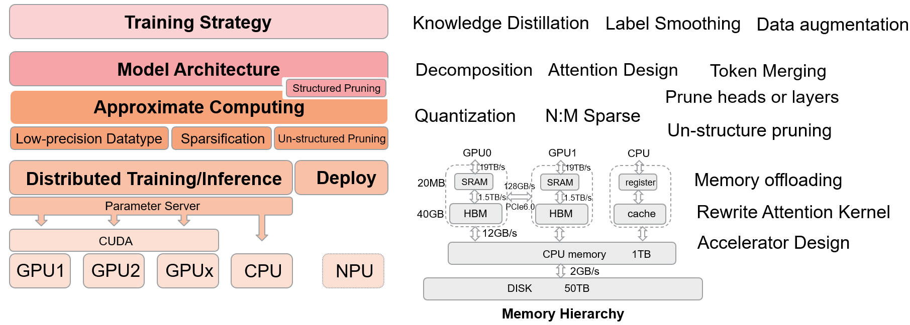

# EfficientPaper
Pruning, Quantization and efficient-inference/training paper list.

## Table of Contents
- [EfficientPaper](#efficientpaper)
  - [Table of Contents](#table-of-contents)
  - [Getting Started](#getting-started)
  - [Optimization Hierarchy for LLM](#optimization-hierarchy-for-llm)
  - [:sparkles: Paper List](#paper-list)
    - [keyword](#keyword)
    - [year](year.md)
    - [publication](publication.md)
    - [instution](instution.md)
    - [author](authors.md)
  - [Reference](#reference)


## Getting Started
1. Add paper information by `./add_paper_info.sh` or  `./add_paper_info.sh <name>`
2. Run `./refresh_readme.sh`

<details><summary><b>sparsegpt.prototxt</b></summary>	
<p>

```
paper {
  title: "SparseGPT: Massive Language Models Can be Accurately Pruned in one-shot."
  abbr: "SparseGPT"
  url: "https://arxiv.org/pdf/2301.00774.pdf"
  authors: "Elias Frantar"
  authors: "Dan Alistarh"
  institutions: "IST Austria"
  institutions: "Neural Magic"
}
pub {
  where: "arXiv"
  year: 2023
}
code {
  type: "Pytorch"
  url: "https://github.com/IST-DASLab/sparsegpt"
}
note {
  url: "SparseGPT.md"
}
keyword {
  words: "sparsity"
}
```

</p>
</details>

## Optimization Hierarchy for LLM

<p align="center">
  
</p>
