

### author

 

<b>Aaron Courville</b>
 

| Meta | Title | Cover | Publish | Code | Note |
|:-----|:------|:------|:--------|:-----|:-----|
| [FoX](./meta/2025/FoX.prototxt) | [Forgetting Transformer: Softmax Attention with a Forget Gate](http://arxiv.org/abs/2503.02130v2) |  |  |  | [note](./notes/2025/FoX/note.md) |
| [ACP](./meta/2025/ACP.prototxt) | [Adaptive Computation Pruning for the Forgetting Transformer](http://arxiv.org/abs/2504.06949v1) |  |  |  | [note](./notes/2025/ACP/note.md) |
| [MoR](./meta/2025/MoR.prototxt) | [Mixture-of-Recursions: Learning Dynamic Recursive Depths for Adaptive Token-Level Computation](http://arxiv.org/abs/2507.10524v1) |  |  |  | [note](./notes/2025/MoR/note.md) |

<b>Abhay Gupta</b>
 

| Meta | Title | Cover | Publish | Code | Note |
|:-----|:------|:------|:--------|:-----|:-----|
| [Sparse-IFT](./meta/2024/Sparse-IFT.prototxt) | [Sparse-IFT: Sparse Iso-FLOP Transformations for Maximizing Training Efficiency](http://arxiv.org/abs/2303.11525v3) |  |  |  | [note](./notes/2024/Sparse-IFT/note.md) |
| [m](./meta/2024/ULY1AZGY.prototxt) | [Enabling High-Sparsity Foundational Llama Models with Efficient Pretraining and Deployment](http://arxiv.org/abs/2405.03594v1) |  |  |  | [note](./notes/2024/ULY1AZGY/note.md) |

<b>Adam Fisch</b>
 

| Meta | Title | Cover | Publish | Code | Note |
|:-----|:------|:------|:--------|:-----|:-----|
| [RecursiveTransformers](./meta/2025/RecursiveTransformers.prototxt) | [Relaxed Recursive Transformers: Effective Parameter Sharing with Layer-wise LoRA](http://arxiv.org/abs/2410.20672v3) |  |  |  | [note](./notes/2025/RecursiveTransformers/note.md) |
| [MoR](./meta/2025/MoR.prototxt) | [Mixture-of-Recursions: Learning Dynamic Recursive Depths for Adaptive Token-Level Computation](http://arxiv.org/abs/2507.10524v1) |  |  |  | [note](./notes/2025/MoR/note.md) |

<b>Aixin Liu</b>
 

| Meta | Title | Cover | Publish | Code | Note |
|:-----|:------|:------|:--------|:-----|:-----|
| [DeepSeek-V2](./meta/2024/DeepSeek-V2.prototxt) | [DeepSeek-V2: A Strong, Economical, and Efficient Mixture-of-Experts Language Model](http://arxiv.org/abs/2405.04434v5) |  |  |  | [note](./notes/2024/DeepSeek-V2/note.md) |
| [DeepSeek-V3](./meta/2024/DeepSeek-V3.prototxt) | [DeepSeek-V3 Technical Report](http://arxiv.org/abs/2412.19437v1) | 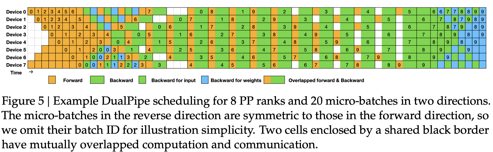 |  |  | [note](./notes/2024/DeepSeek-V3/note.md) |
| [DeepSeek-R1](./meta/2025/DeepSeek-R1.prototxt) | [DeepSeek-R1: Incentivizing Reasoning Capability in LLMs via Reinforcement Learning](http://arxiv.org/abs/2501.12948v1) |  |  |  | [note](./notes/2025/DeepSeek-R1/note.md) |

<b>Ajay Jaiswal</b>
 

| Meta | Title | Cover | Publish | Code | Note |
|:-----|:------|:------|:--------|:-----|:-----|
| [Essential Sparsity](./meta/2023/EssentialSparsity.prototxt) | [The Emergence of Essential Sparsity in Large Pre-trained Models: The Weights that Matter](https://arxiv.org/abs/2306.03805) |  |  |  |  |
| [LLM-KICK](./meta/2024/VB8C61V6.prototxt) | [Compressing LLMs: The Truth is Rarely Pure and Never Simple](http://arxiv.org/abs/2310.01382v2) |  |  |  | [note](./notes/2024/VB8C61V6/note.md) |

<b>Amir Gholami</b>
 

| Meta | Title | Cover | Publish | Code | Note |
|:-----|:------|:------|:--------|:-----|:-----|
| [FisherPruning](./meta/2022/fisherpruning.prototxt) | [A Fast Post-Training Pruning Framework for Transformers](http://arxiv.org/abs/2204.09656v2) |  |  |  | [note](./notes/2022/fisherpruning/note.md) |
| [SqueezeLLM](./meta/2024/SqueezeLLM.prototxt) | [SqueezeLLM: Dense-and-Sparse Quantization](http://arxiv.org/abs/2306.07629) |  |  |  | [note](./notes/2024/SqueezeLLM/note.md) |
| [KVQuant](./meta/2024/KVQuant.prototxt) | [KVQuant: Towards 10 Million Context Length LLM Inference with KV Cache Quantization](http://arxiv.org/abs/2401.18079) | 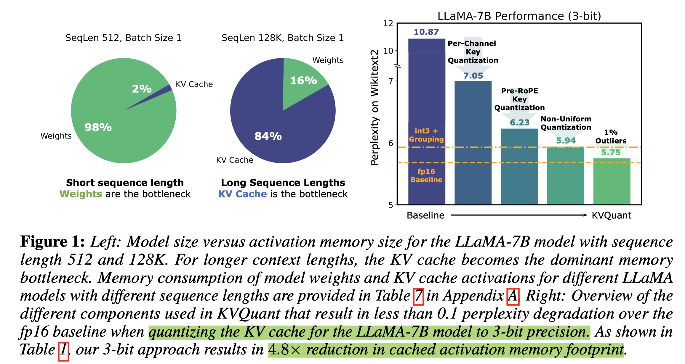 |  |  | [note](./notes/2024/KVQuant/note.md) |

<b>Amir H. Abdi</b>
 

| Meta | Title | Cover | Publish | Code | Note |
|:-----|:------|:------|:--------|:-----|:-----|
| [MInference](./meta/2024/MInference.prototxt) | [MInference 1.0: Accelerating Pre-filling for Long-Context LLMs via Dynamic Sparse Attention](http://arxiv.org/abs/2407.02490v1) |  |  |  | [note](./notes/2024/MInference/note.md) |
| [SCBench](./meta/2024/SCBench.prototxt) | [SCBench: A KV Cache-Centric Analysis of Long-Context Methods](http://arxiv.org/abs/2412.10319v2) |  |  |  | [note](./notes/2024/SCBench/note.md) |
| [MMInference](./meta/2025/MMInference.prototxt) | [MMInference: Accelerating Pre-filling for Long-Context VLMs via Modality-Aware Permutation Sparse Attention](https://openreview.net/forum?id=me6PfbATWM) |  |  |  | [note](./notes/2025/MMInference/note.md) |

<b>André F. T. Martins</b>
 

| Meta | Title | Cover | Publish | Code | Note |
|:-----|:------|:------|:--------|:-----|:-----|
| [m](./meta/2023/68I8KKBV.prototxt) | [Efficient Methods for Natural Language Processing: A Survey](https://arxiv.org/abs/2209.00099) |  |  |  |  |
| [AdaSplash](./meta/2025/AdaSplash.prototxt) | [AdaSplash: Adaptive Sparse Flash Attention](http://arxiv.org/abs/2502.12082) |  |  |  | [note](./notes/2025/AdaSplash/note.md) |

<b>Ao Sun</b>
 

| Meta | Title | Cover | Publish | Code | Note |
|:-----|:------|:------|:--------|:-----|:-----|
| [InfLLM-V2](./meta/2025/InfLLM-V2.prototxt) | [InfLLM-V2: Dense-Sparse Switchable Attention for Seamless Short-to-Long Adaptation](http://arxiv.org/abs/2509.24663v1) |  |  |  | [note](./notes/2025/InfLLM-V2/note.md) |
| [MiniCPM4](./meta/2025/MiniCPM4.prototxt) | [MiniCPM4: Ultra-Efficient LLMs on End Devices](http://arxiv.org/abs/2506.07900v1) |  |  |  | [note](./notes/2025/MiniCPM4/note.md) |

<b>Aohan Zeng</b>
 

| Meta | Title | Cover | Publish | Code | Note |
|:-----|:------|:------|:--------|:-----|:-----|
| [LongBench](./meta/2024/LongBench.prototxt) | [LongBench: A Bilingual, Multitask Benchmark for Long Context Understanding](http://arxiv.org/abs/2308.14508v2) |  |  |  | [note](./notes/2024/LongBench/note.md) |
| [GLM-4.5](./meta/2025/GLM-4.5.prototxt) | [GLM-4.5: Agentic, Reasoning, and Coding (ARC) Foundation Models](http://arxiv.org/abs/2508.06471v1) |  |  |  | [note](./notes/2025/GLM-4.5/note.md) |

<b>Aojun Zhou</b>
 

| Meta | Title | Cover | Publish | Code | Note |
|:-----|:------|:------|:--------|:-----|:-----|
| [SR-STE](./meta/2021/sr-ste.prototxt) | [Learning N:M Fine-grained Structured Sparse Neural Networks From Scratch](https://openreview.net/forum?id=K9bw7vqp_s) |  |  |  |  |
| [STA](./meta/2022/44KWQAWO.prototxt) | [An Algorithm-Hardware Co-Optimized Framework for Accelerating N:M Sparse Transformers](https://arxiv.org/abs/2208.06118) |  |  |  |  |
| [SPP](./meta/2024/SPP.prototxt) | [SPP: Sparsity-Preserved Parameter-Efficient Fine-Tuning for Large Language Models](http://arxiv.org/abs/2405.16057v1) |  |  |  | [note](./notes/2024/SPP/note.md) |

<b>Aonian Li</b>
 

| Meta | Title | Cover | Publish | Code | Note |
|:-----|:------|:------|:--------|:-----|:-----|
| [MiniMax-01](./meta/2025/MiniMax-01.prototxt) | [MiniMax-01: Scaling Foundation Models with Lightning Attention](http://arxiv.org/abs/2501.08313v1) |  |  |  | [note](./notes/2025/MiniMax-01/note.md) |
| [MiniMax-M1](./meta/2025/MiniMax-M1.prototxt) | [MiniMax-M1: Scaling Test-Time Compute Efficiently with Lightning Attention](http://arxiv.org/abs/2506.13585v1) |  |  |  | [note](./notes/2025/MiniMax-M1/note.md) |

<b>Arvind Krishnamurthy</b>
 

| Meta | Title | Cover | Publish | Code | Note |
|:-----|:------|:------|:--------|:-----|:-----|
| [NanoFlow](./meta/2025/NanoFlow.prototxt) | [NanoFlow: Towards Optimal Large Language Model Serving Throughput](http://arxiv.org/abs/2408.12757v2) |  |  |  | [note](./notes/2025/NanoFlow/note.md) |
| [FlashInfer](./meta/2025/FlashInfer.prototxt) | [FlashInfer: Efficient and Customizable Attention Engine for LLM Inference Serving](http://arxiv.org/abs/2501.01005v2) |  |  |  | [note](./notes/2025/FlashInfer/note.md) |

<b>Ashish Panwar</b>
 

| Meta | Title | Cover | Publish | Code | Note |
|:-----|:------|:------|:--------|:-----|:-----|
| [Vidur](./meta/2024/Vidur.prototxt) | [Vidur: A Large-Scale Simulation Framework For LLM Inference](http://arxiv.org/abs/2405.05465v2) |  |  |  | [note](./notes/2024/Vidur/note.md) |
| [POD-Attention](./meta/2025/POD-Attention.prototxt) | [POD-Attention: Unlocking Full Prefill-Decode Overlap for Faster LLM Inference](http://arxiv.org/abs/2410.18038v2) |  |  |  | [note](./notes/2025/POD-Attention/note.md) |
| [vAttention](./meta/2025/vAttention.prototxt) | [vAttention: Dynamic Memory Management for Serving LLMs without PagedAttention](http://arxiv.org/abs/2405.04437v3) |  |  |  | [note](./notes/2025/vAttention/note.md) |

<b>Bairu Hou</b>
 

| Meta | Title | Cover | Publish | Code | Note |
|:-----|:------|:------|:--------|:-----|:-----|
| [IFPruning](./meta/2025/IFPruning.prototxt) | [Instruction-Following Pruning for Large Language Models](http://arxiv.org/abs/2501.02086v2) |  |  |  | [note](./notes/2025/IFPruning/note.md) |
| [KVLink](./meta/2025/KVLink.prototxt) | [KVLink: Accelerating Large Language Models via Efficient KV Cache Reuse](http://arxiv.org/abs/2502.16002v1) |  |  |  | [note](./notes/2025/KVLink/note.md) |

<b>Bangwei Gong</b>
 

| Meta | Title | Cover | Publish | Code | Note |
|:-----|:------|:------|:--------|:-----|:-----|
| [MiniMax-01](./meta/2025/MiniMax-01.prototxt) | [MiniMax-01: Scaling Foundation Models with Lightning Attention](http://arxiv.org/abs/2501.08313v1) |  |  |  | [note](./notes/2025/MiniMax-01/note.md) |
| [MiniMax-M1](./meta/2025/MiniMax-M1.prototxt) | [MiniMax-M1: Scaling Test-Time Compute Efficiently with Lightning Attention](http://arxiv.org/abs/2506.13585v1) |  |  |  | [note](./notes/2025/MiniMax-M1/note.md) |

<b>Baris Kasikci</b>
 

| Meta | Title | Cover | Publish | Code | Note |
|:-----|:------|:------|:--------|:-----|:-----|
| [Quest](./meta/2024/Quest.prototxt) | [Quest: Query-Aware Sparsity for Efficient Long-Context LLM Inference](http://arxiv.org/abs/2406.10774) |  |  |  | [note](./notes/2024/Quest/note.md) |
| [NanoFlow](./meta/2025/NanoFlow.prototxt) | [NanoFlow: Towards Optimal Large Language Model Serving Throughput](http://arxiv.org/abs/2408.12757v2) |  |  |  | [note](./notes/2025/NanoFlow/note.md) |
| [FlashInfer](./meta/2025/FlashInfer.prototxt) | [FlashInfer: Efficient and Customizable Attention Engine for LLM Inference Serving](http://arxiv.org/abs/2501.01005v2) |  |  |  | [note](./notes/2025/FlashInfer/note.md) |

<b>Bei Feng</b>
 

| Meta | Title | Cover | Publish | Code | Note |
|:-----|:------|:------|:--------|:-----|:-----|
| [DeepSeek-V2](./meta/2024/DeepSeek-V2.prototxt) | [DeepSeek-V2: A Strong, Economical, and Efficient Mixture-of-Experts Language Model](http://arxiv.org/abs/2405.04434v5) |  |  |  | [note](./notes/2024/DeepSeek-V2/note.md) |
| [DeepSeek-V3](./meta/2024/DeepSeek-V3.prototxt) | [DeepSeek-V3 Technical Report](http://arxiv.org/abs/2412.19437v1) |  |  |  | [note](./notes/2024/DeepSeek-V3/note.md) |
| [DeepSeek-R1](./meta/2025/DeepSeek-R1.prototxt) | [DeepSeek-R1: Incentivizing Reasoning Capability in LLMs via Reinforcement Learning](http://arxiv.org/abs/2501.12948v1) |  |  |  | [note](./notes/2025/DeepSeek-R1/note.md) |

<b>Beidi Chen</b>
 

| Meta | Title | Cover | Publish | Code | Note |
|:-----|:------|:------|:--------|:-----|:-----|
| [Deja Vu](./meta/2023/dejavu.prototxt) | [Deja Vu: Contextual Sparsity for Efficient LLMs at Inference Time](https://openreview.net/forum?id=wIPIhHd00i) |  |  |  |  |
| [H2O](./meta/2023/H2O.prototxt) | [H$_2$O: Heavy-Hitter Oracle for Efficient Generative Inference of Large Language Models](http://arxiv.org/abs/2306.14048) |  |  |  | [note](./notes/2023/H2O/note.md) |
| [streaming-llm](./meta/2024/streaming-llm.prototxt) | [Efficient Streaming Language Models with Attention Sinks](http://arxiv.org/abs/2309.17453v4) |  |  |  | [note](./notes/2024/streaming-llm/note.md) |
| [KIVI](./meta/2024/KIVI.prototxt) | [KIVI: A Tuning-Free Asymmetric 2bit Quantization for KV Cache](http://arxiv.org/abs/2402.02750v2) |  |  |  | [note](./notes/2024/KIVI/note.md) |
| [ShadowKV](./meta/2025/ShadowKV.prototxt) | [ShadowKV: KV Cache in Shadows for High-Throughput Long-Context LLM Inference](https://openreview.net/forum?id=oa7MYAO6h6) |  |  |  | [note](./notes/2025/ShadowKV/note.md) |

<b>Bin Cui</b>
 

| Meta | Title | Cover | Publish | Code | Note |
|:-----|:------|:------|:--------|:-----|:-----|
| [PQCache](./meta/2025/PQCache.prototxt) | [PQCache: Product Quantization-based KVCache for Long Context LLM Inference](http://arxiv.org/abs/2407.12820v2) |  |  |  | [note](./notes/2025/PQCache/note.md) |
| [SALE](./meta/2025/SALE.prototxt) | [SALE : Low-bit Estimation for Efficient Sparse Attention in Long-context LLM Prefilling](http://arxiv.org/abs/2505.24179v1) |  |  |  | [note](./notes/2025/SALE/note.md) |

<b>Bin Gao</b>
 

| Meta | Title | Cover | Publish | Code | Note |
|:-----|:------|:------|:--------|:-----|:-----|
| [CachedAttention](./meta/2024/CachedAttention.prototxt) | [Cost-Efficient Large Language Model Serving for Multi-turn Conversations with CachedAttention](http://arxiv.org/abs/2403.19708v3) |  |  |  | [note](./notes/2024/CachedAttention/note.md) |
| [AdaSkip](./meta/2025/AdaSkip.prototxt) | [AdaSkip: Adaptive Sublayer Skipping for Accelerating Long-Context LLM Inference](http://arxiv.org/abs/2501.02336v1) | 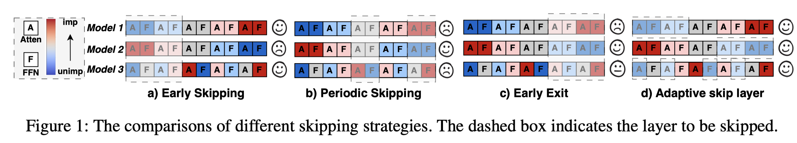 |  |  | [note](./notes/2025/AdaSkip/note.md) |

<b>Bin Lin</b>
 

| Meta | Title | Cover | Publish | Code | Note |
|:-----|:------|:------|:--------|:-----|:-----|
| [nmSPARSE](./meta/2023/nmSPARSE.prototxt) | [Efficient GPU Kernels for N:M-Sparse Weights in Deep Learning](https://proceedings.mlsys.org/paper_files/paper/2023/file/a10deb4d5227a8ea307ea8ff3cb712f4-Paper-mlsys2023.pdf) |  |  |  |  |
| [DistAttention](./meta/2024/DistAttention.prototxt) | [Infinite-LLM: Efficient LLM Service for Long Context with DistAttention and Distributed KVCache](http://arxiv.org/abs/2401.02669v2) |  |  |  | [note](./notes/2024/DistAttention/note.md) |

<b>Bin Wang</b>
 

| Meta | Title | Cover | Publish | Code | Note |
|:-----|:------|:------|:--------|:-----|:-----|
| [DeepSeek-V2](./meta/2024/DeepSeek-V2.prototxt) | [DeepSeek-V2: A Strong, Economical, and Efficient Mixture-of-Experts Language Model](http://arxiv.org/abs/2405.04434v5) |  |  |  | [note](./notes/2024/DeepSeek-V2/note.md) |
| [PanguUltra](./meta/2025/PanguUltra.prototxt) | [Pangu Ultra: Pushing the Limits of Dense Large Language Models on Ascend NPUs](http://arxiv.org/abs/2504.07866v2) |  |  |  | [note](./notes/2025/PanguUltra/note.md) |
| [Step-3](./meta/2025/Step-3.prototxt) | [Step-3 is Large yet Affordable: Model-system Co-design for Cost-effective Decoding](http://arxiv.org/abs/2507.19427v1) |  |  |  | [note](./notes/2025/Step-3/note.md) |

<b>Bing Xue</b>
 

| Meta | Title | Cover | Publish | Code | Note |
|:-----|:------|:------|:--------|:-----|:-----|
| [DeepSeek-V3](./meta/2024/DeepSeek-V3.prototxt) | [DeepSeek-V3 Technical Report](http://arxiv.org/abs/2412.19437v1) |  |  |  | [note](./notes/2024/DeepSeek-V3/note.md) |
| [DeepSeek-R1](./meta/2025/DeepSeek-R1.prototxt) | [DeepSeek-R1: Incentivizing Reasoning Capability in LLMs via Reinforcement Learning](http://arxiv.org/abs/2501.12948v1) |  |  |  | [note](./notes/2025/DeepSeek-R1/note.md) |

<b>Bingxuan Wang</b>
 

| Meta | Title | Cover | Publish | Code | Note |
|:-----|:------|:------|:--------|:-----|:-----|
| [DeepSeek-V2](./meta/2024/DeepSeek-V2.prototxt) | [DeepSeek-V2: A Strong, Economical, and Efficient Mixture-of-Experts Language Model](http://arxiv.org/abs/2405.04434v5) |  |  |  | [note](./notes/2024/DeepSeek-V2/note.md) |
| [DeepSeek-V3](./meta/2024/DeepSeek-V3.prototxt) | [DeepSeek-V3 Technical Report](http://arxiv.org/abs/2412.19437v1) |  |  |  | [note](./notes/2024/DeepSeek-V3/note.md) |
| [DeepSeek-R1](./meta/2025/DeepSeek-R1.prototxt) | [DeepSeek-R1: Incentivizing Reasoning Capability in LLMs via Reinforcement Learning](http://arxiv.org/abs/2501.12948v1) |  |  |  | [note](./notes/2025/DeepSeek-R1/note.md) |

<b>Bo Yang</b>
 

| Meta | Title | Cover | Publish | Code | Note |
|:-----|:------|:------|:--------|:-----|:-----|
| [MiniMax-01](./meta/2025/MiniMax-01.prototxt) | [MiniMax-01: Scaling Foundation Models with Lightning Attention](http://arxiv.org/abs/2501.08313v1) |  |  |  | [note](./notes/2025/MiniMax-01/note.md) |
| [MiniMax-M1](./meta/2025/MiniMax-M1.prototxt) | [MiniMax-M1: Scaling Test-Time Compute Efficiently with Lightning Attention](http://arxiv.org/abs/2506.13585v1) |  |  |  | [note](./notes/2025/MiniMax-M1/note.md) |

<b>Bo Zheng</b>
 

| Meta | Title | Cover | Publish | Code | Note |
|:-----|:------|:------|:--------|:-----|:-----|
| [GatedAttention](./meta/2025/GatedAttention.prototxt) | [Gated Attention for Large Language Models: Non-linearity, Sparsity, and Attention-Sink-Free](http://arxiv.org/abs/2505.06708v1) |  |  |  | [note](./notes/2025/GatedAttention/note.md) |
| [Qwen3](./meta/2025/Qwen3.prototxt) | [Qwen3 Technical Report](http://arxiv.org/abs/2505.09388v1) |  |  |  | [note](./notes/2025/Qwen3/note.md) |

<b>Bochao Wu</b>
 

| Meta | Title | Cover | Publish | Code | Note |
|:-----|:------|:------|:--------|:-----|:-----|
| [DeepSeek-V3](./meta/2024/DeepSeek-V3.prototxt) | [DeepSeek-V3 Technical Report](http://arxiv.org/abs/2412.19437v1) |  |  |  | [note](./notes/2024/DeepSeek-V3/note.md) |
| [DeepSeek-R1](./meta/2025/DeepSeek-R1.prototxt) | [DeepSeek-R1: Incentivizing Reasoning Capability in LLMs via Reinforcement Learning](http://arxiv.org/abs/2501.12948v1) |  |  |  | [note](./notes/2025/DeepSeek-R1/note.md) |

<b>Bohan Zhuang</b>
 

| Meta | Title | Cover | Publish | Code | Note |
|:-----|:------|:------|:--------|:-----|:-----|
| [ZipCache](./meta/2024/ZipCache.prototxt) | [ZipCache: Accurate and Efficient KV Cache Quantization with Salient Token Identification](http://arxiv.org/abs/2405.14256v1) |  |  |  | [note](./notes/2024/ZipCache/note.md) |
| [MiniCache](./meta/2024/MiniCache.prototxt) | [MiniCache: KV Cache Compression in Depth Dimension for Large Language Models](http://arxiv.org/abs/2405.14366v2) |  |  |  | [note](./notes/2024/MiniCache/note.md) |
| [ZipVL](./meta/2024/ZipVL.prototxt) | [ZipVL: Efficient Large Vision-Language Models with Dynamic Token Sparsification](http://arxiv.org/abs/2410.08584v2) |  |  |  | [note](./notes/2024/ZipVL/note.md) |

<b>Boji Shan</b>
 

| Meta | Title | Cover | Publish | Code | Note |
|:-----|:------|:------|:--------|:-----|:-----|
| [MiniMax-01](./meta/2025/MiniMax-01.prototxt) | [MiniMax-01: Scaling Foundation Models with Lightning Attention](http://arxiv.org/abs/2501.08313v1) |  |  |  | [note](./notes/2025/MiniMax-01/note.md) |
| [MiniMax-M1](./meta/2025/MiniMax-M1.prototxt) | [MiniMax-M1: Scaling Test-Time Compute Efficiently with Lightning Attention](http://arxiv.org/abs/2506.13585v1) |  |  |  | [note](./notes/2025/MiniMax-M1/note.md) |

<b>Bowen Xu</b>
 

| Meta | Title | Cover | Publish | Code | Note |
|:-----|:------|:------|:--------|:-----|:-----|
| [LaRoSA](./meta/2025/LaRoSA.prototxt) | [La RoSA: Enhancing LLM Efficiency via Layerwise Rotated Sparse Activation](http://arxiv.org/abs/2507.01299v1) |  |  |  | [note](./notes/2025/LaRoSA/note.md) |
| [GLM-4.5](./meta/2025/GLM-4.5.prototxt) | [GLM-4.5: Agentic, Reasoning, and Coding (ARC) Foundation Models](http://arxiv.org/abs/2508.06471v1) |  |  |  | [note](./notes/2025/GLM-4.5/note.md) |

<b>Chang Chen</b>
 

| Meta | Title | Cover | Publish | Code | Note |
|:-----|:------|:------|:--------|:-----|:-----|
| [Centauri](./meta/2024/Centauri.prototxt) | [Centauri: Enabling Efficient Scheduling for Communication-Computation Overlap in Large Model Training via Communication Partitioning](https://dl.acm.org/doi/10.1145/3620666.3651379) |  |  |  | [note](./notes/2024/Centauri/note.md) |
| [SampleAttention](./meta/2024/SampleAttention.prototxt) | [SampleAttention: Near-Lossless Acceleration of Long Context LLM Inference with Adaptive Structured Sparse Attention](http://arxiv.org/abs/2406.15486v2) |  |  |  | [note](./notes/2024/SampleAttention/note.md) |

<b>Chang Gao</b>
 

| Meta | Title | Cover | Publish | Code | Note |
|:-----|:------|:------|:--------|:-----|:-----|
| [m](./meta/2024/0Y41U1N2.prototxt) | [Beyond 2:4: exploring V:N:M sparsity for efficient transformer inference on GPUs](http://arxiv.org/abs/2410.16135v1) | 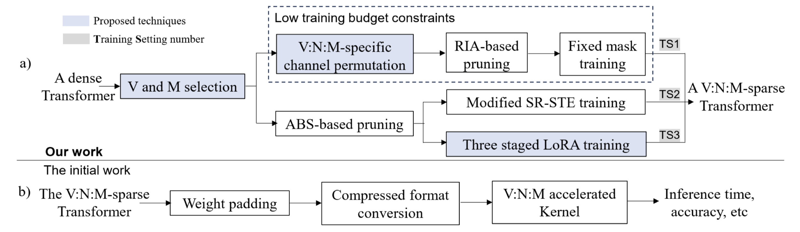 |  |  | [note](./notes/2024/0Y41U1N2/note.md) |
| [DeltaLLM](./meta/2025/DeltaLLM.prototxt) | [DeltaLLM: A Training-Free Framework Exploiting Temporal Sparsity for Efficient Edge LLM Inference](http://arxiv.org/abs/2507.19608v1) |  |  |  | [note](./notes/2025/DeltaLLM/note.md) |
| [Qwen3](./meta/2025/Qwen3.prototxt) | [Qwen3 Technical Report](http://arxiv.org/abs/2505.09388v1) |  |  |  | [note](./notes/2025/Qwen3/note.md) |

<b>Chao Wang</b>
 

| Meta | Title | Cover | Publish | Code | Note |
|:-----|:------|:------|:--------|:-----|:-----|
| [07NWF4VE](./meta/2025/07NWF4VE.prototxt) | [Accelerating LLM Inference Throughput via Asynchronous KV Cache Prefetching](http://arxiv.org/abs/2504.06319v1) | 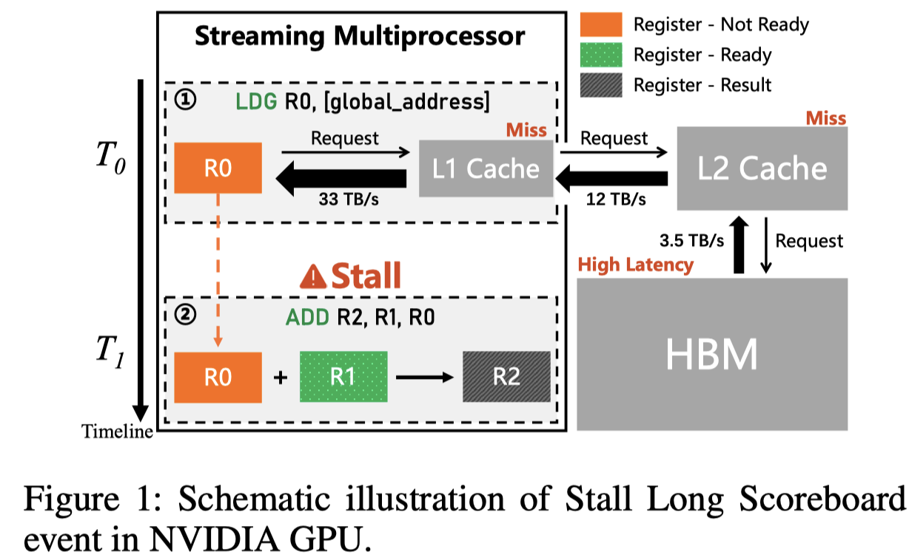 |  |  | [note](./notes/2025/07NWF4VE/note.md) |
| [MiniMax-M1](./meta/2025/MiniMax-M1.prototxt) | [MiniMax-M1: Scaling Test-Time Compute Efficiently with Lightning Attention](http://arxiv.org/abs/2506.13585v1) |  |  |  | [note](./notes/2025/MiniMax-M1/note.md) |

<b>Chao Yang</b>
 

| Meta | Title | Cover | Publish | Code | Note |
|:-----|:------|:------|:--------|:-----|:-----|
| [Centauri](./meta/2024/Centauri.prototxt) | [Centauri: Enabling Efficient Scheduling for Communication-Computation Overlap in Large Model Training via Communication Partitioning](https://dl.acm.org/doi/10.1145/3620666.3651379) |  |  |  | [note](./notes/2024/Centauri/note.md) |
| [SampleAttention](./meta/2024/SampleAttention.prototxt) | [SampleAttention: Near-Lossless Acceleration of Long Context LLM Inference with Adaptive Structured Sparse Attention](http://arxiv.org/abs/2406.15486v2) |  |  |  | [note](./notes/2024/SampleAttention/note.md) |

<b>Chaofan Tao</b>
 

| Meta | Title | Cover | Publish | Code | Note |
|:-----|:------|:------|:--------|:-----|:-----|
| [SIMPLE](./meta/2023/simple.prototxt) | [Structured Pruning for Efficient Generative Pre-trained Language Models](https://aclanthology.org/2023.findings-acl.692.pdf) |  |  |  | [note](./notes/2023/simple/index.md) |
| [UNComp](./meta/2025/UNComp.prototxt) | [UNComp: Can Matrix Entropy Uncover Sparsity? -- A Compressor Design from an Uncertainty-Aware Perspective](http://arxiv.org/abs/2410.03090v2) |  |  |  | [note](./notes/2025/UNComp/note.md) |

<b>Chaojun Xiao</b>
 

| Meta | Title | Cover | Publish | Code | Note |
|:-----|:------|:------|:--------|:-----|:-----|
| [ReLU2](./meta/2024/ReLU2.prototxt) | [ReLU2 Wins: Discovering Efficient Activation Functions for Sparse LLMs](https://arxiv.org/abs/2402.03804) |  |  |  | [note](./notes/2024/ReLU2/note.md) |
| [BlockFFN](./meta/2025/BlockFFN.prototxt) | [BlockFFN: Towards End-Side Acceleration-Friendly Mixture-of-Experts with Chunk-Level Activation Sparsity](http://arxiv.org/abs/2507.08771v1) |  |  |  | [note](./notes/2025/BlockFFN/note.md) |
| [SparsingLaw](./meta/2025/SparsingLaw.prototxt) | [Sparsing Law: Towards Large Language Models with Greater Activation Sparsity](https://openreview.net/forum?id=SBUc5wirM8) |  |  |  | [note](./notes/2025/SparsingLaw/note.md) |
| [InfLLM-V2](./meta/2025/InfLLM-V2.prototxt) | [InfLLM-V2: Dense-Sparse Switchable Attention for Seamless Short-to-Long Adaptation](http://arxiv.org/abs/2509.24663v1) |  |  |  | [note](./notes/2025/InfLLM-V2/note.md) |
| [MiniCPM4](./meta/2025/MiniCPM4.prototxt) | [MiniCPM4: Ultra-Efficient LLMs on End Devices](http://arxiv.org/abs/2506.07900v1) |  |  |  | [note](./notes/2025/MiniCPM4/note.md) |

<b>Chen Chen</b>
 

| Meta | Title | Cover | Publish | Code | Note |
|:-----|:------|:------|:--------|:-----|:-----|
| [ProSparse](./meta/2024/ProSparse.prototxt) | [ProSparse: Introducing and Enhancing Intrinsic Activation Sparsity within Large Language Models](https://arxiv.org/abs/2402.13516) | 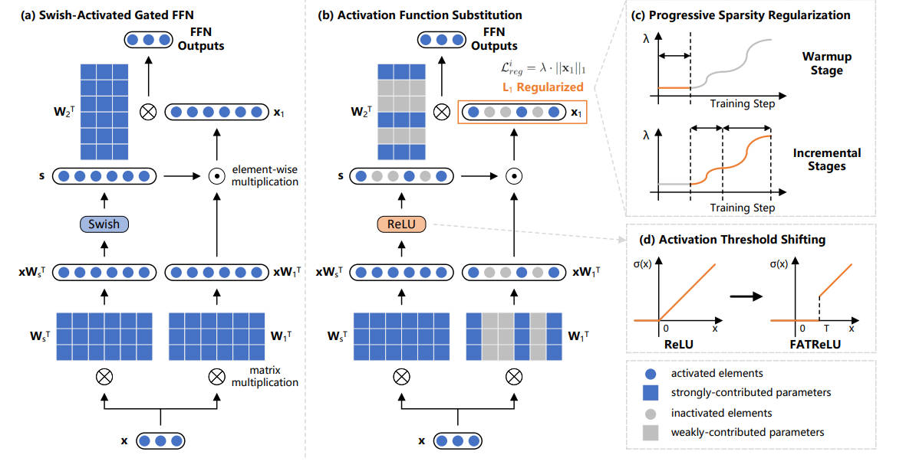 |  |  | [note](./notes/2024/ProSparse/note.md) |
| [RetrievalAttention](./meta/2025/RetrievalAttention.prototxt) | [RetrievalAttention: Accelerating Long-Context LLM Inference via Vector Retrieval](http://arxiv.org/abs/2409.10516v3) |  |  |  | [note](./notes/2025/RetrievalAttention/note.md) |
| [AttentionPredictor](./meta/2025/AttentionPredictor.prototxt) | [AttentionPredictor: Temporal Pattern Matters for Efficient LLM Inference](http://arxiv.org/abs/2502.04077v1) |  |  |  | [note](./notes/2025/AttentionPredictor/note.md) |
| [PPCL](./meta/2025/PPCL.prototxt) | [Pluggable Pruning with Contiguous Layer Distillation for Diffusion Transformers](http://arxiv.org/abs/2511.16156v1) |  |  |  | [note](./notes/2025/PPCL/note.md) |

<b>Chen Zhang</b>
 

| Meta | Title | Cover | Publish | Code | Note |
|:-----|:------|:------|:--------|:-----|:-----|
| [DistAttention](./meta/2024/DistAttention.prototxt) | [Infinite-LLM: Efficient LLM Service for Long Context with DistAttention and Distributed KVCache](http://arxiv.org/abs/2401.02669v2) |  |  |  | [note](./notes/2024/DistAttention/note.md) |
| [ZigZagKV](./meta/2024/ZigZagKV.prototxt) | [ZigZagkv: Dynamic KV Cache Compression for Long-context Modeling based on Layer Uncertainty](http://arxiv.org/abs/2412.09036v1) |  |  |  | [note](./notes/2024/ZigZagKV/note.md) |

<b>Chenfeng Xu</b>
 

| Meta | Title | Cover | Publish | Code | Note |
|:-----|:------|:------|:--------|:-----|:-----|
| [SVG](./meta/2025/SVG.prototxt) | [Sparse VideoGen: Accelerating Video Diffusion Transformers with Spatial-Temporal Sparsity](http://arxiv.org/abs/2502.01776v2) |  |  |  | [note](./notes/2025/SVG/note.md) |
| [SVG2](./meta/2025/SVG2.prototxt) | [Sparse VideoGen2: Accelerate Video Generation with Sparse Attention via Semantic-Aware Permutation](http://arxiv.org/abs/2505.18875v3) |  |  |  | [note](./notes/2025/SVG2/note.md) |

<b>Cheng Li</b>
 

| Meta | Title | Cover | Publish | Code | Note |
|:-----|:------|:------|:--------|:-----|:-----|
| [MILLION](./meta/2025/MILLION.prototxt) | [MILLION: Mastering Long-Context LLM Inference Via Outlier-Immunized KV Product Quantization](http://arxiv.org/abs/2504.03661v2) |  |  |  | [note](./notes/2025/MILLION/note.md) |
| [HATA](./meta/2025/HATA.prototxt) | [HATA: Trainable and Hardware-Efficient Hash-Aware Top-k Attention for Scalable Large Model Inference](http://arxiv.org/abs/2506.02572v1) |  |  |  | [note](./notes/2025/HATA/note.md) |

<b>Cheng Zhu</b>
 

| Meta | Title | Cover | Publish | Code | Note |
|:-----|:------|:------|:--------|:-----|:-----|
| [MiniMax-01](./meta/2025/MiniMax-01.prototxt) | [MiniMax-01: Scaling Foundation Models with Lightning Attention](http://arxiv.org/abs/2501.08313v1) |  |  |  | [note](./notes/2025/MiniMax-01/note.md) |
| [MiniMax-M1](./meta/2025/MiniMax-M1.prototxt) | [MiniMax-M1: Scaling Test-Time Compute Efficiently with Lightning Attention](http://arxiv.org/abs/2506.13585v1) |  |  |  | [note](./notes/2025/MiniMax-M1/note.md) |

<b>Chengda Lu</b>
 

| Meta | Title | Cover | Publish | Code | Note |
|:-----|:------|:------|:--------|:-----|:-----|
| [DeepSeek-V3](./meta/2024/DeepSeek-V3.prototxt) | [DeepSeek-V3 Technical Report](http://arxiv.org/abs/2412.19437v1) |  |  |  | [note](./notes/2024/DeepSeek-V3/note.md) |
| [DeepSeek-R1](./meta/2025/DeepSeek-R1.prototxt) | [DeepSeek-R1: Incentivizing Reasoning Capability in LLMs via Reinforcement Learning](http://arxiv.org/abs/2501.12948v1) |  |  |  | [note](./notes/2025/DeepSeek-R1/note.md) |

<b>Chenggang Zhao</b>
 

| Meta | Title | Cover | Publish | Code | Note |
|:-----|:------|:------|:--------|:-----|:-----|
| [DeepSeek-V2](./meta/2024/DeepSeek-V2.prototxt) | [DeepSeek-V2: A Strong, Economical, and Efficient Mixture-of-Experts Language Model](http://arxiv.org/abs/2405.04434v5) |  |  |  | [note](./notes/2024/DeepSeek-V2/note.md) |
| [DeepSeek-V3](./meta/2024/DeepSeek-V3.prototxt) | [DeepSeek-V3 Technical Report](http://arxiv.org/abs/2412.19437v1) |  |  |  | [note](./notes/2024/DeepSeek-V3/note.md) |
| [DeepSeekMoE](./meta/2024/DeepSeekMoE.prototxt) | [DeepSeekMoE: Towards Ultimate Expert Specialization in Mixture-of-Experts Language Models](http://arxiv.org/abs/2401.06066v1) |  |  |  | [note](./notes/2024/DeepSeekMoE/note.md) |
| [DeepSeek-R1](./meta/2025/DeepSeek-R1.prototxt) | [DeepSeek-R1: Incentivizing Reasoning Capability in LLMs via Reinforcement Learning](http://arxiv.org/abs/2501.12948v1) |  |  |  | [note](./notes/2025/DeepSeek-R1/note.md) |

<b>Chengqi Deng</b>
 

| Meta | Title | Cover | Publish | Code | Note |
|:-----|:------|:------|:--------|:-----|:-----|
| [DeepSeek-V3](./meta/2024/DeepSeek-V3.prototxt) | [DeepSeek-V3 Technical Report](http://arxiv.org/abs/2412.19437v1) |  |  |  | [note](./notes/2024/DeepSeek-V3/note.md) |
| [DeepSeekMoE](./meta/2024/DeepSeekMoE.prototxt) | [DeepSeekMoE: Towards Ultimate Expert Specialization in Mixture-of-Experts Language Models](http://arxiv.org/abs/2401.06066v1) |  |  |  | [note](./notes/2024/DeepSeekMoE/note.md) |
| [DeepSeek-R1](./meta/2025/DeepSeek-R1.prototxt) | [DeepSeek-R1: Incentivizing Reasoning Capability in LLMs via Reinforcement Learning](http://arxiv.org/abs/2501.12948v1) |  |  |  | [note](./notes/2025/DeepSeek-R1/note.md) |

<b>Chengquan Jiang</b>
 

| Meta | Title | Cover | Publish | Code | Note |
|:-----|:------|:------|:--------|:-----|:-----|
| [FLUX](./meta/2024/FLUX.prototxt) | [FLUX: Fast Software-based Communication Overlap On GPUs Through Kernel Fusion](http://arxiv.org/abs/2406.06858v5) |  |  |  | [note](./notes/2024/FLUX/note.md) |
| [CometSeed](./meta/2025/CometSeed.prototxt) | [Comet: Fine-grained Computation-communication Overlapping for Mixture-of-Experts](http://arxiv.org/abs/2502.19811v3) |  |  |  | [note](./notes/2025/CometSeed/note.md) |

<b>Chengruidong Zhang</b>
 

| Meta | Title | Cover | Publish | Code | Note |
|:-----|:------|:------|:--------|:-----|:-----|
| [MInference](./meta/2024/MInference.prototxt) | [MInference 1.0: Accelerating Pre-filling for Long-Context LLMs via Dynamic Sparse Attention](http://arxiv.org/abs/2407.02490v1) |  |  |  | [note](./notes/2024/MInference/note.md) |
| [SCBench](./meta/2024/SCBench.prototxt) | [SCBench: A KV Cache-Centric Analysis of Long-Context Methods](http://arxiv.org/abs/2412.10319v2) |  |  |  | [note](./notes/2024/SCBench/note.md) |
| [MMInference](./meta/2025/MMInference.prototxt) | [MMInference: Accelerating Pre-filling for Long-Context VLMs via Modality-Aware Permutation Sparse Attention](https://openreview.net/forum?id=me6PfbATWM) |  |  |  | [note](./notes/2025/MMInference/note.md) |
| [RetrievalAttention](./meta/2025/RetrievalAttention.prototxt) | [RetrievalAttention: Accelerating Long-Context LLM Inference via Vector Retrieval](http://arxiv.org/abs/2409.10516v3) |  |  |  | [note](./notes/2025/RetrievalAttention/note.md) |
| [LeanK](./meta/2025/LeanK.prototxt) | [LeanK: Learnable K Cache Channel Pruning for Efficient Decoding](http://arxiv.org/abs/2508.02215v1) |  |  |  | [note](./notes/2025/LeanK/note.md) |

<b>Chenyang Song</b>
 

| Meta | Title | Cover | Publish | Code | Note |
|:-----|:------|:------|:--------|:-----|:-----|
| [ProSparse](./meta/2024/ProSparse.prototxt) | [ProSparse: Introducing and Enhancing Intrinsic Activation Sparsity within Large Language Models](https://arxiv.org/abs/2402.13516) |  |  |  | [note](./notes/2024/ProSparse/note.md) |
| [ReLU2](./meta/2024/ReLU2.prototxt) | [ReLU2 Wins: Discovering Efficient Activation Functions for Sparse LLMs](https://arxiv.org/abs/2402.03804) |  |  |  | [note](./notes/2024/ReLU2/note.md) |
| [BlockFFN](./meta/2025/BlockFFN.prototxt) | [BlockFFN: Towards End-Side Acceleration-Friendly Mixture-of-Experts with Chunk-Level Activation Sparsity](http://arxiv.org/abs/2507.08771v1) |  |  |  | [note](./notes/2025/BlockFFN/note.md) |
| [SparsingLaw](./meta/2025/SparsingLaw.prototxt) | [Sparsing Law: Towards Large Language Models with Greater Activation Sparsity](https://openreview.net/forum?id=SBUc5wirM8) |  |  |  | [note](./notes/2025/SparsingLaw/note.md) |

<b>Chenyu Zhang</b>
 

| Meta | Title | Cover | Publish | Code | Note |
|:-----|:------|:------|:--------|:-----|:-----|
| [DeepSeek-V3](./meta/2024/DeepSeek-V3.prototxt) | [DeepSeek-V3 Technical Report](http://arxiv.org/abs/2412.19437v1) |  |  |  | [note](./notes/2024/DeepSeek-V3/note.md) |
| [DeepSeek-R1](./meta/2025/DeepSeek-R1.prototxt) | [DeepSeek-R1: Incentivizing Reasoning Capability in LLMs via Reinforcement Learning](http://arxiv.org/abs/2501.12948v1) |  |  |  | [note](./notes/2025/DeepSeek-R1/note.md) |

<b>Chong Ruan</b>
 

| Meta | Title | Cover | Publish | Code | Note |
|:-----|:------|:------|:--------|:-----|:-----|
| [DeepSeek-V2](./meta/2024/DeepSeek-V2.prototxt) | [DeepSeek-V2: A Strong, Economical, and Efficient Mixture-of-Experts Language Model](http://arxiv.org/abs/2405.04434v5) |  |  |  | [note](./notes/2024/DeepSeek-V2/note.md) |
| [DeepSeek-V3](./meta/2024/DeepSeek-V3.prototxt) | [DeepSeek-V3 Technical Report](http://arxiv.org/abs/2412.19437v1) |  |  |  | [note](./notes/2024/DeepSeek-V3/note.md) |
| [DeepSeekMoE](./meta/2024/DeepSeekMoE.prototxt) | [DeepSeekMoE: Towards Ultimate Expert Specialization in Mixture-of-Experts Language Models](http://arxiv.org/abs/2401.06066v1) |  |  |  | [note](./notes/2024/DeepSeekMoE/note.md) |
| [NSA](./meta/2025/NSA.prototxt) | [Native Sparse Attention: Hardware-Aligned and Natively Trainable Sparse Attention](http://arxiv.org/abs/2502.11089v1) |  |  |  | [note](./notes/2025/NSA/note.md) |
| [DeepSeek-R1](./meta/2025/DeepSeek-R1.prototxt) | [DeepSeek-R1: Incentivizing Reasoning Capability in LLMs via Reinforcement Learning](http://arxiv.org/abs/2501.12948v1) |  |  |  | [note](./notes/2025/DeepSeek-R1/note.md) |

<b>Christos Kozyrakis</b>
 

| Meta | Title | Cover | Publish | Code | Note |
|:-----|:------|:------|:--------|:-----|:-----|
| [SGLang](./meta/2024/SGLang.prototxt) | [SGLang: Efficient Execution of Structured Language Model Programs](http://arxiv.org/abs/2312.07104v2) |  |  |  | [note](./notes/2024/SGLang/note.md) |
| [LIMINAL](./meta/2025/LIMINAL.prototxt) | [Efficient LLM Inference: Bandwidth, Compute, Synchronization, and Capacity are all you need](http://arxiv.org/abs/2507.14397v1) |  |  |  | [note](./notes/2025/LIMINAL/note.md) |

<b>Chuang Gan</b>
 

| Meta | Title | Cover | Publish | Code | Note |
|:-----|:------|:------|:--------|:-----|:-----|
| [AWQ](./meta/2024/awq.prototxt) | [AWQ: Activation-aware Weight Quantization for LLM Compression and Acceleration](https://arxiv.org/abs/2306.00978) |  |  |  |  |
| [QServe](./meta/2024/QServer.prototxt) | [QServe: W4A8KV4 Quantization and System Co-design for Efficient LLM Serving](http://arxiv.org/abs/2405.04532v2) |  |  | [Pytorch](https://hanlab.mit.edu/projects/qserve) | [note](./notes/2024/QServer/note.md) |

<b>Chunhao Zhang</b>
 

| Meta | Title | Cover | Publish | Code | Note |
|:-----|:------|:------|:--------|:-----|:-----|
| [MiniMax-01](./meta/2025/MiniMax-01.prototxt) | [MiniMax-01: Scaling Foundation Models with Lightning Attention](http://arxiv.org/abs/2501.08313v1) |  |  |  | [note](./notes/2025/MiniMax-01/note.md) |
| [MiniMax-M1](./meta/2025/MiniMax-M1.prototxt) | [MiniMax-M1: Scaling Test-Time Compute Efficiently with Lightning Attention](http://arxiv.org/abs/2506.13585v1) |  |  |  | [note](./notes/2025/MiniMax-M1/note.md) |

<b>Clark Barrett</b>
 

| Meta | Title | Cover | Publish | Code | Note |
|:-----|:------|:------|:--------|:-----|:-----|
| [H2O](./meta/2023/H2O.prototxt) | [H$_2$O: Heavy-Hitter Oracle for Efficient Generative Inference of Large Language Models](http://arxiv.org/abs/2306.14048) |  |  |  | [note](./notes/2023/H2O/note.md) |
| [SGLang](./meta/2024/SGLang.prototxt) | [SGLang: Efficient Execution of Structured Language Model Programs](http://arxiv.org/abs/2312.07104v2) |  |  |  | [note](./notes/2024/SGLang/note.md) |

<b>Cody Hao Yu</b>
 

| Meta | Title | Cover | Publish | Code | Note |
|:-----|:------|:------|:--------|:-----|:-----|
| [PagedAttention](./meta/2023/PagedAttention.prototxt) | [Efficient Memory Management for Large Language Model Serving with PagedAttention](http://arxiv.org/abs/2309.06180v1) |  |  |  | [note](./notes/2023/PagedAttention/note.md) |
| [SGLang](./meta/2024/SGLang.prototxt) | [SGLang: Efficient Execution of Structured Language Model Programs](http://arxiv.org/abs/2312.07104v2) |  |  |  | [note](./notes/2024/SGLang/note.md) |

<b>Coleman Hooper</b>
 

| Meta | Title | Cover | Publish | Code | Note |
|:-----|:------|:------|:--------|:-----|:-----|
| [SqueezeLLM](./meta/2024/SqueezeLLM.prototxt) | [SqueezeLLM: Dense-and-Sparse Quantization](http://arxiv.org/abs/2306.07629) |  |  |  | [note](./notes/2024/SqueezeLLM/note.md) |
| [KVQuant](./meta/2024/KVQuant.prototxt) | [KVQuant: Towards 10 Million Context Length LLM Inference with KV Cache Quantization](http://arxiv.org/abs/2401.18079) |  |  |  | [note](./notes/2024/KVQuant/note.md) |

<b>Congchao Guo</b>
 

| Meta | Title | Cover | Publish | Code | Note |
|:-----|:------|:------|:--------|:-----|:-----|
| [MiniMax-01](./meta/2025/MiniMax-01.prototxt) | [MiniMax-01: Scaling Foundation Models with Lightning Attention](http://arxiv.org/abs/2501.08313v1) |  |  |  | [note](./notes/2025/MiniMax-01/note.md) |
| [MiniMax-M1](./meta/2025/MiniMax-M1.prototxt) | [MiniMax-M1: Scaling Test-Time Compute Efficiently with Lightning Attention](http://arxiv.org/abs/2506.13585v1) |  |  |  | [note](./notes/2025/MiniMax-M1/note.md) |

<b>Da Chen</b>
 

| Meta | Title | Cover | Publish | Code | Note |
|:-----|:------|:------|:--------|:-----|:-----|
| [MiniMax-01](./meta/2025/MiniMax-01.prototxt) | [MiniMax-01: Scaling Foundation Models with Lightning Attention](http://arxiv.org/abs/2501.08313v1) |  |  |  | [note](./notes/2025/MiniMax-01/note.md) |
| [MiniMax-M1](./meta/2025/MiniMax-M1.prototxt) | [MiniMax-M1: Scaling Test-Time Compute Efficiently with Lightning Attention](http://arxiv.org/abs/2506.13585v1) |  |  |  | [note](./notes/2025/MiniMax-M1/note.md) |

<b>Damai Dai</b>
 

| Meta | Title | Cover | Publish | Code | Note |
|:-----|:------|:------|:--------|:-----|:-----|
| [DeepSeek-V2](./meta/2024/DeepSeek-V2.prototxt) | [DeepSeek-V2: A Strong, Economical, and Efficient Mixture-of-Experts Language Model](http://arxiv.org/abs/2405.04434v5) |  |  |  | [note](./notes/2024/DeepSeek-V2/note.md) |
| [DeepSeek-V3](./meta/2024/DeepSeek-V3.prototxt) | [DeepSeek-V3 Technical Report](http://arxiv.org/abs/2412.19437v1) |  |  |  | [note](./notes/2024/DeepSeek-V3/note.md) |
| [DeepSeekMoE](./meta/2024/DeepSeekMoE.prototxt) | [DeepSeekMoE: Towards Ultimate Expert Specialization in Mixture-of-Experts Language Models](http://arxiv.org/abs/2401.06066v1) |  |  |  | [note](./notes/2024/DeepSeekMoE/note.md) |
| [NSA](./meta/2025/NSA.prototxt) | [Native Sparse Attention: Hardware-Aligned and Natively Trainable Sparse Attention](http://arxiv.org/abs/2502.11089v1) |  |  |  | [note](./notes/2025/NSA/note.md) |
| [DeepSeek-R1](./meta/2025/DeepSeek-R1.prototxt) | [DeepSeek-R1: Incentivizing Reasoning Capability in LLMs via Reinforcement Learning](http://arxiv.org/abs/2501.12948v1) |  |  |  | [note](./notes/2025/DeepSeek-R1/note.md) |

<b>Dan Alistarh</b>
 

| Meta | Title | Cover | Publish | Code | Note |
|:-----|:------|:------|:--------|:-----|:-----|
| [m](./meta/2020/V3MFIRLV.prototxt) | [Inducing and Exploiting Activation Sparsity for Fast Neural Network Inference](http://proceedings.mlr.press/v119/kurtz20a/kurtz20a.pdf) |  |  |  |  |
| [m](./meta/2021/ITZS3TU3.prototxt) | [Sparsity in Deep Learning: Pruning and growth for efficient inference and training in neural networks](https://arxiv.org/abs/2102.00554) |  |  |  |  |
| [SPDY](./meta/2022/spdy.prototxt) | [SPDY: Accurate Pruning with Speedup Guarantees](https://arxiv.org/abs/2201.13096) |  |  |  | [note](./notes/2022/spdy/index.md) |
| [OBC](./meta/2022/obc.prototxt) | [Optimal Brain Compression: A Framework for Accurate Post-Training Quantization and Pruning](https://openreview.net/pdf?id=ksVGCOlOEba) |  |  |  |  |
| [oBERT](./meta/2022/oBERT.prototxt) | [The Optimal BERT Surgeon: Scalable and Accurate Second-Order Pruning for Large Language Models](https://arxiv.org/pdf/2203.07259.pdf) |  |  |  |  |
| [GPTQ](./meta/2023/gptq.prototxt) | [GPTQ: Accurate Post-Training Quantization for Generative Pre-trained Transformers](https://arxiv.org/pdf/2210.17323.pdf) |  |  |  |  |
| [SparseGPT](./meta/2023/sparsegpt.prototxt) | [SparseGPT: Massive Language Models Can be Accurately Pruned in one-shot.](https://arxiv.org/pdf/2301.00774.pdf) |  |  |  |  |
| [ZipLM](./meta/2023/ZipLM.prototxt) | [ZipLM: Inference-Aware Structured Pruning of Language Models](https://openreview.net/pdf?id=bPFFPueAxm) |  |  |  |  |
| [SpQR](./meta/2023/spqr.prototxt) | [SpQR: A Sparse-Quantized Representation for Near-Lossless LLM Weight Compression](https://arxiv.org/pdf/2306.03078.pdf) |  |  |  |  |
| [SquareHead](./meta/2023/SquareHead.prototxt) | [Sparse Fine-tuning for Inference Acceleration of Large Language Models](https://arxiv.org/pdf/2310.06927.pdf) |  |  |  |  |
| [m](./meta/2024/ULY1AZGY.prototxt) | [Enabling High-Sparsity Foundational Llama Models with Efficient Pretraining and Deployment](http://arxiv.org/abs/2405.03594v1) |  |  |  | [note](./notes/2024/ULY1AZGY/note.md) |

<b>Daxin Jiang</b>
 

| Meta | Title | Cover | Publish | Code | Note |
|:-----|:------|:------|:--------|:-----|:-----|
| [MFA](./meta/2024/MFA.prototxt) | [Multi-matrix Factorization Attention](http://arxiv.org/abs/2412.19255v2) |  |  |  | [note](./notes/2024/MFA/note.md) |
| [LAVa](./meta/2025/LAVa.prototxt) | [LAVa: Layer-wise KV Cache Eviction with Dynamic Budget Allocation](http://arxiv.org/abs/2509.09754v1) |  |  |  | [note](./notes/2025/LAVa/note.md) |
| [Step-3](./meta/2025/Step-3.prototxt) | [Step-3 is Large yet Affordable: Model-system Co-design for Cost-effective Decoding](http://arxiv.org/abs/2507.19427v1) |  |  |  | [note](./notes/2025/Step-3/note.md) |

<b>Daya Guo</b>
 

| Meta | Title | Cover | Publish | Code | Note |
|:-----|:------|:------|:--------|:-----|:-----|
| [DeepSeek-V2](./meta/2024/DeepSeek-V2.prototxt) | [DeepSeek-V2: A Strong, Economical, and Efficient Mixture-of-Experts Language Model](http://arxiv.org/abs/2405.04434v5) |  |  |  | [note](./notes/2024/DeepSeek-V2/note.md) |
| [DeepSeek-V3](./meta/2024/DeepSeek-V3.prototxt) | [DeepSeek-V3 Technical Report](http://arxiv.org/abs/2412.19437v1) |  |  |  | [note](./notes/2024/DeepSeek-V3/note.md) |
| [DeepSeek-R1](./meta/2025/DeepSeek-R1.prototxt) | [DeepSeek-R1: Incentivizing Reasoning Capability in LLMs via Reinforcement Learning](http://arxiv.org/abs/2501.12948v1) |  |  |  | [note](./notes/2025/DeepSeek-R1/note.md) |

<b>Dayiheng Liu</b>
 

| Meta | Title | Cover | Publish | Code | Note |
|:-----|:------|:------|:--------|:-----|:-----|
| [GatedAttention](./meta/2025/GatedAttention.prototxt) | [Gated Attention for Large Language Models: Non-linearity, Sparsity, and Attention-Sink-Free](http://arxiv.org/abs/2505.06708v1) |  |  |  | [note](./notes/2025/GatedAttention/note.md) |
| [Qwen3](./meta/2025/Qwen3.prototxt) | [Qwen3 Technical Report](http://arxiv.org/abs/2505.09388v1) |  |  |  | [note](./notes/2025/Qwen3/note.md) |

<b>DeepSeek-AI</b>
 

| Meta | Title | Cover | Publish | Code | Note |
|:-----|:------|:------|:--------|:-----|:-----|
| [DeepSeek-V2](./meta/2024/DeepSeek-V2.prototxt) | [DeepSeek-V2: A Strong, Economical, and Efficient Mixture-of-Experts Language Model](http://arxiv.org/abs/2405.04434v5) |  |  |  | [note](./notes/2024/DeepSeek-V2/note.md) |
| [DeepSeek-V3](./meta/2024/DeepSeek-V3.prototxt) | [DeepSeek-V3 Technical Report](http://arxiv.org/abs/2412.19437v1) |  |  |  | [note](./notes/2024/DeepSeek-V3/note.md) |
| [DSA](./meta/2025/DSA.prototxt) | [DeepSeek-V3.2-Exp: Boosting Long-Context Efficiency with DeepSeek Sparse Attention](https://github.com/deepseek-ai/DeepSeek-V3.2-Exp/blob/main/DeepSeek_V3_2.pdf) |  |  |  | [note](./notes/2025/DSA/note.md) |
| [DeepSeek-R1](./meta/2025/DeepSeek-R1.prototxt) | [DeepSeek-R1: Incentivizing Reasoning Capability in LLMs via Reinforcement Learning](http://arxiv.org/abs/2501.12948v1) |  |  |  | [note](./notes/2025/DeepSeek-R1/note.md) |

<b>Dejian Yang</b>
 

| Meta | Title | Cover | Publish | Code | Note |
|:-----|:------|:------|:--------|:-----|:-----|
| [DeepSeek-V2](./meta/2024/DeepSeek-V2.prototxt) | [DeepSeek-V2: A Strong, Economical, and Efficient Mixture-of-Experts Language Model](http://arxiv.org/abs/2405.04434v5) |  |  |  | [note](./notes/2024/DeepSeek-V2/note.md) |
| [DeepSeek-V3](./meta/2024/DeepSeek-V3.prototxt) | [DeepSeek-V3 Technical Report](http://arxiv.org/abs/2412.19437v1) |  |  |  | [note](./notes/2024/DeepSeek-V3/note.md) |
| [DeepSeek-R1](./meta/2025/DeepSeek-R1.prototxt) | [DeepSeek-R1: Incentivizing Reasoning Capability in LLMs via Reinforcement Learning](http://arxiv.org/abs/2501.12948v1) |  |  |  | [note](./notes/2025/DeepSeek-R1/note.md) |

<b>Deli Chen</b>
 

| Meta | Title | Cover | Publish | Code | Note |
|:-----|:------|:------|:--------|:-----|:-----|
| [DeepSeek-V2](./meta/2024/DeepSeek-V2.prototxt) | [DeepSeek-V2: A Strong, Economical, and Efficient Mixture-of-Experts Language Model](http://arxiv.org/abs/2405.04434v5) |  |  |  | [note](./notes/2024/DeepSeek-V2/note.md) |
| [DeepSeek-V3](./meta/2024/DeepSeek-V3.prototxt) | [DeepSeek-V3 Technical Report](http://arxiv.org/abs/2412.19437v1) |  |  |  | [note](./notes/2024/DeepSeek-V3/note.md) |
| [DeepSeekMoE](./meta/2024/DeepSeekMoE.prototxt) | [DeepSeekMoE: Towards Ultimate Expert Specialization in Mixture-of-Experts Language Models](http://arxiv.org/abs/2401.06066v1) |  |  |  | [note](./notes/2024/DeepSeekMoE/note.md) |
| [DeepSeek-R1](./meta/2025/DeepSeek-R1.prototxt) | [DeepSeek-R1: Incentivizing Reasoning Capability in LLMs via Reinforcement Learning](http://arxiv.org/abs/2501.12948v1) |  |  |  | [note](./notes/2025/DeepSeek-R1/note.md) |

<b>Dianhai Yu</b>
 

| Meta | Title | Cover | Publish | Code | Note |
|:-----|:------|:------|:--------|:-----|:-----|
| [FlashMask](./meta/2024/FlashMask.prototxt) | [FlashMask: Efficient and Rich Mask Extension of FlashAttention](http://arxiv.org/abs/2410.01359v1) |  |  |  | [note](./notes/2024/FlashMask/note.md) |
| [CCQ](./meta/2025/CCQ.prototxt) | [CCQ: Convolutional Code for Extreme Low-bit Quantization in LLMs](http://arxiv.org/abs/2507.07145v1) |  |  |  | [note](./notes/2025/CCQ/note.md) |

<b>Dong Li</b>
 

| Meta | Title | Cover | Publish | Code | Note |
|:-----|:------|:------|:--------|:-----|:-----|
| [LightningAttention](./meta/2024/LightningAttention.prototxt) | [Various Lengths, Constant Speed: Efficient Language Modeling with Lightning Attention](http://arxiv.org/abs/2405.17381v2) |  |  |  | [note](./notes/2024/LightningAttention/note.md) |
| [LightningAttention-2](./meta/2024/LightningAttention-2.prototxt) | [Lightning Attention-2: A Free Lunch for Handling Unlimited Sequence Lengths in Large Language Models](http://arxiv.org/abs/2401.04658v2) |  |  |  | [note](./notes/2024/LightningAttention-2/note.md) |
| [SDS](./meta/2025/SDS.prototxt) | [Enhancing One-shot Pruned Pre-trained Language Models through Sparse-Dense-Sparse Mechanism](http://arxiv.org/abs/2408.10473v1) |  |  |  | [note](./notes/2025/SDS/note.md) |
| [BaWA](./meta/2025/BaWA.prototxt) | [BaWA: Automatic Optimizing Pruning Metric for Large Language Models with Balanced Weight and Activation](https://openreview.net/forum?id=YrCvW1Hx7g) | 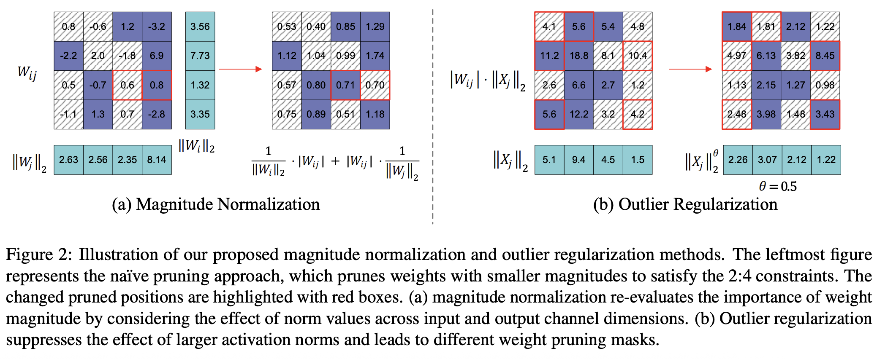 |  |  | [note](./notes/2025/BaWA/note.md) |
| [Týr-the-Pruner](./meta/2025/Týr-the-Pruner.prototxt) | [Týr-the-Pruner: Unlocking Accurate 50% Structural Pruning for LLMs via Global Sparsity Distribution Optimization](http://arxiv.org/abs/2503.09657v2) |  |  |  | [note](./notes/2025/Týr-the-Pruner/note.md) |
| [MiniMax-01](./meta/2025/MiniMax-01.prototxt) | [MiniMax-01: Scaling Foundation Models with Lightning Attention](http://arxiv.org/abs/2501.08313v1) |  |  |  | [note](./notes/2025/MiniMax-01/note.md) |
| [MiniMax-M1](./meta/2025/MiniMax-M1.prototxt) | [MiniMax-M1: Scaling Test-Time Compute Efficiently with Lightning Attention](http://arxiv.org/abs/2506.13585v1) |  |  |  | [note](./notes/2025/MiniMax-M1/note.md) |
| [PanguUltra](./meta/2025/PanguUltra.prototxt) | [Pangu Ultra: Pushing the Limits of Dense Large Language Models on Ascend NPUs](http://arxiv.org/abs/2504.07866v2) |  |  |  | [note](./notes/2025/PanguUltra/note.md) |

<b>Dongjie Ji</b>
 

| Meta | Title | Cover | Publish | Code | Note |
|:-----|:------|:------|:--------|:-----|:-----|
| [DeepSeek-V2](./meta/2024/DeepSeek-V2.prototxt) | [DeepSeek-V2: A Strong, Economical, and Efficient Mixture-of-Experts Language Model](http://arxiv.org/abs/2405.04434v5) |  |  |  | [note](./notes/2024/DeepSeek-V2/note.md) |
| [DeepSeek-V3](./meta/2024/DeepSeek-V3.prototxt) | [DeepSeek-V3 Technical Report](http://arxiv.org/abs/2412.19437v1) |  |  |  | [note](./notes/2024/DeepSeek-V3/note.md) |
| [DeepSeek-R1](./meta/2025/DeepSeek-R1.prototxt) | [DeepSeek-R1: Incentivizing Reasoning Capability in LLMs via Reinforcement Learning](http://arxiv.org/abs/2501.12948v1) |  |  |  | [note](./notes/2025/DeepSeek-R1/note.md) |

<b>Dongsheng Li</b>
 

| Meta | Title | Cover | Publish | Code | Note |
|:-----|:------|:------|:--------|:-----|:-----|
| [MInference](./meta/2024/MInference.prototxt) | [MInference 1.0: Accelerating Pre-filling for Long-Context LLMs via Dynamic Sparse Attention](http://arxiv.org/abs/2407.02490v1) |  |  |  | [note](./notes/2024/MInference/note.md) |
| [SCBench](./meta/2024/SCBench.prototxt) | [SCBench: A KV Cache-Centric Analysis of Long-Context Methods](http://arxiv.org/abs/2412.10319v2) |  |  |  | [note](./notes/2024/SCBench/note.md) |
| [MMInference](./meta/2025/MMInference.prototxt) | [MMInference: Accelerating Pre-filling for Long-Context VLMs via Modality-Aware Permutation Sparse Attention](https://openreview.net/forum?id=me6PfbATWM) |  |  |  | [note](./notes/2025/MMInference/note.md) |

<b>Dongwon Jo</b>
 

| Meta | Title | Cover | Publish | Code | Note |
|:-----|:------|:------|:--------|:-----|:-----|
| [FastKV](./meta/2025/FastKV.prototxt) | [FastKV: KV Cache Compression for Fast Long-Context Processing with Token-Selective Propagation](http://arxiv.org/abs/2502.01068v1) |  |  |  | [note](./notes/2025/FastKV/note.md) |
| [RetroAttention](./meta/2025/RetroAttention.prototxt) | [Retrospective Sparse Attention for Efficient Long-Context Generation](http://arxiv.org/abs/2508.09001v1) |  |  |  | [note](./notes/2025/RetroAttention/note.md) |

<b>Dongyang Wang</b>
 

| Meta | Title | Cover | Publish | Code | Note |
|:-----|:------|:------|:--------|:-----|:-----|
| [TileLink](./meta/2025/TileLink.prototxt) | [TileLink: Generating Efficient Compute-Communication Overlapping Kernels using Tile-Centric Primitives](http://arxiv.org/abs/2503.20313v3) |  |  |  | [note](./notes/2025/TileLink/note.md) |
| [Triton-distributed](./meta/2025/Triton-distributed.prototxt) | [Triton-distributed: Programming Overlapping Kernels on Distributed AI Systems with the Triton Compiler](http://arxiv.org/abs/2504.19442v3) |  |  |  | [note](./notes/2025/Triton-distributed/note.md) |

<b>Eldar Kurtic</b>
 

| Meta | Title | Cover | Publish | Code | Note |
|:-----|:------|:------|:--------|:-----|:-----|
| [oBERT](./meta/2022/oBERT.prototxt) | [The Optimal BERT Surgeon: Scalable and Accurate Second-Order Pruning for Large Language Models](https://arxiv.org/pdf/2203.07259.pdf) |  |  |  |  |
| [ZipLM](./meta/2023/ZipLM.prototxt) | [ZipLM: Inference-Aware Structured Pruning of Language Models](https://openreview.net/pdf?id=bPFFPueAxm) |  |  |  |  |
| [SquareHead](./meta/2023/SquareHead.prototxt) | [Sparse Fine-tuning for Inference Acceleration of Large Language Models](https://arxiv.org/pdf/2310.06927.pdf) |  |  |  |  |
| [m](./meta/2024/ULY1AZGY.prototxt) | [Enabling High-Sparsity Foundational Llama Models with Efficient Pretraining and Deployment](http://arxiv.org/abs/2405.03594v1) |  |  |  | [note](./notes/2024/ULY1AZGY/note.md) |

<b>Elias Frantar</b>
 

| Meta | Title | Cover | Publish | Code | Note |
|:-----|:------|:------|:--------|:-----|:-----|
| [SPDY](./meta/2022/spdy.prototxt) | [SPDY: Accurate Pruning with Speedup Guarantees](https://arxiv.org/abs/2201.13096) |  |  |  | [note](./notes/2022/spdy/index.md) |
| [OBC](./meta/2022/obc.prototxt) | [Optimal Brain Compression: A Framework for Accurate Post-Training Quantization and Pruning](https://openreview.net/pdf?id=ksVGCOlOEba) |  |  |  |  |
| [GPTQ](./meta/2023/gptq.prototxt) | [GPTQ: Accurate Post-Training Quantization for Generative Pre-trained Transformers](https://arxiv.org/pdf/2210.17323.pdf) |  |  |  |  |
| [SparseGPT](./meta/2023/sparsegpt.prototxt) | [SparseGPT: Massive Language Models Can be Accurately Pruned in one-shot.](https://arxiv.org/pdf/2301.00774.pdf) |  |  |  |  |
| [ZipLM](./meta/2023/ZipLM.prototxt) | [ZipLM: Inference-Aware Structured Pruning of Language Models](https://openreview.net/pdf?id=bPFFPueAxm) |  |  |  |  |
| [SquareHead](./meta/2023/SquareHead.prototxt) | [Sparse Fine-tuning for Inference Acceleration of Large Language Models](https://arxiv.org/pdf/2310.06927.pdf) |  |  |  |  |

<b>Emad Barsoum</b>
 

| Meta | Title | Cover | Publish | Code | Note |
|:-----|:------|:------|:--------|:-----|:-----|
| [SDS](./meta/2025/SDS.prototxt) | [Enhancing One-shot Pruned Pre-trained Language Models through Sparse-Dense-Sparse Mechanism](http://arxiv.org/abs/2408.10473v1) |  |  |  | [note](./notes/2025/SDS/note.md) |
| [Týr-the-Pruner](./meta/2025/Týr-the-Pruner.prototxt) | [Týr-the-Pruner: Unlocking Accurate 50% Structural Pruning for LLMs via Global Sparsity Distribution Optimization](http://arxiv.org/abs/2503.09657v2) |  |  |  | [note](./notes/2025/Týr-the-Pruner/note.md) |

<b>Enwei Jiao</b>
 

| Meta | Title | Cover | Publish | Code | Note |
|:-----|:------|:------|:--------|:-----|:-----|
| [MiniMax-01](./meta/2025/MiniMax-01.prototxt) | [MiniMax-01: Scaling Foundation Models with Lightning Attention](http://arxiv.org/abs/2501.08313v1) |  |  |  | [note](./notes/2025/MiniMax-01/note.md) |
| [MiniMax-M1](./meta/2025/MiniMax-M1.prototxt) | [MiniMax-M1: Scaling Test-Time Compute Efficiently with Lightning Attention](http://arxiv.org/abs/2506.13585v1) |  |  |  | [note](./notes/2025/MiniMax-M1/note.md) |

<b>Erhang Li</b>
 

| Meta | Title | Cover | Publish | Code | Note |
|:-----|:------|:------|:--------|:-----|:-----|
| [DeepSeek-V2](./meta/2024/DeepSeek-V2.prototxt) | [DeepSeek-V2: A Strong, Economical, and Efficient Mixture-of-Experts Language Model](http://arxiv.org/abs/2405.04434v5) |  |  |  | [note](./notes/2024/DeepSeek-V2/note.md) |
| [DeepSeek-V3](./meta/2024/DeepSeek-V3.prototxt) | [DeepSeek-V3 Technical Report](http://arxiv.org/abs/2412.19437v1) |  |  |  | [note](./notes/2024/DeepSeek-V3/note.md) |
| [DeepSeek-R1](./meta/2025/DeepSeek-R1.prototxt) | [DeepSeek-R1: Incentivizing Reasoning Capability in LLMs via Reinforcement Learning](http://arxiv.org/abs/2501.12948v1) |  |  |  | [note](./notes/2025/DeepSeek-R1/note.md) |

<b>Fan Yang</b>
 

| Meta | Title | Cover | Publish | Code | Note |
|:-----|:------|:------|:--------|:-----|:-----|
| [nmSPARSE](./meta/2023/nmSPARSE.prototxt) | [Efficient GPU Kernels for N:M-Sparse Weights in Deep Learning](https://proceedings.mlsys.org/paper_files/paper/2023/file/a10deb4d5227a8ea307ea8ff3cb712f4-Paper-mlsys2023.pdf) |  |  |  |  |
| [SeerAttention](./meta/2024/SeerAttention.prototxt) | [SeerAttention: Learning Intrinsic Sparse Attention in Your LLMs](http://arxiv.org/abs/2410.13276v2) |  |  |  | [note](./notes/2024/SeerAttention/note.md) |
| [RetrievalAttention](./meta/2025/RetrievalAttention.prototxt) | [RetrievalAttention: Accelerating Long-Context LLM Inference via Vector Retrieval](http://arxiv.org/abs/2409.10516v3) |  |  |  | [note](./notes/2025/RetrievalAttention/note.md) |
| [SeerAttention-R](./meta/2025/SeerAttention-R.prototxt) | [SeerAttention-R: Sparse Attention Adaptation for Long Reasoning](http://arxiv.org/abs/2506.08889v1) |  |  |  | [note](./notes/2025/SeerAttention-R/note.md) |

<b>Fangcheng Fu</b>
 

| Meta | Title | Cover | Publish | Code | Note |
|:-----|:------|:------|:--------|:-----|:-----|
| [PQCache](./meta/2025/PQCache.prototxt) | [PQCache: Product Quantization-based KVCache for Long Context LLM Inference](http://arxiv.org/abs/2407.12820v2) |  |  |  | [note](./notes/2025/PQCache/note.md) |
| [SALE](./meta/2025/SALE.prototxt) | [SALE : Low-bit Estimation for Efficient Sparse Attention in Long-context LLM Prefilling](http://arxiv.org/abs/2505.24179v1) |  |  |  | [note](./notes/2025/SALE/note.md) |

<b>Fangyun Lin</b>
 

| Meta | Title | Cover | Publish | Code | Note |
|:-----|:------|:------|:--------|:-----|:-----|
| [DeepSeek-V2](./meta/2024/DeepSeek-V2.prototxt) | [DeepSeek-V2: A Strong, Economical, and Efficient Mixture-of-Experts Language Model](http://arxiv.org/abs/2405.04434v5) |  |  |  | [note](./notes/2024/DeepSeek-V2/note.md) |
| [DeepSeek-V3](./meta/2024/DeepSeek-V3.prototxt) | [DeepSeek-V3 Technical Report](http://arxiv.org/abs/2412.19437v1) |  |  |  | [note](./notes/2024/DeepSeek-V3/note.md) |
| [DeepSeek-R1](./meta/2025/DeepSeek-R1.prototxt) | [DeepSeek-R1: Incentivizing Reasoning Capability in LLMs via Reinforcement Learning](http://arxiv.org/abs/2501.12948v1) |  |  |  | [note](./notes/2025/DeepSeek-R1/note.md) |

<b>Fei Huang</b>
 

| Meta | Title | Cover | Publish | Code | Note |
|:-----|:------|:------|:--------|:-----|:-----|
| [CateKV](./meta/2025/CateKV.prototxt) | [CateKV: On Sequential Consistency for Long-Context LLM Inference Acceleration](https://openreview.net/forum?id=u7dlwgKstN) |  |  |  | [note](./notes/2025/CateKV/note.md) |
| [GatedAttention](./meta/2025/GatedAttention.prototxt) | [Gated Attention for Large Language Models: Non-linearity, Sparsity, and Attention-Sink-Free](http://arxiv.org/abs/2505.06708v1) |  |  |  | [note](./notes/2025/GatedAttention/note.md) |
| [Qwen3](./meta/2025/Qwen3.prototxt) | [Qwen3 Technical Report](http://arxiv.org/abs/2505.09388v1) |  |  |  | [note](./notes/2025/Qwen3/note.md) |

<b>Fucong Dai</b>
 

| Meta | Title | Cover | Publish | Code | Note |
|:-----|:------|:------|:--------|:-----|:-----|
| [DeepSeek-V3](./meta/2024/DeepSeek-V3.prototxt) | [DeepSeek-V3 Technical Report](http://arxiv.org/abs/2412.19437v1) |  |  |  | [note](./notes/2024/DeepSeek-V3/note.md) |
| [DeepSeek-R1](./meta/2025/DeepSeek-R1.prototxt) | [DeepSeek-R1: Incentivizing Reasoning Capability in LLMs via Reinforcement Learning](http://arxiv.org/abs/2501.12948v1) |  |  |  | [note](./notes/2025/DeepSeek-R1/note.md) |

<b>Fuli Luo</b>
 

| Meta | Title | Cover | Publish | Code | Note |
|:-----|:------|:------|:--------|:-----|:-----|
| [DeepSeek-V2](./meta/2024/DeepSeek-V2.prototxt) | [DeepSeek-V2: A Strong, Economical, and Efficient Mixture-of-Experts Language Model](http://arxiv.org/abs/2405.04434v5) |  |  |  | [note](./notes/2024/DeepSeek-V2/note.md) |
| [DeepSeek-V3](./meta/2024/DeepSeek-V3.prototxt) | [DeepSeek-V3 Technical Report](http://arxiv.org/abs/2412.19437v1) |  |  |  | [note](./notes/2024/DeepSeek-V3/note.md) |
| [DeepSeekMoE](./meta/2024/DeepSeekMoE.prototxt) | [DeepSeekMoE: Towards Ultimate Expert Specialization in Mixture-of-Experts Language Models](http://arxiv.org/abs/2401.06066v1) |  |  |  | [note](./notes/2024/DeepSeekMoE/note.md) |
| [DeepSeek-R1](./meta/2025/DeepSeek-R1.prototxt) | [DeepSeek-R1: Incentivizing Reasoning Capability in LLMs via Reinforcement Learning](http://arxiv.org/abs/2501.12948v1) |  |  |  | [note](./notes/2025/DeepSeek-R1/note.md) |

<b>Furu Wei</b>
 

| Meta | Title | Cover | Publish | Code | Note |
|:-----|:------|:------|:--------|:-----|:-----|
| [Q-Sparse](./meta/2024/Q-Sparse.prototxt) | [Q-Sparse: All Large Language Models can be Fully Sparsely-Activated](http://arxiv.org/abs/2407.10969v1) |  |  |  | [note](./notes/2024/Q-Sparse/note.md) |
| [ReSA](./meta/2025/ReSA.prototxt) | [Rectified Sparse Attention](http://arxiv.org/abs/2506.04108v2) |  |  |  | [note](./notes/2025/ReSA/note.md) |

<b>Genghan Zhang</b>
 

| Meta | Title | Cover | Publish | Code | Note |
|:-----|:------|:------|:--------|:-----|:-----|
| [CATS](./meta/2024/CATS.prototxt) | [CATS: Contextually-Aware Thresholding for Sparsity in Large Language Models](http://arxiv.org/abs/2404.08763v4) |  |  |  | [note](./notes/2024/CATS/note.md) |
| [MoA](./meta/2024/MoA.prototxt) | [MoA: Mixture of Sparse Attention for Automatic Large Language Model Compression](http://arxiv.org/abs/2406.14909v2) |  |  |  | [note](./notes/2024/MoA/note.md) |

<b>Gongfan Fang</b>
 

| Meta | Title | Cover | Publish | Code | Note |
|:-----|:------|:------|:--------|:-----|:-----|
| [LLM-Pruner](./meta/2023/LLM-Pruner.prototxt) | [LLM-Pruner: On the Structural Pruning of Large Language Models](http://arxiv.org/abs/2305.11627v3) |  |  |  | [note](./notes/2023/LLM-Pruner/note.md) |
| [MaskLLM](./meta/2024/MaskLLM.prototxt) | [MaskLLM: Learnable Semi-Structured Sparsity for Large Language Models](http://arxiv.org/abs/2409.17481v1) |  |  |  | [note](./notes/2024/MaskLLM/note.md) |

<b>Guanchen Li</b>
 

| Meta | Title | Cover | Publish | Code | Note |
|:-----|:------|:------|:--------|:-----|:-----|
| [SDS](./meta/2025/SDS.prototxt) | [Enhancing One-shot Pruned Pre-trained Language Models through Sparse-Dense-Sparse Mechanism](http://arxiv.org/abs/2408.10473v1) |  |  |  | [note](./notes/2025/SDS/note.md) |
| [BaWA](./meta/2025/BaWA.prototxt) | [BaWA: Automatic Optimizing Pruning Metric for Large Language Models with Balanced Weight and Activation](https://openreview.net/forum?id=YrCvW1Hx7g) |  |  |  | [note](./notes/2025/BaWA/note.md) |
| [Týr-the-Pruner](./meta/2025/Týr-the-Pruner.prototxt) | [Týr-the-Pruner: Unlocking Accurate 50% Structural Pruning for LLMs via Global Sparsity Distribution Optimization](http://arxiv.org/abs/2503.09657v2) |  |  |  | [note](./notes/2025/Týr-the-Pruner/note.md) |

<b>Guangbo Hao</b>
 

| Meta | Title | Cover | Publish | Code | Note |
|:-----|:------|:------|:--------|:-----|:-----|
| [DeepSeek-V2](./meta/2024/DeepSeek-V2.prototxt) | [DeepSeek-V2: A Strong, Economical, and Efficient Mixture-of-Experts Language Model](http://arxiv.org/abs/2405.04434v5) |  |  |  | [note](./notes/2024/DeepSeek-V2/note.md) |
| [DeepSeek-V3](./meta/2024/DeepSeek-V3.prototxt) | [DeepSeek-V3 Technical Report](http://arxiv.org/abs/2412.19437v1) |  |  |  | [note](./notes/2024/DeepSeek-V3/note.md) |
| [DeepSeek-R1](./meta/2025/DeepSeek-R1.prototxt) | [DeepSeek-R1: Incentivizing Reasoning Capability in LLMs via Reinforcement Learning](http://arxiv.org/abs/2501.12948v1) |  |  |  | [note](./notes/2025/DeepSeek-R1/note.md) |

<b>Guangxuan Xiao</b>
 

| Meta | Title | Cover | Publish | Code | Note |
|:-----|:------|:------|:--------|:-----|:-----|
| [streaming-llm](./meta/2024/streaming-llm.prototxt) | [Efficient Streaming Language Models with Attention Sinks](http://arxiv.org/abs/2309.17453v4) |  |  |  | [note](./notes/2024/streaming-llm/note.md) |
| [Quest](./meta/2024/Quest.prototxt) | [Quest: Query-Aware Sparsity for Efficient Long-Context LLM Inference](http://arxiv.org/abs/2406.10774) |  |  |  | [note](./notes/2024/Quest/note.md) |
| [DuoAttention](./meta/2024/DuoAttention.prototxt) | [DuoAttention: Efficient Long-Context LLM Inference with Retrieval and Streaming Heads](http://arxiv.org/abs/2410.10819v1) | 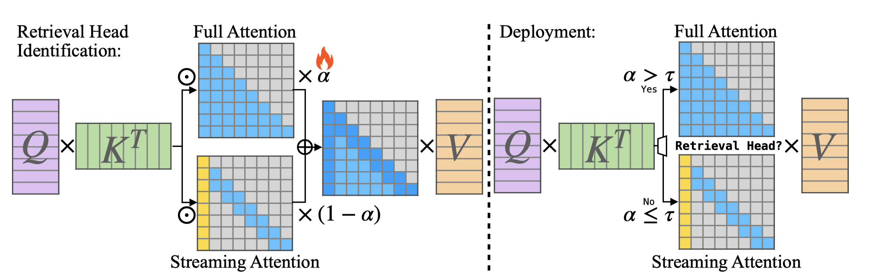 |  |  | [note](./notes/2024/DuoAttention/note.md) |
| [QServe](./meta/2024/QServer.prototxt) | [QServe: W4A8KV4 Quantization and System Co-design for Efficient LLM Serving](http://arxiv.org/abs/2405.04532v2) |  |  | [Pytorch](https://hanlab.mit.edu/projects/qserve) | [note](./notes/2024/QServer/note.md) |
| [XAttention](./meta/2025/XAttention.prototxt) | [XAttention: Block Sparse Attention with Antidiagonal Scoring](http://arxiv.org/abs/2503.16428v1) |  |  |  | [note](./notes/2025/XAttention/note.md) |
| [LServer](./meta/2025/LServer.prototxt) | [LServe: Efficient Long-sequence LLM Serving with Unified Sparse Attention](http://arxiv.org/abs/2502.14866v1) |  |  |  | [note](./notes/2025/LServer/note.md) |

<b>Guanting Chen</b>
 

| Meta | Title | Cover | Publish | Code | Note |
|:-----|:------|:------|:--------|:-----|:-----|
| [DeepSeek-V2](./meta/2024/DeepSeek-V2.prototxt) | [DeepSeek-V2: A Strong, Economical, and Efficient Mixture-of-Experts Language Model](http://arxiv.org/abs/2405.04434v5) |  |  |  | [note](./notes/2024/DeepSeek-V2/note.md) |
| [DeepSeek-V3](./meta/2024/DeepSeek-V3.prototxt) | [DeepSeek-V3 Technical Report](http://arxiv.org/abs/2412.19437v1) |  |  |  | [note](./notes/2024/DeepSeek-V3/note.md) |
| [DeepSeek-R1](./meta/2025/DeepSeek-R1.prototxt) | [DeepSeek-R1: Incentivizing Reasoning Capability in LLMs via Reinforcement Learning](http://arxiv.org/abs/2501.12948v1) |  |  |  | [note](./notes/2025/DeepSeek-R1/note.md) |

<b>Guohao Dai</b>
 

| Meta | Title | Cover | Publish | Code | Note |
|:-----|:------|:------|:--------|:-----|:-----|
| [m](./meta/2024/DHIB73MC.prototxt) | [A Survey on Efficient Inference for Large Language Models](http://arxiv.org/abs/2404.14294v2) |  |  |  | [note](./notes/2024/DHIB73MC/note.md) |
| [MoA](./meta/2024/MoA.prototxt) | [MoA: Mixture of Sparse Attention for Automatic Large Language Model Compression](http://arxiv.org/abs/2406.14909v2) |  |  |  | [note](./notes/2024/MoA/note.md) |
| [SpecEE](./meta/2025/SpecEE.prototxt) | [SpecEE: Accelerating Large Language Model Inference with Speculative Early Exiting](http://arxiv.org/abs/2504.08850v1) | 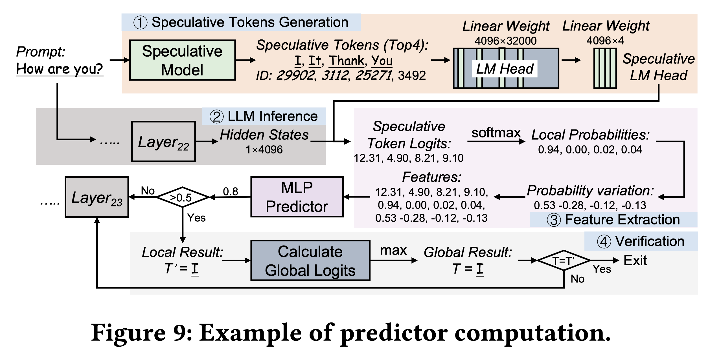 |  |  | [note](./notes/2025/SpecEE/note.md) |
| [FlashOverlap](./meta/2026/FlashOverlap.prototxt) | [FlashOverlap: A Lightweight Design for Efficiently Overlapping Communication and Computation](http://arxiv.org/abs/2504.19519v1) |  |  |  | [note](./notes/2026/FlashOverlap/note.md) |

<b>Guowei Li</b>
 

| Meta | Title | Cover | Publish | Code | Note |
|:-----|:------|:------|:--------|:-----|:-----|
| [DeepSeek-V2](./meta/2024/DeepSeek-V2.prototxt) | [DeepSeek-V2: A Strong, Economical, and Efficient Mixture-of-Experts Language Model](http://arxiv.org/abs/2405.04434v5) |  |  |  | [note](./notes/2024/DeepSeek-V2/note.md) |
| [DeepSeek-V3](./meta/2024/DeepSeek-V3.prototxt) | [DeepSeek-V3 Technical Report](http://arxiv.org/abs/2412.19437v1) |  |  |  | [note](./notes/2024/DeepSeek-V3/note.md) |
| [DeepSeek-R1](./meta/2025/DeepSeek-R1.prototxt) | [DeepSeek-R1: Incentivizing Reasoning Capability in LLMs via Reinforcement Learning](http://arxiv.org/abs/2501.12948v1) |  |  |  | [note](./notes/2025/DeepSeek-R1/note.md) |

<b>H. Zhang</b>
 

| Meta | Title | Cover | Publish | Code | Note |
|:-----|:------|:------|:--------|:-----|:-----|
| [DeepSeek-V2](./meta/2024/DeepSeek-V2.prototxt) | [DeepSeek-V2: A Strong, Economical, and Efficient Mixture-of-Experts Language Model](http://arxiv.org/abs/2405.04434v5) |  |  |  | [note](./notes/2024/DeepSeek-V2/note.md) |
| [DeepSeek-V3](./meta/2024/DeepSeek-V3.prototxt) | [DeepSeek-V3 Technical Report](http://arxiv.org/abs/2412.19437v1) |  |  |  | [note](./notes/2024/DeepSeek-V3/note.md) |
| [DeepSeek-R1](./meta/2025/DeepSeek-R1.prototxt) | [DeepSeek-R1: Incentivizing Reasoning Capability in LLMs via Reinforcement Learning](http://arxiv.org/abs/2501.12948v1) |  |  |  | [note](./notes/2025/DeepSeek-R1/note.md) |

<b>Hai Zhao</b>
 

| Meta | Title | Cover | Publish | Code | Note |
|:-----|:------|:------|:--------|:-----|:-----|
| [m](./meta/2024/JSHWEV0S.prototxt) | [Keep the Cost Down: A Review on Methods to Optimize LLM' s KV-Cache Consumption](http://arxiv.org/abs/2407.18003v3) |  |  |  | [note](./notes/2024/JSHWEV0S/note.md) |
| [SIFT](./meta/2024/SIFT.prototxt) | [Sparse is Enough in Fine-tuning Pre-trained Large Language Models](http://arxiv.org/abs/2312.11875v3) |  |  |  | [note](./notes/2024/SIFT/note.md) |

<b>Haibin Lin</b>
 

| Meta | Title | Cover | Publish | Code | Note |
|:-----|:------|:------|:--------|:-----|:-----|
| [FLUX](./meta/2024/FLUX.prototxt) | [FLUX: Fast Software-based Communication Overlap On GPUs Through Kernel Fusion](http://arxiv.org/abs/2406.06858v5) |  |  |  | [note](./notes/2024/FLUX/note.md) |
| [CometSeed](./meta/2025/CometSeed.prototxt) | [Comet: Fine-grained Computation-communication Overlapping for Mixture-of-Experts](http://arxiv.org/abs/2502.19811v3) |  |  |  | [note](./notes/2025/CometSeed/note.md) |
| [MegaScale-MoE](./meta/2025/MegaScale-MoE.prototxt) | [MegaScale-MoE: Large-Scale Communication-Efficient Training of Mixture-of-Experts Models in Production](http://arxiv.org/abs/2505.11432v2) |  |  |  | [note](./notes/2025/MegaScale-MoE/note.md) |
| [TileLink](./meta/2025/TileLink.prototxt) | [TileLink: Generating Efficient Compute-Communication Overlapping Kernels using Tile-Centric Primitives](http://arxiv.org/abs/2503.20313v3) |  |  |  | [note](./notes/2025/TileLink/note.md) |
| [Triton-distributed](./meta/2025/Triton-distributed.prototxt) | [Triton-distributed: Programming Overlapping Kernels on Distributed AI Systems with the Triton Compiler](http://arxiv.org/abs/2504.19442v3) |  |  |  | [note](./notes/2025/Triton-distributed/note.md) |

<b>Haibo Chen</b>
 

| Meta | Title | Cover | Publish | Code | Note |
|:-----|:------|:------|:--------|:-----|:-----|
| [PowerInfer](./meta/2023/PowerInfer.prototxt) | [PowerInfer: Fast Large Language Model Serving with a Consumer-grade GPU](http://arxiv.org/abs/2312.12456v1) |  |  |  | [note](./notes/2023/PowerInfer/note.md) |
| [PowerInfer-2](./meta/2024/PowerInfer-2.prototxt) | [PowerInfer-2: Fast Large Language Model Inference on a Smartphone](http://arxiv.org/abs/2406.06282v2) |  |  | [Website](https://powerinfer.ai/v2/) | [note](./notes/2024/PowerInfer-2/note.md) |
| [Turbo Sparse](./meta/2024/TurboSparse.prototxt) | [Turbo Sparse: Achieving LLM SOTA Performance with Minimal Activated Parameters](http://arxiv.org/abs/2406.05955v2) |  |  | [Pytorch](https://huggingface.co/PowerInfer) | [note](./notes/2024/TurboSparse/note.md) |

<b>Haifeng Wang</b>
 

| Meta | Title | Cover | Publish | Code | Note |
|:-----|:------|:------|:--------|:-----|:-----|
| [FlashMask](./meta/2024/FlashMask.prototxt) | [FlashMask: Efficient and Rich Mask Extension of FlashAttention](http://arxiv.org/abs/2410.01359v1) |  |  |  | [note](./notes/2024/FlashMask/note.md) |
| [CCQ](./meta/2025/CCQ.prototxt) | [CCQ: Convolutional Code for Extreme Low-bit Quantization in LLMs](http://arxiv.org/abs/2507.07145v1) |  |  |  | [note](./notes/2025/CCQ/note.md) |

<b>Hailin Zhang</b>
 

| Meta | Title | Cover | Publish | Code | Note |
|:-----|:------|:------|:--------|:-----|:-----|
| [PQCache](./meta/2025/PQCache.prototxt) | [PQCache: Product Quantization-based KVCache for Long Context LLM Inference](http://arxiv.org/abs/2407.12820v2) |  |  |  | [note](./notes/2025/PQCache/note.md) |
| [SALE](./meta/2025/SALE.prototxt) | [SALE : Low-bit Estimation for Efficient Sparse Attention in Long-context LLM Prefilling](http://arxiv.org/abs/2505.24179v1) |  |  |  | [note](./notes/2025/SALE/note.md) |

<b>Han Bao</b>
 

| Meta | Title | Cover | Publish | Code | Note |
|:-----|:------|:------|:--------|:-----|:-----|
| [m](./meta/2024/0Y41U1N2.prototxt) | [Beyond 2:4: exploring V:N:M sparsity for efficient transformer inference on GPUs](http://arxiv.org/abs/2410.16135v1) |  |  |  | [note](./notes/2024/0Y41U1N2/note.md) |
| [DeepSeek-V3](./meta/2024/DeepSeek-V3.prototxt) | [DeepSeek-V3 Technical Report](http://arxiv.org/abs/2412.19437v1) |  |  |  | [note](./notes/2024/DeepSeek-V3/note.md) |
| [DeepSeek-R1](./meta/2025/DeepSeek-R1.prototxt) | [DeepSeek-R1: Incentivizing Reasoning Capability in LLMs via Reinforcement Learning](http://arxiv.org/abs/2501.12948v1) |  |  |  | [note](./notes/2025/DeepSeek-R1/note.md) |

<b>Han Cai</b>
 

| Meta | Title | Cover | Publish | Code | Note |
|:-----|:------|:------|:--------|:-----|:-----|
| [SVG](./meta/2025/SVG.prototxt) | [Sparse VideoGen: Accelerating Video Diffusion Transformers with Spatial-Temporal Sparsity](http://arxiv.org/abs/2502.01776v2) |  |  |  | [note](./notes/2025/SVG/note.md) |
| [SVG2](./meta/2025/SVG2.prototxt) | [Sparse VideoGen2: Accelerate Video Generation with Sparse Attention via Semantic-Aware Permutation](http://arxiv.org/abs/2505.18875v3) |  |  |  | [note](./notes/2025/SVG2/note.md) |

<b>Hanshi Sun</b>
 

| Meta | Title | Cover | Publish | Code | Note |
|:-----|:------|:------|:--------|:-----|:-----|
| [ShadowKV](./meta/2025/ShadowKV.prototxt) | [ShadowKV: KV Cache in Shadows for High-Throughput Long-Context LLM Inference](https://openreview.net/forum?id=oa7MYAO6h6) |  |  |  | [note](./notes/2025/ShadowKV/note.md) |
| [R-KV](./meta/2025/R-KV.prototxt) | [R-KV: Redundancy-aware KV Cache Compression for Training-Free Reasoning Models Acceleration](http://arxiv.org/abs/2505.24133v2) |  |  |  | [note](./notes/2025/R-KV/note.md) |

<b>Hanwei Xu</b>
 

| Meta | Title | Cover | Publish | Code | Note |
|:-----|:------|:------|:--------|:-----|:-----|
| [DeepSeek-V2](./meta/2024/DeepSeek-V2.prototxt) | [DeepSeek-V2: A Strong, Economical, and Efficient Mixture-of-Experts Language Model](http://arxiv.org/abs/2405.04434v5) |  |  |  | [note](./notes/2024/DeepSeek-V2/note.md) |
| [DeepSeek-V3](./meta/2024/DeepSeek-V3.prototxt) | [DeepSeek-V3 Technical Report](http://arxiv.org/abs/2412.19437v1) |  |  |  | [note](./notes/2024/DeepSeek-V3/note.md) |
| [DeepSeek-R1](./meta/2025/DeepSeek-R1.prototxt) | [DeepSeek-R1: Incentivizing Reasoning Capability in LLMs via Reinforcement Learning](http://arxiv.org/abs/2501.12948v1) |  |  |  | [note](./notes/2025/DeepSeek-R1/note.md) |

<b>Hao Zhang</b>
 

| Meta | Title | Cover | Publish | Code | Note |
|:-----|:------|:------|:--------|:-----|:-----|
| [PagedAttention](./meta/2023/PagedAttention.prototxt) | [Efficient Memory Management for Large Language Model Serving with PagedAttention](http://arxiv.org/abs/2309.06180v1) |  |  |  | [note](./notes/2023/PagedAttention/note.md) |
| [Super-Experts-Profilling](./meta/2025/Super-Experts-Profilling.prototxt) | [Unveiling Super Experts in Mixture-of-Experts Large Language Models](http://arxiv.org/abs/2507.23279v1) |  |  |  | [note](./notes/2025/Super-Experts-Profilling/note.md) |

<b>Haocheng Wang</b>
 

| Meta | Title | Cover | Publish | Code | Note |
|:-----|:------|:------|:--------|:-----|:-----|
| [DeepSeek-V3](./meta/2024/DeepSeek-V3.prototxt) | [DeepSeek-V3 Technical Report](http://arxiv.org/abs/2412.19437v1) |  |  |  | [note](./notes/2024/DeepSeek-V3/note.md) |
| [DeepSeek-R1](./meta/2025/DeepSeek-R1.prototxt) | [DeepSeek-R1: Incentivizing Reasoning Capability in LLMs via Reinforcement Learning](http://arxiv.org/abs/2501.12948v1) |  |  |  | [note](./notes/2025/DeepSeek-R1/note.md) |

<b>Haocheng Xi</b>
 

| Meta | Title | Cover | Publish | Code | Note |
|:-----|:------|:------|:--------|:-----|:-----|
| [m](./meta/2023/23LQ9SVH.prototxt) | [Training Transformers with 4-bit Integers](https://arxiv.org/abs//2306.11987) |  |  |  |  |
| [SpargeAttn](./meta/2025/SpargeAttn.prototxt) | [SpargeAttn: Accurate Sparse Attention Accelerating Any Model Inference](https://openreview.net/forum?id=74c3Wwk8Tc) |  |  |  | [note](./notes/2025/SpargeAttn/note.md) |
| [SVG](./meta/2025/SVG.prototxt) | [Sparse VideoGen: Accelerating Video Diffusion Transformers with Spatial-Temporal Sparsity](http://arxiv.org/abs/2502.01776v2) |  |  |  | [note](./notes/2025/SVG/note.md) |
| [SVG2](./meta/2025/SVG2.prototxt) | [Sparse VideoGen2: Accelerate Video Generation with Sparse Attention via Semantic-Aware Permutation](http://arxiv.org/abs/2505.18875v3) |  |  |  | [note](./notes/2025/SVG2/note.md) |
| [RadialAttention](./meta/2025/RadialAttention.prototxt) | [Radial Attention: $O(n\log n)$ Sparse Attention with Energy Decay for Long Video Generation](http://arxiv.org/abs/2506.19852v1) |  |  |  | [note](./notes/2025/RadialAttention/note.md) |
| [SLA](./meta/2025/SLA.prototxt) | [SLA: Beyond Sparsity in Diffusion Transformers via Fine-Tunable Sparse-Linear Attention](http://arxiv.org/abs/2509.24006v1) |  |  |  | [note](./notes/2025/SLA/note.md) |

<b>Haofeng Huang</b>
 

| Meta | Title | Cover | Publish | Code | Note |
|:-----|:------|:------|:--------|:-----|:-----|
| [MoA](./meta/2024/MoA.prototxt) | [MoA: Mixture of Sparse Attention for Automatic Large Language Model Compression](http://arxiv.org/abs/2406.14909v2) |  |  |  | [note](./notes/2024/MoA/note.md) |
| [SageAttention2](./meta/2024/SageAttention2.prototxt) | [SageAttention2: Efficient Attention with Thorough Outlier Smoothing and Per-thread INT4 Quantization](http://arxiv.org/abs/2411.10958v6) |  |  |  | [note](./notes/2024/SageAttention2/note.md) |
| [SageAttention](./meta/2024/SageAttention.prototxt) | [SageAttention: Accurate 8-Bit Attention for Plug-and-play Inference Acceleration](http://arxiv.org/abs/2410.02367v8) |  |  |  | [note](./notes/2024/SageAttention/note.md) |
| [SpargeAttn](./meta/2025/SpargeAttn.prototxt) | [SpargeAttn: Accurate Sparse Attention Accelerating Any Model Inference](https://openreview.net/forum?id=74c3Wwk8Tc) |  |  |  | [note](./notes/2025/SpargeAttn/note.md) |
| [XAttention](./meta/2025/XAttention.prototxt) | [XAttention: Block Sparse Attention with Antidiagonal Scoring](http://arxiv.org/abs/2503.16428v1) |  |  |  | [note](./notes/2025/XAttention/note.md) |
| [SageAttention3](./meta/2025/SageAttention3.prototxt) | [SageAttention3: Microscaling FP4 Attention for Inference and An Exploration of 8-Bit Training](http://arxiv.org/abs/2505.11594v1) |  |  |  | [note](./notes/2025/SageAttention3/note.md) |

<b>Haohai Sun</b>
 

| Meta | Title | Cover | Publish | Code | Note |
|:-----|:------|:------|:--------|:-----|:-----|
| [MiniMax-01](./meta/2025/MiniMax-01.prototxt) | [MiniMax-01: Scaling Foundation Models with Lightning Attention](http://arxiv.org/abs/2501.08313v1) |  |  |  | [note](./notes/2025/MiniMax-01/note.md) |
| [MiniMax-M1](./meta/2025/MiniMax-M1.prototxt) | [MiniMax-M1: Scaling Test-Time Compute Efficiently with Lightning Attention](http://arxiv.org/abs/2506.13585v1) |  |  |  | [note](./notes/2025/MiniMax-M1/note.md) |

<b>Haoli Bai</b>
 

| Meta | Title | Cover | Publish | Code | Note |
|:-----|:------|:------|:--------|:-----|:-----|
| [RIA](./meta/2024/IA8CS3VH.prototxt) | [Plug-and-Play: An Efficient Post-training Pruning Method for Large Language Models](https://openreview.net/forum?id=Tr0lPx9woF) |  |  |  |  |
| [LinearPatch](./meta/2025/LinearPatch.prototxt) | [A Simple Linear Patch Revives Layer-Pruned Large Language Models](http://arxiv.org/abs/2505.24680v1) |  |  |  | [note](./notes/2025/LinearPatch/note.md) |
| [FreqKV](./meta/2025/FreqKV.prototxt) | [FreqKV: Frequency Domain Key-Value Compression for Efficient Context Window Extension](http://arxiv.org/abs/2505.00570v2) |  |  |  | [note](./notes/2025/FreqKV/note.md) |

<b>Haotian Tang</b>
 

| Meta | Title | Cover | Publish | Code | Note |
|:-----|:------|:------|:--------|:-----|:-----|
| [TorchSparse++](./meta/2023/TorchSparse.prototxt) | [TorchSparse++: Efficient Point Cloud Engine](https://openaccess.thecvf.com/content/CVPR2023W/WAD/papers/Tang_TorchSparse_Efficient_Point_Cloud_Engine_CVPRW_2023_paper.pdf) |  |  |  |  |
| [AWQ](./meta/2024/awq.prototxt) | [AWQ: Activation-aware Weight Quantization for LLM Compression and Acceleration](https://arxiv.org/abs/2306.00978) |  |  |  |  |
| [DuoAttention](./meta/2024/DuoAttention.prototxt) | [DuoAttention: Efficient Long-Context LLM Inference with Retrieval and Streaming Heads](http://arxiv.org/abs/2410.10819v1) |  |  |  | [note](./notes/2024/DuoAttention/note.md) |
| [QServe](./meta/2024/QServer.prototxt) | [QServe: W4A8KV4 Quantization and System Co-design for Efficient LLM Serving](http://arxiv.org/abs/2405.04532v2) |  |  | [Pytorch](https://hanlab.mit.edu/projects/qserve) | [note](./notes/2024/QServer/note.md) |
| [LServer](./meta/2025/LServer.prototxt) | [LServe: Efficient Long-sequence LLM Serving with Unified Sparse Attention](http://arxiv.org/abs/2502.14866v1) |  |  |  | [note](./notes/2025/LServer/note.md) |

<b>Haotong Xie</b>
 

| Meta | Title | Cover | Publish | Code | Note |
|:-----|:------|:------|:--------|:-----|:-----|
| [PowerInfer](./meta/2023/PowerInfer.prototxt) | [PowerInfer: Fast Large Language Model Serving with a Consumer-grade GPU](http://arxiv.org/abs/2312.12456v1) |  |  |  | [note](./notes/2023/PowerInfer/note.md) |
| [Turbo Sparse](./meta/2024/TurboSparse.prototxt) | [Turbo Sparse: Achieving LLM SOTA Performance with Minimal Activated Parameters](http://arxiv.org/abs/2406.05955v2) |  |  | [Pytorch](https://huggingface.co/PowerInfer) | [note](./notes/2024/TurboSparse/note.md) |

<b>Haowei Zhang</b>
 

| Meta | Title | Cover | Publish | Code | Note |
|:-----|:------|:------|:--------|:-----|:-----|
| [DeepSeek-V2](./meta/2024/DeepSeek-V2.prototxt) | [DeepSeek-V2: A Strong, Economical, and Efficient Mixture-of-Experts Language Model](http://arxiv.org/abs/2405.04434v5) |  |  |  | [note](./notes/2024/DeepSeek-V2/note.md) |
| [DeepSeek-V3](./meta/2024/DeepSeek-V3.prototxt) | [DeepSeek-V3 Technical Report](http://arxiv.org/abs/2412.19437v1) |  |  |  | [note](./notes/2024/DeepSeek-V3/note.md) |
| [DeepSeek-R1](./meta/2025/DeepSeek-R1.prototxt) | [DeepSeek-R1: Incentivizing Reasoning Capability in LLMs via Reinforcement Learning](http://arxiv.org/abs/2501.12948v1) |  |  |  | [note](./notes/2025/DeepSeek-R1/note.md) |

<b>Haoxu Wang</b>
 

| Meta | Title | Cover | Publish | Code | Note |
|:-----|:------|:------|:--------|:-----|:-----|
| [SageAttention3](./meta/2025/SageAttention3.prototxt) | [SageAttention3: Microscaling FP4 Attention for Inference and An Exploration of 8-Bit Training](http://arxiv.org/abs/2505.11594v1) |  |  |  | [note](./notes/2025/SageAttention3/note.md) |
| [SLA](./meta/2025/SLA.prototxt) | [SLA: Beyond Sparsity in Diffusion Transformers via Fine-Tunable Sparse-Linear Attention](http://arxiv.org/abs/2509.24006v1) |  |  |  | [note](./notes/2025/SLA/note.md) |

<b>Hayden Kwok-Hay So</b>
 

| Meta | Title | Cover | Publish | Code | Note |
|:-----|:------|:------|:--------|:-----|:-----|
| [SeerAttention](./meta/2024/SeerAttention.prototxt) | [SeerAttention: Learning Intrinsic Sparse Attention in Your LLMs](http://arxiv.org/abs/2410.13276v2) |  |  |  | [note](./notes/2024/SeerAttention/note.md) |
| [SeerAttention-R](./meta/2025/SeerAttention-R.prototxt) | [SeerAttention-R: Sparse Attention Adaptation for Long Reasoning](http://arxiv.org/abs/2506.08889v1) |  |  |  | [note](./notes/2025/SeerAttention-R/note.md) |

<b>Heejun Lee</b>
 

| Meta | Title | Cover | Publish | Code | Note |
|:-----|:------|:------|:--------|:-----|:-----|
| [SEA](./meta/2024/SEA.prototxt) | [SEA: Sparse Linear Attention with Estimated Attention Mask](http://arxiv.org/abs/2310.01777v2) |  |  |  | [note](./notes/2024/SEA/note.md) |
| [DeltaAttention](./meta/2025/DeltaAttention.prototxt) | [Delta Attention: Fast and Accurate Sparse Attention Inference by Delta Correction](http://arxiv.org/abs/2505.11254v1) |  |  |  | [note](./notes/2025/DeltaAttention/note.md) |

<b>Heung-Yeung Shum</b>
 

| Meta | Title | Cover | Publish | Code | Note |
|:-----|:------|:------|:--------|:-----|:-----|
| [MFA](./meta/2024/MFA.prototxt) | [Multi-matrix Factorization Attention](http://arxiv.org/abs/2412.19255v2) |  |  |  | [note](./notes/2024/MFA/note.md) |
| [Step-3](./meta/2025/Step-3.prototxt) | [Step-3 is Large yet Affordable: Model-system Co-design for Cost-effective Decoding](http://arxiv.org/abs/2507.19427v1) |  |  |  | [note](./notes/2025/Step-3/note.md) |

<b>Hong Zhou</b>
 

| Meta | Title | Cover | Publish | Code | Note |
|:-----|:------|:------|:--------|:-----|:-----|
| [ZipCache](./meta/2024/ZipCache.prototxt) | [ZipCache: Accurate and Efficient KV Cache Quantization with Salient Token Identification](http://arxiv.org/abs/2405.14256v1) |  |  |  | [note](./notes/2024/ZipCache/note.md) |
| [ZipVL](./meta/2024/ZipVL.prototxt) | [ZipVL: Efficient Large Vision-Language Models with Dynamic Token Sparsification](http://arxiv.org/abs/2410.08584v2) |  |  |  | [note](./notes/2024/ZipVL/note.md) |

<b>Honghui Ding</b>
 

| Meta | Title | Cover | Publish | Code | Note |
|:-----|:------|:------|:--------|:-----|:-----|
| [DeepSeek-V2](./meta/2024/DeepSeek-V2.prototxt) | [DeepSeek-V2: A Strong, Economical, and Efficient Mixture-of-Experts Language Model](http://arxiv.org/abs/2405.04434v5) |  |  |  | [note](./notes/2024/DeepSeek-V2/note.md) |
| [DeepSeek-V3](./meta/2024/DeepSeek-V3.prototxt) | [DeepSeek-V3 Technical Report](http://arxiv.org/abs/2412.19437v1) |  |  |  | [note](./notes/2024/DeepSeek-V3/note.md) |
| [DeepSeek-R1](./meta/2025/DeepSeek-R1.prototxt) | [DeepSeek-R1: Incentivizing Reasoning Capability in LLMs via Reinforcement Learning](http://arxiv.org/abs/2501.12948v1) |  |  |  | [note](./notes/2025/DeepSeek-R1/note.md) |

<b>Hongsheng Li</b>
 

| Meta | Title | Cover | Publish | Code | Note |
|:-----|:------|:------|:--------|:-----|:-----|
| [SR-STE](./meta/2021/sr-ste.prototxt) | [Learning N:M Fine-grained Structured Sparse Neural Networks From Scratch](https://openreview.net/forum?id=K9bw7vqp_s) |  |  |  |  |
| [SPP](./meta/2024/SPP.prototxt) | [SPP: Sparsity-Preserved Parameter-Efficient Fine-Tuning for Large Language Models](http://arxiv.org/abs/2405.16057v1) |  |  |  | [note](./notes/2024/SPP/note.md) |

<b>Hrayr Harutyunyan</b>
 

| Meta | Title | Cover | Publish | Code | Note |
|:-----|:------|:------|:--------|:-----|:-----|
| [RecursiveTransformers](./meta/2025/RecursiveTransformers.prototxt) | [Relaxed Recursive Transformers: Effective Parameter Sharing with Layer-wise LoRA](http://arxiv.org/abs/2410.20672v3) |  |  |  | [note](./notes/2025/RecursiveTransformers/note.md) |
| [MoR](./meta/2025/MoR.prototxt) | [Mixture-of-Recursions: Learning Dynamic Recursive Depths for Adaptive Token-Level Computation](http://arxiv.org/abs/2507.10524v1) |  |  |  | [note](./notes/2025/MoR/note.md) |

<b>Huajian Xin</b>
 

| Meta | Title | Cover | Publish | Code | Note |
|:-----|:------|:------|:--------|:-----|:-----|
| [DeepSeek-V2](./meta/2024/DeepSeek-V2.prototxt) | [DeepSeek-V2: A Strong, Economical, and Efficient Mixture-of-Experts Language Model](http://arxiv.org/abs/2405.04434v5) |  |  |  | [note](./notes/2024/DeepSeek-V2/note.md) |
| [DeepSeek-V3](./meta/2024/DeepSeek-V3.prototxt) | [DeepSeek-V3 Technical Report](http://arxiv.org/abs/2412.19437v1) |  |  |  | [note](./notes/2024/DeepSeek-V3/note.md) |
| [DeepSeek-R1](./meta/2025/DeepSeek-R1.prototxt) | [DeepSeek-R1: Incentivizing Reasoning Capability in LLMs via Reinforcement Learning](http://arxiv.org/abs/2501.12948v1) |  |  |  | [note](./notes/2025/DeepSeek-R1/note.md) |

<b>Huazuo Gao</b>
 

| Meta | Title | Cover | Publish | Code | Note |
|:-----|:------|:------|:--------|:-----|:-----|
| [DeepSeek-V2](./meta/2024/DeepSeek-V2.prototxt) | [DeepSeek-V2: A Strong, Economical, and Efficient Mixture-of-Experts Language Model](http://arxiv.org/abs/2405.04434v5) |  |  |  | [note](./notes/2024/DeepSeek-V2/note.md) |
| [DeepSeek-V3](./meta/2024/DeepSeek-V3.prototxt) | [DeepSeek-V3 Technical Report](http://arxiv.org/abs/2412.19437v1) |  |  |  | [note](./notes/2024/DeepSeek-V3/note.md) |
| [DeepSeekMoE](./meta/2024/DeepSeekMoE.prototxt) | [DeepSeekMoE: Towards Ultimate Expert Specialization in Mixture-of-Experts Language Models](http://arxiv.org/abs/2401.06066v1) |  |  |  | [note](./notes/2024/DeepSeekMoE/note.md) |
| [NSA](./meta/2025/NSA.prototxt) | [Native Sparse Attention: Hardware-Aligned and Natively Trainable Sparse Attention](http://arxiv.org/abs/2502.11089v1) |  |  |  | [note](./notes/2025/NSA/note.md) |
| [DeepSeek-R1](./meta/2025/DeepSeek-R1.prototxt) | [DeepSeek-R1: Incentivizing Reasoning Capability in LLMs via Reinforcement Learning](http://arxiv.org/abs/2501.12948v1) |  |  |  | [note](./notes/2025/DeepSeek-R1/note.md) |

<b>Hui Li</b>
 

| Meta | Title | Cover | Publish | Code | Note |
|:-----|:------|:------|:--------|:-----|:-----|
| [DeepSeek-V2](./meta/2024/DeepSeek-V2.prototxt) | [DeepSeek-V2: A Strong, Economical, and Efficient Mixture-of-Experts Language Model](http://arxiv.org/abs/2405.04434v5) |  |  |  | [note](./notes/2024/DeepSeek-V2/note.md) |
| [DeepSeek-V3](./meta/2024/DeepSeek-V3.prototxt) | [DeepSeek-V3 Technical Report](http://arxiv.org/abs/2412.19437v1) |  |  |  | [note](./notes/2024/DeepSeek-V3/note.md) |
| [DeepSeek-R1](./meta/2025/DeepSeek-R1.prototxt) | [DeepSeek-R1: Incentivizing Reasoning Capability in LLMs via Reinforcement Learning](http://arxiv.org/abs/2501.12948v1) |  |  |  | [note](./notes/2025/DeepSeek-R1/note.md) |

<b>Hui Qu</b>
 

| Meta | Title | Cover | Publish | Code | Note |
|:-----|:------|:------|:--------|:-----|:-----|
| [DeepSeek-V2](./meta/2024/DeepSeek-V2.prototxt) | [DeepSeek-V2: A Strong, Economical, and Efficient Mixture-of-Experts Language Model](http://arxiv.org/abs/2405.04434v5) |  |  |  | [note](./notes/2024/DeepSeek-V2/note.md) |
| [DeepSeek-V3](./meta/2024/DeepSeek-V3.prototxt) | [DeepSeek-V3 Technical Report](http://arxiv.org/abs/2412.19437v1) |  |  |  | [note](./notes/2024/DeepSeek-V3/note.md) |
| [DeepSeek-R1](./meta/2025/DeepSeek-R1.prototxt) | [DeepSeek-R1: Incentivizing Reasoning Capability in LLMs via Reinforcement Learning](http://arxiv.org/abs/2501.12948v1) |  |  |  | [note](./notes/2025/DeepSeek-R1/note.md) |

<b>Huiqiang Jiang</b>
 

| Meta | Title | Cover | Publish | Code | Note |
|:-----|:------|:------|:--------|:-----|:-----|
| [MInference](./meta/2024/MInference.prototxt) | [MInference 1.0: Accelerating Pre-filling for Long-Context LLMs via Dynamic Sparse Attention](http://arxiv.org/abs/2407.02490v1) |  |  |  | [note](./notes/2024/MInference/note.md) |
| [SCBench](./meta/2024/SCBench.prototxt) | [SCBench: A KV Cache-Centric Analysis of Long-Context Methods](http://arxiv.org/abs/2412.10319v2) |  |  |  | [note](./notes/2024/SCBench/note.md) |
| [MMInference](./meta/2025/MMInference.prototxt) | [MMInference: Accelerating Pre-filling for Long-Context VLMs via Modality-Aware Permutation Sparse Attention](https://openreview.net/forum?id=me6PfbATWM) |  |  |  | [note](./notes/2025/MMInference/note.md) |
| [RetrievalAttention](./meta/2025/RetrievalAttention.prototxt) | [RetrievalAttention: Accelerating Long-Context LLM Inference via Vector Retrieval](http://arxiv.org/abs/2409.10516v3) |  |  |  | [note](./notes/2025/RetrievalAttention/note.md) |
| [LeanK](./meta/2025/LeanK.prototxt) | [LeanK: Learnable K Cache Channel Pruning for Efficient Decoding](http://arxiv.org/abs/2508.02215v1) |  |  |  | [note](./notes/2025/LeanK/note.md) |

<b>Iman Mirzadeh</b>
 

| Meta | Title | Cover | Publish | Code | Note |
|:-----|:------|:------|:--------|:-----|:-----|
| [LLM in a flash](./meta/2023/LLM_in_a_flash.prototxt) | [LLM in a flash: Efficient Large Language Model Inference with Limited Memory](http://arxiv.org/abs/2312.11514) |  |  |  | [note](./notes/2023/LLM_in_a_flash/note.md) |
| [ReLU Strikes Back](./meta/2024/HMR7HKFV.prototxt) | [ReLU Strikes Back: Exploiting Activation Sparsity in Large Language Models](https://arxiv.org/abs/2310.04564) |  |  |  |  |

<b>Ion Stoica</b>
 

| Meta | Title | Cover | Publish | Code | Note |
|:-----|:------|:------|:--------|:-----|:-----|
| [ActNN](./meta/2019/actnn.prototxt) | [ActNN: Reducing Training Memory Footprint via 2-Bit Activation Compressed Training](https://arxiv.org/abs/2104.14129) |  |  |  |  |
| [PagedAttention](./meta/2023/PagedAttention.prototxt) | [Efficient Memory Management for Large Language Model Serving with PagedAttention](http://arxiv.org/abs/2309.06180v1) |  |  |  | [note](./notes/2023/PagedAttention/note.md) |
| [SGLang](./meta/2024/SGLang.prototxt) | [SGLang: Efficient Execution of Structured Language Model Programs](http://arxiv.org/abs/2312.07104v2) |  |  |  | [note](./notes/2024/SGLang/note.md) |
| [DoubleSparsity](./meta/2024/DoubleSparsity.prototxt) | [Post-Training Sparse Attention with Double Sparsity](http://arxiv.org/abs/2408.07092v2) |  |  |  | [note](./notes/2024/DoubleSparsity/note.md) |
| [HashAttention](./meta/2025/HashAttention.prototxt) | [HashAttention: Semantic Sparsity for Faster Inference](https://openreview.net/forum?id=Em2oaXd8Dc) |  |  |  | [note](./notes/2025/HashAttention/note.md) |
| [SVG](./meta/2025/SVG.prototxt) | [Sparse VideoGen: Accelerating Video Diffusion Transformers with Spatial-Temporal Sparsity](http://arxiv.org/abs/2502.01776v2) |  |  |  | [note](./notes/2025/SVG/note.md) |
| [SVG2](./meta/2025/SVG2.prototxt) | [Sparse VideoGen2: Accelerate Video Generation with Sparse Attention via Semantic-Aware Permutation](http://arxiv.org/abs/2505.18875v3) |  |  |  | [note](./notes/2025/SVG2/note.md) |
| [RadialAttention](./meta/2025/RadialAttention.prototxt) | [Radial Attention: $O(n\log n)$ Sparse Attention with Energy Decay for Long Video Generation](http://arxiv.org/abs/2506.19852v1) |  |  |  | [note](./notes/2025/RadialAttention/note.md) |
| [SLA](./meta/2025/SLA.prototxt) | [SLA: Beyond Sparsity in Diffusion Transformers via Fine-Tunable Sparse-Linear Attention](http://arxiv.org/abs/2509.24006v1) |  |  |  | [note](./notes/2025/SLA/note.md) |

<b>J. L. Cai</b>
 

| Meta | Title | Cover | Publish | Code | Note |
|:-----|:------|:------|:--------|:-----|:-----|
| [DeepSeek-V2](./meta/2024/DeepSeek-V2.prototxt) | [DeepSeek-V2: A Strong, Economical, and Efficient Mixture-of-Experts Language Model](http://arxiv.org/abs/2405.04434v5) |  |  |  | [note](./notes/2024/DeepSeek-V2/note.md) |
| [DeepSeek-V3](./meta/2024/DeepSeek-V3.prototxt) | [DeepSeek-V3 Technical Report](http://arxiv.org/abs/2412.19437v1) |  |  |  | [note](./notes/2024/DeepSeek-V3/note.md) |
| [DeepSeek-R1](./meta/2025/DeepSeek-R1.prototxt) | [DeepSeek-R1: Incentivizing Reasoning Capability in LLMs via Reinforcement Learning](http://arxiv.org/abs/2501.12948v1) |  |  |  | [note](./notes/2025/DeepSeek-R1/note.md) |

<b>J. Zico Kolter</b>
 

| Meta | Title | Cover | Publish | Code | Note |
|:-----|:------|:------|:--------|:-----|:-----|
| [Wanda](./meta/2024/Wanda.prototxt) | [A Simple and Effective Pruning Approach for Large Language Models](http://arxiv.org/abs/2306.11695) |  |  |  | [note](./notes/2024/Wanda/note.md) |
| [massive-activations](./meta/2024/massive-activations.prototxt) | [Massive Activations in Large Language Models](http://arxiv.org/abs/2402.17762v2) |  |  |  | [note](./notes/2024/massive-activations/note.md) |

<b>Jae-Joon Kim</b>
 

| Meta | Title | Cover | Publish | Code | Note |
|:-----|:------|:------|:--------|:-----|:-----|
| [FastKV](./meta/2025/FastKV.prototxt) | [FastKV: KV Cache Compression for Fast Long-Context Processing with Token-Selective Propagation](http://arxiv.org/abs/2502.01068v1) |  |  |  | [note](./notes/2025/FastKV/note.md) |
| [RetroAttention](./meta/2025/RetroAttention.prototxt) | [Retrospective Sparse Attention for Efficient Long-Context Generation](http://arxiv.org/abs/2508.09001v1) |  |  |  | [note](./notes/2025/RetroAttention/note.md) |

<b>Jan Kautz</b>
 

| Meta | Title | Cover | Publish | Code | Note |
|:-----|:------|:------|:--------|:-----|:-----|
| [MaskLLM](./meta/2024/MaskLLM.prototxt) | [MaskLLM: Learnable Semi-Structured Sparsity for Large Language Models](http://arxiv.org/abs/2409.17481v1) |  |  |  | [note](./notes/2024/MaskLLM/note.md) |
| [Minitron](./meta/2024/Minitron.prototxt) | [Compact Language Models via Pruning and Knowledge Distillation](https://arxiv.org/abs/2408.11796v2) |  |  |  | [note](./notes/2024/Minitron/note.md) |

<b>Jason D. Lee</b>
 

| Meta | Title | Cover | Publish | Code | Note |
|:-----|:------|:------|:--------|:-----|:-----|
| [MeZO](./meta/2023/MeZO.prototxt) | [Fine-Tuning Language Models with Just Forward Passes](http://arxiv.org/abs/2305.17333v3) |  |  |  | [note](./notes/2023/MeZO/note.md) |
| [m](./meta/2024/SN1PK7EK.prototxt) | [Revisiting Zeroth-Order Optimization for Memory-Efficient LLM Fine-Tuning: A Benchmark](http://arxiv.org/abs/2402.11592v2) |  |  |  | [note](./notes/2024/SN1PK7EK/note.md) |

<b>Jayashree Mohan</b>
 

| Meta | Title | Cover | Publish | Code | Note |
|:-----|:------|:------|:--------|:-----|:-----|
| [Vidur](./meta/2024/Vidur.prototxt) | [Vidur: A Large-Scale Simulation Framework For LLM Inference](http://arxiv.org/abs/2405.05465v2) |  |  |  | [note](./notes/2024/Vidur/note.md) |
| [POD-Attention](./meta/2025/POD-Attention.prototxt) | [POD-Attention: Unlocking Full Prefill-Decode Overlap for Faster LLM Inference](http://arxiv.org/abs/2410.18038v2) |  |  |  | [note](./notes/2025/POD-Attention/note.md) |
| [vAttention](./meta/2025/vAttention.prototxt) | [vAttention: Dynamic Memory Management for Serving LLMs without PagedAttention](http://arxiv.org/abs/2405.04437v3) |  |  |  | [note](./notes/2025/vAttention/note.md) |

<b>Jeff Pool</b>
 

| Meta | Title | Cover | Publish | Code | Note |
|:-----|:------|:------|:--------|:-----|:-----|
| [m](./meta/2021/K7GSWQIC.prototxt) | [Channel Permutations for N:M Sparsity](https://proceedings.neurips.cc/paper/2021/hash/6e8404c3b93a9527c8db241a1846599a-Abstract.html) |  |  |  |  |
| [MaskLLM](./meta/2024/MaskLLM.prototxt) | [MaskLLM: Learnable Semi-Structured Sparsity for Large Language Models](http://arxiv.org/abs/2409.17481v1) |  |  |  | [note](./notes/2024/MaskLLM/note.md) |

<b>Jeffrey Willette</b>
 

| Meta | Title | Cover | Publish | Code | Note |
|:-----|:------|:------|:--------|:-----|:-----|
| [SEA](./meta/2024/SEA.prototxt) | [SEA: Sparse Linear Attention with Estimated Attention Mask](http://arxiv.org/abs/2310.01777v2) |  |  |  | [note](./notes/2024/SEA/note.md) |
| [DeltaAttention](./meta/2025/DeltaAttention.prototxt) | [Delta Attention: Fast and Accurate Sparse Attention Inference by Delta Correction](http://arxiv.org/abs/2505.11254v1) |  |  |  | [note](./notes/2025/DeltaAttention/note.md) |

<b>Jia Wei</b>
 

| Meta | Title | Cover | Publish | Code | Note |
|:-----|:------|:------|:--------|:-----|:-----|
| [SageAttention2](./meta/2024/SageAttention2.prototxt) | [SageAttention2: Efficient Attention with Thorough Outlier Smoothing and Per-thread INT4 Quantization](http://arxiv.org/abs/2411.10958v6) |  |  |  | [note](./notes/2024/SageAttention2/note.md) |
| [SageAttention](./meta/2024/SageAttention.prototxt) | [SageAttention: Accurate 8-Bit Attention for Plug-and-play Inference Acceleration](http://arxiv.org/abs/2410.02367v8) |  |  |  | [note](./notes/2024/SageAttention/note.md) |
| [SpargeAttn](./meta/2025/SpargeAttn.prototxt) | [SpargeAttn: Accurate Sparse Attention Accelerating Any Model Inference](https://openreview.net/forum?id=74c3Wwk8Tc) |  |  |  | [note](./notes/2025/SpargeAttn/note.md) |
| [SageAttention3](./meta/2025/SageAttention3.prototxt) | [SageAttention3: Microscaling FP4 Attention for Inference and An Exploration of 8-Bit Training](http://arxiv.org/abs/2505.11594v1) |  |  |  | [note](./notes/2025/SageAttention3/note.md) |

<b>Jiajie Zhang</b>
 

| Meta | Title | Cover | Publish | Code | Note |
|:-----|:------|:------|:--------|:-----|:-----|
| [LongBench](./meta/2024/LongBench.prototxt) | [LongBench: A Bilingual, Multitask Benchmark for Long Context Understanding](http://arxiv.org/abs/2308.14508v2) |  |  |  | [note](./notes/2024/LongBench/note.md) |
| [GLM-4.5](./meta/2025/GLM-4.5.prototxt) | [GLM-4.5: Agentic, Reasoning, and Coding (ARC) Foundation Models](http://arxiv.org/abs/2508.06471v1) |  |  |  | [note](./notes/2025/GLM-4.5/note.md) |

<b>Jiaming Tang</b>
 

| Meta | Title | Cover | Publish | Code | Note |
|:-----|:------|:------|:--------|:-----|:-----|
| [Quest](./meta/2024/Quest.prototxt) | [Quest: Query-Aware Sparsity for Efficient Long-Context LLM Inference](http://arxiv.org/abs/2406.10774) |  |  |  | [note](./notes/2024/Quest/note.md) |
| [AWQ](./meta/2024/awq.prototxt) | [AWQ: Activation-aware Weight Quantization for LLM Compression and Acceleration](https://arxiv.org/abs/2306.00978) |  |  |  |  |
| [DuoAttention](./meta/2024/DuoAttention.prototxt) | [DuoAttention: Efficient Long-Context LLM Inference with Retrieval and Streaming Heads](http://arxiv.org/abs/2410.10819v1) |  |  |  | [note](./notes/2024/DuoAttention/note.md) |
| [LServer](./meta/2025/LServer.prototxt) | [LServe: Efficient Long-sequence LLM Serving with Unified Sparse Attention](http://arxiv.org/abs/2502.14866v1) |  |  |  | [note](./notes/2025/LServer/note.md) |

<b>Jiaming Xu</b>
 

| Meta | Title | Cover | Publish | Code | Note |
|:-----|:------|:------|:--------|:-----|:-----|
| [m](./meta/2024/DHIB73MC.prototxt) | [A Survey on Efficient Inference for Large Language Models](http://arxiv.org/abs/2404.14294v2) |  |  |  | [note](./notes/2024/DHIB73MC/note.md) |
| [SpecEE](./meta/2025/SpecEE.prototxt) | [SpecEE: Accelerating Large Language Model Inference with Speculative Early Exiting](http://arxiv.org/abs/2504.08850v1) |  |  |  | [note](./notes/2025/SpecEE/note.md) |

<b>Jian Liang</b>
 

| Meta | Title | Cover | Publish | Code | Note |
|:-----|:------|:------|:--------|:-----|:-----|
| [DeepSeek-V2](./meta/2024/DeepSeek-V2.prototxt) | [DeepSeek-V2: A Strong, Economical, and Efficient Mixture-of-Experts Language Model](http://arxiv.org/abs/2405.04434v5) |  |  |  | [note](./notes/2024/DeepSeek-V2/note.md) |
| [DeepSeek-V3](./meta/2024/DeepSeek-V3.prototxt) | [DeepSeek-V3 Technical Report](http://arxiv.org/abs/2412.19437v1) |  |  |  | [note](./notes/2024/DeepSeek-V3/note.md) |
| [DeepSeek-R1](./meta/2025/DeepSeek-R1.prototxt) | [DeepSeek-R1: Incentivizing Reasoning Capability in LLMs via Reinforcement Learning](http://arxiv.org/abs/2501.12948v1) |  |  |  | [note](./notes/2025/DeepSeek-R1/note.md) |

<b>Jianfei Chen</b>
 

| Meta | Title | Cover | Publish | Code | Note |
|:-----|:------|:------|:--------|:-----|:-----|
| [ActNN](./meta/2019/actnn.prototxt) | [ActNN: Reducing Training Memory Footprint via 2-Bit Activation Compressed Training](https://arxiv.org/abs/2104.14129) |  |  |  |  |
| [m](./meta/2023/23LQ9SVH.prototxt) | [Training Transformers with 4-bit Integers](https://arxiv.org/abs//2306.11987) |  |  |  |  |
| [m](./meta/2024/HYPL7G37.prototxt) | [Accelerating Transformer Pre-training with 2:4 Sparsity](http://arxiv.org/abs/2404.01847v2) |  |  |  | [note](./notes/2024/HYPL7G37/note.md) |
| [m](./meta/2024/0Y41U1N2.prototxt) | [Beyond 2:4: exploring V:N:M sparsity for efficient transformer inference on GPUs](http://arxiv.org/abs/2410.16135v1) |  |  |  | [note](./notes/2024/0Y41U1N2/note.md) |
| [ReMoE](./meta/2024/ReMoE.prototxt) | [ReMoE: Fully Differentiable Mixture-of-Experts with ReLU Routing](http://arxiv.org/abs/2412.14711v1) |  |  |  | [note](./notes/2024/ReMoE/note.md) |
| [SageAttention2](./meta/2024/SageAttention2.prototxt) | [SageAttention2: Efficient Attention with Thorough Outlier Smoothing and Per-thread INT4 Quantization](http://arxiv.org/abs/2411.10958v6) |  |  |  | [note](./notes/2024/SageAttention2/note.md) |
| [SageAttention](./meta/2024/SageAttention.prototxt) | [SageAttention: Accurate 8-Bit Attention for Plug-and-play Inference Acceleration](http://arxiv.org/abs/2410.02367v8) |  |  |  | [note](./notes/2024/SageAttention/note.md) |
| [AdaptiveSparseTrainer](./meta/2025/AdaptiveSparseTrainer.prototxt) | [Pruning Large Language Models with Semi-Structural Adaptive Sparse Training](http://arxiv.org/abs/2407.20584v3) |  |  |  | [note](./notes/2025/AdaptiveSparseTrainer/note.md) |
| [SpargeAttn](./meta/2025/SpargeAttn.prototxt) | [SpargeAttn: Accurate Sparse Attention Accelerating Any Model Inference](https://openreview.net/forum?id=74c3Wwk8Tc) |  |  |  | [note](./notes/2025/SpargeAttn/note.md) |
| [SVG](./meta/2025/SVG.prototxt) | [Sparse VideoGen: Accelerating Video Diffusion Transformers with Spatial-Temporal Sparsity](http://arxiv.org/abs/2502.01776v2) |  |  |  | [note](./notes/2025/SVG/note.md) |
| [SageAttention3](./meta/2025/SageAttention3.prototxt) | [SageAttention3: Microscaling FP4 Attention for Inference and An Exploration of 8-Bit Training](http://arxiv.org/abs/2505.11594v1) |  |  |  | [note](./notes/2025/SageAttention3/note.md) |
| [SVG2](./meta/2025/SVG2.prototxt) | [Sparse VideoGen2: Accelerate Video Generation with Sparse Attention via Semantic-Aware Permutation](http://arxiv.org/abs/2505.18875v3) |  |  |  | [note](./notes/2025/SVG2/note.md) |
| [SLA](./meta/2025/SLA.prototxt) | [SLA: Beyond Sparsity in Diffusion Transformers via Fine-Tunable Sparse-Linear Attention](http://arxiv.org/abs/2509.24006v1) |  |  |  | [note](./notes/2025/SLA/note.md) |

<b>Jianfeng Gao</b>
 

| Meta | Title | Cover | Publish | Code | Note |
|:-----|:------|:------|:--------|:-----|:-----|
| [SCBench](./meta/2024/SCBench.prototxt) | [SCBench: A KV Cache-Centric Analysis of Long-Context Methods](http://arxiv.org/abs/2412.10319v2) |  |  |  | [note](./notes/2024/SCBench/note.md) |
| [MMInference](./meta/2025/MMInference.prototxt) | [MMInference: Accelerating Pre-filling for Long-Context VLMs via Modality-Aware Permutation Sparse Attention](https://openreview.net/forum?id=me6PfbATWM) |  |  |  | [note](./notes/2025/MMInference/note.md) |

<b>Jiangfei Duan</b>
 

| Meta | Title | Cover | Publish | Code | Note |
|:-----|:------|:------|:--------|:-----|:-----|
| [Centauri](./meta/2024/Centauri.prototxt) | [Centauri: Enabling Efficient Scheduling for Communication-Computation Overlap in Large Model Training via Communication Partitioning](https://dl.acm.org/doi/10.1145/3620666.3651379) |  |  |  | [note](./notes/2024/Centauri/note.md) |
| [SampleAttention](./meta/2024/SampleAttention.prototxt) | [SampleAttention: Near-Lossless Acceleration of Long Context LLM Inference with Adaptive Structured Sparse Attention](http://arxiv.org/abs/2406.15486v2) |  |  |  | [note](./notes/2024/SampleAttention/note.md) |

<b>Jianqiao Lu</b>
 

| Meta | Title | Cover | Publish | Code | Note |
|:-----|:------|:------|:--------|:-----|:-----|
| [UNComp](./meta/2025/UNComp.prototxt) | [UNComp: Can Matrix Entropy Uncover Sparsity? -- A Compressor Design from an Uncertainty-Aware Perspective](http://arxiv.org/abs/2410.03090v2) |  |  |  | [note](./notes/2025/UNComp/note.md) |
| [FlexPrefill](./meta/2025/FlexPrefill.prototxt) | [FlexPrefill: A Context-Aware Sparse Attention Mechanism for Efficient Long-Sequence Inference](http://arxiv.org/abs/2502.20766v1) |  |  |  | [note](./notes/2025/FlexPrefill/note.md) |

<b>Jianxi Ye</b>
 

| Meta | Title | Cover | Publish | Code | Note |
|:-----|:------|:------|:--------|:-----|:-----|
| [TileLink](./meta/2025/TileLink.prototxt) | [TileLink: Generating Efficient Compute-Communication Overlapping Kernels using Tile-Centric Primitives](http://arxiv.org/abs/2503.20313v3) |  |  |  | [note](./notes/2025/TileLink/note.md) |
| [Triton-distributed](./meta/2025/Triton-distributed.prototxt) | [Triton-distributed: Programming Overlapping Kernels on Distributed AI Systems with the Triton Compiler](http://arxiv.org/abs/2504.19442v3) |  |  |  | [note](./notes/2025/Triton-distributed/note.md) |

<b>Jianyong Wang</b>
 

| Meta | Title | Cover | Publish | Code | Note |
|:-----|:------|:------|:--------|:-----|:-----|
| [LeanK](./meta/2025/LeanK.prototxt) | [LeanK: Learnable K Cache Channel Pruning for Efficient Decoding](http://arxiv.org/abs/2508.02215v1) |  |  |  | [note](./notes/2025/LeanK/note.md) |
| [ReSA](./meta/2025/ReSA.prototxt) | [Rectified Sparse Attention](http://arxiv.org/abs/2506.04108v2) |  |  |  | [note](./notes/2025/ReSA/note.md) |

<b>Jianzhong Guo</b>
 

| Meta | Title | Cover | Publish | Code | Note |
|:-----|:------|:------|:--------|:-----|:-----|
| [DeepSeek-V2](./meta/2024/DeepSeek-V2.prototxt) | [DeepSeek-V2: A Strong, Economical, and Efficient Mixture-of-Experts Language Model](http://arxiv.org/abs/2405.04434v5) |  |  |  | [note](./notes/2024/DeepSeek-V2/note.md) |
| [DeepSeek-V3](./meta/2024/DeepSeek-V3.prototxt) | [DeepSeek-V3 Technical Report](http://arxiv.org/abs/2412.19437v1) |  |  |  | [note](./notes/2024/DeepSeek-V3/note.md) |
| [DeepSeek-R1](./meta/2025/DeepSeek-R1.prototxt) | [DeepSeek-R1: Incentivizing Reasoning Capability in LLMs via Reinforcement Learning](http://arxiv.org/abs/2501.12948v1) |  |  |  | [note](./notes/2025/DeepSeek-R1/note.md) |

<b>Jiaqi Ni</b>
 

| Meta | Title | Cover | Publish | Code | Note |
|:-----|:------|:------|:--------|:-----|:-----|
| [DeepSeek-V2](./meta/2024/DeepSeek-V2.prototxt) | [DeepSeek-V2: A Strong, Economical, and Efficient Mixture-of-Experts Language Model](http://arxiv.org/abs/2405.04434v5) |  |  |  | [note](./notes/2024/DeepSeek-V2/note.md) |
| [DeepSeek-V3](./meta/2024/DeepSeek-V3.prototxt) | [DeepSeek-V3 Technical Report](http://arxiv.org/abs/2412.19437v1) |  |  |  | [note](./notes/2024/DeepSeek-V3/note.md) |
| [DeepSeek-R1](./meta/2025/DeepSeek-R1.prototxt) | [DeepSeek-R1: Incentivizing Reasoning Capability in LLMs via Reinforcement Learning](http://arxiv.org/abs/2501.12948v1) |  |  |  | [note](./notes/2025/DeepSeek-R1/note.md) |

<b>Jiaqi Zhuang</b>
 

| Meta | Title | Cover | Publish | Code | Note |
|:-----|:------|:------|:--------|:-----|:-----|
| [MiniMax-01](./meta/2025/MiniMax-01.prototxt) | [MiniMax-01: Scaling Foundation Models with Lightning Attention](http://arxiv.org/abs/2501.08313v1) |  |  |  | [note](./notes/2025/MiniMax-01/note.md) |
| [MiniMax-M1](./meta/2025/MiniMax-M1.prototxt) | [MiniMax-M1: Scaling Test-Time Compute Efficiently with Lightning Attention](http://arxiv.org/abs/2506.13585v1) |  |  |  | [note](./notes/2025/MiniMax-M1/note.md) |

<b>Jiashi Li</b>
 

| Meta | Title | Cover | Publish | Code | Note |
|:-----|:------|:------|:--------|:-----|:-----|
| [DeepSeek-V2](./meta/2024/DeepSeek-V2.prototxt) | [DeepSeek-V2: A Strong, Economical, and Efficient Mixture-of-Experts Language Model](http://arxiv.org/abs/2405.04434v5) |  |  |  | [note](./notes/2024/DeepSeek-V2/note.md) |
| [DeepSeek-V3](./meta/2024/DeepSeek-V3.prototxt) | [DeepSeek-V3 Technical Report](http://arxiv.org/abs/2412.19437v1) |  |  |  | [note](./notes/2024/DeepSeek-V3/note.md) |
| [DeepSeekMoE](./meta/2024/DeepSeekMoE.prototxt) | [DeepSeekMoE: Towards Ultimate Expert Specialization in Mixture-of-Experts Language Models](http://arxiv.org/abs/2401.06066v1) |  |  |  | [note](./notes/2024/DeepSeekMoE/note.md) |
| [DeepSeek-R1](./meta/2025/DeepSeek-R1.prototxt) | [DeepSeek-R1: Incentivizing Reasoning Capability in LLMs via Reinforcement Learning](http://arxiv.org/abs/2501.12948v1) |  |  |  | [note](./notes/2025/DeepSeek-R1/note.md) |

<b>Jiawei Wang</b>
 

| Meta | Title | Cover | Publish | Code | Note |
|:-----|:------|:------|:--------|:-----|:-----|
| [DeepSeek-V3](./meta/2024/DeepSeek-V3.prototxt) | [DeepSeek-V3 Technical Report](http://arxiv.org/abs/2412.19437v1) |  |  |  | [note](./notes/2024/DeepSeek-V3/note.md) |
| [DeepSeek-R1](./meta/2025/DeepSeek-R1.prototxt) | [DeepSeek-R1: Incentivizing Reasoning Capability in LLMs via Reinforcement Learning](http://arxiv.org/abs/2501.12948v1) |  |  |  | [note](./notes/2025/DeepSeek-R1/note.md) |

<b>Jiayuan Song</b>
 

| Meta | Title | Cover | Publish | Code | Note |
|:-----|:------|:------|:--------|:-----|:-----|
| [MiniMax-01](./meta/2025/MiniMax-01.prototxt) | [MiniMax-01: Scaling Foundation Models with Lightning Attention](http://arxiv.org/abs/2501.08313v1) |  |  |  | [note](./notes/2025/MiniMax-01/note.md) |
| [MiniMax-M1](./meta/2025/MiniMax-M1.prototxt) | [MiniMax-M1: Scaling Test-Time Compute Efficiently with Lightning Attention](http://arxiv.org/abs/2506.13585v1) |  |  |  | [note](./notes/2025/MiniMax-M1/note.md) |

<b>Jidong Zhai</b>
 

| Meta | Title | Cover | Publish | Code | Note |
|:-----|:------|:------|:--------|:-----|:-----|
| [GLM-4.5](./meta/2025/GLM-4.5.prototxt) | [GLM-4.5: Agentic, Reasoning, and Coding (ARC) Foundation Models](http://arxiv.org/abs/2508.06471v1) |  |  |  | [note](./notes/2025/GLM-4.5/note.md) |
| [Triton-distributed](./meta/2025/Triton-distributed.prototxt) | [Triton-distributed: Programming Overlapping Kernels on Distributed AI Systems with the Triton Compiler](http://arxiv.org/abs/2504.19442v3) |  |  |  | [note](./notes/2025/Triton-distributed/note.md) |

<b>Jie Liu</b>
 

| Meta | Title | Cover | Publish | Code | Note |
|:-----|:------|:------|:--------|:-----|:-----|
| [GLM-4.5](./meta/2025/GLM-4.5.prototxt) | [GLM-4.5: Agentic, Reasoning, and Coding (ARC) Foundation Models](http://arxiv.org/abs/2508.06471v1) |  |  |  | [note](./notes/2025/GLM-4.5/note.md) |
| [Task-KV](./meta/2025/Task-KV.prototxt) | [Task-KV: Task-aware KV Cache Optimization via Semantic Differentiation of Attention Heads](http://arxiv.org/abs/2501.15113v1) |  |  |  | [note](./notes/2025/Task-KV/note.md) |

<b>Jie Tang</b>
 

| Meta | Title | Cover | Publish | Code | Note |
|:-----|:------|:------|:--------|:-----|:-----|
| [CodeGeeX](./meta/2023/CodeGeeX.prototxt) | [CodeGeeX: A Pre-Trained Model for Code Generation with Multilingual Benchmarking on HumanEval-X](http://arxiv.org/abs/2303.17568v2) |  |  |  | [note](./notes/2023/CodeGeeX/note.md) |
| [LongBench](./meta/2024/LongBench.prototxt) | [LongBench: A Bilingual, Multitask Benchmark for Long Context Understanding](http://arxiv.org/abs/2308.14508v2) |  |  |  | [note](./notes/2024/LongBench/note.md) |
| [GLM-4.5](./meta/2025/GLM-4.5.prototxt) | [GLM-4.5: Agentic, Reasoning, and Coding (ARC) Foundation Models](http://arxiv.org/abs/2508.06471v1) |  |  |  | [note](./notes/2025/GLM-4.5/note.md) |

<b>Jie Ye</b>
 

| Meta | Title | Cover | Publish | Code | Note |
|:-----|:------|:------|:--------|:-----|:-----|
| [MoPEQ](./meta/2025/MoPEQ.prototxt) | [MoPEQ: Mixture of Mixed Precision Quantized Experts](http://arxiv.org/abs/2509.02512v1) |  |  |  | [note](./notes/2025/MoPEQ/note.md) |
| [PagedEviction](./meta/2025/PagedEviction.prototxt) | [PagedEviction: Structured Block-wise KV Cache Pruning for Efficient Large Language Model Inference](http://arxiv.org/abs/2509.04377v1) |  |  |  | [note](./notes/2025/PagedEviction/note.md) |

<b>Jie Zhou</b>
 

| Meta | Title | Cover | Publish | Code | Note |
|:-----|:------|:------|:--------|:-----|:-----|
| [DBudgetKV](./meta/2025/DBudgetKV.prototxt) | [DBudgetKV: Dynamic Budget in KV Cache Compression for Ensuring Optimal Performance](http://arxiv.org/abs/2502.16886v1) |  |  |  | [note](./notes/2025/DBudgetKV/note.md) |
| [MiniCPM4](./meta/2025/MiniCPM4.prototxt) | [MiniCPM4: Ultra-Efficient LLMs on End Devices](http://arxiv.org/abs/2506.07900v1) |  |  |  | [note](./notes/2025/MiniCPM4/note.md) |

<b>Jin Chen</b>
 

| Meta | Title | Cover | Publish | Code | Note |
|:-----|:------|:------|:--------|:-----|:-----|
| [DeepSeek-V2](./meta/2024/DeepSeek-V2.prototxt) | [DeepSeek-V2: A Strong, Economical, and Efficient Mixture-of-Experts Language Model](http://arxiv.org/abs/2405.04434v5) |  |  |  | [note](./notes/2024/DeepSeek-V2/note.md) |
| [DeepSeek-V3](./meta/2024/DeepSeek-V3.prototxt) | [DeepSeek-V3 Technical Report](http://arxiv.org/abs/2412.19437v1) |  |  |  | [note](./notes/2024/DeepSeek-V3/note.md) |
| [DeepSeek-R1](./meta/2025/DeepSeek-R1.prototxt) | [DeepSeek-R1: Incentivizing Reasoning Capability in LLMs via Reinforcement Learning](http://arxiv.org/abs/2501.12948v1) |  |  |  | [note](./notes/2025/DeepSeek-R1/note.md) |

<b>Jin Fang</b>
 

| Meta | Title | Cover | Publish | Code | Note |
|:-----|:------|:------|:--------|:-----|:-----|
| [TileLink](./meta/2025/TileLink.prototxt) | [TileLink: Generating Efficient Compute-Communication Overlapping Kernels using Tile-Centric Primitives](http://arxiv.org/abs/2503.20313v3) |  |  |  | [note](./notes/2025/TileLink/note.md) |
| [Triton-distributed](./meta/2025/Triton-distributed.prototxt) | [Triton-distributed: Programming Overlapping Kernels on Distributed AI Systems with the Triton Compiler](http://arxiv.org/abs/2504.19442v3) |  |  |  | [note](./notes/2025/Triton-distributed/note.md) |

<b>Jin Zhu</b>
 

| Meta | Title | Cover | Publish | Code | Note |
|:-----|:------|:------|:--------|:-----|:-----|
| [MiniMax-01](./meta/2025/MiniMax-01.prototxt) | [MiniMax-01: Scaling Foundation Models with Lightning Attention](http://arxiv.org/abs/2501.08313v1) |  |  |  | [note](./notes/2025/MiniMax-01/note.md) |
| [MiniMax-M1](./meta/2025/MiniMax-M1.prototxt) | [MiniMax-M1: Scaling Test-Time Compute Efficiently with Lightning Attention](http://arxiv.org/abs/2506.13585v1) |  |  |  | [note](./notes/2025/MiniMax-M1/note.md) |

<b>Jing Liu</b>
 

| Meta | Title | Cover | Publish | Code | Note |
|:-----|:------|:------|:--------|:-----|:-----|
| [ZipCache](./meta/2024/ZipCache.prototxt) | [ZipCache: Accurate and Efficient KV Cache Quantization with Salient Token Identification](http://arxiv.org/abs/2405.14256v1) |  |  |  | [note](./notes/2024/ZipCache/note.md) |
| [MiniCache](./meta/2024/MiniCache.prototxt) | [MiniCache: KV Cache Compression in Depth Dimension for Large Language Models](http://arxiv.org/abs/2405.14366v2) |  |  |  | [note](./notes/2024/MiniCache/note.md) |
| [ZipVL](./meta/2024/ZipVL.prototxt) | [ZipVL: Efficient Large Vision-Language Models with Dynamic Token Sparsification](http://arxiv.org/abs/2410.08584v2) |  |  |  | [note](./notes/2024/ZipVL/note.md) |

<b>Jingchang Chen</b>
 

| Meta | Title | Cover | Publish | Code | Note |
|:-----|:------|:------|:--------|:-----|:-----|
| [DeepSeek-V3](./meta/2024/DeepSeek-V3.prototxt) | [DeepSeek-V3 Technical Report](http://arxiv.org/abs/2412.19437v1) |  |  |  | [note](./notes/2024/DeepSeek-V3/note.md) |
| [DeepSeek-R1](./meta/2025/DeepSeek-R1.prototxt) | [DeepSeek-R1: Incentivizing Reasoning Capability in LLMs via Reinforcement Learning](http://arxiv.org/abs/2501.12948v1) |  |  |  | [note](./notes/2025/DeepSeek-R1/note.md) |

<b>Jingren Zhou</b>
 

| Meta | Title | Cover | Publish | Code | Note |
|:-----|:------|:------|:--------|:-----|:-----|
| [GatedAttention](./meta/2025/GatedAttention.prototxt) | [Gated Attention for Large Language Models: Non-linearity, Sparsity, and Attention-Sink-Free](http://arxiv.org/abs/2505.06708v1) |  |  |  | [note](./notes/2025/GatedAttention/note.md) |
| [Qwen3](./meta/2025/Qwen3.prototxt) | [Qwen3 Technical Report](http://arxiv.org/abs/2505.09388v1) |  |  |  | [note](./notes/2025/Qwen3/note.md) |

<b>Jingyang Li</b>
 

| Meta | Title | Cover | Publish | Code | Note |
|:-----|:------|:------|:--------|:-----|:-----|
| [MiniMax-01](./meta/2025/MiniMax-01.prototxt) | [MiniMax-01: Scaling Foundation Models with Lightning Attention](http://arxiv.org/abs/2501.08313v1) |  |  |  | [note](./notes/2025/MiniMax-01/note.md) |
| [MiniMax-M1](./meta/2025/MiniMax-M1.prototxt) | [MiniMax-M1: Scaling Test-Time Compute Efficiently with Lightning Attention](http://arxiv.org/abs/2506.13585v1) |  |  |  | [note](./notes/2025/MiniMax-M1/note.md) |

<b>Jingyang Yuan</b>
 

| Meta | Title | Cover | Publish | Code | Note |
|:-----|:------|:------|:--------|:-----|:-----|
| [DeepSeek-V2](./meta/2024/DeepSeek-V2.prototxt) | [DeepSeek-V2: A Strong, Economical, and Efficient Mixture-of-Experts Language Model](http://arxiv.org/abs/2405.04434v5) |  |  |  | [note](./notes/2024/DeepSeek-V2/note.md) |
| [DeepSeek-V3](./meta/2024/DeepSeek-V3.prototxt) | [DeepSeek-V3 Technical Report](http://arxiv.org/abs/2412.19437v1) |  |  |  | [note](./notes/2024/DeepSeek-V3/note.md) |
| [NSA](./meta/2025/NSA.prototxt) | [Native Sparse Attention: Hardware-Aligned and Natively Trainable Sparse Attention](http://arxiv.org/abs/2502.11089v1) |  |  |  | [note](./notes/2025/NSA/note.md) |
| [DeepSeek-R1](./meta/2025/DeepSeek-R1.prototxt) | [DeepSeek-R1: Incentivizing Reasoning Capability in LLMs via Reinforcement Learning](http://arxiv.org/abs/2501.12948v1) |  |  |  | [note](./notes/2025/DeepSeek-R1/note.md) |

<b>Jintao Zhang</b>
 

| Meta | Title | Cover | Publish | Code | Note |
|:-----|:------|:------|:--------|:-----|:-----|
| [SageAttention2](./meta/2024/SageAttention2.prototxt) | [SageAttention2: Efficient Attention with Thorough Outlier Smoothing and Per-thread INT4 Quantization](http://arxiv.org/abs/2411.10958v6) |  |  |  | [note](./notes/2024/SageAttention2/note.md) |
| [SageAttention](./meta/2024/SageAttention.prototxt) | [SageAttention: Accurate 8-Bit Attention for Plug-and-play Inference Acceleration](http://arxiv.org/abs/2410.02367v8) |  |  |  | [note](./notes/2024/SageAttention/note.md) |
| [SpargeAttn](./meta/2025/SpargeAttn.prototxt) | [SpargeAttn: Accurate Sparse Attention Accelerating Any Model Inference](https://openreview.net/forum?id=74c3Wwk8Tc) |  |  |  | [note](./notes/2025/SpargeAttn/note.md) |
| [SVG](./meta/2025/SVG.prototxt) | [Sparse VideoGen: Accelerating Video Diffusion Transformers with Spatial-Temporal Sparsity](http://arxiv.org/abs/2502.01776v2) |  |  |  | [note](./notes/2025/SVG/note.md) |
| [SageAttention3](./meta/2025/SageAttention3.prototxt) | [SageAttention3: Microscaling FP4 Attention for Inference and An Exploration of 8-Bit Training](http://arxiv.org/abs/2505.11594v1) |  |  |  | [note](./notes/2025/SageAttention3/note.md) |
| [SVG2](./meta/2025/SVG2.prototxt) | [Sparse VideoGen2: Accelerate Video Generation with Sparse Attention via Semantic-Aware Permutation](http://arxiv.org/abs/2505.18875v3) |  |  |  | [note](./notes/2025/SVG2/note.md) |
| [SLA](./meta/2025/SLA.prototxt) | [SLA: Beyond Sparsity in Diffusion Transformers via Fine-Tunable Sparse-Linear Attention](http://arxiv.org/abs/2509.24006v1) |  |  |  | [note](./notes/2025/SLA/note.md) |

<b>Joseph E. Gonzalez</b>
 

| Meta | Title | Cover | Publish | Code | Note |
|:-----|:------|:------|:--------|:-----|:-----|
| [ActNN](./meta/2019/actnn.prototxt) | [ActNN: Reducing Training Memory Footprint via 2-Bit Activation Compressed Training](https://arxiv.org/abs/2104.14129) |  |  |  |  |
| [PagedAttention](./meta/2023/PagedAttention.prototxt) | [Efficient Memory Management for Large Language Model Serving with PagedAttention](http://arxiv.org/abs/2309.06180v1) |  |  |  | [note](./notes/2023/PagedAttention/note.md) |
| [SGLang](./meta/2024/SGLang.prototxt) | [SGLang: Efficient Execution of Structured Language Model Programs](http://arxiv.org/abs/2312.07104v2) |  |  |  | [note](./notes/2024/SGLang/note.md) |
| [DoubleSparsity](./meta/2024/DoubleSparsity.prototxt) | [Post-Training Sparse Attention with Double Sparsity](http://arxiv.org/abs/2408.07092v2) |  |  |  | [note](./notes/2024/DoubleSparsity/note.md) |
| [HashAttention](./meta/2025/HashAttention.prototxt) | [HashAttention: Semantic Sparsity for Faster Inference](https://openreview.net/forum?id=Em2oaXd8Dc) |  |  |  | [note](./notes/2025/HashAttention/note.md) |
| [SLA](./meta/2025/SLA.prototxt) | [SLA: Beyond Sparsity in Diffusion Transformers via Fine-Tunable Sparse-Linear Attention](http://arxiv.org/abs/2509.24006v1) |  |  |  | [note](./notes/2025/SLA/note.md) |

<b>Juanzi Li</b>
 

| Meta | Title | Cover | Publish | Code | Note |
|:-----|:------|:------|:--------|:-----|:-----|
| [LongBench](./meta/2024/LongBench.prototxt) | [LongBench: A Bilingual, Multitask Benchmark for Long Context Understanding](http://arxiv.org/abs/2308.14508v2) |  |  |  | [note](./notes/2024/LongBench/note.md) |
| [GLM-4.5](./meta/2025/GLM-4.5.prototxt) | [GLM-4.5: Agentic, Reasoning, and Coding (ARC) Foundation Models](http://arxiv.org/abs/2508.06471v1) |  |  |  | [note](./notes/2025/GLM-4.5/note.md) |

<b>Jun Zhu</b>
 

| Meta | Title | Cover | Publish | Code | Note |
|:-----|:------|:------|:--------|:-----|:-----|
| [m](./meta/2023/23LQ9SVH.prototxt) | [Training Transformers with 4-bit Integers](https://arxiv.org/abs//2306.11987) |  |  |  |  |
| [m](./meta/2024/HYPL7G37.prototxt) | [Accelerating Transformer Pre-training with 2:4 Sparsity](http://arxiv.org/abs/2404.01847v2) |  |  |  | [note](./notes/2024/HYPL7G37/note.md) |
| [ReMoE](./meta/2024/ReMoE.prototxt) | [ReMoE: Fully Differentiable Mixture-of-Experts with ReLU Routing](http://arxiv.org/abs/2412.14711v1) |  |  |  | [note](./notes/2024/ReMoE/note.md) |
| [SageAttention2](./meta/2024/SageAttention2.prototxt) | [SageAttention2: Efficient Attention with Thorough Outlier Smoothing and Per-thread INT4 Quantization](http://arxiv.org/abs/2411.10958v6) |  |  |  | [note](./notes/2024/SageAttention2/note.md) |
| [SageAttention](./meta/2024/SageAttention.prototxt) | [SageAttention: Accurate 8-Bit Attention for Plug-and-play Inference Acceleration](http://arxiv.org/abs/2410.02367v8) |  |  |  | [note](./notes/2024/SageAttention/note.md) |
| [AdaptiveSparseTrainer](./meta/2025/AdaptiveSparseTrainer.prototxt) | [Pruning Large Language Models with Semi-Structural Adaptive Sparse Training](http://arxiv.org/abs/2407.20584v3) |  |  |  | [note](./notes/2025/AdaptiveSparseTrainer/note.md) |
| [SpargeAttn](./meta/2025/SpargeAttn.prototxt) | [SpargeAttn: Accurate Sparse Attention Accelerating Any Model Inference](https://openreview.net/forum?id=74c3Wwk8Tc) |  |  |  | [note](./notes/2025/SpargeAttn/note.md) |
| [SageAttention3](./meta/2025/SageAttention3.prototxt) | [SageAttention3: Microscaling FP4 Attention for Inference and An Exploration of 8-Bit Training](http://arxiv.org/abs/2505.11594v1) |  |  |  | [note](./notes/2025/SageAttention3/note.md) |
| [SLA](./meta/2025/SLA.prototxt) | [SLA: Beyond Sparsity in Diffusion Transformers via Fine-Tunable Sparse-Linear Attention](http://arxiv.org/abs/2509.24006v1) |  |  |  | [note](./notes/2025/SLA/note.md) |

<b>Junhao Xu</b>
 

| Meta | Title | Cover | Publish | Code | Note |
|:-----|:------|:------|:--------|:-----|:-----|
| [MiniMax-01](./meta/2025/MiniMax-01.prototxt) | [MiniMax-01: Scaling Foundation Models with Lightning Attention](http://arxiv.org/abs/2501.08313v1) |  |  |  | [note](./notes/2025/MiniMax-01/note.md) |
| [MiniMax-M1](./meta/2025/MiniMax-M1.prototxt) | [MiniMax-M1: Scaling Test-Time Compute Efficiently with Lightning Attention](http://arxiv.org/abs/2506.13585v1) |  |  |  | [note](./notes/2025/MiniMax-M1/note.md) |

<b>Junjie Qiu</b>
 

| Meta | Title | Cover | Publish | Code | Note |
|:-----|:------|:------|:--------|:-----|:-----|
| [DeepSeek-V2](./meta/2024/DeepSeek-V2.prototxt) | [DeepSeek-V2: A Strong, Economical, and Efficient Mixture-of-Experts Language Model](http://arxiv.org/abs/2405.04434v5) |  |  |  | [note](./notes/2024/DeepSeek-V2/note.md) |
| [DeepSeek-V3](./meta/2024/DeepSeek-V3.prototxt) | [DeepSeek-V3 Technical Report](http://arxiv.org/abs/2412.19437v1) |  |  |  | [note](./notes/2024/DeepSeek-V3/note.md) |
| [DeepSeek-R1](./meta/2025/DeepSeek-R1.prototxt) | [DeepSeek-R1: Incentivizing Reasoning Capability in LLMs via Reinforcement Learning](http://arxiv.org/abs/2501.12948v1) |  |  |  | [note](./notes/2025/DeepSeek-R1/note.md) |

<b>Junjie Yan</b>
 

| Meta | Title | Cover | Publish | Code | Note |
|:-----|:------|:------|:--------|:-----|:-----|
| [MoBA](./meta/2025/MoBA.prototxt) | [MoBA: Mixture of Block Attention for Long-Context LLMs](http://arxiv.org/abs/2502.13189v1) |  |  |  | [note](./notes/2025/MoBA/note.md) |
| [MiniMax-01](./meta/2025/MiniMax-01.prototxt) | [MiniMax-01: Scaling Foundation Models with Lightning Attention](http://arxiv.org/abs/2501.08313v1) |  |  |  | [note](./notes/2025/MiniMax-01/note.md) |
| [MiniMax-M1](./meta/2025/MiniMax-M1.prototxt) | [MiniMax-M1: Scaling Test-Time Compute Efficiently with Lightning Attention](http://arxiv.org/abs/2506.13585v1) |  |  |  | [note](./notes/2025/MiniMax-M1/note.md) |

<b>Junlong Li</b>
 

| Meta | Title | Cover | Publish | Code | Note |
|:-----|:------|:------|:--------|:-----|:-----|
| [DeepSeek-V3](./meta/2024/DeepSeek-V3.prototxt) | [DeepSeek-V3 Technical Report](http://arxiv.org/abs/2412.19437v1) |  |  |  | [note](./notes/2024/DeepSeek-V3/note.md) |
| [DeepSeek-R1](./meta/2025/DeepSeek-R1.prototxt) | [DeepSeek-R1: Incentivizing Reasoning Capability in LLMs via Reinforcement Learning](http://arxiv.org/abs/2501.12948v1) |  |  |  | [note](./notes/2025/DeepSeek-R1/note.md) |

<b>Junxian Guo</b>
 

| Meta | Title | Cover | Publish | Code | Note |
|:-----|:------|:------|:--------|:-----|:-----|
| [DuoAttention](./meta/2024/DuoAttention.prototxt) | [DuoAttention: Efficient Long-Context LLM Inference with Retrieval and Streaming Heads](http://arxiv.org/abs/2410.10819v1) |  |  |  | [note](./notes/2024/DuoAttention/note.md) |
| [XAttention](./meta/2025/XAttention.prototxt) | [XAttention: Block Sparse Attention with Antidiagonal Scoring](http://arxiv.org/abs/2503.16428v1) |  |  |  | [note](./notes/2025/XAttention/note.md) |
| [LServer](./meta/2025/LServer.prototxt) | [LServe: Efficient Long-sequence LLM Serving with Unified Sparse Attention](http://arxiv.org/abs/2502.14866v1) |  |  |  | [note](./notes/2025/LServer/note.md) |

<b>Junxiao Song</b>
 

| Meta | Title | Cover | Publish | Code | Note |
|:-----|:------|:------|:--------|:-----|:-----|
| [DeepSeek-V2](./meta/2024/DeepSeek-V2.prototxt) | [DeepSeek-V2: A Strong, Economical, and Efficient Mixture-of-Experts Language Model](http://arxiv.org/abs/2405.04434v5) |  |  |  | [note](./notes/2024/DeepSeek-V2/note.md) |
| [DeepSeek-V3](./meta/2024/DeepSeek-V3.prototxt) | [DeepSeek-V3 Technical Report](http://arxiv.org/abs/2412.19437v1) |  |  |  | [note](./notes/2024/DeepSeek-V3/note.md) |
| [DeepSeek-R1](./meta/2025/DeepSeek-R1.prototxt) | [DeepSeek-R1: Incentivizing Reasoning Capability in LLMs via Reinforcement Learning](http://arxiv.org/abs/2501.12948v1) |  |  |  | [note](./notes/2025/DeepSeek-R1/note.md) |

<b>Junyang Lin</b>
 

| Meta | Title | Cover | Publish | Code | Note |
|:-----|:------|:------|:--------|:-----|:-----|
| [CateKV](./meta/2025/CateKV.prototxt) | [CateKV: On Sequential Consistency for Long-Context LLM Inference Acceleration](https://openreview.net/forum?id=u7dlwgKstN) |  |  |  | [note](./notes/2025/CateKV/note.md) |
| [GatedAttention](./meta/2025/GatedAttention.prototxt) | [Gated Attention for Large Language Models: Non-linearity, Sparsity, and Attention-Sink-Free](http://arxiv.org/abs/2505.06708v1) |  |  |  | [note](./notes/2025/GatedAttention/note.md) |
| [Qwen3](./meta/2025/Qwen3.prototxt) | [Qwen3 Technical Report](http://arxiv.org/abs/2505.09388v1) |  |  |  | [note](./notes/2025/Qwen3/note.md) |

<b>Kai Dong</b>
 

| Meta | Title | Cover | Publish | Code | Note |
|:-----|:------|:------|:--------|:-----|:-----|
| [DeepSeek-V2](./meta/2024/DeepSeek-V2.prototxt) | [DeepSeek-V2: A Strong, Economical, and Efficient Mixture-of-Experts Language Model](http://arxiv.org/abs/2405.04434v5) |  |  |  | [note](./notes/2024/DeepSeek-V2/note.md) |
| [DeepSeek-V3](./meta/2024/DeepSeek-V3.prototxt) | [DeepSeek-V3 Technical Report](http://arxiv.org/abs/2412.19437v1) |  |  |  | [note](./notes/2024/DeepSeek-V3/note.md) |
| [DeepSeek-R1](./meta/2025/DeepSeek-R1.prototxt) | [DeepSeek-R1: Incentivizing Reasoning Capability in LLMs via Reinforcement Learning](http://arxiv.org/abs/2501.12948v1) |  |  |  | [note](./notes/2025/DeepSeek-R1/note.md) |

<b>Kai Hu</b>
 

| Meta | Title | Cover | Publish | Code | Note |
|:-----|:------|:------|:--------|:-----|:-----|
| [DeepSeek-V3](./meta/2024/DeepSeek-V3.prototxt) | [DeepSeek-V3 Technical Report](http://arxiv.org/abs/2412.19437v1) |  |  |  | [note](./notes/2024/DeepSeek-V3/note.md) |
| [DeepSeek-R1](./meta/2025/DeepSeek-R1.prototxt) | [DeepSeek-R1: Incentivizing Reasoning Capability in LLMs via Reinforcement Learning](http://arxiv.org/abs/2501.12948v1) |  |  |  | [note](./notes/2025/DeepSeek-R1/note.md) |

<b>Kai Jiang</b>
 

| Meta | Title | Cover | Publish | Code | Note |
|:-----|:------|:------|:--------|:-----|:-----|
| [SageAttention3](./meta/2025/SageAttention3.prototxt) | [SageAttention3: Microscaling FP4 Attention for Inference and An Exploration of 8-Bit Training](http://arxiv.org/abs/2505.11594v1) |  |  |  | [note](./notes/2025/SageAttention3/note.md) |
| [SLA](./meta/2025/SLA.prototxt) | [SLA: Beyond Sparsity in Diffusion Transformers via Fine-Tunable Sparse-Linear Attention](http://arxiv.org/abs/2509.24006v1) |  |  |  | [note](./notes/2025/SLA/note.md) |

<b>Kaige Gao</b>
 

| Meta | Title | Cover | Publish | Code | Note |
|:-----|:------|:------|:--------|:-----|:-----|
| [DeepSeek-V2](./meta/2024/DeepSeek-V2.prototxt) | [DeepSeek-V2: A Strong, Economical, and Efficient Mixture-of-Experts Language Model](http://arxiv.org/abs/2405.04434v5) |  |  |  | [note](./notes/2024/DeepSeek-V2/note.md) |
| [DeepSeek-V3](./meta/2024/DeepSeek-V3.prototxt) | [DeepSeek-V3 Technical Report](http://arxiv.org/abs/2412.19437v1) |  |  |  | [note](./notes/2024/DeepSeek-V3/note.md) |
| [DeepSeek-R1](./meta/2025/DeepSeek-R1.prototxt) | [DeepSeek-R1: Incentivizing Reasoning Capability in LLMs via Reinforcement Learning](http://arxiv.org/abs/2501.12948v1) |  |  |  | [note](./notes/2025/DeepSeek-R1/note.md) |

<b>Kan Zhu</b>
 

| Meta | Title | Cover | Publish | Code | Note |
|:-----|:------|:------|:--------|:-----|:-----|
| [Quest](./meta/2024/Quest.prototxt) | [Quest: Query-Aware Sparsity for Efficient Long-Context LLM Inference](http://arxiv.org/abs/2406.10774) |  |  |  | [note](./notes/2024/Quest/note.md) |
| [NanoFlow](./meta/2025/NanoFlow.prototxt) | [NanoFlow: Towards Optimal Large Language Model Serving Throughput](http://arxiv.org/abs/2408.12757v2) |  |  |  | [note](./notes/2025/NanoFlow/note.md) |

<b>Kang Guan</b>
 

| Meta | Title | Cover | Publish | Code | Note |
|:-----|:------|:------|:--------|:-----|:-----|
| [DeepSeek-V2](./meta/2024/DeepSeek-V2.prototxt) | [DeepSeek-V2: A Strong, Economical, and Efficient Mixture-of-Experts Language Model](http://arxiv.org/abs/2405.04434v5) |  |  |  | [note](./notes/2024/DeepSeek-V2/note.md) |
| [DeepSeek-V3](./meta/2024/DeepSeek-V3.prototxt) | [DeepSeek-V3 Technical Report](http://arxiv.org/abs/2412.19437v1) |  |  |  | [note](./notes/2024/DeepSeek-V3/note.md) |
| [DeepSeek-R1](./meta/2025/DeepSeek-R1.prototxt) | [DeepSeek-R1: Incentivizing Reasoning Capability in LLMs via Reinforcement Learning](http://arxiv.org/abs/2501.12948v1) |  |  |  | [note](./notes/2025/DeepSeek-R1/note.md) |

<b>Kang Zhao</b>
 

| Meta | Title | Cover | Publish | Code | Note |
|:-----|:------|:------|:--------|:-----|:-----|
| [m](./meta/2024/HYPL7G37.prototxt) | [Accelerating Transformer Pre-training with 2:4 Sparsity](http://arxiv.org/abs/2404.01847v2) |  |  |  | [note](./notes/2024/HYPL7G37/note.md) |
| [m](./meta/2024/0Y41U1N2.prototxt) | [Beyond 2:4: exploring V:N:M sparsity for efficient transformer inference on GPUs](http://arxiv.org/abs/2410.16135v1) |  |  |  | [note](./notes/2024/0Y41U1N2/note.md) |
| [LinearPatch](./meta/2025/LinearPatch.prototxt) | [A Simple Linear Patch Revives Layer-Pruned Large Language Models](http://arxiv.org/abs/2505.24680v1) |  |  |  | [note](./notes/2025/LinearPatch/note.md) |

<b>Ke Hong</b>
 

| Meta | Title | Cover | Publish | Code | Note |
|:-----|:------|:------|:--------|:-----|:-----|
| [m](./meta/2024/DHIB73MC.prototxt) | [A Survey on Efficient Inference for Large Language Models](http://arxiv.org/abs/2404.14294v2) |  |  |  | [note](./notes/2024/DHIB73MC/note.md) |
| [FlashOverlap](./meta/2026/FlashOverlap.prototxt) | [FlashOverlap: A Lightweight Design for Efficiently Overlapping Communication and Computation](http://arxiv.org/abs/2504.19519v1) |  |  |  | [note](./notes/2026/FlashOverlap/note.md) |

<b>Kecheng Xiao</b>
 

| Meta | Title | Cover | Publish | Code | Note |
|:-----|:------|:------|:--------|:-----|:-----|
| [MiniMax-01](./meta/2025/MiniMax-01.prototxt) | [MiniMax-01: Scaling Foundation Models with Lightning Attention](http://arxiv.org/abs/2501.08313v1) |  |  |  | [note](./notes/2025/MiniMax-01/note.md) |
| [MiniMax-M1](./meta/2025/MiniMax-M1.prototxt) | [MiniMax-M1: Scaling Test-Time Compute Efficiently with Lightning Attention](http://arxiv.org/abs/2506.13585v1) |  |  |  | [note](./notes/2025/MiniMax-M1/note.md) |

<b>Kehong Yuan</b>
 

| Meta | Title | Cover | Publish | Code | Note |
|:-----|:------|:------|:--------|:-----|:-----|
| [KVSink](./meta/2025/KVSink.prototxt) | [KVSink: Understanding and Enhancing the Preservation of Attention Sinks in KV Cache Quantization for LLMs](http://arxiv.org/abs/2508.04257v1) |  |  |  | [note](./notes/2025/KVSink/note.md) |
| [RotateKV](./meta/2025/RotateKV.prototxt) | [RotateKV: Accurate and Robust 2-Bit KV Cache Quantization for LLMs via Outlier-Aware Adaptive Rotations](http://arxiv.org/abs/2501.16383v2) |  |  |  | [note](./notes/2025/RotateKV/note.md) |
| [Super-Experts-Profilling](./meta/2025/Super-Experts-Profilling.prototxt) | [Unveiling Super Experts in Mixture-of-Experts Large Language Models](http://arxiv.org/abs/2507.23279v1) |  |  |  | [note](./notes/2025/Super-Experts-Profilling/note.md) |

<b>Kelly Peng</b>
 

| Meta | Title | Cover | Publish | Code | Note |
|:-----|:------|:------|:--------|:-----|:-----|
| [SVG2](./meta/2025/SVG2.prototxt) | [Sparse VideoGen2: Accelerate Video Generation with Sparse Attention via Semantic-Aware Permutation](http://arxiv.org/abs/2505.18875v3) |  |  |  | [note](./notes/2025/SVG2/note.md) |
| [RadialAttention](./meta/2025/RadialAttention.prototxt) | [Radial Attention: $O(n\log n)$ Sparse Attention with Energy Decay for Long Video Generation](http://arxiv.org/abs/2506.19852v1) |  |  |  | [note](./notes/2025/RadialAttention/note.md) |

<b>Kexin Huang</b>
 

| Meta | Title | Cover | Publish | Code | Note |
|:-----|:------|:------|:--------|:-----|:-----|
| [DeepSeek-V3](./meta/2024/DeepSeek-V3.prototxt) | [DeepSeek-V3 Technical Report](http://arxiv.org/abs/2412.19437v1) |  |  |  | [note](./notes/2024/DeepSeek-V3/note.md) |
| [DeepSeek-R1](./meta/2025/DeepSeek-R1.prototxt) | [DeepSeek-R1: Incentivizing Reasoning Capability in LLMs via Reinforcement Learning](http://arxiv.org/abs/2501.12948v1) |  |  |  | [note](./notes/2025/DeepSeek-R1/note.md) |

<b>Krishna Teja Chitty-Venkata</b>
 

| Meta | Title | Cover | Publish | Code | Note |
|:-----|:------|:------|:--------|:-----|:-----|
| [MoPEQ](./meta/2025/MoPEQ.prototxt) | [MoPEQ: Mixture of Mixed Precision Quantized Experts](http://arxiv.org/abs/2509.02512v1) |  |  |  | [note](./notes/2025/MoPEQ/note.md) |
| [PagedEviction](./meta/2025/PagedEviction.prototxt) | [PagedEviction: Structured Block-wise KV Cache Pruning for Efficient Large Language Model Inference](http://arxiv.org/abs/2509.04377v1) |  |  |  | [note](./notes/2025/PagedEviction/note.md) |

<b>Kuai Yu</b>
 

| Meta | Title | Cover | Publish | Code | Note |
|:-----|:------|:------|:--------|:-----|:-----|
| [DeepSeek-V3](./meta/2024/DeepSeek-V3.prototxt) | [DeepSeek-V3 Technical Report](http://arxiv.org/abs/2412.19437v1) |  |  |  | [note](./notes/2024/DeepSeek-V3/note.md) |
| [DeepSeek-R1](./meta/2025/DeepSeek-R1.prototxt) | [DeepSeek-R1: Incentivizing Reasoning Capability in LLMs via Reinforcement Learning](http://arxiv.org/abs/2501.12948v1) |  |  |  | [note](./notes/2025/DeepSeek-R1/note.md) |

<b>Kurt Keutzer</b>
 

| Meta | Title | Cover | Publish | Code | Note |
|:-----|:------|:------|:--------|:-----|:-----|
| [FisherPruning](./meta/2022/fisherpruning.prototxt) | [A Fast Post-Training Pruning Framework for Transformers](http://arxiv.org/abs/2204.09656v2) |  |  |  | [note](./notes/2022/fisherpruning/note.md) |
| [SqueezeLLM](./meta/2024/SqueezeLLM.prototxt) | [SqueezeLLM: Dense-and-Sparse Quantization](http://arxiv.org/abs/2306.07629) |  |  |  | [note](./notes/2024/SqueezeLLM/note.md) |
| [KVQuant](./meta/2024/KVQuant.prototxt) | [KVQuant: Towards 10 Million Context Length LLM Inference with KV Cache Quantization](http://arxiv.org/abs/2401.18079) |  |  |  | [note](./notes/2024/KVQuant/note.md) |
| [SVG](./meta/2025/SVG.prototxt) | [Sparse VideoGen: Accelerating Video Diffusion Transformers with Spatial-Temporal Sparsity](http://arxiv.org/abs/2502.01776v2) |  |  |  | [note](./notes/2025/SVG/note.md) |
| [SVG2](./meta/2025/SVG2.prototxt) | [Sparse VideoGen2: Accelerate Video Generation with Sparse Attention via Semantic-Aware Permutation](http://arxiv.org/abs/2505.18875v3) |  |  |  | [note](./notes/2025/SVG2/note.md) |
| [RadialAttention](./meta/2025/RadialAttention.prototxt) | [Radial Attention: $O(n\log n)$ Sparse Attention with Energy Decay for Long Video Generation](http://arxiv.org/abs/2506.19852v1) |  |  |  | [note](./notes/2025/RadialAttention/note.md) |

<b>Le Han</b>
 

| Meta | Title | Cover | Publish | Code | Note |
|:-----|:------|:------|:--------|:-----|:-----|
| [MiniMax-01](./meta/2025/MiniMax-01.prototxt) | [MiniMax-01: Scaling Foundation Models with Lightning Attention](http://arxiv.org/abs/2501.08313v1) |  |  |  | [note](./notes/2025/MiniMax-01/note.md) |
| [MiniMax-M1](./meta/2025/MiniMax-M1.prototxt) | [MiniMax-M1: Scaling Test-Time Compute Efficiently with Lightning Attention](http://arxiv.org/abs/2506.13585v1) |  |  |  | [note](./notes/2025/MiniMax-M1/note.md) |

<b>Le Yu</b>
 

| Meta | Title | Cover | Publish | Code | Note |
|:-----|:------|:------|:--------|:-----|:-----|
| [GatedAttention](./meta/2025/GatedAttention.prototxt) | [Gated Attention for Large Language Models: Non-linearity, Sparsity, and Attention-Sink-Free](http://arxiv.org/abs/2505.06708v1) |  |  |  | [note](./notes/2025/GatedAttention/note.md) |
| [Qwen3](./meta/2025/Qwen3.prototxt) | [Qwen3 Technical Report](http://arxiv.org/abs/2505.09388v1) |  |  |  | [note](./notes/2025/Qwen3/note.md) |

<b>Lean Wang</b>
 

| Meta | Title | Cover | Publish | Code | Note |
|:-----|:------|:------|:--------|:-----|:-----|
| [DeepSeek-V2](./meta/2024/DeepSeek-V2.prototxt) | [DeepSeek-V2: A Strong, Economical, and Efficient Mixture-of-Experts Language Model](http://arxiv.org/abs/2405.04434v5) |  |  |  | [note](./notes/2024/DeepSeek-V2/note.md) |
| [DeepSeek-V3](./meta/2024/DeepSeek-V3.prototxt) | [DeepSeek-V3 Technical Report](http://arxiv.org/abs/2412.19437v1) |  |  |  | [note](./notes/2024/DeepSeek-V3/note.md) |
| [NSA](./meta/2025/NSA.prototxt) | [Native Sparse Attention: Hardware-Aligned and Natively Trainable Sparse Attention](http://arxiv.org/abs/2502.11089v1) |  |  |  | [note](./notes/2025/NSA/note.md) |
| [DeepSeek-R1](./meta/2025/DeepSeek-R1.prototxt) | [DeepSeek-R1: Incentivizing Reasoning Capability in LLMs via Reinforcement Learning](http://arxiv.org/abs/2501.12948v1) |  |  |  | [note](./notes/2025/DeepSeek-R1/note.md) |

<b>Lecong Zhang</b>
 

| Meta | Title | Cover | Publish | Code | Note |
|:-----|:------|:------|:--------|:-----|:-----|
| [DeepSeek-V2](./meta/2024/DeepSeek-V2.prototxt) | [DeepSeek-V2: A Strong, Economical, and Efficient Mixture-of-Experts Language Model](http://arxiv.org/abs/2405.04434v5) |  |  |  | [note](./notes/2024/DeepSeek-V2/note.md) |
| [DeepSeek-V3](./meta/2024/DeepSeek-V3.prototxt) | [DeepSeek-V3 Technical Report](http://arxiv.org/abs/2412.19437v1) |  |  |  | [note](./notes/2024/DeepSeek-V3/note.md) |
| [DeepSeek-R1](./meta/2025/DeepSeek-R1.prototxt) | [DeepSeek-R1: Incentivizing Reasoning Capability in LLMs via Reinforcement Learning](http://arxiv.org/abs/2501.12948v1) |  |  |  | [note](./notes/2025/DeepSeek-R1/note.md) |

<b>Lefei Zhang</b>
 

| Meta | Title | Cover | Publish | Code | Note |
|:-----|:------|:------|:--------|:-----|:-----|
| [SIFT](./meta/2024/SIFT.prototxt) | [Sparse is Enough in Fine-tuning Pre-trained Large Language Models](http://arxiv.org/abs/2312.11875v3) |  |  |  | [note](./notes/2024/SIFT/note.md) |
| [SpindleKV](./meta/2025/SpindleKV.prototxt) | [SpindleKV: A Novel KV Cache Reduction Method Balancing Both Shallow and Deep Layers](http://arxiv.org/abs/2507.06517v1) |  |  |  | [note](./notes/2025/SpindleKV/note.md) |

<b>Lei Chen</b>
 

| Meta | Title | Cover | Publish | Code | Note |
|:-----|:------|:------|:--------|:-----|:-----|
| [PWGG5HBE](./meta/2024/PWGG5HBE.prototxt) | [A Survey on Large Language Model Acceleration based on KV Cache Management](http://arxiv.org/abs/2412.19442v2) |  |  |  | [note](./notes/2024/PWGG5HBE/note.md) |
| [AttentionPredictor](./meta/2025/AttentionPredictor.prototxt) | [AttentionPredictor: Temporal Pattern Matters for Efficient LLM Inference](http://arxiv.org/abs/2502.04077v1) |  |  |  | [note](./notes/2025/AttentionPredictor/note.md) |

<b>Lei Xu</b>
 

| Meta | Title | Cover | Publish | Code | Note |
|:-----|:------|:------|:--------|:-----|:-----|
| [DeepSeek-V2](./meta/2024/DeepSeek-V2.prototxt) | [DeepSeek-V2: A Strong, Economical, and Efficient Mixture-of-Experts Language Model](http://arxiv.org/abs/2405.04434v5) |  |  |  | [note](./notes/2024/DeepSeek-V2/note.md) |
| [DeepSeek-V3](./meta/2024/DeepSeek-V3.prototxt) | [DeepSeek-V3 Technical Report](http://arxiv.org/abs/2412.19437v1) |  |  |  | [note](./notes/2024/DeepSeek-V3/note.md) |
| [DeepSeek-R1](./meta/2025/DeepSeek-R1.prototxt) | [DeepSeek-R1: Incentivizing Reasoning Capability in LLMs via Reinforcement Learning](http://arxiv.org/abs/2501.12948v1) |  |  |  | [note](./notes/2025/DeepSeek-R1/note.md) |

<b>Leyang Wang</b>
 

| Meta | Title | Cover | Publish | Code | Note |
|:-----|:------|:------|:--------|:-----|:-----|
| [MiniMax-01](./meta/2025/MiniMax-01.prototxt) | [MiniMax-01: Scaling Foundation Models with Lightning Attention](http://arxiv.org/abs/2501.08313v1) |  |  |  | [note](./notes/2025/MiniMax-01/note.md) |
| [MiniMax-M1](./meta/2025/MiniMax-M1.prototxt) | [MiniMax-M1: Scaling Test-Time Compute Efficiently with Lightning Attention](http://arxiv.org/abs/2506.13585v1) |  |  |  | [note](./notes/2025/MiniMax-M1/note.md) |

<b>Leyi Xia</b>
 

| Meta | Title | Cover | Publish | Code | Note |
|:-----|:------|:------|:--------|:-----|:-----|
| [DeepSeek-V2](./meta/2024/DeepSeek-V2.prototxt) | [DeepSeek-V2: A Strong, Economical, and Efficient Mixture-of-Experts Language Model](http://arxiv.org/abs/2405.04434v5) |  |  |  | [note](./notes/2024/DeepSeek-V2/note.md) |
| [DeepSeek-V3](./meta/2024/DeepSeek-V3.prototxt) | [DeepSeek-V3 Technical Report](http://arxiv.org/abs/2412.19437v1) |  |  |  | [note](./notes/2024/DeepSeek-V3/note.md) |
| [DeepSeek-R1](./meta/2025/DeepSeek-R1.prototxt) | [DeepSeek-R1: Incentivizing Reasoning Capability in LLMs via Reinforcement Learning](http://arxiv.org/abs/2501.12948v1) |  |  |  | [note](./notes/2025/DeepSeek-R1/note.md) |

<b>Li Dong</b>
 

| Meta | Title | Cover | Publish | Code | Note |
|:-----|:------|:------|:--------|:-----|:-----|
| [ReSA](./meta/2025/ReSA.prototxt) | [Rectified Sparse Attention](http://arxiv.org/abs/2506.04108v2) |  |  |  | [note](./notes/2025/ReSA/note.md) |
| [SeerAttention-R](./meta/2025/SeerAttention-R.prototxt) | [SeerAttention-R: Sparse Attention Adaptation for Long Reasoning](http://arxiv.org/abs/2506.08889v1) |  |  |  | [note](./notes/2025/SeerAttention-R/note.md) |

<b>Li-Wen Chang</b>
 

| Meta | Title | Cover | Publish | Code | Note |
|:-----|:------|:------|:--------|:-----|:-----|
| [FLUX](./meta/2024/FLUX.prototxt) | [FLUX: Fast Software-based Communication Overlap On GPUs Through Kernel Fusion](http://arxiv.org/abs/2406.06858v5) |  |  |  | [note](./notes/2024/FLUX/note.md) |
| [ShadowKV](./meta/2025/ShadowKV.prototxt) | [ShadowKV: KV Cache in Shadows for High-Throughput Long-Context LLM Inference](https://openreview.net/forum?id=oa7MYAO6h6) |  |  |  | [note](./notes/2025/ShadowKV/note.md) |
| [CometSeed](./meta/2025/CometSeed.prototxt) | [Comet: Fine-grained Computation-communication Overlapping for Mixture-of-Experts](http://arxiv.org/abs/2502.19811v3) |  |  |  | [note](./notes/2025/CometSeed/note.md) |
| [R-KV](./meta/2025/R-KV.prototxt) | [R-KV: Redundancy-aware KV Cache Compression for Training-Free Reasoning Models Acceleration](http://arxiv.org/abs/2505.24133v2) |  |  |  | [note](./notes/2025/R-KV/note.md) |
| [TileLink](./meta/2025/TileLink.prototxt) | [TileLink: Generating Efficient Compute-Communication Overlapping Kernels using Tile-Centric Primitives](http://arxiv.org/abs/2503.20313v3) |  |  |  | [note](./notes/2025/TileLink/note.md) |
| [Triton-distributed](./meta/2025/Triton-distributed.prototxt) | [Triton-distributed: Programming Overlapping Kernels on Distributed AI Systems with the Triton Compiler](http://arxiv.org/abs/2504.19442v3) |  |  |  | [note](./notes/2025/Triton-distributed/note.md) |

<b>Lian Liu</b>
 

| Meta | Title | Cover | Publish | Code | Note |
|:-----|:------|:------|:--------|:-----|:-----|
| [COMET](./meta/2025/COMET.prototxt) | [COMET: Towards Partical W4A4KV4 LLMs Serving](http://arxiv.org/abs/2410.12168v1) |  |  |  | [note](./notes/2025/COMET/note.md) |
| [SDS](./meta/2025/SDS.prototxt) | [Enhancing One-shot Pruned Pre-trained Language Models through Sparse-Dense-Sparse Mechanism](http://arxiv.org/abs/2408.10473v1) |  |  |  | [note](./notes/2025/SDS/note.md) |
| [BaWA](./meta/2025/BaWA.prototxt) | [BaWA: Automatic Optimizing Pruning Metric for Large Language Models with Balanced Weight and Activation](https://openreview.net/forum?id=YrCvW1Hx7g) |  |  |  | [note](./notes/2025/BaWA/note.md) |

<b>Lianfei Yu</b>
 

| Meta | Title | Cover | Publish | Code | Note |
|:-----|:------|:------|:--------|:-----|:-----|
| [MiniMax-01](./meta/2025/MiniMax-01.prototxt) | [MiniMax-01: Scaling Foundation Models with Lightning Attention](http://arxiv.org/abs/2501.08313v1) |  |  |  | [note](./notes/2025/MiniMax-01/note.md) |
| [MiniMax-M1](./meta/2025/MiniMax-M1.prototxt) | [MiniMax-M1: Scaling Test-Time Compute Efficiently with Lightning Attention](http://arxiv.org/abs/2506.13585v1) |  |  |  | [note](./notes/2025/MiniMax-M1/note.md) |

<b>Liang Zhao</b>
 

| Meta | Title | Cover | Publish | Code | Note |
|:-----|:------|:------|:--------|:-----|:-----|
| [SparseLLM](./meta/2024/SparseLLM.prototxt) | [SparseLLM: Towards Global Pruning for Pre-trained Language Models](http://arxiv.org/abs/2402.17946v3) |  |  |  | [note](./notes/2024/SparseLLM/note.md) |
| [DeepSeek-V2](./meta/2024/DeepSeek-V2.prototxt) | [DeepSeek-V2: A Strong, Economical, and Efficient Mixture-of-Experts Language Model](http://arxiv.org/abs/2405.04434v5) |  |  |  | [note](./notes/2024/DeepSeek-V2/note.md) |
| [DeepSeek-V3](./meta/2024/DeepSeek-V3.prototxt) | [DeepSeek-V3 Technical Report](http://arxiv.org/abs/2412.19437v1) |  |  |  | [note](./notes/2024/DeepSeek-V3/note.md) |
| [NSA](./meta/2025/NSA.prototxt) | [Native Sparse Attention: Hardware-Aligned and Natively Trainable Sparse Attention](http://arxiv.org/abs/2502.11089v1) |  |  |  | [note](./notes/2025/NSA/note.md) |
| [DeepSeek-R1](./meta/2025/DeepSeek-R1.prototxt) | [DeepSeek-R1: Incentivizing Reasoning Capability in LLMs via Reinforcement Learning](http://arxiv.org/abs/2501.12948v1) |  |  |  | [note](./notes/2025/DeepSeek-R1/note.md) |

<b>Lianmin Zheng</b>
 

| Meta | Title | Cover | Publish | Code | Note |
|:-----|:------|:------|:--------|:-----|:-----|
| [ActNN](./meta/2019/actnn.prototxt) | [ActNN: Reducing Training Memory Footprint via 2-Bit Activation Compressed Training](https://arxiv.org/abs/2104.14129) |  |  |  |  |
| [PagedAttention](./meta/2023/PagedAttention.prototxt) | [Efficient Memory Management for Large Language Model Serving with PagedAttention](http://arxiv.org/abs/2309.06180v1) |  |  |  | [note](./notes/2023/PagedAttention/note.md) |
| [H2O](./meta/2023/H2O.prototxt) | [H$_2$O: Heavy-Hitter Oracle for Efficient Generative Inference of Large Language Models](http://arxiv.org/abs/2306.14048) |  |  |  | [note](./notes/2023/H2O/note.md) |
| [SGLang](./meta/2024/SGLang.prototxt) | [SGLang: Efficient Execution of Structured Language Model Programs](http://arxiv.org/abs/2312.07104v2) |  |  |  | [note](./notes/2024/SGLang/note.md) |
| [DoubleSparsity](./meta/2024/DoubleSparsity.prototxt) | [Post-Training Sparse Attention with Double Sparsity](http://arxiv.org/abs/2408.07092v2) |  |  |  | [note](./notes/2024/DoubleSparsity/note.md) |

<b>Liheng Feng</b>
 

| Meta | Title | Cover | Publish | Code | Note |
|:-----|:------|:------|:--------|:-----|:-----|
| [MiniMax-01](./meta/2025/MiniMax-01.prototxt) | [MiniMax-01: Scaling Foundation Models with Lightning Attention](http://arxiv.org/abs/2501.08313v1) |  |  |  | [note](./notes/2025/MiniMax-01/note.md) |
| [MiniMax-M1](./meta/2025/MiniMax-M1.prototxt) | [MiniMax-M1: Scaling Test-Time Compute Efficiently with Lightning Attention](http://arxiv.org/abs/2506.13585v1) |  |  |  | [note](./notes/2025/MiniMax-M1/note.md) |

<b>Lili Qiu</b>
 

| Meta | Title | Cover | Publish | Code | Note |
|:-----|:------|:------|:--------|:-----|:-----|
| [MInference](./meta/2024/MInference.prototxt) | [MInference 1.0: Accelerating Pre-filling for Long-Context LLMs via Dynamic Sparse Attention](http://arxiv.org/abs/2407.02490v1) |  |  |  | [note](./notes/2024/MInference/note.md) |
| [SCBench](./meta/2024/SCBench.prototxt) | [SCBench: A KV Cache-Centric Analysis of Long-Context Methods](http://arxiv.org/abs/2412.10319v2) |  |  |  | [note](./notes/2024/SCBench/note.md) |
| [MMInference](./meta/2025/MMInference.prototxt) | [MMInference: Accelerating Pre-filling for Long-Context VLMs via Modality-Aware Permutation Sparse Attention](https://openreview.net/forum?id=me6PfbATWM) |  |  |  | [note](./notes/2025/MMInference/note.md) |
| [RetrievalAttention](./meta/2025/RetrievalAttention.prototxt) | [RetrievalAttention: Accelerating Long-Context LLM Inference via Vector Retrieval](http://arxiv.org/abs/2409.10516v3) |  |  |  | [note](./notes/2025/RetrievalAttention/note.md) |
| [LeanK](./meta/2025/LeanK.prototxt) | [LeanK: Learnable K Cache Channel Pruning for Efficient Decoding](http://arxiv.org/abs/2508.02215v1) |  |  |  | [note](./notes/2025/LeanK/note.md) |

<b>Lin Li</b>
 

| Meta | Title | Cover | Publish | Code | Note |
|:-----|:------|:------|:--------|:-----|:-----|
| [MiniMax-M1](./meta/2025/MiniMax-M1.prototxt) | [MiniMax-M1: Scaling Test-Time Compute Efficiently with Lightning Attention](http://arxiv.org/abs/2506.13585v1) |  |  |  | [note](./notes/2025/MiniMax-M1/note.md) |
| [PanguUltra](./meta/2025/PanguUltra.prototxt) | [Pangu Ultra: Pushing the Limits of Dense Large Language Models on Ascend NPUs](http://arxiv.org/abs/2504.07866v2) |  |  |  | [note](./notes/2025/PanguUltra/note.md) |

<b>Lin Zheng</b>
 

| Meta | Title | Cover | Publish | Code | Note |
|:-----|:------|:------|:--------|:-----|:-----|
| [MiniMax-01](./meta/2025/MiniMax-01.prototxt) | [MiniMax-01: Scaling Foundation Models with Lightning Attention](http://arxiv.org/abs/2501.08313v1) |  |  |  | [note](./notes/2025/MiniMax-01/note.md) |
| [MiniMax-M1](./meta/2025/MiniMax-M1.prototxt) | [MiniMax-M1: Scaling Test-Time Compute Efficiently with Lightning Attention](http://arxiv.org/abs/2506.13585v1) |  |  |  | [note](./notes/2025/MiniMax-M1/note.md) |

<b>Litong Wang</b>
 

| Meta | Title | Cover | Publish | Code | Note |
|:-----|:------|:------|:--------|:-----|:-----|
| [DeepSeek-V3](./meta/2024/DeepSeek-V3.prototxt) | [DeepSeek-V3 Technical Report](http://arxiv.org/abs/2412.19437v1) |  |  |  | [note](./notes/2024/DeepSeek-V3/note.md) |
| [DeepSeek-R1](./meta/2025/DeepSeek-R1.prototxt) | [DeepSeek-R1: Incentivizing Reasoning Capability in LLMs via Reinforcement Learning](http://arxiv.org/abs/2501.12948v1) |  |  |  | [note](./notes/2025/DeepSeek-R1/note.md) |

<b>Liyue Zhang</b>
 

| Meta | Title | Cover | Publish | Code | Note |
|:-----|:------|:------|:--------|:-----|:-----|
| [DeepSeek-V2](./meta/2024/DeepSeek-V2.prototxt) | [DeepSeek-V2: A Strong, Economical, and Efficient Mixture-of-Experts Language Model](http://arxiv.org/abs/2405.04434v5) |  |  |  | [note](./notes/2024/DeepSeek-V2/note.md) |
| [DeepSeek-V3](./meta/2024/DeepSeek-V3.prototxt) | [DeepSeek-V3 Technical Report](http://arxiv.org/abs/2412.19437v1) |  |  |  | [note](./notes/2024/DeepSeek-V3/note.md) |
| [DeepSeek-R1](./meta/2025/DeepSeek-R1.prototxt) | [DeepSeek-R1: Incentivizing Reasoning Capability in LLMs via Reinforcement Learning](http://arxiv.org/abs/2501.12948v1) |  |  |  | [note](./notes/2025/DeepSeek-R1/note.md) |

<b>Lu Hou</b>
 

| Meta | Title | Cover | Publish | Code | Note |
|:-----|:------|:------|:--------|:-----|:-----|
| [RIA](./meta/2024/IA8CS3VH.prototxt) | [Plug-and-Play: An Efficient Post-training Pruning Method for Large Language Models](https://openreview.net/forum?id=Tr0lPx9woF) |  |  |  |  |
| [LinearPatch](./meta/2025/LinearPatch.prototxt) | [A Simple Linear Patch Revives Layer-Pruned Large Language Models](http://arxiv.org/abs/2505.24680v1) |  |  |  | [note](./notes/2025/LinearPatch/note.md) |

<b>Mao Yang</b>
 

| Meta | Title | Cover | Publish | Code | Note |
|:-----|:------|:------|:--------|:-----|:-----|
| [Compresso](./meta/2023/Compresso.prototxt) | [Compresso: Structured Pruning with Collaborative Prompting Learns Compact Large Language Models](https://arxiv.org/abs/2310.05015) |  |  |  | [note](./notes/2023/Compresso/note.md) |
| [SeerAttention](./meta/2024/SeerAttention.prototxt) | [SeerAttention: Learning Intrinsic Sparse Attention in Your LLMs](http://arxiv.org/abs/2410.13276v2) |  |  |  | [note](./notes/2024/SeerAttention/note.md) |
| [SeerAttention-R](./meta/2025/SeerAttention-R.prototxt) | [SeerAttention-R: Sparse Attention Adaptation for Long Reasoning](http://arxiv.org/abs/2506.08889v1) |  |  |  | [note](./notes/2025/SeerAttention-R/note.md) |

<b>Maosong Sun</b>
 

| Meta | Title | Cover | Publish | Code | Note |
|:-----|:------|:------|:--------|:-----|:-----|
| [InfiniteBench](./meta/2024/InfiniteBench.prototxt) | [$\infty$Bench: Extending Long Context Evaluation Beyond 100K Tokens](http://arxiv.org/abs/2402.13718v3) |  |  |  | [note](./notes/2024/InfiniteBench/note.md) |
| [ProSparse](./meta/2024/ProSparse.prototxt) | [ProSparse: Introducing and Enhancing Intrinsic Activation Sparsity within Large Language Models](https://arxiv.org/abs/2402.13516) |  |  |  | [note](./notes/2024/ProSparse/note.md) |
| [ReLU2](./meta/2024/ReLU2.prototxt) | [ReLU2 Wins: Discovering Efficient Activation Functions for Sparse LLMs](https://arxiv.org/abs/2402.03804) |  |  |  | [note](./notes/2024/ReLU2/note.md) |
| [BlockFFN](./meta/2025/BlockFFN.prototxt) | [BlockFFN: Towards End-Side Acceleration-Friendly Mixture-of-Experts with Chunk-Level Activation Sparsity](http://arxiv.org/abs/2507.08771v1) |  |  |  | [note](./notes/2025/BlockFFN/note.md) |
| [SparsingLaw](./meta/2025/SparsingLaw.prototxt) | [Sparsing Law: Towards Large Language Models with Greater Activation Sparsity](https://openreview.net/forum?id=SBUc5wirM8) |  |  |  | [note](./notes/2025/SparsingLaw/note.md) |
| [MiniCPM4](./meta/2025/MiniCPM4.prototxt) | [MiniCPM4: Ultra-Efficient LLMs on End Devices](http://arxiv.org/abs/2506.07900v1) |  |  |  | [note](./notes/2025/MiniCPM4/note.md) |

<b>Marcos Treviso</b>
 

| Meta | Title | Cover | Publish | Code | Note |
|:-----|:------|:------|:--------|:-----|:-----|
| [m](./meta/2023/68I8KKBV.prototxt) | [Efficient Methods for Natural Language Processing: A Survey](https://arxiv.org/abs/2209.00099) |  |  |  |  |
| [AdaSplash](./meta/2025/AdaSplash.prototxt) | [AdaSplash: Adaptive Sparse Flash Attention](http://arxiv.org/abs/2502.12082) |  |  |  | [note](./notes/2025/AdaSplash/note.md) |

<b>Mark Kurtz</b>
 

| Meta | Title | Cover | Publish | Code | Note |
|:-----|:------|:------|:--------|:-----|:-----|
| [m](./meta/2020/V3MFIRLV.prototxt) | [Inducing and Exploiting Activation Sparsity for Fast Neural Network Inference](http://proceedings.mlr.press/v119/kurtz20a/kurtz20a.pdf) |  |  |  |  |
| [m](./meta/2024/ULY1AZGY.prototxt) | [Enabling High-Sparsity Foundational Llama Models with Efficient Pretraining and Deployment](http://arxiv.org/abs/2405.03594v1) |  |  |  | [note](./notes/2024/ULY1AZGY/note.md) |

<b>Mehrdad Farajtabar</b>
 

| Meta | Title | Cover | Publish | Code | Note |
|:-----|:------|:------|:--------|:-----|:-----|
| [LLM in a flash](./meta/2023/LLM_in_a_flash.prototxt) | [LLM in a flash: Efficient Large Language Model Inference with Limited Memory](http://arxiv.org/abs/2312.11514) |  |  |  | [note](./notes/2023/LLM_in_a_flash/note.md) |
| [ReLU Strikes Back](./meta/2024/HMR7HKFV.prototxt) | [ReLU Strikes Back: Exploiting Activation Sparsity in Large Language Models](https://arxiv.org/abs/2310.04564) |  |  |  |  |

<b>Meng Li</b>
 

| Meta | Title | Cover | Publish | Code | Note |
|:-----|:------|:------|:--------|:-----|:-----|
| [DeepSeek-V2](./meta/2024/DeepSeek-V2.prototxt) | [DeepSeek-V2: A Strong, Economical, and Efficient Mixture-of-Experts Language Model](http://arxiv.org/abs/2405.04434v5) |  |  |  | [note](./notes/2024/DeepSeek-V2/note.md) |
| [DeepSeek-V3](./meta/2024/DeepSeek-V3.prototxt) | [DeepSeek-V3 Technical Report](http://arxiv.org/abs/2412.19437v1) |  |  |  | [note](./notes/2024/DeepSeek-V3/note.md) |
| [DeepSeek-R1](./meta/2025/DeepSeek-R1.prototxt) | [DeepSeek-R1: Incentivizing Reasoning Capability in LLMs via Reinforcement Learning](http://arxiv.org/abs/2501.12948v1) |  |  |  | [note](./notes/2025/DeepSeek-R1/note.md) |

<b>Mengdi Wang</b>
 

| Meta | Title | Cover | Publish | Code | Note |
|:-----|:------|:------|:--------|:-----|:-----|
| [COMET](./meta/2025/COMET.prototxt) | [COMET: Towards Partical W4A4KV4 LLMs Serving](http://arxiv.org/abs/2410.12168v1) |  |  |  | [note](./notes/2025/COMET/note.md) |
| [BaWA](./meta/2025/BaWA.prototxt) | [BaWA: Automatic Optimizing Pruning Metric for Large Language Models with Balanced Weight and Activation](https://openreview.net/forum?id=YrCvW1Hx7g) |  |  |  | [note](./notes/2025/BaWA/note.md) |

<b>Miaojun Wang</b>
 

| Meta | Title | Cover | Publish | Code | Note |
|:-----|:------|:------|:--------|:-----|:-----|
| [DeepSeek-V2](./meta/2024/DeepSeek-V2.prototxt) | [DeepSeek-V2: A Strong, Economical, and Efficient Mixture-of-Experts Language Model](http://arxiv.org/abs/2405.04434v5) |  |  |  | [note](./notes/2024/DeepSeek-V2/note.md) |
| [DeepSeek-V3](./meta/2024/DeepSeek-V3.prototxt) | [DeepSeek-V3 Technical Report](http://arxiv.org/abs/2412.19437v1) |  |  |  | [note](./notes/2024/DeepSeek-V3/note.md) |
| [DeepSeek-R1](./meta/2025/DeepSeek-R1.prototxt) | [DeepSeek-R1: Incentivizing Reasoning Capability in LLMs via Reinforcement Learning](http://arxiv.org/abs/2501.12948v1) |  |  |  | [note](./notes/2025/DeepSeek-R1/note.md) |

<b>Michael Goin</b>
 

| Meta | Title | Cover | Publish | Code | Note |
|:-----|:------|:------|:--------|:-----|:-----|
| [SquareHead](./meta/2023/SquareHead.prototxt) | [Sparse Fine-tuning for Inference Acceleration of Large Language Models](https://arxiv.org/pdf/2310.06927.pdf) |  |  |  |  |
| [m](./meta/2024/ULY1AZGY.prototxt) | [Enabling High-Sparsity Foundational Llama Models with Efficient Pretraining and Deployment](http://arxiv.org/abs/2405.03594v1) |  |  |  | [note](./notes/2024/ULY1AZGY/note.md) |

<b>Michael Hassid</b>
 

| Meta | Title | Cover | Publish | Code | Note |
|:-----|:------|:------|:--------|:-----|:-----|
| [m](./meta/2023/68I8KKBV.prototxt) | [Efficient Methods for Natural Language Processing: A Survey](https://arxiv.org/abs/2209.00099) |  |  |  |  |
| [TOVA](./meta/2024/TOVA.prototxt) | [Transformers are Multi-State RNNs](http://arxiv.org/abs/2401.06104v2) |  |  |  | [note](./notes/2024/TOVA/note.md) |

<b>Michael W. Mahoney</b>
 

| Meta | Title | Cover | Publish | Code | Note |
|:-----|:------|:------|:--------|:-----|:-----|
| [ActNN](./meta/2019/actnn.prototxt) | [ActNN: Reducing Training Memory Footprint via 2-Bit Activation Compressed Training](https://arxiv.org/abs/2104.14129) |  |  |  |  |
| [FisherPruning](./meta/2022/fisherpruning.prototxt) | [A Fast Post-Training Pruning Framework for Transformers](http://arxiv.org/abs/2204.09656v2) |  |  |  | [note](./notes/2022/fisherpruning/note.md) |
| [SqueezeLLM](./meta/2024/SqueezeLLM.prototxt) | [SqueezeLLM: Dense-and-Sparse Quantization](http://arxiv.org/abs/2306.07629) |  |  |  | [note](./notes/2024/SqueezeLLM/note.md) |
| [KVQuant](./meta/2024/KVQuant.prototxt) | [KVQuant: Towards 10 Million Context Length LLM Inference with KV Cache Quantization](http://arxiv.org/abs/2401.18079) |  |  |  | [note](./notes/2024/KVQuant/note.md) |

<b>Mingchuan Zhang</b>
 

| Meta | Title | Cover | Publish | Code | Note |
|:-----|:------|:------|:--------|:-----|:-----|
| [DeepSeek-V2](./meta/2024/DeepSeek-V2.prototxt) | [DeepSeek-V2: A Strong, Economical, and Efficient Mixture-of-Experts Language Model](http://arxiv.org/abs/2405.04434v5) |  |  |  | [note](./notes/2024/DeepSeek-V2/note.md) |
| [DeepSeek-V3](./meta/2024/DeepSeek-V3.prototxt) | [DeepSeek-V3 Technical Report](http://arxiv.org/abs/2412.19437v1) |  |  |  | [note](./notes/2024/DeepSeek-V3/note.md) |
| [DeepSeek-R1](./meta/2025/DeepSeek-R1.prototxt) | [DeepSeek-R1: Incentivizing Reasoning Capability in LLMs via Reinforcement Learning](http://arxiv.org/abs/2501.12948v1) |  |  |  | [note](./notes/2025/DeepSeek-R1/note.md) |

<b>Minghao Li</b>
 

| Meta | Title | Cover | Publish | Code | Note |
|:-----|:------|:------|:--------|:-----|:-----|
| [CCQ](./meta/2025/CCQ.prototxt) | [CCQ: Convolutional Code for Extreme Low-bit Quantization in LLMs](http://arxiv.org/abs/2507.07145v1) |  |  |  | [note](./notes/2025/CCQ/note.md) |
| [GLM-4.5](./meta/2025/GLM-4.5.prototxt) | [GLM-4.5: Agentic, Reasoning, and Coding (ARC) Foundation Models](http://arxiv.org/abs/2508.06471v1) |  |  |  | [note](./notes/2025/GLM-4.5/note.md) |

<b>Minghua Zhang</b>
 

| Meta | Title | Cover | Publish | Code | Note |
|:-----|:------|:------|:--------|:-----|:-----|
| [DeepSeek-V2](./meta/2024/DeepSeek-V2.prototxt) | [DeepSeek-V2: A Strong, Economical, and Efficient Mixture-of-Experts Language Model](http://arxiv.org/abs/2405.04434v5) |  |  |  | [note](./notes/2024/DeepSeek-V2/note.md) |
| [DeepSeek-V3](./meta/2024/DeepSeek-V3.prototxt) | [DeepSeek-V3 Technical Report](http://arxiv.org/abs/2412.19437v1) |  |  |  | [note](./notes/2024/DeepSeek-V3/note.md) |
| [DeepSeek-R1](./meta/2025/DeepSeek-R1.prototxt) | [DeepSeek-R1: Incentivizing Reasoning Capability in LLMs via Reinforcement Learning](http://arxiv.org/abs/2501.12948v1) |  |  |  | [note](./notes/2025/DeepSeek-R1/note.md) |

<b>Minghui Tang</b>
 

| Meta | Title | Cover | Publish | Code | Note |
|:-----|:------|:------|:--------|:-----|:-----|
| [DeepSeek-V2](./meta/2024/DeepSeek-V2.prototxt) | [DeepSeek-V2: A Strong, Economical, and Efficient Mixture-of-Experts Language Model](http://arxiv.org/abs/2405.04434v5) |  |  |  | [note](./notes/2024/DeepSeek-V2/note.md) |
| [DeepSeek-V3](./meta/2024/DeepSeek-V3.prototxt) | [DeepSeek-V3 Technical Report](http://arxiv.org/abs/2412.19437v1) |  |  |  | [note](./notes/2024/DeepSeek-V3/note.md) |
| [DeepSeek-R1](./meta/2025/DeepSeek-R1.prototxt) | [DeepSeek-R1: Incentivizing Reasoning Capability in LLMs via Reinforcement Learning](http://arxiv.org/abs/2501.12948v1) |  |  |  | [note](./notes/2025/DeepSeek-R1/note.md) |

<b>Minghui Yu</b>
 

| Meta | Title | Cover | Publish | Code | Note |
|:-----|:------|:------|:--------|:-----|:-----|
| [SALS](./meta/2025/SALS.prototxt) | [SALS: Sparse Attention in Latent Space for KV cache Compression](http://arxiv.org/abs/2510.24273v1) |  |  |  | [note](./notes/2025/SALS/note.md) |
| [MiniMax-M1](./meta/2025/MiniMax-M1.prototxt) | [MiniMax-M1: Scaling Test-Time Compute Efficiently with Lightning Attention](http://arxiv.org/abs/2506.13585v1) |  |  |  | [note](./notes/2025/MiniMax-M1/note.md) |

<b>Mingjie Sun</b>
 

| Meta | Title | Cover | Publish | Code | Note |
|:-----|:------|:------|:--------|:-----|:-----|
| [GBLM-Pruner](./meta/2023/GBLM-Pruner.prototxt) | [Beyond Size: How Gradients Shape Pruning Decisions in Large Language Models](http://arxiv.org/abs/2311.04902v2) |  |  |  | [note](./notes/2023/GBLM-Pruner/note.md) |
| [Wanda](./meta/2024/Wanda.prototxt) | [A Simple and Effective Pruning Approach for Large Language Models](http://arxiv.org/abs/2306.11695) |  |  |  | [note](./notes/2024/Wanda/note.md) |
| [massive-activations](./meta/2024/massive-activations.prototxt) | [Massive Activations in Large Language Models](http://arxiv.org/abs/2402.17762v2) |  |  |  | [note](./notes/2024/massive-activations/note.md) |

<b>Mingming Li</b>
 

| Meta | Title | Cover | Publish | Code | Note |
|:-----|:------|:------|:--------|:-----|:-----|
| [DeepSeek-V2](./meta/2024/DeepSeek-V2.prototxt) | [DeepSeek-V2: A Strong, Economical, and Efficient Mixture-of-Experts Language Model](http://arxiv.org/abs/2405.04434v5) |  |  |  | [note](./notes/2024/DeepSeek-V2/note.md) |
| [DeepSeek-V3](./meta/2024/DeepSeek-V3.prototxt) | [DeepSeek-V3 Technical Report](http://arxiv.org/abs/2412.19437v1) |  |  |  | [note](./notes/2024/DeepSeek-V3/note.md) |
| [DeepSeek-R1](./meta/2025/DeepSeek-R1.prototxt) | [DeepSeek-R1: Incentivizing Reasoning Capability in LLMs via Reinforcement Learning](http://arxiv.org/abs/2501.12948v1) |  |  |  | [note](./notes/2025/DeepSeek-R1/note.md) |

<b>Mingyuan Chi</b>
 

| Meta | Title | Cover | Publish | Code | Note |
|:-----|:------|:------|:--------|:-----|:-----|
| [MiniMax-01](./meta/2025/MiniMax-01.prototxt) | [MiniMax-01: Scaling Foundation Models with Lightning Attention](http://arxiv.org/abs/2501.08313v1) |  |  |  | [note](./notes/2025/MiniMax-01/note.md) |
| [MiniMax-M1](./meta/2025/MiniMax-M1.prototxt) | [MiniMax-M1: Scaling Test-Time Compute Efficiently with Lightning Attention](http://arxiv.org/abs/2506.13585v1) |  |  |  | [note](./notes/2025/MiniMax-M1/note.md) |

<b>MiniMax</b>
 

| Meta | Title | Cover | Publish | Code | Note |
|:-----|:------|:------|:--------|:-----|:-----|
| [MiniMax-01](./meta/2025/MiniMax-01.prototxt) | [MiniMax-01: Scaling Foundation Models with Lightning Attention](http://arxiv.org/abs/2501.08313v1) |  |  |  | [note](./notes/2025/MiniMax-01/note.md) |
| [MiniMax-M1](./meta/2025/MiniMax-M1.prototxt) | [MiniMax-M1: Scaling Test-Time Compute Efficiently with Lightning Attention](http://arxiv.org/abs/2506.13585v1) |  |  |  | [note](./notes/2025/MiniMax-M1/note.md) |

<b>Minmin Sun</b>
 

| Meta | Title | Cover | Publish | Code | Note |
|:-----|:------|:------|:--------|:-----|:-----|
| [DistAttention](./meta/2024/DistAttention.prototxt) | [Infinite-LLM: Efficient LLM Service for Long Context with DistAttention and Distributed KVCache](http://arxiv.org/abs/2401.02669v2) |  |  |  | [note](./notes/2024/DistAttention/note.md) |
| [CateKV](./meta/2025/CateKV.prototxt) | [CateKV: On Sequential Consistency for Long-Context LLM Inference Acceleration](https://openreview.net/forum?id=u7dlwgKstN) |  |  |  | [note](./notes/2025/CateKV/note.md) |

<b>Minsik Cho</b>
 

| Meta | Title | Cover | Publish | Code | Note |
|:-----|:------|:------|:--------|:-----|:-----|
| [LLM in a flash](./meta/2023/LLM_in_a_flash.prototxt) | [LLM in a flash: Efficient Large Language Model Inference with Limited Memory](http://arxiv.org/abs/2312.11514) |  |  |  | [note](./notes/2023/LLM_in_a_flash/note.md) |
| [LazyLLM](./meta/2024/LazyLLM.prototxt) | [LazyLLM: Dynamic Token Pruning for Efficient Long Context LLM Inference](http://arxiv.org/abs/2407.14057v1) |  |  |  | [note](./notes/2024/LazyLLM/note.md) |

<b>Mohammad Rastegari</b>
 

| Meta | Title | Cover | Publish | Code | Note |
|:-----|:------|:------|:--------|:-----|:-----|
| [LLM in a flash](./meta/2023/LLM_in_a_flash.prototxt) | [LLM in a flash: Efficient Large Language Model Inference with Limited Memory](http://arxiv.org/abs/2312.11514) |  |  |  | [note](./notes/2023/LLM_in_a_flash/note.md) |
| [LazyLLM](./meta/2024/LazyLLM.prototxt) | [LazyLLM: Dynamic Token Pruning for Efficient Long Context LLM Inference](http://arxiv.org/abs/2407.14057v1) |  |  |  | [note](./notes/2024/LazyLLM/note.md) |

<b>Mozhi Zhang</b>
 

| Meta | Title | Cover | Publish | Code | Note |
|:-----|:------|:------|:--------|:-----|:-----|
| [MiniMax-01](./meta/2025/MiniMax-01.prototxt) | [MiniMax-01: Scaling Foundation Models with Lightning Attention](http://arxiv.org/abs/2501.08313v1) |  |  |  | [note](./notes/2025/MiniMax-01/note.md) |
| [MiniMax-M1](./meta/2025/MiniMax-M1.prototxt) | [MiniMax-M1: Scaling Test-Time Compute Efficiently with Lightning Attention](http://arxiv.org/abs/2506.13585v1) |  |  |  | [note](./notes/2025/MiniMax-M1/note.md) |

<b>Murali Emani</b>
 

| Meta | Title | Cover | Publish | Code | Note |
|:-----|:------|:------|:--------|:-----|:-----|
| [MoPEQ](./meta/2025/MoPEQ.prototxt) | [MoPEQ: Mixture of Mixed Precision Quantized Experts](http://arxiv.org/abs/2509.02512v1) |  |  |  | [note](./notes/2025/MoPEQ/note.md) |
| [PagedEviction](./meta/2025/PagedEviction.prototxt) | [PagedEviction: Structured Block-wise KV Cache Pruning for Efficient Large Language Model Inference](http://arxiv.org/abs/2509.04377v1) |  |  |  | [note](./notes/2025/PagedEviction/note.md) |

<b>Muyang Li</b>
 

| Meta | Title | Cover | Publish | Code | Note |
|:-----|:------|:------|:--------|:-----|:-----|
| [SVG](./meta/2025/SVG.prototxt) | [Sparse VideoGen: Accelerating Video Diffusion Transformers with Spatial-Temporal Sparsity](http://arxiv.org/abs/2502.01776v2) |  |  |  | [note](./notes/2025/SVG/note.md) |
| [SVG2](./meta/2025/SVG2.prototxt) | [Sparse VideoGen2: Accelerate Video Generation with Sparse Attention via Semantic-Aware Permutation](http://arxiv.org/abs/2505.18875v3) |  |  |  | [note](./notes/2025/SVG2/note.md) |
| [RadialAttention](./meta/2025/RadialAttention.prototxt) | [Radial Attention: $O(n\log n)$ Sparse Attention with Energy Decay for Long Video Generation](http://arxiv.org/abs/2506.19852v1) |  |  |  | [note](./notes/2025/RadialAttention/note.md) |

<b>Ngai Wong</b>
 

| Meta | Title | Cover | Publish | Code | Note |
|:-----|:------|:------|:--------|:-----|:-----|
| [SIMPLE](./meta/2023/simple.prototxt) | [Structured Pruning for Efficient Generative Pre-trained Language Models](https://aclanthology.org/2023.findings-acl.692.pdf) |  |  |  | [note](./notes/2023/simple/index.md) |
| [UNComp](./meta/2025/UNComp.prototxt) | [UNComp: Can Matrix Entropy Uncover Sparsity? -- A Compressor Design from an Uncertainty-Aware Perspective](http://arxiv.org/abs/2410.03090v2) |  |  |  | [note](./notes/2025/UNComp/note.md) |

<b>Ning Tian</b>
 

| Meta | Title | Cover | Publish | Code | Note |
|:-----|:------|:------|:--------|:-----|:-----|
| [DeepSeek-V2](./meta/2024/DeepSeek-V2.prototxt) | [DeepSeek-V2: A Strong, Economical, and Efficient Mixture-of-Experts Language Model](http://arxiv.org/abs/2405.04434v5) |  |  |  | [note](./notes/2024/DeepSeek-V2/note.md) |
| [DeepSeek-V3](./meta/2024/DeepSeek-V3.prototxt) | [DeepSeek-V3 Technical Report](http://arxiv.org/abs/2412.19437v1) |  |  |  | [note](./notes/2024/DeepSeek-V3/note.md) |
| [DeepSeek-R1](./meta/2025/DeepSeek-R1.prototxt) | [DeepSeek-R1: Incentivizing Reasoning Capability in LLMs via Reinforcement Learning](http://arxiv.org/abs/2501.12948v1) |  |  |  | [note](./notes/2025/DeepSeek-R1/note.md) |

<b>Ningxin Zheng</b>
 

| Meta | Title | Cover | Publish | Code | Note |
|:-----|:------|:------|:--------|:-----|:-----|
| [FLUX](./meta/2024/FLUX.prototxt) | [FLUX: Fast Software-based Communication Overlap On GPUs Through Kernel Fusion](http://arxiv.org/abs/2406.06858v5) |  |  |  | [note](./notes/2024/FLUX/note.md) |
| [ShadowKV](./meta/2025/ShadowKV.prototxt) | [ShadowKV: KV Cache in Shadows for High-Throughput Long-Context LLM Inference](https://openreview.net/forum?id=oa7MYAO6h6) |  |  |  | [note](./notes/2025/ShadowKV/note.md) |
| [CometSeed](./meta/2025/CometSeed.prototxt) | [Comet: Fine-grained Computation-communication Overlapping for Mixture-of-Experts](http://arxiv.org/abs/2502.19811v3) |  |  |  | [note](./notes/2025/CometSeed/note.md) |
| [MegaScale-MoE](./meta/2025/MegaScale-MoE.prototxt) | [MegaScale-MoE: Large-Scale Communication-Efficient Training of Mixture-of-Experts Models in Production](http://arxiv.org/abs/2505.11432v2) |  |  |  | [note](./notes/2025/MegaScale-MoE/note.md) |
| [TileLink](./meta/2025/TileLink.prototxt) | [TileLink: Generating Efficient Compute-Communication Overlapping Kernels using Tile-Centric Primitives](http://arxiv.org/abs/2503.20313v3) |  |  |  | [note](./notes/2025/TileLink/note.md) |
| [Triton-distributed](./meta/2025/Triton-distributed.prototxt) | [Triton-distributed: Programming Overlapping Kernels on Distributed AI Systems with the Triton Compiler](http://arxiv.org/abs/2504.19442v3) |  |  |  | [note](./notes/2025/Triton-distributed/note.md) |

<b>Nipun Kwatra</b>
 

| Meta | Title | Cover | Publish | Code | Note |
|:-----|:------|:------|:--------|:-----|:-----|
| [Vidur](./meta/2024/Vidur.prototxt) | [Vidur: A Large-Scale Simulation Framework For LLM Inference](http://arxiv.org/abs/2405.05465v2) |  |  |  | [note](./notes/2024/Vidur/note.md) |
| [TokenWeave](./meta/2025/TokenWeave.prototxt) | [TokenWeave: Efficient Compute-Communication Overlap for Distributed LLM Inference](http://arxiv.org/abs/2505.11329v1) |  |  |  | [note](./notes/2025/TokenWeave/note.md) |

<b>Panpan Huang</b>
 

| Meta | Title | Cover | Publish | Code | Note |
|:-----|:------|:------|:--------|:-----|:-----|
| [DeepSeek-V2](./meta/2024/DeepSeek-V2.prototxt) | [DeepSeek-V2: A Strong, Economical, and Efficient Mixture-of-Experts Language Model](http://arxiv.org/abs/2405.04434v5) |  |  |  | [note](./notes/2024/DeepSeek-V2/note.md) |
| [DeepSeek-V3](./meta/2024/DeepSeek-V3.prototxt) | [DeepSeek-V3 Technical Report](http://arxiv.org/abs/2412.19437v1) |  |  |  | [note](./notes/2024/DeepSeek-V3/note.md) |
| [DeepSeekMoE](./meta/2024/DeepSeekMoE.prototxt) | [DeepSeekMoE: Towards Ultimate Expert Specialization in Mixture-of-Experts Language Models](http://arxiv.org/abs/2401.06066v1) |  |  |  | [note](./notes/2024/DeepSeekMoE/note.md) |
| [DeepSeek-R1](./meta/2025/DeepSeek-R1.prototxt) | [DeepSeek-R1: Incentivizing Reasoning Capability in LLMs via Reinforcement Learning](http://arxiv.org/abs/2501.12948v1) |  |  |  | [note](./notes/2025/DeepSeek-R1/note.md) |

<b>Pavlo Molchanov</b>
 

| Meta | Title | Cover | Publish | Code | Note |
|:-----|:------|:------|:--------|:-----|:-----|
| [MaskLLM](./meta/2024/MaskLLM.prototxt) | [MaskLLM: Learnable Semi-Structured Sparsity for Large Language Models](http://arxiv.org/abs/2409.17481v1) |  |  |  | [note](./notes/2024/MaskLLM/note.md) |
| [Minitron](./meta/2024/Minitron.prototxt) | [Compact Language Models via Pruning and Knowledge Distillation](https://arxiv.org/abs/2408.11796v2) |  |  |  | [note](./notes/2024/Minitron/note.md) |

<b>Peijie Dong</b>
 

| Meta | Title | Cover | Publish | Code | Note |
|:-----|:------|:------|:--------|:-----|:-----|
| [SpInfer](./meta/2025/SpInfer.prototxt) | [SpInfer: Leveraging Low-Level Sparsity for Efficient Large Language Model Inference on GPUs](https://dl.acm.org/doi/10.1145/3689031.3717481) |  |  |  | [note](./notes/2025/SpInfer/note.md) |
| [ChunkKV](./meta/2025/ChunkKV.prototxt) | [ChunkKV: Semantic-Preserving KV Cache Compression for Efficient Long-Context LLM Inference](http://arxiv.org/abs/2502.00299v1) |  |  |  | [note](./notes/2025/ChunkKV/note.md) |

<b>Peiyi Wang</b>
 

| Meta | Title | Cover | Publish | Code | Note |
|:-----|:------|:------|:--------|:-----|:-----|
| [DeepSeek-V2](./meta/2024/DeepSeek-V2.prototxt) | [DeepSeek-V2: A Strong, Economical, and Efficient Mixture-of-Experts Language Model](http://arxiv.org/abs/2405.04434v5) |  |  |  | [note](./notes/2024/DeepSeek-V2/note.md) |
| [DeepSeek-V3](./meta/2024/DeepSeek-V3.prototxt) | [DeepSeek-V3 Technical Report](http://arxiv.org/abs/2412.19437v1) |  |  |  | [note](./notes/2024/DeepSeek-V3/note.md) |
| [DeepSeek-R1](./meta/2025/DeepSeek-R1.prototxt) | [DeepSeek-R1: Incentivizing Reasoning Capability in LLMs via Reinforcement Learning](http://arxiv.org/abs/2501.12948v1) |  |  |  | [note](./notes/2025/DeepSeek-R1/note.md) |

<b>Peng Gao</b>
 

| Meta | Title | Cover | Publish | Code | Note |
|:-----|:------|:------|:--------|:-----|:-----|
| [SPP](./meta/2024/SPP.prototxt) | [SPP: Sparsity-Preserved Parameter-Efficient Fine-Tuning for Large Language Models](http://arxiv.org/abs/2405.16057v1) |  |  |  | [note](./notes/2024/SPP/note.md) |
| [MiniMax-M1](./meta/2025/MiniMax-M1.prototxt) | [MiniMax-M1: Scaling Test-Time Compute Efficiently with Lightning Attention](http://arxiv.org/abs/2506.13585v1) |  |  |  | [note](./notes/2025/MiniMax-M1/note.md) |

<b>Peng Sun</b>
 

| Meta | Title | Cover | Publish | Code | Note |
|:-----|:------|:------|:--------|:-----|:-----|
| [Centauri](./meta/2024/Centauri.prototxt) | [Centauri: Enabling Efficient Scheduling for Communication-Computation Overlap in Large Model Training via Communication Partitioning](https://dl.acm.org/doi/10.1145/3620666.3651379) |  |  |  | [note](./notes/2024/Centauri/note.md) |
| [0VRXJQ3F](./meta/2025/0VRXJQ3F.prototxt) | [Rethinking Key-Value Cache Compression Techniques for Large Language Model Serving](http://arxiv.org/abs/2503.24000v1) |  |  |  | [note](./notes/2025/0VRXJQ3F/note.md) |

<b>Peng Zhang</b>
 

| Meta | Title | Cover | Publish | Code | Note |
|:-----|:------|:------|:--------|:-----|:-----|
| [DeepSeek-V2](./meta/2024/DeepSeek-V2.prototxt) | [DeepSeek-V2: A Strong, Economical, and Efficient Mixture-of-Experts Language Model](http://arxiv.org/abs/2405.04434v5) |  |  |  | [note](./notes/2024/DeepSeek-V2/note.md) |
| [DeepSeek-V3](./meta/2024/DeepSeek-V3.prototxt) | [DeepSeek-V3 Technical Report](http://arxiv.org/abs/2412.19437v1) |  |  |  | [note](./notes/2024/DeepSeek-V3/note.md) |
| [DeepSeek-R1](./meta/2025/DeepSeek-R1.prototxt) | [DeepSeek-R1: Incentivizing Reasoning Capability in LLMs via Reinforcement Learning](http://arxiv.org/abs/2501.12948v1) |  |  |  | [note](./notes/2025/DeepSeek-R1/note.md) |

<b>Pengcheng He</b>
 

| Meta | Title | Cover | Publish | Code | Note |
|:-----|:------|:------|:--------|:-----|:-----|
| [AdaLoRA](./meta/2023/adalora.prototxt) | [AdaLoRA: Adaptive Budget Allocation for Parameter-Efficient Fine-Tuning](https://arxiv.org/pdf/2303.10512.pdf) |  |  |  |  |
| [LoftQ](./meta/2023/loftq.prototxt) | [LoftQ: LoRA-Fine-Tuning-Aware Quantization for Large Language Models](https://arxiv.org/abs/2310.08659) |  |  |  | [note](./notes/2023/loftq/note.md) |

<b>Pengfei Li</b>
 

| Meta | Title | Cover | Publish | Code | Note |
|:-----|:------|:------|:--------|:-----|:-----|
| [MiniMax-01](./meta/2025/MiniMax-01.prototxt) | [MiniMax-01: Scaling Foundation Models with Lightning Attention](http://arxiv.org/abs/2501.08313v1) |  |  |  | [note](./notes/2025/MiniMax-01/note.md) |
| [MiniMax-M1](./meta/2025/MiniMax-M1.prototxt) | [MiniMax-M1: Scaling Test-Time Compute Efficiently with Lightning Attention](http://arxiv.org/abs/2506.13585v1) |  |  |  | [note](./notes/2025/MiniMax-M1/note.md) |

<b>Pengfei Zuo</b>
 

| Meta | Title | Cover | Publish | Code | Note |
|:-----|:------|:------|:--------|:-----|:-----|
| [CachedAttention](./meta/2024/CachedAttention.prototxt) | [Cost-Efficient Large Language Model Serving for Multi-turn Conversations with CachedAttention](http://arxiv.org/abs/2403.19708v3) |  |  |  | [note](./notes/2024/CachedAttention/note.md) |
| [AdaSkip](./meta/2025/AdaSkip.prototxt) | [AdaSkip: Adaptive Sublayer Skipping for Accelerating Long-Context LLM Inference](http://arxiv.org/abs/2501.02336v1) |  |  |  | [note](./notes/2025/AdaSkip/note.md) |
| [Adrenaline](./meta/2025/Adrenaline.prototxt) | [Injecting Adrenaline into LLM Serving: Boosting Resource Utilization and Throughput via Attention Disaggregation](http://arxiv.org/abs/2503.20552v1) | 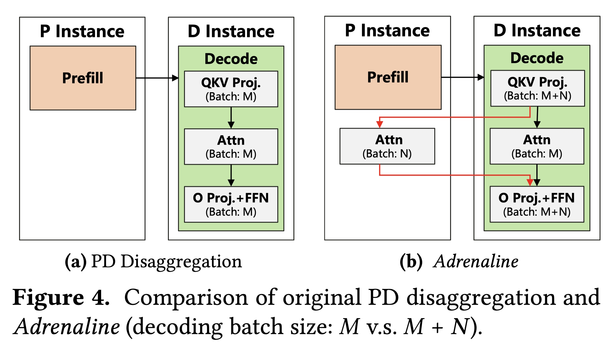 |  |  | [note](./notes/2025/Adrenaline/note.md) |
| [PSA](./meta/2025/PSA.prototxt) | [Progressive Sparse Attention: Algorithm and System Co-design for Efficient Attention in LLM Serving](http://arxiv.org/abs/2503.00392v1) |  |  |  | [note](./notes/2025/PSA/note.md) |

<b>Pengle Zhang</b>
 

| Meta | Title | Cover | Publish | Code | Note |
|:-----|:------|:------|:--------|:-----|:-----|
| [SageAttention2](./meta/2024/SageAttention2.prototxt) | [SageAttention2: Efficient Attention with Thorough Outlier Smoothing and Per-thread INT4 Quantization](http://arxiv.org/abs/2411.10958v6) |  |  |  | [note](./notes/2024/SageAttention2/note.md) |
| [SageAttention](./meta/2024/SageAttention.prototxt) | [SageAttention: Accurate 8-Bit Attention for Plug-and-play Inference Acceleration](http://arxiv.org/abs/2410.02367v8) |  |  |  | [note](./notes/2024/SageAttention/note.md) |
| [SageAttention3](./meta/2025/SageAttention3.prototxt) | [SageAttention3: Microscaling FP4 Attention for Inference and An Exploration of 8-Bit Training](http://arxiv.org/abs/2505.11594v1) |  |  |  | [note](./notes/2025/SageAttention3/note.md) |

<b>Pengyu Zhao</b>
 

| Meta | Title | Cover | Publish | Code | Note |
|:-----|:------|:------|:--------|:-----|:-----|
| [MiniMax-01](./meta/2025/MiniMax-01.prototxt) | [MiniMax-01: Scaling Foundation Models with Lightning Attention](http://arxiv.org/abs/2501.08313v1) |  |  |  | [note](./notes/2025/MiniMax-01/note.md) |
| [MiniMax-M1](./meta/2025/MiniMax-M1.prototxt) | [MiniMax-M1: Scaling Test-Time Compute Efficiently with Lightning Attention](http://arxiv.org/abs/2506.13585v1) |  |  |  | [note](./notes/2025/MiniMax-M1/note.md) |

<b>Ping Luo</b>
 

| Meta | Title | Cover | Publish | Code | Note |
|:-----|:------|:------|:--------|:-----|:-----|
| [OmniQuant](./meta/2023/omniquant.prototxt) | [OmniQuant: Omnidirectionally Calibrated Quantization for Large Language Models](https://arxiv.org/abs/2308.13137) |  |  |  |  |
| [PrefixQuant](./meta/2024/PrefixQuant.prototxt) | [PrefixQuant: Eliminating Outliers by Prefixed Tokens for Large Language Models Quantization](http://arxiv.org/abs/2410.05265v2) |  |  |  | [note](./notes/2024/PrefixQuant/note.md) |

<b>Qi Hou</b>
 

| Meta | Title | Cover | Publish | Code | Note |
|:-----|:------|:------|:--------|:-----|:-----|
| [FLUX](./meta/2024/FLUX.prototxt) | [FLUX: Fast Software-based Communication Overlap On GPUs Through Kernel Fusion](http://arxiv.org/abs/2406.06858v5) |  |  |  | [note](./notes/2024/FLUX/note.md) |
| [CometSeed](./meta/2025/CometSeed.prototxt) | [Comet: Fine-grained Computation-communication Overlapping for Mixture-of-Experts](http://arxiv.org/abs/2502.19811v3) |  |  |  | [note](./notes/2025/CometSeed/note.md) |
| [TileLink](./meta/2025/TileLink.prototxt) | [TileLink: Generating Efficient Compute-Communication Overlapping Kernels using Tile-Centric Primitives](http://arxiv.org/abs/2503.20313v3) |  |  |  | [note](./notes/2025/TileLink/note.md) |
| [Triton-distributed](./meta/2025/Triton-distributed.prototxt) | [Triton-distributed: Programming Overlapping Kernels on Distributed AI Systems with the Triton Compiler](http://arxiv.org/abs/2504.19442v3) |  |  |  | [note](./notes/2025/Triton-distributed/note.md) |

<b>Qianchao Zhu</b>
 

| Meta | Title | Cover | Publish | Code | Note |
|:-----|:------|:------|:--------|:-----|:-----|
| [Centauri](./meta/2024/Centauri.prototxt) | [Centauri: Enabling Efficient Scheduling for Communication-Computation Overlap in Large Model Training via Communication Partitioning](https://dl.acm.org/doi/10.1145/3620666.3651379) |  |  |  | [note](./notes/2024/Centauri/note.md) |
| [SampleAttention](./meta/2024/SampleAttention.prototxt) | [SampleAttention: Near-Lossless Acceleration of Long Context LLM Inference with Adaptive Structured Sparse Attention](http://arxiv.org/abs/2406.15486v2) |  |  |  | [note](./notes/2024/SampleAttention/note.md) |

<b>Qiancheng Wang</b>
 

| Meta | Title | Cover | Publish | Code | Note |
|:-----|:------|:------|:--------|:-----|:-----|
| [DeepSeek-V3](./meta/2024/DeepSeek-V3.prototxt) | [DeepSeek-V3 Technical Report](http://arxiv.org/abs/2412.19437v1) |  |  |  | [note](./notes/2024/DeepSeek-V3/note.md) |
| [DeepSeek-R1](./meta/2025/DeepSeek-R1.prototxt) | [DeepSeek-R1: Incentivizing Reasoning Capability in LLMs via Reinforcement Learning](http://arxiv.org/abs/2501.12948v1) |  |  |  | [note](./notes/2025/DeepSeek-R1/note.md) |

<b>Qianhui Wu</b>
 

| Meta | Title | Cover | Publish | Code | Note |
|:-----|:------|:------|:--------|:-----|:-----|
| [MInference](./meta/2024/MInference.prototxt) | [MInference 1.0: Accelerating Pre-filling for Long-Context LLMs via Dynamic Sparse Attention](http://arxiv.org/abs/2407.02490v1) |  |  |  | [note](./notes/2024/MInference/note.md) |
| [SCBench](./meta/2024/SCBench.prototxt) | [SCBench: A KV Cache-Centric Analysis of Long-Context Methods](http://arxiv.org/abs/2412.10319v2) |  |  |  | [note](./notes/2024/SCBench/note.md) |
| [MMInference](./meta/2025/MMInference.prototxt) | [MMInference: Accelerating Pre-filling for Long-Context VLMs via Modality-Aware Permutation Sparse Attention](https://openreview.net/forum?id=me6PfbATWM) |  |  |  | [note](./notes/2025/MMInference/note.md) |

<b>Qidi Xu</b>
 

| Meta | Title | Cover | Publish | Code | Note |
|:-----|:------|:------|:--------|:-----|:-----|
| [MiniMax-01](./meta/2025/MiniMax-01.prototxt) | [MiniMax-01: Scaling Foundation Models with Lightning Attention](http://arxiv.org/abs/2501.08313v1) |  |  |  | [note](./notes/2025/MiniMax-01/note.md) |
| [MiniMax-M1](./meta/2025/MiniMax-M1.prototxt) | [MiniMax-M1: Scaling Test-Time Compute Efficiently with Lightning Attention](http://arxiv.org/abs/2506.13585v1) |  |  |  | [note](./notes/2025/MiniMax-M1/note.md) |

<b>Qihao Zhu</b>
 

| Meta | Title | Cover | Publish | Code | Note |
|:-----|:------|:------|:--------|:-----|:-----|
| [DeepSeek-V2](./meta/2024/DeepSeek-V2.prototxt) | [DeepSeek-V2: A Strong, Economical, and Efficient Mixture-of-Experts Language Model](http://arxiv.org/abs/2405.04434v5) |  |  |  | [note](./notes/2024/DeepSeek-V2/note.md) |
| [DeepSeek-V3](./meta/2024/DeepSeek-V3.prototxt) | [DeepSeek-V3 Technical Report](http://arxiv.org/abs/2412.19437v1) |  |  |  | [note](./notes/2024/DeepSeek-V3/note.md) |
| [DeepSeek-R1](./meta/2025/DeepSeek-R1.prototxt) | [DeepSeek-R1: Incentivizing Reasoning Capability in LLMs via Reinforcement Learning](http://arxiv.org/abs/2501.12948v1) |  |  |  | [note](./notes/2025/DeepSeek-R1/note.md) |

<b>Qin Wang</b>
 

| Meta | Title | Cover | Publish | Code | Note |
|:-----|:------|:------|:--------|:-----|:-----|
| [MiniMax-01](./meta/2025/MiniMax-01.prototxt) | [MiniMax-01: Scaling Foundation Models with Lightning Attention](http://arxiv.org/abs/2501.08313v1) |  |  |  | [note](./notes/2025/MiniMax-01/note.md) |
| [MiniMax-M1](./meta/2025/MiniMax-M1.prototxt) | [MiniMax-M1: Scaling Test-Time Compute Efficiently with Lightning Attention](http://arxiv.org/abs/2506.13585v1) |  |  |  | [note](./notes/2025/MiniMax-M1/note.md) |

<b>Qingru Zhang</b>
 

| Meta | Title | Cover | Publish | Code | Note |
|:-----|:------|:------|:--------|:-----|:-----|
| [AdaLoRA](./meta/2023/adalora.prototxt) | [AdaLoRA: Adaptive Budget Allocation for Parameter-Efficient Fine-Tuning](https://arxiv.org/pdf/2303.10512.pdf) |  |  |  |  |
| [GEAR](./meta/2024/GEAR.prototxt) | [GEAR: An Efficient KV Cache Compression Recipe for Near-Lossless Generative Inference of LLM](http://arxiv.org/abs/2403.05527v4) |  |  |  | [note](./notes/2024/GEAR/note.md) |

<b>Qinkai Zheng</b>
 

| Meta | Title | Cover | Publish | Code | Note |
|:-----|:------|:------|:--------|:-----|:-----|
| [CodeGeeX](./meta/2023/CodeGeeX.prototxt) | [CodeGeeX: A Pre-Trained Model for Code Generation with Multilingual Benchmarking on HumanEval-X](http://arxiv.org/abs/2303.17568v2) |  |  |  | [note](./notes/2023/CodeGeeX/note.md) |
| [GLM-4.5](./meta/2025/GLM-4.5.prototxt) | [GLM-4.5: Agentic, Reasoning, and Coding (ARC) Foundation Models](http://arxiv.org/abs/2508.06471v1) |  |  |  | [note](./notes/2025/GLM-4.5/note.md) |

<b>Qinyu Chen</b>
 

| Meta | Title | Cover | Publish | Code | Note |
|:-----|:------|:------|:--------|:-----|:-----|
| [DeepSeek-V2](./meta/2024/DeepSeek-V2.prototxt) | [DeepSeek-V2: A Strong, Economical, and Efficient Mixture-of-Experts Language Model](http://arxiv.org/abs/2405.04434v5) |  |  |  | [note](./notes/2024/DeepSeek-V2/note.md) |
| [DeepSeek-V3](./meta/2024/DeepSeek-V3.prototxt) | [DeepSeek-V3 Technical Report](http://arxiv.org/abs/2412.19437v1) |  |  |  | [note](./notes/2024/DeepSeek-V3/note.md) |
| [DeepSeek-R1](./meta/2025/DeepSeek-R1.prototxt) | [DeepSeek-R1: Incentivizing Reasoning Capability in LLMs via Reinforcement Learning](http://arxiv.org/abs/2501.12948v1) |  |  |  | [note](./notes/2025/DeepSeek-R1/note.md) |
| [DeltaLLM](./meta/2025/DeltaLLM.prototxt) | [DeltaLLM: A Training-Free Framework Exploiting Temporal Sparsity for Efficient Edge LLM Inference](http://arxiv.org/abs/2507.19608v1) |  |  |  | [note](./notes/2025/DeltaLLM/note.md) |

<b>Qiushi Du</b>
 

| Meta | Title | Cover | Publish | Code | Note |
|:-----|:------|:------|:--------|:-----|:-----|
| [DeepSeek-V2](./meta/2024/DeepSeek-V2.prototxt) | [DeepSeek-V2: A Strong, Economical, and Efficient Mixture-of-Experts Language Model](http://arxiv.org/abs/2405.04434v5) |  |  |  | [note](./notes/2024/DeepSeek-V2/note.md) |
| [DeepSeek-V3](./meta/2024/DeepSeek-V3.prototxt) | [DeepSeek-V3 Technical Report](http://arxiv.org/abs/2412.19437v1) |  |  |  | [note](./notes/2024/DeepSeek-V3/note.md) |
| [DeepSeek-R1](./meta/2025/DeepSeek-R1.prototxt) | [DeepSeek-R1: Incentivizing Reasoning Capability in LLMs via Reinforcement Learning](http://arxiv.org/abs/2501.12948v1) |  |  |  | [note](./notes/2025/DeepSeek-R1/note.md) |

<b>R. J. Chen</b>
 

| Meta | Title | Cover | Publish | Code | Note |
|:-----|:------|:------|:--------|:-----|:-----|
| [DeepSeek-V2](./meta/2024/DeepSeek-V2.prototxt) | [DeepSeek-V2: A Strong, Economical, and Efficient Mixture-of-Experts Language Model](http://arxiv.org/abs/2405.04434v5) |  |  |  | [note](./notes/2024/DeepSeek-V2/note.md) |
| [DeepSeek-V3](./meta/2024/DeepSeek-V3.prototxt) | [DeepSeek-V3 Technical Report](http://arxiv.org/abs/2412.19437v1) |  |  |  | [note](./notes/2024/DeepSeek-V3/note.md) |
| [DeepSeek-R1](./meta/2025/DeepSeek-R1.prototxt) | [DeepSeek-R1: Incentivizing Reasoning Capability in LLMs via Reinforcement Learning](http://arxiv.org/abs/2501.12948v1) |  |  |  | [note](./notes/2025/DeepSeek-R1/note.md) |

<b>R. L. Jin</b>
 

| Meta | Title | Cover | Publish | Code | Note |
|:-----|:------|:------|:--------|:-----|:-----|
| [DeepSeek-V2](./meta/2024/DeepSeek-V2.prototxt) | [DeepSeek-V2: A Strong, Economical, and Efficient Mixture-of-Experts Language Model](http://arxiv.org/abs/2405.04434v5) |  |  |  | [note](./notes/2024/DeepSeek-V2/note.md) |
| [DeepSeek-V3](./meta/2024/DeepSeek-V3.prototxt) | [DeepSeek-V3 Technical Report](http://arxiv.org/abs/2412.19437v1) |  |  |  | [note](./notes/2024/DeepSeek-V3/note.md) |
| [DeepSeek-R1](./meta/2025/DeepSeek-R1.prototxt) | [DeepSeek-R1: Incentivizing Reasoning Capability in LLMs via Reinforcement Learning](http://arxiv.org/abs/2501.12948v1) |  |  |  | [note](./notes/2025/DeepSeek-R1/note.md) |

<b>Ramachandran Ramjee</b>
 

| Meta | Title | Cover | Publish | Code | Note |
|:-----|:------|:------|:--------|:-----|:-----|
| [Vidur](./meta/2024/Vidur.prototxt) | [Vidur: A Large-Scale Simulation Framework For LLM Inference](http://arxiv.org/abs/2405.05465v2) |  |  |  | [note](./notes/2024/Vidur/note.md) |
| [POD-Attention](./meta/2025/POD-Attention.prototxt) | [POD-Attention: Unlocking Full Prefill-Decode Overlap for Faster LLM Inference](http://arxiv.org/abs/2410.18038v2) |  |  |  | [note](./notes/2025/POD-Attention/note.md) |
| [vAttention](./meta/2025/vAttention.prototxt) | [vAttention: Dynamic Memory Management for Serving LLMs without PagedAttention](http://arxiv.org/abs/2405.04437v3) |  |  |  | [note](./notes/2025/vAttention/note.md) |
| [TokenWeave](./meta/2025/TokenWeave.prototxt) | [TokenWeave: Efficient Compute-Communication Overlap for Distributed LLM Inference](http://arxiv.org/abs/2505.11329v1) |  |  |  | [note](./notes/2025/TokenWeave/note.md) |

<b>Ramya Prabhu</b>
 

| Meta | Title | Cover | Publish | Code | Note |
|:-----|:------|:------|:--------|:-----|:-----|
| [POD-Attention](./meta/2025/POD-Attention.prototxt) | [POD-Attention: Unlocking Full Prefill-Decode Overlap for Faster LLM Inference](http://arxiv.org/abs/2410.18038v2) |  |  |  | [note](./notes/2025/POD-Attention/note.md) |
| [vAttention](./meta/2025/vAttention.prototxt) | [vAttention: Dynamic Memory Management for Serving LLMs without PagedAttention](http://arxiv.org/abs/2405.04437v3) |  |  |  | [note](./notes/2025/vAttention/note.md) |

<b>Rayan Saab</b>
 

| Meta | Title | Cover | Publish | Code | Note |
|:-----|:------|:------|:--------|:-----|:-----|
| [GPFQ](./meta/2021/gpfq.prototxt) | [A Greedy Algorithm for Quantizing Neural Networks](https://jmlr.csail.mit.edu/papers/volume22/20-1233/20-1233.pdf) |  |  |  |  |
| [GPFQv2](./meta/2023/gpfqv2.prototxt) | [Post-training Quantization for Neural Networks with Provable Guarantees](https://arxiv.org/pdf/2201.11113.pdf) |  |  |  |  |

<b>Roy Schwartz</b>
 

| Meta | Title | Cover | Publish | Code | Note |
|:-----|:------|:------|:--------|:-----|:-----|
| [m](./meta/2023/68I8KKBV.prototxt) | [Efficient Methods for Natural Language Processing: A Survey](https://arxiv.org/abs/2209.00099) |  |  |  |  |
| [TOVA](./meta/2024/TOVA.prototxt) | [Transformers are Multi-State RNNs](http://arxiv.org/abs/2401.06104v2) |  |  |  | [note](./notes/2024/TOVA/note.md) |

<b>Rui Men</b>
 

| Meta | Title | Cover | Publish | Code | Note |
|:-----|:------|:------|:--------|:-----|:-----|
| [GatedAttention](./meta/2025/GatedAttention.prototxt) | [Gated Attention for Large Language Models: Non-linearity, Sparsity, and Attention-Sink-Free](http://arxiv.org/abs/2505.06708v1) |  |  |  | [note](./notes/2025/GatedAttention/note.md) |
| [Qwen3](./meta/2025/Qwen3.prototxt) | [Qwen3 Technical Report](http://arxiv.org/abs/2505.09388v1) |  |  |  | [note](./notes/2025/Qwen3/note.md) |

<b>Ruihang Lai</b>
 

| Meta | Title | Cover | Publish | Code | Note |
|:-----|:------|:------|:--------|:-----|:-----|
| [XGrammar](./meta/2024/XGrammar.prototxt) | [XGrammar: Flexible and Efficient Structured Generation Engine for Large Language Models](http://arxiv.org/abs/2411.15100v2) |  |  |  | [note](./notes/2024/XGrammar/note.md) |
| [FlashInfer](./meta/2025/FlashInfer.prototxt) | [FlashInfer: Efficient and Customizable Attention Engine for LLM Inference Serving](http://arxiv.org/abs/2501.01005v2) |  |  |  | [note](./notes/2025/FlashInfer/note.md) |

<b>Ruihao Gong</b>
 

| Meta | Title | Cover | Publish | Code | Note |
|:-----|:------|:------|:--------|:-----|:-----|
| [BRECQ](./meta/2021/brecq.prototxt) | [BRECQ: Pushing the Limit of Post-Training Quantization by Block Reconstruction](https://openreview.net/pdf?id=POWv6hDd9XH) |  |  |  |  |
| [MoDES](./meta/2025/MoDES.prototxt) | [MoDES: Accelerating Mixture-of-Experts Multimodal Large Language Models via Dynamic Expert Skipping](http://arxiv.org/abs/2511.15690v1) |  |  |  | [note](./notes/2025/MoDES/note.md) |

<b>Ruiqi Ge</b>
 

| Meta | Title | Cover | Publish | Code | Note |
|:-----|:------|:------|:--------|:-----|:-----|
| [DeepSeek-V2](./meta/2024/DeepSeek-V2.prototxt) | [DeepSeek-V2: A Strong, Economical, and Efficient Mixture-of-Experts Language Model](http://arxiv.org/abs/2405.04434v5) |  |  |  | [note](./notes/2024/DeepSeek-V2/note.md) |
| [DeepSeek-V3](./meta/2024/DeepSeek-V3.prototxt) | [DeepSeek-V3 Technical Report](http://arxiv.org/abs/2412.19437v1) |  |  |  | [note](./notes/2024/DeepSeek-V3/note.md) |
| [DeepSeek-R1](./meta/2025/DeepSeek-R1.prototxt) | [DeepSeek-R1: Incentivizing Reasoning Capability in LLMs via Reinforcement Learning](http://arxiv.org/abs/2501.12948v1) |  |  |  | [note](./notes/2025/DeepSeek-R1/note.md) |

<b>Ruisong Zhang</b>
 

| Meta | Title | Cover | Publish | Code | Note |
|:-----|:------|:------|:--------|:-----|:-----|
| [DeepSeek-V3](./meta/2024/DeepSeek-V3.prototxt) | [DeepSeek-V3 Technical Report](http://arxiv.org/abs/2412.19437v1) |  |  |  | [note](./notes/2024/DeepSeek-V3/note.md) |
| [DeepSeek-R1](./meta/2025/DeepSeek-R1.prototxt) | [DeepSeek-R1: Incentivizing Reasoning Capability in LLMs via Reinforcement Learning](http://arxiv.org/abs/2501.12948v1) |  |  |  | [note](./notes/2025/DeepSeek-R1/note.md) |

<b>Ruitao Leng</b>
 

| Meta | Title | Cover | Publish | Code | Note |
|:-----|:------|:------|:--------|:-----|:-----|
| [MiniMax-01](./meta/2025/MiniMax-01.prototxt) | [MiniMax-01: Scaling Foundation Models with Lightning Attention](http://arxiv.org/abs/2501.08313v1) |  |  |  | [note](./notes/2025/MiniMax-01/note.md) |
| [MiniMax-M1](./meta/2025/MiniMax-M1.prototxt) | [MiniMax-M1: Scaling Test-Time Compute Efficiently with Lightning Attention](http://arxiv.org/abs/2506.13585v1) |  |  |  | [note](./notes/2025/MiniMax-M1/note.md) |

<b>Ruizhe Pan</b>
 

| Meta | Title | Cover | Publish | Code | Note |
|:-----|:------|:------|:--------|:-----|:-----|
| [DeepSeek-V2](./meta/2024/DeepSeek-V2.prototxt) | [DeepSeek-V2: A Strong, Economical, and Efficient Mixture-of-Experts Language Model](http://arxiv.org/abs/2405.04434v5) |  |  |  | [note](./notes/2024/DeepSeek-V2/note.md) |
| [DeepSeek-V3](./meta/2024/DeepSeek-V3.prototxt) | [DeepSeek-V3 Technical Report](http://arxiv.org/abs/2412.19437v1) |  |  |  | [note](./notes/2024/DeepSeek-V3/note.md) |
| [DeepSeek-R1](./meta/2025/DeepSeek-R1.prototxt) | [DeepSeek-R1: Incentivizing Reasoning Capability in LLMs via Reinforcement Learning](http://arxiv.org/abs/2501.12948v1) |  |  |  | [note](./notes/2025/DeepSeek-R1/note.md) |

<b>Runji Wang</b>
 

| Meta | Title | Cover | Publish | Code | Note |
|:-----|:------|:------|:--------|:-----|:-----|
| [DeepSeek-V3](./meta/2024/DeepSeek-V3.prototxt) | [DeepSeek-V3 Technical Report](http://arxiv.org/abs/2412.19437v1) |  |  |  | [note](./notes/2024/DeepSeek-V3/note.md) |
| [DeepSeek-R1](./meta/2025/DeepSeek-R1.prototxt) | [DeepSeek-R1: Incentivizing Reasoning Capability in LLMs via Reinforcement Learning](http://arxiv.org/abs/2501.12948v1) |  |  |  | [note](./notes/2025/DeepSeek-R1/note.md) |

<b>Runxin Xu</b>
 

| Meta | Title | Cover | Publish | Code | Note |
|:-----|:------|:------|:--------|:-----|:-----|
| [DeepSeek-V2](./meta/2024/DeepSeek-V2.prototxt) | [DeepSeek-V2: A Strong, Economical, and Efficient Mixture-of-Experts Language Model](http://arxiv.org/abs/2405.04434v5) |  |  |  | [note](./notes/2024/DeepSeek-V2/note.md) |
| [DeepSeek-V3](./meta/2024/DeepSeek-V3.prototxt) | [DeepSeek-V3 Technical Report](http://arxiv.org/abs/2412.19437v1) |  |  |  | [note](./notes/2024/DeepSeek-V3/note.md) |
| [DeepSeek-R1](./meta/2025/DeepSeek-R1.prototxt) | [DeepSeek-R1: Incentivizing Reasoning Capability in LLMs via Reinforcement Learning](http://arxiv.org/abs/2501.12948v1) |  |  |  | [note](./notes/2025/DeepSeek-R1/note.md) |

<b>Ruoyu Zhang</b>
 

| Meta | Title | Cover | Publish | Code | Note |
|:-----|:------|:------|:--------|:-----|:-----|
| [DeepSeek-V3](./meta/2024/DeepSeek-V3.prototxt) | [DeepSeek-V3 Technical Report](http://arxiv.org/abs/2412.19437v1) |  |  |  | [note](./notes/2024/DeepSeek-V3/note.md) |
| [DeepSeek-R1](./meta/2025/DeepSeek-R1.prototxt) | [DeepSeek-R1: Incentivizing Reasoning Capability in LLMs via Reinforcement Learning](http://arxiv.org/abs/2501.12948v1) |  |  |  | [note](./notes/2025/DeepSeek-R1/note.md) |

<b>Ruyi Chen</b>
 

| Meta | Title | Cover | Publish | Code | Note |
|:-----|:------|:------|:--------|:-----|:-----|
| [DeepSeek-V2](./meta/2024/DeepSeek-V2.prototxt) | [DeepSeek-V2: A Strong, Economical, and Efficient Mixture-of-Experts Language Model](http://arxiv.org/abs/2405.04434v5) |  |  |  | [note](./notes/2024/DeepSeek-V2/note.md) |
| [DeepSeek-V3](./meta/2024/DeepSeek-V3.prototxt) | [DeepSeek-V3 Technical Report](http://arxiv.org/abs/2412.19437v1) |  |  |  | [note](./notes/2024/DeepSeek-V3/note.md) |
| [DeepSeek-R1](./meta/2025/DeepSeek-R1.prototxt) | [DeepSeek-R1: Incentivizing Reasoning Capability in LLMs via Reinforcement Learning](http://arxiv.org/abs/2501.12948v1) |  |  |  | [note](./notes/2025/DeepSeek-R1/note.md) |

<b>S. S. Li</b>
 

| Meta | Title | Cover | Publish | Code | Note |
|:-----|:------|:------|:--------|:-----|:-----|
| [DeepSeek-V2](./meta/2024/DeepSeek-V2.prototxt) | [DeepSeek-V2: A Strong, Economical, and Efficient Mixture-of-Experts Language Model](http://arxiv.org/abs/2405.04434v5) |  |  |  | [note](./notes/2024/DeepSeek-V2/note.md) |
| [DeepSeek-V3](./meta/2024/DeepSeek-V3.prototxt) | [DeepSeek-V3 Technical Report](http://arxiv.org/abs/2412.19437v1) |  |  |  | [note](./notes/2024/DeepSeek-V3/note.md) |
| [DeepSeek-R1](./meta/2025/DeepSeek-R1.prototxt) | [DeepSeek-R1: Incentivizing Reasoning Capability in LLMs via Reinforcement Learning](http://arxiv.org/abs/2501.12948v1) |  |  |  | [note](./notes/2025/DeepSeek-R1/note.md) |

<b>Saeed Maleki</b>
 

| Meta | Title | Cover | Publish | Code | Note |
|:-----|:------|:------|:--------|:-----|:-----|
| [CoCoNet](./meta/2022/CoCoNet.prototxt) | [Breaking the Computation and Communication Abstraction Barrier in Distributed Machine Learning Workloads](http://arxiv.org/abs/2105.05720v5) |  |  |  | [note](./notes/2022/CoCoNet/note.md) |
| [Splitwise](./meta/2024/Splitwise.prototxt) | [Splitwise: Efficient generative LLM inference using phase splitting](http://arxiv.org/abs/2311.18677v2) |  |  |  | [note](./notes/2024/Splitwise/note.md) |

<b>Sangmin Bae</b>
 

| Meta | Title | Cover | Publish | Code | Note |
|:-----|:------|:------|:--------|:-----|:-----|
| [RecursiveTransformers](./meta/2025/RecursiveTransformers.prototxt) | [Relaxed Recursive Transformers: Effective Parameter Sharing with Layer-wise LoRA](http://arxiv.org/abs/2410.20672v3) |  |  |  | [note](./notes/2025/RecursiveTransformers/note.md) |
| [MoR](./meta/2025/MoR.prototxt) | [Mixture-of-Recursions: Learning Dynamic Recursive Depths for Adaptive Token-Level Computation](http://arxiv.org/abs/2507.10524v1) |  |  |  | [note](./notes/2025/MoR/note.md) |

<b>Saurav Muralidharan</b>
 

| Meta | Title | Cover | Publish | Code | Note |
|:-----|:------|:------|:--------|:-----|:-----|
| [MaskLLM](./meta/2024/MaskLLM.prototxt) | [MaskLLM: Learnable Semi-Structured Sparsity for Large Language Models](http://arxiv.org/abs/2409.17481v1) |  |  |  | [note](./notes/2024/MaskLLM/note.md) |
| [Minitron](./meta/2024/Minitron.prototxt) | [Compact Language Models via Pruning and Knowledge Distillation](https://arxiv.org/abs/2408.11796v2) |  |  |  | [note](./notes/2024/Minitron/note.md) |

<b>Sean Lie</b>
 

| Meta | Title | Cover | Publish | Code | Note |
|:-----|:------|:------|:--------|:-----|:-----|
| [Sparse-IFT](./meta/2023/Sparse-IFT.prototxt) | [Sparse Iso-FLOP Transformations for Maximizing Training Efficiency](https://arxiv.org/abs/2303.11525) |  |  |  |  |
| [Sparse-IFT](./meta/2024/Sparse-IFT.prototxt) | [Sparse-IFT: Sparse Iso-FLOP Transformations for Maximizing Training Efficiency](http://arxiv.org/abs/2303.11525v3) |  |  |  | [note](./notes/2024/Sparse-IFT/note.md) |
| [m](./meta/2024/ULY1AZGY.prototxt) | [Enabling High-Sparsity Foundational Llama Models with Efficient Pretraining and Deployment](http://arxiv.org/abs/2405.03594v1) |  |  |  | [note](./notes/2024/ULY1AZGY/note.md) |

<b>Sehoon Kim</b>
 

| Meta | Title | Cover | Publish | Code | Note |
|:-----|:------|:------|:--------|:-----|:-----|
| [FisherPruning](./meta/2022/fisherpruning.prototxt) | [A Fast Post-Training Pruning Framework for Transformers](http://arxiv.org/abs/2204.09656v2) |  |  |  | [note](./notes/2022/fisherpruning/note.md) |
| [SqueezeLLM](./meta/2024/SqueezeLLM.prototxt) | [SqueezeLLM: Dense-and-Sparse Quantization](http://arxiv.org/abs/2306.07629) |  |  |  | [note](./notes/2024/SqueezeLLM/note.md) |
| [KVQuant](./meta/2024/KVQuant.prototxt) | [KVQuant: Towards 10 Million Context Length LLM Inference with KV Cache Quantization](http://arxiv.org/abs/2401.18079) |  |  |  | [note](./notes/2024/KVQuant/note.md) |

<b>Shang Yang</b>
 

| Meta | Title | Cover | Publish | Code | Note |
|:-----|:------|:------|:--------|:-----|:-----|
| [AWQ](./meta/2024/awq.prototxt) | [AWQ: Activation-aware Weight Quantization for LLM Compression and Acceleration](https://arxiv.org/abs/2306.00978) |  |  |  |  |
| [DuoAttention](./meta/2024/DuoAttention.prototxt) | [DuoAttention: Efficient Long-Context LLM Inference with Retrieval and Streaming Heads](http://arxiv.org/abs/2410.10819v1) |  |  |  | [note](./notes/2024/DuoAttention/note.md) |
| [QServe](./meta/2024/QServer.prototxt) | [QServe: W4A8KV4 Quantization and System Co-design for Efficient LLM Serving](http://arxiv.org/abs/2405.04532v2) |  |  | [Pytorch](https://hanlab.mit.edu/projects/qserve) | [note](./notes/2024/QServer/note.md) |
| [LServer](./meta/2025/LServer.prototxt) | [LServe: Efficient Long-sequence LLM Serving with Unified Sparse Attention](http://arxiv.org/abs/2502.14866v1) |  |  |  | [note](./notes/2025/LServer/note.md) |

<b>Shanghao Lu</b>
 

| Meta | Title | Cover | Publish | Code | Note |
|:-----|:------|:------|:--------|:-----|:-----|
| [DeepSeek-V2](./meta/2024/DeepSeek-V2.prototxt) | [DeepSeek-V2: A Strong, Economical, and Efficient Mixture-of-Experts Language Model](http://arxiv.org/abs/2405.04434v5) |  |  |  | [note](./notes/2024/DeepSeek-V2/note.md) |
| [DeepSeek-V3](./meta/2024/DeepSeek-V3.prototxt) | [DeepSeek-V3 Technical Report](http://arxiv.org/abs/2412.19437v1) |  |  |  | [note](./notes/2024/DeepSeek-V3/note.md) |
| [DeepSeek-R1](./meta/2025/DeepSeek-R1.prototxt) | [DeepSeek-R1: Incentivizing Reasoning Capability in LLMs via Reinforcement Learning](http://arxiv.org/abs/2501.12948v1) |  |  |  | [note](./notes/2025/DeepSeek-R1/note.md) |

<b>Shangyan Zhou</b>
 

| Meta | Title | Cover | Publish | Code | Note |
|:-----|:------|:------|:--------|:-----|:-----|
| [DeepSeek-V2](./meta/2024/DeepSeek-V2.prototxt) | [DeepSeek-V2: A Strong, Economical, and Efficient Mixture-of-Experts Language Model](http://arxiv.org/abs/2405.04434v5) |  |  |  | [note](./notes/2024/DeepSeek-V2/note.md) |
| [DeepSeek-V3](./meta/2024/DeepSeek-V3.prototxt) | [DeepSeek-V3 Technical Report](http://arxiv.org/abs/2412.19437v1) |  |  |  | [note](./notes/2024/DeepSeek-V3/note.md) |
| [DeepSeek-R1](./meta/2025/DeepSeek-R1.prototxt) | [DeepSeek-R1: Incentivizing Reasoning Capability in LLMs via Reinforcement Learning](http://arxiv.org/abs/2501.12948v1) |  |  |  | [note](./notes/2025/DeepSeek-R1/note.md) |

<b>Shanhuang Chen</b>
 

| Meta | Title | Cover | Publish | Code | Note |
|:-----|:------|:------|:--------|:-----|:-----|
| [DeepSeek-V2](./meta/2024/DeepSeek-V2.prototxt) | [DeepSeek-V2: A Strong, Economical, and Efficient Mixture-of-Experts Language Model](http://arxiv.org/abs/2405.04434v5) |  |  |  | [note](./notes/2024/DeepSeek-V2/note.md) |
| [DeepSeek-V3](./meta/2024/DeepSeek-V3.prototxt) | [DeepSeek-V3 Technical Report](http://arxiv.org/abs/2412.19437v1) |  |  |  | [note](./notes/2024/DeepSeek-V3/note.md) |
| [DeepSeek-R1](./meta/2025/DeepSeek-R1.prototxt) | [DeepSeek-R1: Incentivizing Reasoning Capability in LLMs via Reinforcement Learning](http://arxiv.org/abs/2501.12948v1) |  |  |  | [note](./notes/2025/DeepSeek-R1/note.md) |

<b>Shaoqing Wu</b>
 

| Meta | Title | Cover | Publish | Code | Note |
|:-----|:------|:------|:--------|:-----|:-----|
| [DeepSeek-V2](./meta/2024/DeepSeek-V2.prototxt) | [DeepSeek-V2: A Strong, Economical, and Efficient Mixture-of-Experts Language Model](http://arxiv.org/abs/2405.04434v5) |  |  |  | [note](./notes/2024/DeepSeek-V2/note.md) |
| [DeepSeek-V3](./meta/2024/DeepSeek-V3.prototxt) | [DeepSeek-V3 Technical Report](http://arxiv.org/abs/2412.19437v1) |  |  |  | [note](./notes/2024/DeepSeek-V3/note.md) |
| [DeepSeek-R1](./meta/2025/DeepSeek-R1.prototxt) | [DeepSeek-R1: Incentivizing Reasoning Capability in LLMs via Reinforcement Learning](http://arxiv.org/abs/2501.12948v1) |  |  |  | [note](./notes/2025/DeepSeek-R1/note.md) |

<b>Shengding Hu</b>
 

| Meta | Title | Cover | Publish | Code | Note |
|:-----|:------|:------|:--------|:-----|:-----|
| [InfiniteBench](./meta/2024/InfiniteBench.prototxt) | [$\infty$Bench: Extending Long Context Evaluation Beyond 100K Tokens](http://arxiv.org/abs/2402.13718v3) |  |  |  | [note](./notes/2024/InfiniteBench/note.md) |
| [ProSparse](./meta/2024/ProSparse.prototxt) | [ProSparse: Introducing and Enhancing Intrinsic Activation Sparsity within Large Language Models](https://arxiv.org/abs/2402.13516) |  |  |  | [note](./notes/2024/ProSparse/note.md) |

<b>Shengen Yan</b>
 

| Meta | Title | Cover | Publish | Code | Note |
|:-----|:------|:------|:--------|:-----|:-----|
| [m](./meta/2024/DHIB73MC.prototxt) | [A Survey on Efficient Inference for Large Language Models](http://arxiv.org/abs/2404.14294v2) |  |  |  | [note](./notes/2024/DHIB73MC/note.md) |
| [MoA](./meta/2024/MoA.prototxt) | [MoA: Mixture of Sparse Attention for Automatic Large Language Model Compression](http://arxiv.org/abs/2406.14909v2) |  |  |  | [note](./notes/2024/MoA/note.md) |

<b>Shengfeng Ye</b>
 

| Meta | Title | Cover | Publish | Code | Note |
|:-----|:------|:------|:--------|:-----|:-----|
| [DeepSeek-V2](./meta/2024/DeepSeek-V2.prototxt) | [DeepSeek-V2: A Strong, Economical, and Efficient Mixture-of-Experts Language Model](http://arxiv.org/abs/2405.04434v5) |  |  |  | [note](./notes/2024/DeepSeek-V2/note.md) |
| [DeepSeek-R1](./meta/2025/DeepSeek-R1.prototxt) | [DeepSeek-R1: Incentivizing Reasoning Capability in LLMs via Reinforcement Learning](http://arxiv.org/abs/2501.12948v1) |  | ](https://github.com/deepseek-ai/DeepSeek-R1)--green) | [note](./notes/2025/DeepSeek-R1/note.md) | None |
| [DeepSeek-R1](./meta/2025/DeepSeek-R1.prototxt) | [DeepSeek-R1: Incentivizing Reasoning Capability in LLMs via Reinforcement Learning](http://arxiv.org/abs/2501.12948v1) |  | ](https://github.com/deepseek-ai/DeepSeek-R1)--green) | [note](./notes/2025/DeepSeek-R1/note.md) | None |
| [DeepSeek-V3](./meta/2024/DeepSeek-V3.prototxt) | [DeepSeek-V3 Technical Report](http://arxiv.org/abs/2412.19437v1) |  | ](https://github.com/deepseek-ai/DeepSeek-V3)--green) | [note](./notes/2024/DeepSeek-V3/note.md) | None |
| [DeepSeek-V3](./meta/2024/DeepSeek-V3.prototxt) | [DeepSeek-V3 Technical Report](http://arxiv.org/abs/2412.19437v1) |  | ](https://github.com/deepseek-ai/DeepSeek-V3)--green) | [note](./notes/2024/DeepSeek-V3/note.md) | None |

<b>Shengmin Shi</b>
 

| Meta | Title | Cover | Publish | Code | Note |
|:-----|:------|:------|:--------|:-----|:-----|
| [MiniMax-01](./meta/2025/MiniMax-01.prototxt) | [MiniMax-01: Scaling Foundation Models with Lightning Attention](http://arxiv.org/abs/2501.08313v1) |  |  |  | [note](./notes/2025/MiniMax-01/note.md) |
| [MiniMax-M1](./meta/2025/MiniMax-M1.prototxt) | [MiniMax-M1: Scaling Test-Time Compute Efficiently with Lightning Attention](http://arxiv.org/abs/2506.13585v1) |  |  |  | [note](./notes/2025/MiniMax-M1/note.md) |

<b>Shijie Cao</b>
 

| Meta | Title | Cover | Publish | Code | Note |
|:-----|:------|:------|:--------|:-----|:-----|
| [SeerAttention](./meta/2024/SeerAttention.prototxt) | [SeerAttention: Learning Intrinsic Sparse Attention in Your LLMs](http://arxiv.org/abs/2410.13276v2) |  |  |  | [note](./notes/2024/SeerAttention/note.md) |
| [ReSA](./meta/2025/ReSA.prototxt) | [Rectified Sparse Attention](http://arxiv.org/abs/2506.04108v2) |  |  |  | [note](./notes/2025/ReSA/note.md) |
| [SeerAttention-R](./meta/2025/SeerAttention-R.prototxt) | [SeerAttention-R: Sparse Attention Adaptation for Long Reasoning](http://arxiv.org/abs/2506.08889v1) |  |  |  | [note](./notes/2025/SeerAttention-R/note.md) |

<b>Shirong Ma</b>
 

| Meta | Title | Cover | Publish | Code | Note |
|:-----|:------|:------|:--------|:-----|:-----|
| [DeepSeek-V2](./meta/2024/DeepSeek-V2.prototxt) | [DeepSeek-V2: A Strong, Economical, and Efficient Mixture-of-Experts Language Model](http://arxiv.org/abs/2405.04434v5) |  |  |  | [note](./notes/2024/DeepSeek-V2/note.md) |
| [DeepSeek-V3](./meta/2024/DeepSeek-V3.prototxt) | [DeepSeek-V3 Technical Report](http://arxiv.org/abs/2412.19437v1) |  |  |  | [note](./notes/2024/DeepSeek-V3/note.md) |
| [DeepSeek-R1](./meta/2025/DeepSeek-R1.prototxt) | [DeepSeek-R1: Incentivizing Reasoning Capability in LLMs via Reinforcement Learning](http://arxiv.org/abs/2501.12948v1) |  |  |  | [note](./notes/2025/DeepSeek-R1/note.md) |

<b>Shiwei Liu</b>
 

| Meta | Title | Cover | Publish | Code | Note |
|:-----|:------|:------|:--------|:-----|:-----|
| [m](./meta/2023/AYB1XUO5.prototxt) | [Ten Lessons We Have Learned in the New Sparseland: A Short Handbook for Sparse Neural Network Researchers](https://arxiv.org/abs/2302.02596) |  |  |  |  |
| [Essential Sparsity](./meta/2023/EssentialSparsity.prototxt) | [The Emergence of Essential Sparsity in Large Pre-trained Models: The Weights that Matter](https://arxiv.org/abs/2306.03805) |  |  |  |  |
| [DSnoT](./meta/2024/DSnoT.prototxt) | [Dynamic Sparse No Training: Training-Free Fine-tuning for Sparse LLMs](http://arxiv.org/abs/2310.08915v3) |  |  |  | [note](./notes/2024/DSnoT/note.md) |
| [OWL](./meta/2024/owl.prototxt) | [Outlier Weighed Layerwise Sparsity (OWL): A Missing Secret Sauce for Pruning LLMs to High Sparsity](https://arxiv.org/pdf/2310.05175.pdf) |  |  |  |  |

<b>Shiyao Li</b>
 

| Meta | Title | Cover | Publish | Code | Note |
|:-----|:------|:------|:--------|:-----|:-----|
| [m](./meta/2024/DHIB73MC.prototxt) | [A Survey on Efficient Inference for Large Language Models](http://arxiv.org/abs/2404.14294v2) |  |  |  | [note](./notes/2024/DHIB73MC/note.md) |
| [MoA](./meta/2024/MoA.prototxt) | [MoA: Mixture of Sparse Attention for Automatic Large Language Model Compression](http://arxiv.org/abs/2406.14909v2) |  |  |  | [note](./notes/2024/MoA/note.md) |

<b>Shiyu Chang</b>
 

| Meta | Title | Cover | Publish | Code | Note |
|:-----|:------|:------|:--------|:-----|:-----|
| [IFPruning](./meta/2025/IFPruning.prototxt) | [Instruction-Following Pruning for Large Language Models](http://arxiv.org/abs/2501.02086v2) |  |  |  | [note](./notes/2025/IFPruning/note.md) |
| [KVLink](./meta/2025/KVLink.prototxt) | [KVLink: Accelerating Large Language Models via Efficient KV Cache Reuse](http://arxiv.org/abs/2502.16002v1) |  |  |  | [note](./notes/2025/KVLink/note.md) |

<b>Shiyu Wang</b>
 

| Meta | Title | Cover | Publish | Code | Note |
|:-----|:------|:------|:--------|:-----|:-----|
| [DeepSeek-V2](./meta/2024/DeepSeek-V2.prototxt) | [DeepSeek-V2: A Strong, Economical, and Efficient Mixture-of-Experts Language Model](http://arxiv.org/abs/2405.04434v5) |  |  |  | [note](./notes/2024/DeepSeek-V2/note.md) |
| [DeepSeek-V3](./meta/2024/DeepSeek-V3.prototxt) | [DeepSeek-V3 Technical Report](http://arxiv.org/abs/2412.19437v1) |  |  |  | [note](./notes/2024/DeepSeek-V3/note.md) |
| [DeepSeek-R1](./meta/2025/DeepSeek-R1.prototxt) | [DeepSeek-R1: Incentivizing Reasoning Capability in LLMs via Reinforcement Learning](http://arxiv.org/abs/2501.12948v1) |  |  |  | [note](./notes/2025/DeepSeek-R1/note.md) |

<b>Shreyas Saxena</b>
 

| Meta | Title | Cover | Publish | Code | Note |
|:-----|:------|:------|:--------|:-----|:-----|
| [SPDF](./meta/2023/spdf.prototxt) | [SPDF: Sparse Pre-training and Dense Fine-tuning for Large Language Models](https://arxiv.org/abs/2303.10464) |  |  |  |  |
| [Sparse-IFT](./meta/2023/Sparse-IFT.prototxt) | [Sparse Iso-FLOP Transformations for Maximizing Training Efficiency](https://arxiv.org/abs/2303.11525) |  |  |  |  |
| [Sparse-IFT](./meta/2024/Sparse-IFT.prototxt) | [Sparse-IFT: Sparse Iso-FLOP Transformations for Maximizing Training Efficiency](http://arxiv.org/abs/2303.11525v3) |  |  |  | [note](./notes/2024/Sparse-IFT/note.md) |

<b>Shuang Zhou</b>
 

| Meta | Title | Cover | Publish | Code | Note |
|:-----|:------|:------|:--------|:-----|:-----|
| [DeepSeek-V2](./meta/2024/DeepSeek-V2.prototxt) | [DeepSeek-V2: A Strong, Economical, and Efficient Mixture-of-Experts Language Model](http://arxiv.org/abs/2405.04434v5) |  |  |  | [note](./notes/2024/DeepSeek-V2/note.md) |
| [DeepSeek-V3](./meta/2024/DeepSeek-V3.prototxt) | [DeepSeek-V3 Technical Report](http://arxiv.org/abs/2412.19437v1) |  |  |  | [note](./notes/2024/DeepSeek-V3/note.md) |
| [DeepSeek-R1](./meta/2025/DeepSeek-R1.prototxt) | [DeepSeek-R1: Incentivizing Reasoning Capability in LLMs via Reinforcement Learning](http://arxiv.org/abs/2501.12948v1) |  |  |  | [note](./notes/2025/DeepSeek-R1/note.md) |

<b>Shuiping Yu</b>
 

| Meta | Title | Cover | Publish | Code | Note |
|:-----|:------|:------|:--------|:-----|:-----|
| [DeepSeek-V2](./meta/2024/DeepSeek-V2.prototxt) | [DeepSeek-V2: A Strong, Economical, and Efficient Mixture-of-Experts Language Model](http://arxiv.org/abs/2405.04434v5) |  |  |  | [note](./notes/2024/DeepSeek-V2/note.md) |
| [DeepSeek-V3](./meta/2024/DeepSeek-V3.prototxt) | [DeepSeek-V3 Technical Report](http://arxiv.org/abs/2412.19437v1) |  |  |  | [note](./notes/2024/DeepSeek-V3/note.md) |
| [DeepSeek-R1](./meta/2025/DeepSeek-R1.prototxt) | [DeepSeek-R1: Incentivizing Reasoning Capability in LLMs via Reinforcement Learning](http://arxiv.org/abs/2501.12948v1) |  |  |  | [note](./notes/2025/DeepSeek-R1/note.md) |

<b>Shunfeng Zhou</b>
 

| Meta | Title | Cover | Publish | Code | Note |
|:-----|:------|:------|:--------|:-----|:-----|
| [DeepSeek-V2](./meta/2024/DeepSeek-V2.prototxt) | [DeepSeek-V2: A Strong, Economical, and Efficient Mixture-of-Experts Language Model](http://arxiv.org/abs/2405.04434v5) |  |  |  | [note](./notes/2024/DeepSeek-V2/note.md) |
| [DeepSeek-V3](./meta/2024/DeepSeek-V3.prototxt) | [DeepSeek-V3 Technical Report](http://arxiv.org/abs/2412.19437v1) |  |  |  | [note](./notes/2024/DeepSeek-V3/note.md) |
| [DeepSeek-R1](./meta/2025/DeepSeek-R1.prototxt) | [DeepSeek-R1: Incentivizing Reasoning Capability in LLMs via Reinforcement Learning](http://arxiv.org/abs/2501.12948v1) |  |  |  | [note](./notes/2025/DeepSeek-R1/note.md) |

<b>Shuo Wang</b>
 

| Meta | Title | Cover | Publish | Code | Note |
|:-----|:------|:------|:--------|:-----|:-----|
| [InfiniteBench](./meta/2024/InfiniteBench.prototxt) | [$\infty$Bench: Extending Long Context Evaluation Beyond 100K Tokens](http://arxiv.org/abs/2402.13718v3) |  |  |  | [note](./notes/2024/InfiniteBench/note.md) |
| [MiniCPM4](./meta/2025/MiniCPM4.prototxt) | [MiniCPM4: Ultra-Efficient LLMs on End Devices](http://arxiv.org/abs/2506.07900v1) |  |  |  | [note](./notes/2025/MiniCPM4/note.md) |

<b>Shuo Yang</b>
 

| Meta | Title | Cover | Publish | Code | Note |
|:-----|:------|:------|:--------|:-----|:-----|
| [DoubleSparsity](./meta/2024/DoubleSparsity.prototxt) | [Post-Training Sparse Attention with Double Sparsity](http://arxiv.org/abs/2408.07092v2) |  |  |  | [note](./notes/2024/DoubleSparsity/note.md) |
| [HashAttention](./meta/2025/HashAttention.prototxt) | [HashAttention: Semantic Sparsity for Faster Inference](https://openreview.net/forum?id=Em2oaXd8Dc) |  |  |  | [note](./notes/2025/HashAttention/note.md) |
| [SVG](./meta/2025/SVG.prototxt) | [Sparse VideoGen: Accelerating Video Diffusion Transformers with Spatial-Temporal Sparsity](http://arxiv.org/abs/2502.01776v2) |  |  |  | [note](./notes/2025/SVG/note.md) |
| [SVG2](./meta/2025/SVG2.prototxt) | [Sparse VideoGen2: Accelerate Video Generation with Sparse Attention via Semantic-Aware Permutation](http://arxiv.org/abs/2505.18875v3) |  |  |  | [note](./notes/2025/SVG2/note.md) |
| [RadialAttention](./meta/2025/RadialAttention.prototxt) | [Radial Attention: $O(n\log n)$ Sparse Attention with Energy Decay for Long Video Generation](http://arxiv.org/abs/2506.19852v1) |  |  |  | [note](./notes/2025/RadialAttention/note.md) |
| [SLA](./meta/2025/SLA.prototxt) | [SLA: Beyond Sparsity in Diffusion Transformers via Fine-Tunable Sparse-Linear Attention](http://arxiv.org/abs/2509.24006v1) |  |  |  | [note](./notes/2025/SLA/note.md) |

<b>Shuqi Yu</b>
 

| Meta | Title | Cover | Publish | Code | Note |
|:-----|:------|:------|:--------|:-----|:-----|
| [MiniMax-01](./meta/2025/MiniMax-01.prototxt) | [MiniMax-01: Scaling Foundation Models with Lightning Attention](http://arxiv.org/abs/2501.08313v1) |  |  |  | [note](./notes/2025/MiniMax-01/note.md) |
| [MiniMax-M1](./meta/2025/MiniMax-M1.prototxt) | [MiniMax-M1: Scaling Test-Time Compute Efficiently with Lightning Attention](http://arxiv.org/abs/2506.13585v1) |  |  |  | [note](./notes/2025/MiniMax-M1/note.md) |

<b>Shuting Pan</b>
 

| Meta | Title | Cover | Publish | Code | Note |
|:-----|:------|:------|:--------|:-----|:-----|
| [DeepSeek-V3](./meta/2024/DeepSeek-V3.prototxt) | [DeepSeek-V3 Technical Report](http://arxiv.org/abs/2412.19437v1) |  |  |  | [note](./notes/2024/DeepSeek-V3/note.md) |
| [DeepSeek-R1](./meta/2025/DeepSeek-R1.prototxt) | [DeepSeek-R1: Incentivizing Reasoning Capability in LLMs via Reinforcement Learning](http://arxiv.org/abs/2501.12948v1) |  |  |  | [note](./notes/2025/DeepSeek-R1/note.md) |

<b>Sichen Li</b>
 

| Meta | Title | Cover | Publish | Code | Note |
|:-----|:------|:------|:--------|:-----|:-----|
| [MiniMax-01](./meta/2025/MiniMax-01.prototxt) | [MiniMax-01: Scaling Foundation Models with Lightning Attention](http://arxiv.org/abs/2501.08313v1) |  |  |  | [note](./notes/2025/MiniMax-01/note.md) |
| [MiniMax-M1](./meta/2025/MiniMax-M1.prototxt) | [MiniMax-M1: Scaling Test-Time Compute Efficiently with Lightning Attention](http://arxiv.org/abs/2506.13585v1) |  |  |  | [note](./notes/2025/MiniMax-M1/note.md) |

<b>Size Zheng</b>
 

| Meta | Title | Cover | Publish | Code | Note |
|:-----|:------|:------|:--------|:-----|:-----|
| [DeepSeek-V2](./meta/2024/DeepSeek-V2.prototxt) | [DeepSeek-V2: A Strong, Economical, and Efficient Mixture-of-Experts Language Model](http://arxiv.org/abs/2405.04434v5) |  |  |  | [note](./notes/2024/DeepSeek-V2/note.md) |
| [ShadowKV](./meta/2025/ShadowKV.prototxt) | [ShadowKV: KV Cache in Shadows for High-Throughput Long-Context LLM Inference](https://openreview.net/forum?id=oa7MYAO6h6) |  |  |  | [note](./notes/2025/ShadowKV/note.md) |
| [CometSeed](./meta/2025/CometSeed.prototxt) | [Comet: Fine-grained Computation-communication Overlapping for Mixture-of-Experts](http://arxiv.org/abs/2502.19811v3) |  |  |  | [note](./notes/2025/CometSeed/note.md) |
| [MegaScale-MoE](./meta/2025/MegaScale-MoE.prototxt) | [MegaScale-MoE: Large-Scale Communication-Efficient Training of Mixture-of-Experts Models in Production](http://arxiv.org/abs/2505.11432v2) |  |  |  | [note](./notes/2025/MegaScale-MoE/note.md) |
| [TileLink](./meta/2025/TileLink.prototxt) | [TileLink: Generating Efficient Compute-Communication Overlapping Kernels using Tile-Centric Primitives](http://arxiv.org/abs/2503.20313v3) |  |  |  | [note](./notes/2025/TileLink/note.md) |
| [Triton-distributed](./meta/2025/Triton-distributed.prototxt) | [Triton-distributed: Programming Overlapping Kernels on Distributed AI Systems with the Triton Compiler](http://arxiv.org/abs/2504.19442v3) |  |  |  | [note](./notes/2025/Triton-distributed/note.md) |

<b>Song Han</b>
 

| Meta | Title | Cover | Publish | Code | Note |
|:-----|:------|:------|:--------|:-----|:-----|
| [Deep Compression](./meta/2016/deepcompression.prototxt) | [Deep Compression: Compressing Deep Neural Networks with Pruning, Trained Quantization and Huffman Coding](https://arxiv.org/pdf/1510.00149.pdf) |  |  |  |  |
| [DSD](./meta/2017/dsd.prototxt) | [DSD: Dense-Sparse-Dense Training for Deep Neural Networks](https://arxiv.org/pdf/1607.04381.pdf) |  |  |  |  |
| [SparseViT](./meta/2023/SparseViT.prototxt) | [SparseViT: Revisiting Activation Sparsity for Efficient High-Resolution Vision Transformer](https://arxiv.org/abs/2303.17605) |  |  |  | [note](./notes/2023/sparsevit/index.md) |
| [TorchSparse++](./meta/2023/TorchSparse.prototxt) | [TorchSparse++: Efficient Point Cloud Engine](https://openaccess.thecvf.com/content/CVPR2023W/WAD/papers/Tang_TorchSparse_Efficient_Point_Cloud_Engine_CVPRW_2023_paper.pdf) |  |  |  |  |
| [streaming-llm](./meta/2024/streaming-llm.prototxt) | [Efficient Streaming Language Models with Attention Sinks](http://arxiv.org/abs/2309.17453v4) |  |  |  | [note](./notes/2024/streaming-llm/note.md) |
| [Quest](./meta/2024/Quest.prototxt) | [Quest: Query-Aware Sparsity for Efficient Long-Context LLM Inference](http://arxiv.org/abs/2406.10774) |  |  |  | [note](./notes/2024/Quest/note.md) |
| [AWQ](./meta/2024/awq.prototxt) | [AWQ: Activation-aware Weight Quantization for LLM Compression and Acceleration](https://arxiv.org/abs/2306.00978) |  |  |  |  |
| [DuoAttention](./meta/2024/DuoAttention.prototxt) | [DuoAttention: Efficient Long-Context LLM Inference with Retrieval and Streaming Heads](http://arxiv.org/abs/2410.10819v1) |  |  |  | [note](./notes/2024/DuoAttention/note.md) |
| [QServe](./meta/2024/QServer.prototxt) | [QServe: W4A8KV4 Quantization and System Co-design for Efficient LLM Serving](http://arxiv.org/abs/2405.04532v2) |  |  | [Pytorch](https://hanlab.mit.edu/projects/qserve) | [note](./notes/2024/QServer/note.md) |
| [SVG](./meta/2025/SVG.prototxt) | [Sparse VideoGen: Accelerating Video Diffusion Transformers with Spatial-Temporal Sparsity](http://arxiv.org/abs/2502.01776v2) |  |  |  | [note](./notes/2025/SVG/note.md) |
| [XAttention](./meta/2025/XAttention.prototxt) | [XAttention: Block Sparse Attention with Antidiagonal Scoring](http://arxiv.org/abs/2503.16428v1) |  |  |  | [note](./notes/2025/XAttention/note.md) |
| [SVG2](./meta/2025/SVG2.prototxt) | [Sparse VideoGen2: Accelerate Video Generation with Sparse Attention via Semantic-Aware Permutation](http://arxiv.org/abs/2505.18875v3) |  |  |  | [note](./notes/2025/SVG2/note.md) |
| [LServer](./meta/2025/LServer.prototxt) | [LServe: Efficient Long-sequence LLM Serving with Unified Sparse Attention](http://arxiv.org/abs/2502.14866v1) |  |  |  | [note](./notes/2025/LServer/note.md) |
| [RadialAttention](./meta/2025/RadialAttention.prototxt) | [Radial Attention: $O(n\log n)$ Sparse Attention with Energy Decay for Long Video Generation](http://arxiv.org/abs/2506.19852v1) |  |  |  | [note](./notes/2025/RadialAttention/note.md) |

<b>Songlin Yang</b>
 

| Meta | Title | Cover | Publish | Code | Note |
|:-----|:------|:------|:--------|:-----|:-----|
| [GatedAttention](./meta/2025/GatedAttention.prototxt) | [Gated Attention for Large Language Models: Non-linearity, Sparsity, and Attention-Sink-Free](http://arxiv.org/abs/2505.06708v1) |  |  |  | [note](./notes/2025/GatedAttention/note.md) |
| [RadialAttention](./meta/2025/RadialAttention.prototxt) | [Radial Attention: $O(n\log n)$ Sparse Attention with Energy Decay for Long Video Generation](http://arxiv.org/abs/2506.19852v1) |  |  |  | [note](./notes/2025/RadialAttention/note.md) |

<b>Songquan Zhu</b>
 

| Meta | Title | Cover | Publish | Code | Note |
|:-----|:------|:------|:--------|:-----|:-----|
| [MiniMax-01](./meta/2025/MiniMax-01.prototxt) | [MiniMax-01: Scaling Foundation Models with Lightning Attention](http://arxiv.org/abs/2501.08313v1) |  |  |  | [note](./notes/2025/MiniMax-01/note.md) |
| [MiniMax-M1](./meta/2025/MiniMax-M1.prototxt) | [MiniMax-M1: Scaling Test-Time Compute Efficiently with Lightning Attention](http://arxiv.org/abs/2506.13585v1) |  |  |  | [note](./notes/2025/MiniMax-M1/note.md) |

<b>Stephanie Wang</b>
 

| Meta | Title | Cover | Publish | Code | Note |
|:-----|:------|:------|:--------|:-----|:-----|
| [NanoFlow](./meta/2025/NanoFlow.prototxt) | [NanoFlow: Towards Optimal Large Language Model Serving Throughput](http://arxiv.org/abs/2408.12757v2) |  |  |  | [note](./notes/2025/NanoFlow/note.md) |
| [FlashInfer](./meta/2025/FlashInfer.prototxt) | [FlashInfer: Efficient and Customizable Attention Engine for LLM Inference Serving](http://arxiv.org/abs/2501.01005v2) |  |  |  | [note](./notes/2025/FlashInfer/note.md) |

<b>Sung Ju Hwang</b>
 

| Meta | Title | Cover | Publish | Code | Note |
|:-----|:------|:------|:--------|:-----|:-----|
| [SEA](./meta/2024/SEA.prototxt) | [SEA: Sparse Linear Attention with Estimated Attention Mask](http://arxiv.org/abs/2310.01777v2) |  |  |  | [note](./notes/2024/SEA/note.md) |
| [DeltaAttention](./meta/2025/DeltaAttention.prototxt) | [Delta Attention: Fast and Accurate Sparse Attention Inference by Delta Correction](http://arxiv.org/abs/2505.11254v1) |  |  |  | [note](./notes/2025/DeltaAttention/note.md) |

<b>Surin Ahn</b>
 

| Meta | Title | Cover | Publish | Code | Note |
|:-----|:------|:------|:--------|:-----|:-----|
| [MInference](./meta/2024/MInference.prototxt) | [MInference 1.0: Accelerating Pre-filling for Long-Context LLMs via Dynamic Sparse Attention](http://arxiv.org/abs/2407.02490v1) |  |  |  | [note](./notes/2024/MInference/note.md) |
| [SCBench](./meta/2024/SCBench.prototxt) | [SCBench: A KV Cache-Centric Analysis of Long-Context Methods](http://arxiv.org/abs/2412.10319v2) |  |  |  | [note](./notes/2024/SCBench/note.md) |
| [MMInference](./meta/2025/MMInference.prototxt) | [MMInference: Accelerating Pre-filling for Long-Context VLMs via Modality-Aware Permutation Sparse Attention](https://openreview.net/forum?id=me6PfbATWM) |  |  |  | [note](./notes/2025/MMInference/note.md) |

<b>T. Wang</b>
 

| Meta | Title | Cover | Publish | Code | Note |
|:-----|:------|:------|:--------|:-----|:-----|
| [DeepSeek-V2](./meta/2024/DeepSeek-V2.prototxt) | [DeepSeek-V2: A Strong, Economical, and Efficient Mixture-of-Experts Language Model](http://arxiv.org/abs/2405.04434v5) |  |  |  | [note](./notes/2024/DeepSeek-V2/note.md) |
| [DeepSeek-V3](./meta/2024/DeepSeek-V3.prototxt) | [DeepSeek-V3 Technical Report](http://arxiv.org/abs/2412.19437v1) |  |  |  | [note](./notes/2024/DeepSeek-V3/note.md) |
| [DeepSeek-R1](./meta/2025/DeepSeek-R1.prototxt) | [DeepSeek-R1: Incentivizing Reasoning Capability in LLMs via Reinforcement Learning](http://arxiv.org/abs/2501.12948v1) |  |  |  | [note](./notes/2025/DeepSeek-R1/note.md) |

<b>Tal Schuster</b>
 

| Meta | Title | Cover | Publish | Code | Note |
|:-----|:------|:------|:--------|:-----|:-----|
| [RecursiveTransformers](./meta/2025/RecursiveTransformers.prototxt) | [Relaxed Recursive Transformers: Effective Parameter Sharing with Layer-wise LoRA](http://arxiv.org/abs/2410.20672v3) |  |  |  | [note](./notes/2025/RecursiveTransformers/note.md) |
| [MoR](./meta/2025/MoR.prototxt) | [Mixture-of-Recursions: Learning Dynamic Recursive Depths for Adaptive Token-Level Computation](http://arxiv.org/abs/2507.10524v1) |  |  |  | [note](./notes/2025/MoR/note.md) |

<b>Tao Xie</b>
 

| Meta | Title | Cover | Publish | Code | Note |
|:-----|:------|:------|:--------|:-----|:-----|
| [DistAttention](./meta/2024/DistAttention.prototxt) | [Infinite-LLM: Efficient LLM Service for Long Context with DistAttention and Distributed KVCache](http://arxiv.org/abs/2401.02669v2) |  |  |  | [note](./notes/2024/DistAttention/note.md) |
| [RaaS](./meta/2025/RaaS.prototxt) | [Efficient Long-Decoding Inference with Reasoning-Aware Attention Sparsity](http://arxiv.org/abs/2502.11147v1) | 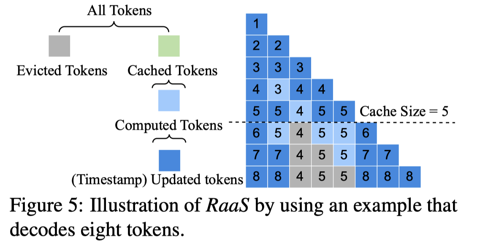 |  |  | [note](./notes/2025/RaaS/note.md) |

<b>Tao Yu</b>
 

| Meta | Title | Cover | Publish | Code | Note |
|:-----|:------|:------|:--------|:-----|:-----|
| [FLAP](./meta/2024/flap.prototxt) | [Fluctuation-based Adaptive Structured Pruning for Large Language Models](https://arxiv.org/abs/2312.11983) |  |  |  |  |
| [MXFP4Train](./meta/2025/MXFP4Train.prototxt) | [Training LLMs with MXFP4](http://arxiv.org/abs/2502.20586v2) |  |  |  | [note](./notes/2025/MXFP4Train/note.md) |

<b>Tao Yuan</b>
 

| Meta | Title | Cover | Publish | Code | Note |
|:-----|:------|:------|:--------|:-----|:-----|
| [m](./meta/2024/0Y41U1N2.prototxt) | [Beyond 2:4: exploring V:N:M sparsity for efficient transformer inference on GPUs](http://arxiv.org/abs/2410.16135v1) |  |  |  | [note](./notes/2024/0Y41U1N2/note.md) |
| [LinearPatch](./meta/2025/LinearPatch.prototxt) | [A Simple Linear Patch Revives Layer-Pruned Large Language Models](http://arxiv.org/abs/2505.24680v1) |  |  |  | [note](./notes/2025/LinearPatch/note.md) |

<b>Tao Yun</b>
 

| Meta | Title | Cover | Publish | Code | Note |
|:-----|:------|:------|:--------|:-----|:-----|
| [DeepSeek-V3](./meta/2024/DeepSeek-V3.prototxt) | [DeepSeek-V3 Technical Report](http://arxiv.org/abs/2412.19437v1) |  |  |  | [note](./notes/2024/DeepSeek-V3/note.md) |
| [DeepSeek-R1](./meta/2025/DeepSeek-R1.prototxt) | [DeepSeek-R1: Incentivizing Reasoning Capability in LLMs via Reinforcement Learning](http://arxiv.org/abs/2501.12948v1) |  |  |  | [note](./notes/2025/DeepSeek-R1/note.md) |

<b>Tian Pei</b>
 

| Meta | Title | Cover | Publish | Code | Note |
|:-----|:------|:------|:--------|:-----|:-----|
| [DeepSeek-V2](./meta/2024/DeepSeek-V2.prototxt) | [DeepSeek-V2: A Strong, Economical, and Efficient Mixture-of-Experts Language Model](http://arxiv.org/abs/2405.04434v5) |  |  |  | [note](./notes/2024/DeepSeek-V2/note.md) |
| [DeepSeek-V3](./meta/2024/DeepSeek-V3.prototxt) | [DeepSeek-V3 Technical Report](http://arxiv.org/abs/2412.19437v1) |  |  |  | [note](./notes/2024/DeepSeek-V3/note.md) |
| [DeepSeek-R1](./meta/2025/DeepSeek-R1.prototxt) | [DeepSeek-R1: Incentivizing Reasoning Capability in LLMs via Reinforcement Learning](http://arxiv.org/abs/2501.12948v1) |  |  |  | [note](./notes/2025/DeepSeek-R1/note.md) |

<b>Tianle Cai</b>
 

| Meta | Title | Cover | Publish | Code | Note |
|:-----|:------|:------|:--------|:-----|:-----|
| [SnapKV](./meta/2024/SnapKV.prototxt) | [SnapKV: LLM Knows What You are Looking for Before Generation](http://arxiv.org/abs/2404.14469v2) |  |  |  | [note](./notes/2024/SnapKV/note.md) |
| [TEAL](./meta/2025/TEAL.prototxt) | [Training-Free Activation Sparsity in Large Language Models](http://arxiv.org/abs/2408.14690v1) | 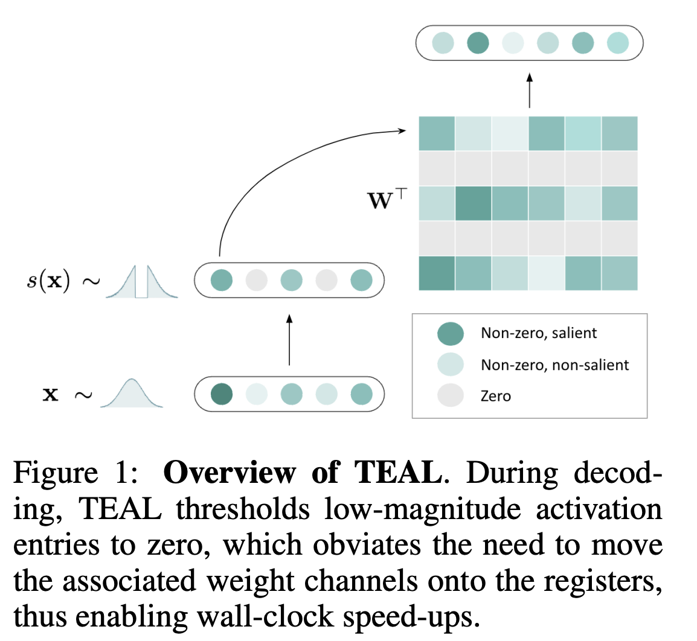 |  |  | [note](./notes/2025/TEAL/note.md) |
| [RadialAttention](./meta/2025/RadialAttention.prototxt) | [Radial Attention: $O(n\log n)$ Sparse Attention with Energy Decay for Long Video Generation](http://arxiv.org/abs/2506.19852v1) |  |  |  | [note](./notes/2025/RadialAttention/note.md) |

<b>Tianlong Chen</b>
 

| Meta | Title | Cover | Publish | Code | Note |
|:-----|:------|:------|:--------|:-----|:-----|
| [H2O](./meta/2023/H2O.prototxt) | [H$_2$O: Heavy-Hitter Oracle for Efficient Generative Inference of Large Language Models](http://arxiv.org/abs/2306.14048) |  |  |  | [note](./notes/2023/H2O/note.md) |
| [m](./meta/2024/SN1PK7EK.prototxt) | [Revisiting Zeroth-Order Optimization for Memory-Efficient LLM Fine-Tuning: A Benchmark](http://arxiv.org/abs/2402.11592v2) |  |  |  | [note](./notes/2024/SN1PK7EK/note.md) |

<b>Tianqi Chen</b>
 

| Meta | Title | Cover | Publish | Code | Note |
|:-----|:------|:------|:--------|:-----|:-----|
| [XGrammar](./meta/2024/XGrammar.prototxt) | [XGrammar: Flexible and Efficient Structured Generation Engine for Large Language Models](http://arxiv.org/abs/2411.15100v2) |  |  |  | [note](./notes/2024/XGrammar/note.md) |
| [FlashInfer](./meta/2025/FlashInfer.prototxt) | [FlashInfer: Efficient and Customizable Attention Engine for LLM Inference Serving](http://arxiv.org/abs/2501.01005v2) |  |  |  | [note](./notes/2025/FlashInfer/note.md) |

<b>Tianqi Wu</b>
 

| Meta | Title | Cover | Publish | Code | Note |
|:-----|:------|:------|:--------|:-----|:-----|
| [MoA](./meta/2024/MoA.prototxt) | [MoA: Mixture of Sparse Attention for Automatic Large Language Model Compression](http://arxiv.org/abs/2406.14909v2) |  |  |  | [note](./notes/2024/MoA/note.md) |
| [FlashOverlap](./meta/2026/FlashOverlap.prototxt) | [FlashOverlap: A Lightweight Design for Efficiently Overlapping Communication and Computation](http://arxiv.org/abs/2504.19519v1) |  |  |  | [note](./notes/2026/FlashOverlap/note.md) |

<b>Tianrun Liang</b>
 

| Meta | Title | Cover | Publish | Code | Note |
|:-----|:------|:------|:--------|:-----|:-----|
| [MiniMax-01](./meta/2025/MiniMax-01.prototxt) | [MiniMax-01: Scaling Foundation Models with Lightning Attention](http://arxiv.org/abs/2501.08313v1) |  |  |  | [note](./notes/2025/MiniMax-01/note.md) |
| [MiniMax-M1](./meta/2025/MiniMax-M1.prototxt) | [MiniMax-M1: Scaling Test-Time Compute Efficiently with Lightning Attention](http://arxiv.org/abs/2506.13585v1) |  |  |  | [note](./notes/2025/MiniMax-M1/note.md) |

<b>Tianyu Fu</b>
 

| Meta | Title | Cover | Publish | Code | Note |
|:-----|:------|:------|:--------|:-----|:-----|
| [m](./meta/2024/DHIB73MC.prototxt) | [A Survey on Efficient Inference for Large Language Models](http://arxiv.org/abs/2404.14294v2) |  |  |  | [note](./notes/2024/DHIB73MC/note.md) |
| [MoA](./meta/2024/MoA.prototxt) | [MoA: Mixture of Sparse Attention for Automatic Large Language Model Compression](http://arxiv.org/abs/2406.14909v2) |  |  |  | [note](./notes/2024/MoA/note.md) |

<b>Tianyu Gao</b>
 

| Meta | Title | Cover | Publish | Code | Note |
|:-----|:------|:------|:--------|:-----|:-----|
| [MeZO](./meta/2023/MeZO.prototxt) | [Fine-Tuning Language Models with Just Forward Passes](http://arxiv.org/abs/2305.17333v3) |  |  |  | [note](./notes/2023/MeZO/note.md) |
| [LLM-shearing](./meta/2023/LLM_shearing.prototxt) | [Sheared LLaMA: Accelerating Language Model Pre-training via Structured Pruning](https://xiamengzhou.github.io/sheared-llama/) | 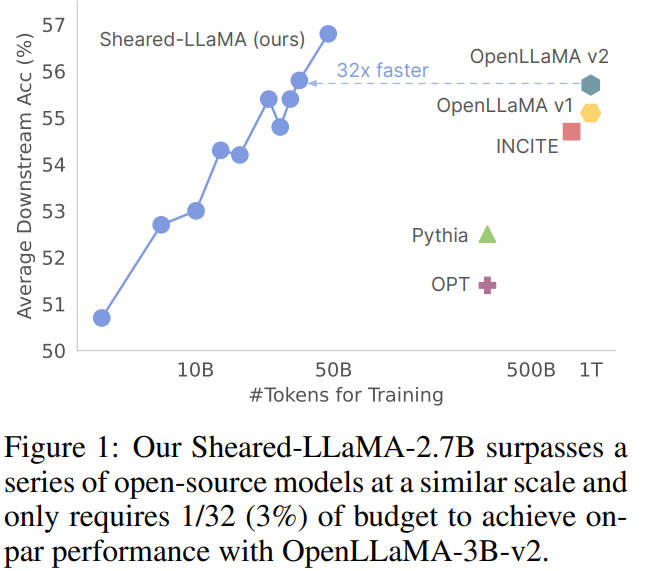 |  |  | [note](./notes/2023/LLM_shearing/note.md) |

<b>Tianyu Sun</b>
 

| Meta | Title | Cover | Publish | Code | Note |
|:-----|:------|:------|:--------|:-----|:-----|
| [DeepSeek-V2](./meta/2024/DeepSeek-V2.prototxt) | [DeepSeek-V2: A Strong, Economical, and Efficient Mixture-of-Experts Language Model](http://arxiv.org/abs/2405.04434v5) |  |  |  | [note](./notes/2024/DeepSeek-V2/note.md) |
| [DeepSeek-V3](./meta/2024/DeepSeek-V3.prototxt) | [DeepSeek-V3 Technical Report](http://arxiv.org/abs/2412.19437v1) |  |  |  | [note](./notes/2024/DeepSeek-V3/note.md) |
| [DeepSeek-R1](./meta/2025/DeepSeek-R1.prototxt) | [DeepSeek-R1: Incentivizing Reasoning Capability in LLMs via Reinforcement Learning](http://arxiv.org/abs/2501.12948v1) |  |  |  | [note](./notes/2025/DeepSeek-R1/note.md) |

<b>Tianzhu Ye</b>
 

| Meta | Title | Cover | Publish | Code | Note |
|:-----|:------|:------|:--------|:-----|:-----|
| [ReSA](./meta/2025/ReSA.prototxt) | [Rectified Sparse Attention](http://arxiv.org/abs/2506.04108v2) |  |  |  | [note](./notes/2025/ReSA/note.md) |
| [SeerAttention-R](./meta/2025/SeerAttention-R.prototxt) | [SeerAttention-R: Sparse Attention Adaptation for Long Reasoning](http://arxiv.org/abs/2506.08889v1) |  |  |  | [note](./notes/2025/SeerAttention-R/note.md) |

<b>Tim Dettmers</b>
 

| Meta | Title | Cover | Publish | Code | Note |
|:-----|:------|:------|:--------|:-----|:-----|
| [QLoRA](./meta/2023/qlora.prototxt) | [QLoRA: Efficient Finetuning of Quantized LLMs](https://arxiv.org/abs/2305.14314) |  |  |  |  |
| [SpQR](./meta/2023/spqr.prototxt) | [SpQR: A Sparse-Quantized Representation for Near-Lossless LLM Weight Compression](https://arxiv.org/pdf/2306.03078.pdf) |  |  |  |  |

<b>Ting Cao</b>
 

| Meta | Title | Cover | Publish | Code | Note |
|:-----|:------|:------|:--------|:-----|:-----|
| [SeerAttention](./meta/2024/SeerAttention.prototxt) | [SeerAttention: Learning Intrinsic Sparse Attention in Your LLMs](http://arxiv.org/abs/2410.13276v2) |  |  |  | [note](./notes/2024/SeerAttention/note.md) |
| [SeerAttention-R](./meta/2025/SeerAttention-R.prototxt) | [SeerAttention-R: Sparse Attention Adaptation for Long Reasoning](http://arxiv.org/abs/2506.08889v1) |  |  |  | [note](./notes/2025/SeerAttention-R/note.md) |

<b>Tong Yang</b>
 

| Meta | Title | Cover | Publish | Code | Note |
|:-----|:------|:------|:--------|:-----|:-----|
| [HATA](./meta/2025/HATA.prototxt) | [HATA: Trainable and Hardware-Efficient Hash-Aware Top-k Attention for Scalable Large Model Inference](http://arxiv.org/abs/2506.02572v1) |  |  |  | [note](./notes/2025/HATA/note.md) |
| [KeepKV](./meta/2025/KeepKV.prototxt) | [KeepKV: Eliminating Output Perturbation in KV Cache Compression for Efficient LLMs Inference](http://arxiv.org/abs/2504.09936v1) | 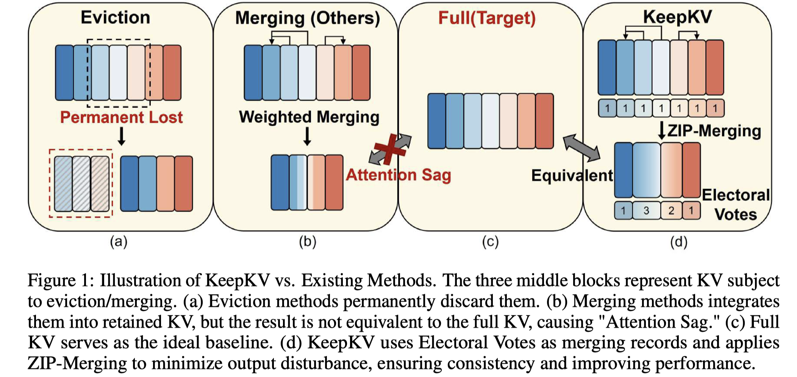 |  |  | [note](./notes/2025/KeepKV/note.md) |

<b>Torsten Hoefler</b>
 

| Meta | Title | Cover | Publish | Code | Note |
|:-----|:------|:------|:--------|:-----|:-----|
| [m](./meta/2021/ITZS3TU3.prototxt) | [Sparsity in Deep Learning: Pruning and growth for efficient inference and training in neural networks](https://arxiv.org/abs/2102.00554) |  |  |  |  |
| [VENOM](./meta/2023/VENOM.prototxt) | [VENOM: A Vectorized N:M Format for Unleashing the Power of Sparse Tensor Cores](http://arxiv.org/abs/2310.02065v1) |  |  |  | [note](./notes/2023/VENOM/note.md) |
| [SliceGPT](./meta/2024/SliceGPT.prototxt) | [SliceGPT: Compress Large Language Models by Deleting Rows and Columns](http://arxiv.org/abs/2401.15024v2) |  |  |  | [note](./notes/2024/SliceGPT/note.md) |

<b>Tri Dao</b>
 

| Meta | Title | Cover | Publish | Code | Note |
|:-----|:------|:------|:--------|:-----|:-----|
| [FlashAttention](./meta/2022/flashattention.prototxt) | [FlashAttention: Fast and Memory-Efficient Exact Attention with IO-Awareness](https://arxiv.org/abs/2205.14135) |  |  |  |  |
| [Flash-Decoding](./meta/2023/FlashDecoding.prototxt) | [Flash-Decoding for long-context inference](https://crfm.stanford.edu/2023/10/12/flashdecoding.html) |  |  |  | [note](./notes/2023/FlashDecoding/note.md) |
| [FlashAttention-2](./meta/2024/flashattention2.prototxt) | [FlashAttention-2: Faster Attention with Better Parallelism and Work Partitioning](https://arxiv.org/abs/2307.08691) |  |  |  |  |
| [GLA](./meta/2025/GLA.prototxt) | [Hardware-Efficient Attention for Fast Decoding](http://arxiv.org/abs/2505.21487v1) |  |  |  | [note](./notes/2025/GLA/note.md) |

<b>Tuo Zhao</b>
 

| Meta | Title | Cover | Publish | Code | Note |
|:-----|:------|:------|:--------|:-----|:-----|
| [AdaLoRA](./meta/2023/adalora.prototxt) | [AdaLoRA: Adaptive Budget Allocation for Parameter-Efficient Fine-Tuning](https://arxiv.org/pdf/2303.10512.pdf) |  |  |  |  |
| [LoSparse](./meta/2023/LoSparse.prototxt) | [Structured Compression of Large Language Models based on Low-Rank and Sparse Approximation](https://arxiv.org/abs/2306.11222) |  |  |  |  |
| [LoftQ](./meta/2023/loftq.prototxt) | [LoftQ: LoRA-Fine-Tuning-Aware Quantization for Large Language Models](https://arxiv.org/abs/2310.08659) |  |  |  | [note](./notes/2023/loftq/note.md) |
| [GEAR](./meta/2024/GEAR.prototxt) | [GEAR: An Efficient KV Cache Compression Recipe for Near-Lossless Generative Inference of LLM](http://arxiv.org/abs/2403.05527v4) |  |  |  | [note](./notes/2024/GEAR/note.md) |

<b>Vithursan Thangarasa</b>
 

| Meta | Title | Cover | Publish | Code | Note |
|:-----|:------|:------|:--------|:-----|:-----|
| [SPDF](./meta/2023/spdf.prototxt) | [SPDF: Sparse Pre-training and Dense Fine-tuning for Large Language Models](https://arxiv.org/abs/2303.10464) |  |  |  |  |
| [Sparse-IFT](./meta/2023/Sparse-IFT.prototxt) | [Sparse Iso-FLOP Transformations for Maximizing Training Efficiency](https://arxiv.org/abs/2303.11525) |  |  |  |  |
| [Sparse-IFT](./meta/2024/Sparse-IFT.prototxt) | [Sparse-IFT: Sparse Iso-FLOP Transformations for Maximizing Training Efficiency](http://arxiv.org/abs/2303.11525v3) |  |  |  | [note](./notes/2024/Sparse-IFT/note.md) |

<b>W. L. Xiao</b>
 

| Meta | Title | Cover | Publish | Code | Note |
|:-----|:------|:------|:--------|:-----|:-----|
| [DeepSeek-V2](./meta/2024/DeepSeek-V2.prototxt) | [DeepSeek-V2: A Strong, Economical, and Efficient Mixture-of-Experts Language Model](http://arxiv.org/abs/2405.04434v5) |  |  |  | [note](./notes/2024/DeepSeek-V2/note.md) |
| [DeepSeek-V3](./meta/2024/DeepSeek-V3.prototxt) | [DeepSeek-V3 Technical Report](http://arxiv.org/abs/2412.19437v1) |  |  |  | [note](./notes/2024/DeepSeek-V3/note.md) |
| [DeepSeek-R1](./meta/2025/DeepSeek-R1.prototxt) | [DeepSeek-R1: Incentivizing Reasoning Capability in LLMs via Reinforcement Learning](http://arxiv.org/abs/2501.12948v1) |  |  |  | [note](./notes/2025/DeepSeek-R1/note.md) |

<b>Wangding Zeng</b>
 

| Meta | Title | Cover | Publish | Code | Note |
|:-----|:------|:------|:--------|:-----|:-----|
| [DeepSeek-V2](./meta/2024/DeepSeek-V2.prototxt) | [DeepSeek-V2: A Strong, Economical, and Efficient Mixture-of-Experts Language Model](http://arxiv.org/abs/2405.04434v5) |  |  |  | [note](./notes/2024/DeepSeek-V2/note.md) |
| [DeepSeek-V3](./meta/2024/DeepSeek-V3.prototxt) | [DeepSeek-V3 Technical Report](http://arxiv.org/abs/2412.19437v1) |  |  |  | [note](./notes/2024/DeepSeek-V3/note.md) |
| [DeepSeekMoE](./meta/2024/DeepSeekMoE.prototxt) | [DeepSeekMoE: Towards Ultimate Expert Specialization in Mixture-of-Experts Language Models](http://arxiv.org/abs/2401.06066v1) |  |  |  | [note](./notes/2024/DeepSeekMoE/note.md) |
| [NSA](./meta/2025/NSA.prototxt) | [Native Sparse Attention: Hardware-Aligned and Natively Trainable Sparse Attention](http://arxiv.org/abs/2502.11089v1) |  |  |  | [note](./notes/2025/NSA/note.md) |
| [DeepSeek-R1](./meta/2025/DeepSeek-R1.prototxt) | [DeepSeek-R1: Incentivizing Reasoning Capability in LLMs via Reinforcement Learning](http://arxiv.org/abs/2501.12948v1) |  |  |  | [note](./notes/2025/DeepSeek-R1/note.md) |

<b>Wanjia Zhao</b>
 

| Meta | Title | Cover | Publish | Code | Note |
|:-----|:------|:------|:--------|:-----|:-----|
| [DeepSeek-V3](./meta/2024/DeepSeek-V3.prototxt) | [DeepSeek-V3 Technical Report](http://arxiv.org/abs/2412.19437v1) |  |  |  | [note](./notes/2024/DeepSeek-V3/note.md) |
| [DeepSeek-R1](./meta/2025/DeepSeek-R1.prototxt) | [DeepSeek-R1: Incentivizing Reasoning Capability in LLMs via Reinforcement Learning](http://arxiv.org/abs/2501.12948v1) |  |  |  | [note](./notes/2025/DeepSeek-R1/note.md) |

<b>Wei An</b>
 

| Meta | Title | Cover | Publish | Code | Note |
|:-----|:------|:------|:--------|:-----|:-----|
| [DeepSeek-V2](./meta/2024/DeepSeek-V2.prototxt) | [DeepSeek-V2: A Strong, Economical, and Efficient Mixture-of-Experts Language Model](http://arxiv.org/abs/2405.04434v5) |  |  |  | [note](./notes/2024/DeepSeek-V2/note.md) |
| [DeepSeek-V3](./meta/2024/DeepSeek-V3.prototxt) | [DeepSeek-V3 Technical Report](http://arxiv.org/abs/2412.19437v1) |  |  |  | [note](./notes/2024/DeepSeek-V3/note.md) |
| [DeepSeek-R1](./meta/2025/DeepSeek-R1.prototxt) | [DeepSeek-R1: Incentivizing Reasoning Capability in LLMs via Reinforcement Learning](http://arxiv.org/abs/2501.12948v1) |  |  |  | [note](./notes/2025/DeepSeek-R1/note.md) |

<b>Wei Lin</b>
 

| Meta | Title | Cover | Publish | Code | Note |
|:-----|:------|:------|:--------|:-----|:-----|
| [Flash-LLM](./meta/2024/flash_llm.prototxt) | [Flash-LLM: Enabling Cost-Effective and Highly-Efficient Large Generative Model Inference with Unstructured Sparsity](https://arxiv.org/abs/2309.10285) |  |  |  | [note](./notes/2024/flash_llm/index.md) |
| [DistAttention](./meta/2024/DistAttention.prototxt) | [Infinite-LLM: Efficient LLM Service for Long Context with DistAttention and Distributed KVCache](http://arxiv.org/abs/2401.02669v2) |  |  |  | [note](./notes/2024/DistAttention/note.md) |

<b>Wei Wang</b>
 

| Meta | Title | Cover | Publish | Code | Note |
|:-----|:------|:------|:--------|:-----|:-----|
| [BRECQ](./meta/2021/brecq.prototxt) | [BRECQ: Pushing the Limit of Post-Training Quantization by Block Reconstruction](https://openreview.net/pdf?id=POWv6hDd9XH) |  |  |  |  |
| [SpInfer](./meta/2025/SpInfer.prototxt) | [SpInfer: Leveraging Low-Level Sparsity for Efficient Large Language Model Inference on GPUs](https://dl.acm.org/doi/10.1145/3689031.3717481) |  |  |  | [note](./notes/2025/SpInfer/note.md) |
| [PowerAttention](./meta/2025/PowerAttention.prototxt) | [PowerAttention: Exponentially Scaling of Receptive Fields for Effective Sparse Attention](http://arxiv.org/abs/2503.03588v1) |  |  |  | [note](./notes/2025/PowerAttention/note.md) |

<b>Weigao Sun</b>
 

| Meta | Title | Cover | Publish | Code | Note |
|:-----|:------|:------|:--------|:-----|:-----|
| [LightningAttention](./meta/2024/LightningAttention.prototxt) | [Various Lengths, Constant Speed: Efficient Language Modeling with Lightning Attention](http://arxiv.org/abs/2405.17381v2) |  |  |  | [note](./notes/2024/LightningAttention/note.md) |
| [LightningAttention-2](./meta/2024/LightningAttention-2.prototxt) | [Lightning Attention-2: A Free Lunch for Handling Unlimited Sequence Lengths in Large Language Models](http://arxiv.org/abs/2401.04658v2) |  |  |  | [note](./notes/2024/LightningAttention-2/note.md) |
| [MiniMax-01](./meta/2025/MiniMax-01.prototxt) | [MiniMax-01: Scaling Foundation Models with Lightning Attention](http://arxiv.org/abs/2501.08313v1) |  |  |  | [note](./notes/2025/MiniMax-01/note.md) |
| [Awesome-Efficient-Arch](./meta/2025/Awesome-Efficient-Arch.prototxt) | [Speed Always Wins: A Survey on Efficient Architectures for Large Language Models](http://arxiv.org/abs/2508.09834v1) |  |  |  | [note](./notes/2025/Awesome-Efficient-Arch/note.md) |

<b>Weilin Zhao</b>
 

| Meta | Title | Cover | Publish | Code | Note |
|:-----|:------|:------|:--------|:-----|:-----|
| [BlockFFN](./meta/2025/BlockFFN.prototxt) | [BlockFFN: Towards End-Side Acceleration-Friendly Mixture-of-Experts with Chunk-Level Activation Sparsity](http://arxiv.org/abs/2507.08771v1) |  |  |  | [note](./notes/2025/BlockFFN/note.md) |
| [InfLLM-V2](./meta/2025/InfLLM-V2.prototxt) | [InfLLM-V2: Dense-Sparse Switchable Attention for Seamless Short-to-Long Adaptation](http://arxiv.org/abs/2509.24663v1) |  |  |  | [note](./notes/2025/InfLLM-V2/note.md) |
| [MiniCPM4](./meta/2025/MiniCPM4.prototxt) | [MiniCPM4: Ultra-Efficient LLMs on End Devices](http://arxiv.org/abs/2506.07900v1) |  |  |  | [note](./notes/2025/MiniCPM4/note.md) |

<b>Weilun Zhao</b>
 

| Meta | Title | Cover | Publish | Code | Note |
|:-----|:------|:------|:--------|:-----|:-----|
| [InfLLM-V2](./meta/2025/InfLLM-V2.prototxt) | [InfLLM-V2: Dense-Sparse Switchable Attention for Seamless Short-to-Long Adaptation](http://arxiv.org/abs/2509.24663v1) |  |  |  | [note](./notes/2025/InfLLM-V2/note.md) |
| [MiniCPM4](./meta/2025/MiniCPM4.prototxt) | [MiniCPM4: Ultra-Efficient LLMs on End Devices](http://arxiv.org/abs/2506.07900v1) |  |  |  | [note](./notes/2025/MiniCPM4/note.md) |

<b>Weiping Wang</b>
 

| Meta | Title | Cover | Publish | Code | Note |
|:-----|:------|:------|:--------|:-----|:-----|
| [m](./meta/2023/L5D7520E.prototxt) | [A Survey on Model Compression for Large Language Models](https://arxiv.org/abs/2308.07633) |  |  |  |  |
| [VecInfer](./meta/2025/VecInfer.prototxt) | [VecInfer: Efficient LLM Inference with Low-Bit KV Cache via Outlier-Suppressed Vector Quantization](http://arxiv.org/abs/2510.06175v1) | 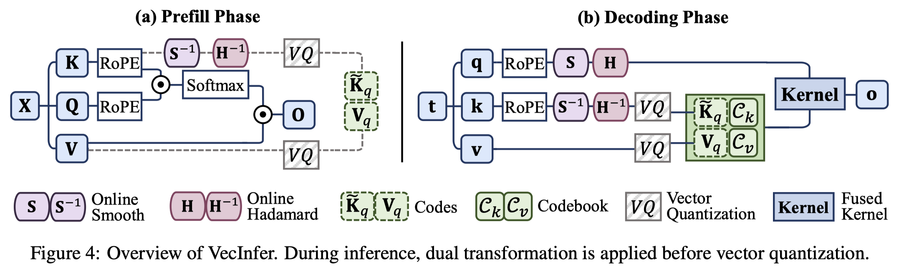 |  |  | [note](./notes/2025/VecInfer/note.md) |

<b>Weixuan Sun</b>
 

| Meta | Title | Cover | Publish | Code | Note |
|:-----|:------|:------|:--------|:-----|:-----|
| [LightningAttention](./meta/2024/LightningAttention.prototxt) | [Various Lengths, Constant Speed: Efficient Language Modeling with Lightning Attention](http://arxiv.org/abs/2405.17381v2) |  |  |  | [note](./notes/2024/LightningAttention/note.md) |
| [LightningAttention-2](./meta/2024/LightningAttention-2.prototxt) | [Lightning Attention-2: A Free Lunch for Handling Unlimited Sequence Lengths in Large Language Models](http://arxiv.org/abs/2401.04658v2) |  |  |  | [note](./notes/2024/LightningAttention-2/note.md) |
| [MiniMax-01](./meta/2025/MiniMax-01.prototxt) | [MiniMax-01: Scaling Foundation Models with Lightning Attention](http://arxiv.org/abs/2501.08313v1) |  |  |  | [note](./notes/2025/MiniMax-01/note.md) |

<b>Weiyu Cheng</b>
 

| Meta | Title | Cover | Publish | Code | Note |
|:-----|:------|:------|:--------|:-----|:-----|
| [MiniMax-01](./meta/2025/MiniMax-01.prototxt) | [MiniMax-01: Scaling Foundation Models with Lightning Attention](http://arxiv.org/abs/2501.08313v1) |  |  |  | [note](./notes/2025/MiniMax-01/note.md) |
| [MiniMax-M1](./meta/2025/MiniMax-M1.prototxt) | [MiniMax-M1: Scaling Test-Time Compute Efficiently with Lightning Attention](http://arxiv.org/abs/2506.13585v1) |  |  |  | [note](./notes/2025/MiniMax-M1/note.md) |

<b>Weiyu Huang</b>
 

| Meta | Title | Cover | Publish | Code | Note |
|:-----|:------|:------|:--------|:-----|:-----|
| [m](./meta/2024/HYPL7G37.prototxt) | [Accelerating Transformer Pre-training with 2:4 Sparsity](http://arxiv.org/abs/2404.01847v2) |  |  |  | [note](./notes/2024/HYPL7G37/note.md) |
| [AdaptiveSparseTrainer](./meta/2025/AdaptiveSparseTrainer.prototxt) | [Pruning Large Language Models with Semi-Structural Adaptive Sparse Training](http://arxiv.org/abs/2407.20584v3) |  |  |  | [note](./notes/2025/AdaptiveSparseTrainer/note.md) |

<b>Weizhu Chen</b>
 

| Meta | Title | Cover | Publish | Code | Note |
|:-----|:------|:------|:--------|:-----|:-----|
| [LoRA](./meta/2022/lora.prototxt) | [LoRA: Low-rank adaptation of large language models](https://arxiv.org/abs/2106.09685) | 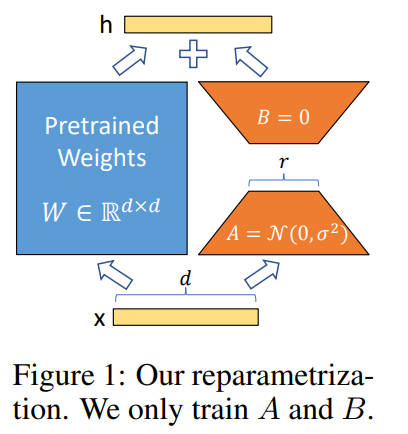 |  |  |  |
| [AdaLoRA](./meta/2023/adalora.prototxt) | [AdaLoRA: Adaptive Budget Allocation for Parameter-Efficient Fine-Tuning](https://arxiv.org/pdf/2303.10512.pdf) |  |  |  |  |
| [LoftQ](./meta/2023/loftq.prototxt) | [LoftQ: LoRA-Fine-Tuning-Aware Quantization for Large Language Models](https://arxiv.org/abs/2310.08659) |  |  |  | [note](./notes/2023/loftq/note.md) |

<b>Wen Liu</b>
 

| Meta | Title | Cover | Publish | Code | Note |
|:-----|:------|:------|:--------|:-----|:-----|
| [DeepSeek-V2](./meta/2024/DeepSeek-V2.prototxt) | [DeepSeek-V2: A Strong, Economical, and Efficient Mixture-of-Experts Language Model](http://arxiv.org/abs/2405.04434v5) |  |  |  | [note](./notes/2024/DeepSeek-V2/note.md) |
| [DeepSeek-V3](./meta/2024/DeepSeek-V3.prototxt) | [DeepSeek-V3 Technical Report](http://arxiv.org/abs/2412.19437v1) |  |  |  | [note](./notes/2024/DeepSeek-V3/note.md) |
| [DeepSeek-R1](./meta/2025/DeepSeek-R1.prototxt) | [DeepSeek-R1: Incentivizing Reasoning Capability in LLMs via Reinforcement Learning](http://arxiv.org/abs/2501.12948v1) |  |  |  | [note](./notes/2025/DeepSeek-R1/note.md) |

<b>Wenfeng Liang</b>
 

| Meta | Title | Cover | Publish | Code | Note |
|:-----|:------|:------|:--------|:-----|:-----|
| [DeepSeek-V2](./meta/2024/DeepSeek-V2.prototxt) | [DeepSeek-V2: A Strong, Economical, and Efficient Mixture-of-Experts Language Model](http://arxiv.org/abs/2405.04434v5) |  |  |  | [note](./notes/2024/DeepSeek-V2/note.md) |
| [DeepSeek-V3](./meta/2024/DeepSeek-V3.prototxt) | [DeepSeek-V3 Technical Report](http://arxiv.org/abs/2412.19437v1) |  |  |  | [note](./notes/2024/DeepSeek-V3/note.md) |
| [DeepSeekMoE](./meta/2024/DeepSeekMoE.prototxt) | [DeepSeekMoE: Towards Ultimate Expert Specialization in Mixture-of-Experts Language Models](http://arxiv.org/abs/2401.06066v1) |  |  |  | [note](./notes/2024/DeepSeekMoE/note.md) |
| [NSA](./meta/2025/NSA.prototxt) | [Native Sparse Attention: Hardware-Aligned and Natively Trainable Sparse Attention](http://arxiv.org/abs/2502.11089v1) |  |  |  | [note](./notes/2025/NSA/note.md) |
| [DeepSeek-R1](./meta/2025/DeepSeek-R1.prototxt) | [DeepSeek-R1: Incentivizing Reasoning Capability in LLMs via Reinforcement Learning](http://arxiv.org/abs/2501.12948v1) |  |  |  | [note](./notes/2025/DeepSeek-R1/note.md) |

<b>Wenjun Gao</b>
 

| Meta | Title | Cover | Publish | Code | Note |
|:-----|:------|:------|:--------|:-----|:-----|
| [DeepSeek-V2](./meta/2024/DeepSeek-V2.prototxt) | [DeepSeek-V2: A Strong, Economical, and Efficient Mixture-of-Experts Language Model](http://arxiv.org/abs/2405.04434v5) |  |  |  | [note](./notes/2024/DeepSeek-V2/note.md) |
| [DeepSeek-V3](./meta/2024/DeepSeek-V3.prototxt) | [DeepSeek-V3 Technical Report](http://arxiv.org/abs/2412.19437v1) |  |  |  | [note](./notes/2024/DeepSeek-V3/note.md) |
| [DeepSeek-R1](./meta/2025/DeepSeek-R1.prototxt) | [DeepSeek-R1: Incentivizing Reasoning Capability in LLMs via Reinforcement Learning](http://arxiv.org/abs/2501.12948v1) |  |  |  | [note](./notes/2025/DeepSeek-R1/note.md) |

<b>Wenkai Li</b>
 

| Meta | Title | Cover | Publish | Code | Note |
|:-----|:------|:------|:--------|:-----|:-----|
| [MiniMax-01](./meta/2025/MiniMax-01.prototxt) | [MiniMax-01: Scaling Foundation Models with Lightning Attention](http://arxiv.org/abs/2501.08313v1) |  |  |  | [note](./notes/2025/MiniMax-01/note.md) |
| [MiniMax-M1](./meta/2025/MiniMax-M1.prototxt) | [MiniMax-M1: Scaling Test-Time Compute Efficiently with Lightning Attention](http://arxiv.org/abs/2506.13585v1) |  |  |  | [note](./notes/2025/MiniMax-M1/note.md) |

<b>Wenlei Bao</b>
 

| Meta | Title | Cover | Publish | Code | Note |
|:-----|:------|:------|:--------|:-----|:-----|
| [FLUX](./meta/2024/FLUX.prototxt) | [FLUX: Fast Software-based Communication Overlap On GPUs Through Kernel Fusion](http://arxiv.org/abs/2406.06858v5) |  |  |  | [note](./notes/2024/FLUX/note.md) |
| [ShadowKV](./meta/2025/ShadowKV.prototxt) | [ShadowKV: KV Cache in Shadows for High-Throughput Long-Context LLM Inference](https://openreview.net/forum?id=oa7MYAO6h6) |  |  |  | [note](./notes/2025/ShadowKV/note.md) |
| [CometSeed](./meta/2025/CometSeed.prototxt) | [Comet: Fine-grained Computation-communication Overlapping for Mixture-of-Experts](http://arxiv.org/abs/2502.19811v3) |  |  |  | [note](./notes/2025/CometSeed/note.md) |
| [MegaScale-MoE](./meta/2025/MegaScale-MoE.prototxt) | [MegaScale-MoE: Large-Scale Communication-Efficient Training of Mixture-of-Experts Models in Production](http://arxiv.org/abs/2505.11432v2) |  |  |  | [note](./notes/2025/MegaScale-MoE/note.md) |
| [TileLink](./meta/2025/TileLink.prototxt) | [TileLink: Generating Efficient Compute-Communication Overlapping Kernels using Tile-Centric Primitives](http://arxiv.org/abs/2503.20313v3) |  |  |  | [note](./notes/2025/TileLink/note.md) |
| [Triton-distributed](./meta/2025/Triton-distributed.prototxt) | [Triton-distributed: Programming Overlapping Kernels on Distributed AI Systems with the Triton Compiler](http://arxiv.org/abs/2504.19442v3) |  |  |  | [note](./notes/2025/Triton-distributed/note.md) |

<b>Wenqi Shao</b>
 

| Meta | Title | Cover | Publish | Code | Note |
|:-----|:------|:------|:--------|:-----|:-----|
| [OmniQuant](./meta/2023/omniquant.prototxt) | [OmniQuant: Omnidirectionally Calibrated Quantization for Large Language Models](https://arxiv.org/abs/2308.13137) |  |  |  |  |
| [PrefixQuant](./meta/2024/PrefixQuant.prototxt) | [PrefixQuant: Eliminating Outliers by Prefixed Tokens for Large Language Models Quantization](http://arxiv.org/abs/2410.05265v2) |  |  |  | [note](./notes/2024/PrefixQuant/note.md) |
| [ZipVL](./meta/2024/ZipVL.prototxt) | [ZipVL: Efficient Large Vision-Language Models with Dynamic Token Sparsification](http://arxiv.org/abs/2410.08584v2) |  |  |  | [note](./notes/2024/ZipVL/note.md) |

<b>Wenqin Yu</b>
 

| Meta | Title | Cover | Publish | Code | Note |
|:-----|:------|:------|:--------|:-----|:-----|
| [DeepSeek-V3](./meta/2024/DeepSeek-V3.prototxt) | [DeepSeek-V3 Technical Report](http://arxiv.org/abs/2412.19437v1) |  |  |  | [note](./notes/2024/DeepSeek-V3/note.md) |
| [DeepSeek-R1](./meta/2025/DeepSeek-R1.prototxt) | [DeepSeek-R1: Incentivizing Reasoning Capability in LLMs via Reinforcement Learning](http://arxiv.org/abs/2501.12948v1) |  |  |  | [note](./notes/2025/DeepSeek-R1/note.md) |

<b>Wentao Zhang</b>
 

| Meta | Title | Cover | Publish | Code | Note |
|:-----|:------|:------|:--------|:-----|:-----|
| [DeepSeek-V2](./meta/2024/DeepSeek-V2.prototxt) | [DeepSeek-V2: A Strong, Economical, and Efficient Mixture-of-Experts Language Model](http://arxiv.org/abs/2405.04434v5) |  |  |  | [note](./notes/2024/DeepSeek-V2/note.md) |
| [DeepSeek-V3](./meta/2024/DeepSeek-V3.prototxt) | [DeepSeek-V3 Technical Report](http://arxiv.org/abs/2412.19437v1) |  |  |  | [note](./notes/2024/DeepSeek-V3/note.md) |
| [DeepSeek-R1](./meta/2025/DeepSeek-R1.prototxt) | [DeepSeek-R1: Incentivizing Reasoning Capability in LLMs via Reinforcement Learning](http://arxiv.org/abs/2501.12948v1) |  |  |  | [note](./notes/2025/DeepSeek-R1/note.md) |

<b>Woosuk Kwon</b>
 

| Meta | Title | Cover | Publish | Code | Note |
|:-----|:------|:------|:--------|:-----|:-----|
| [FisherPruning](./meta/2022/fisherpruning.prototxt) | [A Fast Post-Training Pruning Framework for Transformers](http://arxiv.org/abs/2204.09656v2) |  |  |  | [note](./notes/2022/fisherpruning/note.md) |
| [PagedAttention](./meta/2023/PagedAttention.prototxt) | [Efficient Memory Management for Large Language Model Serving with PagedAttention](http://arxiv.org/abs/2309.06180v1) |  |  |  | [note](./notes/2023/PagedAttention/note.md) |
| [APEX](./meta/2024/APEX.prototxt) | [APEX: An Extensible and Dynamism-Aware Simulator for Automated Parallel Execution in LLM Serving](http://arxiv.org/abs/2411.17651v2) |  |  |  | [note](./notes/2024/APEX/note.md) |

<b>Wulong Liu</b>
 

| Meta | Title | Cover | Publish | Code | Note |
|:-----|:------|:------|:--------|:-----|:-----|
| [AttentionPredictor](./meta/2025/AttentionPredictor.prototxt) | [AttentionPredictor: Temporal Pattern Matters for Efficient LLM Inference](http://arxiv.org/abs/2502.04077v1) |  |  |  | [note](./notes/2025/AttentionPredictor/note.md) |
| [PanguUltra](./meta/2025/PanguUltra.prototxt) | [Pangu Ultra: Pushing the Limits of Dense Large Language Models on Ascend NPUs](http://arxiv.org/abs/2504.07866v2) |  |  |  | [note](./notes/2025/PanguUltra/note.md) |

<b>X. Q. Li</b>
 

| Meta | Title | Cover | Publish | Code | Note |
|:-----|:------|:------|:--------|:-----|:-----|
| [DeepSeek-V2](./meta/2024/DeepSeek-V2.prototxt) | [DeepSeek-V2: A Strong, Economical, and Efficient Mixture-of-Experts Language Model](http://arxiv.org/abs/2405.04434v5) |  |  |  | [note](./notes/2024/DeepSeek-V2/note.md) |
| [DeepSeek-V3](./meta/2024/DeepSeek-V3.prototxt) | [DeepSeek-V3 Technical Report](http://arxiv.org/abs/2412.19437v1) |  |  |  | [note](./notes/2024/DeepSeek-V3/note.md) |
| [DeepSeek-R1](./meta/2025/DeepSeek-R1.prototxt) | [DeepSeek-R1: Incentivizing Reasoning Capability in LLMs via Reinforcement Learning](http://arxiv.org/abs/2501.12948v1) |  |  |  | [note](./notes/2025/DeepSeek-R1/note.md) |

<b>Xiafei Qiu</b>
 

| Meta | Title | Cover | Publish | Code | Note |
|:-----|:------|:------|:--------|:-----|:-----|
| [Flash-LLM](./meta/2024/flash_llm.prototxt) | [Flash-LLM: Enabling Cost-Effective and Highly-Efficient Large Generative Model Inference with Unstructured Sparsity](https://arxiv.org/abs/2309.10285) |  |  |  | [note](./notes/2024/flash_llm/index.md) |
| [DistAttention](./meta/2024/DistAttention.prototxt) | [Infinite-LLM: Efficient LLM Service for Long Context with DistAttention and Distributed KVCache](http://arxiv.org/abs/2401.02669v2) |  |  |  | [note](./notes/2024/DistAttention/note.md) |

<b>Xiandong Zhao</b>
 

| Meta | Title | Cover | Publish | Code | Note |
|:-----|:------|:------|:--------|:-----|:-----|
| [SDS](./meta/2025/SDS.prototxt) | [Enhancing One-shot Pruned Pre-trained Language Models through Sparse-Dense-Sparse Mechanism](http://arxiv.org/abs/2408.10473v1) |  |  |  | [note](./notes/2025/SDS/note.md) |
| [BaWA](./meta/2025/BaWA.prototxt) | [BaWA: Automatic Optimizing Pruning Metric for Large Language Models with Balanced Weight and Activation](https://openreview.net/forum?id=YrCvW1Hx7g) |  |  |  | [note](./notes/2025/BaWA/note.md) |

<b>Xiang Liu</b>
 

| Meta | Title | Cover | Publish | Code | Note |
|:-----|:------|:------|:--------|:-----|:-----|
| [LISA](./meta/2024/LISA.prototxt) | [LISA: Layerwise Importance Sampling for Memory-Efficient Large Language Model Fine-Tuning](http://arxiv.org/abs/2403.17919v1) |  |  |  | [note](./notes/2024/LISA/note.md) |
| [ChunkKV](./meta/2025/ChunkKV.prototxt) | [ChunkKV: Semantic-Preserving KV Cache Compression for Efficient Long-Context LLM Inference](http://arxiv.org/abs/2502.00299v1) |  |  |  | [note](./notes/2025/ChunkKV/note.md) |

<b>Xiangjun Song</b>
 

| Meta | Title | Cover | Publish | Code | Note |
|:-----|:------|:------|:--------|:-----|:-----|
| [MiniMax-01](./meta/2025/MiniMax-01.prototxt) | [MiniMax-01: Scaling Foundation Models with Lightning Attention](http://arxiv.org/abs/2501.08313v1) |  |  |  | [note](./notes/2025/MiniMax-01/note.md) |
| [MiniMax-M1](./meta/2025/MiniMax-M1.prototxt) | [MiniMax-M1: Scaling Test-Time Compute Efficiently with Lightning Attention](http://arxiv.org/abs/2506.13585v1) |  |  |  | [note](./notes/2025/MiniMax-M1/note.md) |

<b>Xiangyu Zhang</b>
 

| Meta | Title | Cover | Publish | Code | Note |
|:-----|:------|:------|:--------|:-----|:-----|
| [MFA](./meta/2024/MFA.prototxt) | [Multi-matrix Factorization Attention](http://arxiv.org/abs/2412.19255v2) |  |  |  | [note](./notes/2024/MFA/note.md) |
| [Step-3](./meta/2025/Step-3.prototxt) | [Step-3 is Large yet Affordable: Model-system Co-design for Cost-effective Decoding](http://arxiv.org/abs/2507.19427v1) |  |  |  | [note](./notes/2025/Step-3/note.md) |

<b>Xiangyue Jin</b>
 

| Meta | Title | Cover | Publish | Code | Note |
|:-----|:------|:------|:--------|:-----|:-----|
| [DeepSeek-V2](./meta/2024/DeepSeek-V2.prototxt) | [DeepSeek-V2: A Strong, Economical, and Efficient Mixture-of-Experts Language Model](http://arxiv.org/abs/2405.04434v5) |  |  |  | [note](./notes/2024/DeepSeek-V2/note.md) |
| [DeepSeek-V3](./meta/2024/DeepSeek-V3.prototxt) | [DeepSeek-V3 Technical Report](http://arxiv.org/abs/2412.19437v1) |  |  |  | [note](./notes/2024/DeepSeek-V3/note.md) |
| [DeepSeek-R1](./meta/2025/DeepSeek-R1.prototxt) | [DeepSeek-R1: Incentivizing Reasoning Capability in LLMs via Reinforcement Learning](http://arxiv.org/abs/2501.12948v1) |  |  |  | [note](./notes/2025/DeepSeek-R1/note.md) |

<b>Xianzhi Yu</b>
 

| Meta | Title | Cover | Publish | Code | Note |
|:-----|:------|:------|:--------|:-----|:-----|
| [LinearPatch](./meta/2025/LinearPatch.prototxt) | [A Simple Linear Patch Revives Layer-Pruned Large Language Models](http://arxiv.org/abs/2505.24680v1) |  |  |  | [note](./notes/2025/LinearPatch/note.md) |
| [AttentionPredictor](./meta/2025/AttentionPredictor.prototxt) | [AttentionPredictor: Temporal Pattern Matters for Efficient LLM Inference](http://arxiv.org/abs/2502.04077v1) |  |  |  | [note](./notes/2025/AttentionPredictor/note.md) |

<b>Xianzu Wang</b>
 

| Meta | Title | Cover | Publish | Code | Note |
|:-----|:------|:------|:--------|:-----|:-----|
| [DeepSeek-V2](./meta/2024/DeepSeek-V2.prototxt) | [DeepSeek-V2: A Strong, Economical, and Efficient Mixture-of-Experts Language Model](http://arxiv.org/abs/2405.04434v5) |  |  |  | [note](./notes/2024/DeepSeek-V2/note.md) |
| [DeepSeek-V3](./meta/2024/DeepSeek-V3.prototxt) | [DeepSeek-V3 Technical Report](http://arxiv.org/abs/2412.19437v1) |  |  |  | [note](./notes/2024/DeepSeek-V3/note.md) |
| [DeepSeek-R1](./meta/2025/DeepSeek-R1.prototxt) | [DeepSeek-R1: Incentivizing Reasoning Capability in LLMs via Reinforcement Learning](http://arxiv.org/abs/2501.12948v1) |  |  |  | [note](./notes/2025/DeepSeek-R1/note.md) |

<b>Xiao Bi</b>
 

| Meta | Title | Cover | Publish | Code | Note |
|:-----|:------|:------|:--------|:-----|:-----|
| [DeepSeek-V2](./meta/2024/DeepSeek-V2.prototxt) | [DeepSeek-V2: A Strong, Economical, and Efficient Mixture-of-Experts Language Model](http://arxiv.org/abs/2405.04434v5) |  |  |  | [note](./notes/2024/DeepSeek-V2/note.md) |
| [DeepSeek-V3](./meta/2024/DeepSeek-V3.prototxt) | [DeepSeek-V3 Technical Report](http://arxiv.org/abs/2412.19437v1) |  |  |  | [note](./notes/2024/DeepSeek-V3/note.md) |
| [DeepSeek-R1](./meta/2025/DeepSeek-R1.prototxt) | [DeepSeek-R1: Incentivizing Reasoning Capability in LLMs via Reinforcement Learning](http://arxiv.org/abs/2501.12948v1) |  |  |  | [note](./notes/2025/DeepSeek-R1/note.md) |

<b>Xiao Su</b>
 

| Meta | Title | Cover | Publish | Code | Note |
|:-----|:------|:------|:--------|:-----|:-----|
| [MiniMax-01](./meta/2025/MiniMax-01.prototxt) | [MiniMax-01: Scaling Foundation Models with Lightning Attention](http://arxiv.org/abs/2501.08313v1) |  |  |  | [note](./notes/2025/MiniMax-01/note.md) |
| [MiniMax-M1](./meta/2025/MiniMax-M1.prototxt) | [MiniMax-M1: Scaling Test-Time Compute Efficiently with Lightning Attention](http://arxiv.org/abs/2506.13585v1) |  |  |  | [note](./notes/2025/MiniMax-M1/note.md) |

<b>Xiaodong Han</b>
 

| Meta | Title | Cover | Publish | Code | Note |
|:-----|:------|:------|:--------|:-----|:-----|
| [MiniMax-01](./meta/2025/MiniMax-01.prototxt) | [MiniMax-01: Scaling Foundation Models with Lightning Attention](http://arxiv.org/abs/2501.08313v1) |  |  |  | [note](./notes/2025/MiniMax-01/note.md) |
| [MiniMax-M1](./meta/2025/MiniMax-M1.prototxt) | [MiniMax-M1: Scaling Test-Time Compute Efficiently with Lightning Attention](http://arxiv.org/abs/2506.13585v1) |  |  |  | [note](./notes/2025/MiniMax-M1/note.md) |

<b>Xiaodong Ji</b>
 

| Meta | Title | Cover | Publish | Code | Note |
|:-----|:------|:------|:--------|:-----|:-----|
| [PQCache](./meta/2025/PQCache.prototxt) | [PQCache: Product Quantization-based KVCache for Long Context LLM Inference](http://arxiv.org/abs/2407.12820v2) |  |  |  | [note](./notes/2025/PQCache/note.md) |
| [SALE](./meta/2025/SALE.prototxt) | [SALE : Low-bit Estimation for Efficient Sparse Attention in Long-context LLM Prefilling](http://arxiv.org/abs/2505.24179v1) |  |  |  | [note](./notes/2025/SALE/note.md) |

<b>Xiaodong Liu</b>
 

| Meta | Title | Cover | Publish | Code | Note |
|:-----|:------|:------|:--------|:-----|:-----|
| [DeepSeek-V2](./meta/2024/DeepSeek-V2.prototxt) | [DeepSeek-V2: A Strong, Economical, and Efficient Mixture-of-Experts Language Model](http://arxiv.org/abs/2405.04434v5) |  |  |  | [note](./notes/2024/DeepSeek-V2/note.md) |
| [DeepSeek-V3](./meta/2024/DeepSeek-V3.prototxt) | [DeepSeek-V3 Technical Report](http://arxiv.org/abs/2412.19437v1) |  |  |  | [note](./notes/2024/DeepSeek-V3/note.md) |
| [DeepSeek-R1](./meta/2025/DeepSeek-R1.prototxt) | [DeepSeek-R1: Incentivizing Reasoning Capability in LLMs via Reinforcement Learning](http://arxiv.org/abs/2501.12948v1) |  |  |  | [note](./notes/2025/DeepSeek-R1/note.md) |

<b>Xiaohan Wang</b>
 

| Meta | Title | Cover | Publish | Code | Note |
|:-----|:------|:------|:--------|:-----|:-----|
| [DeepSeek-V2](./meta/2024/DeepSeek-V2.prototxt) | [DeepSeek-V2: A Strong, Economical, and Efficient Mixture-of-Experts Language Model](http://arxiv.org/abs/2405.04434v5) |  |  |  | [note](./notes/2024/DeepSeek-V2/note.md) |
| [DeepSeek-V3](./meta/2024/DeepSeek-V3.prototxt) | [DeepSeek-V3 Technical Report](http://arxiv.org/abs/2412.19437v1) |  |  |  | [note](./notes/2024/DeepSeek-V3/note.md) |
| [DeepSeek-R1](./meta/2025/DeepSeek-R1.prototxt) | [DeepSeek-R1: Incentivizing Reasoning Capability in LLMs via Reinforcement Learning](http://arxiv.org/abs/2501.12948v1) |  |  |  | [note](./notes/2025/DeepSeek-R1/note.md) |

<b>Xiaojin Shen</b>
 

| Meta | Title | Cover | Publish | Code | Note |
|:-----|:------|:------|:--------|:-----|:-----|
| [DeepSeek-V2](./meta/2024/DeepSeek-V2.prototxt) | [DeepSeek-V2: A Strong, Economical, and Efficient Mixture-of-Experts Language Model](http://arxiv.org/abs/2405.04434v5) |  |  |  | [note](./notes/2024/DeepSeek-V2/note.md) |
| [DeepSeek-V3](./meta/2024/DeepSeek-V3.prototxt) | [DeepSeek-V3 Technical Report](http://arxiv.org/abs/2412.19437v1) |  |  |  | [note](./notes/2024/DeepSeek-V3/note.md) |
| [DeepSeek-R1](./meta/2025/DeepSeek-R1.prototxt) | [DeepSeek-R1: Incentivizing Reasoning Capability in LLMs via Reinforcement Learning](http://arxiv.org/abs/2501.12948v1) |  |  |  | [note](./notes/2025/DeepSeek-R1/note.md) |

<b>Xiaokang Chen</b>
 

| Meta | Title | Cover | Publish | Code | Note |
|:-----|:------|:------|:--------|:-----|:-----|
| [DeepSeek-V2](./meta/2024/DeepSeek-V2.prototxt) | [DeepSeek-V2: A Strong, Economical, and Efficient Mixture-of-Experts Language Model](http://arxiv.org/abs/2405.04434v5) |  |  |  | [note](./notes/2024/DeepSeek-V2/note.md) |
| [DeepSeek-V3](./meta/2024/DeepSeek-V3.prototxt) | [DeepSeek-V3 Technical Report](http://arxiv.org/abs/2412.19437v1) |  |  |  | [note](./notes/2024/DeepSeek-V3/note.md) |
| [DeepSeek-R1](./meta/2025/DeepSeek-R1.prototxt) | [DeepSeek-R1: Incentivizing Reasoning Capability in LLMs via Reinforcement Learning](http://arxiv.org/abs/2501.12948v1) |  |  |  | [note](./notes/2025/DeepSeek-R1/note.md) |

<b>Xiaokang Zhang</b>
 

| Meta | Title | Cover | Publish | Code | Note |
|:-----|:------|:------|:--------|:-----|:-----|
| [DeepSeek-V3](./meta/2024/DeepSeek-V3.prototxt) | [DeepSeek-V3 Technical Report](http://arxiv.org/abs/2412.19437v1) |  |  |  | [note](./notes/2024/DeepSeek-V3/note.md) |
| [DeepSeek-R1](./meta/2025/DeepSeek-R1.prototxt) | [DeepSeek-R1: Incentivizing Reasoning Capability in LLMs via Reinforcement Learning](http://arxiv.org/abs/2501.12948v1) |  |  |  | [note](./notes/2025/DeepSeek-R1/note.md) |

<b>Xiaosha Chen</b>
 

| Meta | Title | Cover | Publish | Code | Note |
|:-----|:------|:------|:--------|:-----|:-----|
| [DeepSeek-V2](./meta/2024/DeepSeek-V2.prototxt) | [DeepSeek-V2: A Strong, Economical, and Efficient Mixture-of-Experts Language Model](http://arxiv.org/abs/2405.04434v5) |  |  |  | [note](./notes/2024/DeepSeek-V2/note.md) |
| [DeepSeek-V3](./meta/2024/DeepSeek-V3.prototxt) | [DeepSeek-V3 Technical Report](http://arxiv.org/abs/2412.19437v1) |  |  |  | [note](./notes/2024/DeepSeek-V3/note.md) |
| [DeepSeek-R1](./meta/2025/DeepSeek-R1.prototxt) | [DeepSeek-R1: Incentivizing Reasoning Capability in LLMs via Reinforcement Learning](http://arxiv.org/abs/2501.12948v1) |  |  |  | [note](./notes/2025/DeepSeek-R1/note.md) |

<b>Xiaotao Gu</b>
 

| Meta | Title | Cover | Publish | Code | Note |
|:-----|:------|:------|:--------|:-----|:-----|
| [QA-LoRA](./meta/2024/QA-LoRA.prototxt) | [QA-LoRA: Quantization-Aware Low-Rank Adaptation of Large Language Models](https://arxiv.org/abs/2309.14717) |  |  |  | [note](./notes/2024/QA-LoRA/note.md) |
| [GLM-4.5](./meta/2025/GLM-4.5.prototxt) | [GLM-4.5: Agentic, Reasoning, and Coding (ARC) Foundation Models](http://arxiv.org/abs/2508.06471v1) |  |  |  | [note](./notes/2025/GLM-4.5/note.md) |

<b>Xiaotao Nie</b>
 

| Meta | Title | Cover | Publish | Code | Note |
|:-----|:------|:------|:--------|:-----|:-----|
| [DeepSeek-V2](./meta/2024/DeepSeek-V2.prototxt) | [DeepSeek-V2: A Strong, Economical, and Efficient Mixture-of-Experts Language Model](http://arxiv.org/abs/2405.04434v5) |  |  |  | [note](./notes/2024/DeepSeek-V2/note.md) |
| [DeepSeek-V3](./meta/2024/DeepSeek-V3.prototxt) | [DeepSeek-V3 Technical Report](http://arxiv.org/abs/2412.19437v1) |  |  |  | [note](./notes/2024/DeepSeek-V3/note.md) |
| [DeepSeek-R1](./meta/2025/DeepSeek-R1.prototxt) | [DeepSeek-R1: Incentivizing Reasoning Capability in LLMs via Reinforcement Learning](http://arxiv.org/abs/2501.12948v1) |  |  |  | [note](./notes/2025/DeepSeek-R1/note.md) |

<b>Xiaowei Li</b>
 

| Meta | Title | Cover | Publish | Code | Note |
|:-----|:------|:------|:--------|:-----|:-----|
| [COMET](./meta/2025/COMET.prototxt) | [COMET: Towards Partical W4A4KV4 LLMs Serving](http://arxiv.org/abs/2410.12168v1) |  |  |  | [note](./notes/2025/COMET/note.md) |
| [BaWA](./meta/2025/BaWA.prototxt) | [BaWA: Automatic Optimizing Pruning Metric for Large Language Models with Balanced Weight and Activation](https://openreview.net/forum?id=YrCvW1Hx7g) |  |  |  | [note](./notes/2025/BaWA/note.md) |

<b>Xiaowen Chu</b>
 

| Meta | Title | Cover | Publish | Code | Note |
|:-----|:------|:------|:--------|:-----|:-----|
| [SpInfer](./meta/2025/SpInfer.prototxt) | [SpInfer: Leveraging Low-Level Sparsity for Efficient Large Language Model Inference on GPUs](https://dl.acm.org/doi/10.1145/3689031.3717481) |  |  |  | [note](./notes/2025/SpInfer/note.md) |
| [ChunkKV](./meta/2025/ChunkKV.prototxt) | [ChunkKV: Semantic-Preserving KV Cache Compression for Efficient Long-Context LLM Inference](http://arxiv.org/abs/2502.00299v1) |  |  |  | [note](./notes/2025/ChunkKV/note.md) |

<b>Xiaowen Sun</b>
 

| Meta | Title | Cover | Publish | Code | Note |
|:-----|:------|:------|:--------|:-----|:-----|
| [DeepSeek-V2](./meta/2024/DeepSeek-V2.prototxt) | [DeepSeek-V2: A Strong, Economical, and Efficient Mixture-of-Experts Language Model](http://arxiv.org/abs/2405.04434v5) |  |  |  | [note](./notes/2024/DeepSeek-V2/note.md) |
| [DeepSeek-V3](./meta/2024/DeepSeek-V3.prototxt) | [DeepSeek-V3 Technical Report](http://arxiv.org/abs/2412.19437v1) |  |  |  | [note](./notes/2024/DeepSeek-V3/note.md) |
| [DeepSeek-R1](./meta/2025/DeepSeek-R1.prototxt) | [DeepSeek-R1: Incentivizing Reasoning Capability in LLMs via Reinforcement Learning](http://arxiv.org/abs/2501.12948v1) |  |  |  | [note](./notes/2025/DeepSeek-R1/note.md) |

<b>Xiaoxiang Wang</b>
 

| Meta | Title | Cover | Publish | Code | Note |
|:-----|:------|:------|:--------|:-----|:-----|
| [DeepSeek-V2](./meta/2024/DeepSeek-V2.prototxt) | [DeepSeek-V2: A Strong, Economical, and Efficient Mixture-of-Experts Language Model](http://arxiv.org/abs/2405.04434v5) |  |  |  | [note](./notes/2024/DeepSeek-V2/note.md) |
| [DeepSeek-V3](./meta/2024/DeepSeek-V3.prototxt) | [DeepSeek-V3 Technical Report](http://arxiv.org/abs/2412.19437v1) |  |  |  | [note](./notes/2024/DeepSeek-V3/note.md) |
| [DeepSeek-R1](./meta/2025/DeepSeek-R1.prototxt) | [DeepSeek-R1: Incentivizing Reasoning Capability in LLMs via Reinforcement Learning](http://arxiv.org/abs/2501.12948v1) |  |  |  | [note](./notes/2025/DeepSeek-R1/note.md) |

<b>Xin Chen</b>
 

| Meta | Title | Cover | Publish | Code | Note |
|:-----|:------|:------|:--------|:-----|:-----|
| [QA-LoRA](./meta/2024/QA-LoRA.prototxt) | [QA-LoRA: Quantization-Aware Low-Rank Adaptation of Large Language Models](https://arxiv.org/abs/2309.14717) |  |  |  | [note](./notes/2024/QA-LoRA/note.md) |
| [LaRoSA](./meta/2025/LaRoSA.prototxt) | [La RoSA: Enhancing LLM Efficiency via Layerwise Rotated Sparse Activation](http://arxiv.org/abs/2507.01299v1) |  |  |  | [note](./notes/2025/LaRoSA/note.md) |

<b>Xin Cheng</b>
 

| Meta | Title | Cover | Publish | Code | Note |
|:-----|:------|:------|:--------|:-----|:-----|
| [DeepSeek-V3](./meta/2024/DeepSeek-V3.prototxt) | [DeepSeek-V3 Technical Report](http://arxiv.org/abs/2412.19437v1) |  |  |  | [note](./notes/2024/DeepSeek-V3/note.md) |
| [DeepSeek-R1](./meta/2025/DeepSeek-R1.prototxt) | [DeepSeek-R1: Incentivizing Reasoning Capability in LLMs via Reinforcement Learning](http://arxiv.org/abs/2501.12948v1) |  |  |  | [note](./notes/2025/DeepSeek-R1/note.md) |

<b>Xin Jin</b>
 

| Meta | Title | Cover | Publish | Code | Note |
|:-----|:------|:------|:--------|:-----|:-----|
| [FLUX](./meta/2024/FLUX.prototxt) | [FLUX: Fast Software-based Communication Overlap On GPUs Through Kernel Fusion](http://arxiv.org/abs/2406.06858v5) |  |  |  | [note](./notes/2024/FLUX/note.md) |
| [MegaScale-MoE](./meta/2025/MegaScale-MoE.prototxt) | [MegaScale-MoE: Large-Scale Communication-Efficient Training of Mixture-of-Experts Models in Production](http://arxiv.org/abs/2505.11432v2) |  |  |  | [note](./notes/2025/MegaScale-MoE/note.md) |

<b>Xin Liu</b>
 

| Meta | Title | Cover | Publish | Code | Note |
|:-----|:------|:------|:--------|:-----|:-----|
| [DeepSeek-V2](./meta/2024/DeepSeek-V2.prototxt) | [DeepSeek-V2: A Strong, Economical, and Efficient Mixture-of-Experts Language Model](http://arxiv.org/abs/2405.04434v5) |  |  |  | [note](./notes/2024/DeepSeek-V2/note.md) |
| [DeepSeek-V3](./meta/2024/DeepSeek-V3.prototxt) | [DeepSeek-V3 Technical Report](http://arxiv.org/abs/2412.19437v1) |  |  |  | [note](./notes/2024/DeepSeek-V3/note.md) |
| [FLUX](./meta/2024/FLUX.prototxt) | [FLUX: Fast Software-based Communication Overlap On GPUs Through Kernel Fusion](http://arxiv.org/abs/2406.06858v5) |  |  |  | [note](./notes/2024/FLUX/note.md) |
| [ShadowKV](./meta/2025/ShadowKV.prototxt) | [ShadowKV: KV Cache in Shadows for High-Throughput Long-Context LLM Inference](https://openreview.net/forum?id=oa7MYAO6h6) |  |  |  | [note](./notes/2025/ShadowKV/note.md) |
| [CometSeed](./meta/2025/CometSeed.prototxt) | [Comet: Fine-grained Computation-communication Overlapping for Mixture-of-Experts](http://arxiv.org/abs/2502.19811v3) |  |  |  | [note](./notes/2025/CometSeed/note.md) |
| [DeepSeek-R1](./meta/2025/DeepSeek-R1.prototxt) | [DeepSeek-R1: Incentivizing Reasoning Capability in LLMs via Reinforcement Learning](http://arxiv.org/abs/2501.12948v1) |  |  |  | [note](./notes/2025/DeepSeek-R1/note.md) |
| [KeepKV](./meta/2025/KeepKV.prototxt) | [KeepKV: Eliminating Output Perturbation in KV Cache Compression for Efficient LLMs Inference](http://arxiv.org/abs/2504.09936v1) |  |  |  | [note](./notes/2025/KeepKV/note.md) |
| [MegaScale-MoE](./meta/2025/MegaScale-MoE.prototxt) | [MegaScale-MoE: Large-Scale Communication-Efficient Training of Mixture-of-Experts Models in Production](http://arxiv.org/abs/2505.11432v2) |  |  |  | [note](./notes/2025/MegaScale-MoE/note.md) |
| [TileLink](./meta/2025/TileLink.prototxt) | [TileLink: Generating Efficient Compute-Communication Overlapping Kernels using Tile-Centric Primitives](http://arxiv.org/abs/2503.20313v3) |  |  |  | [note](./notes/2025/TileLink/note.md) |
| [Triton-distributed](./meta/2025/Triton-distributed.prototxt) | [Triton-distributed: Programming Overlapping Kernels on Distributed AI Systems with the Triton Compiler](http://arxiv.org/abs/2504.19442v3) |  |  |  | [note](./notes/2025/Triton-distributed/note.md) |

<b>Xin Lv</b>
 

| Meta | Title | Cover | Publish | Code | Note |
|:-----|:------|:------|:--------|:-----|:-----|
| [LongBench](./meta/2024/LongBench.prototxt) | [LongBench: A Bilingual, Multitask Benchmark for Long Context Understanding](http://arxiv.org/abs/2308.14508v2) |  |  |  | [note](./notes/2024/LongBench/note.md) |
| [SampleAttention](./meta/2024/SampleAttention.prototxt) | [SampleAttention: Near-Lossless Acceleration of Long Context LLM Inference with Adaptive Structured Sparse Attention](http://arxiv.org/abs/2406.15486v2) |  |  |  | [note](./notes/2024/SampleAttention/note.md) |
| [GLM-4.5](./meta/2025/GLM-4.5.prototxt) | [GLM-4.5: Agentic, Reasoning, and Coding (ARC) Foundation Models](http://arxiv.org/abs/2508.06471v1) |  |  |  | [note](./notes/2025/GLM-4.5/note.md) |

<b>Xin Xie</b>
 

| Meta | Title | Cover | Publish | Code | Note |
|:-----|:------|:------|:--------|:-----|:-----|
| [DeepSeek-V2](./meta/2024/DeepSeek-V2.prototxt) | [DeepSeek-V2: A Strong, Economical, and Efficient Mixture-of-Experts Language Model](http://arxiv.org/abs/2405.04434v5) |  |  |  | [note](./notes/2024/DeepSeek-V2/note.md) |
| [DeepSeek-V3](./meta/2024/DeepSeek-V3.prototxt) | [DeepSeek-V3 Technical Report](http://arxiv.org/abs/2412.19437v1) |  |  |  | [note](./notes/2024/DeepSeek-V3/note.md) |
| [DeepSeek-R1](./meta/2025/DeepSeek-R1.prototxt) | [DeepSeek-R1: Incentivizing Reasoning Capability in LLMs via Reinforcement Learning](http://arxiv.org/abs/2501.12948v1) |  |  |  | [note](./notes/2025/DeepSeek-R1/note.md) |

<b>Xinchao Wang</b>
 

| Meta | Title | Cover | Publish | Code | Note |
|:-----|:------|:------|:--------|:-----|:-----|
| [LLM-Pruner](./meta/2023/LLM-Pruner.prototxt) | [LLM-Pruner: On the Structural Pruning of Large Language Models](http://arxiv.org/abs/2305.11627v3) |  |  |  | [note](./notes/2023/LLM-Pruner/note.md) |
| [MaskLLM](./meta/2024/MaskLLM.prototxt) | [MaskLLM: Learnable Semi-Structured Sparsity for Large Language Models](http://arxiv.org/abs/2409.17481v1) |  |  |  | [note](./notes/2024/MaskLLM/note.md) |

<b>Xingchao Liu</b>
 

| Meta | Title | Cover | Publish | Code | Note |
|:-----|:------|:------|:--------|:-----|:-----|
| [DeepSeek-V3](./meta/2024/DeepSeek-V3.prototxt) | [DeepSeek-V3 Technical Report](http://arxiv.org/abs/2412.19437v1) |  |  |  | [note](./notes/2024/DeepSeek-V3/note.md) |
| [DeepSeek-R1](./meta/2025/DeepSeek-R1.prototxt) | [DeepSeek-R1: Incentivizing Reasoning Capability in LLMs via Reinforcement Learning](http://arxiv.org/abs/2501.12948v1) |  |  |  | [note](./notes/2025/DeepSeek-R1/note.md) |

<b>Xingcheng Zhang</b>
 

| Meta | Title | Cover | Publish | Code | Note |
|:-----|:------|:------|:--------|:-----|:-----|
| [Centauri](./meta/2024/Centauri.prototxt) | [Centauri: Enabling Efficient Scheduling for Communication-Computation Overlap in Large Model Training via Communication Partitioning](https://dl.acm.org/doi/10.1145/3620666.3651379) |  |  |  | [note](./notes/2024/Centauri/note.md) |
| [SampleAttention](./meta/2024/SampleAttention.prototxt) | [SampleAttention: Near-Lossless Acceleration of Long Context LLM Inference with Adaptive Structured Sparse Attention](http://arxiv.org/abs/2406.15486v2) |  |  |  | [note](./notes/2024/SampleAttention/note.md) |

<b>Xingkai Yu</b>
 

| Meta | Title | Cover | Publish | Code | Note |
|:-----|:------|:------|:--------|:-----|:-----|
| [DeepSeek-V2](./meta/2024/DeepSeek-V2.prototxt) | [DeepSeek-V2: A Strong, Economical, and Efficient Mixture-of-Experts Language Model](http://arxiv.org/abs/2405.04434v5) |  |  |  | [note](./notes/2024/DeepSeek-V2/note.md) |
| [DeepSeek-V3](./meta/2024/DeepSeek-V3.prototxt) | [DeepSeek-V3 Technical Report](http://arxiv.org/abs/2412.19437v1) |  |  |  | [note](./notes/2024/DeepSeek-V3/note.md) |
| [DeepSeekMoE](./meta/2024/DeepSeekMoE.prototxt) | [DeepSeekMoE: Towards Ultimate Expert Specialization in Mixture-of-Experts Language Models](http://arxiv.org/abs/2401.06066v1) |  |  |  | [note](./notes/2024/DeepSeekMoE/note.md) |
| [DeepSeek-R1](./meta/2025/DeepSeek-R1.prototxt) | [DeepSeek-R1: Incentivizing Reasoning Capability in LLMs via Reinforcement Learning](http://arxiv.org/abs/2501.12948v1) |  |  |  | [note](./notes/2025/DeepSeek-R1/note.md) |

<b>Xinnan Song</b>
 

| Meta | Title | Cover | Publish | Code | Note |
|:-----|:------|:------|:--------|:-----|:-----|
| [DeepSeek-V2](./meta/2024/DeepSeek-V2.prototxt) | [DeepSeek-V2: A Strong, Economical, and Efficient Mixture-of-Experts Language Model](http://arxiv.org/abs/2405.04434v5) |  |  |  | [note](./notes/2024/DeepSeek-V2/note.md) |
| [DeepSeek-V3](./meta/2024/DeepSeek-V3.prototxt) | [DeepSeek-V3 Technical Report](http://arxiv.org/abs/2412.19437v1) |  |  |  | [note](./notes/2024/DeepSeek-V3/note.md) |
| [DeepSeek-R1](./meta/2025/DeepSeek-R1.prototxt) | [DeepSeek-R1: Incentivizing Reasoning Capability in LLMs via Reinforcement Learning](http://arxiv.org/abs/2501.12948v1) |  |  |  | [note](./notes/2025/DeepSeek-R1/note.md) |

<b>Xinxia Shan</b>
 

| Meta | Title | Cover | Publish | Code | Note |
|:-----|:------|:------|:--------|:-----|:-----|
| [DeepSeek-V3](./meta/2024/DeepSeek-V3.prototxt) | [DeepSeek-V3 Technical Report](http://arxiv.org/abs/2412.19437v1) |  |  |  | [note](./notes/2024/DeepSeek-V3/note.md) |
| [DeepSeek-R1](./meta/2025/DeepSeek-R1.prototxt) | [DeepSeek-R1: Incentivizing Reasoning Capability in LLMs via Reinforcement Learning](http://arxiv.org/abs/2501.12948v1) |  |  |  | [note](./notes/2025/DeepSeek-R1/note.md) |

<b>Xinyi Zhou</b>
 

| Meta | Title | Cover | Publish | Code | Note |
|:-----|:------|:------|:--------|:-----|:-----|
| [DeepSeek-V2](./meta/2024/DeepSeek-V2.prototxt) | [DeepSeek-V2: A Strong, Economical, and Efficient Mixture-of-Experts Language Model](http://arxiv.org/abs/2405.04434v5) |  |  |  | [note](./notes/2024/DeepSeek-V2/note.md) |
| [DeepSeek-V3](./meta/2024/DeepSeek-V3.prototxt) | [DeepSeek-V3 Technical Report](http://arxiv.org/abs/2412.19437v1) |  |  |  | [note](./notes/2024/DeepSeek-V3/note.md) |
| [DeepSeek-R1](./meta/2025/DeepSeek-R1.prototxt) | [DeepSeek-R1: Incentivizing Reasoning Capability in LLMs via Reinforcement Learning](http://arxiv.org/abs/2501.12948v1) |  |  |  | [note](./notes/2025/DeepSeek-R1/note.md) |

<b>Xinyu Yang</b>
 

| Meta | Title | Cover | Publish | Code | Note |
|:-----|:------|:------|:--------|:-----|:-----|
| [DeepSeek-V2](./meta/2024/DeepSeek-V2.prototxt) | [DeepSeek-V2: A Strong, Economical, and Efficient Mixture-of-Experts Language Model](http://arxiv.org/abs/2405.04434v5) |  |  |  | [note](./notes/2024/DeepSeek-V2/note.md) |
| [DeepSeek-V3](./meta/2024/DeepSeek-V3.prototxt) | [DeepSeek-V3 Technical Report](http://arxiv.org/abs/2412.19437v1) |  |  |  | [note](./notes/2024/DeepSeek-V3/note.md) |
| [DeepSeek-R1](./meta/2025/DeepSeek-R1.prototxt) | [DeepSeek-R1: Incentivizing Reasoning Capability in LLMs via Reinforcement Learning](http://arxiv.org/abs/2501.12948v1) |  |  |  | [note](./notes/2025/DeepSeek-R1/note.md) |

<b>Xinyu Zhou</b>
 

| Meta | Title | Cover | Publish | Code | Note |
|:-----|:------|:------|:--------|:-----|:-----|
| [0VRXJQ3F](./meta/2025/0VRXJQ3F.prototxt) | [Rethinking Key-Value Cache Compression Techniques for Large Language Model Serving](http://arxiv.org/abs/2503.24000v1) |  |  |  | [note](./notes/2025/0VRXJQ3F/note.md) |
| [MoBA](./meta/2025/MoBA.prototxt) | [MoBA: Mixture of Block Attention for Long-Context LLMs](http://arxiv.org/abs/2502.13189v1) |  |  |  | [note](./notes/2025/MoBA/note.md) |

<b>Xinyuan Li</b>
 

| Meta | Title | Cover | Publish | Code | Note |
|:-----|:------|:------|:--------|:-----|:-----|
| [DeepSeek-V3](./meta/2024/DeepSeek-V3.prototxt) | [DeepSeek-V3 Technical Report](http://arxiv.org/abs/2412.19437v1) |  |  |  | [note](./notes/2024/DeepSeek-V3/note.md) |
| [DeepSeek-R1](./meta/2025/DeepSeek-R1.prototxt) | [DeepSeek-R1: Incentivizing Reasoning Capability in LLMs via Reinforcement Learning](http://arxiv.org/abs/2501.12948v1) |  |  |  | [note](./notes/2025/DeepSeek-R1/note.md) |

<b>Xinzhu Hou</b>
 

| Meta | Title | Cover | Publish | Code | Note |
|:-----|:------|:------|:--------|:-----|:-----|
| [MiniMax-01](./meta/2025/MiniMax-01.prototxt) | [MiniMax-01: Scaling Foundation Models with Lightning Attention](http://arxiv.org/abs/2501.08313v1) |  |  |  | [note](./notes/2025/MiniMax-01/note.md) |
| [MiniMax-M1](./meta/2025/MiniMax-M1.prototxt) | [MiniMax-M1: Scaling Test-Time Compute Efficiently with Lightning Attention](http://arxiv.org/abs/2506.13585v1) |  |  |  | [note](./notes/2025/MiniMax-M1/note.md) |

<b>Xiuhong Li</b>
 

| Meta | Title | Cover | Publish | Code | Note |
|:-----|:------|:------|:--------|:-----|:-----|
| [Centauri](./meta/2024/Centauri.prototxt) | [Centauri: Enabling Efficient Scheduling for Communication-Computation Overlap in Large Model Training via Communication Partitioning](https://dl.acm.org/doi/10.1145/3620666.3651379) |  |  |  | [note](./notes/2024/Centauri/note.md) |
| [m](./meta/2024/DHIB73MC.prototxt) | [A Survey on Efficient Inference for Large Language Models](http://arxiv.org/abs/2404.14294v2) |  |  |  | [note](./notes/2024/DHIB73MC/note.md) |
| [SampleAttention](./meta/2024/SampleAttention.prototxt) | [SampleAttention: Near-Lossless Acceleration of Long Context LLM Inference with Adaptive Structured Sparse Attention](http://arxiv.org/abs/2406.15486v2) |  |  |  | [note](./notes/2024/SampleAttention/note.md) |
| [FlashOverlap](./meta/2026/FlashOverlap.prototxt) | [FlashOverlap: A Lightweight Design for Efficiently Overlapping Communication and Computation](http://arxiv.org/abs/2504.19519v1) |  |  |  | [note](./notes/2026/FlashOverlap/note.md) |

<b>Xiuyu Li</b>
 

| Meta | Title | Cover | Publish | Code | Note |
|:-----|:------|:------|:--------|:-----|:-----|
| [SqueezeLLM](./meta/2024/SqueezeLLM.prototxt) | [SqueezeLLM: Dense-and-Sparse Quantization](http://arxiv.org/abs/2306.07629) |  |  |  | [note](./notes/2024/SqueezeLLM/note.md) |
| [SVG](./meta/2025/SVG.prototxt) | [Sparse VideoGen: Accelerating Video Diffusion Transformers with Spatial-Temporal Sparsity](http://arxiv.org/abs/2502.01776v2) |  |  |  | [note](./notes/2025/SVG/note.md) |
| [SVG2](./meta/2025/SVG2.prototxt) | [Sparse VideoGen2: Accelerate Video Generation with Sparse Attention via Semantic-Aware Permutation](http://arxiv.org/abs/2505.18875v3) |  |  |  | [note](./notes/2025/SVG2/note.md) |

<b>Xu Han</b>
 

| Meta | Title | Cover | Publish | Code | Note |
|:-----|:------|:------|:--------|:-----|:-----|
| [InfiniteBench](./meta/2024/InfiniteBench.prototxt) | [$\infty$Bench: Extending Long Context Evaluation Beyond 100K Tokens](http://arxiv.org/abs/2402.13718v3) |  |  |  | [note](./notes/2024/InfiniteBench/note.md) |
| [ProSparse](./meta/2024/ProSparse.prototxt) | [ProSparse: Introducing and Enhancing Intrinsic Activation Sparsity within Large Language Models](https://arxiv.org/abs/2402.13516) |  |  |  | [note](./notes/2024/ProSparse/note.md) |
| [ReLU2](./meta/2024/ReLU2.prototxt) | [ReLU2 Wins: Discovering Efficient Activation Functions for Sparse LLMs](https://arxiv.org/abs/2402.03804) |  |  |  | [note](./notes/2024/ReLU2/note.md) |
| [BlockFFN](./meta/2025/BlockFFN.prototxt) | [BlockFFN: Towards End-Side Acceleration-Friendly Mixture-of-Experts with Chunk-Level Activation Sparsity](http://arxiv.org/abs/2507.08771v1) |  |  |  | [note](./notes/2025/BlockFFN/note.md) |
| [SparsingLaw](./meta/2025/SparsingLaw.prototxt) | [Sparsing Law: Towards Large Language Models with Greater Activation Sparsity](https://openreview.net/forum?id=SBUc5wirM8) |  |  |  | [note](./notes/2025/SparsingLaw/note.md) |
| [InfLLM-V2](./meta/2025/InfLLM-V2.prototxt) | [InfLLM-V2: Dense-Sparse Switchable Attention for Seamless Short-to-Long Adaptation](http://arxiv.org/abs/2509.24663v1) |  |  |  | [note](./notes/2025/InfLLM-V2/note.md) |
| [MiniCPM4](./meta/2025/MiniCPM4.prototxt) | [MiniCPM4: Ultra-Efficient LLMs on End Devices](http://arxiv.org/abs/2506.07900v1) |  |  |  | [note](./notes/2025/MiniCPM4/note.md) |

<b>Xu Owen He</b>
 

| Meta | Title | Cover | Publish | Code | Note |
|:-----|:------|:------|:--------|:-----|:-----|
| [FoX](./meta/2025/FoX.prototxt) | [Forgetting Transformer: Softmax Attention with a Forget Gate](http://arxiv.org/abs/2503.02130v2) |  |  |  | [note](./notes/2025/FoX/note.md) |
| [ACP](./meta/2025/ACP.prototxt) | [Adaptive Computation Pruning for the Forgetting Transformer](http://arxiv.org/abs/2504.06949v1) |  |  |  | [note](./notes/2025/ACP/note.md) |

<b>Xuan Lu</b>
 

| Meta | Title | Cover | Publish | Code | Note |
|:-----|:------|:------|:--------|:-----|:-----|
| [DeepSeek-V2](./meta/2024/DeepSeek-V2.prototxt) | [DeepSeek-V2: A Strong, Economical, and Efficient Mixture-of-Experts Language Model](http://arxiv.org/abs/2405.04434v5) |  |  |  | [note](./notes/2024/DeepSeek-V2/note.md) |
| [MiniMax-M1](./meta/2025/MiniMax-M1.prototxt) | [MiniMax-M1: Scaling Test-Time Compute Efficiently with Lightning Attention](http://arxiv.org/abs/2506.13585v1) |  |  |  | [note](./notes/2025/MiniMax-M1/note.md) |

<b>Xuecheng Su</b>
 

| Meta | Title | Cover | Publish | Code | Note |
|:-----|:------|:------|:--------|:-----|:-----|
| [DeepSeek-V2](./meta/2024/DeepSeek-V2.prototxt) | [DeepSeek-V2: A Strong, Economical, and Efficient Mixture-of-Experts Language Model](http://arxiv.org/abs/2405.04434v5) |  |  |  | [note](./notes/2024/DeepSeek-V2/note.md) |
| [DeepSeek-V3](./meta/2024/DeepSeek-V3.prototxt) | [DeepSeek-V3 Technical Report](http://arxiv.org/abs/2412.19437v1) |  |  |  | [note](./notes/2024/DeepSeek-V3/note.md) |
| [DeepSeek-R1](./meta/2025/DeepSeek-R1.prototxt) | [DeepSeek-R1: Incentivizing Reasoning Capability in LLMs via Reinforcement Learning](http://arxiv.org/abs/2501.12948v1) |  |  |  | [note](./notes/2025/DeepSeek-R1/note.md) |

<b>Xuefei Ning</b>
 

| Meta | Title | Cover | Publish | Code | Note |
|:-----|:------|:------|:--------|:-----|:-----|
| [m](./meta/2024/DHIB73MC.prototxt) | [A Survey on Efficient Inference for Large Language Models](http://arxiv.org/abs/2404.14294v2) |  |  |  | [note](./notes/2024/DHIB73MC/note.md) |
| [MoA](./meta/2024/MoA.prototxt) | [MoA: Mixture of Sparse Attention for Automatic Large Language Model Compression](http://arxiv.org/abs/2406.14909v2) |  |  |  | [note](./notes/2024/MoA/note.md) |

<b>Xuegui Zheng</b>
 

| Meta | Title | Cover | Publish | Code | Note |
|:-----|:------|:------|:--------|:-----|:-----|
| [TileLink](./meta/2025/TileLink.prototxt) | [TileLink: Generating Efficient Compute-Communication Overlapping Kernels using Tile-Centric Primitives](http://arxiv.org/abs/2503.20313v3) |  |  |  | [note](./notes/2025/TileLink/note.md) |
| [Triton-distributed](./meta/2025/Triton-distributed.prototxt) | [Triton-distributed: Programming Overlapping Kernels on Distributed AI Systems with the Triton Compiler](http://arxiv.org/abs/2504.19442v3) |  |  |  | [note](./notes/2025/Triton-distributed/note.md) |

<b>Xufang Luo</b>
 

| Meta | Title | Cover | Publish | Code | Note |
|:-----|:------|:------|:--------|:-----|:-----|
| [MInference](./meta/2024/MInference.prototxt) | [MInference 1.0: Accelerating Pre-filling for Long-Context LLMs via Dynamic Sparse Attention](http://arxiv.org/abs/2407.02490v1) |  |  |  | [note](./notes/2024/MInference/note.md) |
| [SCBench](./meta/2024/SCBench.prototxt) | [SCBench: A KV Cache-Centric Analysis of Long-Context Methods](http://arxiv.org/abs/2412.10319v2) |  |  |  | [note](./notes/2024/SCBench/note.md) |
| [MMInference](./meta/2025/MMInference.prototxt) | [MMInference: Accelerating Pre-filling for Long-Context VLMs via Modality-Aware Permutation Sparse Attention](https://openreview.net/forum?id=me6PfbATWM) |  |  |  | [note](./notes/2025/MMInference/note.md) |

<b>Xuheng Lin</b>
 

| Meta | Title | Cover | Publish | Code | Note |
|:-----|:------|:------|:--------|:-----|:-----|
| [DeepSeek-V3](./meta/2024/DeepSeek-V3.prototxt) | [DeepSeek-V3 Technical Report](http://arxiv.org/abs/2412.19437v1) |  |  |  | [note](./notes/2024/DeepSeek-V3/note.md) |
| [DeepSeek-R1](./meta/2025/DeepSeek-R1.prototxt) | [DeepSeek-R1: Incentivizing Reasoning Capability in LLMs via Reinforcement Learning](http://arxiv.org/abs/2501.12948v1) |  |  |  | [note](./notes/2025/DeepSeek-R1/note.md) |

<b>Xun Zou</b>
 

| Meta | Title | Cover | Publish | Code | Note |
|:-----|:------|:------|:--------|:-----|:-----|
| [MiniMax-01](./meta/2025/MiniMax-01.prototxt) | [MiniMax-01: Scaling Foundation Models with Lightning Attention](http://arxiv.org/abs/2501.08313v1) |  |  |  | [note](./notes/2025/MiniMax-01/note.md) |
| [MiniMax-M1](./meta/2025/MiniMax-M1.prototxt) | [MiniMax-M1: Scaling Test-Time Compute Efficiently with Lightning Attention](http://arxiv.org/abs/2506.13585v1) |  |  |  | [note](./notes/2025/MiniMax-M1/note.md) |

<b>Xuyang Shen</b>
 

| Meta | Title | Cover | Publish | Code | Note |
|:-----|:------|:------|:--------|:-----|:-----|
| [LightningAttention](./meta/2024/LightningAttention.prototxt) | [Various Lengths, Constant Speed: Efficient Language Modeling with Lightning Attention](http://arxiv.org/abs/2405.17381v2) |  |  |  | [note](./notes/2024/LightningAttention/note.md) |
| [LightningAttention-2](./meta/2024/LightningAttention-2.prototxt) | [Lightning Attention-2: A Free Lunch for Handling Unlimited Sequence Lengths in Large Language Models](http://arxiv.org/abs/2401.04658v2) |  |  |  | [note](./notes/2024/LightningAttention-2/note.md) |
| [MiniMax-01](./meta/2025/MiniMax-01.prototxt) | [MiniMax-01: Scaling Foundation Models with Lightning Attention](http://arxiv.org/abs/2501.08313v1) |  |  |  | [note](./notes/2025/MiniMax-01/note.md) |
| [MiniMax-M1](./meta/2025/MiniMax-M1.prototxt) | [MiniMax-M1: Scaling Test-Time Compute Efficiently with Lightning Attention](http://arxiv.org/abs/2506.13585v1) |  |  |  | [note](./notes/2025/MiniMax-M1/note.md) |

<b>Y. K. Li</b>
 

| Meta | Title | Cover | Publish | Code | Note |
|:-----|:------|:------|:--------|:-----|:-----|
| [DeepSeek-V2](./meta/2024/DeepSeek-V2.prototxt) | [DeepSeek-V2: A Strong, Economical, and Efficient Mixture-of-Experts Language Model](http://arxiv.org/abs/2405.04434v5) |  |  |  | [note](./notes/2024/DeepSeek-V2/note.md) |
| [DeepSeek-V3](./meta/2024/DeepSeek-V3.prototxt) | [DeepSeek-V3 Technical Report](http://arxiv.org/abs/2412.19437v1) |  |  |  | [note](./notes/2024/DeepSeek-V3/note.md) |
| [DeepSeekMoE](./meta/2024/DeepSeekMoE.prototxt) | [DeepSeekMoE: Towards Ultimate Expert Specialization in Mixture-of-Experts Language Models](http://arxiv.org/abs/2401.06066v1) |  |  |  | [note](./notes/2024/DeepSeekMoE/note.md) |
| [DeepSeek-R1](./meta/2025/DeepSeek-R1.prototxt) | [DeepSeek-R1: Incentivizing Reasoning Capability in LLMs via Reinforcement Learning](http://arxiv.org/abs/2501.12948v1) |  |  |  | [note](./notes/2025/DeepSeek-R1/note.md) |

<b>Y. Q. Wang</b>
 

| Meta | Title | Cover | Publish | Code | Note |
|:-----|:------|:------|:--------|:-----|:-----|
| [DeepSeek-V3](./meta/2024/DeepSeek-V3.prototxt) | [DeepSeek-V3 Technical Report](http://arxiv.org/abs/2412.19437v1) |  |  |  | [note](./notes/2024/DeepSeek-V3/note.md) |
| [DeepSeek-R1](./meta/2025/DeepSeek-R1.prototxt) | [DeepSeek-R1: Incentivizing Reasoning Capability in LLMs via Reinforcement Learning](http://arxiv.org/abs/2501.12948v1) |  |  |  | [note](./notes/2025/DeepSeek-R1/note.md) |

<b>Y. Wu</b>
 

| Meta | Title | Cover | Publish | Code | Note |
|:-----|:------|:------|:--------|:-----|:-----|
| [DeepSeek-V2](./meta/2024/DeepSeek-V2.prototxt) | [DeepSeek-V2: A Strong, Economical, and Efficient Mixture-of-Experts Language Model](http://arxiv.org/abs/2405.04434v5) |  |  |  | [note](./notes/2024/DeepSeek-V2/note.md) |
| [DeepSeekMoE](./meta/2024/DeepSeekMoE.prototxt) | [DeepSeekMoE: Towards Ultimate Expert Specialization in Mixture-of-Experts Language Models](http://arxiv.org/abs/2401.06066v1) |  |  |  | [note](./notes/2024/DeepSeekMoE/note.md) |

<b>Y. X. Wei</b>
 

| Meta | Title | Cover | Publish | Code | Note |
|:-----|:------|:------|:--------|:-----|:-----|
| [DeepSeek-V2](./meta/2024/DeepSeek-V2.prototxt) | [DeepSeek-V2: A Strong, Economical, and Efficient Mixture-of-Experts Language Model](http://arxiv.org/abs/2405.04434v5) |  |  |  | [note](./notes/2024/DeepSeek-V2/note.md) |
| [DeepSeek-V3](./meta/2024/DeepSeek-V3.prototxt) | [DeepSeek-V3 Technical Report](http://arxiv.org/abs/2412.19437v1) |  |  |  | [note](./notes/2024/DeepSeek-V3/note.md) |
| [NSA](./meta/2025/NSA.prototxt) | [Native Sparse Attention: Hardware-Aligned and Natively Trainable Sparse Attention](http://arxiv.org/abs/2502.11089v1) |  |  |  | [note](./notes/2025/NSA/note.md) |
| [DeepSeek-R1](./meta/2025/DeepSeek-R1.prototxt) | [DeepSeek-R1: Incentivizing Reasoning Capability in LLMs via Reinforcement Learning](http://arxiv.org/abs/2501.12948v1) |  |  |  | [note](./notes/2025/DeepSeek-R1/note.md) |

<b>Y. X. Zhu</b>
 

| Meta | Title | Cover | Publish | Code | Note |
|:-----|:------|:------|:--------|:-----|:-----|
| [DeepSeek-V2](./meta/2024/DeepSeek-V2.prototxt) | [DeepSeek-V2: A Strong, Economical, and Efficient Mixture-of-Experts Language Model](http://arxiv.org/abs/2405.04434v5) |  |  |  | [note](./notes/2024/DeepSeek-V2/note.md) |
| [DeepSeek-V3](./meta/2024/DeepSeek-V3.prototxt) | [DeepSeek-V3 Technical Report](http://arxiv.org/abs/2412.19437v1) |  |  |  | [note](./notes/2024/DeepSeek-V3/note.md) |
| [DeepSeek-R1](./meta/2025/DeepSeek-R1.prototxt) | [DeepSeek-R1: Incentivizing Reasoning Capability in LLMs via Reinforcement Learning](http://arxiv.org/abs/2501.12948v1) |  |  |  | [note](./notes/2025/DeepSeek-R1/note.md) |

<b>Yan Gong</b>
 

| Meta | Title | Cover | Publish | Code | Note |
|:-----|:------|:------|:--------|:-----|:-----|
| [MiniMax-01](./meta/2025/MiniMax-01.prototxt) | [MiniMax-01: Scaling Foundation Models with Lightning Attention](http://arxiv.org/abs/2501.08313v1) |  |  |  | [note](./notes/2025/MiniMax-01/note.md) |
| [MiniMax-M1](./meta/2025/MiniMax-M1.prototxt) | [MiniMax-M1: Scaling Test-Time Compute Efficiently with Lightning Attention](http://arxiv.org/abs/2506.13585v1) |  |  |  | [note](./notes/2025/MiniMax-M1/note.md) |

<b>Yang Li</b>
 

| Meta | Title | Cover | Publish | Code | Note |
|:-----|:------|:------|:--------|:-----|:-----|
| [CodeGeeX](./meta/2023/CodeGeeX.prototxt) | [CodeGeeX: A Pre-Trained Model for Code Generation with Multilingual Benchmarking on HumanEval-X](http://arxiv.org/abs/2303.17568v2) |  |  |  | [note](./notes/2023/CodeGeeX/note.md) |
| [ChunkAttention](./meta/2024/ChunkAttention.prototxt) | [ChunkAttention: Efficient Self-Attention with Prefix-Aware KV Cache and Two-Phase Partition](http://arxiv.org/abs/2402.15220v4) | 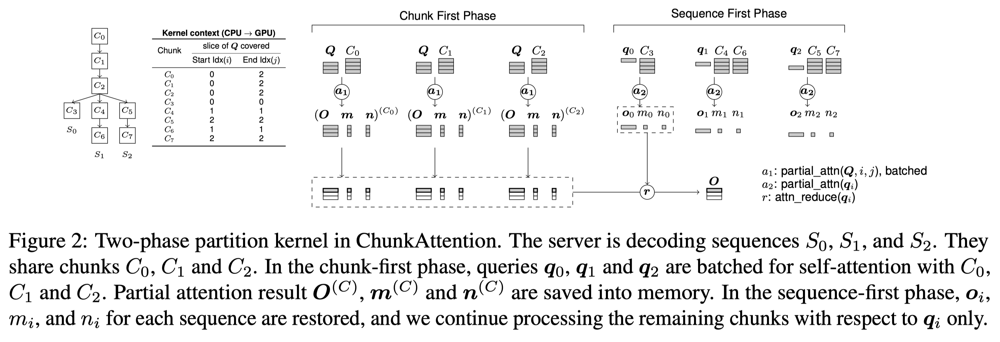 |  |  | [note](./notes/2024/ChunkAttention/note.md) |

<b>Yang Zhang</b>
 

| Meta | Title | Cover | Publish | Code | Note |
|:-----|:------|:------|:--------|:-----|:-----|
| [DeepSeek-V3](./meta/2024/DeepSeek-V3.prototxt) | [DeepSeek-V3 Technical Report](http://arxiv.org/abs/2412.19437v1) |  |  |  | [note](./notes/2024/DeepSeek-V3/note.md) |
| [DeepSeek-R1](./meta/2025/DeepSeek-R1.prototxt) | [DeepSeek-R1: Incentivizing Reasoning Capability in LLMs via Reinforcement Learning](http://arxiv.org/abs/2501.12948v1) |  |  |  | [note](./notes/2025/DeepSeek-R1/note.md) |

<b>Yanghao Li</b>
 

| Meta | Title | Cover | Publish | Code | Note |
|:-----|:------|:------|:--------|:-----|:-----|
| [InfLLM-V2](./meta/2025/InfLLM-V2.prototxt) | [InfLLM-V2: Dense-Sparse Switchable Attention for Seamless Short-to-Long Adaptation](http://arxiv.org/abs/2509.24663v1) |  |  |  | [note](./notes/2025/InfLLM-V2/note.md) |
| [MiniCPM4](./meta/2025/MiniCPM4.prototxt) | [MiniCPM4: Ultra-Efficient LLMs on End Devices](http://arxiv.org/abs/2506.07900v1) |  |  |  | [note](./notes/2025/MiniCPM4/note.md) |

<b>Yanhong Xu</b>
 

| Meta | Title | Cover | Publish | Code | Note |
|:-----|:------|:------|:--------|:-----|:-----|
| [DeepSeek-V2](./meta/2024/DeepSeek-V2.prototxt) | [DeepSeek-V2: A Strong, Economical, and Efficient Mixture-of-Experts Language Model](http://arxiv.org/abs/2405.04434v5) |  |  |  | [note](./notes/2024/DeepSeek-V2/note.md) |
| [DeepSeek-R1](./meta/2025/DeepSeek-R1.prototxt) | [DeepSeek-R1: Incentivizing Reasoning Capability in LLMs via Reinforcement Learning](http://arxiv.org/abs/2501.12948v1) |  | ](https://github.com/deepseek-ai/DeepSeek-R1)--green) | [note](./notes/2025/DeepSeek-R1/note.md) | None |
| [DeepSeek-R1](./meta/2025/DeepSeek-R1.prototxt) | [DeepSeek-R1: Incentivizing Reasoning Capability in LLMs via Reinforcement Learning](http://arxiv.org/abs/2501.12948v1) |  | ](https://github.com/deepseek-ai/DeepSeek-R1)--green) | [note](./notes/2025/DeepSeek-R1/note.md) | None |
| [DeepSeek-V3](./meta/2024/DeepSeek-V3.prototxt) | [DeepSeek-V3 Technical Report](http://arxiv.org/abs/2412.19437v1) |  | ](https://github.com/deepseek-ai/DeepSeek-V3)--green) | [note](./notes/2024/DeepSeek-V3/note.md) | None |
| [DeepSeek-V3](./meta/2024/DeepSeek-V3.prototxt) | [DeepSeek-V3 Technical Report](http://arxiv.org/abs/2412.19437v1) |  | ](https://github.com/deepseek-ai/DeepSeek-V3)--green) | [note](./notes/2024/DeepSeek-V3/note.md) | None |

<b>Yankai Lin</b>
 

| Meta | Title | Cover | Publish | Code | Note |
|:-----|:------|:------|:--------|:-----|:-----|
| [ReLU2](./meta/2024/ReLU2.prototxt) | [ReLU2 Wins: Discovering Efficient Activation Functions for Sparse LLMs](https://arxiv.org/abs/2402.03804) |  |  |  | [note](./notes/2024/ReLU2/note.md) |
| [MiniCPM4](./meta/2025/MiniCPM4.prototxt) | [MiniCPM4: Ultra-Efficient LLMs on End Devices](http://arxiv.org/abs/2506.07900v1) |  |  |  | [note](./notes/2025/MiniCPM4/note.md) |

<b>Yanping Huang</b>
 

| Meta | Title | Cover | Publish | Code | Note |
|:-----|:------|:------|:--------|:-----|:-----|
| [DeepSeek-V2](./meta/2024/DeepSeek-V2.prototxt) | [DeepSeek-V2: A Strong, Economical, and Efficient Mixture-of-Experts Language Model](http://arxiv.org/abs/2405.04434v5) |  |  |  | [note](./notes/2024/DeepSeek-V2/note.md) |
| [DeepSeek-V3](./meta/2024/DeepSeek-V3.prototxt) | [DeepSeek-V3 Technical Report](http://arxiv.org/abs/2412.19437v1) |  |  |  | [note](./notes/2024/DeepSeek-V3/note.md) |
| [DeepSeek-R1](./meta/2025/DeepSeek-R1.prototxt) | [DeepSeek-R1: Incentivizing Reasoning Capability in LLMs via Reinforcement Learning](http://arxiv.org/abs/2501.12948v1) |  |  |  | [note](./notes/2025/DeepSeek-R1/note.md) |

<b>Yao Li</b>
 

| Meta | Title | Cover | Publish | Code | Note |
|:-----|:------|:------|:--------|:-----|:-----|
| [DeepSeek-V2](./meta/2024/DeepSeek-V2.prototxt) | [DeepSeek-V2: A Strong, Economical, and Efficient Mixture-of-Experts Language Model](http://arxiv.org/abs/2405.04434v5) |  |  |  | [note](./notes/2024/DeepSeek-V2/note.md) |
| [DeepSeek-V3](./meta/2024/DeepSeek-V3.prototxt) | [DeepSeek-V3 Technical Report](http://arxiv.org/abs/2412.19437v1) |  |  |  | [note](./notes/2024/DeepSeek-V3/note.md) |
| [DeepSeek-R1](./meta/2025/DeepSeek-R1.prototxt) | [DeepSeek-R1: Incentivizing Reasoning Capability in LLMs via Reinforcement Learning](http://arxiv.org/abs/2501.12948v1) |  |  |  | [note](./notes/2025/DeepSeek-R1/note.md) |

<b>Yao Zhao</b>
 

| Meta | Title | Cover | Publish | Code | Note |
|:-----|:------|:------|:--------|:-----|:-----|
| [DeepSeek-V2](./meta/2024/DeepSeek-V2.prototxt) | [DeepSeek-V2: A Strong, Economical, and Efficient Mixture-of-Experts Language Model](http://arxiv.org/abs/2405.04434v5) |  |  |  | [note](./notes/2024/DeepSeek-V2/note.md) |
| [DeepSeek-V3](./meta/2024/DeepSeek-V3.prototxt) | [DeepSeek-V3 Technical Report](http://arxiv.org/abs/2412.19437v1) |  |  |  | [note](./notes/2024/DeepSeek-V3/note.md) |
| [DeepSeek-R1](./meta/2025/DeepSeek-R1.prototxt) | [DeepSeek-R1: Incentivizing Reasoning Capability in LLMs via Reinforcement Learning](http://arxiv.org/abs/2501.12948v1) |  |  |  | [note](./notes/2025/DeepSeek-R1/note.md) |

<b>Yaofeng Sun</b>
 

| Meta | Title | Cover | Publish | Code | Note |
|:-----|:------|:------|:--------|:-----|:-----|
| [DeepSeek-V2](./meta/2024/DeepSeek-V2.prototxt) | [DeepSeek-V2: A Strong, Economical, and Efficient Mixture-of-Experts Language Model](http://arxiv.org/abs/2405.04434v5) |  |  |  | [note](./notes/2024/DeepSeek-V2/note.md) |
| [DeepSeek-V3](./meta/2024/DeepSeek-V3.prototxt) | [DeepSeek-V3 Technical Report](http://arxiv.org/abs/2412.19437v1) |  |  |  | [note](./notes/2024/DeepSeek-V3/note.md) |
| [DeepSeek-R1](./meta/2025/DeepSeek-R1.prototxt) | [DeepSeek-R1: Incentivizing Reasoning Capability in LLMs via Reinforcement Learning](http://arxiv.org/abs/2501.12948v1) |  |  |  | [note](./notes/2025/DeepSeek-R1/note.md) |

<b>Yaohui Li</b>
 

| Meta | Title | Cover | Publish | Code | Note |
|:-----|:------|:------|:--------|:-----|:-----|
| [DeepSeek-V2](./meta/2024/DeepSeek-V2.prototxt) | [DeepSeek-V2: A Strong, Economical, and Efficient Mixture-of-Experts Language Model](http://arxiv.org/abs/2405.04434v5) |  |  |  | [note](./notes/2024/DeepSeek-V2/note.md) |
| [DeepSeek-V3](./meta/2024/DeepSeek-V3.prototxt) | [DeepSeek-V3 Technical Report](http://arxiv.org/abs/2412.19437v1) |  |  |  | [note](./notes/2024/DeepSeek-V3/note.md) |
| [DeepSeek-R1](./meta/2025/DeepSeek-R1.prototxt) | [DeepSeek-R1: Incentivizing Reasoning Capability in LLMs via Reinforcement Learning](http://arxiv.org/abs/2501.12948v1) |  |  |  | [note](./notes/2025/DeepSeek-R1/note.md) |

<b>Yaohui Wang</b>
 

| Meta | Title | Cover | Publish | Code | Note |
|:-----|:------|:------|:--------|:-----|:-----|
| [DeepSeek-V2](./meta/2024/DeepSeek-V2.prototxt) | [DeepSeek-V2: A Strong, Economical, and Efficient Mixture-of-Experts Language Model](http://arxiv.org/abs/2405.04434v5) |  |  |  | [note](./notes/2024/DeepSeek-V2/note.md) |
| [DeepSeek-V3](./meta/2024/DeepSeek-V3.prototxt) | [DeepSeek-V3 Technical Report](http://arxiv.org/abs/2412.19437v1) |  |  |  | [note](./notes/2024/DeepSeek-V3/note.md) |
| [DeepSeek-R1](./meta/2025/DeepSeek-R1.prototxt) | [DeepSeek-R1: Incentivizing Reasoning Capability in LLMs via Reinforcement Learning](http://arxiv.org/abs/2501.12948v1) |  |  |  | [note](./notes/2025/DeepSeek-R1/note.md) |

<b>Yefei He</b>
 

| Meta | Title | Cover | Publish | Code | Note |
|:-----|:------|:------|:--------|:-----|:-----|
| [ZipCache](./meta/2024/ZipCache.prototxt) | [ZipCache: Accurate and Efficient KV Cache Quantization with Salient Token Identification](http://arxiv.org/abs/2405.14256v1) |  |  |  | [note](./notes/2024/ZipCache/note.md) |
| [MiniCache](./meta/2024/MiniCache.prototxt) | [MiniCache: KV Cache Compression in Depth Dimension for Large Language Models](http://arxiv.org/abs/2405.14366v2) |  |  |  | [note](./notes/2024/MiniCache/note.md) |
| [ZipVL](./meta/2024/ZipVL.prototxt) | [ZipVL: Efficient Large Vision-Language Models with Dynamic Token Sparsification](http://arxiv.org/abs/2410.08584v2) |  |  |  | [note](./notes/2024/ZipVL/note.md) |

<b>Yehui Tang</b>
 

| Meta | Title | Cover | Publish | Code | Note |
|:-----|:------|:------|:--------|:-----|:-----|
| [SlimLLM](./meta/2025/SlimLLM.prototxt) | [SlimLLM: Accurate Structured Pruning for Large Language Models](http://arxiv.org/abs/2505.22689v1) |  |  |  | [note](./notes/2025/SlimLLM/note.md) |
| [PanguUltra](./meta/2025/PanguUltra.prototxt) | [Pangu Ultra: Pushing the Limits of Dense Large Language Models on Ascend NPUs](http://arxiv.org/abs/2504.07866v2) |  |  |  | [note](./notes/2025/PanguUltra/note.md) |

<b>Yi Yu</b>
 

| Meta | Title | Cover | Publish | Code | Note |
|:-----|:------|:------|:--------|:-----|:-----|
| [DeepSeek-V3](./meta/2024/DeepSeek-V3.prototxt) | [DeepSeek-V3 Technical Report](http://arxiv.org/abs/2412.19437v1) |  |  |  | [note](./notes/2024/DeepSeek-V3/note.md) |
| [DeepSeek-R1](./meta/2025/DeepSeek-R1.prototxt) | [DeepSeek-R1: Incentivizing Reasoning Capability in LLMs via Reinforcement Learning](http://arxiv.org/abs/2501.12948v1) |  |  |  | [note](./notes/2025/DeepSeek-R1/note.md) |

<b>Yi Zheng</b>
 

| Meta | Title | Cover | Publish | Code | Note |
|:-----|:------|:------|:--------|:-----|:-----|
| [DeepSeek-V2](./meta/2024/DeepSeek-V2.prototxt) | [DeepSeek-V2: A Strong, Economical, and Efficient Mixture-of-Experts Language Model](http://arxiv.org/abs/2405.04434v5) |  |  |  | [note](./notes/2024/DeepSeek-V2/note.md) |
| [DeepSeek-V3](./meta/2024/DeepSeek-V3.prototxt) | [DeepSeek-V3 Technical Report](http://arxiv.org/abs/2412.19437v1) |  |  |  | [note](./notes/2024/DeepSeek-V3/note.md) |
| [DeepSeek-R1](./meta/2025/DeepSeek-R1.prototxt) | [DeepSeek-R1: Incentivizing Reasoning Capability in LLMs via Reinforcement Learning](http://arxiv.org/abs/2501.12948v1) |  |  |  | [note](./notes/2025/DeepSeek-R1/note.md) |

<b>Yichao Zhang</b>
 

| Meta | Title | Cover | Publish | Code | Note |
|:-----|:------|:------|:--------|:-----|:-----|
| [DeepSeek-V2](./meta/2024/DeepSeek-V2.prototxt) | [DeepSeek-V2: A Strong, Economical, and Efficient Mixture-of-Experts Language Model](http://arxiv.org/abs/2405.04434v5) |  |  |  | [note](./notes/2024/DeepSeek-V2/note.md) |
| [DeepSeek-V3](./meta/2024/DeepSeek-V3.prototxt) | [DeepSeek-V3 Technical Report](http://arxiv.org/abs/2412.19437v1) |  |  |  | [note](./notes/2024/DeepSeek-V3/note.md) |
| [DeepSeek-R1](./meta/2025/DeepSeek-R1.prototxt) | [DeepSeek-R1: Incentivizing Reasoning Capability in LLMs via Reinforcement Learning](http://arxiv.org/abs/2501.12948v1) |  |  |  | [note](./notes/2025/DeepSeek-R1/note.md) |

<b>Yifan Shi</b>
 

| Meta | Title | Cover | Publish | Code | Note |
|:-----|:------|:------|:--------|:-----|:-----|
| [DeepSeek-V3](./meta/2024/DeepSeek-V3.prototxt) | [DeepSeek-V3 Technical Report](http://arxiv.org/abs/2412.19437v1) |  |  |  | [note](./notes/2024/DeepSeek-V3/note.md) |
| [DeepSeek-R1](./meta/2025/DeepSeek-R1.prototxt) | [DeepSeek-R1: Incentivizing Reasoning Capability in LLMs via Reinforcement Learning](http://arxiv.org/abs/2501.12948v1) |  |  |  | [note](./notes/2025/DeepSeek-R1/note.md) |

<b>Yifu Ding</b>
 

| Meta | Title | Cover | Publish | Code | Note |
|:-----|:------|:------|:--------|:-----|:-----|
| [VORTA](./meta/2025/VORTA.prototxt) | [VORTA: Efficient Video Diffusion via Routing Sparse Attention](http://arxiv.org/abs/2505.18809v2) |  |  |  | [note](./notes/2025/VORTA/note.md) |
| [MoDES](./meta/2025/MoDES.prototxt) | [MoDES: Accelerating Mixture-of-Experts Multimodal Large Language Models via Dynamic Expert Skipping](http://arxiv.org/abs/2511.15690v1) |  |  |  | [note](./notes/2025/MoDES/note.md) |

<b>Yikai Zhang</b>
 

| Meta | Title | Cover | Publish | Code | Note |
|:-----|:------|:------|:--------|:-----|:-----|
| [PowerAttention](./meta/2025/PowerAttention.prototxt) | [PowerAttention: Exponentially Scaling of Receptive Fields for Effective Sparse Attention](http://arxiv.org/abs/2503.03588v1) |  |  |  | [note](./notes/2025/PowerAttention/note.md) |
| [R-KV](./meta/2025/R-KV.prototxt) | [R-KV: Redundancy-aware KV Cache Compression for Training-Free Reasoning Models Acceleration](http://arxiv.org/abs/2505.24133v2) |  |  |  | [note](./notes/2025/R-KV/note.md) |

<b>Yiliang Xiong</b>
 

| Meta | Title | Cover | Publish | Code | Note |
|:-----|:------|:------|:--------|:-----|:-----|
| [DeepSeek-V2](./meta/2024/DeepSeek-V2.prototxt) | [DeepSeek-V2: A Strong, Economical, and Efficient Mixture-of-Experts Language Model](http://arxiv.org/abs/2405.04434v5) |  |  |  | [note](./notes/2024/DeepSeek-V2/note.md) |
| [DeepSeek-V3](./meta/2024/DeepSeek-V3.prototxt) | [DeepSeek-V3 Technical Report](http://arxiv.org/abs/2412.19437v1) |  |  |  | [note](./notes/2024/DeepSeek-V3/note.md) |
| [DeepSeek-R1](./meta/2025/DeepSeek-R1.prototxt) | [DeepSeek-R1: Incentivizing Reasoning Capability in LLMs via Reinforcement Learning](http://arxiv.org/abs/2501.12948v1) |  |  |  | [note](./notes/2025/DeepSeek-R1/note.md) |

<b>Yilong Zhao</b>
 

| Meta | Title | Cover | Publish | Code | Note |
|:-----|:------|:------|:--------|:-----|:-----|
| [Quest](./meta/2024/Quest.prototxt) | [Quest: Query-Aware Sparsity for Efficient Long-Context LLM Inference](http://arxiv.org/abs/2406.10774) |  |  |  | [note](./notes/2024/Quest/note.md) |
| [DeepSeek-V2](./meta/2024/DeepSeek-V2.prototxt) | [DeepSeek-V2: A Strong, Economical, and Efficient Mixture-of-Experts Language Model](http://arxiv.org/abs/2405.04434v5) |  |  |  | [note](./notes/2024/DeepSeek-V2/note.md) |
| [XGrammar](./meta/2024/XGrammar.prototxt) | [XGrammar: Flexible and Efficient Structured Generation Engine for Large Language Models](http://arxiv.org/abs/2411.15100v2) |  |  |  | [note](./notes/2024/XGrammar/note.md) |
| [SVG](./meta/2025/SVG.prototxt) | [Sparse VideoGen: Accelerating Video Diffusion Transformers with Spatial-Temporal Sparsity](http://arxiv.org/abs/2502.01776v2) |  |  |  | [note](./notes/2025/SVG/note.md) |
| [SVG2](./meta/2025/SVG2.prototxt) | [Sparse VideoGen2: Accelerate Video Generation with Sparse Attention via Semantic-Aware Permutation](http://arxiv.org/abs/2505.18875v3) |  |  |  | [note](./notes/2025/SVG2/note.md) |
| [NanoFlow](./meta/2025/NanoFlow.prototxt) | [NanoFlow: Towards Optimal Large Language Model Serving Throughput](http://arxiv.org/abs/2408.12757v2) |  |  |  | [note](./notes/2025/NanoFlow/note.md) |

<b>Ying He</b>
 

| Meta | Title | Cover | Publish | Code | Note |
|:-----|:------|:------|:--------|:-----|:-----|
| [DeepSeek-V2](./meta/2024/DeepSeek-V2.prototxt) | [DeepSeek-V2: A Strong, Economical, and Efficient Mixture-of-Experts Language Model](http://arxiv.org/abs/2405.04434v5) |  |  |  | [note](./notes/2024/DeepSeek-V2/note.md) |
| [DeepSeek-V3](./meta/2024/DeepSeek-V3.prototxt) | [DeepSeek-V3 Technical Report](http://arxiv.org/abs/2412.19437v1) |  |  |  | [note](./notes/2024/DeepSeek-V3/note.md) |
| [DeepSeek-R1](./meta/2025/DeepSeek-R1.prototxt) | [DeepSeek-R1: Incentivizing Reasoning Capability in LLMs via Reinforcement Learning](http://arxiv.org/abs/2501.12948v1) |  |  |  | [note](./notes/2025/DeepSeek-R1/note.md) |

<b>Ying Sheng</b>
 

| Meta | Title | Cover | Publish | Code | Note |
|:-----|:------|:------|:--------|:-----|:-----|
| [PagedAttention](./meta/2023/PagedAttention.prototxt) | [Efficient Memory Management for Large Language Model Serving with PagedAttention](http://arxiv.org/abs/2309.06180v1) |  |  |  | [note](./notes/2023/PagedAttention/note.md) |
| [H2O](./meta/2023/H2O.prototxt) | [H$_2$O: Heavy-Hitter Oracle for Efficient Generative Inference of Large Language Models](http://arxiv.org/abs/2306.14048) |  |  |  | [note](./notes/2023/H2O/note.md) |
| [SGLang](./meta/2024/SGLang.prototxt) | [SGLang: Efficient Execution of Structured Language Model Programs](http://arxiv.org/abs/2312.07104v2) |  |  |  | [note](./notes/2024/SGLang/note.md) |
| [DoubleSparsity](./meta/2024/DoubleSparsity.prototxt) | [Post-Training Sparse Attention with Double Sparsity](http://arxiv.org/abs/2408.07092v2) |  |  |  | [note](./notes/2024/DoubleSparsity/note.md) |

<b>Ying Tang</b>
 

| Meta | Title | Cover | Publish | Code | Note |
|:-----|:------|:------|:--------|:-----|:-----|
| [DeepSeek-V2](./meta/2024/DeepSeek-V2.prototxt) | [DeepSeek-V2: A Strong, Economical, and Efficient Mixture-of-Experts Language Model](http://arxiv.org/abs/2405.04434v5) |  |  |  | [note](./notes/2024/DeepSeek-V2/note.md) |
| [DeepSeek-V3](./meta/2024/DeepSeek-V3.prototxt) | [DeepSeek-V3 Technical Report](http://arxiv.org/abs/2412.19437v1) |  |  |  | [note](./notes/2024/DeepSeek-V3/note.md) |
| [DeepSeek-R1](./meta/2025/DeepSeek-R1.prototxt) | [DeepSeek-R1: Incentivizing Reasoning Capability in LLMs via Reinforcement Learning](http://arxiv.org/abs/2501.12948v1) |  |  |  | [note](./notes/2025/DeepSeek-R1/note.md) |

<b>Yingfa Chen</b>
 

| Meta | Title | Cover | Publish | Code | Note |
|:-----|:------|:------|:--------|:-----|:-----|
| [InfiniteBench](./meta/2024/InfiniteBench.prototxt) | [$\infty$Bench: Extending Long Context Evaluation Beyond 100K Tokens](http://arxiv.org/abs/2402.13718v3) |  |  |  | [note](./notes/2024/InfiniteBench/note.md) |
| [BlockFFN](./meta/2025/BlockFFN.prototxt) | [BlockFFN: Towards End-Side Acceleration-Friendly Mixture-of-Experts with Chunk-Level Activation Sparsity](http://arxiv.org/abs/2507.08771v1) |  |  |  | [note](./notes/2025/BlockFFN/note.md) |
| [SparsingLaw](./meta/2025/SparsingLaw.prototxt) | [Sparsing Law: Towards Large Language Models with Greater Activation Sparsity](https://openreview.net/forum?id=SBUc5wirM8) |  |  |  | [note](./notes/2025/SparsingLaw/note.md) |

<b>Yinhe Han</b>
 

| Meta | Title | Cover | Publish | Code | Note |
|:-----|:------|:------|:--------|:-----|:-----|
| [COMET](./meta/2025/COMET.prototxt) | [COMET: Towards Partical W4A4KV4 LLMs Serving](http://arxiv.org/abs/2410.12168v1) |  |  |  | [note](./notes/2025/COMET/note.md) |
| [BaWA](./meta/2025/BaWA.prototxt) | [BaWA: Automatic Optimizing Pruning Metric for Large Language Models with Balanced Weight and Activation](https://openreview.net/forum?id=YrCvW1Hx7g) |  |  |  | [note](./notes/2025/BaWA/note.md) |

<b>Yiran Zhong</b>
 

| Meta | Title | Cover | Publish | Code | Note |
|:-----|:------|:------|:--------|:-----|:-----|
| [LightningAttention](./meta/2024/LightningAttention.prototxt) | [Various Lengths, Constant Speed: Efficient Language Modeling with Lightning Attention](http://arxiv.org/abs/2405.17381v2) |  |  |  | [note](./notes/2024/LightningAttention/note.md) |
| [LightningAttention-2](./meta/2024/LightningAttention-2.prototxt) | [Lightning Attention-2: A Free Lunch for Handling Unlimited Sequence Lengths in Large Language Models](http://arxiv.org/abs/2401.04658v2) |  |  |  | [note](./notes/2024/LightningAttention-2/note.md) |
| [MiniMax-01](./meta/2025/MiniMax-01.prototxt) | [MiniMax-01: Scaling Foundation Models with Lightning Attention](http://arxiv.org/abs/2501.08313v1) |  |  |  | [note](./notes/2025/MiniMax-01/note.md) |
| [MiniMax-M1](./meta/2025/MiniMax-M1.prototxt) | [MiniMax-M1: Scaling Test-Time Compute Efficiently with Lightning Attention](http://arxiv.org/abs/2506.13585v1) |  |  |  | [note](./notes/2025/MiniMax-M1/note.md) |

<b>Yishi Piao</b>
 

| Meta | Title | Cover | Publish | Code | Note |
|:-----|:------|:------|:--------|:-----|:-----|
| [DeepSeek-V2](./meta/2024/DeepSeek-V2.prototxt) | [DeepSeek-V2: A Strong, Economical, and Efficient Mixture-of-Experts Language Model](http://arxiv.org/abs/2405.04434v5) |  |  |  | [note](./notes/2024/DeepSeek-V2/note.md) |
| [DeepSeek-V3](./meta/2024/DeepSeek-V3.prototxt) | [DeepSeek-V3 Technical Report](http://arxiv.org/abs/2412.19437v1) |  |  |  | [note](./notes/2024/DeepSeek-V3/note.md) |
| [DeepSeek-R1](./meta/2025/DeepSeek-R1.prototxt) | [DeepSeek-R1: Incentivizing Reasoning Capability in LLMs via Reinforcement Learning](http://arxiv.org/abs/2501.12948v1) |  |  |  | [note](./notes/2025/DeepSeek-R1/note.md) |

<b>Yisong Wang</b>
 

| Meta | Title | Cover | Publish | Code | Note |
|:-----|:------|:------|:--------|:-----|:-----|
| [DeepSeek-V3](./meta/2024/DeepSeek-V3.prototxt) | [DeepSeek-V3 Technical Report](http://arxiv.org/abs/2412.19437v1) |  |  |  | [note](./notes/2024/DeepSeek-V3/note.md) |
| [DeepSeek-R1](./meta/2025/DeepSeek-R1.prototxt) | [DeepSeek-R1: Incentivizing Reasoning Capability in LLMs via Reinforcement Learning](http://arxiv.org/abs/2501.12948v1) |  |  |  | [note](./notes/2025/DeepSeek-R1/note.md) |

<b>Yiwu Yao</b>
 

| Meta | Title | Cover | Publish | Code | Note |
|:-----|:------|:------|:--------|:-----|:-----|
| [DSnoT](./meta/2024/DSnoT.prototxt) | [Dynamic Sparse No Training: Training-Free Fine-tuning for Sparse LLMs](http://arxiv.org/abs/2310.08915v3) |  |  |  | [note](./notes/2024/DSnoT/note.md) |
| [AmberPruner](./meta/2025/AmberPruner.prototxt) | [Amber Pruner: Leveraging N:M Activation Sparsity for Efficient Prefill in Large Language Models](http://arxiv.org/abs/2508.02128v1) |  |  |  | [note](./notes/2025/AmberPruner/note.md) |

<b>Yixiao Li</b>
 

| Meta | Title | Cover | Publish | Code | Note |
|:-----|:------|:------|:--------|:-----|:-----|
| [LoSparse](./meta/2023/LoSparse.prototxt) | [Structured Compression of Large Language Models based on Low-Rank and Sparse Approximation](https://arxiv.org/abs/2306.11222) |  |  |  |  |
| [LoftQ](./meta/2023/loftq.prototxt) | [LoftQ: LoRA-Fine-Tuning-Aware Quantization for Large Language Models](https://arxiv.org/abs/2310.08659) |  |  |  | [note](./notes/2023/loftq/note.md) |

<b>Yixin Dong</b>
 

| Meta | Title | Cover | Publish | Code | Note |
|:-----|:------|:------|:--------|:-----|:-----|
| [DeepSeek-V2](./meta/2024/DeepSeek-V2.prototxt) | [DeepSeek-V2: A Strong, Economical, and Efficient Mixture-of-Experts Language Model](http://arxiv.org/abs/2405.04434v5) |  |  |  | [note](./notes/2024/DeepSeek-V2/note.md) |
| [XGrammar](./meta/2024/XGrammar.prototxt) | [XGrammar: Flexible and Efficient Structured Generation Engine for Large Language Models](http://arxiv.org/abs/2411.15100v2) |  |  |  | [note](./notes/2024/XGrammar/note.md) |

<b>Yixin Song</b>
 

| Meta | Title | Cover | Publish | Code | Note |
|:-----|:------|:------|:--------|:-----|:-----|
| [PowerInfer](./meta/2023/PowerInfer.prototxt) | [PowerInfer: Fast Large Language Model Serving with a Consumer-grade GPU](http://arxiv.org/abs/2312.12456v1) |  |  |  | [note](./notes/2023/PowerInfer/note.md) |
| [PowerInfer-2](./meta/2024/PowerInfer-2.prototxt) | [PowerInfer-2: Fast Large Language Model Inference on a Smartphone](http://arxiv.org/abs/2406.06282v2) |  |  | [Website](https://powerinfer.ai/v2/) | [note](./notes/2024/PowerInfer-2/note.md) |
| [ReLU2](./meta/2024/ReLU2.prototxt) | [ReLU2 Wins: Discovering Efficient Activation Functions for Sparse LLMs](https://arxiv.org/abs/2402.03804) |  |  |  | [note](./notes/2024/ReLU2/note.md) |
| [Turbo Sparse](./meta/2024/TurboSparse.prototxt) | [Turbo Sparse: Achieving LLM SOTA Performance with Minimal Activated Parameters](http://arxiv.org/abs/2406.05955v2) |  |  | [Pytorch](https://huggingface.co/PowerInfer) | [note](./notes/2024/TurboSparse/note.md) |

<b>Yixuan Tan</b>
 

| Meta | Title | Cover | Publish | Code | Note |
|:-----|:------|:------|:--------|:-----|:-----|
| [DeepSeek-V2](./meta/2024/DeepSeek-V2.prototxt) | [DeepSeek-V2: A Strong, Economical, and Efficient Mixture-of-Experts Language Model](http://arxiv.org/abs/2405.04434v5) |  |  |  | [note](./notes/2024/DeepSeek-V2/note.md) |
| [DeepSeek-V3](./meta/2024/DeepSeek-V3.prototxt) | [DeepSeek-V3 Technical Report](http://arxiv.org/abs/2412.19437v1) |  |  |  | [note](./notes/2024/DeepSeek-V3/note.md) |
| [DeepSeek-R1](./meta/2025/DeepSeek-R1.prototxt) | [DeepSeek-R1: Incentivizing Reasoning Capability in LLMs via Reinforcement Learning](http://arxiv.org/abs/2501.12948v1) |  |  |  | [note](./notes/2025/DeepSeek-R1/note.md) |

<b>Yiyang Ma</b>
 

| Meta | Title | Cover | Publish | Code | Note |
|:-----|:------|:------|:--------|:-----|:-----|
| [DeepSeek-V3](./meta/2024/DeepSeek-V3.prototxt) | [DeepSeek-V3 Technical Report](http://arxiv.org/abs/2412.19437v1) |  |  |  | [note](./notes/2024/DeepSeek-V3/note.md) |
| [DeepSeek-R1](./meta/2025/DeepSeek-R1.prototxt) | [DeepSeek-R1: Incentivizing Reasoning Capability in LLMs via Reinforcement Learning](http://arxiv.org/abs/2501.12948v1) |  |  |  | [note](./notes/2025/DeepSeek-R1/note.md) |

<b>Yiyuan Liu</b>
 

| Meta | Title | Cover | Publish | Code | Note |
|:-----|:------|:------|:--------|:-----|:-----|
| [DeepSeek-V2](./meta/2024/DeepSeek-V2.prototxt) | [DeepSeek-V2: A Strong, Economical, and Efficient Mixture-of-Experts Language Model](http://arxiv.org/abs/2405.04434v5) |  |  |  | [note](./notes/2024/DeepSeek-V2/note.md) |
| [DeepSeek-V3](./meta/2024/DeepSeek-V3.prototxt) | [DeepSeek-V3 Technical Report](http://arxiv.org/abs/2412.19437v1) |  |  |  | [note](./notes/2024/DeepSeek-V3/note.md) |
| [DeepSeek-R1](./meta/2025/DeepSeek-R1.prototxt) | [DeepSeek-R1: Incentivizing Reasoning Capability in LLMs via Reinforcement Learning](http://arxiv.org/abs/2501.12948v1) |  |  |  | [note](./notes/2025/DeepSeek-R1/note.md) |

<b>Yiyuan Ma</b>
 

| Meta | Title | Cover | Publish | Code | Note |
|:-----|:------|:------|:--------|:-----|:-----|
| [FlexPrefill](./meta/2025/FlexPrefill.prototxt) | [FlexPrefill: A Context-Aware Sparse Attention Mechanism for Efficient Long-Sequence Inference](http://arxiv.org/abs/2502.20766v1) |  |  |  | [note](./notes/2025/FlexPrefill/note.md) |
| [MegaScale-MoE](./meta/2025/MegaScale-MoE.prototxt) | [MegaScale-MoE: Large-Scale Communication-Efficient Training of Mixture-of-Experts Models in Production](http://arxiv.org/abs/2505.11432v2) |  |  |  | [note](./notes/2025/MegaScale-MoE/note.md) |

<b>Yizhao Gao</b>
 

| Meta | Title | Cover | Publish | Code | Note |
|:-----|:------|:------|:--------|:-----|:-----|
| [SeerAttention](./meta/2024/SeerAttention.prototxt) | [SeerAttention: Learning Intrinsic Sparse Attention in Your LLMs](http://arxiv.org/abs/2410.13276v2) |  |  |  | [note](./notes/2024/SeerAttention/note.md) |
| [ReSA](./meta/2025/ReSA.prototxt) | [Rectified Sparse Attention](http://arxiv.org/abs/2506.04108v2) |  |  |  | [note](./notes/2025/ReSA/note.md) |
| [SeerAttention-R](./meta/2025/SeerAttention-R.prototxt) | [SeerAttention-R: Sparse Attention Adaptation for Long Reasoning](http://arxiv.org/abs/2506.08889v1) |  |  |  | [note](./notes/2025/SeerAttention-R/note.md) |

<b>Yong Li</b>
 

| Meta | Title | Cover | Publish | Code | Note |
|:-----|:------|:------|:--------|:-----|:-----|
| [Flash-LLM](./meta/2024/flash_llm.prototxt) | [Flash-LLM: Enabling Cost-Effective and Highly-Efficient Large Generative Model Inference with Unstructured Sparsity](https://arxiv.org/abs/2309.10285) |  |  |  | [note](./notes/2024/flash_llm/index.md) |
| [DistAttention](./meta/2024/DistAttention.prototxt) | [Infinite-LLM: Efficient LLM Service for Long Context with DistAttention and Distributed KVCache](http://arxiv.org/abs/2401.02669v2) |  |  |  | [note](./notes/2024/DistAttention/note.md) |
| [CateKV](./meta/2025/CateKV.prototxt) | [CateKV: On Sequential Consistency for Long-Context LLM Inference Acceleration](https://openreview.net/forum?id=u7dlwgKstN) |  |  |  | [note](./notes/2025/CateKV/note.md) |

<b>Yongqiang Guo</b>
 

| Meta | Title | Cover | Publish | Code | Note |
|:-----|:------|:------|:--------|:-----|:-----|
| [DeepSeek-V2](./meta/2024/DeepSeek-V2.prototxt) | [DeepSeek-V2: A Strong, Economical, and Efficient Mixture-of-Experts Language Model](http://arxiv.org/abs/2405.04434v5) |  |  |  | [note](./notes/2024/DeepSeek-V2/note.md) |
| [DeepSeek-V3](./meta/2024/DeepSeek-V3.prototxt) | [DeepSeek-V3 Technical Report](http://arxiv.org/abs/2412.19437v1) |  |  |  | [note](./notes/2024/DeepSeek-V3/note.md) |
| [DeepSeek-R1](./meta/2025/DeepSeek-R1.prototxt) | [DeepSeek-R1: Incentivizing Reasoning Capability in LLMs via Reinforcement Learning](http://arxiv.org/abs/2501.12948v1) |  |  |  | [note](./notes/2025/DeepSeek-R1/note.md) |

<b>Yongyi Hu</b>
 

| Meta | Title | Cover | Publish | Code | Note |
|:-----|:------|:------|:--------|:-----|:-----|
| [MiniMax-01](./meta/2025/MiniMax-01.prototxt) | [MiniMax-01: Scaling Foundation Models with Lightning Attention](http://arxiv.org/abs/2501.08313v1) |  |  |  | [note](./notes/2025/MiniMax-01/note.md) |
| [MiniMax-M1](./meta/2025/MiniMax-M1.prototxt) | [MiniMax-M1: Scaling Test-Time Compute Efficiently with Lightning Attention](http://arxiv.org/abs/2506.13585v1) |  |  |  | [note](./notes/2025/MiniMax-M1/note.md) |

<b>Yu Cheng</b>
 

| Meta | Title | Cover | Publish | Code | Note |
|:-----|:------|:------|:--------|:-----|:-----|
| [AdaLoRA](./meta/2023/adalora.prototxt) | [AdaLoRA: Adaptive Budget Allocation for Parameter-Efficient Fine-Tuning](https://arxiv.org/pdf/2303.10512.pdf) |  |  |  |  |
| [SeerAttention-R](./meta/2025/SeerAttention-R.prototxt) | [SeerAttention-R: Sparse Attention Adaptation for Long Reasoning](http://arxiv.org/abs/2506.08889v1) |  |  |  | [note](./notes/2025/SeerAttention-R/note.md) |
| [Awesome-Efficient-Arch](./meta/2025/Awesome-Efficient-Arch.prototxt) | [Speed Always Wins: A Survey on Efficient Architectures for Large Language Models](http://arxiv.org/abs/2508.09834v1) |  |  |  | [note](./notes/2025/Awesome-Efficient-Arch/note.md) |

<b>Yu Wang</b>
 

| Meta | Title | Cover | Publish | Code | Note |
|:-----|:------|:------|:--------|:-----|:-----|
| [m](./meta/2024/DHIB73MC.prototxt) | [A Survey on Efficient Inference for Large Language Models](http://arxiv.org/abs/2404.14294v2) |  |  |  | [note](./notes/2024/DHIB73MC/note.md) |
| [MoA](./meta/2024/MoA.prototxt) | [MoA: Mixture of Sparse Attention for Automatic Large Language Model Compression](http://arxiv.org/abs/2406.14909v2) |  |  |  | [note](./notes/2024/MoA/note.md) |
| [FlashOverlap](./meta/2026/FlashOverlap.prototxt) | [FlashOverlap: A Lightweight Design for Efficiently Overlapping Communication and Computation](http://arxiv.org/abs/2504.19519v1) |  |  |  | [note](./notes/2026/FlashOverlap/note.md) |

<b>Yu Wu</b>
 

| Meta | Title | Cover | Publish | Code | Note |
|:-----|:------|:------|:--------|:-----|:-----|
| [DeepSeek-V3](./meta/2024/DeepSeek-V3.prototxt) | [DeepSeek-V3 Technical Report](http://arxiv.org/abs/2412.19437v1) |  |  |  | [note](./notes/2024/DeepSeek-V3/note.md) |
| [DeepSeek-R1](./meta/2025/DeepSeek-R1.prototxt) | [DeepSeek-R1: Incentivizing Reasoning Capability in LLMs via Reinforcement Learning](http://arxiv.org/abs/2501.12948v1) |  |  |  | [note](./notes/2025/DeepSeek-R1/note.md) |

<b>Yuan Ou</b>
 

| Meta | Title | Cover | Publish | Code | Note |
|:-----|:------|:------|:--------|:-----|:-----|
| [DeepSeek-V3](./meta/2024/DeepSeek-V3.prototxt) | [DeepSeek-V3 Technical Report](http://arxiv.org/abs/2412.19437v1) |  |  |  | [note](./notes/2024/DeepSeek-V3/note.md) |
| [DeepSeek-R1](./meta/2025/DeepSeek-R1.prototxt) | [DeepSeek-R1: Incentivizing Reasoning Capability in LLMs via Reinforcement Learning](http://arxiv.org/abs/2501.12948v1) |  |  |  | [note](./notes/2025/DeepSeek-R1/note.md) |

<b>Yuandong Tian</b>
 

| Meta | Title | Cover | Publish | Code | Note |
|:-----|:------|:------|:--------|:-----|:-----|
| [H2O](./meta/2023/H2O.prototxt) | [H$_2$O: Heavy-Hitter Oracle for Efficient Generative Inference of Large Language Models](http://arxiv.org/abs/2306.14048) |  |  |  | [note](./notes/2023/H2O/note.md) |
| [streaming-llm](./meta/2024/streaming-llm.prototxt) | [Efficient Streaming Language Models with Attention Sinks](http://arxiv.org/abs/2309.17453v4) |  |  |  | [note](./notes/2024/streaming-llm/note.md) |
| [R-Sparse](./meta/2025/R-Sparse.prototxt) | [R-Sparse: Rank-Aware Activation Sparsity for Efficient LLM Inference](http://arxiv.org/abs/2504.19449v1) |  |  |  | [note](./notes/2025/R-Sparse/note.md) |

<b>Yuanxiang Fan</b>
 

| Meta | Title | Cover | Publish | Code | Note |
|:-----|:------|:------|:--------|:-----|:-----|
| [MiniMax-01](./meta/2025/MiniMax-01.prototxt) | [MiniMax-01: Scaling Foundation Models with Lightning Attention](http://arxiv.org/abs/2501.08313v1) |  |  |  | [note](./notes/2025/MiniMax-01/note.md) |
| [MiniMax-M1](./meta/2025/MiniMax-M1.prototxt) | [MiniMax-M1: Scaling Test-Time Compute Efficiently with Lightning Attention](http://arxiv.org/abs/2506.13585v1) |  |  |  | [note](./notes/2025/MiniMax-M1/note.md) |

<b>Yuchen Zhu</b>
 

| Meta | Title | Cover | Publish | Code | Note |
|:-----|:------|:------|:--------|:-----|:-----|
| [DeepSeek-V2](./meta/2024/DeepSeek-V2.prototxt) | [DeepSeek-V2: A Strong, Economical, and Efficient Mixture-of-Experts Language Model](http://arxiv.org/abs/2405.04434v5) |  |  |  | [note](./notes/2024/DeepSeek-V2/note.md) |
| [DeepSeek-V3](./meta/2024/DeepSeek-V3.prototxt) | [DeepSeek-V3 Technical Report](http://arxiv.org/abs/2412.19437v1) |  |  |  | [note](./notes/2024/DeepSeek-V3/note.md) |
| [DeepSeek-R1](./meta/2025/DeepSeek-R1.prototxt) | [DeepSeek-R1: Incentivizing Reasoning Capability in LLMs via Reinforcement Learning](http://arxiv.org/abs/2501.12948v1) |  |  |  | [note](./notes/2025/DeepSeek-R1/note.md) |

<b>Yucheng Li</b>
 

| Meta | Title | Cover | Publish | Code | Note |
|:-----|:------|:------|:--------|:-----|:-----|
| [Selective Context](./meta/2023/selective_context.prototxt) | [Unlocking Context Constraints of LLMs: Enhancing Context Efficiency of LLMs with Self-Information-Based Content Filtering](https://arxiv.org/abs/2304.12102) |  |  |  |  |
| [MInference](./meta/2024/MInference.prototxt) | [MInference 1.0: Accelerating Pre-filling for Long-Context LLMs via Dynamic Sparse Attention](http://arxiv.org/abs/2407.02490v1) |  |  |  | [note](./notes/2024/MInference/note.md) |
| [SCBench](./meta/2024/SCBench.prototxt) | [SCBench: A KV Cache-Centric Analysis of Long-Context Methods](http://arxiv.org/abs/2412.10319v2) |  |  |  | [note](./notes/2024/SCBench/note.md) |
| [MMInference](./meta/2025/MMInference.prototxt) | [MMInference: Accelerating Pre-filling for Long-Context VLMs via Modality-Aware Permutation Sparse Attention](https://openreview.net/forum?id=me6PfbATWM) |  |  |  | [note](./notes/2025/MMInference/note.md) |
| [R-KV](./meta/2025/R-KV.prototxt) | [R-KV: Redundancy-aware KV Cache Compression for Training-Free Reasoning Models Acceleration](http://arxiv.org/abs/2505.24133v2) |  |  |  | [note](./notes/2025/R-KV/note.md) |

<b>Yudi Zhang</b>
 

| Meta | Title | Cover | Publish | Code | Note |
|:-----|:------|:------|:--------|:-----|:-----|
| [InfLLM-V2](./meta/2025/InfLLM-V2.prototxt) | [InfLLM-V2: Dense-Sparse Switchable Attention for Seamless Short-to-Long Adaptation](http://arxiv.org/abs/2509.24663v1) |  |  |  | [note](./notes/2025/InfLLM-V2/note.md) |
| [MiniCPM4](./meta/2025/MiniCPM4.prototxt) | [MiniCPM4: Ultra-Efficient LLMs on End Devices](http://arxiv.org/abs/2506.07900v1) |  |  |  | [note](./notes/2025/MiniCPM4/note.md) |

<b>Yuduan Wang</b>
 

| Meta | Title | Cover | Publish | Code | Note |
|:-----|:------|:------|:--------|:-----|:-----|
| [DeepSeek-V2](./meta/2024/DeepSeek-V2.prototxt) | [DeepSeek-V2: A Strong, Economical, and Efficient Mixture-of-Experts Language Model](http://arxiv.org/abs/2405.04434v5) |  |  |  | [note](./notes/2024/DeepSeek-V2/note.md) |
| [DeepSeek-V3](./meta/2024/DeepSeek-V3.prototxt) | [DeepSeek-V3 Technical Report](http://arxiv.org/abs/2412.19437v1) |  |  |  | [note](./notes/2024/DeepSeek-V3/note.md) |
| [DeepSeek-R1](./meta/2025/DeepSeek-R1.prototxt) | [DeepSeek-R1: Incentivizing Reasoning Capability in LLMs via Reinforcement Learning](http://arxiv.org/abs/2501.12948v1) |  |  |  | [note](./notes/2025/DeepSeek-R1/note.md) |

<b>Yue Gong</b>
 

| Meta | Title | Cover | Publish | Code | Note |
|:-----|:------|:------|:--------|:-----|:-----|
| [DeepSeek-V3](./meta/2024/DeepSeek-V3.prototxt) | [DeepSeek-V3 Technical Report](http://arxiv.org/abs/2412.19437v1) |  |  |  | [note](./notes/2024/DeepSeek-V3/note.md) |
| [DeepSeek-R1](./meta/2025/DeepSeek-R1.prototxt) | [DeepSeek-R1: Incentivizing Reasoning Capability in LLMs via Reinforcement Learning](http://arxiv.org/abs/2501.12948v1) |  |  |  | [note](./notes/2025/DeepSeek-R1/note.md) |

<b>Yuezhou Hu</b>
 

| Meta | Title | Cover | Publish | Code | Note |
|:-----|:------|:------|:--------|:-----|:-----|
| [m](./meta/2024/HYPL7G37.prototxt) | [Accelerating Transformer Pre-training with 2:4 Sparsity](http://arxiv.org/abs/2404.01847v2) |  |  |  | [note](./notes/2024/HYPL7G37/note.md) |
| [AdaptiveSparseTrainer](./meta/2025/AdaptiveSparseTrainer.prototxt) | [Pruning Large Language Models with Semi-Structural Adaptive Sparse Training](http://arxiv.org/abs/2407.20584v3) |  |  |  | [note](./notes/2025/AdaptiveSparseTrainer/note.md) |

<b>Yufeng Yang</b>
 

| Meta | Title | Cover | Publish | Code | Note |
|:-----|:------|:------|:--------|:-----|:-----|
| [MiniMax-01](./meta/2025/MiniMax-01.prototxt) | [MiniMax-01: Scaling Foundation Models with Lightning Attention](http://arxiv.org/abs/2501.08313v1) |  |  |  | [note](./notes/2025/MiniMax-01/note.md) |
| [MiniMax-M1](./meta/2025/MiniMax-M1.prototxt) | [MiniMax-M1: Scaling Test-Time Compute Efficiently with Lightning Attention](http://arxiv.org/abs/2506.13585v1) |  |  |  | [note](./notes/2025/MiniMax-M1/note.md) |

<b>Yuhang Li</b>
 

| Meta | Title | Cover | Publish | Code | Note |
|:-----|:------|:------|:--------|:-----|:-----|
| [BRECQ](./meta/2021/brecq.prototxt) | [BRECQ: Pushing the Limit of Post-Training Quantization by Block Reconstruction](https://openreview.net/pdf?id=POWv6hDd9XH) |  |  |  |  |
| [GLM-4.5](./meta/2025/GLM-4.5.prototxt) | [GLM-4.5: Agentic, Reasoning, and Coding (ARC) Foundation Models](http://arxiv.org/abs/2508.06471v1) |  |  |  | [note](./notes/2025/GLM-4.5/note.md) |

<b>Yuhao Li</b>
 

| Meta | Title | Cover | Publish | Code | Note |
|:-----|:------|:------|:--------|:-----|:-----|
| [MiniMax-01](./meta/2025/MiniMax-01.prototxt) | [MiniMax-01: Scaling Foundation Models with Lightning Attention](http://arxiv.org/abs/2501.08313v1) |  |  |  | [note](./notes/2025/MiniMax-01/note.md) |
| [MiniMax-M1](./meta/2025/MiniMax-M1.prototxt) | [MiniMax-M1: Scaling Test-Time Compute Efficiently with Lightning Attention](http://arxiv.org/abs/2506.13585v1) |  |  |  | [note](./notes/2025/MiniMax-M1/note.md) |

<b>Yuheng Zou</b>
 

| Meta | Title | Cover | Publish | Code | Note |
|:-----|:------|:------|:--------|:-----|:-----|
| [DeepSeek-V2](./meta/2024/DeepSeek-V2.prototxt) | [DeepSeek-V2: A Strong, Economical, and Efficient Mixture-of-Experts Language Model](http://arxiv.org/abs/2405.04434v5) |  |  |  | [note](./notes/2024/DeepSeek-V2/note.md) |
| [DeepSeek-V3](./meta/2024/DeepSeek-V3.prototxt) | [DeepSeek-V3 Technical Report](http://arxiv.org/abs/2412.19437v1) |  |  |  | [note](./notes/2024/DeepSeek-V3/note.md) |
| [DeepSeek-R1](./meta/2025/DeepSeek-R1.prototxt) | [DeepSeek-R1: Incentivizing Reasoning Capability in LLMs via Reinforcement Learning](http://arxiv.org/abs/2501.12948v1) |  |  |  | [note](./notes/2025/DeepSeek-R1/note.md) |

<b>Yuhui Xu</b>
 

| Meta | Title | Cover | Publish | Code | Note |
|:-----|:------|:------|:--------|:-----|:-----|
| [QA-LoRA](./meta/2024/QA-LoRA.prototxt) | [QA-LoRA: Quantization-Aware Low-Rank Adaptation of Large Language Models](https://arxiv.org/abs/2309.14717) |  |  |  | [note](./notes/2024/QA-LoRA/note.md) |
| [SPP](./meta/2024/SPP.prototxt) | [SPP: Sparsity-Preserved Parameter-Efficient Fine-Tuning for Large Language Models](http://arxiv.org/abs/2405.16057v1) |  |  |  | [note](./notes/2024/SPP/note.md) |

<b>Yujia He</b>
 

| Meta | Title | Cover | Publish | Code | Note |
|:-----|:------|:------|:--------|:-----|:-----|
| [DeepSeek-V3](./meta/2024/DeepSeek-V3.prototxt) | [DeepSeek-V3 Technical Report](http://arxiv.org/abs/2412.19437v1) |  |  |  | [note](./notes/2024/DeepSeek-V3/note.md) |
| [DeepSeek-R1](./meta/2025/DeepSeek-R1.prototxt) | [DeepSeek-R1: Incentivizing Reasoning Capability in LLMs via Reinforcement Learning](http://arxiv.org/abs/2501.12948v1) |  |  |  | [note](./notes/2025/DeepSeek-R1/note.md) |

<b>Yujun Lin</b>
 

| Meta | Title | Cover | Publish | Code | Note |
|:-----|:------|:------|:--------|:-----|:-----|
| [QServe](./meta/2024/QServer.prototxt) | [QServe: W4A8KV4 Quantization and System Co-design for Efficient LLM Serving](http://arxiv.org/abs/2405.04532v2) |  |  | [Pytorch](https://hanlab.mit.edu/projects/qserve) | [note](./notes/2024/QServer/note.md) |
| [SVG](./meta/2025/SVG.prototxt) | [Sparse VideoGen: Accelerating Video Diffusion Transformers with Spatial-Temporal Sparsity](http://arxiv.org/abs/2502.01776v2) |  |  |  | [note](./notes/2025/SVG/note.md) |
| [SVG2](./meta/2025/SVG2.prototxt) | [Sparse VideoGen2: Accelerate Video Generation with Sparse Attention via Semantic-Aware Permutation](http://arxiv.org/abs/2505.18875v3) |  |  |  | [note](./notes/2025/SVG2/note.md) |
| [LServer](./meta/2025/LServer.prototxt) | [LServe: Efficient Long-sequence LLM Serving with Unified Sparse Attention](http://arxiv.org/abs/2502.14866v1) |  |  |  | [note](./notes/2025/LServer/note.md) |
| [RadialAttention](./meta/2025/RadialAttention.prototxt) | [Radial Attention: $O(n\log n)$ Sparse Attention with Energy Decay for Long Video Generation](http://arxiv.org/abs/2506.19852v1) |  |  |  | [note](./notes/2025/RadialAttention/note.md) |

<b>Yukun Zha</b>
 

| Meta | Title | Cover | Publish | Code | Note |
|:-----|:------|:------|:--------|:-----|:-----|
| [DeepSeek-V2](./meta/2024/DeepSeek-V2.prototxt) | [DeepSeek-V2: A Strong, Economical, and Efficient Mixture-of-Experts Language Model](http://arxiv.org/abs/2405.04434v5) |  |  |  | [note](./notes/2024/DeepSeek-V2/note.md) |
| [DeepSeek-V3](./meta/2024/DeepSeek-V3.prototxt) | [DeepSeek-V3 Technical Report](http://arxiv.org/abs/2412.19437v1) |  |  |  | [note](./notes/2024/DeepSeek-V3/note.md) |
| [DeepSeek-R1](./meta/2025/DeepSeek-R1.prototxt) | [DeepSeek-R1: Incentivizing Reasoning Capability in LLMs via Reinforcement Learning](http://arxiv.org/abs/2501.12948v1) |  |  |  | [note](./notes/2025/DeepSeek-R1/note.md) |

<b>Yulhwa Kim</b>
 

| Meta | Title | Cover | Publish | Code | Note |
|:-----|:------|:------|:--------|:-----|:-----|
| [L4Q](./meta/2024/L4Q.prototxt) | [L4Q: Parameter Efficient Quantization-Aware Training on Large Language Models via LoRA-wise LSQ](https://arxiv.org/abs/2402.04902) |  |  |  | [note](./notes/2024/L4Q/note.md) |
| [FastKV](./meta/2025/FastKV.prototxt) | [FastKV: KV Cache Compression for Fast Long-Context Processing with Token-Selective Propagation](http://arxiv.org/abs/2502.01068v1) |  |  |  | [note](./notes/2025/FastKV/note.md) |

<b>Yunan Huang</b>
 

| Meta | Title | Cover | Publish | Code | Note |
|:-----|:------|:------|:--------|:-----|:-----|
| [MiniMax-01](./meta/2025/MiniMax-01.prototxt) | [MiniMax-01: Scaling Foundation Models with Lightning Attention](http://arxiv.org/abs/2501.08313v1) |  |  |  | [note](./notes/2025/MiniMax-01/note.md) |
| [MiniMax-M1](./meta/2025/MiniMax-M1.prototxt) | [MiniMax-M1: Scaling Test-Time Compute Efficiently with Lightning Attention](http://arxiv.org/abs/2506.13585v1) |  |  |  | [note](./notes/2025/MiniMax-M1/note.md) |

<b>Yunfan Xiong</b>
 

| Meta | Title | Cover | Publish | Code | Note |
|:-----|:------|:------|:--------|:-----|:-----|
| [DeepSeek-V3](./meta/2024/DeepSeek-V3.prototxt) | [DeepSeek-V3 Technical Report](http://arxiv.org/abs/2412.19437v1) |  |  |  | [note](./notes/2024/DeepSeek-V3/note.md) |
| [DeepSeek-R1](./meta/2025/DeepSeek-R1.prototxt) | [DeepSeek-R1: Incentivizing Reasoning Capability in LLMs via Reinforcement Learning](http://arxiv.org/abs/2501.12948v1) |  |  |  | [note](./notes/2025/DeepSeek-R1/note.md) |

<b>Yunhe Wang</b>
 

| Meta | Title | Cover | Publish | Code | Note |
|:-----|:------|:------|:--------|:-----|:-----|
| [SlimLLM](./meta/2025/SlimLLM.prototxt) | [SlimLLM: Accurate Structured Pruning for Large Language Models](http://arxiv.org/abs/2505.22689v1) |  |  |  | [note](./notes/2025/SlimLLM/note.md) |
| [PanguUltra](./meta/2025/PanguUltra.prototxt) | [Pangu Ultra: Pushing the Limits of Dense Large Language Models on Ascend NPUs](http://arxiv.org/abs/2504.07866v2) |  |  |  | [note](./notes/2025/PanguUltra/note.md) |

<b>Yunji Li</b>
 

| Meta | Title | Cover | Publish | Code | Note |
|:-----|:------|:------|:--------|:-----|:-----|
| [MiniMax-01](./meta/2025/MiniMax-01.prototxt) | [MiniMax-01: Scaling Foundation Models with Lightning Attention](http://arxiv.org/abs/2501.08313v1) |  |  |  | [note](./notes/2025/MiniMax-01/note.md) |
| [MiniMax-M1](./meta/2025/MiniMax-M1.prototxt) | [MiniMax-M1: Scaling Test-Time Compute Efficiently with Lightning Attention](http://arxiv.org/abs/2506.13585v1) |  |  |  | [note](./notes/2025/MiniMax-M1/note.md) |

<b>Yunxian Ma</b>
 

| Meta | Title | Cover | Publish | Code | Note |
|:-----|:------|:------|:--------|:-----|:-----|
| [DeepSeek-V2](./meta/2024/DeepSeek-V2.prototxt) | [DeepSeek-V2: A Strong, Economical, and Efficient Mixture-of-Experts Language Model](http://arxiv.org/abs/2405.04434v5) |  |  |  | [note](./notes/2024/DeepSeek-V2/note.md) |
| [DeepSeek-V3](./meta/2024/DeepSeek-V3.prototxt) | [DeepSeek-V3 Technical Report](http://arxiv.org/abs/2412.19437v1) |  |  |  | [note](./notes/2024/DeepSeek-V3/note.md) |
| [DeepSeek-R1](./meta/2025/DeepSeek-R1.prototxt) | [DeepSeek-R1: Incentivizing Reasoning Capability in LLMs via Reinforcement Learning](http://arxiv.org/abs/2501.12948v1) |  |  |  | [note](./notes/2025/DeepSeek-R1/note.md) |

<b>Yunzhi Xu</b>
 

| Meta | Title | Cover | Publish | Code | Note |
|:-----|:------|:------|:--------|:-----|:-----|
| [MiniMax-01](./meta/2025/MiniMax-01.prototxt) | [MiniMax-01: Scaling Foundation Models with Lightning Attention](http://arxiv.org/abs/2501.08313v1) |  |  |  | [note](./notes/2025/MiniMax-01/note.md) |
| [MiniMax-M1](./meta/2025/MiniMax-M1.prototxt) | [MiniMax-M1: Scaling Test-Time Compute Efficiently with Lightning Attention](http://arxiv.org/abs/2506.13585v1) |  |  |  | [note](./notes/2025/MiniMax-M1/note.md) |

<b>Yuqing Xia</b>
 

| Meta | Title | Cover | Publish | Code | Note |
|:-----|:------|:------|:--------|:-----|:-----|
| [ReSA](./meta/2025/ReSA.prototxt) | [Rectified Sparse Attention](http://arxiv.org/abs/2506.04108v2) |  |  |  | [note](./notes/2025/ReSA/note.md) |
| [SeerAttention-R](./meta/2025/SeerAttention-R.prototxt) | [SeerAttention-R: Sparse Attention Adaptation for Long Reasoning](http://arxiv.org/abs/2506.08889v1) |  |  |  | [note](./notes/2025/SeerAttention-R/note.md) |

<b>Yuqing Yang</b>
 

| Meta | Title | Cover | Publish | Code | Note |
|:-----|:------|:------|:--------|:-----|:-----|
| [MInference](./meta/2024/MInference.prototxt) | [MInference 1.0: Accelerating Pre-filling for Long-Context LLMs via Dynamic Sparse Attention](http://arxiv.org/abs/2407.02490v1) |  |  |  | [note](./notes/2024/MInference/note.md) |
| [SCBench](./meta/2024/SCBench.prototxt) | [SCBench: A KV Cache-Centric Analysis of Long-Context Methods](http://arxiv.org/abs/2412.10319v2) |  |  |  | [note](./notes/2024/SCBench/note.md) |
| [MMInference](./meta/2025/MMInference.prototxt) | [MMInference: Accelerating Pre-filling for Long-Context VLMs via Modality-Aware Permutation Sparse Attention](https://openreview.net/forum?id=me6PfbATWM) |  |  |  | [note](./notes/2025/MMInference/note.md) |
| [RetrievalAttention](./meta/2025/RetrievalAttention.prototxt) | [RetrievalAttention: Accelerating Long-Context LLM Inference via Vector Retrieval](http://arxiv.org/abs/2409.10516v3) |  |  |  | [note](./notes/2025/RetrievalAttention/note.md) |
| [LeanK](./meta/2025/LeanK.prototxt) | [LeanK: Learnable K Cache Channel Pruning for Efficient Decoding](http://arxiv.org/abs/2508.02215v1) |  |  |  | [note](./notes/2025/LeanK/note.md) |

<b>Yushi Bai</b>
 

| Meta | Title | Cover | Publish | Code | Note |
|:-----|:------|:------|:--------|:-----|:-----|
| [LongBench](./meta/2024/LongBench.prototxt) | [LongBench: A Bilingual, Multitask Benchmark for Long Context Understanding](http://arxiv.org/abs/2308.14508v2) |  |  |  | [note](./notes/2024/LongBench/note.md) |
| [GLM-4.5](./meta/2025/GLM-4.5.prototxt) | [GLM-4.5: Agentic, Reasoning, and Coding (ARC) Foundation Models](http://arxiv.org/abs/2508.06471v1) |  |  |  | [note](./notes/2025/GLM-4.5/note.md) |

<b>Yushi Huang</b>
 

| Meta | Title | Cover | Publish | Code | Note |
|:-----|:------|:------|:--------|:-----|:-----|
| [MoDES](./meta/2025/MoDES.prototxt) | [MoDES: Accelerating Mixture-of-Experts Multimodal Large Language Models via Dynamic Expert Skipping](http://arxiv.org/abs/2511.15690v1) |  |  |  | [note](./notes/2025/MoDES/note.md) |
| [SlimInfer](./meta/2025/SlimInfer.prototxt) | [SlimInfer: Accelerating Long-Context LLM Inference via Dynamic Token Pruning](http://arxiv.org/abs/2508.06447v1) |  |  |  | [note](./notes/2025/SlimInfer/note.md) |

<b>Yutao Sun</b>
 

| Meta | Title | Cover | Publish | Code | Note |
|:-----|:------|:------|:--------|:-----|:-----|
| [ReSA](./meta/2025/ReSA.prototxt) | [Rectified Sparse Attention](http://arxiv.org/abs/2506.04108v2) |  |  |  | [note](./notes/2025/ReSA/note.md) |
| [SeerAttention-R](./meta/2025/SeerAttention-R.prototxt) | [SeerAttention-R: Sparse Attention Adaptation for Long Reasoning](http://arxiv.org/abs/2506.08889v1) |  |  |  | [note](./notes/2025/SeerAttention-R/note.md) |

<b>Yuting Yan</b>
 

| Meta | Title | Cover | Publish | Code | Note |
|:-----|:------|:------|:--------|:-----|:-----|
| [DeepSeek-V2](./meta/2024/DeepSeek-V2.prototxt) | [DeepSeek-V2: A Strong, Economical, and Efficient Mixture-of-Experts Language Model](http://arxiv.org/abs/2405.04434v5) |  |  |  | [note](./notes/2024/DeepSeek-V2/note.md) |
| [DeepSeek-V3](./meta/2024/DeepSeek-V3.prototxt) | [DeepSeek-V3 Technical Report](http://arxiv.org/abs/2412.19437v1) |  |  |  | [note](./notes/2024/DeepSeek-V3/note.md) |
| [DeepSeek-R1](./meta/2025/DeepSeek-R1.prototxt) | [DeepSeek-R1: Incentivizing Reasoning Capability in LLMs via Reinforcement Learning](http://arxiv.org/abs/2501.12948v1) |  |  |  | [note](./notes/2025/DeepSeek-R1/note.md) |

<b>Yuxiang Huang</b>
 

| Meta | Title | Cover | Publish | Code | Note |
|:-----|:------|:------|:--------|:-----|:-----|
| [InfLLM-V2](./meta/2025/InfLLM-V2.prototxt) | [InfLLM-V2: Dense-Sparse Switchable Attention for Seamless Short-to-Long Adaptation](http://arxiv.org/abs/2509.24663v1) |  |  |  | [note](./notes/2025/InfLLM-V2/note.md) |
| [MiniCPM4](./meta/2025/MiniCPM4.prototxt) | [MiniCPM4: Ultra-Efficient LLMs on End Devices](http://arxiv.org/abs/2506.07900v1) |  |  |  | [note](./notes/2025/MiniCPM4/note.md) |

<b>Yuxiang Luo</b>
 

| Meta | Title | Cover | Publish | Code | Note |
|:-----|:------|:------|:--------|:-----|:-----|
| [DeepSeek-V3](./meta/2024/DeepSeek-V3.prototxt) | [DeepSeek-V3 Technical Report](http://arxiv.org/abs/2412.19437v1) |  |  |  | [note](./notes/2024/DeepSeek-V3/note.md) |
| [DeepSeek-R1](./meta/2025/DeepSeek-R1.prototxt) | [DeepSeek-R1: Incentivizing Reasoning Capability in LLMs via Reinforcement Learning](http://arxiv.org/abs/2501.12948v1) |  |  |  | [note](./notes/2025/DeepSeek-R1/note.md) |

<b>Yuxiang You</b>
 

| Meta | Title | Cover | Publish | Code | Note |
|:-----|:------|:------|:--------|:-----|:-----|
| [DeepSeek-V2](./meta/2024/DeepSeek-V2.prototxt) | [DeepSeek-V2: A Strong, Economical, and Efficient Mixture-of-Experts Language Model](http://arxiv.org/abs/2405.04434v5) |  |  |  | [note](./notes/2024/DeepSeek-V2/note.md) |
| [DeepSeek-V3](./meta/2024/DeepSeek-V3.prototxt) | [DeepSeek-V3 Technical Report](http://arxiv.org/abs/2412.19437v1) |  |  |  | [note](./notes/2024/DeepSeek-V3/note.md) |
| [DeepSeek-R1](./meta/2025/DeepSeek-R1.prototxt) | [DeepSeek-R1: Incentivizing Reasoning Capability in LLMs via Reinforcement Learning](http://arxiv.org/abs/2501.12948v1) |  |  |  | [note](./notes/2025/DeepSeek-R1/note.md) |

<b>Yuxiao Dong</b>
 

| Meta | Title | Cover | Publish | Code | Note |
|:-----|:------|:------|:--------|:-----|:-----|
| [CodeGeeX](./meta/2023/CodeGeeX.prototxt) | [CodeGeeX: A Pre-Trained Model for Code Generation with Multilingual Benchmarking on HumanEval-X](http://arxiv.org/abs/2303.17568v2) |  |  |  | [note](./notes/2023/CodeGeeX/note.md) |
| [LongBench](./meta/2024/LongBench.prototxt) | [LongBench: A Bilingual, Multitask Benchmark for Long Context Understanding](http://arxiv.org/abs/2308.14508v2) |  |  |  | [note](./notes/2024/LongBench/note.md) |
| [GLM-4.5](./meta/2025/GLM-4.5.prototxt) | [GLM-4.5: Agentic, Reasoning, and Coding (ARC) Foundation Models](http://arxiv.org/abs/2508.06471v1) |  |  |  | [note](./notes/2025/GLM-4.5/note.md) |

<b>Yuxin Mao</b>
 

| Meta | Title | Cover | Publish | Code | Note |
|:-----|:------|:------|:--------|:-----|:-----|
| [MiniMax-01](./meta/2025/MiniMax-01.prototxt) | [MiniMax-01: Scaling Foundation Models with Lightning Attention](http://arxiv.org/abs/2501.08313v1) |  |  |  | [note](./notes/2025/MiniMax-01/note.md) |
| [MiniMax-M1](./meta/2025/MiniMax-M1.prototxt) | [MiniMax-M1: Scaling Test-Time Compute Efficiently with Lightning Attention](http://arxiv.org/abs/2506.13585v1) |  |  |  | [note](./notes/2025/MiniMax-M1/note.md) |

<b>Yuxin Wu</b>
 

| Meta | Title | Cover | Publish | Code | Note |
|:-----|:------|:------|:--------|:-----|:-----|
| [AVSS](./meta/2024/AVSS.prototxt) | [AVSS: Layer Importance Evaluation in Large Language Models via Activation Variance-Sparsity Analysis](http://arxiv.org/abs/2411.02117v1) |  |  |  | [note](./notes/2024/AVSS/note.md) |
| [MoBA](./meta/2025/MoBA.prototxt) | [MoBA: Mixture of Block Attention for Long-Context LLMs](http://arxiv.org/abs/2502.13189v1) |  |  |  | [note](./notes/2025/MoBA/note.md) |

<b>Yuxiong He</b>
 

| Meta | Title | Cover | Publish | Code | Note |
|:-----|:------|:------|:--------|:-----|:-----|
| [ZeroQuant](./meta/2022/zeroquant.prototxt) | [ZeroQuant: Efficient and Affordable Post-Training Quantization for Large-Scale Transformers](https://openreview.net/forum?id=f-fVCElZ-G1) |  |  |  |  |
| [ZeroQuant-V2](./meta/2023/ZeroQuant-V2.prototxt) | [ZeroQuant-V2: Exploring Post-training Quantization in LLMs from Comprehensive Study to Low Rank Compensation](https://arxiv.org/abs/2303.08302) |  |  |  |  |

<b>Yuxuan Li</b>
 

| Meta | Title | Cover | Publish | Code | Note |
|:-----|:------|:------|:--------|:-----|:-----|
| [BlockFFN](./meta/2025/BlockFFN.prototxt) | [BlockFFN: Towards End-Side Acceleration-Friendly Mixture-of-Experts with Chunk-Level Activation Sparsity](http://arxiv.org/abs/2507.08771v1) |  |  |  | [note](./notes/2025/BlockFFN/note.md) |
| [InfLLM-V2](./meta/2025/InfLLM-V2.prototxt) | [InfLLM-V2: Dense-Sparse Switchable Attention for Seamless Short-to-Long Adaptation](http://arxiv.org/abs/2509.24663v1) |  |  |  | [note](./notes/2025/InfLLM-V2/note.md) |
| [MiniCPM4](./meta/2025/MiniCPM4.prototxt) | [MiniCPM4: Ultra-Efficient LLMs on End Devices](http://arxiv.org/abs/2506.07900v1) |  |  |  | [note](./notes/2025/MiniCPM4/note.md) |

<b>Yuxuan Liu</b>
 

| Meta | Title | Cover | Publish | Code | Note |
|:-----|:------|:------|:--------|:-----|:-----|
| [DeepSeek-V2](./meta/2024/DeepSeek-V2.prototxt) | [DeepSeek-V2: A Strong, Economical, and Efficient Mixture-of-Experts Language Model](http://arxiv.org/abs/2405.04434v5) |  |  |  | [note](./notes/2024/DeepSeek-V2/note.md) |
| [DeepSeek-V3](./meta/2024/DeepSeek-V3.prototxt) | [DeepSeek-V3 Technical Report](http://arxiv.org/abs/2412.19437v1) |  |  |  | [note](./notes/2024/DeepSeek-V3/note.md) |
| [DeepSeek-R1](./meta/2025/DeepSeek-R1.prototxt) | [DeepSeek-R1: Incentivizing Reasoning Capability in LLMs via Reinforcement Learning](http://arxiv.org/abs/2501.12948v1) |  |  |  | [note](./notes/2025/DeepSeek-R1/note.md) |

<b>Yuyang Zhou</b>
 

| Meta | Title | Cover | Publish | Code | Note |
|:-----|:------|:------|:--------|:-----|:-----|
| [DeepSeek-V3](./meta/2024/DeepSeek-V3.prototxt) | [DeepSeek-V3 Technical Report](http://arxiv.org/abs/2412.19437v1) |  |  |  | [note](./notes/2024/DeepSeek-V3/note.md) |
| [DeepSeek-R1](./meta/2025/DeepSeek-R1.prototxt) | [DeepSeek-R1: Incentivizing Reasoning Capability in LLMs via Reinforcement Learning](http://arxiv.org/abs/2501.12948v1) |  |  |  | [note](./notes/2025/DeepSeek-R1/note.md) |

<b>Z. F. Wu</b>
 

| Meta | Title | Cover | Publish | Code | Note |
|:-----|:------|:------|:--------|:-----|:-----|
| [DeepSeek-V3](./meta/2024/DeepSeek-V3.prototxt) | [DeepSeek-V3 Technical Report](http://arxiv.org/abs/2412.19437v1) |  |  |  | [note](./notes/2024/DeepSeek-V3/note.md) |
| [DeepSeek-R1](./meta/2025/DeepSeek-R1.prototxt) | [DeepSeek-R1: Incentivizing Reasoning Capability in LLMs via Reinforcement Learning](http://arxiv.org/abs/2501.12948v1) |  |  |  | [note](./notes/2025/DeepSeek-R1/note.md) |

<b>Z. Z. Ren</b>
 

| Meta | Title | Cover | Publish | Code | Note |
|:-----|:------|:------|:--------|:-----|:-----|
| [DeepSeek-V2](./meta/2024/DeepSeek-V2.prototxt) | [DeepSeek-V2: A Strong, Economical, and Efficient Mixture-of-Experts Language Model](http://arxiv.org/abs/2405.04434v5) |  |  |  | [note](./notes/2024/DeepSeek-V2/note.md) |
| [DeepSeek-V3](./meta/2024/DeepSeek-V3.prototxt) | [DeepSeek-V3 Technical Report](http://arxiv.org/abs/2412.19437v1) |  |  |  | [note](./notes/2024/DeepSeek-V3/note.md) |
| [DeepSeek-R1](./meta/2025/DeepSeek-R1.prototxt) | [DeepSeek-R1: Incentivizing Reasoning Capability in LLMs via Reinforcement Learning](http://arxiv.org/abs/2501.12948v1) |  |  |  | [note](./notes/2025/DeepSeek-R1/note.md) |

<b>Zefan Cai</b>
 

| Meta | Title | Cover | Publish | Code | Note |
|:-----|:------|:------|:--------|:-----|:-----|
| [R-KV](./meta/2025/R-KV.prototxt) | [R-KV: Redundancy-aware KV Cache Compression for Training-Free Reasoning Models Acceleration](http://arxiv.org/abs/2505.24133v2) |  |  |  | [note](./notes/2025/R-KV/note.md) |
| [KVCache-Factory](./meta/2025/KVCache-Factory.prototxt) | [Unified KV Cache Compression Methods for Auto-Regressive Models](https://github.com/Zefan-Cai/KVCache-Factory) |  |  |  | [note](./notes/2025/KVCache-Factory/note.md) |

<b>Zehan Li</b>
 

| Meta | Title | Cover | Publish | Code | Note |
|:-----|:------|:------|:--------|:-----|:-----|
| [MiniMax-01](./meta/2025/MiniMax-01.prototxt) | [MiniMax-01: Scaling Foundation Models with Lightning Attention](http://arxiv.org/abs/2501.08313v1) |  |  |  | [note](./notes/2025/MiniMax-01/note.md) |
| [MiniMax-M1](./meta/2025/MiniMax-M1.prototxt) | [MiniMax-M1: Scaling Test-Time Compute Efficiently with Lightning Attention](http://arxiv.org/abs/2506.13585v1) |  |  |  | [note](./notes/2025/MiniMax-M1/note.md) |

<b>Zehui Ren</b>
 

| Meta | Title | Cover | Publish | Code | Note |
|:-----|:------|:------|:--------|:-----|:-----|
| [DeepSeek-V2](./meta/2024/DeepSeek-V2.prototxt) | [DeepSeek-V2: A Strong, Economical, and Efficient Mixture-of-Experts Language Model](http://arxiv.org/abs/2405.04434v5) |  |  |  | [note](./notes/2024/DeepSeek-V2/note.md) |
| [DeepSeek-V3](./meta/2024/DeepSeek-V3.prototxt) | [DeepSeek-V3 Technical Report](http://arxiv.org/abs/2412.19437v1) |  |  |  | [note](./notes/2024/DeepSeek-V3/note.md) |
| [DeepSeek-R1](./meta/2025/DeepSeek-R1.prototxt) | [DeepSeek-R1: Incentivizing Reasoning Capability in LLMs via Reinforcement Learning](http://arxiv.org/abs/2501.12948v1) |  |  |  | [note](./notes/2025/DeepSeek-R1/note.md) |

<b>Zekun Wang</b>
 

| Meta | Title | Cover | Publish | Code | Note |
|:-----|:------|:------|:--------|:-----|:-----|
| [GatedAttention](./meta/2025/GatedAttention.prototxt) | [Gated Attention for Large Language Models: Non-linearity, Sparsity, and Attention-Sink-Free](http://arxiv.org/abs/2505.06708v1) |  |  |  | [note](./notes/2025/GatedAttention/note.md) |
| [Qwen3](./meta/2025/Qwen3.prototxt) | [Qwen3 Technical Report](http://arxiv.org/abs/2505.09388v1) |  |  |  | [note](./notes/2025/Qwen3/note.md) |

<b>Zeping Li</b>
 

| Meta | Title | Cover | Publish | Code | Note |
|:-----|:------|:------|:--------|:-----|:-----|
| [SDS](./meta/2025/SDS.prototxt) | [Enhancing One-shot Pruned Pre-trained Language Models through Sparse-Dense-Sparse Mechanism](http://arxiv.org/abs/2408.10473v1) |  |  |  | [note](./notes/2025/SDS/note.md) |
| [Týr-the-Pruner](./meta/2025/Týr-the-Pruner.prototxt) | [Týr-the-Pruner: Unlocking Accurate 50% Structural Pruning for LLMs via Global Sparsity Distribution Optimization](http://arxiv.org/abs/2503.09657v2) |  |  |  | [note](./notes/2025/Týr-the-Pruner/note.md) |

<b>Zeyu Li</b>
 

| Meta | Title | Cover | Publish | Code | Note |
|:-----|:------|:------|:--------|:-----|:-----|
| [SpInfer](./meta/2025/SpInfer.prototxt) | [SpInfer: Leveraging Low-Level Sparsity for Efficient Large Language Model Inference on GPUs](https://dl.acm.org/doi/10.1145/3689031.3717481) |  |  |  | [note](./notes/2025/SpInfer/note.md) |
| [ChunkKV](./meta/2025/ChunkKV.prototxt) | [ChunkKV: Semantic-Preserving KV Cache Compression for Efficient Long-Context LLM Inference](http://arxiv.org/abs/2502.00299v1) |  |  |  | [note](./notes/2025/ChunkKV/note.md) |

<b>Zeyu Mi</b>
 

| Meta | Title | Cover | Publish | Code | Note |
|:-----|:------|:------|:--------|:-----|:-----|
| [PowerInfer](./meta/2023/PowerInfer.prototxt) | [PowerInfer: Fast Large Language Model Serving with a Consumer-grade GPU](http://arxiv.org/abs/2312.12456v1) |  |  |  | [note](./notes/2023/PowerInfer/note.md) |
| [PowerInfer-2](./meta/2024/PowerInfer-2.prototxt) | [PowerInfer-2: Fast Large Language Model Inference on a Smartphone](http://arxiv.org/abs/2406.06282v2) |  |  | [Website](https://powerinfer.ai/v2/) | [note](./notes/2024/PowerInfer-2/note.md) |
| [ReLU2](./meta/2024/ReLU2.prototxt) | [ReLU2 Wins: Discovering Efficient Activation Functions for Sparse LLMs](https://arxiv.org/abs/2402.03804) |  |  |  | [note](./notes/2024/ReLU2/note.md) |
| [Turbo Sparse](./meta/2024/TurboSparse.prototxt) | [Turbo Sparse: Achieving LLM SOTA Performance with Minimal Activated Parameters](http://arxiv.org/abs/2406.05955v2) |  |  | [Pytorch](https://huggingface.co/PowerInfer) | [note](./notes/2024/TurboSparse/note.md) |

<b>Zhangli Sha</b>
 

| Meta | Title | Cover | Publish | Code | Note |
|:-----|:------|:------|:--------|:-----|:-----|
| [DeepSeek-V2](./meta/2024/DeepSeek-V2.prototxt) | [DeepSeek-V2: A Strong, Economical, and Efficient Mixture-of-Experts Language Model](http://arxiv.org/abs/2405.04434v5) |  |  |  | [note](./notes/2024/DeepSeek-V2/note.md) |
| [DeepSeek-V3](./meta/2024/DeepSeek-V3.prototxt) | [DeepSeek-V3 Technical Report](http://arxiv.org/abs/2412.19437v1) |  |  |  | [note](./notes/2024/DeepSeek-V3/note.md) |
| [DeepSeek-R1](./meta/2025/DeepSeek-R1.prototxt) | [DeepSeek-R1: Incentivizing Reasoning Capability in LLMs via Reinforcement Learning](http://arxiv.org/abs/2501.12948v1) |  |  |  | [note](./notes/2025/DeepSeek-R1/note.md) |

<b>Zhangyang Wang</b>
 

| Meta | Title | Cover | Publish | Code | Note |
|:-----|:------|:------|:--------|:-----|:-----|
| [H2O](./meta/2023/H2O.prototxt) | [H$_2$O: Heavy-Hitter Oracle for Efficient Generative Inference of Large Language Models](http://arxiv.org/abs/2306.14048) |  |  |  | [note](./notes/2023/H2O/note.md) |
| [m](./meta/2023/AYB1XUO5.prototxt) | [Ten Lessons We Have Learned in the New Sparseland: A Short Handbook for Sparse Neural Network Researchers](https://arxiv.org/abs/2302.02596) |  |  |  |  |
| [Essential Sparsity](./meta/2023/EssentialSparsity.prototxt) | [The Emergence of Essential Sparsity in Large Pre-trained Models: The Weights that Matter](https://arxiv.org/abs/2306.03805) |  |  |  |  |
| [LLM-KICK](./meta/2024/VB8C61V6.prototxt) | [Compressing LLMs: The Truth is Rarely Pure and Never Simple](http://arxiv.org/abs/2310.01382v2) |  |  |  | [note](./notes/2024/VB8C61V6/note.md) |
| [OWL](./meta/2024/owl.prototxt) | [Outlier Weighed Layerwise Sparsity (OWL): A Missing Secret Sauce for Pruning LLMs to High Sparsity](https://arxiv.org/pdf/2310.05175.pdf) |  |  |  |  |
| [m](./meta/2024/SN1PK7EK.prototxt) | [Revisiting Zeroth-Order Optimization for Memory-Efficient LLM Fine-Tuning: A Benchmark](http://arxiv.org/abs/2402.11592v2) |  |  |  | [note](./notes/2024/SN1PK7EK/note.md) |
| [R-Sparse](./meta/2025/R-Sparse.prototxt) | [R-Sparse: Rank-Aware Activation Sparsity for Efficient LLM Inference](http://arxiv.org/abs/2504.19449v1) |  |  |  | [note](./notes/2025/R-Sparse/note.md) |

<b>Zhe Fu</b>
 

| Meta | Title | Cover | Publish | Code | Note |
|:-----|:------|:------|:--------|:-----|:-----|
| [DeepSeek-V2](./meta/2024/DeepSeek-V2.prototxt) | [DeepSeek-V2: A Strong, Economical, and Efficient Mixture-of-Experts Language Model](http://arxiv.org/abs/2405.04434v5) |  |  |  | [note](./notes/2024/DeepSeek-V2/note.md) |
| [DeepSeek-V3](./meta/2024/DeepSeek-V3.prototxt) | [DeepSeek-V3 Technical Report](http://arxiv.org/abs/2412.19437v1) |  |  |  | [note](./notes/2024/DeepSeek-V3/note.md) |
| [DeepSeek-R1](./meta/2025/DeepSeek-R1.prototxt) | [DeepSeek-R1: Incentivizing Reasoning Capability in LLMs via Reinforcement Learning](http://arxiv.org/abs/2501.12948v1) |  |  |  | [note](./notes/2025/DeepSeek-R1/note.md) |

<b>Zhean Xu</b>
 

| Meta | Title | Cover | Publish | Code | Note |
|:-----|:------|:------|:--------|:-----|:-----|
| [DeepSeek-V3](./meta/2024/DeepSeek-V3.prototxt) | [DeepSeek-V3 Technical Report](http://arxiv.org/abs/2412.19437v1) |  |  |  | [note](./notes/2024/DeepSeek-V3/note.md) |
| [DeepSeek-R1](./meta/2025/DeepSeek-R1.prototxt) | [DeepSeek-R1: Incentivizing Reasoning Capability in LLMs via Reinforcement Learning](http://arxiv.org/abs/2501.12948v1) |  |  |  | [note](./notes/2025/DeepSeek-R1/note.md) |

<b>Zhen Dong</b>
 

| Meta | Title | Cover | Publish | Code | Note |
|:-----|:------|:------|:--------|:-----|:-----|
| [SqueezeLLM](./meta/2024/SqueezeLLM.prototxt) | [SqueezeLLM: Dense-and-Sparse Quantization](http://arxiv.org/abs/2306.07629) |  |  |  | [note](./notes/2024/SqueezeLLM/note.md) |
| [R-KV](./meta/2025/R-KV.prototxt) | [R-KV: Redundancy-aware KV Cache Compression for Training-Free Reasoning Models Acceleration](http://arxiv.org/abs/2505.24133v2) |  |  |  | [note](./notes/2025/R-KV/note.md) |

<b>Zhen Huang</b>
 

| Meta | Title | Cover | Publish | Code | Note |
|:-----|:------|:------|:--------|:-----|:-----|
| [DeepSeek-V2](./meta/2024/DeepSeek-V2.prototxt) | [DeepSeek-V2: A Strong, Economical, and Efficient Mixture-of-Experts Language Model](http://arxiv.org/abs/2405.04434v5) |  |  |  | [note](./notes/2024/DeepSeek-V2/note.md) |
| [DeepSeek-V3](./meta/2024/DeepSeek-V3.prototxt) | [DeepSeek-V3 Technical Report](http://arxiv.org/abs/2412.19437v1) |  |  |  | [note](./notes/2024/DeepSeek-V3/note.md) |
| [DeepSeek-R1](./meta/2025/DeepSeek-R1.prototxt) | [DeepSeek-R1: Incentivizing Reasoning Capability in LLMs via Reinforcement Learning](http://arxiv.org/abs/2501.12948v1) |  |  |  | [note](./notes/2025/DeepSeek-R1/note.md) |

<b>Zhen Li</b>
 

| Meta | Title | Cover | Publish | Code | Note |
|:-----|:------|:------|:--------|:-----|:-----|
| [InfLLM-V2](./meta/2025/InfLLM-V2.prototxt) | [InfLLM-V2: Dense-Sparse Switchable Attention for Seamless Short-to-Long Adaptation](http://arxiv.org/abs/2509.24663v1) |  |  |  | [note](./notes/2025/InfLLM-V2/note.md) |
| [MiniCPM4](./meta/2025/MiniCPM4.prototxt) | [MiniCPM4: Ultra-Efficient LLMs on End Devices](http://arxiv.org/abs/2506.07900v1) |  |  |  | [note](./notes/2025/MiniCPM4/note.md) |

<b>Zhen Qin</b>
 

| Meta | Title | Cover | Publish | Code | Note |
|:-----|:------|:------|:--------|:-----|:-----|
| [LightningAttention](./meta/2024/LightningAttention.prototxt) | [Various Lengths, Constant Speed: Efficient Language Modeling with Lightning Attention](http://arxiv.org/abs/2405.17381v2) |  |  |  | [note](./notes/2024/LightningAttention/note.md) |
| [LightningAttention-2](./meta/2024/LightningAttention-2.prototxt) | [Lightning Attention-2: A Free Lunch for Handling Unlimited Sequence Lengths in Large Language Models](http://arxiv.org/abs/2401.04658v2) |  |  |  | [note](./notes/2024/LightningAttention-2/note.md) |
| [MiniMax-01](./meta/2025/MiniMax-01.prototxt) | [MiniMax-01: Scaling Foundation Models with Lightning Attention](http://arxiv.org/abs/2501.08313v1) |  |  |  | [note](./notes/2025/MiniMax-01/note.md) |

<b>Zhen Zhang</b>
 

| Meta | Title | Cover | Publish | Code | Note |
|:-----|:------|:------|:--------|:-----|:-----|
| [DeepSeek-V2](./meta/2024/DeepSeek-V2.prototxt) | [DeepSeek-V2: A Strong, Economical, and Efficient Mixture-of-Experts Language Model](http://arxiv.org/abs/2405.04434v5) |  |  |  | [note](./notes/2024/DeepSeek-V2/note.md) |
| [DeepSeek-V3](./meta/2024/DeepSeek-V3.prototxt) | [DeepSeek-V3 Technical Report](http://arxiv.org/abs/2412.19437v1) |  |  |  | [note](./notes/2024/DeepSeek-V3/note.md) |
| [DeepSeek-R1](./meta/2025/DeepSeek-R1.prototxt) | [DeepSeek-R1: Incentivizing Reasoning Capability in LLMs via Reinforcement Learning](http://arxiv.org/abs/2501.12948v1) |  |  |  | [note](./notes/2025/DeepSeek-R1/note.md) |

<b>Zhenda Xie</b>
 

| Meta | Title | Cover | Publish | Code | Note |
|:-----|:------|:------|:--------|:-----|:-----|
| [DeepSeek-V2](./meta/2024/DeepSeek-V2.prototxt) | [DeepSeek-V2: A Strong, Economical, and Efficient Mixture-of-Experts Language Model](http://arxiv.org/abs/2405.04434v5) |  |  |  | [note](./notes/2024/DeepSeek-V2/note.md) |
| [DeepSeek-V3](./meta/2024/DeepSeek-V3.prototxt) | [DeepSeek-V3 Technical Report](http://arxiv.org/abs/2412.19437v1) |  |  |  | [note](./notes/2024/DeepSeek-V3/note.md) |
| [DeepSeekMoE](./meta/2024/DeepSeekMoE.prototxt) | [DeepSeekMoE: Towards Ultimate Expert Specialization in Mixture-of-Experts Language Models](http://arxiv.org/abs/2401.06066v1) |  |  |  | [note](./notes/2024/DeepSeekMoE/note.md) |
| [NSA](./meta/2025/NSA.prototxt) | [Native Sparse Attention: Hardware-Aligned and Natively Trainable Sparse Attention](http://arxiv.org/abs/2502.11089v1) |  |  |  | [note](./notes/2025/NSA/note.md) |
| [DeepSeek-R1](./meta/2025/DeepSeek-R1.prototxt) | [DeepSeek-R1: Incentivizing Reasoning Capability in LLMs via Reinforcement Learning](http://arxiv.org/abs/2501.12948v1) |  |  |  | [note](./notes/2025/DeepSeek-R1/note.md) |

<b>Zhengxiao Du</b>
 

| Meta | Title | Cover | Publish | Code | Note |
|:-----|:------|:------|:--------|:-----|:-----|
| [LongBench](./meta/2024/LongBench.prototxt) | [LongBench: A Bilingual, Multitask Benchmark for Long Context Understanding](http://arxiv.org/abs/2308.14508v2) |  |  |  | [note](./notes/2024/LongBench/note.md) |
| [GLM-4.5](./meta/2025/GLM-4.5.prototxt) | [GLM-4.5: Agentic, Reasoning, and Coding (ARC) Foundation Models](http://arxiv.org/abs/2508.06471v1) |  |  |  | [note](./notes/2025/GLM-4.5/note.md) |

<b>Zhengyan Zhang</b>
 

| Meta | Title | Cover | Publish | Code | Note |
|:-----|:------|:------|:--------|:-----|:-----|
| [DeepSeek-V3](./meta/2024/DeepSeek-V3.prototxt) | [DeepSeek-V3 Technical Report](http://arxiv.org/abs/2412.19437v1) |  |  |  | [note](./notes/2024/DeepSeek-V3/note.md) |
| [ProSparse](./meta/2024/ProSparse.prototxt) | [ProSparse: Introducing and Enhancing Intrinsic Activation Sparsity within Large Language Models](https://arxiv.org/abs/2402.13516) |  |  |  | [note](./notes/2024/ProSparse/note.md) |
| [ReLU2](./meta/2024/ReLU2.prototxt) | [ReLU2 Wins: Discovering Efficient Activation Functions for Sparse LLMs](https://arxiv.org/abs/2402.03804) |  |  |  | [note](./notes/2024/ReLU2/note.md) |
| [Turbo Sparse](./meta/2024/TurboSparse.prototxt) | [Turbo Sparse: Achieving LLM SOTA Performance with Minimal Activated Parameters](http://arxiv.org/abs/2406.05955v2) |  |  | [Pytorch](https://huggingface.co/PowerInfer) | [note](./notes/2024/TurboSparse/note.md) |
| [NSA](./meta/2025/NSA.prototxt) | [Native Sparse Attention: Hardware-Aligned and Natively Trainable Sparse Attention](http://arxiv.org/abs/2502.11089v1) |  |  |  | [note](./notes/2025/NSA/note.md) |
| [DeepSeek-R1](./meta/2025/DeepSeek-R1.prototxt) | [DeepSeek-R1: Incentivizing Reasoning Capability in LLMs via Reinforcement Learning](http://arxiv.org/abs/2501.12948v1) |  |  |  | [note](./notes/2025/DeepSeek-R1/note.md) |

<b>Zhenhua Fan</b>
 

| Meta | Title | Cover | Publish | Code | Note |
|:-----|:------|:------|:--------|:-----|:-----|
| [MiniMax-01](./meta/2025/MiniMax-01.prototxt) | [MiniMax-01: Scaling Foundation Models with Lightning Attention](http://arxiv.org/abs/2501.08313v1) |  |  |  | [note](./notes/2025/MiniMax-01/note.md) |
| [MiniMax-M1](./meta/2025/MiniMax-M1.prototxt) | [MiniMax-M1: Scaling Test-Time Compute Efficiently with Lightning Attention](http://arxiv.org/abs/2506.13585v1) |  |  |  | [note](./notes/2025/MiniMax-M1/note.md) |

<b>Zhenhua Han</b>
 

| Meta | Title | Cover | Publish | Code | Note |
|:-----|:------|:------|:--------|:-----|:-----|
| [MInference](./meta/2024/MInference.prototxt) | [MInference 1.0: Accelerating Pre-filling for Long-Context LLMs via Dynamic Sparse Attention](http://arxiv.org/abs/2407.02490v1) |  |  |  | [note](./notes/2024/MInference/note.md) |
| [RetrievalAttention](./meta/2025/RetrievalAttention.prototxt) | [RetrievalAttention: Accelerating Long-Context LLM Inference via Vector Retrieval](http://arxiv.org/abs/2409.10516v3) |  |  |  | [note](./notes/2025/RetrievalAttention/note.md) |

<b>Zhenyu Zhang</b>
 

| Meta | Title | Cover | Publish | Code | Note |
|:-----|:------|:------|:--------|:-----|:-----|
| [H2O](./meta/2023/H2O.prototxt) | [H$_2$O: Heavy-Hitter Oracle for Efficient Generative Inference of Large Language Models](http://arxiv.org/abs/2306.14048) |  |  |  | [note](./notes/2023/H2O/note.md) |
| [OWL](./meta/2024/owl.prototxt) | [Outlier Weighed Layerwise Sparsity (OWL): A Missing Secret Sauce for Pruning LLMs to High Sparsity](https://arxiv.org/pdf/2310.05175.pdf) |  |  |  |  |
| [R-Sparse](./meta/2025/R-Sparse.prototxt) | [R-Sparse: Rank-Aware Activation Sparsity for Efficient LLM Inference](http://arxiv.org/abs/2504.19449v1) |  |  |  | [note](./notes/2025/R-Sparse/note.md) |

<b>Zhewei Yao</b>
 

| Meta | Title | Cover | Publish | Code | Note |
|:-----|:------|:------|:--------|:-----|:-----|
| [ActNN](./meta/2019/actnn.prototxt) | [ActNN: Reducing Training Memory Footprint via 2-Bit Activation Compressed Training](https://arxiv.org/abs/2104.14129) |  |  |  |  |
| [ZeroQuant](./meta/2022/zeroquant.prototxt) | [ZeroQuant: Efficient and Affordable Post-Training Quantization for Large-Scale Transformers](https://openreview.net/forum?id=f-fVCElZ-G1) |  |  |  |  |
| [ZeroQuant-V2](./meta/2023/ZeroQuant-V2.prototxt) | [ZeroQuant-V2: Exploring Post-training Quantization in LLMs from Comprehensive Study to Low Rank Compensation](https://arxiv.org/abs/2303.08302) |  |  |  |  |

<b>Zhewen Hao</b>
 

| Meta | Title | Cover | Publish | Code | Note |
|:-----|:------|:------|:--------|:-----|:-----|
| [DeepSeek-V2](./meta/2024/DeepSeek-V2.prototxt) | [DeepSeek-V2: A Strong, Economical, and Efficient Mixture-of-Experts Language Model](http://arxiv.org/abs/2405.04434v5) |  |  |  | [note](./notes/2024/DeepSeek-V2/note.md) |
| [DeepSeek-V3](./meta/2024/DeepSeek-V3.prototxt) | [DeepSeek-V3 Technical Report](http://arxiv.org/abs/2412.19437v1) |  |  |  | [note](./notes/2024/DeepSeek-V3/note.md) |
| [DeepSeek-R1](./meta/2025/DeepSeek-R1.prototxt) | [DeepSeek-R1: Incentivizing Reasoning Capability in LLMs via Reinforcement Learning](http://arxiv.org/abs/2501.12948v1) |  |  |  | [note](./notes/2025/DeepSeek-R1/note.md) |

<b>Zhibin Gou</b>
 

| Meta | Title | Cover | Publish | Code | Note |
|:-----|:------|:------|:--------|:-----|:-----|
| [DeepSeek-V3](./meta/2024/DeepSeek-V3.prototxt) | [DeepSeek-V3 Technical Report](http://arxiv.org/abs/2412.19437v1) |  |  |  | [note](./notes/2024/DeepSeek-V3/note.md) |
| [DeepSeek-R1](./meta/2025/DeepSeek-R1.prototxt) | [DeepSeek-R1: Incentivizing Reasoning Capability in LLMs via Reinforcement Learning](http://arxiv.org/abs/2501.12948v1) |  |  |  | [note](./notes/2025/DeepSeek-R1/note.md) |

<b>Zhicheng Ma</b>
 

| Meta | Title | Cover | Publish | Code | Note |
|:-----|:------|:------|:--------|:-----|:-----|
| [DeepSeek-V3](./meta/2024/DeepSeek-V3.prototxt) | [DeepSeek-V3 Technical Report](http://arxiv.org/abs/2412.19437v1) |  |  |  | [note](./notes/2024/DeepSeek-V3/note.md) |
| [DeepSeek-R1](./meta/2025/DeepSeek-R1.prototxt) | [DeepSeek-R1: Incentivizing Reasoning Capability in LLMs via Reinforcement Learning](http://arxiv.org/abs/2501.12948v1) |  |  |  | [note](./notes/2025/DeepSeek-R1/note.md) |

<b>Zhigang Yan</b>
 

| Meta | Title | Cover | Publish | Code | Note |
|:-----|:------|:------|:--------|:-----|:-----|
| [DeepSeek-V3](./meta/2024/DeepSeek-V3.prototxt) | [DeepSeek-V3 Technical Report](http://arxiv.org/abs/2412.19437v1) |  |  |  | [note](./notes/2024/DeepSeek-V3/note.md) |
| [DeepSeek-R1](./meta/2025/DeepSeek-R1.prototxt) | [DeepSeek-R1: Incentivizing Reasoning Capability in LLMs via Reinforcement Learning](http://arxiv.org/abs/2501.12948v1) |  |  |  | [note](./notes/2025/DeepSeek-R1/note.md) |

<b>Zhihang Yu</b>
 

| Meta | Title | Cover | Publish | Code | Note |
|:-----|:------|:------|:--------|:-----|:-----|
| [MiniMax-01](./meta/2025/MiniMax-01.prototxt) | [MiniMax-01: Scaling Foundation Models with Lightning Attention](http://arxiv.org/abs/2501.08313v1) |  |  |  | [note](./notes/2025/MiniMax-01/note.md) |
| [MiniMax-M1](./meta/2025/MiniMax-M1.prototxt) | [MiniMax-M1: Scaling Test-Time Compute Efficiently with Lightning Attention](http://arxiv.org/abs/2506.13585v1) |  |  |  | [note](./notes/2025/MiniMax-M1/note.md) |

<b>Zhihang Yuan</b>
 

| Meta | Title | Cover | Publish | Code | Note |
|:-----|:------|:------|:--------|:-----|:-----|
| [RPTQ](./meta/2023/RPTQ.prototxt) | [RPTQ: Reorder-based Post-training Quantization for Large Language Models](https://arxiv.org/pdf/2304.01089.pdf) |  |  |  | [note](note.md) |
| [m](./meta/2024/DHIB73MC.prototxt) | [A Survey on Efficient Inference for Large Language Models](http://arxiv.org/abs/2404.14294v2) |  |  |  | [note](./notes/2024/DHIB73MC/note.md) |
| [MoDES](./meta/2025/MoDES.prototxt) | [MoDES: Accelerating Mixture-of-Experts Multimodal Large Language Models via Dynamic Expert Skipping](http://arxiv.org/abs/2511.15690v1) |  |  |  | [note](./notes/2025/MoDES/note.md) |

<b>Zhihong Shao</b>
 

| Meta | Title | Cover | Publish | Code | Note |
|:-----|:------|:------|:--------|:-----|:-----|
| [DeepSeek-V2](./meta/2024/DeepSeek-V2.prototxt) | [DeepSeek-V2: A Strong, Economical, and Efficient Mixture-of-Experts Language Model](http://arxiv.org/abs/2405.04434v5) |  |  |  | [note](./notes/2024/DeepSeek-V2/note.md) |
| [DeepSeek-V3](./meta/2024/DeepSeek-V3.prototxt) | [DeepSeek-V3 Technical Report](http://arxiv.org/abs/2412.19437v1) |  |  |  | [note](./notes/2024/DeepSeek-V3/note.md) |
| [DeepSeek-R1](./meta/2025/DeepSeek-R1.prototxt) | [DeepSeek-R1: Incentivizing Reasoning Capability in LLMs via Reinforcement Learning](http://arxiv.org/abs/2501.12948v1) |  |  |  | [note](./notes/2025/DeepSeek-R1/note.md) |

<b>Zhilin Yang</b>
 

| Meta | Title | Cover | Publish | Code | Note |
|:-----|:------|:------|:--------|:-----|:-----|
| [CodeGeeX](./meta/2023/CodeGeeX.prototxt) | [CodeGeeX: A Pre-Trained Model for Code Generation with Multilingual Benchmarking on HumanEval-X](http://arxiv.org/abs/2303.17568v2) |  |  |  | [note](./notes/2023/CodeGeeX/note.md) |
| [MoBA](./meta/2025/MoBA.prototxt) | [MoBA: Mixture of Block Attention for Long-Context LLMs](http://arxiv.org/abs/2502.13189v1) |  |  |  | [note](./notes/2025/MoBA/note.md) |

<b>Zhipeng Xu</b>
 

| Meta | Title | Cover | Publish | Code | Note |
|:-----|:------|:------|:--------|:-----|:-----|
| [DeepSeek-V2](./meta/2024/DeepSeek-V2.prototxt) | [DeepSeek-V2: A Strong, Economical, and Efficient Mixture-of-Experts Language Model](http://arxiv.org/abs/2405.04434v5) |  |  |  | [note](./notes/2024/DeepSeek-V2/note.md) |
| [DeepSeek-V3](./meta/2024/DeepSeek-V3.prototxt) | [DeepSeek-V3 Technical Report](http://arxiv.org/abs/2412.19437v1) |  |  |  | [note](./notes/2024/DeepSeek-V3/note.md) |
| [DeepSeek-R1](./meta/2025/DeepSeek-R1.prototxt) | [DeepSeek-R1: Incentivizing Reasoning Capability in LLMs via Reinforcement Learning](http://arxiv.org/abs/2501.12948v1) |  |  |  | [note](./notes/2025/DeepSeek-R1/note.md) |

<b>Zhixuan Lin</b>
 

| Meta | Title | Cover | Publish | Code | Note |
|:-----|:------|:------|:--------|:-----|:-----|
| [FoX](./meta/2025/FoX.prototxt) | [Forgetting Transformer: Softmax Attention with a Forget Gate](http://arxiv.org/abs/2503.02130v2) |  |  |  | [note](./notes/2025/FoX/note.md) |
| [ACP](./meta/2025/ACP.prototxt) | [Adaptive Computation Pruning for the Forgetting Transformer](http://arxiv.org/abs/2504.06949v1) |  |  |  | [note](./notes/2025/ACP/note.md) |

<b>Zhiyu Wu</b>
 

| Meta | Title | Cover | Publish | Code | Note |
|:-----|:------|:------|:--------|:-----|:-----|
| [DeepSeek-V3](./meta/2024/DeepSeek-V3.prototxt) | [DeepSeek-V3 Technical Report](http://arxiv.org/abs/2412.19437v1) |  |  |  | [note](./notes/2024/DeepSeek-V3/note.md) |
| [DeepSeek-R1](./meta/2025/DeepSeek-R1.prototxt) | [DeepSeek-R1: Incentivizing Reasoning Capability in LLMs via Reinforcement Learning](http://arxiv.org/abs/2501.12948v1) |  |  |  | [note](./notes/2025/DeepSeek-R1/note.md) |

<b>Zhiyuan Liu</b>
 

| Meta | Title | Cover | Publish | Code | Note |
|:-----|:------|:------|:--------|:-----|:-----|
| [InfiniteBench](./meta/2024/InfiniteBench.prototxt) | [$\infty$Bench: Extending Long Context Evaluation Beyond 100K Tokens](http://arxiv.org/abs/2402.13718v3) |  |  |  | [note](./notes/2024/InfiniteBench/note.md) |
| [ProSparse](./meta/2024/ProSparse.prototxt) | [ProSparse: Introducing and Enhancing Intrinsic Activation Sparsity within Large Language Models](https://arxiv.org/abs/2402.13516) |  |  |  | [note](./notes/2024/ProSparse/note.md) |
| [ReLU2](./meta/2024/ReLU2.prototxt) | [ReLU2 Wins: Discovering Efficient Activation Functions for Sparse LLMs](https://arxiv.org/abs/2402.03804) |  |  |  | [note](./notes/2024/ReLU2/note.md) |
| [BlockFFN](./meta/2025/BlockFFN.prototxt) | [BlockFFN: Towards End-Side Acceleration-Friendly Mixture-of-Experts with Chunk-Level Activation Sparsity](http://arxiv.org/abs/2507.08771v1) |  |  |  | [note](./notes/2025/BlockFFN/note.md) |
| [SparsingLaw](./meta/2025/SparsingLaw.prototxt) | [Sparsing Law: Towards Large Language Models with Greater Activation Sparsity](https://openreview.net/forum?id=SBUc5wirM8) |  |  |  | [note](./notes/2025/SparsingLaw/note.md) |
| [InfLLM-V2](./meta/2025/InfLLM-V2.prototxt) | [InfLLM-V2: Dense-Sparse Switchable Attention for Seamless Short-to-Long Adaptation](http://arxiv.org/abs/2509.24663v1) |  |  |  | [note](./notes/2025/InfLLM-V2/note.md) |
| [MiniCPM4](./meta/2025/MiniCPM4.prototxt) | [MiniCPM4: Ultra-Efficient LLMs on End Devices](http://arxiv.org/abs/2506.07900v1) |  |  |  | [note](./notes/2025/MiniCPM4/note.md) |

<b>Zhongyu Zhang</b>
 

| Meta | Title | Cover | Publish | Code | Note |
|:-----|:------|:------|:--------|:-----|:-----|
| [DeepSeek-V2](./meta/2024/DeepSeek-V2.prototxt) | [DeepSeek-V2: A Strong, Economical, and Efficient Mixture-of-Experts Language Model](http://arxiv.org/abs/2405.04434v5) |  |  |  | [note](./notes/2024/DeepSeek-V2/note.md) |
| [DeepSeek-V3](./meta/2024/DeepSeek-V3.prototxt) | [DeepSeek-V3 Technical Report](http://arxiv.org/abs/2412.19437v1) |  |  |  | [note](./notes/2024/DeepSeek-V3/note.md) |
| [DeepSeek-R1](./meta/2025/DeepSeek-R1.prototxt) | [DeepSeek-R1: Incentivizing Reasoning Capability in LLMs via Reinforcement Learning](http://arxiv.org/abs/2501.12948v1) |  |  |  | [note](./notes/2025/DeepSeek-R1/note.md) |

<b>Zhou Su</b>
 

| Meta | Title | Cover | Publish | Code | Note |
|:-----|:------|:------|:--------|:-----|:-----|
| [InfLLM-V2](./meta/2025/InfLLM-V2.prototxt) | [InfLLM-V2: Dense-Sparse Switchable Attention for Seamless Short-to-Long Adaptation](http://arxiv.org/abs/2509.24663v1) |  |  |  | [note](./notes/2025/InfLLM-V2/note.md) |
| [MiniCPM4](./meta/2025/MiniCPM4.prototxt) | [MiniCPM4: Ultra-Efficient LLMs on End Devices](http://arxiv.org/abs/2506.07900v1) |  |  |  | [note](./notes/2025/MiniCPM4/note.md) |

<b>Zhou Yu</b>
 

| Meta | Title | Cover | Publish | Code | Note |
|:-----|:------|:------|:--------|:-----|:-----|
| [CachedAttention](./meta/2024/CachedAttention.prototxt) | [Cost-Efficient Large Language Model Serving for Multi-turn Conversations with CachedAttention](http://arxiv.org/abs/2403.19708v3) |  |  |  | [note](./notes/2024/CachedAttention/note.md) |
| [Adrenaline](./meta/2025/Adrenaline.prototxt) | [Injecting Adrenaline into LLM Serving: Boosting Resource Utilization and Throughput via Attention Disaggregation](http://arxiv.org/abs/2503.20552v1) |  |  |  | [note](./notes/2025/Adrenaline/note.md) |

<b>Zhuang Liu</b>
 

| Meta | Title | Cover | Publish | Code | Note |
|:-----|:------|:------|:--------|:-----|:-----|
| [Wanda](./meta/2024/Wanda.prototxt) | [A Simple and Effective Pruning Approach for Large Language Models](http://arxiv.org/abs/2306.11695) |  |  |  | [note](./notes/2024/Wanda/note.md) |
| [massive-activations](./meta/2024/massive-activations.prototxt) | [Massive Activations in Large Language Models](http://arxiv.org/abs/2402.17762v2) |  |  |  | [note](./notes/2024/massive-activations/note.md) |

<b>Zhuo Jiang</b>
 

| Meta | Title | Cover | Publish | Code | Note |
|:-----|:------|:------|:--------|:-----|:-----|
| [MiniMax-01](./meta/2025/MiniMax-01.prototxt) | [MiniMax-01: Scaling Foundation Models with Lightning Attention](http://arxiv.org/abs/2501.08313v1) |  |  |  | [note](./notes/2025/MiniMax-01/note.md) |
| [MiniMax-M1](./meta/2025/MiniMax-M1.prototxt) | [MiniMax-M1: Scaling Test-Time Compute Efficiently with Lightning Attention](http://arxiv.org/abs/2506.13585v1) |  |  |  | [note](./notes/2025/MiniMax-M1/note.md) |

<b>Zhuomin He</b>
 

| Meta | Title | Cover | Publish | Code | Note |
|:-----|:------|:------|:--------|:-----|:-----|
| [CachedAttention](./meta/2024/CachedAttention.prototxt) | [Cost-Efficient Large Language Model Serving for Multi-turn Conversations with CachedAttention](http://arxiv.org/abs/2403.19708v3) |  |  |  | [note](./notes/2024/CachedAttention/note.md) |
| [AdaSkip](./meta/2025/AdaSkip.prototxt) | [AdaSkip: Adaptive Sublayer Skipping for Accelerating Long-Context LLM Inference](http://arxiv.org/abs/2501.02336v1) |  |  |  | [note](./notes/2025/AdaSkip/note.md) |

<b>Zhuoshu Li</b>
 

| Meta | Title | Cover | Publish | Code | Note |
|:-----|:------|:------|:--------|:-----|:-----|
| [DeepSeek-V2](./meta/2024/DeepSeek-V2.prototxt) | [DeepSeek-V2: A Strong, Economical, and Efficient Mixture-of-Experts Language Model](http://arxiv.org/abs/2405.04434v5) |  |  |  | [note](./notes/2024/DeepSeek-V2/note.md) |
| [DeepSeek-V3](./meta/2024/DeepSeek-V3.prototxt) | [DeepSeek-V3 Technical Report](http://arxiv.org/abs/2412.19437v1) |  |  |  | [note](./notes/2024/DeepSeek-V3/note.md) |
| [DeepSeek-R1](./meta/2025/DeepSeek-R1.prototxt) | [DeepSeek-R1: Incentivizing Reasoning Capability in LLMs via Reinforcement Learning](http://arxiv.org/abs/2501.12948v1) |  |  |  | [note](./notes/2025/DeepSeek-R1/note.md) |

<b>Zihan Qiu</b>
 

| Meta | Title | Cover | Publish | Code | Note |
|:-----|:------|:------|:--------|:-----|:-----|
| [GatedAttention](./meta/2025/GatedAttention.prototxt) | [Gated Attention for Large Language Models: Non-linearity, Sparsity, and Attention-Sink-Free](http://arxiv.org/abs/2505.06708v1) |  |  |  | [note](./notes/2025/GatedAttention/note.md) |
| [Qwen3](./meta/2025/Qwen3.prototxt) | [Qwen3 Technical Report](http://arxiv.org/abs/2505.09388v1) |  |  |  | [note](./notes/2025/Qwen3/note.md) |

<b>Zihan Wang</b>
 

| Meta | Title | Cover | Publish | Code | Note |
|:-----|:------|:------|:--------|:-----|:-----|
| [CodeGeeX](./meta/2023/CodeGeeX.prototxt) | [CodeGeeX: A Pre-Trained Model for Code Generation with Multilingual Benchmarking on HumanEval-X](http://arxiv.org/abs/2303.17568v2) |  |  |  | [note](./notes/2023/CodeGeeX/note.md) |
| [DeepSeek-V2](./meta/2024/DeepSeek-V2.prototxt) | [DeepSeek-V2: A Strong, Economical, and Efficient Mixture-of-Experts Language Model](http://arxiv.org/abs/2405.04434v5) |  |  |  | [note](./notes/2024/DeepSeek-V2/note.md) |
| [KeepKV](./meta/2025/KeepKV.prototxt) | [KeepKV: Eliminating Output Perturbation in KV Cache Compression for Efficient LLMs Inference](http://arxiv.org/abs/2504.09936v1) |  |  |  | [note](./notes/2025/KeepKV/note.md) |
| [GLM-4.5](./meta/2025/GLM-4.5.prototxt) | [GLM-4.5: Agentic, Reasoning, and Coding (ARC) Foundation Models](http://arxiv.org/abs/2508.06471v1) |  | ](https://github.com/zai-org/GLM-4.5)--green) | [note](./notes/2025/GLM-4.5/note.md) | None |
| [GLM-4.5](./meta/2025/GLM-4.5.prototxt) | [GLM-4.5: Agentic, Reasoning, and Coding (ARC) Foundation Models](http://arxiv.org/abs/2508.06471v1) |  | ](https://github.com/zai-org/GLM-4.5)--green) | [note](./notes/2025/GLM-4.5/note.md) | None |

<b>Zihan Zhou</b>
 

| Meta | Title | Cover | Publish | Code | Note |
|:-----|:------|:------|:--------|:-----|:-----|
| [InfLLM-V2](./meta/2025/InfLLM-V2.prototxt) | [InfLLM-V2: Dense-Sparse Switchable Attention for Seamless Short-to-Long Adaptation](http://arxiv.org/abs/2509.24663v1) |  |  |  | [note](./notes/2025/InfLLM-V2/note.md) |
| [MiniCPM4](./meta/2025/MiniCPM4.prototxt) | [MiniCPM4: Ultra-Efficient LLMs on End Devices](http://arxiv.org/abs/2506.07900v1) |  |  |  | [note](./notes/2025/MiniCPM4/note.md) |

<b>Zihao Ye</b>
 

| Meta | Title | Cover | Publish | Code | Note |
|:-----|:------|:------|:--------|:-----|:-----|
| [NanoFlow](./meta/2025/NanoFlow.prototxt) | [NanoFlow: Towards Optimal Large Language Model Serving Throughput](http://arxiv.org/abs/2408.12757v2) |  |  |  | [note](./notes/2025/NanoFlow/note.md) |
| [FlashInfer](./meta/2025/FlashInfer.prototxt) | [FlashInfer: Efficient and Customizable Attention Engine for LLM Inference Serving](http://arxiv.org/abs/2501.01005v2) |  |  |  | [note](./notes/2025/FlashInfer/note.md) |

<b>Ziheng Jiang</b>
 

| Meta | Title | Cover | Publish | Code | Note |
|:-----|:------|:------|:--------|:-----|:-----|
| [FLUX](./meta/2024/FLUX.prototxt) | [FLUX: Fast Software-based Communication Overlap On GPUs Through Kernel Fusion](http://arxiv.org/abs/2406.06858v5) |  |  |  | [note](./notes/2024/FLUX/note.md) |
| [CometSeed](./meta/2025/CometSeed.prototxt) | [Comet: Fine-grained Computation-communication Overlapping for Mixture-of-Experts](http://arxiv.org/abs/2502.19811v3) |  |  |  | [note](./notes/2025/CometSeed/note.md) |
| [MegaScale-MoE](./meta/2025/MegaScale-MoE.prototxt) | [MegaScale-MoE: Large-Scale Communication-Efficient Training of Mixture-of-Experts Models in Production](http://arxiv.org/abs/2505.11432v2) |  |  |  | [note](./notes/2025/MegaScale-MoE/note.md) |
| [TileLink](./meta/2025/TileLink.prototxt) | [TileLink: Generating Efficient Compute-Communication Overlapping Kernels using Tile-Centric Primitives](http://arxiv.org/abs/2503.20313v3) |  |  |  | [note](./notes/2025/TileLink/note.md) |
| [Triton-distributed](./meta/2025/Triton-distributed.prototxt) | [Triton-distributed: Programming Overlapping Kernels on Distributed AI Systems with the Triton Compiler](http://arxiv.org/abs/2504.19442v3) |  |  |  | [note](./notes/2025/Triton-distributed/note.md) |

<b>Zihui Gu</b>
 

| Meta | Title | Cover | Publish | Code | Note |
|:-----|:------|:------|:--------|:-----|:-----|
| [DeepSeek-V2](./meta/2024/DeepSeek-V2.prototxt) | [DeepSeek-V2: A Strong, Economical, and Efficient Mixture-of-Experts Language Model](http://arxiv.org/abs/2405.04434v5) |  |  |  | [note](./notes/2024/DeepSeek-V2/note.md) |
| [DeepSeek-V3](./meta/2024/DeepSeek-V3.prototxt) | [DeepSeek-V3 Technical Report](http://arxiv.org/abs/2412.19437v1) |  |  |  | [note](./notes/2024/DeepSeek-V3/note.md) |
| [DeepSeek-R1](./meta/2025/DeepSeek-R1.prototxt) | [DeepSeek-R1: Incentivizing Reasoning Capability in LLMs via Reinforcement Learning](http://arxiv.org/abs/2501.12948v1) |  |  |  | [note](./notes/2025/DeepSeek-R1/note.md) |

<b>Zijia Wu</b>
 

| Meta | Title | Cover | Publish | Code | Note |
|:-----|:------|:------|:--------|:-----|:-----|
| [MiniMax-01](./meta/2025/MiniMax-01.prototxt) | [MiniMax-01: Scaling Foundation Models with Lightning Attention](http://arxiv.org/abs/2501.08313v1) |  |  |  | [note](./notes/2025/MiniMax-01/note.md) |
| [MiniMax-M1](./meta/2025/MiniMax-M1.prototxt) | [MiniMax-M1: Scaling Test-Time Compute Efficiently with Lightning Attention](http://arxiv.org/abs/2506.13585v1) |  |  |  | [note](./notes/2025/MiniMax-M1/note.md) |

<b>Zijia Zhu</b>
 

| Meta | Title | Cover | Publish | Code | Note |
|:-----|:------|:------|:--------|:-----|:-----|
| [DeepSeek-V3](./meta/2024/DeepSeek-V3.prototxt) | [DeepSeek-V3 Technical Report](http://arxiv.org/abs/2412.19437v1) |  |  |  | [note](./notes/2024/DeepSeek-V3/note.md) |
| [DeepSeek-R1](./meta/2025/DeepSeek-R1.prototxt) | [DeepSeek-R1: Incentivizing Reasoning Capability in LLMs via Reinforcement Learning](http://arxiv.org/abs/2501.12948v1) |  |  |  | [note](./notes/2025/DeepSeek-R1/note.md) |

<b>Zijun Liu</b>
 

| Meta | Title | Cover | Publish | Code | Note |
|:-----|:------|:------|:--------|:-----|:-----|
| [DeepSeek-V3](./meta/2024/DeepSeek-V3.prototxt) | [DeepSeek-V3 Technical Report](http://arxiv.org/abs/2412.19437v1) |  |  |  | [note](./notes/2024/DeepSeek-V3/note.md) |
| [DeepSeek-R1](./meta/2025/DeepSeek-R1.prototxt) | [DeepSeek-R1: Incentivizing Reasoning Capability in LLMs via Reinforcement Learning](http://arxiv.org/abs/2501.12948v1) |  |  |  | [note](./notes/2025/DeepSeek-R1/note.md) |

<b>Zili Wang</b>
 

| Meta | Title | Cover | Publish | Code | Note |
|:-----|:------|:------|:--------|:-----|:-----|
| [MFA](./meta/2024/MFA.prototxt) | [Multi-matrix Factorization Attention](http://arxiv.org/abs/2412.19255v2) |  |  |  | [note](./notes/2024/MFA/note.md) |
| [Step-3](./meta/2025/Step-3.prototxt) | [Step-3 is Large yet Affordable: Model-system Co-design for Cost-effective Decoding](http://arxiv.org/abs/2507.19427v1) |  |  |  | [note](./notes/2025/Step-3/note.md) |

<b>Zilin Li</b>
 

| Meta | Title | Cover | Publish | Code | Note |
|:-----|:------|:------|:--------|:-----|:-----|
| [DeepSeek-V2](./meta/2024/DeepSeek-V2.prototxt) | [DeepSeek-V2: A Strong, Economical, and Efficient Mixture-of-Experts Language Model](http://arxiv.org/abs/2405.04434v5) |  |  |  | [note](./notes/2024/DeepSeek-V2/note.md) |
| [DeepSeek-V3](./meta/2024/DeepSeek-V3.prototxt) | [DeepSeek-V3 Technical Report](http://arxiv.org/abs/2412.19437v1) |  |  |  | [note](./notes/2024/DeepSeek-V3/note.md) |
| [DeepSeek-R1](./meta/2025/DeepSeek-R1.prototxt) | [DeepSeek-R1: Incentivizing Reasoning Capability in LLMs via Reinforcement Learning](http://arxiv.org/abs/2501.12948v1) |  |  |  | [note](./notes/2025/DeepSeek-R1/note.md) |

<b>Ziqing Yang</b>
 

| Meta | Title | Cover | Publish | Code | Note |
|:-----|:------|:------|:--------|:-----|:-----|
| [TextPruner](./meta/2022/TextPruner.prototxt) | [TextPruner: A Model Pruning Toolkit for Pre-Trained Language Models](https://arxiv.org/abs/2203.15996) |  |  |  |  |
| [GRAIN](./meta/2023/grain.prototxt) | [Gradient-based Intra-attention Pruning on Pre-trained Language Models](https://arxiv.org/abs/2212.07634) |  |  |  | [note](./notes/2023/grain/index.md) |

<b>Ziteng Wang</b>
 

| Meta | Title | Cover | Publish | Code | Note |
|:-----|:------|:------|:--------|:-----|:-----|
| [ReMoE](./meta/2024/ReMoE.prototxt) | [ReMoE: Fully Differentiable Mixture-of-Experts with ReLU Routing](http://arxiv.org/abs/2412.14711v1) |  |  |  | [note](./notes/2024/ReMoE/note.md) |
| [SLA](./meta/2025/SLA.prototxt) | [SLA: Beyond Sparsity in Diffusion Transformers via Fine-Tunable Sparse-Linear Attention](http://arxiv.org/abs/2509.24006v1) |  |  |  | [note](./notes/2025/SLA/note.md) |

<b>Ziwei Ji</b>
 

| Meta | Title | Cover | Publish | Code | Note |
|:-----|:------|:------|:--------|:-----|:-----|
| [RecursiveTransformers](./meta/2025/RecursiveTransformers.prototxt) | [Relaxed Recursive Transformers: Effective Parameter Sharing with Layer-wise LoRA](http://arxiv.org/abs/2410.20672v3) |  |  |  | [note](./notes/2025/RecursiveTransformers/note.md) |
| [MoR](./meta/2025/MoR.prototxt) | [Mixture-of-Recursions: Learning Dynamic Recursive Depths for Adaptive Token-Level Computation](http://arxiv.org/abs/2507.10524v1) |  |  |  | [note](./notes/2025/MoR/note.md) |

<b>Ziwei Xie</b>
 

| Meta | Title | Cover | Publish | Code | Note |
|:-----|:------|:------|:--------|:-----|:-----|
| [DeepSeek-V2](./meta/2024/DeepSeek-V2.prototxt) | [DeepSeek-V2: A Strong, Economical, and Efficient Mixture-of-Experts Language Model](http://arxiv.org/abs/2405.04434v5) |  |  |  | [note](./notes/2024/DeepSeek-V2/note.md) |
| [DeepSeek-V3](./meta/2024/DeepSeek-V3.prototxt) | [DeepSeek-V3 Technical Report](http://arxiv.org/abs/2412.19437v1) |  |  |  | [note](./notes/2024/DeepSeek-V3/note.md) |
| [DeepSeek-R1](./meta/2025/DeepSeek-R1.prototxt) | [DeepSeek-R1: Incentivizing Reasoning Capability in LLMs via Reinforcement Learning](http://arxiv.org/abs/2501.12948v1) |  |  |  | [note](./notes/2025/DeepSeek-R1/note.md) |

<b>Zixiao Huang</b>
 

| Meta | Title | Cover | Publish | Code | Note |
|:-----|:------|:------|:--------|:-----|:-----|
| [MoA](./meta/2024/MoA.prototxt) | [MoA: Mixture of Sparse Attention for Automatic Large Language Model Compression](http://arxiv.org/abs/2406.14909v2) |  |  |  | [note](./notes/2024/MoA/note.md) |
| [FlashOverlap](./meta/2026/FlashOverlap.prototxt) | [FlashOverlap: A Lightweight Design for Efficiently Overlapping Communication and Computation](http://arxiv.org/abs/2504.19519v1) |  |  |  | [note](./notes/2026/FlashOverlap/note.md) |

<b>Zixuan Zhou</b>
 

| Meta | Title | Cover | Publish | Code | Note |
|:-----|:------|:------|:--------|:-----|:-----|
| [m](./meta/2024/DHIB73MC.prototxt) | [A Survey on Efficient Inference for Large Language Models](http://arxiv.org/abs/2404.14294v2) |  |  |  | [note](./notes/2024/DHIB73MC/note.md) |
| [MiniCPM4](./meta/2025/MiniCPM4.prototxt) | [MiniCPM4: Ultra-Efficient LLMs on End Devices](http://arxiv.org/abs/2506.07900v1) |  |  |  | [note](./notes/2025/MiniCPM4/note.md) |

<b>Ziyang Song</b>
 

| Meta | Title | Cover | Publish | Code | Note |
|:-----|:------|:------|:--------|:-----|:-----|
| [DeepSeek-V3](./meta/2024/DeepSeek-V3.prototxt) | [DeepSeek-V3 Technical Report](http://arxiv.org/abs/2412.19437v1) |  |  |  | [note](./notes/2024/DeepSeek-V3/note.md) |
| [DeepSeek-R1](./meta/2025/DeepSeek-R1.prototxt) | [DeepSeek-R1: Incentivizing Reasoning Capability in LLMs via Reinforcement Learning](http://arxiv.org/abs/2501.12948v1) |  |  |  | [note](./notes/2025/DeepSeek-R1/note.md) |

<b>Ziyi Gao</b>
 

| Meta | Title | Cover | Publish | Code | Note |
|:-----|:------|:------|:--------|:-----|:-----|
| [DeepSeek-V3](./meta/2024/DeepSeek-V3.prototxt) | [DeepSeek-V3 Technical Report](http://arxiv.org/abs/2412.19437v1) |  |  |  | [note](./notes/2024/DeepSeek-V3/note.md) |
| [DeepSeek-R1](./meta/2025/DeepSeek-R1.prototxt) | [DeepSeek-R1: Incentivizing Reasoning Capability in LLMs via Reinforcement Learning](http://arxiv.org/abs/2501.12948v1) |  |  |  | [note](./notes/2025/DeepSeek-R1/note.md) |

<b>Zizheng Pan</b>
 

| Meta | Title | Cover | Publish | Code | Note |
|:-----|:------|:------|:--------|:-----|:-----|
| [DeepSeek-V3](./meta/2024/DeepSeek-V3.prototxt) | [DeepSeek-V3 Technical Report](http://arxiv.org/abs/2412.19437v1) |  |  |  | [note](./notes/2024/DeepSeek-V3/note.md) |
| [MiniCache](./meta/2024/MiniCache.prototxt) | [MiniCache: KV Cache Compression in Depth Dimension for Large Language Models](http://arxiv.org/abs/2405.14366v2) |  |  |  | [note](./notes/2024/MiniCache/note.md) |
| [DeepSeek-R1](./meta/2025/DeepSeek-R1.prototxt) | [DeepSeek-R1: Incentivizing Reasoning Capability in LLMs via Reinforcement Learning](http://arxiv.org/abs/2501.12948v1) |  |  |  | [note](./notes/2025/DeepSeek-R1/note.md) |

<b>Zuchao Li</b>
 

| Meta | Title | Cover | Publish | Code | Note |
|:-----|:------|:------|:--------|:-----|:-----|
| [m](./meta/2024/JSHWEV0S.prototxt) | [Keep the Cost Down: A Review on Methods to Optimize LLM' s KV-Cache Consumption](http://arxiv.org/abs/2407.18003v3) |  |  |  | [note](./notes/2024/JSHWEV0S/note.md) |
| [SIFT](./meta/2024/SIFT.prototxt) | [Sparse is Enough in Fine-tuning Pre-trained Large Language Models](http://arxiv.org/abs/2312.11875v3) |  |  |  | [note](./notes/2024/SIFT/note.md) |
| [SpindleKV](./meta/2025/SpindleKV.prototxt) | [SpindleKV: A Novel KV Cache Reduction Method Balancing Both Shallow and Deep Layers](http://arxiv.org/abs/2507.06517v1) |  |  |  | [note](./notes/2025/SpindleKV/note.md) |

<b>Zunhai Su</b>
 

| Meta | Title | Cover | Publish | Code | Note |
|:-----|:------|:------|:--------|:-----|:-----|
| [KVSink](./meta/2025/KVSink.prototxt) | [KVSink: Understanding and Enhancing the Preservation of Attention Sinks in KV Cache Quantization for LLMs](http://arxiv.org/abs/2508.04257v1) |  |  |  | [note](./notes/2025/KVSink/note.md) |
| [RotateKV](./meta/2025/RotateKV.prototxt) | [RotateKV: Accurate and Robust 2-Bit KV Cache Quantization for LLMs via Outlier-Aware Adaptive Rotations](http://arxiv.org/abs/2501.16383v2) |  |  |  | [note](./notes/2025/RotateKV/note.md) |
| [Super-Experts-Profilling](./meta/2025/Super-Experts-Profilling.prototxt) | [Unveiling Super Experts in Mixture-of-Experts Large Language Models](http://arxiv.org/abs/2507.23279v1) |  |  |  | [note](./notes/2025/Super-Experts-Profilling/note.md) |

