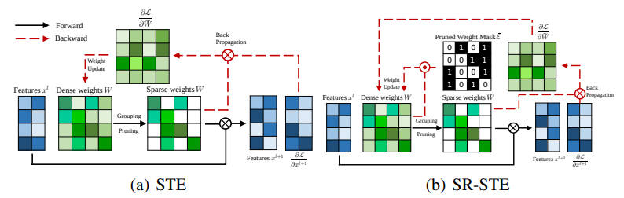
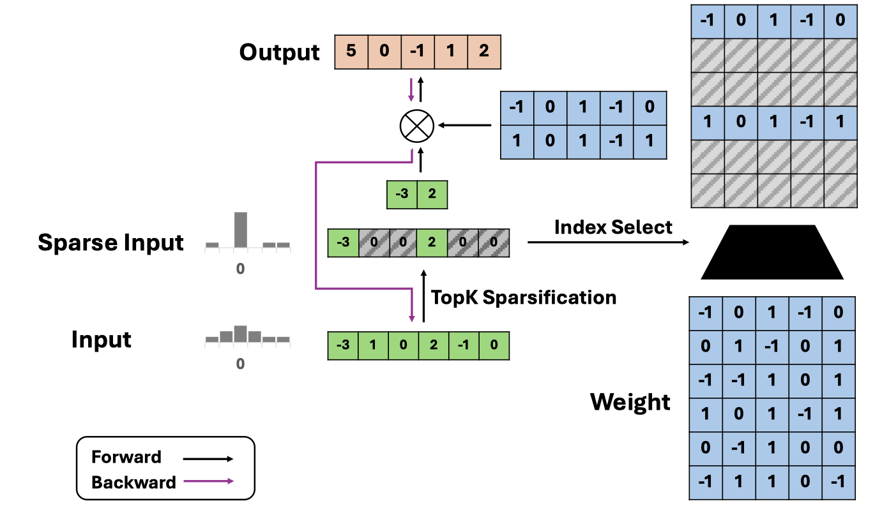
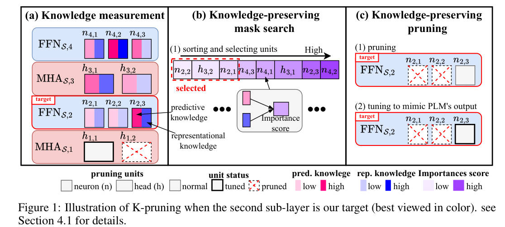
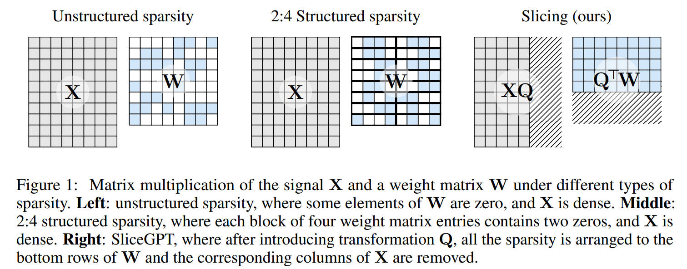

### author

 

<b>Aaron Klein</b>
 

|    | meta                               | ttttttttttttttttttttttttttttttitle                                                                                       | ccccccccccccccccccover                                                  | pub             |   year | codeeeee                                                                    | note   |
|---:|:-----------------------------------|:-------------------------------------------------------------------------------------------------------------------------|:------------------------------------------------------------------------|:----------------|-------:|:----------------------------------------------------------------------------|:-------|
|  0 | [m](./meta/2023/WDCO13S6.prototxt) | [Structural Pruning of Large Language Models via Neural Architecture Search](https://openreview.net/forum?id=SHlZcInS6C) |  | AutoML Workshop |   2023 |  |        |

<b>Abhay Gupta</b>
 

|    | meta                                          | ttttttttttttttttttttttttttttttitle                                                                                  | ccccccccccccccccccover                                                    | pub   |   year | codeeeee                                                                              | note                                    |
|---:|:----------------------------------------------|:--------------------------------------------------------------------------------------------------------------------|:--------------------------------------------------------------------------|:------|-------:|:--------------------------------------------------------------------------------------|:----------------------------------------|
|  0 | [Sparse-IFT](./meta/2024/Sparse-IFT.prototxt) | [Sparse-IFT: Sparse Iso-FLOP Transformations for Maximizing Training Efficiency](http://arxiv.org/abs/2303.11525v3) |  | ICML  |   2024 |  | [note](./notes/2024/Sparse-IFT/note.md) |

<b>Adam Santoro</b>
 

|    | meta                            | ttttttttttttttttttttttttttttttitle                                                                                          | ccccccccccccccccccover                                       | pub   |   year | codeeeee   | note                             |
|---:|:--------------------------------|:----------------------------------------------------------------------------------------------------------------------------|:-------------------------------------------------------------|:------|-------:|:-----------|:---------------------------------|
|  0 | [MoD](./meta/2024/MoD.prototxt) | [Mixture-of-Depths: Dynamically allocating compute in transformer-based language models](http://arxiv.org/abs/2404.02258v1) |  | arXiv |   2024 |            | [note](./notes/2024/MoD/note.md) |

<b>Ajay Jaiswal</b>
 

|    | meta                                                         | ttttttttttttttttttttttttttttttitle                                                                                           | ccccccccccccccccccover                                                 | pub   |   year | codeeeee                                                                                | note                                  |
|---:|:-------------------------------------------------------------|:-----------------------------------------------------------------------------------------------------------------------------|:-----------------------------------------------------------------------|:------|-------:|:----------------------------------------------------------------------------------------|:--------------------------------------|
|  0 | [Essential Sparsity](./meta/2023/EssentialSparsity.prototxt) | [The Emergence of Essential Sparsity in Large Pre-trained Models: The Weights that Matter](https://arxiv.org/abs/2306.03805) |                                                                        | arXiv |   2023 |  |                                       |
|  1 | [LLM-KICK](./meta/2024/VB8C61V6.prototxt)                    | [Compressing LLMs: The Truth is Rarely Pure and Never Simple](http://arxiv.org/abs/2310.01382v2)                             |  | ICLR  |   2024 |            | [note](./notes/2024/VB8C61V6/note.md) |

<b>Alex Damian</b>
 

|    | meta                              | ttttttttttttttttttttttttttttttitle                                                        | ccccccccccccccccccover   | pub   |   year | codeeeee                                                                     | note                              |
|---:|:----------------------------------|:------------------------------------------------------------------------------------------|:-------------------------|:------|-------:|:-----------------------------------------------------------------------------|:----------------------------------|
|  0 | [MeZO](./meta/2023/MeZO.prototxt) | [Fine-Tuning Language Models with Just Forward Passes](http://arxiv.org/abs/2305.17333v3) |                          | arXiv |   2023 |  | [note](./notes/2023/MeZO/note.md) |

<b>Alexander Bukharin</b>
 

|    | meta                                    | ttttttttttttttttttttttttttttttitle                                                                              | ccccccccccccccccccover                                               | pub   |   year | codeeeee                                                                      | note   |
|---:|:----------------------------------------|:----------------------------------------------------------------------------------------------------------------|:---------------------------------------------------------------------|:------|-------:|:------------------------------------------------------------------------------|:-------|
|  0 | [AdaLoRA](./meta/2023/adalora.prototxt) | [AdaLoRA: Adaptive Budget Allocation for Parameter-Efficient Fine-Tuning](https://arxiv.org/pdf/2303.10512.pdf) |  | ICLR  |   2023 |  |        |

<b>Alexander M. Rush</b>
 

|    | meta                                                      | ttttttttttttttttttttttttttttttitle                                                     | ccccccccccccccccccover                                                   | pub     |   year | codeeeee                                                                                     | note   |
|---:|:----------------------------------------------------------|:---------------------------------------------------------------------------------------|:-------------------------------------------------------------------------|:--------|-------:|:---------------------------------------------------------------------------------------------|:-------|
|  0 | [Movement Pruning](./meta/2020/movement_pruning.prototxt) | [Movement Pruning: Adaptive Sparsity by Fine-Tuning](https://arxiv.org/abs/2005.07683) |  | NeurIPS |   2020 |  |        |

<b>Ameet Talwalkar</b>
 

|    | meta                                | ttttttttttttttttttttttttttttttitle                                                                           | ccccccccccccccccccover   | pub   |   year | codeeeee                                                               | note   |
|---:|:------------------------------------|:-------------------------------------------------------------------------------------------------------------|:-------------------------|:------|-------:|:-----------------------------------------------------------------------|:-------|
|  0 | [Bonsa](./meta/2024/Bonsa.prototxt) | [Everybody Prune Now: Structured Pruning of LLMs with only Forward Passes](https://arxiv.org/abs/2402.05406) |                          | arXiv |   2024 |  |        |

<b>Amir Gholami</b>
 

|    | meta                                                | ttttttttttttttttttttttttttttttitle                                                                                       | ccccccccccccccccccover                                                     | pub     |   year | codeeeee                                                                                     | note                                       |
|---:|:----------------------------------------------------|:-------------------------------------------------------------------------------------------------------------------------|:---------------------------------------------------------------------------|:--------|-------:|:---------------------------------------------------------------------------------------------|:-------------------------------------------|
|  0 | [FisherPruning](./meta/2022/fisherpruning.prototxt) | [A Fast Post-Training Pruning Framework for Transformers](http://arxiv.org/abs/2204.09656v2)                             |    | NeurIPS |   2022 |  | [note](./notes/2022/fisherpruning/note.md) |
|  1 | [SqueezeLLM](./meta/2024/SqueezeLLM.prototxt)       | [SqueezeLLM: Dense-and-Sparse Quantization](http://arxiv.org/abs/2306.07629v4)                                           |  | ICML    |   2024 |             | [note](./notes/2024/SqueezeLLM/note.md)    |
|  2 | [KVQuant](./meta/2024/KVQuant.prototxt)             | [KVQuant: Towards 10 Million Context Length LLM Inference with KV Cache Quantization](http://arxiv.org/abs/2401.18079v2) |                                                                            | arXiv   |   2024 |                | [note](./notes/2024/KVQuant/note.md)       |

<b>Amir H. Abdi</b>
 

|    | meta                                          | ttttttttttttttttttttttttttttttitle                                                                                               | ccccccccccccccccccover                                                            | pub   |   year | codeeeee                                                                       | note                                    |
|---:|:----------------------------------------------|:---------------------------------------------------------------------------------------------------------------------------------|:----------------------------------------------------------------------------------|:------|-------:|:-------------------------------------------------------------------------------|:----------------------------------------|
|  0 | [MInference](./meta/2024/MInference.prototxt) | [MInference 1.0: Accelerating Pre-filling for Long-Context LLMs via Dynamic Sparse Attention](http://arxiv.org/abs/2407.02490v1) |  | arXiv |   2024 |  | [note](./notes/2024/MInference/note.md) |

<b>Amir Yazdanbakhsh</b>
 

|    | meta                                  | ttttttttttttttttttttttttttttttitle                                                                                             | ccccccccccccccccccover   | pub   |   year | codeeeee   | note   |
|---:|:--------------------------------------|:-------------------------------------------------------------------------------------------------------------------------------|:-------------------------|:------|-------:|:-----------|:-------|
|  0 | [Sprint](./meta/2022/Sprint.prototxt) | [Sparse Attention Acceleration with Synergistic In-Memory Pruning and On-Chip Recomputation](https://arxiv.org/abs/2209.00606) |                          | MICRO |   2022 |            |        |

<b>André F. T. Martins</b>
 

|    | meta                               | ttttttttttttttttttttttttttttttitle                                                              | ccccccccccccccccccover                                               | pub   |   year | codeeeee   | note   |
|---:|:-----------------------------------|:------------------------------------------------------------------------------------------------|:---------------------------------------------------------------------|:------|-------:|:-----------|:-------|
|  0 | [m](./meta/2023/68I8KKBV.prototxt) | [Efficient Methods for Natural Language Processing: A Survey](https://arxiv.org/abs/2209.00099) |  | TACL  |   2023 |            |        |

<b>Anshul Samar</b>
 

|    | meta                               | ttttttttttttttttttttttttttttttitle                                                                                                       | ccccccccccccccccccover   | pub   |   year | codeeeee   | note   |
|---:|:-----------------------------------|:-----------------------------------------------------------------------------------------------------------------------------------------|:-------------------------|:------|-------:|:-----------|:-------|
|  0 | [m](./meta/2022/2EQV34KV.prototxt) | [Creating Sparse GPT-3 Models with Iterative Pruning](https://www.cerebras.net/blog/creating-sparse-gpt-3-models-with-iterative-pruning) |                          | Blog  |   2022 |            |        |

<b>Aojun Zhou</b>
 

|    | meta                                  | ttttttttttttttttttttttttttttttitle                                                                                        | ccccccccccccccccccover                                             | pub   |   year | codeeeee                                                                      | note                             |
|---:|:--------------------------------------|:--------------------------------------------------------------------------------------------------------------------------|:-------------------------------------------------------------------|:------|-------:|:------------------------------------------------------------------------------|:---------------------------------|
|  0 | [SR-STE](./meta/2021/sr-ste.prototxt) | [Learning N:M Fine-grained Structured Sparse Neural Networks From Scratch](https://openreview.net/forum?id=K9bw7vqp_s)    |  | ICLR  |   2021 |  |                                  |
|  1 | [STA](./meta/2022/44KWQAWO.prototxt)  | [An Algorithm-Hardware Co-Optimized Framework for Accelerating N:M Sparse Transformers](https://arxiv.org/abs/2208.06118) |                                                                    | VLSI  |   2022 |                                                                               |                                  |
|  2 | [SPP](./meta/2024/SPP.prototxt)       | [SPP: Sparsity-Preserved Parameter-Efficient Fine-Tuning for Large Language Models](http://arxiv.org/abs/2405.16057v1)    |        | ICML  |   2024 |      | [note](./notes/2024/SPP/note.md) |

<b>Aosong Feng</b>
 

|    | meta                                      | ttttttttttttttttttttttttttttttitle                                                                                         | ccccccccccccccccccover                                                 | pub   |   year | codeeeee                                                                  | note   |
|---:|:------------------------------------------|:---------------------------------------------------------------------------------------------------------------------------|:-----------------------------------------------------------------------|:------|-------:|:--------------------------------------------------------------------------|:-------|
|  0 | [Diffuser](./meta/2023/diffuser.prototxt) | [Diffuser: Efficient Transformers with Multi-hop Attention Diffusion for Long Sequences](https://arxiv.org/abs/2210.11794) |  | AAAI  |   2023 |  |        |

<b>Artidoro Pagnoni</b>
 

|    | meta                                | ttttttttttttttttttttttttttttttitle                                                | ccccccccccccccccccover                                           | pub   |   year | codeeeee                                                                 | note   |
|---:|:------------------------------------|:----------------------------------------------------------------------------------|:-----------------------------------------------------------------|:------|-------:|:-------------------------------------------------------------------------|:-------|
|  0 | [QLoRA](./meta/2023/qlora.prototxt) | [QLoRA: Efficient Finetuning of Quantized LLMs](https://arxiv.org/abs/2305.14314) |  | arXiv |   2023 |  |        |

<b>Ashish Sirasao</b>
 

|    | meta                            | ttttttttttttttttttttttttttttttitle                                                                                               | ccccccccccccccccccover                                       | pub   |   year | codeeeee   | note                             |
|---:|:--------------------------------|:---------------------------------------------------------------------------------------------------------------------------------|:-------------------------------------------------------------|:------|-------:|:-----------|:---------------------------------|
|  0 | [SDS](./meta/2024/SDS.prototxt) | [Enhancing One-shot Pruned Pre-trained Language Models through Sparse-Dense-Sparse Mechanism](http://arxiv.org/abs/2408.10473v1) |  | arXiv |   2024 |            | [note](./notes/2024/SDS/note.md) |

<b>Asit Mishra</b>
 

|    | meta                                      | ttttttttttttttttttttttttttttttitle                                           | ccccccccccccccccccover   | pub   |   year | codeeeee   | note   |
|---:|:------------------------------------------|:-----------------------------------------------------------------------------|:-------------------------|:------|-------:|:-----------|:-------|
|  0 | [NMSparse](./meta/2021/PUHJMVCM.prototxt) | [Accelerating Sparse Deep Neural Networks](https://arxiv.org/abs/2104.08378) |                          | arXiv |   2021 |            |        |

<b>Aurelien Lucchi</b>
 

|    | meta                                                                            | ttttttttttttttttttttttttttttttitle                                                                                      | ccccccccccccccccccover                                                                                       | pub   |   year | codeeeee   | note   |
|---:|:--------------------------------------------------------------------------------|:------------------------------------------------------------------------------------------------------------------------|:-------------------------------------------------------------------------------------------------------------|:------|-------:|:-----------|:-------|
|  0 | [Adaptively Sparse Attention](./meta/2023/adaptively_sparse_attention.prototxt) | [Dynamic Context Pruning for Efficient and Interpretable Autoregressive Transformers](https://arxiv.org/abs/2305.15805) |  | arXiv |   2023 |            |        |

<b>Azade Nova</b>
 

|    | meta                            | ttttttttttttttttttttttttttttttitle                                                       | ccccccccccccccccccover                                       | pub   |   year | codeeeee   | note   |
|---:|:--------------------------------|:-----------------------------------------------------------------------------------------|:-------------------------------------------------------------|:------|-------:|:-----------|:-------|
|  0 | [KCM](./meta/2023/kcm.prototxt) | [Gradient-Free Structured Pruning with Unlabeled Data](https://arxiv.org/abs/2303.04185) |  | arXiv |   2023 |            |        |

<b>Baris Kasikci</b>
 

|    | meta                                | ttttttttttttttttttttttttttttttitle                                                                        | ccccccccccccccccccover                                           | pub   |   year | codeeeee                                                                    | note                               |
|---:|:------------------------------------|:----------------------------------------------------------------------------------------------------------|:-----------------------------------------------------------------|:------|-------:|:----------------------------------------------------------------------------|:-----------------------------------|
|  0 | [Quest](./meta/2024/Quest.prototxt) | [Quest: Query-Aware Sparsity for Efficient Long-Context LLM Inference](http://arxiv.org/abs/2406.10774v1) |  | ICML  |   2024 |  | [note](./notes/2024/Quest/note.md) |

<b>Beidi Chen</b>
 

|    | meta                                                | ttttttttttttttttttttttttttttttitle                                                                              | ccccccccccccccccccover                                                   | pub   |   year | codeeeee                                                                            | note                                       |
|---:|:----------------------------------------------------|:----------------------------------------------------------------------------------------------------------------|:-------------------------------------------------------------------------|:------|-------:|:------------------------------------------------------------------------------------|:-------------------------------------------|
|  0 | [Deja Vu](./meta/2023/dejavu.prototxt)              | [Deja Vu: Contextual Sparsity for Efficient LLMs at Inference Time](https://openreview.net/forum?id=wIPIhHd00i) |        | ICML  |   2023 |         |                                            |
|  1 | [streaming-llm](./meta/2024/streaming-llm.prototxt) | [Efficient Streaming Language Models with Attention Sinks](http://arxiv.org/abs/2309.17453v4)                   |  | ICLR  |   2024 |  | [note](./notes/2024/streaming-llm/note.md) |

<b>Betty van Aken</b>
 

|    | meta                               | ttttttttttttttttttttttttttttttitle                                                              | ccccccccccccccccccover                                               | pub   |   year | codeeeee   | note   |
|---:|:-----------------------------------|:------------------------------------------------------------------------------------------------|:---------------------------------------------------------------------|:------|-------:|:-----------|:-------|
|  0 | [m](./meta/2023/68I8KKBV.prototxt) | [Efficient Methods for Natural Language Processing: A Survey](https://arxiv.org/abs/2209.00099) |  | TACL  |   2023 |            |        |

<b>Bin Lin</b>
 

|    | meta                                      | ttttttttttttttttttttttttttttttitle                                                                                                                                              | ccccccccccccccccccover   | pub   |   year | codeeeee                                                                   | note   |
|---:|:------------------------------------------|:--------------------------------------------------------------------------------------------------------------------------------------------------------------------------------|:-------------------------|:------|-------:|:---------------------------------------------------------------------------|:-------|
|  0 | [nmSPARSE](./meta/2023/nmSPARSE.prototxt) | [Efficient GPU Kernels for N:M-Sparse Weights in Deep Learning](https://proceedings.mlsys.org/paper_files/paper/2023/file/4552cedd396a308320209f75f56a5ad5-Paper-mlsys2023.pdf) |                          | MLSys |   2023 |  |        |

<b>Bin Yu</b>
 

|    | meta                                | ttttttttttttttttttttttttttttttitle                                                        | ccccccccccccccccccover   | pub   |   year | codeeeee                                                                                 | note                               |
|---:|:------------------------------------|:------------------------------------------------------------------------------------------|:-------------------------|:------|-------:|:-----------------------------------------------------------------------------------------|:-----------------------------------|
|  0 | [LoRA+](./meta/2024/LoRA+.prototxt) | [LoRA+: Efficient Low Rank Adaptation of Large Models](http://arxiv.org/abs/2402.12354v1) |                          | ICML  |   2024 |  | [note](./notes/2024/LoRA+/note.md) |

<b>Bingzhe Wu</b>
 

|    | meta                              | ttttttttttttttttttttttttttttttitle                                                                               | ccccccccccccccccccover   | pub   |   year | codeeeee                                                                    | note            |
|---:|:----------------------------------|:-----------------------------------------------------------------------------------------------------------------|:-------------------------|:------|-------:|:----------------------------------------------------------------------------|:----------------|
|  0 | [RPTQ](./meta/2023/RPTQ.prototxt) | [RPTQ: Reorder-based Post-training Quantization for Large Language Models](https://arxiv.org/pdf/2304.01089.pdf) |                          | arXiv |   2023 |  | [note](note.md) |

<b>Blake Richards</b>
 

|    | meta                            | ttttttttttttttttttttttttttttttitle                                                                                          | ccccccccccccccccccover                                       | pub   |   year | codeeeee   | note                             |
|---:|:--------------------------------|:----------------------------------------------------------------------------------------------------------------------------|:-------------------------------------------------------------|:------|-------:|:-----------|:---------------------------------|
|  0 | [MoD](./meta/2024/MoD.prototxt) | [Mixture-of-Depths: Dynamically allocating compute in transformer-based language models](http://arxiv.org/abs/2404.02258v1) |  | arXiv |   2024 |            | [note](./notes/2024/MoD/note.md) |

<b>Bo Du</b>
 

|    | meta                              | ttttttttttttttttttttttttttttttitle                                                                     | ccccccccccccccccccover   | pub   |   year | codeeeee                                                               | note                              |
|---:|:----------------------------------|:-------------------------------------------------------------------------------------------------------|:-------------------------|:------|-------:|:-----------------------------------------------------------------------|:----------------------------------|
|  0 | [SIFT](./meta/2024/SIFT.prototxt) | [Sparse is Enough in Fine-tuning Pre-trained Large Language Models](http://arxiv.org/abs/2312.11875v3) |                          | ICML  |   2024 |  | [note](./notes/2024/SIFT/note.md) |

<b>Bo Wen</b>
 

|    | meta                                             | ttttttttttttttttttttttttttttttitle                                                                                  | ccccccccccccccccccover   | pub   |   year | codeeeee                                     | note                                     |
|---:|:-------------------------------------------------|:--------------------------------------------------------------------------------------------------------------------|:-------------------------|:------|-------:|:---------------------------------------------|:-----------------------------------------|
|  0 | [Turbo Sparse](./meta/2024/TurboSparse.prototxt) | [Turbo Sparse: Achieving LLM SOTA Performance with Minimal Activated Parameters](http://arxiv.org/abs/2406.05955v2) |                          | arXiv |   2024 | [Pytorch](https://huggingface.co/PowerInfer) | [note](./notes/2024/TurboSparse/note.md) |

<b>Bowen Zhang</b>
 

|    | meta                                      | ttttttttttttttttttttttttttttttitle                                                               | ccccccccccccccccccover                                                 | pub   |   year | codeeeee                                                                      | note                                  |
|---:|:------------------------------------------|:-------------------------------------------------------------------------------------------------|:-----------------------------------------------------------------------|:------|-------:|:------------------------------------------------------------------------------|:--------------------------------------|
|  0 | [LLM-KICK](./meta/2024/VB8C61V6.prototxt) | [Compressing LLMs: The Truth is Rarely Pure and Never Simple](http://arxiv.org/abs/2310.01382v2) |  | ICLR  |   2024 |  | [note](./notes/2024/VB8C61V6/note.md) |

<b>Brian Chmiel</b>
 

|    | meta                              | ttttttttttttttttttttttttttttttitle                                                                           | ccccccccccccccccccover   | pub   |   year | codeeeee   | note   |
|---:|:----------------------------------|:-------------------------------------------------------------------------------------------------------------|:-------------------------|:------|-------:|:-----------|:-------|
|  0 | [MVUE](./meta/2023/MVUE.prototxt) | [Minimum Variance Unbiased N:M Sparsity for the Neural Gradients](https://openreview.net/pdf?id=vuD2xEtxZcj) |                          | ICLR  |   2023 |            |        |

<b>Bryan Catanzaro</b>
 

|    | meta                                      | ttttttttttttttttttttttttttttttitle                                                                  | ccccccccccccccccccover                                                 | pub   |   year | codeeeee                                                                  | note                                  |
|---:|:------------------------------------------|:----------------------------------------------------------------------------------------------------|:-----------------------------------------------------------------------|:------|-------:|:--------------------------------------------------------------------------|:--------------------------------------|
|  0 | [Minitron](./meta/2024/Minitron.prototxt) | [Compact Language Models via Pruning and Knowledge Distillation](http://arxiv.org/abs/2407.14679v1) |  | arXiv |   2024 |  | [note](./notes/2024/Minitron/note.md) |

<b>Caiwen Ding</b>
 

|    | meta                               | ttttttttttttttttttttttttttttttitle                                                                                                        | ccccccccccccccccccover   | pub   |   year | codeeeee                                                                                            | note   |
|---:|:-----------------------------------|:------------------------------------------------------------------------------------------------------------------------------------------|:-------------------------|:------|-------:|:----------------------------------------------------------------------------------------------------|:-------|
|  0 | [m](./meta/2022/XZBX1Z9G.prototxt) | [Sparse Progressive Distillation: Resolving Overfitting under Pretrain-and-Finetune Paradigm](https://aclanthology.org/2022.acl-long.16/) |                          | ACL   |   2022 |  |        |

<b>Can Ma</b>
 

|    | meta                               | ttttttttttttttttttttttttttttttitle                                                          | ccccccccccccccccccover                                                 | pub   |   year | codeeeee   | note   |
|---:|:-----------------------------------|:--------------------------------------------------------------------------------------------|:-----------------------------------------------------------------------|:------|-------:|:-----------|:-------|
|  0 | [m](./meta/2023/L5D7520E.prototxt) | [A Survey on Model Compression for Large Language Models](https://arxiv.org/abs/2308.07633) |  | arXiv |   2023 |            |        |

<b>Carlo C Del Mundo</b>
 

|    | meta                                            | ttttttttttttttttttttttttttttttitle                                                                               | ccccccccccccccccccover                                                        | pub   |   year | codeeeee   | note                                                                  |
|---:|:------------------------------------------------|:-----------------------------------------------------------------------------------------------------------------|:------------------------------------------------------------------------------|:------|-------:|:-----------|:----------------------------------------------------------------------|
|  0 | [LLM in a flash](./meta/2024/5JWFQDDP.prototxt) | [LLM in a flash: Efficient Large Language Model Inference with Limited Memory](https://arxiv.org/abs/2312.11514) |  | arXiv |   2024 |            | [note](https://z6oqkldvmo.feishu.cn/docx/GBVrdR4iyotc83xMU1Hc9ZOGntb) |

<b>Carlo Luschi</b>
 

|    | meta                                | ttttttttttttttttttttttttttttttitle                                                      | ccccccccccccccccccover   | pub   |   year | codeeeee   | note                               |
|---:|:------------------------------------|:----------------------------------------------------------------------------------------|:-------------------------|:------|-------:|:-----------|:-----------------------------------|
|  0 | [SparQ](./meta/2024/SparQ.prototxt) | [SparQ Attention: Bandwidth-Efficient LLM Inference](http://arxiv.org/abs/2312.04985v5) |                          | ICML  |   2024 |            | [note](./notes/2024/SparQ/note.md) |

<b>Carlo Vittorio Cannistraci</b>
 

|    | meta                                 | ttttttttttttttttttttttttttttttitle                                                                                               | ccccccccccccccccccover                                        | pub   |   year | codeeeee                                                                                                                    | note   |
|---:|:-------------------------------------|:---------------------------------------------------------------------------------------------------------------------------------|:--------------------------------------------------------------|:------|-------:|:----------------------------------------------------------------------------------------------------------------------------|:-------|
|  0 | [RIA](./meta/2024/IA8CS3VH.prototxt) | [Plug-and-Play: An Efficient Post-training Pruning Method for Large Language Models](https://openreview.net/forum?id=Tr0lPx9woF) |  | ICLR  |   2024 |  |        |

<b>Cecilia Mascolo</b>
 

|    | meta                                        | ttttttttttttttttttttttttttttttitle                                                                                           | ccccccccccccccccccover   | pub   |   year | codeeeee                                                                         | note                                   |
|---:|:--------------------------------------------|:-----------------------------------------------------------------------------------------------------------------------------|:-------------------------|:------|-------:|:---------------------------------------------------------------------------------|:---------------------------------------|
|  0 | [TinyTrain](./meta/2024/TinyTrain.prototxt) | [TinyTrain: Resource-Aware Task-Adaptive Sparse Training of DNNs at the Data-Scarce Edge](http://arxiv.org/abs/2307.09988v2) |                          | ICML  |   2024 |  | [note](./notes/2024/TinyTrain/note.md) |

<b>Cedric Archambeau</b>
 

|    | meta                               | ttttttttttttttttttttttttttttttitle                                                                                       | ccccccccccccccccccover                                                  | pub             |   year | codeeeee                                                                    | note   |
|---:|:-----------------------------------|:-------------------------------------------------------------------------------------------------------------------------|:------------------------------------------------------------------------|:----------------|-------:|:----------------------------------------------------------------------------|:-------|
|  0 | [m](./meta/2023/WDCO13S6.prototxt) | [Structural Pruning of Large Language Models via Neural Architecture Search](https://openreview.net/forum?id=SHlZcInS6C) |  | AutoML Workshop |   2023 |  |        |

<b>Changhao Li</b>
 

|    | meta                               | ttttttttttttttttttttttttttttttitle                                             | ccccccccccccccccccover   | pub   |   year | codeeeee                                                                                      | note   |
|---:|:-----------------------------------|:-------------------------------------------------------------------------------|:-------------------------|:------|-------:|:----------------------------------------------------------------------------------------------|:-------|
|  0 | [m](./meta/2023/23LQ9SVH.prototxt) | [Training Transformers with 4-bit Integers](https://arxiv.org/abs//2306.11987) |                          | arXiv |   2023 |  |        |

<b>Chao Fang</b>
 

|    | meta                                 | ttttttttttttttttttttttttttttttitle                                                                                        | ccccccccccccccccccover   | pub   |   year | codeeeee   | note   |
|---:|:-------------------------------------|:--------------------------------------------------------------------------------------------------------------------------|:-------------------------|:------|-------:|:-----------|:-------|
|  0 | [STA](./meta/2022/44KWQAWO.prototxt) | [An Algorithm-Hardware Co-Optimized Framework for Accelerating N:M Sparse Transformers](https://arxiv.org/abs/2208.06118) |                          | VLSI  |   2022 |            |        |

<b>Chao Zhang</b>
 

|    | meta                                | ttttttttttttttttttttttttttttttitle                                                                       | ccccccccccccccccccover                                           | pub   |   year | codeeeee                                                                  | note                               |
|---:|:------------------------------------|:---------------------------------------------------------------------------------------------------------|:-----------------------------------------------------------------|:------|-------:|:--------------------------------------------------------------------------|:-----------------------------------|
|  0 | [EAGLE](./meta/2024/Eagle.prototxt) | [EAGLE: Speculative Sampling Requires Rethinking Feature Uncertainty](http://arxiv.org/abs/2401.15077v2) |  | ICML  |   2024 |  | [note](./notes/2024/Eagle/note.md) |

<b>Chaofan Tao</b>
 

|    | meta                                  | ttttttttttttttttttttttttttttttitle                                                                                            | ccccccccccccccccccover                                            | pub          |   year | codeeeee   | note                                 |
|---:|:--------------------------------------|:------------------------------------------------------------------------------------------------------------------------------|:------------------------------------------------------------------|:-------------|-------:|:-----------|:-------------------------------------|
|  0 | [SIMPLE](./meta/2023/simple.prototxt) | [Structured Pruning for Efficient Generative Pre-trained Language Models](https://aclanthology.org/2023.findings-acl.692.pdf) |  | ACL Findings |   2023 |            | [note](./notes/2023/simple/index.md) |

<b>Chaojun Xiao</b>
 

|    | meta                                | ttttttttttttttttttttttttttttttitle                                                                         | ccccccccccccccccccover                                                | pub   |   year | codeeeee   | note                               |
|---:|:------------------------------------|:-----------------------------------------------------------------------------------------------------------|:----------------------------------------------------------------------|:------|-------:|:-----------|:-----------------------------------|
|  0 | [ReLU2](./meta/2024/ReLU2.prototxt) | [ReLU2 Wins: Discovering Efficient Activation Functions for Sparse LLMs](https://arxiv.org/abs/2402.03804) |  | arXiv |   2024 |            | [note](./notes/2024/ReLU2/note.md) |

<b>Charlie Blake</b>
 

|    | meta                                | ttttttttttttttttttttttttttttttitle                                                      | ccccccccccccccccccover   | pub   |   year | codeeeee   | note                               |
|---:|:------------------------------------|:----------------------------------------------------------------------------------------|:-------------------------|:------|-------:|:-----------|:-----------------------------------|
|  0 | [SparQ](./meta/2024/SparQ.prototxt) | [SparQ Attention: Bandwidth-Efficient LLM Inference](http://arxiv.org/abs/2312.04985v5) |                          | ICML  |   2024 |            | [note](./notes/2024/SparQ/note.md) |

<b>Chen Chen</b>
 

|    | meta                                        | ttttttttttttttttttttttttttttttitle                                                                                                  | ccccccccccccccccccover                                                   | pub   |   year | codeeeee                                                                                       | note                                   |
|---:|:--------------------------------------------|:------------------------------------------------------------------------------------------------------------------------------------|:-------------------------------------------------------------------------|:------|-------:|:-----------------------------------------------------------------------------------------------|:---------------------------------------|
|  0 | [ProSparse](./meta/2024/ProSparse.prototxt) | [ProSparse: Introducing and Enhancing Intrinsic Activation Sparsity within Large Language Models](https://arxiv.org/abs/2402.13516) |  | arXiv |   2024 |  | [note](./notes/2024/ProSparse/note.md) |

<b>Chen Liang</b>
 

|    | meta                                | ttttttttttttttttttttttttttttttitle                                                                       | ccccccccccccccccccover                                           | pub   |   year | codeeeee                                                                 | note                               |
|---:|:------------------------------------|:---------------------------------------------------------------------------------------------------------|:-----------------------------------------------------------------|:------|-------:|:-------------------------------------------------------------------------|:-----------------------------------|
|  0 | [LoftQ](./meta/2023/loftq.prototxt) | [LoftQ: LoRA-Fine-Tuning-Aware Quantization for Large Language Models](https://arxiv.org/abs/2310.08659) |  | arXiv |   2023 |  | [note](./notes/2023/loftq/note.md) |

<b>Cheng-Yu Hsieh</b>
 

|    | meta                            | ttttttttttttttttttttttttttttttitle                                                                                                         | ccccccccccccccccccover                                         | pub   |   year | codeeeee                                                             | note   |
|---:|:--------------------------------|:-------------------------------------------------------------------------------------------------------------------------------------------|:---------------------------------------------------------------|:------|-------:|:---------------------------------------------------------------------|:-------|
|  0 | [OWL](./meta/2024/owl.prototxt) | [Outlier Weighed Layerwise Sparsity (OWL): A Missing Secret Sauce for Pruning LLMs to High Sparsity](https://arxiv.org/pdf/2310.05175.pdf) |  | ICML  |   2024 |  |        |

<b>Chengruidong Zhang</b>
 

|    | meta                                          | ttttttttttttttttttttttttttttttitle                                                                                               | ccccccccccccccccccover                                                            | pub   |   year | codeeeee                                                                       | note                                    |
|---:|:----------------------------------------------|:---------------------------------------------------------------------------------------------------------------------------------|:----------------------------------------------------------------------------------|:------|-------:|:-------------------------------------------------------------------------------|:----------------------------------------|
|  0 | [MInference](./meta/2024/MInference.prototxt) | [MInference 1.0: Accelerating Pre-filling for Long-Context LLMs via Dynamic Sparse Attention](http://arxiv.org/abs/2407.02490v1) |  | arXiv |   2024 |  | [note](./notes/2024/MInference/note.md) |

<b>Chenyang Song</b>
 

|    | meta                                        | ttttttttttttttttttttttttttttttitle                                                                                                  | ccccccccccccccccccover                                                   | pub   |   year | codeeeee                                                                                       | note                                   |
|---:|:--------------------------------------------|:------------------------------------------------------------------------------------------------------------------------------------|:-------------------------------------------------------------------------|:------|-------:|:-----------------------------------------------------------------------------------------------|:---------------------------------------|
|  0 | [ProSparse](./meta/2024/ProSparse.prototxt) | [ProSparse: Introducing and Enhancing Intrinsic Activation Sparsity within Large Language Models](https://arxiv.org/abs/2402.13516) |  | arXiv |   2024 |  | [note](./notes/2024/ProSparse/note.md) |
|  1 | [ReLU2](./meta/2024/ReLU2.prototxt)         | [ReLU2 Wins: Discovering Efficient Activation Functions for Sparse LLMs](https://arxiv.org/abs/2402.03804)                          |     | arXiv |   2024 |                                                                                                | [note](./notes/2024/ReLU2/note.md)     |

<b>Chi Han</b>
 

|    | meta                              | ttttttttttttttttttttttttttttttitle                                                                                             | ccccccccccccccccccover   | pub   |   year | codeeeee   | note                              |
|---:|:----------------------------------|:-------------------------------------------------------------------------------------------------------------------------------|:-------------------------|:------|-------:|:-----------|:----------------------------------|
|  0 | [LISA](./meta/2024/LISA.prototxt) | [LISA: Layerwise Importance Sampling for Memory-Efficient Large Language Model Fine-Tuning](http://arxiv.org/abs/2403.17919v1) |                          | arXiv |   2024 |            | [note](./notes/2024/LISA/note.md) |

<b>Chin-Yew Lin</b>
 

|    | meta                                          | ttttttttttttttttttttttttttttttitle                                                                                               | ccccccccccccccccccover                                                            | pub   |   year | codeeeee                                                                       | note                                    |
|---:|:----------------------------------------------|:---------------------------------------------------------------------------------------------------------------------------------|:----------------------------------------------------------------------------------|:------|-------:|:-------------------------------------------------------------------------------|:----------------------------------------|
|  0 | [MInference](./meta/2024/MInference.prototxt) | [MInference 1.0: Accelerating Pre-filling for Long-Context LLMs via Dynamic Sparse Attention](http://arxiv.org/abs/2407.02490v1) |  | arXiv |   2024 |  | [note](./notes/2024/MInference/note.md) |

<b>Chong You</b>
 

|    | meta                               | ttttttttttttttttttttttttttttttitle                                                                                             | ccccccccccccccccccover   | pub   |   year | codeeeee   | note   |
|---:|:-----------------------------------|:-------------------------------------------------------------------------------------------------------------------------------|:-------------------------|:------|-------:|:-----------|:-------|
|  0 | [m](./meta/2023/WMMGA0AR.prototxt) | [The Lazy Neuron Phenomenon: On Emergence of Activation Sparsity in Transformers](https://openreview.net/forum?id=TJ2nxciYCk-) |                          | ICLR  |   2023 |            |        |

<b>Chong Yu</b>
 

|    | meta                               | ttttttttttttttttttttttttttttttitle                                                                                                     | ccccccccccccccccccover   | pub     |   year | codeeeee                                                              | note   |
|---:|:-----------------------------------|:---------------------------------------------------------------------------------------------------------------------------------------|:-------------------------|:--------|-------:|:----------------------------------------------------------------------|:-------|
|  0 | [m](./meta/2021/K7GSWQIC.prototxt) | [Channel Permutations for N:M Sparsity](https://proceedings.neurips.cc/paper/2021/hash/6e8404c3b93a9527c8db241a1846599a-Abstract.html) |                          | NeurIPS |   2021 |  |        |

<b>Christopher</b>
 

|    | meta                                                  | ttttttttttttttttttttttttttttttitle                                                                              | ccccccccccccccccccover                                                    | pub     |   year | codeeeee                                                                            | note   |
|---:|:------------------------------------------------------|:----------------------------------------------------------------------------------------------------------------|:--------------------------------------------------------------------------|:--------|-------:|:------------------------------------------------------------------------------------|:-------|
|  0 | [FlashAttention](./meta/2022/flashattention.prototxt) | [FlashAttention: Fast and Memory-Efficient Exact Attention with IO-Awareness](https://arxiv.org/abs/2205.14135) |  | NeurIPS |   2022 |  |        |

<b>Christopher De Sa</b>
 

|    | meta                              | ttttttttttttttttttttttttttttttitle                                                     | ccccccccccccccccccover   | pub   |   year | codeeeee                                                                  | note   |
|---:|:----------------------------------|:---------------------------------------------------------------------------------------|:-------------------------|:------|-------:|:--------------------------------------------------------------------------|:-------|
|  0 | [QuIP](./meta/2023/QuIP.prototxt) | [QuIP: Quantization with Incoherence Processing](https://arxiv.org/pdf/2307.13304.pdf) |                          | arXiv |   2023 |  |        |

<b>Chuang Gan</b>
 

|    | meta                                   | ttttttttttttttttttttttttttttttitle                                                                                 | ccccccccccccccccccover   | pub   |   year | codeeeee                                                                      | note                                 |
|---:|:---------------------------------------|:-------------------------------------------------------------------------------------------------------------------|:-------------------------|:------|-------:|:------------------------------------------------------------------------------|:-------------------------------------|
|  0 | [AWQ](./meta/2023/awq.prototxt)        | [AWQ: Activation-aware Weight Quantization for LLM Compression and Acceleration](https://arxiv.org/abs/2306.00978) |                          | arXiv |   2023 |  |                                      |
|  1 | [QServe](./meta/2024/QServer.prototxt) | [QServe: W4A8KV4 Quantization and System Co-design for Efficient LLM Serving](http://arxiv.org/abs/2405.04532v2)   |                          | arXiv |   2024 | [Pytorch](https://hanlab.mit.edu/projects/qserve)                             | [note](./notes/2024/QServer/note.md) |

<b>Cody Hao Yu</b>
 

|    | meta                                                   | ttttttttttttttttttttttttttttttitle                                                                                    | ccccccccccccccccccover                                                   | pub   |   year | codeeeee                                                                    | note                                        |
|---:|:-------------------------------------------------------|:----------------------------------------------------------------------------------------------------------------------|:-------------------------------------------------------------------------|:------|-------:|:----------------------------------------------------------------------------|:--------------------------------------------|
|  0 | [Paged Attention](./meta/2023/PagedAttention.prototxt) | [Efficient Memory Management for Large Language Model Serving with PagedAttention](http://arxiv.org/abs/2309.06180v1) |  | SOSP  |   2023 |  | [note](./notes/2023/PagedAttention/note.md) |

<b>Coleman Hooper</b>
 

|    | meta                                          | ttttttttttttttttttttttttttttttitle                                                                                       | ccccccccccccccccccover                                                     | pub   |   year | codeeeee                                                                          | note                                    |
|---:|:----------------------------------------------|:-------------------------------------------------------------------------------------------------------------------------|:---------------------------------------------------------------------------|:------|-------:|:----------------------------------------------------------------------------------|:----------------------------------------|
|  0 | [SqueezeLLM](./meta/2024/SqueezeLLM.prototxt) | [SqueezeLLM: Dense-and-Sparse Quantization](http://arxiv.org/abs/2306.07629v4)                                           |  | ICML  |   2024 |  | [note](./notes/2024/SqueezeLLM/note.md) |
|  1 | [KVQuant](./meta/2024/KVQuant.prototxt)       | [KVQuant: Towards 10 Million Context Length LLM Inference with KV Cache Quantization](http://arxiv.org/abs/2401.18079v2) |                                                                            | arXiv |   2024 |     | [note](./notes/2024/KVQuant/note.md)    |

<b>Colin Raffel</b>
 

|    | meta                               | ttttttttttttttttttttttttttttttitle                                                              | ccccccccccccccccccover                                               | pub   |   year | codeeeee   | note   |
|---:|:-----------------------------------|:------------------------------------------------------------------------------------------------|:---------------------------------------------------------------------|:------|-------:|:-----------|:-------|
|  0 | [m](./meta/2023/68I8KKBV.prototxt) | [Efficient Methods for Natural Language Processing: A Survey](https://arxiv.org/abs/2209.00099) |  | TACL  |   2023 |            |        |

<b>Dale Schuurmans</b>
 

|    | meta                            | ttttttttttttttttttttttttttttttitle                                                       | ccccccccccccccccccover                                       | pub   |   year | codeeeee   | note   |
|---:|:--------------------------------|:-----------------------------------------------------------------------------------------|:-------------------------------------------------------------|:------|-------:|:-----------|:-------|
|  0 | [KCM](./meta/2023/kcm.prototxt) | [Gradient-Free Structured Pruning with Unlabeled Data](https://arxiv.org/abs/2303.04185) |  | arXiv |   2023 |            |        |

<b>Dan Alistarh</b>
 

|    | meta                                          | ttttttttttttttttttttttttttttttitle                                                                                                        | ccccccccccccccccccover                                                | pub     |   year | codeeeee                                                                              | note                               |
|---:|:----------------------------------------------|:------------------------------------------------------------------------------------------------------------------------------------------|:----------------------------------------------------------------------|:--------|-------:|:--------------------------------------------------------------------------------------|:-----------------------------------|
|  0 | [m](./meta/2020/V3MFIRLV.prototxt)            | [Inducing and Exploiting Activation Sparsity for Fast Neural Network Inference](http://proceedings.mlr.press/v119/kurtz20a/kurtz20a.pdf)  |                                                                       | ICML    |   2020 |                                                                                       |                                    |
|  1 | [m](./meta/2021/ITZS3TU3.prototxt)            | [Sparsity in Deep Learning: Pruning and growth for efficient inference and training in neural networks](https://arxiv.org/abs/2102.00554) |                                                                       | arXiv   |   2021 |                                                                                       |                                    |
|  2 | [SPDY](./meta/2022/spdy.prototxt)             | [SPDY: Accurate Pruning with Speedup Guarantees](https://arxiv.org/abs/2201.13096)                                                        |        | ICML    |   2022 |              | [note](./notes/2022/spdy/index.md) |
|  3 | [OBC](./meta/2022/obc.prototxt)               | [Optimal Brain Compression: A Framework for Accurate Post-Training Quantization and Pruning](https://openreview.net/pdf?id=ksVGCOlOEba)   |                                                                       | NeurIPS |   2022 |               |                                    |
|  4 | [oBERT](./meta/2022/oBERT.prototxt)           | [The Optimal BERT Surgeon: Scalable and Accurate Second-Order Pruning for Large Language Models](https://arxiv.org/pdf/2203.07259.pdf)    |                                                                       | arXiv   |   2022 |         |                                    |
|  5 | [GPTQ](./meta/2023/gptq.prototxt)             | [GPTQ: Accurate Post-Training Quantization for Generative Pre-trained Transformers](https://arxiv.org/pdf/2210.17323.pdf)                 |                                                                       | ICLR    |   2023 |              |                                    |
|  6 | [ZipLM](./meta/2023/ZipLM.prototxt)           | [ZipLM: Inference-Aware Structured Pruning of Language Models](https://openreview.net/pdf?id=bPFFPueAxm)                                  |       | NeurIPS |   2023 |             |                                    |
|  7 | [SpQR](./meta/2023/spqr.prototxt)             | [SpQR: A Sparse-Quantized Representation for Near-Lossless LLM Weight Compression](https://arxiv.org/pdf/2306.03078.pdf)                  |                                                                       | arXiv   |   2023 |                |                                    |
|  8 | [SquareHead](./meta/2023/SquareHead.prototxt) | [Sparse Fine-tuning for Inference Acceleration of Large Language Models](https://arxiv.org/pdf/2310.06927.pdf)                            |  | arXiv   |   2023 |  |                                    |
|  9 | [SparseGPT](./meta/2023/sparsegpt.prototxt)   | [SparseGPT: Massive Language Models Can be Accurately Pruned in one-shot.](https://arxiv.org/pdf/2301.00774.pdf)                          |                                                                       | arXiv   |   2023 |         | [note](./notes/SparseGPT.md)       |

<b>Daniel Soudry</b>
 

|    | meta                              | ttttttttttttttttttttttttttttttitle                                                                           | ccccccccccccccccccover   | pub   |   year | codeeeee   | note   |
|---:|:----------------------------------|:-------------------------------------------------------------------------------------------------------------|:-------------------------|:------|-------:|:-----------|:-------|
|  0 | [MVUE](./meta/2023/MVUE.prototxt) | [Minimum Variance Unbiased N:M Sparsity for the Neural Gradients](https://openreview.net/pdf?id=vuD2xEtxZcj) |                          | ICLR  |   2023 |            |        |

<b>Danqi Chen</b>
 

|    | meta                              | ttttttttttttttttttttttttttttttitle                                                        | ccccccccccccccccccover   | pub   |   year | codeeeee                                                                     | note                              |
|---:|:----------------------------------|:------------------------------------------------------------------------------------------|:-------------------------|:------|-------:|:-----------------------------------------------------------------------------|:----------------------------------|
|  0 | [MeZO](./meta/2023/MeZO.prototxt) | [Fine-Tuning Language Models with Just Forward Passes](http://arxiv.org/abs/2305.17333v3) |                          | arXiv |   2023 |  | [note](./notes/2023/MeZO/note.md) |

<b>Dario Pavllo</b>
 

|    | meta                                                                            | ttttttttttttttttttttttttttttttitle                                                                                      | ccccccccccccccccccover                                                                                       | pub   |   year | codeeeee   | note   |
|---:|:--------------------------------------------------------------------------------|:------------------------------------------------------------------------------------------------------------------------|:-------------------------------------------------------------------------------------------------------------|:------|-------:|:-----------|:-------|
|  0 | [Adaptively Sparse Attention](./meta/2023/adaptively_sparse_attention.prototxt) | [Dynamic Context Pruning for Efficient and Interpretable Autoregressive Transformers](https://arxiv.org/abs/2305.15805) |  | arXiv |   2023 |            |        |

<b>David Raposo</b>
 

|    | meta                            | ttttttttttttttttttttttttttttttitle                                                                                          | ccccccccccccccccccover                                       | pub   |   year | codeeeee   | note                             |
|---:|:--------------------------------|:----------------------------------------------------------------------------------------------------------------------------|:-------------------------------------------------------------|:------|-------:|:-----------|:---------------------------------|
|  0 | [MoD](./meta/2024/MoD.prototxt) | [Mixture-of-Depths: Dynamically allocating compute in transformer-based language models](http://arxiv.org/abs/2404.02258v1) |  | arXiv |   2024 |            | [note](./notes/2024/MoD/note.md) |

<b>Denis Kuznedelev</b>
 

|    | meta                                          | ttttttttttttttttttttttttttttttitle                                                                             | ccccccccccccccccccover                                                | pub   |   year | codeeeee                                                                              | note   |
|---:|:----------------------------------------------|:---------------------------------------------------------------------------------------------------------------|:----------------------------------------------------------------------|:------|-------:|:--------------------------------------------------------------------------------------|:-------|
|  0 | [SquareHead](./meta/2023/SquareHead.prototxt) | [Sparse Fine-tuning for Inference Acceleration of Large Language Models](https://arxiv.org/pdf/2310.06927.pdf) |  | arXiv |   2023 |  |        |

<b>Deqing Wang</b>
 

|    | meta                            | ttttttttttttttttttttttttttttttitle                                                                       | ccccccccccccccccccover                                       | pub   |   year | codeeeee                                                             | note   |
|---:|:--------------------------------|:---------------------------------------------------------------------------------------------------------|:-------------------------------------------------------------|:------|-------:|:---------------------------------------------------------------------|:-------|
|  0 | [SMP](./meta/2023/smp.prototxt) | [Pruning Pre-trained Language Models Without Fine-Tuning](https://aclanthology.org/2023.acl-long.35.pdf) |  | ACL   |   2023 |  |        |

<b>Dequan Wang</b>
 

|    | meta                                | ttttttttttttttttttttttttttttttitle                                                                                     | ccccccccccccccccccover   | pub   |   year | codeeeee                                                                | note   |
|---:|:------------------------------------|:-----------------------------------------------------------------------------------------------------------------------|:-------------------------|:------|-------:|:------------------------------------------------------------------------|:-------|
|  0 | [ActNN](./meta/2019/actnn.prototxt) | [ActNN: Reducing Training Memory Footprint via 2-Bit Activation Compressed Training](https://arxiv.org/abs/2104.14129) |                          | ICML  |   2019 |  |        |

<b>Diederik P. Kingma</b>
 

|    | meta                                            | ttttttttttttttttttttttttttttttitle                                                              | ccccccccccccccccccover   | pub   |   year | codeeeee                                                                     | note   |
|---:|:------------------------------------------------|:------------------------------------------------------------------------------------------------|:-------------------------|:------|-------:|:-----------------------------------------------------------------------------|:-------|
|  0 | [blocksparse](./meta/2020/blocksparse.prototxt) | [GPU Kernels for Block-Sparse Weights](https://cdn.openai.com/blocksparse/blocksparsepaper.pdf) |                          | arXiv |   2020 |  |        |

<b>Dmitry Belenko</b>
 

|    | meta                                            | ttttttttttttttttttttttttttttttitle                                                                               | ccccccccccccccccccover                                                        | pub   |   year | codeeeee   | note                                                                  |
|---:|:------------------------------------------------|:-----------------------------------------------------------------------------------------------------------------|:------------------------------------------------------------------------------|:------|-------:|:-----------|:----------------------------------------------------------------------|
|  0 | [LLM in a flash](./meta/2024/5JWFQDDP.prototxt) | [LLM in a flash: Efficient Large Language Model Inference with Limited Memory](https://arxiv.org/abs/2312.11514) |  | arXiv |   2024 |            | [note](https://z6oqkldvmo.feishu.cn/docx/GBVrdR4iyotc83xMU1Hc9ZOGntb) |

<b>Dong Li</b>
 

|    | meta                            | ttttttttttttttttttttttttttttttitle                                                                                               | ccccccccccccccccccover                                       | pub   |   year | codeeeee   | note                             |
|---:|:--------------------------------|:---------------------------------------------------------------------------------------------------------------------------------|:-------------------------------------------------------------|:------|-------:|:-----------|:---------------------------------|
|  0 | [SDS](./meta/2024/SDS.prototxt) | [Enhancing One-shot Pruned Pre-trained Language Models through Sparse-Dense-Sparse Mechanism](http://arxiv.org/abs/2408.10473v1) |  | arXiv |   2024 |            | [note](./notes/2024/SDS/note.md) |

<b>Dongkuan Xu</b>
 

|    | meta                               | ttttttttttttttttttttttttttttttitle                                                                                                        | ccccccccccccccccccover   | pub   |   year | codeeeee                                                                                            | note   |
|---:|:-----------------------------------|:------------------------------------------------------------------------------------------------------------------------------------------|:-------------------------|:------|-------:|:----------------------------------------------------------------------------------------------------|:-------|
|  0 | [m](./meta/2022/XZBX1Z9G.prototxt) | [Sparse Progressive Distillation: Resolving Overfitting under Pretrain-and-Finetune Paradigm](https://aclanthology.org/2022.acl-long.16/) |                          | ACL   |   2022 |  |        |

<b>Donglin Zhuang</b>
 

|    | meta                                        | ttttttttttttttttttttttttttttttitle                                                                                                                      | ccccccccccccccccccover                                               | pub   |   year | codeeeee                                                                            | note                                    |
|---:|:--------------------------------------------|:--------------------------------------------------------------------------------------------------------------------------------------------------------|:---------------------------------------------------------------------|:------|-------:|:------------------------------------------------------------------------------------|:----------------------------------------|
|  0 | [Flash-LLM](./meta/2024/flash_llm.prototxt) | [Flash-LLM: Enabling Cost-Effective and Highly-Efficient Large Generative Model Inference with Unstructured Sparsity](https://arxiv.org/abs/2309.10285) |  | VLDB  |   2024 |  | [note](./notes/2024/flash_llm/index.md) |

<b>Dongsheng Li</b>
 

|    | meta                                          | ttttttttttttttttttttttttttttttitle                                                                                               | ccccccccccccccccccover                                                            | pub   |   year | codeeeee                                                                       | note                                    |
|---:|:----------------------------------------------|:---------------------------------------------------------------------------------------------------------------------------------|:----------------------------------------------------------------------------------|:------|-------:|:-------------------------------------------------------------------------------|:----------------------------------------|
|  0 | [MInference](./meta/2024/MInference.prototxt) | [MInference 1.0: Accelerating Pre-filling for Long-Context LLMs via Dynamic Sparse Attention](http://arxiv.org/abs/2407.02490v1) |  | arXiv |   2024 |  | [note](./notes/2024/MInference/note.md) |

<b>Douglas Orr</b>
 

|    | meta                                | ttttttttttttttttttttttttttttttitle                                                      | ccccccccccccccccccover   | pub   |   year | codeeeee   | note                               |
|---:|:------------------------------------|:----------------------------------------------------------------------------------------|:-------------------------|:------|-------:|:-----------|:-----------------------------------|
|  0 | [SparQ](./meta/2024/SparQ.prototxt) | [SparQ Attention: Bandwidth-Efficient LLM Inference](http://arxiv.org/abs/2312.04985v5) |                          | ICML  |   2024 |            | [note](./notes/2024/SparQ/note.md) |

<b>Edward Hu</b>
 

|    | meta                              | ttttttttttttttttttttttttttttttitle                                                     | ccccccccccccccccccover                                         | pub   |   year | codeeeee                                                                 | note   |
|---:|:----------------------------------|:---------------------------------------------------------------------------------------|:---------------------------------------------------------------|:------|-------:|:-------------------------------------------------------------------------|:-------|
|  0 | [LoRA](./meta/2022/lora.prototxt) | [LoRA: Low-rank adaptation of large language models](https://arxiv.org/abs/2106.09685) |  | ICLR  |   2022 |  |        |

<b>Edwin Simpson</b>
 

|    | meta                               | ttttttttttttttttttttttttttttttitle                                                              | ccccccccccccccccccover                                               | pub   |   year | codeeeee   | note   |
|---:|:-----------------------------------|:------------------------------------------------------------------------------------------------|:---------------------------------------------------------------------|:------|-------:|:-----------|:-------|
|  0 | [m](./meta/2023/68I8KKBV.prototxt) | [Efficient Methods for Natural Language Processing: A Survey](https://arxiv.org/abs/2209.00099) |  | TACL  |   2023 |            |        |

<b>Eldar Kurtic</b>
 

|    | meta                                          | ttttttttttttttttttttttttttttttitle                                                                                                     | ccccccccccccccccccover                                                | pub     |   year | codeeeee                                                                              | note   |
|---:|:----------------------------------------------|:---------------------------------------------------------------------------------------------------------------------------------------|:----------------------------------------------------------------------|:--------|-------:|:--------------------------------------------------------------------------------------|:-------|
|  0 | [oBERT](./meta/2022/oBERT.prototxt)           | [The Optimal BERT Surgeon: Scalable and Accurate Second-Order Pruning for Large Language Models](https://arxiv.org/pdf/2203.07259.pdf) |                                                                       | arXiv   |   2022 |         |        |
|  1 | [ZipLM](./meta/2023/ZipLM.prototxt)           | [ZipLM: Inference-Aware Structured Pruning of Language Models](https://openreview.net/pdf?id=bPFFPueAxm)                               |       | NeurIPS |   2023 |             |        |
|  2 | [SquareHead](./meta/2023/SquareHead.prototxt) | [Sparse Fine-tuning for Inference Acceleration of Large Language Models](https://arxiv.org/pdf/2310.06927.pdf)                         |  | arXiv   |   2023 |  |        |

<b>Elias Frantar</b>
 

|    | meta                                          | ttttttttttttttttttttttttttttttitle                                                                                                      | ccccccccccccccccccover                                                | pub     |   year | codeeeee                                                                              | note                               |
|---:|:----------------------------------------------|:----------------------------------------------------------------------------------------------------------------------------------------|:----------------------------------------------------------------------|:--------|-------:|:--------------------------------------------------------------------------------------|:-----------------------------------|
|  0 | [SPDY](./meta/2022/spdy.prototxt)             | [SPDY: Accurate Pruning with Speedup Guarantees](https://arxiv.org/abs/2201.13096)                                                      |        | ICML    |   2022 |              | [note](./notes/2022/spdy/index.md) |
|  1 | [OBC](./meta/2022/obc.prototxt)               | [Optimal Brain Compression: A Framework for Accurate Post-Training Quantization and Pruning](https://openreview.net/pdf?id=ksVGCOlOEba) |                                                                       | NeurIPS |   2022 |               |                                    |
|  2 | [GPTQ](./meta/2023/gptq.prototxt)             | [GPTQ: Accurate Post-Training Quantization for Generative Pre-trained Transformers](https://arxiv.org/pdf/2210.17323.pdf)               |                                                                       | ICLR    |   2023 |              |                                    |
|  3 | [ZipLM](./meta/2023/ZipLM.prototxt)           | [ZipLM: Inference-Aware Structured Pruning of Language Models](https://openreview.net/pdf?id=bPFFPueAxm)                                |       | NeurIPS |   2023 |             |                                    |
|  4 | [SquareHead](./meta/2023/SquareHead.prototxt) | [Sparse Fine-tuning for Inference Acceleration of Large Language Models](https://arxiv.org/pdf/2310.06927.pdf)                          |  | arXiv   |   2023 |  |                                    |
|  5 | [SparseGPT](./meta/2023/sparsegpt.prototxt)   | [SparseGPT: Massive Language Models Can be Accurately Pruned in one-shot.](https://arxiv.org/pdf/2301.00774.pdf)                        |                                                                       | arXiv   |   2023 |         | [note](./notes/SparseGPT.md)       |

<b>Emad Barsoum</b>
 

|    | meta                            | ttttttttttttttttttttttttttttttitle                                                                                               | ccccccccccccccccccover                                       | pub   |   year | codeeeee   | note                             |
|---:|:--------------------------------|:---------------------------------------------------------------------------------------------------------------------------------|:-------------------------------------------------------------|:------|-------:|:-----------|:---------------------------------|
|  0 | [SDS](./meta/2024/SDS.prototxt) | [Enhancing One-shot Pruned Pre-trained Language Models through Sparse-Dense-Sparse Mechanism](http://arxiv.org/abs/2408.10473v1) |  | arXiv |   2024 |            | [note](./notes/2024/SDS/note.md) |

<b>Emma Strubell</b>
 

|    | meta                               | ttttttttttttttttttttttttttttttitle                                                              | ccccccccccccccccccover                                               | pub   |   year | codeeeee   | note   |
|---:|:-----------------------------------|:------------------------------------------------------------------------------------------------|:---------------------------------------------------------------------|:------|-------:|:-----------|:-------|
|  0 | [m](./meta/2023/68I8KKBV.prototxt) | [Efficient Methods for Natural Language Processing: A Survey](https://arxiv.org/abs/2209.00099) |  | TACL  |   2023 |            |        |

<b>Eric Lybrand</b>
 

|    | meta                              | ttttttttttttttttttttttttttttttitle                                                                                  | ccccccccccccccccccover   | pub   |   year | codeeeee                                                                                       | note   |
|---:|:----------------------------------|:--------------------------------------------------------------------------------------------------------------------|:-------------------------|:------|-------:|:-----------------------------------------------------------------------------------------------|:-------|
|  0 | [GPFQ](./meta/2021/gpfq.prototxt) | [A Greedy Algorithm for Quantizing Neural Networks](https://jmlr.csail.mit.edu/papers/volume22/20-1233/20-1233.pdf) |                          | JMLR  |   2021 |  |        |

<b>Erich Elsen</b>
 

|    | meta                               | ttttttttttttttttttttttttttttttitle                                                                                            | ccccccccccccccccccover   | pub   |   year | codeeeee                                                                        | note   |
|---:|:-----------------------------------|:------------------------------------------------------------------------------------------------------------------------------|:-------------------------|:------|-------:|:--------------------------------------------------------------------------------|:-------|
|  0 | [m](./meta/2020/2AL79IUH.prototxt) | [Fast Sparse ConvNets](https://openaccess.thecvf.com/content_CVPR_2020/papers/Elsen_Fast_Sparse_ConvNets_CVPR_2020_paper.pdf) |                          | CVPR  |   2020 |  |        |

<b>Eshaan Nichani</b>
 

|    | meta                              | ttttttttttttttttttttttttttttttitle                                                        | ccccccccccccccccccover   | pub   |   year | codeeeee                                                                     | note                              |
|---:|:----------------------------------|:------------------------------------------------------------------------------------------|:-------------------------|:------|-------:|:-----------------------------------------------------------------------------|:----------------------------------|
|  0 | [MeZO](./meta/2023/MeZO.prototxt) | [Fine-Tuning Language Models with Just Forward Passes](http://arxiv.org/abs/2305.17333v3) |                          | arXiv |   2023 |  | [note](./notes/2023/MeZO/note.md) |

<b>Fan Yang</b>
 

|    | meta                                      | ttttttttttttttttttttttttttttttitle                                                                                                                                              | ccccccccccccccccccover   | pub   |   year | codeeeee                                                                   | note   |
|---:|:------------------------------------------|:--------------------------------------------------------------------------------------------------------------------------------------------------------------------------------|:-------------------------|:------|-------:|:---------------------------------------------------------------------------|:-------|
|  0 | [nmSPARSE](./meta/2023/nmSPARSE.prototxt) | [Efficient GPU Kernels for N:M-Sparse Weights in Deep Learning](https://proceedings.mlsys.org/paper_files/paper/2023/file/4552cedd396a308320209f75f56a5ad5-Paper-mlsys2023.pdf) |                          | MLSys |   2023 |  |        |

<b>Fangyun Wei</b>
 

|    | meta                                | ttttttttttttttttttttttttttttttitle                                                                       | ccccccccccccccccccover                                           | pub   |   year | codeeeee                                                                  | note                               |
|---:|:------------------------------------|:---------------------------------------------------------------------------------------------------------|:-----------------------------------------------------------------|:------|-------:|:--------------------------------------------------------------------------|:-----------------------------------|
|  0 | [EAGLE](./meta/2024/Eagle.prototxt) | [EAGLE: Speculative Sampling Requires Rethinking Feature Uncertainty](http://arxiv.org/abs/2401.15077v2) |  | ICML  |   2024 |  | [note](./notes/2024/Eagle/note.md) |

<b>Feng Xia</b>
 

|    | meta                            | ttttttttttttttttttttttttttttttitle                                                                       | ccccccccccccccccccover                                       | pub   |   year | codeeeee                                                             | note   |
|---:|:--------------------------------|:---------------------------------------------------------------------------------------------------------|:-------------------------------------------------------------|:------|-------:|:---------------------------------------------------------------------|:-------|
|  0 | [SMP](./meta/2023/smp.prototxt) | [Pruning Pre-trained Language Models Without Fine-Tuning](https://aclanthology.org/2023.acl-long.35.pdf) |  | ACL   |   2023 |  |        |

<b>Fengwei Yu</b>
 

|    | meta                                | ttttttttttttttttttttttttttttttitle                                                                                          | ccccccccccccccccccover   | pub   |   year | codeeeee                                                               | note   |
|---:|:------------------------------------|:----------------------------------------------------------------------------------------------------------------------------|:-------------------------|:------|-------:|:-----------------------------------------------------------------------|:-------|
|  0 | [BRECQ](./meta/2021/brecq.prototxt) | [BRECQ: Pushing the Limit of Post-Training Quantization by Block Reconstruction](https://openreview.net/pdf?id=POWv6hDd9XH) |                          | ICLR  |   2021 |  |        |

<b>Furu Wei</b>
 

|    | meta                                      | ttttttttttttttttttttttttttttttitle                                                                       | ccccccccccccccccccover                                                 | pub   |   year | codeeeee   | note                                  |
|---:|:------------------------------------------|:---------------------------------------------------------------------------------------------------------|:-----------------------------------------------------------------------|:------|-------:|:-----------|:--------------------------------------|
|  0 | [Q-Sparse](./meta/2024/Q-Sparse.prototxt) | [Q-Sparse: All Large Language Models can be Fully Sparsely-Activated](http://arxiv.org/abs/2407.10969v1) |  | arXiv |   2024 |            | [note](./notes/2024/Q-Sparse/note.md) |

<b>Fuzhen Zhuang</b>
 

|    | meta                            | ttttttttttttttttttttttttttttttitle                                                                       | ccccccccccccccccccover                                       | pub   |   year | codeeeee                                                             | note   |
|---:|:--------------------------------|:---------------------------------------------------------------------------------------------------------|:-------------------------------------------------------------|:------|-------:|:---------------------------------------------------------------------|:-------|
|  0 | [SMP](./meta/2023/smp.prototxt) | [Pruning Pre-trained Language Models Without Fine-Tuning](https://aclanthology.org/2023.acl-long.35.pdf) |  | ACL   |   2023 |  |        |

<b>Gongfan Fang</b>
 

|    | meta                                          | ttttttttttttttttttttttttttttttitle                                                                  | ccccccccccccccccccover                                                | pub   |   year | codeeeee                                                                     | note                                    |
|---:|:----------------------------------------------|:----------------------------------------------------------------------------------------------------|:----------------------------------------------------------------------|:------|-------:|:-----------------------------------------------------------------------------|:----------------------------------------|
|  0 | [LLM-Pruner](./meta/2023/LLM-Pruner.prototxt) | [LLM-Pruner: On the Structural Pruning of Large Language Models](http://arxiv.org/abs/2305.11627v3) |  | arXiv |   2023 |  | [note](./notes/2023/LLM-Pruner/note.md) |

<b>Graham Neubig</b>
 

|    | meta                                | ttttttttttttttttttttttttttttttitle                                                                           | ccccccccccccccccccover   | pub   |   year | codeeeee                                                               | note   |
|---:|:------------------------------------|:-------------------------------------------------------------------------------------------------------------|:-------------------------|:------|-------:|:-----------------------------------------------------------------------|:-------|
|  0 | [Bonsa](./meta/2024/Bonsa.prototxt) | [Everybody Prune Now: Structured Pruning of LLMs with only Forward Passes](https://arxiv.org/abs/2402.05406) |                          | arXiv |   2024 |  |        |

<b>Guanchen Li</b>
 

|    | meta                            | ttttttttttttttttttttttttttttttitle                                                                                               | ccccccccccccccccccover                                       | pub   |   year | codeeeee   | note                             |
|---:|:--------------------------------|:---------------------------------------------------------------------------------------------------------------------------------|:-------------------------------------------------------------|:------|-------:|:-----------|:---------------------------------|
|  0 | [SDS](./meta/2024/SDS.prototxt) | [Enhancing One-shot Pruned Pre-trained Language Models through Sparse-Dense-Sparse Mechanism](http://arxiv.org/abs/2408.10473v1) |  | arXiv |   2024 |            | [note](./notes/2024/SDS/note.md) |

<b>Guanghui Yu</b>
 

|    | meta                                | ttttttttttttttttttttttttttttttitle                                                                         | ccccccccccccccccccover                                                | pub   |   year | codeeeee   | note                               |
|---:|:------------------------------------|:-----------------------------------------------------------------------------------------------------------|:----------------------------------------------------------------------|:------|-------:|:-----------|:-----------------------------------|
|  0 | [ReLU2](./meta/2024/ReLU2.prototxt) | [ReLU2 Wins: Discovering Efficient Activation Functions for Sparse LLMs](https://arxiv.org/abs/2402.03804) |  | arXiv |   2024 |            | [note](./notes/2024/ReLU2/note.md) |

<b>Guangli Li</b>
 

|    | meta                                        | ttttttttttttttttttttttttttttttitle                                                                                                  | ccccccccccccccccccover                                                   | pub   |   year | codeeeee                                                                                       | note                                   |
|---:|:--------------------------------------------|:------------------------------------------------------------------------------------------------------------------------------------|:-------------------------------------------------------------------------|:------|-------:|:-----------------------------------------------------------------------------------------------|:---------------------------------------|
|  0 | [ProSparse](./meta/2024/ProSparse.prototxt) | [ProSparse: Introducing and Enhancing Intrinsic Activation Sparsity within Large Language Models](https://arxiv.org/abs/2402.13516) |  | arXiv |   2024 |  | [note](./notes/2024/ProSparse/note.md) |

<b>Guangxuan Xiao</b>
 

|    | meta                                                | ttttttttttttttttttttttttttttttitle                                                                               | ccccccccccccccccccover                                                   | pub   |   year | codeeeee                                                                            | note                                       |
|---:|:----------------------------------------------------|:-----------------------------------------------------------------------------------------------------------------|:-------------------------------------------------------------------------|:------|-------:|:------------------------------------------------------------------------------------|:-------------------------------------------|
|  0 | [streaming-llm](./meta/2024/streaming-llm.prototxt) | [Efficient Streaming Language Models with Attention Sinks](http://arxiv.org/abs/2309.17453v4)                    |  | ICLR  |   2024 |  | [note](./notes/2024/streaming-llm/note.md) |
|  1 | [Quest](./meta/2024/Quest.prototxt)                 | [Quest: Query-Aware Sparsity for Efficient Long-Context LLM Inference](http://arxiv.org/abs/2406.10774v1)        |          | ICML  |   2024 |          | [note](./notes/2024/Quest/note.md)         |
|  2 | [QServe](./meta/2024/QServer.prototxt)              | [QServe: W4A8KV4 Quantization and System Co-design for Efficient LLM Serving](http://arxiv.org/abs/2405.04532v2) |                                                                          | arXiv |   2024 | [Pytorch](https://hanlab.mit.edu/projects/qserve)                                   | [note](./notes/2024/QServer/note.md)       |

<b>Guohao Dai</b>
 

|    | meta                               | ttttttttttttttttttttttttttttttitle                                                             | ccccccccccccccccccover                                                           | pub   |   year | codeeeee   | note                                  |
|---:|:-----------------------------------|:-----------------------------------------------------------------------------------------------|:---------------------------------------------------------------------------------|:------|-------:|:-----------|:--------------------------------------|
|  0 | [m](./meta/2024/DHIB73MC.prototxt) | [A Survey on Efficient Inference for Large Language Models](http://arxiv.org/abs/2404.14294v2) |  | arXiv |   2024 |            | [note](./notes/2024/DHIB73MC/note.md) |

<b>Hai Zhao</b>
 

|    | meta                               | ttttttttttttttttttttttttttttttitle                                                                                   | ccccccccccccccccccover                                                 | pub   |   year | codeeeee                                                                                | note                                  |
|---:|:-----------------------------------|:---------------------------------------------------------------------------------------------------------------------|:-----------------------------------------------------------------------|:------|-------:|:----------------------------------------------------------------------------------------|:--------------------------------------|
|  0 | [m](./meta/2024/JSHWEV0S.prototxt) | [Keep the Cost Down: A Review on Methods to Optimize LLM' s KV-Cache Consumption](http://arxiv.org/abs/2407.18003v3) |  | COLM  |   2024 |  | [note](./notes/2024/JSHWEV0S/note.md) |
|  1 | [SIFT](./meta/2024/SIFT.prototxt)  | [Sparse is Enough in Fine-tuning Pre-trained Large Language Models](http://arxiv.org/abs/2312.11875v3)               |                                                                        | ICML  |   2024 |                   | [note](./notes/2024/SIFT/note.md)     |

<b>Haibo Chen</b>
 

|    | meta                                             | ttttttttttttttttttttttttttttttitle                                                                                  | ccccccccccccccccccover   | pub   |   year | codeeeee                                                                        | note                                      |
|---:|:-------------------------------------------------|:--------------------------------------------------------------------------------------------------------------------|:-------------------------|:------|-------:|:--------------------------------------------------------------------------------|:------------------------------------------|
|  0 | [m](./meta/2023/PowerInfer.prototxt)             | [PowerInfer: Fast Large Language Model Serving with a Consumer-grade GPU](http://arxiv.org/abs/2312.12456v1)        |                          | arXiv |   2023 |  | [note](./notes/2023/PowerInfer/note.md)   |
|  1 | [m](./meta/2024/PowerInfer-2.prototxt)           | [PowerInfer-2: Fast Large Language Model Inference on a Smartphone](http://arxiv.org/abs/2406.06282v2)              |                          | arXiv |   2024 | [Website](https://powerinfer.ai/v2/)                                            | [note](./notes/2024/PowerInfer-2/note.md) |
|  2 | [Turbo Sparse](./meta/2024/TurboSparse.prototxt) | [Turbo Sparse: Achieving LLM SOTA Performance with Minimal Activated Parameters](http://arxiv.org/abs/2406.05955v2) |                          | arXiv |   2024 | [Pytorch](https://huggingface.co/PowerInfer)                                    | [note](./notes/2024/TurboSparse/note.md)  |

<b>Hao Zhang</b>
 

|    | meta                                                   | ttttttttttttttttttttttttttttttitle                                                                                    | ccccccccccccccccccover                                                   | pub   |   year | codeeeee                                                                    | note                                        |
|---:|:-------------------------------------------------------|:----------------------------------------------------------------------------------------------------------------------|:-------------------------------------------------------------------------|:------|-------:|:----------------------------------------------------------------------------|:--------------------------------------------|
|  0 | [Paged Attention](./meta/2023/PagedAttention.prototxt) | [Efficient Memory Management for Large Language Model Serving with PagedAttention](http://arxiv.org/abs/2309.06180v1) |  | SOSP  |   2023 |  | [note](./notes/2023/PagedAttention/note.md) |

<b>Haocheng Xi</b>
 

|    | meta                               | ttttttttttttttttttttttttttttttitle                                             | ccccccccccccccccccover   | pub   |   year | codeeeee                                                                                      | note   |
|---:|:-----------------------------------|:-------------------------------------------------------------------------------|:-------------------------|:------|-------:|:----------------------------------------------------------------------------------------------|:-------|
|  0 | [m](./meta/2023/23LQ9SVH.prototxt) | [Training Transformers with 4-bit Integers](https://arxiv.org/abs//2306.11987) |                          | arXiv |   2023 |  |        |

<b>Haojun Xia</b>
 

|    | meta                                        | ttttttttttttttttttttttttttttttitle                                                                                                                      | ccccccccccccccccccover                                               | pub   |   year | codeeeee                                                                            | note                                    |
|---:|:--------------------------------------------|:--------------------------------------------------------------------------------------------------------------------------------------------------------|:---------------------------------------------------------------------|:------|-------:|:------------------------------------------------------------------------------------|:----------------------------------------|
|  0 | [Flash-LLM](./meta/2024/flash_llm.prototxt) | [Flash-LLM: Enabling Cost-Effective and Highly-Efficient Large Generative Model Inference with Unstructured Sparsity](https://arxiv.org/abs/2309.10285) |  | VLDB  |   2024 |  | [note](./notes/2024/flash_llm/index.md) |

<b>Haokun Lin</b>
 

|    | meta                                 | ttttttttttttttttttttttttttttttitle                                                                                               | ccccccccccccccccccover                                        | pub   |   year | codeeeee                                                                                                                    | note   |
|---:|:-------------------------------------|:---------------------------------------------------------------------------------------------------------------------------------|:--------------------------------------------------------------|:------|-------:|:----------------------------------------------------------------------------------------------------------------------------|:-------|
|  0 | [RIA](./meta/2024/IA8CS3VH.prototxt) | [Plug-and-Play: An Efficient Post-training Pruning Method for Large Language Models](https://openreview.net/forum?id=Tr0lPx9woF) |  | ICLR  |   2024 |  |        |

<b>Haoli Bai</b>
 

|    | meta                                 | ttttttttttttttttttttttttttttttitle                                                                                               | ccccccccccccccccccover                                        | pub   |   year | codeeeee                                                                                                                    | note   |
|---:|:-------------------------------------|:---------------------------------------------------------------------------------------------------------------------------------|:--------------------------------------------------------------|:------|-------:|:----------------------------------------------------------------------------------------------------------------------------|:-------|
|  0 | [RIA](./meta/2024/IA8CS3VH.prototxt) | [Plug-and-Play: An Efficient Post-training Pruning Method for Large Language Models](https://openreview.net/forum?id=Tr0lPx9woF) |  | ICLR  |   2024 |  |        |

<b>Haotian Tang</b>
 

|    | meta                                              | ttttttttttttttttttttttttttttttitle                                                                                                                                           | ccccccccccccccccccover   | pub           |   year | codeeeee                                                                          | note                                 |
|---:|:--------------------------------------------------|:-----------------------------------------------------------------------------------------------------------------------------------------------------------------------------|:-------------------------|:--------------|-------:|:----------------------------------------------------------------------------------|:-------------------------------------|
|  0 | [TorchSparse++](./meta/2023/TorchSparse.prototxt) | [TorchSparse++: Efficient Point Cloud Engine](https://openaccess.thecvf.com/content/CVPR2023W/WAD/papers/Tang_TorchSparse_Efficient_Point_Cloud_Engine_CVPRW_2023_paper.pdf) |                          | CVPR workshop |   2023 |  |                                      |
|  1 | [AWQ](./meta/2023/awq.prototxt)                   | [AWQ: Activation-aware Weight Quantization for LLM Compression and Acceleration](https://arxiv.org/abs/2306.00978)                                                           |                          | arXiv         |   2023 |      |                                      |
|  2 | [QServe](./meta/2024/QServer.prototxt)            | [QServe: W4A8KV4 Quantization and System Co-design for Efficient LLM Serving](http://arxiv.org/abs/2405.04532v2)                                                             |                          | arXiv         |   2024 | [Pytorch](https://hanlab.mit.edu/projects/qserve)                                 | [note](./notes/2024/QServer/note.md) |

<b>Haotong Xie</b>
 

|    | meta                                             | ttttttttttttttttttttttttttttttitle                                                                                  | ccccccccccccccccccover   | pub   |   year | codeeeee                                                                        | note                                     |
|---:|:-------------------------------------------------|:--------------------------------------------------------------------------------------------------------------------|:-------------------------|:------|-------:|:--------------------------------------------------------------------------------|:-----------------------------------------|
|  0 | [m](./meta/2023/PowerInfer.prototxt)             | [PowerInfer: Fast Large Language Model Serving with a Consumer-grade GPU](http://arxiv.org/abs/2312.12456v1)        |                          | arXiv |   2023 |  | [note](./notes/2023/PowerInfer/note.md)  |
|  1 | [Turbo Sparse](./meta/2024/TurboSparse.prototxt) | [Turbo Sparse: Achieving LLM SOTA Performance with Minimal Activated Parameters](http://arxiv.org/abs/2406.05955v2) |                          | arXiv |   2024 | [Pytorch](https://huggingface.co/PowerInfer)                                    | [note](./notes/2024/TurboSparse/note.md) |

<b>Harshavardhan Adepu</b>
 

|    | meta                                          | ttttttttttttttttttttttttttttttitle                                                              | ccccccccccccccccccover                                                     | pub   |   year | codeeeee                                                                          | note                                    |
|---:|:----------------------------------------------|:------------------------------------------------------------------------------------------------|:---------------------------------------------------------------------------|:------|-------:|:----------------------------------------------------------------------------------|:----------------------------------------|
|  0 | [FrameQuant](./meta/2024/FrameQuant.prototxt) | [FrameQuant: Flexible Low-Bit Quantization for Transformers](http://arxiv.org/abs/2403.06082v1) |  | ICML  |   2024 |  | [note](./notes/2024/FrameQuant/note.md) |

<b>Heng Chang</b>
 

|    | meta                                    | ttttttttttttttttttttttttttttttitle                                                                           | ccccccccccccccccccover                                              | pub   |   year | codeeeee                                                                      | note                                 |
|---:|:----------------------------------------|:-------------------------------------------------------------------------------------------------------------|:--------------------------------------------------------------------|:------|-------:|:------------------------------------------------------------------------------|:-------------------------------------|
|  0 | [QA-LoRA](./meta/2024/QA-LoRA.prototxt) | [QA-LoRA: Quantization-Aware Low-Rank Adaptation of Large Language Models](https://arxiv.org/abs/2309.14717) |  | ICLR  |   2024 |  | [note](./notes/2024/QA-LoRA/note.md) |

<b>Hengheng Zhang</b>
 

|    | meta                                    | ttttttttttttttttttttttttttttttitle                                                                           | ccccccccccccccccccover                                              | pub   |   year | codeeeee                                                                      | note                                 |
|---:|:----------------------------------------|:-------------------------------------------------------------------------------------------------------------|:--------------------------------------------------------------------|:------|-------:|:------------------------------------------------------------------------------|:-------------------------------------|
|  0 | [QA-LoRA](./meta/2024/QA-LoRA.prototxt) | [QA-LoRA: Quantization-Aware Low-Rank Adaptation of Large Language Models](https://arxiv.org/abs/2309.14717) |  | ICLR  |   2024 |  | [note](./notes/2024/QA-LoRA/note.md) |

<b>Hiva Mohammadzadeh</b>
 

|    | meta                                    | ttttttttttttttttttttttttttttttitle                                                                                       | ccccccccccccccccccover   | pub   |   year | codeeeee                                                                       | note                                 |
|---:|:----------------------------------------|:-------------------------------------------------------------------------------------------------------------------------|:-------------------------|:------|-------:|:-------------------------------------------------------------------------------|:-------------------------------------|
|  0 | [KVQuant](./meta/2024/KVQuant.prototxt) | [KVQuant: Towards 10 Million Context Length LLM Inference with KV Cache Quantization](http://arxiv.org/abs/2401.18079v2) |                          | arXiv |   2024 |  | [note](./notes/2024/KVQuant/note.md) |

<b>Hojun Choi</b>
 

|    | meta                                        | ttttttttttttttttttttttttttttttitle                                                                                  | ccccccccccccccccccover                                            | pub   |   year | codeeeee   | note                                   |
|---:|:--------------------------------------------|:--------------------------------------------------------------------------------------------------------------------|:------------------------------------------------------------------|:------|-------:|:-----------|:---------------------------------------|
|  0 | [K-pruning](./meta/2023/k_pruning.prototxt) | [Knowledge-preserving Pruning for Pre-trained Language Models without Retraining](https://arxiv.org/abs/2308.03449) |  | arXiv |   2023 |            | [note](./notes/2023/k_pruning/note.md) |

<b>Hongsheng Li</b>
 

|    | meta                                  | ttttttttttttttttttttttttttttttitle                                                                                     | ccccccccccccccccccover                                             | pub   |   year | codeeeee                                                                      | note                             |
|---:|:--------------------------------------|:-----------------------------------------------------------------------------------------------------------------------|:-------------------------------------------------------------------|:------|-------:|:------------------------------------------------------------------------------|:---------------------------------|
|  0 | [SR-STE](./meta/2021/sr-ste.prototxt) | [Learning N:M Fine-grained Structured Sparse Neural Networks From Scratch](https://openreview.net/forum?id=K9bw7vqp_s) |  | ICLR  |   2021 |  |                                  |
|  1 | [SPP](./meta/2024/SPP.prototxt)       | [SPP: Sparsity-Preserved Parameter-Efficient Fine-Tuning for Large Language Models](http://arxiv.org/abs/2405.16057v1) |        | ICML  |   2024 |      | [note](./notes/2024/SPP/note.md) |

<b>Hongyang Zhang</b>
 

|    | meta                                | ttttttttttttttttttttttttttttttitle                                                                       | ccccccccccccccccccover                                           | pub   |   year | codeeeee                                                                  | note                               |
|---:|:------------------------------------|:---------------------------------------------------------------------------------------------------------|:-----------------------------------------------------------------|:------|-------:|:--------------------------------------------------------------------------|:-----------------------------------|
|  0 | [EAGLE](./meta/2024/Eagle.prototxt) | [EAGLE: Speculative Sampling Requires Rethinking Feature Uncertainty](http://arxiv.org/abs/2401.15077v2) |  | ICML  |   2024 |  | [note](./notes/2024/Eagle/note.md) |

<b>Hongyi Zhang</b>
 

|    | meta                               | ttttttttttttttttttttttttttttttitle                                                                                   | ccccccccccccccccccover                                                 | pub   |   year | codeeeee                                                                                | note                                  |
|---:|:-----------------------------------|:---------------------------------------------------------------------------------------------------------------------|:-----------------------------------------------------------------------|:------|-------:|:----------------------------------------------------------------------------------------|:--------------------------------------|
|  0 | [m](./meta/2024/JSHWEV0S.prototxt) | [Keep the Cost Down: A Review on Methods to Optimize LLM' s KV-Cache Consumption](http://arxiv.org/abs/2407.18003v3) |  | COLM  |   2024 |  | [note](./notes/2024/JSHWEV0S/note.md) |

<b>Hongyu Wang</b>
 

|    | meta                                      | ttttttttttttttttttttttttttttttitle                                                                       | ccccccccccccccccccover                                                 | pub   |   year | codeeeee   | note                                  |
|---:|:------------------------------------------|:---------------------------------------------------------------------------------------------------------|:-----------------------------------------------------------------------|:------|-------:|:-----------|:--------------------------------------|
|  0 | [Q-Sparse](./meta/2024/Q-Sparse.prototxt) | [Q-Sparse: All Large Language Models can be Fully Sparsely-Activated](http://arxiv.org/abs/2407.10969v1) |  | arXiv |   2024 |            | [note](./notes/2024/Q-Sparse/note.md) |

<b>Huiqiang Jiang</b>
 

|    | meta                                          | ttttttttttttttttttttttttttttttitle                                                                                               | ccccccccccccccccccover                                                            | pub   |   year | codeeeee                                                                       | note                                    |
|---:|:----------------------------------------------|:---------------------------------------------------------------------------------------------------------------------------------|:----------------------------------------------------------------------------------|:------|-------:|:-------------------------------------------------------------------------------|:----------------------------------------|
|  0 | [MInference](./meta/2024/MInference.prototxt) | [MInference 1.0: Accelerating Pre-filling for Long-Context LLMs via Dynamic Sparse Attention](http://arxiv.org/abs/2407.02490v1) |  | arXiv |   2024 |  | [note](./notes/2024/MInference/note.md) |

<b>Huizi Mao</b>
 

|    | meta                                                     | ttttttttttttttttttttttttttttttitle                                                                                                               | ccccccccccccccccccover   | pub   |   year | codeeeee   | note   |
|---:|:---------------------------------------------------------|:-------------------------------------------------------------------------------------------------------------------------------------------------|:-------------------------|:------|-------:|:-----------|:-------|
|  0 | [Deep Compression](./meta/2016/deepcompression.prototxt) | [Deep Compression: Compressing Deep Neural Networks with Pruning, Trained Quantization and Huffman Coding](https://arxiv.org/pdf/1510.00149.pdf) |                          | ICLR  |   2016 |            |        |

<b>Hussein Hazimeh</b>
 

|    | meta                                  | ttttttttttttttttttttttttttttttitle                                                                                                     | ccccccccccccccccccover   | pub   |   year | codeeeee                                                                      | note                                |
|---:|:--------------------------------------|:---------------------------------------------------------------------------------------------------------------------------------------|:-------------------------|:------|-------:|:------------------------------------------------------------------------------|:------------------------------------|
|  0 | [OSSCAR](./meta/2024/OSSCAR.prototxt) | [OSSCAR: One-Shot Structured Pruning in Vision and Language Models with Combinatorial Optimization](http://arxiv.org/abs/2403.12983v1) |                          | ICML  |   2024 |  | [note](./notes/2024/OSSCAR/note.md) |

<b>Hyesung Jeon</b>
 

|    | meta                            | ttttttttttttttttttttttttttttttitle                                                                                                  | ccccccccccccccccccover                                       | pub   |   year | codeeeee   | note                             |
|---:|:--------------------------------|:------------------------------------------------------------------------------------------------------------------------------------|:-------------------------------------------------------------|:------|-------:|:-----------|:---------------------------------|
|  0 | [L4Q](./meta/2024/L4Q.prototxt) | [L4Q: Parameter Efficient Quantization-Aware Training on Large Language Models via LoRA-wise LSQ](https://arxiv.org/abs/2402.04902) |  | arXiv |   2024 |            | [note](./notes/2024/L4Q/note.md) |

<b>Iman Mirzadeh</b>
 

|    | meta                                               | ttttttttttttttttttttttttttttttitle                                                                               | ccccccccccccccccccover                                                        | pub       |   year | codeeeee                                                                        | note                                                                  |
|---:|:---------------------------------------------------|:-----------------------------------------------------------------------------------------------------------------|:------------------------------------------------------------------------------|:----------|-------:|:--------------------------------------------------------------------------------|:----------------------------------------------------------------------|
|  0 | [ReLU Strikes Back](./meta/2024/HMR7HKFV.prototxt) | [ReLU Strikes Back: Exploiting Activation Sparsity in Large Language Models](https://arxiv.org/abs/2310.04564)   |              | ICLR oral |   2024 |  |                                                                       |
|  1 | [LLM in a flash](./meta/2024/5JWFQDDP.prototxt)    | [LLM in a flash: Efficient Large Language Model Inference with Limited Memory](https://arxiv.org/abs/2312.11514) |  | arXiv     |   2024 |                                                                                 | [note](https://z6oqkldvmo.feishu.cn/docx/GBVrdR4iyotc83xMU1Hc9ZOGntb) |

<b>Ion Stoica</b>
 

|    | meta                                                   | ttttttttttttttttttttttttttttttitle                                                                                     | ccccccccccccccccccover                                                   | pub   |   year | codeeeee                                                                           | note                                        |
|---:|:-------------------------------------------------------|:-----------------------------------------------------------------------------------------------------------------------|:-------------------------------------------------------------------------|:------|-------:|:-----------------------------------------------------------------------------------|:--------------------------------------------|
|  0 | [ActNN](./meta/2019/actnn.prototxt)                    | [ActNN: Reducing Training Memory Footprint via 2-Bit Activation Compressed Training](https://arxiv.org/abs/2104.14129) |                                                                          | ICML  |   2019 |             |                                             |
|  1 | [Paged Attention](./meta/2023/PagedAttention.prototxt) | [Efficient Memory Management for Large Language Model Serving with PagedAttention](http://arxiv.org/abs/2309.06180v1)  |  | SOSP  |   2023 |         | [note](./notes/2023/PagedAttention/note.md) |
|  2 | [DoubleSparsity](./meta/2024/DoubleSparsity.prototxt)  | [Post-Training Sparse Attention with Double Sparsity](http://arxiv.org/abs/2408.07092v2)                               |                                                                          | arXiv |   2024 |  | [note](./notes/2024/DoubleSparsity/note.md) |

<b>Iryna Gurevych</b>
 

|    | meta                               | ttttttttttttttttttttttttttttttitle                                                              | ccccccccccccccccccover                                               | pub   |   year | codeeeee   | note   |
|---:|:-----------------------------------|:------------------------------------------------------------------------------------------------|:---------------------------------------------------------------------|:------|-------:|:-----------|:-------|
|  0 | [m](./meta/2023/68I8KKBV.prototxt) | [Efficient Methods for Natural Language Processing: A Survey](https://arxiv.org/abs/2209.00099) |  | TACL  |   2023 |            |        |

<b>Ivan Chelombiev</b>
 

|    | meta                                | ttttttttttttttttttttttttttttttitle                                                      | ccccccccccccccccccover   | pub   |   year | codeeeee   | note                               |
|---:|:------------------------------------|:----------------------------------------------------------------------------------------|:-------------------------|:------|-------:|:-----------|:-----------------------------------|
|  0 | [SparQ](./meta/2024/SparQ.prototxt) | [SparQ Attention: Bandwidth-Efficient LLM Inference](http://arxiv.org/abs/2312.04985v5) |                          | ICML  |   2024 |            | [note](./notes/2024/SparQ/note.md) |

<b>Ivan Lazarevich</b>
 

|    | meta                                      | ttttttttttttttttttttttttttttttitle                                                                                                                                                                                                       | ccccccccccccccccccover   | pub           |   year | codeeeee   | note   |
|---:|:------------------------------------------|:-----------------------------------------------------------------------------------------------------------------------------------------------------------------------------------------------------------------------------------------|:-------------------------|:--------------|-------:|:-----------|:-------|
|  0 | [OpenVINO](./meta/2021/OpenVINO.prototxt) | [Post-training deep neural network pruning via layer-wise calibration](https://openaccess.thecvf.com/content/ICCV2021W/LPCV/papers/Lazarevich_Post-Training_Deep_Neural_Network_Pruning_via_Layer-Wise_Calibration_ICCVW_2021_paper.pdf) |                          | ICCV workshop |   2021 |            |        |

<b>J. Zico Kolter</b>
 

|    | meta                                                            | ttttttttttttttttttttttttttttttitle                                                                        | ccccccccccccccccccover                                                               | pub   |   year | codeeeee                                                                               | note                                             |
|---:|:----------------------------------------------------------------|:----------------------------------------------------------------------------------------------------------|:-------------------------------------------------------------------------------------|:------|-------:|:---------------------------------------------------------------------------------------|:-------------------------------------------------|
|  0 | [Wanda](./meta/2024/wanda.prototxt)                             | [A Simple and Effective Pruning Approach for Large Language Models](https://arxiv.org/pdf/2306.11695.pdf) |                                                                                      | ICLR  |   2024 |                |                                                  |
|  1 | [massive-activations](./meta/2024/massive-activations.prototxt) | [Massive Activations in Large Language Models](http://arxiv.org/abs/2402.17762v2)                         |  | arXiv |   2024 |  | [note](./notes/2024/massive-activations/note.md) |

<b>Jacek Golebiowski</b>
 

|    | meta                               | ttttttttttttttttttttttttttttttitle                                                                                       | ccccccccccccccccccover                                                  | pub             |   year | codeeeee                                                                    | note   |
|---:|:-----------------------------------|:-------------------------------------------------------------------------------------------------------------------------|:------------------------------------------------------------------------|:----------------|-------:|:----------------------------------------------------------------------------|:-------|
|  0 | [m](./meta/2023/WDCO13S6.prototxt) | [Structural Pruning of Large Language Models via Neural Architecture Search](https://openreview.net/forum?id=SHlZcInS6C) |  | AutoML Workshop |   2023 |  |        |

<b>Jae-joon Kim</b>
 

|    | meta                            | ttttttttttttttttttttttttttttttitle                                                                                                  | ccccccccccccccccccover                                       | pub   |   year | codeeeee   | note                             |
|---:|:--------------------------------|:------------------------------------------------------------------------------------------------------------------------------------|:-------------------------------------------------------------|:------|-------:|:-----------|:---------------------------------|
|  0 | [L4Q](./meta/2024/L4Q.prototxt) | [L4Q: Parameter Efficient Quantization-Aware Training on Large Language Models via LoRA-wise LSQ](https://arxiv.org/abs/2402.04902) |  | arXiv |   2024 |            | [note](./notes/2024/L4Q/note.md) |

<b>Jagmohan Chauhan</b>
 

|    | meta                                        | ttttttttttttttttttttttttttttttitle                                                                                           | ccccccccccccccccccover   | pub   |   year | codeeeee                                                                         | note                                   |
|---:|:--------------------------------------------|:-----------------------------------------------------------------------------------------------------------------------------|:-------------------------|:------|-------:|:---------------------------------------------------------------------------------|:---------------------------------------|
|  0 | [TinyTrain](./meta/2024/TinyTrain.prototxt) | [TinyTrain: Resource-Aware Task-Adaptive Sparse Training of DNNs at the Data-Scarce Edge](http://arxiv.org/abs/2307.09988v2) |                          | ICML  |   2024 |  | [note](./notes/2024/TinyTrain/note.md) |

<b>James Hensman</b>
 

|    | meta                                      | ttttttttttttttttttttttttttttttitle                                                                         | ccccccccccccccccccover                                                 | pub   |   year | codeeeee                                                                                   | note                                  |
|---:|:------------------------------------------|:-----------------------------------------------------------------------------------------------------------|:-----------------------------------------------------------------------|:------|-------:|:-------------------------------------------------------------------------------------------|:--------------------------------------|
|  0 | [SliceGPT](./meta/2024/SliceGPT.prototxt) | [SliceGPT: Compress Large Language Models by Deleting Rows and Columns](http://arxiv.org/abs/2401.15024v2) |  | ICLR  |   2024 |  | [note](./notes/2024/SliceGPT/note.md) |

<b>Jan Kautz</b>
 

|    | meta                                      | ttttttttttttttttttttttttttttttitle                                                                  | ccccccccccccccccccover                                                 | pub   |   year | codeeeee                                                                  | note                                  |
|---:|:------------------------------------------|:----------------------------------------------------------------------------------------------------|:-----------------------------------------------------------------------|:------|-------:|:--------------------------------------------------------------------------|:--------------------------------------|
|  0 | [Minitron](./meta/2024/Minitron.prototxt) | [Compact Language Models via Pruning and Knowledge Distillation](http://arxiv.org/abs/2407.14679v1) |  | arXiv |   2024 |  | [note](./notes/2024/Minitron/note.md) |

<b>Jared Tanner</b>
 

|    | meta                                | ttttttttttttttttttttttttttttttitle                                                                         | ccccccccccccccccccover                                           | pub   |   year | codeeeee                                                               | note                               |
|---:|:------------------------------------|:-----------------------------------------------------------------------------------------------------------|:-----------------------------------------------------------------|:------|-------:|:-----------------------------------------------------------------------|:-----------------------------------|
|  0 | [DSnoT](./meta/2024/DSnoT.prototxt) | [Dynamic Sparse No Training: Training-Free Fine-tuning for Sparse LLMs](http://arxiv.org/abs/2310.08915v3) |  | ICLR  |   2024 |  | [note](./notes/2024/DSnoT/note.md) |

<b>Jason D. Lee</b>
 

|    | meta                               | ttttttttttttttttttttttttttttttitle                                                                                          | ccccccccccccccccccover   | pub   |   year | codeeeee                                                                     | note                                  |
|---:|:-----------------------------------|:----------------------------------------------------------------------------------------------------------------------------|:-------------------------|:------|-------:|:-----------------------------------------------------------------------------|:--------------------------------------|
|  0 | [MeZO](./meta/2023/MeZO.prototxt)  | [Fine-Tuning Language Models with Just Forward Passes](http://arxiv.org/abs/2305.17333v3)                                   |                          | arXiv |   2023 |  | [note](./notes/2023/MeZO/note.md)     |
|  1 | [m](./meta/2024/SN1PK7EK.prototxt) | [Revisiting Zeroth-Order Optimization for Memory-Efficient LLM Fine-Tuning: A Benchmark](http://arxiv.org/abs/2402.11592v2) |                          | arXiv |   2024 |     | [note](./notes/2024/SN1PK7EK/note.md) |

<b>Jean-François Kagy</b>
 

|    | meta                                | ttttttttttttttttttttttttttttttitle                                                                           | ccccccccccccccccccover   | pub   |   year | codeeeee                                                               | note   |
|---:|:------------------------------------|:-------------------------------------------------------------------------------------------------------------|:-------------------------|:------|-------:|:-----------------------------------------------------------------------|:-------|
|  0 | [Bonsa](./meta/2024/Bonsa.prototxt) | [Everybody Prune Now: Structured Pruning of LLMs with only Forward Passes](https://arxiv.org/abs/2402.05406) |                          | arXiv |   2024 |  |        |

<b>Jeff Pool</b>
 

|    | meta                               | ttttttttttttttttttttttttttttttitle                                                                                                     | ccccccccccccccccccover   | pub     |   year | codeeeee                                                              | note   |
|---:|:-----------------------------------|:---------------------------------------------------------------------------------------------------------------------------------------|:-------------------------|:--------|-------:|:----------------------------------------------------------------------|:-------|
|  0 | [m](./meta/2021/K7GSWQIC.prototxt) | [Channel Permutations for N:M Sparsity](https://proceedings.neurips.cc/paper/2021/hash/6e8404c3b93a9527c8db241a1846599a-Abstract.html) |                          | NeurIPS |   2021 |  |        |

<b>Jerry Chee</b>
 

|    | meta                              | ttttttttttttttttttttttttttttttitle                                                     | ccccccccccccccccccover   | pub   |   year | codeeeee                                                                  | note   |
|---:|:----------------------------------|:---------------------------------------------------------------------------------------|:-------------------------|:------|-------:|:--------------------------------------------------------------------------|:-------|
|  0 | [QuIP](./meta/2023/QuIP.prototxt) | [QuIP: Quantization with Incoherence Processing](https://arxiv.org/pdf/2307.13304.pdf) |                          | arXiv |   2023 |  |        |

<b>Jesse Dodge</b>
 

|    | meta                               | ttttttttttttttttttttttttttttttitle                                                              | ccccccccccccccccccover                                               | pub   |   year | codeeeee   | note   |
|---:|:-----------------------------------|:------------------------------------------------------------------------------------------------|:---------------------------------------------------------------------|:------|-------:|:-----------|:-------|
|  0 | [m](./meta/2023/68I8KKBV.prototxt) | [Efficient Methods for Natural Language Processing: A Survey](https://arxiv.org/abs/2209.00099) |  | TACL  |   2023 |            |        |

<b>Jessica Zosa Forde</b>
 

|    | meta                               | ttttttttttttttttttttttttttttttitle                                                              | ccccccccccccccccccover                                               | pub   |   year | codeeeee   | note   |
|---:|:-----------------------------------|:------------------------------------------------------------------------------------------------|:---------------------------------------------------------------------|:------|-------:|:-----------|:-------|
|  0 | [m](./meta/2023/68I8KKBV.prototxt) | [Efficient Methods for Natural Language Processing: A Survey](https://arxiv.org/abs/2209.00099) |  | TACL  |   2023 |            |        |

<b>Ji Lin</b>
 

|    | meta                            | ttttttttttttttttttttttttttttttitle                                                                                 | ccccccccccccccccccover   | pub   |   year | codeeeee                                                                      | note   |
|---:|:--------------------------------|:-------------------------------------------------------------------------------------------------------------------|:-------------------------|:------|-------:|:------------------------------------------------------------------------------|:-------|
|  0 | [AWQ](./meta/2023/awq.prototxt) | [AWQ: Activation-aware Weight Quantization for LLM Compression and Acceleration](https://arxiv.org/abs/2306.00978) |                          | arXiv |   2023 |  |        |

<b>Ji-Ung Lee</b>
 

|    | meta                               | ttttttttttttttttttttttttttttttitle                                                              | ccccccccccccccccccover                                               | pub   |   year | codeeeee   | note   |
|---:|:-----------------------------------|:------------------------------------------------------------------------------------------------|:---------------------------------------------------------------------|:------|-------:|:-----------|:-------|
|  0 | [m](./meta/2023/68I8KKBV.prototxt) | [Efficient Methods for Natural Language Processing: A Survey](https://arxiv.org/abs/2209.00099) |  | TACL  |   2023 |            |        |

<b>Jiahang Xu</b>
 

|    | meta                                        | ttttttttttttttttttttttttttttttitle                                                                                                  | ccccccccccccccccccover                                               | pub   |   year | codeeeee                                                                    | note                                   |
|---:|:--------------------------------------------|:------------------------------------------------------------------------------------------------------------------------------------|:---------------------------------------------------------------------|:------|-------:|:----------------------------------------------------------------------------|:---------------------------------------|
|  0 | [Compresso](./meta/2023/Compresso.prototxt) | [Compresso: Structured Pruning with Collaborative Prompting Learns Compact Large Language Models](https://arxiv.org/abs/2310.05015) |  | arXiv |   2023 |  | [note](./notes/2023/Compresso/note.md) |

<b>Jialin Zhao</b>
 

|    | meta                                 | ttttttttttttttttttttttttttttttitle                                                                                               | ccccccccccccccccccover                                        | pub   |   year | codeeeee                                                                                                                    | note   |
|---:|:-------------------------------------|:---------------------------------------------------------------------------------------------------------------------------------|:--------------------------------------------------------------|:------|-------:|:----------------------------------------------------------------------------------------------------------------------------|:-------|
|  0 | [RIA](./meta/2024/IA8CS3VH.prototxt) | [Plug-and-Play: An Efficient Post-training Pruning Method for Large Language Models](https://openreview.net/forum?id=Tr0lPx9woF) |  | ICLR  |   2024 |  |        |

<b>Jiaming Tang</b>
 

|    | meta                                | ttttttttttttttttttttttttttttttitle                                                                                 | ccccccccccccccccccover                                           | pub   |   year | codeeeee                                                                      | note                               |
|---:|:------------------------------------|:-------------------------------------------------------------------------------------------------------------------|:-----------------------------------------------------------------|:------|-------:|:------------------------------------------------------------------------------|:-----------------------------------|
|  0 | [AWQ](./meta/2023/awq.prototxt)     | [AWQ: Activation-aware Weight Quantization for LLM Compression and Acceleration](https://arxiv.org/abs/2306.00978) |                                                                  | arXiv |   2023 |  |                                    |
|  1 | [Quest](./meta/2024/Quest.prototxt) | [Quest: Query-Aware Sparsity for Efficient Long-Context LLM Inference](http://arxiv.org/abs/2406.10774v1)          |  | ICML  |   2024 |    | [note](./notes/2024/Quest/note.md) |

<b>Jiaming Xu</b>
 

|    | meta                               | ttttttttttttttttttttttttttttttitle                                                             | ccccccccccccccccccover                                                           | pub   |   year | codeeeee   | note                                  |
|---:|:-----------------------------------|:-----------------------------------------------------------------------------------------------|:---------------------------------------------------------------------------------|:------|-------:|:-----------|:--------------------------------------|
|  0 | [m](./meta/2024/DHIB73MC.prototxt) | [A Survey on Efficient Inference for Large Language Models](http://arxiv.org/abs/2404.14294v2) |  | arXiv |   2024 |            | [note](./notes/2024/DHIB73MC/note.md) |

<b>Jian Li</b>
 

|    | meta                               | ttttttttttttttttttttttttttttttitle                                                          | ccccccccccccccccccover                                                 | pub   |   year | codeeeee   | note   |
|---:|:-----------------------------------|:--------------------------------------------------------------------------------------------|:-----------------------------------------------------------------------|:------|-------:|:-----------|:-------|
|  0 | [m](./meta/2023/L5D7520E.prototxt) | [A Survey on Model Compression for Large Language Models](https://arxiv.org/abs/2308.07633) |  | arXiv |   2023 |            |        |

<b>Jianfei Chen</b>
 

|    | meta                                | ttttttttttttttttttttttttttttttitle                                                                                     | ccccccccccccccccccover   | pub   |   year | codeeeee                                                                                      | note                                  |
|---:|:------------------------------------|:-----------------------------------------------------------------------------------------------------------------------|:-------------------------|:------|-------:|:----------------------------------------------------------------------------------------------|:--------------------------------------|
|  0 | [ActNN](./meta/2019/actnn.prototxt) | [ActNN: Reducing Training Memory Footprint via 2-Bit Activation Compressed Training](https://arxiv.org/abs/2104.14129) |                          | ICML  |   2019 |                        |                                       |
|  1 | [m](./meta/2023/23LQ9SVH.prototxt)  | [Training Transformers with 4-bit Integers](https://arxiv.org/abs//2306.11987)                                         |                          | arXiv |   2023 |  |                                       |
|  2 | [m](./meta/2024/HYPL7G37.prototxt)  | [Accelerating Transformer Pre-training with 2:4 Sparsity](http://arxiv.org/abs/2404.01847v2)                           |                          | ICML  |   2024 |               | [note](./notes/2024/HYPL7G37/note.md) |

<b>Jiaxiang Li</b>
 

|    | meta                               | ttttttttttttttttttttttttttttttitle                                                                                          | ccccccccccccccccccover   | pub   |   year | codeeeee                                                                  | note                                  |
|---:|:-----------------------------------|:----------------------------------------------------------------------------------------------------------------------------|:-------------------------|:------|-------:|:--------------------------------------------------------------------------|:--------------------------------------|
|  0 | [m](./meta/2024/SN1PK7EK.prototxt) | [Revisiting Zeroth-Order Optimization for Memory-Efficient LLM Fine-Tuning: A Benchmark](http://arxiv.org/abs/2402.11592v2) |                          | arXiv |   2024 |  | [note](./notes/2024/SN1PK7EK/note.md) |

<b>Jie He</b>
 

|    | meta                            | ttttttttttttttttttttttttttttttitle                                                                                               | ccccccccccccccccccover                                       | pub   |   year | codeeeee   | note                             |
|---:|:--------------------------------|:---------------------------------------------------------------------------------------------------------------------------------|:-------------------------------------------------------------|:------|-------:|:-----------|:---------------------------------|
|  0 | [SDS](./meta/2024/SDS.prototxt) | [Enhancing One-shot Pruned Pre-trained Language Models through Sparse-Dense-Sparse Mechanism](http://arxiv.org/abs/2408.10473v1) |  | arXiv |   2024 |            | [note](./notes/2024/SDS/note.md) |

<b>Jinjie Zhang</b>
 

|    | meta                                  | ttttttttttttttttttttttttttttttitle                                                                              | ccccccccccccccccccover   | pub   |   year | codeeeee                                                                                       | note   |
|---:|:--------------------------------------|:----------------------------------------------------------------------------------------------------------------|:-------------------------|:------|-------:|:-----------------------------------------------------------------------------------------------|:-------|
|  0 | [GPFQv2](./meta/2023/gpfqv2.prototxt) | [Post-training Quantization for Neural Networks with Provable Guarantees](https://arxiv.org/pdf/2201.11113.pdf) |                          | arXiv |   2023 |  |        |

<b>Jinqiao Wang</b>
 

|    | meta                              | ttttttttttttttttttttttttttttttitle                                                                          | ccccccccccccccccccover                               | pub   |   year | codeeeee                                                                     | note                                                                  |
|---:|:----------------------------------|:------------------------------------------------------------------------------------------------------------|:-----------------------------------------------------|:------|-------:|:-----------------------------------------------------------------------------|:----------------------------------------------------------------------|
|  0 | [FLAP](./meta/2024/flap.prototxt) | [Fluctuation-based Adaptive Structured Pruning for Large Language Models](https://arxiv.org/abs/2312.11983) |  | AAAI  |   2024 |  | [note](https://z6oqkldvmo.feishu.cn/docx/JFFQdAxz3oWX2Kx6j91c2kamnqd) |

<b>Jipeng Zhang</b>
 

|    | meta                              | ttttttttttttttttttttttttttttttitle                                                                                             | ccccccccccccccccccover   | pub   |   year | codeeeee   | note                              |
|---:|:----------------------------------|:-------------------------------------------------------------------------------------------------------------------------------|:-------------------------|:------|-------:|:-----------|:----------------------------------|
|  0 | [LISA](./meta/2024/LISA.prototxt) | [LISA: Layerwise Importance Sampling for Memory-Efficient Large Language Model Fine-Tuning](http://arxiv.org/abs/2403.17919v1) |                          | arXiv |   2024 |            | [note](./notes/2024/LISA/note.md) |

<b>Jiucai Liu</b>
 

|    | meta                              | ttttttttttttttttttttttttttttttitle                                                       | ccccccccccccccccccover                                         | pub   |   year | codeeeee   | note   |
|---:|:----------------------------------|:-----------------------------------------------------------------------------------------|:---------------------------------------------------------------|:------|-------:|:-----------|:-------|
|  0 | [GBDT](./meta/2023/gbdt.prototxt) | [Pruning Large Language Models via Accuracy Predictor](https://arxiv.org/abs/2309.09507) |  | arXiv |   2023 |            |        |

<b>Joseph E. Gonzalez</b>
 

|    | meta                                                   | ttttttttttttttttttttttttttttttitle                                                                                     | ccccccccccccccccccover                                                   | pub   |   year | codeeeee                                                                           | note                                        |
|---:|:-------------------------------------------------------|:-----------------------------------------------------------------------------------------------------------------------|:-------------------------------------------------------------------------|:------|-------:|:-----------------------------------------------------------------------------------|:--------------------------------------------|
|  0 | [ActNN](./meta/2019/actnn.prototxt)                    | [ActNN: Reducing Training Memory Footprint via 2-Bit Activation Compressed Training](https://arxiv.org/abs/2104.14129) |                                                                          | ICML  |   2019 |             |                                             |
|  1 | [Paged Attention](./meta/2023/PagedAttention.prototxt) | [Efficient Memory Management for Large Language Model Serving with PagedAttention](http://arxiv.org/abs/2309.06180v1)  |  | SOSP  |   2023 |         | [note](./notes/2023/PagedAttention/note.md) |
|  2 | [DoubleSparsity](./meta/2024/DoubleSparsity.prototxt)  | [Post-Training Sparse Attention with Double Sparsity](http://arxiv.org/abs/2408.07092v2)                               |                                                                          | arXiv |   2024 |  | [note](./notes/2024/DoubleSparsity/note.md) |

<b>Joseph Hassoun</b>
 

|    | meta                                                | ttttttttttttttttttttttttttttttitle                                                           | ccccccccccccccccccover                                                   | pub     |   year | codeeeee                                                                                     | note                                       |
|---:|:----------------------------------------------------|:---------------------------------------------------------------------------------------------|:-------------------------------------------------------------------------|:--------|-------:|:---------------------------------------------------------------------------------------------|:-------------------------------------------|
|  0 | [FisherPruning](./meta/2022/fisherpruning.prototxt) | [A Fast Post-Training Pruning Framework for Transformers](http://arxiv.org/abs/2204.09656v2) |  | NeurIPS |   2022 |  | [note](./notes/2022/fisherpruning/note.md) |

<b>Jun Zhu</b>
 

|    | meta                               | ttttttttttttttttttttttttttttttitle                                                           | ccccccccccccccccccover   | pub   |   year | codeeeee                                                                                      | note                                  |
|---:|:-----------------------------------|:---------------------------------------------------------------------------------------------|:-------------------------|:------|-------:|:----------------------------------------------------------------------------------------------|:--------------------------------------|
|  0 | [m](./meta/2023/23LQ9SVH.prototxt) | [Training Transformers with 4-bit Integers](https://arxiv.org/abs//2306.11987)               |                          | arXiv |   2023 |  |                                       |
|  1 | [m](./meta/2024/HYPL7G37.prototxt) | [Accelerating Transformer Pre-training with 2:4 Sparsity](http://arxiv.org/abs/2404.01847v2) |                          | ICML  |   2024 |               | [note](./notes/2024/HYPL7G37/note.md) |

<b>Junyuan Hong</b>
 

|    | meta                               | ttttttttttttttttttttttttttttttitle                                                                                          | ccccccccccccccccccover   | pub   |   year | codeeeee                                                                  | note                                  |
|---:|:-----------------------------------|:----------------------------------------------------------------------------------------------------------------------------|:-------------------------|:------|-------:|:--------------------------------------------------------------------------|:--------------------------------------|
|  0 | [m](./meta/2024/SN1PK7EK.prototxt) | [Revisiting Zeroth-Order Optimization for Memory-Efficient LLM Fine-Tuning: A Benchmark](http://arxiv.org/abs/2402.11592v2) |                          | arXiv |   2024 |  | [note](./notes/2024/SN1PK7EK/note.md) |

<b>Kan Zhu</b>
 

|    | meta                                | ttttttttttttttttttttttttttttttitle                                                                        | ccccccccccccccccccover                                           | pub   |   year | codeeeee                                                                    | note                               |
|---:|:------------------------------------|:----------------------------------------------------------------------------------------------------------|:-----------------------------------------------------------------|:------|-------:|:----------------------------------------------------------------------------|:-----------------------------------|
|  0 | [Quest](./meta/2024/Quest.prototxt) | [Quest: Query-Aware Sparsity for Efficient Long-Context LLM Inference](http://arxiv.org/abs/2406.10774v1) |  | ICML  |   2024 |  | [note](./notes/2024/Quest/note.md) |

<b>Kang Zhao</b>
 

|    | meta                               | ttttttttttttttttttttttttttttttitle                                                           | ccccccccccccccccccover   | pub   |   year | codeeeee                                                                         | note                                  |
|---:|:-----------------------------------|:---------------------------------------------------------------------------------------------|:-------------------------|:------|-------:|:---------------------------------------------------------------------------------|:--------------------------------------|
|  0 | [m](./meta/2024/HYPL7G37.prototxt) | [Accelerating Transformer Pre-training with 2:4 Sparsity](http://arxiv.org/abs/2404.01847v2) |                          | ICML  |   2024 |  | [note](./notes/2024/HYPL7G37/note.md) |

<b>Karen Khatamifard</b>
 

|    | meta                                            | ttttttttttttttttttttttttttttttitle                                                                               | ccccccccccccccccccover                                                        | pub   |   year | codeeeee   | note                                                                  |
|---:|:------------------------------------------------|:-----------------------------------------------------------------------------------------------------------------|:------------------------------------------------------------------------------|:------|-------:|:-----------|:----------------------------------------------------------------------|
|  0 | [LLM in a flash](./meta/2024/5JWFQDDP.prototxt) | [LLM in a flash: Efficient Large Language Model Inference with Limited Memory](https://arxiv.org/abs/2312.11514) |  | arXiv |   2024 |            | [note](https://z6oqkldvmo.feishu.cn/docx/GBVrdR4iyotc83xMU1Hc9ZOGntb) |

<b>Karen Simonyan</b>
 

|    | meta                               | ttttttttttttttttttttttttttttttitle                                                                                            | ccccccccccccccccccover   | pub   |   year | codeeeee                                                                        | note   |
|---:|:-----------------------------------|:------------------------------------------------------------------------------------------------------------------------------|:-------------------------|:------|-------:|:--------------------------------------------------------------------------------|:-------|
|  0 | [m](./meta/2020/2AL79IUH.prototxt) | [Fast Sparse ConvNets](https://openaccess.thecvf.com/content_CVPR_2020/papers/Elsen_Fast_Sparse_ConvNets_CVPR_2020_paper.pdf) |                          | CVPR  |   2020 |  |        |

<b>Kayhan Behdin</b>
 

|    | meta                                  | ttttttttttttttttttttttttttttttitle                                                                                                     | ccccccccccccccccccover   | pub   |   year | codeeeee                                                                      | note                                |
|---:|:--------------------------------------|:---------------------------------------------------------------------------------------------------------------------------------------|:-------------------------|:------|-------:|:------------------------------------------------------------------------------|:------------------------------------|
|  0 | [OSSCAR](./meta/2024/OSSCAR.prototxt) | [OSSCAR: One-Shot Structured Pruning in Vision and Language Models with Combinatorial Optimization](http://arxiv.org/abs/2403.12983v1) |                          | ICML  |   2024 |  | [note](./notes/2024/OSSCAR/note.md) |

<b>Ke Hong</b>
 

|    | meta                               | ttttttttttttttttttttttttttttttitle                                                             | ccccccccccccccccccover                                                           | pub   |   year | codeeeee   | note                                  |
|---:|:-----------------------------------|:-----------------------------------------------------------------------------------------------|:---------------------------------------------------------------------------------|:------|-------:|:-----------|:--------------------------------------|
|  0 | [m](./meta/2024/DHIB73MC.prototxt) | [A Survey on Efficient Inference for Large Language Models](http://arxiv.org/abs/2404.14294v2) |  | arXiv |   2024 |            | [note](./notes/2024/DHIB73MC/note.md) |

<b>Keivan Alizadeh</b>
 

|    | meta                                            | ttttttttttttttttttttttttttttttitle                                                                               | ccccccccccccccccccover                                                        | pub   |   year | codeeeee   | note                                                                  |
|---:|:------------------------------------------------|:-----------------------------------------------------------------------------------------------------------------|:------------------------------------------------------------------------------|:------|-------:|:-----------|:----------------------------------------------------------------------|
|  0 | [LLM in a flash](./meta/2024/5JWFQDDP.prototxt) | [LLM in a flash: Efficient Large Language Model Inference with Limited Memory](https://arxiv.org/abs/2312.11514) |  | arXiv |   2024 |            | [note](https://z6oqkldvmo.feishu.cn/docx/GBVrdR4iyotc83xMU1Hc9ZOGntb) |

<b>Kenneth Heafield</b>
 

|    | meta                               | ttttttttttttttttttttttttttttttitle                                                              | ccccccccccccccccccover                                               | pub   |   year | codeeeee   | note   |
|---:|:-----------------------------------|:------------------------------------------------------------------------------------------------|:---------------------------------------------------------------------|:------|-------:|:-----------|:-------|
|  0 | [m](./meta/2023/68I8KKBV.prototxt) | [Efficient Methods for Natural Language Processing: A Survey](https://arxiv.org/abs/2209.00099) |  | TACL  |   2023 |            |        |

<b>Kenny Q. Zhu</b>
 

|    | meta                              | ttttttttttttttttttttttttttttttitle                                                                                                        | ccccccccccccccccccover   | pub          |   year | codeeeee                                                            | note   |
|---:|:----------------------------------|:------------------------------------------------------------------------------------------------------------------------------------------|:-------------------------|:-------------|-------:|:--------------------------------------------------------------------|:-------|
|  0 | [PINS](./meta/2023/PINS.prototxt) | [Pruning Pre-trained Language Models with Principled Importance and Self-regularization](https://aclanthology.org/2023.findings-acl.573/) |                          | ACL Findings |   2023 |  |        |

<b>Kevin Hunter</b>
 

|    | meta                                                                 | ttttttttttttttttttttttttttttttitle                                                                                                                              | ccccccccccccccccccover                                                           | pub                                    |   year | codeeeee   | note                                               |
|---:|:---------------------------------------------------------------------|:----------------------------------------------------------------------------------------------------------------------------------------------------------------|:---------------------------------------------------------------------------------|:---------------------------------------|-------:|:-----------|:---------------------------------------------------|
|  0 | [Complementary Sparsity](./meta/2022/ComplementarySparsity.prototxt) | [Two Sparsities Are Better Than One: Unlocking the Performance Benefits of Sparse-Sparse Networks](https://iopscience.iop.org/article/10.1088/2634-4386/ac7c8a) |  | Neuromorphic Computing and Engineering |   2022 |            | [note](./notes/2022/ComplementarySparsity/note.md) |

<b>Kuai Li</b>
 

|    | meta                                        | ttttttttttttttttttttttttttttttitle                                                                                                  | ccccccccccccccccccover                                                   | pub   |   year | codeeeee                                                                                       | note                                   |
|---:|:--------------------------------------------|:------------------------------------------------------------------------------------------------------------------------------------|:-------------------------------------------------------------------------|:------|-------:|:-----------------------------------------------------------------------------------------------|:---------------------------------------|
|  0 | [ProSparse](./meta/2024/ProSparse.prototxt) | [ProSparse: Introducing and Enhancing Intrinsic Activation Sparsity within Large Language Models](https://arxiv.org/abs/2402.13516) |  | arXiv |   2024 |  | [note](./notes/2024/ProSparse/note.md) |

<b>Kurt Keutzer</b>
 

|    | meta                                                | ttttttttttttttttttttttttttttttitle                                                                                       | ccccccccccccccccccover                                                     | pub     |   year | codeeeee                                                                                     | note                                       |
|---:|:----------------------------------------------------|:-------------------------------------------------------------------------------------------------------------------------|:---------------------------------------------------------------------------|:--------|-------:|:---------------------------------------------------------------------------------------------|:-------------------------------------------|
|  0 | [FisherPruning](./meta/2022/fisherpruning.prototxt) | [A Fast Post-Training Pruning Framework for Transformers](http://arxiv.org/abs/2204.09656v2)                             |    | NeurIPS |   2022 |  | [note](./notes/2022/fisherpruning/note.md) |
|  1 | [SqueezeLLM](./meta/2024/SqueezeLLM.prototxt)       | [SqueezeLLM: Dense-and-Sparse Quantization](http://arxiv.org/abs/2306.07629v4)                                           |  | ICML    |   2024 |             | [note](./notes/2024/SqueezeLLM/note.md)    |
|  2 | [KVQuant](./meta/2024/KVQuant.prototxt)             | [KVQuant: Towards 10 Million Context Length LLM Inference with KV Cache Quantization](http://arxiv.org/abs/2401.18079v2) |                                                                            | arXiv   |   2024 |                | [note](./notes/2024/KVQuant/note.md)       |

<b>Lawrence Spracklen</b>
 

|    | meta                                                                 | ttttttttttttttttttttttttttttttitle                                                                                                                              | ccccccccccccccccccover                                                           | pub                                    |   year | codeeeee   | note                                               |
|---:|:---------------------------------------------------------------------|:----------------------------------------------------------------------------------------------------------------------------------------------------------------|:---------------------------------------------------------------------------------|:---------------------------------------|-------:|:-----------|:---------------------------------------------------|
|  0 | [Complementary Sparsity](./meta/2022/ComplementarySparsity.prototxt) | [Two Sparsities Are Better Than One: Unlocking the Performance Benefits of Sparse-Sparse Networks](https://iopscience.iop.org/article/10.1088/2634-4386/ac7c8a) |  | Neuromorphic Computing and Engineering |   2022 |            | [note](./notes/2022/ComplementarySparsity/note.md) |

<b>Le Chen</b>
 

|    | meta                                   | ttttttttttttttttttttttttttttttitle                                                                     | ccccccccccccccccccover   | pub   |   year | codeeeee                             | note                                      |
|---:|:---------------------------------------|:-------------------------------------------------------------------------------------------------------|:-------------------------|:------|-------:|:-------------------------------------|:------------------------------------------|
|  0 | [m](./meta/2024/PowerInfer-2.prototxt) | [PowerInfer-2: Fast Large Language Model Inference on a Smartphone](http://arxiv.org/abs/2406.06282v2) |                          | arXiv |   2024 | [Website](https://powerinfer.ai/v2/) | [note](./notes/2024/PowerInfer-2/note.md) |

<b>Lefei Zhang</b>
 

|    | meta                              | ttttttttttttttttttttttttttttttitle                                                                     | ccccccccccccccccccover   | pub   |   year | codeeeee                                                               | note                              |
|---:|:----------------------------------|:-------------------------------------------------------------------------------------------------------|:-------------------------|:------|-------:|:-----------------------------------------------------------------------|:----------------------------------|
|  0 | [SIFT](./meta/2024/SIFT.prototxt) | [Sparse is Enough in Fine-tuning Pre-trained Large Language Models](http://arxiv.org/abs/2312.11875v3) |                          | ICML  |   2024 |  | [note](./notes/2024/SIFT/note.md) |

<b>Leon Derczynski</b>
 

|    | meta                               | ttttttttttttttttttttttttttttttitle                                                              | ccccccccccccccccccover                                               | pub   |   year | codeeeee   | note   |
|---:|:-----------------------------------|:------------------------------------------------------------------------------------------------|:---------------------------------------------------------------------|:------|-------:|:-----------|:-------|
|  0 | [m](./meta/2023/68I8KKBV.prototxt) | [Efficient Methods for Natural Language Processing: A Survey](https://arxiv.org/abs/2209.00099) |  | TACL  |   2023 |            |        |

<b>Li Lyna Zhang</b>
 

|    | meta                                        | ttttttttttttttttttttttttttttttitle                                                                                                  | ccccccccccccccccccover                                               | pub   |   year | codeeeee                                                                    | note                                   |
|---:|:--------------------------------------------|:------------------------------------------------------------------------------------------------------------------------------------|:---------------------------------------------------------------------|:------|-------:|:----------------------------------------------------------------------------|:---------------------------------------|
|  0 | [Compresso](./meta/2023/Compresso.prototxt) | [Compresso: Structured Pruning with Collaborative Prompting Learns Compact Large Language Models](https://arxiv.org/abs/2310.05015) |  | arXiv |   2023 |  | [note](./notes/2023/Compresso/note.md) |

<b>Li Ma</b>
 

|    | meta                                             | ttttttttttttttttttttttttttttttitle                                                                                  | ccccccccccccccccccover   | pub   |   year | codeeeee                                     | note                                     |
|---:|:-------------------------------------------------|:--------------------------------------------------------------------------------------------------------------------|:-------------------------|:------|-------:|:---------------------------------------------|:-----------------------------------------|
|  0 | [Turbo Sparse](./meta/2024/TurboSparse.prototxt) | [Turbo Sparse: Achieving LLM SOTA Performance with Minimal Activated Parameters](http://arxiv.org/abs/2406.05955v2) |                          | arXiv |   2024 | [Pytorch](https://huggingface.co/PowerInfer) | [note](./notes/2024/TurboSparse/note.md) |

<b>Li Zhang</b>
 

|    | meta                                          | ttttttttttttttttttttttttttttttitle                                                              | ccccccccccccccccccover                                                     | pub   |   year | codeeeee                                                                          | note                                    |
|---:|:----------------------------------------------|:------------------------------------------------------------------------------------------------|:---------------------------------------------------------------------------|:------|-------:|:----------------------------------------------------------------------------------|:----------------------------------------|
|  0 | [FrameQuant](./meta/2024/FrameQuant.prototxt) | [FrameQuant: Flexible Low-Bit Quantization for Transformers](http://arxiv.org/abs/2403.06082v1) |  | ICML  |   2024 |  | [note](./notes/2024/FrameQuant/note.md) |

<b>Lian Liu</b>
 

|    | meta                            | ttttttttttttttttttttttttttttttitle                                                                                               | ccccccccccccccccccover                                       | pub   |   year | codeeeee   | note                             |
|---:|:--------------------------------|:---------------------------------------------------------------------------------------------------------------------------------|:-------------------------------------------------------------|:------|-------:|:-----------|:---------------------------------|
|  0 | [SDS](./meta/2024/SDS.prototxt) | [Enhancing One-shot Pruned Pre-trained Language Models through Sparse-Dense-Sparse Mechanism](http://arxiv.org/abs/2408.10473v1) |  | arXiv |   2024 |            | [note](./notes/2024/SDS/note.md) |

<b>Lianmin Zheng</b>
 

|    | meta                                                   | ttttttttttttttttttttttttttttttitle                                                                                     | ccccccccccccccccccover                                                   | pub   |   year | codeeeee                                                                           | note                                        |
|---:|:-------------------------------------------------------|:-----------------------------------------------------------------------------------------------------------------------|:-------------------------------------------------------------------------|:------|-------:|:-----------------------------------------------------------------------------------|:--------------------------------------------|
|  0 | [ActNN](./meta/2019/actnn.prototxt)                    | [ActNN: Reducing Training Memory Footprint via 2-Bit Activation Compressed Training](https://arxiv.org/abs/2104.14129) |                                                                          | ICML  |   2019 |             |                                             |
|  1 | [Paged Attention](./meta/2023/PagedAttention.prototxt) | [Efficient Memory Management for Large Language Model Serving with PagedAttention](http://arxiv.org/abs/2309.06180v1)  |  | SOSP  |   2023 |         | [note](./notes/2023/PagedAttention/note.md) |
|  2 | [DoubleSparsity](./meta/2024/DoubleSparsity.prototxt)  | [Post-Training Sparse Attention with Double Sparsity](http://arxiv.org/abs/2408.07092v2)                               |                                                                          | arXiv |   2024 |  | [note](./notes/2024/DoubleSparsity/note.md) |

<b>Lili Qiu</b>
 

|    | meta                                          | ttttttttttttttttttttttttttttttitle                                                                                               | ccccccccccccccccccover                                                            | pub   |   year | codeeeee                                                                       | note                                    |
|---:|:----------------------------------------------|:---------------------------------------------------------------------------------------------------------------------------------|:----------------------------------------------------------------------------------|:------|-------:|:-------------------------------------------------------------------------------|:----------------------------------------|
|  0 | [MInference](./meta/2024/MInference.prototxt) | [MInference 1.0: Accelerating Pre-filling for Long-Context LLMs via Dynamic Sparse Attention](http://arxiv.org/abs/2407.02490v1) |  | arXiv |   2024 |  | [note](./notes/2024/MInference/note.md) |

<b>Lingxi Xie</b>
 

|    | meta                                    | ttttttttttttttttttttttttttttttitle                                                                           | ccccccccccccccccccover                                              | pub   |   year | codeeeee                                                                      | note                                 |
|---:|:----------------------------------------|:-------------------------------------------------------------------------------------------------------------|:--------------------------------------------------------------------|:------|-------:|:------------------------------------------------------------------------------|:-------------------------------------|
|  0 | [QA-LoRA](./meta/2024/QA-LoRA.prototxt) | [QA-LoRA: Quantization-Aware Low-Rank Adaptation of Large Language Models](https://arxiv.org/abs/2309.14717) |  | ICLR  |   2024 |  | [note](./notes/2024/QA-LoRA/note.md) |

<b>Liqun Ma</b>
 

|    | meta                                            | ttttttttttttttttttttttttttttttitle                                                                               | ccccccccccccccccccover                                                       | pub   |   year | codeeeee                                                                       | note                                     |
|---:|:------------------------------------------------|:-----------------------------------------------------------------------------------------------------------------|:-----------------------------------------------------------------------------|:------|-------:|:-------------------------------------------------------------------------------|:-----------------------------------------|
|  0 | [GBLM-Pruner](./meta/2023/GBLM-Pruner.prototxt) | [Beyond Size: How Gradients Shape Pruning Decisions in Large Language Models](http://arxiv.org/abs/2311.04902v2) |  | arXiv |   2023 |  | [note](./notes/2023/GBLM-Pruner/note.md) |

<b>Lirui Zhao</b>
 

|    | meta                                | ttttttttttttttttttttttttttttttitle                                                                         | ccccccccccccccccccover                                           | pub   |   year | codeeeee                                                               | note                               |
|---:|:------------------------------------|:-----------------------------------------------------------------------------------------------------------|:-----------------------------------------------------------------|:------|-------:|:-----------------------------------------------------------------------|:-----------------------------------|
|  0 | [DSnoT](./meta/2024/DSnoT.prototxt) | [Dynamic Sparse No Training: Training-Free Fine-tuning for Sparse LLMs](http://arxiv.org/abs/2310.08915v3) |  | ICLR  |   2024 |  | [note](./notes/2024/DSnoT/note.md) |

<b>Lorenzo Noci</b>
 

|    | meta                                                                            | ttttttttttttttttttttttttttttttitle                                                                                      | ccccccccccccccccccover                                                                                       | pub   |   year | codeeeee   | note   |
|---:|:--------------------------------------------------------------------------------|:------------------------------------------------------------------------------------------------------------------------|:-------------------------------------------------------------------------------------------------------------|:------|-------:|:-----------|:-------|
|  0 | [Adaptively Sparse Attention](./meta/2023/adaptively_sparse_attention.prototxt) | [Dynamic Context Pruning for Efficient and Interpretable Autoregressive Transformers](https://arxiv.org/abs/2305.15805) |  | arXiv |   2023 |            |        |

<b>Lu Hou</b>
 

|    | meta                                 | ttttttttttttttttttttttttttttttitle                                                                                               | ccccccccccccccccccover                                        | pub   |   year | codeeeee                                                                                                                    | note   |
|---:|:-------------------------------------|:---------------------------------------------------------------------------------------------------------------------------------|:--------------------------------------------------------------|:------|-------:|:----------------------------------------------------------------------------------------------------------------------------|:-------|
|  0 | [RIA](./meta/2024/IA8CS3VH.prototxt) | [Plug-and-Play: An Efficient Post-training Pruning Method for Large Language Models](https://openreview.net/forum?id=Tr0lPx9woF) |  | ICLR  |   2024 |  |        |

<b>Lu Tian</b>
 

|    | meta                            | ttttttttttttttttttttttttttttttitle                                                                                               | ccccccccccccccccccover                                       | pub   |   year | codeeeee   | note                             |
|---:|:--------------------------------|:---------------------------------------------------------------------------------------------------------------------------------|:-------------------------------------------------------------|:------|-------:|:-----------|:---------------------------------|
|  0 | [SDS](./meta/2024/SDS.prototxt) | [Enhancing One-shot Pruned Pre-trained Language Models through Sparse-Dense-Sparse Mechanism](http://arxiv.org/abs/2408.10473v1) |  | arXiv |   2024 |            | [note](./notes/2024/SDS/note.md) |

<b>Lu Yin</b>
 

|    | meta                            | ttttttttttttttttttttttttttttttitle                                                                                                         | ccccccccccccccccccover                                         | pub   |   year | codeeeee                                                             | note   |
|---:|:--------------------------------|:-------------------------------------------------------------------------------------------------------------------------------------------|:---------------------------------------------------------------|:------|-------:|:---------------------------------------------------------------------|:-------|
|  0 | [OWL](./meta/2024/owl.prototxt) | [Outlier Weighed Layerwise Sparsity (OWL): A Missing Secret Sauce for Pruning LLMs to High Sparsity](https://arxiv.org/pdf/2310.05175.pdf) |  | ICML  |   2024 |  |        |

<b>Luca Biggio</b>
 

|    | meta                                                                            | ttttttttttttttttttttttttttttttitle                                                                                      | ccccccccccccccccccover                                                                                       | pub   |   year | codeeeee   | note   |
|---:|:--------------------------------------------------------------------------------|:------------------------------------------------------------------------------------------------------------------------|:-------------------------------------------------------------------------------------------------------------|:------|-------:|:-----------|:-------|
|  0 | [Adaptively Sparse Attention](./meta/2023/adaptively_sparse_attention.prototxt) | [Dynamic Context Pruning for Efficient and Interpretable Autoregressive Transformers](https://arxiv.org/abs/2305.15805) |  | arXiv |   2023 |            |        |

<b>Lucio Dery</b>
 

|    | meta                                | ttttttttttttttttttttttttttttttitle                                                                           | ccccccccccccccccccover   | pub   |   year | codeeeee                                                               | note   |
|---:|:------------------------------------|:-------------------------------------------------------------------------------------------------------------|:-------------------------|:------|-------:|:-----------------------------------------------------------------------|:-------|
|  0 | [Bonsa](./meta/2024/Bonsa.prototxt) | [Everybody Prune Now: Structured Pruning of LLMs with only Forward Passes](https://arxiv.org/abs/2402.05406) |                          | arXiv |   2024 |  |        |

<b>Luka Ribar</b>
 

|    | meta                                | ttttttttttttttttttttttttttttttitle                                                      | ccccccccccccccccccover   | pub   |   year | codeeeee   | note                               |
|---:|:------------------------------------|:----------------------------------------------------------------------------------------|:-------------------------|:------|-------:|:-----------|:-----------------------------------|
|  0 | [SparQ](./meta/2024/SparQ.prototxt) | [SparQ Attention: Bandwidth-Efficient LLM Inference](http://arxiv.org/abs/2312.04985v5) |                          | ICML  |   2024 |            | [note](./notes/2024/SparQ/note.md) |

<b>Luke Hudlass-Galley</b>
 

|    | meta                                | ttttttttttttttttttttttttttttttitle                                                      | ccccccccccccccccccover   | pub   |   year | codeeeee   | note                               |
|---:|:------------------------------------|:----------------------------------------------------------------------------------------|:-------------------------|:------|-------:|:-----------|:-----------------------------------|
|  0 | [SparQ](./meta/2024/SparQ.prototxt) | [SparQ Attention: Bandwidth-Efficient LLM Inference](http://arxiv.org/abs/2312.04985v5) |                          | ICML  |   2024 |            | [note](./notes/2024/SparQ/note.md) |

<b>Luming Liang</b>
 

|    | meta                                        | ttttttttttttttttttttttttttttttitle                                                                                      | ccccccccccccccccccover   | pub   |   year | codeeeee   | note   |
|---:|:--------------------------------------------|:------------------------------------------------------------------------------------------------------------------------|:-------------------------|:------|-------:|:-----------|:-------|
|  0 | [LoRAShear](./meta/2023/lorashear.prototxt) | [LoRAShear: Efficient Large Language Model Structured Pruning and Knowledge Recovery](https://arxiv.org/abs/2310.18356) |                          | arXiv |   2023 |            |        |

<b>Luning Wang</b>
 

|    | meta                               | ttttttttttttttttttttttttttttttitle                                                             | ccccccccccccccccccover                                                           | pub   |   year | codeeeee   | note                                  |
|---:|:-----------------------------------|:-----------------------------------------------------------------------------------------------|:---------------------------------------------------------------------------------|:------|-------:|:-----------|:--------------------------------------|
|  0 | [m](./meta/2024/DHIB73MC.prototxt) | [A Survey on Efficient Inference for Large Language Models](http://arxiv.org/abs/2404.14294v2) |  | arXiv |   2024 |            | [note](./notes/2024/DHIB73MC/note.md) |

<b>Luohe Shi</b>
 

|    | meta                               | ttttttttttttttttttttttttttttttitle                                                                                   | ccccccccccccccccccover                                                 | pub   |   year | codeeeee                                                                                | note                                  |
|---:|:-----------------------------------|:---------------------------------------------------------------------------------------------------------------------|:-----------------------------------------------------------------------|:------|-------:|:----------------------------------------------------------------------------------------|:--------------------------------------|
|  0 | [m](./meta/2024/JSHWEV0S.prototxt) | [Keep the Cost Down: A Review on Methods to Optimize LLM' s KV-Cache Consumption](http://arxiv.org/abs/2407.18003v3) |  | COLM  |   2024 |  | [note](./notes/2024/JSHWEV0S/note.md) |

<b>Manuel R. Ciosici</b>
 

|    | meta                               | ttttttttttttttttttttttttttttttitle                                                              | ccccccccccccccccccover                                               | pub   |   year | codeeeee   | note   |
|---:|:-----------------------------------|:------------------------------------------------------------------------------------------------|:---------------------------------------------------------------------|:------|-------:|:-----------|:-------|
|  0 | [m](./meta/2023/68I8KKBV.prototxt) | [Efficient Methods for Natural Language Processing: A Survey](https://arxiv.org/abs/2209.00099) |  | TACL  |   2023 |            |        |

<b>Mao Yang</b>
 

|    | meta                                        | ttttttttttttttttttttttttttttttitle                                                                                                  | ccccccccccccccccccover                                               | pub   |   year | codeeeee                                                                    | note                                   |
|---:|:--------------------------------------------|:------------------------------------------------------------------------------------------------------------------------------------|:---------------------------------------------------------------------|:------|-------:|:----------------------------------------------------------------------------|:---------------------------------------|
|  0 | [Compresso](./meta/2023/Compresso.prototxt) | [Compresso: Structured Pruning with Collaborative Prompting Learns Compact Large Language Models](https://arxiv.org/abs/2310.05015) |  | arXiv |   2023 |  | [note](./notes/2023/Compresso/note.md) |

<b>Maosong Sun</b>
 

|    | meta                                        | ttttttttttttttttttttttttttttttitle                                                                                                  | ccccccccccccccccccover                                                   | pub   |   year | codeeeee                                                                                       | note                                   |
|---:|:--------------------------------------------|:------------------------------------------------------------------------------------------------------------------------------------|:-------------------------------------------------------------------------|:------|-------:|:-----------------------------------------------------------------------------------------------|:---------------------------------------|
|  0 | [ProSparse](./meta/2024/ProSparse.prototxt) | [ProSparse: Introducing and Enhancing Intrinsic Activation Sparsity within Large Language Models](https://arxiv.org/abs/2402.13516) |  | arXiv |   2024 |  | [note](./notes/2024/ProSparse/note.md) |
|  1 | [ReLU2](./meta/2024/ReLU2.prototxt)         | [ReLU2 Wins: Discovering Efficient Activation Functions for Sparse LLMs](https://arxiv.org/abs/2402.03804)                          |     | arXiv |   2024 |                                                                                                | [note](./notes/2024/ReLU2/note.md)     |

<b>Marat Dukhan</b>
 

|    | meta                               | ttttttttttttttttttttttttttttttitle                                                                                            | ccccccccccccccccccover   | pub   |   year | codeeeee                                                                        | note   |
|---:|:-----------------------------------|:------------------------------------------------------------------------------------------------------------------------------|:-------------------------|:------|-------:|:--------------------------------------------------------------------------------|:-------|
|  0 | [m](./meta/2020/2AL79IUH.prototxt) | [Fast Sparse ConvNets](https://openaccess.thecvf.com/content_CVPR_2020/papers/Elsen_Fast_Sparse_ConvNets_CVPR_2020_paper.pdf) |                          | CVPR  |   2020 |  |        |

<b>Marcelo Gennari do Nascimento</b>
 

|    | meta                                      | ttttttttttttttttttttttttttttttitle                                                                         | ccccccccccccccccccover                                                 | pub   |   year | codeeeee                                                                                   | note                                  |
|---:|:------------------------------------------|:-----------------------------------------------------------------------------------------------------------|:-----------------------------------------------------------------------|:------|-------:|:-------------------------------------------------------------------------------------------|:--------------------------------------|
|  0 | [SliceGPT](./meta/2024/SliceGPT.prototxt) | [SliceGPT: Compress Large Language Models by Deleting Rows and Columns](http://arxiv.org/abs/2401.15024v2) |  | ICLR  |   2024 |  | [note](./notes/2024/SliceGPT/note.md) |

<b>Marcin Chochowski</b>
 

|    | meta                                      | ttttttttttttttttttttttttttttttitle                                                                  | ccccccccccccccccccover                                                 | pub   |   year | codeeeee                                                                  | note                                  |
|---:|:------------------------------------------|:----------------------------------------------------------------------------------------------------|:-----------------------------------------------------------------------|:------|-------:|:--------------------------------------------------------------------------|:--------------------------------------|
|  0 | [Minitron](./meta/2024/Minitron.prototxt) | [Compact Language Models via Pruning and Knowledge Distillation](http://arxiv.org/abs/2407.14679v1) |  | arXiv |   2024 |  | [note](./notes/2024/Minitron/note.md) |

<b>Marcos Treviso</b>
 

|    | meta                               | ttttttttttttttttttttttttttttttitle                                                              | ccccccccccccccccccover                                               | pub   |   year | codeeeee   | note   |
|---:|:-----------------------------------|:------------------------------------------------------------------------------------------------|:---------------------------------------------------------------------|:------|-------:|:-----------|:-------|
|  0 | [m](./meta/2023/68I8KKBV.prototxt) | [Efficient Methods for Natural Language Processing: A Survey](https://arxiv.org/abs/2209.00099) |  | TACL  |   2023 |            |        |

<b>Mark Kurtz</b>
 

|    | meta                               | ttttttttttttttttttttttttttttttitle                                                                                                       | ccccccccccccccccccover   | pub   |   year | codeeeee   | note   |
|---:|:-----------------------------------|:-----------------------------------------------------------------------------------------------------------------------------------------|:-------------------------|:------|-------:|:-----------|:-------|
|  0 | [m](./meta/2020/V3MFIRLV.prototxt) | [Inducing and Exploiting Activation Sparsity for Fast Neural Network Inference](http://proceedings.mlr.press/v119/kurtz20a/kurtz20a.pdf) |                          | ICML  |   2020 |            |        |

<b>Max Zimmer</b>
 

|    | meta                            | ttttttttttttttttttttttttttttttitle                                                                        | ccccccccccccccccccover                                       | pub   |   year | codeeeee                                                              | note   |
|---:|:--------------------------------|:----------------------------------------------------------------------------------------------------------|:-------------------------------------------------------------|:------|-------:|:----------------------------------------------------------------------|:-------|
|  0 | [SMS](./meta/2023/sms.prototxt) | [Sparse Model Soups: A Recipe for Improved Pruning via Model Averaging](https://arxiv.org/abs/2306.16788) |  | arXiv |   2023 |  |        |

<b>Maximilian L. Croci</b>
 

|    | meta                                      | ttttttttttttttttttttttttttttttitle                                                                         | ccccccccccccccccccover                                                 | pub   |   year | codeeeee                                                                                   | note                                  |
|---:|:------------------------------------------|:-----------------------------------------------------------------------------------------------------------|:-----------------------------------------------------------------------|:------|-------:|:-------------------------------------------------------------------------------------------|:--------------------------------------|
|  0 | [SliceGPT](./meta/2024/SliceGPT.prototxt) | [SliceGPT: Compress Large Language Models by Deleting Rows and Columns](http://arxiv.org/abs/2401.15024v2) |  | ICLR  |   2024 |  | [note](./notes/2024/SliceGPT/note.md) |

<b>Mehrdad Farajtabar</b>
 

|    | meta                                               | ttttttttttttttttttttttttttttttitle                                                                               | ccccccccccccccccccover                                                        | pub       |   year | codeeeee                                                                        | note                                                                  |
|---:|:---------------------------------------------------|:-----------------------------------------------------------------------------------------------------------------|:------------------------------------------------------------------------------|:----------|-------:|:--------------------------------------------------------------------------------|:----------------------------------------------------------------------|
|  0 | [ReLU Strikes Back](./meta/2024/HMR7HKFV.prototxt) | [ReLU Strikes Back: Exploiting Activation Sparsity in Large Language Models](https://arxiv.org/abs/2310.04564)   |              | ICLR oral |   2024 |  |                                                                       |
|  1 | [LLM in a flash](./meta/2024/5JWFQDDP.prototxt)    | [LLM in a flash: Efficient Large Language Model Inference with Limited Memory](https://arxiv.org/abs/2312.11514) |  | arXiv     |   2024 |                                                                                 | [note](https://z6oqkldvmo.feishu.cn/docx/GBVrdR4iyotc83xMU1Hc9ZOGntb) |

<b>Mengzhou Xia</b>
 

|    | meta                                              | ttttttttttttttttttttttttttttttitle                                                                                             | ccccccccccccccccccover                                                  | pub   |   year | codeeeee                                                                             | note                                      |
|---:|:--------------------------------------------------|:-------------------------------------------------------------------------------------------------------------------------------|:------------------------------------------------------------------------|:------|-------:|:-------------------------------------------------------------------------------------|:------------------------------------------|
|  0 | [LLM-shearing](./meta/2023/LLM_shearing.prototxt) | [Sheared LLaMA: Accelerating Language Model Pre-training via Structured Pruning](https://xiamengzhou.github.io/sheared-llama/) |  | arXiv |   2023 |  | [note](./notes/2023/LLM_shearing/note.md) |

<b>Michael Goin</b>
 

|    | meta                                          | ttttttttttttttttttttttttttttttitle                                                                             | ccccccccccccccccccover                                                | pub   |   year | codeeeee                                                                              | note   |
|---:|:----------------------------------------------|:---------------------------------------------------------------------------------------------------------------|:----------------------------------------------------------------------|:------|-------:|:--------------------------------------------------------------------------------------|:-------|
|  0 | [SquareHead](./meta/2023/SquareHead.prototxt) | [Sparse Fine-tuning for Inference Acceleration of Large Language Models](https://arxiv.org/pdf/2310.06927.pdf) |  | arXiv |   2023 |  |        |

<b>Michael Hassid</b>
 

|    | meta                               | ttttttttttttttttttttttttttttttitle                                                              | ccccccccccccccccccover                                               | pub   |   year | codeeeee   | note   |
|---:|:-----------------------------------|:------------------------------------------------------------------------------------------------|:---------------------------------------------------------------------|:------|-------:|:-----------|:-------|
|  0 | [m](./meta/2023/68I8KKBV.prototxt) | [Efficient Methods for Natural Language Processing: A Survey](https://arxiv.org/abs/2209.00099) |  | TACL  |   2023 |            |        |

<b>Michael W. Mahoney</b>
 

|    | meta                                                | ttttttttttttttttttttttttttttttitle                                                                                       | ccccccccccccccccccover                                                     | pub     |   year | codeeeee                                                                                     | note                                       |
|---:|:----------------------------------------------------|:-------------------------------------------------------------------------------------------------------------------------|:---------------------------------------------------------------------------|:--------|-------:|:---------------------------------------------------------------------------------------------|:-------------------------------------------|
|  0 | [ActNN](./meta/2019/actnn.prototxt)                 | [ActNN: Reducing Training Memory Footprint via 2-Bit Activation Compressed Training](https://arxiv.org/abs/2104.14129)   |                                                                            | ICML    |   2019 |                       |                                            |
|  1 | [FisherPruning](./meta/2022/fisherpruning.prototxt) | [A Fast Post-Training Pruning Framework for Transformers](http://arxiv.org/abs/2204.09656v2)                             |    | NeurIPS |   2022 |  | [note](./notes/2022/fisherpruning/note.md) |
|  2 | [SqueezeLLM](./meta/2024/SqueezeLLM.prototxt)       | [SqueezeLLM: Dense-and-Sparse Quantization](http://arxiv.org/abs/2306.07629v4)                                           |  | ICML    |   2024 |             | [note](./notes/2024/SqueezeLLM/note.md)    |
|  3 | [KVQuant](./meta/2024/KVQuant.prototxt)             | [KVQuant: Towards 10 Million Context Length LLM Inference with KV Cache Quantization](http://arxiv.org/abs/2401.18079v2) |                                                                            | arXiv   |   2024 |                | [note](./notes/2024/KVQuant/note.md)       |

<b>Mike Lewis</b>
 

|    | meta                                                | ttttttttttttttttttttttttttttttitle                                                            | ccccccccccccccccccover                                                   | pub   |   year | codeeeee                                                                            | note                                       |
|---:|:----------------------------------------------------|:----------------------------------------------------------------------------------------------|:-------------------------------------------------------------------------|:------|-------:|:------------------------------------------------------------------------------------|:-------------------------------------------|
|  0 | [streaming-llm](./meta/2024/streaming-llm.prototxt) | [Efficient Streaming Language Models with Attention Sinks](http://arxiv.org/abs/2309.17453v4) |  | ICLR  |   2024 |  | [note](./notes/2024/streaming-llm/note.md) |

<b>Ming Tang</b>
 

|    | meta                              | ttttttttttttttttttttttttttttttitle                                                                          | ccccccccccccccccccover                               | pub   |   year | codeeeee                                                                     | note                                                                  |
|---:|:----------------------------------|:------------------------------------------------------------------------------------------------------------|:-----------------------------------------------------|:------|-------:|:-----------------------------------------------------------------------------|:----------------------------------------------------------------------|
|  0 | [FLAP](./meta/2024/flap.prototxt) | [Fluctuation-based Adaptive Structured Pruning for Large Language Models](https://arxiv.org/abs/2312.11983) |  | AAAI  |   2024 |  | [note](https://z6oqkldvmo.feishu.cn/docx/JFFQdAxz3oWX2Kx6j91c2kamnqd) |

<b>Mingbao Lin</b>
 

|    | meta                                | ttttttttttttttttttttttttttttttitle                                                                         | ccccccccccccccccccover                                           | pub   |   year | codeeeee                                                               | note                               |
|---:|:------------------------------------|:-----------------------------------------------------------------------------------------------------------|:-----------------------------------------------------------------|:------|-------:|:-----------------------------------------------------------------------|:-----------------------------------|
|  0 | [DSnoT](./meta/2024/DSnoT.prototxt) | [Dynamic Sparse No Training: Training-Free Fine-tuning for Sparse LLMs](http://arxiv.org/abs/2310.08915v3) |  | ICLR  |   2024 |  | [note](./notes/2024/DSnoT/note.md) |

<b>Mingjie Sun</b>
 

|    | meta                                                            | ttttttttttttttttttttttttttttttitle                                                                               | ccccccccccccccccccover                                                               | pub   |   year | codeeeee                                                                               | note                                             |
|---:|:----------------------------------------------------------------|:-----------------------------------------------------------------------------------------------------------------|:-------------------------------------------------------------------------------------|:------|-------:|:---------------------------------------------------------------------------------------|:-------------------------------------------------|
|  0 | [GBLM-Pruner](./meta/2023/GBLM-Pruner.prototxt)                 | [Beyond Size: How Gradients Shape Pruning Decisions in Large Language Models](http://arxiv.org/abs/2311.04902v2) |          | arXiv |   2023 |          | [note](./notes/2023/GBLM-Pruner/note.md)         |
|  1 | [Wanda](./meta/2024/wanda.prototxt)                             | [A Simple and Effective Pruning Approach for Large Language Models](https://arxiv.org/pdf/2306.11695.pdf)        |                                                                                      | ICLR  |   2024 |                |                                                  |
|  2 | [massive-activations](./meta/2024/massive-activations.prototxt) | [Massive Activations in Large Language Models](http://arxiv.org/abs/2402.17762v2)                                |  | arXiv |   2024 |  | [note](./notes/2024/massive-activations/note.md) |

<b>Mingu Kang</b>
 

|    | meta                                  | ttttttttttttttttttttttttttttttitle                                                                                             | ccccccccccccccccccover   | pub   |   year | codeeeee   | note   |
|---:|:--------------------------------------|:-------------------------------------------------------------------------------------------------------------------------------|:-------------------------|:------|-------:|:-----------|:-------|
|  0 | [Sprint](./meta/2022/Sprint.prototxt) | [Sparse Attention Acceleration with Synergistic In-Memory Pruning and On-Chip Recomputation](https://arxiv.org/abs/2209.00606) |                          | MICRO |   2022 |            |        |

<b>Mingyi Hong</b>
 

|    | meta                               | ttttttttttttttttttttttttttttttitle                                                                                          | ccccccccccccccccccover   | pub   |   year | codeeeee                                                                  | note                                  |
|---:|:-----------------------------------|:----------------------------------------------------------------------------------------------------------------------------|:-------------------------|:------|-------:|:--------------------------------------------------------------------------|:--------------------------------------|
|  0 | [m](./meta/2024/SN1PK7EK.prototxt) | [Revisiting Zeroth-Order Optimization for Memory-Efficient LLM Fine-Tuning: A Benchmark](http://arxiv.org/abs/2402.11592v2) |                          | arXiv |   2024 |  | [note](./notes/2024/SN1PK7EK/note.md) |

<b>Minshuo Chen</b>
 

|    | meta                                    | ttttttttttttttttttttttttttttttitle                                                                              | ccccccccccccccccccover                                               | pub   |   year | codeeeee                                                                      | note   |
|---:|:----------------------------------------|:----------------------------------------------------------------------------------------------------------------|:---------------------------------------------------------------------|:------|-------:|:------------------------------------------------------------------------------|:-------|
|  0 | [AdaLoRA](./meta/2023/adalora.prototxt) | [AdaLoRA: Adaptive Budget Allocation for Parameter-Efficient Fine-Tuning](https://arxiv.org/pdf/2303.10512.pdf) |  | ICLR  |   2023 |  |        |

<b>Minsik Cho</b>
 

|    | meta                                            | ttttttttttttttttttttttttttttttitle                                                                               | ccccccccccccccccccover                                                        | pub   |   year | codeeeee   | note                                                                  |
|---:|:------------------------------------------------|:-----------------------------------------------------------------------------------------------------------------|:------------------------------------------------------------------------------|:------|-------:|:-----------|:----------------------------------------------------------------------|
|  0 | [LLM in a flash](./meta/2024/5JWFQDDP.prototxt) | [LLM in a flash: Efficient Large Language Model Inference with Limited Memory](https://arxiv.org/abs/2312.11514) |  | arXiv |   2024 |            | [note](https://z6oqkldvmo.feishu.cn/docx/GBVrdR4iyotc83xMU1Hc9ZOGntb) |

<b>Mohammad Rastegari</b>
 

|    | meta                                            | ttttttttttttttttttttttttttttttitle                                                                               | ccccccccccccccccccover                                                        | pub   |   year | codeeeee   | note                                                                  |
|---:|:------------------------------------------------|:-----------------------------------------------------------------------------------------------------------------|:------------------------------------------------------------------------------|:------|-------:|:-----------|:----------------------------------------------------------------------|
|  0 | [LLM in a flash](./meta/2024/5JWFQDDP.prototxt) | [LLM in a flash: Efficient Large Language Model Inference with Limited Memory](https://arxiv.org/abs/2312.11514) |  | arXiv |   2024 |            | [note](https://z6oqkldvmo.feishu.cn/docx/GBVrdR4iyotc83xMU1Hc9ZOGntb) |

<b>Mohammad Shoeybi</b>
 

|    | meta                                      | ttttttttttttttttttttttttttttttitle                                                                  | ccccccccccccccccccover                                                 | pub   |   year | codeeeee                                                                  | note                                  |
|---:|:------------------------------------------|:----------------------------------------------------------------------------------------------------|:-----------------------------------------------------------------------|:------|-------:|:--------------------------------------------------------------------------|:--------------------------------------|
|  0 | [Minitron](./meta/2024/Minitron.prototxt) | [Compact Language Models via Pruning and Knowledge Distillation](http://arxiv.org/abs/2407.14679v1) |  | arXiv |   2024 |  | [note](./notes/2024/Minitron/note.md) |

<b>Mostofa Patwary</b>
 

|    | meta                                      | ttttttttttttttttttttttttttttttitle                                                                  | ccccccccccccccccccover                                                 | pub   |   year | codeeeee                                                                  | note                                  |
|---:|:------------------------------------------|:----------------------------------------------------------------------------------------------------|:-----------------------------------------------------------------------|:------|-------:|:--------------------------------------------------------------------------|:--------------------------------------|
|  0 | [Minitron](./meta/2024/Minitron.prototxt) | [Compact Language Models via Pruning and Knowledge Distillation](http://arxiv.org/abs/2407.14679v1) |  | arXiv |   2024 |  | [note](./notes/2024/Minitron/note.md) |

<b>Mykola Pechenizkiy</b>
 

|    | meta                            | ttttttttttttttttttttttttttttttitle                                                                                                         | ccccccccccccccccccover                                         | pub   |   year | codeeeee                                                             | note   |
|---:|:--------------------------------|:-------------------------------------------------------------------------------------------------------------------------------------------|:---------------------------------------------------------------|:------|-------:|:---------------------------------------------------------------------|:-------|
|  0 | [OWL](./meta/2024/owl.prototxt) | [Outlier Weighed Layerwise Sparsity (OWL): A Missing Secret Sauce for Pruning LLMs to High Sparsity](https://arxiv.org/pdf/2310.05175.pdf) |  | ICML  |   2024 |  |        |

<b>Natalia Ponomareva</b>
 

|    | meta                                  | ttttttttttttttttttttttttttttttitle                                                                                                     | ccccccccccccccccccover   | pub   |   year | codeeeee                                                                      | note                                |
|---:|:--------------------------------------|:---------------------------------------------------------------------------------------------------------------------------------------|:-------------------------|:------|-------:|:------------------------------------------------------------------------------|:------------------------------------|
|  0 | [OSSCAR](./meta/2024/OSSCAR.prototxt) | [OSSCAR: One-Shot Structured Pruning in Vision and Language Models with Combinatorial Optimization](http://arxiv.org/abs/2403.12983v1) |                          | ICML  |   2024 |  | [note](./notes/2024/OSSCAR/note.md) |

<b>Ngai Wong</b>
 

|    | meta                                  | ttttttttttttttttttttttttttttttitle                                                                                            | ccccccccccccccccccover                                            | pub          |   year | codeeeee   | note                                 |
|---:|:--------------------------------------|:------------------------------------------------------------------------------------------------------------------------------|:------------------------------------------------------------------|:-------------|-------:|:-----------|:-------------------------------------|
|  0 | [SIMPLE](./meta/2023/simple.prototxt) | [Structured Pruning for Efficient Generative Pre-trained Language Models](https://aclanthology.org/2023.findings-acl.692.pdf) |  | ACL Findings |   2023 |            | [note](./notes/2023/simple/index.md) |

<b>Nicholas D. Lane</b>
 

|    | meta                                        | ttttttttttttttttttttttttttttttitle                                                                                           | ccccccccccccccccccover   | pub   |   year | codeeeee                                                                         | note                                   |
|---:|:--------------------------------------------|:-----------------------------------------------------------------------------------------------------------------------------|:-------------------------|:------|-------:|:---------------------------------------------------------------------------------|:---------------------------------------|
|  0 | [TinyTrain](./meta/2024/TinyTrain.prototxt) | [TinyTrain: Resource-Aware Task-Adaptive Sparse Training of DNNs at the Data-Scarce Edge](http://arxiv.org/abs/2307.09988v2) |                          | ICML  |   2024 |  | [note](./notes/2024/TinyTrain/note.md) |

<b>Nikhil Ghosh</b>
 

|    | meta                                | ttttttttttttttttttttttttttttttitle                                                        | ccccccccccccccccccover   | pub   |   year | codeeeee                                                                                 | note                               |
|---:|:------------------------------------|:------------------------------------------------------------------------------------------|:-------------------------|:------|-------:|:-----------------------------------------------------------------------------------------|:-----------------------------------|
|  0 | [LoRA+](./meta/2024/LoRA+.prototxt) | [LoRA+: Efficient Low Rank Adaptation of Large Models](http://arxiv.org/abs/2402.12354v1) |                          | ICML  |   2024 |  | [note](./notes/2024/LoRA+/note.md) |

<b>Nikita Malinin</b>
 

|    | meta                                      | ttttttttttttttttttttttttttttttitle                                                                                                                                                                                                       | ccccccccccccccccccover   | pub           |   year | codeeeee   | note   |
|---:|:------------------------------------------|:-----------------------------------------------------------------------------------------------------------------------------------------------------------------------------------------------------------------------------------------|:-------------------------|:--------------|-------:|:-----------|:-------|
|  0 | [OpenVINO](./meta/2021/OpenVINO.prototxt) | [Post-training deep neural network pruning via layer-wise calibration](https://openaccess.thecvf.com/content/ICCV2021W/LPCV/papers/Lazarevich_Post-Training_Deep_Neural_Network_Pruning_via_Layer-Wise_Calibration_ICCVW_2021_paper.pdf) |                          | ICCV workshop |   2021 |            |        |

<b>Nikos Karampatziakis</b>
 

|    | meta                                | ttttttttttttttttttttttttttttttitle                                                                       | ccccccccccccccccccover                                           | pub   |   year | codeeeee                                                                 | note                               |
|---:|:------------------------------------|:---------------------------------------------------------------------------------------------------------|:-----------------------------------------------------------------|:------|-------:|:-------------------------------------------------------------------------|:-----------------------------------|
|  0 | [LoftQ](./meta/2023/loftq.prototxt) | [LoftQ: LoRA-Fine-Tuning-Aware Quantization for Large Language Models](https://arxiv.org/abs/2310.08659) |  | arXiv |   2023 |  | [note](./notes/2023/loftq/note.md) |

<b>Niranjan Balasubramanian</b>
 

|    | meta                               | ttttttttttttttttttttttttttttttitle                                                              | ccccccccccccccccccover                                               | pub   |   year | codeeeee   | note   |
|---:|:-----------------------------------|:------------------------------------------------------------------------------------------------|:---------------------------------------------------------------------|:------|-------:|:-----------|:-------|
|  0 | [m](./meta/2023/68I8KKBV.prototxt) | [Efficient Methods for Natural Language Processing: A Survey](https://arxiv.org/abs/2209.00099) |  | TACL  |   2023 |            |        |

<b>Noam Slonim</b>
 

|    | meta                               | ttttttttttttttttttttttttttttttitle                                                              | ccccccccccccccccccover                                               | pub   |   year | codeeeee   | note   |
|---:|:-----------------------------------|:------------------------------------------------------------------------------------------------|:---------------------------------------------------------------------|:------|-------:|:-----------|:-------|
|  0 | [m](./meta/2023/68I8KKBV.prototxt) | [Efficient Methods for Natural Language Processing: A Survey](https://arxiv.org/abs/2209.00099) |  | TACL  |   2023 |            |        |

<b>Paulius Micikevicius</b>
 

|    | meta                                      | ttttttttttttttttttttttttttttttitle                                           | ccccccccccccccccccover   | pub   |   year | codeeeee   | note   |
|---:|:------------------------------------------|:-----------------------------------------------------------------------------|:-------------------------|:------|-------:|:-----------|:-------|
|  0 | [NMSparse](./meta/2021/PUHJMVCM.prototxt) | [Accelerating Sparse Deep Neural Networks](https://arxiv.org/abs/2104.08378) |                          | arXiv |   2021 |            |        |

<b>Pavlo Molchanov</b>
 

|    | meta                                      | ttttttttttttttttttttttttttttttitle                                                                  | ccccccccccccccccccover                                                 | pub   |   year | codeeeee                                                                  | note                                  |
|---:|:------------------------------------------|:----------------------------------------------------------------------------------------------------|:-----------------------------------------------------------------------|:------|-------:|:--------------------------------------------------------------------------|:--------------------------------------|
|  0 | [Minitron](./meta/2024/Minitron.prototxt) | [Compact Language Models via Pruning and Knowledge Distillation](http://arxiv.org/abs/2407.14679v1) |  | arXiv |   2024 |  | [note](./notes/2024/Minitron/note.md) |

<b>Pedro H. Martins</b>
 

|    | meta                               | ttttttttttttttttttttttttttttttitle                                                              | ccccccccccccccccccover                                               | pub   |   year | codeeeee   | note   |
|---:|:-----------------------------------|:------------------------------------------------------------------------------------------------|:---------------------------------------------------------------------|:------|-------:|:-----------|:-------|
|  0 | [m](./meta/2023/68I8KKBV.prototxt) | [Efficient Methods for Natural Language Processing: A Survey](https://arxiv.org/abs/2209.00099) |  | TACL  |   2023 |            |        |

<b>Peng Gao</b>
 

|    | meta                            | ttttttttttttttttttttttttttttttitle                                                                                     | ccccccccccccccccccover                                       | pub   |   year | codeeeee                                                                  | note                             |
|---:|:--------------------------------|:-----------------------------------------------------------------------------------------------------------------------|:-------------------------------------------------------------|:------|-------:|:--------------------------------------------------------------------------|:---------------------------------|
|  0 | [SPP](./meta/2024/SPP.prototxt) | [SPP: Sparsity-Preserved Parameter-Efficient Fine-Tuning for Large Language Models](http://arxiv.org/abs/2405.16057v1) |  | ICML  |   2024 |  | [note](./notes/2024/SPP/note.md) |

<b>Peng Hu</b>
 

|    | meta                                | ttttttttttttttttttttttttttttttitle                                                                                          | ccccccccccccccccccover   | pub   |   year | codeeeee                                                               | note   |
|---:|:------------------------------------|:----------------------------------------------------------------------------------------------------------------------------|:-------------------------|:------|-------:|:-----------------------------------------------------------------------|:-------|
|  0 | [BRECQ](./meta/2021/brecq.prototxt) | [BRECQ: Pushing the Limit of Post-Training Quantization by Block Reconstruction](https://openreview.net/pdf?id=POWv6hDd9XH) |                          | ICLR  |   2021 |  |        |

<b>Pengcheng He</b>
 

|    | meta                                    | ttttttttttttttttttttttttttttttitle                                                                              | ccccccccccccccccccover                                               | pub   |   year | codeeeee                                                                      | note                               |
|---:|:----------------------------------------|:----------------------------------------------------------------------------------------------------------------|:---------------------------------------------------------------------|:------|-------:|:------------------------------------------------------------------------------|:-----------------------------------|
|  0 | [AdaLoRA](./meta/2023/adalora.prototxt) | [AdaLoRA: Adaptive Budget Allocation for Parameter-Efficient Fine-Tuning](https://arxiv.org/pdf/2303.10512.pdf) |  | ICLR  |   2023 |  |                                    |
|  1 | [LoftQ](./meta/2023/loftq.prototxt)     | [LoftQ: LoRA-Fine-Tuning-Aware Quantization for Large Language Models](https://arxiv.org/abs/2310.08659)        |      | arXiv |   2023 |       | [note](./notes/2023/loftq/note.md) |

<b>Peter Conway Humphreys</b>
 

|    | meta                            | ttttttttttttttttttttttttttttttitle                                                                                          | ccccccccccccccccccover                                       | pub   |   year | codeeeee   | note                             |
|---:|:--------------------------------|:----------------------------------------------------------------------------------------------------------------------------|:-------------------------------------------------------------|:------|-------:|:-----------|:---------------------------------|
|  0 | [MoD](./meta/2024/MoD.prototxt) | [Mixture-of-Depths: Dynamically allocating compute in transformer-based language models](http://arxiv.org/abs/2404.02258v1) |  | arXiv |   2024 |            | [note](./notes/2024/MoD/note.md) |

<b>Peter Milder</b>
 

|    | meta                               | ttttttttttttttttttttttttttttttitle                                                              | ccccccccccccccccccover                                               | pub   |   year | codeeeee   | note   |
|---:|:-----------------------------------|:------------------------------------------------------------------------------------------------|:---------------------------------------------------------------------|:------|-------:|:-----------|:-------|
|  0 | [m](./meta/2023/68I8KKBV.prototxt) | [Efficient Methods for Natural Language Processing: A Survey](https://arxiv.org/abs/2209.00099) |  | TACL  |   2023 |            |        |

<b>Pin-Yu Chen</b>
 

|    | meta                               | ttttttttttttttttttttttttttttttitle                                                                                          | ccccccccccccccccccover   | pub   |   year | codeeeee                                                                  | note                                  |
|---:|:-----------------------------------|:----------------------------------------------------------------------------------------------------------------------------|:-------------------------|:------|-------:|:--------------------------------------------------------------------------|:--------------------------------------|
|  0 | [m](./meta/2024/SN1PK7EK.prototxt) | [Revisiting Zeroth-Order Optimization for Memory-Efficient LLM Fine-Tuning: A Benchmark](http://arxiv.org/abs/2402.11592v2) |                          | arXiv |   2024 |  | [note](./notes/2024/SN1PK7EK/note.md) |

<b>Ping Luo</b>
 

|    | meta                                        | ttttttttttttttttttttttttttttttitle                                                                                 | ccccccccccccccccccover                                                   | pub   |   year | codeeeee                                                                      | note   |
|---:|:--------------------------------------------|:-------------------------------------------------------------------------------------------------------------------|:-------------------------------------------------------------------------|:------|-------:|:------------------------------------------------------------------------------|:-------|
|  0 | [OmniQuant](./meta/2023/omniquant.prototxt) | [OmniQuant: Omnidirectionally Calibrated Quantization for Large Language Models](https://arxiv.org/abs/2308.13137) |  | arXiv |   2023 |  |        |

<b>Pingzhi Li</b>
 

|    | meta                               | ttttttttttttttttttttttttttttttitle                                                                                          | ccccccccccccccccccover   | pub   |   year | codeeeee                                                                  | note                                  |
|---:|:-----------------------------------|:----------------------------------------------------------------------------------------------------------------------------|:-------------------------|:------|-------:|:--------------------------------------------------------------------------|:--------------------------------------|
|  0 | [m](./meta/2024/SN1PK7EK.prototxt) | [Revisiting Zeroth-Order Optimization for Memory-Efficient LLM Fine-Tuning: A Benchmark](http://arxiv.org/abs/2402.11592v2) |                          | arXiv |   2024 |  | [note](./notes/2024/SN1PK7EK/note.md) |

<b>Qi Tian</b>
 

|    | meta                                    | ttttttttttttttttttttttttttttttitle                                                                           | ccccccccccccccccccover                                              | pub   |   year | codeeeee                                                                      | note                                 |
|---:|:----------------------------------------|:-------------------------------------------------------------------------------------------------------------|:--------------------------------------------------------------------|:------|-------:|:------------------------------------------------------------------------------|:-------------------------------------|
|  0 | [QA-LoRA](./meta/2024/QA-LoRA.prototxt) | [QA-LoRA: Quantization-Aware Low-Rank Adaptation of Large Language Models](https://arxiv.org/abs/2309.14717) |  | ICLR  |   2024 |  | [note](./notes/2024/QA-LoRA/note.md) |

<b>Qi Zhang</b>
 

|    | meta                                | ttttttttttttttttttttttttttttttitle                                                                                          | ccccccccccccccccccover   | pub   |   year | codeeeee                                                               | note   |
|---:|:------------------------------------|:----------------------------------------------------------------------------------------------------------------------------|:-------------------------|:------|-------:|:-----------------------------------------------------------------------|:-------|
|  0 | [BRECQ](./meta/2021/brecq.prototxt) | [BRECQ: Pushing the Limit of Post-Training Quantization by Block Reconstruction](https://openreview.net/pdf?id=POWv6hDd9XH) |                          | ICLR  |   2021 |  |        |

<b>Qianhui Wu</b>
 

|    | meta                                          | ttttttttttttttttttttttttttttttitle                                                                                               | ccccccccccccccccccover                                                            | pub   |   year | codeeeee                                                                       | note                                    |
|---:|:----------------------------------------------|:---------------------------------------------------------------------------------------------------------------------------------|:----------------------------------------------------------------------------------|:------|-------:|:-------------------------------------------------------------------------------|:----------------------------------------|
|  0 | [MInference](./meta/2024/MInference.prototxt) | [MInference 1.0: Accelerating Pre-filling for Long-Context LLMs via Dynamic Sparse Attention](http://arxiv.org/abs/2407.02490v1) |  | arXiv |   2024 |  | [note](./notes/2024/MInference/note.md) |

<b>Qingqing Cao</b>
 

|    | meta                               | ttttttttttttttttttttttttttttttitle                                                              | ccccccccccccccccccover                                               | pub   |   year | codeeeee   | note   |
|---:|:-----------------------------------|:------------------------------------------------------------------------------------------------|:---------------------------------------------------------------------|:------|-------:|:-----------|:-------|
|  0 | [m](./meta/2023/68I8KKBV.prototxt) | [Efficient Methods for Natural Language Processing: A Survey](https://arxiv.org/abs/2209.00099) |  | TACL  |   2023 |            |        |

<b>Qingru Zhang</b>
 

|    | meta                                    | ttttttttttttttttttttttttttttttitle                                                                              | ccccccccccccccccccover                                               | pub   |   year | codeeeee                                                                      | note   |
|---:|:----------------------------------------|:----------------------------------------------------------------------------------------------------------------|:---------------------------------------------------------------------|:------|-------:|:------------------------------------------------------------------------------|:-------|
|  0 | [AdaLoRA](./meta/2023/adalora.prototxt) | [AdaLoRA: Adaptive Budget Allocation for Parameter-Efficient Fine-Tuning](https://arxiv.org/pdf/2303.10512.pdf) |  | ICLR  |   2023 |  |        |

<b>Rahul Mazumder</b>
 

|    | meta                                  | ttttttttttttttttttttttttttttttitle                                                                                                     | ccccccccccccccccccover   | pub   |   year | codeeeee                                                                      | note                                |
|---:|:--------------------------------------|:---------------------------------------------------------------------------------------------------------------------------------------|:-------------------------|:------|-------:|:------------------------------------------------------------------------------|:------------------------------------|
|  0 | [OSSCAR](./meta/2024/OSSCAR.prototxt) | [OSSCAR: One-Shot Structured Pruning in Vision and Language Models with Combinatorial Optimization](http://arxiv.org/abs/2403.12983v1) |                          | ICML  |   2024 |  | [note](./notes/2024/OSSCAR/note.md) |

<b>Raviraj Joshi</b>
 

|    | meta                                      | ttttttttttttttttttttttttttttttitle                                                                  | ccccccccccccccccccover                                                 | pub   |   year | codeeeee                                                                  | note                                  |
|---:|:------------------------------------------|:----------------------------------------------------------------------------------------------------|:-----------------------------------------------------------------------|:------|-------:|:--------------------------------------------------------------------------|:--------------------------------------|
|  0 | [Minitron](./meta/2024/Minitron.prototxt) | [Compact Language Models via Pruning and Knowledge Distillation](http://arxiv.org/abs/2407.14679v1) |  | arXiv |   2024 |  | [note](./notes/2024/Minitron/note.md) |

<b>Rayan Saab</b>
 

|    | meta                                  | ttttttttttttttttttttttttttttttitle                                                                                  | ccccccccccccccccccover   | pub   |   year | codeeeee                                                                                       | note   |
|---:|:--------------------------------------|:--------------------------------------------------------------------------------------------------------------------|:-------------------------|:------|-------:|:-----------------------------------------------------------------------------------------------|:-------|
|  0 | [GPFQ](./meta/2021/gpfq.prototxt)     | [A Greedy Algorithm for Quantizing Neural Networks](https://jmlr.csail.mit.edu/papers/volume22/20-1233/20-1233.pdf) |                          | JMLR  |   2021 |  |        |
|  1 | [GPFQv2](./meta/2023/gpfqv2.prototxt) | [Post-training Quantization for Neural Networks with Provable Guarantees](https://arxiv.org/pdf/2201.11113.pdf)     |                          | arXiv |   2023 |  |        |

<b>Renjie Pi</b>
 

|    | meta                              | ttttttttttttttttttttttttttttttitle                                                                                             | ccccccccccccccccccover   | pub   |   year | codeeeee   | note                              |
|---:|:----------------------------------|:-------------------------------------------------------------------------------------------------------------------------------|:-------------------------|:------|-------:|:-----------|:----------------------------------|
|  0 | [LISA](./meta/2024/LISA.prototxt) | [LISA: Layerwise Importance Sampling for Memory-Efficient Large Language Model Fine-Tuning](http://arxiv.org/abs/2403.17919v1) |                          | arXiv |   2024 |            | [note](./notes/2024/LISA/note.md) |

<b>Renrui Zhang</b>
 

|    | meta                            | ttttttttttttttttttttttttttttttitle                                                                                     | ccccccccccccccccccover                                       | pub   |   year | codeeeee                                                                  | note                             |
|---:|:--------------------------------|:-----------------------------------------------------------------------------------------------------------------------|:-------------------------------------------------------------|:------|-------:|:--------------------------------------------------------------------------|:---------------------------------|
|  0 | [SPP](./meta/2024/SPP.prototxt) | [SPP: Sparsity-Preserved Parameter-Efficient Fine-Tuning for Large Language Models](http://arxiv.org/abs/2405.16057v1) |  | ICML  |   2024 |  | [note](./notes/2024/SPP/note.md) |

<b>Rex Ying</b>
 

|    | meta                                      | ttttttttttttttttttttttttttttttitle                                                                                         | ccccccccccccccccccover                                                 | pub   |   year | codeeeee                                                                  | note   |
|---:|:------------------------------------------|:---------------------------------------------------------------------------------------------------------------------------|:-----------------------------------------------------------------------|:------|-------:|:--------------------------------------------------------------------------|:-------|
|  0 | [Diffuser](./meta/2023/diffuser.prototxt) | [Diffuser: Efficient Transformers with Multi-hop Attention Diffusion for Long Sequences](https://arxiv.org/abs/2210.11794) |  | AAAI  |   2023 |  |        |

<b>Rocktim Jyoti Das</b>
 

|    | meta                                            | ttttttttttttttttttttttttttttttitle                                                                               | ccccccccccccccccccover                                                       | pub   |   year | codeeeee                                                                       | note                                     |
|---:|:------------------------------------------------|:-----------------------------------------------------------------------------------------------------------------|:-----------------------------------------------------------------------------|:------|-------:|:-------------------------------------------------------------------------------|:-----------------------------------------|
|  0 | [GBLM-Pruner](./meta/2023/GBLM-Pruner.prototxt) | [Beyond Size: How Gradients Shape Pruning Decisions in Large Language Models](http://arxiv.org/abs/2311.04902v2) |  | arXiv |   2023 |  | [note](./notes/2023/GBLM-Pruner/note.md) |

<b>Rongrong Ji</b>
 

|    | meta                                | ttttttttttttttttttttttttttttttitle                                                                         | ccccccccccccccccccover                                           | pub   |   year | codeeeee                                                               | note                               |
|---:|:------------------------------------|:-----------------------------------------------------------------------------------------------------------|:-----------------------------------------------------------------|:------|-------:|:-----------------------------------------------------------------------|:-----------------------------------|
|  0 | [DSnoT](./meta/2024/DSnoT.prototxt) | [Dynamic Sparse No Training: Training-Free Fine-tuning for Sparse LLMs](http://arxiv.org/abs/2310.08915v3) |  | ICLR  |   2024 |  | [note](./notes/2024/DSnoT/note.md) |

<b>Roy Schwartz</b>
 

|    | meta                               | ttttttttttttttttttttttttttttttitle                                                              | ccccccccccccccccccover                                               | pub   |   year | codeeeee   | note   |
|---:|:-----------------------------------|:------------------------------------------------------------------------------------------------|:---------------------------------------------------------------------|:------|-------:|:-----------|:-------|
|  0 | [m](./meta/2023/68I8KKBV.prototxt) | [Efficient Methods for Natural Language Processing: A Survey](https://arxiv.org/abs/2209.00099) |  | TACL  |   2023 |            |        |

<b>Rui Li</b>
 

|    | meta                                        | ttttttttttttttttttttttttttttttitle                                                                                           | ccccccccccccccccccover   | pub   |   year | codeeeee                                                                         | note                                   |
|---:|:--------------------------------------------|:-----------------------------------------------------------------------------------------------------------------------------|:-------------------------|:------|-------:|:---------------------------------------------------------------------------------|:---------------------------------------|
|  0 | [TinyTrain](./meta/2024/TinyTrain.prototxt) | [TinyTrain: Resource-Aware Task-Adaptive Sparse Training of DNNs at the Data-Scarce Edge](http://arxiv.org/abs/2307.09988v2) |                          | ICML  |   2024 |  | [note](./notes/2024/TinyTrain/note.md) |

<b>Rui Pan</b>
 

|    | meta                              | ttttttttttttttttttttttttttttttitle                                                                                             | ccccccccccccccccccover   | pub   |   year | codeeeee   | note                              |
|---:|:----------------------------------|:-------------------------------------------------------------------------------------------------------------------------------|:-------------------------|:------|-------:|:-----------|:----------------------------------|
|  0 | [LISA](./meta/2024/LISA.prototxt) | [LISA: Layerwise Importance Sampling for Memory-Efficient Large Language Model Fine-Tuning](http://arxiv.org/abs/2403.17919v1) |                          | arXiv |   2024 |            | [note](./notes/2024/LISA/note.md) |

<b>Ruihao Gong</b>
 

|    | meta                                | ttttttttttttttttttttttttttttttitle                                                                                          | ccccccccccccccccccover   | pub   |   year | codeeeee                                                               | note   |
|---:|:------------------------------------|:----------------------------------------------------------------------------------------------------------------------------|:-------------------------|:------|-------:|:-----------------------------------------------------------------------|:-------|
|  0 | [BRECQ](./meta/2021/brecq.prototxt) | [BRECQ: Pushing the Limit of Post-Training Quantization by Block Reconstruction](https://openreview.net/pdf?id=POWv6hDd9XH) |                          | ICLR  |   2021 |  |        |

<b>Ruiping Wang</b>
 

|    | meta                                      | ttttttttttttttttttttttttttttttitle                                                                       | ccccccccccccccccccover                                                 | pub   |   year | codeeeee   | note                                  |
|---:|:------------------------------------------|:---------------------------------------------------------------------------------------------------------|:-----------------------------------------------------------------------|:------|-------:|:-----------|:--------------------------------------|
|  0 | [Q-Sparse](./meta/2024/Q-Sparse.prototxt) | [Q-Sparse: All Large Language Models can be Fully Sparsely-Activated](http://arxiv.org/abs/2407.10969v1) |  | arXiv |   2024 |            | [note](./notes/2024/Q-Sparse/note.md) |

<b>Ruobing Xie</b>
 

|    | meta                            | ttttttttttttttttttttttttttttttitle                                                                       | ccccccccccccccccccover                                       | pub   |   year | codeeeee                                                             | note   |
|---:|:--------------------------------|:---------------------------------------------------------------------------------------------------------|:-------------------------------------------------------------|:------|-------:|:---------------------------------------------------------------------|:-------|
|  0 | [SMP](./meta/2023/smp.prototxt) | [Pruning Pre-trained Language Models Without Fine-Tuning](https://aclanthology.org/2023.acl-long.35.pdf) |  | ACL   |   2023 |  |        |

<b>Sadhika Malladi</b>
 

|    | meta                              | ttttttttttttttttttttttttttttttitle                                                        | ccccccccccccccccccover   | pub   |   year | codeeeee                                                                     | note                              |
|---:|:----------------------------------|:------------------------------------------------------------------------------------------|:-------------------------|:------|-------:|:-----------------------------------------------------------------------------|:----------------------------------|
|  0 | [MeZO](./meta/2023/MeZO.prototxt) | [Fine-Tuning Language Models with Just Forward Passes](http://arxiv.org/abs/2305.17333v3) |                          | arXiv |   2023 |  | [note](./notes/2023/MeZO/note.md) |

<b>Saleh Ashkboos</b>
 

|    | meta                                      | ttttttttttttttttttttttttttttttitle                                                                         | ccccccccccccccccccover                                                 | pub   |   year | codeeeee                                                                                   | note                                  |
|---:|:------------------------------------------|:-----------------------------------------------------------------------------------------------------------|:-----------------------------------------------------------------------|:------|-------:|:-------------------------------------------------------------------------------------------|:--------------------------------------|
|  0 | [SliceGPT](./meta/2024/SliceGPT.prototxt) | [SliceGPT: Compress Large Language Models by Deleting Rows and Columns](http://arxiv.org/abs/2401.15024v2) |  | ICLR  |   2024 |  | [note](./notes/2024/SliceGPT/note.md) |

<b>Sam Ritter</b>
 

|    | meta                            | ttttttttttttttttttttttttttttttitle                                                                                          | ccccccccccccccccccover                                       | pub   |   year | codeeeee   | note                             |
|---:|:--------------------------------|:----------------------------------------------------------------------------------------------------------------------------|:-------------------------------------------------------------|:------|-------:|:-----------|:---------------------------------|
|  0 | [MoD](./meta/2024/MoD.prototxt) | [Mixture-of-Depths: Dynamically allocating compute in transformer-based language models](http://arxiv.org/abs/2404.02258v1) |  | arXiv |   2024 |            | [note](./notes/2024/MoD/note.md) |

<b>Sanjeev Arora</b>
 

|    | meta                              | ttttttttttttttttttttttttttttttitle                                                        | ccccccccccccccccccover   | pub   |   year | codeeeee                                                                     | note                              |
|---:|:----------------------------------|:------------------------------------------------------------------------------------------|:-------------------------|:------|-------:|:-----------------------------------------------------------------------------|:----------------------------------|
|  0 | [MeZO](./meta/2023/MeZO.prototxt) | [Fine-Tuning Language Models with Just Forward Passes](http://arxiv.org/abs/2305.17333v3) |                          | arXiv |   2023 |  | [note](./notes/2023/MeZO/note.md) |

<b>Sanjiv Kumar</b>
 

|    | meta                               | ttttttttttttttttttttttttttttttitle                                                                                             | ccccccccccccccccccover   | pub   |   year | codeeeee   | note   |
|---:|:-----------------------------------|:-------------------------------------------------------------------------------------------------------------------------------|:-------------------------|:------|-------:|:-----------|:-------|
|  0 | [m](./meta/2023/WMMGA0AR.prototxt) | [The Lazy Neuron Phenomenon: On Emergence of Activation Sparsity in Transformers](https://openreview.net/forum?id=TJ2nxciYCk-) |                          | ICLR  |   2023 |            |        |

<b>Sara Hooker</b>
 

|    | meta                               | ttttttttttttttttttttttttttttttitle                                                              | ccccccccccccccccccover                                               | pub   |   year | codeeeee   | note   |
|---:|:-----------------------------------|:------------------------------------------------------------------------------------------------|:---------------------------------------------------------------------|:------|-------:|:-----------|:-------|
|  0 | [m](./meta/2023/68I8KKBV.prototxt) | [Efficient Methods for Natural Language Processing: A Survey](https://arxiv.org/abs/2209.00099) |  | TACL  |   2023 |            |        |

<b>Saurav Muralidharan</b>
 

|    | meta                                      | ttttttttttttttttttttttttttttttitle                                                                  | ccccccccccccccccccover                                                 | pub   |   year | codeeeee                                                                  | note                                  |
|---:|:------------------------------------------|:----------------------------------------------------------------------------------------------------|:-----------------------------------------------------------------------|:------|-------:|:--------------------------------------------------------------------------|:--------------------------------------|
|  0 | [Minitron](./meta/2024/Minitron.prototxt) | [Compact Language Models via Pruning and Knowledge Distillation](http://arxiv.org/abs/2407.14679v1) |  | arXiv |   2024 |  | [note](./notes/2024/Minitron/note.md) |

<b>Scott Gray</b>
 

|    | meta                                            | ttttttttttttttttttttttttttttttitle                                                              | ccccccccccccccccccover   | pub   |   year | codeeeee                                                                     | note   |
|---:|:------------------------------------------------|:------------------------------------------------------------------------------------------------|:-------------------------|:------|-------:|:-----------------------------------------------------------------------------|:-------|
|  0 | [blocksparse](./meta/2020/blocksparse.prototxt) | [GPU Kernels for Block-Sparse Weights](https://cdn.openai.com/blocksparse/blocksparsepaper.pdf) |                          | arXiv |   2020 |  |        |

<b>Sean Lie</b>
 

|    | meta                                          | ttttttttttttttttttttttttttttttitle                                                                                  | ccccccccccccccccccover                                                    | pub   |   year | codeeeee                                                                              | note                                    |
|---:|:----------------------------------------------|:--------------------------------------------------------------------------------------------------------------------|:--------------------------------------------------------------------------|:------|-------:|:--------------------------------------------------------------------------------------|:----------------------------------------|
|  0 | [Sparse-IFT](./meta/2023/Sparse-IFT.prototxt) | [Sparse Iso-FLOP Transformations for Maximizing Training Efficiency](https://arxiv.org/abs/2303.11525)              |                                                                           | arXiv |   2023 |  |                                         |
|  1 | [Sparse-IFT](./meta/2024/Sparse-IFT.prototxt) | [Sparse-IFT: Sparse Iso-FLOP Transformations for Maximizing Training Efficiency](http://arxiv.org/abs/2303.11525v3) |  | ICML  |   2024 |  | [note](./notes/2024/Sparse-IFT/note.md) |

<b>Sebastian Pokutta</b>
 

|    | meta                            | ttttttttttttttttttttttttttttttitle                                                                        | ccccccccccccccccccover                                       | pub   |   year | codeeeee                                                              | note   |
|---:|:--------------------------------|:----------------------------------------------------------------------------------------------------------|:-------------------------------------------------------------|:------|-------:|:----------------------------------------------------------------------|:-------|
|  0 | [SMS](./meta/2023/sms.prototxt) | [Sparse Model Soups: A Recipe for Improved Pruning via Model Averaging](https://arxiv.org/abs/2306.16788) |  | arXiv |   2023 |  |        |

<b>Sehoon Kim</b>
 

|    | meta                                                | ttttttttttttttttttttttttttttttitle                                                                                       | ccccccccccccccccccover                                                     | pub     |   year | codeeeee                                                                                     | note                                       |
|---:|:----------------------------------------------------|:-------------------------------------------------------------------------------------------------------------------------|:---------------------------------------------------------------------------|:--------|-------:|:---------------------------------------------------------------------------------------------|:-------------------------------------------|
|  0 | [FisherPruning](./meta/2022/fisherpruning.prototxt) | [A Fast Post-Training Pruning Framework for Transformers](http://arxiv.org/abs/2204.09656v2)                             |    | NeurIPS |   2022 |  | [note](./notes/2022/fisherpruning/note.md) |
|  1 | [SqueezeLLM](./meta/2024/SqueezeLLM.prototxt)       | [SqueezeLLM: Dense-and-Sparse Quantization](http://arxiv.org/abs/2306.07629v4)                                           |  | ICML    |   2024 |             | [note](./notes/2024/SqueezeLLM/note.md)    |
|  2 | [KVQuant](./meta/2024/KVQuant.prototxt)             | [KVQuant: Towards 10 Million Context Length LLM Inference with KV Cache Quantization](http://arxiv.org/abs/2401.18079v2) |                                                                            | arXiv   |   2024 |                | [note](./notes/2024/KVQuant/note.md)       |

<b>Seungcheol Park</b>
 

|    | meta                                        | ttttttttttttttttttttttttttttttitle                                                                                  | ccccccccccccccccccover                                            | pub   |   year | codeeeee   | note                                   |
|---:|:--------------------------------------------|:--------------------------------------------------------------------------------------------------------------------|:------------------------------------------------------------------|:------|-------:|:-----------|:---------------------------------------|
|  0 | [K-pruning](./meta/2023/k_pruning.prototxt) | [Knowledge-preserving Pruning for Pre-trained Language Models without Retraining](https://arxiv.org/abs/2308.03449) |  | arXiv |   2023 |            | [note](./notes/2023/k_pruning/note.md) |

<b>Shang Yang</b>
 

|    | meta                                   | ttttttttttttttttttttttttttttttitle                                                                                 | ccccccccccccccccccover   | pub   |   year | codeeeee                                                                      | note                                 |
|---:|:---------------------------------------|:-------------------------------------------------------------------------------------------------------------------|:-------------------------|:------|-------:|:------------------------------------------------------------------------------|:-------------------------------------|
|  0 | [AWQ](./meta/2023/awq.prototxt)        | [AWQ: Activation-aware Weight Quantization for LLM Compression and Acceleration](https://arxiv.org/abs/2306.00978) |                          | arXiv |   2023 |  |                                      |
|  1 | [QServe](./meta/2024/QServer.prototxt) | [QServe: W4A8KV4 Quantization and System Co-design for Efficient LLM Serving](http://arxiv.org/abs/2405.04532v2)   |                          | arXiv |   2024 | [Pytorch](https://hanlab.mit.edu/projects/qserve)                             | [note](./notes/2024/QServer/note.md) |

<b>Shaoyi Huang</b>
 

|    | meta                               | ttttttttttttttttttttttttttttttitle                                                                                                        | ccccccccccccccccccover   | pub   |   year | codeeeee                                                                                            | note   |
|---:|:-----------------------------------|:------------------------------------------------------------------------------------------------------------------------------------------|:-------------------------|:------|-------:|:----------------------------------------------------------------------------------------------------|:-------|
|  0 | [m](./meta/2022/XZBX1Z9G.prototxt) | [Sparse Progressive Distillation: Resolving Overfitting under Pretrain-and-Finetune Paradigm](https://aclanthology.org/2022.acl-long.16/) |                          | ACL   |   2022 |  |        |

<b>Sharath Turuvekere Sreenivas</b>
 

|    | meta                                      | ttttttttttttttttttttttttttttttitle                                                                  | ccccccccccccccccccover                                                 | pub   |   year | codeeeee                                                                  | note                                  |
|---:|:------------------------------------------|:----------------------------------------------------------------------------------------------------|:-----------------------------------------------------------------------|:------|-------:|:--------------------------------------------------------------------------|:--------------------------------------|
|  0 | [Minitron](./meta/2024/Minitron.prototxt) | [Compact Language Models via Pruning and Knowledge Distillation](http://arxiv.org/abs/2407.14679v1) |  | arXiv |   2024 |  | [note](./notes/2024/Minitron/note.md) |

<b>Sheng Shen</b>
 

|    | meta                                          | ttttttttttttttttttttttttttttttitle                                             | ccccccccccccccccccover                                                     | pub   |   year | codeeeee                                                                          | note                                    |
|---:|:----------------------------------------------|:-------------------------------------------------------------------------------|:---------------------------------------------------------------------------|:------|-------:|:----------------------------------------------------------------------------------|:----------------------------------------|
|  0 | [SqueezeLLM](./meta/2024/SqueezeLLM.prototxt) | [SqueezeLLM: Dense-and-Sparse Quantization](http://arxiv.org/abs/2306.07629v4) |  | ICML  |   2024 |  | [note](./notes/2024/SqueezeLLM/note.md) |

<b>Shengding Hu</b>
 

|    | meta                                        | ttttttttttttttttttttttttttttttitle                                                                                                  | ccccccccccccccccccover                                                   | pub   |   year | codeeeee                                                                                       | note                                   |
|---:|:--------------------------------------------|:------------------------------------------------------------------------------------------------------------------------------------|:-------------------------------------------------------------------------|:------|-------:|:-----------------------------------------------------------------------------------------------|:---------------------------------------|
|  0 | [ProSparse](./meta/2024/ProSparse.prototxt) | [ProSparse: Introducing and Enhancing Intrinsic Activation Sparsity within Large Language Models](https://arxiv.org/abs/2402.13516) |  | arXiv |   2024 |  | [note](./notes/2024/ProSparse/note.md) |

<b>Shengen Yan</b>
 

|    | meta                               | ttttttttttttttttttttttttttttttitle                                                             | ccccccccccccccccccover                                                           | pub   |   year | codeeeee   | note                                  |
|---:|:-----------------------------------|:-----------------------------------------------------------------------------------------------|:---------------------------------------------------------------------------------|:------|-------:|:-----------|:--------------------------------------|
|  0 | [m](./meta/2024/DHIB73MC.prototxt) | [A Survey on Efficient Inference for Large Language Models](http://arxiv.org/abs/2404.14294v2) |  | arXiv |   2024 |            | [note](./notes/2024/DHIB73MC/note.md) |

<b>Shi Gu</b>
 

|    | meta                                | ttttttttttttttttttttttttttttttitle                                                                                          | ccccccccccccccccccover   | pub   |   year | codeeeee                                                               | note   |
|---:|:------------------------------------|:----------------------------------------------------------------------------------------------------------------------------|:-------------------------|:------|-------:|:-----------------------------------------------------------------------|:-------|
|  0 | [BRECQ](./meta/2021/brecq.prototxt) | [BRECQ: Pushing the Limit of Post-Training Quantization by Block Reconstruction](https://openreview.net/pdf?id=POWv6hDd9XH) |                          | ICLR  |   2021 |  |        |

<b>Shibal Ibrahim</b>
 

|    | meta                                  | ttttttttttttttttttttttttttttttitle                                                                                                     | ccccccccccccccccccover   | pub   |   year | codeeeee                                                                      | note                                |
|---:|:--------------------------------------|:---------------------------------------------------------------------------------------------------------------------------------------|:-------------------------|:------|-------:|:------------------------------------------------------------------------------|:------------------------------------|
|  0 | [OSSCAR](./meta/2024/OSSCAR.prototxt) | [OSSCAR: One-Shot Structured Pruning in Vision and Language Models with Combinatorial Optimization](http://arxiv.org/abs/2403.12983v1) |                          | ICML  |   2024 |  | [note](./notes/2024/OSSCAR/note.md) |

<b>Shijin Wang</b>
 

|    | meta                                | ttttttttttttttttttttttttttttttitle                                                                        | ccccccccccccccccccover                                           | pub   |   year | codeeeee                                                                | note                                |
|---:|:------------------------------------|:----------------------------------------------------------------------------------------------------------|:-----------------------------------------------------------------|:------|-------:|:------------------------------------------------------------------------|:------------------------------------|
|  0 | [GRAIN](./meta/2023/grain.prototxt) | [Gradient-based Intra-attention Pruning on Pre-trained Language Models](https://arxiv.org/abs/2212.07634) |  | ACL   |   2023 |  | [note](./notes/2023/grain/index.md) |

<b>Shingo Yashima</b>
 

|    | meta                            | ttttttttttttttttttttttttttttttitle                                                     | ccccccccccccccccccover                                       | pub   |   year | codeeeee                                                                  | note                             |
|---:|:--------------------------------|:---------------------------------------------------------------------------------------|:-------------------------------------------------------------|:------|-------:|:--------------------------------------------------------------------------|:---------------------------------|
|  0 | [SAS](./meta/2024/SAS.prototxt) | [SAS: Structured Activation Spasification](https://openreview.net/forum?id=vZfi5to2Xl) |  | ICLR  |   2024 |  | [note](./notes/2024/SAS/note.md) |

<b>Shiwei Liu</b>
 

|    | meta                                                         | ttttttttttttttttttttttttttttttitle                                                                                                            | ccccccccccccccccccover                                           | pub   |   year | codeeeee                                                                                | note                               |
|---:|:-------------------------------------------------------------|:----------------------------------------------------------------------------------------------------------------------------------------------|:-----------------------------------------------------------------|:------|-------:|:----------------------------------------------------------------------------------------|:-----------------------------------|
|  0 | [m](./meta/2023/AYB1XUO5.prototxt)                           | [Ten Lessons We Have Learned in the New Sparseland: A Short Handbook for Sparse Neural Network Researchers](https://arxiv.org/abs/2302.02596) |                                                                  | arXiv |   2023 |                                                                                         |                                    |
|  1 | [Essential Sparsity](./meta/2023/EssentialSparsity.prototxt) | [The Emergence of Essential Sparsity in Large Pre-trained Models: The Weights that Matter](https://arxiv.org/abs/2306.03805)                  |                                                                  | arXiv |   2023 |  |                                    |
|  2 | [DSnoT](./meta/2024/DSnoT.prototxt)                          | [Dynamic Sparse No Training: Training-Free Fine-tuning for Sparse LLMs](http://arxiv.org/abs/2310.08915v3)                                    |  | ICLR  |   2024 |                   | [note](./notes/2024/DSnoT/note.md) |
|  3 | [OWL](./meta/2024/owl.prototxt)                              | [Outlier Weighed Layerwise Sparsity (OWL): A Missing Secret Sauce for Pruning LLMs to High Sparsity](https://arxiv.org/pdf/2310.05175.pdf)    |    | ICML  |   2024 |                     |                                    |

<b>Shiyao Li</b>
 

|    | meta                               | ttttttttttttttttttttttttttttttitle                                                             | ccccccccccccccccccover                                                           | pub   |   year | codeeeee   | note                                  |
|---:|:-----------------------------------|:-----------------------------------------------------------------------------------------------|:---------------------------------------------------------------------------------|:------|-------:|:-----------|:--------------------------------------|
|  0 | [m](./meta/2024/DHIB73MC.prototxt) | [A Survey on Efficient Inference for Large Language Models](http://arxiv.org/abs/2404.14294v2) |  | arXiv |   2024 |            | [note](./notes/2024/DHIB73MC/note.md) |

<b>Shizhe Diao</b>
 

|    | meta                              | ttttttttttttttttttttttttttttttitle                                                                                             | ccccccccccccccccccover   | pub   |   year | codeeeee   | note                              |
|---:|:----------------------------------|:-------------------------------------------------------------------------------------------------------------------------------|:-------------------------|:------|-------:|:-----------|:----------------------------------|
|  0 | [LISA](./meta/2024/LISA.prototxt) | [LISA: Layerwise Importance Sampling for Memory-Efficient Large Language Model Fine-Tuning](http://arxiv.org/abs/2403.17919v1) |                          | arXiv |   2024 |            | [note](./notes/2024/LISA/note.md) |

<b>Shreyas Saxena</b>
 

|    | meta                                          | ttttttttttttttttttttttttttttttitle                                                                                  | ccccccccccccccccccover                                                    | pub   |   year | codeeeee                                                                              | note                                    |
|---:|:----------------------------------------------|:--------------------------------------------------------------------------------------------------------------------|:--------------------------------------------------------------------------|:------|-------:|:--------------------------------------------------------------------------------------|:----------------------------------------|
|  0 | [SPDF](./meta/2023/spdf.prototxt)             | [SPDF: Sparse Pre-training and Dense Fine-tuning for Large Language Models](https://arxiv.org/abs/2303.10464)       |                                                                           | UAI   |   2023 |                                                                                       |                                         |
|  1 | [Sparse-IFT](./meta/2023/Sparse-IFT.prototxt) | [Sparse Iso-FLOP Transformations for Maximizing Training Efficiency](https://arxiv.org/abs/2303.11525)              |                                                                           | arXiv |   2023 |  |                                         |
|  2 | [Sparse-IFT](./meta/2024/Sparse-IFT.prototxt) | [Sparse-IFT: Sparse Iso-FLOP Transformations for Maximizing Training Efficiency](http://arxiv.org/abs/2303.11525v3) |  | ICML  |   2024 |  | [note](./notes/2024/Sparse-IFT/note.md) |

<b>Shuaiwen Leon Song</b>
 

|    | meta                                        | ttttttttttttttttttttttttttttttitle                                                                                                                      | ccccccccccccccccccover                                               | pub   |   year | codeeeee                                                                            | note                                    |
|---:|:--------------------------------------------|:--------------------------------------------------------------------------------------------------------------------------------------------------------|:---------------------------------------------------------------------|:------|-------:|:------------------------------------------------------------------------------------|:----------------------------------------|
|  0 | [Flash-LLM](./meta/2024/flash_llm.prototxt) | [Flash-LLM: Enabling Cost-Effective and Highly-Efficient Large Generative Model Inference with Unstructured Sparsity](https://arxiv.org/abs/2309.10285) |  | VLDB  |   2024 |  | [note](./notes/2024/flash_llm/index.md) |

<b>Shuming Ma</b>
 

|    | meta                                      | ttttttttttttttttttttttttttttttitle                                                                       | ccccccccccccccccccover                                                 | pub   |   year | codeeeee   | note                                  |
|---:|:------------------------------------------|:---------------------------------------------------------------------------------------------------------|:-----------------------------------------------------------------------|:------|-------:|:-----------|:--------------------------------------|
|  0 | [Q-Sparse](./meta/2024/Q-Sparse.prototxt) | [Q-Sparse: All Large Language Models can be Fully Sparsely-Activated](http://arxiv.org/abs/2407.10969v1) |  | arXiv |   2024 |            | [note](./notes/2024/Q-Sparse/note.md) |

<b>Shuo Yang</b>
 

|    | meta                                                  | ttttttttttttttttttttttttttttttitle                                                       | ccccccccccccccccccover   | pub   |   year | codeeeee                                                                           | note                                        |
|---:|:------------------------------------------------------|:-----------------------------------------------------------------------------------------|:-------------------------|:------|-------:|:-----------------------------------------------------------------------------------|:--------------------------------------------|
|  0 | [DoubleSparsity](./meta/2024/DoubleSparsity.prototxt) | [Post-Training Sparse Attention with Double Sparsity](http://arxiv.org/abs/2408.07092v2) |                          | arXiv |   2024 |  | [note](./notes/2024/DoubleSparsity/note.md) |

<b>Sijia Liu</b>
 

|    | meta                               | ttttttttttttttttttttttttttttttitle                                                                                          | ccccccccccccccccccover   | pub   |   year | codeeeee                                                                  | note                                  |
|---:|:-----------------------------------|:----------------------------------------------------------------------------------------------------------------------------|:-------------------------|:------|-------:|:--------------------------------------------------------------------------|:--------------------------------------|
|  0 | [m](./meta/2024/SN1PK7EK.prototxt) | [Revisiting Zeroth-Order Optimization for Memory-Efficient LLM Fine-Tuning: A Benchmark](http://arxiv.org/abs/2402.11592v2) |                          | arXiv |   2024 |  | [note](./notes/2024/SN1PK7EK/note.md) |

<b>Sinno Jialin Pan</b>
 

|    | meta                               | ttttttttttttttttttttttttttttttitle                                                                                  | ccccccccccccccccccover   | pub     |   year | codeeeee                                                               | note   |
|---:|:-----------------------------------|:--------------------------------------------------------------------------------------------------------------------|:-------------------------|:--------|-------:|:-----------------------------------------------------------------------|:-------|
|  0 | [L-OBS](./meta/2017/lobs.prototxt) | [Learning to Prune Deep Neural Networks via Layer-wise Optimal Brain Surgeon](https://arxiv.org/pdf/1705.07565.pdf) |                          | NeurIPS |   2017 |  |        |

<b>Siyu Ren</b>
 

|    | meta                              | ttttttttttttttttttttttttttttttitle                                                                                                        | ccccccccccccccccccover   | pub          |   year | codeeeee                                                            | note   |
|---:|:----------------------------------|:------------------------------------------------------------------------------------------------------------------------------------------|:-------------------------|:-------------|-------:|:--------------------------------------------------------------------|:-------|
|  0 | [PINS](./meta/2023/PINS.prototxt) | [Pruning Pre-trained Language Models with Principled Importance and Self-regularization](https://aclanthology.org/2023.findings-acl.573/) |                          | ACL Findings |   2023 |  |        |

<b>Siyuan Zhuang</b>
 

|    | meta                                                   | ttttttttttttttttttttttttttttttitle                                                                                    | ccccccccccccccccccover                                                   | pub   |   year | codeeeee                                                                    | note                                        |
|---:|:-------------------------------------------------------|:----------------------------------------------------------------------------------------------------------------------|:-------------------------------------------------------------------------|:------|-------:|:----------------------------------------------------------------------------|:--------------------------------------------|
|  0 | [Paged Attention](./meta/2023/PagedAttention.prototxt) | [Efficient Memory Management for Large Language Model Serving with PagedAttention](http://arxiv.org/abs/2309.06180v1) |  | SOSP  |   2023 |  | [note](./notes/2023/PagedAttention/note.md) |

<b>Song Guo</b>
 

|    | meta                                        | ttttttttttttttttttttttttttttttitle                                                                                                  | ccccccccccccccccccover                                               | pub   |   year | codeeeee                                                                    | note                                   |
|---:|:--------------------------------------------|:------------------------------------------------------------------------------------------------------------------------------------|:---------------------------------------------------------------------|:------|-------:|:----------------------------------------------------------------------------|:---------------------------------------|
|  0 | [Compresso](./meta/2023/Compresso.prototxt) | [Compresso: Structured Pruning with Collaborative Prompting Learns Compact Large Language Models](https://arxiv.org/abs/2310.05015) |  | arXiv |   2023 |  | [note](./notes/2023/Compresso/note.md) |

<b>Song Han</b>
 

|    | meta                                                     | ttttttttttttttttttttttttttttttitle                                                                                                                                           | ccccccccccccccccccover                                                   | pub           |   year | codeeeee                                                                            | note                                       |
|---:|:---------------------------------------------------------|:-----------------------------------------------------------------------------------------------------------------------------------------------------------------------------|:-------------------------------------------------------------------------|:--------------|-------:|:------------------------------------------------------------------------------------|:-------------------------------------------|
|  0 | [Deep Compression](./meta/2016/deepcompression.prototxt) | [Deep Compression: Compressing Deep Neural Networks with Pruning, Trained Quantization and Huffman Coding](https://arxiv.org/pdf/1510.00149.pdf)                             |                                                                          | ICLR          |   2016 |                                                                                     |                                            |
|  1 | [DSD](./meta/2017/dsd.prototxt)                          | [DSD: Dense-Sparse-Dense Training for Deep Neural Networks](https://arxiv.org/pdf/1607.04381.pdf)                                                                            |                                                                          | ICLR          |   2017 |                                                                                     |                                            |
|  2 | [SparseViT](./meta/2023/SparseViT.prototxt)              | [SparseViT: Revisiting Activation Sparsity for Efficient High-Resolution Vision Transformer](https://arxiv.org/abs/2303.17605)                                               |  | CVPR          |   2023 |      | [note](./notes/2023/sparsevit/index.md)    |
|  3 | [TorchSparse++](./meta/2023/TorchSparse.prototxt)        | [TorchSparse++: Efficient Point Cloud Engine](https://openaccess.thecvf.com/content/CVPR2023W/WAD/papers/Tang_TorchSparse_Efficient_Point_Cloud_Engine_CVPRW_2023_paper.pdf) |                                                                          | CVPR workshop |   2023 |    |                                            |
|  4 | [AWQ](./meta/2023/awq.prototxt)                          | [AWQ: Activation-aware Weight Quantization for LLM Compression and Acceleration](https://arxiv.org/abs/2306.00978)                                                           |                                                                          | arXiv         |   2023 |        |                                            |
|  5 | [streaming-llm](./meta/2024/streaming-llm.prototxt)      | [Efficient Streaming Language Models with Attention Sinks](http://arxiv.org/abs/2309.17453v4)                                                                                |  | ICLR          |   2024 |  | [note](./notes/2024/streaming-llm/note.md) |
|  6 | [Quest](./meta/2024/Quest.prototxt)                      | [Quest: Query-Aware Sparsity for Efficient Long-Context LLM Inference](http://arxiv.org/abs/2406.10774v1)                                                                    |          | ICML          |   2024 |          | [note](./notes/2024/Quest/note.md)         |
|  7 | [QServe](./meta/2024/QServer.prototxt)                   | [QServe: W4A8KV4 Quantization and System Co-design for Efficient LLM Serving](http://arxiv.org/abs/2405.04532v2)                                                             |                                                                          | arXiv         |   2024 | [Pytorch](https://hanlab.mit.edu/projects/qserve)                                   | [note](./notes/2024/QServer/note.md)       |

<b>Sotiris Anagnostidis</b>
 

|    | meta                                                                            | ttttttttttttttttttttttttttttttitle                                                                                      | ccccccccccccccccccover                                                                                       | pub   |   year | codeeeee   | note   |
|---:|:--------------------------------------------------------------------------------|:------------------------------------------------------------------------------------------------------------------------|:-------------------------------------------------------------------------------------------------------------|:------|-------:|:-----------|:-------|
|  0 | [Adaptively Sparse Attention](./meta/2023/adaptively_sparse_attention.prototxt) | [Dynamic Context Pruning for Efficient and Interpretable Autoregressive Transformers](https://arxiv.org/abs/2305.15805) |  | arXiv |   2023 |            |        |

<b>Soufiane Hayou</b>
 

|    | meta                                | ttttttttttttttttttttttttttttttitle                                                        | ccccccccccccccccccover   | pub   |   year | codeeeee                                                                                 | note                               |
|---:|:------------------------------------|:------------------------------------------------------------------------------------------|:-------------------------|:------|-------:|:-----------------------------------------------------------------------------------------|:-----------------------------------|
|  0 | [LoRA+](./meta/2024/LoRA+.prototxt) | [LoRA+: Efficient Low Rank Adaptation of Large Models](http://arxiv.org/abs/2402.12354v1) |                          | ICML  |   2024 |  | [note](./notes/2024/LoRA+/note.md) |

<b>Steven Kolawole</b>
 

|    | meta                                | ttttttttttttttttttttttttttttttitle                                                                           | ccccccccccccccccccover   | pub   |   year | codeeeee                                                               | note   |
|---:|:------------------------------------|:-------------------------------------------------------------------------------------------------------------|:-------------------------|:------|-------:|:-----------------------------------------------------------------------|:-------|
|  0 | [Bonsa](./meta/2024/Bonsa.prototxt) | [Everybody Prune Now: Structured Pruning of LLMs with only Forward Passes](https://arxiv.org/abs/2402.05406) |                          | arXiv |   2024 |  |        |

<b>Stylianos I. Venieris</b>
 

|    | meta                                        | ttttttttttttttttttttttttttttttitle                                                                                           | ccccccccccccccccccover   | pub   |   year | codeeeee                                                                         | note                                   |
|---:|:--------------------------------------------|:-----------------------------------------------------------------------------------------------------------------------------|:-------------------------|:------|-------:|:---------------------------------------------------------------------------------|:---------------------------------------|
|  0 | [TinyTrain](./meta/2024/TinyTrain.prototxt) | [TinyTrain: Resource-Aware Task-Adaptive Sparse Training of DNNs at the Data-Scarce Edge](http://arxiv.org/abs/2307.09988v2) |                          | ICML  |   2024 |  | [note](./notes/2024/TinyTrain/note.md) |

<b>Subutai Ahmad</b>
 

|    | meta                                                                 | ttttttttttttttttttttttttttttttitle                                                                                                                              | ccccccccccccccccccover                                                           | pub                                    |   year | codeeeee   | note                                               |
|---:|:---------------------------------------------------------------------|:----------------------------------------------------------------------------------------------------------------------------------------------------------------|:---------------------------------------------------------------------------------|:---------------------------------------|-------:|:-----------|:---------------------------------------------------|
|  0 | [Complementary Sparsity](./meta/2022/ComplementarySparsity.prototxt) | [Two Sparsities Are Better Than One: Unlocking the Performance Benefits of Sparse-Sparse Networks](https://iopscience.iop.org/article/10.1088/2634-4386/ac7c8a) |  | Neuromorphic Computing and Engineering |   2022 |            | [note](./notes/2022/ComplementarySparsity/note.md) |

<b>Surin Ahn</b>
 

|    | meta                                          | ttttttttttttttttttttttttttttttitle                                                                                               | ccccccccccccccccccover                                                            | pub   |   year | codeeeee                                                                       | note                                    |
|---:|:----------------------------------------------|:---------------------------------------------------------------------------------------------------------------------------------|:----------------------------------------------------------------------------------|:------|-------:|:-------------------------------------------------------------------------------|:----------------------------------------|
|  0 | [MInference](./meta/2024/MInference.prototxt) | [MInference 1.0: Accelerating Pre-filling for Long-Context LLMs via Dynamic Sparse Attention](http://arxiv.org/abs/2407.02490v1) |  | arXiv |   2024 |  | [note](./notes/2024/MInference/note.md) |

<b>Tao Yang</b>
 

|    | meta                                        | ttttttttttttttttttttttttttttttitle                                                                                                  | ccccccccccccccccccover                                                   | pub   |   year | codeeeee                                                                                       | note                                   |
|---:|:--------------------------------------------|:------------------------------------------------------------------------------------------------------------------------------------|:-------------------------------------------------------------------------|:------|-------:|:-----------------------------------------------------------------------------------------------|:---------------------------------------|
|  0 | [ProSparse](./meta/2024/ProSparse.prototxt) | [ProSparse: Introducing and Enhancing Intrinsic Activation Sparsity within Large Language Models](https://arxiv.org/abs/2402.13516) |  | arXiv |   2024 |  | [note](./notes/2024/ProSparse/note.md) |

<b>Tao Yu</b>
 

|    | meta                              | ttttttttttttttttttttttttttttttitle                                                                          | ccccccccccccccccccover                               | pub   |   year | codeeeee                                                                     | note                                                                  |
|---:|:----------------------------------|:------------------------------------------------------------------------------------------------------------|:-----------------------------------------------------|:------|-------:|:-----------------------------------------------------------------------------|:----------------------------------------------------------------------|
|  0 | [FLAP](./meta/2024/flap.prototxt) | [Fluctuation-based Adaptive Structured Pruning for Large Language Models](https://arxiv.org/abs/2312.11983) |  | AAAI  |   2024 |  | [note](https://z6oqkldvmo.feishu.cn/docx/JFFQdAxz3oWX2Kx6j91c2kamnqd) |

<b>Thomas Hofmann</b>
 

|    | meta                                                                            | ttttttttttttttttttttttttttttttitle                                                                                      | ccccccccccccccccccover                                                                                       | pub   |   year | codeeeee   | note   |
|---:|:--------------------------------------------------------------------------------|:------------------------------------------------------------------------------------------------------------------------|:-------------------------------------------------------------------------------------------------------------|:------|-------:|:-----------|:-------|
|  0 | [Adaptively Sparse Attention](./meta/2023/adaptively_sparse_attention.prototxt) | [Dynamic Context Pruning for Efficient and Interpretable Autoregressive Transformers](https://arxiv.org/abs/2305.15805) |  | arXiv |   2023 |            |        |

<b>Thomas Wolf</b>
 

|    | meta                                                      | ttttttttttttttttttttttttttttttitle                                                     | ccccccccccccccccccover                                                   | pub     |   year | codeeeee                                                                                     | note   |
|---:|:----------------------------------------------------------|:---------------------------------------------------------------------------------------|:-------------------------------------------------------------------------|:--------|-------:|:---------------------------------------------------------------------------------------------|:-------|
|  0 | [Movement Pruning](./meta/2020/movement_pruning.prototxt) | [Movement Pruning: Adaptive Sparsity by Fine-Tuning](https://arxiv.org/abs/2005.07683) |  | NeurIPS |   2020 |  |        |

<b>Tianchu Ji</b>
 

|    | meta                               | ttttttttttttttttttttttttttttttitle                                                              | ccccccccccccccccccover                                               | pub   |   year | codeeeee   | note   |
|---:|:-----------------------------------|:------------------------------------------------------------------------------------------------|:---------------------------------------------------------------------|:------|-------:|:-----------|:-------|
|  0 | [m](./meta/2023/68I8KKBV.prototxt) | [Efficient Methods for Natural Language Processing: A Survey](https://arxiv.org/abs/2209.00099) |  | TACL  |   2023 |            |        |

<b>Tianlong Chen</b>
 

|    | meta                               | ttttttttttttttttttttttttttttttitle                                                                                          | ccccccccccccccccccover   | pub   |   year | codeeeee                                                                  | note                                  |
|---:|:-----------------------------------|:----------------------------------------------------------------------------------------------------------------------------|:-------------------------|:------|-------:|:--------------------------------------------------------------------------|:--------------------------------------|
|  0 | [m](./meta/2024/SN1PK7EK.prototxt) | [Revisiting Zeroth-Order Optimization for Memory-Efficient LLM Fine-Tuning: A Benchmark](http://arxiv.org/abs/2402.11592v2) |                          | arXiv |   2024 |  | [note](./notes/2024/SN1PK7EK/note.md) |

<b>Tianyi Chen</b>
 

|    | meta                                        | ttttttttttttttttttttttttttttttitle                                                                                      | ccccccccccccccccccover   | pub   |   year | codeeeee   | note   |
|---:|:--------------------------------------------|:------------------------------------------------------------------------------------------------------------------------|:-------------------------|:------|-------:|:-----------|:-------|
|  0 | [LoRAShear](./meta/2023/lorashear.prototxt) | [LoRAShear: Efficient Large Language Model Structured Pruning and Knowledge Recovery](https://arxiv.org/abs/2310.18356) |                          | arXiv |   2023 |            |        |

<b>Tianyu Ding</b>
 

|    | meta                                        | ttttttttttttttttttttttttttttttitle                                                                                      | ccccccccccccccccccover   | pub   |   year | codeeeee   | note   |
|---:|:--------------------------------------------|:------------------------------------------------------------------------------------------------------------------------|:-------------------------|:------|-------:|:-----------|:-------|
|  0 | [LoRAShear](./meta/2023/lorashear.prototxt) | [LoRAShear: Efficient Large Language Model Structured Pruning and Knowledge Recovery](https://arxiv.org/abs/2310.18356) |                          | arXiv |   2023 |            |        |

<b>Tianyu Fu</b>
 

|    | meta                               | ttttttttttttttttttttttttttttttitle                                                             | ccccccccccccccccccover                                                           | pub   |   year | codeeeee   | note                                  |
|---:|:-----------------------------------|:-----------------------------------------------------------------------------------------------|:---------------------------------------------------------------------------------|:------|-------:|:-----------|:--------------------------------------|
|  0 | [m](./meta/2024/DHIB73MC.prototxt) | [A Survey on Efficient Inference for Large Language Models](http://arxiv.org/abs/2404.14294v2) |  | arXiv |   2024 |            | [note](./notes/2024/DHIB73MC/note.md) |

<b>Tianyu Gao</b>
 

|    | meta                                              | ttttttttttttttttttttttttttttttitle                                                                                             | ccccccccccccccccccover                                                  | pub   |   year | codeeeee                                                                             | note                                      |
|---:|:--------------------------------------------------|:-------------------------------------------------------------------------------------------------------------------------------|:------------------------------------------------------------------------|:------|-------:|:-------------------------------------------------------------------------------------|:------------------------------------------|
|  0 | [MeZO](./meta/2023/MeZO.prototxt)                 | [Fine-Tuning Language Models with Just Forward Passes](http://arxiv.org/abs/2305.17333v3)                                      |                                                                         | arXiv |   2023 |          | [note](./notes/2023/MeZO/note.md)         |
|  1 | [LLM-shearing](./meta/2023/LLM_shearing.prototxt) | [Sheared LLaMA: Accelerating Language Model Pre-training via Structured Pruning](https://xiamengzhou.github.io/sheared-llama/) |  | arXiv |   2023 |  | [note](./notes/2023/LLM_shearing/note.md) |

<b>Tianyun Zhang</b>
 

|    | meta                                          | ttttttttttttttttttttttttttttttitle                                                                                              | ccccccccccccccccccover   | pub   |   year | codeeeee                                                                                | note   |
|---:|:----------------------------------------------|:--------------------------------------------------------------------------------------------------------------------------------|:-------------------------|:------|-------:|:----------------------------------------------------------------------------------------|:-------|
|  0 | [ADMM-pruning](./meta/2018/Z9R72EAT.prototxt) | [A Systematic DNN Weight Pruning Framework using Alternating Direction Method of Multipliers](https://arxiv.org/abs/1804.03294) |                          | ECCV  |   2018 |  |        |

<b>Tim Dettmers</b>
 

|    | meta                                | ttttttttttttttttttttttttttttttitle                                                                                       | ccccccccccccccccccover                                           | pub   |   year | codeeeee                                                                 | note   |
|---:|:------------------------------------|:-------------------------------------------------------------------------------------------------------------------------|:-----------------------------------------------------------------|:------|-------:|:-------------------------------------------------------------------------|:-------|
|  0 | [QLoRA](./meta/2023/qlora.prototxt) | [QLoRA: Efficient Finetuning of Quantized LLMs](https://arxiv.org/abs/2305.14314)                                        |  | arXiv |   2023 |  |        |
|  1 | [SpQR](./meta/2023/spqr.prototxt)   | [SpQR: A Sparse-Quantized Representation for Near-Lossless LLM Weight Compression](https://arxiv.org/pdf/2306.03078.pdf) |                                                                  | arXiv |   2023 |   |        |

<b>Timothy Lillicrap</b>
 

|    | meta                            | ttttttttttttttttttttttttttttttitle                                                                                          | ccccccccccccccccccover                                       | pub   |   year | codeeeee   | note                             |
|---:|:--------------------------------|:----------------------------------------------------------------------------------------------------------------------------|:-------------------------------------------------------------|:------|-------:|:-----------|:---------------------------------|
|  0 | [MoD](./meta/2024/MoD.prototxt) | [Mixture-of-Depths: Dynamically allocating compute in transformer-based language models](http://arxiv.org/abs/2404.02258v1) |  | arXiv |   2024 |            | [note](./notes/2024/MoD/note.md) |

<b>Ting Jiang</b>
 

|    | meta                            | ttttttttttttttttttttttttttttttitle                                                                       | ccccccccccccccccccover                                       | pub   |   year | codeeeee                                                             | note   |
|---:|:--------------------------------|:---------------------------------------------------------------------------------------------------------|:-------------------------------------------------------------|:------|-------:|:---------------------------------------------------------------------|:-------|
|  0 | [SMP](./meta/2023/smp.prototxt) | [Pruning Pre-trained Language Models Without Fine-Tuning](https://aclanthology.org/2023.acl-long.35.pdf) |  | ACL   |   2023 |  |        |

<b>Tong Zhang</b>
 

|    | meta                              | ttttttttttttttttttttttttttttttitle                                                                                             | ccccccccccccccccccover   | pub   |   year | codeeeee   | note                              |
|---:|:----------------------------------|:-------------------------------------------------------------------------------------------------------------------------------|:-------------------------|:------|-------:|:-----------|:----------------------------------|
|  0 | [LISA](./meta/2024/LISA.prototxt) | [LISA: Layerwise Importance Sampling for Memory-Efficient Large Language Model Fine-Tuning](http://arxiv.org/abs/2403.17919v1) |                          | arXiv |   2024 |            | [note](./notes/2024/LISA/note.md) |

<b>Torsten Hoefler</b>
 

|    | meta                                      | ttttttttttttttttttttttttttttttitle                                                                                                        | ccccccccccccccccccover                                                 | pub   |   year | codeeeee                                                                                   | note                                  |
|---:|:------------------------------------------|:------------------------------------------------------------------------------------------------------------------------------------------|:-----------------------------------------------------------------------|:------|-------:|:-------------------------------------------------------------------------------------------|:--------------------------------------|
|  0 | [m](./meta/2021/ITZS3TU3.prototxt)        | [Sparsity in Deep Learning: Pruning and growth for efficient inference and training in neural networks](https://arxiv.org/abs/2102.00554) |                                                                        | arXiv |   2021 |                                                                                            |                                       |
|  1 | [SliceGPT](./meta/2024/SliceGPT.prototxt) | [SliceGPT: Compress Large Language Models by Deleting Rows and Columns](http://arxiv.org/abs/2401.15024v2)                                |  | ICLR  |   2024 |  | [note](./notes/2024/SliceGPT/note.md) |

<b>Trevor Gale</b>
 

|    | meta                               | ttttttttttttttttttttttttttttttitle                                                                                            | ccccccccccccccccccover   | pub   |   year | codeeeee                                                                        | note   |
|---:|:-----------------------------------|:------------------------------------------------------------------------------------------------------------------------------|:-------------------------|:------|-------:|:--------------------------------------------------------------------------------|:-------|
|  0 | [m](./meta/2020/2AL79IUH.prototxt) | [Fast Sparse ConvNets](https://openaccess.thecvf.com/content_CVPR_2020/papers/Elsen_Fast_Sparse_ConvNets_CVPR_2020_paper.pdf) |                          | CVPR  |   2020 |  |        |

<b>Tri Dao</b>
 

|    | meta                                                     | ttttttttttttttttttttttttttttttitle                                                                                   | ccccccccccccccccccover                                                    | pub     |   year | codeeeee                                                                            | note   |
|---:|:---------------------------------------------------------|:---------------------------------------------------------------------------------------------------------------------|:--------------------------------------------------------------------------|:--------|-------:|:------------------------------------------------------------------------------------|:-------|
|  0 | [FlashAttention](./meta/2022/flashattention.prototxt)    | [FlashAttention: Fast and Memory-Efficient Exact Attention with IO-Awareness](https://arxiv.org/abs/2205.14135)      |  | NeurIPS |   2022 |  |        |
|  1 | [FlashAttention-2](./meta/2023/flashattention2.prototxt) | [FlashAttention-2: Faster Attention with Better Parallelism and Work Partitioning](https://arxiv.org/abs/2307.08691) |                                                                           | arXiv   |   2023 |  |        |

<b>Tuo Zhao</b>
 

|    | meta                                      | ttttttttttttttttttttttttttttttitle                                                                                             | ccccccccccccccccccover                                                 | pub   |   year | codeeeee                                                                      | note                               |
|---:|:------------------------------------------|:-------------------------------------------------------------------------------------------------------------------------------|:-----------------------------------------------------------------------|:------|-------:|:------------------------------------------------------------------------------|:-----------------------------------|
|  0 | [AdaLoRA](./meta/2023/adalora.prototxt)   | [AdaLoRA: Adaptive Budget Allocation for Parameter-Efficient Fine-Tuning](https://arxiv.org/pdf/2303.10512.pdf)                |    | ICLR  |   2023 |  |                                    |
|  1 | [LoSparse](./meta/2023/LoSparse.prototxt) | [Structured Compression of Large Language Models based on Low-Rank and Sparse Approximation](https://arxiv.org/abs/2306.11222) |  | ICML  |   2023 |    |                                    |
|  2 | [LoftQ](./meta/2023/loftq.prototxt)       | [LoftQ: LoRA-Fine-Tuning-Aware Quantization for Large Language Models](https://arxiv.org/abs/2310.08659)                       |        | arXiv |   2023 |       | [note](./notes/2023/loftq/note.md) |

<b>U Kang</b>
 

|    | meta                                        | ttttttttttttttttttttttttttttttitle                                                                                  | ccccccccccccccccccover                                            | pub   |   year | codeeeee   | note                                   |
|---:|:--------------------------------------------|:--------------------------------------------------------------------------------------------------------------------|:------------------------------------------------------------------|:------|-------:|:-----------|:---------------------------------------|
|  0 | [K-pruning](./meta/2023/k_pruning.prototxt) | [Knowledge-preserving Pruning for Pre-trained Language Models without Retraining](https://arxiv.org/abs/2308.03449) |  | arXiv |   2023 |            | [note](./notes/2023/k_pruning/note.md) |

<b>Valerio Perrone</b>
 

|    | meta                               | ttttttttttttttttttttttttttttttitle                                                                                       | ccccccccccccccccccover                                                  | pub             |   year | codeeeee                                                                    | note   |
|---:|:-----------------------------------|:-------------------------------------------------------------------------------------------------------------------------|:------------------------------------------------------------------------|:----------------|-------:|:----------------------------------------------------------------------------|:-------|
|  0 | [m](./meta/2023/WDCO13S6.prototxt) | [Structural Pruning of Large Language Models via Neural Architecture Search](https://openreview.net/forum?id=SHlZcInS6C) |  | AutoML Workshop |   2023 |  |        |

<b>Victor Sanh</b>
 

|    | meta                                                      | ttttttttttttttttttttttttttttttitle                                                     | ccccccccccccccccccover                                                   | pub     |   year | codeeeee                                                                                     | note   |
|---:|:----------------------------------------------------------|:---------------------------------------------------------------------------------------|:-------------------------------------------------------------------------|:--------|-------:|:---------------------------------------------------------------------------------------------|:-------|
|  0 | [Movement Pruning](./meta/2020/movement_pruning.prototxt) | [Movement Pruning: Adaptive Sparsity by Fine-Tuning](https://arxiv.org/abs/2005.07683) |  | NeurIPS |   2020 |  |        |

<b>Vikas Singh</b>
 

|    | meta                                          | ttttttttttttttttttttttttttttttitle                                                              | ccccccccccccccccccover                                                     | pub   |   year | codeeeee                                                                          | note                                    |
|---:|:----------------------------------------------|:------------------------------------------------------------------------------------------------|:---------------------------------------------------------------------------|:------|-------:|:----------------------------------------------------------------------------------|:----------------------------------------|
|  0 | [FrameQuant](./meta/2024/FrameQuant.prototxt) | [FrameQuant: Flexible Low-Bit Quantization for Transformers](http://arxiv.org/abs/2403.06082v1) |  | ICML  |   2024 |  | [note](./notes/2024/FrameQuant/note.md) |

<b>Virginia Smith</b>
 

|    | meta                                | ttttttttttttttttttttttttttttttitle                                                                           | ccccccccccccccccccover   | pub   |   year | codeeeee                                                               | note   |
|---:|:------------------------------------|:-------------------------------------------------------------------------------------------------------------|:-------------------------|:------|-------:|:-----------------------------------------------------------------------|:-------|
|  0 | [Bonsa](./meta/2024/Bonsa.prototxt) | [Everybody Prune Now: Structured Pruning of LLMs with only Forward Passes](https://arxiv.org/abs/2402.05406) |                          | arXiv |   2024 |  |        |

<b>Vithursan Thangarasa</b>
 

|    | meta                                          | ttttttttttttttttttttttttttttttitle                                                                                  | ccccccccccccccccccover                                                    | pub   |   year | codeeeee                                                                              | note                                    |
|---:|:----------------------------------------------|:--------------------------------------------------------------------------------------------------------------------|:--------------------------------------------------------------------------|:------|-------:|:--------------------------------------------------------------------------------------|:----------------------------------------|
|  0 | [SPDF](./meta/2023/spdf.prototxt)             | [SPDF: Sparse Pre-training and Dense Fine-tuning for Large Language Models](https://arxiv.org/abs/2303.10464)       |                                                                           | UAI   |   2023 |                                                                                       |                                         |
|  1 | [Sparse-IFT](./meta/2023/Sparse-IFT.prototxt) | [Sparse Iso-FLOP Transformations for Maximizing Training Efficiency](https://arxiv.org/abs/2303.11525)              |                                                                           | arXiv |   2023 |  |                                         |
|  2 | [Sparse-IFT](./meta/2024/Sparse-IFT.prototxt) | [Sparse-IFT: Sparse Iso-FLOP Transformations for Maximizing Training Efficiency](http://arxiv.org/abs/2303.11525v3) |  | ICML  |   2024 |  | [note](./notes/2024/Sparse-IFT/note.md) |

<b>Vladimír Boža</b>
 

|    | meta                                              | ttttttttttttttttttttttttttttttitle                                                                     | ccccccccccccccccccover   | pub   |   year | codeeeee                                                                            | note                                      |
|---:|:--------------------------------------------------|:-------------------------------------------------------------------------------------------------------|:-------------------------|:------|-------:|:------------------------------------------------------------------------------------|:------------------------------------------|
|  0 | [ADMM-pruning](./meta/2024/ADMM-pruning.prototxt) | [Fast and Effective Weight Update for Pruned Large Language Models](http://arxiv.org/abs/2401.02938v2) |                          | TMLR  |   2024 |  | [note](./notes/2024/ADMM-pruning/note.md) |

<b>Wei Lin</b>
 

|    | meta                                        | ttttttttttttttttttttttttttttttitle                                                                                                                      | ccccccccccccccccccover                                               | pub   |   year | codeeeee                                                                            | note                                    |
|---:|:--------------------------------------------|:--------------------------------------------------------------------------------------------------------------------------------------------------------|:---------------------------------------------------------------------|:------|-------:|:------------------------------------------------------------------------------------|:----------------------------------------|
|  0 | [Flash-LLM](./meta/2024/flash_llm.prototxt) | [Flash-LLM: Enabling Cost-Effective and Highly-Efficient Large Generative Model Inference with Unstructured Sparsity](https://arxiv.org/abs/2309.10285) |  | VLDB  |   2024 |  | [note](./notes/2024/flash_llm/index.md) |

<b>Wei Wang</b>
 

|    | meta                                | ttttttttttttttttttttttttttttttitle                                                                                          | ccccccccccccccccccover   | pub   |   year | codeeeee                                                               | note   |
|---:|:------------------------------------|:----------------------------------------------------------------------------------------------------------------------------|:-------------------------|:------|-------:|:-----------------------------------------------------------------------|:-------|
|  0 | [BRECQ](./meta/2021/brecq.prototxt) | [BRECQ: Pushing the Limit of Post-Training Quantization by Block Reconstruction](https://openreview.net/pdf?id=POWv6hDd9XH) |                          | ICLR  |   2021 |  |        |

<b>Weiping Wang</b>
 

|    | meta                               | ttttttttttttttttttttttttttttttitle                                                          | ccccccccccccccccccover                                                 | pub   |   year | codeeeee   | note   |
|---:|:-----------------------------------|:--------------------------------------------------------------------------------------------|:-----------------------------------------------------------------------|:------|-------:|:-----------|:-------|
|  0 | [m](./meta/2023/L5D7520E.prototxt) | [A Survey on Model Compression for Large Language Models](https://arxiv.org/abs/2308.07633) |  | arXiv |   2023 |            |        |

<b>Weixi Song</b>
 

|    | meta                              | ttttttttttttttttttttttttttttttitle                                                                     | ccccccccccccccccccover   | pub   |   year | codeeeee                                                               | note                              |
|---:|:----------------------------------|:-------------------------------------------------------------------------------------------------------|:-------------------------|:------|-------:|:-----------------------------------------------------------------------|:----------------------------------|
|  0 | [SIFT](./meta/2024/SIFT.prototxt) | [Sparse is Enough in Fine-tuning Pre-trained Large Language Models](http://arxiv.org/abs/2312.11875v3) |                          | ICML  |   2024 |  | [note](./notes/2024/SIFT/note.md) |

<b>Weiyu Huang</b>
 

|    | meta                               | ttttttttttttttttttttttttttttttitle                                                           | ccccccccccccccccccover   | pub   |   year | codeeeee                                                                         | note                                  |
|---:|:-----------------------------------|:---------------------------------------------------------------------------------------------|:-------------------------|:------|-------:|:---------------------------------------------------------------------------------|:--------------------------------------|
|  0 | [m](./meta/2024/HYPL7G37.prototxt) | [Accelerating Transformer Pre-training with 2:4 Sparsity](http://arxiv.org/abs/2404.01847v2) |                          | ICML  |   2024 |  | [note](./notes/2024/HYPL7G37/note.md) |

<b>Weizhu Chen</b>
 

|    | meta                                    | ttttttttttttttttttttttttttttttitle                                                                              | ccccccccccccccccccover                                               | pub   |   year | codeeeee                                                                      | note                               |
|---:|:----------------------------------------|:----------------------------------------------------------------------------------------------------------------|:---------------------------------------------------------------------|:------|-------:|:------------------------------------------------------------------------------|:-----------------------------------|
|  0 | [LoRA](./meta/2022/lora.prototxt)       | [LoRA: Low-rank adaptation of large language models](https://arxiv.org/abs/2106.09685)                          |        | ICLR  |   2022 |       |                                    |
|  1 | [AdaLoRA](./meta/2023/adalora.prototxt) | [AdaLoRA: Adaptive Budget Allocation for Parameter-Efficient Fine-Tuning](https://arxiv.org/pdf/2303.10512.pdf) |  | ICLR  |   2023 |  |                                    |
|  2 | [LoftQ](./meta/2023/loftq.prototxt)     | [LoftQ: LoRA-Fine-Tuning-Aware Quantization for Large Language Models](https://arxiv.org/abs/2310.08659)        |      | arXiv |   2023 |       | [note](./notes/2023/loftq/note.md) |

<b>Wenqi Shao</b>
 

|    | meta                                        | ttttttttttttttttttttttttttttttitle                                                                                 | ccccccccccccccccccover                                                   | pub   |   year | codeeeee                                                                      | note   |
|---:|:--------------------------------------------|:-------------------------------------------------------------------------------------------------------------------|:-------------------------------------------------------------------------|:------|-------:|:------------------------------------------------------------------------------|:-------|
|  0 | [OmniQuant](./meta/2023/omniquant.prototxt) | [OmniQuant: Omnidirectionally Calibrated Quantization for Large Language Models](https://arxiv.org/abs/2308.13137) |  | arXiv |   2023 |  |        |

<b>Wenqing Zheng</b>
 

|    | meta                               | ttttttttttttttttttttttttttttttitle                                                                                          | ccccccccccccccccccover   | pub   |   year | codeeeee                                                                  | note                                  |
|---:|:-----------------------------------|:----------------------------------------------------------------------------------------------------------------------------|:-------------------------|:------|-------:|:--------------------------------------------------------------------------|:--------------------------------------|
|  0 | [m](./meta/2024/SN1PK7EK.prototxt) | [Revisiting Zeroth-Order Optimization for Memory-Efficient LLM Fine-Tuning: A Benchmark](http://arxiv.org/abs/2402.11592v2) |                          | arXiv |   2024 |  | [note](./notes/2024/SN1PK7EK/note.md) |

<b>William J. Dally</b>
 

|    | meta                                                     | ttttttttttttttttttttttttttttttitle                                                                                                               | ccccccccccccccccccover   | pub   |   year | codeeeee   | note   |
|---:|:---------------------------------------------------------|:-------------------------------------------------------------------------------------------------------------------------------------------------|:-------------------------|:------|-------:|:-----------|:-------|
|  0 | [Deep Compression](./meta/2016/deepcompression.prototxt) | [Deep Compression: Compressing Deep Neural Networks with Pruning, Trained Quantization and Huffman Coding](https://arxiv.org/pdf/1510.00149.pdf) |                          | ICLR  |   2016 |            |        |

<b>Woosuk Kwon</b>
 

|    | meta                                                   | ttttttttttttttttttttttttttttttitle                                                                                    | ccccccccccccccccccover                                                   | pub     |   year | codeeeee                                                                                     | note                                        |
|---:|:-------------------------------------------------------|:----------------------------------------------------------------------------------------------------------------------|:-------------------------------------------------------------------------|:--------|-------:|:---------------------------------------------------------------------------------------------|:--------------------------------------------|
|  0 | [FisherPruning](./meta/2022/fisherpruning.prototxt)    | [A Fast Post-Training Pruning Framework for Transformers](http://arxiv.org/abs/2204.09656v2)                          |  | NeurIPS |   2022 |  | [note](./notes/2022/fisherpruning/note.md)  |
|  1 | [Paged Attention](./meta/2023/PagedAttention.prototxt) | [Efficient Memory Management for Large Language Model Serving with PagedAttention](http://arxiv.org/abs/2309.06180v1) |  | SOSP    |   2023 |                   | [note](./notes/2023/PagedAttention/note.md) |

<b>Wotao Yin</b>
 

|    | meta                               | ttttttttttttttttttttttttttttttitle                                                                                          | ccccccccccccccccccover   | pub   |   year | codeeeee                                                                  | note                                  |
|---:|:-----------------------------------|:----------------------------------------------------------------------------------------------------------------------------|:-------------------------|:------|-------:|:--------------------------------------------------------------------------|:--------------------------------------|
|  0 | [m](./meta/2024/SN1PK7EK.prototxt) | [Revisiting Zeroth-Order Optimization for Memory-Efficient LLM Fine-Tuning: A Benchmark](http://arxiv.org/abs/2402.11592v2) |                          | arXiv |   2024 |  | [note](./notes/2024/SN1PK7EK/note.md) |

<b>Xiafei Qiu</b>
 

|    | meta                                        | ttttttttttttttttttttttttttttttitle                                                                                                                      | ccccccccccccccccccover                                               | pub   |   year | codeeeee                                                                            | note                                    |
|---:|:--------------------------------------------|:--------------------------------------------------------------------------------------------------------------------------------------------------------|:---------------------------------------------------------------------|:------|-------:|:------------------------------------------------------------------------------------|:----------------------------------------|
|  0 | [Flash-LLM](./meta/2024/flash_llm.prototxt) | [Flash-LLM: Enabling Cost-Effective and Highly-Efficient Large Generative Model Inference with Unstructured Sparsity](https://arxiv.org/abs/2309.10285) |  | VLDB  |   2024 |  | [note](./notes/2024/flash_llm/index.md) |

<b>Xiandong Zhao</b>
 

|    | meta                            | ttttttttttttttttttttttttttttttitle                                                                                               | ccccccccccccccccccover                                       | pub   |   year | codeeeee   | note                             |
|---:|:--------------------------------|:---------------------------------------------------------------------------------------------------------------------------------|:-------------------------------------------------------------|:------|-------:|:-----------|:---------------------------------|
|  0 | [SDS](./meta/2024/SDS.prototxt) | [Enhancing One-shot Pruned Pre-trained Language Models through Sparse-Dense-Sparse Mechanism](http://arxiv.org/abs/2408.10473v1) |  | arXiv |   2024 |            | [note](./notes/2024/SDS/note.md) |

<b>Xiang Liu</b>
 

|    | meta                              | ttttttttttttttttttttttttttttttitle                                                                                             | ccccccccccccccccccover   | pub   |   year | codeeeee   | note                              |
|---:|:----------------------------------|:-------------------------------------------------------------------------------------------------------------------------------|:-------------------------|:------|-------:|:-----------|:----------------------------------|
|  0 | [LISA](./meta/2024/LISA.prototxt) | [LISA: Layerwise Importance Sampling for Memory-Efficient Large Language Model Fine-Tuning](http://arxiv.org/abs/2403.17919v1) |                          | arXiv |   2024 |            | [note](./notes/2024/LISA/note.md) |

<b>Xiang Meng</b>
 

|    | meta                                  | ttttttttttttttttttttttttttttttitle                                                                                                     | ccccccccccccccccccover   | pub   |   year | codeeeee                                                                      | note                                |
|---:|:--------------------------------------|:---------------------------------------------------------------------------------------------------------------------------------------|:-------------------------|:------|-------:|:------------------------------------------------------------------------------|:------------------------------------|
|  0 | [OSSCAR](./meta/2024/OSSCAR.prototxt) | [OSSCAR: One-Shot Structured Pruning in Vision and Language Models with Combinatorial Optimization](http://arxiv.org/abs/2403.12983v1) |                          | ICML  |   2024 |  | [note](./notes/2024/OSSCAR/note.md) |

<b>Xianzhi Du</b>
 

|    | meta                                      | ttttttttttttttttttttttttttttttitle                                                               | ccccccccccccccccccover                                                 | pub   |   year | codeeeee                                                                      | note                                  |
|---:|:------------------------------------------|:-------------------------------------------------------------------------------------------------|:-----------------------------------------------------------------------|:------|-------:|:------------------------------------------------------------------------------|:--------------------------------------|
|  0 | [LLM-KICK](./meta/2024/VB8C61V6.prototxt) | [Compressing LLMs: The Truth is Rarely Pure and Never Simple](http://arxiv.org/abs/2310.01382v2) |  | ICLR  |   2024 |  | [note](./notes/2024/VB8C61V6/note.md) |

<b>Xiao-Ping Zhang</b>
 

|    | meta                               | ttttttttttttttttttttttttttttttitle                                                             | ccccccccccccccccccover                                                           | pub   |   year | codeeeee   | note                                  |
|---:|:-----------------------------------|:-----------------------------------------------------------------------------------------------|:---------------------------------------------------------------------------------|:------|-------:|:-----------|:--------------------------------------|
|  0 | [m](./meta/2024/DHIB73MC.prototxt) | [A Survey on Efficient Inference for Large Language Models](http://arxiv.org/abs/2404.14294v2) |  | arXiv |   2024 |            | [note](./notes/2024/DHIB73MC/note.md) |

<b>Xiaopeng Zhang</b>
 

|    | meta                                    | ttttttttttttttttttttttttttttttitle                                                                           | ccccccccccccccccccover                                              | pub   |   year | codeeeee                                                                      | note                                 |
|---:|:----------------------------------------|:-------------------------------------------------------------------------------------------------------------|:--------------------------------------------------------------------|:------|-------:|:------------------------------------------------------------------------------|:-------------------------------------|
|  0 | [QA-LoRA](./meta/2024/QA-LoRA.prototxt) | [QA-LoRA: Quantization-Aware Low-Rank Adaptation of Large Language Models](https://arxiv.org/abs/2309.14717) |  | ICLR  |   2024 |  | [note](./notes/2024/QA-LoRA/note.md) |

<b>Xiaotao Gu</b>
 

|    | meta                                    | ttttttttttttttttttttttttttttttitle                                                                           | ccccccccccccccccccover                                              | pub   |   year | codeeeee                                                                      | note                                 |
|---:|:----------------------------------------|:-------------------------------------------------------------------------------------------------------------|:--------------------------------------------------------------------|:------|-------:|:------------------------------------------------------------------------------|:-------------------------------------|
|  0 | [QA-LoRA](./meta/2024/QA-LoRA.prototxt) | [QA-LoRA: Quantization-Aware Low-Rank Adaptation of Large Language Models](https://arxiv.org/abs/2309.14717) |  | ICLR  |   2024 |  | [note](./notes/2024/QA-LoRA/note.md) |

<b>Xin Chen</b>
 

|    | meta                                    | ttttttttttttttttttttttttttttttitle                                                                           | ccccccccccccccccccover                                              | pub   |   year | codeeeee                                                                      | note                                 |
|---:|:----------------------------------------|:-------------------------------------------------------------------------------------------------------------|:--------------------------------------------------------------------|:------|-------:|:------------------------------------------------------------------------------|:-------------------------------------|
|  0 | [QA-LoRA](./meta/2024/QA-LoRA.prototxt) | [QA-LoRA: Quantization-Aware Low-Rank Adaptation of Large Language Models](https://arxiv.org/abs/2309.14717) |  | ICLR  |   2024 |  | [note](./notes/2024/QA-LoRA/note.md) |

<b>Xin Dong</b>
 

|    | meta                               | ttttttttttttttttttttttttttttttitle                                                                                  | ccccccccccccccccccover   | pub     |   year | codeeeee                                                               | note   |
|---:|:-----------------------------------|:--------------------------------------------------------------------------------------------------------------------|:-------------------------|:--------|-------:|:-----------------------------------------------------------------------|:-------|
|  0 | [L-OBS](./meta/2017/lobs.prototxt) | [Learning to Prune Deep Neural Networks via Layer-wise Optimal Brain Surgeon](https://arxiv.org/pdf/1705.07565.pdf) |                          | NeurIPS |   2017 |  |        |

<b>Xin Yao</b>
 

|    | meta                                | ttttttttttttttttttttttttttttttitle                                                                        | ccccccccccccccccccover                                           | pub   |   year | codeeeee                                                                | note                                |
|---:|:------------------------------------|:----------------------------------------------------------------------------------------------------------|:-----------------------------------------------------------------|:------|-------:|:------------------------------------------------------------------------|:------------------------------------|
|  0 | [GRAIN](./meta/2023/grain.prototxt) | [Gradient-based Intra-attention Pruning on Pre-trained Language Models](https://arxiv.org/abs/2212.07634) |  | ACL   |   2023 |  | [note](./notes/2023/grain/index.md) |

<b>Xinchao Wang</b>
 

|    | meta                                          | ttttttttttttttttttttttttttttttitle                                                                  | ccccccccccccccccccover                                                | pub   |   year | codeeeee                                                                     | note                                    |
|---:|:----------------------------------------------|:----------------------------------------------------------------------------------------------------|:----------------------------------------------------------------------|:------|-------:|:-----------------------------------------------------------------------------|:----------------------------------------|
|  0 | [LLM-Pruner](./meta/2023/LLM-Pruner.prototxt) | [LLM-Pruner: On the Structural Pruning of Large Language Models](http://arxiv.org/abs/2305.11627v3) |  | arXiv |   2023 |  | [note](./notes/2023/LLM-Pruner/note.md) |

<b>Xing Xie</b>
 

|    | meta                               | ttttttttttttttttttttttttttttttitle                                                  | ccccccccccccccccccover                                          | pub   |   year | codeeeee   | note   |
|---:|:-----------------------------------|:------------------------------------------------------------------------------------|:----------------------------------------------------------------|:------|-------:|:-----------|:-------|
|  0 | [m](./meta/2023/ELILXDQG.prototxt) | [A Survey on Evaluation of Large Language Models](https://arxiv.org/abs/2307.03109) |  | arXiv |   2023 |            |        |

<b>Xingchen Ma</b>
 

|    | meta                               | ttttttttttttttttttttttttttttttitle                                                                                       | ccccccccccccccccccover                                                  | pub             |   year | codeeeee                                                                    | note   |
|---:|:-----------------------------------|:-------------------------------------------------------------------------------------------------------------------------|:------------------------------------------------------------------------|:----------------|-------:|:----------------------------------------------------------------------------|:-------|
|  0 | [m](./meta/2023/WDCO13S6.prototxt) | [Structural Pruning of Large Language Models via Neural Architecture Search](https://openreview.net/forum?id=SHlZcInS6C) |  | AutoML Workshop |   2023 |  |        |

<b>Xingjia Han</b>
 

|    | meta                                | ttttttttttttttttttttttttttttttitle                                                                         | ccccccccccccccccccover                                           | pub   |   year | codeeeee                                                               | note                               |
|---:|:------------------------------------|:-----------------------------------------------------------------------------------------------------------|:-----------------------------------------------------------------|:------|-------:|:-----------------------------------------------------------------------|:-----------------------------------|
|  0 | [DSnoT](./meta/2024/DSnoT.prototxt) | [Dynamic Sparse No Training: Training-Free Fine-tuning for Sparse LLMs](http://arxiv.org/abs/2310.08915v3) |  | ICLR  |   2024 |  | [note](./notes/2024/DSnoT/note.md) |

<b>Xingyu Dang</b>
 

|    | meta                            | ttttttttttttttttttttttttttttttitle                                                                                 | ccccccccccccccccccover   | pub   |   year | codeeeee                                                                      | note   |
|---:|:--------------------------------|:-------------------------------------------------------------------------------------------------------------------|:-------------------------|:------|-------:|:------------------------------------------------------------------------------|:-------|
|  0 | [AWQ](./meta/2023/awq.prototxt) | [AWQ: Activation-aware Weight Quantization for LLM Compression and Acceleration](https://arxiv.org/abs/2306.00978) |                          | arXiv |   2023 |  |        |

<b>Xinlei Chen</b>
 

|    | meta                                                            | ttttttttttttttttttttttttttttttitle                                                | ccccccccccccccccccover                                                               | pub   |   year | codeeeee                                                                               | note                                             |
|---:|:----------------------------------------------------------------|:----------------------------------------------------------------------------------|:-------------------------------------------------------------------------------------|:------|-------:|:---------------------------------------------------------------------------------------|:-------------------------------------------------|
|  0 | [massive-activations](./meta/2024/massive-activations.prototxt) | [Massive Activations in Large Language Models](http://arxiv.org/abs/2402.17762v2) |  | arXiv |   2024 |  | [note](./notes/2024/massive-activations/note.md) |

<b>Xinyin Ma</b>
 

|    | meta                                          | ttttttttttttttttttttttttttttttitle                                                                  | ccccccccccccccccccover                                                | pub   |   year | codeeeee                                                                     | note                                    |
|---:|:----------------------------------------------|:----------------------------------------------------------------------------------------------------|:----------------------------------------------------------------------|:------|-------:|:-----------------------------------------------------------------------------|:----------------------------------------|
|  0 | [LLM-Pruner](./meta/2023/LLM-Pruner.prototxt) | [LLM-Pruner: On the Structural Pruning of Large Language Models](http://arxiv.org/abs/2305.11627v3) |  | arXiv |   2023 |  | [note](./notes/2023/LLM-Pruner/note.md) |

<b>Xiuhong Li</b>
 

|    | meta                               | ttttttttttttttttttttttttttttttitle                                                             | ccccccccccccccccccover                                                           | pub   |   year | codeeeee   | note                                  |
|---:|:-----------------------------------|:-----------------------------------------------------------------------------------------------|:---------------------------------------------------------------------------------|:------|-------:|:-----------|:--------------------------------------|
|  0 | [m](./meta/2024/DHIB73MC.prototxt) | [A Survey on Efficient Inference for Large Language Models](http://arxiv.org/abs/2404.14294v2) |  | arXiv |   2024 |            | [note](./notes/2024/DHIB73MC/note.md) |

<b>Xiuyu Li</b>
 

|    | meta                                          | ttttttttttttttttttttttttttttttitle                                             | ccccccccccccccccccover                                                     | pub   |   year | codeeeee                                                                          | note                                    |
|---:|:----------------------------------------------|:-------------------------------------------------------------------------------|:---------------------------------------------------------------------------|:------|-------:|:----------------------------------------------------------------------------------|:----------------------------------------|
|  0 | [SqueezeLLM](./meta/2024/SqueezeLLM.prototxt) | [SqueezeLLM: Dense-and-Sparse Quantization](http://arxiv.org/abs/2306.07629v4) |  | ICML  |   2024 |  | [note](./notes/2024/SqueezeLLM/note.md) |

<b>Xiyu Shi</b>
 

|    | meta                                        | ttttttttttttttttttttttttttttttitle                                                                                                  | ccccccccccccccccccover                                                   | pub   |   year | codeeeee                                                                                       | note                                   |
|---:|:--------------------------------------------|:------------------------------------------------------------------------------------------------------------------------------------|:-------------------------------------------------------------------------|:------|-------:|:-----------------------------------------------------------------------------------------------|:---------------------------------------|
|  0 | [ProSparse](./meta/2024/ProSparse.prototxt) | [ProSparse: Introducing and Enhancing Intrinsic Activation Sparsity within Large Language Models](https://arxiv.org/abs/2402.13516) |  | arXiv |   2024 |  | [note](./notes/2024/ProSparse/note.md) |

<b>Xu Han</b>
 

|    | meta                                        | ttttttttttttttttttttttttttttttitle                                                                                                  | ccccccccccccccccccover                                                   | pub   |   year | codeeeee                                                                                       | note                                   |
|---:|:--------------------------------------------|:------------------------------------------------------------------------------------------------------------------------------------|:-------------------------------------------------------------------------|:------|-------:|:-----------------------------------------------------------------------------------------------|:---------------------------------------|
|  0 | [ProSparse](./meta/2024/ProSparse.prototxt) | [ProSparse: Introducing and Enhancing Intrinsic Activation Sparsity within Large Language Models](https://arxiv.org/abs/2402.13516) |  | arXiv |   2024 |  | [note](./notes/2024/ProSparse/note.md) |
|  1 | [ReLU2](./meta/2024/ReLU2.prototxt)         | [ReLU2 Wins: Discovering Efficient Activation Functions for Sparse LLMs](https://arxiv.org/abs/2402.03804)                          |     | arXiv |   2024 |                                                                                                | [note](./notes/2024/ReLU2/note.md)     |

<b>Xu Tan</b>
 

|    | meta                                | ttttttttttttttttttttttttttttttitle                                                                                          | ccccccccccccccccccover   | pub   |   year | codeeeee                                                               | note   |
|---:|:------------------------------------|:----------------------------------------------------------------------------------------------------------------------------|:-------------------------|:------|-------:|:-----------------------------------------------------------------------|:-------|
|  0 | [BRECQ](./meta/2021/brecq.prototxt) | [BRECQ: Pushing the Limit of Post-Training Quantization by Block Reconstruction](https://openreview.net/pdf?id=POWv6hDd9XH) |                          | ICLR  |   2021 |  |        |

<b>Xu Zhao</b>
 

|    | meta                              | ttttttttttttttttttttttttttttttitle                                                                          | ccccccccccccccccccover                               | pub   |   year | codeeeee                                                                     | note                                                                  |
|---:|:----------------------------------|:------------------------------------------------------------------------------------------------------------|:-----------------------------------------------------|:------|-------:|:-----------------------------------------------------------------------------|:----------------------------------------------------------------------|
|  0 | [FLAP](./meta/2024/flap.prototxt) | [Fluctuation-based Adaptive Structured Pruning for Large Language Models](https://arxiv.org/abs/2312.11983) |  | AAAI  |   2024 |  | [note](https://z6oqkldvmo.feishu.cn/docx/JFFQdAxz3oWX2Kx6j91c2kamnqd) |

<b>Xuanyao Chen</b>
 

|    | meta                                        | ttttttttttttttttttttttttttttttitle                                                                                             | ccccccccccccccccccover                                                   | pub   |   year | codeeeee                                                                        | note                                    |
|---:|:--------------------------------------------|:-------------------------------------------------------------------------------------------------------------------------------|:-------------------------------------------------------------------------|:------|-------:|:--------------------------------------------------------------------------------|:----------------------------------------|
|  0 | [SparseViT](./meta/2023/SparseViT.prototxt) | [SparseViT: Revisiting Activation Sparsity for Efficient High-Resolution Vision Transformer](https://arxiv.org/abs/2303.17605) |  | CVPR  |   2023 |  | [note](./notes/2023/sparsevit/index.md) |

<b>Xudong Lu</b>
 

|    | meta                            | ttttttttttttttttttttttttttttttitle                                                                                     | ccccccccccccccccccover                                       | pub   |   year | codeeeee                                                                  | note                             |
|---:|:--------------------------------|:-----------------------------------------------------------------------------------------------------------------------|:-------------------------------------------------------------|:------|-------:|:--------------------------------------------------------------------------|:---------------------------------|
|  0 | [SPP](./meta/2024/SPP.prototxt) | [SPP: Sparsity-Preserved Parameter-Efficient Fine-Tuning for Large Language Models](http://arxiv.org/abs/2405.16057v1) |  | ICML  |   2024 |  | [note](./notes/2024/SPP/note.md) |

<b>Xuefei Ning</b>
 

|    | meta                               | ttttttttttttttttttttttttttttttitle                                                             | ccccccccccccccccccover                                                           | pub   |   year | codeeeee   | note                                  |
|---:|:-----------------------------------|:-----------------------------------------------------------------------------------------------|:---------------------------------------------------------------------------------|:------|-------:|:-----------|:--------------------------------------|
|  0 | [m](./meta/2024/DHIB73MC.prototxt) | [A Survey on Efficient Inference for Large Language Models](http://arxiv.org/abs/2404.14294v2) |  | arXiv |   2024 |            | [note](./notes/2024/DHIB73MC/note.md) |

<b>Xufang Luo</b>
 

|    | meta                                          | ttttttttttttttttttttttttttttttitle                                                                                               | ccccccccccccccccccover                                                            | pub   |   year | codeeeee                                                                       | note                                    |
|---:|:----------------------------------------------|:---------------------------------------------------------------------------------------------------------------------------------|:----------------------------------------------------------------------------------|:------|-------:|:-------------------------------------------------------------------------------|:----------------------------------------|
|  0 | [MInference](./meta/2024/MInference.prototxt) | [MInference 1.0: Accelerating Pre-filling for Long-Context LLMs via Dynamic Sparse Attention](http://arxiv.org/abs/2407.02490v1) |  | arXiv |   2024 |  | [note](./notes/2024/MInference/note.md) |

<b>Xunyu Zhu</b>
 

|    | meta                               | ttttttttttttttttttttttttttttttitle                                                          | ccccccccccccccccccover                                                 | pub   |   year | codeeeee   | note   |
|---:|:-----------------------------------|:--------------------------------------------------------------------------------------------|:-----------------------------------------------------------------------|:------|-------:|:-----------|:-------|
|  0 | [m](./meta/2023/L5D7520E.prototxt) | [A Survey on Model Compression for Large Language Models](https://arxiv.org/abs/2308.07633) |  | arXiv |   2023 |            |        |

<b>Yakun Sophia Shao</b>
 

|    | meta                                    | ttttttttttttttttttttttttttttttitle                                                                                       | ccccccccccccccccccover   | pub   |   year | codeeeee                                                                       | note                                 |
|---:|:----------------------------------------|:-------------------------------------------------------------------------------------------------------------------------|:-------------------------|:------|-------:|:-------------------------------------------------------------------------------|:-------------------------------------|
|  0 | [KVQuant](./meta/2024/KVQuant.prototxt) | [KVQuant: Towards 10 Million Context Length LLM Inference with KV Cache Quantization](http://arxiv.org/abs/2401.18079v2) |                          | arXiv |   2024 |  | [note](./notes/2024/KVQuant/note.md) |

<b>Yang Yang</b>
 

|    | meta                                | ttttttttttttttttttttttttttttttitle                                                                                          | ccccccccccccccccccover   | pub   |   year | codeeeee                                                               | note   |
|---:|:------------------------------------|:----------------------------------------------------------------------------------------------------------------------------|:-------------------------|:------|-------:|:-----------------------------------------------------------------------|:-------|
|  0 | [BRECQ](./meta/2021/brecq.prototxt) | [BRECQ: Pushing the Limit of Post-Training Quantization by Block Reconstruction](https://openreview.net/pdf?id=POWv6hDd9XH) |                          | ICLR  |   2021 |  |        |

<b>Yankai Lin</b>
 

|    | meta                                | ttttttttttttttttttttttttttttttitle                                                                         | ccccccccccccccccccover                                                | pub   |   year | codeeeee   | note                               |
|---:|:------------------------------------|:-----------------------------------------------------------------------------------------------------------|:----------------------------------------------------------------------|:------|-------:|:-----------|:-----------------------------------|
|  0 | [ReLU2](./meta/2024/ReLU2.prototxt) | [ReLU2 Wins: Discovering Efficient Activation Functions for Sparse LLMs](https://arxiv.org/abs/2402.03804) |  | arXiv |   2024 |            | [note](./notes/2024/ReLU2/note.md) |

<b>Yann Le Cun</b>
 

|    | meta                            | ttttttttttttttttttttttttttttttitle                                                                                            | ccccccccccccccccccover   | pub     |   year | codeeeee   | note   |
|---:|:--------------------------------|:------------------------------------------------------------------------------------------------------------------------------|:-------------------------|:--------|-------:|:-----------|:-------|
|  0 | [OBD](./meta/1989/obd.prototxt) | [Optimal Brain Damage](https://proceedings.neurips.cc/paper_files/paper/1989/file/6c9882bbac1c7093bd25041881277658-Paper.pdf) |                          | NeurIPS |   1989 |            |        |

<b>Yanzhi Wang</b>
 

|    | meta                                          | ttttttttttttttttttttttttttttttitle                                                                                              | ccccccccccccccccccover   | pub   |   year | codeeeee                                                                                | note   |
|---:|:----------------------------------------------|:--------------------------------------------------------------------------------------------------------------------------------|:-------------------------|:------|-------:|:----------------------------------------------------------------------------------------|:-------|
|  0 | [ADMM-pruning](./meta/2018/Z9R72EAT.prototxt) | [A Systematic DNN Weight Pruning Framework using Alternating Direction Method of Multipliers](https://arxiv.org/abs/1804.03294) |                          | ECCV  |   2018 |  |        |

<b>Yao Yao</b>
 

|    | meta                               | ttttttttttttttttttttttttttttttitle                                                                                   | ccccccccccccccccccover                                                 | pub   |   year | codeeeee                                                                                | note                                  |
|---:|:-----------------------------------|:---------------------------------------------------------------------------------------------------------------------|:-----------------------------------------------------------------------|:------|-------:|:----------------------------------------------------------------------------------------|:--------------------------------------|
|  0 | [m](./meta/2024/JSHWEV0S.prototxt) | [Keep the Cost Down: A Review on Methods to Optimize LLM' s KV-Cache Consumption](http://arxiv.org/abs/2407.18003v3) |  | COLM  |   2024 |  | [note](./notes/2024/JSHWEV0S/note.md) |

<b>Yaqing Wang</b>
 

|    | meta                            | ttttttttttttttttttttttttttttttitle                                                                                                         | ccccccccccccccccccover                                         | pub   |   year | codeeeee                                                             | note   |
|---:|:--------------------------------|:-------------------------------------------------------------------------------------------------------------------------------------------|:---------------------------------------------------------------|:------|-------:|:---------------------------------------------------------------------|:-------|
|  0 | [OWL](./meta/2024/owl.prototxt) | [Outlier Weighed Layerwise Sparsity (OWL): A Missing Secret Sauce for Pruning LLMs to High Sparsity](https://arxiv.org/pdf/2310.05175.pdf) |  | ICML  |   2024 |  |        |

<b>Yelong Shen</b>
 

|    | meta                              | ttttttttttttttttttttttttttttttitle                                                     | ccccccccccccccccccover                                         | pub   |   year | codeeeee                                                                 | note   |
|---:|:----------------------------------|:---------------------------------------------------------------------------------------|:---------------------------------------------------------------|:------|-------:|:-------------------------------------------------------------------------|:-------|
|  0 | [LoRA](./meta/2022/lora.prototxt) | [LoRA: Low-rank adaptation of large language models](https://arxiv.org/abs/2106.09685) |  | ICLR  |   2022 |  |        |

<b>Yi Liang</b>
 

|    | meta                            | ttttttttttttttttttttttttttttttitle                                                                                                         | ccccccccccccccccccover                                         | pub   |   year | codeeeee                                                             | note   |
|---:|:--------------------------------|:-------------------------------------------------------------------------------------------------------------------------------------------|:---------------------------------------------------------------|:------|-------:|:---------------------------------------------------------------------|:-------|
|  0 | [OWL](./meta/2024/owl.prototxt) | [Outlier Weighed Layerwise Sparsity (OWL): A Missing Secret Sauce for Pruning LLMs to High Sparsity](https://arxiv.org/pdf/2310.05175.pdf) |  | ICML  |   2024 |  |        |

<b>Yibo Cao</b>
 

|    | meta                              | ttttttttttttttttttttttttttttttitle                                                       | ccccccccccccccccccover                                         | pub   |   year | codeeeee   | note   |
|---:|:----------------------------------|:-----------------------------------------------------------------------------------------|:---------------------------------------------------------------|:------|-------:|:-----------|:-------|
|  0 | [GBDT](./meta/2023/gbdt.prototxt) | [Pruning Large Language Models via Accuracy Predictor](https://arxiv.org/abs/2309.09507) |  | arXiv |   2023 |            |        |

<b>Yifan Yu</b>
 

|    | meta                                | ttttttttttttttttttttttttttttttitle                                                                       | ccccccccccccccccccover                                           | pub   |   year | codeeeee                                                                 | note                               |
|---:|:------------------------------------|:---------------------------------------------------------------------------------------------------------|:-----------------------------------------------------------------|:------|-------:|:-------------------------------------------------------------------------|:-----------------------------------|
|  0 | [LoftQ](./meta/2023/loftq.prototxt) | [LoftQ: LoRA-Fine-Tuning-Aware Quantization for Large Language Models](https://arxiv.org/abs/2310.08659) |  | arXiv |   2023 |  | [note](./notes/2023/loftq/note.md) |

<b>Yihua Zhang</b>
 

|    | meta                               | ttttttttttttttttttttttttttttttitle                                                                                          | ccccccccccccccccccover   | pub   |   year | codeeeee                                                                  | note                                  |
|---:|:-----------------------------------|:----------------------------------------------------------------------------------------------------------------------------|:-------------------------|:------|-------:|:--------------------------------------------------------------------------|:--------------------------------------|
|  0 | [m](./meta/2024/SN1PK7EK.prototxt) | [Revisiting Zeroth-Order Optimization for Memory-Efficient LLM Fine-Tuning: A Benchmark](http://arxiv.org/abs/2402.11592v2) |                          | arXiv |   2024 |  | [note](./notes/2024/SN1PK7EK/note.md) |

<b>Yiling Jia</b>
 

|    | meta                            | ttttttttttttttttttttttttttttttitle                                                                                                         | ccccccccccccccccccover                                         | pub   |   year | codeeeee                                                             | note   |
|---:|:--------------------------------|:-------------------------------------------------------------------------------------------------------------------------------------------|:---------------------------------------------------------------|:------|-------:|:---------------------------------------------------------------------|:-------|
|  0 | [OWL](./meta/2024/owl.prototxt) | [Outlier Weighed Layerwise Sparsity (OWL): A Missing Secret Sauce for Pruning LLMs to High Sparsity](https://arxiv.org/pdf/2310.05175.pdf) |  | ICML  |   2024 |  |        |

<b>Yilong Zhao</b>
 

|    | meta                                | ttttttttttttttttttttttttttttttitle                                                                        | ccccccccccccccccccover                                           | pub   |   year | codeeeee                                                                    | note                               |
|---:|:------------------------------------|:----------------------------------------------------------------------------------------------------------|:-----------------------------------------------------------------|:------|-------:|:----------------------------------------------------------------------------|:-----------------------------------|
|  0 | [Quest](./meta/2024/Quest.prototxt) | [Quest: Query-Aware Sparsity for Efficient Long-Context LLM Inference](http://arxiv.org/abs/2406.10774v1) |  | ICML  |   2024 |  | [note](./notes/2024/Quest/note.md) |

<b>Yimeng Zhang</b>
 

|    | meta                               | ttttttttttttttttttttttttttttttitle                                                                                          | ccccccccccccccccccover   | pub   |   year | codeeeee                                                                  | note                                  |
|---:|:-----------------------------------|:----------------------------------------------------------------------------------------------------------------------------|:-------------------------|:------|-------:|:--------------------------------------------------------------------------|:--------------------------------------|
|  0 | [m](./meta/2024/SN1PK7EK.prototxt) | [Revisiting Zeroth-Order Optimization for Memory-Efficient LLM Fine-Tuning: A Benchmark](http://arxiv.org/abs/2402.11592v2) |                          | arXiv |   2024 |  | [note](./notes/2024/SN1PK7EK/note.md) |

<b>Yiming Cui</b>
 

|    | meta                                | ttttttttttttttttttttttttttttttitle                                                                        | ccccccccccccccccccover                                           | pub   |   year | codeeeee                                                                | note                                |
|---:|:------------------------------------|:----------------------------------------------------------------------------------------------------------|:-----------------------------------------------------------------|:------|-------:|:------------------------------------------------------------------------|:------------------------------------|
|  0 | [GRAIN](./meta/2023/grain.prototxt) | [Gradient-based Intra-attention Pruning on Pre-trained Language Models](https://arxiv.org/abs/2212.07634) |  | ACL   |   2023 |  | [note](./notes/2023/grain/index.md) |

<b>Yinfei Yang</b>
 

|    | meta                                      | ttttttttttttttttttttttttttttttitle                                                               | ccccccccccccccccccover                                                 | pub   |   year | codeeeee                                                                      | note                                  |
|---:|:------------------------------------------|:-------------------------------------------------------------------------------------------------|:-----------------------------------------------------------------------|:------|-------:|:------------------------------------------------------------------------------|:--------------------------------------|
|  0 | [LLM-KICK](./meta/2024/VB8C61V6.prototxt) | [Compressing LLMs: The Truth is Rarely Pure and Never Simple](http://arxiv.org/abs/2310.01382v2) |  | ICLR  |   2024 |  | [note](./notes/2024/VB8C61V6/note.md) |

<b>Ying Sheng</b>
 

|    | meta                                                   | ttttttttttttttttttttttttttttttitle                                                                                    | ccccccccccccccccccover                                                   | pub   |   year | codeeeee                                                                           | note                                        |
|---:|:-------------------------------------------------------|:----------------------------------------------------------------------------------------------------------------------|:-------------------------------------------------------------------------|:------|-------:|:-----------------------------------------------------------------------------------|:--------------------------------------------|
|  0 | [Paged Attention](./meta/2023/PagedAttention.prototxt) | [Efficient Memory Management for Large Language Model Serving with PagedAttention](http://arxiv.org/abs/2309.06180v1) |  | SOSP  |   2023 |         | [note](./notes/2023/PagedAttention/note.md) |
|  1 | [DoubleSparsity](./meta/2024/DoubleSparsity.prototxt)  | [Post-Training Sparse Attention with Double Sparsity](http://arxiv.org/abs/2408.07092v2)                              |                                                                          | arXiv |   2024 |  | [note](./notes/2024/DoubleSparsity/note.md) |

<b>Yingtao Zhang</b>
 

|    | meta                                 | ttttttttttttttttttttttttttttttitle                                                                                               | ccccccccccccccccccover                                        | pub   |   year | codeeeee                                                                                                                    | note   |
|---:|:-------------------------------------|:---------------------------------------------------------------------------------------------------------------------------------|:--------------------------------------------------------------|:------|-------:|:----------------------------------------------------------------------------------------------------------------------------|:-------|
|  0 | [RIA](./meta/2024/IA8CS3VH.prototxt) | [Plug-and-Play: An Efficient Post-training Pruning Method for Large Language Models](https://openreview.net/forum?id=Tr0lPx9woF) |  | ICLR  |   2024 |  |        |

<b>Yiwu Yao</b>
 

|    | meta                                | ttttttttttttttttttttttttttttttitle                                                                         | ccccccccccccccccccover                                           | pub   |   year | codeeeee                                                               | note                               |
|---:|:------------------------------------|:-----------------------------------------------------------------------------------------------------------|:-----------------------------------------------------------------|:------|-------:|:-----------------------------------------------------------------------|:-----------------------------------|
|  0 | [DSnoT](./meta/2024/DSnoT.prototxt) | [Dynamic Sparse No Training: Training-Free Fine-tuning for Sparse LLMs](http://arxiv.org/abs/2310.08915v3) |  | ICLR  |   2024 |  | [note](./notes/2024/DSnoT/note.md) |

<b>Yixiao Li</b>
 

|    | meta                                      | ttttttttttttttttttttttttttttttitle                                                                                             | ccccccccccccccccccover                                                 | pub   |   year | codeeeee                                                                    | note                               |
|---:|:------------------------------------------|:-------------------------------------------------------------------------------------------------------------------------------|:-----------------------------------------------------------------------|:------|-------:|:----------------------------------------------------------------------------|:-----------------------------------|
|  0 | [LoSparse](./meta/2023/LoSparse.prototxt) | [Structured Compression of Large Language Models based on Low-Rank and Sparse Approximation](https://arxiv.org/abs/2306.11222) |  | ICML  |   2023 |  |                                    |
|  1 | [LoftQ](./meta/2023/loftq.prototxt)       | [LoftQ: LoRA-Fine-Tuning-Aware Quantization for Large Language Models](https://arxiv.org/abs/2310.08659)                       |        | arXiv |   2023 |     | [note](./notes/2023/loftq/note.md) |

<b>Yixin Song</b>
 

|    | meta                                             | ttttttttttttttttttttttttttttttitle                                                                                  | ccccccccccccccccccover                                                | pub   |   year | codeeeee                                                                        | note                                      |
|---:|:-------------------------------------------------|:--------------------------------------------------------------------------------------------------------------------|:----------------------------------------------------------------------|:------|-------:|:--------------------------------------------------------------------------------|:------------------------------------------|
|  0 | [m](./meta/2023/PowerInfer.prototxt)             | [PowerInfer: Fast Large Language Model Serving with a Consumer-grade GPU](http://arxiv.org/abs/2312.12456v1)        |                                                                       | arXiv |   2023 |  | [note](./notes/2023/PowerInfer/note.md)   |
|  1 | [m](./meta/2024/PowerInfer-2.prototxt)           | [PowerInfer-2: Fast Large Language Model Inference on a Smartphone](http://arxiv.org/abs/2406.06282v2)              |                                                                       | arXiv |   2024 | [Website](https://powerinfer.ai/v2/)                                            | [note](./notes/2024/PowerInfer-2/note.md) |
|  2 | [ReLU2](./meta/2024/ReLU2.prototxt)              | [ReLU2 Wins: Discovering Efficient Activation Functions for Sparse LLMs](https://arxiv.org/abs/2402.03804)          |  | arXiv |   2024 |                                                                                 | [note](./notes/2024/ReLU2/note.md)        |
|  3 | [Turbo Sparse](./meta/2024/TurboSparse.prototxt) | [Turbo Sparse: Achieving LLM SOTA Performance with Minimal Activated Parameters](http://arxiv.org/abs/2406.05955v2) |                                                                       | arXiv |   2024 | [Pytorch](https://huggingface.co/PowerInfer)                                    | [note](./notes/2024/TurboSparse/note.md)  |

<b>Yong Li</b>
 

|    | meta                                        | ttttttttttttttttttttttttttttttitle                                                                                                                      | ccccccccccccccccccover                                               | pub   |   year | codeeeee                                                                            | note                                    |
|---:|:--------------------------------------------|:--------------------------------------------------------------------------------------------------------------------------------------------------------|:---------------------------------------------------------------------|:------|-------:|:------------------------------------------------------------------------------------|:----------------------------------------|
|  0 | [Flash-LLM](./meta/2024/flash_llm.prototxt) | [Flash-LLM: Enabling Cost-Effective and Highly-Efficient Large Generative Model Inference with Unstructured Sparsity](https://arxiv.org/abs/2309.10285) |  | VLDB  |   2024 |  | [note](./notes/2024/flash_llm/index.md) |

<b>Yong Liu</b>
 

|    | meta                               | ttttttttttttttttttttttttttttttitle                                                          | ccccccccccccccccccover                                                 | pub   |   year | codeeeee   | note   |
|---:|:-----------------------------------|:--------------------------------------------------------------------------------------------|:-----------------------------------------------------------------------|:------|-------:|:-----------|:-------|
|  0 | [m](./meta/2023/L5D7520E.prototxt) | [A Survey on Model Compression for Large Language Models](https://arxiv.org/abs/2308.07633) |  | arXiv |   2023 |            |        |

<b>Yongqi An</b>
 

|    | meta                              | ttttttttttttttttttttttttttttttitle                                                                          | ccccccccccccccccccover                               | pub   |   year | codeeeee                                                                     | note                                                                  |
|---:|:----------------------------------|:------------------------------------------------------------------------------------------------------------|:-----------------------------------------------------|:------|-------:|:-----------------------------------------------------------------------------|:----------------------------------------------------------------------|
|  0 | [FLAP](./meta/2024/flap.prototxt) | [Fluctuation-based Adaptive Structured Pruning for Large Language Models](https://arxiv.org/abs/2312.11983) |  | AAAI  |   2024 |  | [note](https://z6oqkldvmo.feishu.cn/docx/JFFQdAxz3oWX2Kx6j91c2kamnqd) |

<b>You Wu</b>
 

|    | meta                            | ttttttttttttttttttttttttttttttitle                                                                                                         | ccccccccccccccccccover                                         | pub   |   year | codeeeee                                                             | note   |
|---:|:--------------------------------|:-------------------------------------------------------------------------------------------------------------------------------------------|:---------------------------------------------------------------|:------|-------:|:---------------------------------------------------------------------|:-------|
|  0 | [OWL](./meta/2024/owl.prototxt) | [Outlier Weighed Layerwise Sparsity (OWL): A Missing Secret Sauce for Pruning LLMs to High Sparsity](https://arxiv.org/pdf/2310.05175.pdf) |  | ICML  |   2024 |  |        |

<b>Young D. Kwon</b>
 

|    | meta                                        | ttttttttttttttttttttttttttttttitle                                                                                           | ccccccccccccccccccover   | pub   |   year | codeeeee                                                                         | note                                   |
|---:|:--------------------------------------------|:-----------------------------------------------------------------------------------------------------------------------------|:-------------------------|:------|-------:|:---------------------------------------------------------------------------------|:---------------------------------------|
|  0 | [TinyTrain](./meta/2024/TinyTrain.prototxt) | [TinyTrain: Resource-Aware Task-Adaptive Sparse Training of DNNs at the Data-Scarce Edge](http://arxiv.org/abs/2307.09988v2) |                          | ICML  |   2024 |  | [note](./notes/2024/TinyTrain/note.md) |

<b>Yu Cheng</b>
 

|    | meta                                    | ttttttttttttttttttttttttttttttitle                                                                              | ccccccccccccccccccover                                               | pub   |   year | codeeeee                                                                      | note   |
|---:|:----------------------------------------|:----------------------------------------------------------------------------------------------------------------|:---------------------------------------------------------------------|:------|-------:|:------------------------------------------------------------------------------|:-------|
|  0 | [AdaLoRA](./meta/2023/adalora.prototxt) | [AdaLoRA: Adaptive Budget Allocation for Parameter-Efficient Fine-Tuning](https://arxiv.org/pdf/2303.10512.pdf) |  | ICLR  |   2023 |  |        |

<b>Yu Wang</b>
 

|    | meta                               | ttttttttttttttttttttttttttttttitle                                                             | ccccccccccccccccccover                                                           | pub   |   year | codeeeee   | note                                  |
|---:|:-----------------------------------|:-----------------------------------------------------------------------------------------------|:---------------------------------------------------------------------------------|:------|-------:|:-----------|:--------------------------------------|
|  0 | [m](./meta/2024/DHIB73MC.prototxt) | [A Survey on Efficient Inference for Large Language Models](http://arxiv.org/abs/2404.14294v2) |  | arXiv |   2024 |            | [note](./notes/2024/DHIB73MC/note.md) |

<b>Yuandong Tian</b>
 

|    | meta                                                | ttttttttttttttttttttttttttttttitle                                                            | ccccccccccccccccccover                                                   | pub   |   year | codeeeee                                                                            | note                                       |
|---:|:----------------------------------------------------|:----------------------------------------------------------------------------------------------|:-------------------------------------------------------------------------|:------|-------:|:------------------------------------------------------------------------------------|:-------------------------------------------|
|  0 | [streaming-llm](./meta/2024/streaming-llm.prototxt) | [Efficient Streaming Language Models with Attention Sinks](http://arxiv.org/abs/2309.17453v4) |  | ICLR  |   2024 |  | [note](./notes/2024/streaming-llm/note.md) |

<b>Yubin Xia</b>
 

|    | meta                                   | ttttttttttttttttttttttttttttttitle                                                                     | ccccccccccccccccccover   | pub   |   year | codeeeee                             | note                                      |
|---:|:---------------------------------------|:-------------------------------------------------------------------------------------------------------|:-------------------------|:------|-------:|:-------------------------------------|:------------------------------------------|
|  0 | [m](./meta/2024/PowerInfer-2.prototxt) | [PowerInfer-2: Fast Large Language Model Inference on a Smartphone](http://arxiv.org/abs/2406.06282v2) |                          | arXiv |   2024 | [Website](https://powerinfer.ai/v2/) | [note](./notes/2024/PowerInfer-2/note.md) |

<b>Yuchao Li</b>
 

|    | meta                                        | ttttttttttttttttttttttttttttttitle                                                                                                                      | ccccccccccccccccccover                                               | pub   |   year | codeeeee                                                                            | note                                    |
|---:|:--------------------------------------------|:--------------------------------------------------------------------------------------------------------------------------------------------------------|:---------------------------------------------------------------------|:------|-------:|:------------------------------------------------------------------------------------|:----------------------------------------|
|  0 | [Flash-LLM](./meta/2024/flash_llm.prototxt) | [Flash-LLM: Enabling Cost-Effective and Highly-Efficient Large Generative Model Inference with Unstructured Sparsity](https://arxiv.org/abs/2309.10285) |  | VLDB  |   2024 |  | [note](./notes/2024/flash_llm/index.md) |

<b>Yucheng Li</b>
 

|    | meta                                                        | ttttttttttttttttttttttttttttttitle                                                                                                                            | ccccccccccccccccccover                                                                   | pub   |   year | codeeeee                                                                                | note                                    |
|---:|:------------------------------------------------------------|:--------------------------------------------------------------------------------------------------------------------------------------------------------------|:-----------------------------------------------------------------------------------------|:------|-------:|:----------------------------------------------------------------------------------------|:----------------------------------------|
|  0 | [Selective Context](./meta/2023/selective_context.prototxt) | [Unlocking Context Constraints of LLMs: Enhancing Context Efficiency of LLMs with Self-Information-Based Content Filtering](https://arxiv.org/abs/2304.12102) |  | arXiv |   2023 |  |                                         |
|  1 | [MInference](./meta/2024/MInference.prototxt)               | [MInference 1.0: Accelerating Pre-filling for Long-Context LLMs via Dynamic Sparse Attention](http://arxiv.org/abs/2407.02490v1)                              |         | arXiv |   2024 |           | [note](./notes/2024/MInference/note.md) |

<b>Yuezhou Hu</b>
 

|    | meta                               | ttttttttttttttttttttttttttttttitle                                                           | ccccccccccccccccccover   | pub   |   year | codeeeee                                                                         | note                                  |
|---:|:-----------------------------------|:---------------------------------------------------------------------------------------------|:-------------------------|:------|-------:|:---------------------------------------------------------------------------------|:--------------------------------------|
|  0 | [m](./meta/2024/HYPL7G37.prototxt) | [Accelerating Transformer Pre-training with 2:4 Sparsity](http://arxiv.org/abs/2404.01847v2) |                          | ICML  |   2024 |  | [note](./notes/2024/HYPL7G37/note.md) |

<b>Yuhan Dong</b>
 

|    | meta                               | ttttttttttttttttttttttttttttttitle                                                             | ccccccccccccccccccover                                                           | pub   |   year | codeeeee   | note                                  |
|---:|:-----------------------------------|:-----------------------------------------------------------------------------------------------|:---------------------------------------------------------------------------------|:------|-------:|:-----------|:--------------------------------------|
|  0 | [m](./meta/2024/DHIB73MC.prototxt) | [A Survey on Efficient Inference for Large Language Models](http://arxiv.org/abs/2404.14294v2) |  | arXiv |   2024 |            | [note](./notes/2024/DHIB73MC/note.md) |

<b>Yuhang Li</b>
 

|    | meta                                | ttttttttttttttttttttttttttttttitle                                                                                          | ccccccccccccccccccover   | pub   |   year | codeeeee                                                               | note   |
|---:|:------------------------------------|:----------------------------------------------------------------------------------------------------------------------------|:-------------------------|:------|-------:|:-----------------------------------------------------------------------|:-------|
|  0 | [BRECQ](./meta/2021/brecq.prototxt) | [BRECQ: Pushing the Limit of Post-Training Quantization by Block Reconstruction](https://openreview.net/pdf?id=POWv6hDd9XH) |                          | ICLR  |   2021 |  |        |

<b>Yuhui Li</b>
 

|    | meta                                | ttttttttttttttttttttttttttttttitle                                                                       | ccccccccccccccccccover                                           | pub   |   year | codeeeee                                                                  | note                               |
|---:|:------------------------------------|:---------------------------------------------------------------------------------------------------------|:-----------------------------------------------------------------|:------|-------:|:--------------------------------------------------------------------------|:-----------------------------------|
|  0 | [EAGLE](./meta/2024/Eagle.prototxt) | [EAGLE: Speculative Sampling Requires Rethinking Feature Uncertainty](http://arxiv.org/abs/2401.15077v2) |  | ICML  |   2024 |  | [note](./notes/2024/Eagle/note.md) |

<b>Yuhui Xu</b>
 

|    | meta                                    | ttttttttttttttttttttttttttttttitle                                                                                     | ccccccccccccccccccover                                              | pub   |   year | codeeeee                                                                      | note                                 |
|---:|:----------------------------------------|:-----------------------------------------------------------------------------------------------------------------------|:--------------------------------------------------------------------|:------|-------:|:------------------------------------------------------------------------------|:-------------------------------------|
|  0 | [QA-LoRA](./meta/2024/QA-LoRA.prototxt) | [QA-LoRA: Quantization-Aware Low-Rank Adaptation of Large Language Models](https://arxiv.org/abs/2309.14717)           |  | ICLR  |   2024 |  | [note](./notes/2024/QA-LoRA/note.md) |
|  1 | [SPP](./meta/2024/SPP.prototxt)         | [SPP: Sparsity-Preserved Parameter-Efficient Fine-Tuning for Large Language Models](http://arxiv.org/abs/2405.16057v1) |         | ICML  |   2024 |      | [note](./notes/2024/SPP/note.md)     |

<b>Yujun Lin</b>
 

|    | meta                                   | ttttttttttttttttttttttttttttttitle                                                                               | ccccccccccccccccccover   | pub   |   year | codeeeee                                          | note                                 |
|---:|:---------------------------------------|:-----------------------------------------------------------------------------------------------------------------|:-------------------------|:------|-------:|:--------------------------------------------------|:-------------------------------------|
|  0 | [QServe](./meta/2024/QServer.prototxt) | [QServe: W4A8KV4 Quantization and System Co-design for Efficient LLM Serving](http://arxiv.org/abs/2405.04532v2) |                          | arXiv |   2024 | [Pytorch](https://hanlab.mit.edu/projects/qserve) | [note](./notes/2024/QServer/note.md) |

<b>Yulhwa Kim</b>
 

|    | meta                            | ttttttttttttttttttttttttttttttitle                                                                                                  | ccccccccccccccccccover                                       | pub   |   year | codeeeee   | note                             |
|---:|:--------------------------------|:------------------------------------------------------------------------------------------------------------------------------------|:-------------------------------------------------------------|:------|-------:|:-----------|:---------------------------------|
|  0 | [L4Q](./meta/2024/L4Q.prototxt) | [L4Q: Parameter Efficient Quantization-Aware Training on Large Language Models via LoRA-wise LSQ](https://arxiv.org/abs/2402.04902) |  | arXiv |   2024 |            | [note](./notes/2024/L4Q/note.md) |

<b>Yuming Lou</b>
 

|    | meta                               | ttttttttttttttttttttttttttttttitle                                                             | ccccccccccccccccccover                                                           | pub   |   year | codeeeee   | note                                  |
|---:|:-----------------------------------|:-----------------------------------------------------------------------------------------------|:---------------------------------------------------------------------------------|:------|-------:|:-----------|:--------------------------------------|
|  0 | [m](./meta/2024/DHIB73MC.prototxt) | [A Survey on Efficient Inference for Large Language Models](http://arxiv.org/abs/2404.14294v2) |  | arXiv |   2024 |            | [note](./notes/2024/DHIB73MC/note.md) |

<b>Yunyun Sun</b>
 

|    | meta                                | ttttttttttttttttttttttttttttttitle                                                                         | ccccccccccccccccccover                                           | pub   |   year | codeeeee                                                               | note                               |
|---:|:------------------------------------|:-----------------------------------------------------------------------------------------------------------|:-----------------------------------------------------------------|:------|-------:|:-----------------------------------------------------------------------|:-----------------------------------|
|  0 | [DSnoT](./meta/2024/DSnoT.prototxt) | [Dynamic Sparse No Training: Training-Free Fine-tuning for Sparse LLMs](http://arxiv.org/abs/2310.08915v3) |  | ICLR  |   2024 |  | [note](./notes/2024/DSnoT/note.md) |

<b>Yupeng Chang</b>
 

|    | meta                               | ttttttttttttttttttttttttttttttitle                                                  | ccccccccccccccccccover                                          | pub   |   year | codeeeee   | note   |
|---:|:-----------------------------------|:------------------------------------------------------------------------------------|:----------------------------------------------------------------|:------|-------:|:-----------|:-------|
|  0 | [m](./meta/2023/ELILXDQG.prototxt) | [A Survey on Evaluation of Large Language Models](https://arxiv.org/abs/2307.03109) |  | arXiv |   2023 |            |        |

<b>Yupeng Ji</b>
 

|    | meta                              | ttttttttttttttttttttttttttttttitle                                                       | ccccccccccccccccccover                                         | pub   |   year | codeeeee   | note   |
|---:|:----------------------------------|:-----------------------------------------------------------------------------------------|:---------------------------------------------------------------|:------|-------:|:-----------|:-------|
|  0 | [GBDT](./meta/2023/gbdt.prototxt) | [Pruning Large Language Models via Accuracy Predictor](https://arxiv.org/abs/2309.09507) |  | arXiv |   2023 |            |        |

<b>Yuqing Yang</b>
 

|    | meta                                          | ttttttttttttttttttttttttttttttitle                                                                                               | ccccccccccccccccccover                                                            | pub   |   year | codeeeee                                                                       | note                                    |
|---:|:----------------------------------------------|:---------------------------------------------------------------------------------------------------------------------------------|:----------------------------------------------------------------------------------|:------|-------:|:-------------------------------------------------------------------------------|:----------------------------------------|
|  0 | [MInference](./meta/2024/MInference.prototxt) | [MInference 1.0: Accelerating Pre-filling for Long-Context LLMs via Dynamic Sparse Attention](http://arxiv.org/abs/2407.02490v1) |  | arXiv |   2024 |  | [note](./notes/2024/MInference/note.md) |

<b>Yusuke Sekikawa</b>
 

|    | meta                            | ttttttttttttttttttttttttttttttitle                                                     | ccccccccccccccccccover                                       | pub   |   year | codeeeee                                                                  | note                             |
|---:|:--------------------------------|:---------------------------------------------------------------------------------------|:-------------------------------------------------------------|:------|-------:|:--------------------------------------------------------------------------|:---------------------------------|
|  0 | [SAS](./meta/2024/SAS.prototxt) | [SAS: Structured Activation Spasification](https://openreview.net/forum?id=vZfi5to2Xl) |  | ICLR  |   2024 |  | [note](./notes/2024/SAS/note.md) |

<b>Yuxin Zhang</b>
 

|    | meta                                | ttttttttttttttttttttttttttttttitle                                                                         | ccccccccccccccccccover                                           | pub   |   year | codeeeee                                                               | note                               |
|---:|:------------------------------------|:-----------------------------------------------------------------------------------------------------------|:-----------------------------------------------------------------|:------|-------:|:-----------------------------------------------------------------------|:-----------------------------------|
|  0 | [DSnoT](./meta/2024/DSnoT.prototxt) | [Dynamic Sparse No Training: Training-Free Fine-tuning for Sparse LLMs](http://arxiv.org/abs/2310.08915v3) |  | ICLR  |   2024 |  | [note](./notes/2024/DSnoT/note.md) |

<b>Yuxiong He</b>
 

|    | meta                                              | ttttttttttttttttttttttttttttttitle                                                                                                               | ccccccccccccccccccover   | pub     |   year | codeeeee                                                                      | note   |
|---:|:--------------------------------------------------|:-------------------------------------------------------------------------------------------------------------------------------------------------|:-------------------------|:--------|-------:|:------------------------------------------------------------------------------|:-------|
|  0 | [ZeroQuant](./meta/2022/zeroquant.prototxt)       | [ZeroQuant: Efficient and Affordable Post-Training Quantization for Large-Scale Transformers](https://openreview.net/forum?id=f-fVCElZ-G1)       |                          | NeurIPS |   2022 |  |        |
|  1 | [ZeroQuant-V2](./meta/2023/ZeroQuant-V2.prototxt) | [ZeroQuant-V2: Exploring Post-training Quantization in LLMs from Comprehensive Study to Low Rank Compensation](https://arxiv.org/abs/2303.08302) |                          | arXiv   |   2023 |  |        |

<b>Zeping Li</b>
 

|    | meta                            | ttttttttttttttttttttttttttttttitle                                                                                               | ccccccccccccccccccover                                       | pub   |   year | codeeeee   | note                             |
|---:|:--------------------------------|:---------------------------------------------------------------------------------------------------------------------------------|:-------------------------------------------------------------|:------|-------:|:-----------|:---------------------------------|
|  0 | [SDS](./meta/2024/SDS.prototxt) | [Enhancing One-shot Pruned Pre-trained Language Models through Sparse-Dense-Sparse Mechanism](http://arxiv.org/abs/2408.10473v1) |  | arXiv |   2024 |            | [note](./notes/2024/SDS/note.md) |

<b>Zeyu Mi</b>
 

|    | meta                                             | ttttttttttttttttttttttttttttttitle                                                                                  | ccccccccccccccccccover                                                | pub   |   year | codeeeee                                                                        | note                                      |
|---:|:-------------------------------------------------|:--------------------------------------------------------------------------------------------------------------------|:----------------------------------------------------------------------|:------|-------:|:--------------------------------------------------------------------------------|:------------------------------------------|
|  0 | [m](./meta/2023/PowerInfer.prototxt)             | [PowerInfer: Fast Large Language Model Serving with a Consumer-grade GPU](http://arxiv.org/abs/2312.12456v1)        |                                                                       | arXiv |   2023 |  | [note](./notes/2023/PowerInfer/note.md)   |
|  1 | [m](./meta/2024/PowerInfer-2.prototxt)           | [PowerInfer-2: Fast Large Language Model Inference on a Smartphone](http://arxiv.org/abs/2406.06282v2)              |                                                                       | arXiv |   2024 | [Website](https://powerinfer.ai/v2/)                                            | [note](./notes/2024/PowerInfer-2/note.md) |
|  2 | [ReLU2](./meta/2024/ReLU2.prototxt)              | [ReLU2 Wins: Discovering Efficient Activation Functions for Sparse LLMs](https://arxiv.org/abs/2402.03804)          |  | arXiv |   2024 |                                                                                 | [note](./notes/2024/ReLU2/note.md)        |
|  3 | [Turbo Sparse](./meta/2024/TurboSparse.prototxt) | [Turbo Sparse: Achieving LLM SOTA Performance with Minimal Activated Parameters](http://arxiv.org/abs/2406.05955v2) |                                                                       | arXiv |   2024 | [Pytorch](https://huggingface.co/PowerInfer)                                    | [note](./notes/2024/TurboSparse/note.md)  |

<b>Zhangyang Wang</b>
 

|    | meta                                                         | ttttttttttttttttttttttttttttttitle                                                                                                            | ccccccccccccccccccover                                                 | pub   |   year | codeeeee                                                                                | note                                  |
|---:|:-------------------------------------------------------------|:----------------------------------------------------------------------------------------------------------------------------------------------|:-----------------------------------------------------------------------|:------|-------:|:----------------------------------------------------------------------------------------|:--------------------------------------|
|  0 | [m](./meta/2023/AYB1XUO5.prototxt)                           | [Ten Lessons We Have Learned in the New Sparseland: A Short Handbook for Sparse Neural Network Researchers](https://arxiv.org/abs/2302.02596) |                                                                        | arXiv |   2023 |                                                                                         |                                       |
|  1 | [Essential Sparsity](./meta/2023/EssentialSparsity.prototxt) | [The Emergence of Essential Sparsity in Large Pre-trained Models: The Weights that Matter](https://arxiv.org/abs/2306.03805)                  |                                                                        | arXiv |   2023 |  |                                       |
|  2 | [LLM-KICK](./meta/2024/VB8C61V6.prototxt)                    | [Compressing LLMs: The Truth is Rarely Pure and Never Simple](http://arxiv.org/abs/2310.01382v2)                                              |  | ICLR  |   2024 |            | [note](./notes/2024/VB8C61V6/note.md) |
|  3 | [OWL](./meta/2024/owl.prototxt)                              | [Outlier Weighed Layerwise Sparsity (OWL): A Missing Secret Sauce for Pruning LLMs to High Sparsity](https://arxiv.org/pdf/2310.05175.pdf)    |          | ICML  |   2024 |                     |                                       |
|  4 | [m](./meta/2024/SN1PK7EK.prototxt)                           | [Revisiting Zeroth-Order Optimization for Memory-Efficient LLM Fine-Tuning: A Benchmark](http://arxiv.org/abs/2402.11592v2)                   |                                                                        | arXiv |   2024 |                | [note](./notes/2024/SN1PK7EK/note.md) |

<b>Zhanpeng Zeng</b>
 

|    | meta                                          | ttttttttttttttttttttttttttttttitle                                                              | ccccccccccccccccccover                                                     | pub   |   year | codeeeee                                                                          | note                                    |
|---:|:----------------------------------------------|:------------------------------------------------------------------------------------------------|:---------------------------------------------------------------------------|:------|-------:|:----------------------------------------------------------------------------------|:----------------------------------------|
|  0 | [FrameQuant](./meta/2024/FrameQuant.prototxt) | [FrameQuant: Flexible Low-Bit Quantization for Transformers](http://arxiv.org/abs/2403.06082v1) |  | ICML  |   2024 |  | [note](./notes/2024/FrameQuant/note.md) |

<b>Zhe Gan</b>
 

|    | meta                                      | ttttttttttttttttttttttttttttttitle                                                               | ccccccccccccccccccover                                                 | pub   |   year | codeeeee                                                                      | note                                  |
|---:|:------------------------------------------|:-------------------------------------------------------------------------------------------------|:-----------------------------------------------------------------------|:------|-------:|:------------------------------------------------------------------------------|:--------------------------------------|
|  0 | [LLM-KICK](./meta/2024/VB8C61V6.prototxt) | [Compressing LLMs: The Truth is Rarely Pure and Never Simple](http://arxiv.org/abs/2310.01382v2) |  | ICLR  |   2024 |  | [note](./notes/2024/VB8C61V6/note.md) |

<b>Zhekai Zhang</b>
 

|    | meta                                   | ttttttttttttttttttttttttttttttitle                                                                               | ccccccccccccccccccover   | pub   |   year | codeeeee                                          | note                                 |
|---:|:---------------------------------------|:-----------------------------------------------------------------------------------------------------------------|:-------------------------|:------|-------:|:--------------------------------------------------|:-------------------------------------|
|  0 | [QServe](./meta/2024/QServer.prototxt) | [QServe: W4A8KV4 Quantization and System Co-design for Efficient LLM Serving](http://arxiv.org/abs/2405.04532v2) |                          | arXiv |   2024 | [Pytorch](https://hanlab.mit.edu/projects/qserve) | [note](./notes/2024/QServer/note.md) |

<b>Zhen Dong</b>
 

|    | meta                                          | ttttttttttttttttttttttttttttttitle                                             | ccccccccccccccccccover                                                     | pub   |   year | codeeeee                                                                          | note                                    |
|---:|:----------------------------------------------|:-------------------------------------------------------------------------------|:---------------------------------------------------------------------------|:------|-------:|:----------------------------------------------------------------------------------|:----------------------------------------|
|  0 | [SqueezeLLM](./meta/2024/SqueezeLLM.prototxt) | [SqueezeLLM: Dense-and-Sparse Quantization](http://arxiv.org/abs/2306.07629v4) |  | ICML  |   2024 |  | [note](./notes/2024/SqueezeLLM/note.md) |

<b>Zhen Zheng</b>
 

|    | meta                                        | ttttttttttttttttttttttttttttttitle                                                                                                                      | ccccccccccccccccccover                                               | pub   |   year | codeeeee                                                                            | note                                    |
|---:|:--------------------------------------------|:--------------------------------------------------------------------------------------------------------------------------------------------------------|:---------------------------------------------------------------------|:------|-------:|:------------------------------------------------------------------------------------|:----------------------------------------|
|  0 | [Flash-LLM](./meta/2024/flash_llm.prototxt) | [Flash-LLM: Enabling Cost-Effective and Highly-Efficient Large Generative Model Inference with Unstructured Sparsity](https://arxiv.org/abs/2309.10285) |  | VLDB  |   2024 |  | [note](./notes/2024/flash_llm/index.md) |

<b>Zhengsu Chen</b>
 

|    | meta                                    | ttttttttttttttttttttttttttttttitle                                                                           | ccccccccccccccccccover                                              | pub   |   year | codeeeee                                                                      | note                                 |
|---:|:----------------------------------------|:-------------------------------------------------------------------------------------------------------------|:--------------------------------------------------------------------|:------|-------:|:------------------------------------------------------------------------------|:-------------------------------------|
|  0 | [QA-LoRA](./meta/2024/QA-LoRA.prototxt) | [QA-LoRA: Quantization-Aware Low-Rank Adaptation of Large Language Models](https://arxiv.org/abs/2309.14717) |  | ICLR  |   2024 |  | [note](./notes/2024/QA-LoRA/note.md) |

<b>Zhengyan Zhang</b>
 

|    | meta                                             | ttttttttttttttttttttttttttttttitle                                                                                                  | ccccccccccccccccccover                                                   | pub   |   year | codeeeee                                                                                       | note                                     |
|---:|:-------------------------------------------------|:------------------------------------------------------------------------------------------------------------------------------------|:-------------------------------------------------------------------------|:------|-------:|:-----------------------------------------------------------------------------------------------|:-----------------------------------------|
|  0 | [ProSparse](./meta/2024/ProSparse.prototxt)      | [ProSparse: Introducing and Enhancing Intrinsic Activation Sparsity within Large Language Models](https://arxiv.org/abs/2402.13516) |  | arXiv |   2024 |  | [note](./notes/2024/ProSparse/note.md)   |
|  1 | [ReLU2](./meta/2024/ReLU2.prototxt)              | [ReLU2 Wins: Discovering Efficient Activation Functions for Sparse LLMs](https://arxiv.org/abs/2402.03804)                          |     | arXiv |   2024 |                                                                                                | [note](./notes/2024/ReLU2/note.md)       |
|  2 | [Turbo Sparse](./meta/2024/TurboSparse.prototxt) | [Turbo Sparse: Achieving LLM SOTA Performance with Minimal Activated Parameters](http://arxiv.org/abs/2406.05955v2)                 |                                                                          | arXiv |   2024 | [Pytorch](https://huggingface.co/PowerInfer)                                                   | [note](./notes/2024/TurboSparse/note.md) |

<b>Zhenhua Han</b>
 

|    | meta                                          | ttttttttttttttttttttttttttttttitle                                                                                               | ccccccccccccccccccover                                                            | pub   |   year | codeeeee                                                                       | note                                    |
|---:|:----------------------------------------------|:---------------------------------------------------------------------------------------------------------------------------------|:----------------------------------------------------------------------------------|:------|-------:|:-------------------------------------------------------------------------------|:----------------------------------------|
|  0 | [MInference](./meta/2024/MInference.prototxt) | [MInference 1.0: Accelerating Pre-filling for Long-Context LLMs via Dynamic Sparse Attention](http://arxiv.org/abs/2407.02490v1) |  | arXiv |   2024 |  | [note](./notes/2024/MInference/note.md) |

<b>Zhenliang Xue</b>
 

|    | meta                                   | ttttttttttttttttttttttttttttttitle                                                                     | ccccccccccccccccccover   | pub   |   year | codeeeee                             | note                                      |
|---:|:---------------------------------------|:-------------------------------------------------------------------------------------------------------|:-------------------------|:------|-------:|:-------------------------------------|:------------------------------------------|
|  0 | [m](./meta/2024/PowerInfer-2.prototxt) | [PowerInfer-2: Fast Large Language Model Inference on a Smartphone](http://arxiv.org/abs/2406.06282v2) |                          | arXiv |   2024 | [Website](https://powerinfer.ai/v2/) | [note](./notes/2024/PowerInfer-2/note.md) |

<b>Zhenyu Zhang</b>
 

|    | meta                            | ttttttttttttttttttttttttttttttitle                                                                                                         | ccccccccccccccccccover                                         | pub   |   year | codeeeee                                                             | note   |
|---:|:--------------------------------|:-------------------------------------------------------------------------------------------------------------------------------------------|:---------------------------------------------------------------|:------|-------:|:---------------------------------------------------------------------|:-------|
|  0 | [OWL](./meta/2024/owl.prototxt) | [Outlier Weighed Layerwise Sparsity (OWL): A Missing Secret Sauce for Pruning LLMs to High Sparsity](https://arxiv.org/pdf/2310.05175.pdf) |  | ICML  |   2024 |  |        |

<b>Zhewei Yao</b>
 

|    | meta                                              | ttttttttttttttttttttttttttttttitle                                                                                                               | ccccccccccccccccccover   | pub     |   year | codeeeee                                                                      | note   |
|---:|:--------------------------------------------------|:-------------------------------------------------------------------------------------------------------------------------------------------------|:-------------------------|:--------|-------:|:------------------------------------------------------------------------------|:-------|
|  0 | [ActNN](./meta/2019/actnn.prototxt)               | [ActNN: Reducing Training Memory Footprint via 2-Bit Activation Compressed Training](https://arxiv.org/abs/2104.14129)                           |                          | ICML    |   2019 |        |        |
|  1 | [ZeroQuant](./meta/2022/zeroquant.prototxt)       | [ZeroQuant: Efficient and Affordable Post-Training Quantization for Large-Scale Transformers](https://openreview.net/forum?id=f-fVCElZ-G1)       |                          | NeurIPS |   2022 |  |        |
|  2 | [ZeroQuant-V2](./meta/2023/ZeroQuant-V2.prototxt) | [ZeroQuant-V2: Exploring Post-training Quantization in LLMs from Comprehensive Study to Low Rank Compensation](https://arxiv.org/abs/2303.08302) |                          | arXiv   |   2023 |  |        |

<b>Zhigang Chen</b>
 

|    | meta                                          | ttttttttttttttttttttttttttttttitle                                                                      | ccccccccccccccccccover                                                     | pub   |   year | codeeeee                                                                     | note   |
|---:|:----------------------------------------------|:--------------------------------------------------------------------------------------------------------|:---------------------------------------------------------------------------|:------|-------:|:-----------------------------------------------------------------------------|:-------|
|  0 | [TextPruner](./meta/2022/TextPruner.prototxt) | [TextPruner: A Model Pruning Toolkit for Pre-Trained Language Models](https://arxiv.org/abs/2203.15996) |  | ACL   |   2022 |  |        |

<b>Zhihang Yuan</b>
 

|    | meta                               | ttttttttttttttttttttttttttttttitle                                                                               | ccccccccccccccccccover                                                           | pub   |   year | codeeeee                                                                    | note                                  |
|---:|:-----------------------------------|:-----------------------------------------------------------------------------------------------------------------|:---------------------------------------------------------------------------------|:------|-------:|:----------------------------------------------------------------------------|:--------------------------------------|
|  0 | [RPTQ](./meta/2023/RPTQ.prototxt)  | [RPTQ: Reorder-based Post-training Quantization for Large Language Models](https://arxiv.org/pdf/2304.01089.pdf) |                                                                                  | arXiv |   2023 |  | [note](note.md)                       |
|  1 | [m](./meta/2024/DHIB73MC.prototxt) | [A Survey on Efficient Inference for Large Language Models](http://arxiv.org/abs/2404.14294v2)                   |  | arXiv |   2024 |                                                                             | [note](./notes/2024/DHIB73MC/note.md) |

<b>Zhiqiang Shen</b>
 

|    | meta                                            | ttttttttttttttttttttttttttttttitle                                                                               | ccccccccccccccccccover                                                       | pub   |   year | codeeeee                                                                       | note                                     |
|---:|:------------------------------------------------|:-----------------------------------------------------------------------------------------------------------------|:-----------------------------------------------------------------------------|:------|-------:|:-------------------------------------------------------------------------------|:-----------------------------------------|
|  0 | [GBLM-Pruner](./meta/2023/GBLM-Pruner.prototxt) | [Beyond Size: How Gradients Shape Pruning Decisions in Large Language Models](http://arxiv.org/abs/2311.04902v2) |  | arXiv |   2023 |  | [note](./notes/2023/GBLM-Pruner/note.md) |

<b>Zhiyuan Liu</b>
 

|    | meta                                        | ttttttttttttttttttttttttttttttitle                                                                                                  | ccccccccccccccccccover                                                   | pub   |   year | codeeeee                                                                                       | note                                   |
|---:|:--------------------------------------------|:------------------------------------------------------------------------------------------------------------------------------------|:-------------------------------------------------------------------------|:------|-------:|:-----------------------------------------------------------------------------------------------|:---------------------------------------|
|  0 | [ProSparse](./meta/2024/ProSparse.prototxt) | [ProSparse: Introducing and Enhancing Intrinsic Activation Sparsity within Large Language Models](https://arxiv.org/abs/2402.13516) |  | arXiv |   2024 |  | [note](./notes/2024/ProSparse/note.md) |
|  1 | [ReLU2](./meta/2024/ReLU2.prototxt)         | [ReLU2 Wins: Discovering Efficient Activation Functions for Sparse LLMs](https://arxiv.org/abs/2402.03804)                          |     | arXiv |   2024 |                                                                                                | [note](./notes/2024/ReLU2/note.md)     |

<b>Zhongfeng Wang</b>
 

|    | meta                                 | ttttttttttttttttttttttttttttttitle                                                                                        | ccccccccccccccccccover   | pub   |   year | codeeeee   | note   |
|---:|:-------------------------------------|:--------------------------------------------------------------------------------------------------------------------------|:-------------------------|:------|-------:|:-----------|:-------|
|  0 | [STA](./meta/2022/44KWQAWO.prototxt) | [An Algorithm-Hardware Co-Optimized Framework for Accelerating N:M Sparse Transformers](https://arxiv.org/abs/2208.06118) |                          | VLSI  |   2022 |            |        |

<b>Zhongzhu Zhou</b>
 

|    | meta                                        | ttttttttttttttttttttttttttttttitle                                                                                                                      | ccccccccccccccccccover                                               | pub   |   year | codeeeee                                                                            | note                                    |
|---:|:--------------------------------------------|:--------------------------------------------------------------------------------------------------------------------------------------------------------|:---------------------------------------------------------------------|:------|-------:|:------------------------------------------------------------------------------------|:----------------------------------------|
|  0 | [Flash-LLM](./meta/2024/flash_llm.prototxt) | [Flash-LLM: Enabling Cost-Effective and Highly-Efficient Large Generative Model Inference with Unstructured Sparsity](https://arxiv.org/abs/2309.10285) |  | VLDB  |   2024 |  | [note](./notes/2024/flash_llm/index.md) |

<b>Zhuang Liu</b>
 

|    | meta                                                            | ttttttttttttttttttttttttttttttitle                                                | ccccccccccccccccccover                                                               | pub   |   year | codeeeee                                                                               | note                                             |
|---:|:----------------------------------------------------------------|:----------------------------------------------------------------------------------|:-------------------------------------------------------------------------------------|:------|-------:|:---------------------------------------------------------------------------------------|:-------------------------------------------------|
|  0 | [massive-activations](./meta/2024/massive-activations.prototxt) | [Massive Activations in Large Language Models](http://arxiv.org/abs/2402.17762v2) |  | arXiv |   2024 |  | [note](./notes/2024/massive-activations/note.md) |

<b>Zhuohan Li</b>
 

|    | meta                                                   | ttttttttttttttttttttttttttttttitle                                                                                    | ccccccccccccccccccover                                                   | pub   |   year | codeeeee                                                                    | note                                        |
|---:|:-------------------------------------------------------|:----------------------------------------------------------------------------------------------------------------------|:-------------------------------------------------------------------------|:------|-------:|:----------------------------------------------------------------------------|:--------------------------------------------|
|  0 | [Paged Attention](./meta/2023/PagedAttention.prototxt) | [Efficient Memory Management for Large Language Model Serving with PagedAttention](http://arxiv.org/abs/2309.06180v1) |  | SOSP  |   2023 |  | [note](./notes/2023/PagedAttention/note.md) |

<b>Zichang Liu</b>
 

|    | meta                                   | ttttttttttttttttttttttttttttttitle                                                                              | ccccccccccccccccccover                                             | pub   |   year | codeeeee                                                                     | note   |
|---:|:---------------------------------------|:----------------------------------------------------------------------------------------------------------------|:-------------------------------------------------------------------|:------|-------:|:-----------------------------------------------------------------------------|:-------|
|  0 | [Deja Vu](./meta/2023/dejavu.prototxt) | [Deja Vu: Contextual Sparsity for Efficient LLMs at Inference Time](https://openreview.net/forum?id=wIPIhHd00i) |  | ICML  |   2023 |  |        |

<b>Ziqing Yang</b>
 

|    | meta                                          | ttttttttttttttttttttttttttttttitle                                                                        | ccccccccccccccccccover                                                     | pub   |   year | codeeeee                                                                     | note                                |
|---:|:----------------------------------------------|:----------------------------------------------------------------------------------------------------------|:---------------------------------------------------------------------------|:------|-------:|:-----------------------------------------------------------------------------|:------------------------------------|
|  0 | [TextPruner](./meta/2022/TextPruner.prototxt) | [TextPruner: A Model Pruning Toolkit for Pre-Trained Language Models](https://arxiv.org/abs/2203.15996)   |  | ACL   |   2022 |  |                                     |
|  1 | [GRAIN](./meta/2023/grain.prototxt)           | [Gradient-based Intra-attention Pruning on Pre-trained Language Models](https://arxiv.org/abs/2212.07634) |            | ACL   |   2023 |       | [note](./notes/2023/grain/index.md) |

<b>Zixuan Zhou</b>
 

|    | meta                               | ttttttttttttttttttttttttttttttitle                                                             | ccccccccccccccccccover                                                           | pub   |   year | codeeeee   | note                                  |
|---:|:-----------------------------------|:-----------------------------------------------------------------------------------------------|:---------------------------------------------------------------------------------|:------|-------:|:-----------|:--------------------------------------|
|  0 | [m](./meta/2024/DHIB73MC.prototxt) | [A Survey on Efficient Inference for Large Language Models](http://arxiv.org/abs/2404.14294v2) |  | arXiv |   2024 |            | [note](./notes/2024/DHIB73MC/note.md) |

<b>Zonglin Li</b>
 

|    | meta                               | ttttttttttttttttttttttttttttttitle                                                                                             | ccccccccccccccccccover   | pub   |   year | codeeeee   | note   |
|---:|:-----------------------------------|:-------------------------------------------------------------------------------------------------------------------------------|:-------------------------|:------|-------:|:-----------|:-------|
|  0 | [m](./meta/2023/WMMGA0AR.prototxt) | [The Lazy Neuron Phenomenon: On Emergence of Activation Sparsity in Transformers](https://openreview.net/forum?id=TJ2nxciYCk-) |                          | ICLR  |   2023 |            |        |

<b>Zuchao Li</b>
 

|    | meta                               | ttttttttttttttttttttttttttttttitle                                                                                   | ccccccccccccccccccover                                                 | pub   |   year | codeeeee                                                                                | note                                  |
|---:|:-----------------------------------|:---------------------------------------------------------------------------------------------------------------------|:-----------------------------------------------------------------------|:------|-------:|:----------------------------------------------------------------------------------------|:--------------------------------------|
|  0 | [m](./meta/2024/JSHWEV0S.prototxt) | [Keep the Cost Down: A Review on Methods to Optimize LLM' s KV-Cache Consumption](http://arxiv.org/abs/2407.18003v3) |  | COLM  |   2024 |  | [note](./notes/2024/JSHWEV0S/note.md) |
|  1 | [SIFT](./meta/2024/SIFT.prototxt)  | [Sparse is Enough in Fine-tuning Pre-trained Large Language Models](http://arxiv.org/abs/2312.11875v3)               |                                                                        | ICML  |   2024 |                   | [note](./notes/2024/SIFT/note.md)     |

