

### author

 

<b>Aaron Courville</b>
 

|    | meta                            | ttttttttttttttttttttttttttttttitle                                                                | ccccccccccccccccccover   | Publish                                                    | codeeeee                                                                                     | note                             |
|---:|:--------------------------------|:--------------------------------------------------------------------------------------------------|:-------------------------|:-----------------------------------------------------------|:---------------------------------------------------------------------------------------------|:---------------------------------|
|  0 | [FoX](./meta/2025/FoX.prototxt) | [Forgetting Transformer: Softmax Attention with a Forget Gate](http://arxiv.org/abs/2503.02130v2) |                          |     |  | [note](./notes/2025/FoX/note.md) |
|  1 | [ACP](./meta/2025/ACP.prototxt) | [Adaptive Computation Pruning for the Forgetting Transformer](http://arxiv.org/abs/2504.06949v1)  |                          |  |              | [note](./notes/2025/ACP/note.md) |

<b>Abhay Gupta</b>
 

|    | meta                                          | ttttttttttttttttttttttttttttttitle                                                                                              | ccccccccccccccccccover                                                    | Publish                                                    | codeeeee                                                                              | note                                    |
|---:|:----------------------------------------------|:--------------------------------------------------------------------------------------------------------------------------------|:--------------------------------------------------------------------------|:-----------------------------------------------------------|:--------------------------------------------------------------------------------------|:----------------------------------------|
|  0 | [Sparse-IFT](./meta/2024/Sparse-IFT.prototxt) | [Sparse-IFT: Sparse Iso-FLOP Transformations for Maximizing Training Efficiency](http://arxiv.org/abs/2303.11525v3)             |  |     |  | [note](./notes/2024/Sparse-IFT/note.md) |
|  1 | [m](./meta/2024/ULY1AZGY.prototxt)            | [Enabling High-Sparsity Foundational Llama Models with Efficient Pretraining and Deployment](http://arxiv.org/abs/2405.03594v1) |                                                                           |  |          | [note](./notes/2024/ULY1AZGY/note.md)   |

<b>Aixin Liu</b>
 

|    | meta                                            | ttttttttttttttttttttttttttttttitle                                                                                      | ccccccccccccccccccover                                                | Publish                                                    | codeeeee                                                                          | note                                     |
|---:|:------------------------------------------------|:------------------------------------------------------------------------------------------------------------------------|:----------------------------------------------------------------------|:-----------------------------------------------------------|:----------------------------------------------------------------------------------|:-----------------------------------------|
|  0 | [DeepSeek-V2](./meta/2024/DeepSeek-V2.prototxt) | [DeepSeek-V2: A Strong, Economical, and Efficient Mixture-of-Experts Language Model](http://arxiv.org/abs/2405.04434v5) |  |  |  | [note](./notes/2024/DeepSeek-V2/note.md) |
|  1 | [DeepSeek-V3](./meta/2024/DeepSeek-V3.prototxt) | [DeepSeek-V3 Technical Report](http://arxiv.org/abs/2412.19437v1)                                                       |  |  |  | [note](./notes/2024/DeepSeek-V3/note.md) |
|  2 | [DeepSeek-R1](./meta/2025/DeepSeek-R1.prototxt) | [DeepSeek-R1: Incentivizing Reasoning Capability in LLMs via Reinforcement Learning](http://arxiv.org/abs/2501.12948v1) | 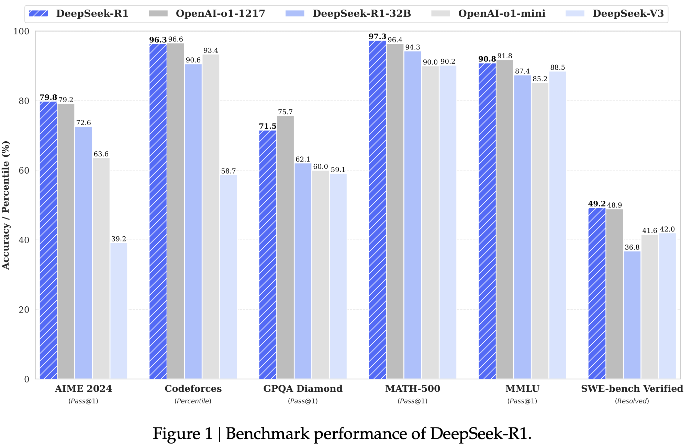 |  |  | [note](./notes/2025/DeepSeek-R1/note.md) |

<b>Ajay Jaiswal</b>
 

|    | meta                                                         | ttttttttttttttttttttttttttttttitle                                                                                           | ccccccccccccccccccover                                                 | Publish                                                    | codeeeee                                                                                | note                                  |
|---:|:-------------------------------------------------------------|:-----------------------------------------------------------------------------------------------------------------------------|:-----------------------------------------------------------------------|:-----------------------------------------------------------|:----------------------------------------------------------------------------------------|:--------------------------------------|
|  0 | [Essential Sparsity](./meta/2023/EssentialSparsity.prototxt) | [The Emergence of Essential Sparsity in Large Pre-trained Models: The Weights that Matter](https://arxiv.org/abs/2306.03805) |                                                                        |  |  |                                       |
|  1 | [LLM-KICK](./meta/2024/VB8C61V6.prototxt)                    | [Compressing LLMs: The Truth is Rarely Pure and Never Simple](http://arxiv.org/abs/2310.01382v2)                             |  |     |            | [note](./notes/2024/VB8C61V6/note.md) |

<b>Amir Gholami</b>
 

|    | meta                                                | ttttttttttttttttttttttttttttttitle                                                                                       | ccccccccccccccccccover                                                     | Publish                                                    | codeeeee                                                                                     | note                                       |
|---:|:----------------------------------------------------|:-------------------------------------------------------------------------------------------------------------------------|:---------------------------------------------------------------------------|:-----------------------------------------------------------|:---------------------------------------------------------------------------------------------|:-------------------------------------------|
|  0 | [FisherPruning](./meta/2022/fisherpruning.prototxt) | [A Fast Post-Training Pruning Framework for Transformers](http://arxiv.org/abs/2204.09656v2)                             |    |  |  | [note](./notes/2022/fisherpruning/note.md) |
|  1 | [SqueezeLLM](./meta/2024/SqueezeLLM.prototxt)       | [SqueezeLLM: Dense-and-Sparse Quantization](http://arxiv.org/abs/2306.07629v4)                                           |  |     |             | [note](./notes/2024/SqueezeLLM/note.md)    |
|  2 | [KVQuant](./meta/2024/KVQuant.prototxt)             | [KVQuant: Towards 10 Million Context Length LLM Inference with KV Cache Quantization](http://arxiv.org/abs/2401.18079v2) |                                                                            |  |                | [note](./notes/2024/KVQuant/note.md)       |

<b>Amir H. Abdi</b>
 

|    | meta                                          | ttttttttttttttttttttttttttttttitle                                                                                               | ccccccccccccccccccover                                                            | Publish                                                    | codeeeee                                                                       | note                                    |
|---:|:----------------------------------------------|:---------------------------------------------------------------------------------------------------------------------------------|:----------------------------------------------------------------------------------|:-----------------------------------------------------------|:-------------------------------------------------------------------------------|:----------------------------------------|
|  0 | [MInference](./meta/2024/MInference.prototxt) | [MInference 1.0: Accelerating Pre-filling for Long-Context LLMs via Dynamic Sparse Attention](http://arxiv.org/abs/2407.02490v1) |  |  |  | [note](./notes/2024/MInference/note.md) |
|  1 | [SCBench](./meta/2024/SCBench.prototxt)       | [SCBench: A KV Cache-Centric Analysis of Long-Context Methods](http://arxiv.org/abs/2412.10319v2)                                |                                                                                   |  |  | [note](./notes/2024/SCBench/note.md)    |

<b>André F. T. Martins</b>
 

|    | meta                                        | ttttttttttttttttttttttttttttttitle                                                              | ccccccccccccccccccover                                                   | Publish                                                    | codeeeee                                                                      | note                                   |
|---:|:--------------------------------------------|:------------------------------------------------------------------------------------------------|:-------------------------------------------------------------------------|:-----------------------------------------------------------|:------------------------------------------------------------------------------|:---------------------------------------|
|  0 | [m](./meta/2023/68I8KKBV.prototxt)          | [Efficient Methods for Natural Language Processing: A Survey](https://arxiv.org/abs/2209.00099) |  |    |                                                                               |                                        |
|  1 | [AdaSplash](./meta/2025/AdaSplash.prototxt) | [AdaSplash: Adaptive Sparse Flash Attention](http://arxiv.org/abs/2502.12082v1)                 |                                                                          |  |  | [note](./notes/2025/AdaSplash/note.md) |

<b>Aojun Zhou</b>
 

|    | meta                                  | ttttttttttttttttttttttttttttttitle                                                                                        | ccccccccccccccccccover                                             | Publish                                                  | codeeeee                                                                      | note                             |
|---:|:--------------------------------------|:--------------------------------------------------------------------------------------------------------------------------|:-------------------------------------------------------------------|:---------------------------------------------------------|:------------------------------------------------------------------------------|:---------------------------------|
|  0 | [SR-STE](./meta/2021/sr-ste.prototxt) | [Learning N:M Fine-grained Structured Sparse Neural Networks From Scratch](https://openreview.net/forum?id=K9bw7vqp_s)    |  |   |  |                                  |
|  1 | [STA](./meta/2022/44KWQAWO.prototxt)  | [An Algorithm-Hardware Co-Optimized Framework for Accelerating N:M Sparse Transformers](https://arxiv.org/abs/2208.06118) |                                                                    |  |                                                                               |                                  |
|  2 | [SPP](./meta/2024/SPP.prototxt)       | [SPP: Sparsity-Preserved Parameter-Efficient Fine-Tuning for Large Language Models](http://arxiv.org/abs/2405.16057v1)    | 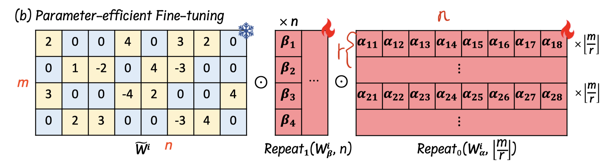       |   |      | [note](./notes/2024/SPP/note.md) |

<b>Ashish Panwar</b>
 

|    | meta                                                | ttttttttttttttttttttttttttttttitle                                                                                 | ccccccccccccccccccover                                                  | Publish                                                     | codeeeee                                                                       | note                                       |
|---:|:----------------------------------------------------|:-------------------------------------------------------------------------------------------------------------------|:------------------------------------------------------------------------|:------------------------------------------------------------|:-------------------------------------------------------------------------------|:-------------------------------------------|
|  0 | [POD-Attention](./meta/2025/POD-Attention.prototxt) | [POD-Attention: Unlocking Full Prefill-Decode Overlap for Faster LLM Inference](http://arxiv.org/abs/2410.18038v2) |  |  |  | [note](./notes/2025/POD-Attention/note.md) |
|  1 | [vAttention](./meta/2025/vAttention.prototxt)       | [vAttention: Dynamic Memory Management for Serving LLMs without PagedAttention](http://arxiv.org/abs/2405.04437v3) |     |  |  | [note](./notes/2025/vAttention/note.md)    |

<b>Bairu Hou</b>
 

|    | meta                                        | ttttttttttttttttttttttttttttttitle                                                                           | ccccccccccccccccccover                                              | Publish                                                    | codeeeee                                                                        | note                                   |
|---:|:--------------------------------------------|:-------------------------------------------------------------------------------------------------------------|:--------------------------------------------------------------------|:-----------------------------------------------------------|:--------------------------------------------------------------------------------|:---------------------------------------|
|  0 | [IFPruning](./meta/2025/IFPruning.prototxt) | [Instruction-Following Pruning for Large Language Models](http://arxiv.org/abs/2501.02086v2)                 |  |  |                                                                                 | [note](./notes/2025/IFPruning/note.md) |
|  1 | [KVLink](./meta/2025/KVLink.prototxt)       | [KVLink: Accelerating Large Language Models via Efficient KV Cache Reuse](http://arxiv.org/abs/2502.16002v1) |     |  |  | [note](./notes/2025/KVLink/note.md)    |

<b>Baris Kasikci</b>
 

|    | meta                                          | ttttttttttttttttttttttttttttttitle                                                                                     | ccccccccccccccccccover                                           | Publish                                                    | codeeeee                                                                           | note                                    |
|---:|:----------------------------------------------|:-----------------------------------------------------------------------------------------------------------------------|:-----------------------------------------------------------------|:-----------------------------------------------------------|:-----------------------------------------------------------------------------------|:----------------------------------------|
|  0 | [Quest](./meta/2024/Quest.prototxt)           | [Quest: Query-Aware Sparsity for Efficient Long-Context LLM Inference](http://arxiv.org/abs/2406.10774)                |  |     |         | [note](./notes/2024/Quest/note.md)      |
|  1 | [FlashInfer](./meta/2025/FlashInfer.prototxt) | [FlashInfer: Efficient and Customizable Attention Engine for LLM Inference Serving](http://arxiv.org/abs/2501.01005v2) |                                                                  |  |  | [note](./notes/2025/FlashInfer/note.md) |

<b>Bei Feng</b>
 

|    | meta                                            | ttttttttttttttttttttttttttttttitle                                                                                      | ccccccccccccccccccover                                                | Publish                                                    | codeeeee                                                                          | note                                     |
|---:|:------------------------------------------------|:------------------------------------------------------------------------------------------------------------------------|:----------------------------------------------------------------------|:-----------------------------------------------------------|:----------------------------------------------------------------------------------|:-----------------------------------------|
|  0 | [DeepSeek-V2](./meta/2024/DeepSeek-V2.prototxt) | [DeepSeek-V2: A Strong, Economical, and Efficient Mixture-of-Experts Language Model](http://arxiv.org/abs/2405.04434v5) |  |  |  | [note](./notes/2024/DeepSeek-V2/note.md) |
|  1 | [DeepSeek-V3](./meta/2024/DeepSeek-V3.prototxt) | [DeepSeek-V3 Technical Report](http://arxiv.org/abs/2412.19437v1)                                                       |  |  |  | [note](./notes/2024/DeepSeek-V3/note.md) |
|  2 | [DeepSeek-R1](./meta/2025/DeepSeek-R1.prototxt) | [DeepSeek-R1: Incentivizing Reasoning Capability in LLMs via Reinforcement Learning](http://arxiv.org/abs/2501.12948v1) |  |  |  | [note](./notes/2025/DeepSeek-R1/note.md) |

<b>Beidi Chen</b>
 

|    | meta                                                | ttttttttttttttttttttttttttttttitle                                                                                         | ccccccccccccccccccover                                                   | Publish                                                    | codeeeee                                                                            | note                                       |
|---:|:----------------------------------------------------|:---------------------------------------------------------------------------------------------------------------------------|:-------------------------------------------------------------------------|:-----------------------------------------------------------|:------------------------------------------------------------------------------------|:-------------------------------------------|
|  0 | [Deja Vu](./meta/2023/dejavu.prototxt)              | [Deja Vu: Contextual Sparsity for Efficient LLMs at Inference Time](https://openreview.net/forum?id=wIPIhHd00i)            |        |     |         |                                            |
|  1 | [H2O](./meta/2023/H2O.prototxt)                     | [H$_2$O: Heavy-Hitter Oracle for Efficient Generative Inference of Large Language Models](http://arxiv.org/abs/2306.14048) |              |  |            | [note](./notes/2023/H2O/note.md)           |
|  2 | [streaming-llm](./meta/2024/streaming-llm.prototxt) | [Efficient Streaming Language Models with Attention Sinks](http://arxiv.org/abs/2309.17453v4)                              |  |     |  | [note](./notes/2024/streaming-llm/note.md) |
|  3 | [ShadowKV](./meta/2024/ShadowKV.prototxt)           | [ShadowKV: KV Cache in Shadows for High-Throughput Long-Context LLM Inference](http://arxiv.org/abs/2410.21465v1)          |    |  |         | [note](./notes/2024/ShadowKV/note.md)      |

<b>Bin Gao</b>
 

|    | meta                                                    | ttttttttttttttttttttttttttttttitle                                                                                                 | ccccccccccccccccccover                                                    | Publish                                                  | codeeeee                                                                 | note                                         |
|---:|:--------------------------------------------------------|:-----------------------------------------------------------------------------------------------------------------------------------|:--------------------------------------------------------------------------|:---------------------------------------------------------|:-------------------------------------------------------------------------|:---------------------------------------------|
|  0 | [CachedAttention](./meta/2024/CachedAttention.prototxt) | [Cost-Efficient Large Language Model Serving for Multi-turn Conversations with CachedAttention](http://arxiv.org/abs/2403.19708v3) |  |  |                                                                          | [note](./notes/2024/CachedAttention/note.md) |
|  1 | [AdaSkip](./meta/2025/AdaSkip.prototxt)                 | [AdaSkip: Adaptive Sublayer Skipping for Accelerating Long-Context LLM Inference](http://arxiv.org/abs/2501.02336v1)               |          |   |  | [note](./notes/2025/AdaSkip/note.md)         |

<b>Bin Lin</b>
 

|    | meta                                                | ttttttttttttttttttttttttttttttitle                                                                                                                                              | ccccccccccccccccccover                                                  | Publish                                                    | codeeeee                                                                   | note                                       |
|---:|:----------------------------------------------------|:--------------------------------------------------------------------------------------------------------------------------------------------------------------------------------|:------------------------------------------------------------------------|:-----------------------------------------------------------|:---------------------------------------------------------------------------|:-------------------------------------------|
|  0 | [nmSPARSE](./meta/2023/nmSPARSE.prototxt)           | [Efficient GPU Kernels for N:M-Sparse Weights in Deep Learning](https://proceedings.mlsys.org/paper_files/paper/2023/file/4552cedd396a308320209f75f56a5ad5-Paper-mlsys2023.pdf) |                                                                         |  |  |                                            |
|  1 | [DistAttention](./meta/2024/DistAttention.prototxt) | [Infinite-LLM: Efficient LLM Service for Long Context with DistAttention and Distributed KVCache](http://arxiv.org/abs/2401.02669v2)                                            | 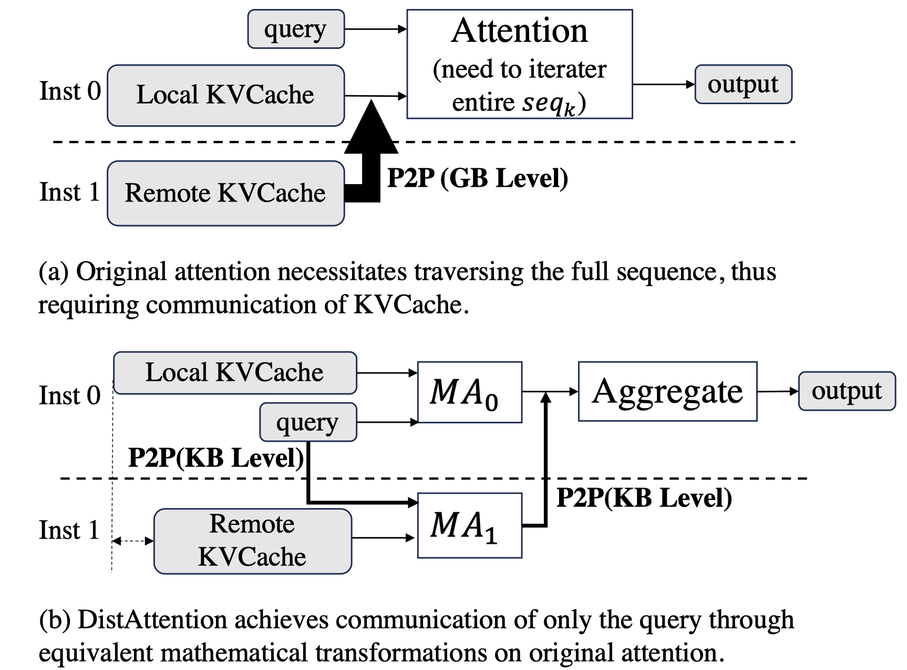 |  |                                                                            | [note](./notes/2024/DistAttention/note.md) |

<b>Bing Xue</b>
 

|    | meta                                            | ttttttttttttttttttttttttttttttitle                                                                                      | ccccccccccccccccccover                                                | Publish                                                    | codeeeee                                                                          | note                                     |
|---:|:------------------------------------------------|:------------------------------------------------------------------------------------------------------------------------|:----------------------------------------------------------------------|:-----------------------------------------------------------|:----------------------------------------------------------------------------------|:-----------------------------------------|
|  0 | [DeepSeek-V3](./meta/2024/DeepSeek-V3.prototxt) | [DeepSeek-V3 Technical Report](http://arxiv.org/abs/2412.19437v1)                                                       |  |  |  | [note](./notes/2024/DeepSeek-V3/note.md) |
|  1 | [DeepSeek-R1](./meta/2025/DeepSeek-R1.prototxt) | [DeepSeek-R1: Incentivizing Reasoning Capability in LLMs via Reinforcement Learning](http://arxiv.org/abs/2501.12948v1) |  |  |  | [note](./notes/2025/DeepSeek-R1/note.md) |

<b>Bingxuan Wang</b>
 

|    | meta                                            | ttttttttttttttttttttttttttttttitle                                                                                      | ccccccccccccccccccover                                                | Publish                                                    | codeeeee                                                                          | note                                     |
|---:|:------------------------------------------------|:------------------------------------------------------------------------------------------------------------------------|:----------------------------------------------------------------------|:-----------------------------------------------------------|:----------------------------------------------------------------------------------|:-----------------------------------------|
|  0 | [DeepSeek-V2](./meta/2024/DeepSeek-V2.prototxt) | [DeepSeek-V2: A Strong, Economical, and Efficient Mixture-of-Experts Language Model](http://arxiv.org/abs/2405.04434v5) |  |  |  | [note](./notes/2024/DeepSeek-V2/note.md) |
|  1 | [DeepSeek-V3](./meta/2024/DeepSeek-V3.prototxt) | [DeepSeek-V3 Technical Report](http://arxiv.org/abs/2412.19437v1)                                                       |  |  |  | [note](./notes/2024/DeepSeek-V3/note.md) |
|  2 | [DeepSeek-R1](./meta/2025/DeepSeek-R1.prototxt) | [DeepSeek-R1: Incentivizing Reasoning Capability in LLMs via Reinforcement Learning](http://arxiv.org/abs/2501.12948v1) |  |  |  | [note](./notes/2025/DeepSeek-R1/note.md) |

<b>Bochao Wu</b>
 

|    | meta                                            | ttttttttttttttttttttttttttttttitle                                                                                      | ccccccccccccccccccover                                                | Publish                                                    | codeeeee                                                                          | note                                     |
|---:|:------------------------------------------------|:------------------------------------------------------------------------------------------------------------------------|:----------------------------------------------------------------------|:-----------------------------------------------------------|:----------------------------------------------------------------------------------|:-----------------------------------------|
|  0 | [DeepSeek-V3](./meta/2024/DeepSeek-V3.prototxt) | [DeepSeek-V3 Technical Report](http://arxiv.org/abs/2412.19437v1)                                                       |  |  |  | [note](./notes/2024/DeepSeek-V3/note.md) |
|  1 | [DeepSeek-R1](./meta/2025/DeepSeek-R1.prototxt) | [DeepSeek-R1: Incentivizing Reasoning Capability in LLMs via Reinforcement Learning](http://arxiv.org/abs/2501.12948v1) |  |  |  | [note](./notes/2025/DeepSeek-R1/note.md) |

<b>Chaojun Xiao</b>
 

|    | meta                                            | ttttttttttttttttttttttttttttttitle                                                                                | ccccccccccccccccccover                                                | Publish                                                    | codeeeee                                                                     | note                                     |
|---:|:------------------------------------------------|:------------------------------------------------------------------------------------------------------------------|:----------------------------------------------------------------------|:-----------------------------------------------------------|:-----------------------------------------------------------------------------|:-----------------------------------------|
|  0 | [ReLU2](./meta/2024/ReLU2.prototxt)             | [ReLU2 Wins: Discovering Efficient Activation Functions for Sparse LLMs](https://arxiv.org/abs/2402.03804)        |  |  |                                                                              | [note](./notes/2024/ReLU2/note.md)       |
|  1 | [SparsingLaw](./meta/2024/SparsingLaw.prototxt) | [Sparsing Law: Towards Large Language Models with Greater Activation Sparsity](http://arxiv.org/abs/2411.02335v1) |  |  |  | [note](./notes/2024/SparsingLaw/note.md) |
|  2 | [MiniCPM4](./meta/2025/MiniCPM4.prototxt)       | [MiniCPM4: Ultra-Efficient LLMs on End Devices](http://arxiv.org/abs/2506.07900v1)                                |     |  |     | [note](./notes/2025/MiniCPM4/note.md)    |

<b>Chen Chen</b>
 

|    | meta                                                          | ttttttttttttttttttttttttttttttitle                                                                                                  | ccccccccccccccccccover                                                       | Publish                                                    | codeeeee                                                                                       | note                                            |
|---:|:--------------------------------------------------------------|:------------------------------------------------------------------------------------------------------------------------------------|:-----------------------------------------------------------------------------|:-----------------------------------------------------------|:-----------------------------------------------------------------------------------------------|:------------------------------------------------|
|  0 | [ProSparse](./meta/2024/ProSparse.prototxt)                   | [ProSparse: Introducing and Enhancing Intrinsic Activation Sparsity within Large Language Models](https://arxiv.org/abs/2402.13516) |      |  |  | [note](./notes/2024/ProSparse/note.md)          |
|  1 | [AttentionPredictor](./meta/2025/AttentionPredictor.prototxt) | [AttentionPredictor: Temporal Pattern Matters for Efficient LLM Inference](http://arxiv.org/abs/2502.04077v1)                       |  |  |                                                                                                | [note](./notes/2025/AttentionPredictor/note.md) |

<b>Chen Zhang</b>
 

|    | meta                                                | ttttttttttttttttttttttttttttttitle                                                                                                   | ccccccccccccccccccover                                                  | Publish                                                    | codeeeee   | note                                       |
|---:|:----------------------------------------------------|:-------------------------------------------------------------------------------------------------------------------------------------|:------------------------------------------------------------------------|:-----------------------------------------------------------|:-----------|:-------------------------------------------|
|  0 | [DistAttention](./meta/2024/DistAttention.prototxt) | [Infinite-LLM: Efficient LLM Service for Long Context with DistAttention and Distributed KVCache](http://arxiv.org/abs/2401.02669v2) |  |  |            | [note](./notes/2024/DistAttention/note.md) |
|  1 | [ZigZagKV](./meta/2024/ZigZagKV.prototxt)           | [ZigZagkv: Dynamic KV Cache Compression for Long-context Modeling based on Layer Uncertainty](http://arxiv.org/abs/2412.09036v1)     |       |  |            | [note](./notes/2024/ZigZagKV/note.md)      |

<b>Chengda Lu</b>
 

|    | meta                                            | ttttttttttttttttttttttttttttttitle                                                                                      | ccccccccccccccccccover                                                | Publish                                                    | codeeeee                                                                          | note                                     |
|---:|:------------------------------------------------|:------------------------------------------------------------------------------------------------------------------------|:----------------------------------------------------------------------|:-----------------------------------------------------------|:----------------------------------------------------------------------------------|:-----------------------------------------|
|  0 | [DeepSeek-V3](./meta/2024/DeepSeek-V3.prototxt) | [DeepSeek-V3 Technical Report](http://arxiv.org/abs/2412.19437v1)                                                       |  |  |  | [note](./notes/2024/DeepSeek-V3/note.md) |
|  1 | [DeepSeek-R1](./meta/2025/DeepSeek-R1.prototxt) | [DeepSeek-R1: Incentivizing Reasoning Capability in LLMs via Reinforcement Learning](http://arxiv.org/abs/2501.12948v1) |  |  |  | [note](./notes/2025/DeepSeek-R1/note.md) |

<b>Chenggang Zhao</b>
 

|    | meta                                            | ttttttttttttttttttttttttttttttitle                                                                                             | ccccccccccccccccccover                                                | Publish                                                    | codeeeee                                                                           | note                                     |
|---:|:------------------------------------------------|:-------------------------------------------------------------------------------------------------------------------------------|:----------------------------------------------------------------------|:-----------------------------------------------------------|:-----------------------------------------------------------------------------------|:-----------------------------------------|
|  0 | [DeepSeek-V2](./meta/2024/DeepSeek-V2.prototxt) | [DeepSeek-V2: A Strong, Economical, and Efficient Mixture-of-Experts Language Model](http://arxiv.org/abs/2405.04434v5)        |  |  |   | [note](./notes/2024/DeepSeek-V2/note.md) |
|  1 | [DeepSeek-V3](./meta/2024/DeepSeek-V3.prototxt) | [DeepSeek-V3 Technical Report](http://arxiv.org/abs/2412.19437v1)                                                              |  |  |   | [note](./notes/2024/DeepSeek-V3/note.md) |
|  2 | [DeepSeekMoE](./meta/2024/DeepSeekMoE.prototxt) | [DeepSeekMoE: Towards Ultimate Expert Specialization in Mixture-of-Experts Language Models](http://arxiv.org/abs/2401.06066v1) |  |  |  | [note](./notes/2024/DeepSeekMoE/note.md) |
|  3 | [DeepSeek-R1](./meta/2025/DeepSeek-R1.prototxt) | [DeepSeek-R1: Incentivizing Reasoning Capability in LLMs via Reinforcement Learning](http://arxiv.org/abs/2501.12948v1)        |  |  |   | [note](./notes/2025/DeepSeek-R1/note.md) |

<b>Chengqi Deng</b>
 

|    | meta                                            | ttttttttttttttttttttttttttttttitle                                                                                             | ccccccccccccccccccover                                                | Publish                                                    | codeeeee                                                                           | note                                     |
|---:|:------------------------------------------------|:-------------------------------------------------------------------------------------------------------------------------------|:----------------------------------------------------------------------|:-----------------------------------------------------------|:-----------------------------------------------------------------------------------|:-----------------------------------------|
|  0 | [DeepSeek-V3](./meta/2024/DeepSeek-V3.prototxt) | [DeepSeek-V3 Technical Report](http://arxiv.org/abs/2412.19437v1)                                                              |  |  |   | [note](./notes/2024/DeepSeek-V3/note.md) |
|  1 | [DeepSeekMoE](./meta/2024/DeepSeekMoE.prototxt) | [DeepSeekMoE: Towards Ultimate Expert Specialization in Mixture-of-Experts Language Models](http://arxiv.org/abs/2401.06066v1) |  |  |  | [note](./notes/2024/DeepSeekMoE/note.md) |
|  2 | [DeepSeek-R1](./meta/2025/DeepSeek-R1.prototxt) | [DeepSeek-R1: Incentivizing Reasoning Capability in LLMs via Reinforcement Learning](http://arxiv.org/abs/2501.12948v1)        |  |  |   | [note](./notes/2025/DeepSeek-R1/note.md) |

<b>Chengruidong Zhang</b>
 

|    | meta                                          | ttttttttttttttttttttttttttttttitle                                                                                               | ccccccccccccccccccover                                                            | Publish                                                    | codeeeee                                                                       | note                                    |
|---:|:----------------------------------------------|:---------------------------------------------------------------------------------------------------------------------------------|:----------------------------------------------------------------------------------|:-----------------------------------------------------------|:-------------------------------------------------------------------------------|:----------------------------------------|
|  0 | [MInference](./meta/2024/MInference.prototxt) | [MInference 1.0: Accelerating Pre-filling for Long-Context LLMs via Dynamic Sparse Attention](http://arxiv.org/abs/2407.02490v1) |  |  |  | [note](./notes/2024/MInference/note.md) |
|  1 | [SCBench](./meta/2024/SCBench.prototxt)       | [SCBench: A KV Cache-Centric Analysis of Long-Context Methods](http://arxiv.org/abs/2412.10319v2)                                |                                                                                   |  |  | [note](./notes/2024/SCBench/note.md)    |

<b>Chenyang Song</b>
 

|    | meta                                            | ttttttttttttttttttttttttttttttitle                                                                                                  | ccccccccccccccccccover                                                   | Publish                                                    | codeeeee                                                                                       | note                                     |
|---:|:------------------------------------------------|:------------------------------------------------------------------------------------------------------------------------------------|:-------------------------------------------------------------------------|:-----------------------------------------------------------|:-----------------------------------------------------------------------------------------------|:-----------------------------------------|
|  0 | [ProSparse](./meta/2024/ProSparse.prototxt)     | [ProSparse: Introducing and Enhancing Intrinsic Activation Sparsity within Large Language Models](https://arxiv.org/abs/2402.13516) |  |  |  | [note](./notes/2024/ProSparse/note.md)   |
|  1 | [ReLU2](./meta/2024/ReLU2.prototxt)             | [ReLU2 Wins: Discovering Efficient Activation Functions for Sparse LLMs](https://arxiv.org/abs/2402.03804)                          |     |  |                                                                                                | [note](./notes/2024/ReLU2/note.md)       |
|  2 | [SparsingLaw](./meta/2024/SparsingLaw.prototxt) | [Sparsing Law: Towards Large Language Models with Greater Activation Sparsity](http://arxiv.org/abs/2411.02335v1)                   |     |  |                    | [note](./notes/2024/SparsingLaw/note.md) |

<b>Chenyu Zhang</b>
 

|    | meta                                            | ttttttttttttttttttttttttttttttitle                                                                                      | ccccccccccccccccccover                                                | Publish                                                    | codeeeee                                                                          | note                                     |
|---:|:------------------------------------------------|:------------------------------------------------------------------------------------------------------------------------|:----------------------------------------------------------------------|:-----------------------------------------------------------|:----------------------------------------------------------------------------------|:-----------------------------------------|
|  0 | [DeepSeek-V3](./meta/2024/DeepSeek-V3.prototxt) | [DeepSeek-V3 Technical Report](http://arxiv.org/abs/2412.19437v1)                                                       |  |  |  | [note](./notes/2024/DeepSeek-V3/note.md) |
|  1 | [DeepSeek-R1](./meta/2025/DeepSeek-R1.prototxt) | [DeepSeek-R1: Incentivizing Reasoning Capability in LLMs via Reinforcement Learning](http://arxiv.org/abs/2501.12948v1) |  |  |  | [note](./notes/2025/DeepSeek-R1/note.md) |

<b>Chong Ruan</b>
 

|    | meta                                            | ttttttttttttttttttttttttttttttitle                                                                                             | ccccccccccccccccccover                                                | Publish                                                    | codeeeee                                                                           | note                                     |
|---:|:------------------------------------------------|:-------------------------------------------------------------------------------------------------------------------------------|:----------------------------------------------------------------------|:-----------------------------------------------------------|:-----------------------------------------------------------------------------------|:-----------------------------------------|
|  0 | [DeepSeek-V2](./meta/2024/DeepSeek-V2.prototxt) | [DeepSeek-V2: A Strong, Economical, and Efficient Mixture-of-Experts Language Model](http://arxiv.org/abs/2405.04434v5)        |  |  |   | [note](./notes/2024/DeepSeek-V2/note.md) |
|  1 | [DeepSeek-V3](./meta/2024/DeepSeek-V3.prototxt) | [DeepSeek-V3 Technical Report](http://arxiv.org/abs/2412.19437v1)                                                              |  |  |   | [note](./notes/2024/DeepSeek-V3/note.md) |
|  2 | [DeepSeekMoE](./meta/2024/DeepSeekMoE.prototxt) | [DeepSeekMoE: Towards Ultimate Expert Specialization in Mixture-of-Experts Language Models](http://arxiv.org/abs/2401.06066v1) |  |  |  | [note](./notes/2024/DeepSeekMoE/note.md) |
|  3 | [DeepSeek-R1](./meta/2025/DeepSeek-R1.prototxt) | [DeepSeek-R1: Incentivizing Reasoning Capability in LLMs via Reinforcement Learning](http://arxiv.org/abs/2501.12948v1)        |  |  |   | [note](./notes/2025/DeepSeek-R1/note.md) |
|  4 | [NSA](./meta/2025/NSA.prototxt)                 | [Native Sparse Attention: Hardware-Aligned and Natively Trainable Sparse Attention](http://arxiv.org/abs/2502.11089v1)         | 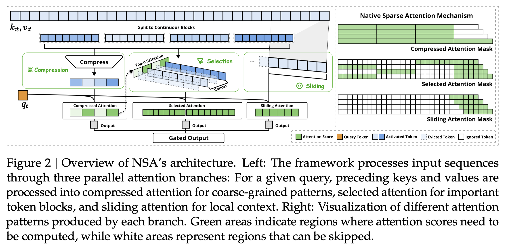         |  |                                                                                    | [note](./notes/2025/NSA/note.md)         |

<b>Chuang Gan</b>
 

|    | meta                                   | ttttttttttttttttttttttttttttttitle                                                                                 | ccccccccccccccccccover   | Publish                                                    | codeeeee                                                                      | note                                 |
|---:|:---------------------------------------|:-------------------------------------------------------------------------------------------------------------------|:-------------------------|:-----------------------------------------------------------|:------------------------------------------------------------------------------|:-------------------------------------|
|  0 | [AWQ](./meta/2024/awq.prototxt)        | [AWQ: Activation-aware Weight Quantization for LLM Compression and Acceleration](https://arxiv.org/abs/2306.00978) |                          |  |  |                                      |
|  1 | [QServe](./meta/2024/QServer.prototxt) | [QServe: W4A8KV4 Quantization and System Co-design for Efficient LLM Serving](http://arxiv.org/abs/2405.04532v2)   |                          |  | [Pytorch](https://hanlab.mit.edu/projects/qserve)                             | [note](./notes/2024/QServer/note.md) |

<b>Clark Barrett</b>
 

|    | meta                                  | ttttttttttttttttttttttttttttttitle                                                                                         | ccccccccccccccccccover                                           | Publish                                                    | codeeeee                                                                     | note                                |
|---:|:--------------------------------------|:---------------------------------------------------------------------------------------------------------------------------|:-----------------------------------------------------------------|:-----------------------------------------------------------|:-----------------------------------------------------------------------------|:------------------------------------|
|  0 | [H2O](./meta/2023/H2O.prototxt)       | [H$_2$O: Heavy-Hitter Oracle for Efficient Generative Inference of Large Language Models](http://arxiv.org/abs/2306.14048) |      |  |     | [note](./notes/2023/H2O/note.md)    |
|  1 | [SGLang](./meta/2024/SGLang.prototxt) | [SGLang: Efficient Execution of Structured Language Model Programs](http://arxiv.org/abs/2312.07104v2)                     |  |  |  | [note](./notes/2024/SGLang/note.md) |

<b>Cody Hao Yu</b>
 

|    | meta                                                   | ttttttttttttttttttttttttttttttitle                                                                                    | ccccccccccccccccccover                                                   | Publish                                                    | codeeeee                                                                     | note                                        |
|---:|:-------------------------------------------------------|:----------------------------------------------------------------------------------------------------------------------|:-------------------------------------------------------------------------|:-----------------------------------------------------------|:-----------------------------------------------------------------------------|:--------------------------------------------|
|  0 | [Paged Attention](./meta/2023/PagedAttention.prototxt) | [Efficient Memory Management for Large Language Model Serving with PagedAttention](http://arxiv.org/abs/2309.06180v1) |  |   |   | [note](./notes/2023/PagedAttention/note.md) |
|  1 | [SGLang](./meta/2024/SGLang.prototxt)                  | [SGLang: Efficient Execution of Structured Language Model Programs](http://arxiv.org/abs/2312.07104v2)                |          |  |  | [note](./notes/2024/SGLang/note.md)         |

<b>Coleman Hooper</b>
 

|    | meta                                          | ttttttttttttttttttttttttttttttitle                                                                                       | ccccccccccccccccccover                                                     | Publish                                                    | codeeeee                                                                          | note                                    |
|---:|:----------------------------------------------|:-------------------------------------------------------------------------------------------------------------------------|:---------------------------------------------------------------------------|:-----------------------------------------------------------|:----------------------------------------------------------------------------------|:----------------------------------------|
|  0 | [SqueezeLLM](./meta/2024/SqueezeLLM.prototxt) | [SqueezeLLM: Dense-and-Sparse Quantization](http://arxiv.org/abs/2306.07629v4)                                           |  |     |  | [note](./notes/2024/SqueezeLLM/note.md) |
|  1 | [KVQuant](./meta/2024/KVQuant.prototxt)       | [KVQuant: Towards 10 Million Context Length LLM Inference with KV Cache Quantization](http://arxiv.org/abs/2401.18079v2) |                                                                            |  |     | [note](./notes/2024/KVQuant/note.md)    |

<b>Damai Dai</b>
 

|    | meta                                            | ttttttttttttttttttttttttttttttitle                                                                                             | ccccccccccccccccccover                                                | Publish                                                    | codeeeee                                                                           | note                                     |
|---:|:------------------------------------------------|:-------------------------------------------------------------------------------------------------------------------------------|:----------------------------------------------------------------------|:-----------------------------------------------------------|:-----------------------------------------------------------------------------------|:-----------------------------------------|
|  0 | [DeepSeek-V2](./meta/2024/DeepSeek-V2.prototxt) | [DeepSeek-V2: A Strong, Economical, and Efficient Mixture-of-Experts Language Model](http://arxiv.org/abs/2405.04434v5)        |  |  |   | [note](./notes/2024/DeepSeek-V2/note.md) |
|  1 | [DeepSeek-V3](./meta/2024/DeepSeek-V3.prototxt) | [DeepSeek-V3 Technical Report](http://arxiv.org/abs/2412.19437v1)                                                              |  |  |   | [note](./notes/2024/DeepSeek-V3/note.md) |
|  2 | [DeepSeekMoE](./meta/2024/DeepSeekMoE.prototxt) | [DeepSeekMoE: Towards Ultimate Expert Specialization in Mixture-of-Experts Language Models](http://arxiv.org/abs/2401.06066v1) |  |  |  | [note](./notes/2024/DeepSeekMoE/note.md) |
|  3 | [DeepSeek-R1](./meta/2025/DeepSeek-R1.prototxt) | [DeepSeek-R1: Incentivizing Reasoning Capability in LLMs via Reinforcement Learning](http://arxiv.org/abs/2501.12948v1)        |  |  |   | [note](./notes/2025/DeepSeek-R1/note.md) |
|  4 | [NSA](./meta/2025/NSA.prototxt)                 | [Native Sparse Attention: Hardware-Aligned and Natively Trainable Sparse Attention](http://arxiv.org/abs/2502.11089v1)         |          |  |                                                                                    | [note](./notes/2025/NSA/note.md)         |

<b>Dan Alistarh</b>
 

|    | meta                                          | ttttttttttttttttttttttttttttttitle                                                                                                        | ccccccccccccccccccover                                                | Publish                                                    | codeeeee                                                                              | note                                  |
|---:|:----------------------------------------------|:------------------------------------------------------------------------------------------------------------------------------------------|:----------------------------------------------------------------------|:-----------------------------------------------------------|:--------------------------------------------------------------------------------------|:--------------------------------------|
|  0 | [m](./meta/2020/V3MFIRLV.prototxt)            | [Inducing and Exploiting Activation Sparsity for Fast Neural Network Inference](http://proceedings.mlr.press/v119/kurtz20a/kurtz20a.pdf)  |                                                                       |     |                                                                                       |                                       |
|  1 | [m](./meta/2021/ITZS3TU3.prototxt)            | [Sparsity in Deep Learning: Pruning and growth for efficient inference and training in neural networks](https://arxiv.org/abs/2102.00554) |                                                                       |  |                                                                                       |                                       |
|  2 | [SPDY](./meta/2022/spdy.prototxt)             | [SPDY: Accurate Pruning with Speedup Guarantees](https://arxiv.org/abs/2201.13096)                                                        |        |     |              | [note](./notes/2022/spdy/index.md)    |
|  3 | [OBC](./meta/2022/obc.prototxt)               | [Optimal Brain Compression: A Framework for Accurate Post-Training Quantization and Pruning](https://openreview.net/pdf?id=ksVGCOlOEba)   |                                                                       |  |               |                                       |
|  4 | [oBERT](./meta/2022/oBERT.prototxt)           | [The Optimal BERT Surgeon: Scalable and Accurate Second-Order Pruning for Large Language Models](https://arxiv.org/pdf/2203.07259.pdf)    |                                                                       |  |         |                                       |
|  5 | [GPTQ](./meta/2023/gptq.prototxt)             | [GPTQ: Accurate Post-Training Quantization for Generative Pre-trained Transformers](https://arxiv.org/pdf/2210.17323.pdf)                 |                                                                       |     |              |                                       |
|  6 | [SparseGPT](./meta/2023/sparsegpt.prototxt)   | [SparseGPT: Massive Language Models Can be Accurately Pruned in one-shot.](https://arxiv.org/pdf/2301.00774.pdf)                          |                                                                       |     |         |                                       |
|  7 | [ZipLM](./meta/2023/ZipLM.prototxt)           | [ZipLM: Inference-Aware Structured Pruning of Language Models](https://openreview.net/pdf?id=bPFFPueAxm)                                  |       |  |             |                                       |
|  8 | [SpQR](./meta/2023/spqr.prototxt)             | [SpQR: A Sparse-Quantized Representation for Near-Lossless LLM Weight Compression](https://arxiv.org/pdf/2306.03078.pdf)                  |                                                                       |  |                |                                       |
|  9 | [SquareHead](./meta/2023/SquareHead.prototxt) | [Sparse Fine-tuning for Inference Acceleration of Large Language Models](https://arxiv.org/pdf/2310.06927.pdf)                            |  |  |  |                                       |
| 10 | [m](./meta/2024/ULY1AZGY.prototxt)            | [Enabling High-Sparsity Foundational Llama Models with Efficient Pretraining and Deployment](http://arxiv.org/abs/2405.03594v1)           |                                                                       |  |          | [note](./notes/2024/ULY1AZGY/note.md) |

<b>Daya Guo</b>
 

|    | meta                                            | ttttttttttttttttttttttttttttttitle                                                                                      | ccccccccccccccccccover                                                | Publish                                                    | codeeeee                                                                          | note                                     |
|---:|:------------------------------------------------|:------------------------------------------------------------------------------------------------------------------------|:----------------------------------------------------------------------|:-----------------------------------------------------------|:----------------------------------------------------------------------------------|:-----------------------------------------|
|  0 | [DeepSeek-V2](./meta/2024/DeepSeek-V2.prototxt) | [DeepSeek-V2: A Strong, Economical, and Efficient Mixture-of-Experts Language Model](http://arxiv.org/abs/2405.04434v5) |  |  |  | [note](./notes/2024/DeepSeek-V2/note.md) |
|  1 | [DeepSeek-V3](./meta/2024/DeepSeek-V3.prototxt) | [DeepSeek-V3 Technical Report](http://arxiv.org/abs/2412.19437v1)                                                       |  |  |  | [note](./notes/2024/DeepSeek-V3/note.md) |
|  2 | [DeepSeek-R1](./meta/2025/DeepSeek-R1.prototxt) | [DeepSeek-R1: Incentivizing Reasoning Capability in LLMs via Reinforcement Learning](http://arxiv.org/abs/2501.12948v1) |  |  |  | [note](./notes/2025/DeepSeek-R1/note.md) |

<b>DeepSeek-AI</b>
 

|    | meta                                            | ttttttttttttttttttttttttttttttitle                                                                                      | ccccccccccccccccccover                                                | Publish                                                    | codeeeee                                                                          | note                                     |
|---:|:------------------------------------------------|:------------------------------------------------------------------------------------------------------------------------|:----------------------------------------------------------------------|:-----------------------------------------------------------|:----------------------------------------------------------------------------------|:-----------------------------------------|
|  0 | [DeepSeek-V2](./meta/2024/DeepSeek-V2.prototxt) | [DeepSeek-V2: A Strong, Economical, and Efficient Mixture-of-Experts Language Model](http://arxiv.org/abs/2405.04434v5) |  |  |  | [note](./notes/2024/DeepSeek-V2/note.md) |
|  1 | [DeepSeek-V3](./meta/2024/DeepSeek-V3.prototxt) | [DeepSeek-V3 Technical Report](http://arxiv.org/abs/2412.19437v1)                                                       |  |  |  | [note](./notes/2024/DeepSeek-V3/note.md) |
|  2 | [DeepSeek-R1](./meta/2025/DeepSeek-R1.prototxt) | [DeepSeek-R1: Incentivizing Reasoning Capability in LLMs via Reinforcement Learning](http://arxiv.org/abs/2501.12948v1) |  |  |  | [note](./notes/2025/DeepSeek-R1/note.md) |

<b>Dejian Yang</b>
 

|    | meta                                            | ttttttttttttttttttttttttttttttitle                                                                                      | ccccccccccccccccccover                                                | Publish                                                    | codeeeee                                                                          | note                                     |
|---:|:------------------------------------------------|:------------------------------------------------------------------------------------------------------------------------|:----------------------------------------------------------------------|:-----------------------------------------------------------|:----------------------------------------------------------------------------------|:-----------------------------------------|
|  0 | [DeepSeek-V2](./meta/2024/DeepSeek-V2.prototxt) | [DeepSeek-V2: A Strong, Economical, and Efficient Mixture-of-Experts Language Model](http://arxiv.org/abs/2405.04434v5) |  |  |  | [note](./notes/2024/DeepSeek-V2/note.md) |
|  1 | [DeepSeek-V3](./meta/2024/DeepSeek-V3.prototxt) | [DeepSeek-V3 Technical Report](http://arxiv.org/abs/2412.19437v1)                                                       |  |  |  | [note](./notes/2024/DeepSeek-V3/note.md) |
|  2 | [DeepSeek-R1](./meta/2025/DeepSeek-R1.prototxt) | [DeepSeek-R1: Incentivizing Reasoning Capability in LLMs via Reinforcement Learning](http://arxiv.org/abs/2501.12948v1) |  |  |  | [note](./notes/2025/DeepSeek-R1/note.md) |

<b>Deli Chen</b>
 

|    | meta                                            | ttttttttttttttttttttttttttttttitle                                                                                             | ccccccccccccccccccover                                                | Publish                                                    | codeeeee                                                                           | note                                     |
|---:|:------------------------------------------------|:-------------------------------------------------------------------------------------------------------------------------------|:----------------------------------------------------------------------|:-----------------------------------------------------------|:-----------------------------------------------------------------------------------|:-----------------------------------------|
|  0 | [DeepSeek-V2](./meta/2024/DeepSeek-V2.prototxt) | [DeepSeek-V2: A Strong, Economical, and Efficient Mixture-of-Experts Language Model](http://arxiv.org/abs/2405.04434v5)        |  |  |   | [note](./notes/2024/DeepSeek-V2/note.md) |
|  1 | [DeepSeek-V3](./meta/2024/DeepSeek-V3.prototxt) | [DeepSeek-V3 Technical Report](http://arxiv.org/abs/2412.19437v1)                                                              |  |  |   | [note](./notes/2024/DeepSeek-V3/note.md) |
|  2 | [DeepSeekMoE](./meta/2024/DeepSeekMoE.prototxt) | [DeepSeekMoE: Towards Ultimate Expert Specialization in Mixture-of-Experts Language Models](http://arxiv.org/abs/2401.06066v1) |  |  |  | [note](./notes/2024/DeepSeekMoE/note.md) |
|  3 | [DeepSeek-R1](./meta/2025/DeepSeek-R1.prototxt) | [DeepSeek-R1: Incentivizing Reasoning Capability in LLMs via Reinforcement Learning](http://arxiv.org/abs/2501.12948v1)        |  |  |   | [note](./notes/2025/DeepSeek-R1/note.md) |

<b>Dongjie Ji</b>
 

|    | meta                                            | ttttttttttttttttttttttttttttttitle                                                                                      | ccccccccccccccccccover                                                | Publish                                                    | codeeeee                                                                          | note                                     |
|---:|:------------------------------------------------|:------------------------------------------------------------------------------------------------------------------------|:----------------------------------------------------------------------|:-----------------------------------------------------------|:----------------------------------------------------------------------------------|:-----------------------------------------|
|  0 | [DeepSeek-V2](./meta/2024/DeepSeek-V2.prototxt) | [DeepSeek-V2: A Strong, Economical, and Efficient Mixture-of-Experts Language Model](http://arxiv.org/abs/2405.04434v5) |  |  |  | [note](./notes/2024/DeepSeek-V2/note.md) |
|  1 | [DeepSeek-V3](./meta/2024/DeepSeek-V3.prototxt) | [DeepSeek-V3 Technical Report](http://arxiv.org/abs/2412.19437v1)                                                       |  |  |  | [note](./notes/2024/DeepSeek-V3/note.md) |
|  2 | [DeepSeek-R1](./meta/2025/DeepSeek-R1.prototxt) | [DeepSeek-R1: Incentivizing Reasoning Capability in LLMs via Reinforcement Learning](http://arxiv.org/abs/2501.12948v1) |  |  |  | [note](./notes/2025/DeepSeek-R1/note.md) |

<b>Dongsheng Li</b>
 

|    | meta                                          | ttttttttttttttttttttttttttttttitle                                                                                               | ccccccccccccccccccover                                                            | Publish                                                    | codeeeee                                                                       | note                                    |
|---:|:----------------------------------------------|:---------------------------------------------------------------------------------------------------------------------------------|:----------------------------------------------------------------------------------|:-----------------------------------------------------------|:-------------------------------------------------------------------------------|:----------------------------------------|
|  0 | [MInference](./meta/2024/MInference.prototxt) | [MInference 1.0: Accelerating Pre-filling for Long-Context LLMs via Dynamic Sparse Attention](http://arxiv.org/abs/2407.02490v1) |  |  |  | [note](./notes/2024/MInference/note.md) |
|  1 | [SCBench](./meta/2024/SCBench.prototxt)       | [SCBench: A KV Cache-Centric Analysis of Long-Context Methods](http://arxiv.org/abs/2412.10319v2)                                |                                                                                   |  |  | [note](./notes/2024/SCBench/note.md)    |

<b>Eldar Kurtic</b>
 

|    | meta                                          | ttttttttttttttttttttttttttttttitle                                                                                                     | ccccccccccccccccccover                                                | Publish                                                    | codeeeee                                                                              | note                                  |
|---:|:----------------------------------------------|:---------------------------------------------------------------------------------------------------------------------------------------|:----------------------------------------------------------------------|:-----------------------------------------------------------|:--------------------------------------------------------------------------------------|:--------------------------------------|
|  0 | [oBERT](./meta/2022/oBERT.prototxt)           | [The Optimal BERT Surgeon: Scalable and Accurate Second-Order Pruning for Large Language Models](https://arxiv.org/pdf/2203.07259.pdf) |                                                                       |  |         |                                       |
|  1 | [ZipLM](./meta/2023/ZipLM.prototxt)           | [ZipLM: Inference-Aware Structured Pruning of Language Models](https://openreview.net/pdf?id=bPFFPueAxm)                               |       |  |             |                                       |
|  2 | [SquareHead](./meta/2023/SquareHead.prototxt) | [Sparse Fine-tuning for Inference Acceleration of Large Language Models](https://arxiv.org/pdf/2310.06927.pdf)                         |  |  |  |                                       |
|  3 | [m](./meta/2024/ULY1AZGY.prototxt)            | [Enabling High-Sparsity Foundational Llama Models with Efficient Pretraining and Deployment](http://arxiv.org/abs/2405.03594v1)        |                                                                       |  |          | [note](./notes/2024/ULY1AZGY/note.md) |

<b>Elias Frantar</b>
 

|    | meta                                          | ttttttttttttttttttttttttttttttitle                                                                                                      | ccccccccccccccccccover                                                | Publish                                                    | codeeeee                                                                              | note                               |
|---:|:----------------------------------------------|:----------------------------------------------------------------------------------------------------------------------------------------|:----------------------------------------------------------------------|:-----------------------------------------------------------|:--------------------------------------------------------------------------------------|:-----------------------------------|
|  0 | [SPDY](./meta/2022/spdy.prototxt)             | [SPDY: Accurate Pruning with Speedup Guarantees](https://arxiv.org/abs/2201.13096)                                                      |        |     |              | [note](./notes/2022/spdy/index.md) |
|  1 | [OBC](./meta/2022/obc.prototxt)               | [Optimal Brain Compression: A Framework for Accurate Post-Training Quantization and Pruning](https://openreview.net/pdf?id=ksVGCOlOEba) |                                                                       |  |               |                                    |
|  2 | [GPTQ](./meta/2023/gptq.prototxt)             | [GPTQ: Accurate Post-Training Quantization for Generative Pre-trained Transformers](https://arxiv.org/pdf/2210.17323.pdf)               |                                                                       |     |              |                                    |
|  3 | [SparseGPT](./meta/2023/sparsegpt.prototxt)   | [SparseGPT: Massive Language Models Can be Accurately Pruned in one-shot.](https://arxiv.org/pdf/2301.00774.pdf)                        |                                                                       |     |         |                                    |
|  4 | [ZipLM](./meta/2023/ZipLM.prototxt)           | [ZipLM: Inference-Aware Structured Pruning of Language Models](https://openreview.net/pdf?id=bPFFPueAxm)                                |       |  |             |                                    |
|  5 | [SquareHead](./meta/2023/SquareHead.prototxt) | [Sparse Fine-tuning for Inference Acceleration of Large Language Models](https://arxiv.org/pdf/2310.06927.pdf)                          |  |  |  |                                    |

<b>Erhang Li</b>
 

|    | meta                                            | ttttttttttttttttttttttttttttttitle                                                                                      | ccccccccccccccccccover                                                | Publish                                                    | codeeeee                                                                          | note                                     |
|---:|:------------------------------------------------|:------------------------------------------------------------------------------------------------------------------------|:----------------------------------------------------------------------|:-----------------------------------------------------------|:----------------------------------------------------------------------------------|:-----------------------------------------|
|  0 | [DeepSeek-V2](./meta/2024/DeepSeek-V2.prototxt) | [DeepSeek-V2: A Strong, Economical, and Efficient Mixture-of-Experts Language Model](http://arxiv.org/abs/2405.04434v5) |  |  |  | [note](./notes/2024/DeepSeek-V2/note.md) |
|  1 | [DeepSeek-V3](./meta/2024/DeepSeek-V3.prototxt) | [DeepSeek-V3 Technical Report](http://arxiv.org/abs/2412.19437v1)                                                       |  |  |  | [note](./notes/2024/DeepSeek-V3/note.md) |
|  2 | [DeepSeek-R1](./meta/2025/DeepSeek-R1.prototxt) | [DeepSeek-R1: Incentivizing Reasoning Capability in LLMs via Reinforcement Learning](http://arxiv.org/abs/2501.12948v1) |  |  |  | [note](./notes/2025/DeepSeek-R1/note.md) |

<b>Fan Yang</b>
 

|    | meta                                                    | ttttttttttttttttttttttttttttttitle                                                                                                                                              | ccccccccccccccccccover                                                           | Publish                                                    | codeeeee                                                                          | note                                         |
|---:|:--------------------------------------------------------|:--------------------------------------------------------------------------------------------------------------------------------------------------------------------------------|:---------------------------------------------------------------------------------|:-----------------------------------------------------------|:----------------------------------------------------------------------------------|:---------------------------------------------|
|  0 | [nmSPARSE](./meta/2023/nmSPARSE.prototxt)               | [Efficient GPU Kernels for N:M-Sparse Weights in Deep Learning](https://proceedings.mlsys.org/paper_files/paper/2023/file/4552cedd396a308320209f75f56a5ad5-Paper-mlsys2023.pdf) |                                                                                  |  |         |                                              |
|  1 | [SeerAttention](./meta/2024/SeerAttention.prototxt)     | [SeerAttention: Learning Intrinsic Sparse Attention in Your LLMs](http://arxiv.org/abs/2410.13276v2)                                                                            |  |  |  | [note](./notes/2024/SeerAttention/note.md)   |
|  2 | [SeerAttention-R](./meta/2025/SeerAttention-R.prototxt) | [SeerAttention-R: Sparse Attention Adaptation for Long Reasoning](http://arxiv.org/abs/2506.08889v1)                                                                            |         |  |  | [note](./notes/2025/SeerAttention-R/note.md) |

<b>Fangyun Lin</b>
 

|    | meta                                            | ttttttttttttttttttttttttttttttitle                                                                                      | ccccccccccccccccccover                                                | Publish                                                    | codeeeee                                                                          | note                                     |
|---:|:------------------------------------------------|:------------------------------------------------------------------------------------------------------------------------|:----------------------------------------------------------------------|:-----------------------------------------------------------|:----------------------------------------------------------------------------------|:-----------------------------------------|
|  0 | [DeepSeek-V2](./meta/2024/DeepSeek-V2.prototxt) | [DeepSeek-V2: A Strong, Economical, and Efficient Mixture-of-Experts Language Model](http://arxiv.org/abs/2405.04434v5) |  |  |  | [note](./notes/2024/DeepSeek-V2/note.md) |
|  1 | [DeepSeek-V3](./meta/2024/DeepSeek-V3.prototxt) | [DeepSeek-V3 Technical Report](http://arxiv.org/abs/2412.19437v1)                                                       |  |  |  | [note](./notes/2024/DeepSeek-V3/note.md) |
|  2 | [DeepSeek-R1](./meta/2025/DeepSeek-R1.prototxt) | [DeepSeek-R1: Incentivizing Reasoning Capability in LLMs via Reinforcement Learning](http://arxiv.org/abs/2501.12948v1) |  |  |  | [note](./notes/2025/DeepSeek-R1/note.md) |

<b>Fucong Dai</b>
 

|    | meta                                            | ttttttttttttttttttttttttttttttitle                                                                                      | ccccccccccccccccccover                                                | Publish                                                    | codeeeee                                                                          | note                                     |
|---:|:------------------------------------------------|:------------------------------------------------------------------------------------------------------------------------|:----------------------------------------------------------------------|:-----------------------------------------------------------|:----------------------------------------------------------------------------------|:-----------------------------------------|
|  0 | [DeepSeek-V3](./meta/2024/DeepSeek-V3.prototxt) | [DeepSeek-V3 Technical Report](http://arxiv.org/abs/2412.19437v1)                                                       |  |  |  | [note](./notes/2024/DeepSeek-V3/note.md) |
|  1 | [DeepSeek-R1](./meta/2025/DeepSeek-R1.prototxt) | [DeepSeek-R1: Incentivizing Reasoning Capability in LLMs via Reinforcement Learning](http://arxiv.org/abs/2501.12948v1) |  |  |  | [note](./notes/2025/DeepSeek-R1/note.md) |

<b>Fuli Luo</b>
 

|    | meta                                            | ttttttttttttttttttttttttttttttitle                                                                                             | ccccccccccccccccccover                                                | Publish                                                    | codeeeee                                                                           | note                                     |
|---:|:------------------------------------------------|:-------------------------------------------------------------------------------------------------------------------------------|:----------------------------------------------------------------------|:-----------------------------------------------------------|:-----------------------------------------------------------------------------------|:-----------------------------------------|
|  0 | [DeepSeek-V2](./meta/2024/DeepSeek-V2.prototxt) | [DeepSeek-V2: A Strong, Economical, and Efficient Mixture-of-Experts Language Model](http://arxiv.org/abs/2405.04434v5)        |  |  |   | [note](./notes/2024/DeepSeek-V2/note.md) |
|  1 | [DeepSeek-V3](./meta/2024/DeepSeek-V3.prototxt) | [DeepSeek-V3 Technical Report](http://arxiv.org/abs/2412.19437v1)                                                              |  |  |   | [note](./notes/2024/DeepSeek-V3/note.md) |
|  2 | [DeepSeekMoE](./meta/2024/DeepSeekMoE.prototxt) | [DeepSeekMoE: Towards Ultimate Expert Specialization in Mixture-of-Experts Language Models](http://arxiv.org/abs/2401.06066v1) |  |  |  | [note](./notes/2024/DeepSeekMoE/note.md) |
|  3 | [DeepSeek-R1](./meta/2025/DeepSeek-R1.prototxt) | [DeepSeek-R1: Incentivizing Reasoning Capability in LLMs via Reinforcement Learning](http://arxiv.org/abs/2501.12948v1)        |  |  |   | [note](./notes/2025/DeepSeek-R1/note.md) |

<b>Furu Wei</b>
 

|    | meta                                      | ttttttttttttttttttttttttttttttitle                                                                       | ccccccccccccccccccover                                                 | Publish                                                    | codeeeee                                                                  | note                                  |
|---:|:------------------------------------------|:---------------------------------------------------------------------------------------------------------|:-----------------------------------------------------------------------|:-----------------------------------------------------------|:--------------------------------------------------------------------------|:--------------------------------------|
|  0 | [Q-Sparse](./meta/2024/Q-Sparse.prototxt) | [Q-Sparse: All Large Language Models can be Fully Sparsely-Activated](http://arxiv.org/abs/2407.10969v1) |  |  |                                                                           | [note](./notes/2024/Q-Sparse/note.md) |
|  1 | [ReSA](./meta/2025/ReSA.prototxt)         | [Rectified Sparse Attention](http://arxiv.org/abs/2506.04108v2)                                          | 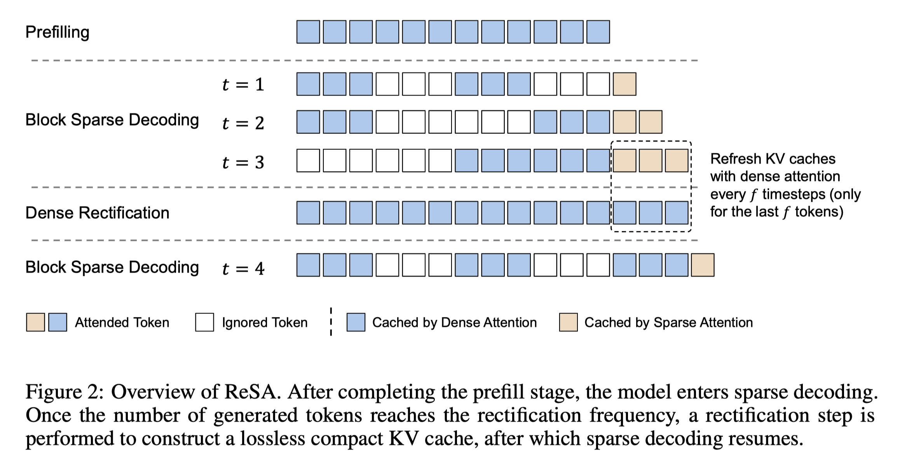         |  |  | [note](./notes/2025/ReSA/note.md)     |

<b>Genghan Zhang</b>
 

|    | meta                              | ttttttttttttttttttttttttttttttitle                                                                                   | ccccccccccccccccccover                                         | Publish                                                    | codeeeee                                                                           | note                              |
|---:|:----------------------------------|:---------------------------------------------------------------------------------------------------------------------|:---------------------------------------------------------------|:-----------------------------------------------------------|:-----------------------------------------------------------------------------------|:----------------------------------|
|  0 | [CATS](./meta/2024/CATS.prototxt) | [CATS: Contextually-Aware Thresholding for Sparsity in Large Language Models](http://arxiv.org/abs/2404.08763v4)     |  |    |  | [note](./notes/2024/CATS/note.md) |
|  1 | [MoA](./meta/2024/MoA.prototxt)   | [MoA: Mixture of Sparse Attention for Automatic Large Language Model Compression](http://arxiv.org/abs/2406.14909v2) |    |  |              | [note](./notes/2024/MoA/note.md)  |

<b>Gongfan Fang</b>
 

|    | meta                                          | ttttttttttttttttttttttttttttttitle                                                                         | ccccccccccccccccccover                                                | Publish                                                    | codeeeee                                                                     | note                                    |
|---:|:----------------------------------------------|:-----------------------------------------------------------------------------------------------------------|:----------------------------------------------------------------------|:-----------------------------------------------------------|:-----------------------------------------------------------------------------|:----------------------------------------|
|  0 | [LLM-Pruner](./meta/2023/LLM-Pruner.prototxt) | [LLM-Pruner: On the Structural Pruning of Large Language Models](http://arxiv.org/abs/2305.11627v3)        |  |  |  | [note](./notes/2023/LLM-Pruner/note.md) |
|  1 | [MaskLLM](./meta/2024/MaskLLM.prototxt)       | [MaskLLM: Learnable Semi-Structured Sparsity for Large Language Models](http://arxiv.org/abs/2409.17481v1) |   |  |      | [note](./notes/2024/MaskLLM/note.md)    |

<b>Guangbo Hao</b>
 

|    | meta                                            | ttttttttttttttttttttttttttttttitle                                                                                      | ccccccccccccccccccover                                                | Publish                                                    | codeeeee                                                                          | note                                     |
|---:|:------------------------------------------------|:------------------------------------------------------------------------------------------------------------------------|:----------------------------------------------------------------------|:-----------------------------------------------------------|:----------------------------------------------------------------------------------|:-----------------------------------------|
|  0 | [DeepSeek-V2](./meta/2024/DeepSeek-V2.prototxt) | [DeepSeek-V2: A Strong, Economical, and Efficient Mixture-of-Experts Language Model](http://arxiv.org/abs/2405.04434v5) |  |  |  | [note](./notes/2024/DeepSeek-V2/note.md) |
|  1 | [DeepSeek-V3](./meta/2024/DeepSeek-V3.prototxt) | [DeepSeek-V3 Technical Report](http://arxiv.org/abs/2412.19437v1)                                                       |  |  |  | [note](./notes/2024/DeepSeek-V3/note.md) |
|  2 | [DeepSeek-R1](./meta/2025/DeepSeek-R1.prototxt) | [DeepSeek-R1: Incentivizing Reasoning Capability in LLMs via Reinforcement Learning](http://arxiv.org/abs/2501.12948v1) |  |  |  | [note](./notes/2025/DeepSeek-R1/note.md) |

<b>Guangxuan Xiao</b>
 

|    | meta                                                | ttttttttttttttttttttttttttttttitle                                                                                         | ccccccccccccccccccover                                                         | Publish                                                    | codeeeee                                                                            | note                                       |
|---:|:----------------------------------------------------|:---------------------------------------------------------------------------------------------------------------------------|:-------------------------------------------------------------------------------|:-----------------------------------------------------------|:------------------------------------------------------------------------------------|:-------------------------------------------|
|  0 | [streaming-llm](./meta/2024/streaming-llm.prototxt) | [Efficient Streaming Language Models with Attention Sinks](http://arxiv.org/abs/2309.17453v4)                              |        |     |  | [note](./notes/2024/streaming-llm/note.md) |
|  1 | [Quest](./meta/2024/Quest.prototxt)                 | [Quest: Query-Aware Sparsity for Efficient Long-Context LLM Inference](http://arxiv.org/abs/2406.10774)                    |                |     |          | [note](./notes/2024/Quest/note.md)         |
|  2 | [DuoAttention](./meta/2024/DuoAttention.prototxt)   | [DuoAttention: Efficient Long-Context LLM Inference with Retrieval and Streaming Heads](http://arxiv.org/abs/2410.10819v1) |  |  |  | [note](./notes/2024/DuoAttention/note.md)  |
|  3 | [QServe](./meta/2024/QServer.prototxt)              | [QServe: W4A8KV4 Quantization and System Co-design for Efficient LLM Serving](http://arxiv.org/abs/2405.04532v2)           |                                                                                |  | [Pytorch](https://hanlab.mit.edu/projects/qserve)                                   | [note](./notes/2024/QServer/note.md)       |
|  4 | [LServer](./meta/2025/LServer.prototxt)             | [LServe: Efficient Long-sequence LLM Serving with Unified Sparse Attention](http://arxiv.org/abs/2502.14866v1)             |               |  |      | [note](./notes/2025/LServer/note.md)       |
|  5 | [XAttention](./meta/2025/XAttention.prototxt)       | [XAttention: Block Sparse Attention with Antidiagonal Scoring](http://arxiv.org/abs/2503.16428v1)                          |            |  |    | [note](./notes/2025/XAttention/note.md)    |

<b>Guanting Chen</b>
 

|    | meta                                            | ttttttttttttttttttttttttttttttitle                                                                                      | ccccccccccccccccccover                                                | Publish                                                    | codeeeee                                                                          | note                                     |
|---:|:------------------------------------------------|:------------------------------------------------------------------------------------------------------------------------|:----------------------------------------------------------------------|:-----------------------------------------------------------|:----------------------------------------------------------------------------------|:-----------------------------------------|
|  0 | [DeepSeek-V2](./meta/2024/DeepSeek-V2.prototxt) | [DeepSeek-V2: A Strong, Economical, and Efficient Mixture-of-Experts Language Model](http://arxiv.org/abs/2405.04434v5) |  |  |  | [note](./notes/2024/DeepSeek-V2/note.md) |
|  1 | [DeepSeek-V3](./meta/2024/DeepSeek-V3.prototxt) | [DeepSeek-V3 Technical Report](http://arxiv.org/abs/2412.19437v1)                                                       |  |  |  | [note](./notes/2024/DeepSeek-V3/note.md) |
|  2 | [DeepSeek-R1](./meta/2025/DeepSeek-R1.prototxt) | [DeepSeek-R1: Incentivizing Reasoning Capability in LLMs via Reinforcement Learning](http://arxiv.org/abs/2501.12948v1) |  |  |  | [note](./notes/2025/DeepSeek-R1/note.md) |

<b>Guohao Dai</b>
 

|    | meta                                  | ttttttttttttttttttttttttttttttitle                                                                                      | ccccccccccccccccccover                                                           | Publish                                                    | codeeeee                                                                     | note                                  |
|---:|:--------------------------------------|:------------------------------------------------------------------------------------------------------------------------|:---------------------------------------------------------------------------------|:-----------------------------------------------------------|:-----------------------------------------------------------------------------|:--------------------------------------|
|  0 | [m](./meta/2024/DHIB73MC.prototxt)    | [A Survey on Efficient Inference for Large Language Models](http://arxiv.org/abs/2404.14294v2)                          |  |  |                                                                              | [note](./notes/2024/DHIB73MC/note.md) |
|  1 | [MoA](./meta/2024/MoA.prototxt)       | [MoA: Mixture of Sparse Attention for Automatic Large Language Model Compression](http://arxiv.org/abs/2406.14909v2)    |                      |  |        | [note](./notes/2024/MoA/note.md)      |
|  2 | [SpecEE](./meta/2025/SpecEE.prototxt) | [SpecEE: Accelerating Large Language Model Inference with Speculative Early Exiting](http://arxiv.org/abs/2504.08850v1) |                  |   |  | [note](./notes/2025/SpecEE/note.md)   |

<b>Guowei Li</b>
 

|    | meta                                            | ttttttttttttttttttttttttttttttitle                                                                                      | ccccccccccccccccccover                                                | Publish                                                    | codeeeee                                                                          | note                                     |
|---:|:------------------------------------------------|:------------------------------------------------------------------------------------------------------------------------|:----------------------------------------------------------------------|:-----------------------------------------------------------|:----------------------------------------------------------------------------------|:-----------------------------------------|
|  0 | [DeepSeek-V2](./meta/2024/DeepSeek-V2.prototxt) | [DeepSeek-V2: A Strong, Economical, and Efficient Mixture-of-Experts Language Model](http://arxiv.org/abs/2405.04434v5) |  |  |  | [note](./notes/2024/DeepSeek-V2/note.md) |
|  1 | [DeepSeek-V3](./meta/2024/DeepSeek-V3.prototxt) | [DeepSeek-V3 Technical Report](http://arxiv.org/abs/2412.19437v1)                                                       |  |  |  | [note](./notes/2024/DeepSeek-V3/note.md) |
|  2 | [DeepSeek-R1](./meta/2025/DeepSeek-R1.prototxt) | [DeepSeek-R1: Incentivizing Reasoning Capability in LLMs via Reinforcement Learning](http://arxiv.org/abs/2501.12948v1) |  |  |  | [note](./notes/2025/DeepSeek-R1/note.md) |

<b>H. Zhang</b>
 

|    | meta                                            | ttttttttttttttttttttttttttttttitle                                                                                      | ccccccccccccccccccover                                                | Publish                                                    | codeeeee                                                                          | note                                     |
|---:|:------------------------------------------------|:------------------------------------------------------------------------------------------------------------------------|:----------------------------------------------------------------------|:-----------------------------------------------------------|:----------------------------------------------------------------------------------|:-----------------------------------------|
|  0 | [DeepSeek-V2](./meta/2024/DeepSeek-V2.prototxt) | [DeepSeek-V2: A Strong, Economical, and Efficient Mixture-of-Experts Language Model](http://arxiv.org/abs/2405.04434v5) |  |  |  | [note](./notes/2024/DeepSeek-V2/note.md) |
|  1 | [DeepSeek-V3](./meta/2024/DeepSeek-V3.prototxt) | [DeepSeek-V3 Technical Report](http://arxiv.org/abs/2412.19437v1)                                                       |  |  |  | [note](./notes/2024/DeepSeek-V3/note.md) |
|  2 | [DeepSeek-R1](./meta/2025/DeepSeek-R1.prototxt) | [DeepSeek-R1: Incentivizing Reasoning Capability in LLMs via Reinforcement Learning](http://arxiv.org/abs/2501.12948v1) |  |  |  | [note](./notes/2025/DeepSeek-R1/note.md) |

<b>Hai Zhao</b>
 

|    | meta                               | ttttttttttttttttttttttttttttttitle                                                                                   | ccccccccccccccccccover                                                 | Publish                                                  | codeeeee                                                                                | note                                  |
|---:|:-----------------------------------|:---------------------------------------------------------------------------------------------------------------------|:-----------------------------------------------------------------------|:---------------------------------------------------------|:----------------------------------------------------------------------------------------|:--------------------------------------|
|  0 | [m](./meta/2024/JSHWEV0S.prototxt) | [Keep the Cost Down: A Review on Methods to Optimize LLM' s KV-Cache Consumption](http://arxiv.org/abs/2407.18003v3) |  |  |  | [note](./notes/2024/JSHWEV0S/note.md) |
|  1 | [SIFT](./meta/2024/SIFT.prototxt)  | [Sparse is Enough in Fine-tuning Pre-trained Large Language Models](http://arxiv.org/abs/2312.11875v3)               |                                                                        |   |                   | [note](./notes/2024/SIFT/note.md)     |

<b>Haibo Chen</b>
 

|    | meta                                              | ttttttttttttttttttttttttttttttitle                                                                                  | ccccccccccccccccccover   | Publish                                                    | codeeeee                                                                        | note                                      |
|---:|:--------------------------------------------------|:--------------------------------------------------------------------------------------------------------------------|:-------------------------|:-----------------------------------------------------------|:--------------------------------------------------------------------------------|:------------------------------------------|
|  0 | [PowerInfer](./meta/2023/PowerInfer.prototxt)     | [PowerInfer: Fast Large Language Model Serving with a Consumer-grade GPU](http://arxiv.org/abs/2312.12456v1)        |                          |  |  | [note](./notes/2023/PowerInfer/note.md)   |
|  1 | [PowerInfer-2](./meta/2024/PowerInfer-2.prototxt) | [PowerInfer-2: Fast Large Language Model Inference on a Smartphone](http://arxiv.org/abs/2406.06282v2)              |                          |  | [Website](https://powerinfer.ai/v2/)                                            | [note](./notes/2024/PowerInfer-2/note.md) |
|  2 | [Turbo Sparse](./meta/2024/TurboSparse.prototxt)  | [Turbo Sparse: Achieving LLM SOTA Performance with Minimal Activated Parameters](http://arxiv.org/abs/2406.05955v2) |                          |  | [Pytorch](https://huggingface.co/PowerInfer)                                    | [note](./notes/2024/TurboSparse/note.md)  |

<b>Han Bao</b>
 

|    | meta                                            | ttttttttttttttttttttttttttttttitle                                                                                      | ccccccccccccccccccover                                                | Publish                                                    | codeeeee                                                                          | note                                     |
|---:|:------------------------------------------------|:------------------------------------------------------------------------------------------------------------------------|:----------------------------------------------------------------------|:-----------------------------------------------------------|:----------------------------------------------------------------------------------|:-----------------------------------------|
|  0 | [m](./meta/2024/0Y41U1N2.prototxt)              | [Beyond 2:4: exploring V:N:M sparsity for efficient transformer inference on GPUs](http://arxiv.org/abs/2410.16135v1)   |    |  |                                                                                   | [note](./notes/2024/0Y41U1N2/note.md)    |
|  1 | [DeepSeek-V3](./meta/2024/DeepSeek-V3.prototxt) | [DeepSeek-V3 Technical Report](http://arxiv.org/abs/2412.19437v1)                                                       |  |  |  | [note](./notes/2024/DeepSeek-V3/note.md) |
|  2 | [DeepSeek-R1](./meta/2025/DeepSeek-R1.prototxt) | [DeepSeek-R1: Incentivizing Reasoning Capability in LLMs via Reinforcement Learning](http://arxiv.org/abs/2501.12948v1) |  |  |  | [note](./notes/2025/DeepSeek-R1/note.md) |

<b>Hanshi Sun</b>
 

|    | meta                                      | ttttttttttttttttttttttttttttttitle                                                                                               | ccccccccccccccccccover                                                 | Publish                                                    | codeeeee                                                                     | note                                  |
|---:|:------------------------------------------|:---------------------------------------------------------------------------------------------------------------------------------|:-----------------------------------------------------------------------|:-----------------------------------------------------------|:-----------------------------------------------------------------------------|:--------------------------------------|
|  0 | [ShadowKV](./meta/2024/ShadowKV.prototxt) | [ShadowKV: KV Cache in Shadows for High-Throughput Long-Context LLM Inference](http://arxiv.org/abs/2410.21465v1)                |  |  |  | [note](./notes/2024/ShadowKV/note.md) |
|  1 | [R-KV](./meta/2025/R-KV.prototxt)         | [R-KV: Redundancy-aware KV Cache Compression for Training-Free Reasoning Models Acceleration](http://arxiv.org/abs/2505.24133v2) |          |  |      | [note](./notes/2025/R-KV/note.md)     |

<b>Hanwei Xu</b>
 

|    | meta                                            | ttttttttttttttttttttttttttttttitle                                                                                      | ccccccccccccccccccover                                                | Publish                                                    | codeeeee                                                                          | note                                     |
|---:|:------------------------------------------------|:------------------------------------------------------------------------------------------------------------------------|:----------------------------------------------------------------------|:-----------------------------------------------------------|:----------------------------------------------------------------------------------|:-----------------------------------------|
|  0 | [DeepSeek-V2](./meta/2024/DeepSeek-V2.prototxt) | [DeepSeek-V2: A Strong, Economical, and Efficient Mixture-of-Experts Language Model](http://arxiv.org/abs/2405.04434v5) |  |  |  | [note](./notes/2024/DeepSeek-V2/note.md) |
|  1 | [DeepSeek-V3](./meta/2024/DeepSeek-V3.prototxt) | [DeepSeek-V3 Technical Report](http://arxiv.org/abs/2412.19437v1)                                                       |  |  |  | [note](./notes/2024/DeepSeek-V3/note.md) |
|  2 | [DeepSeek-R1](./meta/2025/DeepSeek-R1.prototxt) | [DeepSeek-R1: Incentivizing Reasoning Capability in LLMs via Reinforcement Learning](http://arxiv.org/abs/2501.12948v1) |  |  |  | [note](./notes/2025/DeepSeek-R1/note.md) |

<b>Haocheng Wang</b>
 

|    | meta                                            | ttttttttttttttttttttttttttttttitle                                                                                      | ccccccccccccccccccover                                                | Publish                                                    | codeeeee                                                                          | note                                     |
|---:|:------------------------------------------------|:------------------------------------------------------------------------------------------------------------------------|:----------------------------------------------------------------------|:-----------------------------------------------------------|:----------------------------------------------------------------------------------|:-----------------------------------------|
|  0 | [DeepSeek-V3](./meta/2024/DeepSeek-V3.prototxt) | [DeepSeek-V3 Technical Report](http://arxiv.org/abs/2412.19437v1)                                                       |  |  |  | [note](./notes/2024/DeepSeek-V3/note.md) |
|  1 | [DeepSeek-R1](./meta/2025/DeepSeek-R1.prototxt) | [DeepSeek-R1: Incentivizing Reasoning Capability in LLMs via Reinforcement Learning](http://arxiv.org/abs/2501.12948v1) |  |  |  | [note](./notes/2025/DeepSeek-R1/note.md) |

<b>Haocheng Xi</b>
 

|    | meta                                          | ttttttttttttttttttttttttttttttitle                                                                          | ccccccccccccccccccover                                               | Publish                                                    | codeeeee                                                                                      | note                                    |
|---:|:----------------------------------------------|:------------------------------------------------------------------------------------------------------------|:---------------------------------------------------------------------|:-----------------------------------------------------------|:----------------------------------------------------------------------------------------------|:----------------------------------------|
|  0 | [m](./meta/2023/23LQ9SVH.prototxt)            | [Training Transformers with 4-bit Integers](https://arxiv.org/abs//2306.11987)                              |                                                                      |  |  |                                         |
|  1 | [SpargeAttn](./meta/2025/SpargeAttn.prototxt) | [SpargeAttn: Accurate Sparse Attention Accelerating Any Model Inference](http://arxiv.org/abs/2502.18137v1) |  |  |                    | [note](./notes/2025/SpargeAttn/note.md) |

<b>Haofeng Huang</b>
 

|    | meta                                          | ttttttttttttttttttttttttttttttitle                                                                                   | ccccccccccccccccccover                                               | Publish                                                    | codeeeee                                                                          | note                                    |
|---:|:----------------------------------------------|:---------------------------------------------------------------------------------------------------------------------|:---------------------------------------------------------------------|:-----------------------------------------------------------|:----------------------------------------------------------------------------------|:----------------------------------------|
|  0 | [MoA](./meta/2024/MoA.prototxt)               | [MoA: Mixture of Sparse Attention for Automatic Large Language Model Compression](http://arxiv.org/abs/2406.14909v2) |          |  |             | [note](./notes/2024/MoA/note.md)        |
|  1 | [SpargeAttn](./meta/2025/SpargeAttn.prototxt) | [SpargeAttn: Accurate Sparse Attention Accelerating Any Model Inference](http://arxiv.org/abs/2502.18137v1)          |  |  |        | [note](./notes/2025/SpargeAttn/note.md) |
|  2 | [XAttention](./meta/2025/XAttention.prototxt) | [XAttention: Block Sparse Attention with Antidiagonal Scoring](http://arxiv.org/abs/2503.16428v1)                    |  |  |  | [note](./notes/2025/XAttention/note.md) |

<b>Haoli Bai</b>
 

|    | meta                                            | ttttttttttttttttttttttttttttttitle                                                                                               | ccccccccccccccccccover                                                | Publish                                                    | codeeeee                                                                                                                    | note                                     |
|---:|:------------------------------------------------|:---------------------------------------------------------------------------------------------------------------------------------|:----------------------------------------------------------------------|:-----------------------------------------------------------|:----------------------------------------------------------------------------------------------------------------------------|:-----------------------------------------|
|  0 | [RIA](./meta/2024/IA8CS3VH.prototxt)            | [Plug-and-Play: An Efficient Post-training Pruning Method for Large Language Models](https://openreview.net/forum?id=Tr0lPx9woF) |      |     |  |                                          |
|  1 | [LinearPatch](./meta/2025/LinearPatch.prototxt) | [A Simple Linear Patch Revives Layer-Pruned Large Language Models](http://arxiv.org/abs/2505.24680v1)                            | 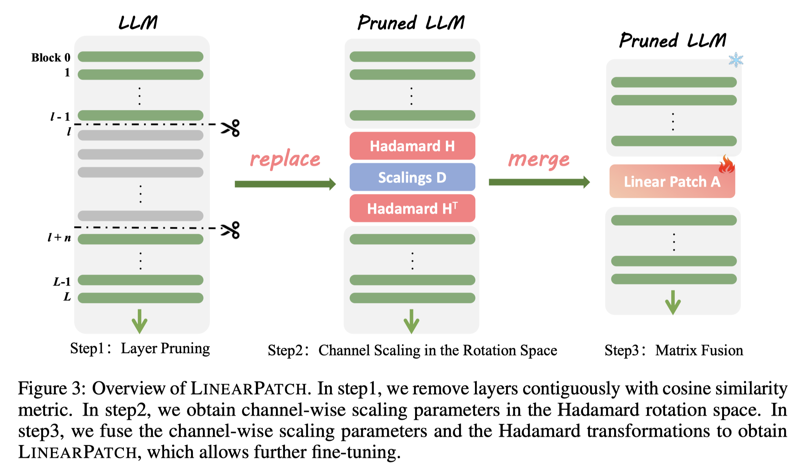 |  |                                                                                                                             | [note](./notes/2025/LinearPatch/note.md) |
|  2 | [FreqKV](./meta/2025/FreqKV.prototxt)           | [FreqKV: Frequency Domain Key-Value Compression for Efficient Context Window Extension](http://arxiv.org/abs/2505.00570v2)       |       |  |                                                                                                                             | [note](./notes/2025/FreqKV/note.md)      |

<b>Haotian Tang</b>
 

|    | meta                                              | ttttttttttttttttttttttttttttttitle                                                                                                                                           | ccccccccccccccccccover                                                         | Publish                                                           | codeeeee                                                                            | note                                      |
|---:|:--------------------------------------------------|:-----------------------------------------------------------------------------------------------------------------------------------------------------------------------------|:-------------------------------------------------------------------------------|:------------------------------------------------------------------|:------------------------------------------------------------------------------------|:------------------------------------------|
|  0 | [TorchSparse++](./meta/2023/TorchSparse.prototxt) | [TorchSparse++: Efficient Point Cloud Engine](https://openaccess.thecvf.com/content/CVPR2023W/WAD/papers/Tang_TorchSparse_Efficient_Point_Cloud_Engine_CVPRW_2023_paper.pdf) |                                                                                |  |    |                                           |
|  1 | [AWQ](./meta/2024/awq.prototxt)                   | [AWQ: Activation-aware Weight Quantization for LLM Compression and Acceleration](https://arxiv.org/abs/2306.00978)                                                           |                                                                                |         |        |                                           |
|  2 | [DuoAttention](./meta/2024/DuoAttention.prototxt) | [DuoAttention: Efficient Long-Context LLM Inference with Retrieval and Streaming Heads](http://arxiv.org/abs/2410.10819v1)                                                   |  |         |  | [note](./notes/2024/DuoAttention/note.md) |
|  3 | [QServe](./meta/2024/QServer.prototxt)            | [QServe: W4A8KV4 Quantization and System Co-design for Efficient LLM Serving](http://arxiv.org/abs/2405.04532v2)                                                             |                                                                                |         | [Pytorch](https://hanlab.mit.edu/projects/qserve)                                   | [note](./notes/2024/QServer/note.md)      |
|  4 | [LServer](./meta/2025/LServer.prototxt)           | [LServe: Efficient Long-sequence LLM Serving with Unified Sparse Attention](http://arxiv.org/abs/2502.14866v1)                                                               |               |         |      | [note](./notes/2025/LServer/note.md)      |

<b>Haotong Xie</b>
 

|    | meta                                             | ttttttttttttttttttttttttttttttitle                                                                                  | ccccccccccccccccccover   | Publish                                                    | codeeeee                                                                        | note                                     |
|---:|:-------------------------------------------------|:--------------------------------------------------------------------------------------------------------------------|:-------------------------|:-----------------------------------------------------------|:--------------------------------------------------------------------------------|:-----------------------------------------|
|  0 | [PowerInfer](./meta/2023/PowerInfer.prototxt)    | [PowerInfer: Fast Large Language Model Serving with a Consumer-grade GPU](http://arxiv.org/abs/2312.12456v1)        |                          |  |  | [note](./notes/2023/PowerInfer/note.md)  |
|  1 | [Turbo Sparse](./meta/2024/TurboSparse.prototxt) | [Turbo Sparse: Achieving LLM SOTA Performance with Minimal Activated Parameters](http://arxiv.org/abs/2406.05955v2) |                          |  | [Pytorch](https://huggingface.co/PowerInfer)                                    | [note](./notes/2024/TurboSparse/note.md) |

<b>Haowei Zhang</b>
 

|    | meta                                            | ttttttttttttttttttttttttttttttitle                                                                                      | ccccccccccccccccccover                                                | Publish                                                    | codeeeee                                                                          | note                                     |
|---:|:------------------------------------------------|:------------------------------------------------------------------------------------------------------------------------|:----------------------------------------------------------------------|:-----------------------------------------------------------|:----------------------------------------------------------------------------------|:-----------------------------------------|
|  0 | [DeepSeek-V2](./meta/2024/DeepSeek-V2.prototxt) | [DeepSeek-V2: A Strong, Economical, and Efficient Mixture-of-Experts Language Model](http://arxiv.org/abs/2405.04434v5) |  |  |  | [note](./notes/2024/DeepSeek-V2/note.md) |
|  1 | [DeepSeek-V3](./meta/2024/DeepSeek-V3.prototxt) | [DeepSeek-V3 Technical Report](http://arxiv.org/abs/2412.19437v1)                                                       |  |  |  | [note](./notes/2024/DeepSeek-V3/note.md) |
|  2 | [DeepSeek-R1](./meta/2025/DeepSeek-R1.prototxt) | [DeepSeek-R1: Incentivizing Reasoning Capability in LLMs via Reinforcement Learning](http://arxiv.org/abs/2501.12948v1) |  |  |  | [note](./notes/2025/DeepSeek-R1/note.md) |

<b>Hayden Kwok-Hay So</b>
 

|    | meta                                                    | ttttttttttttttttttttttttttttttitle                                                                   | ccccccccccccccccccover                                                           | Publish                                                    | codeeeee                                                                          | note                                         |
|---:|:--------------------------------------------------------|:-----------------------------------------------------------------------------------------------------|:---------------------------------------------------------------------------------|:-----------------------------------------------------------|:----------------------------------------------------------------------------------|:---------------------------------------------|
|  0 | [SeerAttention](./meta/2024/SeerAttention.prototxt)     | [SeerAttention: Learning Intrinsic Sparse Attention in Your LLMs](http://arxiv.org/abs/2410.13276v2) |  |  |  | [note](./notes/2024/SeerAttention/note.md)   |
|  1 | [SeerAttention-R](./meta/2025/SeerAttention-R.prototxt) | [SeerAttention-R: Sparse Attention Adaptation for Long Reasoning](http://arxiv.org/abs/2506.08889v1) |         |  |  | [note](./notes/2025/SeerAttention-R/note.md) |

<b>Honghui Ding</b>
 

|    | meta                                            | ttttttttttttttttttttttttttttttitle                                                                                      | ccccccccccccccccccover                                                | Publish                                                    | codeeeee                                                                          | note                                     |
|---:|:------------------------------------------------|:------------------------------------------------------------------------------------------------------------------------|:----------------------------------------------------------------------|:-----------------------------------------------------------|:----------------------------------------------------------------------------------|:-----------------------------------------|
|  0 | [DeepSeek-V2](./meta/2024/DeepSeek-V2.prototxt) | [DeepSeek-V2: A Strong, Economical, and Efficient Mixture-of-Experts Language Model](http://arxiv.org/abs/2405.04434v5) |  |  |  | [note](./notes/2024/DeepSeek-V2/note.md) |
|  1 | [DeepSeek-V3](./meta/2024/DeepSeek-V3.prototxt) | [DeepSeek-V3 Technical Report](http://arxiv.org/abs/2412.19437v1)                                                       |  |  |  | [note](./notes/2024/DeepSeek-V3/note.md) |
|  2 | [DeepSeek-R1](./meta/2025/DeepSeek-R1.prototxt) | [DeepSeek-R1: Incentivizing Reasoning Capability in LLMs via Reinforcement Learning](http://arxiv.org/abs/2501.12948v1) |  |  |  | [note](./notes/2025/DeepSeek-R1/note.md) |

<b>Hongsheng Li</b>
 

|    | meta                                  | ttttttttttttttttttttttttttttttitle                                                                                     | ccccccccccccccccccover                                             | Publish                                                 | codeeeee                                                                      | note                             |
|---:|:--------------------------------------|:-----------------------------------------------------------------------------------------------------------------------|:-------------------------------------------------------------------|:--------------------------------------------------------|:------------------------------------------------------------------------------|:---------------------------------|
|  0 | [SR-STE](./meta/2021/sr-ste.prototxt) | [Learning N:M Fine-grained Structured Sparse Neural Networks From Scratch](https://openreview.net/forum?id=K9bw7vqp_s) |  |  |  |                                  |
|  1 | [SPP](./meta/2024/SPP.prototxt)       | [SPP: Sparsity-Preserved Parameter-Efficient Fine-Tuning for Large Language Models](http://arxiv.org/abs/2405.16057v1) |        |  |      | [note](./notes/2024/SPP/note.md) |

<b>Huajian Xin</b>
 

|    | meta                                            | ttttttttttttttttttttttttttttttitle                                                                                      | ccccccccccccccccccover                                                | Publish                                                    | codeeeee                                                                          | note                                     |
|---:|:------------------------------------------------|:------------------------------------------------------------------------------------------------------------------------|:----------------------------------------------------------------------|:-----------------------------------------------------------|:----------------------------------------------------------------------------------|:-----------------------------------------|
|  0 | [DeepSeek-V2](./meta/2024/DeepSeek-V2.prototxt) | [DeepSeek-V2: A Strong, Economical, and Efficient Mixture-of-Experts Language Model](http://arxiv.org/abs/2405.04434v5) |  |  |  | [note](./notes/2024/DeepSeek-V2/note.md) |
|  1 | [DeepSeek-V3](./meta/2024/DeepSeek-V3.prototxt) | [DeepSeek-V3 Technical Report](http://arxiv.org/abs/2412.19437v1)                                                       |  |  |  | [note](./notes/2024/DeepSeek-V3/note.md) |
|  2 | [DeepSeek-R1](./meta/2025/DeepSeek-R1.prototxt) | [DeepSeek-R1: Incentivizing Reasoning Capability in LLMs via Reinforcement Learning](http://arxiv.org/abs/2501.12948v1) |  |  |  | [note](./notes/2025/DeepSeek-R1/note.md) |

<b>Huazuo Gao</b>
 

|    | meta                                            | ttttttttttttttttttttttttttttttitle                                                                                             | ccccccccccccccccccover                                                | Publish                                                    | codeeeee                                                                           | note                                     |
|---:|:------------------------------------------------|:-------------------------------------------------------------------------------------------------------------------------------|:----------------------------------------------------------------------|:-----------------------------------------------------------|:-----------------------------------------------------------------------------------|:-----------------------------------------|
|  0 | [DeepSeek-V2](./meta/2024/DeepSeek-V2.prototxt) | [DeepSeek-V2: A Strong, Economical, and Efficient Mixture-of-Experts Language Model](http://arxiv.org/abs/2405.04434v5)        |  |  |   | [note](./notes/2024/DeepSeek-V2/note.md) |
|  1 | [DeepSeek-V3](./meta/2024/DeepSeek-V3.prototxt) | [DeepSeek-V3 Technical Report](http://arxiv.org/abs/2412.19437v1)                                                              |  |  |   | [note](./notes/2024/DeepSeek-V3/note.md) |
|  2 | [DeepSeekMoE](./meta/2024/DeepSeekMoE.prototxt) | [DeepSeekMoE: Towards Ultimate Expert Specialization in Mixture-of-Experts Language Models](http://arxiv.org/abs/2401.06066v1) |  |  |  | [note](./notes/2024/DeepSeekMoE/note.md) |
|  3 | [DeepSeek-R1](./meta/2025/DeepSeek-R1.prototxt) | [DeepSeek-R1: Incentivizing Reasoning Capability in LLMs via Reinforcement Learning](http://arxiv.org/abs/2501.12948v1)        |  |  |   | [note](./notes/2025/DeepSeek-R1/note.md) |
|  4 | [NSA](./meta/2025/NSA.prototxt)                 | [Native Sparse Attention: Hardware-Aligned and Natively Trainable Sparse Attention](http://arxiv.org/abs/2502.11089v1)         |          |  |                                                                                    | [note](./notes/2025/NSA/note.md)         |

<b>Hui Li</b>
 

|    | meta                                            | ttttttttttttttttttttttttttttttitle                                                                                      | ccccccccccccccccccover                                                | Publish                                                    | codeeeee                                                                          | note                                     |
|---:|:------------------------------------------------|:------------------------------------------------------------------------------------------------------------------------|:----------------------------------------------------------------------|:-----------------------------------------------------------|:----------------------------------------------------------------------------------|:-----------------------------------------|
|  0 | [DeepSeek-V2](./meta/2024/DeepSeek-V2.prototxt) | [DeepSeek-V2: A Strong, Economical, and Efficient Mixture-of-Experts Language Model](http://arxiv.org/abs/2405.04434v5) |  |  |  | [note](./notes/2024/DeepSeek-V2/note.md) |
|  1 | [DeepSeek-V3](./meta/2024/DeepSeek-V3.prototxt) | [DeepSeek-V3 Technical Report](http://arxiv.org/abs/2412.19437v1)                                                       |  |  |  | [note](./notes/2024/DeepSeek-V3/note.md) |
|  2 | [DeepSeek-R1](./meta/2025/DeepSeek-R1.prototxt) | [DeepSeek-R1: Incentivizing Reasoning Capability in LLMs via Reinforcement Learning](http://arxiv.org/abs/2501.12948v1) |  |  |  | [note](./notes/2025/DeepSeek-R1/note.md) |

<b>Hui Qu</b>
 

|    | meta                                            | ttttttttttttttttttttttttttttttitle                                                                                      | ccccccccccccccccccover                                                | Publish                                                    | codeeeee                                                                          | note                                     |
|---:|:------------------------------------------------|:------------------------------------------------------------------------------------------------------------------------|:----------------------------------------------------------------------|:-----------------------------------------------------------|:----------------------------------------------------------------------------------|:-----------------------------------------|
|  0 | [DeepSeek-V2](./meta/2024/DeepSeek-V2.prototxt) | [DeepSeek-V2: A Strong, Economical, and Efficient Mixture-of-Experts Language Model](http://arxiv.org/abs/2405.04434v5) |  |  |  | [note](./notes/2024/DeepSeek-V2/note.md) |
|  1 | [DeepSeek-V3](./meta/2024/DeepSeek-V3.prototxt) | [DeepSeek-V3 Technical Report](http://arxiv.org/abs/2412.19437v1)                                                       |  |  |  | [note](./notes/2024/DeepSeek-V3/note.md) |
|  2 | [DeepSeek-R1](./meta/2025/DeepSeek-R1.prototxt) | [DeepSeek-R1: Incentivizing Reasoning Capability in LLMs via Reinforcement Learning](http://arxiv.org/abs/2501.12948v1) |  |  |  | [note](./notes/2025/DeepSeek-R1/note.md) |

<b>Huiqiang Jiang</b>
 

|    | meta                                          | ttttttttttttttttttttttttttttttitle                                                                                               | ccccccccccccccccccover                                                            | Publish                                                    | codeeeee                                                                       | note                                    |
|---:|:----------------------------------------------|:---------------------------------------------------------------------------------------------------------------------------------|:----------------------------------------------------------------------------------|:-----------------------------------------------------------|:-------------------------------------------------------------------------------|:----------------------------------------|
|  0 | [MInference](./meta/2024/MInference.prototxt) | [MInference 1.0: Accelerating Pre-filling for Long-Context LLMs via Dynamic Sparse Attention](http://arxiv.org/abs/2407.02490v1) |  |  |  | [note](./notes/2024/MInference/note.md) |
|  1 | [SCBench](./meta/2024/SCBench.prototxt)       | [SCBench: A KV Cache-Centric Analysis of Long-Context Methods](http://arxiv.org/abs/2412.10319v2)                                |                                                                                   |  |  | [note](./notes/2024/SCBench/note.md)    |

<b>Iman Mirzadeh</b>
 

|    | meta                                                  | ttttttttttttttttttttttttttttttitle                                                                              | ccccccccccccccccccover                                                          | Publish                                                       | codeeeee                                                                        | note                                        |
|---:|:------------------------------------------------------|:----------------------------------------------------------------------------------------------------------------|:--------------------------------------------------------------------------------|:--------------------------------------------------------------|:--------------------------------------------------------------------------------|:--------------------------------------------|
|  0 | [LLM in a flash](./meta/2023/LLM_in_a_flash.prototxt) | [LLM in a flash: Efficient Large Language Model Inference with Limited Memory](http://arxiv.org/abs/2312.11514) |      |     |                                                                                 | [note](./notes/2023/LLM_in_a_flash/note.md) |
|  1 | [ReLU Strikes Back](./meta/2024/HMR7HKFV.prototxt)    | [ReLU Strikes Back: Exploiting Activation Sparsity in Large Language Models](https://arxiv.org/abs/2310.04564)  |  |  |  |                                             |

<b>Ion Stoica</b>
 

|    | meta                                                   | ttttttttttttttttttttttttttttttitle                                                                                     | ccccccccccccccccccover                                                   | Publish                                                    | codeeeee                                                                           | note                                        |
|---:|:-------------------------------------------------------|:-----------------------------------------------------------------------------------------------------------------------|:-------------------------------------------------------------------------|:-----------------------------------------------------------|:-----------------------------------------------------------------------------------|:--------------------------------------------|
|  0 | [ActNN](./meta/2019/actnn.prototxt)                    | [ActNN: Reducing Training Memory Footprint via 2-Bit Activation Compressed Training](https://arxiv.org/abs/2104.14129) |                                                                          |     |             |                                             |
|  1 | [Paged Attention](./meta/2023/PagedAttention.prototxt) | [Efficient Memory Management for Large Language Model Serving with PagedAttention](http://arxiv.org/abs/2309.06180v1)  |  |   |         | [note](./notes/2023/PagedAttention/note.md) |
|  2 | [SGLang](./meta/2024/SGLang.prototxt)                  | [SGLang: Efficient Execution of Structured Language Model Programs](http://arxiv.org/abs/2312.07104v2)                 |          |  |        | [note](./notes/2024/SGLang/note.md)         |
|  3 | [DoubleSparsity](./meta/2024/DoubleSparsity.prototxt)  | [Post-Training Sparse Attention with Double Sparsity](http://arxiv.org/abs/2408.07092v2)                               |                                                                          |  |  | [note](./notes/2024/DoubleSparsity/note.md) |

<b>J. L. Cai</b>
 

|    | meta                                            | ttttttttttttttttttttttttttttttitle                                                                                      | ccccccccccccccccccover                                                | Publish                                                    | codeeeee                                                                          | note                                     |
|---:|:------------------------------------------------|:------------------------------------------------------------------------------------------------------------------------|:----------------------------------------------------------------------|:-----------------------------------------------------------|:----------------------------------------------------------------------------------|:-----------------------------------------|
|  0 | [DeepSeek-V2](./meta/2024/DeepSeek-V2.prototxt) | [DeepSeek-V2: A Strong, Economical, and Efficient Mixture-of-Experts Language Model](http://arxiv.org/abs/2405.04434v5) |  |  |  | [note](./notes/2024/DeepSeek-V2/note.md) |
|  1 | [DeepSeek-V3](./meta/2024/DeepSeek-V3.prototxt) | [DeepSeek-V3 Technical Report](http://arxiv.org/abs/2412.19437v1)                                                       |  |  |  | [note](./notes/2024/DeepSeek-V3/note.md) |
|  2 | [DeepSeek-R1](./meta/2025/DeepSeek-R1.prototxt) | [DeepSeek-R1: Incentivizing Reasoning Capability in LLMs via Reinforcement Learning](http://arxiv.org/abs/2501.12948v1) |  |  |  | [note](./notes/2025/DeepSeek-R1/note.md) |

<b>J. Zico Kolter</b>
 

|    | meta                                                            | ttttttttttttttttttttttttttttttitle                                                                   | ccccccccccccccccccover                                                               | Publish                                                    | codeeeee                                                                               | note                                             |
|---:|:----------------------------------------------------------------|:-----------------------------------------------------------------------------------------------------|:-------------------------------------------------------------------------------------|:-----------------------------------------------------------|:---------------------------------------------------------------------------------------|:-------------------------------------------------|
|  0 | [Wanda](./meta/2024/Wanda.prototxt)                             | [A Simple and Effective Pruning Approach for Large Language Models](http://arxiv.org/abs/2306.11695) |                      |     |                | [note](./notes/2024/Wanda/note.md)               |
|  1 | [massive-activations](./meta/2024/massive-activations.prototxt) | [Massive Activations in Large Language Models](http://arxiv.org/abs/2402.17762v2)                    |  |  |  | [note](./notes/2024/massive-activations/note.md) |

<b>Jan Kautz</b>
 

|    | meta                                      | ttttttttttttttttttttttttttttttitle                                                                         | ccccccccccccccccccover                                                 | Publish                                                    | codeeeee                                                                  | note                                  |
|---:|:------------------------------------------|:-----------------------------------------------------------------------------------------------------------|:-----------------------------------------------------------------------|:-----------------------------------------------------------|:--------------------------------------------------------------------------|:--------------------------------------|
|  0 | [MaskLLM](./meta/2024/MaskLLM.prototxt)   | [MaskLLM: Learnable Semi-Structured Sparsity for Large Language Models](http://arxiv.org/abs/2409.17481v1) |    |  |   | [note](./notes/2024/MaskLLM/note.md)  |
|  1 | [Minitron](./meta/2024/Minitron.prototxt) | [Compact Language Models via Pruning and Knowledge Distillation](https://arxiv.org/abs/2408.11796v2)       |  |  |  | [note](./notes/2024/Minitron/note.md) |

<b>Jason D. Lee</b>
 

|    | meta                               | ttttttttttttttttttttttttttttttitle                                                                                          | ccccccccccccccccccover   | Publish                                                    | codeeeee                                                                     | note                                  |
|---:|:-----------------------------------|:----------------------------------------------------------------------------------------------------------------------------|:-------------------------|:-----------------------------------------------------------|:-----------------------------------------------------------------------------|:--------------------------------------|
|  0 | [MeZO](./meta/2023/MeZO.prototxt)  | [Fine-Tuning Language Models with Just Forward Passes](http://arxiv.org/abs/2305.17333v3)                                   |                          |  |  | [note](./notes/2023/MeZO/note.md)     |
|  1 | [m](./meta/2024/SN1PK7EK.prototxt) | [Revisiting Zeroth-Order Optimization for Memory-Efficient LLM Fine-Tuning: A Benchmark](http://arxiv.org/abs/2402.11592v2) |                          |  |     | [note](./notes/2024/SN1PK7EK/note.md) |

<b>Jayashree Mohan</b>
 

|    | meta                                                | ttttttttttttttttttttttttttttttitle                                                                                 | ccccccccccccccccccover                                                  | Publish                                                     | codeeeee                                                                       | note                                       |
|---:|:----------------------------------------------------|:-------------------------------------------------------------------------------------------------------------------|:------------------------------------------------------------------------|:------------------------------------------------------------|:-------------------------------------------------------------------------------|:-------------------------------------------|
|  0 | [POD-Attention](./meta/2025/POD-Attention.prototxt) | [POD-Attention: Unlocking Full Prefill-Decode Overlap for Faster LLM Inference](http://arxiv.org/abs/2410.18038v2) |  |  |  | [note](./notes/2025/POD-Attention/note.md) |
|  1 | [vAttention](./meta/2025/vAttention.prototxt)       | [vAttention: Dynamic Memory Management for Serving LLMs without PagedAttention](http://arxiv.org/abs/2405.04437v3) |     |  |  | [note](./notes/2025/vAttention/note.md)    |

<b>Jeff Pool</b>
 

|    | meta                                    | ttttttttttttttttttttttttttttttitle                                                                                                     | ccccccccccccccccccover                                               | Publish                                                    | codeeeee                                                                 | note                                 |
|---:|:----------------------------------------|:---------------------------------------------------------------------------------------------------------------------------------------|:---------------------------------------------------------------------|:-----------------------------------------------------------|:-------------------------------------------------------------------------|:-------------------------------------|
|  0 | [m](./meta/2021/K7GSWQIC.prototxt)      | [Channel Permutations for N:M Sparsity](https://proceedings.neurips.cc/paper/2021/hash/6e8404c3b93a9527c8db241a1846599a-Abstract.html) |                                                                      |  |     |                                      |
|  1 | [MaskLLM](./meta/2024/MaskLLM.prototxt) | [MaskLLM: Learnable Semi-Structured Sparsity for Large Language Models](http://arxiv.org/abs/2409.17481v1)                             |  |  |  | [note](./notes/2024/MaskLLM/note.md) |

<b>Jiaming Tang</b>
 

|    | meta                                              | ttttttttttttttttttttttttttttttitle                                                                                         | ccccccccccccccccccover                                                         | Publish                                                    | codeeeee                                                                            | note                                      |
|---:|:--------------------------------------------------|:---------------------------------------------------------------------------------------------------------------------------|:-------------------------------------------------------------------------------|:-----------------------------------------------------------|:------------------------------------------------------------------------------------|:------------------------------------------|
|  0 | [Quest](./meta/2024/Quest.prototxt)               | [Quest: Query-Aware Sparsity for Efficient Long-Context LLM Inference](http://arxiv.org/abs/2406.10774)                    |                |     |          | [note](./notes/2024/Quest/note.md)        |
|  1 | [AWQ](./meta/2024/awq.prototxt)                   | [AWQ: Activation-aware Weight Quantization for LLM Compression and Acceleration](https://arxiv.org/abs/2306.00978)         |                                                                                |  |        |                                           |
|  2 | [DuoAttention](./meta/2024/DuoAttention.prototxt) | [DuoAttention: Efficient Long-Context LLM Inference with Retrieval and Streaming Heads](http://arxiv.org/abs/2410.10819v1) |  |  |  | [note](./notes/2024/DuoAttention/note.md) |
|  3 | [LServer](./meta/2025/LServer.prototxt)           | [LServe: Efficient Long-sequence LLM Serving with Unified Sparse Attention](http://arxiv.org/abs/2502.14866v1)             |               |  |      | [note](./notes/2025/LServer/note.md)      |

<b>Jiaming Xu</b>
 

|    | meta                                  | ttttttttttttttttttttttttttttttitle                                                                                      | ccccccccccccccccccover                                                           | Publish                                                    | codeeeee                                                                     | note                                  |
|---:|:--------------------------------------|:------------------------------------------------------------------------------------------------------------------------|:---------------------------------------------------------------------------------|:-----------------------------------------------------------|:-----------------------------------------------------------------------------|:--------------------------------------|
|  0 | [m](./meta/2024/DHIB73MC.prototxt)    | [A Survey on Efficient Inference for Large Language Models](http://arxiv.org/abs/2404.14294v2)                          |  |  |                                                                              | [note](./notes/2024/DHIB73MC/note.md) |
|  1 | [SpecEE](./meta/2025/SpecEE.prototxt) | [SpecEE: Accelerating Large Language Model Inference with Speculative Early Exiting](http://arxiv.org/abs/2504.08850v1) |                  |   |  | [note](./notes/2025/SpecEE/note.md)   |

<b>Jian Liang</b>
 

|    | meta                                            | ttttttttttttttttttttttttttttttitle                                                                                      | ccccccccccccccccccover                                                | Publish                                                    | codeeeee                                                                          | note                                     |
|---:|:------------------------------------------------|:------------------------------------------------------------------------------------------------------------------------|:----------------------------------------------------------------------|:-----------------------------------------------------------|:----------------------------------------------------------------------------------|:-----------------------------------------|
|  0 | [DeepSeek-V2](./meta/2024/DeepSeek-V2.prototxt) | [DeepSeek-V2: A Strong, Economical, and Efficient Mixture-of-Experts Language Model](http://arxiv.org/abs/2405.04434v5) |  |  |  | [note](./notes/2024/DeepSeek-V2/note.md) |
|  1 | [DeepSeek-V3](./meta/2024/DeepSeek-V3.prototxt) | [DeepSeek-V3 Technical Report](http://arxiv.org/abs/2412.19437v1)                                                       |  |  |  | [note](./notes/2024/DeepSeek-V3/note.md) |
|  2 | [DeepSeek-R1](./meta/2025/DeepSeek-R1.prototxt) | [DeepSeek-R1: Incentivizing Reasoning Capability in LLMs via Reinforcement Learning](http://arxiv.org/abs/2501.12948v1) |  |  |  | [note](./notes/2025/DeepSeek-R1/note.md) |

<b>Jianfei Chen</b>
 

|    | meta                                                                | ttttttttttttttttttttttttttttttitle                                                                                     | ccccccccccccccccccover                                                          | Publish                                                    | codeeeee                                                                                      | note                                               |
|---:|:--------------------------------------------------------------------|:-----------------------------------------------------------------------------------------------------------------------|:--------------------------------------------------------------------------------|:-----------------------------------------------------------|:----------------------------------------------------------------------------------------------|:---------------------------------------------------|
|  0 | [ActNN](./meta/2019/actnn.prototxt)                                 | [ActNN: Reducing Training Memory Footprint via 2-Bit Activation Compressed Training](https://arxiv.org/abs/2104.14129) |                                                                                 |     |                        |                                                    |
|  1 | [m](./meta/2023/23LQ9SVH.prototxt)                                  | [Training Transformers with 4-bit Integers](https://arxiv.org/abs//2306.11987)                                         |                                                                                 |  |  |                                                    |
|  2 | [m](./meta/2024/HYPL7G37.prototxt)                                  | [Accelerating Transformer Pre-training with 2:4 Sparsity](http://arxiv.org/abs/2404.01847v2)                           |                                                                                 |     |               | [note](./notes/2024/HYPL7G37/note.md)              |
|  3 | [m](./meta/2024/0Y41U1N2.prototxt)                                  | [Beyond 2:4: exploring V:N:M sparsity for efficient transformer inference on GPUs](http://arxiv.org/abs/2410.16135v1)  |              |  |                                                                                               | [note](./notes/2024/0Y41U1N2/note.md)              |
|  4 | [ReMoE](./meta/2024/ReMoE.prototxt)                                 | [ReMoE: Fully Differentiable Mixture-of-Experts with ReLU Routing](http://arxiv.org/abs/2412.14711v1)                  |                  |  |                         | [note](./notes/2024/ReMoE/note.md)                 |
|  5 | [AdaptiveSparseTrainer](./meta/2025/AdaptiveSparseTrainer.prototxt) | [Pruning Large Language Models with Semi-Structural Adaptive Sparse Training](http://arxiv.org/abs/2407.20584v3)       |  |     |       | [note](./notes/2025/AdaptiveSparseTrainer/note.md) |
|  6 | [SpargeAttn](./meta/2025/SpargeAttn.prototxt)                       | [SpargeAttn: Accurate Sparse Attention Accelerating Any Model Inference](http://arxiv.org/abs/2502.18137v1)            |             |  |                    | [note](./notes/2025/SpargeAttn/note.md)            |

<b>Jianzhong Guo</b>
 

|    | meta                                            | ttttttttttttttttttttttttttttttitle                                                                                      | ccccccccccccccccccover                                                | Publish                                                    | codeeeee                                                                          | note                                     |
|---:|:------------------------------------------------|:------------------------------------------------------------------------------------------------------------------------|:----------------------------------------------------------------------|:-----------------------------------------------------------|:----------------------------------------------------------------------------------|:-----------------------------------------|
|  0 | [DeepSeek-V2](./meta/2024/DeepSeek-V2.prototxt) | [DeepSeek-V2: A Strong, Economical, and Efficient Mixture-of-Experts Language Model](http://arxiv.org/abs/2405.04434v5) |  |  |  | [note](./notes/2024/DeepSeek-V2/note.md) |
|  1 | [DeepSeek-V3](./meta/2024/DeepSeek-V3.prototxt) | [DeepSeek-V3 Technical Report](http://arxiv.org/abs/2412.19437v1)                                                       |  |  |  | [note](./notes/2024/DeepSeek-V3/note.md) |
|  2 | [DeepSeek-R1](./meta/2025/DeepSeek-R1.prototxt) | [DeepSeek-R1: Incentivizing Reasoning Capability in LLMs via Reinforcement Learning](http://arxiv.org/abs/2501.12948v1) |  |  |  | [note](./notes/2025/DeepSeek-R1/note.md) |

<b>Jiaqi Ni</b>
 

|    | meta                                            | ttttttttttttttttttttttttttttttitle                                                                                      | ccccccccccccccccccover                                                | Publish                                                    | codeeeee                                                                          | note                                     |
|---:|:------------------------------------------------|:------------------------------------------------------------------------------------------------------------------------|:----------------------------------------------------------------------|:-----------------------------------------------------------|:----------------------------------------------------------------------------------|:-----------------------------------------|
|  0 | [DeepSeek-V2](./meta/2024/DeepSeek-V2.prototxt) | [DeepSeek-V2: A Strong, Economical, and Efficient Mixture-of-Experts Language Model](http://arxiv.org/abs/2405.04434v5) |  |  |  | [note](./notes/2024/DeepSeek-V2/note.md) |
|  1 | [DeepSeek-V3](./meta/2024/DeepSeek-V3.prototxt) | [DeepSeek-V3 Technical Report](http://arxiv.org/abs/2412.19437v1)                                                       |  |  |  | [note](./notes/2024/DeepSeek-V3/note.md) |
|  2 | [DeepSeek-R1](./meta/2025/DeepSeek-R1.prototxt) | [DeepSeek-R1: Incentivizing Reasoning Capability in LLMs via Reinforcement Learning](http://arxiv.org/abs/2501.12948v1) |  |  |  | [note](./notes/2025/DeepSeek-R1/note.md) |

<b>Jiashi Li</b>
 

|    | meta                                            | ttttttttttttttttttttttttttttttitle                                                                                             | ccccccccccccccccccover                                                | Publish                                                    | codeeeee                                                                           | note                                     |
|---:|:------------------------------------------------|:-------------------------------------------------------------------------------------------------------------------------------|:----------------------------------------------------------------------|:-----------------------------------------------------------|:-----------------------------------------------------------------------------------|:-----------------------------------------|
|  0 | [DeepSeek-V2](./meta/2024/DeepSeek-V2.prototxt) | [DeepSeek-V2: A Strong, Economical, and Efficient Mixture-of-Experts Language Model](http://arxiv.org/abs/2405.04434v5)        |  |  |   | [note](./notes/2024/DeepSeek-V2/note.md) |
|  1 | [DeepSeek-V3](./meta/2024/DeepSeek-V3.prototxt) | [DeepSeek-V3 Technical Report](http://arxiv.org/abs/2412.19437v1)                                                              |  |  |   | [note](./notes/2024/DeepSeek-V3/note.md) |
|  2 | [DeepSeekMoE](./meta/2024/DeepSeekMoE.prototxt) | [DeepSeekMoE: Towards Ultimate Expert Specialization in Mixture-of-Experts Language Models](http://arxiv.org/abs/2401.06066v1) |  |  |  | [note](./notes/2024/DeepSeekMoE/note.md) |
|  3 | [DeepSeek-R1](./meta/2025/DeepSeek-R1.prototxt) | [DeepSeek-R1: Incentivizing Reasoning Capability in LLMs via Reinforcement Learning](http://arxiv.org/abs/2501.12948v1)        |  |  |   | [note](./notes/2025/DeepSeek-R1/note.md) |

<b>Jiawei Wang</b>
 

|    | meta                                            | ttttttttttttttttttttttttttttttitle                                                                                      | ccccccccccccccccccover                                                | Publish                                                    | codeeeee                                                                          | note                                     |
|---:|:------------------------------------------------|:------------------------------------------------------------------------------------------------------------------------|:----------------------------------------------------------------------|:-----------------------------------------------------------|:----------------------------------------------------------------------------------|:-----------------------------------------|
|  0 | [DeepSeek-V3](./meta/2024/DeepSeek-V3.prototxt) | [DeepSeek-V3 Technical Report](http://arxiv.org/abs/2412.19437v1)                                                       |  |  |  | [note](./notes/2024/DeepSeek-V3/note.md) |
|  1 | [DeepSeek-R1](./meta/2025/DeepSeek-R1.prototxt) | [DeepSeek-R1: Incentivizing Reasoning Capability in LLMs via Reinforcement Learning](http://arxiv.org/abs/2501.12948v1) |  |  |  | [note](./notes/2025/DeepSeek-R1/note.md) |

<b>Jie Zhou</b>
 

|    | meta                                        | ttttttttttttttttttttttttttttttitle                                                                                      | ccccccccccccccccccover                                              | Publish                                                    | codeeeee                                                                  | note                                   |
|---:|:--------------------------------------------|:------------------------------------------------------------------------------------------------------------------------|:--------------------------------------------------------------------|:-----------------------------------------------------------|:--------------------------------------------------------------------------|:---------------------------------------|
|  0 | [DBudgetKV](./meta/2025/DBudgetKV.prototxt) | [DBudgetKV: Dynamic Budget in KV Cache Compression for Ensuring Optimal Performance](http://arxiv.org/abs/2502.16886v1) |  |  |                                                                           | [note](./notes/2025/DBudgetKV/note.md) |
|  1 | [MiniCPM4](./meta/2025/MiniCPM4.prototxt)   | [MiniCPM4: Ultra-Efficient LLMs on End Devices](http://arxiv.org/abs/2506.07900v1)                                      |   |  |  | [note](./notes/2025/MiniCPM4/note.md)  |

<b>Jin Chen</b>
 

|    | meta                                            | ttttttttttttttttttttttttttttttitle                                                                                      | ccccccccccccccccccover                                                | Publish                                                    | codeeeee                                                                          | note                                     |
|---:|:------------------------------------------------|:------------------------------------------------------------------------------------------------------------------------|:----------------------------------------------------------------------|:-----------------------------------------------------------|:----------------------------------------------------------------------------------|:-----------------------------------------|
|  0 | [DeepSeek-V2](./meta/2024/DeepSeek-V2.prototxt) | [DeepSeek-V2: A Strong, Economical, and Efficient Mixture-of-Experts Language Model](http://arxiv.org/abs/2405.04434v5) |  |  |  | [note](./notes/2024/DeepSeek-V2/note.md) |
|  1 | [DeepSeek-V3](./meta/2024/DeepSeek-V3.prototxt) | [DeepSeek-V3 Technical Report](http://arxiv.org/abs/2412.19437v1)                                                       |  |  |  | [note](./notes/2024/DeepSeek-V3/note.md) |
|  2 | [DeepSeek-R1](./meta/2025/DeepSeek-R1.prototxt) | [DeepSeek-R1: Incentivizing Reasoning Capability in LLMs via Reinforcement Learning](http://arxiv.org/abs/2501.12948v1) |  |  |  | [note](./notes/2025/DeepSeek-R1/note.md) |

<b>Jingchang Chen</b>
 

|    | meta                                            | ttttttttttttttttttttttttttttttitle                                                                                      | ccccccccccccccccccover                                                | Publish                                                    | codeeeee                                                                          | note                                     |
|---:|:------------------------------------------------|:------------------------------------------------------------------------------------------------------------------------|:----------------------------------------------------------------------|:-----------------------------------------------------------|:----------------------------------------------------------------------------------|:-----------------------------------------|
|  0 | [DeepSeek-V3](./meta/2024/DeepSeek-V3.prototxt) | [DeepSeek-V3 Technical Report](http://arxiv.org/abs/2412.19437v1)                                                       |  |  |  | [note](./notes/2024/DeepSeek-V3/note.md) |
|  1 | [DeepSeek-R1](./meta/2025/DeepSeek-R1.prototxt) | [DeepSeek-R1: Incentivizing Reasoning Capability in LLMs via Reinforcement Learning](http://arxiv.org/abs/2501.12948v1) |  |  |  | [note](./notes/2025/DeepSeek-R1/note.md) |

<b>Jingyang Yuan</b>
 

|    | meta                                            | ttttttttttttttttttttttttttttttitle                                                                                      | ccccccccccccccccccover                                                | Publish                                                    | codeeeee                                                                          | note                                     |
|---:|:------------------------------------------------|:------------------------------------------------------------------------------------------------------------------------|:----------------------------------------------------------------------|:-----------------------------------------------------------|:----------------------------------------------------------------------------------|:-----------------------------------------|
|  0 | [DeepSeek-V2](./meta/2024/DeepSeek-V2.prototxt) | [DeepSeek-V2: A Strong, Economical, and Efficient Mixture-of-Experts Language Model](http://arxiv.org/abs/2405.04434v5) |  |  |  | [note](./notes/2024/DeepSeek-V2/note.md) |
|  1 | [DeepSeek-V3](./meta/2024/DeepSeek-V3.prototxt) | [DeepSeek-V3 Technical Report](http://arxiv.org/abs/2412.19437v1)                                                       |  |  |  | [note](./notes/2024/DeepSeek-V3/note.md) |
|  2 | [DeepSeek-R1](./meta/2025/DeepSeek-R1.prototxt) | [DeepSeek-R1: Incentivizing Reasoning Capability in LLMs via Reinforcement Learning](http://arxiv.org/abs/2501.12948v1) |  |  |  | [note](./notes/2025/DeepSeek-R1/note.md) |
|  3 | [NSA](./meta/2025/NSA.prototxt)                 | [Native Sparse Attention: Hardware-Aligned and Natively Trainable Sparse Attention](http://arxiv.org/abs/2502.11089v1)  |          |  |                                                                                   | [note](./notes/2025/NSA/note.md)         |

<b>Joseph E. Gonzalez</b>
 

|    | meta                                                   | ttttttttttttttttttttttttttttttitle                                                                                     | ccccccccccccccccccover                                                   | Publish                                                    | codeeeee                                                                           | note                                        |
|---:|:-------------------------------------------------------|:-----------------------------------------------------------------------------------------------------------------------|:-------------------------------------------------------------------------|:-----------------------------------------------------------|:-----------------------------------------------------------------------------------|:--------------------------------------------|
|  0 | [ActNN](./meta/2019/actnn.prototxt)                    | [ActNN: Reducing Training Memory Footprint via 2-Bit Activation Compressed Training](https://arxiv.org/abs/2104.14129) |                                                                          |     |             |                                             |
|  1 | [Paged Attention](./meta/2023/PagedAttention.prototxt) | [Efficient Memory Management for Large Language Model Serving with PagedAttention](http://arxiv.org/abs/2309.06180v1)  |  |   |         | [note](./notes/2023/PagedAttention/note.md) |
|  2 | [SGLang](./meta/2024/SGLang.prototxt)                  | [SGLang: Efficient Execution of Structured Language Model Programs](http://arxiv.org/abs/2312.07104v2)                 |          |  |        | [note](./notes/2024/SGLang/note.md)         |
|  3 | [DoubleSparsity](./meta/2024/DoubleSparsity.prototxt)  | [Post-Training Sparse Attention with Double Sparsity](http://arxiv.org/abs/2408.07092v2)                               |                                                                          |  |  | [note](./notes/2024/DoubleSparsity/note.md) |

<b>Jun Zhu</b>
 

|    | meta                                                                | ttttttttttttttttttttttttttttttitle                                                                               | ccccccccccccccccccover                                                          | Publish                                                    | codeeeee                                                                                      | note                                               |
|---:|:--------------------------------------------------------------------|:-----------------------------------------------------------------------------------------------------------------|:--------------------------------------------------------------------------------|:-----------------------------------------------------------|:----------------------------------------------------------------------------------------------|:---------------------------------------------------|
|  0 | [m](./meta/2023/23LQ9SVH.prototxt)                                  | [Training Transformers with 4-bit Integers](https://arxiv.org/abs//2306.11987)                                   |                                                                                 |  |  |                                                    |
|  1 | [m](./meta/2024/HYPL7G37.prototxt)                                  | [Accelerating Transformer Pre-training with 2:4 Sparsity](http://arxiv.org/abs/2404.01847v2)                     |                                                                                 |     |               | [note](./notes/2024/HYPL7G37/note.md)              |
|  2 | [ReMoE](./meta/2024/ReMoE.prototxt)                                 | [ReMoE: Fully Differentiable Mixture-of-Experts with ReLU Routing](http://arxiv.org/abs/2412.14711v1)            |                  |  |                         | [note](./notes/2024/ReMoE/note.md)                 |
|  3 | [AdaptiveSparseTrainer](./meta/2025/AdaptiveSparseTrainer.prototxt) | [Pruning Large Language Models with Semi-Structural Adaptive Sparse Training](http://arxiv.org/abs/2407.20584v3) |  |     |       | [note](./notes/2025/AdaptiveSparseTrainer/note.md) |
|  4 | [SpargeAttn](./meta/2025/SpargeAttn.prototxt)                       | [SpargeAttn: Accurate Sparse Attention Accelerating Any Model Inference](http://arxiv.org/abs/2502.18137v1)      |             |  |                    | [note](./notes/2025/SpargeAttn/note.md)            |

<b>Junjie Qiu</b>
 

|    | meta                                            | ttttttttttttttttttttttttttttttitle                                                                                      | ccccccccccccccccccover                                                | Publish                                                    | codeeeee                                                                          | note                                     |
|---:|:------------------------------------------------|:------------------------------------------------------------------------------------------------------------------------|:----------------------------------------------------------------------|:-----------------------------------------------------------|:----------------------------------------------------------------------------------|:-----------------------------------------|
|  0 | [DeepSeek-V2](./meta/2024/DeepSeek-V2.prototxt) | [DeepSeek-V2: A Strong, Economical, and Efficient Mixture-of-Experts Language Model](http://arxiv.org/abs/2405.04434v5) |  |  |  | [note](./notes/2024/DeepSeek-V2/note.md) |
|  1 | [DeepSeek-V3](./meta/2024/DeepSeek-V3.prototxt) | [DeepSeek-V3 Technical Report](http://arxiv.org/abs/2412.19437v1)                                                       |  |  |  | [note](./notes/2024/DeepSeek-V3/note.md) |
|  2 | [DeepSeek-R1](./meta/2025/DeepSeek-R1.prototxt) | [DeepSeek-R1: Incentivizing Reasoning Capability in LLMs via Reinforcement Learning](http://arxiv.org/abs/2501.12948v1) |  |  |  | [note](./notes/2025/DeepSeek-R1/note.md) |

<b>Junlong Li</b>
 

|    | meta                                            | ttttttttttttttttttttttttttttttitle                                                                                      | ccccccccccccccccccover                                                | Publish                                                    | codeeeee                                                                          | note                                     |
|---:|:------------------------------------------------|:------------------------------------------------------------------------------------------------------------------------|:----------------------------------------------------------------------|:-----------------------------------------------------------|:----------------------------------------------------------------------------------|:-----------------------------------------|
|  0 | [DeepSeek-V3](./meta/2024/DeepSeek-V3.prototxt) | [DeepSeek-V3 Technical Report](http://arxiv.org/abs/2412.19437v1)                                                       |  |  |  | [note](./notes/2024/DeepSeek-V3/note.md) |
|  1 | [DeepSeek-R1](./meta/2025/DeepSeek-R1.prototxt) | [DeepSeek-R1: Incentivizing Reasoning Capability in LLMs via Reinforcement Learning](http://arxiv.org/abs/2501.12948v1) |  |  |  | [note](./notes/2025/DeepSeek-R1/note.md) |

<b>Junxian Guo</b>
 

|    | meta                                              | ttttttttttttttttttttttttttttttitle                                                                                         | ccccccccccccccccccover                                                         | Publish                                                    | codeeeee                                                                            | note                                      |
|---:|:--------------------------------------------------|:---------------------------------------------------------------------------------------------------------------------------|:-------------------------------------------------------------------------------|:-----------------------------------------------------------|:------------------------------------------------------------------------------------|:------------------------------------------|
|  0 | [DuoAttention](./meta/2024/DuoAttention.prototxt) | [DuoAttention: Efficient Long-Context LLM Inference with Retrieval and Streaming Heads](http://arxiv.org/abs/2410.10819v1) |  |  |  | [note](./notes/2024/DuoAttention/note.md) |
|  1 | [LServer](./meta/2025/LServer.prototxt)           | [LServe: Efficient Long-sequence LLM Serving with Unified Sparse Attention](http://arxiv.org/abs/2502.14866v1)             |               |  |      | [note](./notes/2025/LServer/note.md)      |
|  2 | [XAttention](./meta/2025/XAttention.prototxt)     | [XAttention: Block Sparse Attention with Antidiagonal Scoring](http://arxiv.org/abs/2503.16428v1)                          |            |  |    | [note](./notes/2025/XAttention/note.md)   |

<b>Junxiao Song</b>
 

|    | meta                                            | ttttttttttttttttttttttttttttttitle                                                                                      | ccccccccccccccccccover                                                | Publish                                                    | codeeeee                                                                          | note                                     |
|---:|:------------------------------------------------|:------------------------------------------------------------------------------------------------------------------------|:----------------------------------------------------------------------|:-----------------------------------------------------------|:----------------------------------------------------------------------------------|:-----------------------------------------|
|  0 | [DeepSeek-V2](./meta/2024/DeepSeek-V2.prototxt) | [DeepSeek-V2: A Strong, Economical, and Efficient Mixture-of-Experts Language Model](http://arxiv.org/abs/2405.04434v5) |  |  |  | [note](./notes/2024/DeepSeek-V2/note.md) |
|  1 | [DeepSeek-V3](./meta/2024/DeepSeek-V3.prototxt) | [DeepSeek-V3 Technical Report](http://arxiv.org/abs/2412.19437v1)                                                       |  |  |  | [note](./notes/2024/DeepSeek-V3/note.md) |
|  2 | [DeepSeek-R1](./meta/2025/DeepSeek-R1.prototxt) | [DeepSeek-R1: Incentivizing Reasoning Capability in LLMs via Reinforcement Learning](http://arxiv.org/abs/2501.12948v1) |  |  |  | [note](./notes/2025/DeepSeek-R1/note.md) |

<b>Kai Dong</b>
 

|    | meta                                            | ttttttttttttttttttttttttttttttitle                                                                                      | ccccccccccccccccccover                                                | Publish                                                    | codeeeee                                                                          | note                                     |
|---:|:------------------------------------------------|:------------------------------------------------------------------------------------------------------------------------|:----------------------------------------------------------------------|:-----------------------------------------------------------|:----------------------------------------------------------------------------------|:-----------------------------------------|
|  0 | [DeepSeek-V2](./meta/2024/DeepSeek-V2.prototxt) | [DeepSeek-V2: A Strong, Economical, and Efficient Mixture-of-Experts Language Model](http://arxiv.org/abs/2405.04434v5) |  |  |  | [note](./notes/2024/DeepSeek-V2/note.md) |
|  1 | [DeepSeek-V3](./meta/2024/DeepSeek-V3.prototxt) | [DeepSeek-V3 Technical Report](http://arxiv.org/abs/2412.19437v1)                                                       |  |  |  | [note](./notes/2024/DeepSeek-V3/note.md) |
|  2 | [DeepSeek-R1](./meta/2025/DeepSeek-R1.prototxt) | [DeepSeek-R1: Incentivizing Reasoning Capability in LLMs via Reinforcement Learning](http://arxiv.org/abs/2501.12948v1) |  |  |  | [note](./notes/2025/DeepSeek-R1/note.md) |

<b>Kai Hu</b>
 

|    | meta                                            | ttttttttttttttttttttttttttttttitle                                                                                      | ccccccccccccccccccover                                                | Publish                                                    | codeeeee                                                                          | note                                     |
|---:|:------------------------------------------------|:------------------------------------------------------------------------------------------------------------------------|:----------------------------------------------------------------------|:-----------------------------------------------------------|:----------------------------------------------------------------------------------|:-----------------------------------------|
|  0 | [DeepSeek-V3](./meta/2024/DeepSeek-V3.prototxt) | [DeepSeek-V3 Technical Report](http://arxiv.org/abs/2412.19437v1)                                                       |  |  |  | [note](./notes/2024/DeepSeek-V3/note.md) |
|  1 | [DeepSeek-R1](./meta/2025/DeepSeek-R1.prototxt) | [DeepSeek-R1: Incentivizing Reasoning Capability in LLMs via Reinforcement Learning](http://arxiv.org/abs/2501.12948v1) |  |  |  | [note](./notes/2025/DeepSeek-R1/note.md) |

<b>Kaige Gao</b>
 

|    | meta                                            | ttttttttttttttttttttttttttttttitle                                                                                      | ccccccccccccccccccover                                                | Publish                                                    | codeeeee                                                                          | note                                     |
|---:|:------------------------------------------------|:------------------------------------------------------------------------------------------------------------------------|:----------------------------------------------------------------------|:-----------------------------------------------------------|:----------------------------------------------------------------------------------|:-----------------------------------------|
|  0 | [DeepSeek-V2](./meta/2024/DeepSeek-V2.prototxt) | [DeepSeek-V2: A Strong, Economical, and Efficient Mixture-of-Experts Language Model](http://arxiv.org/abs/2405.04434v5) |  |  |  | [note](./notes/2024/DeepSeek-V2/note.md) |
|  1 | [DeepSeek-V3](./meta/2024/DeepSeek-V3.prototxt) | [DeepSeek-V3 Technical Report](http://arxiv.org/abs/2412.19437v1)                                                       |  |  |  | [note](./notes/2024/DeepSeek-V3/note.md) |
|  2 | [DeepSeek-R1](./meta/2025/DeepSeek-R1.prototxt) | [DeepSeek-R1: Incentivizing Reasoning Capability in LLMs via Reinforcement Learning](http://arxiv.org/abs/2501.12948v1) |  |  |  | [note](./notes/2025/DeepSeek-R1/note.md) |

<b>Kang Guan</b>
 

|    | meta                                            | ttttttttttttttttttttttttttttttitle                                                                                      | ccccccccccccccccccover                                                | Publish                                                    | codeeeee                                                                          | note                                     |
|---:|:------------------------------------------------|:------------------------------------------------------------------------------------------------------------------------|:----------------------------------------------------------------------|:-----------------------------------------------------------|:----------------------------------------------------------------------------------|:-----------------------------------------|
|  0 | [DeepSeek-V2](./meta/2024/DeepSeek-V2.prototxt) | [DeepSeek-V2: A Strong, Economical, and Efficient Mixture-of-Experts Language Model](http://arxiv.org/abs/2405.04434v5) |  |  |  | [note](./notes/2024/DeepSeek-V2/note.md) |
|  1 | [DeepSeek-V3](./meta/2024/DeepSeek-V3.prototxt) | [DeepSeek-V3 Technical Report](http://arxiv.org/abs/2412.19437v1)                                                       |  |  |  | [note](./notes/2024/DeepSeek-V3/note.md) |
|  2 | [DeepSeek-R1](./meta/2025/DeepSeek-R1.prototxt) | [DeepSeek-R1: Incentivizing Reasoning Capability in LLMs via Reinforcement Learning](http://arxiv.org/abs/2501.12948v1) |  |  |  | [note](./notes/2025/DeepSeek-R1/note.md) |

<b>Kang Zhao</b>
 

|    | meta                                            | ttttttttttttttttttttttttttttttitle                                                                                    | ccccccccccccccccccover                                                | Publish                                                    | codeeeee                                                                         | note                                     |
|---:|:------------------------------------------------|:----------------------------------------------------------------------------------------------------------------------|:----------------------------------------------------------------------|:-----------------------------------------------------------|:---------------------------------------------------------------------------------|:-----------------------------------------|
|  0 | [m](./meta/2024/HYPL7G37.prototxt)              | [Accelerating Transformer Pre-training with 2:4 Sparsity](http://arxiv.org/abs/2404.01847v2)                          |                                                                       |     |  | [note](./notes/2024/HYPL7G37/note.md)    |
|  1 | [m](./meta/2024/0Y41U1N2.prototxt)              | [Beyond 2:4: exploring V:N:M sparsity for efficient transformer inference on GPUs](http://arxiv.org/abs/2410.16135v1) |    |  |                                                                                  | [note](./notes/2024/0Y41U1N2/note.md)    |
|  2 | [LinearPatch](./meta/2025/LinearPatch.prototxt) | [A Simple Linear Patch Revives Layer-Pruned Large Language Models](http://arxiv.org/abs/2505.24680v1)                 |  |  |                                                                                  | [note](./notes/2025/LinearPatch/note.md) |

<b>Kexin Huang</b>
 

|    | meta                                            | ttttttttttttttttttttttttttttttitle                                                                                      | ccccccccccccccccccover                                                | Publish                                                    | codeeeee                                                                          | note                                     |
|---:|:------------------------------------------------|:------------------------------------------------------------------------------------------------------------------------|:----------------------------------------------------------------------|:-----------------------------------------------------------|:----------------------------------------------------------------------------------|:-----------------------------------------|
|  0 | [DeepSeek-V3](./meta/2024/DeepSeek-V3.prototxt) | [DeepSeek-V3 Technical Report](http://arxiv.org/abs/2412.19437v1)                                                       |  |  |  | [note](./notes/2024/DeepSeek-V3/note.md) |
|  1 | [DeepSeek-R1](./meta/2025/DeepSeek-R1.prototxt) | [DeepSeek-R1: Incentivizing Reasoning Capability in LLMs via Reinforcement Learning](http://arxiv.org/abs/2501.12948v1) |  |  |  | [note](./notes/2025/DeepSeek-R1/note.md) |

<b>Kuai Yu</b>
 

|    | meta                                            | ttttttttttttttttttttttttttttttitle                                                                                      | ccccccccccccccccccover                                                | Publish                                                    | codeeeee                                                                          | note                                     |
|---:|:------------------------------------------------|:------------------------------------------------------------------------------------------------------------------------|:----------------------------------------------------------------------|:-----------------------------------------------------------|:----------------------------------------------------------------------------------|:-----------------------------------------|
|  0 | [DeepSeek-V3](./meta/2024/DeepSeek-V3.prototxt) | [DeepSeek-V3 Technical Report](http://arxiv.org/abs/2412.19437v1)                                                       |  |  |  | [note](./notes/2024/DeepSeek-V3/note.md) |
|  1 | [DeepSeek-R1](./meta/2025/DeepSeek-R1.prototxt) | [DeepSeek-R1: Incentivizing Reasoning Capability in LLMs via Reinforcement Learning](http://arxiv.org/abs/2501.12948v1) |  |  |  | [note](./notes/2025/DeepSeek-R1/note.md) |

<b>Kurt Keutzer</b>
 

|    | meta                                                | ttttttttttttttttttttttttttttttitle                                                                                       | ccccccccccccccccccover                                                     | Publish                                                    | codeeeee                                                                                     | note                                       |
|---:|:----------------------------------------------------|:-------------------------------------------------------------------------------------------------------------------------|:---------------------------------------------------------------------------|:-----------------------------------------------------------|:---------------------------------------------------------------------------------------------|:-------------------------------------------|
|  0 | [FisherPruning](./meta/2022/fisherpruning.prototxt) | [A Fast Post-Training Pruning Framework for Transformers](http://arxiv.org/abs/2204.09656v2)                             |    |  |  | [note](./notes/2022/fisherpruning/note.md) |
|  1 | [SqueezeLLM](./meta/2024/SqueezeLLM.prototxt)       | [SqueezeLLM: Dense-and-Sparse Quantization](http://arxiv.org/abs/2306.07629v4)                                           |  |     |             | [note](./notes/2024/SqueezeLLM/note.md)    |
|  2 | [KVQuant](./meta/2024/KVQuant.prototxt)             | [KVQuant: Towards 10 Million Context Length LLM Inference with KV Cache Quantization](http://arxiv.org/abs/2401.18079v2) |                                                                            |  |                | [note](./notes/2024/KVQuant/note.md)       |

<b>Lean Wang</b>
 

|    | meta                                            | ttttttttttttttttttttttttttttttitle                                                                                      | ccccccccccccccccccover                                                | Publish                                                    | codeeeee                                                                          | note                                     |
|---:|:------------------------------------------------|:------------------------------------------------------------------------------------------------------------------------|:----------------------------------------------------------------------|:-----------------------------------------------------------|:----------------------------------------------------------------------------------|:-----------------------------------------|
|  0 | [DeepSeek-V2](./meta/2024/DeepSeek-V2.prototxt) | [DeepSeek-V2: A Strong, Economical, and Efficient Mixture-of-Experts Language Model](http://arxiv.org/abs/2405.04434v5) |  |  |  | [note](./notes/2024/DeepSeek-V2/note.md) |
|  1 | [DeepSeek-V3](./meta/2024/DeepSeek-V3.prototxt) | [DeepSeek-V3 Technical Report](http://arxiv.org/abs/2412.19437v1)                                                       |  |  |  | [note](./notes/2024/DeepSeek-V3/note.md) |
|  2 | [DeepSeek-R1](./meta/2025/DeepSeek-R1.prototxt) | [DeepSeek-R1: Incentivizing Reasoning Capability in LLMs via Reinforcement Learning](http://arxiv.org/abs/2501.12948v1) |  |  |  | [note](./notes/2025/DeepSeek-R1/note.md) |
|  3 | [NSA](./meta/2025/NSA.prototxt)                 | [Native Sparse Attention: Hardware-Aligned and Natively Trainable Sparse Attention](http://arxiv.org/abs/2502.11089v1)  |          |  |                                                                                   | [note](./notes/2025/NSA/note.md)         |

<b>Lecong Zhang</b>
 

|    | meta                                            | ttttttttttttttttttttttttttttttitle                                                                                      | ccccccccccccccccccover                                                | Publish                                                    | codeeeee                                                                          | note                                     |
|---:|:------------------------------------------------|:------------------------------------------------------------------------------------------------------------------------|:----------------------------------------------------------------------|:-----------------------------------------------------------|:----------------------------------------------------------------------------------|:-----------------------------------------|
|  0 | [DeepSeek-V2](./meta/2024/DeepSeek-V2.prototxt) | [DeepSeek-V2: A Strong, Economical, and Efficient Mixture-of-Experts Language Model](http://arxiv.org/abs/2405.04434v5) |  |  |  | [note](./notes/2024/DeepSeek-V2/note.md) |
|  1 | [DeepSeek-V3](./meta/2024/DeepSeek-V3.prototxt) | [DeepSeek-V3 Technical Report](http://arxiv.org/abs/2412.19437v1)                                                       |  |  |  | [note](./notes/2024/DeepSeek-V3/note.md) |
|  2 | [DeepSeek-R1](./meta/2025/DeepSeek-R1.prototxt) | [DeepSeek-R1: Incentivizing Reasoning Capability in LLMs via Reinforcement Learning](http://arxiv.org/abs/2501.12948v1) |  |  |  | [note](./notes/2025/DeepSeek-R1/note.md) |

<b>Lei Chen</b>
 

|    | meta                                                          | ttttttttttttttttttttttttttttttitle                                                                              | ccccccccccccccccccover                                                       | Publish                                                    | codeeeee                                                                                         | note                                            |
|---:|:--------------------------------------------------------------|:----------------------------------------------------------------------------------------------------------------|:-----------------------------------------------------------------------------|:-----------------------------------------------------------|:-------------------------------------------------------------------------------------------------|:------------------------------------------------|
|  0 | [PWGG5HBE](./meta/2024/PWGG5HBE.prototxt)                     | [A Survey on Large Language Model Acceleration based on KV Cache Management](http://arxiv.org/abs/2412.19442v2) | 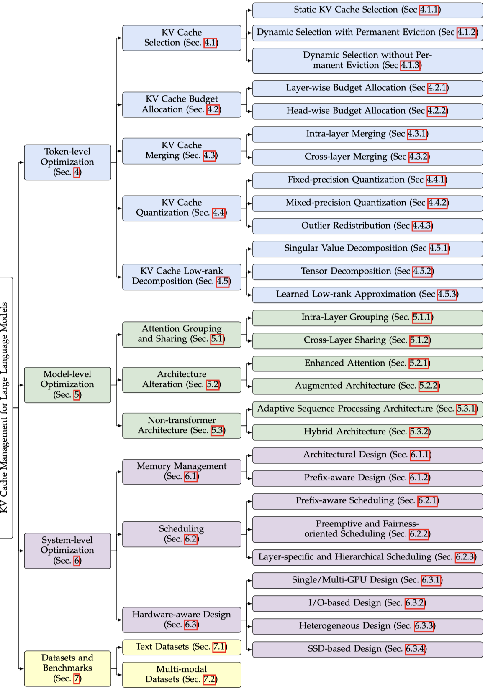           |  |  | [note](./notes/2024/PWGG5HBE/note.md)           |
|  1 | [AttentionPredictor](./meta/2025/AttentionPredictor.prototxt) | [AttentionPredictor: Temporal Pattern Matters for Efficient LLM Inference](http://arxiv.org/abs/2502.04077v1)   |  |  |                                                                                                  | [note](./notes/2025/AttentionPredictor/note.md) |

<b>Lei Xu</b>
 

|    | meta                                            | ttttttttttttttttttttttttttttttitle                                                                                      | ccccccccccccccccccover                                                | Publish                                                    | codeeeee                                                                          | note                                     |
|---:|:------------------------------------------------|:------------------------------------------------------------------------------------------------------------------------|:----------------------------------------------------------------------|:-----------------------------------------------------------|:----------------------------------------------------------------------------------|:-----------------------------------------|
|  0 | [DeepSeek-V2](./meta/2024/DeepSeek-V2.prototxt) | [DeepSeek-V2: A Strong, Economical, and Efficient Mixture-of-Experts Language Model](http://arxiv.org/abs/2405.04434v5) |  |  |  | [note](./notes/2024/DeepSeek-V2/note.md) |
|  1 | [DeepSeek-V3](./meta/2024/DeepSeek-V3.prototxt) | [DeepSeek-V3 Technical Report](http://arxiv.org/abs/2412.19437v1)                                                       |  |  |  | [note](./notes/2024/DeepSeek-V3/note.md) |
|  2 | [DeepSeek-R1](./meta/2025/DeepSeek-R1.prototxt) | [DeepSeek-R1: Incentivizing Reasoning Capability in LLMs via Reinforcement Learning](http://arxiv.org/abs/2501.12948v1) |  |  |  | [note](./notes/2025/DeepSeek-R1/note.md) |

<b>Leyi Xia</b>
 

|    | meta                                            | ttttttttttttttttttttttttttttttitle                                                                                      | ccccccccccccccccccover                                                | Publish                                                    | codeeeee                                                                          | note                                     |
|---:|:------------------------------------------------|:------------------------------------------------------------------------------------------------------------------------|:----------------------------------------------------------------------|:-----------------------------------------------------------|:----------------------------------------------------------------------------------|:-----------------------------------------|
|  0 | [DeepSeek-V2](./meta/2024/DeepSeek-V2.prototxt) | [DeepSeek-V2: A Strong, Economical, and Efficient Mixture-of-Experts Language Model](http://arxiv.org/abs/2405.04434v5) |  |  |  | [note](./notes/2024/DeepSeek-V2/note.md) |
|  1 | [DeepSeek-V3](./meta/2024/DeepSeek-V3.prototxt) | [DeepSeek-V3 Technical Report](http://arxiv.org/abs/2412.19437v1)                                                       |  |  |  | [note](./notes/2024/DeepSeek-V3/note.md) |
|  2 | [DeepSeek-R1](./meta/2025/DeepSeek-R1.prototxt) | [DeepSeek-R1: Incentivizing Reasoning Capability in LLMs via Reinforcement Learning](http://arxiv.org/abs/2501.12948v1) |  |  |  | [note](./notes/2025/DeepSeek-R1/note.md) |

<b>Li Dong</b>
 

|    | meta                                                    | ttttttttttttttttttttttttttttttitle                                                                   | ccccccccccccccccccover                                                    | Publish                                                    | codeeeee                                                                          | note                                         |
|---:|:--------------------------------------------------------|:-----------------------------------------------------------------------------------------------------|:--------------------------------------------------------------------------|:-----------------------------------------------------------|:----------------------------------------------------------------------------------|:---------------------------------------------|
|  0 | [ReSA](./meta/2025/ReSA.prototxt)                       | [Rectified Sparse Attention](http://arxiv.org/abs/2506.04108v2)                                      |             |  |          | [note](./notes/2025/ReSA/note.md)            |
|  1 | [SeerAttention-R](./meta/2025/SeerAttention-R.prototxt) | [SeerAttention-R: Sparse Attention Adaptation for Long Reasoning](http://arxiv.org/abs/2506.08889v1) |  |  |  | [note](./notes/2025/SeerAttention-R/note.md) |

<b>Li-Wen Chang</b>
 

|    | meta                                      | ttttttttttttttttttttttttttttttitle                                                                                               | ccccccccccccccccccover                                                 | Publish                                                    | codeeeee                                                                     | note                                  |
|---:|:------------------------------------------|:---------------------------------------------------------------------------------------------------------------------------------|:-----------------------------------------------------------------------|:-----------------------------------------------------------|:-----------------------------------------------------------------------------|:--------------------------------------|
|  0 | [ShadowKV](./meta/2024/ShadowKV.prototxt) | [ShadowKV: KV Cache in Shadows for High-Throughput Long-Context LLM Inference](http://arxiv.org/abs/2410.21465v1)                |  |  |  | [note](./notes/2024/ShadowKV/note.md) |
|  1 | [R-KV](./meta/2025/R-KV.prototxt)         | [R-KV: Redundancy-aware KV Cache Compression for Training-Free Reasoning Models Acceleration](http://arxiv.org/abs/2505.24133v2) |          |  |      | [note](./notes/2025/R-KV/note.md)     |

<b>Lian Liu</b>
 

|    | meta                                | ttttttttttttttttttttttttttttttitle                                                                                               | ccccccccccccccccccover                                          | Publish                                                     | codeeeee   | note                               |
|---:|:------------------------------------|:---------------------------------------------------------------------------------------------------------------------------------|:----------------------------------------------------------------|:------------------------------------------------------------|:-----------|:-----------------------------------|
|  0 | [COMET](./meta/2025/COMET.prototxt) | [COMET: Towards Partical W4A4KV4 LLMs Serving](http://arxiv.org/abs/2410.12168v1)                                                |  |  |            | [note](./notes/2025/COMET/note.md) |
|  1 | [SDS](./meta/2025/SDS.prototxt)     | [Enhancing One-shot Pruned Pre-trained Language Models through Sparse-Dense-Sparse Mechanism](http://arxiv.org/abs/2408.10473v1) |     |   |            | [note](./notes/2025/SDS/note.md)   |

<b>Liang Zhao</b>
 

|    | meta                                            | ttttttttttttttttttttttttttttttitle                                                                                      | ccccccccccccccccccover                                                | Publish                                                    | codeeeee                                                                          | note                                     |
|---:|:------------------------------------------------|:------------------------------------------------------------------------------------------------------------------------|:----------------------------------------------------------------------|:-----------------------------------------------------------|:----------------------------------------------------------------------------------|:-----------------------------------------|
|  0 | [SparseLLM](./meta/2024/SparseLLM.prototxt)     | [SparseLLM: Towards Global Pruning for Pre-trained Language Models](http://arxiv.org/abs/2402.17946v3)                  |                                                                       |  |     | [note](./notes/2024/SparseLLM/note.md)   |
|  1 | [DeepSeek-V2](./meta/2024/DeepSeek-V2.prototxt) | [DeepSeek-V2: A Strong, Economical, and Efficient Mixture-of-Experts Language Model](http://arxiv.org/abs/2405.04434v5) |  |  |  | [note](./notes/2024/DeepSeek-V2/note.md) |
|  2 | [DeepSeek-V3](./meta/2024/DeepSeek-V3.prototxt) | [DeepSeek-V3 Technical Report](http://arxiv.org/abs/2412.19437v1)                                                       |  |  |  | [note](./notes/2024/DeepSeek-V3/note.md) |
|  3 | [DeepSeek-R1](./meta/2025/DeepSeek-R1.prototxt) | [DeepSeek-R1: Incentivizing Reasoning Capability in LLMs via Reinforcement Learning](http://arxiv.org/abs/2501.12948v1) |  |  |  | [note](./notes/2025/DeepSeek-R1/note.md) |
|  4 | [NSA](./meta/2025/NSA.prototxt)                 | [Native Sparse Attention: Hardware-Aligned and Natively Trainable Sparse Attention](http://arxiv.org/abs/2502.11089v1)  |          |  |                                                                                   | [note](./notes/2025/NSA/note.md)         |

<b>Lianmin Zheng</b>
 

|    | meta                                                   | ttttttttttttttttttttttttttttttitle                                                                                         | ccccccccccccccccccover                                                   | Publish                                                    | codeeeee                                                                           | note                                        |
|---:|:-------------------------------------------------------|:---------------------------------------------------------------------------------------------------------------------------|:-------------------------------------------------------------------------|:-----------------------------------------------------------|:-----------------------------------------------------------------------------------|:--------------------------------------------|
|  0 | [ActNN](./meta/2019/actnn.prototxt)                    | [ActNN: Reducing Training Memory Footprint via 2-Bit Activation Compressed Training](https://arxiv.org/abs/2104.14129)     |                                                                          |     |             |                                             |
|  1 | [Paged Attention](./meta/2023/PagedAttention.prototxt) | [Efficient Memory Management for Large Language Model Serving with PagedAttention](http://arxiv.org/abs/2309.06180v1)      |  |   |         | [note](./notes/2023/PagedAttention/note.md) |
|  2 | [H2O](./meta/2023/H2O.prototxt)                        | [H$_2$O: Heavy-Hitter Oracle for Efficient Generative Inference of Large Language Models](http://arxiv.org/abs/2306.14048) |              |  |           | [note](./notes/2023/H2O/note.md)            |
|  3 | [SGLang](./meta/2024/SGLang.prototxt)                  | [SGLang: Efficient Execution of Structured Language Model Programs](http://arxiv.org/abs/2312.07104v2)                     |          |  |        | [note](./notes/2024/SGLang/note.md)         |
|  4 | [DoubleSparsity](./meta/2024/DoubleSparsity.prototxt)  | [Post-Training Sparse Attention with Double Sparsity](http://arxiv.org/abs/2408.07092v2)                                   |                                                                          |  |  | [note](./notes/2024/DoubleSparsity/note.md) |

<b>Lili Qiu</b>
 

|    | meta                                          | ttttttttttttttttttttttttttttttitle                                                                                               | ccccccccccccccccccover                                                            | Publish                                                    | codeeeee                                                                       | note                                    |
|---:|:----------------------------------------------|:---------------------------------------------------------------------------------------------------------------------------------|:----------------------------------------------------------------------------------|:-----------------------------------------------------------|:-------------------------------------------------------------------------------|:----------------------------------------|
|  0 | [MInference](./meta/2024/MInference.prototxt) | [MInference 1.0: Accelerating Pre-filling for Long-Context LLMs via Dynamic Sparse Attention](http://arxiv.org/abs/2407.02490v1) |  |  |  | [note](./notes/2024/MInference/note.md) |
|  1 | [SCBench](./meta/2024/SCBench.prototxt)       | [SCBench: A KV Cache-Centric Analysis of Long-Context Methods](http://arxiv.org/abs/2412.10319v2)                                |                                                                                   |  |  | [note](./notes/2024/SCBench/note.md)    |

<b>Litong Wang</b>
 

|    | meta                                            | ttttttttttttttttttttttttttttttitle                                                                                      | ccccccccccccccccccover                                                | Publish                                                    | codeeeee                                                                          | note                                     |
|---:|:------------------------------------------------|:------------------------------------------------------------------------------------------------------------------------|:----------------------------------------------------------------------|:-----------------------------------------------------------|:----------------------------------------------------------------------------------|:-----------------------------------------|
|  0 | [DeepSeek-V3](./meta/2024/DeepSeek-V3.prototxt) | [DeepSeek-V3 Technical Report](http://arxiv.org/abs/2412.19437v1)                                                       |  |  |  | [note](./notes/2024/DeepSeek-V3/note.md) |
|  1 | [DeepSeek-R1](./meta/2025/DeepSeek-R1.prototxt) | [DeepSeek-R1: Incentivizing Reasoning Capability in LLMs via Reinforcement Learning](http://arxiv.org/abs/2501.12948v1) |  |  |  | [note](./notes/2025/DeepSeek-R1/note.md) |

<b>Liyue Zhang</b>
 

|    | meta                                            | ttttttttttttttttttttttttttttttitle                                                                                      | ccccccccccccccccccover                                                | Publish                                                    | codeeeee                                                                          | note                                     |
|---:|:------------------------------------------------|:------------------------------------------------------------------------------------------------------------------------|:----------------------------------------------------------------------|:-----------------------------------------------------------|:----------------------------------------------------------------------------------|:-----------------------------------------|
|  0 | [DeepSeek-V2](./meta/2024/DeepSeek-V2.prototxt) | [DeepSeek-V2: A Strong, Economical, and Efficient Mixture-of-Experts Language Model](http://arxiv.org/abs/2405.04434v5) |  |  |  | [note](./notes/2024/DeepSeek-V2/note.md) |
|  1 | [DeepSeek-V3](./meta/2024/DeepSeek-V3.prototxt) | [DeepSeek-V3 Technical Report](http://arxiv.org/abs/2412.19437v1)                                                       |  |  |  | [note](./notes/2024/DeepSeek-V3/note.md) |
|  2 | [DeepSeek-R1](./meta/2025/DeepSeek-R1.prototxt) | [DeepSeek-R1: Incentivizing Reasoning Capability in LLMs via Reinforcement Learning](http://arxiv.org/abs/2501.12948v1) |  |  |  | [note](./notes/2025/DeepSeek-R1/note.md) |

<b>Lu Hou</b>
 

|    | meta                                            | ttttttttttttttttttttttttttttttitle                                                                                               | ccccccccccccccccccover                                                | Publish                                                    | codeeeee                                                                                                                    | note                                     |
|---:|:------------------------------------------------|:---------------------------------------------------------------------------------------------------------------------------------|:----------------------------------------------------------------------|:-----------------------------------------------------------|:----------------------------------------------------------------------------------------------------------------------------|:-----------------------------------------|
|  0 | [RIA](./meta/2024/IA8CS3VH.prototxt)            | [Plug-and-Play: An Efficient Post-training Pruning Method for Large Language Models](https://openreview.net/forum?id=Tr0lPx9woF) |      |     |  |                                          |
|  1 | [LinearPatch](./meta/2025/LinearPatch.prototxt) | [A Simple Linear Patch Revives Layer-Pruned Large Language Models](http://arxiv.org/abs/2505.24680v1)                            |  |  |                                                                                                                             | [note](./notes/2025/LinearPatch/note.md) |

<b>Mao Yang</b>
 

|    | meta                                                    | ttttttttttttttttttttttttttttttitle                                                                                                  | ccccccccccccccccccover                                                           | Publish                                                    | codeeeee                                                                          | note                                         |
|---:|:--------------------------------------------------------|:------------------------------------------------------------------------------------------------------------------------------------|:---------------------------------------------------------------------------------|:-----------------------------------------------------------|:----------------------------------------------------------------------------------|:---------------------------------------------|
|  0 | [Compresso](./meta/2023/Compresso.prototxt)             | [Compresso: Structured Pruning with Collaborative Prompting Learns Compact Large Language Models](https://arxiv.org/abs/2310.05015) |              |  |        | [note](./notes/2023/Compresso/note.md)       |
|  1 | [SeerAttention](./meta/2024/SeerAttention.prototxt)     | [SeerAttention: Learning Intrinsic Sparse Attention in Your LLMs](http://arxiv.org/abs/2410.13276v2)                                |  |  |  | [note](./notes/2024/SeerAttention/note.md)   |
|  2 | [SeerAttention-R](./meta/2025/SeerAttention-R.prototxt) | [SeerAttention-R: Sparse Attention Adaptation for Long Reasoning](http://arxiv.org/abs/2506.08889v1)                                |         |  |  | [note](./notes/2025/SeerAttention-R/note.md) |

<b>Maosong Sun</b>
 

|    | meta                                            | ttttttttttttttttttttttttttttttitle                                                                                                  | ccccccccccccccccccover                                                   | Publish                                                    | codeeeee                                                                                       | note                                     |
|---:|:------------------------------------------------|:------------------------------------------------------------------------------------------------------------------------------------|:-------------------------------------------------------------------------|:-----------------------------------------------------------|:-----------------------------------------------------------------------------------------------|:-----------------------------------------|
|  0 | [ProSparse](./meta/2024/ProSparse.prototxt)     | [ProSparse: Introducing and Enhancing Intrinsic Activation Sparsity within Large Language Models](https://arxiv.org/abs/2402.13516) |  |  |  | [note](./notes/2024/ProSparse/note.md)   |
|  1 | [ReLU2](./meta/2024/ReLU2.prototxt)             | [ReLU2 Wins: Discovering Efficient Activation Functions for Sparse LLMs](https://arxiv.org/abs/2402.03804)                          |     |  |                                                                                                | [note](./notes/2024/ReLU2/note.md)       |
|  2 | [SparsingLaw](./meta/2024/SparsingLaw.prototxt) | [Sparsing Law: Towards Large Language Models with Greater Activation Sparsity](http://arxiv.org/abs/2411.02335v1)                   |     |  |                    | [note](./notes/2024/SparsingLaw/note.md) |
|  3 | [MiniCPM4](./meta/2025/MiniCPM4.prototxt)       | [MiniCPM4: Ultra-Efficient LLMs on End Devices](http://arxiv.org/abs/2506.07900v1)                                                  |        |  |                       | [note](./notes/2025/MiniCPM4/note.md)    |

<b>Marcos Treviso</b>
 

|    | meta                                        | ttttttttttttttttttttttttttttttitle                                                              | ccccccccccccccccccover                                                   | Publish                                                    | codeeeee                                                                      | note                                   |
|---:|:--------------------------------------------|:------------------------------------------------------------------------------------------------|:-------------------------------------------------------------------------|:-----------------------------------------------------------|:------------------------------------------------------------------------------|:---------------------------------------|
|  0 | [m](./meta/2023/68I8KKBV.prototxt)          | [Efficient Methods for Natural Language Processing: A Survey](https://arxiv.org/abs/2209.00099) |  |    |                                                                               |                                        |
|  1 | [AdaSplash](./meta/2025/AdaSplash.prototxt) | [AdaSplash: Adaptive Sparse Flash Attention](http://arxiv.org/abs/2502.12082v1)                 |                                                                          |  |  | [note](./notes/2025/AdaSplash/note.md) |

<b>Mark Kurtz</b>
 

|    | meta                               | ttttttttttttttttttttttttttttttitle                                                                                                       | ccccccccccccccccccover   | Publish                                                    | codeeeee                                                                      | note                                  |
|---:|:-----------------------------------|:-----------------------------------------------------------------------------------------------------------------------------------------|:-------------------------|:-----------------------------------------------------------|:------------------------------------------------------------------------------|:--------------------------------------|
|  0 | [m](./meta/2020/V3MFIRLV.prototxt) | [Inducing and Exploiting Activation Sparsity for Fast Neural Network Inference](http://proceedings.mlr.press/v119/kurtz20a/kurtz20a.pdf) |                          |     |                                                                               |                                       |
|  1 | [m](./meta/2024/ULY1AZGY.prototxt) | [Enabling High-Sparsity Foundational Llama Models with Efficient Pretraining and Deployment](http://arxiv.org/abs/2405.03594v1)          |                          |  |  | [note](./notes/2024/ULY1AZGY/note.md) |

<b>Mehrdad Farajtabar</b>
 

|    | meta                                                  | ttttttttttttttttttttttttttttttitle                                                                              | ccccccccccccccccccover                                                          | Publish                                                       | codeeeee                                                                        | note                                        |
|---:|:------------------------------------------------------|:----------------------------------------------------------------------------------------------------------------|:--------------------------------------------------------------------------------|:--------------------------------------------------------------|:--------------------------------------------------------------------------------|:--------------------------------------------|
|  0 | [LLM in a flash](./meta/2023/LLM_in_a_flash.prototxt) | [LLM in a flash: Efficient Large Language Model Inference with Limited Memory](http://arxiv.org/abs/2312.11514) |      |     |                                                                                 | [note](./notes/2023/LLM_in_a_flash/note.md) |
|  1 | [ReLU Strikes Back](./meta/2024/HMR7HKFV.prototxt)    | [ReLU Strikes Back: Exploiting Activation Sparsity in Large Language Models](https://arxiv.org/abs/2310.04564)  |  |  |  |                                             |

<b>Meng Li</b>
 

|    | meta                                            | ttttttttttttttttttttttttttttttitle                                                                                      | ccccccccccccccccccover                                                | Publish                                                    | codeeeee                                                                          | note                                     |
|---:|:------------------------------------------------|:------------------------------------------------------------------------------------------------------------------------|:----------------------------------------------------------------------|:-----------------------------------------------------------|:----------------------------------------------------------------------------------|:-----------------------------------------|
|  0 | [DeepSeek-V2](./meta/2024/DeepSeek-V2.prototxt) | [DeepSeek-V2: A Strong, Economical, and Efficient Mixture-of-Experts Language Model](http://arxiv.org/abs/2405.04434v5) |  |  |  | [note](./notes/2024/DeepSeek-V2/note.md) |
|  1 | [DeepSeek-V3](./meta/2024/DeepSeek-V3.prototxt) | [DeepSeek-V3 Technical Report](http://arxiv.org/abs/2412.19437v1)                                                       |  |  |  | [note](./notes/2024/DeepSeek-V3/note.md) |
|  2 | [DeepSeek-R1](./meta/2025/DeepSeek-R1.prototxt) | [DeepSeek-R1: Incentivizing Reasoning Capability in LLMs via Reinforcement Learning](http://arxiv.org/abs/2501.12948v1) |  |  |  | [note](./notes/2025/DeepSeek-R1/note.md) |

<b>Miaojun Wang</b>
 

|    | meta                                            | ttttttttttttttttttttttttttttttitle                                                                                      | ccccccccccccccccccover                                                | Publish                                                    | codeeeee                                                                          | note                                     |
|---:|:------------------------------------------------|:------------------------------------------------------------------------------------------------------------------------|:----------------------------------------------------------------------|:-----------------------------------------------------------|:----------------------------------------------------------------------------------|:-----------------------------------------|
|  0 | [DeepSeek-V2](./meta/2024/DeepSeek-V2.prototxt) | [DeepSeek-V2: A Strong, Economical, and Efficient Mixture-of-Experts Language Model](http://arxiv.org/abs/2405.04434v5) |  |  |  | [note](./notes/2024/DeepSeek-V2/note.md) |
|  1 | [DeepSeek-V3](./meta/2024/DeepSeek-V3.prototxt) | [DeepSeek-V3 Technical Report](http://arxiv.org/abs/2412.19437v1)                                                       |  |  |  | [note](./notes/2024/DeepSeek-V3/note.md) |
|  2 | [DeepSeek-R1](./meta/2025/DeepSeek-R1.prototxt) | [DeepSeek-R1: Incentivizing Reasoning Capability in LLMs via Reinforcement Learning](http://arxiv.org/abs/2501.12948v1) |  |  |  | [note](./notes/2025/DeepSeek-R1/note.md) |

<b>Michael Goin</b>
 

|    | meta                                          | ttttttttttttttttttttttttttttttitle                                                                                              | ccccccccccccccccccover                                                | Publish                                                    | codeeeee                                                                              | note                                  |
|---:|:----------------------------------------------|:--------------------------------------------------------------------------------------------------------------------------------|:----------------------------------------------------------------------|:-----------------------------------------------------------|:--------------------------------------------------------------------------------------|:--------------------------------------|
|  0 | [SquareHead](./meta/2023/SquareHead.prototxt) | [Sparse Fine-tuning for Inference Acceleration of Large Language Models](https://arxiv.org/pdf/2310.06927.pdf)                  |  |  |  |                                       |
|  1 | [m](./meta/2024/ULY1AZGY.prototxt)            | [Enabling High-Sparsity Foundational Llama Models with Efficient Pretraining and Deployment](http://arxiv.org/abs/2405.03594v1) |                                                                       |  |          | [note](./notes/2024/ULY1AZGY/note.md) |

<b>Michael Hassid</b>
 

|    | meta                               | ttttttttttttttttttttttttttttttitle                                                              | ccccccccccccccccccover                                                   | Publish                                                    | codeeeee                                                                        | note                              |
|---:|:-----------------------------------|:------------------------------------------------------------------------------------------------|:-------------------------------------------------------------------------|:-----------------------------------------------------------|:--------------------------------------------------------------------------------|:----------------------------------|
|  0 | [m](./meta/2023/68I8KKBV.prototxt) | [Efficient Methods for Natural Language Processing: A Survey](https://arxiv.org/abs/2209.00099) |  |    |                                                                                 |                                   |
|  1 | [TOVA](./meta/2024/TOVA.prototxt)  | [Transformers are Multi-State RNNs](http://arxiv.org/abs/2401.06104v2)                          | 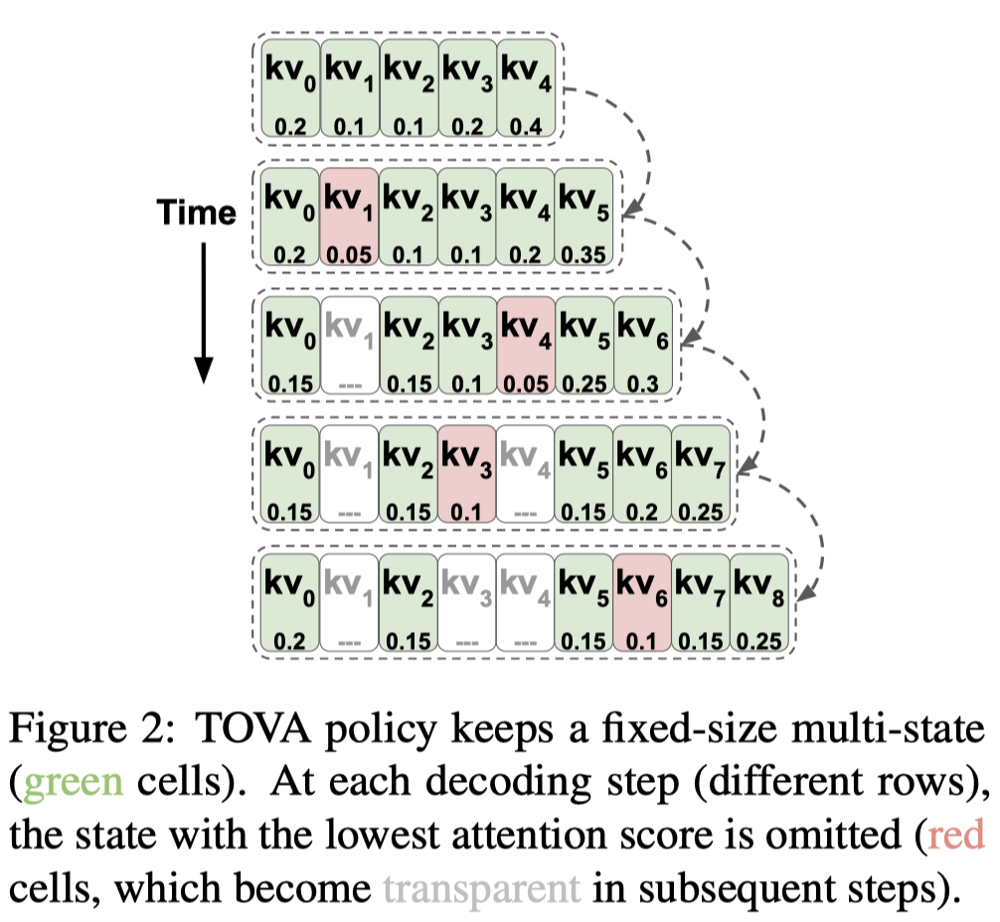           |  |  | [note](./notes/2024/TOVA/note.md) |

<b>Michael W. Mahoney</b>
 

|    | meta                                                | ttttttttttttttttttttttttttttttitle                                                                                       | ccccccccccccccccccover                                                     | Publish                                                    | codeeeee                                                                                     | note                                       |
|---:|:----------------------------------------------------|:-------------------------------------------------------------------------------------------------------------------------|:---------------------------------------------------------------------------|:-----------------------------------------------------------|:---------------------------------------------------------------------------------------------|:-------------------------------------------|
|  0 | [ActNN](./meta/2019/actnn.prototxt)                 | [ActNN: Reducing Training Memory Footprint via 2-Bit Activation Compressed Training](https://arxiv.org/abs/2104.14129)   |                                                                            |     |                       |                                            |
|  1 | [FisherPruning](./meta/2022/fisherpruning.prototxt) | [A Fast Post-Training Pruning Framework for Transformers](http://arxiv.org/abs/2204.09656v2)                             |    |  |  | [note](./notes/2022/fisherpruning/note.md) |
|  2 | [SqueezeLLM](./meta/2024/SqueezeLLM.prototxt)       | [SqueezeLLM: Dense-and-Sparse Quantization](http://arxiv.org/abs/2306.07629v4)                                           |  |     |             | [note](./notes/2024/SqueezeLLM/note.md)    |
|  3 | [KVQuant](./meta/2024/KVQuant.prototxt)             | [KVQuant: Towards 10 Million Context Length LLM Inference with KV Cache Quantization](http://arxiv.org/abs/2401.18079v2) |                                                                            |  |                | [note](./notes/2024/KVQuant/note.md)       |

<b>Mingchuan Zhang</b>
 

|    | meta                                            | ttttttttttttttttttttttttttttttitle                                                                                      | ccccccccccccccccccover                                                | Publish                                                    | codeeeee                                                                          | note                                     |
|---:|:------------------------------------------------|:------------------------------------------------------------------------------------------------------------------------|:----------------------------------------------------------------------|:-----------------------------------------------------------|:----------------------------------------------------------------------------------|:-----------------------------------------|
|  0 | [DeepSeek-V2](./meta/2024/DeepSeek-V2.prototxt) | [DeepSeek-V2: A Strong, Economical, and Efficient Mixture-of-Experts Language Model](http://arxiv.org/abs/2405.04434v5) |  |  |  | [note](./notes/2024/DeepSeek-V2/note.md) |
|  1 | [DeepSeek-V3](./meta/2024/DeepSeek-V3.prototxt) | [DeepSeek-V3 Technical Report](http://arxiv.org/abs/2412.19437v1)                                                       |  |  |  | [note](./notes/2024/DeepSeek-V3/note.md) |
|  2 | [DeepSeek-R1](./meta/2025/DeepSeek-R1.prototxt) | [DeepSeek-R1: Incentivizing Reasoning Capability in LLMs via Reinforcement Learning](http://arxiv.org/abs/2501.12948v1) |  |  |  | [note](./notes/2025/DeepSeek-R1/note.md) |

<b>Minghua Zhang</b>
 

|    | meta                                            | ttttttttttttttttttttttttttttttitle                                                                                      | ccccccccccccccccccover                                                | Publish                                                    | codeeeee                                                                          | note                                     |
|---:|:------------------------------------------------|:------------------------------------------------------------------------------------------------------------------------|:----------------------------------------------------------------------|:-----------------------------------------------------------|:----------------------------------------------------------------------------------|:-----------------------------------------|
|  0 | [DeepSeek-V2](./meta/2024/DeepSeek-V2.prototxt) | [DeepSeek-V2: A Strong, Economical, and Efficient Mixture-of-Experts Language Model](http://arxiv.org/abs/2405.04434v5) |  |  |  | [note](./notes/2024/DeepSeek-V2/note.md) |
|  1 | [DeepSeek-V3](./meta/2024/DeepSeek-V3.prototxt) | [DeepSeek-V3 Technical Report](http://arxiv.org/abs/2412.19437v1)                                                       |  |  |  | [note](./notes/2024/DeepSeek-V3/note.md) |
|  2 | [DeepSeek-R1](./meta/2025/DeepSeek-R1.prototxt) | [DeepSeek-R1: Incentivizing Reasoning Capability in LLMs via Reinforcement Learning](http://arxiv.org/abs/2501.12948v1) |  |  |  | [note](./notes/2025/DeepSeek-R1/note.md) |

<b>Minghui Tang</b>
 

|    | meta                                            | ttttttttttttttttttttttttttttttitle                                                                                      | ccccccccccccccccccover                                                | Publish                                                    | codeeeee                                                                          | note                                     |
|---:|:------------------------------------------------|:------------------------------------------------------------------------------------------------------------------------|:----------------------------------------------------------------------|:-----------------------------------------------------------|:----------------------------------------------------------------------------------|:-----------------------------------------|
|  0 | [DeepSeek-V2](./meta/2024/DeepSeek-V2.prototxt) | [DeepSeek-V2: A Strong, Economical, and Efficient Mixture-of-Experts Language Model](http://arxiv.org/abs/2405.04434v5) |  |  |  | [note](./notes/2024/DeepSeek-V2/note.md) |
|  1 | [DeepSeek-V3](./meta/2024/DeepSeek-V3.prototxt) | [DeepSeek-V3 Technical Report](http://arxiv.org/abs/2412.19437v1)                                                       |  |  |  | [note](./notes/2024/DeepSeek-V3/note.md) |
|  2 | [DeepSeek-R1](./meta/2025/DeepSeek-R1.prototxt) | [DeepSeek-R1: Incentivizing Reasoning Capability in LLMs via Reinforcement Learning](http://arxiv.org/abs/2501.12948v1) |  |  |  | [note](./notes/2025/DeepSeek-R1/note.md) |

<b>Mingjie Sun</b>
 

|    | meta                                                            | ttttttttttttttttttttttttttttttitle                                                                               | ccccccccccccccccccover                                                               | Publish                                                    | codeeeee                                                                               | note                                             |
|---:|:----------------------------------------------------------------|:-----------------------------------------------------------------------------------------------------------------|:-------------------------------------------------------------------------------------|:-----------------------------------------------------------|:---------------------------------------------------------------------------------------|:-------------------------------------------------|
|  0 | [GBLM-Pruner](./meta/2023/GBLM-Pruner.prototxt)                 | [Beyond Size: How Gradients Shape Pruning Decisions in Large Language Models](http://arxiv.org/abs/2311.04902v2) |          |  |          | [note](./notes/2023/GBLM-Pruner/note.md)         |
|  1 | [Wanda](./meta/2024/Wanda.prototxt)                             | [A Simple and Effective Pruning Approach for Large Language Models](http://arxiv.org/abs/2306.11695)             |                      |     |                | [note](./notes/2024/Wanda/note.md)               |
|  2 | [massive-activations](./meta/2024/massive-activations.prototxt) | [Massive Activations in Large Language Models](http://arxiv.org/abs/2402.17762v2)                                |  |  |  | [note](./notes/2024/massive-activations/note.md) |

<b>Mingming Li</b>
 

|    | meta                                            | ttttttttttttttttttttttttttttttitle                                                                                      | ccccccccccccccccccover                                                | Publish                                                    | codeeeee                                                                          | note                                     |
|---:|:------------------------------------------------|:------------------------------------------------------------------------------------------------------------------------|:----------------------------------------------------------------------|:-----------------------------------------------------------|:----------------------------------------------------------------------------------|:-----------------------------------------|
|  0 | [DeepSeek-V2](./meta/2024/DeepSeek-V2.prototxt) | [DeepSeek-V2: A Strong, Economical, and Efficient Mixture-of-Experts Language Model](http://arxiv.org/abs/2405.04434v5) |  |  |  | [note](./notes/2024/DeepSeek-V2/note.md) |
|  1 | [DeepSeek-V3](./meta/2024/DeepSeek-V3.prototxt) | [DeepSeek-V3 Technical Report](http://arxiv.org/abs/2412.19437v1)                                                       |  |  |  | [note](./notes/2024/DeepSeek-V3/note.md) |
|  2 | [DeepSeek-R1](./meta/2025/DeepSeek-R1.prototxt) | [DeepSeek-R1: Incentivizing Reasoning Capability in LLMs via Reinforcement Learning](http://arxiv.org/abs/2501.12948v1) |  |  |  | [note](./notes/2025/DeepSeek-R1/note.md) |

<b>Ning Tian</b>
 

|    | meta                                            | ttttttttttttttttttttttttttttttitle                                                                                      | ccccccccccccccccccover                                                | Publish                                                    | codeeeee                                                                          | note                                     |
|---:|:------------------------------------------------|:------------------------------------------------------------------------------------------------------------------------|:----------------------------------------------------------------------|:-----------------------------------------------------------|:----------------------------------------------------------------------------------|:-----------------------------------------|
|  0 | [DeepSeek-V2](./meta/2024/DeepSeek-V2.prototxt) | [DeepSeek-V2: A Strong, Economical, and Efficient Mixture-of-Experts Language Model](http://arxiv.org/abs/2405.04434v5) |  |  |  | [note](./notes/2024/DeepSeek-V2/note.md) |
|  1 | [DeepSeek-V3](./meta/2024/DeepSeek-V3.prototxt) | [DeepSeek-V3 Technical Report](http://arxiv.org/abs/2412.19437v1)                                                       |  |  |  | [note](./notes/2024/DeepSeek-V3/note.md) |
|  2 | [DeepSeek-R1](./meta/2025/DeepSeek-R1.prototxt) | [DeepSeek-R1: Incentivizing Reasoning Capability in LLMs via Reinforcement Learning](http://arxiv.org/abs/2501.12948v1) |  |  |  | [note](./notes/2025/DeepSeek-R1/note.md) |

<b>Panpan Huang</b>
 

|    | meta                                            | ttttttttttttttttttttttttttttttitle                                                                                             | ccccccccccccccccccover                                                | Publish                                                    | codeeeee                                                                           | note                                     |
|---:|:------------------------------------------------|:-------------------------------------------------------------------------------------------------------------------------------|:----------------------------------------------------------------------|:-----------------------------------------------------------|:-----------------------------------------------------------------------------------|:-----------------------------------------|
|  0 | [DeepSeek-V2](./meta/2024/DeepSeek-V2.prototxt) | [DeepSeek-V2: A Strong, Economical, and Efficient Mixture-of-Experts Language Model](http://arxiv.org/abs/2405.04434v5)        |  |  |   | [note](./notes/2024/DeepSeek-V2/note.md) |
|  1 | [DeepSeek-V3](./meta/2024/DeepSeek-V3.prototxt) | [DeepSeek-V3 Technical Report](http://arxiv.org/abs/2412.19437v1)                                                              |  |  |   | [note](./notes/2024/DeepSeek-V3/note.md) |
|  2 | [DeepSeekMoE](./meta/2024/DeepSeekMoE.prototxt) | [DeepSeekMoE: Towards Ultimate Expert Specialization in Mixture-of-Experts Language Models](http://arxiv.org/abs/2401.06066v1) |  |  |  | [note](./notes/2024/DeepSeekMoE/note.md) |
|  3 | [DeepSeek-R1](./meta/2025/DeepSeek-R1.prototxt) | [DeepSeek-R1: Incentivizing Reasoning Capability in LLMs via Reinforcement Learning](http://arxiv.org/abs/2501.12948v1)        |  |  |   | [note](./notes/2025/DeepSeek-R1/note.md) |

<b>Pavlo Molchanov</b>
 

|    | meta                                      | ttttttttttttttttttttttttttttttitle                                                                         | ccccccccccccccccccover                                                 | Publish                                                    | codeeeee                                                                  | note                                  |
|---:|:------------------------------------------|:-----------------------------------------------------------------------------------------------------------|:-----------------------------------------------------------------------|:-----------------------------------------------------------|:--------------------------------------------------------------------------|:--------------------------------------|
|  0 | [MaskLLM](./meta/2024/MaskLLM.prototxt)   | [MaskLLM: Learnable Semi-Structured Sparsity for Large Language Models](http://arxiv.org/abs/2409.17481v1) |    |  |   | [note](./notes/2024/MaskLLM/note.md)  |
|  1 | [Minitron](./meta/2024/Minitron.prototxt) | [Compact Language Models via Pruning and Knowledge Distillation](https://arxiv.org/abs/2408.11796v2)       |  |  |  | [note](./notes/2024/Minitron/note.md) |

<b>Peiyi Wang</b>
 

|    | meta                                            | ttttttttttttttttttttttttttttttitle                                                                                      | ccccccccccccccccccover                                                | Publish                                                    | codeeeee                                                                          | note                                     |
|---:|:------------------------------------------------|:------------------------------------------------------------------------------------------------------------------------|:----------------------------------------------------------------------|:-----------------------------------------------------------|:----------------------------------------------------------------------------------|:-----------------------------------------|
|  0 | [DeepSeek-V2](./meta/2024/DeepSeek-V2.prototxt) | [DeepSeek-V2: A Strong, Economical, and Efficient Mixture-of-Experts Language Model](http://arxiv.org/abs/2405.04434v5) |  |  |  | [note](./notes/2024/DeepSeek-V2/note.md) |
|  1 | [DeepSeek-V3](./meta/2024/DeepSeek-V3.prototxt) | [DeepSeek-V3 Technical Report](http://arxiv.org/abs/2412.19437v1)                                                       |  |  |  | [note](./notes/2024/DeepSeek-V3/note.md) |
|  2 | [DeepSeek-R1](./meta/2025/DeepSeek-R1.prototxt) | [DeepSeek-R1: Incentivizing Reasoning Capability in LLMs via Reinforcement Learning](http://arxiv.org/abs/2501.12948v1) |  |  |  | [note](./notes/2025/DeepSeek-R1/note.md) |

<b>Peng Zhang</b>
 

|    | meta                                            | ttttttttttttttttttttttttttttttitle                                                                                      | ccccccccccccccccccover                                                | Publish                                                    | codeeeee                                                                          | note                                     |
|---:|:------------------------------------------------|:------------------------------------------------------------------------------------------------------------------------|:----------------------------------------------------------------------|:-----------------------------------------------------------|:----------------------------------------------------------------------------------|:-----------------------------------------|
|  0 | [DeepSeek-V2](./meta/2024/DeepSeek-V2.prototxt) | [DeepSeek-V2: A Strong, Economical, and Efficient Mixture-of-Experts Language Model](http://arxiv.org/abs/2405.04434v5) |  |  |  | [note](./notes/2024/DeepSeek-V2/note.md) |
|  1 | [DeepSeek-V3](./meta/2024/DeepSeek-V3.prototxt) | [DeepSeek-V3 Technical Report](http://arxiv.org/abs/2412.19437v1)                                                       |  |  |  | [note](./notes/2024/DeepSeek-V3/note.md) |
|  2 | [DeepSeek-R1](./meta/2025/DeepSeek-R1.prototxt) | [DeepSeek-R1: Incentivizing Reasoning Capability in LLMs via Reinforcement Learning](http://arxiv.org/abs/2501.12948v1) |  |  |  | [note](./notes/2025/DeepSeek-R1/note.md) |

<b>Pengcheng He</b>
 

|    | meta                                    | ttttttttttttttttttttttttttttttitle                                                                              | ccccccccccccccccccover                                               | Publish                                                    | codeeeee                                                                      | note                               |
|---:|:----------------------------------------|:----------------------------------------------------------------------------------------------------------------|:---------------------------------------------------------------------|:-----------------------------------------------------------|:------------------------------------------------------------------------------|:-----------------------------------|
|  0 | [AdaLoRA](./meta/2023/adalora.prototxt) | [AdaLoRA: Adaptive Budget Allocation for Parameter-Efficient Fine-Tuning](https://arxiv.org/pdf/2303.10512.pdf) |  |     |  |                                    |
|  1 | [LoftQ](./meta/2023/loftq.prototxt)     | [LoftQ: LoRA-Fine-Tuning-Aware Quantization for Large Language Models](https://arxiv.org/abs/2310.08659)        |      |  |       | [note](./notes/2023/loftq/note.md) |

<b>Pengfei Zuo</b>
 

|    | meta                                                    | ttttttttttttttttttttttttttttttitle                                                                                                                    | ccccccccccccccccccover                                                    | Publish                                                    | codeeeee                                                                     | note                                         |
|---:|:--------------------------------------------------------|:------------------------------------------------------------------------------------------------------------------------------------------------------|:--------------------------------------------------------------------------|:-----------------------------------------------------------|:-----------------------------------------------------------------------------|:---------------------------------------------|
|  0 | [CachedAttention](./meta/2024/CachedAttention.prototxt) | [Cost-Efficient Large Language Model Serving for Multi-turn Conversations with CachedAttention](http://arxiv.org/abs/2403.19708v3)                    |  |    |                                                                              | [note](./notes/2024/CachedAttention/note.md) |
|  1 | [AdaSkip](./meta/2025/AdaSkip.prototxt)                 | [AdaSkip: Adaptive Sublayer Skipping for Accelerating Long-Context LLM Inference](http://arxiv.org/abs/2501.02336v1)                                  |          |     |      | [note](./notes/2025/AdaSkip/note.md)         |
|  2 | [Adrenaline](./meta/2025/Adrenaline.prototxt)           | [Injecting Adrenaline into LLM Serving: Boosting Resource Utilization and Throughput via Attention Disaggregation](http://arxiv.org/abs/2503.20552v1) |       |  |   | [note](./notes/2025/Adrenaline/note.md)      |
|  3 | [PSA](./meta/2025/PSA.prototxt)                         | [Progressive Sparse Attention: Algorithm and System Co-design for Efficient Attention in LLM Serving](http://arxiv.org/abs/2503.00392v1)              | 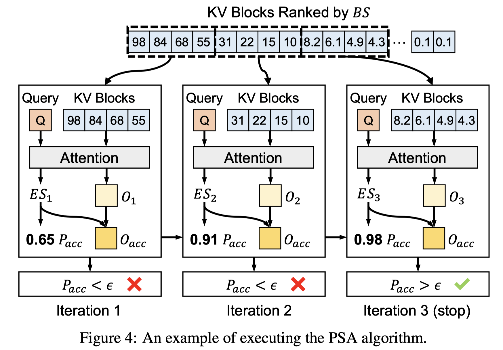             |  |  | [note](./notes/2025/PSA/note.md)             |

<b>Qiancheng Wang</b>
 

|    | meta                                            | ttttttttttttttttttttttttttttttitle                                                                                      | ccccccccccccccccccover                                                | Publish                                                    | codeeeee                                                                          | note                                     |
|---:|:------------------------------------------------|:------------------------------------------------------------------------------------------------------------------------|:----------------------------------------------------------------------|:-----------------------------------------------------------|:----------------------------------------------------------------------------------|:-----------------------------------------|
|  0 | [DeepSeek-V3](./meta/2024/DeepSeek-V3.prototxt) | [DeepSeek-V3 Technical Report](http://arxiv.org/abs/2412.19437v1)                                                       |  |  |  | [note](./notes/2024/DeepSeek-V3/note.md) |
|  1 | [DeepSeek-R1](./meta/2025/DeepSeek-R1.prototxt) | [DeepSeek-R1: Incentivizing Reasoning Capability in LLMs via Reinforcement Learning](http://arxiv.org/abs/2501.12948v1) |  |  |  | [note](./notes/2025/DeepSeek-R1/note.md) |

<b>Qianhui Wu</b>
 

|    | meta                                          | ttttttttttttttttttttttttttttttitle                                                                                               | ccccccccccccccccccover                                                            | Publish                                                    | codeeeee                                                                       | note                                    |
|---:|:----------------------------------------------|:---------------------------------------------------------------------------------------------------------------------------------|:----------------------------------------------------------------------------------|:-----------------------------------------------------------|:-------------------------------------------------------------------------------|:----------------------------------------|
|  0 | [MInference](./meta/2024/MInference.prototxt) | [MInference 1.0: Accelerating Pre-filling for Long-Context LLMs via Dynamic Sparse Attention](http://arxiv.org/abs/2407.02490v1) |  |  |  | [note](./notes/2024/MInference/note.md) |
|  1 | [SCBench](./meta/2024/SCBench.prototxt)       | [SCBench: A KV Cache-Centric Analysis of Long-Context Methods](http://arxiv.org/abs/2412.10319v2)                                |                                                                                   |  |  | [note](./notes/2024/SCBench/note.md)    |

<b>Qihao Zhu</b>
 

|    | meta                                            | ttttttttttttttttttttttttttttttitle                                                                                      | ccccccccccccccccccover                                                | Publish                                                    | codeeeee                                                                          | note                                     |
|---:|:------------------------------------------------|:------------------------------------------------------------------------------------------------------------------------|:----------------------------------------------------------------------|:-----------------------------------------------------------|:----------------------------------------------------------------------------------|:-----------------------------------------|
|  0 | [DeepSeek-V2](./meta/2024/DeepSeek-V2.prototxt) | [DeepSeek-V2: A Strong, Economical, and Efficient Mixture-of-Experts Language Model](http://arxiv.org/abs/2405.04434v5) |  |  |  | [note](./notes/2024/DeepSeek-V2/note.md) |
|  1 | [DeepSeek-V3](./meta/2024/DeepSeek-V3.prototxt) | [DeepSeek-V3 Technical Report](http://arxiv.org/abs/2412.19437v1)                                                       |  |  |  | [note](./notes/2024/DeepSeek-V3/note.md) |
|  2 | [DeepSeek-R1](./meta/2025/DeepSeek-R1.prototxt) | [DeepSeek-R1: Incentivizing Reasoning Capability in LLMs via Reinforcement Learning](http://arxiv.org/abs/2501.12948v1) |  |  |  | [note](./notes/2025/DeepSeek-R1/note.md) |

<b>Qinyu Chen</b>
 

|    | meta                                            | ttttttttttttttttttttttttttttttitle                                                                                      | ccccccccccccccccccover                                                | Publish                                                    | codeeeee                                                                          | note                                     |
|---:|:------------------------------------------------|:------------------------------------------------------------------------------------------------------------------------|:----------------------------------------------------------------------|:-----------------------------------------------------------|:----------------------------------------------------------------------------------|:-----------------------------------------|
|  0 | [DeepSeek-V2](./meta/2024/DeepSeek-V2.prototxt) | [DeepSeek-V2: A Strong, Economical, and Efficient Mixture-of-Experts Language Model](http://arxiv.org/abs/2405.04434v5) |  |  |  | [note](./notes/2024/DeepSeek-V2/note.md) |
|  1 | [DeepSeek-V3](./meta/2024/DeepSeek-V3.prototxt) | [DeepSeek-V3 Technical Report](http://arxiv.org/abs/2412.19437v1)                                                       |  |  |  | [note](./notes/2024/DeepSeek-V3/note.md) |
|  2 | [DeepSeek-R1](./meta/2025/DeepSeek-R1.prototxt) | [DeepSeek-R1: Incentivizing Reasoning Capability in LLMs via Reinforcement Learning](http://arxiv.org/abs/2501.12948v1) |  |  |  | [note](./notes/2025/DeepSeek-R1/note.md) |

<b>Qiushi Du</b>
 

|    | meta                                            | ttttttttttttttttttttttttttttttitle                                                                                      | ccccccccccccccccccover                                                | Publish                                                    | codeeeee                                                                          | note                                     |
|---:|:------------------------------------------------|:------------------------------------------------------------------------------------------------------------------------|:----------------------------------------------------------------------|:-----------------------------------------------------------|:----------------------------------------------------------------------------------|:-----------------------------------------|
|  0 | [DeepSeek-V2](./meta/2024/DeepSeek-V2.prototxt) | [DeepSeek-V2: A Strong, Economical, and Efficient Mixture-of-Experts Language Model](http://arxiv.org/abs/2405.04434v5) |  |  |  | [note](./notes/2024/DeepSeek-V2/note.md) |
|  1 | [DeepSeek-V3](./meta/2024/DeepSeek-V3.prototxt) | [DeepSeek-V3 Technical Report](http://arxiv.org/abs/2412.19437v1)                                                       |  |  |  | [note](./notes/2024/DeepSeek-V3/note.md) |
|  2 | [DeepSeek-R1](./meta/2025/DeepSeek-R1.prototxt) | [DeepSeek-R1: Incentivizing Reasoning Capability in LLMs via Reinforcement Learning](http://arxiv.org/abs/2501.12948v1) |  |  |  | [note](./notes/2025/DeepSeek-R1/note.md) |

<b>R. J. Chen</b>
 

|    | meta                                            | ttttttttttttttttttttttttttttttitle                                                                                      | ccccccccccccccccccover                                                | Publish                                                    | codeeeee                                                                          | note                                     |
|---:|:------------------------------------------------|:------------------------------------------------------------------------------------------------------------------------|:----------------------------------------------------------------------|:-----------------------------------------------------------|:----------------------------------------------------------------------------------|:-----------------------------------------|
|  0 | [DeepSeek-V2](./meta/2024/DeepSeek-V2.prototxt) | [DeepSeek-V2: A Strong, Economical, and Efficient Mixture-of-Experts Language Model](http://arxiv.org/abs/2405.04434v5) |  |  |  | [note](./notes/2024/DeepSeek-V2/note.md) |
|  1 | [DeepSeek-V3](./meta/2024/DeepSeek-V3.prototxt) | [DeepSeek-V3 Technical Report](http://arxiv.org/abs/2412.19437v1)                                                       |  |  |  | [note](./notes/2024/DeepSeek-V3/note.md) |
|  2 | [DeepSeek-R1](./meta/2025/DeepSeek-R1.prototxt) | [DeepSeek-R1: Incentivizing Reasoning Capability in LLMs via Reinforcement Learning](http://arxiv.org/abs/2501.12948v1) |  |  |  | [note](./notes/2025/DeepSeek-R1/note.md) |

<b>R. L. Jin</b>
 

|    | meta                                            | ttttttttttttttttttttttttttttttitle                                                                                      | ccccccccccccccccccover                                                | Publish                                                    | codeeeee                                                                          | note                                     |
|---:|:------------------------------------------------|:------------------------------------------------------------------------------------------------------------------------|:----------------------------------------------------------------------|:-----------------------------------------------------------|:----------------------------------------------------------------------------------|:-----------------------------------------|
|  0 | [DeepSeek-V2](./meta/2024/DeepSeek-V2.prototxt) | [DeepSeek-V2: A Strong, Economical, and Efficient Mixture-of-Experts Language Model](http://arxiv.org/abs/2405.04434v5) |  |  |  | [note](./notes/2024/DeepSeek-V2/note.md) |
|  1 | [DeepSeek-V3](./meta/2024/DeepSeek-V3.prototxt) | [DeepSeek-V3 Technical Report](http://arxiv.org/abs/2412.19437v1)                                                       |  |  |  | [note](./notes/2024/DeepSeek-V3/note.md) |
|  2 | [DeepSeek-R1](./meta/2025/DeepSeek-R1.prototxt) | [DeepSeek-R1: Incentivizing Reasoning Capability in LLMs via Reinforcement Learning](http://arxiv.org/abs/2501.12948v1) |  |  |  | [note](./notes/2025/DeepSeek-R1/note.md) |

<b>Ramachandran Ramjee</b>
 

|    | meta                                                | ttttttttttttttttttttttttttttttitle                                                                                 | ccccccccccccccccccover                                                  | Publish                                                     | codeeeee                                                                       | note                                       |
|---:|:----------------------------------------------------|:-------------------------------------------------------------------------------------------------------------------|:------------------------------------------------------------------------|:------------------------------------------------------------|:-------------------------------------------------------------------------------|:-------------------------------------------|
|  0 | [POD-Attention](./meta/2025/POD-Attention.prototxt) | [POD-Attention: Unlocking Full Prefill-Decode Overlap for Faster LLM Inference](http://arxiv.org/abs/2410.18038v2) |  |  |  | [note](./notes/2025/POD-Attention/note.md) |
|  1 | [vAttention](./meta/2025/vAttention.prototxt)       | [vAttention: Dynamic Memory Management for Serving LLMs without PagedAttention](http://arxiv.org/abs/2405.04437v3) |     |  |  | [note](./notes/2025/vAttention/note.md)    |

<b>Ramya Prabhu</b>
 

|    | meta                                                | ttttttttttttttttttttttttttttttitle                                                                                 | ccccccccccccccccccover                                                  | Publish                                                     | codeeeee                                                                       | note                                       |
|---:|:----------------------------------------------------|:-------------------------------------------------------------------------------------------------------------------|:------------------------------------------------------------------------|:------------------------------------------------------------|:-------------------------------------------------------------------------------|:-------------------------------------------|
|  0 | [POD-Attention](./meta/2025/POD-Attention.prototxt) | [POD-Attention: Unlocking Full Prefill-Decode Overlap for Faster LLM Inference](http://arxiv.org/abs/2410.18038v2) |  |  |  | [note](./notes/2025/POD-Attention/note.md) |
|  1 | [vAttention](./meta/2025/vAttention.prototxt)       | [vAttention: Dynamic Memory Management for Serving LLMs without PagedAttention](http://arxiv.org/abs/2405.04437v3) |     |  |  | [note](./notes/2025/vAttention/note.md)    |

<b>Rayan Saab</b>
 

|    | meta                                  | ttttttttttttttttttttttttttttttitle                                                                                  | ccccccccccccccccccover   | Publish                                                    | codeeeee                                                                                       | note   |
|---:|:--------------------------------------|:--------------------------------------------------------------------------------------------------------------------|:-------------------------|:-----------------------------------------------------------|:-----------------------------------------------------------------------------------------------|:-------|
|  0 | [GPFQ](./meta/2021/gpfq.prototxt)     | [A Greedy Algorithm for Quantizing Neural Networks](https://jmlr.csail.mit.edu/papers/volume22/20-1233/20-1233.pdf) |                          |    |  |        |
|  1 | [GPFQv2](./meta/2023/gpfqv2.prototxt) | [Post-training Quantization for Neural Networks with Provable Guarantees](https://arxiv.org/pdf/2201.11113.pdf)     |                          |  |  |        |

<b>Roy Schwartz</b>
 

|    | meta                               | ttttttttttttttttttttttttttttttitle                                                              | ccccccccccccccccccover                                                   | Publish                                                    | codeeeee                                                                        | note                              |
|---:|:-----------------------------------|:------------------------------------------------------------------------------------------------|:-------------------------------------------------------------------------|:-----------------------------------------------------------|:--------------------------------------------------------------------------------|:----------------------------------|
|  0 | [m](./meta/2023/68I8KKBV.prototxt) | [Efficient Methods for Natural Language Processing: A Survey](https://arxiv.org/abs/2209.00099) |  |    |                                                                                 |                                   |
|  1 | [TOVA](./meta/2024/TOVA.prototxt)  | [Transformers are Multi-State RNNs](http://arxiv.org/abs/2401.06104v2)                          |            |  |  | [note](./notes/2024/TOVA/note.md) |

<b>Ruihang Lai</b>
 

|    | meta                                          | ttttttttttttttttttttttttttttttitle                                                                                           | ccccccccccccccccccover                                             | Publish                                                    | codeeeee                                                                           | note                                    |
|---:|:----------------------------------------------|:-----------------------------------------------------------------------------------------------------------------------------|:-------------------------------------------------------------------|:-----------------------------------------------------------|:-----------------------------------------------------------------------------------|:----------------------------------------|
|  0 | [XGrammar](./meta/2024/XGrammar.prototxt)     | [XGrammar: Flexible and Efficient Structured Generation Engine for Large Language Models](http://arxiv.org/abs/2411.15100v2) |  |  |           | [note](./notes/2024/XGrammar/note.md)   |
|  1 | [FlashInfer](./meta/2025/FlashInfer.prototxt) | [FlashInfer: Efficient and Customizable Attention Engine for LLM Inference Serving](http://arxiv.org/abs/2501.01005v2)       |                                                                    |  |  | [note](./notes/2025/FlashInfer/note.md) |

<b>Ruiqi Ge</b>
 

|    | meta                                            | ttttttttttttttttttttttttttttttitle                                                                                      | ccccccccccccccccccover                                                | Publish                                                    | codeeeee                                                                          | note                                     |
|---:|:------------------------------------------------|:------------------------------------------------------------------------------------------------------------------------|:----------------------------------------------------------------------|:-----------------------------------------------------------|:----------------------------------------------------------------------------------|:-----------------------------------------|
|  0 | [DeepSeek-V2](./meta/2024/DeepSeek-V2.prototxt) | [DeepSeek-V2: A Strong, Economical, and Efficient Mixture-of-Experts Language Model](http://arxiv.org/abs/2405.04434v5) |  |  |  | [note](./notes/2024/DeepSeek-V2/note.md) |
|  1 | [DeepSeek-V3](./meta/2024/DeepSeek-V3.prototxt) | [DeepSeek-V3 Technical Report](http://arxiv.org/abs/2412.19437v1)                                                       |  |  |  | [note](./notes/2024/DeepSeek-V3/note.md) |
|  2 | [DeepSeek-R1](./meta/2025/DeepSeek-R1.prototxt) | [DeepSeek-R1: Incentivizing Reasoning Capability in LLMs via Reinforcement Learning](http://arxiv.org/abs/2501.12948v1) |  |  |  | [note](./notes/2025/DeepSeek-R1/note.md) |

<b>Ruisong Zhang</b>
 

|    | meta                                            | ttttttttttttttttttttttttttttttitle                                                                                      | ccccccccccccccccccover                                                | Publish                                                    | codeeeee                                                                          | note                                     |
|---:|:------------------------------------------------|:------------------------------------------------------------------------------------------------------------------------|:----------------------------------------------------------------------|:-----------------------------------------------------------|:----------------------------------------------------------------------------------|:-----------------------------------------|
|  0 | [DeepSeek-V3](./meta/2024/DeepSeek-V3.prototxt) | [DeepSeek-V3 Technical Report](http://arxiv.org/abs/2412.19437v1)                                                       |  |  |  | [note](./notes/2024/DeepSeek-V3/note.md) |
|  1 | [DeepSeek-R1](./meta/2025/DeepSeek-R1.prototxt) | [DeepSeek-R1: Incentivizing Reasoning Capability in LLMs via Reinforcement Learning](http://arxiv.org/abs/2501.12948v1) |  |  |  | [note](./notes/2025/DeepSeek-R1/note.md) |

<b>Ruizhe Pan</b>
 

|    | meta                                            | ttttttttttttttttttttttttttttttitle                                                                                      | ccccccccccccccccccover                                                | Publish                                                    | codeeeee                                                                          | note                                     |
|---:|:------------------------------------------------|:------------------------------------------------------------------------------------------------------------------------|:----------------------------------------------------------------------|:-----------------------------------------------------------|:----------------------------------------------------------------------------------|:-----------------------------------------|
|  0 | [DeepSeek-V2](./meta/2024/DeepSeek-V2.prototxt) | [DeepSeek-V2: A Strong, Economical, and Efficient Mixture-of-Experts Language Model](http://arxiv.org/abs/2405.04434v5) |  |  |  | [note](./notes/2024/DeepSeek-V2/note.md) |
|  1 | [DeepSeek-V3](./meta/2024/DeepSeek-V3.prototxt) | [DeepSeek-V3 Technical Report](http://arxiv.org/abs/2412.19437v1)                                                       |  |  |  | [note](./notes/2024/DeepSeek-V3/note.md) |
|  2 | [DeepSeek-R1](./meta/2025/DeepSeek-R1.prototxt) | [DeepSeek-R1: Incentivizing Reasoning Capability in LLMs via Reinforcement Learning](http://arxiv.org/abs/2501.12948v1) |  |  |  | [note](./notes/2025/DeepSeek-R1/note.md) |

<b>Runji Wang</b>
 

|    | meta                                            | ttttttttttttttttttttttttttttttitle                                                                                      | ccccccccccccccccccover                                                | Publish                                                    | codeeeee                                                                          | note                                     |
|---:|:------------------------------------------------|:------------------------------------------------------------------------------------------------------------------------|:----------------------------------------------------------------------|:-----------------------------------------------------------|:----------------------------------------------------------------------------------|:-----------------------------------------|
|  0 | [DeepSeek-V3](./meta/2024/DeepSeek-V3.prototxt) | [DeepSeek-V3 Technical Report](http://arxiv.org/abs/2412.19437v1)                                                       |  |  |  | [note](./notes/2024/DeepSeek-V3/note.md) |
|  1 | [DeepSeek-R1](./meta/2025/DeepSeek-R1.prototxt) | [DeepSeek-R1: Incentivizing Reasoning Capability in LLMs via Reinforcement Learning](http://arxiv.org/abs/2501.12948v1) |  |  |  | [note](./notes/2025/DeepSeek-R1/note.md) |

<b>Runxin Xu</b>
 

|    | meta                                            | ttttttttttttttttttttttttttttttitle                                                                                      | ccccccccccccccccccover                                                | Publish                                                    | codeeeee                                                                          | note                                     |
|---:|:------------------------------------------------|:------------------------------------------------------------------------------------------------------------------------|:----------------------------------------------------------------------|:-----------------------------------------------------------|:----------------------------------------------------------------------------------|:-----------------------------------------|
|  0 | [DeepSeek-V2](./meta/2024/DeepSeek-V2.prototxt) | [DeepSeek-V2: A Strong, Economical, and Efficient Mixture-of-Experts Language Model](http://arxiv.org/abs/2405.04434v5) |  |  |  | [note](./notes/2024/DeepSeek-V2/note.md) |
|  1 | [DeepSeek-V3](./meta/2024/DeepSeek-V3.prototxt) | [DeepSeek-V3 Technical Report](http://arxiv.org/abs/2412.19437v1)                                                       |  |  |  | [note](./notes/2024/DeepSeek-V3/note.md) |
|  2 | [DeepSeek-R1](./meta/2025/DeepSeek-R1.prototxt) | [DeepSeek-R1: Incentivizing Reasoning Capability in LLMs via Reinforcement Learning](http://arxiv.org/abs/2501.12948v1) |  |  |  | [note](./notes/2025/DeepSeek-R1/note.md) |

<b>Ruoyu Zhang</b>
 

|    | meta                                            | ttttttttttttttttttttttttttttttitle                                                                                      | ccccccccccccccccccover                                                | Publish                                                    | codeeeee                                                                          | note                                     |
|---:|:------------------------------------------------|:------------------------------------------------------------------------------------------------------------------------|:----------------------------------------------------------------------|:-----------------------------------------------------------|:----------------------------------------------------------------------------------|:-----------------------------------------|
|  0 | [DeepSeek-V3](./meta/2024/DeepSeek-V3.prototxt) | [DeepSeek-V3 Technical Report](http://arxiv.org/abs/2412.19437v1)                                                       |  |  |  | [note](./notes/2024/DeepSeek-V3/note.md) |
|  1 | [DeepSeek-R1](./meta/2025/DeepSeek-R1.prototxt) | [DeepSeek-R1: Incentivizing Reasoning Capability in LLMs via Reinforcement Learning](http://arxiv.org/abs/2501.12948v1) |  |  |  | [note](./notes/2025/DeepSeek-R1/note.md) |

<b>Ruyi Chen</b>
 

|    | meta                                            | ttttttttttttttttttttttttttttttitle                                                                                      | ccccccccccccccccccover                                                | Publish                                                    | codeeeee                                                                          | note                                     |
|---:|:------------------------------------------------|:------------------------------------------------------------------------------------------------------------------------|:----------------------------------------------------------------------|:-----------------------------------------------------------|:----------------------------------------------------------------------------------|:-----------------------------------------|
|  0 | [DeepSeek-V2](./meta/2024/DeepSeek-V2.prototxt) | [DeepSeek-V2: A Strong, Economical, and Efficient Mixture-of-Experts Language Model](http://arxiv.org/abs/2405.04434v5) |  |  |  | [note](./notes/2024/DeepSeek-V2/note.md) |
|  1 | [DeepSeek-V3](./meta/2024/DeepSeek-V3.prototxt) | [DeepSeek-V3 Technical Report](http://arxiv.org/abs/2412.19437v1)                                                       |  |  |  | [note](./notes/2024/DeepSeek-V3/note.md) |
|  2 | [DeepSeek-R1](./meta/2025/DeepSeek-R1.prototxt) | [DeepSeek-R1: Incentivizing Reasoning Capability in LLMs via Reinforcement Learning](http://arxiv.org/abs/2501.12948v1) |  |  |  | [note](./notes/2025/DeepSeek-R1/note.md) |

<b>S. S. Li</b>
 

|    | meta                                            | ttttttttttttttttttttttttttttttitle                                                                                      | ccccccccccccccccccover                                                | Publish                                                    | codeeeee                                                                          | note                                     |
|---:|:------------------------------------------------|:------------------------------------------------------------------------------------------------------------------------|:----------------------------------------------------------------------|:-----------------------------------------------------------|:----------------------------------------------------------------------------------|:-----------------------------------------|
|  0 | [DeepSeek-V2](./meta/2024/DeepSeek-V2.prototxt) | [DeepSeek-V2: A Strong, Economical, and Efficient Mixture-of-Experts Language Model](http://arxiv.org/abs/2405.04434v5) |  |  |  | [note](./notes/2024/DeepSeek-V2/note.md) |
|  1 | [DeepSeek-V3](./meta/2024/DeepSeek-V3.prototxt) | [DeepSeek-V3 Technical Report](http://arxiv.org/abs/2412.19437v1)                                                       |  |  |  | [note](./notes/2024/DeepSeek-V3/note.md) |
|  2 | [DeepSeek-R1](./meta/2025/DeepSeek-R1.prototxt) | [DeepSeek-R1: Incentivizing Reasoning Capability in LLMs via Reinforcement Learning](http://arxiv.org/abs/2501.12948v1) |  |  |  | [note](./notes/2025/DeepSeek-R1/note.md) |

<b>Saurav Muralidharan</b>
 

|    | meta                                      | ttttttttttttttttttttttttttttttitle                                                                         | ccccccccccccccccccover                                                 | Publish                                                    | codeeeee                                                                  | note                                  |
|---:|:------------------------------------------|:-----------------------------------------------------------------------------------------------------------|:-----------------------------------------------------------------------|:-----------------------------------------------------------|:--------------------------------------------------------------------------|:--------------------------------------|
|  0 | [MaskLLM](./meta/2024/MaskLLM.prototxt)   | [MaskLLM: Learnable Semi-Structured Sparsity for Large Language Models](http://arxiv.org/abs/2409.17481v1) |    |  |   | [note](./notes/2024/MaskLLM/note.md)  |
|  1 | [Minitron](./meta/2024/Minitron.prototxt) | [Compact Language Models via Pruning and Knowledge Distillation](https://arxiv.org/abs/2408.11796v2)       |  |  |  | [note](./notes/2024/Minitron/note.md) |

<b>Sean Lie</b>
 

|    | meta                                          | ttttttttttttttttttttttttttttttitle                                                                                              | ccccccccccccccccccover                                                    | Publish                                                    | codeeeee                                                                              | note                                    |
|---:|:----------------------------------------------|:--------------------------------------------------------------------------------------------------------------------------------|:--------------------------------------------------------------------------|:-----------------------------------------------------------|:--------------------------------------------------------------------------------------|:----------------------------------------|
|  0 | [Sparse-IFT](./meta/2023/Sparse-IFT.prototxt) | [Sparse Iso-FLOP Transformations for Maximizing Training Efficiency](https://arxiv.org/abs/2303.11525)                          |                                                                           |  |  |                                         |
|  1 | [Sparse-IFT](./meta/2024/Sparse-IFT.prototxt) | [Sparse-IFT: Sparse Iso-FLOP Transformations for Maximizing Training Efficiency](http://arxiv.org/abs/2303.11525v3)             |  |     |  | [note](./notes/2024/Sparse-IFT/note.md) |
|  2 | [m](./meta/2024/ULY1AZGY.prototxt)            | [Enabling High-Sparsity Foundational Llama Models with Efficient Pretraining and Deployment](http://arxiv.org/abs/2405.03594v1) |                                                                           |  |          | [note](./notes/2024/ULY1AZGY/note.md)   |

<b>Sehoon Kim</b>
 

|    | meta                                                | ttttttttttttttttttttttttttttttitle                                                                                       | ccccccccccccccccccover                                                     | Publish                                                    | codeeeee                                                                                     | note                                       |
|---:|:----------------------------------------------------|:-------------------------------------------------------------------------------------------------------------------------|:---------------------------------------------------------------------------|:-----------------------------------------------------------|:---------------------------------------------------------------------------------------------|:-------------------------------------------|
|  0 | [FisherPruning](./meta/2022/fisherpruning.prototxt) | [A Fast Post-Training Pruning Framework for Transformers](http://arxiv.org/abs/2204.09656v2)                             |    |  |  | [note](./notes/2022/fisherpruning/note.md) |
|  1 | [SqueezeLLM](./meta/2024/SqueezeLLM.prototxt)       | [SqueezeLLM: Dense-and-Sparse Quantization](http://arxiv.org/abs/2306.07629v4)                                           |  |     |             | [note](./notes/2024/SqueezeLLM/note.md)    |
|  2 | [KVQuant](./meta/2024/KVQuant.prototxt)             | [KVQuant: Towards 10 Million Context Length LLM Inference with KV Cache Quantization](http://arxiv.org/abs/2401.18079v2) |                                                                            |  |                | [note](./notes/2024/KVQuant/note.md)       |

<b>Shang Yang</b>
 

|    | meta                                              | ttttttttttttttttttttttttttttttitle                                                                                         | ccccccccccccccccccover                                                         | Publish                                                    | codeeeee                                                                            | note                                      |
|---:|:--------------------------------------------------|:---------------------------------------------------------------------------------------------------------------------------|:-------------------------------------------------------------------------------|:-----------------------------------------------------------|:------------------------------------------------------------------------------------|:------------------------------------------|
|  0 | [AWQ](./meta/2024/awq.prototxt)                   | [AWQ: Activation-aware Weight Quantization for LLM Compression and Acceleration](https://arxiv.org/abs/2306.00978)         |                                                                                |  |        |                                           |
|  1 | [DuoAttention](./meta/2024/DuoAttention.prototxt) | [DuoAttention: Efficient Long-Context LLM Inference with Retrieval and Streaming Heads](http://arxiv.org/abs/2410.10819v1) |  |  |  | [note](./notes/2024/DuoAttention/note.md) |
|  2 | [QServe](./meta/2024/QServer.prototxt)            | [QServe: W4A8KV4 Quantization and System Co-design for Efficient LLM Serving](http://arxiv.org/abs/2405.04532v2)           |                                                                                |  | [Pytorch](https://hanlab.mit.edu/projects/qserve)                                   | [note](./notes/2024/QServer/note.md)      |
|  3 | [LServer](./meta/2025/LServer.prototxt)           | [LServe: Efficient Long-sequence LLM Serving with Unified Sparse Attention](http://arxiv.org/abs/2502.14866v1)             |               |  |      | [note](./notes/2025/LServer/note.md)      |

<b>Shanghao Lu</b>
 

|    | meta                                            | ttttttttttttttttttttttttttttttitle                                                                                      | ccccccccccccccccccover                                                | Publish                                                    | codeeeee                                                                          | note                                     |
|---:|:------------------------------------------------|:------------------------------------------------------------------------------------------------------------------------|:----------------------------------------------------------------------|:-----------------------------------------------------------|:----------------------------------------------------------------------------------|:-----------------------------------------|
|  0 | [DeepSeek-V2](./meta/2024/DeepSeek-V2.prototxt) | [DeepSeek-V2: A Strong, Economical, and Efficient Mixture-of-Experts Language Model](http://arxiv.org/abs/2405.04434v5) |  |  |  | [note](./notes/2024/DeepSeek-V2/note.md) |
|  1 | [DeepSeek-V3](./meta/2024/DeepSeek-V3.prototxt) | [DeepSeek-V3 Technical Report](http://arxiv.org/abs/2412.19437v1)                                                       |  |  |  | [note](./notes/2024/DeepSeek-V3/note.md) |
|  2 | [DeepSeek-R1](./meta/2025/DeepSeek-R1.prototxt) | [DeepSeek-R1: Incentivizing Reasoning Capability in LLMs via Reinforcement Learning](http://arxiv.org/abs/2501.12948v1) |  |  |  | [note](./notes/2025/DeepSeek-R1/note.md) |

<b>Shangyan Zhou</b>
 

|    | meta                                            | ttttttttttttttttttttttttttttttitle                                                                                      | ccccccccccccccccccover                                                | Publish                                                    | codeeeee                                                                          | note                                     |
|---:|:------------------------------------------------|:------------------------------------------------------------------------------------------------------------------------|:----------------------------------------------------------------------|:-----------------------------------------------------------|:----------------------------------------------------------------------------------|:-----------------------------------------|
|  0 | [DeepSeek-V2](./meta/2024/DeepSeek-V2.prototxt) | [DeepSeek-V2: A Strong, Economical, and Efficient Mixture-of-Experts Language Model](http://arxiv.org/abs/2405.04434v5) |  |  |  | [note](./notes/2024/DeepSeek-V2/note.md) |
|  1 | [DeepSeek-V3](./meta/2024/DeepSeek-V3.prototxt) | [DeepSeek-V3 Technical Report](http://arxiv.org/abs/2412.19437v1)                                                       |  |  |  | [note](./notes/2024/DeepSeek-V3/note.md) |
|  2 | [DeepSeek-R1](./meta/2025/DeepSeek-R1.prototxt) | [DeepSeek-R1: Incentivizing Reasoning Capability in LLMs via Reinforcement Learning](http://arxiv.org/abs/2501.12948v1) |  |  |  | [note](./notes/2025/DeepSeek-R1/note.md) |

<b>Shanhuang Chen</b>
 

|    | meta                                            | ttttttttttttttttttttttttttttttitle                                                                                      | ccccccccccccccccccover                                                | Publish                                                    | codeeeee                                                                          | note                                     |
|---:|:------------------------------------------------|:------------------------------------------------------------------------------------------------------------------------|:----------------------------------------------------------------------|:-----------------------------------------------------------|:----------------------------------------------------------------------------------|:-----------------------------------------|
|  0 | [DeepSeek-V2](./meta/2024/DeepSeek-V2.prototxt) | [DeepSeek-V2: A Strong, Economical, and Efficient Mixture-of-Experts Language Model](http://arxiv.org/abs/2405.04434v5) |  |  |  | [note](./notes/2024/DeepSeek-V2/note.md) |
|  1 | [DeepSeek-V3](./meta/2024/DeepSeek-V3.prototxt) | [DeepSeek-V3 Technical Report](http://arxiv.org/abs/2412.19437v1)                                                       |  |  |  | [note](./notes/2024/DeepSeek-V3/note.md) |
|  2 | [DeepSeek-R1](./meta/2025/DeepSeek-R1.prototxt) | [DeepSeek-R1: Incentivizing Reasoning Capability in LLMs via Reinforcement Learning](http://arxiv.org/abs/2501.12948v1) |  |  |  | [note](./notes/2025/DeepSeek-R1/note.md) |

<b>Shaoqing Wu</b>
 

|    | meta                                            | ttttttttttttttttttttttttttttttitle                                                                                      | ccccccccccccccccccover                                                | Publish                                                    | codeeeee                                                                          | note                                     |
|---:|:------------------------------------------------|:------------------------------------------------------------------------------------------------------------------------|:----------------------------------------------------------------------|:-----------------------------------------------------------|:----------------------------------------------------------------------------------|:-----------------------------------------|
|  0 | [DeepSeek-V2](./meta/2024/DeepSeek-V2.prototxt) | [DeepSeek-V2: A Strong, Economical, and Efficient Mixture-of-Experts Language Model](http://arxiv.org/abs/2405.04434v5) |  |  |  | [note](./notes/2024/DeepSeek-V2/note.md) |
|  1 | [DeepSeek-V3](./meta/2024/DeepSeek-V3.prototxt) | [DeepSeek-V3 Technical Report](http://arxiv.org/abs/2412.19437v1)                                                       |  |  |  | [note](./notes/2024/DeepSeek-V3/note.md) |
|  2 | [DeepSeek-R1](./meta/2025/DeepSeek-R1.prototxt) | [DeepSeek-R1: Incentivizing Reasoning Capability in LLMs via Reinforcement Learning](http://arxiv.org/abs/2501.12948v1) |  |  |  | [note](./notes/2025/DeepSeek-R1/note.md) |

<b>Shengen Yan</b>
 

|    | meta                               | ttttttttttttttttttttttttttttttitle                                                                                   | ccccccccccccccccccover                                                           | Publish                                                    | codeeeee                                                               | note                                  |
|---:|:-----------------------------------|:---------------------------------------------------------------------------------------------------------------------|:---------------------------------------------------------------------------------|:-----------------------------------------------------------|:-----------------------------------------------------------------------|:--------------------------------------|
|  0 | [m](./meta/2024/DHIB73MC.prototxt) | [A Survey on Efficient Inference for Large Language Models](http://arxiv.org/abs/2404.14294v2)                       |  |  |                                                                        | [note](./notes/2024/DHIB73MC/note.md) |
|  1 | [MoA](./meta/2024/MoA.prototxt)    | [MoA: Mixture of Sparse Attention for Automatic Large Language Model Compression](http://arxiv.org/abs/2406.14909v2) |                      |  |  | [note](./notes/2024/MoA/note.md)      |

<b>Shengfeng Ye</b>
 

|    | meta                                            | ttttttttttttttttttttttttttttttitle                                                                                      | ccccccccccccccccccover                                                | Publish                                                                                                                                                                                     | codeeeee                                                                          | note                                     |
|---:|:------------------------------------------------|:------------------------------------------------------------------------------------------------------------------------|:----------------------------------------------------------------------|:--------------------------------------------------------------------------------------------------------------------------------------------------------------------------------------------|:----------------------------------------------------------------------------------|:-----------------------------------------|
|  0 | [DeepSeek-R1](./meta/2025/DeepSeek-R1.prototxt) | [DeepSeek-R1: Incentivizing Reasoning Capability in LLMs via Reinforcement Learning](http://arxiv.org/abs/2501.12948v1) |  | --green) | [note](./notes/2025/DeepSeek-R1/note.md)                                          |                                          |
|  1 | [DeepSeek-R1](./meta/2025/DeepSeek-R1.prototxt) | [DeepSeek-R1: Incentivizing Reasoning Capability in LLMs via Reinforcement Learning](http://arxiv.org/abs/2501.12948v1) |  | --green) | [note](./notes/2025/DeepSeek-R1/note.md)                                          |                                          |
|  2 | [DeepSeek-V3](./meta/2024/DeepSeek-V3.prototxt) | [DeepSeek-V3 Technical Report](http://arxiv.org/abs/2412.19437v1)                                                       |  | --green) | [note](./notes/2024/DeepSeek-V3/note.md)                                          |                                          |
|  3 | [DeepSeek-V3](./meta/2024/DeepSeek-V3.prototxt) | [DeepSeek-V3 Technical Report](http://arxiv.org/abs/2412.19437v1)                                                       |  | --green) | [note](./notes/2024/DeepSeek-V3/note.md)                                          |                                          |
|  4 | [DeepSeek-V2](./meta/2024/DeepSeek-V2.prototxt) | [DeepSeek-V2: A Strong, Economical, and Efficient Mixture-of-Experts Language Model](http://arxiv.org/abs/2405.04434v5) |  |                                                                                                                                   |  | [note](./notes/2024/DeepSeek-V2/note.md) |

<b>Shijie Cao</b>
 

|    | meta                                                    | ttttttttttttttttttttttttttttttitle                                                                   | ccccccccccccccccccover                                                           | Publish                                                    | codeeeee                                                                          | note                                         |
|---:|:--------------------------------------------------------|:-----------------------------------------------------------------------------------------------------|:---------------------------------------------------------------------------------|:-----------------------------------------------------------|:----------------------------------------------------------------------------------|:---------------------------------------------|
|  0 | [SeerAttention](./meta/2024/SeerAttention.prototxt)     | [SeerAttention: Learning Intrinsic Sparse Attention in Your LLMs](http://arxiv.org/abs/2410.13276v2) |  |  |  | [note](./notes/2024/SeerAttention/note.md)   |
|  1 | [ReSA](./meta/2025/ReSA.prototxt)                       | [Rectified Sparse Attention](http://arxiv.org/abs/2506.04108v2)                                      |                    |  |          | [note](./notes/2025/ReSA/note.md)            |
|  2 | [SeerAttention-R](./meta/2025/SeerAttention-R.prototxt) | [SeerAttention-R: Sparse Attention Adaptation for Long Reasoning](http://arxiv.org/abs/2506.08889v1) |         |  |  | [note](./notes/2025/SeerAttention-R/note.md) |

<b>Shirong Ma</b>
 

|    | meta                                            | ttttttttttttttttttttttttttttttitle                                                                                      | ccccccccccccccccccover                                                | Publish                                                    | codeeeee                                                                          | note                                     |
|---:|:------------------------------------------------|:------------------------------------------------------------------------------------------------------------------------|:----------------------------------------------------------------------|:-----------------------------------------------------------|:----------------------------------------------------------------------------------|:-----------------------------------------|
|  0 | [DeepSeek-V2](./meta/2024/DeepSeek-V2.prototxt) | [DeepSeek-V2: A Strong, Economical, and Efficient Mixture-of-Experts Language Model](http://arxiv.org/abs/2405.04434v5) |  |  |  | [note](./notes/2024/DeepSeek-V2/note.md) |
|  1 | [DeepSeek-V3](./meta/2024/DeepSeek-V3.prototxt) | [DeepSeek-V3 Technical Report](http://arxiv.org/abs/2412.19437v1)                                                       |  |  |  | [note](./notes/2024/DeepSeek-V3/note.md) |
|  2 | [DeepSeek-R1](./meta/2025/DeepSeek-R1.prototxt) | [DeepSeek-R1: Incentivizing Reasoning Capability in LLMs via Reinforcement Learning](http://arxiv.org/abs/2501.12948v1) |  |  |  | [note](./notes/2025/DeepSeek-R1/note.md) |

<b>Shiwei Liu</b>
 

|    | meta                                                         | ttttttttttttttttttttttttttttttitle                                                                                                            | ccccccccccccccccccover                                           | Publish                                                    | codeeeee                                                                                | note                               |
|---:|:-------------------------------------------------------------|:----------------------------------------------------------------------------------------------------------------------------------------------|:-----------------------------------------------------------------|:-----------------------------------------------------------|:----------------------------------------------------------------------------------------|:-----------------------------------|
|  0 | [m](./meta/2023/AYB1XUO5.prototxt)                           | [Ten Lessons We Have Learned in the New Sparseland: A Short Handbook for Sparse Neural Network Researchers](https://arxiv.org/abs/2302.02596) |                                                                  |  |                                                                                         |                                    |
|  1 | [Essential Sparsity](./meta/2023/EssentialSparsity.prototxt) | [The Emergence of Essential Sparsity in Large Pre-trained Models: The Weights that Matter](https://arxiv.org/abs/2306.03805)                  |                                                                  |  |  |                                    |
|  2 | [DSnoT](./meta/2024/DSnoT.prototxt)                          | [Dynamic Sparse No Training: Training-Free Fine-tuning for Sparse LLMs](http://arxiv.org/abs/2310.08915v3)                                    |  |     |                   | [note](./notes/2024/DSnoT/note.md) |
|  3 | [OWL](./meta/2024/owl.prototxt)                              | [Outlier Weighed Layerwise Sparsity (OWL): A Missing Secret Sauce for Pruning LLMs to High Sparsity](https://arxiv.org/pdf/2310.05175.pdf)    |    |     |                     |                                    |

<b>Shiyao Li</b>
 

|    | meta                               | ttttttttttttttttttttttttttttttitle                                                                                   | ccccccccccccccccccover                                                           | Publish                                                    | codeeeee                                                               | note                                  |
|---:|:-----------------------------------|:---------------------------------------------------------------------------------------------------------------------|:---------------------------------------------------------------------------------|:-----------------------------------------------------------|:-----------------------------------------------------------------------|:--------------------------------------|
|  0 | [m](./meta/2024/DHIB73MC.prototxt) | [A Survey on Efficient Inference for Large Language Models](http://arxiv.org/abs/2404.14294v2)                       |  |  |                                                                        | [note](./notes/2024/DHIB73MC/note.md) |
|  1 | [MoA](./meta/2024/MoA.prototxt)    | [MoA: Mixture of Sparse Attention for Automatic Large Language Model Compression](http://arxiv.org/abs/2406.14909v2) |                      |  |  | [note](./notes/2024/MoA/note.md)      |

<b>Shiyu Chang</b>
 

|    | meta                                        | ttttttttttttttttttttttttttttttitle                                                                           | ccccccccccccccccccover                                              | Publish                                                    | codeeeee                                                                        | note                                   |
|---:|:--------------------------------------------|:-------------------------------------------------------------------------------------------------------------|:--------------------------------------------------------------------|:-----------------------------------------------------------|:--------------------------------------------------------------------------------|:---------------------------------------|
|  0 | [IFPruning](./meta/2025/IFPruning.prototxt) | [Instruction-Following Pruning for Large Language Models](http://arxiv.org/abs/2501.02086v2)                 |  |  |                                                                                 | [note](./notes/2025/IFPruning/note.md) |
|  1 | [KVLink](./meta/2025/KVLink.prototxt)       | [KVLink: Accelerating Large Language Models via Efficient KV Cache Reuse](http://arxiv.org/abs/2502.16002v1) |     |  |  | [note](./notes/2025/KVLink/note.md)    |

<b>Shiyu Wang</b>
 

|    | meta                                            | ttttttttttttttttttttttttttttttitle                                                                                      | ccccccccccccccccccover                                                | Publish                                                    | codeeeee                                                                          | note                                     |
|---:|:------------------------------------------------|:------------------------------------------------------------------------------------------------------------------------|:----------------------------------------------------------------------|:-----------------------------------------------------------|:----------------------------------------------------------------------------------|:-----------------------------------------|
|  0 | [DeepSeek-V2](./meta/2024/DeepSeek-V2.prototxt) | [DeepSeek-V2: A Strong, Economical, and Efficient Mixture-of-Experts Language Model](http://arxiv.org/abs/2405.04434v5) |  |  |  | [note](./notes/2024/DeepSeek-V2/note.md) |
|  1 | [DeepSeek-V3](./meta/2024/DeepSeek-V3.prototxt) | [DeepSeek-V3 Technical Report](http://arxiv.org/abs/2412.19437v1)                                                       |  |  |  | [note](./notes/2024/DeepSeek-V3/note.md) |
|  2 | [DeepSeek-R1](./meta/2025/DeepSeek-R1.prototxt) | [DeepSeek-R1: Incentivizing Reasoning Capability in LLMs via Reinforcement Learning](http://arxiv.org/abs/2501.12948v1) |  |  |  | [note](./notes/2025/DeepSeek-R1/note.md) |

<b>Shreyas Saxena</b>
 

|    | meta                                          | ttttttttttttttttttttttttttttttitle                                                                                  | ccccccccccccccccccover                                                    | Publish                                                    | codeeeee                                                                              | note                                    |
|---:|:----------------------------------------------|:--------------------------------------------------------------------------------------------------------------------|:--------------------------------------------------------------------------|:-----------------------------------------------------------|:--------------------------------------------------------------------------------------|:----------------------------------------|
|  0 | [SPDF](./meta/2023/spdf.prototxt)             | [SPDF: Sparse Pre-training and Dense Fine-tuning for Large Language Models](https://arxiv.org/abs/2303.10464)       |                                                                           |     |                                                                                       |                                         |
|  1 | [Sparse-IFT](./meta/2023/Sparse-IFT.prototxt) | [Sparse Iso-FLOP Transformations for Maximizing Training Efficiency](https://arxiv.org/abs/2303.11525)              |                                                                           |  |  |                                         |
|  2 | [Sparse-IFT](./meta/2024/Sparse-IFT.prototxt) | [Sparse-IFT: Sparse Iso-FLOP Transformations for Maximizing Training Efficiency](http://arxiv.org/abs/2303.11525v3) |  |     |  | [note](./notes/2024/Sparse-IFT/note.md) |

<b>Shuang Zhou</b>
 

|    | meta                                            | ttttttttttttttttttttttttttttttitle                                                                                      | ccccccccccccccccccover                                                | Publish                                                    | codeeeee                                                                          | note                                     |
|---:|:------------------------------------------------|:------------------------------------------------------------------------------------------------------------------------|:----------------------------------------------------------------------|:-----------------------------------------------------------|:----------------------------------------------------------------------------------|:-----------------------------------------|
|  0 | [DeepSeek-V2](./meta/2024/DeepSeek-V2.prototxt) | [DeepSeek-V2: A Strong, Economical, and Efficient Mixture-of-Experts Language Model](http://arxiv.org/abs/2405.04434v5) |  |  |  | [note](./notes/2024/DeepSeek-V2/note.md) |
|  1 | [DeepSeek-V3](./meta/2024/DeepSeek-V3.prototxt) | [DeepSeek-V3 Technical Report](http://arxiv.org/abs/2412.19437v1)                                                       |  |  |  | [note](./notes/2024/DeepSeek-V3/note.md) |
|  2 | [DeepSeek-R1](./meta/2025/DeepSeek-R1.prototxt) | [DeepSeek-R1: Incentivizing Reasoning Capability in LLMs via Reinforcement Learning](http://arxiv.org/abs/2501.12948v1) |  |  |  | [note](./notes/2025/DeepSeek-R1/note.md) |

<b>Shuiping Yu</b>
 

|    | meta                                            | ttttttttttttttttttttttttttttttitle                                                                                      | ccccccccccccccccccover                                                | Publish                                                    | codeeeee                                                                          | note                                     |
|---:|:------------------------------------------------|:------------------------------------------------------------------------------------------------------------------------|:----------------------------------------------------------------------|:-----------------------------------------------------------|:----------------------------------------------------------------------------------|:-----------------------------------------|
|  0 | [DeepSeek-V2](./meta/2024/DeepSeek-V2.prototxt) | [DeepSeek-V2: A Strong, Economical, and Efficient Mixture-of-Experts Language Model](http://arxiv.org/abs/2405.04434v5) |  |  |  | [note](./notes/2024/DeepSeek-V2/note.md) |
|  1 | [DeepSeek-V3](./meta/2024/DeepSeek-V3.prototxt) | [DeepSeek-V3 Technical Report](http://arxiv.org/abs/2412.19437v1)                                                       |  |  |  | [note](./notes/2024/DeepSeek-V3/note.md) |
|  2 | [DeepSeek-R1](./meta/2025/DeepSeek-R1.prototxt) | [DeepSeek-R1: Incentivizing Reasoning Capability in LLMs via Reinforcement Learning](http://arxiv.org/abs/2501.12948v1) |  |  |  | [note](./notes/2025/DeepSeek-R1/note.md) |

<b>Shunfeng Zhou</b>
 

|    | meta                                            | ttttttttttttttttttttttttttttttitle                                                                                      | ccccccccccccccccccover                                                | Publish                                                    | codeeeee                                                                          | note                                     |
|---:|:------------------------------------------------|:------------------------------------------------------------------------------------------------------------------------|:----------------------------------------------------------------------|:-----------------------------------------------------------|:----------------------------------------------------------------------------------|:-----------------------------------------|
|  0 | [DeepSeek-V2](./meta/2024/DeepSeek-V2.prototxt) | [DeepSeek-V2: A Strong, Economical, and Efficient Mixture-of-Experts Language Model](http://arxiv.org/abs/2405.04434v5) |  |  |  | [note](./notes/2024/DeepSeek-V2/note.md) |
|  1 | [DeepSeek-V3](./meta/2024/DeepSeek-V3.prototxt) | [DeepSeek-V3 Technical Report](http://arxiv.org/abs/2412.19437v1)                                                       |  |  |  | [note](./notes/2024/DeepSeek-V3/note.md) |
|  2 | [DeepSeek-R1](./meta/2025/DeepSeek-R1.prototxt) | [DeepSeek-R1: Incentivizing Reasoning Capability in LLMs via Reinforcement Learning](http://arxiv.org/abs/2501.12948v1) |  |  |  | [note](./notes/2025/DeepSeek-R1/note.md) |

<b>Shuting Pan</b>
 

|    | meta                                            | ttttttttttttttttttttttttttttttitle                                                                                      | ccccccccccccccccccover                                                | Publish                                                    | codeeeee                                                                          | note                                     |
|---:|:------------------------------------------------|:------------------------------------------------------------------------------------------------------------------------|:----------------------------------------------------------------------|:-----------------------------------------------------------|:----------------------------------------------------------------------------------|:-----------------------------------------|
|  0 | [DeepSeek-V3](./meta/2024/DeepSeek-V3.prototxt) | [DeepSeek-V3 Technical Report](http://arxiv.org/abs/2412.19437v1)                                                       |  |  |  | [note](./notes/2024/DeepSeek-V3/note.md) |
|  1 | [DeepSeek-R1](./meta/2025/DeepSeek-R1.prototxt) | [DeepSeek-R1: Incentivizing Reasoning Capability in LLMs via Reinforcement Learning](http://arxiv.org/abs/2501.12948v1) |  |  |  | [note](./notes/2025/DeepSeek-R1/note.md) |

<b>Size Zheng</b>
 

|    | meta                                            | ttttttttttttttttttttttttttttttitle                                                                                      | ccccccccccccccccccover                                                 | Publish                                                    | codeeeee                                                                          | note                                     |
|---:|:------------------------------------------------|:------------------------------------------------------------------------------------------------------------------------|:-----------------------------------------------------------------------|:-----------------------------------------------------------|:----------------------------------------------------------------------------------|:-----------------------------------------|
|  0 | [DeepSeek-V2](./meta/2024/DeepSeek-V2.prototxt) | [DeepSeek-V2: A Strong, Economical, and Efficient Mixture-of-Experts Language Model](http://arxiv.org/abs/2405.04434v5) |   |  |  | [note](./notes/2024/DeepSeek-V2/note.md) |
|  1 | [ShadowKV](./meta/2024/ShadowKV.prototxt)       | [ShadowKV: KV Cache in Shadows for High-Throughput Long-Context LLM Inference](http://arxiv.org/abs/2410.21465v1)       |  |  |       | [note](./notes/2024/ShadowKV/note.md)    |

<b>Song Han</b>
 

|    | meta                                                     | ttttttttttttttttttttttttttttttitle                                                                                                                                           | ccccccccccccccccccover                                                         | Publish                                                           | codeeeee                                                                            | note                                       |
|---:|:---------------------------------------------------------|:-----------------------------------------------------------------------------------------------------------------------------------------------------------------------------|:-------------------------------------------------------------------------------|:------------------------------------------------------------------|:------------------------------------------------------------------------------------|:-------------------------------------------|
|  0 | [Deep Compression](./meta/2016/deepcompression.prototxt) | [Deep Compression: Compressing Deep Neural Networks with Pruning, Trained Quantization and Huffman Coding](https://arxiv.org/pdf/1510.00149.pdf)                             |                                                                                |            |                                                                                     |                                            |
|  1 | [DSD](./meta/2017/dsd.prototxt)                          | [DSD: Dense-Sparse-Dense Training for Deep Neural Networks](https://arxiv.org/pdf/1607.04381.pdf)                                                                            |                                                                                |            |                                                                                     |                                            |
|  2 | [SparseViT](./meta/2023/SparseViT.prototxt)              | [SparseViT: Revisiting Activation Sparsity for Efficient High-Resolution Vision Transformer](https://arxiv.org/abs/2303.17605)                                               |        |            |      | [note](./notes/2023/sparsevit/index.md)    |
|  3 | [TorchSparse++](./meta/2023/TorchSparse.prototxt)        | [TorchSparse++: Efficient Point Cloud Engine](https://openaccess.thecvf.com/content/CVPR2023W/WAD/papers/Tang_TorchSparse_Efficient_Point_Cloud_Engine_CVPRW_2023_paper.pdf) |                                                                                |  |    |                                            |
|  4 | [streaming-llm](./meta/2024/streaming-llm.prototxt)      | [Efficient Streaming Language Models with Attention Sinks](http://arxiv.org/abs/2309.17453v4)                                                                                |        |            |  | [note](./notes/2024/streaming-llm/note.md) |
|  5 | [Quest](./meta/2024/Quest.prototxt)                      | [Quest: Query-Aware Sparsity for Efficient Long-Context LLM Inference](http://arxiv.org/abs/2406.10774)                                                                      |                |            |          | [note](./notes/2024/Quest/note.md)         |
|  6 | [AWQ](./meta/2024/awq.prototxt)                          | [AWQ: Activation-aware Weight Quantization for LLM Compression and Acceleration](https://arxiv.org/abs/2306.00978)                                                           |                                                                                |         |        |                                            |
|  7 | [DuoAttention](./meta/2024/DuoAttention.prototxt)        | [DuoAttention: Efficient Long-Context LLM Inference with Retrieval and Streaming Heads](http://arxiv.org/abs/2410.10819v1)                                                   |  |         |  | [note](./notes/2024/DuoAttention/note.md)  |
|  8 | [QServe](./meta/2024/QServer.prototxt)                   | [QServe: W4A8KV4 Quantization and System Co-design for Efficient LLM Serving](http://arxiv.org/abs/2405.04532v2)                                                             |                                                                                |         | [Pytorch](https://hanlab.mit.edu/projects/qserve)                                   | [note](./notes/2024/QServer/note.md)       |
|  9 | [LServer](./meta/2025/LServer.prototxt)                  | [LServe: Efficient Long-sequence LLM Serving with Unified Sparse Attention](http://arxiv.org/abs/2502.14866v1)                                                               |               |         |      | [note](./notes/2025/LServer/note.md)       |
| 10 | [XAttention](./meta/2025/XAttention.prototxt)            | [XAttention: Block Sparse Attention with Antidiagonal Scoring](http://arxiv.org/abs/2503.16428v1)                                                                            |            |         |    | [note](./notes/2025/XAttention/note.md)    |

<b>Surin Ahn</b>
 

|    | meta                                          | ttttttttttttttttttttttttttttttitle                                                                                               | ccccccccccccccccccover                                                            | Publish                                                    | codeeeee                                                                       | note                                    |
|---:|:----------------------------------------------|:---------------------------------------------------------------------------------------------------------------------------------|:----------------------------------------------------------------------------------|:-----------------------------------------------------------|:-------------------------------------------------------------------------------|:----------------------------------------|
|  0 | [MInference](./meta/2024/MInference.prototxt) | [MInference 1.0: Accelerating Pre-filling for Long-Context LLMs via Dynamic Sparse Attention](http://arxiv.org/abs/2407.02490v1) |  |  |  | [note](./notes/2024/MInference/note.md) |
|  1 | [SCBench](./meta/2024/SCBench.prototxt)       | [SCBench: A KV Cache-Centric Analysis of Long-Context Methods](http://arxiv.org/abs/2412.10319v2)                                |                                                                                   |  |  | [note](./notes/2024/SCBench/note.md)    |

<b>T. Wang</b>
 

|    | meta                                            | ttttttttttttttttttttttttttttttitle                                                                                      | ccccccccccccccccccover                                                | Publish                                                    | codeeeee                                                                          | note                                     |
|---:|:------------------------------------------------|:------------------------------------------------------------------------------------------------------------------------|:----------------------------------------------------------------------|:-----------------------------------------------------------|:----------------------------------------------------------------------------------|:-----------------------------------------|
|  0 | [DeepSeek-V2](./meta/2024/DeepSeek-V2.prototxt) | [DeepSeek-V2: A Strong, Economical, and Efficient Mixture-of-Experts Language Model](http://arxiv.org/abs/2405.04434v5) |  |  |  | [note](./notes/2024/DeepSeek-V2/note.md) |
|  1 | [DeepSeek-V3](./meta/2024/DeepSeek-V3.prototxt) | [DeepSeek-V3 Technical Report](http://arxiv.org/abs/2412.19437v1)                                                       |  |  |  | [note](./notes/2024/DeepSeek-V3/note.md) |
|  2 | [DeepSeek-R1](./meta/2025/DeepSeek-R1.prototxt) | [DeepSeek-R1: Incentivizing Reasoning Capability in LLMs via Reinforcement Learning](http://arxiv.org/abs/2501.12948v1) |  |  |  | [note](./notes/2025/DeepSeek-R1/note.md) |

<b>Tao Xie</b>
 

|    | meta                                                | ttttttttttttttttttttttttttttttitle                                                                                                   | ccccccccccccccccccover                                                  | Publish                                                    | codeeeee   | note                                       |
|---:|:----------------------------------------------------|:-------------------------------------------------------------------------------------------------------------------------------------|:------------------------------------------------------------------------|:-----------------------------------------------------------|:-----------|:-------------------------------------------|
|  0 | [DistAttention](./meta/2024/DistAttention.prototxt) | [Infinite-LLM: Efficient LLM Service for Long Context with DistAttention and Distributed KVCache](http://arxiv.org/abs/2401.02669v2) |  |  |            | [note](./notes/2024/DistAttention/note.md) |
|  1 | [RaaS](./meta/2025/RaaS.prototxt)                   | [Efficient Long-Decoding Inference with Reasoning-Aware Attention Sparsity](http://arxiv.org/abs/2502.11147v1)                       |           |  |            | [note](./notes/2025/RaaS/note.md)          |

<b>Tao Yuan</b>
 

|    | meta                                            | ttttttttttttttttttttttttttttttitle                                                                                    | ccccccccccccccccccover                                                | Publish                                                    | codeeeee   | note                                     |
|---:|:------------------------------------------------|:----------------------------------------------------------------------------------------------------------------------|:----------------------------------------------------------------------|:-----------------------------------------------------------|:-----------|:-----------------------------------------|
|  0 | [m](./meta/2024/0Y41U1N2.prototxt)              | [Beyond 2:4: exploring V:N:M sparsity for efficient transformer inference on GPUs](http://arxiv.org/abs/2410.16135v1) |    |  |            | [note](./notes/2024/0Y41U1N2/note.md)    |
|  1 | [LinearPatch](./meta/2025/LinearPatch.prototxt) | [A Simple Linear Patch Revives Layer-Pruned Large Language Models](http://arxiv.org/abs/2505.24680v1)                 |  |  |            | [note](./notes/2025/LinearPatch/note.md) |

<b>Tao Yun</b>
 

|    | meta                                            | ttttttttttttttttttttttttttttttitle                                                                                      | ccccccccccccccccccover                                                | Publish                                                    | codeeeee                                                                          | note                                     |
|---:|:------------------------------------------------|:------------------------------------------------------------------------------------------------------------------------|:----------------------------------------------------------------------|:-----------------------------------------------------------|:----------------------------------------------------------------------------------|:-----------------------------------------|
|  0 | [DeepSeek-V3](./meta/2024/DeepSeek-V3.prototxt) | [DeepSeek-V3 Technical Report](http://arxiv.org/abs/2412.19437v1)                                                       |  |  |  | [note](./notes/2024/DeepSeek-V3/note.md) |
|  1 | [DeepSeek-R1](./meta/2025/DeepSeek-R1.prototxt) | [DeepSeek-R1: Incentivizing Reasoning Capability in LLMs via Reinforcement Learning](http://arxiv.org/abs/2501.12948v1) |  |  |  | [note](./notes/2025/DeepSeek-R1/note.md) |

<b>Tian Pei</b>
 

|    | meta                                            | ttttttttttttttttttttttttttttttitle                                                                                      | ccccccccccccccccccover                                                | Publish                                                    | codeeeee                                                                          | note                                     |
|---:|:------------------------------------------------|:------------------------------------------------------------------------------------------------------------------------|:----------------------------------------------------------------------|:-----------------------------------------------------------|:----------------------------------------------------------------------------------|:-----------------------------------------|
|  0 | [DeepSeek-V2](./meta/2024/DeepSeek-V2.prototxt) | [DeepSeek-V2: A Strong, Economical, and Efficient Mixture-of-Experts Language Model](http://arxiv.org/abs/2405.04434v5) |  |  |  | [note](./notes/2024/DeepSeek-V2/note.md) |
|  1 | [DeepSeek-V3](./meta/2024/DeepSeek-V3.prototxt) | [DeepSeek-V3 Technical Report](http://arxiv.org/abs/2412.19437v1)                                                       |  |  |  | [note](./notes/2024/DeepSeek-V3/note.md) |
|  2 | [DeepSeek-R1](./meta/2025/DeepSeek-R1.prototxt) | [DeepSeek-R1: Incentivizing Reasoning Capability in LLMs via Reinforcement Learning](http://arxiv.org/abs/2501.12948v1) |  |  |  | [note](./notes/2025/DeepSeek-R1/note.md) |

<b>Tianle Cai</b>
 

|    | meta                                  | ttttttttttttttttttttttttttttttitle                                                                | ccccccccccccccccccover                                           | Publish                                                    | codeeeee                                                                        | note                                |
|---:|:--------------------------------------|:--------------------------------------------------------------------------------------------------|:-----------------------------------------------------------------|:-----------------------------------------------------------|:--------------------------------------------------------------------------------|:------------------------------------|
|  0 | [SnapKV](./meta/2024/SnapKV.prototxt) | [SnapKV: LLM Knows What You are Looking for Before Generation](http://arxiv.org/abs/2404.14469v2) | 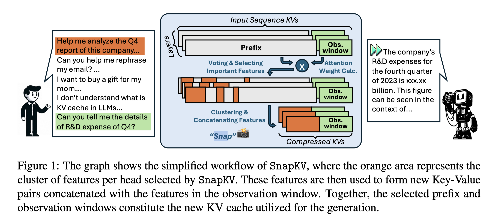 |  |  | [note](./notes/2024/SnapKV/note.md) |
|  1 | [TEAL](./meta/2025/TEAL.prototxt)     | [Training-Free Activation Sparsity in Large Language Models](http://arxiv.org/abs/2408.14690v1)   |    |     |    | [note](./notes/2025/TEAL/note.md)   |

<b>Tianlong Chen</b>
 

|    | meta                               | ttttttttttttttttttttttttttttttitle                                                                                          | ccccccccccccccccccover                                       | Publish                                                    | codeeeee                                                                  | note                                  |
|---:|:-----------------------------------|:----------------------------------------------------------------------------------------------------------------------------|:-------------------------------------------------------------|:-----------------------------------------------------------|:--------------------------------------------------------------------------|:--------------------------------------|
|  0 | [H2O](./meta/2023/H2O.prototxt)    | [H$_2$O: Heavy-Hitter Oracle for Efficient Generative Inference of Large Language Models](http://arxiv.org/abs/2306.14048)  |  |  |  | [note](./notes/2023/H2O/note.md)      |
|  1 | [m](./meta/2024/SN1PK7EK.prototxt) | [Revisiting Zeroth-Order Optimization for Memory-Efficient LLM Fine-Tuning: A Benchmark](http://arxiv.org/abs/2402.11592v2) |                                                              |  |  | [note](./notes/2024/SN1PK7EK/note.md) |

<b>Tianqi Chen</b>
 

|    | meta                                          | ttttttttttttttttttttttttttttttitle                                                                                           | ccccccccccccccccccover                                             | Publish                                                    | codeeeee                                                                           | note                                    |
|---:|:----------------------------------------------|:-----------------------------------------------------------------------------------------------------------------------------|:-------------------------------------------------------------------|:-----------------------------------------------------------|:-----------------------------------------------------------------------------------|:----------------------------------------|
|  0 | [XGrammar](./meta/2024/XGrammar.prototxt)     | [XGrammar: Flexible and Efficient Structured Generation Engine for Large Language Models](http://arxiv.org/abs/2411.15100v2) |  |  |           | [note](./notes/2024/XGrammar/note.md)   |
|  1 | [FlashInfer](./meta/2025/FlashInfer.prototxt) | [FlashInfer: Efficient and Customizable Attention Engine for LLM Inference Serving](http://arxiv.org/abs/2501.01005v2)       |                                                                    |  |  | [note](./notes/2025/FlashInfer/note.md) |

<b>Tianyu Fu</b>
 

|    | meta                               | ttttttttttttttttttttttttttttttitle                                                                                   | ccccccccccccccccccover                                                           | Publish                                                    | codeeeee                                                               | note                                  |
|---:|:-----------------------------------|:---------------------------------------------------------------------------------------------------------------------|:---------------------------------------------------------------------------------|:-----------------------------------------------------------|:-----------------------------------------------------------------------|:--------------------------------------|
|  0 | [m](./meta/2024/DHIB73MC.prototxt) | [A Survey on Efficient Inference for Large Language Models](http://arxiv.org/abs/2404.14294v2)                       |  |  |                                                                        | [note](./notes/2024/DHIB73MC/note.md) |
|  1 | [MoA](./meta/2024/MoA.prototxt)    | [MoA: Mixture of Sparse Attention for Automatic Large Language Model Compression](http://arxiv.org/abs/2406.14909v2) |                      |  |  | [note](./notes/2024/MoA/note.md)      |

<b>Tianyu Gao</b>
 

|    | meta                                              | ttttttttttttttttttttttttttttttitle                                                                                             | ccccccccccccccccccover                                                  | Publish                                                    | codeeeee                                                                             | note                                      |
|---:|:--------------------------------------------------|:-------------------------------------------------------------------------------------------------------------------------------|:------------------------------------------------------------------------|:-----------------------------------------------------------|:-------------------------------------------------------------------------------------|:------------------------------------------|
|  0 | [MeZO](./meta/2023/MeZO.prototxt)                 | [Fine-Tuning Language Models with Just Forward Passes](http://arxiv.org/abs/2305.17333v3)                                      |                                                                         |  |          | [note](./notes/2023/MeZO/note.md)         |
|  1 | [LLM-shearing](./meta/2023/LLM_shearing.prototxt) | [Sheared LLaMA: Accelerating Language Model Pre-training via Structured Pruning](https://xiamengzhou.github.io/sheared-llama/) |  |  |  | [note](./notes/2023/LLM_shearing/note.md) |

<b>Tianyu Sun</b>
 

|    | meta                                            | ttttttttttttttttttttttttttttttitle                                                                                      | ccccccccccccccccccover                                                | Publish                                                    | codeeeee                                                                          | note                                     |
|---:|:------------------------------------------------|:------------------------------------------------------------------------------------------------------------------------|:----------------------------------------------------------------------|:-----------------------------------------------------------|:----------------------------------------------------------------------------------|:-----------------------------------------|
|  0 | [DeepSeek-V2](./meta/2024/DeepSeek-V2.prototxt) | [DeepSeek-V2: A Strong, Economical, and Efficient Mixture-of-Experts Language Model](http://arxiv.org/abs/2405.04434v5) |  |  |  | [note](./notes/2024/DeepSeek-V2/note.md) |
|  1 | [DeepSeek-V3](./meta/2024/DeepSeek-V3.prototxt) | [DeepSeek-V3 Technical Report](http://arxiv.org/abs/2412.19437v1)                                                       |  |  |  | [note](./notes/2024/DeepSeek-V3/note.md) |
|  2 | [DeepSeek-R1](./meta/2025/DeepSeek-R1.prototxt) | [DeepSeek-R1: Incentivizing Reasoning Capability in LLMs via Reinforcement Learning](http://arxiv.org/abs/2501.12948v1) |  |  |  | [note](./notes/2025/DeepSeek-R1/note.md) |

<b>Tianzhu Ye</b>
 

|    | meta                                                    | ttttttttttttttttttttttttttttttitle                                                                   | ccccccccccccccccccover                                                    | Publish                                                    | codeeeee                                                                          | note                                         |
|---:|:--------------------------------------------------------|:-----------------------------------------------------------------------------------------------------|:--------------------------------------------------------------------------|:-----------------------------------------------------------|:----------------------------------------------------------------------------------|:---------------------------------------------|
|  0 | [ReSA](./meta/2025/ReSA.prototxt)                       | [Rectified Sparse Attention](http://arxiv.org/abs/2506.04108v2)                                      |             |  |          | [note](./notes/2025/ReSA/note.md)            |
|  1 | [SeerAttention-R](./meta/2025/SeerAttention-R.prototxt) | [SeerAttention-R: Sparse Attention Adaptation for Long Reasoning](http://arxiv.org/abs/2506.08889v1) |  |  |  | [note](./notes/2025/SeerAttention-R/note.md) |

<b>Tim Dettmers</b>
 

|    | meta                                | ttttttttttttttttttttttttttttttitle                                                                                       | ccccccccccccccccccover                                           | Publish                                                    | codeeeee                                                                 | note   |
|---:|:------------------------------------|:-------------------------------------------------------------------------------------------------------------------------|:-----------------------------------------------------------------|:-----------------------------------------------------------|:-------------------------------------------------------------------------|:-------|
|  0 | [QLoRA](./meta/2023/qlora.prototxt) | [QLoRA: Efficient Finetuning of Quantized LLMs](https://arxiv.org/abs/2305.14314)                                        |  |  |  |        |
|  1 | [SpQR](./meta/2023/spqr.prototxt)   | [SpQR: A Sparse-Quantized Representation for Near-Lossless LLM Weight Compression](https://arxiv.org/pdf/2306.03078.pdf) |                                                                  |  |   |        |

<b>Ting Cao</b>
 

|    | meta                                                    | ttttttttttttttttttttttttttttttitle                                                                   | ccccccccccccccccccover                                                           | Publish                                                    | codeeeee                                                                          | note                                         |
|---:|:--------------------------------------------------------|:-----------------------------------------------------------------------------------------------------|:---------------------------------------------------------------------------------|:-----------------------------------------------------------|:----------------------------------------------------------------------------------|:---------------------------------------------|
|  0 | [SeerAttention](./meta/2024/SeerAttention.prototxt)     | [SeerAttention: Learning Intrinsic Sparse Attention in Your LLMs](http://arxiv.org/abs/2410.13276v2) |  |  |  | [note](./notes/2024/SeerAttention/note.md)   |
|  1 | [SeerAttention-R](./meta/2025/SeerAttention-R.prototxt) | [SeerAttention-R: Sparse Attention Adaptation for Long Reasoning](http://arxiv.org/abs/2506.08889v1) |         |  |  | [note](./notes/2025/SeerAttention-R/note.md) |

<b>Tong Yang</b>
 

|    | meta                                  | ttttttttttttttttttttttttttttttitle                                                                                                        | ccccccccccccccccccover                                           | Publish                                                    | codeeeee                                                              | note                                |
|---:|:--------------------------------------|:------------------------------------------------------------------------------------------------------------------------------------------|:-----------------------------------------------------------------|:-----------------------------------------------------------|:----------------------------------------------------------------------|:------------------------------------|
|  0 | [HATA](./meta/2025/HATA.prototxt)     | [HATA: Trainable and Hardware-Efficient Hash-Aware Top-k Attention for Scalable Large Model Inference](http://arxiv.org/abs/2506.02572v1) |    |  |  | [note](./notes/2025/HATA/note.md)   |
|  1 | [KeepKV](./meta/2025/KeepKV.prototxt) | [KeepKV: Eliminating Output Perturbation in KV Cache Compression for Efficient LLMs Inference](http://arxiv.org/abs/2504.09936v1)         |  |  |                                                                       | [note](./notes/2025/KeepKV/note.md) |

<b>Torsten Hoefler</b>
 

|    | meta                                      | ttttttttttttttttttttttttttttttitle                                                                                                        | ccccccccccccccccccover                                                 | Publish                                                    | codeeeee                                                                                   | note                                  |
|---:|:------------------------------------------|:------------------------------------------------------------------------------------------------------------------------------------------|:-----------------------------------------------------------------------|:-----------------------------------------------------------|:-------------------------------------------------------------------------------------------|:--------------------------------------|
|  0 | [m](./meta/2021/ITZS3TU3.prototxt)        | [Sparsity in Deep Learning: Pruning and growth for efficient inference and training in neural networks](https://arxiv.org/abs/2102.00554) |                                                                        |  |                                                                                            |                                       |
|  1 | [VENOM](./meta/2023/VENOM.prototxt)       | [VENOM: A Vectorized N:M Format for Unleashing the Power of Sparse Tensor Cores](http://arxiv.org/abs/2310.02065v1)                       |          |     |                     | [note](./notes/2023/VENOM/note.md)    |
|  2 | [SliceGPT](./meta/2024/SliceGPT.prototxt) | [SliceGPT: Compress Large Language Models by Deleting Rows and Columns](http://arxiv.org/abs/2401.15024v2)                                |  |     |  | [note](./notes/2024/SliceGPT/note.md) |

<b>Tri Dao</b>
 

|    | meta                                                     | ttttttttttttttttttttttttttttttitle                                                                                   | ccccccccccccccccccover                                                    | Publish                                                    | codeeeee                                                                                     | note                                       |
|---:|:---------------------------------------------------------|:---------------------------------------------------------------------------------------------------------------------|:--------------------------------------------------------------------------|:-----------------------------------------------------------|:---------------------------------------------------------------------------------------------|:-------------------------------------------|
|  0 | [FlashAttention](./meta/2022/flashattention.prototxt)    | [FlashAttention: Fast and Memory-Efficient Exact Attention with IO-Awareness](https://arxiv.org/abs/2205.14135)      |  |  |           |                                            |
|  1 | [Flash-Decoding](./meta/2023/FlashDecoding.prototxt)     | [Flash-Decoding for long-context inference](https://crfm.stanford.edu/2023/10/12/flashdecoding.html)                 |                                                                           |  |                                                                                              | [note](./notes/2023/FlashDecoding/note.md) |
|  2 | [FlashAttention-2](./meta/2023/flashattention2.prototxt) | [FlashAttention-2: Faster Attention with Better Parallelism and Work Partitioning](https://arxiv.org/abs/2307.08691) |                                                                           |  |           |                                            |
|  3 | [GLA](./meta/2025/GLA.prototxt)                          | [Hardware-Efficient Attention for Fast Decoding](http://arxiv.org/abs/2505.21487v1)                                  |               |  |  | [note](./notes/2025/GLA/note.md)           |

<b>Tuo Zhao</b>
 

|    | meta                                      | ttttttttttttttttttttttttttttttitle                                                                                             | ccccccccccccccccccover                                                 | Publish                                                    | codeeeee                                                                      | note                               |
|---:|:------------------------------------------|:-------------------------------------------------------------------------------------------------------------------------------|:-----------------------------------------------------------------------|:-----------------------------------------------------------|:------------------------------------------------------------------------------|:-----------------------------------|
|  0 | [AdaLoRA](./meta/2023/adalora.prototxt)   | [AdaLoRA: Adaptive Budget Allocation for Parameter-Efficient Fine-Tuning](https://arxiv.org/pdf/2303.10512.pdf)                |    |     |  |                                    |
|  1 | [LoSparse](./meta/2023/LoSparse.prototxt) | [Structured Compression of Large Language Models based on Low-Rank and Sparse Approximation](https://arxiv.org/abs/2306.11222) | 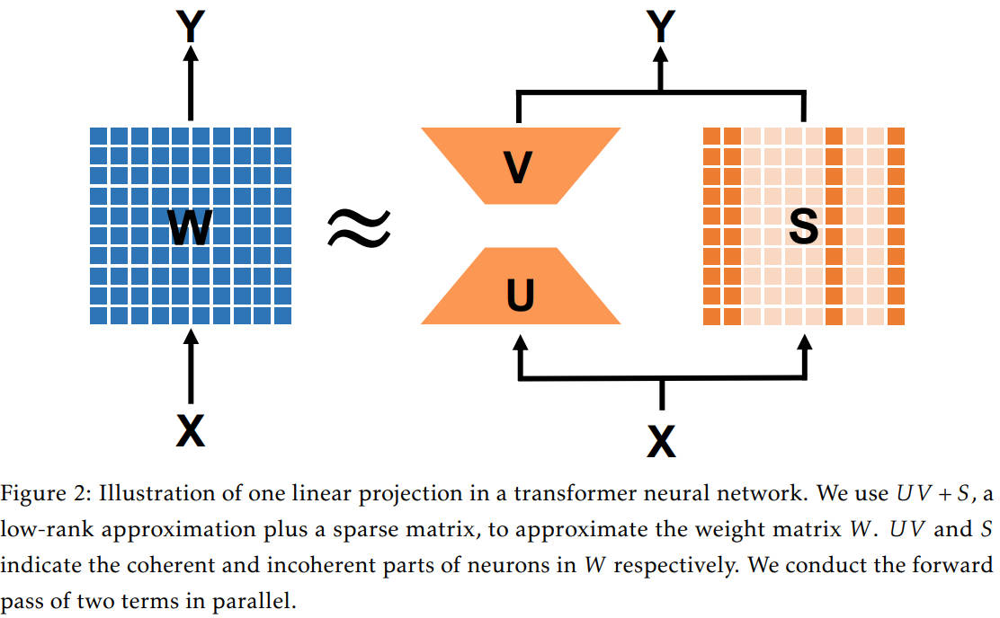 |     |    |                                    |
|  2 | [LoftQ](./meta/2023/loftq.prototxt)       | [LoftQ: LoRA-Fine-Tuning-Aware Quantization for Large Language Models](https://arxiv.org/abs/2310.08659)                       |        |  |       | [note](./notes/2023/loftq/note.md) |

<b>Vithursan Thangarasa</b>
 

|    | meta                                          | ttttttttttttttttttttttttttttttitle                                                                                  | ccccccccccccccccccover                                                    | Publish                                                    | codeeeee                                                                              | note                                    |
|---:|:----------------------------------------------|:--------------------------------------------------------------------------------------------------------------------|:--------------------------------------------------------------------------|:-----------------------------------------------------------|:--------------------------------------------------------------------------------------|:----------------------------------------|
|  0 | [SPDF](./meta/2023/spdf.prototxt)             | [SPDF: Sparse Pre-training and Dense Fine-tuning for Large Language Models](https://arxiv.org/abs/2303.10464)       |                                                                           |     |                                                                                       |                                         |
|  1 | [Sparse-IFT](./meta/2023/Sparse-IFT.prototxt) | [Sparse Iso-FLOP Transformations for Maximizing Training Efficiency](https://arxiv.org/abs/2303.11525)              |                                                                           |  |  |                                         |
|  2 | [Sparse-IFT](./meta/2024/Sparse-IFT.prototxt) | [Sparse-IFT: Sparse Iso-FLOP Transformations for Maximizing Training Efficiency](http://arxiv.org/abs/2303.11525v3) |  |     |  | [note](./notes/2024/Sparse-IFT/note.md) |

<b>W. L. Xiao</b>
 

|    | meta                                            | ttttttttttttttttttttttttttttttitle                                                                                      | ccccccccccccccccccover                                                | Publish                                                    | codeeeee                                                                          | note                                     |
|---:|:------------------------------------------------|:------------------------------------------------------------------------------------------------------------------------|:----------------------------------------------------------------------|:-----------------------------------------------------------|:----------------------------------------------------------------------------------|:-----------------------------------------|
|  0 | [DeepSeek-V2](./meta/2024/DeepSeek-V2.prototxt) | [DeepSeek-V2: A Strong, Economical, and Efficient Mixture-of-Experts Language Model](http://arxiv.org/abs/2405.04434v5) |  |  |  | [note](./notes/2024/DeepSeek-V2/note.md) |
|  1 | [DeepSeek-V3](./meta/2024/DeepSeek-V3.prototxt) | [DeepSeek-V3 Technical Report](http://arxiv.org/abs/2412.19437v1)                                                       |  |  |  | [note](./notes/2024/DeepSeek-V3/note.md) |
|  2 | [DeepSeek-R1](./meta/2025/DeepSeek-R1.prototxt) | [DeepSeek-R1: Incentivizing Reasoning Capability in LLMs via Reinforcement Learning](http://arxiv.org/abs/2501.12948v1) |  |  |  | [note](./notes/2025/DeepSeek-R1/note.md) |

<b>Wangding Zeng</b>
 

|    | meta                                            | ttttttttttttttttttttttttttttttitle                                                                                             | ccccccccccccccccccover                                                | Publish                                                    | codeeeee                                                                           | note                                     |
|---:|:------------------------------------------------|:-------------------------------------------------------------------------------------------------------------------------------|:----------------------------------------------------------------------|:-----------------------------------------------------------|:-----------------------------------------------------------------------------------|:-----------------------------------------|
|  0 | [DeepSeek-V2](./meta/2024/DeepSeek-V2.prototxt) | [DeepSeek-V2: A Strong, Economical, and Efficient Mixture-of-Experts Language Model](http://arxiv.org/abs/2405.04434v5)        |  |  |   | [note](./notes/2024/DeepSeek-V2/note.md) |
|  1 | [DeepSeek-V3](./meta/2024/DeepSeek-V3.prototxt) | [DeepSeek-V3 Technical Report](http://arxiv.org/abs/2412.19437v1)                                                              |  |  |   | [note](./notes/2024/DeepSeek-V3/note.md) |
|  2 | [DeepSeekMoE](./meta/2024/DeepSeekMoE.prototxt) | [DeepSeekMoE: Towards Ultimate Expert Specialization in Mixture-of-Experts Language Models](http://arxiv.org/abs/2401.06066v1) |  |  |  | [note](./notes/2024/DeepSeekMoE/note.md) |
|  3 | [DeepSeek-R1](./meta/2025/DeepSeek-R1.prototxt) | [DeepSeek-R1: Incentivizing Reasoning Capability in LLMs via Reinforcement Learning](http://arxiv.org/abs/2501.12948v1)        |  |  |   | [note](./notes/2025/DeepSeek-R1/note.md) |
|  4 | [NSA](./meta/2025/NSA.prototxt)                 | [Native Sparse Attention: Hardware-Aligned and Natively Trainable Sparse Attention](http://arxiv.org/abs/2502.11089v1)         |          |  |                                                                                    | [note](./notes/2025/NSA/note.md)         |

<b>Wanjia Zhao</b>
 

|    | meta                                            | ttttttttttttttttttttttttttttttitle                                                                                      | ccccccccccccccccccover                                                | Publish                                                    | codeeeee                                                                          | note                                     |
|---:|:------------------------------------------------|:------------------------------------------------------------------------------------------------------------------------|:----------------------------------------------------------------------|:-----------------------------------------------------------|:----------------------------------------------------------------------------------|:-----------------------------------------|
|  0 | [DeepSeek-V3](./meta/2024/DeepSeek-V3.prototxt) | [DeepSeek-V3 Technical Report](http://arxiv.org/abs/2412.19437v1)                                                       |  |  |  | [note](./notes/2024/DeepSeek-V3/note.md) |
|  1 | [DeepSeek-R1](./meta/2025/DeepSeek-R1.prototxt) | [DeepSeek-R1: Incentivizing Reasoning Capability in LLMs via Reinforcement Learning](http://arxiv.org/abs/2501.12948v1) |  |  |  | [note](./notes/2025/DeepSeek-R1/note.md) |

<b>Wei An</b>
 

|    | meta                                            | ttttttttttttttttttttttttttttttitle                                                                                      | ccccccccccccccccccover                                                | Publish                                                    | codeeeee                                                                          | note                                     |
|---:|:------------------------------------------------|:------------------------------------------------------------------------------------------------------------------------|:----------------------------------------------------------------------|:-----------------------------------------------------------|:----------------------------------------------------------------------------------|:-----------------------------------------|
|  0 | [DeepSeek-V2](./meta/2024/DeepSeek-V2.prototxt) | [DeepSeek-V2: A Strong, Economical, and Efficient Mixture-of-Experts Language Model](http://arxiv.org/abs/2405.04434v5) |  |  |  | [note](./notes/2024/DeepSeek-V2/note.md) |
|  1 | [DeepSeek-V3](./meta/2024/DeepSeek-V3.prototxt) | [DeepSeek-V3 Technical Report](http://arxiv.org/abs/2412.19437v1)                                                       |  |  |  | [note](./notes/2024/DeepSeek-V3/note.md) |
|  2 | [DeepSeek-R1](./meta/2025/DeepSeek-R1.prototxt) | [DeepSeek-R1: Incentivizing Reasoning Capability in LLMs via Reinforcement Learning](http://arxiv.org/abs/2501.12948v1) |  |  |  | [note](./notes/2025/DeepSeek-R1/note.md) |

<b>Wei Lin</b>
 

|    | meta                                                | ttttttttttttttttttttttttttttttitle                                                                                                                      | ccccccccccccccccccover                                                  | Publish                                                    | codeeeee                                                                            | note                                       |
|---:|:----------------------------------------------------|:--------------------------------------------------------------------------------------------------------------------------------------------------------|:------------------------------------------------------------------------|:-----------------------------------------------------------|:------------------------------------------------------------------------------------|:-------------------------------------------|
|  0 | [Flash-LLM](./meta/2024/flash_llm.prototxt)         | [Flash-LLM: Enabling Cost-Effective and Highly-Efficient Large Generative Model Inference with Unstructured Sparsity](https://arxiv.org/abs/2309.10285) |     |    |  | [note](./notes/2024/flash_llm/index.md)    |
|  1 | [DistAttention](./meta/2024/DistAttention.prototxt) | [Infinite-LLM: Efficient LLM Service for Long Context with DistAttention and Distributed KVCache](http://arxiv.org/abs/2401.02669v2)                    |  |  |                                                                                     | [note](./notes/2024/DistAttention/note.md) |

<b>Wei Wang</b>
 

|    | meta                                                  | ttttttttttttttttttttttttttttttitle                                                                                            | ccccccccccccccccccover                                                   | Publish                                                    | codeeeee                                                               | note                                        |
|---:|:------------------------------------------------------|:------------------------------------------------------------------------------------------------------------------------------|:-------------------------------------------------------------------------|:-----------------------------------------------------------|:-----------------------------------------------------------------------|:--------------------------------------------|
|  0 | [BRECQ](./meta/2021/brecq.prototxt)                   | [BRECQ: Pushing the Limit of Post-Training Quantization by Block Reconstruction](https://openreview.net/pdf?id=POWv6hDd9XH)   |                                                                          |     |  |                                             |
|  1 | [PowerAttention](./meta/2025/PowerAttention.prototxt) | [PowerAttention: Exponentially Scaling of Receptive Fields for Effective Sparse Attention](http://arxiv.org/abs/2503.03588v1) |  |  |                                                                        | [note](./notes/2025/PowerAttention/note.md) |

<b>Weiyu Huang</b>
 

|    | meta                                                                | ttttttttttttttttttttttttttttttitle                                                                               | ccccccccccccccccccover                                                          | Publish                                                 | codeeeee                                                                                 | note                                               |
|---:|:--------------------------------------------------------------------|:-----------------------------------------------------------------------------------------------------------------|:--------------------------------------------------------------------------------|:--------------------------------------------------------|:-----------------------------------------------------------------------------------------|:---------------------------------------------------|
|  0 | [m](./meta/2024/HYPL7G37.prototxt)                                  | [Accelerating Transformer Pre-training with 2:4 Sparsity](http://arxiv.org/abs/2404.01847v2)                     |                                                                                 |  |          | [note](./notes/2024/HYPL7G37/note.md)              |
|  1 | [AdaptiveSparseTrainer](./meta/2025/AdaptiveSparseTrainer.prototxt) | [Pruning Large Language Models with Semi-Structural Adaptive Sparse Training](http://arxiv.org/abs/2407.20584v3) |  |  |  | [note](./notes/2025/AdaptiveSparseTrainer/note.md) |

<b>Weizhu Chen</b>
 

|    | meta                                    | ttttttttttttttttttttttttttttttitle                                                                              | ccccccccccccccccccover                                               | Publish                                                    | codeeeee                                                                      | note                               |
|---:|:----------------------------------------|:----------------------------------------------------------------------------------------------------------------|:---------------------------------------------------------------------|:-----------------------------------------------------------|:------------------------------------------------------------------------------|:-----------------------------------|
|  0 | [LoRA](./meta/2022/lora.prototxt)       | [LoRA: Low-rank adaptation of large language models](https://arxiv.org/abs/2106.09685)                          |        |     |       |                                    |
|  1 | [AdaLoRA](./meta/2023/adalora.prototxt) | [AdaLoRA: Adaptive Budget Allocation for Parameter-Efficient Fine-Tuning](https://arxiv.org/pdf/2303.10512.pdf) |  |     |  |                                    |
|  2 | [LoftQ](./meta/2023/loftq.prototxt)     | [LoftQ: LoRA-Fine-Tuning-Aware Quantization for Large Language Models](https://arxiv.org/abs/2310.08659)        |      |  |       | [note](./notes/2023/loftq/note.md) |

<b>Wen Liu</b>
 

|    | meta                                            | ttttttttttttttttttttttttttttttitle                                                                                      | ccccccccccccccccccover                                                | Publish                                                    | codeeeee                                                                          | note                                     |
|---:|:------------------------------------------------|:------------------------------------------------------------------------------------------------------------------------|:----------------------------------------------------------------------|:-----------------------------------------------------------|:----------------------------------------------------------------------------------|:-----------------------------------------|
|  0 | [DeepSeek-V2](./meta/2024/DeepSeek-V2.prototxt) | [DeepSeek-V2: A Strong, Economical, and Efficient Mixture-of-Experts Language Model](http://arxiv.org/abs/2405.04434v5) |  |  |  | [note](./notes/2024/DeepSeek-V2/note.md) |
|  1 | [DeepSeek-V3](./meta/2024/DeepSeek-V3.prototxt) | [DeepSeek-V3 Technical Report](http://arxiv.org/abs/2412.19437v1)                                                       |  |  |  | [note](./notes/2024/DeepSeek-V3/note.md) |
|  2 | [DeepSeek-R1](./meta/2025/DeepSeek-R1.prototxt) | [DeepSeek-R1: Incentivizing Reasoning Capability in LLMs via Reinforcement Learning](http://arxiv.org/abs/2501.12948v1) |  |  |  | [note](./notes/2025/DeepSeek-R1/note.md) |

<b>Wenfeng Liang</b>
 

|    | meta                                            | ttttttttttttttttttttttttttttttitle                                                                                             | ccccccccccccccccccover                                                | Publish                                                    | codeeeee                                                                           | note                                     |
|---:|:------------------------------------------------|:-------------------------------------------------------------------------------------------------------------------------------|:----------------------------------------------------------------------|:-----------------------------------------------------------|:-----------------------------------------------------------------------------------|:-----------------------------------------|
|  0 | [DeepSeek-V2](./meta/2024/DeepSeek-V2.prototxt) | [DeepSeek-V2: A Strong, Economical, and Efficient Mixture-of-Experts Language Model](http://arxiv.org/abs/2405.04434v5)        |  |  |   | [note](./notes/2024/DeepSeek-V2/note.md) |
|  1 | [DeepSeek-V3](./meta/2024/DeepSeek-V3.prototxt) | [DeepSeek-V3 Technical Report](http://arxiv.org/abs/2412.19437v1)                                                              |  |  |   | [note](./notes/2024/DeepSeek-V3/note.md) |
|  2 | [DeepSeekMoE](./meta/2024/DeepSeekMoE.prototxt) | [DeepSeekMoE: Towards Ultimate Expert Specialization in Mixture-of-Experts Language Models](http://arxiv.org/abs/2401.06066v1) |  |  |  | [note](./notes/2024/DeepSeekMoE/note.md) |
|  3 | [DeepSeek-R1](./meta/2025/DeepSeek-R1.prototxt) | [DeepSeek-R1: Incentivizing Reasoning Capability in LLMs via Reinforcement Learning](http://arxiv.org/abs/2501.12948v1)        |  |  |   | [note](./notes/2025/DeepSeek-R1/note.md) |
|  4 | [NSA](./meta/2025/NSA.prototxt)                 | [Native Sparse Attention: Hardware-Aligned and Natively Trainable Sparse Attention](http://arxiv.org/abs/2502.11089v1)         |          |  |                                                                                    | [note](./notes/2025/NSA/note.md)         |

<b>Wenjun Gao</b>
 

|    | meta                                            | ttttttttttttttttttttttttttttttitle                                                                                      | ccccccccccccccccccover                                                | Publish                                                    | codeeeee                                                                          | note                                     |
|---:|:------------------------------------------------|:------------------------------------------------------------------------------------------------------------------------|:----------------------------------------------------------------------|:-----------------------------------------------------------|:----------------------------------------------------------------------------------|:-----------------------------------------|
|  0 | [DeepSeek-V2](./meta/2024/DeepSeek-V2.prototxt) | [DeepSeek-V2: A Strong, Economical, and Efficient Mixture-of-Experts Language Model](http://arxiv.org/abs/2405.04434v5) |  |  |  | [note](./notes/2024/DeepSeek-V2/note.md) |
|  1 | [DeepSeek-V3](./meta/2024/DeepSeek-V3.prototxt) | [DeepSeek-V3 Technical Report](http://arxiv.org/abs/2412.19437v1)                                                       |  |  |  | [note](./notes/2024/DeepSeek-V3/note.md) |
|  2 | [DeepSeek-R1](./meta/2025/DeepSeek-R1.prototxt) | [DeepSeek-R1: Incentivizing Reasoning Capability in LLMs via Reinforcement Learning](http://arxiv.org/abs/2501.12948v1) |  |  |  | [note](./notes/2025/DeepSeek-R1/note.md) |

<b>Wenqin Yu</b>
 

|    | meta                                            | ttttttttttttttttttttttttttttttitle                                                                                      | ccccccccccccccccccover                                                | Publish                                                    | codeeeee                                                                          | note                                     |
|---:|:------------------------------------------------|:------------------------------------------------------------------------------------------------------------------------|:----------------------------------------------------------------------|:-----------------------------------------------------------|:----------------------------------------------------------------------------------|:-----------------------------------------|
|  0 | [DeepSeek-V3](./meta/2024/DeepSeek-V3.prototxt) | [DeepSeek-V3 Technical Report](http://arxiv.org/abs/2412.19437v1)                                                       |  |  |  | [note](./notes/2024/DeepSeek-V3/note.md) |
|  1 | [DeepSeek-R1](./meta/2025/DeepSeek-R1.prototxt) | [DeepSeek-R1: Incentivizing Reasoning Capability in LLMs via Reinforcement Learning](http://arxiv.org/abs/2501.12948v1) |  |  |  | [note](./notes/2025/DeepSeek-R1/note.md) |

<b>Wentao Zhang</b>
 

|    | meta                                            | ttttttttttttttttttttttttttttttitle                                                                                      | ccccccccccccccccccover                                                | Publish                                                    | codeeeee                                                                          | note                                     |
|---:|:------------------------------------------------|:------------------------------------------------------------------------------------------------------------------------|:----------------------------------------------------------------------|:-----------------------------------------------------------|:----------------------------------------------------------------------------------|:-----------------------------------------|
|  0 | [DeepSeek-V2](./meta/2024/DeepSeek-V2.prototxt) | [DeepSeek-V2: A Strong, Economical, and Efficient Mixture-of-Experts Language Model](http://arxiv.org/abs/2405.04434v5) |  |  |  | [note](./notes/2024/DeepSeek-V2/note.md) |
|  1 | [DeepSeek-V3](./meta/2024/DeepSeek-V3.prototxt) | [DeepSeek-V3 Technical Report](http://arxiv.org/abs/2412.19437v1)                                                       |  |  |  | [note](./notes/2024/DeepSeek-V3/note.md) |
|  2 | [DeepSeek-R1](./meta/2025/DeepSeek-R1.prototxt) | [DeepSeek-R1: Incentivizing Reasoning Capability in LLMs via Reinforcement Learning](http://arxiv.org/abs/2501.12948v1) |  |  |  | [note](./notes/2025/DeepSeek-R1/note.md) |

<b>Woosuk Kwon</b>
 

|    | meta                                                   | ttttttttttttttttttttttttttttttitle                                                                                    | ccccccccccccccccccover                                                   | Publish                                                    | codeeeee                                                                                     | note                                        |
|---:|:-------------------------------------------------------|:----------------------------------------------------------------------------------------------------------------------|:-------------------------------------------------------------------------|:-----------------------------------------------------------|:---------------------------------------------------------------------------------------------|:--------------------------------------------|
|  0 | [FisherPruning](./meta/2022/fisherpruning.prototxt)    | [A Fast Post-Training Pruning Framework for Transformers](http://arxiv.org/abs/2204.09656v2)                          |  |  |  | [note](./notes/2022/fisherpruning/note.md)  |
|  1 | [Paged Attention](./meta/2023/PagedAttention.prototxt) | [Efficient Memory Management for Large Language Model Serving with PagedAttention](http://arxiv.org/abs/2309.06180v1) |  |   |                   | [note](./notes/2023/PagedAttention/note.md) |

<b>X. Q. Li</b>
 

|    | meta                                            | ttttttttttttttttttttttttttttttitle                                                                                      | ccccccccccccccccccover                                                | Publish                                                    | codeeeee                                                                          | note                                     |
|---:|:------------------------------------------------|:------------------------------------------------------------------------------------------------------------------------|:----------------------------------------------------------------------|:-----------------------------------------------------------|:----------------------------------------------------------------------------------|:-----------------------------------------|
|  0 | [DeepSeek-V2](./meta/2024/DeepSeek-V2.prototxt) | [DeepSeek-V2: A Strong, Economical, and Efficient Mixture-of-Experts Language Model](http://arxiv.org/abs/2405.04434v5) |  |  |  | [note](./notes/2024/DeepSeek-V2/note.md) |
|  1 | [DeepSeek-V3](./meta/2024/DeepSeek-V3.prototxt) | [DeepSeek-V3 Technical Report](http://arxiv.org/abs/2412.19437v1)                                                       |  |  |  | [note](./notes/2024/DeepSeek-V3/note.md) |
|  2 | [DeepSeek-R1](./meta/2025/DeepSeek-R1.prototxt) | [DeepSeek-R1: Incentivizing Reasoning Capability in LLMs via Reinforcement Learning](http://arxiv.org/abs/2501.12948v1) |  |  |  | [note](./notes/2025/DeepSeek-R1/note.md) |

<b>Xiafei Qiu</b>
 

|    | meta                                                | ttttttttttttttttttttttttttttttitle                                                                                                                      | ccccccccccccccccccover                                                  | Publish                                                    | codeeeee                                                                            | note                                       |
|---:|:----------------------------------------------------|:--------------------------------------------------------------------------------------------------------------------------------------------------------|:------------------------------------------------------------------------|:-----------------------------------------------------------|:------------------------------------------------------------------------------------|:-------------------------------------------|
|  0 | [Flash-LLM](./meta/2024/flash_llm.prototxt)         | [Flash-LLM: Enabling Cost-Effective and Highly-Efficient Large Generative Model Inference with Unstructured Sparsity](https://arxiv.org/abs/2309.10285) |     |    |  | [note](./notes/2024/flash_llm/index.md)    |
|  1 | [DistAttention](./meta/2024/DistAttention.prototxt) | [Infinite-LLM: Efficient LLM Service for Long Context with DistAttention and Distributed KVCache](http://arxiv.org/abs/2401.02669v2)                    |  |  |                                                                                     | [note](./notes/2024/DistAttention/note.md) |

<b>Xiang Liu</b>
 

|    | meta                                    | ttttttttttttttttttttttttttttttitle                                                                                              | ccccccccccccccccccover                                            | Publish                                                    | codeeeee   | note                                 |
|---:|:----------------------------------------|:--------------------------------------------------------------------------------------------------------------------------------|:------------------------------------------------------------------|:-----------------------------------------------------------|:-----------|:-------------------------------------|
|  0 | [LISA](./meta/2024/LISA.prototxt)       | [LISA: Layerwise Importance Sampling for Memory-Efficient Large Language Model Fine-Tuning](http://arxiv.org/abs/2403.17919v1)  |                                                                   |  |            | [note](./notes/2024/LISA/note.md)    |
|  1 | [ChunkKV](./meta/2025/ChunkKV.prototxt) | [ChunkKV: Semantic-Preserving KV Cache Compression for Efficient Long-Context LLM Inference](http://arxiv.org/abs/2502.00299v1) |  |  |            | [note](./notes/2025/ChunkKV/note.md) |

<b>Xiangyue Jin</b>
 

|    | meta                                            | ttttttttttttttttttttttttttttttitle                                                                                      | ccccccccccccccccccover                                                | Publish                                                    | codeeeee                                                                          | note                                     |
|---:|:------------------------------------------------|:------------------------------------------------------------------------------------------------------------------------|:----------------------------------------------------------------------|:-----------------------------------------------------------|:----------------------------------------------------------------------------------|:-----------------------------------------|
|  0 | [DeepSeek-V2](./meta/2024/DeepSeek-V2.prototxt) | [DeepSeek-V2: A Strong, Economical, and Efficient Mixture-of-Experts Language Model](http://arxiv.org/abs/2405.04434v5) |  |  |  | [note](./notes/2024/DeepSeek-V2/note.md) |
|  1 | [DeepSeek-V3](./meta/2024/DeepSeek-V3.prototxt) | [DeepSeek-V3 Technical Report](http://arxiv.org/abs/2412.19437v1)                                                       |  |  |  | [note](./notes/2024/DeepSeek-V3/note.md) |
|  2 | [DeepSeek-R1](./meta/2025/DeepSeek-R1.prototxt) | [DeepSeek-R1: Incentivizing Reasoning Capability in LLMs via Reinforcement Learning](http://arxiv.org/abs/2501.12948v1) |  |  |  | [note](./notes/2025/DeepSeek-R1/note.md) |

<b>Xianzhi Yu</b>
 

|    | meta                                                          | ttttttttttttttttttttttttttttttitle                                                                            | ccccccccccccccccccover                                                       | Publish                                                    | codeeeee   | note                                            |
|---:|:--------------------------------------------------------------|:--------------------------------------------------------------------------------------------------------------|:-----------------------------------------------------------------------------|:-----------------------------------------------------------|:-----------|:------------------------------------------------|
|  0 | [LinearPatch](./meta/2025/LinearPatch.prototxt)               | [A Simple Linear Patch Revives Layer-Pruned Large Language Models](http://arxiv.org/abs/2505.24680v1)         |         |  |            | [note](./notes/2025/LinearPatch/note.md)        |
|  1 | [AttentionPredictor](./meta/2025/AttentionPredictor.prototxt) | [AttentionPredictor: Temporal Pattern Matters for Efficient LLM Inference](http://arxiv.org/abs/2502.04077v1) |  |  |            | [note](./notes/2025/AttentionPredictor/note.md) |

<b>Xianzu Wang</b>
 

|    | meta                                            | ttttttttttttttttttttttttttttttitle                                                                                      | ccccccccccccccccccover                                                | Publish                                                    | codeeeee                                                                          | note                                     |
|---:|:------------------------------------------------|:------------------------------------------------------------------------------------------------------------------------|:----------------------------------------------------------------------|:-----------------------------------------------------------|:----------------------------------------------------------------------------------|:-----------------------------------------|
|  0 | [DeepSeek-V2](./meta/2024/DeepSeek-V2.prototxt) | [DeepSeek-V2: A Strong, Economical, and Efficient Mixture-of-Experts Language Model](http://arxiv.org/abs/2405.04434v5) |  |  |  | [note](./notes/2024/DeepSeek-V2/note.md) |
|  1 | [DeepSeek-V3](./meta/2024/DeepSeek-V3.prototxt) | [DeepSeek-V3 Technical Report](http://arxiv.org/abs/2412.19437v1)                                                       |  |  |  | [note](./notes/2024/DeepSeek-V3/note.md) |
|  2 | [DeepSeek-R1](./meta/2025/DeepSeek-R1.prototxt) | [DeepSeek-R1: Incentivizing Reasoning Capability in LLMs via Reinforcement Learning](http://arxiv.org/abs/2501.12948v1) |  |  |  | [note](./notes/2025/DeepSeek-R1/note.md) |

<b>Xiao Bi</b>
 

|    | meta                                            | ttttttttttttttttttttttttttttttitle                                                                                      | ccccccccccccccccccover                                                | Publish                                                    | codeeeee                                                                          | note                                     |
|---:|:------------------------------------------------|:------------------------------------------------------------------------------------------------------------------------|:----------------------------------------------------------------------|:-----------------------------------------------------------|:----------------------------------------------------------------------------------|:-----------------------------------------|
|  0 | [DeepSeek-V2](./meta/2024/DeepSeek-V2.prototxt) | [DeepSeek-V2: A Strong, Economical, and Efficient Mixture-of-Experts Language Model](http://arxiv.org/abs/2405.04434v5) |  |  |  | [note](./notes/2024/DeepSeek-V2/note.md) |
|  1 | [DeepSeek-V3](./meta/2024/DeepSeek-V3.prototxt) | [DeepSeek-V3 Technical Report](http://arxiv.org/abs/2412.19437v1)                                                       |  |  |  | [note](./notes/2024/DeepSeek-V3/note.md) |
|  2 | [DeepSeek-R1](./meta/2025/DeepSeek-R1.prototxt) | [DeepSeek-R1: Incentivizing Reasoning Capability in LLMs via Reinforcement Learning](http://arxiv.org/abs/2501.12948v1) |  |  |  | [note](./notes/2025/DeepSeek-R1/note.md) |

<b>Xiaodong Liu</b>
 

|    | meta                                            | ttttttttttttttttttttttttttttttitle                                                                                      | ccccccccccccccccccover                                                | Publish                                                    | codeeeee                                                                          | note                                     |
|---:|:------------------------------------------------|:------------------------------------------------------------------------------------------------------------------------|:----------------------------------------------------------------------|:-----------------------------------------------------------|:----------------------------------------------------------------------------------|:-----------------------------------------|
|  0 | [DeepSeek-V2](./meta/2024/DeepSeek-V2.prototxt) | [DeepSeek-V2: A Strong, Economical, and Efficient Mixture-of-Experts Language Model](http://arxiv.org/abs/2405.04434v5) |  |  |  | [note](./notes/2024/DeepSeek-V2/note.md) |
|  1 | [DeepSeek-V3](./meta/2024/DeepSeek-V3.prototxt) | [DeepSeek-V3 Technical Report](http://arxiv.org/abs/2412.19437v1)                                                       |  |  |  | [note](./notes/2024/DeepSeek-V3/note.md) |
|  2 | [DeepSeek-R1](./meta/2025/DeepSeek-R1.prototxt) | [DeepSeek-R1: Incentivizing Reasoning Capability in LLMs via Reinforcement Learning](http://arxiv.org/abs/2501.12948v1) |  |  |  | [note](./notes/2025/DeepSeek-R1/note.md) |

<b>Xiaohan Wang</b>
 

|    | meta                                            | ttttttttttttttttttttttttttttttitle                                                                                      | ccccccccccccccccccover                                                | Publish                                                    | codeeeee                                                                          | note                                     |
|---:|:------------------------------------------------|:------------------------------------------------------------------------------------------------------------------------|:----------------------------------------------------------------------|:-----------------------------------------------------------|:----------------------------------------------------------------------------------|:-----------------------------------------|
|  0 | [DeepSeek-V2](./meta/2024/DeepSeek-V2.prototxt) | [DeepSeek-V2: A Strong, Economical, and Efficient Mixture-of-Experts Language Model](http://arxiv.org/abs/2405.04434v5) |  |  |  | [note](./notes/2024/DeepSeek-V2/note.md) |
|  1 | [DeepSeek-V3](./meta/2024/DeepSeek-V3.prototxt) | [DeepSeek-V3 Technical Report](http://arxiv.org/abs/2412.19437v1)                                                       |  |  |  | [note](./notes/2024/DeepSeek-V3/note.md) |
|  2 | [DeepSeek-R1](./meta/2025/DeepSeek-R1.prototxt) | [DeepSeek-R1: Incentivizing Reasoning Capability in LLMs via Reinforcement Learning](http://arxiv.org/abs/2501.12948v1) |  |  |  | [note](./notes/2025/DeepSeek-R1/note.md) |

<b>Xiaojin Shen</b>
 

|    | meta                                            | ttttttttttttttttttttttttttttttitle                                                                                      | ccccccccccccccccccover                                                | Publish                                                    | codeeeee                                                                          | note                                     |
|---:|:------------------------------------------------|:------------------------------------------------------------------------------------------------------------------------|:----------------------------------------------------------------------|:-----------------------------------------------------------|:----------------------------------------------------------------------------------|:-----------------------------------------|
|  0 | [DeepSeek-V2](./meta/2024/DeepSeek-V2.prototxt) | [DeepSeek-V2: A Strong, Economical, and Efficient Mixture-of-Experts Language Model](http://arxiv.org/abs/2405.04434v5) |  |  |  | [note](./notes/2024/DeepSeek-V2/note.md) |
|  1 | [DeepSeek-V3](./meta/2024/DeepSeek-V3.prototxt) | [DeepSeek-V3 Technical Report](http://arxiv.org/abs/2412.19437v1)                                                       |  |  |  | [note](./notes/2024/DeepSeek-V3/note.md) |
|  2 | [DeepSeek-R1](./meta/2025/DeepSeek-R1.prototxt) | [DeepSeek-R1: Incentivizing Reasoning Capability in LLMs via Reinforcement Learning](http://arxiv.org/abs/2501.12948v1) |  |  |  | [note](./notes/2025/DeepSeek-R1/note.md) |

<b>Xiaokang Chen</b>
 

|    | meta                                            | ttttttttttttttttttttttttttttttitle                                                                                      | ccccccccccccccccccover                                                | Publish                                                    | codeeeee                                                                          | note                                     |
|---:|:------------------------------------------------|:------------------------------------------------------------------------------------------------------------------------|:----------------------------------------------------------------------|:-----------------------------------------------------------|:----------------------------------------------------------------------------------|:-----------------------------------------|
|  0 | [DeepSeek-V2](./meta/2024/DeepSeek-V2.prototxt) | [DeepSeek-V2: A Strong, Economical, and Efficient Mixture-of-Experts Language Model](http://arxiv.org/abs/2405.04434v5) |  |  |  | [note](./notes/2024/DeepSeek-V2/note.md) |
|  1 | [DeepSeek-V3](./meta/2024/DeepSeek-V3.prototxt) | [DeepSeek-V3 Technical Report](http://arxiv.org/abs/2412.19437v1)                                                       |  |  |  | [note](./notes/2024/DeepSeek-V3/note.md) |
|  2 | [DeepSeek-R1](./meta/2025/DeepSeek-R1.prototxt) | [DeepSeek-R1: Incentivizing Reasoning Capability in LLMs via Reinforcement Learning](http://arxiv.org/abs/2501.12948v1) |  |  |  | [note](./notes/2025/DeepSeek-R1/note.md) |

<b>Xiaokang Zhang</b>
 

|    | meta                                            | ttttttttttttttttttttttttttttttitle                                                                                      | ccccccccccccccccccover                                                | Publish                                                    | codeeeee                                                                          | note                                     |
|---:|:------------------------------------------------|:------------------------------------------------------------------------------------------------------------------------|:----------------------------------------------------------------------|:-----------------------------------------------------------|:----------------------------------------------------------------------------------|:-----------------------------------------|
|  0 | [DeepSeek-V3](./meta/2024/DeepSeek-V3.prototxt) | [DeepSeek-V3 Technical Report](http://arxiv.org/abs/2412.19437v1)                                                       |  |  |  | [note](./notes/2024/DeepSeek-V3/note.md) |
|  1 | [DeepSeek-R1](./meta/2025/DeepSeek-R1.prototxt) | [DeepSeek-R1: Incentivizing Reasoning Capability in LLMs via Reinforcement Learning](http://arxiv.org/abs/2501.12948v1) |  |  |  | [note](./notes/2025/DeepSeek-R1/note.md) |

<b>Xiaosha Chen</b>
 

|    | meta                                            | ttttttttttttttttttttttttttttttitle                                                                                      | ccccccccccccccccccover                                                | Publish                                                    | codeeeee                                                                          | note                                     |
|---:|:------------------------------------------------|:------------------------------------------------------------------------------------------------------------------------|:----------------------------------------------------------------------|:-----------------------------------------------------------|:----------------------------------------------------------------------------------|:-----------------------------------------|
|  0 | [DeepSeek-V2](./meta/2024/DeepSeek-V2.prototxt) | [DeepSeek-V2: A Strong, Economical, and Efficient Mixture-of-Experts Language Model](http://arxiv.org/abs/2405.04434v5) |  |  |  | [note](./notes/2024/DeepSeek-V2/note.md) |
|  1 | [DeepSeek-V3](./meta/2024/DeepSeek-V3.prototxt) | [DeepSeek-V3 Technical Report](http://arxiv.org/abs/2412.19437v1)                                                       |  |  |  | [note](./notes/2024/DeepSeek-V3/note.md) |
|  2 | [DeepSeek-R1](./meta/2025/DeepSeek-R1.prototxt) | [DeepSeek-R1: Incentivizing Reasoning Capability in LLMs via Reinforcement Learning](http://arxiv.org/abs/2501.12948v1) |  |  |  | [note](./notes/2025/DeepSeek-R1/note.md) |

<b>Xiaotao Nie</b>
 

|    | meta                                            | ttttttttttttttttttttttttttttttitle                                                                                      | ccccccccccccccccccover                                                | Publish                                                    | codeeeee                                                                          | note                                     |
|---:|:------------------------------------------------|:------------------------------------------------------------------------------------------------------------------------|:----------------------------------------------------------------------|:-----------------------------------------------------------|:----------------------------------------------------------------------------------|:-----------------------------------------|
|  0 | [DeepSeek-V2](./meta/2024/DeepSeek-V2.prototxt) | [DeepSeek-V2: A Strong, Economical, and Efficient Mixture-of-Experts Language Model](http://arxiv.org/abs/2405.04434v5) |  |  |  | [note](./notes/2024/DeepSeek-V2/note.md) |
|  1 | [DeepSeek-V3](./meta/2024/DeepSeek-V3.prototxt) | [DeepSeek-V3 Technical Report](http://arxiv.org/abs/2412.19437v1)                                                       |  |  |  | [note](./notes/2024/DeepSeek-V3/note.md) |
|  2 | [DeepSeek-R1](./meta/2025/DeepSeek-R1.prototxt) | [DeepSeek-R1: Incentivizing Reasoning Capability in LLMs via Reinforcement Learning](http://arxiv.org/abs/2501.12948v1) |  |  |  | [note](./notes/2025/DeepSeek-R1/note.md) |

<b>Xiaowen Sun</b>
 

|    | meta                                            | ttttttttttttttttttttttttttttttitle                                                                                      | ccccccccccccccccccover                                                | Publish                                                    | codeeeee                                                                          | note                                     |
|---:|:------------------------------------------------|:------------------------------------------------------------------------------------------------------------------------|:----------------------------------------------------------------------|:-----------------------------------------------------------|:----------------------------------------------------------------------------------|:-----------------------------------------|
|  0 | [DeepSeek-V2](./meta/2024/DeepSeek-V2.prototxt) | [DeepSeek-V2: A Strong, Economical, and Efficient Mixture-of-Experts Language Model](http://arxiv.org/abs/2405.04434v5) |  |  |  | [note](./notes/2024/DeepSeek-V2/note.md) |
|  1 | [DeepSeek-V3](./meta/2024/DeepSeek-V3.prototxt) | [DeepSeek-V3 Technical Report](http://arxiv.org/abs/2412.19437v1)                                                       |  |  |  | [note](./notes/2024/DeepSeek-V3/note.md) |
|  2 | [DeepSeek-R1](./meta/2025/DeepSeek-R1.prototxt) | [DeepSeek-R1: Incentivizing Reasoning Capability in LLMs via Reinforcement Learning](http://arxiv.org/abs/2501.12948v1) |  |  |  | [note](./notes/2025/DeepSeek-R1/note.md) |

<b>Xiaoxiang Wang</b>
 

|    | meta                                            | ttttttttttttttttttttttttttttttitle                                                                                      | ccccccccccccccccccover                                                | Publish                                                    | codeeeee                                                                          | note                                     |
|---:|:------------------------------------------------|:------------------------------------------------------------------------------------------------------------------------|:----------------------------------------------------------------------|:-----------------------------------------------------------|:----------------------------------------------------------------------------------|:-----------------------------------------|
|  0 | [DeepSeek-V2](./meta/2024/DeepSeek-V2.prototxt) | [DeepSeek-V2: A Strong, Economical, and Efficient Mixture-of-Experts Language Model](http://arxiv.org/abs/2405.04434v5) |  |  |  | [note](./notes/2024/DeepSeek-V2/note.md) |
|  1 | [DeepSeek-V3](./meta/2024/DeepSeek-V3.prototxt) | [DeepSeek-V3 Technical Report](http://arxiv.org/abs/2412.19437v1)                                                       |  |  |  | [note](./notes/2024/DeepSeek-V3/note.md) |
|  2 | [DeepSeek-R1](./meta/2025/DeepSeek-R1.prototxt) | [DeepSeek-R1: Incentivizing Reasoning Capability in LLMs via Reinforcement Learning](http://arxiv.org/abs/2501.12948v1) |  |  |  | [note](./notes/2025/DeepSeek-R1/note.md) |

<b>Xin Cheng</b>
 

|    | meta                                            | ttttttttttttttttttttttttttttttitle                                                                                      | ccccccccccccccccccover                                                | Publish                                                    | codeeeee                                                                          | note                                     |
|---:|:------------------------------------------------|:------------------------------------------------------------------------------------------------------------------------|:----------------------------------------------------------------------|:-----------------------------------------------------------|:----------------------------------------------------------------------------------|:-----------------------------------------|
|  0 | [DeepSeek-V3](./meta/2024/DeepSeek-V3.prototxt) | [DeepSeek-V3 Technical Report](http://arxiv.org/abs/2412.19437v1)                                                       |  |  |  | [note](./notes/2024/DeepSeek-V3/note.md) |
|  1 | [DeepSeek-R1](./meta/2025/DeepSeek-R1.prototxt) | [DeepSeek-R1: Incentivizing Reasoning Capability in LLMs via Reinforcement Learning](http://arxiv.org/abs/2501.12948v1) |  |  |  | [note](./notes/2025/DeepSeek-R1/note.md) |

<b>Xin Liu</b>
 

|    | meta                                            | ttttttttttttttttttttttttttttttitle                                                                                                | ccccccccccccccccccover                                                 | Publish                                                    | codeeeee                                                                          | note                                     |
|---:|:------------------------------------------------|:----------------------------------------------------------------------------------------------------------------------------------|:-----------------------------------------------------------------------|:-----------------------------------------------------------|:----------------------------------------------------------------------------------|:-----------------------------------------|
|  0 | [DeepSeek-V2](./meta/2024/DeepSeek-V2.prototxt) | [DeepSeek-V2: A Strong, Economical, and Efficient Mixture-of-Experts Language Model](http://arxiv.org/abs/2405.04434v5)           |   |  |  | [note](./notes/2024/DeepSeek-V2/note.md) |
|  1 | [DeepSeek-V3](./meta/2024/DeepSeek-V3.prototxt) | [DeepSeek-V3 Technical Report](http://arxiv.org/abs/2412.19437v1)                                                                 |   |  |  | [note](./notes/2024/DeepSeek-V3/note.md) |
|  2 | [ShadowKV](./meta/2024/ShadowKV.prototxt)       | [ShadowKV: KV Cache in Shadows for High-Throughput Long-Context LLM Inference](http://arxiv.org/abs/2410.21465v1)                 |  |  |       | [note](./notes/2024/ShadowKV/note.md)    |
|  3 | [DeepSeek-R1](./meta/2025/DeepSeek-R1.prototxt) | [DeepSeek-R1: Incentivizing Reasoning Capability in LLMs via Reinforcement Learning](http://arxiv.org/abs/2501.12948v1)           |   |  |  | [note](./notes/2025/DeepSeek-R1/note.md) |
|  4 | [KeepKV](./meta/2025/KeepKV.prototxt)           | [KeepKV: Eliminating Output Perturbation in KV Cache Compression for Efficient LLMs Inference](http://arxiv.org/abs/2504.09936v1) |        |  |                                                                                   | [note](./notes/2025/KeepKV/note.md)      |

<b>Xin Xie</b>
 

|    | meta                                            | ttttttttttttttttttttttttttttttitle                                                                                      | ccccccccccccccccccover                                                | Publish                                                    | codeeeee                                                                          | note                                     |
|---:|:------------------------------------------------|:------------------------------------------------------------------------------------------------------------------------|:----------------------------------------------------------------------|:-----------------------------------------------------------|:----------------------------------------------------------------------------------|:-----------------------------------------|
|  0 | [DeepSeek-V2](./meta/2024/DeepSeek-V2.prototxt) | [DeepSeek-V2: A Strong, Economical, and Efficient Mixture-of-Experts Language Model](http://arxiv.org/abs/2405.04434v5) |  |  |  | [note](./notes/2024/DeepSeek-V2/note.md) |
|  1 | [DeepSeek-V3](./meta/2024/DeepSeek-V3.prototxt) | [DeepSeek-V3 Technical Report](http://arxiv.org/abs/2412.19437v1)                                                       |  |  |  | [note](./notes/2024/DeepSeek-V3/note.md) |
|  2 | [DeepSeek-R1](./meta/2025/DeepSeek-R1.prototxt) | [DeepSeek-R1: Incentivizing Reasoning Capability in LLMs via Reinforcement Learning](http://arxiv.org/abs/2501.12948v1) |  |  |  | [note](./notes/2025/DeepSeek-R1/note.md) |

<b>Xinchao Wang</b>
 

|    | meta                                          | ttttttttttttttttttttttttttttttitle                                                                         | ccccccccccccccccccover                                                | Publish                                                    | codeeeee                                                                     | note                                    |
|---:|:----------------------------------------------|:-----------------------------------------------------------------------------------------------------------|:----------------------------------------------------------------------|:-----------------------------------------------------------|:-----------------------------------------------------------------------------|:----------------------------------------|
|  0 | [LLM-Pruner](./meta/2023/LLM-Pruner.prototxt) | [LLM-Pruner: On the Structural Pruning of Large Language Models](http://arxiv.org/abs/2305.11627v3)        |  |  |  | [note](./notes/2023/LLM-Pruner/note.md) |
|  1 | [MaskLLM](./meta/2024/MaskLLM.prototxt)       | [MaskLLM: Learnable Semi-Structured Sparsity for Large Language Models](http://arxiv.org/abs/2409.17481v1) |   |  |      | [note](./notes/2024/MaskLLM/note.md)    |

<b>Xingchao Liu</b>
 

|    | meta                                            | ttttttttttttttttttttttttttttttitle                                                                                      | ccccccccccccccccccover                                                | Publish                                                    | codeeeee                                                                          | note                                     |
|---:|:------------------------------------------------|:------------------------------------------------------------------------------------------------------------------------|:----------------------------------------------------------------------|:-----------------------------------------------------------|:----------------------------------------------------------------------------------|:-----------------------------------------|
|  0 | [DeepSeek-V3](./meta/2024/DeepSeek-V3.prototxt) | [DeepSeek-V3 Technical Report](http://arxiv.org/abs/2412.19437v1)                                                       |  |  |  | [note](./notes/2024/DeepSeek-V3/note.md) |
|  1 | [DeepSeek-R1](./meta/2025/DeepSeek-R1.prototxt) | [DeepSeek-R1: Incentivizing Reasoning Capability in LLMs via Reinforcement Learning](http://arxiv.org/abs/2501.12948v1) |  |  |  | [note](./notes/2025/DeepSeek-R1/note.md) |

<b>Xingkai Yu</b>
 

|    | meta                                            | ttttttttttttttttttttttttttttttitle                                                                                             | ccccccccccccccccccover                                                | Publish                                                    | codeeeee                                                                           | note                                     |
|---:|:------------------------------------------------|:-------------------------------------------------------------------------------------------------------------------------------|:----------------------------------------------------------------------|:-----------------------------------------------------------|:-----------------------------------------------------------------------------------|:-----------------------------------------|
|  0 | [DeepSeek-V2](./meta/2024/DeepSeek-V2.prototxt) | [DeepSeek-V2: A Strong, Economical, and Efficient Mixture-of-Experts Language Model](http://arxiv.org/abs/2405.04434v5)        |  |  |   | [note](./notes/2024/DeepSeek-V2/note.md) |
|  1 | [DeepSeek-V3](./meta/2024/DeepSeek-V3.prototxt) | [DeepSeek-V3 Technical Report](http://arxiv.org/abs/2412.19437v1)                                                              |  |  |   | [note](./notes/2024/DeepSeek-V3/note.md) |
|  2 | [DeepSeekMoE](./meta/2024/DeepSeekMoE.prototxt) | [DeepSeekMoE: Towards Ultimate Expert Specialization in Mixture-of-Experts Language Models](http://arxiv.org/abs/2401.06066v1) |  |  |  | [note](./notes/2024/DeepSeekMoE/note.md) |
|  3 | [DeepSeek-R1](./meta/2025/DeepSeek-R1.prototxt) | [DeepSeek-R1: Incentivizing Reasoning Capability in LLMs via Reinforcement Learning](http://arxiv.org/abs/2501.12948v1)        |  |  |   | [note](./notes/2025/DeepSeek-R1/note.md) |

<b>Xinnan Song</b>
 

|    | meta                                            | ttttttttttttttttttttttttttttttitle                                                                                      | ccccccccccccccccccover                                                | Publish                                                    | codeeeee                                                                          | note                                     |
|---:|:------------------------------------------------|:------------------------------------------------------------------------------------------------------------------------|:----------------------------------------------------------------------|:-----------------------------------------------------------|:----------------------------------------------------------------------------------|:-----------------------------------------|
|  0 | [DeepSeek-V2](./meta/2024/DeepSeek-V2.prototxt) | [DeepSeek-V2: A Strong, Economical, and Efficient Mixture-of-Experts Language Model](http://arxiv.org/abs/2405.04434v5) |  |  |  | [note](./notes/2024/DeepSeek-V2/note.md) |
|  1 | [DeepSeek-V3](./meta/2024/DeepSeek-V3.prototxt) | [DeepSeek-V3 Technical Report](http://arxiv.org/abs/2412.19437v1)                                                       |  |  |  | [note](./notes/2024/DeepSeek-V3/note.md) |
|  2 | [DeepSeek-R1](./meta/2025/DeepSeek-R1.prototxt) | [DeepSeek-R1: Incentivizing Reasoning Capability in LLMs via Reinforcement Learning](http://arxiv.org/abs/2501.12948v1) |  |  |  | [note](./notes/2025/DeepSeek-R1/note.md) |

<b>Xinxia Shan</b>
 

|    | meta                                            | ttttttttttttttttttttttttttttttitle                                                                                      | ccccccccccccccccccover                                                | Publish                                                    | codeeeee                                                                          | note                                     |
|---:|:------------------------------------------------|:------------------------------------------------------------------------------------------------------------------------|:----------------------------------------------------------------------|:-----------------------------------------------------------|:----------------------------------------------------------------------------------|:-----------------------------------------|
|  0 | [DeepSeek-V3](./meta/2024/DeepSeek-V3.prototxt) | [DeepSeek-V3 Technical Report](http://arxiv.org/abs/2412.19437v1)                                                       |  |  |  | [note](./notes/2024/DeepSeek-V3/note.md) |
|  1 | [DeepSeek-R1](./meta/2025/DeepSeek-R1.prototxt) | [DeepSeek-R1: Incentivizing Reasoning Capability in LLMs via Reinforcement Learning](http://arxiv.org/abs/2501.12948v1) |  |  |  | [note](./notes/2025/DeepSeek-R1/note.md) |

<b>Xinyi Zhou</b>
 

|    | meta                                            | ttttttttttttttttttttttttttttttitle                                                                                      | ccccccccccccccccccover                                                | Publish                                                    | codeeeee                                                                          | note                                     |
|---:|:------------------------------------------------|:------------------------------------------------------------------------------------------------------------------------|:----------------------------------------------------------------------|:-----------------------------------------------------------|:----------------------------------------------------------------------------------|:-----------------------------------------|
|  0 | [DeepSeek-V2](./meta/2024/DeepSeek-V2.prototxt) | [DeepSeek-V2: A Strong, Economical, and Efficient Mixture-of-Experts Language Model](http://arxiv.org/abs/2405.04434v5) |  |  |  | [note](./notes/2024/DeepSeek-V2/note.md) |
|  1 | [DeepSeek-V3](./meta/2024/DeepSeek-V3.prototxt) | [DeepSeek-V3 Technical Report](http://arxiv.org/abs/2412.19437v1)                                                       |  |  |  | [note](./notes/2024/DeepSeek-V3/note.md) |
|  2 | [DeepSeek-R1](./meta/2025/DeepSeek-R1.prototxt) | [DeepSeek-R1: Incentivizing Reasoning Capability in LLMs via Reinforcement Learning](http://arxiv.org/abs/2501.12948v1) |  |  |  | [note](./notes/2025/DeepSeek-R1/note.md) |

<b>Xinyu Yang</b>
 

|    | meta                                            | ttttttttttttttttttttttttttttttitle                                                                                      | ccccccccccccccccccover                                                | Publish                                                    | codeeeee                                                                          | note                                     |
|---:|:------------------------------------------------|:------------------------------------------------------------------------------------------------------------------------|:----------------------------------------------------------------------|:-----------------------------------------------------------|:----------------------------------------------------------------------------------|:-----------------------------------------|
|  0 | [DeepSeek-V2](./meta/2024/DeepSeek-V2.prototxt) | [DeepSeek-V2: A Strong, Economical, and Efficient Mixture-of-Experts Language Model](http://arxiv.org/abs/2405.04434v5) |  |  |  | [note](./notes/2024/DeepSeek-V2/note.md) |
|  1 | [DeepSeek-V3](./meta/2024/DeepSeek-V3.prototxt) | [DeepSeek-V3 Technical Report](http://arxiv.org/abs/2412.19437v1)                                                       |  |  |  | [note](./notes/2024/DeepSeek-V3/note.md) |
|  2 | [DeepSeek-R1](./meta/2025/DeepSeek-R1.prototxt) | [DeepSeek-R1: Incentivizing Reasoning Capability in LLMs via Reinforcement Learning](http://arxiv.org/abs/2501.12948v1) |  |  |  | [note](./notes/2025/DeepSeek-R1/note.md) |

<b>Xinyu Zhou</b>
 

|    | meta                                      | ttttttttttttttttttttttttttttttitle                                                                                      | ccccccccccccccccccover                                             | Publish                                                    | codeeeee                                                                                  | note                                  |
|---:|:------------------------------------------|:------------------------------------------------------------------------------------------------------------------------|:-------------------------------------------------------------------|:-----------------------------------------------------------|:------------------------------------------------------------------------------------------|:--------------------------------------|
|  0 | [MoBA](./meta/2025/MoBA.prototxt)         | [MoBA: Mixture of Block Attention for Long-Context LLMs](http://arxiv.org/abs/2502.13189v1)                             |      |  |                  | [note](./notes/2025/MoBA/note.md)     |
|  1 | [0VRXJQ3F](./meta/2025/0VRXJQ3F.prototxt) | [Rethinking Key-Value Cache Compression Techniques for Large Language Model Serving](http://arxiv.org/abs/2503.24000v1) |  |  |  | [note](./notes/2025/0VRXJQ3F/note.md) |

<b>Xinyuan Li</b>
 

|    | meta                                            | ttttttttttttttttttttttttttttttitle                                                                                      | ccccccccccccccccccover                                                | Publish                                                    | codeeeee                                                                          | note                                     |
|---:|:------------------------------------------------|:------------------------------------------------------------------------------------------------------------------------|:----------------------------------------------------------------------|:-----------------------------------------------------------|:----------------------------------------------------------------------------------|:-----------------------------------------|
|  0 | [DeepSeek-V3](./meta/2024/DeepSeek-V3.prototxt) | [DeepSeek-V3 Technical Report](http://arxiv.org/abs/2412.19437v1)                                                       |  |  |  | [note](./notes/2024/DeepSeek-V3/note.md) |
|  1 | [DeepSeek-R1](./meta/2025/DeepSeek-R1.prototxt) | [DeepSeek-R1: Incentivizing Reasoning Capability in LLMs via Reinforcement Learning](http://arxiv.org/abs/2501.12948v1) |  |  |  | [note](./notes/2025/DeepSeek-R1/note.md) |

<b>Xiuhong Li</b>
 

|    | meta                                                    | ttttttttttttttttttttttttttttttitle                                                                                                                       | ccccccccccccccccccover                                                           | Publish                                                    | codeeeee   | note                                         |
|---:|:--------------------------------------------------------|:---------------------------------------------------------------------------------------------------------------------------------------------------------|:---------------------------------------------------------------------------------|:-----------------------------------------------------------|:-----------|:---------------------------------------------|
|  0 | [m](./meta/2024/DHIB73MC.prototxt)                      | [A Survey on Efficient Inference for Large Language Models](http://arxiv.org/abs/2404.14294v2)                                                           |  |  |            | [note](./notes/2024/DHIB73MC/note.md)        |
|  1 | [SampleAttention](./meta/2024/SampleAttention.prototxt) | [SampleAttention: Near-Lossless Acceleration of Long Context LLM Inference with Adaptive Structured Sparse Attention](http://arxiv.org/abs/2406.15486v2) |        |  |            | [note](./notes/2024/SampleAttention/note.md) |

<b>Xu Han</b>
 

|    | meta                                            | ttttttttttttttttttttttttttttttitle                                                                                                  | ccccccccccccccccccover                                                   | Publish                                                    | codeeeee                                                                                       | note                                     |
|---:|:------------------------------------------------|:------------------------------------------------------------------------------------------------------------------------------------|:-------------------------------------------------------------------------|:-----------------------------------------------------------|:-----------------------------------------------------------------------------------------------|:-----------------------------------------|
|  0 | [ProSparse](./meta/2024/ProSparse.prototxt)     | [ProSparse: Introducing and Enhancing Intrinsic Activation Sparsity within Large Language Models](https://arxiv.org/abs/2402.13516) |  |  |  | [note](./notes/2024/ProSparse/note.md)   |
|  1 | [ReLU2](./meta/2024/ReLU2.prototxt)             | [ReLU2 Wins: Discovering Efficient Activation Functions for Sparse LLMs](https://arxiv.org/abs/2402.03804)                          |     |  |                                                                                                | [note](./notes/2024/ReLU2/note.md)       |
|  2 | [SparsingLaw](./meta/2024/SparsingLaw.prototxt) | [Sparsing Law: Towards Large Language Models with Greater Activation Sparsity](http://arxiv.org/abs/2411.02335v1)                   |     |  |                    | [note](./notes/2024/SparsingLaw/note.md) |
|  3 | [MiniCPM4](./meta/2025/MiniCPM4.prototxt)       | [MiniCPM4: Ultra-Efficient LLMs on End Devices](http://arxiv.org/abs/2506.07900v1)                                                  |        |  |                       | [note](./notes/2025/MiniCPM4/note.md)    |

<b>Xu Owen He</b>
 

|    | meta                            | ttttttttttttttttttttttttttttttitle                                                                | ccccccccccccccccccover   | Publish                                                    | codeeeee                                                                                     | note                             |
|---:|:--------------------------------|:--------------------------------------------------------------------------------------------------|:-------------------------|:-----------------------------------------------------------|:---------------------------------------------------------------------------------------------|:---------------------------------|
|  0 | [FoX](./meta/2025/FoX.prototxt) | [Forgetting Transformer: Softmax Attention with a Forget Gate](http://arxiv.org/abs/2503.02130v2) |                          |     |  | [note](./notes/2025/FoX/note.md) |
|  1 | [ACP](./meta/2025/ACP.prototxt) | [Adaptive Computation Pruning for the Forgetting Transformer](http://arxiv.org/abs/2504.06949v1)  |                          |  |              | [note](./notes/2025/ACP/note.md) |

<b>Xuecheng Su</b>
 

|    | meta                                            | ttttttttttttttttttttttttttttttitle                                                                                      | ccccccccccccccccccover                                                | Publish                                                    | codeeeee                                                                          | note                                     |
|---:|:------------------------------------------------|:------------------------------------------------------------------------------------------------------------------------|:----------------------------------------------------------------------|:-----------------------------------------------------------|:----------------------------------------------------------------------------------|:-----------------------------------------|
|  0 | [DeepSeek-V2](./meta/2024/DeepSeek-V2.prototxt) | [DeepSeek-V2: A Strong, Economical, and Efficient Mixture-of-Experts Language Model](http://arxiv.org/abs/2405.04434v5) |  |  |  | [note](./notes/2024/DeepSeek-V2/note.md) |
|  1 | [DeepSeek-V3](./meta/2024/DeepSeek-V3.prototxt) | [DeepSeek-V3 Technical Report](http://arxiv.org/abs/2412.19437v1)                                                       |  |  |  | [note](./notes/2024/DeepSeek-V3/note.md) |
|  2 | [DeepSeek-R1](./meta/2025/DeepSeek-R1.prototxt) | [DeepSeek-R1: Incentivizing Reasoning Capability in LLMs via Reinforcement Learning](http://arxiv.org/abs/2501.12948v1) |  |  |  | [note](./notes/2025/DeepSeek-R1/note.md) |

<b>Xuefei Ning</b>
 

|    | meta                               | ttttttttttttttttttttttttttttttitle                                                                                   | ccccccccccccccccccover                                                           | Publish                                                    | codeeeee                                                               | note                                  |
|---:|:-----------------------------------|:---------------------------------------------------------------------------------------------------------------------|:---------------------------------------------------------------------------------|:-----------------------------------------------------------|:-----------------------------------------------------------------------|:--------------------------------------|
|  0 | [m](./meta/2024/DHIB73MC.prototxt) | [A Survey on Efficient Inference for Large Language Models](http://arxiv.org/abs/2404.14294v2)                       |  |  |                                                                        | [note](./notes/2024/DHIB73MC/note.md) |
|  1 | [MoA](./meta/2024/MoA.prototxt)    | [MoA: Mixture of Sparse Attention for Automatic Large Language Model Compression](http://arxiv.org/abs/2406.14909v2) |                      |  |  | [note](./notes/2024/MoA/note.md)      |

<b>Xufang Luo</b>
 

|    | meta                                          | ttttttttttttttttttttttttttttttitle                                                                                               | ccccccccccccccccccover                                                            | Publish                                                    | codeeeee                                                                       | note                                    |
|---:|:----------------------------------------------|:---------------------------------------------------------------------------------------------------------------------------------|:----------------------------------------------------------------------------------|:-----------------------------------------------------------|:-------------------------------------------------------------------------------|:----------------------------------------|
|  0 | [MInference](./meta/2024/MInference.prototxt) | [MInference 1.0: Accelerating Pre-filling for Long-Context LLMs via Dynamic Sparse Attention](http://arxiv.org/abs/2407.02490v1) |  |  |  | [note](./notes/2024/MInference/note.md) |
|  1 | [SCBench](./meta/2024/SCBench.prototxt)       | [SCBench: A KV Cache-Centric Analysis of Long-Context Methods](http://arxiv.org/abs/2412.10319v2)                                |                                                                                   |  |  | [note](./notes/2024/SCBench/note.md)    |

<b>Xuheng Lin</b>
 

|    | meta                                            | ttttttttttttttttttttttttttttttitle                                                                                      | ccccccccccccccccccover                                                | Publish                                                    | codeeeee                                                                          | note                                     |
|---:|:------------------------------------------------|:------------------------------------------------------------------------------------------------------------------------|:----------------------------------------------------------------------|:-----------------------------------------------------------|:----------------------------------------------------------------------------------|:-----------------------------------------|
|  0 | [DeepSeek-V3](./meta/2024/DeepSeek-V3.prototxt) | [DeepSeek-V3 Technical Report](http://arxiv.org/abs/2412.19437v1)                                                       |  |  |  | [note](./notes/2024/DeepSeek-V3/note.md) |
|  1 | [DeepSeek-R1](./meta/2025/DeepSeek-R1.prototxt) | [DeepSeek-R1: Incentivizing Reasoning Capability in LLMs via Reinforcement Learning](http://arxiv.org/abs/2501.12948v1) |  |  |  | [note](./notes/2025/DeepSeek-R1/note.md) |

<b>Y. K. Li</b>
 

|    | meta                                            | ttttttttttttttttttttttttttttttitle                                                                                             | ccccccccccccccccccover                                                | Publish                                                    | codeeeee                                                                           | note                                     |
|---:|:------------------------------------------------|:-------------------------------------------------------------------------------------------------------------------------------|:----------------------------------------------------------------------|:-----------------------------------------------------------|:-----------------------------------------------------------------------------------|:-----------------------------------------|
|  0 | [DeepSeek-V2](./meta/2024/DeepSeek-V2.prototxt) | [DeepSeek-V2: A Strong, Economical, and Efficient Mixture-of-Experts Language Model](http://arxiv.org/abs/2405.04434v5)        |  |  |   | [note](./notes/2024/DeepSeek-V2/note.md) |
|  1 | [DeepSeek-V3](./meta/2024/DeepSeek-V3.prototxt) | [DeepSeek-V3 Technical Report](http://arxiv.org/abs/2412.19437v1)                                                              |  |  |   | [note](./notes/2024/DeepSeek-V3/note.md) |
|  2 | [DeepSeekMoE](./meta/2024/DeepSeekMoE.prototxt) | [DeepSeekMoE: Towards Ultimate Expert Specialization in Mixture-of-Experts Language Models](http://arxiv.org/abs/2401.06066v1) |  |  |  | [note](./notes/2024/DeepSeekMoE/note.md) |
|  3 | [DeepSeek-R1](./meta/2025/DeepSeek-R1.prototxt) | [DeepSeek-R1: Incentivizing Reasoning Capability in LLMs via Reinforcement Learning](http://arxiv.org/abs/2501.12948v1)        |  |  |   | [note](./notes/2025/DeepSeek-R1/note.md) |

<b>Y. Q. Wang</b>
 

|    | meta                                            | ttttttttttttttttttttttttttttttitle                                                                                      | ccccccccccccccccccover                                                | Publish                                                    | codeeeee                                                                          | note                                     |
|---:|:------------------------------------------------|:------------------------------------------------------------------------------------------------------------------------|:----------------------------------------------------------------------|:-----------------------------------------------------------|:----------------------------------------------------------------------------------|:-----------------------------------------|
|  0 | [DeepSeek-V3](./meta/2024/DeepSeek-V3.prototxt) | [DeepSeek-V3 Technical Report](http://arxiv.org/abs/2412.19437v1)                                                       |  |  |  | [note](./notes/2024/DeepSeek-V3/note.md) |
|  1 | [DeepSeek-R1](./meta/2025/DeepSeek-R1.prototxt) | [DeepSeek-R1: Incentivizing Reasoning Capability in LLMs via Reinforcement Learning](http://arxiv.org/abs/2501.12948v1) |  |  |  | [note](./notes/2025/DeepSeek-R1/note.md) |

<b>Y. Wu</b>
 

|    | meta                                            | ttttttttttttttttttttttttttttttitle                                                                                             | ccccccccccccccccccover                                                | Publish                                                    | codeeeee                                                                           | note                                     |
|---:|:------------------------------------------------|:-------------------------------------------------------------------------------------------------------------------------------|:----------------------------------------------------------------------|:-----------------------------------------------------------|:-----------------------------------------------------------------------------------|:-----------------------------------------|
|  0 | [DeepSeek-V2](./meta/2024/DeepSeek-V2.prototxt) | [DeepSeek-V2: A Strong, Economical, and Efficient Mixture-of-Experts Language Model](http://arxiv.org/abs/2405.04434v5)        |  |  |   | [note](./notes/2024/DeepSeek-V2/note.md) |
|  1 | [DeepSeekMoE](./meta/2024/DeepSeekMoE.prototxt) | [DeepSeekMoE: Towards Ultimate Expert Specialization in Mixture-of-Experts Language Models](http://arxiv.org/abs/2401.06066v1) |  |  |  | [note](./notes/2024/DeepSeekMoE/note.md) |

<b>Y. X. Wei</b>
 

|    | meta                                            | ttttttttttttttttttttttttttttttitle                                                                                      | ccccccccccccccccccover                                                | Publish                                                    | codeeeee                                                                          | note                                     |
|---:|:------------------------------------------------|:------------------------------------------------------------------------------------------------------------------------|:----------------------------------------------------------------------|:-----------------------------------------------------------|:----------------------------------------------------------------------------------|:-----------------------------------------|
|  0 | [DeepSeek-V2](./meta/2024/DeepSeek-V2.prototxt) | [DeepSeek-V2: A Strong, Economical, and Efficient Mixture-of-Experts Language Model](http://arxiv.org/abs/2405.04434v5) |  |  |  | [note](./notes/2024/DeepSeek-V2/note.md) |
|  1 | [DeepSeek-V3](./meta/2024/DeepSeek-V3.prototxt) | [DeepSeek-V3 Technical Report](http://arxiv.org/abs/2412.19437v1)                                                       |  |  |  | [note](./notes/2024/DeepSeek-V3/note.md) |
|  2 | [DeepSeek-R1](./meta/2025/DeepSeek-R1.prototxt) | [DeepSeek-R1: Incentivizing Reasoning Capability in LLMs via Reinforcement Learning](http://arxiv.org/abs/2501.12948v1) |  |  |  | [note](./notes/2025/DeepSeek-R1/note.md) |
|  3 | [NSA](./meta/2025/NSA.prototxt)                 | [Native Sparse Attention: Hardware-Aligned and Natively Trainable Sparse Attention](http://arxiv.org/abs/2502.11089v1)  |          |  |                                                                                   | [note](./notes/2025/NSA/note.md)         |

<b>Y. X. Zhu</b>
 

|    | meta                                            | ttttttttttttttttttttttttttttttitle                                                                                      | ccccccccccccccccccover                                                | Publish                                                    | codeeeee                                                                          | note                                     |
|---:|:------------------------------------------------|:------------------------------------------------------------------------------------------------------------------------|:----------------------------------------------------------------------|:-----------------------------------------------------------|:----------------------------------------------------------------------------------|:-----------------------------------------|
|  0 | [DeepSeek-V2](./meta/2024/DeepSeek-V2.prototxt) | [DeepSeek-V2: A Strong, Economical, and Efficient Mixture-of-Experts Language Model](http://arxiv.org/abs/2405.04434v5) |  |  |  | [note](./notes/2024/DeepSeek-V2/note.md) |
|  1 | [DeepSeek-V3](./meta/2024/DeepSeek-V3.prototxt) | [DeepSeek-V3 Technical Report](http://arxiv.org/abs/2412.19437v1)                                                       |  |  |  | [note](./notes/2024/DeepSeek-V3/note.md) |
|  2 | [DeepSeek-R1](./meta/2025/DeepSeek-R1.prototxt) | [DeepSeek-R1: Incentivizing Reasoning Capability in LLMs via Reinforcement Learning](http://arxiv.org/abs/2501.12948v1) |  |  |  | [note](./notes/2025/DeepSeek-R1/note.md) |

<b>Yang Zhang</b>
 

|    | meta                                            | ttttttttttttttttttttttttttttttitle                                                                                      | ccccccccccccccccccover                                                | Publish                                                    | codeeeee                                                                          | note                                     |
|---:|:------------------------------------------------|:------------------------------------------------------------------------------------------------------------------------|:----------------------------------------------------------------------|:-----------------------------------------------------------|:----------------------------------------------------------------------------------|:-----------------------------------------|
|  0 | [DeepSeek-V3](./meta/2024/DeepSeek-V3.prototxt) | [DeepSeek-V3 Technical Report](http://arxiv.org/abs/2412.19437v1)                                                       |  |  |  | [note](./notes/2024/DeepSeek-V3/note.md) |
|  1 | [DeepSeek-R1](./meta/2025/DeepSeek-R1.prototxt) | [DeepSeek-R1: Incentivizing Reasoning Capability in LLMs via Reinforcement Learning](http://arxiv.org/abs/2501.12948v1) |  |  |  | [note](./notes/2025/DeepSeek-R1/note.md) |

<b>Yanhong Xu</b>
 

|    | meta                                            | ttttttttttttttttttttttttttttttitle                                                                                      | ccccccccccccccccccover                                                | Publish                                                                                                                                                                                     | codeeeee                                                                          | note                                     |
|---:|:------------------------------------------------|:------------------------------------------------------------------------------------------------------------------------|:----------------------------------------------------------------------|:--------------------------------------------------------------------------------------------------------------------------------------------------------------------------------------------|:----------------------------------------------------------------------------------|:-----------------------------------------|
|  0 | [DeepSeek-R1](./meta/2025/DeepSeek-R1.prototxt) | [DeepSeek-R1: Incentivizing Reasoning Capability in LLMs via Reinforcement Learning](http://arxiv.org/abs/2501.12948v1) |  | --green) | [note](./notes/2025/DeepSeek-R1/note.md)                                          |                                          |
|  1 | [DeepSeek-R1](./meta/2025/DeepSeek-R1.prototxt) | [DeepSeek-R1: Incentivizing Reasoning Capability in LLMs via Reinforcement Learning](http://arxiv.org/abs/2501.12948v1) |  | --green) | [note](./notes/2025/DeepSeek-R1/note.md)                                          |                                          |
|  2 | [DeepSeek-V3](./meta/2024/DeepSeek-V3.prototxt) | [DeepSeek-V3 Technical Report](http://arxiv.org/abs/2412.19437v1)                                                       |  | --green) | [note](./notes/2024/DeepSeek-V3/note.md)                                          |                                          |
|  3 | [DeepSeek-V3](./meta/2024/DeepSeek-V3.prototxt) | [DeepSeek-V3 Technical Report](http://arxiv.org/abs/2412.19437v1)                                                       |  | --green) | [note](./notes/2024/DeepSeek-V3/note.md)                                          |                                          |
|  4 | [DeepSeek-V2](./meta/2024/DeepSeek-V2.prototxt) | [DeepSeek-V2: A Strong, Economical, and Efficient Mixture-of-Experts Language Model](http://arxiv.org/abs/2405.04434v5) |  |                                                                                                                                   |  | [note](./notes/2024/DeepSeek-V2/note.md) |

<b>Yankai Lin</b>
 

|    | meta                                      | ttttttttttttttttttttttttttttttitle                                                                         | ccccccccccccccccccover                                                | Publish                                                    | codeeeee                                                                  | note                                  |
|---:|:------------------------------------------|:-----------------------------------------------------------------------------------------------------------|:----------------------------------------------------------------------|:-----------------------------------------------------------|:--------------------------------------------------------------------------|:--------------------------------------|
|  0 | [ReLU2](./meta/2024/ReLU2.prototxt)       | [ReLU2 Wins: Discovering Efficient Activation Functions for Sparse LLMs](https://arxiv.org/abs/2402.03804) |  |  |                                                                           | [note](./notes/2024/ReLU2/note.md)    |
|  1 | [MiniCPM4](./meta/2025/MiniCPM4.prototxt) | [MiniCPM4: Ultra-Efficient LLMs on End Devices](http://arxiv.org/abs/2506.07900v1)                         |     |  |  | [note](./notes/2025/MiniCPM4/note.md) |

<b>Yanping Huang</b>
 

|    | meta                                            | ttttttttttttttttttttttttttttttitle                                                                                      | ccccccccccccccccccover                                                | Publish                                                    | codeeeee                                                                          | note                                     |
|---:|:------------------------------------------------|:------------------------------------------------------------------------------------------------------------------------|:----------------------------------------------------------------------|:-----------------------------------------------------------|:----------------------------------------------------------------------------------|:-----------------------------------------|
|  0 | [DeepSeek-V2](./meta/2024/DeepSeek-V2.prototxt) | [DeepSeek-V2: A Strong, Economical, and Efficient Mixture-of-Experts Language Model](http://arxiv.org/abs/2405.04434v5) |  |  |  | [note](./notes/2024/DeepSeek-V2/note.md) |
|  1 | [DeepSeek-V3](./meta/2024/DeepSeek-V3.prototxt) | [DeepSeek-V3 Technical Report](http://arxiv.org/abs/2412.19437v1)                                                       |  |  |  | [note](./notes/2024/DeepSeek-V3/note.md) |
|  2 | [DeepSeek-R1](./meta/2025/DeepSeek-R1.prototxt) | [DeepSeek-R1: Incentivizing Reasoning Capability in LLMs via Reinforcement Learning](http://arxiv.org/abs/2501.12948v1) |  |  |  | [note](./notes/2025/DeepSeek-R1/note.md) |

<b>Yao Li</b>
 

|    | meta                                            | ttttttttttttttttttttttttttttttitle                                                                                      | ccccccccccccccccccover                                                | Publish                                                    | codeeeee                                                                          | note                                     |
|---:|:------------------------------------------------|:------------------------------------------------------------------------------------------------------------------------|:----------------------------------------------------------------------|:-----------------------------------------------------------|:----------------------------------------------------------------------------------|:-----------------------------------------|
|  0 | [DeepSeek-V2](./meta/2024/DeepSeek-V2.prototxt) | [DeepSeek-V2: A Strong, Economical, and Efficient Mixture-of-Experts Language Model](http://arxiv.org/abs/2405.04434v5) |  |  |  | [note](./notes/2024/DeepSeek-V2/note.md) |
|  1 | [DeepSeek-V3](./meta/2024/DeepSeek-V3.prototxt) | [DeepSeek-V3 Technical Report](http://arxiv.org/abs/2412.19437v1)                                                       |  |  |  | [note](./notes/2024/DeepSeek-V3/note.md) |
|  2 | [DeepSeek-R1](./meta/2025/DeepSeek-R1.prototxt) | [DeepSeek-R1: Incentivizing Reasoning Capability in LLMs via Reinforcement Learning](http://arxiv.org/abs/2501.12948v1) |  |  |  | [note](./notes/2025/DeepSeek-R1/note.md) |

<b>Yao Zhao</b>
 

|    | meta                                            | ttttttttttttttttttttttttttttttitle                                                                                      | ccccccccccccccccccover                                                | Publish                                                    | codeeeee                                                                          | note                                     |
|---:|:------------------------------------------------|:------------------------------------------------------------------------------------------------------------------------|:----------------------------------------------------------------------|:-----------------------------------------------------------|:----------------------------------------------------------------------------------|:-----------------------------------------|
|  0 | [DeepSeek-V2](./meta/2024/DeepSeek-V2.prototxt) | [DeepSeek-V2: A Strong, Economical, and Efficient Mixture-of-Experts Language Model](http://arxiv.org/abs/2405.04434v5) |  |  |  | [note](./notes/2024/DeepSeek-V2/note.md) |
|  1 | [DeepSeek-V3](./meta/2024/DeepSeek-V3.prototxt) | [DeepSeek-V3 Technical Report](http://arxiv.org/abs/2412.19437v1)                                                       |  |  |  | [note](./notes/2024/DeepSeek-V3/note.md) |
|  2 | [DeepSeek-R1](./meta/2025/DeepSeek-R1.prototxt) | [DeepSeek-R1: Incentivizing Reasoning Capability in LLMs via Reinforcement Learning](http://arxiv.org/abs/2501.12948v1) |  |  |  | [note](./notes/2025/DeepSeek-R1/note.md) |

<b>Yaofeng Sun</b>
 

|    | meta                                            | ttttttttttttttttttttttttttttttitle                                                                                      | ccccccccccccccccccover                                                | Publish                                                    | codeeeee                                                                          | note                                     |
|---:|:------------------------------------------------|:------------------------------------------------------------------------------------------------------------------------|:----------------------------------------------------------------------|:-----------------------------------------------------------|:----------------------------------------------------------------------------------|:-----------------------------------------|
|  0 | [DeepSeek-V2](./meta/2024/DeepSeek-V2.prototxt) | [DeepSeek-V2: A Strong, Economical, and Efficient Mixture-of-Experts Language Model](http://arxiv.org/abs/2405.04434v5) |  |  |  | [note](./notes/2024/DeepSeek-V2/note.md) |
|  1 | [DeepSeek-V3](./meta/2024/DeepSeek-V3.prototxt) | [DeepSeek-V3 Technical Report](http://arxiv.org/abs/2412.19437v1)                                                       |  |  |  | [note](./notes/2024/DeepSeek-V3/note.md) |
|  2 | [DeepSeek-R1](./meta/2025/DeepSeek-R1.prototxt) | [DeepSeek-R1: Incentivizing Reasoning Capability in LLMs via Reinforcement Learning](http://arxiv.org/abs/2501.12948v1) |  |  |  | [note](./notes/2025/DeepSeek-R1/note.md) |

<b>Yaohui Li</b>
 

|    | meta                                            | ttttttttttttttttttttttttttttttitle                                                                                      | ccccccccccccccccccover                                                | Publish                                                    | codeeeee                                                                          | note                                     |
|---:|:------------------------------------------------|:------------------------------------------------------------------------------------------------------------------------|:----------------------------------------------------------------------|:-----------------------------------------------------------|:----------------------------------------------------------------------------------|:-----------------------------------------|
|  0 | [DeepSeek-V2](./meta/2024/DeepSeek-V2.prototxt) | [DeepSeek-V2: A Strong, Economical, and Efficient Mixture-of-Experts Language Model](http://arxiv.org/abs/2405.04434v5) |  |  |  | [note](./notes/2024/DeepSeek-V2/note.md) |
|  1 | [DeepSeek-V3](./meta/2024/DeepSeek-V3.prototxt) | [DeepSeek-V3 Technical Report](http://arxiv.org/abs/2412.19437v1)                                                       |  |  |  | [note](./notes/2024/DeepSeek-V3/note.md) |
|  2 | [DeepSeek-R1](./meta/2025/DeepSeek-R1.prototxt) | [DeepSeek-R1: Incentivizing Reasoning Capability in LLMs via Reinforcement Learning](http://arxiv.org/abs/2501.12948v1) |  |  |  | [note](./notes/2025/DeepSeek-R1/note.md) |

<b>Yaohui Wang</b>
 

|    | meta                                            | ttttttttttttttttttttttttttttttitle                                                                                      | ccccccccccccccccccover                                                | Publish                                                    | codeeeee                                                                          | note                                     |
|---:|:------------------------------------------------|:------------------------------------------------------------------------------------------------------------------------|:----------------------------------------------------------------------|:-----------------------------------------------------------|:----------------------------------------------------------------------------------|:-----------------------------------------|
|  0 | [DeepSeek-V2](./meta/2024/DeepSeek-V2.prototxt) | [DeepSeek-V2: A Strong, Economical, and Efficient Mixture-of-Experts Language Model](http://arxiv.org/abs/2405.04434v5) |  |  |  | [note](./notes/2024/DeepSeek-V2/note.md) |
|  1 | [DeepSeek-V3](./meta/2024/DeepSeek-V3.prototxt) | [DeepSeek-V3 Technical Report](http://arxiv.org/abs/2412.19437v1)                                                       |  |  |  | [note](./notes/2024/DeepSeek-V3/note.md) |
|  2 | [DeepSeek-R1](./meta/2025/DeepSeek-R1.prototxt) | [DeepSeek-R1: Incentivizing Reasoning Capability in LLMs via Reinforcement Learning](http://arxiv.org/abs/2501.12948v1) |  |  |  | [note](./notes/2025/DeepSeek-R1/note.md) |

<b>Yi Yu</b>
 

|    | meta                                            | ttttttttttttttttttttttttttttttitle                                                                                      | ccccccccccccccccccover                                                | Publish                                                    | codeeeee                                                                          | note                                     |
|---:|:------------------------------------------------|:------------------------------------------------------------------------------------------------------------------------|:----------------------------------------------------------------------|:-----------------------------------------------------------|:----------------------------------------------------------------------------------|:-----------------------------------------|
|  0 | [DeepSeek-V3](./meta/2024/DeepSeek-V3.prototxt) | [DeepSeek-V3 Technical Report](http://arxiv.org/abs/2412.19437v1)                                                       |  |  |  | [note](./notes/2024/DeepSeek-V3/note.md) |
|  1 | [DeepSeek-R1](./meta/2025/DeepSeek-R1.prototxt) | [DeepSeek-R1: Incentivizing Reasoning Capability in LLMs via Reinforcement Learning](http://arxiv.org/abs/2501.12948v1) |  |  |  | [note](./notes/2025/DeepSeek-R1/note.md) |

<b>Yi Zheng</b>
 

|    | meta                                            | ttttttttttttttttttttttttttttttitle                                                                                      | ccccccccccccccccccover                                                | Publish                                                    | codeeeee                                                                          | note                                     |
|---:|:------------------------------------------------|:------------------------------------------------------------------------------------------------------------------------|:----------------------------------------------------------------------|:-----------------------------------------------------------|:----------------------------------------------------------------------------------|:-----------------------------------------|
|  0 | [DeepSeek-V2](./meta/2024/DeepSeek-V2.prototxt) | [DeepSeek-V2: A Strong, Economical, and Efficient Mixture-of-Experts Language Model](http://arxiv.org/abs/2405.04434v5) |  |  |  | [note](./notes/2024/DeepSeek-V2/note.md) |
|  1 | [DeepSeek-V3](./meta/2024/DeepSeek-V3.prototxt) | [DeepSeek-V3 Technical Report](http://arxiv.org/abs/2412.19437v1)                                                       |  |  |  | [note](./notes/2024/DeepSeek-V3/note.md) |
|  2 | [DeepSeek-R1](./meta/2025/DeepSeek-R1.prototxt) | [DeepSeek-R1: Incentivizing Reasoning Capability in LLMs via Reinforcement Learning](http://arxiv.org/abs/2501.12948v1) |  |  |  | [note](./notes/2025/DeepSeek-R1/note.md) |

<b>Yichao Zhang</b>
 

|    | meta                                            | ttttttttttttttttttttttttttttttitle                                                                                      | ccccccccccccccccccover                                                | Publish                                                    | codeeeee                                                                          | note                                     |
|---:|:------------------------------------------------|:------------------------------------------------------------------------------------------------------------------------|:----------------------------------------------------------------------|:-----------------------------------------------------------|:----------------------------------------------------------------------------------|:-----------------------------------------|
|  0 | [DeepSeek-V2](./meta/2024/DeepSeek-V2.prototxt) | [DeepSeek-V2: A Strong, Economical, and Efficient Mixture-of-Experts Language Model](http://arxiv.org/abs/2405.04434v5) |  |  |  | [note](./notes/2024/DeepSeek-V2/note.md) |
|  1 | [DeepSeek-V3](./meta/2024/DeepSeek-V3.prototxt) | [DeepSeek-V3 Technical Report](http://arxiv.org/abs/2412.19437v1)                                                       |  |  |  | [note](./notes/2024/DeepSeek-V3/note.md) |
|  2 | [DeepSeek-R1](./meta/2025/DeepSeek-R1.prototxt) | [DeepSeek-R1: Incentivizing Reasoning Capability in LLMs via Reinforcement Learning](http://arxiv.org/abs/2501.12948v1) |  |  |  | [note](./notes/2025/DeepSeek-R1/note.md) |

<b>Yifan Shi</b>
 

|    | meta                                            | ttttttttttttttttttttttttttttttitle                                                                                      | ccccccccccccccccccover                                                | Publish                                                    | codeeeee                                                                          | note                                     |
|---:|:------------------------------------------------|:------------------------------------------------------------------------------------------------------------------------|:----------------------------------------------------------------------|:-----------------------------------------------------------|:----------------------------------------------------------------------------------|:-----------------------------------------|
|  0 | [DeepSeek-V3](./meta/2024/DeepSeek-V3.prototxt) | [DeepSeek-V3 Technical Report](http://arxiv.org/abs/2412.19437v1)                                                       |  |  |  | [note](./notes/2024/DeepSeek-V3/note.md) |
|  1 | [DeepSeek-R1](./meta/2025/DeepSeek-R1.prototxt) | [DeepSeek-R1: Incentivizing Reasoning Capability in LLMs via Reinforcement Learning](http://arxiv.org/abs/2501.12948v1) |  |  |  | [note](./notes/2025/DeepSeek-R1/note.md) |

<b>Yikai Zhang</b>
 

|    | meta                                                  | ttttttttttttttttttttttttttttttitle                                                                                               | ccccccccccccccccccover                                                   | Publish                                                    | codeeeee                                                                 | note                                        |
|---:|:------------------------------------------------------|:---------------------------------------------------------------------------------------------------------------------------------|:-------------------------------------------------------------------------|:-----------------------------------------------------------|:-------------------------------------------------------------------------|:--------------------------------------------|
|  0 | [PowerAttention](./meta/2025/PowerAttention.prototxt) | [PowerAttention: Exponentially Scaling of Receptive Fields for Effective Sparse Attention](http://arxiv.org/abs/2503.03588v1)    |  |  |                                                                          | [note](./notes/2025/PowerAttention/note.md) |
|  1 | [R-KV](./meta/2025/R-KV.prototxt)                     | [R-KV: Redundancy-aware KV Cache Compression for Training-Free Reasoning Models Acceleration](http://arxiv.org/abs/2505.24133v2) |            |  |  | [note](./notes/2025/R-KV/note.md)           |

<b>Yiliang Xiong</b>
 

|    | meta                                            | ttttttttttttttttttttttttttttttitle                                                                                      | ccccccccccccccccccover                                                | Publish                                                    | codeeeee                                                                          | note                                     |
|---:|:------------------------------------------------|:------------------------------------------------------------------------------------------------------------------------|:----------------------------------------------------------------------|:-----------------------------------------------------------|:----------------------------------------------------------------------------------|:-----------------------------------------|
|  0 | [DeepSeek-V2](./meta/2024/DeepSeek-V2.prototxt) | [DeepSeek-V2: A Strong, Economical, and Efficient Mixture-of-Experts Language Model](http://arxiv.org/abs/2405.04434v5) |  |  |  | [note](./notes/2024/DeepSeek-V2/note.md) |
|  1 | [DeepSeek-V3](./meta/2024/DeepSeek-V3.prototxt) | [DeepSeek-V3 Technical Report](http://arxiv.org/abs/2412.19437v1)                                                       |  |  |  | [note](./notes/2024/DeepSeek-V3/note.md) |
|  2 | [DeepSeek-R1](./meta/2025/DeepSeek-R1.prototxt) | [DeepSeek-R1: Incentivizing Reasoning Capability in LLMs via Reinforcement Learning](http://arxiv.org/abs/2501.12948v1) |  |  |  | [note](./notes/2025/DeepSeek-R1/note.md) |

<b>Yilong Zhao</b>
 

|    | meta                                            | ttttttttttttttttttttttttttttttitle                                                                                           | ccccccccccccccccccover                                                | Publish                                                    | codeeeee                                                                          | note                                     |
|---:|:------------------------------------------------|:-----------------------------------------------------------------------------------------------------------------------------|:----------------------------------------------------------------------|:-----------------------------------------------------------|:----------------------------------------------------------------------------------|:-----------------------------------------|
|  0 | [Quest](./meta/2024/Quest.prototxt)             | [Quest: Query-Aware Sparsity for Efficient Long-Context LLM Inference](http://arxiv.org/abs/2406.10774)                      |       |     |        | [note](./notes/2024/Quest/note.md)       |
|  1 | [DeepSeek-V2](./meta/2024/DeepSeek-V2.prototxt) | [DeepSeek-V2: A Strong, Economical, and Efficient Mixture-of-Experts Language Model](http://arxiv.org/abs/2405.04434v5)      |  |  |  | [note](./notes/2024/DeepSeek-V2/note.md) |
|  2 | [XGrammar](./meta/2024/XGrammar.prototxt)       | [XGrammar: Flexible and Efficient Structured Generation Engine for Large Language Models](http://arxiv.org/abs/2411.15100v2) |     |  |          | [note](./notes/2024/XGrammar/note.md)    |

<b>Ying He</b>
 

|    | meta                                            | ttttttttttttttttttttttttttttttitle                                                                                      | ccccccccccccccccccover                                                | Publish                                                    | codeeeee                                                                          | note                                     |
|---:|:------------------------------------------------|:------------------------------------------------------------------------------------------------------------------------|:----------------------------------------------------------------------|:-----------------------------------------------------------|:----------------------------------------------------------------------------------|:-----------------------------------------|
|  0 | [DeepSeek-V2](./meta/2024/DeepSeek-V2.prototxt) | [DeepSeek-V2: A Strong, Economical, and Efficient Mixture-of-Experts Language Model](http://arxiv.org/abs/2405.04434v5) |  |  |  | [note](./notes/2024/DeepSeek-V2/note.md) |
|  1 | [DeepSeek-V3](./meta/2024/DeepSeek-V3.prototxt) | [DeepSeek-V3 Technical Report](http://arxiv.org/abs/2412.19437v1)                                                       |  |  |  | [note](./notes/2024/DeepSeek-V3/note.md) |
|  2 | [DeepSeek-R1](./meta/2025/DeepSeek-R1.prototxt) | [DeepSeek-R1: Incentivizing Reasoning Capability in LLMs via Reinforcement Learning](http://arxiv.org/abs/2501.12948v1) |  |  |  | [note](./notes/2025/DeepSeek-R1/note.md) |

<b>Ying Sheng</b>
 

|    | meta                                                   | ttttttttttttttttttttttttttttttitle                                                                                         | ccccccccccccccccccover                                                   | Publish                                                    | codeeeee                                                                           | note                                        |
|---:|:-------------------------------------------------------|:---------------------------------------------------------------------------------------------------------------------------|:-------------------------------------------------------------------------|:-----------------------------------------------------------|:-----------------------------------------------------------------------------------|:--------------------------------------------|
|  0 | [Paged Attention](./meta/2023/PagedAttention.prototxt) | [Efficient Memory Management for Large Language Model Serving with PagedAttention](http://arxiv.org/abs/2309.06180v1)      |  |   |         | [note](./notes/2023/PagedAttention/note.md) |
|  1 | [H2O](./meta/2023/H2O.prototxt)                        | [H$_2$O: Heavy-Hitter Oracle for Efficient Generative Inference of Large Language Models](http://arxiv.org/abs/2306.14048) |              |  |           | [note](./notes/2023/H2O/note.md)            |
|  2 | [SGLang](./meta/2024/SGLang.prototxt)                  | [SGLang: Efficient Execution of Structured Language Model Programs](http://arxiv.org/abs/2312.07104v2)                     |          |  |        | [note](./notes/2024/SGLang/note.md)         |
|  3 | [DoubleSparsity](./meta/2024/DoubleSparsity.prototxt)  | [Post-Training Sparse Attention with Double Sparsity](http://arxiv.org/abs/2408.07092v2)                                   |                                                                          |  |  | [note](./notes/2024/DoubleSparsity/note.md) |

<b>Ying Tang</b>
 

|    | meta                                            | ttttttttttttttttttttttttttttttitle                                                                                      | ccccccccccccccccccover                                                | Publish                                                    | codeeeee                                                                          | note                                     |
|---:|:------------------------------------------------|:------------------------------------------------------------------------------------------------------------------------|:----------------------------------------------------------------------|:-----------------------------------------------------------|:----------------------------------------------------------------------------------|:-----------------------------------------|
|  0 | [DeepSeek-V2](./meta/2024/DeepSeek-V2.prototxt) | [DeepSeek-V2: A Strong, Economical, and Efficient Mixture-of-Experts Language Model](http://arxiv.org/abs/2405.04434v5) |  |  |  | [note](./notes/2024/DeepSeek-V2/note.md) |
|  1 | [DeepSeek-V3](./meta/2024/DeepSeek-V3.prototxt) | [DeepSeek-V3 Technical Report](http://arxiv.org/abs/2412.19437v1)                                                       |  |  |  | [note](./notes/2024/DeepSeek-V3/note.md) |
|  2 | [DeepSeek-R1](./meta/2025/DeepSeek-R1.prototxt) | [DeepSeek-R1: Incentivizing Reasoning Capability in LLMs via Reinforcement Learning](http://arxiv.org/abs/2501.12948v1) |  |  |  | [note](./notes/2025/DeepSeek-R1/note.md) |

<b>Yishi Piao</b>
 

|    | meta                                            | ttttttttttttttttttttttttttttttitle                                                                                      | ccccccccccccccccccover                                                | Publish                                                    | codeeeee                                                                          | note                                     |
|---:|:------------------------------------------------|:------------------------------------------------------------------------------------------------------------------------|:----------------------------------------------------------------------|:-----------------------------------------------------------|:----------------------------------------------------------------------------------|:-----------------------------------------|
|  0 | [DeepSeek-V2](./meta/2024/DeepSeek-V2.prototxt) | [DeepSeek-V2: A Strong, Economical, and Efficient Mixture-of-Experts Language Model](http://arxiv.org/abs/2405.04434v5) |  |  |  | [note](./notes/2024/DeepSeek-V2/note.md) |
|  1 | [DeepSeek-V3](./meta/2024/DeepSeek-V3.prototxt) | [DeepSeek-V3 Technical Report](http://arxiv.org/abs/2412.19437v1)                                                       |  |  |  | [note](./notes/2024/DeepSeek-V3/note.md) |
|  2 | [DeepSeek-R1](./meta/2025/DeepSeek-R1.prototxt) | [DeepSeek-R1: Incentivizing Reasoning Capability in LLMs via Reinforcement Learning](http://arxiv.org/abs/2501.12948v1) |  |  |  | [note](./notes/2025/DeepSeek-R1/note.md) |

<b>Yisong Wang</b>
 

|    | meta                                            | ttttttttttttttttttttttttttttttitle                                                                                      | ccccccccccccccccccover                                                | Publish                                                    | codeeeee                                                                          | note                                     |
|---:|:------------------------------------------------|:------------------------------------------------------------------------------------------------------------------------|:----------------------------------------------------------------------|:-----------------------------------------------------------|:----------------------------------------------------------------------------------|:-----------------------------------------|
|  0 | [DeepSeek-V3](./meta/2024/DeepSeek-V3.prototxt) | [DeepSeek-V3 Technical Report](http://arxiv.org/abs/2412.19437v1)                                                       |  |  |  | [note](./notes/2024/DeepSeek-V3/note.md) |
|  1 | [DeepSeek-R1](./meta/2025/DeepSeek-R1.prototxt) | [DeepSeek-R1: Incentivizing Reasoning Capability in LLMs via Reinforcement Learning](http://arxiv.org/abs/2501.12948v1) |  |  |  | [note](./notes/2025/DeepSeek-R1/note.md) |

<b>Yixiao Li</b>
 

|    | meta                                      | ttttttttttttttttttttttttttttttitle                                                                                             | ccccccccccccccccccover                                                 | Publish                                                    | codeeeee                                                                    | note                               |
|---:|:------------------------------------------|:-------------------------------------------------------------------------------------------------------------------------------|:-----------------------------------------------------------------------|:-----------------------------------------------------------|:----------------------------------------------------------------------------|:-----------------------------------|
|  0 | [LoSparse](./meta/2023/LoSparse.prototxt) | [Structured Compression of Large Language Models based on Low-Rank and Sparse Approximation](https://arxiv.org/abs/2306.11222) |  |     |  |                                    |
|  1 | [LoftQ](./meta/2023/loftq.prototxt)       | [LoftQ: LoRA-Fine-Tuning-Aware Quantization for Large Language Models](https://arxiv.org/abs/2310.08659)                       |        |  |     | [note](./notes/2023/loftq/note.md) |

<b>Yixin Dong</b>
 

|    | meta                                            | ttttttttttttttttttttttttttttttitle                                                                                           | ccccccccccccccccccover                                                | Publish                                                    | codeeeee                                                                          | note                                     |
|---:|:------------------------------------------------|:-----------------------------------------------------------------------------------------------------------------------------|:----------------------------------------------------------------------|:-----------------------------------------------------------|:----------------------------------------------------------------------------------|:-----------------------------------------|
|  0 | [DeepSeek-V2](./meta/2024/DeepSeek-V2.prototxt) | [DeepSeek-V2: A Strong, Economical, and Efficient Mixture-of-Experts Language Model](http://arxiv.org/abs/2405.04434v5)      |  |  |  | [note](./notes/2024/DeepSeek-V2/note.md) |
|  1 | [XGrammar](./meta/2024/XGrammar.prototxt)       | [XGrammar: Flexible and Efficient Structured Generation Engine for Large Language Models](http://arxiv.org/abs/2411.15100v2) |     |  |          | [note](./notes/2024/XGrammar/note.md)    |

<b>Yixin Song</b>
 

|    | meta                                              | ttttttttttttttttttttttttttttttitle                                                                                  | ccccccccccccccccccover                                                | Publish                                                    | codeeeee                                                                        | note                                      |
|---:|:--------------------------------------------------|:--------------------------------------------------------------------------------------------------------------------|:----------------------------------------------------------------------|:-----------------------------------------------------------|:--------------------------------------------------------------------------------|:------------------------------------------|
|  0 | [PowerInfer](./meta/2023/PowerInfer.prototxt)     | [PowerInfer: Fast Large Language Model Serving with a Consumer-grade GPU](http://arxiv.org/abs/2312.12456v1)        |                                                                       |  |  | [note](./notes/2023/PowerInfer/note.md)   |
|  1 | [PowerInfer-2](./meta/2024/PowerInfer-2.prototxt) | [PowerInfer-2: Fast Large Language Model Inference on a Smartphone](http://arxiv.org/abs/2406.06282v2)              |                                                                       |  | [Website](https://powerinfer.ai/v2/)                                            | [note](./notes/2024/PowerInfer-2/note.md) |
|  2 | [ReLU2](./meta/2024/ReLU2.prototxt)               | [ReLU2 Wins: Discovering Efficient Activation Functions for Sparse LLMs](https://arxiv.org/abs/2402.03804)          |  |  |                                                                                 | [note](./notes/2024/ReLU2/note.md)        |
|  3 | [Turbo Sparse](./meta/2024/TurboSparse.prototxt)  | [Turbo Sparse: Achieving LLM SOTA Performance with Minimal Activated Parameters](http://arxiv.org/abs/2406.05955v2) |                                                                       |  | [Pytorch](https://huggingface.co/PowerInfer)                                    | [note](./notes/2024/TurboSparse/note.md)  |

<b>Yixuan Tan</b>
 

|    | meta                                            | ttttttttttttttttttttttttttttttitle                                                                                      | ccccccccccccccccccover                                                | Publish                                                    | codeeeee                                                                          | note                                     |
|---:|:------------------------------------------------|:------------------------------------------------------------------------------------------------------------------------|:----------------------------------------------------------------------|:-----------------------------------------------------------|:----------------------------------------------------------------------------------|:-----------------------------------------|
|  0 | [DeepSeek-V2](./meta/2024/DeepSeek-V2.prototxt) | [DeepSeek-V2: A Strong, Economical, and Efficient Mixture-of-Experts Language Model](http://arxiv.org/abs/2405.04434v5) |  |  |  | [note](./notes/2024/DeepSeek-V2/note.md) |
|  1 | [DeepSeek-V3](./meta/2024/DeepSeek-V3.prototxt) | [DeepSeek-V3 Technical Report](http://arxiv.org/abs/2412.19437v1)                                                       |  |  |  | [note](./notes/2024/DeepSeek-V3/note.md) |
|  2 | [DeepSeek-R1](./meta/2025/DeepSeek-R1.prototxt) | [DeepSeek-R1: Incentivizing Reasoning Capability in LLMs via Reinforcement Learning](http://arxiv.org/abs/2501.12948v1) |  |  |  | [note](./notes/2025/DeepSeek-R1/note.md) |

<b>Yiyang Ma</b>
 

|    | meta                                            | ttttttttttttttttttttttttttttttitle                                                                                      | ccccccccccccccccccover                                                | Publish                                                    | codeeeee                                                                          | note                                     |
|---:|:------------------------------------------------|:------------------------------------------------------------------------------------------------------------------------|:----------------------------------------------------------------------|:-----------------------------------------------------------|:----------------------------------------------------------------------------------|:-----------------------------------------|
|  0 | [DeepSeek-V3](./meta/2024/DeepSeek-V3.prototxt) | [DeepSeek-V3 Technical Report](http://arxiv.org/abs/2412.19437v1)                                                       |  |  |  | [note](./notes/2024/DeepSeek-V3/note.md) |
|  1 | [DeepSeek-R1](./meta/2025/DeepSeek-R1.prototxt) | [DeepSeek-R1: Incentivizing Reasoning Capability in LLMs via Reinforcement Learning](http://arxiv.org/abs/2501.12948v1) |  |  |  | [note](./notes/2025/DeepSeek-R1/note.md) |

<b>Yiyuan Liu</b>
 

|    | meta                                            | ttttttttttttttttttttttttttttttitle                                                                                      | ccccccccccccccccccover                                                | Publish                                                    | codeeeee                                                                          | note                                     |
|---:|:------------------------------------------------|:------------------------------------------------------------------------------------------------------------------------|:----------------------------------------------------------------------|:-----------------------------------------------------------|:----------------------------------------------------------------------------------|:-----------------------------------------|
|  0 | [DeepSeek-V2](./meta/2024/DeepSeek-V2.prototxt) | [DeepSeek-V2: A Strong, Economical, and Efficient Mixture-of-Experts Language Model](http://arxiv.org/abs/2405.04434v5) |  |  |  | [note](./notes/2024/DeepSeek-V2/note.md) |
|  1 | [DeepSeek-V3](./meta/2024/DeepSeek-V3.prototxt) | [DeepSeek-V3 Technical Report](http://arxiv.org/abs/2412.19437v1)                                                       |  |  |  | [note](./notes/2024/DeepSeek-V3/note.md) |
|  2 | [DeepSeek-R1](./meta/2025/DeepSeek-R1.prototxt) | [DeepSeek-R1: Incentivizing Reasoning Capability in LLMs via Reinforcement Learning](http://arxiv.org/abs/2501.12948v1) |  |  |  | [note](./notes/2025/DeepSeek-R1/note.md) |

<b>Yizhao Gao</b>
 

|    | meta                                                    | ttttttttttttttttttttttttttttttitle                                                                   | ccccccccccccccccccover                                                           | Publish                                                    | codeeeee                                                                          | note                                         |
|---:|:--------------------------------------------------------|:-----------------------------------------------------------------------------------------------------|:---------------------------------------------------------------------------------|:-----------------------------------------------------------|:----------------------------------------------------------------------------------|:---------------------------------------------|
|  0 | [SeerAttention](./meta/2024/SeerAttention.prototxt)     | [SeerAttention: Learning Intrinsic Sparse Attention in Your LLMs](http://arxiv.org/abs/2410.13276v2) |  |  |  | [note](./notes/2024/SeerAttention/note.md)   |
|  1 | [ReSA](./meta/2025/ReSA.prototxt)                       | [Rectified Sparse Attention](http://arxiv.org/abs/2506.04108v2)                                      |                    |  |          | [note](./notes/2025/ReSA/note.md)            |
|  2 | [SeerAttention-R](./meta/2025/SeerAttention-R.prototxt) | [SeerAttention-R: Sparse Attention Adaptation for Long Reasoning](http://arxiv.org/abs/2506.08889v1) |         |  |  | [note](./notes/2025/SeerAttention-R/note.md) |

<b>Yong Li</b>
 

|    | meta                                                | ttttttttttttttttttttttttttttttitle                                                                                                                      | ccccccccccccccccccover                                                  | Publish                                                    | codeeeee                                                                            | note                                       |
|---:|:----------------------------------------------------|:--------------------------------------------------------------------------------------------------------------------------------------------------------|:------------------------------------------------------------------------|:-----------------------------------------------------------|:------------------------------------------------------------------------------------|:-------------------------------------------|
|  0 | [Flash-LLM](./meta/2024/flash_llm.prototxt)         | [Flash-LLM: Enabling Cost-Effective and Highly-Efficient Large Generative Model Inference with Unstructured Sparsity](https://arxiv.org/abs/2309.10285) |     |    |  | [note](./notes/2024/flash_llm/index.md)    |
|  1 | [DistAttention](./meta/2024/DistAttention.prototxt) | [Infinite-LLM: Efficient LLM Service for Long Context with DistAttention and Distributed KVCache](http://arxiv.org/abs/2401.02669v2)                    |  |  |                                                                                     | [note](./notes/2024/DistAttention/note.md) |

<b>Yongqiang Guo</b>
 

|    | meta                                            | ttttttttttttttttttttttttttttttitle                                                                                      | ccccccccccccccccccover                                                | Publish                                                    | codeeeee                                                                          | note                                     |
|---:|:------------------------------------------------|:------------------------------------------------------------------------------------------------------------------------|:----------------------------------------------------------------------|:-----------------------------------------------------------|:----------------------------------------------------------------------------------|:-----------------------------------------|
|  0 | [DeepSeek-V2](./meta/2024/DeepSeek-V2.prototxt) | [DeepSeek-V2: A Strong, Economical, and Efficient Mixture-of-Experts Language Model](http://arxiv.org/abs/2405.04434v5) |  |  |  | [note](./notes/2024/DeepSeek-V2/note.md) |
|  1 | [DeepSeek-V3](./meta/2024/DeepSeek-V3.prototxt) | [DeepSeek-V3 Technical Report](http://arxiv.org/abs/2412.19437v1)                                                       |  |  |  | [note](./notes/2024/DeepSeek-V3/note.md) |
|  2 | [DeepSeek-R1](./meta/2025/DeepSeek-R1.prototxt) | [DeepSeek-R1: Incentivizing Reasoning Capability in LLMs via Reinforcement Learning](http://arxiv.org/abs/2501.12948v1) |  |  |  | [note](./notes/2025/DeepSeek-R1/note.md) |

<b>Yu Cheng</b>
 

|    | meta                                                    | ttttttttttttttttttttttttttttttitle                                                                              | ccccccccccccccccccover                                                    | Publish                                                    | codeeeee                                                                          | note                                         |
|---:|:--------------------------------------------------------|:----------------------------------------------------------------------------------------------------------------|:--------------------------------------------------------------------------|:-----------------------------------------------------------|:----------------------------------------------------------------------------------|:---------------------------------------------|
|  0 | [AdaLoRA](./meta/2023/adalora.prototxt)                 | [AdaLoRA: Adaptive Budget Allocation for Parameter-Efficient Fine-Tuning](https://arxiv.org/pdf/2303.10512.pdf) |       |     |      |                                              |
|  1 | [SeerAttention-R](./meta/2025/SeerAttention-R.prototxt) | [SeerAttention-R: Sparse Attention Adaptation for Long Reasoning](http://arxiv.org/abs/2506.08889v1)            |  |  |  | [note](./notes/2025/SeerAttention-R/note.md) |

<b>Yu Wang</b>
 

|    | meta                               | ttttttttttttttttttttttttttttttitle                                                                                   | ccccccccccccccccccover                                                           | Publish                                                    | codeeeee                                                               | note                                  |
|---:|:-----------------------------------|:---------------------------------------------------------------------------------------------------------------------|:---------------------------------------------------------------------------------|:-----------------------------------------------------------|:-----------------------------------------------------------------------|:--------------------------------------|
|  0 | [m](./meta/2024/DHIB73MC.prototxt) | [A Survey on Efficient Inference for Large Language Models](http://arxiv.org/abs/2404.14294v2)                       |  |  |                                                                        | [note](./notes/2024/DHIB73MC/note.md) |
|  1 | [MoA](./meta/2024/MoA.prototxt)    | [MoA: Mixture of Sparse Attention for Automatic Large Language Model Compression](http://arxiv.org/abs/2406.14909v2) |                      |  |  | [note](./notes/2024/MoA/note.md)      |

<b>Yu Wu</b>
 

|    | meta                                            | ttttttttttttttttttttttttttttttitle                                                                                      | ccccccccccccccccccover                                                | Publish                                                    | codeeeee                                                                          | note                                     |
|---:|:------------------------------------------------|:------------------------------------------------------------------------------------------------------------------------|:----------------------------------------------------------------------|:-----------------------------------------------------------|:----------------------------------------------------------------------------------|:-----------------------------------------|
|  0 | [DeepSeek-V3](./meta/2024/DeepSeek-V3.prototxt) | [DeepSeek-V3 Technical Report](http://arxiv.org/abs/2412.19437v1)                                                       |  |  |  | [note](./notes/2024/DeepSeek-V3/note.md) |
|  1 | [DeepSeek-R1](./meta/2025/DeepSeek-R1.prototxt) | [DeepSeek-R1: Incentivizing Reasoning Capability in LLMs via Reinforcement Learning](http://arxiv.org/abs/2501.12948v1) |  |  |  | [note](./notes/2025/DeepSeek-R1/note.md) |

<b>Yuan Ou</b>
 

|    | meta                                            | ttttttttttttttttttttttttttttttitle                                                                                      | ccccccccccccccccccover                                                | Publish                                                    | codeeeee                                                                          | note                                     |
|---:|:------------------------------------------------|:------------------------------------------------------------------------------------------------------------------------|:----------------------------------------------------------------------|:-----------------------------------------------------------|:----------------------------------------------------------------------------------|:-----------------------------------------|
|  0 | [DeepSeek-V3](./meta/2024/DeepSeek-V3.prototxt) | [DeepSeek-V3 Technical Report](http://arxiv.org/abs/2412.19437v1)                                                       |  |  |  | [note](./notes/2024/DeepSeek-V3/note.md) |
|  1 | [DeepSeek-R1](./meta/2025/DeepSeek-R1.prototxt) | [DeepSeek-R1: Incentivizing Reasoning Capability in LLMs via Reinforcement Learning](http://arxiv.org/abs/2501.12948v1) |  |  |  | [note](./notes/2025/DeepSeek-R1/note.md) |

<b>Yuandong Tian</b>
 

|    | meta                                                | ttttttttttttttttttttttttttttttitle                                                                                         | ccccccccccccccccccover                                                   | Publish                                                    | codeeeee                                                                            | note                                       |
|---:|:----------------------------------------------------|:---------------------------------------------------------------------------------------------------------------------------|:-------------------------------------------------------------------------|:-----------------------------------------------------------|:------------------------------------------------------------------------------------|:-------------------------------------------|
|  0 | [H2O](./meta/2023/H2O.prototxt)                     | [H$_2$O: Heavy-Hitter Oracle for Efficient Generative Inference of Large Language Models](http://arxiv.org/abs/2306.14048) |              |  |            | [note](./notes/2023/H2O/note.md)           |
|  1 | [streaming-llm](./meta/2024/streaming-llm.prototxt) | [Efficient Streaming Language Models with Attention Sinks](http://arxiv.org/abs/2309.17453v4)                              |  |     |  | [note](./notes/2024/streaming-llm/note.md) |
|  2 | [R-Sparse](./meta/2025/R-Sparse.prototxt)           | [R-Sparse: Rank-Aware Activation Sparsity for Efficient LLM Inference](http://arxiv.org/abs/2504.19449v1)                  |        |     |        | [note](./notes/2025/R-Sparse/note.md)      |

<b>Yuchen Zhu</b>
 

|    | meta                                            | ttttttttttttttttttttttttttttttitle                                                                                      | ccccccccccccccccccover                                                | Publish                                                    | codeeeee                                                                          | note                                     |
|---:|:------------------------------------------------|:------------------------------------------------------------------------------------------------------------------------|:----------------------------------------------------------------------|:-----------------------------------------------------------|:----------------------------------------------------------------------------------|:-----------------------------------------|
|  0 | [DeepSeek-V2](./meta/2024/DeepSeek-V2.prototxt) | [DeepSeek-V2: A Strong, Economical, and Efficient Mixture-of-Experts Language Model](http://arxiv.org/abs/2405.04434v5) |  |  |  | [note](./notes/2024/DeepSeek-V2/note.md) |
|  1 | [DeepSeek-V3](./meta/2024/DeepSeek-V3.prototxt) | [DeepSeek-V3 Technical Report](http://arxiv.org/abs/2412.19437v1)                                                       |  |  |  | [note](./notes/2024/DeepSeek-V3/note.md) |
|  2 | [DeepSeek-R1](./meta/2025/DeepSeek-R1.prototxt) | [DeepSeek-R1: Incentivizing Reasoning Capability in LLMs via Reinforcement Learning](http://arxiv.org/abs/2501.12948v1) |  |  |  | [note](./notes/2025/DeepSeek-R1/note.md) |

<b>Yucheng Li</b>
 

|    | meta                                                        | ttttttttttttttttttttttttttttttitle                                                                                                                            | ccccccccccccccccccover                                                                   | Publish                                                    | codeeeee                                                                                | note                                    |
|---:|:------------------------------------------------------------|:--------------------------------------------------------------------------------------------------------------------------------------------------------------|:-----------------------------------------------------------------------------------------|:-----------------------------------------------------------|:----------------------------------------------------------------------------------------|:----------------------------------------|
|  0 | [Selective Context](./meta/2023/selective_context.prototxt) | [Unlocking Context Constraints of LLMs: Enhancing Context Efficiency of LLMs with Self-Information-Based Content Filtering](https://arxiv.org/abs/2304.12102) |  |  |  |                                         |
|  1 | [MInference](./meta/2024/MInference.prototxt)               | [MInference 1.0: Accelerating Pre-filling for Long-Context LLMs via Dynamic Sparse Attention](http://arxiv.org/abs/2407.02490v1)                              |         |  |           | [note](./notes/2024/MInference/note.md) |
|  2 | [SCBench](./meta/2024/SCBench.prototxt)                     | [SCBench: A KV Cache-Centric Analysis of Long-Context Methods](http://arxiv.org/abs/2412.10319v2)                                                             |                                                                                          |  |           | [note](./notes/2024/SCBench/note.md)    |
|  3 | [R-KV](./meta/2025/R-KV.prototxt)                           | [R-KV: Redundancy-aware KV Cache Compression for Training-Free Reasoning Models Acceleration](http://arxiv.org/abs/2505.24133v2)                              |                            |  |                 | [note](./notes/2025/R-KV/note.md)       |

<b>Yuduan Wang</b>
 

|    | meta                                            | ttttttttttttttttttttttttttttttitle                                                                                      | ccccccccccccccccccover                                                | Publish                                                    | codeeeee                                                                          | note                                     |
|---:|:------------------------------------------------|:------------------------------------------------------------------------------------------------------------------------|:----------------------------------------------------------------------|:-----------------------------------------------------------|:----------------------------------------------------------------------------------|:-----------------------------------------|
|  0 | [DeepSeek-V2](./meta/2024/DeepSeek-V2.prototxt) | [DeepSeek-V2: A Strong, Economical, and Efficient Mixture-of-Experts Language Model](http://arxiv.org/abs/2405.04434v5) |  |  |  | [note](./notes/2024/DeepSeek-V2/note.md) |
|  1 | [DeepSeek-V3](./meta/2024/DeepSeek-V3.prototxt) | [DeepSeek-V3 Technical Report](http://arxiv.org/abs/2412.19437v1)                                                       |  |  |  | [note](./notes/2024/DeepSeek-V3/note.md) |
|  2 | [DeepSeek-R1](./meta/2025/DeepSeek-R1.prototxt) | [DeepSeek-R1: Incentivizing Reasoning Capability in LLMs via Reinforcement Learning](http://arxiv.org/abs/2501.12948v1) |  |  |  | [note](./notes/2025/DeepSeek-R1/note.md) |

<b>Yue Gong</b>
 

|    | meta                                            | ttttttttttttttttttttttttttttttitle                                                                                      | ccccccccccccccccccover                                                | Publish                                                    | codeeeee                                                                          | note                                     |
|---:|:------------------------------------------------|:------------------------------------------------------------------------------------------------------------------------|:----------------------------------------------------------------------|:-----------------------------------------------------------|:----------------------------------------------------------------------------------|:-----------------------------------------|
|  0 | [DeepSeek-V3](./meta/2024/DeepSeek-V3.prototxt) | [DeepSeek-V3 Technical Report](http://arxiv.org/abs/2412.19437v1)                                                       |  |  |  | [note](./notes/2024/DeepSeek-V3/note.md) |
|  1 | [DeepSeek-R1](./meta/2025/DeepSeek-R1.prototxt) | [DeepSeek-R1: Incentivizing Reasoning Capability in LLMs via Reinforcement Learning](http://arxiv.org/abs/2501.12948v1) |  |  |  | [note](./notes/2025/DeepSeek-R1/note.md) |

<b>Yuezhou Hu</b>
 

|    | meta                                                                | ttttttttttttttttttttttttttttttitle                                                                               | ccccccccccccccccccover                                                          | Publish                                                 | codeeeee                                                                                 | note                                               |
|---:|:--------------------------------------------------------------------|:-----------------------------------------------------------------------------------------------------------------|:--------------------------------------------------------------------------------|:--------------------------------------------------------|:-----------------------------------------------------------------------------------------|:---------------------------------------------------|
|  0 | [m](./meta/2024/HYPL7G37.prototxt)                                  | [Accelerating Transformer Pre-training with 2:4 Sparsity](http://arxiv.org/abs/2404.01847v2)                     |                                                                                 |  |          | [note](./notes/2024/HYPL7G37/note.md)              |
|  1 | [AdaptiveSparseTrainer](./meta/2025/AdaptiveSparseTrainer.prototxt) | [Pruning Large Language Models with Semi-Structural Adaptive Sparse Training](http://arxiv.org/abs/2407.20584v3) |  |  |  | [note](./notes/2025/AdaptiveSparseTrainer/note.md) |

<b>Yuheng Zou</b>
 

|    | meta                                            | ttttttttttttttttttttttttttttttitle                                                                                      | ccccccccccccccccccover                                                | Publish                                                    | codeeeee                                                                          | note                                     |
|---:|:------------------------------------------------|:------------------------------------------------------------------------------------------------------------------------|:----------------------------------------------------------------------|:-----------------------------------------------------------|:----------------------------------------------------------------------------------|:-----------------------------------------|
|  0 | [DeepSeek-V2](./meta/2024/DeepSeek-V2.prototxt) | [DeepSeek-V2: A Strong, Economical, and Efficient Mixture-of-Experts Language Model](http://arxiv.org/abs/2405.04434v5) |  |  |  | [note](./notes/2024/DeepSeek-V2/note.md) |
|  1 | [DeepSeek-V3](./meta/2024/DeepSeek-V3.prototxt) | [DeepSeek-V3 Technical Report](http://arxiv.org/abs/2412.19437v1)                                                       |  |  |  | [note](./notes/2024/DeepSeek-V3/note.md) |
|  2 | [DeepSeek-R1](./meta/2025/DeepSeek-R1.prototxt) | [DeepSeek-R1: Incentivizing Reasoning Capability in LLMs via Reinforcement Learning](http://arxiv.org/abs/2501.12948v1) |  |  |  | [note](./notes/2025/DeepSeek-R1/note.md) |

<b>Yuhui Xu</b>
 

|    | meta                                    | ttttttttttttttttttttttttttttttitle                                                                                     | ccccccccccccccccccover                                              | Publish                                                 | codeeeee                                                                      | note                                 |
|---:|:----------------------------------------|:-----------------------------------------------------------------------------------------------------------------------|:--------------------------------------------------------------------|:--------------------------------------------------------|:------------------------------------------------------------------------------|:-------------------------------------|
|  0 | [QA-LoRA](./meta/2024/QA-LoRA.prototxt) | [QA-LoRA: Quantization-Aware Low-Rank Adaptation of Large Language Models](https://arxiv.org/abs/2309.14717)           |  |  |  | [note](./notes/2024/QA-LoRA/note.md) |
|  1 | [SPP](./meta/2024/SPP.prototxt)         | [SPP: Sparsity-Preserved Parameter-Efficient Fine-Tuning for Large Language Models](http://arxiv.org/abs/2405.16057v1) |         |  |      | [note](./notes/2024/SPP/note.md)     |

<b>Yujia He</b>
 

|    | meta                                            | ttttttttttttttttttttttttttttttitle                                                                                      | ccccccccccccccccccover                                                | Publish                                                    | codeeeee                                                                          | note                                     |
|---:|:------------------------------------------------|:------------------------------------------------------------------------------------------------------------------------|:----------------------------------------------------------------------|:-----------------------------------------------------------|:----------------------------------------------------------------------------------|:-----------------------------------------|
|  0 | [DeepSeek-V3](./meta/2024/DeepSeek-V3.prototxt) | [DeepSeek-V3 Technical Report](http://arxiv.org/abs/2412.19437v1)                                                       |  |  |  | [note](./notes/2024/DeepSeek-V3/note.md) |
|  1 | [DeepSeek-R1](./meta/2025/DeepSeek-R1.prototxt) | [DeepSeek-R1: Incentivizing Reasoning Capability in LLMs via Reinforcement Learning](http://arxiv.org/abs/2501.12948v1) |  |  |  | [note](./notes/2025/DeepSeek-R1/note.md) |

<b>Yujun Lin</b>
 

|    | meta                                    | ttttttttttttttttttttttttttttttitle                                                                               | ccccccccccccccccccover                                            | Publish                                                    | codeeeee                                                                        | note                                 |
|---:|:----------------------------------------|:-----------------------------------------------------------------------------------------------------------------|:------------------------------------------------------------------|:-----------------------------------------------------------|:--------------------------------------------------------------------------------|:-------------------------------------|
|  0 | [QServe](./meta/2024/QServer.prototxt)  | [QServe: W4A8KV4 Quantization and System Co-design for Efficient LLM Serving](http://arxiv.org/abs/2405.04532v2) |                                                                   |  | [Pytorch](https://hanlab.mit.edu/projects/qserve)                               | [note](./notes/2024/QServer/note.md) |
|  1 | [LServer](./meta/2025/LServer.prototxt) | [LServe: Efficient Long-sequence LLM Serving with Unified Sparse Attention](http://arxiv.org/abs/2502.14866v1)   |  |  |  | [note](./notes/2025/LServer/note.md) |

<b>Yukun Zha</b>
 

|    | meta                                            | ttttttttttttttttttttttttttttttitle                                                                                      | ccccccccccccccccccover                                                | Publish                                                    | codeeeee                                                                          | note                                     |
|---:|:------------------------------------------------|:------------------------------------------------------------------------------------------------------------------------|:----------------------------------------------------------------------|:-----------------------------------------------------------|:----------------------------------------------------------------------------------|:-----------------------------------------|
|  0 | [DeepSeek-V2](./meta/2024/DeepSeek-V2.prototxt) | [DeepSeek-V2: A Strong, Economical, and Efficient Mixture-of-Experts Language Model](http://arxiv.org/abs/2405.04434v5) |  |  |  | [note](./notes/2024/DeepSeek-V2/note.md) |
|  1 | [DeepSeek-V3](./meta/2024/DeepSeek-V3.prototxt) | [DeepSeek-V3 Technical Report](http://arxiv.org/abs/2412.19437v1)                                                       |  |  |  | [note](./notes/2024/DeepSeek-V3/note.md) |
|  2 | [DeepSeek-R1](./meta/2025/DeepSeek-R1.prototxt) | [DeepSeek-R1: Incentivizing Reasoning Capability in LLMs via Reinforcement Learning](http://arxiv.org/abs/2501.12948v1) |  |  |  | [note](./notes/2025/DeepSeek-R1/note.md) |

<b>Yulhwa Kim</b>
 

|    | meta                                  | ttttttttttttttttttttttttttttttitle                                                                                                  | ccccccccccccccccccover                                           | Publish                                                    | codeeeee                                                                   | note                                |
|---:|:--------------------------------------|:------------------------------------------------------------------------------------------------------------------------------------|:-----------------------------------------------------------------|:-----------------------------------------------------------|:---------------------------------------------------------------------------|:------------------------------------|
|  0 | [L4Q](./meta/2024/L4Q.prototxt)       | [L4Q: Parameter Efficient Quantization-Aware Training on Large Language Models via LoRA-wise LSQ](https://arxiv.org/abs/2402.04902) |      |  |                                                                            | [note](./notes/2024/L4Q/note.md)    |
|  1 | [FastKV](./meta/2025/FastKV.prototxt) | [FastKV: KV Cache Compression for Fast Long-Context Processing with Token-Selective Propagation](http://arxiv.org/abs/2502.01068v1) |  |  |  | [note](./notes/2025/FastKV/note.md) |

<b>Yunfan Xiong</b>
 

|    | meta                                            | ttttttttttttttttttttttttttttttitle                                                                                      | ccccccccccccccccccover                                                | Publish                                                    | codeeeee                                                                          | note                                     |
|---:|:------------------------------------------------|:------------------------------------------------------------------------------------------------------------------------|:----------------------------------------------------------------------|:-----------------------------------------------------------|:----------------------------------------------------------------------------------|:-----------------------------------------|
|  0 | [DeepSeek-V3](./meta/2024/DeepSeek-V3.prototxt) | [DeepSeek-V3 Technical Report](http://arxiv.org/abs/2412.19437v1)                                                       |  |  |  | [note](./notes/2024/DeepSeek-V3/note.md) |
|  1 | [DeepSeek-R1](./meta/2025/DeepSeek-R1.prototxt) | [DeepSeek-R1: Incentivizing Reasoning Capability in LLMs via Reinforcement Learning](http://arxiv.org/abs/2501.12948v1) |  |  |  | [note](./notes/2025/DeepSeek-R1/note.md) |

<b>Yunxian Ma</b>
 

|    | meta                                            | ttttttttttttttttttttttttttttttitle                                                                                      | ccccccccccccccccccover                                                | Publish                                                    | codeeeee                                                                          | note                                     |
|---:|:------------------------------------------------|:------------------------------------------------------------------------------------------------------------------------|:----------------------------------------------------------------------|:-----------------------------------------------------------|:----------------------------------------------------------------------------------|:-----------------------------------------|
|  0 | [DeepSeek-V2](./meta/2024/DeepSeek-V2.prototxt) | [DeepSeek-V2: A Strong, Economical, and Efficient Mixture-of-Experts Language Model](http://arxiv.org/abs/2405.04434v5) |  |  |  | [note](./notes/2024/DeepSeek-V2/note.md) |
|  1 | [DeepSeek-V3](./meta/2024/DeepSeek-V3.prototxt) | [DeepSeek-V3 Technical Report](http://arxiv.org/abs/2412.19437v1)                                                       |  |  |  | [note](./notes/2024/DeepSeek-V3/note.md) |
|  2 | [DeepSeek-R1](./meta/2025/DeepSeek-R1.prototxt) | [DeepSeek-R1: Incentivizing Reasoning Capability in LLMs via Reinforcement Learning](http://arxiv.org/abs/2501.12948v1) |  |  |  | [note](./notes/2025/DeepSeek-R1/note.md) |

<b>Yuqing Xia</b>
 

|    | meta                                                    | ttttttttttttttttttttttttttttttitle                                                                   | ccccccccccccccccccover                                                    | Publish                                                    | codeeeee                                                                          | note                                         |
|---:|:--------------------------------------------------------|:-----------------------------------------------------------------------------------------------------|:--------------------------------------------------------------------------|:-----------------------------------------------------------|:----------------------------------------------------------------------------------|:---------------------------------------------|
|  0 | [ReSA](./meta/2025/ReSA.prototxt)                       | [Rectified Sparse Attention](http://arxiv.org/abs/2506.04108v2)                                      |             |  |          | [note](./notes/2025/ReSA/note.md)            |
|  1 | [SeerAttention-R](./meta/2025/SeerAttention-R.prototxt) | [SeerAttention-R: Sparse Attention Adaptation for Long Reasoning](http://arxiv.org/abs/2506.08889v1) |  |  |  | [note](./notes/2025/SeerAttention-R/note.md) |

<b>Yuqing Yang</b>
 

|    | meta                                          | ttttttttttttttttttttttttttttttitle                                                                                               | ccccccccccccccccccover                                                            | Publish                                                    | codeeeee                                                                       | note                                    |
|---:|:----------------------------------------------|:---------------------------------------------------------------------------------------------------------------------------------|:----------------------------------------------------------------------------------|:-----------------------------------------------------------|:-------------------------------------------------------------------------------|:----------------------------------------|
|  0 | [MInference](./meta/2024/MInference.prototxt) | [MInference 1.0: Accelerating Pre-filling for Long-Context LLMs via Dynamic Sparse Attention](http://arxiv.org/abs/2407.02490v1) |  |  |  | [note](./notes/2024/MInference/note.md) |
|  1 | [SCBench](./meta/2024/SCBench.prototxt)       | [SCBench: A KV Cache-Centric Analysis of Long-Context Methods](http://arxiv.org/abs/2412.10319v2)                                |                                                                                   |  |  | [note](./notes/2024/SCBench/note.md)    |

<b>Yutao Sun</b>
 

|    | meta                                                    | ttttttttttttttttttttttttttttttitle                                                                   | ccccccccccccccccccover                                                    | Publish                                                    | codeeeee                                                                          | note                                         |
|---:|:--------------------------------------------------------|:-----------------------------------------------------------------------------------------------------|:--------------------------------------------------------------------------|:-----------------------------------------------------------|:----------------------------------------------------------------------------------|:---------------------------------------------|
|  0 | [ReSA](./meta/2025/ReSA.prototxt)                       | [Rectified Sparse Attention](http://arxiv.org/abs/2506.04108v2)                                      |             |  |          | [note](./notes/2025/ReSA/note.md)            |
|  1 | [SeerAttention-R](./meta/2025/SeerAttention-R.prototxt) | [SeerAttention-R: Sparse Attention Adaptation for Long Reasoning](http://arxiv.org/abs/2506.08889v1) |  |  |  | [note](./notes/2025/SeerAttention-R/note.md) |

<b>Yuting Yan</b>
 

|    | meta                                            | ttttttttttttttttttttttttttttttitle                                                                                      | ccccccccccccccccccover                                                | Publish                                                    | codeeeee                                                                          | note                                     |
|---:|:------------------------------------------------|:------------------------------------------------------------------------------------------------------------------------|:----------------------------------------------------------------------|:-----------------------------------------------------------|:----------------------------------------------------------------------------------|:-----------------------------------------|
|  0 | [DeepSeek-V2](./meta/2024/DeepSeek-V2.prototxt) | [DeepSeek-V2: A Strong, Economical, and Efficient Mixture-of-Experts Language Model](http://arxiv.org/abs/2405.04434v5) |  |  |  | [note](./notes/2024/DeepSeek-V2/note.md) |
|  1 | [DeepSeek-V3](./meta/2024/DeepSeek-V3.prototxt) | [DeepSeek-V3 Technical Report](http://arxiv.org/abs/2412.19437v1)                                                       |  |  |  | [note](./notes/2024/DeepSeek-V3/note.md) |
|  2 | [DeepSeek-R1](./meta/2025/DeepSeek-R1.prototxt) | [DeepSeek-R1: Incentivizing Reasoning Capability in LLMs via Reinforcement Learning](http://arxiv.org/abs/2501.12948v1) |  |  |  | [note](./notes/2025/DeepSeek-R1/note.md) |

<b>Yuxiang Luo</b>
 

|    | meta                                            | ttttttttttttttttttttttttttttttitle                                                                                      | ccccccccccccccccccover                                                | Publish                                                    | codeeeee                                                                          | note                                     |
|---:|:------------------------------------------------|:------------------------------------------------------------------------------------------------------------------------|:----------------------------------------------------------------------|:-----------------------------------------------------------|:----------------------------------------------------------------------------------|:-----------------------------------------|
|  0 | [DeepSeek-V3](./meta/2024/DeepSeek-V3.prototxt) | [DeepSeek-V3 Technical Report](http://arxiv.org/abs/2412.19437v1)                                                       |  |  |  | [note](./notes/2024/DeepSeek-V3/note.md) |
|  1 | [DeepSeek-R1](./meta/2025/DeepSeek-R1.prototxt) | [DeepSeek-R1: Incentivizing Reasoning Capability in LLMs via Reinforcement Learning](http://arxiv.org/abs/2501.12948v1) |  |  |  | [note](./notes/2025/DeepSeek-R1/note.md) |

<b>Yuxiang You</b>
 

|    | meta                                            | ttttttttttttttttttttttttttttttitle                                                                                      | ccccccccccccccccccover                                                | Publish                                                    | codeeeee                                                                          | note                                     |
|---:|:------------------------------------------------|:------------------------------------------------------------------------------------------------------------------------|:----------------------------------------------------------------------|:-----------------------------------------------------------|:----------------------------------------------------------------------------------|:-----------------------------------------|
|  0 | [DeepSeek-V2](./meta/2024/DeepSeek-V2.prototxt) | [DeepSeek-V2: A Strong, Economical, and Efficient Mixture-of-Experts Language Model](http://arxiv.org/abs/2405.04434v5) |  |  |  | [note](./notes/2024/DeepSeek-V2/note.md) |
|  1 | [DeepSeek-V3](./meta/2024/DeepSeek-V3.prototxt) | [DeepSeek-V3 Technical Report](http://arxiv.org/abs/2412.19437v1)                                                       |  |  |  | [note](./notes/2024/DeepSeek-V3/note.md) |
|  2 | [DeepSeek-R1](./meta/2025/DeepSeek-R1.prototxt) | [DeepSeek-R1: Incentivizing Reasoning Capability in LLMs via Reinforcement Learning](http://arxiv.org/abs/2501.12948v1) |  |  |  | [note](./notes/2025/DeepSeek-R1/note.md) |

<b>Yuxin Wu</b>
 

|    | meta                              | ttttttttttttttttttttttttttttttitle                                                                                                        | ccccccccccccccccccover                                         | Publish                                                    | codeeeee                                                                  | note                              |
|---:|:----------------------------------|:------------------------------------------------------------------------------------------------------------------------------------------|:---------------------------------------------------------------|:-----------------------------------------------------------|:--------------------------------------------------------------------------|:----------------------------------|
|  0 | [AVSS](./meta/2024/AVSS.prototxt) | [AVSS: Layer Importance Evaluation in Large Language Models via Activation Variance-Sparsity Analysis](http://arxiv.org/abs/2411.02117v1) |  |  |                                                                           | [note](./notes/2024/AVSS/note.md) |
|  1 | [MoBA](./meta/2025/MoBA.prototxt) | [MoBA: Mixture of Block Attention for Long-Context LLMs](http://arxiv.org/abs/2502.13189v1)                                               |  |  |  | [note](./notes/2025/MoBA/note.md) |

<b>Yuxiong He</b>
 

|    | meta                                              | ttttttttttttttttttttttttttttttitle                                                                                                               | ccccccccccccccccccover   | Publish                                                    | codeeeee                                                                      | note   |
|---:|:--------------------------------------------------|:-------------------------------------------------------------------------------------------------------------------------------------------------|:-------------------------|:-----------------------------------------------------------|:------------------------------------------------------------------------------|:-------|
|  0 | [ZeroQuant](./meta/2022/zeroquant.prototxt)       | [ZeroQuant: Efficient and Affordable Post-Training Quantization for Large-Scale Transformers](https://openreview.net/forum?id=f-fVCElZ-G1)       |                          |  |  |        |
|  1 | [ZeroQuant-V2](./meta/2023/ZeroQuant-V2.prototxt) | [ZeroQuant-V2: Exploring Post-training Quantization in LLMs from Comprehensive Study to Low Rank Compensation](https://arxiv.org/abs/2303.08302) |                          |  |  |        |

<b>Yuxuan Liu</b>
 

|    | meta                                            | ttttttttttttttttttttttttttttttitle                                                                                      | ccccccccccccccccccover                                                | Publish                                                    | codeeeee                                                                          | note                                     |
|---:|:------------------------------------------------|:------------------------------------------------------------------------------------------------------------------------|:----------------------------------------------------------------------|:-----------------------------------------------------------|:----------------------------------------------------------------------------------|:-----------------------------------------|
|  0 | [DeepSeek-V2](./meta/2024/DeepSeek-V2.prototxt) | [DeepSeek-V2: A Strong, Economical, and Efficient Mixture-of-Experts Language Model](http://arxiv.org/abs/2405.04434v5) |  |  |  | [note](./notes/2024/DeepSeek-V2/note.md) |
|  1 | [DeepSeek-V3](./meta/2024/DeepSeek-V3.prototxt) | [DeepSeek-V3 Technical Report](http://arxiv.org/abs/2412.19437v1)                                                       |  |  |  | [note](./notes/2024/DeepSeek-V3/note.md) |
|  2 | [DeepSeek-R1](./meta/2025/DeepSeek-R1.prototxt) | [DeepSeek-R1: Incentivizing Reasoning Capability in LLMs via Reinforcement Learning](http://arxiv.org/abs/2501.12948v1) |  |  |  | [note](./notes/2025/DeepSeek-R1/note.md) |

<b>Yuyang Zhou</b>
 

|    | meta                                            | ttttttttttttttttttttttttttttttitle                                                                                      | ccccccccccccccccccover                                                | Publish                                                    | codeeeee                                                                          | note                                     |
|---:|:------------------------------------------------|:------------------------------------------------------------------------------------------------------------------------|:----------------------------------------------------------------------|:-----------------------------------------------------------|:----------------------------------------------------------------------------------|:-----------------------------------------|
|  0 | [DeepSeek-V3](./meta/2024/DeepSeek-V3.prototxt) | [DeepSeek-V3 Technical Report](http://arxiv.org/abs/2412.19437v1)                                                       |  |  |  | [note](./notes/2024/DeepSeek-V3/note.md) |
|  1 | [DeepSeek-R1](./meta/2025/DeepSeek-R1.prototxt) | [DeepSeek-R1: Incentivizing Reasoning Capability in LLMs via Reinforcement Learning](http://arxiv.org/abs/2501.12948v1) |  |  |  | [note](./notes/2025/DeepSeek-R1/note.md) |

<b>Z. F. Wu</b>
 

|    | meta                                            | ttttttttttttttttttttttttttttttitle                                                                                      | ccccccccccccccccccover                                                | Publish                                                    | codeeeee                                                                          | note                                     |
|---:|:------------------------------------------------|:------------------------------------------------------------------------------------------------------------------------|:----------------------------------------------------------------------|:-----------------------------------------------------------|:----------------------------------------------------------------------------------|:-----------------------------------------|
|  0 | [DeepSeek-V3](./meta/2024/DeepSeek-V3.prototxt) | [DeepSeek-V3 Technical Report](http://arxiv.org/abs/2412.19437v1)                                                       |  |  |  | [note](./notes/2024/DeepSeek-V3/note.md) |
|  1 | [DeepSeek-R1](./meta/2025/DeepSeek-R1.prototxt) | [DeepSeek-R1: Incentivizing Reasoning Capability in LLMs via Reinforcement Learning](http://arxiv.org/abs/2501.12948v1) |  |  |  | [note](./notes/2025/DeepSeek-R1/note.md) |

<b>Z. Z. Ren</b>
 

|    | meta                                            | ttttttttttttttttttttttttttttttitle                                                                                      | ccccccccccccccccccover                                                | Publish                                                    | codeeeee                                                                          | note                                     |
|---:|:------------------------------------------------|:------------------------------------------------------------------------------------------------------------------------|:----------------------------------------------------------------------|:-----------------------------------------------------------|:----------------------------------------------------------------------------------|:-----------------------------------------|
|  0 | [DeepSeek-V2](./meta/2024/DeepSeek-V2.prototxt) | [DeepSeek-V2: A Strong, Economical, and Efficient Mixture-of-Experts Language Model](http://arxiv.org/abs/2405.04434v5) |  |  |  | [note](./notes/2024/DeepSeek-V2/note.md) |
|  1 | [DeepSeek-V3](./meta/2024/DeepSeek-V3.prototxt) | [DeepSeek-V3 Technical Report](http://arxiv.org/abs/2412.19437v1)                                                       |  |  |  | [note](./notes/2024/DeepSeek-V3/note.md) |
|  2 | [DeepSeek-R1](./meta/2025/DeepSeek-R1.prototxt) | [DeepSeek-R1: Incentivizing Reasoning Capability in LLMs via Reinforcement Learning](http://arxiv.org/abs/2501.12948v1) |  |  |  | [note](./notes/2025/DeepSeek-R1/note.md) |

<b>Zehui Ren</b>
 

|    | meta                                            | ttttttttttttttttttttttttttttttitle                                                                                      | ccccccccccccccccccover                                                | Publish                                                    | codeeeee                                                                          | note                                     |
|---:|:------------------------------------------------|:------------------------------------------------------------------------------------------------------------------------|:----------------------------------------------------------------------|:-----------------------------------------------------------|:----------------------------------------------------------------------------------|:-----------------------------------------|
|  0 | [DeepSeek-V2](./meta/2024/DeepSeek-V2.prototxt) | [DeepSeek-V2: A Strong, Economical, and Efficient Mixture-of-Experts Language Model](http://arxiv.org/abs/2405.04434v5) |  |  |  | [note](./notes/2024/DeepSeek-V2/note.md) |
|  1 | [DeepSeek-V3](./meta/2024/DeepSeek-V3.prototxt) | [DeepSeek-V3 Technical Report](http://arxiv.org/abs/2412.19437v1)                                                       |  |  |  | [note](./notes/2024/DeepSeek-V3/note.md) |
|  2 | [DeepSeek-R1](./meta/2025/DeepSeek-R1.prototxt) | [DeepSeek-R1: Incentivizing Reasoning Capability in LLMs via Reinforcement Learning](http://arxiv.org/abs/2501.12948v1) |  |  |  | [note](./notes/2025/DeepSeek-R1/note.md) |

<b>Zeyu Mi</b>
 

|    | meta                                              | ttttttttttttttttttttttttttttttitle                                                                                  | ccccccccccccccccccover                                                | Publish                                                    | codeeeee                                                                        | note                                      |
|---:|:--------------------------------------------------|:--------------------------------------------------------------------------------------------------------------------|:----------------------------------------------------------------------|:-----------------------------------------------------------|:--------------------------------------------------------------------------------|:------------------------------------------|
|  0 | [PowerInfer](./meta/2023/PowerInfer.prototxt)     | [PowerInfer: Fast Large Language Model Serving with a Consumer-grade GPU](http://arxiv.org/abs/2312.12456v1)        |                                                                       |  |  | [note](./notes/2023/PowerInfer/note.md)   |
|  1 | [PowerInfer-2](./meta/2024/PowerInfer-2.prototxt) | [PowerInfer-2: Fast Large Language Model Inference on a Smartphone](http://arxiv.org/abs/2406.06282v2)              |                                                                       |  | [Website](https://powerinfer.ai/v2/)                                            | [note](./notes/2024/PowerInfer-2/note.md) |
|  2 | [ReLU2](./meta/2024/ReLU2.prototxt)               | [ReLU2 Wins: Discovering Efficient Activation Functions for Sparse LLMs](https://arxiv.org/abs/2402.03804)          |  |  |                                                                                 | [note](./notes/2024/ReLU2/note.md)        |
|  3 | [Turbo Sparse](./meta/2024/TurboSparse.prototxt)  | [Turbo Sparse: Achieving LLM SOTA Performance with Minimal Activated Parameters](http://arxiv.org/abs/2406.05955v2) |                                                                       |  | [Pytorch](https://huggingface.co/PowerInfer)                                    | [note](./notes/2024/TurboSparse/note.md)  |

<b>Zhangli Sha</b>
 

|    | meta                                            | ttttttttttttttttttttttttttttttitle                                                                                      | ccccccccccccccccccover                                                | Publish                                                    | codeeeee                                                                          | note                                     |
|---:|:------------------------------------------------|:------------------------------------------------------------------------------------------------------------------------|:----------------------------------------------------------------------|:-----------------------------------------------------------|:----------------------------------------------------------------------------------|:-----------------------------------------|
|  0 | [DeepSeek-V2](./meta/2024/DeepSeek-V2.prototxt) | [DeepSeek-V2: A Strong, Economical, and Efficient Mixture-of-Experts Language Model](http://arxiv.org/abs/2405.04434v5) |  |  |  | [note](./notes/2024/DeepSeek-V2/note.md) |
|  1 | [DeepSeek-V3](./meta/2024/DeepSeek-V3.prototxt) | [DeepSeek-V3 Technical Report](http://arxiv.org/abs/2412.19437v1)                                                       |  |  |  | [note](./notes/2024/DeepSeek-V3/note.md) |
|  2 | [DeepSeek-R1](./meta/2025/DeepSeek-R1.prototxt) | [DeepSeek-R1: Incentivizing Reasoning Capability in LLMs via Reinforcement Learning](http://arxiv.org/abs/2501.12948v1) |  |  |  | [note](./notes/2025/DeepSeek-R1/note.md) |

<b>Zhangyang Wang</b>
 

|    | meta                                                         | ttttttttttttttttttttttttttttttitle                                                                                                            | ccccccccccccccccccover                                                 | Publish                                                    | codeeeee                                                                                | note                                  |
|---:|:-------------------------------------------------------------|:----------------------------------------------------------------------------------------------------------------------------------------------|:-----------------------------------------------------------------------|:-----------------------------------------------------------|:----------------------------------------------------------------------------------------|:--------------------------------------|
|  0 | [H2O](./meta/2023/H2O.prototxt)                              | [H$_2$O: Heavy-Hitter Oracle for Efficient Generative Inference of Large Language Models](http://arxiv.org/abs/2306.14048)                    |            |  |                | [note](./notes/2023/H2O/note.md)      |
|  1 | [m](./meta/2023/AYB1XUO5.prototxt)                           | [Ten Lessons We Have Learned in the New Sparseland: A Short Handbook for Sparse Neural Network Researchers](https://arxiv.org/abs/2302.02596) |                                                                        |  |                                                                                         |                                       |
|  2 | [Essential Sparsity](./meta/2023/EssentialSparsity.prototxt) | [The Emergence of Essential Sparsity in Large Pre-trained Models: The Weights that Matter](https://arxiv.org/abs/2306.03805)                  |                                                                        |  |  |                                       |
|  3 | [LLM-KICK](./meta/2024/VB8C61V6.prototxt)                    | [Compressing LLMs: The Truth is Rarely Pure and Never Simple](http://arxiv.org/abs/2310.01382v2)                                              |  |     |            | [note](./notes/2024/VB8C61V6/note.md) |
|  4 | [OWL](./meta/2024/owl.prototxt)                              | [Outlier Weighed Layerwise Sparsity (OWL): A Missing Secret Sauce for Pruning LLMs to High Sparsity](https://arxiv.org/pdf/2310.05175.pdf)    |          |     |                     |                                       |
|  5 | [m](./meta/2024/SN1PK7EK.prototxt)                           | [Revisiting Zeroth-Order Optimization for Memory-Efficient LLM Fine-Tuning: A Benchmark](http://arxiv.org/abs/2402.11592v2)                   |                                                                        |  |                | [note](./notes/2024/SN1PK7EK/note.md) |
|  6 | [R-Sparse](./meta/2025/R-Sparse.prototxt)                    | [R-Sparse: Rank-Aware Activation Sparsity for Efficient LLM Inference](http://arxiv.org/abs/2504.19449v1)                                     |      |     |            | [note](./notes/2025/R-Sparse/note.md) |

<b>Zhe Fu</b>
 

|    | meta                                            | ttttttttttttttttttttttttttttttitle                                                                                      | ccccccccccccccccccover                                                | Publish                                                    | codeeeee                                                                          | note                                     |
|---:|:------------------------------------------------|:------------------------------------------------------------------------------------------------------------------------|:----------------------------------------------------------------------|:-----------------------------------------------------------|:----------------------------------------------------------------------------------|:-----------------------------------------|
|  0 | [DeepSeek-V2](./meta/2024/DeepSeek-V2.prototxt) | [DeepSeek-V2: A Strong, Economical, and Efficient Mixture-of-Experts Language Model](http://arxiv.org/abs/2405.04434v5) |  |  |  | [note](./notes/2024/DeepSeek-V2/note.md) |
|  1 | [DeepSeek-V3](./meta/2024/DeepSeek-V3.prototxt) | [DeepSeek-V3 Technical Report](http://arxiv.org/abs/2412.19437v1)                                                       |  |  |  | [note](./notes/2024/DeepSeek-V3/note.md) |
|  2 | [DeepSeek-R1](./meta/2025/DeepSeek-R1.prototxt) | [DeepSeek-R1: Incentivizing Reasoning Capability in LLMs via Reinforcement Learning](http://arxiv.org/abs/2501.12948v1) |  |  |  | [note](./notes/2025/DeepSeek-R1/note.md) |

<b>Zhean Xu</b>
 

|    | meta                                            | ttttttttttttttttttttttttttttttitle                                                                                      | ccccccccccccccccccover                                                | Publish                                                    | codeeeee                                                                          | note                                     |
|---:|:------------------------------------------------|:------------------------------------------------------------------------------------------------------------------------|:----------------------------------------------------------------------|:-----------------------------------------------------------|:----------------------------------------------------------------------------------|:-----------------------------------------|
|  0 | [DeepSeek-V3](./meta/2024/DeepSeek-V3.prototxt) | [DeepSeek-V3 Technical Report](http://arxiv.org/abs/2412.19437v1)                                                       |  |  |  | [note](./notes/2024/DeepSeek-V3/note.md) |
|  1 | [DeepSeek-R1](./meta/2025/DeepSeek-R1.prototxt) | [DeepSeek-R1: Incentivizing Reasoning Capability in LLMs via Reinforcement Learning](http://arxiv.org/abs/2501.12948v1) |  |  |  | [note](./notes/2025/DeepSeek-R1/note.md) |

<b>Zhen Dong</b>
 

|    | meta                                          | ttttttttttttttttttttttttttttttitle                                                                                               | ccccccccccccccccccover                                                     | Publish                                                    | codeeeee                                                                          | note                                    |
|---:|:----------------------------------------------|:---------------------------------------------------------------------------------------------------------------------------------|:---------------------------------------------------------------------------|:-----------------------------------------------------------|:----------------------------------------------------------------------------------|:----------------------------------------|
|  0 | [SqueezeLLM](./meta/2024/SqueezeLLM.prototxt) | [SqueezeLLM: Dense-and-Sparse Quantization](http://arxiv.org/abs/2306.07629v4)                                                   |  |     |  | [note](./notes/2024/SqueezeLLM/note.md) |
|  1 | [R-KV](./meta/2025/R-KV.prototxt)             | [R-KV: Redundancy-aware KV Cache Compression for Training-Free Reasoning Models Acceleration](http://arxiv.org/abs/2505.24133v2) |              |  |           | [note](./notes/2025/R-KV/note.md)       |

<b>Zhen Huang</b>
 

|    | meta                                            | ttttttttttttttttttttttttttttttitle                                                                                      | ccccccccccccccccccover                                                | Publish                                                    | codeeeee                                                                          | note                                     |
|---:|:------------------------------------------------|:------------------------------------------------------------------------------------------------------------------------|:----------------------------------------------------------------------|:-----------------------------------------------------------|:----------------------------------------------------------------------------------|:-----------------------------------------|
|  0 | [DeepSeek-V2](./meta/2024/DeepSeek-V2.prototxt) | [DeepSeek-V2: A Strong, Economical, and Efficient Mixture-of-Experts Language Model](http://arxiv.org/abs/2405.04434v5) |  |  |  | [note](./notes/2024/DeepSeek-V2/note.md) |
|  1 | [DeepSeek-V3](./meta/2024/DeepSeek-V3.prototxt) | [DeepSeek-V3 Technical Report](http://arxiv.org/abs/2412.19437v1)                                                       |  |  |  | [note](./notes/2024/DeepSeek-V3/note.md) |
|  2 | [DeepSeek-R1](./meta/2025/DeepSeek-R1.prototxt) | [DeepSeek-R1: Incentivizing Reasoning Capability in LLMs via Reinforcement Learning](http://arxiv.org/abs/2501.12948v1) |  |  |  | [note](./notes/2025/DeepSeek-R1/note.md) |

<b>Zhen Zhang</b>
 

|    | meta                                            | ttttttttttttttttttttttttttttttitle                                                                                      | ccccccccccccccccccover                                                | Publish                                                    | codeeeee                                                                          | note                                     |
|---:|:------------------------------------------------|:------------------------------------------------------------------------------------------------------------------------|:----------------------------------------------------------------------|:-----------------------------------------------------------|:----------------------------------------------------------------------------------|:-----------------------------------------|
|  0 | [DeepSeek-V2](./meta/2024/DeepSeek-V2.prototxt) | [DeepSeek-V2: A Strong, Economical, and Efficient Mixture-of-Experts Language Model](http://arxiv.org/abs/2405.04434v5) |  |  |  | [note](./notes/2024/DeepSeek-V2/note.md) |
|  1 | [DeepSeek-V3](./meta/2024/DeepSeek-V3.prototxt) | [DeepSeek-V3 Technical Report](http://arxiv.org/abs/2412.19437v1)                                                       |  |  |  | [note](./notes/2024/DeepSeek-V3/note.md) |
|  2 | [DeepSeek-R1](./meta/2025/DeepSeek-R1.prototxt) | [DeepSeek-R1: Incentivizing Reasoning Capability in LLMs via Reinforcement Learning](http://arxiv.org/abs/2501.12948v1) |  |  |  | [note](./notes/2025/DeepSeek-R1/note.md) |

<b>Zhenda Xie</b>
 

|    | meta                                            | ttttttttttttttttttttttttttttttitle                                                                                             | ccccccccccccccccccover                                                | Publish                                                    | codeeeee                                                                           | note                                     |
|---:|:------------------------------------------------|:-------------------------------------------------------------------------------------------------------------------------------|:----------------------------------------------------------------------|:-----------------------------------------------------------|:-----------------------------------------------------------------------------------|:-----------------------------------------|
|  0 | [DeepSeek-V2](./meta/2024/DeepSeek-V2.prototxt) | [DeepSeek-V2: A Strong, Economical, and Efficient Mixture-of-Experts Language Model](http://arxiv.org/abs/2405.04434v5)        |  |  |   | [note](./notes/2024/DeepSeek-V2/note.md) |
|  1 | [DeepSeek-V3](./meta/2024/DeepSeek-V3.prototxt) | [DeepSeek-V3 Technical Report](http://arxiv.org/abs/2412.19437v1)                                                              |  |  |   | [note](./notes/2024/DeepSeek-V3/note.md) |
|  2 | [DeepSeekMoE](./meta/2024/DeepSeekMoE.prototxt) | [DeepSeekMoE: Towards Ultimate Expert Specialization in Mixture-of-Experts Language Models](http://arxiv.org/abs/2401.06066v1) |  |  |  | [note](./notes/2024/DeepSeekMoE/note.md) |
|  3 | [DeepSeek-R1](./meta/2025/DeepSeek-R1.prototxt) | [DeepSeek-R1: Incentivizing Reasoning Capability in LLMs via Reinforcement Learning](http://arxiv.org/abs/2501.12948v1)        |  |  |   | [note](./notes/2025/DeepSeek-R1/note.md) |
|  4 | [NSA](./meta/2025/NSA.prototxt)                 | [Native Sparse Attention: Hardware-Aligned and Natively Trainable Sparse Attention](http://arxiv.org/abs/2502.11089v1)         |          |  |                                                                                    | [note](./notes/2025/NSA/note.md)         |

<b>Zhengyan Zhang</b>
 

|    | meta                                             | ttttttttttttttttttttttttttttttitle                                                                                                  | ccccccccccccccccccover                                                   | Publish                                                    | codeeeee                                                                                       | note                                     |
|---:|:-------------------------------------------------|:------------------------------------------------------------------------------------------------------------------------------------|:-------------------------------------------------------------------------|:-----------------------------------------------------------|:-----------------------------------------------------------------------------------------------|:-----------------------------------------|
|  0 | [DeepSeek-V3](./meta/2024/DeepSeek-V3.prototxt)  | [DeepSeek-V3 Technical Report](http://arxiv.org/abs/2412.19437v1)                                                                   |     |  |               | [note](./notes/2024/DeepSeek-V3/note.md) |
|  1 | [ProSparse](./meta/2024/ProSparse.prototxt)      | [ProSparse: Introducing and Enhancing Intrinsic Activation Sparsity within Large Language Models](https://arxiv.org/abs/2402.13516) |  |  |  | [note](./notes/2024/ProSparse/note.md)   |
|  2 | [ReLU2](./meta/2024/ReLU2.prototxt)              | [ReLU2 Wins: Discovering Efficient Activation Functions for Sparse LLMs](https://arxiv.org/abs/2402.03804)                          |     |  |                                                                                                | [note](./notes/2024/ReLU2/note.md)       |
|  3 | [Turbo Sparse](./meta/2024/TurboSparse.prototxt) | [Turbo Sparse: Achieving LLM SOTA Performance with Minimal Activated Parameters](http://arxiv.org/abs/2406.05955v2)                 |                                                                          |  | [Pytorch](https://huggingface.co/PowerInfer)                                                   | [note](./notes/2024/TurboSparse/note.md) |
|  4 | [DeepSeek-R1](./meta/2025/DeepSeek-R1.prototxt)  | [DeepSeek-R1: Incentivizing Reasoning Capability in LLMs via Reinforcement Learning](http://arxiv.org/abs/2501.12948v1)             |     |  |               | [note](./notes/2025/DeepSeek-R1/note.md) |
|  5 | [NSA](./meta/2025/NSA.prototxt)                  | [Native Sparse Attention: Hardware-Aligned and Natively Trainable Sparse Attention](http://arxiv.org/abs/2502.11089v1)              |             |  |                                                                                                | [note](./notes/2025/NSA/note.md)         |

<b>Zhenyu Zhang</b>
 

|    | meta                                      | ttttttttttttttttttttttttttttttitle                                                                                                         | ccccccccccccccccccover                                             | Publish                                                    | codeeeee                                                                      | note                                  |
|---:|:------------------------------------------|:-------------------------------------------------------------------------------------------------------------------------------------------|:-------------------------------------------------------------------|:-----------------------------------------------------------|:------------------------------------------------------------------------------|:--------------------------------------|
|  0 | [H2O](./meta/2023/H2O.prototxt)           | [H$_2$O: Heavy-Hitter Oracle for Efficient Generative Inference of Large Language Models](http://arxiv.org/abs/2306.14048)                 |        |  |      | [note](./notes/2023/H2O/note.md)      |
|  1 | [OWL](./meta/2024/owl.prototxt)           | [Outlier Weighed Layerwise Sparsity (OWL): A Missing Secret Sauce for Pruning LLMs to High Sparsity](https://arxiv.org/pdf/2310.05175.pdf) |      |     |           |                                       |
|  2 | [R-Sparse](./meta/2025/R-Sparse.prototxt) | [R-Sparse: Rank-Aware Activation Sparsity for Efficient LLM Inference](http://arxiv.org/abs/2504.19449v1)                                  |  |     |  | [note](./notes/2025/R-Sparse/note.md) |

<b>Zhewei Yao</b>
 

|    | meta                                              | ttttttttttttttttttttttttttttttitle                                                                                                               | ccccccccccccccccccover   | Publish                                                    | codeeeee                                                                      | note   |
|---:|:--------------------------------------------------|:-------------------------------------------------------------------------------------------------------------------------------------------------|:-------------------------|:-----------------------------------------------------------|:------------------------------------------------------------------------------|:-------|
|  0 | [ActNN](./meta/2019/actnn.prototxt)               | [ActNN: Reducing Training Memory Footprint via 2-Bit Activation Compressed Training](https://arxiv.org/abs/2104.14129)                           |                          |     |        |        |
|  1 | [ZeroQuant](./meta/2022/zeroquant.prototxt)       | [ZeroQuant: Efficient and Affordable Post-Training Quantization for Large-Scale Transformers](https://openreview.net/forum?id=f-fVCElZ-G1)       |                          |  |  |        |
|  2 | [ZeroQuant-V2](./meta/2023/ZeroQuant-V2.prototxt) | [ZeroQuant-V2: Exploring Post-training Quantization in LLMs from Comprehensive Study to Low Rank Compensation](https://arxiv.org/abs/2303.08302) |                          |  |  |        |

<b>Zhewen Hao</b>
 

|    | meta                                            | ttttttttttttttttttttttttttttttitle                                                                                      | ccccccccccccccccccover                                                | Publish                                                    | codeeeee                                                                          | note                                     |
|---:|:------------------------------------------------|:------------------------------------------------------------------------------------------------------------------------|:----------------------------------------------------------------------|:-----------------------------------------------------------|:----------------------------------------------------------------------------------|:-----------------------------------------|
|  0 | [DeepSeek-V2](./meta/2024/DeepSeek-V2.prototxt) | [DeepSeek-V2: A Strong, Economical, and Efficient Mixture-of-Experts Language Model](http://arxiv.org/abs/2405.04434v5) |  |  |  | [note](./notes/2024/DeepSeek-V2/note.md) |
|  1 | [DeepSeek-V3](./meta/2024/DeepSeek-V3.prototxt) | [DeepSeek-V3 Technical Report](http://arxiv.org/abs/2412.19437v1)                                                       |  |  |  | [note](./notes/2024/DeepSeek-V3/note.md) |
|  2 | [DeepSeek-R1](./meta/2025/DeepSeek-R1.prototxt) | [DeepSeek-R1: Incentivizing Reasoning Capability in LLMs via Reinforcement Learning](http://arxiv.org/abs/2501.12948v1) |  |  |  | [note](./notes/2025/DeepSeek-R1/note.md) |

<b>Zhibin Gou</b>
 

|    | meta                                            | ttttttttttttttttttttttttttttttitle                                                                                      | ccccccccccccccccccover                                                | Publish                                                    | codeeeee                                                                          | note                                     |
|---:|:------------------------------------------------|:------------------------------------------------------------------------------------------------------------------------|:----------------------------------------------------------------------|:-----------------------------------------------------------|:----------------------------------------------------------------------------------|:-----------------------------------------|
|  0 | [DeepSeek-V3](./meta/2024/DeepSeek-V3.prototxt) | [DeepSeek-V3 Technical Report](http://arxiv.org/abs/2412.19437v1)                                                       |  |  |  | [note](./notes/2024/DeepSeek-V3/note.md) |
|  1 | [DeepSeek-R1](./meta/2025/DeepSeek-R1.prototxt) | [DeepSeek-R1: Incentivizing Reasoning Capability in LLMs via Reinforcement Learning](http://arxiv.org/abs/2501.12948v1) |  |  |  | [note](./notes/2025/DeepSeek-R1/note.md) |

<b>Zhicheng Ma</b>
 

|    | meta                                            | ttttttttttttttttttttttttttttttitle                                                                                      | ccccccccccccccccccover                                                | Publish                                                    | codeeeee                                                                          | note                                     |
|---:|:------------------------------------------------|:------------------------------------------------------------------------------------------------------------------------|:----------------------------------------------------------------------|:-----------------------------------------------------------|:----------------------------------------------------------------------------------|:-----------------------------------------|
|  0 | [DeepSeek-V3](./meta/2024/DeepSeek-V3.prototxt) | [DeepSeek-V3 Technical Report](http://arxiv.org/abs/2412.19437v1)                                                       |  |  |  | [note](./notes/2024/DeepSeek-V3/note.md) |
|  1 | [DeepSeek-R1](./meta/2025/DeepSeek-R1.prototxt) | [DeepSeek-R1: Incentivizing Reasoning Capability in LLMs via Reinforcement Learning](http://arxiv.org/abs/2501.12948v1) |  |  |  | [note](./notes/2025/DeepSeek-R1/note.md) |

<b>Zhigang Yan</b>
 

|    | meta                                            | ttttttttttttttttttttttttttttttitle                                                                                      | ccccccccccccccccccover                                                | Publish                                                    | codeeeee                                                                          | note                                     |
|---:|:------------------------------------------------|:------------------------------------------------------------------------------------------------------------------------|:----------------------------------------------------------------------|:-----------------------------------------------------------|:----------------------------------------------------------------------------------|:-----------------------------------------|
|  0 | [DeepSeek-V3](./meta/2024/DeepSeek-V3.prototxt) | [DeepSeek-V3 Technical Report](http://arxiv.org/abs/2412.19437v1)                                                       |  |  |  | [note](./notes/2024/DeepSeek-V3/note.md) |
|  1 | [DeepSeek-R1](./meta/2025/DeepSeek-R1.prototxt) | [DeepSeek-R1: Incentivizing Reasoning Capability in LLMs via Reinforcement Learning](http://arxiv.org/abs/2501.12948v1) |  |  |  | [note](./notes/2025/DeepSeek-R1/note.md) |

<b>Zhihang Yuan</b>
 

|    | meta                               | ttttttttttttttttttttttttttttttitle                                                                               | ccccccccccccccccccover                                                           | Publish                                                    | codeeeee                                                                    | note                                  |
|---:|:-----------------------------------|:-----------------------------------------------------------------------------------------------------------------|:---------------------------------------------------------------------------------|:-----------------------------------------------------------|:----------------------------------------------------------------------------|:--------------------------------------|
|  0 | [RPTQ](./meta/2023/RPTQ.prototxt)  | [RPTQ: Reorder-based Post-training Quantization for Large Language Models](https://arxiv.org/pdf/2304.01089.pdf) |                                                                                  |  |  | [note](note.md)                       |
|  1 | [m](./meta/2024/DHIB73MC.prototxt) | [A Survey on Efficient Inference for Large Language Models](http://arxiv.org/abs/2404.14294v2)                   |  |  |                                                                             | [note](./notes/2024/DHIB73MC/note.md) |

<b>Zhihong Shao</b>
 

|    | meta                                            | ttttttttttttttttttttttttttttttitle                                                                                      | ccccccccccccccccccover                                                | Publish                                                    | codeeeee                                                                          | note                                     |
|---:|:------------------------------------------------|:------------------------------------------------------------------------------------------------------------------------|:----------------------------------------------------------------------|:-----------------------------------------------------------|:----------------------------------------------------------------------------------|:-----------------------------------------|
|  0 | [DeepSeek-V2](./meta/2024/DeepSeek-V2.prototxt) | [DeepSeek-V2: A Strong, Economical, and Efficient Mixture-of-Experts Language Model](http://arxiv.org/abs/2405.04434v5) |  |  |  | [note](./notes/2024/DeepSeek-V2/note.md) |
|  1 | [DeepSeek-V3](./meta/2024/DeepSeek-V3.prototxt) | [DeepSeek-V3 Technical Report](http://arxiv.org/abs/2412.19437v1)                                                       |  |  |  | [note](./notes/2024/DeepSeek-V3/note.md) |
|  2 | [DeepSeek-R1](./meta/2025/DeepSeek-R1.prototxt) | [DeepSeek-R1: Incentivizing Reasoning Capability in LLMs via Reinforcement Learning](http://arxiv.org/abs/2501.12948v1) |  |  |  | [note](./notes/2025/DeepSeek-R1/note.md) |

<b>Zhipeng Xu</b>
 

|    | meta                                            | ttttttttttttttttttttttttttttttitle                                                                                      | ccccccccccccccccccover                                                | Publish                                                    | codeeeee                                                                          | note                                     |
|---:|:------------------------------------------------|:------------------------------------------------------------------------------------------------------------------------|:----------------------------------------------------------------------|:-----------------------------------------------------------|:----------------------------------------------------------------------------------|:-----------------------------------------|
|  0 | [DeepSeek-V2](./meta/2024/DeepSeek-V2.prototxt) | [DeepSeek-V2: A Strong, Economical, and Efficient Mixture-of-Experts Language Model](http://arxiv.org/abs/2405.04434v5) |  |  |  | [note](./notes/2024/DeepSeek-V2/note.md) |
|  1 | [DeepSeek-V3](./meta/2024/DeepSeek-V3.prototxt) | [DeepSeek-V3 Technical Report](http://arxiv.org/abs/2412.19437v1)                                                       |  |  |  | [note](./notes/2024/DeepSeek-V3/note.md) |
|  2 | [DeepSeek-R1](./meta/2025/DeepSeek-R1.prototxt) | [DeepSeek-R1: Incentivizing Reasoning Capability in LLMs via Reinforcement Learning](http://arxiv.org/abs/2501.12948v1) |  |  |  | [note](./notes/2025/DeepSeek-R1/note.md) |

<b>Zhixuan Lin</b>
 

|    | meta                            | ttttttttttttttttttttttttttttttitle                                                                | ccccccccccccccccccover   | Publish                                                    | codeeeee                                                                                     | note                             |
|---:|:--------------------------------|:--------------------------------------------------------------------------------------------------|:-------------------------|:-----------------------------------------------------------|:---------------------------------------------------------------------------------------------|:---------------------------------|
|  0 | [FoX](./meta/2025/FoX.prototxt) | [Forgetting Transformer: Softmax Attention with a Forget Gate](http://arxiv.org/abs/2503.02130v2) |                          |     |  | [note](./notes/2025/FoX/note.md) |
|  1 | [ACP](./meta/2025/ACP.prototxt) | [Adaptive Computation Pruning for the Forgetting Transformer](http://arxiv.org/abs/2504.06949v1)  |                          |  |              | [note](./notes/2025/ACP/note.md) |

<b>Zhiyu Wu</b>
 

|    | meta                                            | ttttttttttttttttttttttttttttttitle                                                                                      | ccccccccccccccccccover                                                | Publish                                                    | codeeeee                                                                          | note                                     |
|---:|:------------------------------------------------|:------------------------------------------------------------------------------------------------------------------------|:----------------------------------------------------------------------|:-----------------------------------------------------------|:----------------------------------------------------------------------------------|:-----------------------------------------|
|  0 | [DeepSeek-V3](./meta/2024/DeepSeek-V3.prototxt) | [DeepSeek-V3 Technical Report](http://arxiv.org/abs/2412.19437v1)                                                       |  |  |  | [note](./notes/2024/DeepSeek-V3/note.md) |
|  1 | [DeepSeek-R1](./meta/2025/DeepSeek-R1.prototxt) | [DeepSeek-R1: Incentivizing Reasoning Capability in LLMs via Reinforcement Learning](http://arxiv.org/abs/2501.12948v1) |  |  |  | [note](./notes/2025/DeepSeek-R1/note.md) |

<b>Zhiyuan Liu</b>
 

|    | meta                                            | ttttttttttttttttttttttttttttttitle                                                                                                  | ccccccccccccccccccover                                                   | Publish                                                    | codeeeee                                                                                       | note                                     |
|---:|:------------------------------------------------|:------------------------------------------------------------------------------------------------------------------------------------|:-------------------------------------------------------------------------|:-----------------------------------------------------------|:-----------------------------------------------------------------------------------------------|:-----------------------------------------|
|  0 | [ProSparse](./meta/2024/ProSparse.prototxt)     | [ProSparse: Introducing and Enhancing Intrinsic Activation Sparsity within Large Language Models](https://arxiv.org/abs/2402.13516) |  |  |  | [note](./notes/2024/ProSparse/note.md)   |
|  1 | [ReLU2](./meta/2024/ReLU2.prototxt)             | [ReLU2 Wins: Discovering Efficient Activation Functions for Sparse LLMs](https://arxiv.org/abs/2402.03804)                          |     |  |                                                                                                | [note](./notes/2024/ReLU2/note.md)       |
|  2 | [SparsingLaw](./meta/2024/SparsingLaw.prototxt) | [Sparsing Law: Towards Large Language Models with Greater Activation Sparsity](http://arxiv.org/abs/2411.02335v1)                   |     |  |                    | [note](./notes/2024/SparsingLaw/note.md) |
|  3 | [MiniCPM4](./meta/2025/MiniCPM4.prototxt)       | [MiniCPM4: Ultra-Efficient LLMs on End Devices](http://arxiv.org/abs/2506.07900v1)                                                  |        |  |                       | [note](./notes/2025/MiniCPM4/note.md)    |

<b>Zhongyu Zhang</b>
 

|    | meta                                            | ttttttttttttttttttttttttttttttitle                                                                                      | ccccccccccccccccccover                                                | Publish                                                    | codeeeee                                                                          | note                                     |
|---:|:------------------------------------------------|:------------------------------------------------------------------------------------------------------------------------|:----------------------------------------------------------------------|:-----------------------------------------------------------|:----------------------------------------------------------------------------------|:-----------------------------------------|
|  0 | [DeepSeek-V2](./meta/2024/DeepSeek-V2.prototxt) | [DeepSeek-V2: A Strong, Economical, and Efficient Mixture-of-Experts Language Model](http://arxiv.org/abs/2405.04434v5) |  |  |  | [note](./notes/2024/DeepSeek-V2/note.md) |
|  1 | [DeepSeek-V3](./meta/2024/DeepSeek-V3.prototxt) | [DeepSeek-V3 Technical Report](http://arxiv.org/abs/2412.19437v1)                                                       |  |  |  | [note](./notes/2024/DeepSeek-V3/note.md) |
|  2 | [DeepSeek-R1](./meta/2025/DeepSeek-R1.prototxt) | [DeepSeek-R1: Incentivizing Reasoning Capability in LLMs via Reinforcement Learning](http://arxiv.org/abs/2501.12948v1) |  |  |  | [note](./notes/2025/DeepSeek-R1/note.md) |

<b>Zhou Yu</b>
 

|    | meta                                                    | ttttttttttttttttttttttttttttttitle                                                                                                                    | ccccccccccccccccccover                                                    | Publish                                                    | codeeeee                                                                    | note                                         |
|---:|:--------------------------------------------------------|:------------------------------------------------------------------------------------------------------------------------------------------------------|:--------------------------------------------------------------------------|:-----------------------------------------------------------|:----------------------------------------------------------------------------|:---------------------------------------------|
|  0 | [CachedAttention](./meta/2024/CachedAttention.prototxt) | [Cost-Efficient Large Language Model Serving for Multi-turn Conversations with CachedAttention](http://arxiv.org/abs/2403.19708v3)                    |  |    |                                                                             | [note](./notes/2024/CachedAttention/note.md) |
|  1 | [Adrenaline](./meta/2025/Adrenaline.prototxt)           | [Injecting Adrenaline into LLM Serving: Boosting Resource Utilization and Throughput via Attention Disaggregation](http://arxiv.org/abs/2503.20552v1) |       |  |  | [note](./notes/2025/Adrenaline/note.md)      |

<b>Zhuang Liu</b>
 

|    | meta                                                            | ttttttttttttttttttttttttttttttitle                                                                   | ccccccccccccccccccover                                                               | Publish                                                    | codeeeee                                                                               | note                                             |
|---:|:----------------------------------------------------------------|:-----------------------------------------------------------------------------------------------------|:-------------------------------------------------------------------------------------|:-----------------------------------------------------------|:---------------------------------------------------------------------------------------|:-------------------------------------------------|
|  0 | [Wanda](./meta/2024/Wanda.prototxt)                             | [A Simple and Effective Pruning Approach for Large Language Models](http://arxiv.org/abs/2306.11695) |                      |     |                | [note](./notes/2024/Wanda/note.md)               |
|  1 | [massive-activations](./meta/2024/massive-activations.prototxt) | [Massive Activations in Large Language Models](http://arxiv.org/abs/2402.17762v2)                    |  |  |  | [note](./notes/2024/massive-activations/note.md) |

<b>Zhuomin He</b>
 

|    | meta                                                    | ttttttttttttttttttttttttttttttitle                                                                                                 | ccccccccccccccccccover                                                    | Publish                                                  | codeeeee                                                                 | note                                         |
|---:|:--------------------------------------------------------|:-----------------------------------------------------------------------------------------------------------------------------------|:--------------------------------------------------------------------------|:---------------------------------------------------------|:-------------------------------------------------------------------------|:---------------------------------------------|
|  0 | [CachedAttention](./meta/2024/CachedAttention.prototxt) | [Cost-Efficient Large Language Model Serving for Multi-turn Conversations with CachedAttention](http://arxiv.org/abs/2403.19708v3) |  |  |                                                                          | [note](./notes/2024/CachedAttention/note.md) |
|  1 | [AdaSkip](./meta/2025/AdaSkip.prototxt)                 | [AdaSkip: Adaptive Sublayer Skipping for Accelerating Long-Context LLM Inference](http://arxiv.org/abs/2501.02336v1)               |          |   |  | [note](./notes/2025/AdaSkip/note.md)         |

<b>Zhuoshu Li</b>
 

|    | meta                                            | ttttttttttttttttttttttttttttttitle                                                                                      | ccccccccccccccccccover                                                | Publish                                                    | codeeeee                                                                          | note                                     |
|---:|:------------------------------------------------|:------------------------------------------------------------------------------------------------------------------------|:----------------------------------------------------------------------|:-----------------------------------------------------------|:----------------------------------------------------------------------------------|:-----------------------------------------|
|  0 | [DeepSeek-V2](./meta/2024/DeepSeek-V2.prototxt) | [DeepSeek-V2: A Strong, Economical, and Efficient Mixture-of-Experts Language Model](http://arxiv.org/abs/2405.04434v5) |  |  |  | [note](./notes/2024/DeepSeek-V2/note.md) |
|  1 | [DeepSeek-V3](./meta/2024/DeepSeek-V3.prototxt) | [DeepSeek-V3 Technical Report](http://arxiv.org/abs/2412.19437v1)                                                       |  |  |  | [note](./notes/2024/DeepSeek-V3/note.md) |
|  2 | [DeepSeek-R1](./meta/2025/DeepSeek-R1.prototxt) | [DeepSeek-R1: Incentivizing Reasoning Capability in LLMs via Reinforcement Learning](http://arxiv.org/abs/2501.12948v1) |  |  |  | [note](./notes/2025/DeepSeek-R1/note.md) |

<b>Zihan Wang</b>
 

|    | meta                                            | ttttttttttttttttttttttttttttttitle                                                                                                | ccccccccccccccccccover                                                | Publish                                                    | codeeeee                                                                          | note                                     |
|---:|:------------------------------------------------|:----------------------------------------------------------------------------------------------------------------------------------|:----------------------------------------------------------------------|:-----------------------------------------------------------|:----------------------------------------------------------------------------------|:-----------------------------------------|
|  0 | [DeepSeek-V2](./meta/2024/DeepSeek-V2.prototxt) | [DeepSeek-V2: A Strong, Economical, and Efficient Mixture-of-Experts Language Model](http://arxiv.org/abs/2405.04434v5)           |  |  |  | [note](./notes/2024/DeepSeek-V2/note.md) |
|  1 | [KeepKV](./meta/2025/KeepKV.prototxt)           | [KeepKV: Eliminating Output Perturbation in KV Cache Compression for Efficient LLMs Inference](http://arxiv.org/abs/2504.09936v1) |       |  |                                                                                   | [note](./notes/2025/KeepKV/note.md)      |

<b>Zihui Gu</b>
 

|    | meta                                            | ttttttttttttttttttttttttttttttitle                                                                                      | ccccccccccccccccccover                                                | Publish                                                    | codeeeee                                                                          | note                                     |
|---:|:------------------------------------------------|:------------------------------------------------------------------------------------------------------------------------|:----------------------------------------------------------------------|:-----------------------------------------------------------|:----------------------------------------------------------------------------------|:-----------------------------------------|
|  0 | [DeepSeek-V2](./meta/2024/DeepSeek-V2.prototxt) | [DeepSeek-V2: A Strong, Economical, and Efficient Mixture-of-Experts Language Model](http://arxiv.org/abs/2405.04434v5) |  |  |  | [note](./notes/2024/DeepSeek-V2/note.md) |
|  1 | [DeepSeek-V3](./meta/2024/DeepSeek-V3.prototxt) | [DeepSeek-V3 Technical Report](http://arxiv.org/abs/2412.19437v1)                                                       |  |  |  | [note](./notes/2024/DeepSeek-V3/note.md) |
|  2 | [DeepSeek-R1](./meta/2025/DeepSeek-R1.prototxt) | [DeepSeek-R1: Incentivizing Reasoning Capability in LLMs via Reinforcement Learning](http://arxiv.org/abs/2501.12948v1) |  |  |  | [note](./notes/2025/DeepSeek-R1/note.md) |

<b>Zijia Zhu</b>
 

|    | meta                                            | ttttttttttttttttttttttttttttttitle                                                                                      | ccccccccccccccccccover                                                | Publish                                                    | codeeeee                                                                          | note                                     |
|---:|:------------------------------------------------|:------------------------------------------------------------------------------------------------------------------------|:----------------------------------------------------------------------|:-----------------------------------------------------------|:----------------------------------------------------------------------------------|:-----------------------------------------|
|  0 | [DeepSeek-V3](./meta/2024/DeepSeek-V3.prototxt) | [DeepSeek-V3 Technical Report](http://arxiv.org/abs/2412.19437v1)                                                       |  |  |  | [note](./notes/2024/DeepSeek-V3/note.md) |
|  1 | [DeepSeek-R1](./meta/2025/DeepSeek-R1.prototxt) | [DeepSeek-R1: Incentivizing Reasoning Capability in LLMs via Reinforcement Learning](http://arxiv.org/abs/2501.12948v1) |  |  |  | [note](./notes/2025/DeepSeek-R1/note.md) |

<b>Zijun Liu</b>
 

|    | meta                                            | ttttttttttttttttttttttttttttttitle                                                                                      | ccccccccccccccccccover                                                | Publish                                                    | codeeeee                                                                          | note                                     |
|---:|:------------------------------------------------|:------------------------------------------------------------------------------------------------------------------------|:----------------------------------------------------------------------|:-----------------------------------------------------------|:----------------------------------------------------------------------------------|:-----------------------------------------|
|  0 | [DeepSeek-V3](./meta/2024/DeepSeek-V3.prototxt) | [DeepSeek-V3 Technical Report](http://arxiv.org/abs/2412.19437v1)                                                       |  |  |  | [note](./notes/2024/DeepSeek-V3/note.md) |
|  1 | [DeepSeek-R1](./meta/2025/DeepSeek-R1.prototxt) | [DeepSeek-R1: Incentivizing Reasoning Capability in LLMs via Reinforcement Learning](http://arxiv.org/abs/2501.12948v1) |  |  |  | [note](./notes/2025/DeepSeek-R1/note.md) |

<b>Zilin Li</b>
 

|    | meta                                            | ttttttttttttttttttttttttttttttitle                                                                                      | ccccccccccccccccccover                                                | Publish                                                    | codeeeee                                                                          | note                                     |
|---:|:------------------------------------------------|:------------------------------------------------------------------------------------------------------------------------|:----------------------------------------------------------------------|:-----------------------------------------------------------|:----------------------------------------------------------------------------------|:-----------------------------------------|
|  0 | [DeepSeek-V2](./meta/2024/DeepSeek-V2.prototxt) | [DeepSeek-V2: A Strong, Economical, and Efficient Mixture-of-Experts Language Model](http://arxiv.org/abs/2405.04434v5) |  |  |  | [note](./notes/2024/DeepSeek-V2/note.md) |
|  1 | [DeepSeek-V3](./meta/2024/DeepSeek-V3.prototxt) | [DeepSeek-V3 Technical Report](http://arxiv.org/abs/2412.19437v1)                                                       |  |  |  | [note](./notes/2024/DeepSeek-V3/note.md) |
|  2 | [DeepSeek-R1](./meta/2025/DeepSeek-R1.prototxt) | [DeepSeek-R1: Incentivizing Reasoning Capability in LLMs via Reinforcement Learning](http://arxiv.org/abs/2501.12948v1) |  |  |  | [note](./notes/2025/DeepSeek-R1/note.md) |

<b>Ziqing Yang</b>
 

|    | meta                                          | ttttttttttttttttttttttttttttttitle                                                                        | ccccccccccccccccccover                                                     | Publish                                                | codeeeee                                                                     | note                                |
|---:|:----------------------------------------------|:----------------------------------------------------------------------------------------------------------|:---------------------------------------------------------------------------|:-------------------------------------------------------|:-----------------------------------------------------------------------------|:------------------------------------|
|  0 | [TextPruner](./meta/2022/TextPruner.prototxt) | [TextPruner: A Model Pruning Toolkit for Pre-Trained Language Models](https://arxiv.org/abs/2203.15996)   |  |  |  |                                     |
|  1 | [GRAIN](./meta/2023/grain.prototxt)           | [Gradient-based Intra-attention Pruning on Pre-trained Language Models](https://arxiv.org/abs/2212.07634) |            |  |       | [note](./notes/2023/grain/index.md) |

<b>Ziwei Xie</b>
 

|    | meta                                            | ttttttttttttttttttttttttttttttitle                                                                                      | ccccccccccccccccccover                                                | Publish                                                    | codeeeee                                                                          | note                                     |
|---:|:------------------------------------------------|:------------------------------------------------------------------------------------------------------------------------|:----------------------------------------------------------------------|:-----------------------------------------------------------|:----------------------------------------------------------------------------------|:-----------------------------------------|
|  0 | [DeepSeek-V2](./meta/2024/DeepSeek-V2.prototxt) | [DeepSeek-V2: A Strong, Economical, and Efficient Mixture-of-Experts Language Model](http://arxiv.org/abs/2405.04434v5) |  |  |  | [note](./notes/2024/DeepSeek-V2/note.md) |
|  1 | [DeepSeek-V3](./meta/2024/DeepSeek-V3.prototxt) | [DeepSeek-V3 Technical Report](http://arxiv.org/abs/2412.19437v1)                                                       |  |  |  | [note](./notes/2024/DeepSeek-V3/note.md) |
|  2 | [DeepSeek-R1](./meta/2025/DeepSeek-R1.prototxt) | [DeepSeek-R1: Incentivizing Reasoning Capability in LLMs via Reinforcement Learning](http://arxiv.org/abs/2501.12948v1) |  |  |  | [note](./notes/2025/DeepSeek-R1/note.md) |

<b>Zixuan Zhou</b>
 

|    | meta                                      | ttttttttttttttttttttttttttttttitle                                                             | ccccccccccccccccccover                                                           | Publish                                                    | codeeeee                                                                  | note                                  |
|---:|:------------------------------------------|:-----------------------------------------------------------------------------------------------|:---------------------------------------------------------------------------------|:-----------------------------------------------------------|:--------------------------------------------------------------------------|:--------------------------------------|
|  0 | [m](./meta/2024/DHIB73MC.prototxt)        | [A Survey on Efficient Inference for Large Language Models](http://arxiv.org/abs/2404.14294v2) |  |  |                                                                           | [note](./notes/2024/DHIB73MC/note.md) |
|  1 | [MiniCPM4](./meta/2025/MiniCPM4.prototxt) | [MiniCPM4: Ultra-Efficient LLMs on End Devices](http://arxiv.org/abs/2506.07900v1)             |                |  |  | [note](./notes/2025/MiniCPM4/note.md) |

<b>Ziyang Song</b>
 

|    | meta                                            | ttttttttttttttttttttttttttttttitle                                                                                      | ccccccccccccccccccover                                                | Publish                                                    | codeeeee                                                                          | note                                     |
|---:|:------------------------------------------------|:------------------------------------------------------------------------------------------------------------------------|:----------------------------------------------------------------------|:-----------------------------------------------------------|:----------------------------------------------------------------------------------|:-----------------------------------------|
|  0 | [DeepSeek-V3](./meta/2024/DeepSeek-V3.prototxt) | [DeepSeek-V3 Technical Report](http://arxiv.org/abs/2412.19437v1)                                                       |  |  |  | [note](./notes/2024/DeepSeek-V3/note.md) |
|  1 | [DeepSeek-R1](./meta/2025/DeepSeek-R1.prototxt) | [DeepSeek-R1: Incentivizing Reasoning Capability in LLMs via Reinforcement Learning](http://arxiv.org/abs/2501.12948v1) |  |  |  | [note](./notes/2025/DeepSeek-R1/note.md) |

<b>Ziyi Gao</b>
 

|    | meta                                            | ttttttttttttttttttttttttttttttitle                                                                                      | ccccccccccccccccccover                                                | Publish                                                    | codeeeee                                                                          | note                                     |
|---:|:------------------------------------------------|:------------------------------------------------------------------------------------------------------------------------|:----------------------------------------------------------------------|:-----------------------------------------------------------|:----------------------------------------------------------------------------------|:-----------------------------------------|
|  0 | [DeepSeek-V3](./meta/2024/DeepSeek-V3.prototxt) | [DeepSeek-V3 Technical Report](http://arxiv.org/abs/2412.19437v1)                                                       |  |  |  | [note](./notes/2024/DeepSeek-V3/note.md) |
|  1 | [DeepSeek-R1](./meta/2025/DeepSeek-R1.prototxt) | [DeepSeek-R1: Incentivizing Reasoning Capability in LLMs via Reinforcement Learning](http://arxiv.org/abs/2501.12948v1) |  |  |  | [note](./notes/2025/DeepSeek-R1/note.md) |

<b>Zizheng Pan</b>
 

|    | meta                                            | ttttttttttttttttttttttttttttttitle                                                                                      | ccccccccccccccccccover                                                | Publish                                                    | codeeeee                                                                          | note                                     |
|---:|:------------------------------------------------|:------------------------------------------------------------------------------------------------------------------------|:----------------------------------------------------------------------|:-----------------------------------------------------------|:----------------------------------------------------------------------------------|:-----------------------------------------|
|  0 | [DeepSeek-V3](./meta/2024/DeepSeek-V3.prototxt) | [DeepSeek-V3 Technical Report](http://arxiv.org/abs/2412.19437v1)                                                       |  |  |  | [note](./notes/2024/DeepSeek-V3/note.md) |
|  1 | [DeepSeek-R1](./meta/2025/DeepSeek-R1.prototxt) | [DeepSeek-R1: Incentivizing Reasoning Capability in LLMs via Reinforcement Learning](http://arxiv.org/abs/2501.12948v1) |  |  |  | [note](./notes/2025/DeepSeek-R1/note.md) |

<b>Zuchao Li</b>
 

|    | meta                               | ttttttttttttttttttttttttttttttitle                                                                                   | ccccccccccccccccccover                                                 | Publish                                                  | codeeeee                                                                                | note                                  |
|---:|:-----------------------------------|:---------------------------------------------------------------------------------------------------------------------|:-----------------------------------------------------------------------|:---------------------------------------------------------|:----------------------------------------------------------------------------------------|:--------------------------------------|
|  0 | [m](./meta/2024/JSHWEV0S.prototxt) | [Keep the Cost Down: A Review on Methods to Optimize LLM' s KV-Cache Consumption](http://arxiv.org/abs/2407.18003v3) |  |  |  | [note](./notes/2024/JSHWEV0S/note.md) |
|  1 | [SIFT](./meta/2024/SIFT.prototxt)  | [Sparse is Enough in Fine-tuning Pre-trained Large Language Models](http://arxiv.org/abs/2312.11875v3)               |                                                                        |   |                   | [note](./notes/2024/SIFT/note.md)     |

