

### institution

 

<b>AWS AI Labs</b>
 

|    | meta                          | ttttttttttttttttttttttttttttttitle                                                                                       | ccccccccccccccccccover                                                  | pub             |   year | codeeeee                                                                    | note   |
|---:|:------------------------------|:-------------------------------------------------------------------------------------------------------------------------|:------------------------------------------------------------------------|:----------------|-------:|:----------------------------------------------------------------------------|:-------|
|  0 | [m](./meta/WDCO13S6.prototxt) | [Structural Pruning of Large Language Models via Neural Architecture Search](https://openreview.net/forum?id=SHlZcInS6C) |  | AutoML Workshop |   2023 |  |        |

<b>Alibaba Group</b>
 

|    | meta                                   | ttttttttttttttttttttttttttttttitle                                                                                                                      | ccccccccccccccccccover                                          | pub   |   year | codeeeee                                                                            | note                               |
|---:|:---------------------------------------|:--------------------------------------------------------------------------------------------------------------------------------------------------------|:----------------------------------------------------------------|:------|-------:|:------------------------------------------------------------------------------------|:-----------------------------------|
|  0 | [Flash-LLM](./meta/flash_llm.prototxt) | [Flash-LLM: Enabling Cost-Effective and Highly-Efficient Large Generative Model Inference with Unstructured Sparsity](https://arxiv.org/abs/2309.10285) | 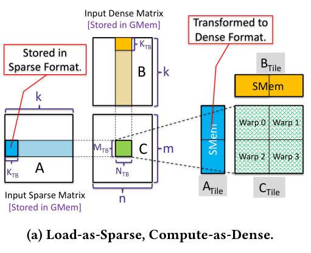 | VLDB  |   2024 |  | [note](./notes/flash_llm/index.md) |

<b>Apple</b>
 

|    | meta                                          | ttttttttttttttttttttttttttttttitle                                                                               | ccccccccccccccccccover                                                        | pub       |   year | codeeeee                                                                        | note                                                                                                                              |
|---:|:----------------------------------------------|:-----------------------------------------------------------------------------------------------------------------|:------------------------------------------------------------------------------|:----------|-------:|:--------------------------------------------------------------------------------|:----------------------------------------------------------------------------------------------------------------------------------|
|  0 | [ReLU Strikes Back](./meta/HMR7HKFV.prototxt) | [ReLU Strikes Back: Exploiting Activation Sparsity in Large Language Models](https://arxiv.org/abs/2310.04564)   |              | ICLR oral |   2024 |  | [note](https://confluence.xilinx.com/display/aialgo/ReLU+Strikes+Back%3A+Exploiting+Activation+Sparsity+in+Large+Language+Models) |
|  1 | [LLM in a flash](./meta/5JWFQDDP.prototxt)    | [LLM in a flash: Efficient Large Language Model Inference with Limited Memory](https://arxiv.org/abs/2312.11514) |  | arXiv     |   2024 |                                                                                 | [note](https://z6oqkldvmo.feishu.cn/docx/GBVrdR4iyotc83xMU1Hc9ZOGntb)                                                             |

<b>Beihang University</b>
 

|    | meta                       | ttttttttttttttttttttttttttttttitle                                                                       | ccccccccccccccccccover                                  | pub   |   year | codeeeee                                                             | note   |
|---:|:---------------------------|:---------------------------------------------------------------------------------------------------------|:--------------------------------------------------------|:------|-------:|:---------------------------------------------------------------------|:-------|
|  0 | [SMP](./meta/smp.prototxt) | [Pruning Pre-trained Language Models Without Fine-Tuning](https://aclanthology.org/2023.acl-long.35.pdf) | 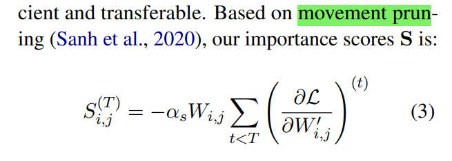 | ACL   |   2023 |  |        |

<b>Carnegie Mellon University</b>
 

|    | meta                           | ttttttttttttttttttttttttttttttitle                                                                           | ccccccccccccccccccover   | pub   |   year | codeeeee                                                                 | note                                                                                                                            |
|---:|:-------------------------------|:-------------------------------------------------------------------------------------------------------------|:-------------------------|:------|-------:|:-------------------------------------------------------------------------|:--------------------------------------------------------------------------------------------------------------------------------|
|  0 | [Wanda](./meta/wanda.prototxt) | [A Simple and Effective Pruning Approach for Large Language Models](https://arxiv.org/pdf/2306.11695.pdf)    |                          | arXiv |   2023 |  | [note](https://confluence.xilinx.com/display/aialgo/Wanda%3A+A+Simple+and+Effective+Pruning+Approach+for+Large+Language+Models) |
|  1 | [Bonsa](./meta/Bonsa.prototxt) | [Everybody Prune Now: Structured Pruning of LLMs with only Forward Passes](https://arxiv.org/abs/2402.05406) |                          | arXiv |   2024 |    |                                                                                                                                 |

<b>Cerebras Systems</b>
 

|    | meta                                     | ttttttttttttttttttttttttttttttitle                                                                            | ccccccccccccccccccover   | pub   |   year | codeeeee                                                                              | note                                                                                                                             |
|---:|:-----------------------------------------|:--------------------------------------------------------------------------------------------------------------|:-------------------------|:------|-------:|:--------------------------------------------------------------------------------------|:---------------------------------------------------------------------------------------------------------------------------------|
|  0 | [SPDF](./meta/spdf.prototxt)             | [SPDF: Sparse Pre-training and Dense Fine-tuning for Large Language Models](https://arxiv.org/abs/2303.10464) |                          | UAI   |   2023 |                                                                                       | [note](https://confluence.amd.com/display/~xiandong/SPDF%3A+Sparse+Pre-training+and+Dense+Fine-tuning+for+Large+Language+Models) |
|  1 | [Sparse-IFT](./meta/Sparse-IFT.prototxt) | [Sparse Iso-FLOP Transformations for Maximizing Training Efficiency](https://arxiv.org/abs/2303.11525)        |                          | arXiv |   2023 |  | [note](https://confluence.amd.com/display/~xiandong/Sparse+Iso-FLOP+Transformations+for+Maximizing+Training+Efficiency)          |

<b>Chongqing University</b>
 

|    | meta                         | ttttttttttttttttttttttttttttttitle                                                       | ccccccccccccccccccover                                    | pub   |   year | codeeeee   | note   |
|---:|:-----------------------------|:-----------------------------------------------------------------------------------------|:----------------------------------------------------------|:------|-------:|:-----------|:-------|
|  0 | [GBDT](./meta/gbdt.prototxt) | [Pruning Large Language Models via Accuracy Predictor](https://arxiv.org/abs/2309.09507) | 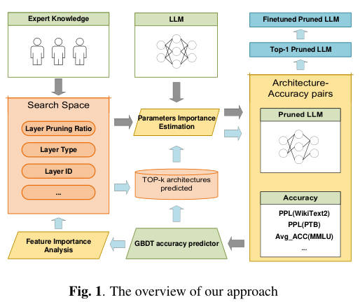 | arXiv |   2023 |            |        |

<b>Cornell University</b>
 

|    | meta                                                 | ttttttttttttttttttttttttttttttitle                                                     | ccccccccccccccccccover                                              | pub     |   year | codeeeee                                                                                     | note   |
|---:|:-----------------------------------------------------|:---------------------------------------------------------------------------------------|:--------------------------------------------------------------------|:--------|-------:|:---------------------------------------------------------------------------------------------|:-------|
|  0 | [Movement Pruning](./meta/movement_pruning.prototxt) | [Movement Pruning: Adaptive Sparsity by Fine-Tuning](https://arxiv.org/abs/2005.07683) | 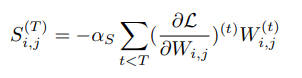 | NeurIPS |   2020 |  |        |
|  1 | [QuIP](./meta/QuIP.prototxt)                         | [QuIP: Quantization with Incoherence Processing](https://arxiv.org/pdf/2307.13304.pdf) |                                                                     | arXiv   |   2023 |                     |        |

<b>DeepMind</b>
 

|    | meta                          | ttttttttttttttttttttttttttttttitle                                                                                            | ccccccccccccccccccover   | pub   |   year | codeeeee                                                                        | note   |
|---:|:------------------------------|:------------------------------------------------------------------------------------------------------------------------------|:-------------------------|:------|-------:|:--------------------------------------------------------------------------------|:-------|
|  0 | [m](./meta/2AL79IUH.prototxt) | [Fast Sparse ConvNets](https://openaccess.thecvf.com/content_CVPR_2020/papers/Elsen_Fast_Sparse_ConvNets_CVPR_2020_paper.pdf) |                          | CVPR  |   2020 |  |        |

<b>Eindhoven University of Technology</b>
 

|    | meta                       | ttttttttttttttttttttttttttttttitle                                                                                                         | ccccccccccccccccccover                                    | pub   |   year | codeeeee                                                             | note   |
|---:|:---------------------------|:-------------------------------------------------------------------------------------------------------------------------------------------|:----------------------------------------------------------|:------|-------:|:---------------------------------------------------------------------|:-------|
|  0 | [OWL](./meta/owl.prototxt) | [Outlier Weighed Layerwise Sparsity (OWL): A Missing Secret Sauce for Pruning LLMs to High Sparsity](https://arxiv.org/pdf/2310.05175.pdf) |  | arXiv |   2023 |  |        |

<b>Gaoling School of Artificial Intelligence, Renmin University of China</b>
 

|    | meta                          | ttttttttttttttttttttttttttttttitle                                                          | ccccccccccccccccccover                                                 | pub   |   year | codeeeee   | note   |
|---:|:------------------------------|:--------------------------------------------------------------------------------------------|:-----------------------------------------------------------------------|:------|-------:|:-----------|:-------|
|  0 | [m](./meta/L5D7520E.prototxt) | [A Survey on Model Compression for Large Language Models](https://arxiv.org/abs/2308.07633) |  | arXiv |   2023 |            |        |

<b>Georgia Institute of Technology</b>
 

|    | meta                               | ttttttttttttttttttttttttttttttitle                                                                              | ccccccccccccccccccover                                          | pub   |   year | codeeeee                                                                      | note                          |
|---:|:-----------------------------------|:----------------------------------------------------------------------------------------------------------------|:----------------------------------------------------------------|:------|-------:|:------------------------------------------------------------------------------|:------------------------------|
|  0 | [AdaLoRA](./meta/adalora.prototxt) | [AdaLoRA: Adaptive Budget Allocation for Parameter-Efficient Fine-Tuning](https://arxiv.org/pdf/2303.10512.pdf) | 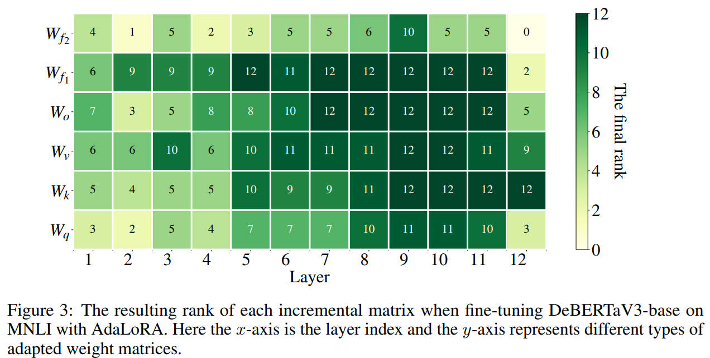 | ICLR  |   2023 |  |                               |
|  1 | [LoftQ](./meta/loftq.prototxt)     | [LoftQ: LoRA-Fine-Tuning-Aware Quantization for Large Language Models](https://arxiv.org/abs/2310.08659)        | 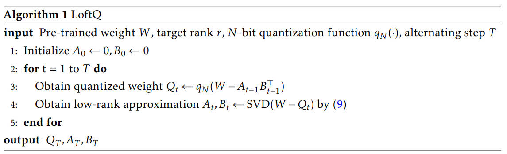     | arXiv |   2023 |       | [note](./notes/loftq/note.md) |

<b>Google</b>
 

|    | meta                             | ttttttttttttttttttttttttttttttitle                                                                                             | ccccccccccccccccccover                                  | pub   |   year | codeeeee                                                                        | note                                                                                                                 |
|---:|:---------------------------------|:-------------------------------------------------------------------------------------------------------------------------------|:--------------------------------------------------------|:------|-------:|:--------------------------------------------------------------------------------|:---------------------------------------------------------------------------------------------------------------------|
|  0 | [m](./meta/2AL79IUH.prototxt)    | [Fast Sparse ConvNets](https://openaccess.thecvf.com/content_CVPR_2020/papers/Elsen_Fast_Sparse_ConvNets_CVPR_2020_paper.pdf)  |                                                         | CVPR  |   2020 |  |                                                                                                                      |
|  1 | [Sprint](./meta/Sprint.prototxt) | [Sparse Attention Acceleration with Synergistic In-Memory Pruning and On-Chip Recomputation](https://arxiv.org/abs/2209.00606) |                                                         | MICRO |   2022 |                                                                                 |                                                                                                                      |
|  2 | [m](./meta/WMMGA0AR.prototxt)    | [The Lazy Neuron Phenomenon: On Emergence of Activation Sparsity in Transformers](https://openreview.net/forum?id=TJ2nxciYCk-) |                                                         | ICLR  |   2023 |                                                                                 |                                                                                                                      |
|  3 | [KCM](./meta/kcm.prototxt)       | [Gradient-Free Structured Pruning with Unlabeled Data](https://arxiv.org/abs/2303.04185)                                       | 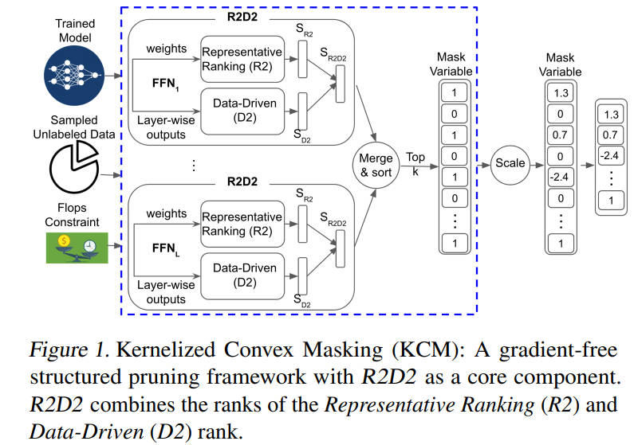 | arXiv |   2023 |                                                                                 | [note](https://confluence.xilinx.com/display/aialgo/Gradient-Free+Structured+Pruning+with+Unlabeled+Data?moved=true) |

<b>Google Research</b>
 

|    | meta                           | ttttttttttttttttttttttttttttttitle                                                                                                         | ccccccccccccccccccover                                    | pub   |   year | codeeeee                                                               | note   |
|---:|:-------------------------------|:-------------------------------------------------------------------------------------------------------------------------------------------|:----------------------------------------------------------|:------|-------:|:-----------------------------------------------------------------------|:-------|
|  0 | [OWL](./meta/owl.prototxt)     | [Outlier Weighed Layerwise Sparsity (OWL): A Missing Secret Sauce for Pruning LLMs to High Sparsity](https://arxiv.org/pdf/2310.05175.pdf) |  | arXiv |   2023 |    |        |
|  1 | [Bonsa](./meta/Bonsa.prototxt) | [Everybody Prune Now: Structured Pruning of LLMs with only Forward Passes](https://arxiv.org/abs/2402.05406)                               |                                                           | arXiv |   2024 |  |        |

<b>Habana Labs</b>
 

|    | meta                         | ttttttttttttttttttttttttttttttitle                                                                           | ccccccccccccccccccover   | pub   |   year | codeeeee   | note   |
|---:|:-----------------------------|:-------------------------------------------------------------------------------------------------------------|:-------------------------|:------|-------:|:-----------|:-------|
|  0 | [MVUE](./meta/MVUE.prototxt) | [Minimum Variance Unbiased N:M Sparsity for the Neural Gradients](https://openreview.net/pdf?id=vuD2xEtxZcj) |                          | ICLR  |   2023 |            |        |

<b>Harbin Institute of Technology</b>
 

|    | meta                                     | ttttttttttttttttttttttttttttttitle                                                                        | ccccccccccccccccccover                                                | pub   |   year | codeeeee                                                                     | note                           |
|---:|:-----------------------------------------|:----------------------------------------------------------------------------------------------------------|:----------------------------------------------------------------------|:------|-------:|:-----------------------------------------------------------------------------|:-------------------------------|
|  0 | [TextPruner](./meta/TextPruner.prototxt) | [TextPruner: A Model Pruning Toolkit for Pre-Trained Language Models](https://arxiv.org/abs/2203.15996)   | 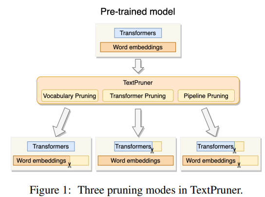 | ACL   |   2022 |  |                                |
|  1 | [GRAIN](./meta/grain.prototxt)           | [Gradient-based Intra-attention Pruning on Pre-trained Language Models](https://arxiv.org/abs/2212.07634) | 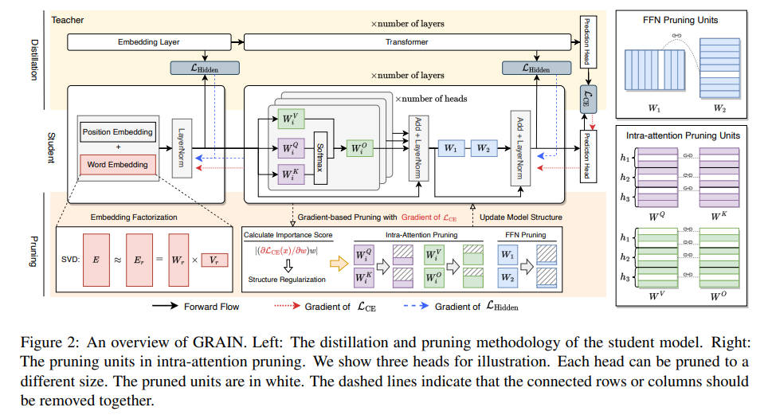           | ACL   |   2023 |       | [note](./notes/grain/index.md) |

<b>Houmo AI</b>
 

|    | meta                         | ttttttttttttttttttttttttttttttitle                                                                               | ccccccccccccccccccover   | pub   |   year | codeeeee                                                                    | note   |
|---:|:-----------------------------|:-----------------------------------------------------------------------------------------------------------------|:-------------------------|:------|-------:|:----------------------------------------------------------------------------|:-------|
|  0 | [RPTQ](./meta/RPTQ.prototxt) | [RPTQ: Reorder-based Post-training Quantization for Large Language Models](https://arxiv.org/pdf/2304.01089.pdf) |                          | arXiv |   2023 |  |        |

<b>Huawei</b>
 

|    | meta                               | ttttttttttttttttttttttttttttttitle                                                                           | ccccccccccccccccccover                                         | pub   |   year | codeeeee                                                                      | note                            |
|---:|:-----------------------------------|:-------------------------------------------------------------------------------------------------------------|:---------------------------------------------------------------|:------|-------:|:------------------------------------------------------------------------------|:--------------------------------|
|  0 | [QA-LoRA](./meta/QA-LoRA.prototxt) | [QA-LoRA: Quantization-Aware Low-Rank Adaptation of Large Language Models](https://arxiv.org/abs/2309.14717) | 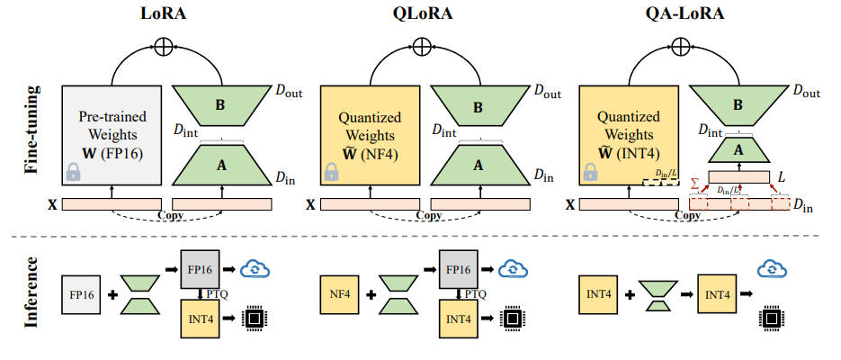 | ICLR  |   2024 |  | [note](./notes/QA-LoRA/note.md) |

<b>Huawei Noah's Ark Lab</b>
 

|    | meta                                      | ttttttttttttttttttttttttttttttitle                                                                                               | ccccccccccccccccccover                                        | pub          |   year | codeeeee                                                                                                                    | note                            |
|---:|:------------------------------------------|:---------------------------------------------------------------------------------------------------------------------------------|:--------------------------------------------------------------|:-------------|-------:|:----------------------------------------------------------------------------------------------------------------------------|:--------------------------------|
|  0 | [SIMPLE](./meta/simple.prototxt)          | [Structured Pruning for Efficient Generative Pre-trained Language Models](https://aclanthology.org/2023.findings-acl.692.pdf)    |   | ACL Findings |   2023 |                                                                                                                             | [note](./notes/simple/index.md) |
|  1 | [Plug-and-Play](./meta/IA8CS3VH.prototxt) | [Plug-and-Play: An Efficient Post-training Pruning Method for Large Language Models](https://openreview.net/forum?id=Tr0lPx9woF) |  | ICLR         |   2024 |  |                                 |

<b>Hugging Face</b>
 

|    | meta                                                 | ttttttttttttttttttttttttttttttitle                                                     | ccccccccccccccccccover                                              | pub     |   year | codeeeee                                                                                     | note   |
|---:|:-----------------------------------------------------|:---------------------------------------------------------------------------------------|:--------------------------------------------------------------------|:--------|-------:|:---------------------------------------------------------------------------------------------|:-------|
|  0 | [Movement Pruning](./meta/movement_pruning.prototxt) | [Movement Pruning: Adaptive Sparsity by Fine-Tuning](https://arxiv.org/abs/2005.07683) |  | NeurIPS |   2020 |  |        |

<b>IST</b>
 

|    | meta                          | ttttttttttttttttttttttttttttttitle                                                              | ccccccccccccccccccover                                               | pub   |   year | codeeeee   | note   |
|---:|:------------------------------|:------------------------------------------------------------------------------------------------|:---------------------------------------------------------------------|:------|-------:|:-----------|:-------|
|  0 | [m](./meta/68I8KKBV.prototxt) | [Efficient Methods for Natural Language Processing: A Survey](https://arxiv.org/abs/2209.00099) |  | TACL  |   2023 |            |        |

<b>IST Austria</b>
 

|    | meta                                     | ttttttttttttttttttttttttttttttitle                                                                                                        | ccccccccccccccccccover                                           | pub     |   year | codeeeee                                                                              | note                          |
|---:|:-----------------------------------------|:------------------------------------------------------------------------------------------------------------------------------------------|:-----------------------------------------------------------------|:--------|-------:|:--------------------------------------------------------------------------------------|:------------------------------|
|  0 | [m](./meta/V3MFIRLV.prototxt)            | [Inducing and Exploiting Activation Sparsity for Fast Neural Network Inference](http://proceedings.mlr.press/v119/kurtz20a/kurtz20a.pdf)  |                                                                  | ICML    |   2020 |                                                                                       |                               |
|  1 | [m](./meta/ITZS3TU3.prototxt)            | [Sparsity in Deep Learning: Pruning and growth for efficient inference and training in neural networks](https://arxiv.org/abs/2102.00554) |                                                                  | arXiv   |   2021 |                                                                                       |                               |
|  2 | [SPDY](./meta/spdy.prototxt)             | [SPDY: Accurate Pruning with Speedup Guarantees](https://arxiv.org/abs/2201.13096)                                                        | 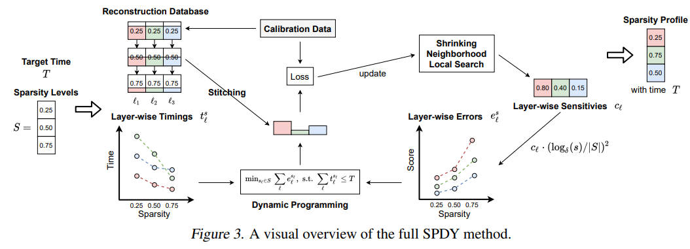       | ICML    |   2022 |              | [note](./notes/spdy/index.md) |
|  3 | [OBC](./meta/obc.prototxt)               | [Optimal Brain Compression: A Framework for Accurate Post-Training Quantization and Pruning](https://openreview.net/pdf?id=ksVGCOlOEba)   |                                                                  | NeurIPS |   2022 |               |                               |
|  4 | [oBERT](./meta/oBERT.prototxt)           | [The Optimal BERT Surgeon: Scalable and Accurate Second-Order Pruning for Large Language Models](https://arxiv.org/pdf/2203.07259.pdf)    |                                                                  | arXiv   |   2022 |         |                               |
|  5 | [GPTQ](./meta/gptq.prototxt)             | [GPTQ: Accurate Post-Training Quantization for Generative Pre-trained Transformers](https://arxiv.org/pdf/2210.17323.pdf)                 |                                                                  | ICLR    |   2023 |              |                               |
|  6 | [ZipLM](./meta/ZipLM.prototxt)           | [ZipLM: Inference-Aware Structured Pruning of Language Models](https://openreview.net/pdf?id=bPFFPueAxm)                                  | 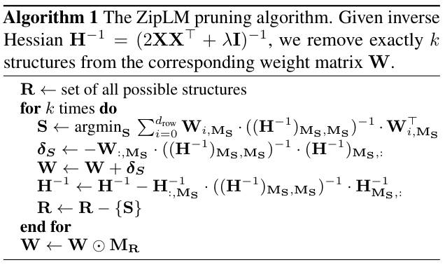      | NeurIPS |   2023 |             |                               |
|  7 | [SpQR](./meta/spqr.prototxt)             | [SpQR: A Sparse-Quantized Representation for Near-Lossless LLM Weight Compression](https://arxiv.org/pdf/2306.03078.pdf)                  |                                                                  | arXiv   |   2023 |                |                               |
|  8 | [SquareHead](./meta/SquareHead.prototxt) | [Sparse Fine-tuning for Inference Acceleration of Large Language Models](https://arxiv.org/pdf/2310.06927.pdf)                            | 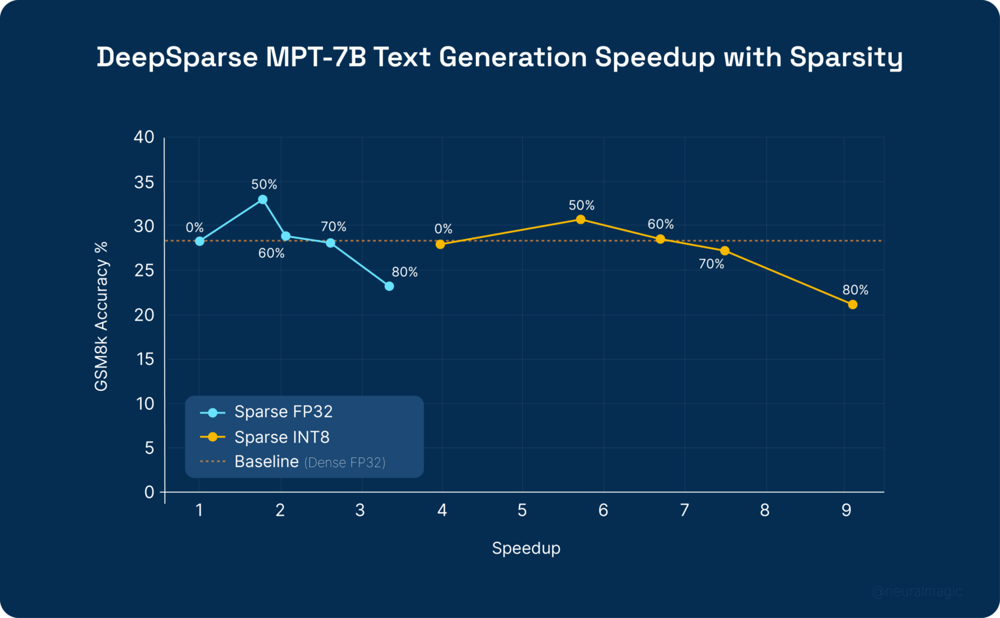 | arXiv   |   2023 |  |                               |
|  9 | [SparseGPT](./meta/sparsegpt.prototxt)   | [SparseGPT: Massive Language Models Can be Accurately Pruned in one-shot.](https://arxiv.org/pdf/2301.00774.pdf)                          |                                                                  | arXiv   |   2023 |         | [note](./notes/SparseGPT.md)  |

<b>Institute of Automation, Chinese Academy of Sciences</b>
 

|    | meta                                      | ttttttttttttttttttttttttttttttitle                                                                                               | ccccccccccccccccccover                                        | pub   |   year | codeeeee                                                                                                                    | note                                                                  |
|---:|:------------------------------------------|:---------------------------------------------------------------------------------------------------------------------------------|:--------------------------------------------------------------|:------|-------:|:----------------------------------------------------------------------------------------------------------------------------|:----------------------------------------------------------------------|
|  0 | [FLAP](./meta/flap.prototxt)              | [Fluctuation-based Adaptive Structured Pruning for Large Language Models](https://arxiv.org/abs/2312.11983)                      |           | AAAI  |   2024 |                                                 | [note](https://z6oqkldvmo.feishu.cn/docx/JFFQdAxz3oWX2Kx6j91c2kamnqd) |
|  1 | [Plug-and-Play](./meta/IA8CS3VH.prototxt) | [Plug-and-Play: An Efficient Post-training Pruning Method for Large Language Models](https://openreview.net/forum?id=Tr0lPx9woF) |  | ICLR  |   2024 |  |                                                                       |

<b>Institute of Computing Technology, Chinese Academy of Sciences</b>
 

|    | meta                                   | ttttttttttttttttttttttttttttttitle                                                                                                  | ccccccccccccccccccover                                              | pub   |   year | codeeeee   | note                              |
|---:|:---------------------------------------|:------------------------------------------------------------------------------------------------------------------------------------|:--------------------------------------------------------------------|:------|-------:|:-----------|:----------------------------------|
|  0 | [ProSparse](./meta/ProSparse.prototxt) | [ProSparse: Introducing and Enhancing Intrinsic Activation Sparsity within Large Language Models](https://arxiv.org/abs/2402.13516) | 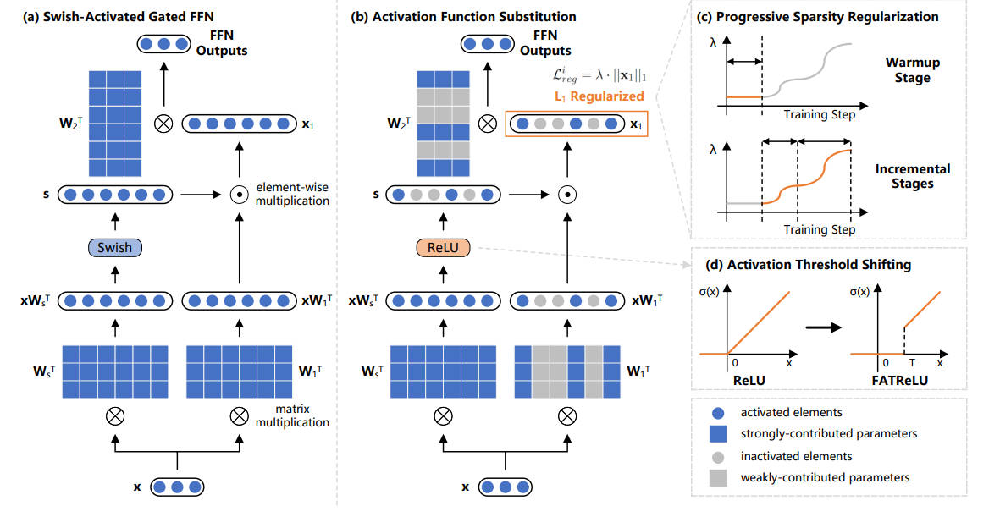 | arXiv |   2024 |            | [note](./notes/ProSparse/note.md) |

<b>Institute of Information Engineering, Chinese Academy of Sciences</b>
 

|    | meta                          | ttttttttttttttttttttttttttttttitle                                                          | ccccccccccccccccccover                                                 | pub   |   year | codeeeee   | note   |
|---:|:------------------------------|:--------------------------------------------------------------------------------------------|:-----------------------------------------------------------------------|:------|-------:|:-----------|:-------|
|  0 | [m](./meta/L5D7520E.prototxt) | [A Survey on Model Compression for Large Language Models](https://arxiv.org/abs/2308.07633) |  | arXiv |   2023 |            |        |

<b>Intel Corporation</b>
 

|    | meta                                 | ttttttttttttttttttttttttttttttitle                                                                                                                                                                                                       | ccccccccccccccccccover   | pub           |   year | codeeeee                                                                                           | note                                                                          |
|---:|:-------------------------------------|:-----------------------------------------------------------------------------------------------------------------------------------------------------------------------------------------------------------------------------------------|:-------------------------|:--------------|-------:|:---------------------------------------------------------------------------------------------------|:------------------------------------------------------------------------------|
|  0 | [OpenVINO](./meta/OpenVINO.prototxt) | [Post-training deep neural network pruning via layer-wise calibration](https://openaccess.thecvf.com/content/ICCV2021W/LPCV/papers/Lazarevich_Post-Training_Deep_Neural_Network_Pruning_via_Layer-Wise_Calibration_ICCVW_2021_paper.pdf) |                          | ICCV workshop |   2021 | [EfficientCNN](https://gitenterprise.xilinx.com/xiandong/EfficientCNN/tree/post-training-sparsity) | [note](https://confluence.xilinx.com/pages/viewpage.action?pageId=1005133974) |

<b>MIT</b>
 

|    | meta                                         | ttttttttttttttttttttttttttttttitle                                                                                                                                           | ccccccccccccccccccover                                                   | pub           |   year | codeeeee                                                                          | note                                               |
|---:|:---------------------------------------------|:-----------------------------------------------------------------------------------------------------------------------------------------------------------------------------|:-------------------------------------------------------------------------|:--------------|-------:|:----------------------------------------------------------------------------------|:---------------------------------------------------|
|  0 | [m](./meta/QZ2EJHG9.prototxt)                | [On-Device Training Under 256KB Memory](https://arxiv.org/abs/2206.15472)                                                                                                    | 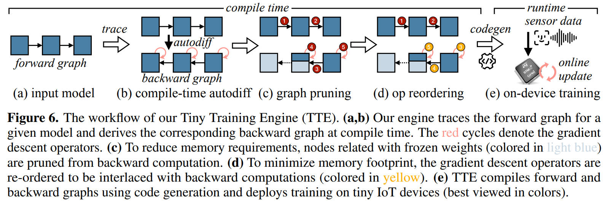 | NeurIPS       |   2022 | [mit.edu](https://tinyml.mit.edu/on-device-training/)                             | [note](https://tinyml.mit.edu/on-device-training/) |
|  1 | [SparseViT](./meta/SparseViT.prototxt)       | [SparseViT: Revisiting Activation Sparsity for Efficient High-Resolution Vision Transformer](https://arxiv.org/abs/2303.17605)                                               | 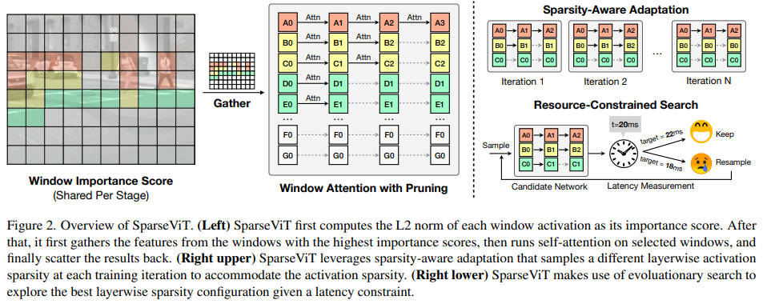      | CVPR          |   2023 |    | [note](./notes/sparsevit/index.md)                 |
|  2 | [TorchSparse++](./meta/TorchSparse.prototxt) | [TorchSparse++: Efficient Point Cloud Engine](https://openaccess.thecvf.com/content/CVPR2023W/WAD/papers/Tang_TorchSparse_Efficient_Point_Cloud_Engine_CVPRW_2023_paper.pdf) |                                                                          | CVPR workshop |   2023 |  |                                                    |
|  3 | [AWQ](./meta/awq.prototxt)                   | [AWQ: Activation-aware Weight Quantization for LLM Compression and Acceleration](https://arxiv.org/abs/2306.00978)                                                           |                                                                          | arXiv         |   2023 |      |                                                    |

<b>Meta</b>
 

|    | meta                           | ttttttttttttttttttttttttttttttitle                                                                        | ccccccccccccccccccover   | pub   |   year | codeeeee                                                                 | note                                                                                                                            |
|---:|:-------------------------------|:----------------------------------------------------------------------------------------------------------|:-------------------------|:------|-------:|:-------------------------------------------------------------------------|:--------------------------------------------------------------------------------------------------------------------------------|
|  0 | [Wanda](./meta/wanda.prototxt) | [A Simple and Effective Pruning Approach for Large Language Models](https://arxiv.org/pdf/2306.11695.pdf) |                          | arXiv |   2023 |  | [note](https://confluence.xilinx.com/display/aialgo/Wanda%3A+A+Simple+and+Effective+Pruning+Approach+for+Large+Language+Models) |

<b>Microsoft</b>
 

|    | meta                                         | ttttttttttttttttttttttttttttttitle                                                                                                               | ccccccccccccccccccover                                            | pub     |   year | codeeeee                                                                      | note                              |
|---:|:---------------------------------------------|:-------------------------------------------------------------------------------------------------------------------------------------------------|:------------------------------------------------------------------|:--------|-------:|:------------------------------------------------------------------------------|:----------------------------------|
|  0 | [LoRA](./meta/lora.prototxt)                 | [LoRA: Low-rank adaptation of large language models](https://arxiv.org/abs/2106.09685)                                                           | 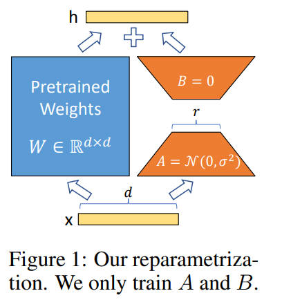         | ICLR    |   2022 |       |                                   |
|  1 | [ZeroQuant](./meta/zeroquant.prototxt)       | [ZeroQuant: Efficient and Affordable Post-Training Quantization for Large-Scale Transformers](https://openreview.net/forum?id=f-fVCElZ-G1)       |                                                                   | NeurIPS |   2022 |  |                                   |
|  2 | [LoSparse](./meta/LoSparse.prototxt)         | [Structured Compression of Large Language Models based on Low-Rank and Sparse Approximation](https://arxiv.org/abs/2306.11222)                   | 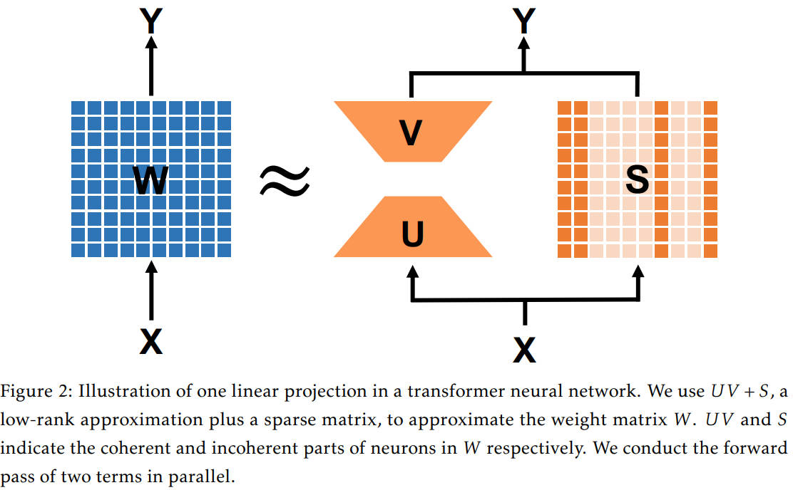 | ICML    |   2023 |    |                                   |
|  3 | [Compresso](./meta/Compresso.prototxt)       | [Compresso: Structured Pruning with Collaborative Prompting Learns Compact Large Language Models](https://arxiv.org/abs/2310.05015)              | 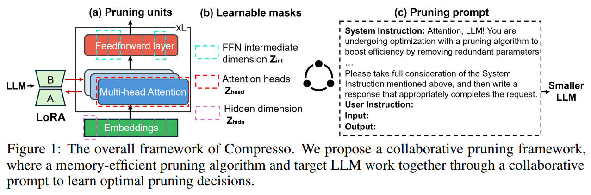   | arXiv   |   2023 |    | [note](./notes/compresso/note.md) |
|  4 | [LoRAShear](./meta/lorashear.prototxt)       | [LoRAShear: Efficient Large Language Model Structured Pruning and Knowledge Recovery](https://arxiv.org/abs/2310.18356)                          |                                                                   | arXiv   |   2023 |                                                                               |                                   |
|  5 | [ZeroQuant-V2](./meta/ZeroQuant-V2.prototxt) | [ZeroQuant-V2: Exploring Post-training Quantization in LLMs from Comprehensive Study to Low Rank Compensation](https://arxiv.org/abs/2303.08302) |                                                                   | arXiv   |   2023 |  |                                   |

<b>Microsoft Azure</b>
 

|    | meta                           | ttttttttttttttttttttttttttttttitle                                                                       | ccccccccccccccccccover                                      | pub   |   year | codeeeee                                                                 | note                          |
|---:|:-------------------------------|:---------------------------------------------------------------------------------------------------------|:------------------------------------------------------------|:------|-------:|:-------------------------------------------------------------------------|:------------------------------|
|  0 | [LoftQ](./meta/loftq.prototxt) | [LoftQ: LoRA-Fine-Tuning-Aware Quantization for Large Language Models](https://arxiv.org/abs/2310.08659) |  | arXiv |   2023 |  | [note](./notes/loftq/note.md) |

<b>Microsoft Azure AI</b>
 

|    | meta                               | ttttttttttttttttttttttttttttttitle                                                                              | ccccccccccccccccccover                                          | pub   |   year | codeeeee                                                                      | note   |
|---:|:-----------------------------------|:----------------------------------------------------------------------------------------------------------------|:----------------------------------------------------------------|:------|-------:|:------------------------------------------------------------------------------|:-------|
|  0 | [AdaLoRA](./meta/adalora.prototxt) | [AdaLoRA: Adaptive Budget Allocation for Parameter-Efficient Fine-Tuning](https://arxiv.org/pdf/2303.10512.pdf) |  | ICLR  |   2023 |  |        |

<b>Microsoft Research</b>
 

|    | meta                                 | ttttttttttttttttttttttttttttttitle                                                                                                                                              | ccccccccccccccccccover                                          | pub   |   year | codeeeee                                                                   | note   |
|---:|:-------------------------------------|:--------------------------------------------------------------------------------------------------------------------------------------------------------------------------------|:----------------------------------------------------------------|:------|-------:|:---------------------------------------------------------------------------|:-------|
|  0 | [nmSPARSE](./meta/nmSPARSE.prototxt) | [Efficient GPU Kernels for N:M-Sparse Weights in Deep Learning](https://proceedings.mlsys.org/paper_files/paper/2023/file/4552cedd396a308320209f75f56a5ad5-Paper-mlsys2023.pdf) |                                                                 | MLSys |   2023 |  |        |
|  1 | [m](./meta/ELILXDQG.prototxt)        | [A Survey on Evaluation of Large Language Models](https://arxiv.org/abs/2307.03109)                                                                                             |  | arXiv |   2023 |                                                                            |        |

<b>NVIDIA</b>
 

|    | meta                                   | ttttttttttttttttttttttttttttttitle                                                                                                     | ccccccccccccccccccover   | pub     |   year | codeeeee                                                                           | note                                                                                        |
|---:|:---------------------------------------|:---------------------------------------------------------------------------------------------------------------------------------------|:-------------------------|:--------|-------:|:-----------------------------------------------------------------------------------|:--------------------------------------------------------------------------------------------|
|  0 | [m](./meta/K7GSWQIC.prototxt)          | [Channel Permutations for N:M Sparsity](https://proceedings.neurips.cc/paper/2021/hash/6e8404c3b93a9527c8db241a1846599a-Abstract.html) |                          | NeurIPS |   2021 | [Pytorch](https://gitenterprise.xilinx.com/xiandong/permutation_nm_sparse)         | [note](https://confluence.xilinx.com/display/aialgo/Channel+Permutation+for+N%3AM+Sparsity) |
|  1 | [NMSparse](./meta/PUHJMVCM.prototxt)   | [Accelerating Sparse Deep Neural Networks](https://arxiv.org/abs/2104.08378)                                                           |                          | arXiv   |   2021 |                                                                                    |                                                                                             |
|  2 | [FT](./meta/fastertransfomer.prototxt) | [FasterTransformer](https://github.com/NVIDIA/FasterTransformer)                                                                       |                          | github  |   2023 |  |                                                                                             |

<b>Nanjing University</b>
 

|    | meta                            | ttttttttttttttttttttttttttttttitle                                                                                        | ccccccccccccccccccover   | pub   |   year | codeeeee   | note   |
|---:|:--------------------------------|:--------------------------------------------------------------------------------------------------------------------------|:-------------------------|:------|-------:|:-----------|:-------|
|  0 | [STA](./meta/44KWQAWO.prototxt) | [An Algorithm-Hardware Co-Optimized Framework for Accelerating N:M Sparse Transformers](https://arxiv.org/abs/2208.06118) |                          | VLSI  |   2022 |            |        |

<b>Nanyang Technological University</b>
 

|    | meta                          | ttttttttttttttttttttttttttttttitle                                                                                  | ccccccccccccccccccover   | pub     |   year | codeeeee                                                               | note   |
|---:|:------------------------------|:--------------------------------------------------------------------------------------------------------------------|:-------------------------|:--------|-------:|:-----------------------------------------------------------------------|:-------|
|  0 | [L-OBS](./meta/lobs.prototxt) | [Learning to Prune Deep Neural Networks via Layer-wise Optimal Brain Surgeon](https://arxiv.org/pdf/1705.07565.pdf) |                          | NeurIPS |   2017 |  |        |

<b>National University of Singapore</b>
 

|    | meta                                    | ttttttttttttttttttttttttttttttitle                                                                 | ccccccccccccccccccover                                           | pub   |   year | codeeeee                                                                     | note                                                                                                                  |
|---:|:----------------------------------------|:---------------------------------------------------------------------------------------------------|:-----------------------------------------------------------------|:------|-------:|:-----------------------------------------------------------------------------|:----------------------------------------------------------------------------------------------------------------------|
|  0 | [LLM-Pruner](./meta/llmpruner.prototxt) | [LLM-Pruner: On the Structural Pruning of Large Language Models](https://arxiv.org/abs/2305.11627) |  | arXiv |   2023 |  | [note](https://confluence.xilinx.com/display/aialgo/LLM-Pruner%3A+On+the+Structural+Pruning+of+Large+Language+Models) |

<b>Neural Magic</b>
 

|    | meta                                     | ttttttttttttttttttttttttttttttitle                                                                                                       | ccccccccccccccccccover                                           | pub     |   year | codeeeee                                                                              | note                          |
|---:|:-----------------------------------------|:-----------------------------------------------------------------------------------------------------------------------------------------|:-----------------------------------------------------------------|:--------|-------:|:--------------------------------------------------------------------------------------|:------------------------------|
|  0 | [m](./meta/V3MFIRLV.prototxt)            | [Inducing and Exploiting Activation Sparsity for Fast Neural Network Inference](http://proceedings.mlr.press/v119/kurtz20a/kurtz20a.pdf) |                                                                  | ICML    |   2020 |                                                                                       |                               |
|  1 | [SPDY](./meta/spdy.prototxt)             | [SPDY: Accurate Pruning with Speedup Guarantees](https://arxiv.org/abs/2201.13096)                                                       |        | ICML    |   2022 |              | [note](./notes/spdy/index.md) |
|  2 | [OBC](./meta/obc.prototxt)               | [Optimal Brain Compression: A Framework for Accurate Post-Training Quantization and Pruning](https://openreview.net/pdf?id=ksVGCOlOEba)  |                                                                  | NeurIPS |   2022 |               |                               |
|  3 | [oBERT](./meta/oBERT.prototxt)           | [The Optimal BERT Surgeon: Scalable and Accurate Second-Order Pruning for Large Language Models](https://arxiv.org/pdf/2203.07259.pdf)   |                                                                  | arXiv   |   2022 |         |                               |
|  4 | [GPTQ](./meta/gptq.prototxt)             | [GPTQ: Accurate Post-Training Quantization for Generative Pre-trained Transformers](https://arxiv.org/pdf/2210.17323.pdf)                |                                                                  | ICLR    |   2023 |              |                               |
|  5 | [ZipLM](./meta/ZipLM.prototxt)           | [ZipLM: Inference-Aware Structured Pruning of Language Models](https://openreview.net/pdf?id=bPFFPueAxm)                                 |       | NeurIPS |   2023 |             |                               |
|  6 | [SpQR](./meta/spqr.prototxt)             | [SpQR: A Sparse-Quantized Representation for Near-Lossless LLM Weight Compression](https://arxiv.org/pdf/2306.03078.pdf)                 |                                                                  | arXiv   |   2023 |                |                               |
|  7 | [SquareHead](./meta/SquareHead.prototxt) | [Sparse Fine-tuning for Inference Acceleration of Large Language Models](https://arxiv.org/pdf/2310.06927.pdf)                           |  | arXiv   |   2023 |  |                               |
|  8 | [SparseGPT](./meta/sparsegpt.prototxt)   | [SparseGPT: Massive Language Models Can be Accurately Pruned in one-shot.](https://arxiv.org/pdf/2301.00774.pdf)                         |                                                                  | arXiv   |   2023 |         | [note](./notes/SparseGPT.md)  |

<b>Northeastern University</b>
 

|    | meta                                     | ttttttttttttttttttttttttttttttitle                                                                                              | ccccccccccccccccccover   | pub   |   year | codeeeee                                                                                | note   |
|---:|:-----------------------------------------|:--------------------------------------------------------------------------------------------------------------------------------|:-------------------------|:------|-------:|:----------------------------------------------------------------------------------------|:-------|
|  0 | [ADMM-pruning](./meta/Z9R72EAT.prototxt) | [A Systematic DNN Weight Pruning Framework using Alternating Direction Method of Multipliers](https://arxiv.org/abs/1804.03294) |                          | ECCV  |   2018 |  |        |

<b>Northwestern University</b>
 

|    | meta                             | ttttttttttttttttttttttttttttttitle                                                                                     | ccccccccccccccccccover                                        | pub   |   year | codeeeee                                                                      | note   |
|---:|:---------------------------------|:-----------------------------------------------------------------------------------------------------------------------|:--------------------------------------------------------------|:------|-------:|:------------------------------------------------------------------------------|:-------|
|  0 | [SR-STE](./meta/sr-ste.prototxt) | [Learning N:M Fine-grained Structured Sparse Neural Networks From Scratch](https://openreview.net/forum?id=K9bw7vqp_s) | 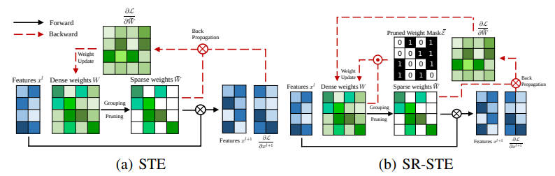 | ICLR  |   2021 |  |        |

<b>Numenta</b>
 

|    | meta                                                            | ttttttttttttttttttttttttttttttitle                                                                                                                              | ccccccccccccccccccover                                                      | pub                                    |   year | codeeeee   | note                                          |
|---:|:----------------------------------------------------------------|:----------------------------------------------------------------------------------------------------------------------------------------------------------------|:----------------------------------------------------------------------------|:---------------------------------------|-------:|:-----------|:----------------------------------------------|
|  0 | [Complementary Sparsity](./meta/ComplementarySparsity.prototxt) | [Two Sparsities Are Better Than One: Unlocking the Performance Benefits of Sparse-Sparse Networks](https://iopscience.iop.org/article/10.1088/2634-4386/ac7c8a) | 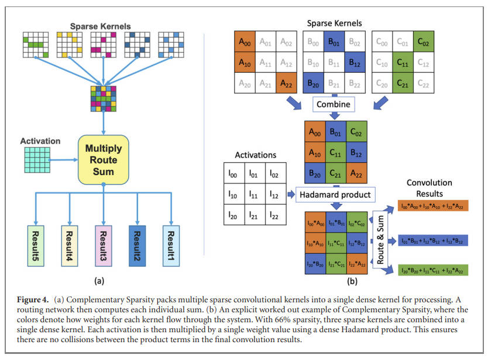 | Neuromorphic Computing and Engineering |   2022 |            | [note](./notes/ComplementarySparsity/note.md) |

<b>OpenAI</b>
 

|    | meta                                       | ttttttttttttttttttttttttttttttitle                                                              | ccccccccccccccccccover   | pub   |   year | codeeeee                                                                     | note   |
|---:|:-------------------------------------------|:------------------------------------------------------------------------------------------------|:-------------------------|:------|-------:|:-----------------------------------------------------------------------------|:-------|
|  0 | [blocksparse](./meta/blocksparse.prototxt) | [GPU Kernels for Block-Sparse Weights](https://cdn.openai.com/blocksparse/blocksparsepaper.pdf) |                          | arXiv |   2020 |  |        |

<b>OpenGVLab</b>
 

|    | meta                                   | ttttttttttttttttttttttttttttttitle                                                                                 | ccccccccccccccccccover                                              | pub   |   year | codeeeee                                                                      | note   |
|---:|:---------------------------------------|:-------------------------------------------------------------------------------------------------------------------|:--------------------------------------------------------------------|:------|-------:|:------------------------------------------------------------------------------|:-------|
|  0 | [OmniQuant](./meta/omniquant.prototxt) | [OmniQuant: Omnidirectionally Calibrated Quantization for Large Language Models](https://arxiv.org/abs/2308.13137) |  | arXiv |   2023 |  |        |

<b>Princeton University</b>
 

|    | meta                                         | ttttttttttttttttttttttttttttttitle                                                                                             | ccccccccccccccccccover                                             | pub   |   year | codeeeee                                                                             | note                                                                                                      |
|---:|:---------------------------------------------|:-------------------------------------------------------------------------------------------------------------------------------|:-------------------------------------------------------------------|:------|-------:|:-------------------------------------------------------------------------------------|:----------------------------------------------------------------------------------------------------------|
|  0 | [AdaLoRA](./meta/adalora.prototxt)           | [AdaLoRA: Adaptive Budget Allocation for Parameter-Efficient Fine-Tuning](https://arxiv.org/pdf/2303.10512.pdf)                |     | ICLR  |   2023 |         |                                                                                                           |
|  1 | [MeZO](./meta/mezo.prototxt)                 | [Fine-Tuning Language Models with Just Forward Passes](https://arxiv.org/pdf/2305.17333.pdf)                                   |                                                                    | arXiv |   2023 |          | [note](https://confluence.xilinx.com/display/aialgo/Fine-Tuning+Language+Models+with+Just+Forward+Passes) |
|  2 | [LLM-shearing](./meta/LLM_shearing.prototxt) | [Sheared LLaMA: Accelerating Language Model Pre-training via Structured Pruning](https://xiamengzhou.github.io/sheared-llama/) | 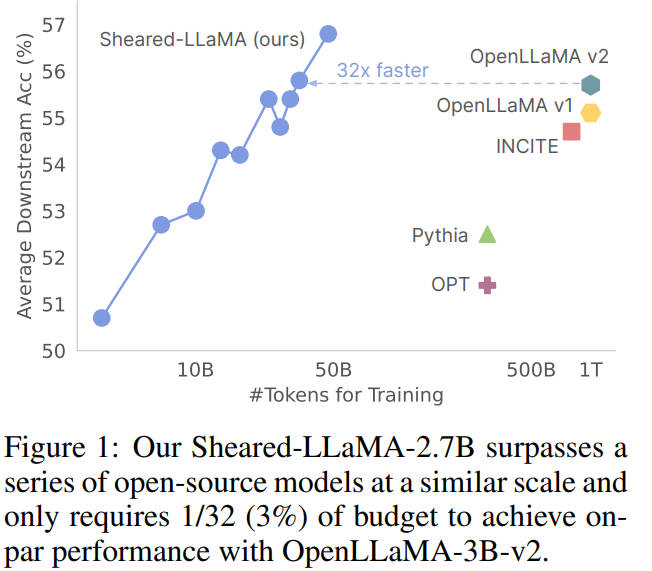 | arXiv |   2023 |  | [note](./notes/llm_shearing/note.md)                                                                      |

<b>Rice University</b>
 

|    | meta                              | ttttttttttttttttttttttttttttttitle                                                                              | ccccccccccccccccccover                                        | pub   |   year | codeeeee                                                                     | note   |
|---:|:----------------------------------|:----------------------------------------------------------------------------------------------------------------|:--------------------------------------------------------------|:------|-------:|:-----------------------------------------------------------------------------|:-------|
|  0 | [Deja Vu](./meta/dejavu.prototxt) | [Deja Vu: Contextual Sparsity for Efficient LLMs at Inference Time](https://openreview.net/forum?id=wIPIhHd00i) | 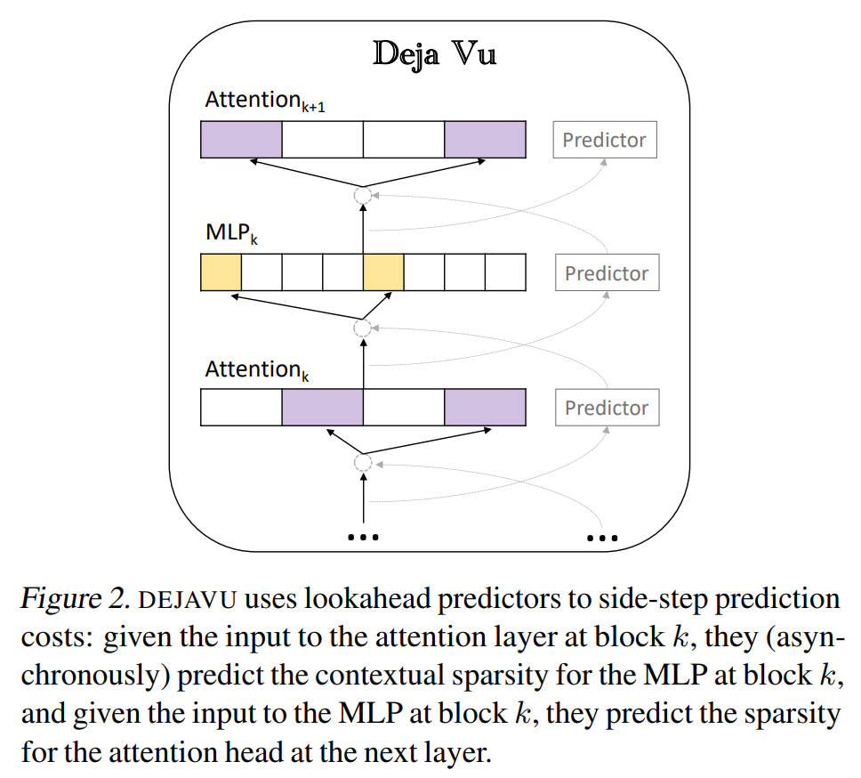 | ICML  |   2023 |  |        |

<b>School of Cyber Security, University of Chinese Academy of Sciences</b>
 

|    | meta                          | ttttttttttttttttttttttttttttttitle                                                          | ccccccccccccccccccover                                                 | pub   |   year | codeeeee   | note   |
|---:|:------------------------------|:--------------------------------------------------------------------------------------------|:-----------------------------------------------------------------------|:------|-------:|:-----------|:-------|
|  0 | [m](./meta/L5D7520E.prototxt) | [A Survey on Model Compression for Large Language Models](https://arxiv.org/abs/2308.07633) |  | arXiv |   2023 |            |        |

<b>SenseTime Research</b>
 

|    | meta                             | ttttttttttttttttttttttttttttttitle                                                                                          | ccccccccccccccccccover                                        | pub   |   year | codeeeee                                                                      | note   |
|---:|:---------------------------------|:----------------------------------------------------------------------------------------------------------------------------|:--------------------------------------------------------------|:------|-------:|:------------------------------------------------------------------------------|:-------|
|  0 | [BRECQ](./meta/brecq.prototxt)   | [BRECQ: Pushing the Limit of Post-Training Quantization by Block Reconstruction](https://openreview.net/pdf?id=POWv6hDd9XH) |                                                               | ICLR  |   2021 |         |        |
|  1 | [SR-STE](./meta/sr-ste.prototxt) | [Learning N:M Fine-grained Structured Sparse Neural Networks From Scratch](https://openreview.net/forum?id=K9bw7vqp_s)      |  | ICLR  |   2021 |  |        |

<b>Seoul National University</b>
 

|    | meta                                   | ttttttttttttttttttttttttttttttitle                                                                                                  | ccccccccccccccccccover                                       | pub   |   year | codeeeee   | note                              |
|---:|:---------------------------------------|:------------------------------------------------------------------------------------------------------------------------------------|:-------------------------------------------------------------|:------|-------:|:-----------|:----------------------------------|
|  0 | [K-pruning](./meta/k_pruning.prototxt) | [Knowledge-preserving Pruning for Pre-trained Language Models without Retraining](https://arxiv.org/abs/2308.03449)                 | 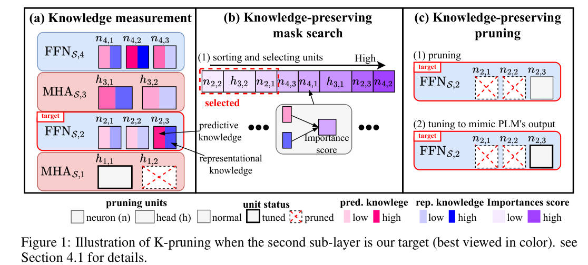 | arXiv |   2023 |            | [note](./notes/k_pruning/note.md) |
|  1 | [L4Q](./meta/L4Q.prototxt)             | [L4Q: Parameter Efficient Quantization-Aware Training on Large Language Models via LoRA-wise LSQ](https://arxiv.org/abs/2402.04902) | 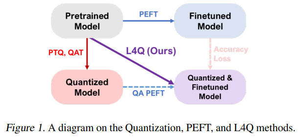      | arXiv |   2024 |            | [note](./notes/L4Q/note.md)       |

<b>Shanghai Jiao Tong University</b>
 

|    | meta                           | ttttttttttttttttttttttttttttttitle                                                                                                        | ccccccccccccccccccover                                           | pub          |   year | codeeeee                                                            | note                          |
|---:|:-------------------------------|:------------------------------------------------------------------------------------------------------------------------------------------|:-----------------------------------------------------------------|:-------------|-------:|:--------------------------------------------------------------------|:------------------------------|
|  0 | [PINS](./meta/PINS.prototxt)   | [Pruning Pre-trained Language Models with Principled Importance and Self-regularization](https://aclanthology.org/2023.findings-acl.573/) |                                                                  | ACL Findings |   2023 |  |                               |
|  1 | [ReLU2](./meta/ReLU2.prototxt) | [ReLU2 Wins: Discovering Efficient Activation Functions for Sparse LLMs](https://arxiv.org/abs/2402.03804)                                | 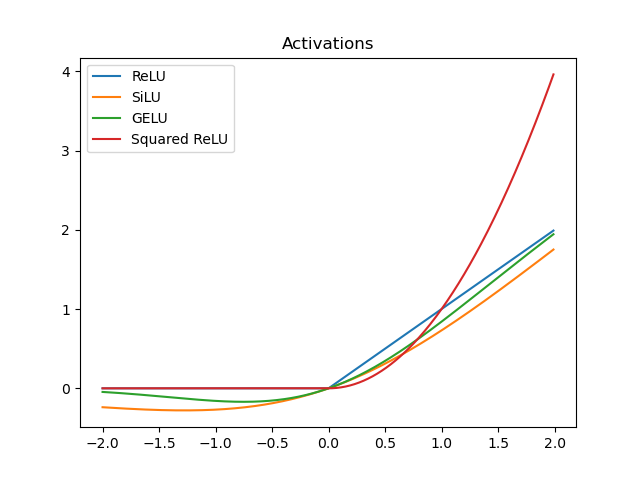 | arXiv        |   2024 |                                                                     | [note](./notes/ReLU2/note.md) |

<b>Stanford University</b>
 

|    | meta                                                | ttttttttttttttttttttttttttttttitle                                                                                                               | ccccccccccccccccccover                                               | pub     |   year | codeeeee                                                                            | note                                                                                                             |
|---:|:----------------------------------------------------|:-------------------------------------------------------------------------------------------------------------------------------------------------|:---------------------------------------------------------------------|:--------|-------:|:------------------------------------------------------------------------------------|:-----------------------------------------------------------------------------------------------------------------|
|  0 | [Deep Compression](./meta/deepcompression.prototxt) | [Deep Compression: Compressing Deep Neural Networks with Pruning, Trained Quantization and Huffman Coding](https://arxiv.org/pdf/1510.00149.pdf) |                                                                      | ICLR    |   2016 |                                                                                     |                                                                                                                  |
|  1 | [DSD](./meta/dsd.prototxt)                          | [DSD: Dense-Sparse-Dense Training for Deep Neural Networks](https://arxiv.org/pdf/1607.04381.pdf)                                                |                                                                      | ICLR    |   2017 |                                                                                     | [note](https://confluence.xilinx.com/display/aialgo/DSD%3A+Dense-Sparse-Dense+Training+for+Deep+Neural+Networks) |
|  2 | [FlashAttention](./meta/flashattention.prototxt)    | [FlashAttention: Fast and Memory-Efficient Exact Attention with IO-Awareness](https://arxiv.org/abs/2205.14135)                                  |  | NeurIPS |   2022 |  |                                                                                                                  |
|  3 | [Deja Vu](./meta/dejavu.prototxt)                   | [Deja Vu: Contextual Sparsity for Efficient LLMs at Inference Time](https://openreview.net/forum?id=wIPIhHd00i)                                  |         | ICML    |   2023 |         |                                                                                                                  |
|  4 | [FlashAttention-2](./meta/flashattention2.prototxt) | [FlashAttention-2: Faster Attention with Better Parallelism and Work Partitioning](https://arxiv.org/abs/2307.08691)                             |                                                                      | arXiv   |   2023 |  |                                                                                                                  |

<b>Sungkyunkwan University</b>
 

|    | meta                       | ttttttttttttttttttttttttttttttitle                                                                                                  | ccccccccccccccccccover                                  | pub   |   year | codeeeee   | note                        |
|---:|:---------------------------|:------------------------------------------------------------------------------------------------------------------------------------|:--------------------------------------------------------|:------|-------:|:-----------|:----------------------------|
|  0 | [L4Q](./meta/L4Q.prototxt) | [L4Q: Parameter Efficient Quantization-Aware Training on Large Language Models via LoRA-wise LSQ](https://arxiv.org/abs/2402.04902) |  | arXiv |   2024 |            | [note](./notes/L4Q/note.md) |

<b>Tencent AI Lab</b>
 

|    | meta                         | ttttttttttttttttttttttttttttttitle                                                                               | ccccccccccccccccccover   | pub   |   year | codeeeee                                                                    | note   |
|---:|:-----------------------------|:-----------------------------------------------------------------------------------------------------------------|:-------------------------|:------|-------:|:----------------------------------------------------------------------------|:-------|
|  0 | [RPTQ](./meta/RPTQ.prototxt) | [RPTQ: Reorder-based Post-training Quantization for Large Language Models](https://arxiv.org/pdf/2304.01089.pdf) |                          | arXiv |   2023 |  |        |

<b>Tencent Machine Learning Platform</b>
 

|    | meta                                   | ttttttttttttttttttttttttttttttitle                                                                                                  | ccccccccccccccccccover                                              | pub   |   year | codeeeee   | note                              |
|---:|:---------------------------------------|:------------------------------------------------------------------------------------------------------------------------------------|:--------------------------------------------------------------------|:------|-------:|:-----------|:----------------------------------|
|  0 | [ProSparse](./meta/ProSparse.prototxt) | [ProSparse: Introducing and Enhancing Intrinsic Activation Sparsity within Large Language Models](https://arxiv.org/abs/2402.13516) |  | arXiv |   2024 |            | [note](./notes/ProSparse/note.md) |

<b>The Hebrew University of Jerusalem, Israel</b>
 

|    | meta                          | ttttttttttttttttttttttttttttttitle                                                              | ccccccccccccccccccover                                               | pub   |   year | codeeeee   | note   |
|---:|:------------------------------|:------------------------------------------------------------------------------------------------|:---------------------------------------------------------------------|:------|-------:|:-----------|:-------|
|  0 | [m](./meta/68I8KKBV.prototxt) | [Efficient Methods for Natural Language Processing: A Survey](https://arxiv.org/abs/2209.00099) |  | TACL  |   2023 |            |        |

<b>The Hong Kong University of Science and Technology</b>
 

|    | meta                         | ttttttttttttttttttttttttttttttitle                                                                                             | ccccccccccccccccccover   | pub   |   year | codeeeee   | note   |
|---:|:-----------------------------|:-------------------------------------------------------------------------------------------------------------------------------|:-------------------------|:------|-------:|:-----------|:-------|
|  0 | [LISA](./meta/LISA.prototxt) | [LISA: Layerwise Importance Sampling for Memory-Efficient Large Language Model Fine-Tuning](http://arxiv.org/abs/2403.17919v1) |                          | arXiv |   2024 |            |        |

<b>The University of Hong Kong</b>
 

|    | meta                                   | ttttttttttttttttttttttttttttttitle                                                                                            | ccccccccccccccccccover                                              | pub          |   year | codeeeee                                                                      | note                            |
|---:|:---------------------------------------|:------------------------------------------------------------------------------------------------------------------------------|:--------------------------------------------------------------------|:-------------|-------:|:------------------------------------------------------------------------------|:--------------------------------|
|  0 | [SIMPLE](./meta/simple.prototxt)       | [Structured Pruning for Efficient Generative Pre-trained Language Models](https://aclanthology.org/2023.findings-acl.692.pdf) |         | ACL Findings |   2023 |                                                                               | [note](./notes/simple/index.md) |
|  1 | [OmniQuant](./meta/omniquant.prototxt) | [OmniQuant: Omnidirectionally Calibrated Quantization for Large Language Models](https://arxiv.org/abs/2308.13137)            |  | arXiv        |   2023 |  |                                 |

<b>The University of Texas at Austin</b>
 

|    | meta                          | ttttttttttttttttttttttttttttttitle                                                                                                            | ccccccccccccccccccover   | pub   |   year | codeeeee   | note   |
|---:|:------------------------------|:----------------------------------------------------------------------------------------------------------------------------------------------|:-------------------------|:------|-------:|:-----------|:-------|
|  0 | [m](./meta/AYB1XUO5.prototxt) | [Ten Lessons We Have Learned in the New Sparseland: A Short Handbook for Sparse Neural Network Researchers](https://arxiv.org/abs/2302.02596) |                          | arXiv |   2023 |            |        |

<b>Tongji University</b>
 

|    | meta                         | ttttttttttttttttttttttttttttttitle                                                       | ccccccccccccccccccover                                    | pub   |   year | codeeeee   | note   |
|---:|:-----------------------------|:-----------------------------------------------------------------------------------------|:----------------------------------------------------------|:------|-------:|:-----------|:-------|
|  0 | [GBDT](./meta/gbdt.prototxt) | [Pruning Large Language Models via Accuracy Predictor](https://arxiv.org/abs/2309.09507) |  | arXiv |   2023 |            |        |

<b>Tsinghua University</b>
 

|    | meta                                                | ttttttttttttttttttttttttttttttitle                                                                                                                                              | ccccccccccccccccccover                                              | pub   |   year | codeeeee                                                                                                                    | note                              |
|---:|:----------------------------------------------------|:--------------------------------------------------------------------------------------------------------------------------------------------------------------------------------|:--------------------------------------------------------------------|:------|-------:|:----------------------------------------------------------------------------------------------------------------------------|:----------------------------------|
|  0 | [Deep Compression](./meta/deepcompression.prototxt) | [Deep Compression: Compressing Deep Neural Networks with Pruning, Trained Quantization and Huffman Coding](https://arxiv.org/pdf/1510.00149.pdf)                                |                                                                     | ICLR  |   2016 |                                                                                                                             |                                   |
|  1 | [nmSPARSE](./meta/nmSPARSE.prototxt)                | [Efficient GPU Kernels for N:M-Sparse Weights in Deep Learning](https://proceedings.mlsys.org/paper_files/paper/2023/file/4552cedd396a308320209f75f56a5ad5-Paper-mlsys2023.pdf) |                                                                     | MLSys |   2023 |                                                   |                                   |
|  2 | [AWQ](./meta/awq.prototxt)                          | [AWQ: Activation-aware Weight Quantization for LLM Compression and Acceleration](https://arxiv.org/abs/2306.00978)                                                              |                                                                     | arXiv |   2023 |                                                |                                   |
|  3 | [m](./meta/23LQ9SVH.prototxt)                       | [Training Transformers with 4-bit Integers](https://arxiv.org/abs//2306.11987)                                                                                                  |                                                                     | arXiv |   2023 |                                |                                   |
|  4 | [Plug-and-Play](./meta/IA8CS3VH.prototxt)           | [Plug-and-Play: An Efficient Post-training Pruning Method for Large Language Models](https://openreview.net/forum?id=Tr0lPx9woF)                                                |        | ICLR  |   2024 |  |                                   |
|  5 | [ProSparse](./meta/ProSparse.prototxt)              | [ProSparse: Introducing and Enhancing Intrinsic Activation Sparsity within Large Language Models](https://arxiv.org/abs/2402.13516)                                             |  | arXiv |   2024 |                                                                                                                             | [note](./notes/ProSparse/note.md) |
|  6 | [ReLU2](./meta/ReLU2.prototxt)                      | [ReLU2 Wins: Discovering Efficient Activation Functions for Sparse LLMs](https://arxiv.org/abs/2402.03804)                                                                      |     | arXiv |   2024 |                                                                                                                             | [note](./notes/ReLU2/note.md)     |

<b>UC Berkeley</b>
 

|    | meta                                      | ttttttttttttttttttttttttttttttitle                                                                                     | ccccccccccccccccccover                                               | pub     |   year | codeeeee                                                                                     | note                                                                         |
|---:|:------------------------------------------|:-----------------------------------------------------------------------------------------------------------------------|:---------------------------------------------------------------------|:--------|-------:|:---------------------------------------------------------------------------------------------|:-----------------------------------------------------------------------------|
|  0 | [ActNN](./meta/actnn.prototxt)            | [ActNN: Reducing Training Memory Footprint via 2-Bit Activation Compressed Training](https://arxiv.org/abs/2104.14129) |                                                                      | ICML    |   2019 |                       |                                                                              |
|  1 | [FisherPruning](./meta/QA8XN7TU.prototxt) | [A Fast Post-Training Pruning Framework for Transformers](https://arxiv.org/abs/2204.09656)                            | 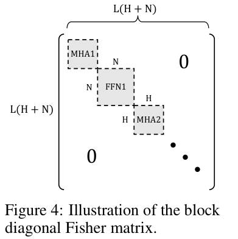 | NeurIPS |   2022 |  | [note](https://confluence.xilinx.com/pages/viewpage.action?pageId=969271620) |
|  2 | [SqueezeLLM](./meta/SqueezeLLM.prototxt)  | [SqueezeLLM: Dense-and-Sparse Quantization](https://arxiv.org/abs/2306.07629)                                          |                                                                      | arXiv   |   2023 |             |                                                                              |

<b>UCSD</b>
 

|    | meta                             | ttttttttttttttttttttttttttttttitle                                                                                  | ccccccccccccccccccover   | pub   |   year | codeeeee                                                  | note                                                                          |
|---:|:---------------------------------|:--------------------------------------------------------------------------------------------------------------------|:-------------------------|:------|-------:|:----------------------------------------------------------|:------------------------------------------------------------------------------|
|  0 | [GPFQ](./meta/gpfq.prototxt)     | [A Greedy Algorithm for Quantizing Neural Networks](https://jmlr.csail.mit.edu/papers/volume22/20-1233/20-1233.pdf) |                          | JMLR  |   2021 | [Pytorch](https://gitenterprise.xilinx.com/xiandong/GPFA) | [note](https://confluence.xilinx.com/pages/viewpage.action?pageId=1005133974) |
|  1 | [GPFQv2](./meta/gpfqv2.prototxt) | [Post-training Quantization for Neural Networks with Provable Guarantees](https://arxiv.org/pdf/2201.11113.pdf)     |                          | arXiv |   2023 | [Pytorch](https://gitenterprise.xilinx.com/xiandong/GPFA) | [note](https://confluence.xilinx.com/pages/viewpage.action?pageId=1005133974) |

<b>Univeristy of Sydney</b>
 

|    | meta                                   | ttttttttttttttttttttttttttttttitle                                                                                                                      | ccccccccccccccccccover                                          | pub   |   year | codeeeee                                                                            | note                               |
|---:|:---------------------------------------|:--------------------------------------------------------------------------------------------------------------------------------------------------------|:----------------------------------------------------------------|:------|-------:|:------------------------------------------------------------------------------------|:-----------------------------------|
|  0 | [Flash-LLM](./meta/flash_llm.prototxt) | [Flash-LLM: Enabling Cost-Effective and Highly-Efficient Large Generative Model Inference with Unstructured Sparsity](https://arxiv.org/abs/2309.10285) |  | VLDB  |   2024 |  | [note](./notes/flash_llm/index.md) |

<b>University of Basel</b>
 

|    | meta                                                                       | ttttttttttttttttttttttttttttttitle                                                                                      | ccccccccccccccccccover                                                                                  | pub   |   year | codeeeee   | note   |
|---:|:---------------------------------------------------------------------------|:------------------------------------------------------------------------------------------------------------------------|:--------------------------------------------------------------------------------------------------------|:------|-------:|:-----------|:-------|
|  0 | [Adaptively Sparse Attention](./meta/adaptively_sparse_attention.prototxt) | [Dynamic Context Pruning for Efficient and Interpretable Autoregressive Transformers](https://arxiv.org/abs/2305.15805) | 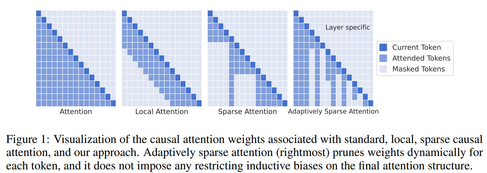 | arXiv |   2023 |            |        |

<b>University of Connecticut</b>
 

|    | meta                          | ttttttttttttttttttttttttttttttitle                                                                                                        | ccccccccccccccccccover   | pub   |   year | codeeeee                                                                                            | note   |
|---:|:------------------------------|:------------------------------------------------------------------------------------------------------------------------------------------|:-------------------------|:------|-------:|:----------------------------------------------------------------------------------------------------|:-------|
|  0 | [m](./meta/XZBX1Z9G.prototxt) | [Sparse Progressive Distillation: Resolving Overfitting under Pretrain-and-Finetune Paradigm](https://aclanthology.org/2022.acl-long.16/) |                          | ACL   |   2022 |  |        |

<b>University of Electronic Science and Technology of China</b>
 

|    | meta                           | ttttttttttttttttttttttttttttttitle                                                                                          | ccccccccccccccccccover   | pub   |   year | codeeeee                                                               | note   |
|---:|:-------------------------------|:----------------------------------------------------------------------------------------------------------------------------|:-------------------------|:------|-------:|:-----------------------------------------------------------------------|:-------|
|  0 | [BRECQ](./meta/brecq.prototxt) | [BRECQ: Pushing the Limit of Post-Training Quantization by Block Reconstruction](https://openreview.net/pdf?id=POWv6hDd9XH) |                          | ICLR  |   2021 |  |        |

<b>University of Illinois Urbana-Champaign</b>
 

|    | meta                         | ttttttttttttttttttttttttttttttitle                                                                                             | ccccccccccccccccccover   | pub   |   year | codeeeee   | note   |
|---:|:-----------------------------|:-------------------------------------------------------------------------------------------------------------------------------|:-------------------------|:------|-------:|:-----------|:-------|
|  0 | [LISA](./meta/LISA.prototxt) | [LISA: Layerwise Importance Sampling for Memory-Efficient Large Language Model Fine-Tuning](http://arxiv.org/abs/2403.17919v1) |                          | arXiv |   2024 |            |        |

<b>University of Surrey, UK</b>
 

|    | meta                                                   | ttttttttttttttttttttttttttttttitle                                                                                                                            | ccccccccccccccccccover                                                              | pub   |   year | codeeeee                                                                                | note   |
|---:|:-------------------------------------------------------|:--------------------------------------------------------------------------------------------------------------------------------------------------------------|:------------------------------------------------------------------------------------|:------|-------:|:----------------------------------------------------------------------------------------|:-------|
|  0 | [Selective Context](./meta/selective_context.prototxt) | [Unlocking Context Constraints of LLMs: Enhancing Context Efficiency of LLMs with Self-Information-Based Content Filtering](https://arxiv.org/abs/2304.12102) | 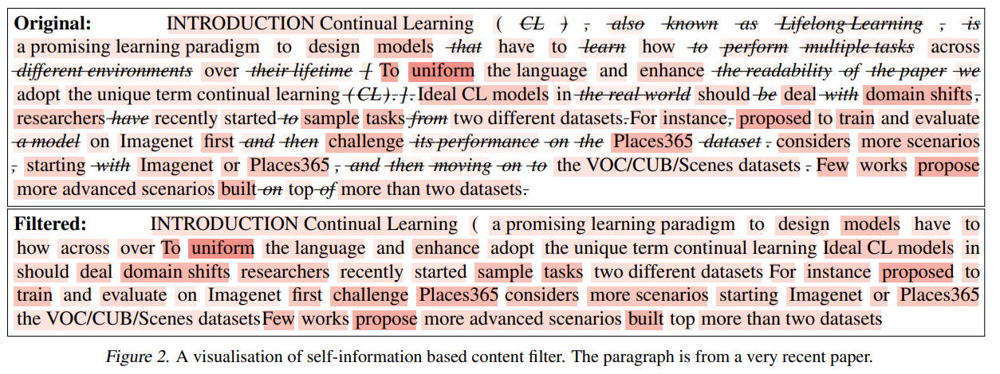 | arXiv |   2023 |  |        |

<b>University of Texas at Austin</b>
 

|    | meta                                                    | ttttttttttttttttttttttttttttttitle                                                                                                         | ccccccccccccccccccover                                    | pub   |   year | codeeeee                                                                                | note   |
|---:|:--------------------------------------------------------|:-------------------------------------------------------------------------------------------------------------------------------------------|:----------------------------------------------------------|:------|-------:|:----------------------------------------------------------------------------------------|:-------|
|  0 | [OWL](./meta/owl.prototxt)                              | [Outlier Weighed Layerwise Sparsity (OWL): A Missing Secret Sauce for Pruning LLMs to High Sparsity](https://arxiv.org/pdf/2310.05175.pdf) |  | arXiv |   2023 |                     |        |
|  1 | [Essential Sparsity](./meta/EssentialSparsity.prototxt) | [The Emergence of Essential Sparsity in Large Pre-trained Models: The Weights that Matter](https://arxiv.org/abs/2306.03805)               |                                                           | arXiv |   2023 |  |        |

<b>University of Washington</b>
 

|    | meta                           | ttttttttttttttttttttttttttttttitle                                                                                                         | ccccccccccccccccccover                                      | pub   |   year | codeeeee                                                                 | note   |
|---:|:-------------------------------|:-------------------------------------------------------------------------------------------------------------------------------------------|:------------------------------------------------------------|:------|-------:|:-------------------------------------------------------------------------|:-------|
|  0 | [OWL](./meta/owl.prototxt)     | [Outlier Weighed Layerwise Sparsity (OWL): A Missing Secret Sauce for Pruning LLMs to High Sparsity](https://arxiv.org/pdf/2310.05175.pdf) |    | arXiv |   2023 |      |        |
|  1 | [QLoRA](./meta/qlora.prototxt) | [QLoRA: Efficient Finetuning of Quantized LLMs](https://arxiv.org/abs/2305.14314)                                                          | 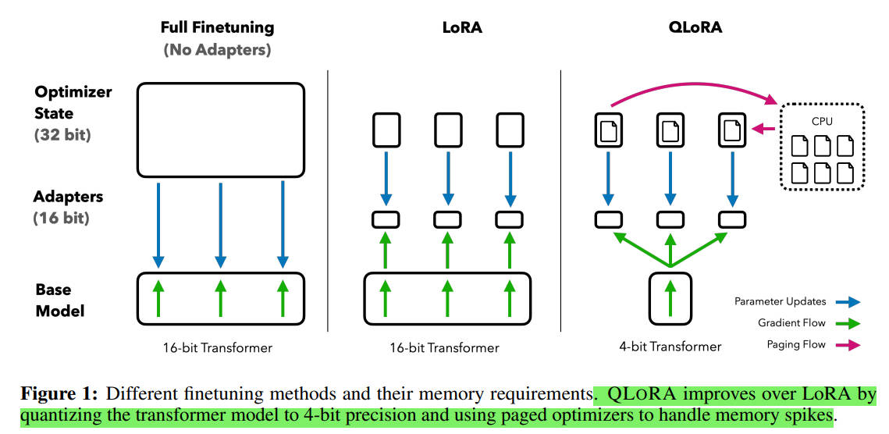 | arXiv |   2023 |  |        |

<b>VITA Group</b>
 

|    | meta                                                    | ttttttttttttttttttttttttttttttitle                                                                                                            | ccccccccccccccccccover   | pub   |   year | codeeeee                                                                                | note   |
|---:|:--------------------------------------------------------|:----------------------------------------------------------------------------------------------------------------------------------------------|:-------------------------|:------|-------:|:----------------------------------------------------------------------------------------|:-------|
|  0 | [m](./meta/AYB1XUO5.prototxt)                           | [Ten Lessons We Have Learned in the New Sparseland: A Short Handbook for Sparse Neural Network Researchers](https://arxiv.org/abs/2302.02596) |                          | arXiv |   2023 |                                                                                         |        |
|  1 | [Essential Sparsity](./meta/EssentialSparsity.prototxt) | [The Emergence of Essential Sparsity in Large Pre-trained Models: The Weights that Matter](https://arxiv.org/abs/2306.03805)                  |                          | arXiv |   2023 |  |        |

<b>Xiamen University</b>
 

|    | meta                                   | ttttttttttttttttttttttttttttttitle                                                                                                  | ccccccccccccccccccover                                          | pub   |   year | codeeeee                                                                    | note                              |
|---:|:---------------------------------------|:------------------------------------------------------------------------------------------------------------------------------------|:----------------------------------------------------------------|:------|-------:|:----------------------------------------------------------------------------|:----------------------------------|
|  0 | [Compresso](./meta/Compresso.prototxt) | [Compresso: Structured Pruning with Collaborative Prompting Learns Compact Large Language Models](https://arxiv.org/abs/2310.05015) |  | arXiv |   2023 |  | [note](./notes/compresso/note.md) |

<b>Yale University</b>
 

|    | meta                                 | ttttttttttttttttttttttttttttttitle                                                                                         | ccccccccccccccccccover                                            | pub   |   year | codeeeee                                                                  | note   |
|---:|:-------------------------------------|:---------------------------------------------------------------------------------------------------------------------------|:------------------------------------------------------------------|:------|-------:|:--------------------------------------------------------------------------|:-------|
|  0 | [Diffuser](./meta/diffuser.prototxt) | [Diffuser: Efficient Transformers with Multi-hop Attention Diffusion for Long Sequences](https://arxiv.org/abs/2210.11794) | 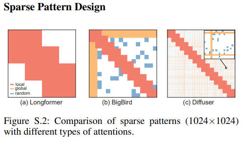 | AAAI  |   2023 |  |        |

<b>Zhe Jiang University</b>
 

|    | meta                              | ttttttttttttttttttttttttttttttitle                                                                              | ccccccccccccccccccover                                        | pub   |   year | codeeeee                                                                     | note   |
|---:|:----------------------------------|:----------------------------------------------------------------------------------------------------------------|:--------------------------------------------------------------|:------|-------:|:-----------------------------------------------------------------------------|:-------|
|  0 | [Deja Vu](./meta/dejavu.prototxt) | [Deja Vu: Contextual Sparsity for Efficient LLMs at Inference Time](https://openreview.net/forum?id=wIPIhHd00i) |  | ICML  |   2023 |  |        |

<b>Zhongguancun Laboratory</b>
 

|    | meta                       | ttttttttttttttttttttttttttttttitle                                                                       | ccccccccccccccccccover                                  | pub   |   year | codeeeee                                                             | note   |
|---:|:---------------------------|:---------------------------------------------------------------------------------------------------------|:--------------------------------------------------------|:------|-------:|:---------------------------------------------------------------------|:-------|
|  0 | [SMP](./meta/smp.prototxt) | [Pruning Pre-trained Language Models Without Fine-Tuning](https://aclanthology.org/2023.acl-long.35.pdf) |  | ACL   |   2023 |  |        |

<b>iFLYTEK Research</b>
 

|    | meta                           | ttttttttttttttttttttttttttttttitle                                                                        | ccccccccccccccccccover                                      | pub   |   year | codeeeee                                                                | note                           |
|---:|:-------------------------------|:----------------------------------------------------------------------------------------------------------|:------------------------------------------------------------|:------|-------:|:------------------------------------------------------------------------|:-------------------------------|
|  0 | [GRAIN](./meta/grain.prototxt) | [Gradient-based Intra-attention Pruning on Pre-trained Language Models](https://arxiv.org/abs/2212.07634) |  | ACL   |   2023 |  | [note](./notes/grain/index.md) |

