

### institution

 

<b>AWS AI</b>
 

| Meta | Title | Cover | Publish | Code | Note |
|:-----|:------|:------|:--------|:-----|:-----|
| [MXFP4Train](./meta/2025/MXFP4Train.prototxt) | [Training LLMs with MXFP4](http://arxiv.org/abs/2502.20586v2) |  |  |  | [note](./notes/2025/MXFP4Train/note.md) |

<b>AWS AI Labs</b>
 

| Meta | Title | Cover | Publish | Code | Note |
|:-----|:------|:------|:--------|:-----|:-----|
| [m](./meta/2023/WDCO13S6.prototxt) | [Structural Pruning of Large Language Models via Neural Architecture Search](https://openreview.net/forum?id=SHlZcInS6C) |  |  |  |  |

<b>Advanced Micro Devices</b>
 

| Meta | Title | Cover | Publish | Code | Note |
|:-----|:------|:------|:--------|:-----|:-----|
| [T3](./meta/2024/T3.prototxt) | [T3: Transparent Tracking & Triggering for Fine-grained Overlap of Compute & Collectives](http://arxiv.org/abs/2401.16677v1) |  |  |  | [note](./notes/2024/T3/note.md) |
| [SDS](./meta/2025/SDS.prototxt) | [Enhancing One-shot Pruned Pre-trained Language Models through Sparse-Dense-Sparse Mechanism](http://arxiv.org/abs/2408.10473v1) |  |  |  | [note](./notes/2025/SDS/note.md) |
| [BaWA](./meta/2025/BaWA.prototxt) | [BaWA: Automatic Optimizing Pruning Metric for Large Language Models with Balanced Weight and Activation](https://openreview.net/forum?id=YrCvW1Hx7g) |  |  |  | [note](./notes/2025/BaWA/note.md) |
| [Týr-the-Pruner](./meta/2025/Týr-the-Pruner.prototxt) | [Týr-the-Pruner: Unlocking Accurate 50% Structural Pruning for LLMs via Global Sparsity Distribution Optimization](http://arxiv.org/abs/2503.09657v2) |  |  |  | [note](./notes/2025/Týr-the-Pruner/note.md) |

<b>Alibaba Cloud</b>
 

| Meta | Title | Cover | Publish | Code | Note |
|:-----|:------|:------|:--------|:-----|:-----|
| [07NWF4VE](./meta/2025/07NWF4VE.prototxt) | [Accelerating LLM Inference Throughput via Asynchronous KV Cache Prefetching](http://arxiv.org/abs/2504.06319v1) |  |  |  | [note](./notes/2025/07NWF4VE/note.md) |

<b>Alibaba Group</b>
 

| Meta | Title | Cover | Publish | Code | Note |
|:-----|:------|:------|:--------|:-----|:-----|
| [SlimGPT](./meta/2024/SlimGPT.prototxt) | [SlimGPT: Layer-wise Structured Pruning for Large Language Models](http://arxiv.org/abs/2412.18110v1) | 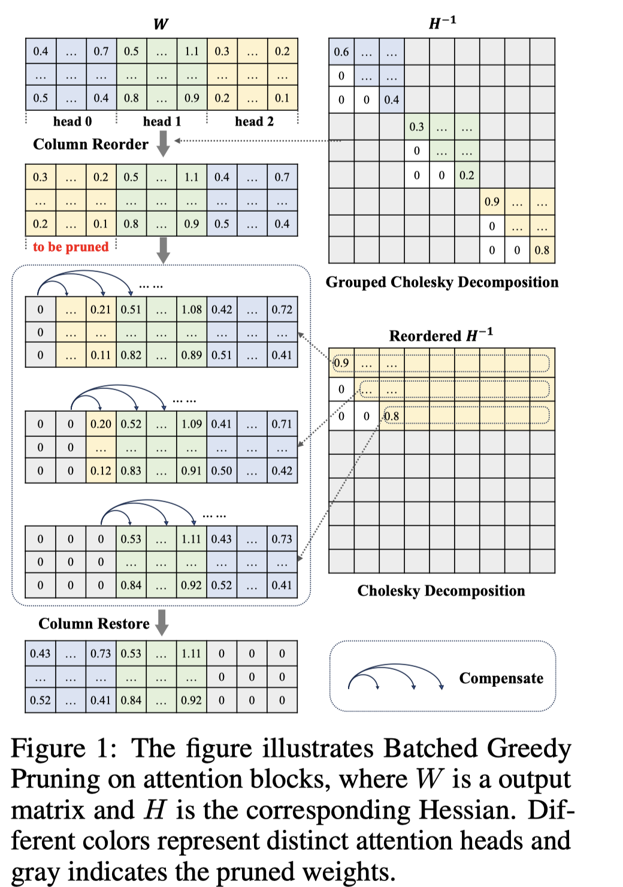 |  |  | [note](./notes/2024/SlimGPT/note.md) |
| [Flash-LLM](./meta/2024/flash_llm.prototxt) | [Flash-LLM: Enabling Cost-Effective and Highly-Efficient Large Generative Model Inference with Unstructured Sparsity](https://arxiv.org/abs/2309.10285) |  |  |  | [note](./notes/2024/flash_llm/index.md) |
| [DistAttention](./meta/2024/DistAttention.prototxt) | [Infinite-LLM: Efficient LLM Service for Long Context with DistAttention and Distributed KVCache](http://arxiv.org/abs/2401.02669v2) |  |  |  | [note](./notes/2024/DistAttention/note.md) |
| [CateKV](./meta/2025/CateKV.prototxt) | [CateKV: On Sequential Consistency for Long-Context LLM Inference Acceleration](https://openreview.net/forum?id=u7dlwgKstN) |  |  |  | [note](./notes/2025/CateKV/note.md) |
| [LaRoSA](./meta/2025/LaRoSA.prototxt) | [La RoSA: Enhancing LLM Efficiency via Layerwise Rotated Sparse Activation](http://arxiv.org/abs/2507.01299v1) |  |  |  | [note](./notes/2025/LaRoSA/note.md) |
| [Cus-Prun](./meta/2025/Cus-Prun.prototxt) | [Pruning General Large Language Models into Customized Expert Models](http://arxiv.org/abs/2506.02561v1) | 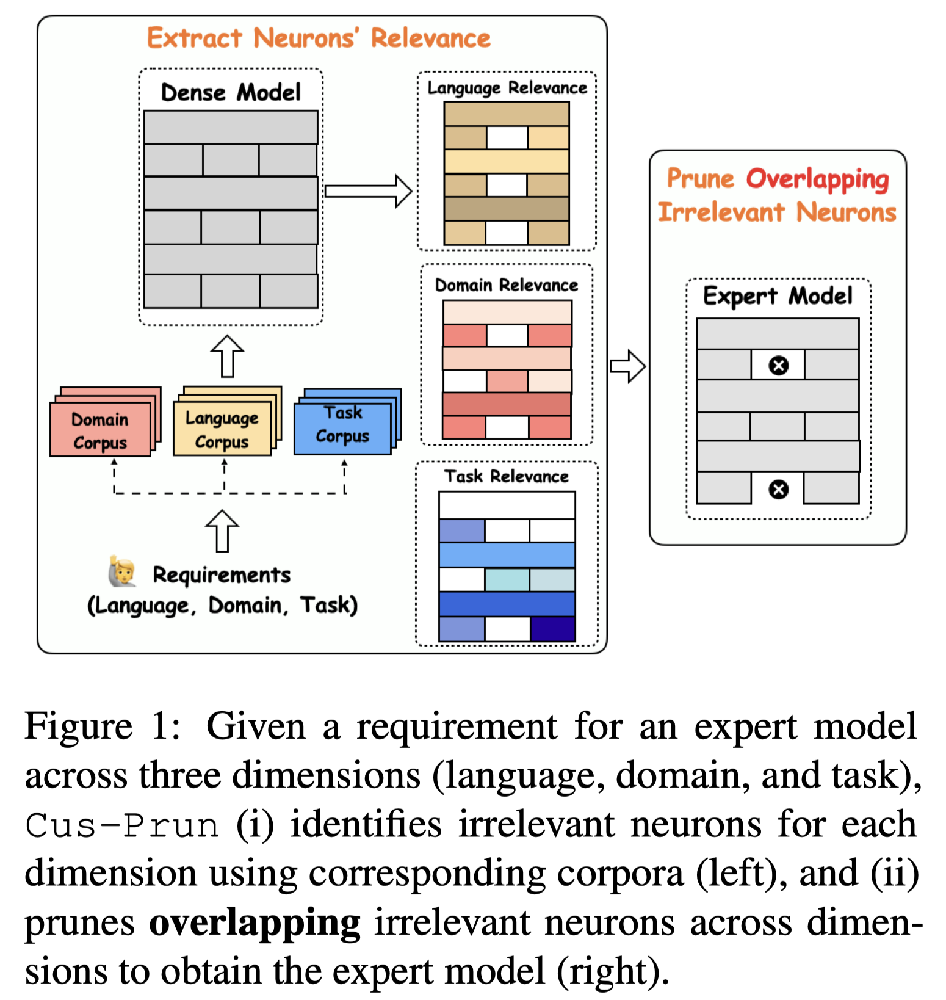 |  |  | [note](./notes/2025/Cus-Prun/note.md) |

<b>Apple</b>
 

| Meta | Title | Cover | Publish | Code | Note |
|:-----|:------|:------|:--------|:-----|:-----|
| [LLM in a flash](./meta/2023/LLM_in_a_flash.prototxt) | [LLM in a flash: Efficient Large Language Model Inference with Limited Memory](http://arxiv.org/abs/2312.11514) |  |  |  | [note](./notes/2023/LLM_in_a_flash/note.md) |
| [LLM-KICK](./meta/2024/VB8C61V6.prototxt) | [Compressing LLMs: The Truth is Rarely Pure and Never Simple](http://arxiv.org/abs/2310.01382v2) |  |  |  | [note](./notes/2024/VB8C61V6/note.md) |
| [ReLU Strikes Back](./meta/2024/HMR7HKFV.prototxt) | [ReLU Strikes Back: Exploiting Activation Sparsity in Large Language Models](https://arxiv.org/abs/2310.04564) |  |  |  |  |
| [LazyLLM](./meta/2024/LazyLLM.prototxt) | [LazyLLM: Dynamic Token Pruning for Efficient Long Context LLM Inference](http://arxiv.org/abs/2407.14057v1) |  |  |  | [note](./notes/2024/LazyLLM/note.md) |
| [IFPruning](./meta/2025/IFPruning.prototxt) | [Instruction-Following Pruning for Large Language Models](http://arxiv.org/abs/2501.02086v2) |  |  |  | [note](./notes/2025/IFPruning/note.md) |

<b>Beihang University</b>
 

| Meta | Title | Cover | Publish | Code | Note |
|:-----|:------|:------|:--------|:-----|:-----|
| [SMP](./meta/2023/smp.prototxt) | [Pruning Pre-trained Language Models Without Fine-Tuning](https://aclanthology.org/2023.acl-long.35.pdf) |  |  |  |  |
| [SlimInfer](./meta/2025/SlimInfer.prototxt) | [SlimInfer: Accelerating Long-Context LLM Inference via Dynamic Token Pruning](http://arxiv.org/abs/2508.06447v1) |  |  |  | [note](./notes/2025/SlimInfer/note.md) |

<b>ByteDance</b>
 

| Meta | Title | Cover | Publish | Code | Note |
|:-----|:------|:------|:--------|:-----|:-----|
| [FLUX](./meta/2024/FLUX.prototxt) | [FLUX: Fast Software-based Communication Overlap On GPUs Through Kernel Fusion](http://arxiv.org/abs/2406.06858v5) |  |  |  | [note](./notes/2024/FLUX/note.md) |
| [FlexPrefill](./meta/2025/FlexPrefill.prototxt) | [FlexPrefill: A Context-Aware Sparse Attention Mechanism for Efficient Long-Sequence Inference](http://arxiv.org/abs/2502.20766v1) |  |  |  | [note](./notes/2025/FlexPrefill/note.md) |
| [PoD](./meta/2025/PoD.prototxt) | [Compressing KV Cache for Long-Context LLM Inference with Inter-Layer Attention Similarity](http://arxiv.org/abs/2412.02252v1) |  |  |  | [note](./notes/2025/PoD/note.md) |
| [ShadowKV](./meta/2025/ShadowKV.prototxt) | [ShadowKV: KV Cache in Shadows for High-Throughput Long-Context LLM Inference](https://openreview.net/forum?id=oa7MYAO6h6) |  |  |  | [note](./notes/2025/ShadowKV/note.md) |
| [KeepKV](./meta/2025/KeepKV.prototxt) | [KeepKV: Eliminating Output Perturbation in KV Cache Compression for Efficient LLMs Inference](http://arxiv.org/abs/2504.09936v1) |  |  |  | [note](./notes/2025/KeepKV/note.md) |
| [52A7RO95](./meta/2025/52A7RO95.prototxt) | [Mixture of Experts in Large Language Models](http://arxiv.org/abs/2507.11181v1) |  |  |  | [note](./notes/2025/52A7RO95/note.md) |
| [PowerAttention](./meta/2025/PowerAttention.prototxt) | [PowerAttention: Exponentially Scaling of Receptive Fields for Effective Sparse Attention](http://arxiv.org/abs/2503.03588v1) |  |  |  | [note](./notes/2025/PowerAttention/note.md) |

<b>ByteDance Seed</b>
 

| Meta | Title | Cover | Publish | Code | Note |
|:-----|:------|:------|:--------|:-----|:-----|
| [CometSeed](./meta/2025/CometSeed.prototxt) | [Comet: Fine-grained Computation-communication Overlapping for Mixture-of-Experts](http://arxiv.org/abs/2502.19811v3) |  |  |  | [note](./notes/2025/CometSeed/note.md) |
| [MegaScale-MoE](./meta/2025/MegaScale-MoE.prototxt) | [MegaScale-MoE: Large-Scale Communication-Efficient Training of Mixture-of-Experts Models in Production](http://arxiv.org/abs/2505.11432v2) |  |  |  | [note](./notes/2025/MegaScale-MoE/note.md) |
| [TileLink](./meta/2025/TileLink.prototxt) | [TileLink: Generating Efficient Compute-Communication Overlapping Kernels using Tile-Centric Primitives](http://arxiv.org/abs/2503.20313v3) | 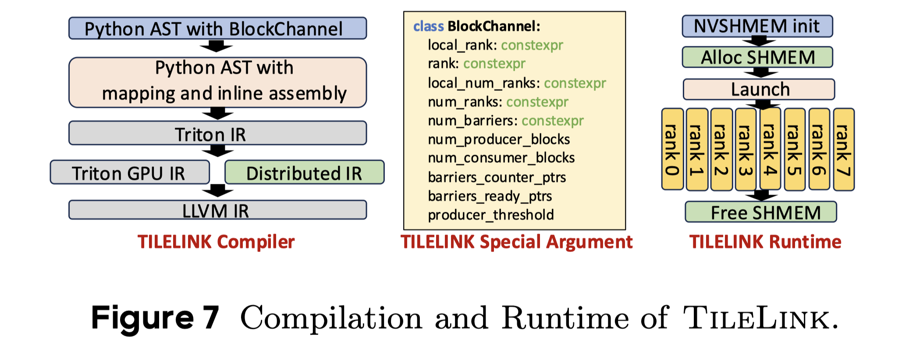 |  |  | [note](./notes/2025/TileLink/note.md) |
| [Triton-distributed](./meta/2025/Triton-distributed.prototxt) | [Triton-distributed: Programming Overlapping Kernels on Distributed AI Systems with the Triton Compiler](http://arxiv.org/abs/2504.19442v3) |  |  |  | [note](./notes/2025/Triton-distributed/note.md) |

<b>CMU</b>
 

| Meta | Title | Cover | Publish | Code | Note |
|:-----|:------|:------|:--------|:-----|:-----|
| [massive-activations](./meta/2024/massive-activations.prototxt) | [Massive Activations in Large Language Models](http://arxiv.org/abs/2402.17762v2) |  |  |  | [note](./notes/2024/massive-activations/note.md) |

<b>CPII under InnoHK</b>
 

| Meta | Title | Cover | Publish | Code | Note |
|:-----|:------|:------|:--------|:-----|:-----|
| [SPP](./meta/2024/SPP.prototxt) | [SPP: Sparsity-Preserved Parameter-Efficient Fine-Tuning for Large Language Models](http://arxiv.org/abs/2405.16057v1) |  |  |  | [note](./notes/2024/SPP/note.md) |

<b>Carnegie Mellon University</b>
 

| Meta | Title | Cover | Publish | Code | Note |
|:-----|:------|:------|:--------|:-----|:-----|
| [GBLM-Pruner](./meta/2023/GBLM-Pruner.prototxt) | [Beyond Size: How Gradients Shape Pruning Decisions in Large Language Models](http://arxiv.org/abs/2311.04902v2) |  |  |  | [note](./notes/2023/GBLM-Pruner/note.md) |
| [H2O](./meta/2023/H2O.prototxt) | [H$_2$O: Heavy-Hitter Oracle for Efficient Generative Inference of Large Language Models](http://arxiv.org/abs/2306.14048) |  |  |  | [note](./notes/2023/H2O/note.md) |
| [Wanda](./meta/2024/Wanda.prototxt) | [A Simple and Effective Pruning Approach for Large Language Models](http://arxiv.org/abs/2306.11695) |  |  |  | [note](./notes/2024/Wanda/note.md) |
| [streaming-llm](./meta/2024/streaming-llm.prototxt) | [Efficient Streaming Language Models with Attention Sinks](http://arxiv.org/abs/2309.17453v4) |  |  |  | [note](./notes/2024/streaming-llm/note.md) |
| [Bonsa](./meta/2024/Bonsa.prototxt) | [Everybody Prune Now: Structured Pruning of LLMs with only Forward Passes](https://arxiv.org/abs/2402.05406) |  |  |  |  |
| [XGrammar](./meta/2024/XGrammar.prototxt) | [XGrammar: Flexible and Efficient Structured Generation Engine for Large Language Models](http://arxiv.org/abs/2411.15100v2) |  |  |  | [note](./notes/2024/XGrammar/note.md) |
| [TidalDecode](./meta/2025/TidalDecode.prototxt) | [TidalDecode: Fast and Accurate LLM Decoding with Position Persistent Sparse Attention](http://arxiv.org/abs/2410.05076v1) | 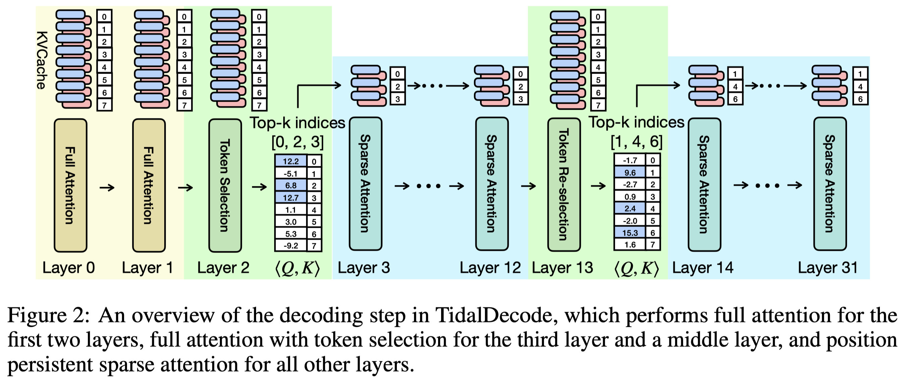 |  |  | [note](./notes/2025/TidalDecode/note.md) |
| [ShadowKV](./meta/2025/ShadowKV.prototxt) | [ShadowKV: KV Cache in Shadows for High-Throughput Long-Context LLM Inference](https://openreview.net/forum?id=oa7MYAO6h6) |  |  |  | [note](./notes/2025/ShadowKV/note.md) |
| [FlashInfer](./meta/2025/FlashInfer.prototxt) | [FlashInfer: Efficient and Customizable Attention Engine for LLM Inference Serving](http://arxiv.org/abs/2501.01005v2) |  |  |  | [note](./notes/2025/FlashInfer/note.md) |
| [R-KV](./meta/2025/R-KV.prototxt) | [R-KV: Redundancy-aware KV Cache Compression for Training-Free Reasoning Models Acceleration](http://arxiv.org/abs/2505.24133v2) |  |  |  | [note](./notes/2025/R-KV/note.md) |

<b>CentML</b>
 

| Meta | Title | Cover | Publish | Code | Note |
|:-----|:------|:------|:--------|:-----|:-----|
| [Seesaw](./meta/2025/Seesaw.prototxt) | [Seesaw: High-throughput LLM Inference via Model Re-sharding](http://arxiv.org/abs/2503.06433v1) |  |  |  | [note](./notes/2025/Seesaw/note.md) |

<b>Center for Advanced AI</b>
 

| Meta | Title | Cover | Publish | Code | Note |
|:-----|:------|:------|:--------|:-----|:-----|
| [KVLink](./meta/2025/KVLink.prototxt) | [KVLink: Accelerating Large Language Models via Efficient KV Cache Reuse](http://arxiv.org/abs/2502.16002v1) |  |  |  | [note](./notes/2025/KVLink/note.md) |

<b>Central South University</b>
 

| Meta | Title | Cover | Publish | Code | Note |
|:-----|:------|:------|:--------|:-----|:-----|
| [07NWF4VE](./meta/2025/07NWF4VE.prototxt) | [Accelerating LLM Inference Throughput via Asynchronous KV Cache Prefetching](http://arxiv.org/abs/2504.06319v1) |  |  |  | [note](./notes/2025/07NWF4VE/note.md) |

<b>Cerebras Systems</b>
 

| Meta | Title | Cover | Publish | Code | Note |
|:-----|:------|:------|:--------|:-----|:-----|
| [SPDF](./meta/2023/spdf.prototxt) | [SPDF: Sparse Pre-training and Dense Fine-tuning for Large Language Models](https://arxiv.org/abs/2303.10464) |  |  |  |  |
| [Sparse-IFT](./meta/2023/Sparse-IFT.prototxt) | [Sparse Iso-FLOP Transformations for Maximizing Training Efficiency](https://arxiv.org/abs/2303.11525) |  |  |  |  |
| [m](./meta/2024/ULY1AZGY.prototxt) | [Enabling High-Sparsity Foundational Llama Models with Efficient Pretraining and Deployment](http://arxiv.org/abs/2405.03594v1) |  |  |  | [note](./notes/2024/ULY1AZGY/note.md) |

<b>Chinese Academy of Sciences</b>
 

| Meta | Title | Cover | Publish | Code | Note |
|:-----|:------|:------|:--------|:-----|:-----|
| [CoCoNet](./meta/2022/CoCoNet.prototxt) | [Breaking the Computation and Communication Abstraction Barrier in Distributed Machine Learning Workloads](http://arxiv.org/abs/2105.05720v5) |  |  |  | [note](./notes/2022/CoCoNet/note.md) |

<b>Chinese University of Hong Kong</b>
 

| Meta | Title | Cover | Publish | Code | Note |
|:-----|:------|:------|:--------|:-----|:-----|
| [068ZPAME](./meta/2024/068ZPAME.prototxt) | [A Survey on Inference Optimization Techniques for Mixture of Experts Models](http://arxiv.org/abs/2412.14219v2) |  |  |  | [note](./notes/2024/068ZPAME/note.md) |

<b>Chongqing University</b>
 

| Meta | Title | Cover | Publish | Code | Note |
|:-----|:------|:------|:--------|:-----|:-----|
| [GBDT](./meta/2023/gbdt.prototxt) | [Pruning Large Language Models via Accuracy Predictor](https://arxiv.org/abs/2309.09507) | 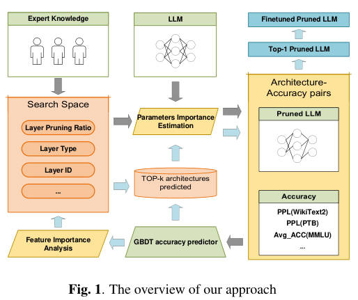 |  |  |  |

<b>City University of Hong Kong</b>
 

| Meta | Title | Cover | Publish | Code | Note |
|:-----|:------|:------|:--------|:-----|:-----|
| [SMAT](./meta/2024/SMAT.prototxt) | [Unleashing the Power of Meta-tuning for Few-shot Generalization Through Sparse Interpolated Experts](http://arxiv.org/abs/2403.08477v3) |  |  |  | [note](./notes/2024/SMAT/note.md) |
| [CHESS](./meta/2024/CHESS.prototxt) | [Optimizing LLM Inference via Channel-Wise Thresholding and Selective Sparsification](http://arxiv.org/abs/2409.01366v1) |  |  | [Pytorch](https://anonymous.4open.science/r/CHESS-BA40/README.md) | [note](./notes/2024/CHESS/note.md) |

<b>Cohere</b>
 

| Meta | Title | Cover | Publish | Code | Note |
|:-----|:------|:------|:--------|:-----|:-----|
| [SnapKV](./meta/2024/SnapKV.prototxt) | [SnapKV: LLM Knows What You are Looking for Before Generation](http://arxiv.org/abs/2404.14469v2) |  |  |  | [note](./notes/2024/SnapKV/note.md) |
| [sparse-frontier](./meta/2025/sparse-frontier.prototxt) | [The Sparse Frontier: Sparse Attention Trade-offs in Transformer LLMs](http://arxiv.org/abs/2504.17768v1) |  |  |  | [note](./notes/2025/sparse-frontier/note.md) |

<b>Comenius University</b>
 

| Meta | Title | Cover | Publish | Code | Note |
|:-----|:------|:------|:--------|:-----|:-----|
| [ADMM-pruning](./meta/2024/ADMM-pruning.prototxt) | [Fast and Effective Weight Update for Pruned Large Language Models](http://arxiv.org/abs/2401.02938v2) |  |  |  | [note](./notes/2024/ADMM-pruning/note.md) |

<b>Computer Network Information Center, Chinese Academy of Sciences</b>
 

| Meta | Title | Cover | Publish | Code | Note |
|:-----|:------|:------|:--------|:-----|:-----|
| [Acc-SpMM](./meta/2025/Acc-SpMM.prototxt) | [Acc-SpMM: Accelerating General-purpose Sparse Matrix-Matrix Multiplication with GPU Tensor Cores](http://arxiv.org/abs/2501.09251v1) |  |  |  | [note](./notes/2025/Acc-SpMM/note.md) |

<b>Cornell University</b>
 

| Meta | Title | Cover | Publish | Code | Note |
|:-----|:------|:------|:--------|:-----|:-----|
| [Movement Pruning](./meta/2020/movement_pruning.prototxt) | [Movement Pruning: Adaptive Sparsity by Fine-Tuning](https://arxiv.org/abs/2005.07683) |  |  |  |  |
| [QuIP](./meta/2023/QuIP.prototxt) | [QuIP: Quantization with Incoherence Processing](https://arxiv.org/pdf/2307.13304.pdf) |  |  |  |  |
| [Recycled Attention](./meta/2024/RecycledAttention.prototxt) | [Recycled Attention: Efficient inference for long-context language models](http://arxiv.org/abs/2411.05787v1) |  |  |  | [note](./notes/2024/RecycledAttention/note.md) |
| [ShadowLLM](./meta/2024/ShadowLLM.prototxt) | [ShadowLLM: Predictor-based Contextual Sparsity for Large Language Models](http://arxiv.org/abs/2406.16635v1) |  |  |  | [note](./notes/2024/ShadowLLM/note.md) |
| [MXFP4Train](./meta/2025/MXFP4Train.prototxt) | [Training LLMs with MXFP4](http://arxiv.org/abs/2502.20586v2) |  |  |  | [note](./notes/2025/MXFP4Train/note.md) |

<b>DENSO IT Lab</b>
 

| Meta | Title | Cover | Publish | Code | Note |
|:-----|:------|:------|:--------|:-----|:-----|
| [SAS](./meta/2024/SAS.prototxt) | [SAS: Structured Activation Spasification](https://openreview.net/forum?id=vZfi5to2Xl) |  |  |  | [note](./notes/2024/SAS/note.md) |

<b>DeepAuto.ai</b>
 

| Meta | Title | Cover | Publish | Code | Note |
|:-----|:------|:------|:--------|:-----|:-----|
| [DeltaAttention](./meta/2025/DeltaAttention.prototxt) | [Delta Attention: Fast and Accurate Sparse Attention Inference by Delta Correction](http://arxiv.org/abs/2505.11254v1) |  |  |  | [note](./notes/2025/DeltaAttention/note.md) |

<b>DeepMind</b>
 

| Meta | Title | Cover | Publish | Code | Note |
|:-----|:------|:------|:--------|:-----|:-----|
| [m](./meta/2020/2AL79IUH.prototxt) | [Fast Sparse ConvNets](https://openaccess.thecvf.com/content_CVPR_2020/papers/Elsen_Fast_Sparse_ConvNets_CVPR_2020_paper.pdf) |  |  |  |  |

<b>DeepSeek</b>
 

| Meta | Title | Cover | Publish | Code | Note |
|:-----|:------|:------|:--------|:-----|:-----|
| [DeepEP](./meta/2025/DeepEP.prototxt) | [DeepEP: an efficient expert-parallel communication library](https://github.com/deepseek-ai/DeepEP) |  |  |  | [note](./notes/2025/DeepEP/note.md) |

<b>DeepSeek-AI</b>
 

| Meta | Title | Cover | Publish | Code | Note |
|:-----|:------|:------|:--------|:-----|:-----|
| [DeepSeek-V2](./meta/2024/DeepSeek-V2.prototxt) | [DeepSeek-V2: A Strong, Economical, and Efficient Mixture-of-Experts Language Model](http://arxiv.org/abs/2405.04434v5) |  |  |  | [note](./notes/2024/DeepSeek-V2/note.md) |
| [DeepSeek-V3](./meta/2024/DeepSeek-V3.prototxt) | [DeepSeek-V3 Technical Report](http://arxiv.org/abs/2412.19437v1) |  |  |  | [note](./notes/2024/DeepSeek-V3/note.md) |
| [DeepSeekMoE](./meta/2024/DeepSeekMoE.prototxt) | [DeepSeekMoE: Towards Ultimate Expert Specialization in Mixture-of-Experts Language Models](http://arxiv.org/abs/2401.06066v1) | 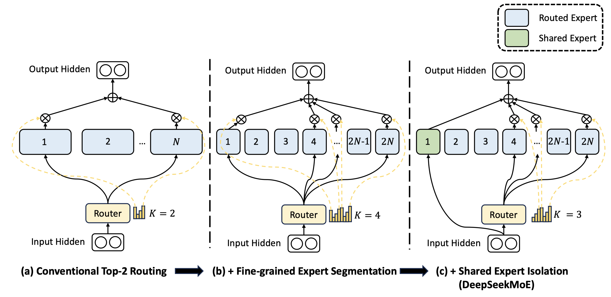 |  |  | [note](./notes/2024/DeepSeekMoE/note.md) |
| [NSA](./meta/2025/NSA.prototxt) | [Native Sparse Attention: Hardware-Aligned and Natively Trainable Sparse Attention](http://arxiv.org/abs/2502.11089v1) |  |  |  | [note](./notes/2025/NSA/note.md) |
| [DeepSeek-R1](./meta/2025/DeepSeek-R1.prototxt) | [DeepSeek-R1: Incentivizing Reasoning Capability in LLMs via Reinforcement Learning](http://arxiv.org/abs/2501.12948v1) |  |  |  | [note](./notes/2025/DeepSeek-R1/note.md) |

<b>DeepSpeed</b>
 

| Meta | Title | Cover | Publish | Code | Note |
|:-----|:------|:------|:--------|:-----|:-----|
| [Domino](./meta/2024/Domino.prototxt) | [Domino: Eliminating Communication in LLM Training via Generic Tensor Slicing and Overlapping](http://arxiv.org/abs/2409.15241v1) | 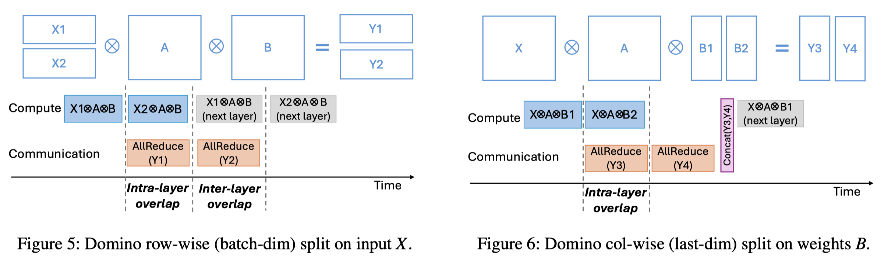 |  |  | [note](./notes/2024/Domino/note.md) |

<b>Delft University of Technology</b>
 

| Meta | Title | Cover | Publish | Code | Note |
|:-----|:------|:------|:--------|:-----|:-----|
| [DeltaLLM](./meta/2025/DeltaLLM.prototxt) | [DeltaLLM: A Training-Free Framework Exploiting Temporal Sparsity for Efficient Edge LLM Inference](http://arxiv.org/abs/2507.19608v1) |  |  |  | [note](./notes/2025/DeltaLLM/note.md) |

<b>Duke University</b>
 

| Meta | Title | Cover | Publish | Code | Note |
|:-----|:------|:------|:--------|:-----|:-----|
| [CoreInfer](./meta/2024/CoreInfer.prototxt) | [CoreInfer: Accelerating Large Language Model Inference with Semantics-Inspired Adaptive Sparse Activation](http://arxiv.org/abs/2410.18311v1) |  |  |  | [note](./notes/2024/CoreInfer/note.md) |

<b>ETH Zurich</b>
 

| Meta | Title | Cover | Publish | Code | Note |
|:-----|:------|:------|:--------|:-----|:-----|
| [VENOM](./meta/2023/VENOM.prototxt) | [VENOM: A Vectorized N:M Format for Unleashing the Power of Sparse Tensor Cores](http://arxiv.org/abs/2310.02065v1) | 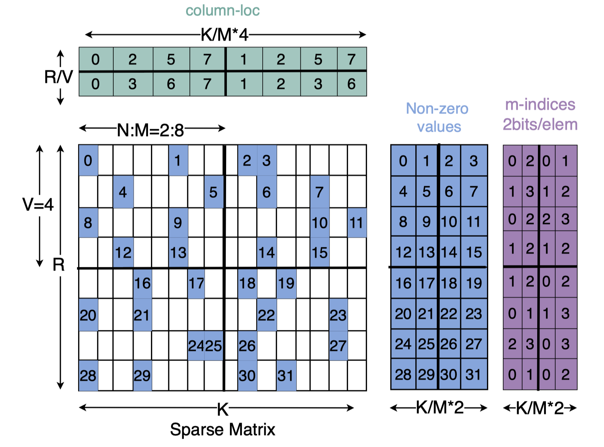 |  |  | [note](./notes/2023/VENOM/note.md) |
| [SliceGPT](./meta/2024/SliceGPT.prototxt) | [SliceGPT: Compress Large Language Models by Deleting Rows and Columns](http://arxiv.org/abs/2401.15024v2) |  |  |  | [note](./notes/2024/SliceGPT/note.md) |

<b>Eindhoven University of Technology</b>
 

| Meta | Title | Cover | Publish | Code | Note |
|:-----|:------|:------|:--------|:-----|:-----|
| [OWL](./meta/2024/owl.prototxt) | [Outlier Weighed Layerwise Sparsity (OWL): A Missing Secret Sauce for Pruning LLMs to High Sparsity](https://arxiv.org/pdf/2310.05175.pdf) |  |  |  |  |

<b>Emory University</b>
 

| Meta | Title | Cover | Publish | Code | Note |
|:-----|:------|:------|:--------|:-----|:-----|
| [SparseLLM](./meta/2024/SparseLLM.prototxt) | [SparseLLM: Towards Global Pruning for Pre-trained Language Models](http://arxiv.org/abs/2402.17946v3) |  |  |  | [note](./notes/2024/SparseLLM/note.md) |

<b>FAIR</b>
 

| Meta | Title | Cover | Publish | Code | Note |
|:-----|:------|:------|:--------|:-----|:-----|
| [TOVA](./meta/2024/TOVA.prototxt) | [Transformers are Multi-State RNNs](http://arxiv.org/abs/2401.06104v2) |  |  |  | [note](./notes/2024/TOVA/note.md) |

<b>Fairleigh Dickinson University</b>
 

| Meta | Title | Cover | Publish | Code | Note |
|:-----|:------|:------|:--------|:-----|:-----|
| [MIRAGE](./meta/2025/MIRAGE.prototxt) | [MIRAGE: KV Cache Optimization through Parameter Remapping for Multi-tenant LLM Serving](http://arxiv.org/abs/2507.11507v1) |  |  |  | [note](./notes/2025/MIRAGE/note.md) |

<b>Fudan University</b>
 

| Meta | Title | Cover | Publish | Code | Note |
|:-----|:------|:------|:--------|:-----|:-----|
| [MFA](./meta/2024/MFA.prototxt) | [Multi-matrix Factorization Attention](http://arxiv.org/abs/2412.19255v2) |  |  |  | [note](./notes/2024/MFA/note.md) |
| [ReAttention](./meta/2025/ReAttention.prototxt) | [ReAttention: Training-Free Infinite Context with Finite Attention Scope](http://arxiv.org/abs/2407.15176v3) |  |  |  | [note](./notes/2025/ReAttention/note.md) |
| [CateKV](./meta/2025/CateKV.prototxt) | [CateKV: On Sequential Consistency for Long-Context LLM Inference Acceleration](https://openreview.net/forum?id=u7dlwgKstN) |  |  |  | [note](./notes/2025/CateKV/note.md) |
| [PowerAttention](./meta/2025/PowerAttention.prototxt) | [PowerAttention: Exponentially Scaling of Receptive Fields for Effective Sparse Attention](http://arxiv.org/abs/2503.03588v1) |  |  |  | [note](./notes/2025/PowerAttention/note.md) |

<b>Gaoling School of Artificial Intelligence, Renmin University of China</b>
 

| Meta | Title | Cover | Publish | Code | Note |
|:-----|:------|:------|:--------|:-----|:-----|
| [m](./meta/2023/L5D7520E.prototxt) | [A Survey on Model Compression for Large Language Models](https://arxiv.org/abs/2308.07633) |  |  |  |  |

<b>Georgia Institute of Technology</b>
 

| Meta | Title | Cover | Publish | Code | Note |
|:-----|:------|:------|:--------|:-----|:-----|
| [AdaLoRA](./meta/2023/adalora.prototxt) | [AdaLoRA: Adaptive Budget Allocation for Parameter-Efficient Fine-Tuning](https://arxiv.org/pdf/2303.10512.pdf) |  |  |  |  |
| [LoftQ](./meta/2023/loftq.prototxt) | [LoftQ: LoRA-Fine-Tuning-Aware Quantization for Large Language Models](https://arxiv.org/abs/2310.08659) |  |  |  | [note](./notes/2023/loftq/note.md) |
| [1DZIJVBI](./meta/2025/1DZIJVBI.prototxt) | [Characterizing Compute-Communication Overlap in GPU-Accelerated Distributed Deep Learning: Performance and Power Implications](http://arxiv.org/abs/2507.03114v1) | 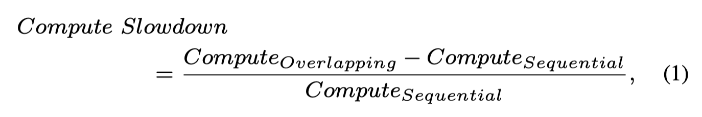 |  |  | [note](./notes/2025/1DZIJVBI/note.md) |

<b>Google</b>
 

| Meta | Title | Cover | Publish | Code | Note |
|:-----|:------|:------|:--------|:-----|:-----|
| [m](./meta/2020/2AL79IUH.prototxt) | [Fast Sparse ConvNets](https://openaccess.thecvf.com/content_CVPR_2020/papers/Elsen_Fast_Sparse_ConvNets_CVPR_2020_paper.pdf) |  |  |  |  |
| [Sprint](./meta/2022/Sprint.prototxt) | [Sparse Attention Acceleration with Synergistic In-Memory Pruning and On-Chip Recomputation](https://arxiv.org/abs/2209.00606) |  |  |  |  |
| [Dist-Einsum](./meta/2023/Dist-Einsum.prototxt) | [Overlap Communication with Dependent Computation via Decomposition in Large Deep Learning Models](https://dl.acm.org/doi/abs/10.1145/3567955.3567959) |  |  |  | [note](./notes/2023/Dist-Einsum/note.md) |
| [m](./meta/2023/WMMGA0AR.prototxt) | [The Lazy Neuron Phenomenon: On Emergence of Activation Sparsity in Transformers](https://openreview.net/forum?id=TJ2nxciYCk-) |  |  |  |  |
| [KCM](./meta/2023/kcm.prototxt) | [Gradient-Free Structured Pruning with Unlabeled Data](https://arxiv.org/abs/2303.04185) |  |  |  |  |
| [ShadowLLM](./meta/2024/ShadowLLM.prototxt) | [ShadowLLM: Predictor-based Contextual Sparsity for Large Language Models](http://arxiv.org/abs/2406.16635v1) |  |  |  | [note](./notes/2024/ShadowLLM/note.md) |

<b>Google Cloud</b>
 

| Meta | Title | Cover | Publish | Code | Note |
|:-----|:------|:------|:--------|:-----|:-----|
| [MoR](./meta/2025/MoR.prototxt) | [Mixture-of-Recursions: Learning Dynamic Recursive Depths for Adaptive Token-Level Computation](http://arxiv.org/abs/2507.10524v1) |  |  |  | [note](./notes/2025/MoR/note.md) |

<b>Google DeepMind</b>
 

| Meta | Title | Cover | Publish | Code | Note |
|:-----|:------|:------|:--------|:-----|:-----|
| [MoD](./meta/2024/MoD.prototxt) | [Mixture-of-Depths: Dynamically allocating compute in transformer-based language models](http://arxiv.org/abs/2404.02258v1) |  |  |  | [note](./notes/2024/MoD/note.md) |
| [RecursiveTransformers](./meta/2025/RecursiveTransformers.prototxt) | [Relaxed Recursive Transformers: Effective Parameter Sharing with Layer-wise LoRA](http://arxiv.org/abs/2410.20672v3) | 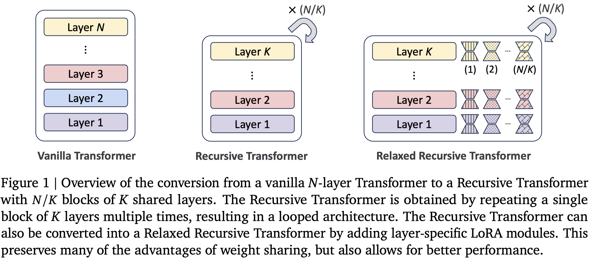 |  |  | [note](./notes/2025/RecursiveTransformers/note.md) |
| [MoR](./meta/2025/MoR.prototxt) | [Mixture-of-Recursions: Learning Dynamic Recursive Depths for Adaptive Token-Level Computation](http://arxiv.org/abs/2507.10524v1) |  |  |  | [note](./notes/2025/MoR/note.md) |

<b>Google Research</b>
 

| Meta | Title | Cover | Publish | Code | Note |
|:-----|:------|:------|:--------|:-----|:-----|
| [FrameQuant](./meta/2024/FrameQuant.prototxt) | [FrameQuant: Flexible Low-Bit Quantization for Transformers](http://arxiv.org/abs/2403.06082v1) |  |  |  | [note](./notes/2024/FrameQuant/note.md) |
| [OSSCAR](./meta/2024/OSSCAR.prototxt) | [OSSCAR: One-Shot Structured Pruning in Vision and Language Models with Combinatorial Optimization](http://arxiv.org/abs/2403.12983v1) |  |  |  | [note](./notes/2024/OSSCAR/note.md) |
| [OWL](./meta/2024/owl.prototxt) | [Outlier Weighed Layerwise Sparsity (OWL): A Missing Secret Sauce for Pruning LLMs to High Sparsity](https://arxiv.org/pdf/2310.05175.pdf) |  |  |  |  |
| [Bonsa](./meta/2024/Bonsa.prototxt) | [Everybody Prune Now: Structured Pruning of LLMs with only Forward Passes](https://arxiv.org/abs/2402.05406) |  |  |  |  |
| [RecursiveTransformers](./meta/2025/RecursiveTransformers.prototxt) | [Relaxed Recursive Transformers: Effective Parameter Sharing with Layer-wise LoRA](http://arxiv.org/abs/2410.20672v3) |  |  |  | [note](./notes/2025/RecursiveTransformers/note.md) |
| [MoR](./meta/2025/MoR.prototxt) | [Mixture-of-Recursions: Learning Dynamic Recursive Depths for Adaptive Token-Level Computation](http://arxiv.org/abs/2507.10524v1) |  |  |  | [note](./notes/2025/MoR/note.md) |

<b>Graphcore Research</b>
 

| Meta | Title | Cover | Publish | Code | Note |
|:-----|:------|:------|:--------|:-----|:-----|
| [SparQ](./meta/2024/SparQ.prototxt) | [SparQ Attention: Bandwidth-Efficient LLM Inference](http://arxiv.org/abs/2312.04985v5) |  |  |  | [note](./notes/2024/SparQ/note.md) |

<b>HKUST</b>
 

| Meta | Title | Cover | Publish | Code | Note |
|:-----|:------|:------|:--------|:-----|:-----|
| [Awesome-Efficient-Arch](./meta/2025/Awesome-Efficient-Arch.prototxt) | [Speed Always Wins: A Survey on Efficient Architectures for Large Language Models](http://arxiv.org/abs/2508.09834v1) | 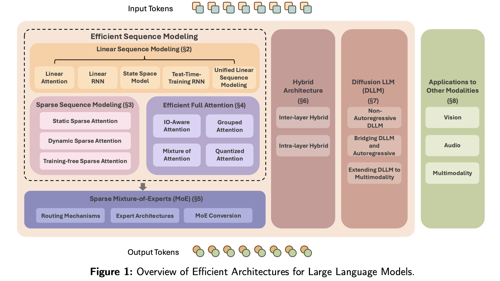 |  |  | [note](./notes/2025/Awesome-Efficient-Arch/note.md) |

<b>Habana Labs</b>
 

| Meta | Title | Cover | Publish | Code | Note |
|:-----|:------|:------|:--------|:-----|:-----|
| [MVUE](./meta/2023/MVUE.prototxt) | [Minimum Variance Unbiased N:M Sparsity for the Neural Gradients](https://openreview.net/pdf?id=vuD2xEtxZcj) |  |  |  |  |

<b>Harbin Institute of Technology</b>
 

| Meta | Title | Cover | Publish | Code | Note |
|:-----|:------|:------|:--------|:-----|:-----|
| [TextPruner](./meta/2022/TextPruner.prototxt) | [TextPruner: A Model Pruning Toolkit for Pre-Trained Language Models](https://arxiv.org/abs/2203.15996) |  |  |  |  |
| [GRAIN](./meta/2023/grain.prototxt) | [Gradient-based Intra-attention Pruning on Pre-trained Language Models](https://arxiv.org/abs/2212.07634) |  |  |  | [note](./notes/2023/grain/index.md) |
| [ZigZagKV](./meta/2024/ZigZagKV.prototxt) | [ZigZagkv: Dynamic KV Cache Compression for Long-context Modeling based on Layer Uncertainty](http://arxiv.org/abs/2412.09036v1) |  |  |  | [note](./notes/2024/ZigZagKV/note.md) |

<b>Harvard University</b>
 

| Meta | Title | Cover | Publish | Code | Note |
|:-----|:------|:------|:--------|:-----|:-----|
| [SMAT](./meta/2024/SMAT.prototxt) | [Unleashing the Power of Meta-tuning for Few-shot Generalization Through Sparse Interpolated Experts](http://arxiv.org/abs/2403.08477v3) |  |  |  | [note](./notes/2024/SMAT/note.md) |

<b>Heriot-Watt University</b>
 

| Meta | Title | Cover | Publish | Code | Note |
|:-----|:------|:------|:--------|:-----|:-----|
| [52A7RO95](./meta/2025/52A7RO95.prototxt) | [Mixture of Experts in Large Language Models](http://arxiv.org/abs/2507.11181v1) |  |  |  | [note](./notes/2025/52A7RO95/note.md) |

<b>Hong Kong University of Science and Technology</b>
 

| Meta | Title | Cover | Publish | Code | Note |
|:-----|:------|:------|:--------|:-----|:-----|
| [PWGG5HBE](./meta/2024/PWGG5HBE.prototxt) | [A Survey on Large Language Model Acceleration based on KV Cache Management](http://arxiv.org/abs/2412.19442v2) |  |  |  | [note](./notes/2024/PWGG5HBE/note.md) |
| [SlimInfer](./meta/2025/SlimInfer.prototxt) | [SlimInfer: Accelerating Long-Context LLM Inference via Dynamic Token Pruning](http://arxiv.org/abs/2508.06447v1) |  |  |  | [note](./notes/2025/SlimInfer/note.md) |

<b>Houmo AI</b>
 

| Meta | Title | Cover | Publish | Code | Note |
|:-----|:------|:------|:--------|:-----|:-----|
| [RPTQ](./meta/2023/RPTQ.prototxt) | [RPTQ: Reorder-based Post-training Quantization for Large Language Models](https://arxiv.org/pdf/2304.01089.pdf) |  |  |  | [note](note.md) |

<b>Huawei</b>
 

| Meta | Title | Cover | Publish | Code | Note |
|:-----|:------|:------|:--------|:-----|:-----|
| [CodeGeeX](./meta/2023/CodeGeeX.prototxt) | [CodeGeeX: A Pre-Trained Model for Code Generation with Multilingual Benchmarking on HumanEval-X](http://arxiv.org/abs/2303.17568v2) |  |  |  | [note](./notes/2023/CodeGeeX/note.md) |
| [QA-LoRA](./meta/2024/QA-LoRA.prototxt) | [QA-LoRA: Quantization-Aware Low-Rank Adaptation of Large Language Models](https://arxiv.org/abs/2309.14717) |  |  |  | [note](./notes/2024/QA-LoRA/note.md) |
| [AmberPruner](./meta/2025/AmberPruner.prototxt) | [Amber Pruner: Leveraging N:M Activation Sparsity for Efficient Prefill in Large Language Models](http://arxiv.org/abs/2508.02128v1) |  |  |  | [note](./notes/2025/AmberPruner/note.md) |
| [PanguUltra](./meta/2025/PanguUltra.prototxt) | [Pangu Ultra: Pushing the Limits of Dense Large Language Models on Ascend NPUs](http://arxiv.org/abs/2504.07866v2) |  |  |  | [note](./notes/2025/PanguUltra/note.md) |

<b>Huawei Cloud</b>
 

| Meta | Title | Cover | Publish | Code | Note |
|:-----|:------|:------|:--------|:-----|:-----|
| [CachedAttention](./meta/2024/CachedAttention.prototxt) | [Cost-Efficient Large Language Model Serving for Multi-turn Conversations with CachedAttention](http://arxiv.org/abs/2403.19708v3) | 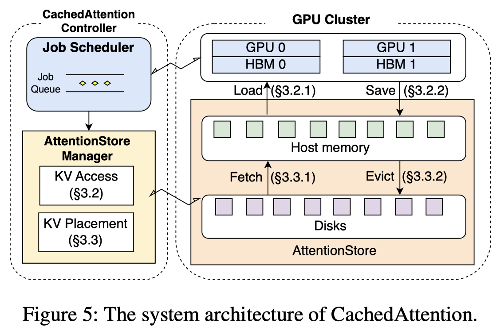 |  |  | [note](./notes/2024/CachedAttention/note.md) |
| [AdaSkip](./meta/2025/AdaSkip.prototxt) | [AdaSkip: Adaptive Sublayer Skipping for Accelerating Long-Context LLM Inference](http://arxiv.org/abs/2501.02336v1) |  |  |  | [note](./notes/2025/AdaSkip/note.md) |
| [RaaS](./meta/2025/RaaS.prototxt) | [Efficient Long-Decoding Inference with Reasoning-Aware Attention Sparsity](http://arxiv.org/abs/2502.11147v1) |  |  |  | [note](./notes/2025/RaaS/note.md) |
| [Adrenaline](./meta/2025/Adrenaline.prototxt) | [Injecting Adrenaline into LLM Serving: Boosting Resource Utilization and Throughput via Attention Disaggregation](http://arxiv.org/abs/2503.20552v1) |  |  |  | [note](./notes/2025/Adrenaline/note.md) |
| [PSA](./meta/2025/PSA.prototxt) | [Progressive Sparse Attention: Algorithm and System Co-design for Efficient Attention in LLM Serving](http://arxiv.org/abs/2503.00392v1) |  |  |  | [note](./notes/2025/PSA/note.md) |

<b>Huawei Noah's Ark Lab</b>
 

| Meta | Title | Cover | Publish | Code | Note |
|:-----|:------|:------|:--------|:-----|:-----|
| [SIMPLE](./meta/2023/simple.prototxt) | [Structured Pruning for Efficient Generative Pre-trained Language Models](https://aclanthology.org/2023.findings-acl.692.pdf) |  |  |  | [note](./notes/2023/simple/index.md) |
| [RIA](./meta/2024/IA8CS3VH.prototxt) | [Plug-and-Play: An Efficient Post-training Pruning Method for Large Language Models](https://openreview.net/forum?id=Tr0lPx9woF) |  |  |  |  |
| [m](./meta/2024/0Y41U1N2.prototxt) | [Beyond 2:4: exploring V:N:M sparsity for efficient transformer inference on GPUs](http://arxiv.org/abs/2410.16135v1) |  |  |  | [note](./notes/2024/0Y41U1N2/note.md) |
| [ReAttention](./meta/2025/ReAttention.prototxt) | [ReAttention: Training-Free Infinite Context with Finite Attention Scope](http://arxiv.org/abs/2407.15176v3) |  |  |  | [note](./notes/2025/ReAttention/note.md) |
| [SlimLLM](./meta/2025/SlimLLM.prototxt) | [SlimLLM: Accurate Structured Pruning for Large Language Models](http://arxiv.org/abs/2505.22689v1) |  |  |  | [note](./notes/2025/SlimLLM/note.md) |
| [LinearPatch](./meta/2025/LinearPatch.prototxt) | [A Simple Linear Patch Revives Layer-Pruned Large Language Models](http://arxiv.org/abs/2505.24680v1) |  |  |  | [note](./notes/2025/LinearPatch/note.md) |
| [FreqKV](./meta/2025/FreqKV.prototxt) | [FreqKV: Frequency Domain Key-Value Compression for Efficient Context Window Extension](http://arxiv.org/abs/2505.00570v2) |  |  |  | [note](./notes/2025/FreqKV/note.md) |

<b>Huawei Technologies</b>
 

| Meta | Title | Cover | Publish | Code | Note |
|:-----|:------|:------|:--------|:-----|:-----|
| [DSnoT](./meta/2024/DSnoT.prototxt) | [Dynamic Sparse No Training: Training-Free Fine-tuning for Sparse LLMs](http://arxiv.org/abs/2310.08915v3) |  |  |  | [note](./notes/2024/DSnoT/note.md) |
| [HATA](./meta/2025/HATA.prototxt) | [HATA: Trainable and Hardware-Efficient Hash-Aware Top-k Attention for Scalable Large Model Inference](http://arxiv.org/abs/2506.02572v1) | 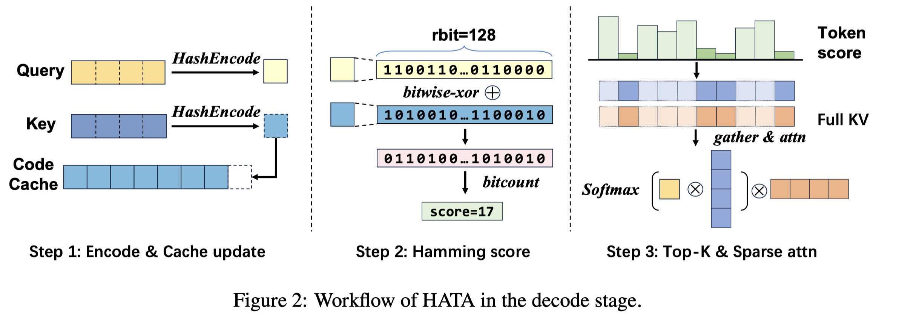 |  |  | [note](./notes/2025/HATA/note.md) |

<b>Huazhong University of Science and Technology</b>
 

| Meta | Title | Cover | Publish | Code | Note |
|:-----|:------|:------|:--------|:-----|:-----|
| [PWGG5HBE](./meta/2024/PWGG5HBE.prototxt) | [A Survey on Large Language Model Acceleration based on KV Cache Management](http://arxiv.org/abs/2412.19442v2) |  |  |  | [note](./notes/2024/PWGG5HBE/note.md) |
| [SeerAttention-R](./meta/2025/SeerAttention-R.prototxt) | [SeerAttention-R: Sparse Attention Adaptation for Long Reasoning](http://arxiv.org/abs/2506.08889v1) |  |  |  | [note](./notes/2025/SeerAttention-R/note.md) |

<b>Hugging Face</b>
 

| Meta | Title | Cover | Publish | Code | Note |
|:-----|:------|:------|:--------|:-----|:-----|
| [Movement Pruning](./meta/2020/movement_pruning.prototxt) | [Movement Pruning: Adaptive Sparsity by Fine-Tuning](https://arxiv.org/abs/2005.07683) |  |  |  |  |

<b>IST</b>
 

| Meta | Title | Cover | Publish | Code | Note |
|:-----|:------|:------|:--------|:-----|:-----|
| [m](./meta/2023/68I8KKBV.prototxt) | [Efficient Methods for Natural Language Processing: A Survey](https://arxiv.org/abs/2209.00099) |  |  |  |  |

<b>IST Austria</b>
 

| Meta | Title | Cover | Publish | Code | Note |
|:-----|:------|:------|:--------|:-----|:-----|
| [m](./meta/2020/V3MFIRLV.prototxt) | [Inducing and Exploiting Activation Sparsity for Fast Neural Network Inference](http://proceedings.mlr.press/v119/kurtz20a/kurtz20a.pdf) |  |  |  |  |
| [m](./meta/2021/ITZS3TU3.prototxt) | [Sparsity in Deep Learning: Pruning and growth for efficient inference and training in neural networks](https://arxiv.org/abs/2102.00554) |  |  |  |  |
| [SPDY](./meta/2022/spdy.prototxt) | [SPDY: Accurate Pruning with Speedup Guarantees](https://arxiv.org/abs/2201.13096) |  |  |  | [note](./notes/2022/spdy/index.md) |
| [OBC](./meta/2022/obc.prototxt) | [Optimal Brain Compression: A Framework for Accurate Post-Training Quantization and Pruning](https://openreview.net/pdf?id=ksVGCOlOEba) |  |  |  |  |
| [oBERT](./meta/2022/oBERT.prototxt) | [The Optimal BERT Surgeon: Scalable and Accurate Second-Order Pruning for Large Language Models](https://arxiv.org/pdf/2203.07259.pdf) |  |  |  |  |
| [GPTQ](./meta/2023/gptq.prototxt) | [GPTQ: Accurate Post-Training Quantization for Generative Pre-trained Transformers](https://arxiv.org/pdf/2210.17323.pdf) |  |  |  |  |
| [SparseGPT](./meta/2023/sparsegpt.prototxt) | [SparseGPT: Massive Language Models Can be Accurately Pruned in one-shot.](https://arxiv.org/pdf/2301.00774.pdf) |  |  |  |  |
| [ZipLM](./meta/2023/ZipLM.prototxt) | [ZipLM: Inference-Aware Structured Pruning of Language Models](https://openreview.net/pdf?id=bPFFPueAxm) |  |  |  |  |
| [SpQR](./meta/2023/spqr.prototxt) | [SpQR: A Sparse-Quantized Representation for Near-Lossless LLM Weight Compression](https://arxiv.org/pdf/2306.03078.pdf) |  |  |  |  |
| [SquareHead](./meta/2023/SquareHead.prototxt) | [Sparse Fine-tuning for Inference Acceleration of Large Language Models](https://arxiv.org/pdf/2310.06927.pdf) |  |  |  |  |
| [m](./meta/2024/ULY1AZGY.prototxt) | [Enabling High-Sparsity Foundational Llama Models with Efficient Pretraining and Deployment](http://arxiv.org/abs/2405.03594v1) |  |  |  | [note](./notes/2024/ULY1AZGY/note.md) |

<b>Imperial College London</b>
 

| Meta | Title | Cover | Publish | Code | Note |
|:-----|:------|:------|:--------|:-----|:-----|
| [52A7RO95](./meta/2025/52A7RO95.prototxt) | [Mixture of Experts in Large Language Models](http://arxiv.org/abs/2507.11181v1) |  |  |  | [note](./notes/2025/52A7RO95/note.md) |

<b>Indian Institute of Science</b>
 

| Meta | Title | Cover | Publish | Code | Note |
|:-----|:------|:------|:--------|:-----|:-----|
| [vAttention](./meta/2025/vAttention.prototxt) | [vAttention: Dynamic Memory Management for Serving LLMs without PagedAttention](http://arxiv.org/abs/2405.04437v3) |  |  |  | [note](./notes/2025/vAttention/note.md) |

<b>Infinigence-AI</b>
 

| Meta | Title | Cover | Publish | Code | Note |
|:-----|:------|:------|:--------|:-----|:-----|
| [MoA](./meta/2024/MoA.prototxt) | [MoA: Mixture of Sparse Attention for Automatic Large Language Model Compression](http://arxiv.org/abs/2406.14909v2) |  |  |  | [note](./notes/2024/MoA/note.md) |
| [SpecEE](./meta/2025/SpecEE.prototxt) | [SpecEE: Accelerating Large Language Model Inference with Speculative Early Exiting](http://arxiv.org/abs/2504.08850v1) |  |  |  | [note](./notes/2025/SpecEE/note.md) |
| [FlashOverlap](./meta/2026/FlashOverlap.prototxt) | [FlashOverlap: A Lightweight Design for Efficiently Overlapping Communication and Computation](http://arxiv.org/abs/2504.19519v1) |  |  |  | [note](./notes/2026/FlashOverlap/note.md) |

<b>Institute for Advanced Algorithms Research</b>
 

| Meta | Title | Cover | Publish | Code | Note |
|:-----|:------|:------|:--------|:-----|:-----|
| [SEAP](./meta/2025/SEAP.prototxt) | [SEAP: Training-free Sparse Expert Activation Pruning Unlock the Brainpower of Large Language Models](http://arxiv.org/abs/2503.07605v1) |  |  |  | [note](./notes/2025/SEAP/note.md) |

<b>Institute of Automation, Chinese Academy of Sciences</b>
 

| Meta | Title | Cover | Publish | Code | Note |
|:-----|:------|:------|:--------|:-----|:-----|
| [FLAP](./meta/2024/flap.prototxt) | [Fluctuation-based Adaptive Structured Pruning for Large Language Models](https://arxiv.org/abs/2312.11983) |  |  |  |  |
| [RIA](./meta/2024/IA8CS3VH.prototxt) | [Plug-and-Play: An Efficient Post-training Pruning Method for Large Language Models](https://openreview.net/forum?id=Tr0lPx9woF) |  |  |  |  |
| [Awesome-Efficient-Arch](./meta/2025/Awesome-Efficient-Arch.prototxt) | [Speed Always Wins: A Survey on Efficient Architectures for Large Language Models](http://arxiv.org/abs/2508.09834v1) |  |  |  | [note](./notes/2025/Awesome-Efficient-Arch/note.md) |

<b>Institute of Computing Technology</b>
 

| Meta | Title | Cover | Publish | Code | Note |
|:-----|:------|:------|:--------|:-----|:-----|
| [COMET](./meta/2025/COMET.prototxt) | [COMET: Towards Partical W4A4KV4 LLMs Serving](http://arxiv.org/abs/2410.12168v1) |  |  |  | [note](./notes/2025/COMET/note.md) |
| [BaWA](./meta/2025/BaWA.prototxt) | [BaWA: Automatic Optimizing Pruning Metric for Large Language Models with Balanced Weight and Activation](https://openreview.net/forum?id=YrCvW1Hx7g) |  |  |  | [note](./notes/2025/BaWA/note.md) |

<b>Institute of Computing Technology, Chinese Academy of Sciences</b>
 

| Meta | Title | Cover | Publish | Code | Note |
|:-----|:------|:------|:--------|:-----|:-----|
| [ProSparse](./meta/2024/ProSparse.prototxt) | [ProSparse: Introducing and Enhancing Intrinsic Activation Sparsity within Large Language Models](https://arxiv.org/abs/2402.13516) |  |  |  | [note](./notes/2024/ProSparse/note.md) |

<b>Institute of Information Engineering, Chinese Academy of Sciences</b>
 

| Meta | Title | Cover | Publish | Code | Note |
|:-----|:------|:------|:--------|:-----|:-----|
| [m](./meta/2023/L5D7520E.prototxt) | [A Survey on Model Compression for Large Language Models](https://arxiv.org/abs/2308.07633) |  |  |  |  |

<b>Intel</b>
 

| Meta | Title | Cover | Publish | Code | Note |
|:-----|:------|:------|:--------|:-----|:-----|
| [SCAP](./meta/2024/SCAP.prototxt) | [Post-Training Statistical Calibration for Higher Activation Sparsity](http://arxiv.org/abs/2412.07174v1) |  |  |  | [note](./notes/2024/SCAP/note.md) |

<b>Intel Corporation</b>
 

| Meta | Title | Cover | Publish | Code | Note |
|:-----|:------|:------|:--------|:-----|:-----|
| [OpenVINO](./meta/2021/OpenVINO.prototxt) | [Post-training deep neural network pruning via layer-wise calibration](https://openaccess.thecvf.com/content/ICCV2021W/LPCV/papers/Lazarevich_Post-Training_Deep_Neural_Network_Pruning_via_Layer-Wise_Calibration_ICCVW_2021_paper.pdf) |  |  |  |  |

<b>Intellifusion Inc.</b>
 

| Meta | Title | Cover | Publish | Code | Note |
|:-----|:------|:------|:--------|:-----|:-----|
| [HCAttention](./meta/2025/HCAttention.prototxt) | [HCAttention: Extreme KV Cache Compression via Heterogeneous Attention Computing for LLMs](http://arxiv.org/abs/2507.19823v1) |  |  |  | [note](./notes/2025/HCAttention/note.md) |

<b>KAIST</b>
 

| Meta | Title | Cover | Publish | Code | Note |
|:-----|:------|:------|:--------|:-----|:-----|
| [UC0D8DJ6](./meta/2025/UC0D8DJ6.prototxt) | [Characterizing Communication Patterns in Distributed Large Language Model Inference](http://arxiv.org/abs/2507.14392v1) |  |  |  | [note](./notes/2025/UC0D8DJ6/note.md) |
| [1DZIJVBI](./meta/2025/1DZIJVBI.prototxt) | [Characterizing Compute-Communication Overlap in GPU-Accelerated Distributed Deep Learning: Performance and Power Implications](http://arxiv.org/abs/2507.03114v1) |  |  |  | [note](./notes/2025/1DZIJVBI/note.md) |
| [DeltaAttention](./meta/2025/DeltaAttention.prototxt) | [Delta Attention: Fast and Accurate Sparse Attention Inference by Delta Correction](http://arxiv.org/abs/2505.11254v1) |  |  |  | [note](./notes/2025/DeltaAttention/note.md) |

<b>KAIST AI</b>
 

| Meta | Title | Cover | Publish | Code | Note |
|:-----|:------|:------|:--------|:-----|:-----|
| [RecursiveTransformers](./meta/2025/RecursiveTransformers.prototxt) | [Relaxed Recursive Transformers: Effective Parameter Sharing with Layer-wise LoRA](http://arxiv.org/abs/2410.20672v3) |  |  |  | [note](./notes/2025/RecursiveTransformers/note.md) |
| [MoR](./meta/2025/MoR.prototxt) | [Mixture-of-Recursions: Learning Dynamic Recursive Depths for Adaptive Token-Level Computation](http://arxiv.org/abs/2507.10524v1) |  |  |  | [note](./notes/2025/MoR/note.md) |

<b>KAUST</b>
 

| Meta | Title | Cover | Publish | Code | Note |
|:-----|:------|:------|:--------|:-----|:-----|
| [DistGEMM](./meta/2024/DistGEMM.prototxt) | [A novel CUTLASS-based implementation of Tensor Parallelism for NVLink-enabled systems](https://blog.shi-labs.com/distributed-gemm-88be6a481e2b) | 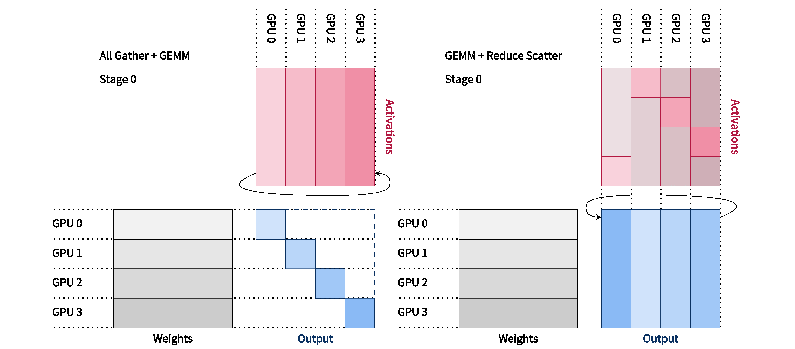 |  |  | [note](./notes/2024/DistGEMM/note.md) |
| [MoSA](./meta/2025/MoSA.prototxt) | [Mixture of Sparse Attention: Content-Based Learnable Sparse Attention via Expert-Choice Routing](http://arxiv.org/abs/2505.00315v1) |  |  |  | [note](./notes/2025/MoSA/note.md) |

<b>KTH Royal Institute of Technology</b>
 

| Meta | Title | Cover | Publish | Code | Note |
|:-----|:------|:------|:--------|:-----|:-----|
| [Awesome-Efficient-Arch](./meta/2025/Awesome-Efficient-Arch.prototxt) | [Speed Always Wins: A Survey on Efficient Architectures for Large Language Models](http://arxiv.org/abs/2508.09834v1) |  |  |  | [note](./notes/2025/Awesome-Efficient-Arch/note.md) |

<b>Key Laboratory of Multimedia Trusted Perception and Efficient Computing</b>
 

| Meta | Title | Cover | Publish | Code | Note |
|:-----|:------|:------|:--------|:-----|:-----|
| [DSnoT](./meta/2024/DSnoT.prototxt) | [Dynamic Sparse No Training: Training-Free Fine-tuning for Sparse LLMs](http://arxiv.org/abs/2310.08915v3) |  |  |  | [note](./notes/2024/DSnoT/note.md) |

<b>Kyushu University</b>
 

| Meta | Title | Cover | Publish | Code | Note |
|:-----|:------|:------|:--------|:-----|:-----|
| [SharedAttention](./meta/2024/SharedAttention.prototxt) | [Beyond KV Caching: Shared Attention for Efficient LLMs](http://arxiv.org/abs/2407.12866v1) | 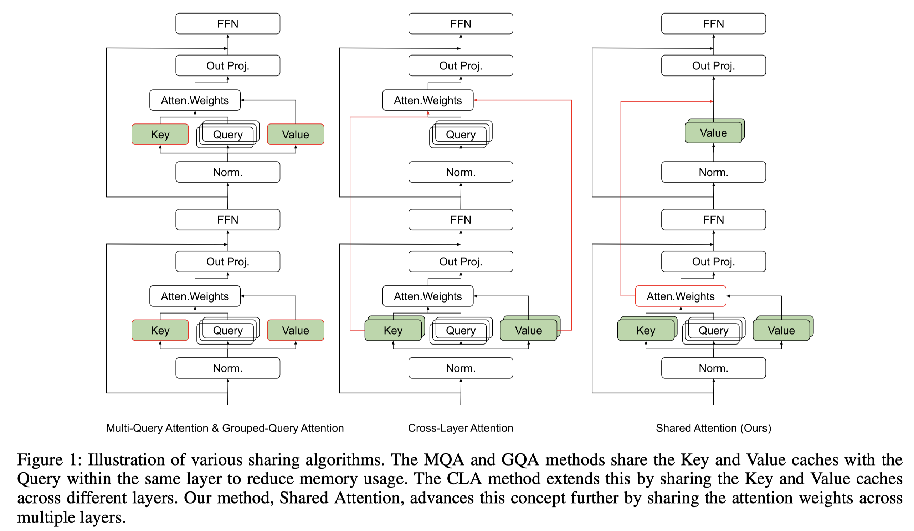 |  |  | [note](./notes/2024/SharedAttention/note.md) |

<b>Lanzhou University</b>
 

| Meta | Title | Cover | Publish | Code | Note |
|:-----|:------|:------|:--------|:-----|:-----|
| [AVSS](./meta/2024/AVSS.prototxt) | [AVSS: Layer Importance Evaluation in Large Language Models via Activation Variance-Sparsity Analysis](http://arxiv.org/abs/2411.02117v1) |  |  |  | [note](./notes/2024/AVSS/note.md) |

<b>Leiden University</b>
 

| Meta | Title | Cover | Publish | Code | Note |
|:-----|:------|:------|:--------|:-----|:-----|
| [DeltaLLM](./meta/2025/DeltaLLM.prototxt) | [DeltaLLM: A Training-Free Framework Exploiting Temporal Sparsity for Efficient Edge LLM Inference](http://arxiv.org/abs/2507.19608v1) |  |  |  | [note](./notes/2025/DeltaLLM/note.md) |

<b>MBZUAI</b>
 

| Meta | Title | Cover | Publish | Code | Note |
|:-----|:------|:------|:--------|:-----|:-----|
| [CHESS](./meta/2024/CHESS.prototxt) | [Optimizing LLM Inference via Channel-Wise Thresholding and Selective Sparsification](http://arxiv.org/abs/2409.01366v1) |  |  | [Pytorch](https://anonymous.4open.science/r/CHESS-BA40/README.md) | [note](./notes/2024/CHESS/note.md) |

<b>MIT</b>
 

| Meta | Title | Cover | Publish | Code | Note |
|:-----|:------|:------|:--------|:-----|:-----|
| [SparseViT](./meta/2023/SparseViT.prototxt) | [SparseViT: Revisiting Activation Sparsity for Efficient High-Resolution Vision Transformer](https://arxiv.org/abs/2303.17605) |  |  |  | [note](./notes/2023/sparsevit/index.md) |
| [TorchSparse++](./meta/2023/TorchSparse.prototxt) | [TorchSparse++: Efficient Point Cloud Engine](https://openaccess.thecvf.com/content/CVPR2023W/WAD/papers/Tang_TorchSparse_Efficient_Point_Cloud_Engine_CVPRW_2023_paper.pdf) |  |  |  |  |
| [Quest](./meta/2024/Quest.prototxt) | [Quest: Query-Aware Sparsity for Efficient Long-Context LLM Inference](http://arxiv.org/abs/2406.10774) |  |  |  | [note](./notes/2024/Quest/note.md) |
| [AWQ](./meta/2024/awq.prototxt) | [AWQ: Activation-aware Weight Quantization for LLM Compression and Acceleration](https://arxiv.org/abs/2306.00978) |  |  |  |  |
| [DuoAttention](./meta/2024/DuoAttention.prototxt) | [DuoAttention: Efficient Long-Context LLM Inference with Retrieval and Streaming Heads](http://arxiv.org/abs/2410.10819v1) |  |  |  | [note](./notes/2024/DuoAttention/note.md) |
| [QServe](./meta/2024/QServer.prototxt) | [QServe: W4A8KV4 Quantization and System Co-design for Efficient LLM Serving](http://arxiv.org/abs/2405.04532v2) |  |  | [Pytorch](https://hanlab.mit.edu/projects/qserve) | [note](./notes/2024/QServer/note.md) |
| [CLA](./meta/2024/CLA.prototxt) | [Reducing Transformer Key-Value Cache Size with Cross-Layer Attention](http://arxiv.org/abs/2405.12981v1) | 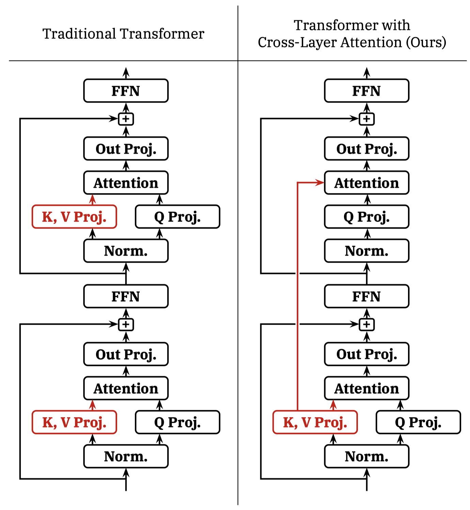 |  |  | [note](./notes/2024/CLA/note.md) |
| [LServer](./meta/2025/LServer.prototxt) | [LServe: Efficient Long-sequence LLM Serving with Unified Sparse Attention](http://arxiv.org/abs/2502.14866v1) |  |  |  | [note](./notes/2025/LServer/note.md) |

<b>MIT-IBM Watson AI Lab</b>
 

| Meta | Title | Cover | Publish | Code | Note |
|:-----|:------|:------|:--------|:-----|:-----|
| [CLA](./meta/2024/CLA.prototxt) | [Reducing Transformer Key-Value Cache Size with Cross-Layer Attention](http://arxiv.org/abs/2405.12981v1) |  |  |  | [note](./notes/2024/CLA/note.md) |

<b>MakerMaker AI</b>
 

| Meta | Title | Cover | Publish | Code | Note |
|:-----|:------|:------|:--------|:-----|:-----|
| [FoX](./meta/2025/FoX.prototxt) | [Forgetting Transformer: Softmax Attention with a Forget Gate](http://arxiv.org/abs/2503.02130v2) |  |  |  | [note](./notes/2025/FoX/note.md) |
| [ACP](./meta/2025/ACP.prototxt) | [Adaptive Computation Pruning for the Forgetting Transformer](http://arxiv.org/abs/2504.06949v1) |  |  |  | [note](./notes/2025/ACP/note.md) |

<b>Massachusetts Institute of Technology</b>
 

| Meta | Title | Cover | Publish | Code | Note |
|:-----|:------|:------|:--------|:-----|:-----|
| [streaming-llm](./meta/2024/streaming-llm.prototxt) | [Efficient Streaming Language Models with Attention Sinks](http://arxiv.org/abs/2309.17453v4) |  |  |  | [note](./notes/2024/streaming-llm/note.md) |
| [OSSCAR](./meta/2024/OSSCAR.prototxt) | [OSSCAR: One-Shot Structured Pruning in Vision and Language Models with Combinatorial Optimization](http://arxiv.org/abs/2403.12983v1) |  |  |  | [note](./notes/2024/OSSCAR/note.md) |
| [TEAL](./meta/2025/TEAL.prototxt) | [Training-Free Activation Sparsity in Large Language Models](http://arxiv.org/abs/2408.14690v1) |  |  |  | [note](./notes/2025/TEAL/note.md) |
| [XAttention](./meta/2025/XAttention.prototxt) | [XAttention: Block Sparse Attention with Antidiagonal Scoring](http://arxiv.org/abs/2503.16428v1) |  |  |  | [note](./notes/2025/XAttention/note.md) |

<b>Megvii Technology</b>
 

| Meta | Title | Cover | Publish | Code | Note |
|:-----|:------|:------|:--------|:-----|:-----|
| [MFA](./meta/2024/MFA.prototxt) | [Multi-matrix Factorization Attention](http://arxiv.org/abs/2412.19255v2) |  |  |  | [note](./notes/2024/MFA/note.md) |

<b>Meituan</b>
 

| Meta | Title | Cover | Publish | Code | Note |
|:-----|:------|:------|:--------|:-----|:-----|
| [Super-Experts-Profilling](./meta/2025/Super-Experts-Profilling.prototxt) | [Unveiling Super Experts in Mixture-of-Experts Large Language Models](http://arxiv.org/abs/2507.23279v1) |  |  |  | [note](./notes/2025/Super-Experts-Profilling/note.md) |

<b>Meta</b>
 

| Meta | Title | Cover | Publish | Code | Note |
|:-----|:------|:------|:--------|:-----|:-----|
| [Wanda](./meta/2024/Wanda.prototxt) | [A Simple and Effective Pruning Approach for Large Language Models](http://arxiv.org/abs/2306.11695) |  |  |  | [note](./notes/2024/Wanda/note.md) |
| [massive-activations](./meta/2024/massive-activations.prototxt) | [Massive Activations in Large Language Models](http://arxiv.org/abs/2402.17762v2) |  |  |  | [note](./notes/2024/massive-activations/note.md) |
| [2ZU1IWL6](./meta/2025/2ZU1IWL6.prototxt) | [Fast and Simplex: 2-Simplicial Attention in Triton](http://arxiv.org/abs/2507.02754v1) |  |  |  | [note](./notes/2025/2ZU1IWL6/note.md) |
| [sparse-frontier](./meta/2025/sparse-frontier.prototxt) | [The Sparse Frontier: Sparse Attention Trade-offs in Transformer LLMs](http://arxiv.org/abs/2504.17768v1) |  |  |  | [note](./notes/2025/sparse-frontier/note.md) |

<b>Meta AI</b>
 

| Meta | Title | Cover | Publish | Code | Note |
|:-----|:------|:------|:--------|:-----|:-----|
| [streaming-llm](./meta/2024/streaming-llm.prototxt) | [Efficient Streaming Language Models with Attention Sinks](http://arxiv.org/abs/2309.17453v4) |  |  |  | [note](./notes/2024/streaming-llm/note.md) |
| [LazyLLM](./meta/2024/LazyLLM.prototxt) | [LazyLLM: Dynamic Token Pruning for Efficient Long Context LLM Inference](http://arxiv.org/abs/2407.14057v1) |  |  |  | [note](./notes/2024/LazyLLM/note.md) |
| [R-Sparse](./meta/2025/R-Sparse.prototxt) | [R-Sparse: Rank-Aware Activation Sparsity for Efficient LLM Inference](http://arxiv.org/abs/2504.19449v1) |  |  |  | [note](./notes/2025/R-Sparse/note.md) |

<b>Meta AI (FAIR)</b>
 

| Meta | Title | Cover | Publish | Code | Note |
|:-----|:------|:------|:--------|:-----|:-----|
| [H2O](./meta/2023/H2O.prototxt) | [H$_2$O: Heavy-Hitter Oracle for Efficient Generative Inference of Large Language Models](http://arxiv.org/abs/2306.14048) |  |  |  | [note](./notes/2023/H2O/note.md) |

<b>Meta Platforms Inc</b>
 

| Meta | Title | Cover | Publish | Code | Note |
|:-----|:------|:------|:--------|:-----|:-----|
| [TorchAO](./meta/2025/TorchAO.prototxt) | [TorchAO: PyTorch-Native Training-to-Serving Model Optimization](http://arxiv.org/abs/2507.16099v1) |  |  |  | [note](./notes/2025/TorchAO/note.md) |

<b>Michigan State University</b>
 

| Meta | Title | Cover | Publish | Code | Note |
|:-----|:------|:------|:--------|:-----|:-----|
| [m](./meta/2024/SN1PK7EK.prototxt) | [Revisiting Zeroth-Order Optimization for Memory-Efficient LLM Fine-Tuning: A Benchmark](http://arxiv.org/abs/2402.11592v2) |  |  |  | [note](./notes/2024/SN1PK7EK/note.md) |

<b>Microsoft</b>
 

| Meta | Title | Cover | Publish | Code | Note |
|:-----|:------|:------|:--------|:-----|:-----|
| [LoRA](./meta/2022/lora.prototxt) | [LoRA: Low-rank adaptation of large language models](https://arxiv.org/abs/2106.09685) |  |  |  |  |
| [ZeroQuant](./meta/2022/zeroquant.prototxt) | [ZeroQuant: Efficient and Affordable Post-Training Quantization for Large-Scale Transformers](https://openreview.net/forum?id=f-fVCElZ-G1) |  |  |  |  |
| [LoSparse](./meta/2023/LoSparse.prototxt) | [Structured Compression of Large Language Models based on Low-Rank and Sparse Approximation](https://arxiv.org/abs/2306.11222) |  |  |  |  |
| [Compresso](./meta/2023/Compresso.prototxt) | [Compresso: Structured Pruning with Collaborative Prompting Learns Compact Large Language Models](https://arxiv.org/abs/2310.05015) |  |  |  | [note](./notes/2023/Compresso/note.md) |
| [LoRAShear](./meta/2023/lorashear.prototxt) | [LoRAShear: Efficient Large Language Model Structured Pruning and Knowledge Recovery](https://arxiv.org/abs/2310.18356) |  |  |  |  |
| [ZeroQuant-V2](./meta/2023/ZeroQuant-V2.prototxt) | [ZeroQuant-V2: Exploring Post-training Quantization in LLMs from Comprehensive Study to Low Rank Compensation](https://arxiv.org/abs/2303.08302) |  |  |  |  |
| [ChunkAttention](./meta/2024/ChunkAttention.prototxt) | [ChunkAttention: Efficient Self-Attention with Prefix-Aware KV Cache and Two-Phase Partition](http://arxiv.org/abs/2402.15220v4) |  |  |  | [note](./notes/2024/ChunkAttention/note.md) |
| [SliceGPT](./meta/2024/SliceGPT.prototxt) | [SliceGPT: Compress Large Language Models by Deleting Rows and Columns](http://arxiv.org/abs/2401.15024v2) |  |  |  | [note](./notes/2024/SliceGPT/note.md) |
| [Splitwise](./meta/2024/Splitwise.prototxt) | [Splitwise: Efficient generative LLM inference using phase splitting](http://arxiv.org/abs/2311.18677v2) |  |  |  | [note](./notes/2024/Splitwise/note.md) |
| [MInference](./meta/2024/MInference.prototxt) | [MInference 1.0: Accelerating Pre-filling for Long-Context LLMs via Dynamic Sparse Attention](http://arxiv.org/abs/2407.02490v1) |  |  |  | [note](./notes/2024/MInference/note.md) |
| [APEX](./meta/2024/APEX.prototxt) | [APEX: An Extensible and Dynamism-Aware Simulator for Automated Parallel Execution in LLM Serving](http://arxiv.org/abs/2411.17651v2) |  |  |  | [note](./notes/2024/APEX/note.md) |
| [Domino](./meta/2024/Domino.prototxt) | [Domino: Eliminating Communication in LLM Training via Generic Tensor Slicing and Overlapping](http://arxiv.org/abs/2409.15241v1) |  |  |  | [note](./notes/2024/Domino/note.md) |
| [SCBench](./meta/2024/SCBench.prototxt) | [SCBench: A KV Cache-Centric Analysis of Long-Context Methods](http://arxiv.org/abs/2412.10319v2) |  |  |  | [note](./notes/2024/SCBench/note.md) |
| [MMInference](./meta/2025/MMInference.prototxt) | [MMInference: Accelerating Pre-filling for Long-Context VLMs via Modality-Aware Permutation Sparse Attention](https://openreview.net/forum?id=me6PfbATWM) |  |  |  | [note](./notes/2025/MMInference/note.md) |
| [R-KV](./meta/2025/R-KV.prototxt) | [R-KV: Redundancy-aware KV Cache Compression for Training-Free Reasoning Models Acceleration](http://arxiv.org/abs/2505.24133v2) |  |  |  | [note](./notes/2025/R-KV/note.md) |

<b>Microsoft Azure</b>
 

| Meta | Title | Cover | Publish | Code | Note |
|:-----|:------|:------|:--------|:-----|:-----|
| [LoftQ](./meta/2023/loftq.prototxt) | [LoftQ: LoRA-Fine-Tuning-Aware Quantization for Large Language Models](https://arxiv.org/abs/2310.08659) |  |  |  | [note](./notes/2023/loftq/note.md) |

<b>Microsoft Azure AI</b>
 

| Meta | Title | Cover | Publish | Code | Note |
|:-----|:------|:------|:--------|:-----|:-----|
| [AdaLoRA](./meta/2023/adalora.prototxt) | [AdaLoRA: Adaptive Budget Allocation for Parameter-Efficient Fine-Tuning](https://arxiv.org/pdf/2303.10512.pdf) |  |  |  |  |

<b>Microsoft Research</b>
 

| Meta | Title | Cover | Publish | Code | Note |
|:-----|:------|:------|:--------|:-----|:-----|
| [CoCoNet](./meta/2022/CoCoNet.prototxt) | [Breaking the Computation and Communication Abstraction Barrier in Distributed Machine Learning Workloads](http://arxiv.org/abs/2105.05720v5) |  |  |  | [note](./notes/2022/CoCoNet/note.md) |
| [nmSPARSE](./meta/2023/nmSPARSE.prototxt) | [Efficient GPU Kernels for N:M-Sparse Weights in Deep Learning](https://proceedings.mlsys.org/paper_files/paper/2023/file/4552cedd396a308320209f75f56a5ad5-Paper-mlsys2023.pdf) |  |  |  |  |
| [m](./meta/2023/ELILXDQG.prototxt) | [A Survey on Evaluation of Large Language Models](https://arxiv.org/abs/2307.03109) |  |  |  |  |
| [EAGLE](./meta/2024/Eagle.prototxt) | [EAGLE: Speculative Sampling Requires Rethinking Feature Uncertainty](http://arxiv.org/abs/2401.15077v2) |  |  |  | [note](./notes/2024/Eagle/note.md) |
| [Q-Sparse](./meta/2024/Q-Sparse.prototxt) | [Q-Sparse: All Large Language Models can be Fully Sparsely-Activated](http://arxiv.org/abs/2407.10969v1) |  |  |  | [note](./notes/2024/Q-Sparse/note.md) |
| [SeerAttention](./meta/2024/SeerAttention.prototxt) | [SeerAttention: Learning Intrinsic Sparse Attention in Your LLMs](http://arxiv.org/abs/2410.13276v2) |  |  |  | [note](./notes/2024/SeerAttention/note.md) |
| [POD-Attention](./meta/2025/POD-Attention.prototxt) | [POD-Attention: Unlocking Full Prefill-Decode Overlap for Faster LLM Inference](http://arxiv.org/abs/2410.18038v2) |  |  |  | [note](./notes/2025/POD-Attention/note.md) |
| [vAttention](./meta/2025/vAttention.prototxt) | [vAttention: Dynamic Memory Management for Serving LLMs without PagedAttention](http://arxiv.org/abs/2405.04437v3) |  |  |  | [note](./notes/2025/vAttention/note.md) |
| [LeanK](./meta/2025/LeanK.prototxt) | [LeanK: Learnable K Cache Channel Pruning for Efficient Decoding](http://arxiv.org/abs/2508.02215v1) |  |  |  | [note](./notes/2025/LeanK/note.md) |
| [ReSA](./meta/2025/ReSA.prototxt) | [Rectified Sparse Attention](http://arxiv.org/abs/2506.04108v2) |  |  |  | [note](./notes/2025/ReSA/note.md) |
| [SeerAttention-R](./meta/2025/SeerAttention-R.prototxt) | [SeerAttention-R: Sparse Attention Adaptation for Long Reasoning](http://arxiv.org/abs/2506.08889v1) |  |  |  | [note](./notes/2025/SeerAttention-R/note.md) |

<b>Microsoft Research India</b>
 

| Meta | Title | Cover | Publish | Code | Note |
|:-----|:------|:------|:--------|:-----|:-----|
| [Vidur](./meta/2024/Vidur.prototxt) | [Vidur: A Large-Scale Simulation Framework For LLM Inference](http://arxiv.org/abs/2405.05465v2) |  |  |  | [note](./notes/2024/Vidur/note.md) |
| [TokenWeave](./meta/2025/TokenWeave.prototxt) | [TokenWeave: Efficient Compute-Communication Overlap for Distributed LLM Inference](http://arxiv.org/abs/2505.11329v1) | 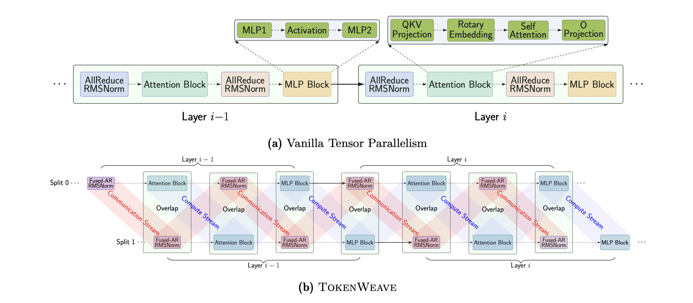 |  |  | [note](./notes/2025/TokenWeave/note.md) |

<b>Mila & Universite de Montreal</b>
 

| Meta | Title | Cover | Publish | Code | Note |
|:-----|:------|:------|:--------|:-----|:-----|
| [FoX](./meta/2025/FoX.prototxt) | [Forgetting Transformer: Softmax Attention with a Forget Gate](http://arxiv.org/abs/2503.02130v2) |  |  |  | [note](./notes/2025/FoX/note.md) |
| [ACP](./meta/2025/ACP.prototxt) | [Adaptive Computation Pruning for the Forgetting Transformer](http://arxiv.org/abs/2504.06949v1) |  |  |  | [note](./notes/2025/ACP/note.md) |

<b>MiniCPM</b>
 

| Meta | Title | Cover | Publish | Code | Note |
|:-----|:------|:------|:--------|:-----|:-----|
| [MiniCPM4](./meta/2025/MiniCPM4.prototxt) | [MiniCPM4: Ultra-Efficient LLMs on End Devices](http://arxiv.org/abs/2506.07900v1) |  |  |  | [note](./notes/2025/MiniCPM4/note.md) |

<b>Ministry of Education of China, Xiamen University</b>
 

| Meta | Title | Cover | Publish | Code | Note |
|:-----|:------|:------|:--------|:-----|:-----|
| [DSnoT](./meta/2024/DSnoT.prototxt) | [Dynamic Sparse No Training: Training-Free Fine-tuning for Sparse LLMs](http://arxiv.org/abs/2310.08915v3) |  |  |  | [note](./notes/2024/DSnoT/note.md) |

<b>Mohamed bin Zayed University of AI</b>
 

| Meta | Title | Cover | Publish | Code | Note |
|:-----|:------|:------|:--------|:-----|:-----|
| [GBLM-Pruner](./meta/2023/GBLM-Pruner.prototxt) | [Beyond Size: How Gradients Shape Pruning Decisions in Large Language Models](http://arxiv.org/abs/2311.04902v2) |  |  |  | [note](./notes/2023/GBLM-Pruner/note.md) |

<b>Moonshot AI</b>
 

| Meta | Title | Cover | Publish | Code | Note |
|:-----|:------|:------|:--------|:-----|:-----|
| [MoBA](./meta/2025/MoBA.prototxt) | [MoBA: Mixture of Block Attention for Long-Context LLMs](http://arxiv.org/abs/2502.13189v1) |  |  |  | [note](./notes/2025/MoBA/note.md) |

<b>Multimedia Laboratory (MMLab)</b>
 

| Meta | Title | Cover | Publish | Code | Note |
|:-----|:------|:------|:--------|:-----|:-----|
| [SPP](./meta/2024/SPP.prototxt) | [SPP: Sparsity-Preserved Parameter-Efficient Fine-Tuning for Large Language Models](http://arxiv.org/abs/2405.16057v1) |  |  |  | [note](./notes/2024/SPP/note.md) |

<b>NVIDIA</b>
 

| Meta | Title | Cover | Publish | Code | Note |
|:-----|:------|:------|:--------|:-----|:-----|
| [m](./meta/2021/K7GSWQIC.prototxt) | [Channel Permutations for N:M Sparsity](https://proceedings.neurips.cc/paper/2021/hash/6e8404c3b93a9527c8db241a1846599a-Abstract.html) |  |  |  |  |
| [NMSparse](./meta/2021/PUHJMVCM.prototxt) | [Accelerating Sparse Deep Neural Networks](https://arxiv.org/abs/2104.08378) |  |  |  |  |
| [FT](./meta/2023/fastertransfomer.prototxt) | [FasterTransformer](https://github.com/NVIDIA/FasterTransformer) |  |  |  |  |
| [DistGEMM](./meta/2024/DistGEMM.prototxt) | [A novel CUTLASS-based implementation of Tensor Parallelism for NVLink-enabled systems](https://blog.shi-labs.com/distributed-gemm-88be6a481e2b) |  |  |  | [note](./notes/2024/DistGEMM/note.md) |
| [streaming-llm](./meta/2024/streaming-llm.prototxt) | [Efficient Streaming Language Models with Attention Sinks](http://arxiv.org/abs/2309.17453v4) |  |  |  | [note](./notes/2024/streaming-llm/note.md) |
| [MaskLLM](./meta/2024/MaskLLM.prototxt) | [MaskLLM: Learnable Semi-Structured Sparsity for Large Language Models](http://arxiv.org/abs/2409.17481v1) |  |  |  | [note](./notes/2024/MaskLLM/note.md) |
| [Minitron](./meta/2024/Minitron.prototxt) | [Compact Language Models via Pruning and Knowledge Distillation](https://arxiv.org/abs/2408.11796v2) |  |  |  | [note](./notes/2024/Minitron/note.md) |
| [DuoAttention](./meta/2024/DuoAttention.prototxt) | [DuoAttention: Efficient Long-Context LLM Inference with Retrieval and Streaming Heads](http://arxiv.org/abs/2410.10819v1) |  |  |  | [note](./notes/2024/DuoAttention/note.md) |
| [QServe](./meta/2024/QServer.prototxt) | [QServe: W4A8KV4 Quantization and System Co-design for Efficient LLM Serving](http://arxiv.org/abs/2405.04532v2) |  |  | [Pytorch](https://hanlab.mit.edu/projects/qserve) | [note](./notes/2024/QServer/note.md) |
| [XGrammar](./meta/2024/XGrammar.prototxt) | [XGrammar: Flexible and Efficient Structured Generation Engine for Large Language Models](http://arxiv.org/abs/2411.15100v2) |  |  |  | [note](./notes/2024/XGrammar/note.md) |
| [StarAttention](./meta/2025/StarAttention.prototxt) | [Star Attention: Efficient LLM Inference over Long Sequences](https://openreview.net/forum?id=QY7Au9nZwp) |  |  |  | [note](./notes/2025/StarAttention/note.md) |
| [XAttention](./meta/2025/XAttention.prototxt) | [XAttention: Block Sparse Attention with Antidiagonal Scoring](http://arxiv.org/abs/2503.16428v1) |  |  |  | [note](./notes/2025/XAttention/note.md) |
| [FlashInfer](./meta/2025/FlashInfer.prototxt) | [FlashInfer: Efficient and Customizable Attention Engine for LLM Inference Serving](http://arxiv.org/abs/2501.01005v2) |  |  |  | [note](./notes/2025/FlashInfer/note.md) |
| [HelixParallelism](./meta/2025/HelixParallelism.prototxt) | [Helix Parallelism: Rethinking Sharding Strategies for Interactive Multi-Million-Token LLM Decoding](http://arxiv.org/abs/2507.07120v1) |  |  |  | [note](./notes/2025/HelixParallelism/note.md) |
| [LServer](./meta/2025/LServer.prototxt) | [LServe: Efficient Long-sequence LLM Serving with Unified Sparse Attention](http://arxiv.org/abs/2502.14866v1) |  |  |  | [note](./notes/2025/LServer/note.md) |
| [kvpress](./meta/2025/kvpress.prototxt) | [kvpress: LLM KV cache compression made easy](https://github.com/NVIDIA/kvpress) |  |  |  | [note](./notes/2025/kvpress/note.md) |

<b>NVIDIA Research</b>
 

| Meta | Title | Cover | Publish | Code | Note |
|:-----|:------|:------|:--------|:-----|:-----|
| [LIMINAL](./meta/2025/LIMINAL.prototxt) | [Efficient LLM Inference: Bandwidth, Compute, Synchronization, and Capacity are all you need](http://arxiv.org/abs/2507.14397v1) |  |  |  | [note](./notes/2025/LIMINAL/note.md) |

<b>NanKai University</b>
 

| Meta | Title | Cover | Publish | Code | Note |
|:-----|:------|:------|:--------|:-----|:-----|
| [Task-KV](./meta/2025/Task-KV.prototxt) | [Task-KV: Task-aware KV Cache Optimization via Semantic Differentiation of Attention Heads](http://arxiv.org/abs/2501.15113v1) |  |  |  | [note](./notes/2025/Task-KV/note.md) |

<b>Nanjing University</b>
 

| Meta | Title | Cover | Publish | Code | Note |
|:-----|:------|:------|:--------|:-----|:-----|
| [STA](./meta/2022/44KWQAWO.prototxt) | [An Algorithm-Hardware Co-Optimized Framework for Accelerating N:M Sparse Transformers](https://arxiv.org/abs/2208.06118) |  |  |  |  |
| [DeepSeekMoE](./meta/2024/DeepSeekMoE.prototxt) | [DeepSeekMoE: Towards Ultimate Expert Specialization in Mixture-of-Experts Language Models](http://arxiv.org/abs/2401.06066v1) |  |  |  | [note](./notes/2024/DeepSeekMoE/note.md) |
| [RaaS](./meta/2025/RaaS.prototxt) | [Efficient Long-Decoding Inference with Reasoning-Aware Attention Sparsity](http://arxiv.org/abs/2502.11147v1) |  |  |  | [note](./notes/2025/RaaS/note.md) |

<b>Nanyang Technological University</b>
 

| Meta | Title | Cover | Publish | Code | Note |
|:-----|:------|:------|:--------|:-----|:-----|
| [L-OBS](./meta/2017/lobs.prototxt) | [Learning to Prune Deep Neural Networks via Layer-wise Optimal Brain Surgeon](https://arxiv.org/pdf/1705.07565.pdf) |  |  |  |  |
| [SMAT](./meta/2024/SMAT.prototxt) | [Unleashing the Power of Meta-tuning for Few-shot Generalization Through Sparse Interpolated Experts](http://arxiv.org/abs/2403.08477v3) |  |  |  | [note](./notes/2024/SMAT/note.md) |
| [0VRXJQ3F](./meta/2025/0VRXJQ3F.prototxt) | [Rethinking Key-Value Cache Compression Techniques for Large Language Model Serving](http://arxiv.org/abs/2503.24000v1) | 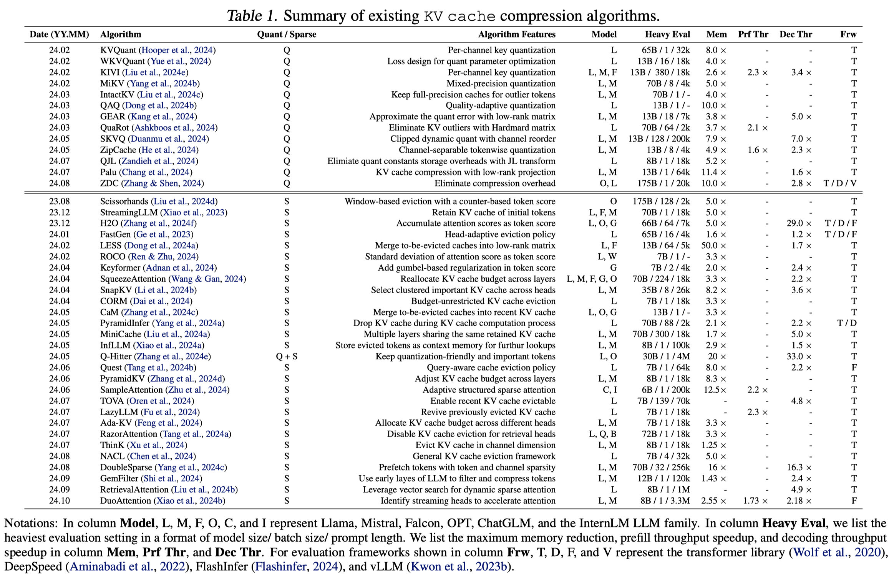 |  |  | [note](./notes/2025/0VRXJQ3F/note.md) |
| [Cus-Prun](./meta/2025/Cus-Prun.prototxt) | [Pruning General Large Language Models into Customized Expert Models](http://arxiv.org/abs/2506.02561v1) |  |  |  | [note](./notes/2025/Cus-Prun/note.md) |

<b>National University of Singapore</b>
 

| Meta | Title | Cover | Publish | Code | Note |
|:-----|:------|:------|:--------|:-----|:-----|
| [LLM-Pruner](./meta/2023/LLM-Pruner.prototxt) | [LLM-Pruner: On the Structural Pruning of Large Language Models](http://arxiv.org/abs/2305.11627v3) |  |  |  | [note](./notes/2023/LLM-Pruner/note.md) |
| [CachedAttention](./meta/2024/CachedAttention.prototxt) | [Cost-Efficient Large Language Model Serving for Multi-turn Conversations with CachedAttention](http://arxiv.org/abs/2403.19708v3) |  |  |  | [note](./notes/2024/CachedAttention/note.md) |
| [MaskLLM](./meta/2024/MaskLLM.prototxt) | [MaskLLM: Learnable Semi-Structured Sparsity for Large Language Models](http://arxiv.org/abs/2409.17481v1) |  |  |  | [note](./notes/2024/MaskLLM/note.md) |
| [AdaSkip](./meta/2025/AdaSkip.prototxt) | [AdaSkip: Adaptive Sublayer Skipping for Accelerating Long-Context LLM Inference](http://arxiv.org/abs/2501.02336v1) |  |  |  | [note](./notes/2025/AdaSkip/note.md) |
| [Cus-Prun](./meta/2025/Cus-Prun.prototxt) | [Pruning General Large Language Models into Customized Expert Models](http://arxiv.org/abs/2506.02561v1) |  |  |  | [note](./notes/2025/Cus-Prun/note.md) |

<b>Neural Magic</b>
 

| Meta | Title | Cover | Publish | Code | Note |
|:-----|:------|:------|:--------|:-----|:-----|
| [m](./meta/2020/V3MFIRLV.prototxt) | [Inducing and Exploiting Activation Sparsity for Fast Neural Network Inference](http://proceedings.mlr.press/v119/kurtz20a/kurtz20a.pdf) |  |  |  |  |
| [SPDY](./meta/2022/spdy.prototxt) | [SPDY: Accurate Pruning with Speedup Guarantees](https://arxiv.org/abs/2201.13096) |  |  |  | [note](./notes/2022/spdy/index.md) |
| [OBC](./meta/2022/obc.prototxt) | [Optimal Brain Compression: A Framework for Accurate Post-Training Quantization and Pruning](https://openreview.net/pdf?id=ksVGCOlOEba) |  |  |  |  |
| [oBERT](./meta/2022/oBERT.prototxt) | [The Optimal BERT Surgeon: Scalable and Accurate Second-Order Pruning for Large Language Models](https://arxiv.org/pdf/2203.07259.pdf) |  |  |  |  |
| [GPTQ](./meta/2023/gptq.prototxt) | [GPTQ: Accurate Post-Training Quantization for Generative Pre-trained Transformers](https://arxiv.org/pdf/2210.17323.pdf) |  |  |  |  |
| [SparseGPT](./meta/2023/sparsegpt.prototxt) | [SparseGPT: Massive Language Models Can be Accurately Pruned in one-shot.](https://arxiv.org/pdf/2301.00774.pdf) |  |  |  |  |
| [ZipLM](./meta/2023/ZipLM.prototxt) | [ZipLM: Inference-Aware Structured Pruning of Language Models](https://openreview.net/pdf?id=bPFFPueAxm) |  |  |  |  |
| [SpQR](./meta/2023/spqr.prototxt) | [SpQR: A Sparse-Quantized Representation for Near-Lossless LLM Weight Compression](https://arxiv.org/pdf/2306.03078.pdf) |  |  |  |  |
| [SquareHead](./meta/2023/SquareHead.prototxt) | [Sparse Fine-tuning for Inference Acceleration of Large Language Models](https://arxiv.org/pdf/2310.06927.pdf) |  |  |  |  |
| [m](./meta/2024/ULY1AZGY.prototxt) | [Enabling High-Sparsity Foundational Llama Models with Efficient Pretraining and Deployment](http://arxiv.org/abs/2405.03594v1) |  |  |  | [note](./notes/2024/ULY1AZGY/note.md) |

<b>New York University</b>
 

| Meta | Title | Cover | Publish | Code | Note |
|:-----|:------|:------|:--------|:-----|:-----|
| [Recycled Attention](./meta/2024/RecycledAttention.prototxt) | [Recycled Attention: Efficient inference for long-context language models](http://arxiv.org/abs/2411.05787v1) |  |  |  | [note](./notes/2024/RecycledAttention/note.md) |

<b>Noah’s Ark Lab, Huawei Technologies</b>
 

| Meta | Title | Cover | Publish | Code | Note |
|:-----|:------|:------|:--------|:-----|:-----|
| [AttentionPredictor](./meta/2025/AttentionPredictor.prototxt) | [AttentionPredictor: Temporal Pattern Matters for Efficient LLM Inference](http://arxiv.org/abs/2502.04077v1) |  |  |  | [note](./notes/2025/AttentionPredictor/note.md) |

<b>Normal Computing</b>
 

| Meta | Title | Cover | Publish | Code | Note |
|:-----|:------|:------|:--------|:-----|:-----|
| [m](./meta/2023/IHOT8YP4.prototxt) | [Efficient Guided Generation for Large Language Models](http://arxiv.org/abs/2307.09702v4) | 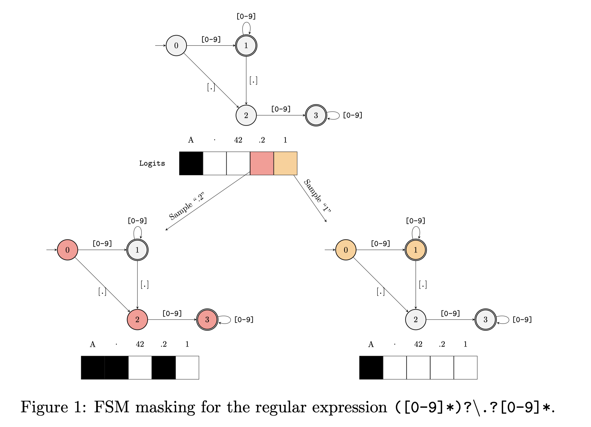 |  |  | [note](./notes/2023/IHOT8YP4/note.md) |

<b>North China Electric Power University</b>
 

| Meta | Title | Cover | Publish | Code | Note |
|:-----|:------|:------|:--------|:-----|:-----|
| [COMET](./meta/2025/COMET.prototxt) | [COMET: Towards Partical W4A4KV4 LLMs Serving](http://arxiv.org/abs/2410.12168v1) |  |  |  | [note](./notes/2025/COMET/note.md) |

<b>Northeastern University</b>
 

| Meta | Title | Cover | Publish | Code | Note |
|:-----|:------|:------|:--------|:-----|:-----|
| [ADMM-pruning](./meta/2018/Z9R72EAT.prototxt) | [A Systematic DNN Weight Pruning Framework using Alternating Direction Method of Multipliers](https://arxiv.org/abs/1804.03294) |  |  |  |  |

<b>Northwestern University</b>
 

| Meta | Title | Cover | Publish | Code | Note |
|:-----|:------|:------|:--------|:-----|:-----|
| [SR-STE](./meta/2021/sr-ste.prototxt) | [Learning N:M Fine-grained Structured Sparse Neural Networks From Scratch](https://openreview.net/forum?id=K9bw7vqp_s) |  |  |  |  |

<b>Numenta</b>
 

| Meta | Title | Cover | Publish | Code | Note |
|:-----|:------|:------|:--------|:-----|:-----|
| [Complementary Sparsity](./meta/2022/ComplementarySparsity.prototxt) | [Two Sparsities Are Better Than One: Unlocking the Performance Benefits of Sparse-Sparse Networks](https://iopscience.iop.org/article/10.1088/2634-4386/ac7c8a) |  |  |  | [note](./notes/2022/ComplementarySparsity/note.md) |

<b>OPPO Research Institute</b>
 

| Meta | Title | Cover | Publish | Code | Note |
|:-----|:------|:------|:--------|:-----|:-----|
| [SharePrefill](./meta/2025/SharePrefill.prototxt) | [Accelerating Prefilling for Long-Context LLMs via Sparse Pattern Sharing](http://arxiv.org/abs/2505.19578v1) |  |  |  | [note](./notes/2025/SharePrefill/note.md) |

<b>Ohio State University</b>
 

| Meta | Title | Cover | Publish | Code | Note |
|:-----|:------|:------|:--------|:-----|:-----|
| [CoCoNet](./meta/2022/CoCoNet.prototxt) | [Breaking the Computation and Communication Abstraction Barrier in Distributed Machine Learning Workloads](http://arxiv.org/abs/2105.05720v5) |  |  |  | [note](./notes/2022/CoCoNet/note.md) |
| [CoreInfer](./meta/2024/CoreInfer.prototxt) | [CoreInfer: Accelerating Large Language Model Inference with Semantics-Inspired Adaptive Sparse Activation](http://arxiv.org/abs/2410.18311v1) |  |  |  | [note](./notes/2024/CoreInfer/note.md) |

<b>OpenAI</b>
 

| Meta | Title | Cover | Publish | Code | Note |
|:-----|:------|:------|:--------|:-----|:-----|
| [blocksparse](./meta/2020/blocksparse.prototxt) | [GPU Kernels for Block-Sparse Weights](https://cdn.openai.com/blocksparse/blocksparsepaper.pdf) |  |  |  |  |

<b>OpenGVLab</b>
 

| Meta | Title | Cover | Publish | Code | Note |
|:-----|:------|:------|:--------|:-----|:-----|
| [OmniQuant](./meta/2023/omniquant.prototxt) | [OmniQuant: Omnidirectionally Calibrated Quantization for Large Language Models](https://arxiv.org/abs/2308.13137) |  |  |  |  |

<b>OpenTeams Inc</b>
 

| Meta | Title | Cover | Publish | Code | Note |
|:-----|:------|:------|:--------|:-----|:-----|
| [TorchAO](./meta/2025/TorchAO.prototxt) | [TorchAO: PyTorch-Native Training-to-Serving Model Optimization](http://arxiv.org/abs/2507.16099v1) |  |  |  | [note](./notes/2025/TorchAO/note.md) |

<b>Oxford University</b>
 

| Meta | Title | Cover | Publish | Code | Note |
|:-----|:------|:------|:--------|:-----|:-----|
| [CATS](./meta/2024/CATS.prototxt) | [CATS: Contextually-Aware Thresholding for Sparsity in Large Language Models](http://arxiv.org/abs/2404.08763v4) |  |  |  | [note](./notes/2024/CATS/note.md) |

<b>Peking University</b>
 

| Meta | Title | Cover | Publish | Code | Note |
|:-----|:------|:------|:--------|:-----|:-----|
| [Centauri](./meta/2024/Centauri.prototxt) | [Centauri: Enabling Efficient Scheduling for Communication-Computation Overlap in Large Model Training via Communication Partitioning](https://dl.acm.org/doi/10.1145/3620666.3651379) |  |  |  | [note](./notes/2024/Centauri/note.md) |
| [EAGLE](./meta/2024/Eagle.prototxt) | [EAGLE: Speculative Sampling Requires Rethinking Feature Uncertainty](http://arxiv.org/abs/2401.15077v2) |  |  |  | [note](./notes/2024/Eagle/note.md) |
| [m](./meta/2024/DHIB73MC.prototxt) | [A Survey on Efficient Inference for Large Language Models](http://arxiv.org/abs/2404.14294v2) |  |  |  | [note](./notes/2024/DHIB73MC/note.md) |
| [FLUX](./meta/2024/FLUX.prototxt) | [FLUX: Fast Software-based Communication Overlap On GPUs Through Kernel Fusion](http://arxiv.org/abs/2406.06858v5) |  |  |  | [note](./notes/2024/FLUX/note.md) |
| [DistAttention](./meta/2024/DistAttention.prototxt) | [Infinite-LLM: Efficient LLM Service for Long Context with DistAttention and Distributed KVCache](http://arxiv.org/abs/2401.02669v2) |  |  |  | [note](./notes/2024/DistAttention/note.md) |
| [SampleAttention](./meta/2024/SampleAttention.prototxt) | [SampleAttention: Near-Lossless Acceleration of Long Context LLM Inference with Adaptive Structured Sparse Attention](http://arxiv.org/abs/2406.15486v2) |  |  |  | [note](./notes/2024/SampleAttention/note.md) |
| [NSA](./meta/2025/NSA.prototxt) | [Native Sparse Attention: Hardware-Aligned and Natively Trainable Sparse Attention](http://arxiv.org/abs/2502.11089v1) |  |  |  | [note](./notes/2025/NSA/note.md) |
| [FlexPrefill](./meta/2025/FlexPrefill.prototxt) | [FlexPrefill: A Context-Aware Sparse Attention Mechanism for Efficient Long-Sequence Inference](http://arxiv.org/abs/2502.20766v1) |  |  |  | [note](./notes/2025/FlexPrefill/note.md) |
| [RaaS](./meta/2025/RaaS.prototxt) | [Efficient Long-Decoding Inference with Reasoning-Aware Attention Sparsity](http://arxiv.org/abs/2502.11147v1) |  |  |  | [note](./notes/2025/RaaS/note.md) |
| [HATA](./meta/2025/HATA.prototxt) | [HATA: Trainable and Hardware-Efficient Hash-Aware Top-k Attention for Scalable Large Model Inference](http://arxiv.org/abs/2506.02572v1) |  |  |  | [note](./notes/2025/HATA/note.md) |
| [KeepKV](./meta/2025/KeepKV.prototxt) | [KeepKV: Eliminating Output Perturbation in KV Cache Compression for Efficient LLMs Inference](http://arxiv.org/abs/2504.09936v1) |  |  |  | [note](./notes/2025/KeepKV/note.md) |
| [MegaScale-MoE](./meta/2025/MegaScale-MoE.prototxt) | [MegaScale-MoE: Large-Scale Communication-Efficient Training of Mixture-of-Experts Models in Production](http://arxiv.org/abs/2505.11432v2) |  |  |  | [note](./notes/2025/MegaScale-MoE/note.md) |
| [SALE](./meta/2025/SALE.prototxt) | [SALE : Low-bit Estimation for Efficient Sparse Attention in Long-context LLM Prefilling](http://arxiv.org/abs/2505.24179v1) | 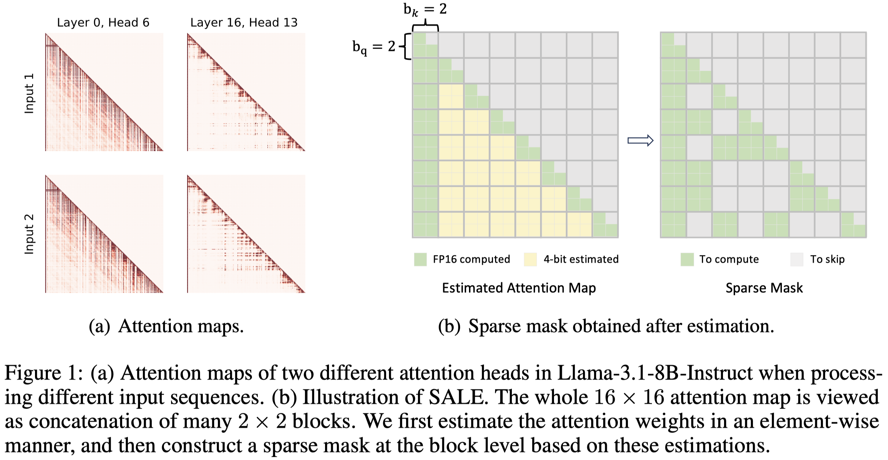 |  |  | [note](./notes/2025/SALE/note.md) |
| [SeerAttention-R](./meta/2025/SeerAttention-R.prototxt) | [SeerAttention-R: Sparse Attention Adaptation for Long Reasoning](http://arxiv.org/abs/2506.08889v1) |  |  |  | [note](./notes/2025/SeerAttention-R/note.md) |
| [Awesome-Efficient-Arch](./meta/2025/Awesome-Efficient-Arch.prototxt) | [Speed Always Wins: A Survey on Efficient Architectures for Large Language Models](http://arxiv.org/abs/2508.09834v1) |  |  |  | [note](./notes/2025/Awesome-Efficient-Arch/note.md) |

<b>Perplexity AI</b>
 

| Meta | Title | Cover | Publish | Code | Note |
|:-----|:------|:------|:--------|:-----|:-----|
| [FlashInfer](./meta/2025/FlashInfer.prototxt) | [FlashInfer: Efficient and Customizable Attention Engine for LLM Inference Serving](http://arxiv.org/abs/2501.01005v2) |  |  |  | [note](./notes/2025/FlashInfer/note.md) |

<b>Princeton University</b>
 

| Meta | Title | Cover | Publish | Code | Note |
|:-----|:------|:------|:--------|:-----|:-----|
| [AdaLoRA](./meta/2023/adalora.prototxt) | [AdaLoRA: Adaptive Budget Allocation for Parameter-Efficient Fine-Tuning](https://arxiv.org/pdf/2303.10512.pdf) |  |  |  |  |
| [MeZO](./meta/2023/MeZO.prototxt) | [Fine-Tuning Language Models with Just Forward Passes](http://arxiv.org/abs/2305.17333v3) |  |  |  | [note](./notes/2023/MeZO/note.md) |
| [LLM-shearing](./meta/2023/LLM_shearing.prototxt) | [Sheared LLaMA: Accelerating Language Model Pre-training via Structured Pruning](https://xiamengzhou.github.io/sheared-llama/) |  |  |  | [note](./notes/2023/LLM_shearing/note.md) |
| [SnapKV](./meta/2024/SnapKV.prototxt) | [SnapKV: LLM Knows What You are Looking for Before Generation](http://arxiv.org/abs/2404.14469v2) |  |  |  | [note](./notes/2024/SnapKV/note.md) |
| [TEAL](./meta/2025/TEAL.prototxt) | [Training-Free Activation Sparsity in Large Language Models](http://arxiv.org/abs/2408.14690v1) |  |  |  | [note](./notes/2025/TEAL/note.md) |
| [GLA](./meta/2025/GLA.prototxt) | [Hardware-Efficient Attention for Fast Decoding](http://arxiv.org/abs/2505.21487v1) |  |  |  | [note](./notes/2025/GLA/note.md) |

<b>Purdue University</b>
 

| Meta | Title | Cover | Publish | Code | Note |
|:-----|:------|:------|:--------|:-----|:-----|
| [52A7RO95](./meta/2025/52A7RO95.prototxt) | [Mixture of Experts in Large Language Models](http://arxiv.org/abs/2507.11181v1) |  |  |  | [note](./notes/2025/52A7RO95/note.md) |

<b>PyTorch</b>
 

| Meta | Title | Cover | Publish | Code | Note |
|:-----|:------|:------|:--------|:-----|:-----|
| [Async-TP](./meta/2024/Async-TP.prototxt) | [[Distributed w/ TorchTitan] Introducing Async Tensor Parallelism in PyTorch](https://discuss.pytorch.org/t/distributed-w-torchtitan-introducing-async-tensor-parallelism-in-pytorch/209487/1) |  |  |  | [note](./notes/2024/Async-TP/note.md) |

<b>Qwen Team</b>
 

| Meta | Title | Cover | Publish | Code | Note |
|:-----|:------|:------|:--------|:-----|:-----|
| [Qwen3](./meta/2025/Qwen3.prototxt) | [Qwen3 Technical Report](http://arxiv.org/abs/2505.09388v1) |  |  |  | [note](./notes/2025/Qwen3/note.md) |

<b>Renmin University of China</b>
 

| Meta | Title | Cover | Publish | Code | Note |
|:-----|:------|:------|:--------|:-----|:-----|
| [Acc-SpMM](./meta/2025/Acc-SpMM.prototxt) | [Acc-SpMM: Accelerating General-purpose Sparse Matrix-Matrix Multiplication with GPU Tensor Cores](http://arxiv.org/abs/2501.09251v1) |  |  |  | [note](./notes/2025/Acc-SpMM/note.md) |
| [SEAP](./meta/2025/SEAP.prototxt) | [SEAP: Training-free Sparse Expert Activation Pruning Unlock the Brainpower of Large Language Models](http://arxiv.org/abs/2503.07605v1) |  |  |  | [note](./notes/2025/SEAP/note.md) |

<b>Rice University</b>
 

| Meta | Title | Cover | Publish | Code | Note |
|:-----|:------|:------|:--------|:-----|:-----|
| [Deja Vu](./meta/2023/dejavu.prototxt) | [Deja Vu: Contextual Sparsity for Efficient LLMs at Inference Time](https://openreview.net/forum?id=wIPIhHd00i) |  |  |  |  |

<b>RiseAI-Sys</b>
 

| Meta | Title | Cover | Publish | Code | Note |
|:-----|:------|:------|:--------|:-----|:-----|
| [attention-gym](./meta/2025/attention-gym.prototxt) | [Attention-Gym: Triton-Based Sparse and Quantization Attention](https://github.com/RiseAI-Sys/attention-gym) |  |  |  | [note](./notes/2025/attention-gym/note.md) |

<b>SJTU</b>
 

| Meta | Title | Cover | Publish | Code | Note |
|:-----|:------|:------|:--------|:-----|:-----|
| [XAttention](./meta/2025/XAttention.prototxt) | [XAttention: Block Sparse Attention with Antidiagonal Scoring](http://arxiv.org/abs/2503.16428v1) |  |  |  | [note](./notes/2025/XAttention/note.md) |
| [LServer](./meta/2025/LServer.prototxt) | [LServe: Efficient Long-sequence LLM Serving with Unified Sparse Attention](http://arxiv.org/abs/2502.14866v1) |  |  |  | [note](./notes/2025/LServer/note.md) |

<b>Salesforce AI Research</b>
 

| Meta | Title | Cover | Publish | Code | Note |
|:-----|:------|:------|:--------|:-----|:-----|
| [SPP](./meta/2024/SPP.prototxt) | [SPP: Sparsity-Preserved Parameter-Efficient Fine-Tuning for Large Language Models](http://arxiv.org/abs/2405.16057v1) |  |  |  | [note](./notes/2024/SPP/note.md) |

<b>Salesforce Research</b>
 

| Meta | Title | Cover | Publish | Code | Note |
|:-----|:------|:------|:--------|:-----|:-----|
| [topk-decoding](./meta/2025/topk-decoding.prototxt) | [Exploiting Sparsity for Long Context Inference: Million Token Contexts on Commodity GPUs](http://arxiv.org/abs/2502.06766v2) |  |  |  | [note](./notes/2025/topk-decoding/note.md) |

<b>Samsung</b>
 

| Meta | Title | Cover | Publish | Code | Note |
|:-----|:------|:------|:--------|:-----|:-----|
| [FisherPruning](./meta/2022/fisherpruning.prototxt) | [A Fast Post-Training Pruning Framework for Transformers](http://arxiv.org/abs/2204.09656v2) |  |  |  | [note](./notes/2022/fisherpruning/note.md) |

<b>Samsung AI Center</b>
 

| Meta | Title | Cover | Publish | Code | Note |
|:-----|:------|:------|:--------|:-----|:-----|
| [TinyTrain](./meta/2024/TinyTrain.prototxt) | [TinyTrain: Resource-Aware Task-Adaptive Sparse Training of DNNs at the Data-Scarce Edge](http://arxiv.org/abs/2307.09988v2) |  |  |  | [note](./notes/2024/TinyTrain/note.md) |

<b>Santa Clara University</b>
 

| Meta | Title | Cover | Publish | Code | Note |
|:-----|:------|:------|:--------|:-----|:-----|
| [SparseInfer](./meta/2024/SparseInfer.prototxt) | [SparseInfer: Training-free Prediction of Activation Sparsity for Fast LLM Inference](http://arxiv.org/abs/2411.12692v1) |  |  |  | [note](./notes/2024/SparseInfer/note.md) |

<b>School of Cyber Security, University of Chinese Academy of Sciences</b>
 

| Meta | Title | Cover | Publish | Code | Note |
|:-----|:------|:------|:--------|:-----|:-----|
| [m](./meta/2023/L5D7520E.prototxt) | [A Survey on Model Compression for Large Language Models](https://arxiv.org/abs/2308.07633) |  |  |  |  |

<b>SenseTime</b>
 

| Meta | Title | Cover | Publish | Code | Note |
|:-----|:------|:------|:--------|:-----|:-----|
| [0VRXJQ3F](./meta/2025/0VRXJQ3F.prototxt) | [Rethinking Key-Value Cache Compression Techniques for Large Language Model Serving](http://arxiv.org/abs/2503.24000v1) |  |  |  | [note](./notes/2025/0VRXJQ3F/note.md) |

<b>SenseTime Research</b>
 

| Meta | Title | Cover | Publish | Code | Note |
|:-----|:------|:------|:--------|:-----|:-----|
| [BRECQ](./meta/2021/brecq.prototxt) | [BRECQ: Pushing the Limit of Post-Training Quantization by Block Reconstruction](https://openreview.net/pdf?id=POWv6hDd9XH) |  |  |  |  |
| [SR-STE](./meta/2021/sr-ste.prototxt) | [Learning N:M Fine-grained Structured Sparse Neural Networks From Scratch](https://openreview.net/forum?id=K9bw7vqp_s) |  |  |  |  |

<b>Seoul National University</b>
 

| Meta | Title | Cover | Publish | Code | Note |
|:-----|:------|:------|:--------|:-----|:-----|
| [K-pruning](./meta/2023/k_pruning.prototxt) | [Knowledge-preserving Pruning for Pre-trained Language Models without Retraining](https://arxiv.org/abs/2308.03449) |  |  |  | [note](./notes/2023/k_pruning/note.md) |
| [L4Q](./meta/2024/L4Q.prototxt) | [L4Q: Parameter Efficient Quantization-Aware Training on Large Language Models via LoRA-wise LSQ](https://arxiv.org/abs/2402.04902) |  |  |  | [note](./notes/2024/L4Q/note.md) |
| [FastKV](./meta/2025/FastKV.prototxt) | [FastKV: KV Cache Compression for Fast Long-Context Processing with Token-Selective Propagation](http://arxiv.org/abs/2502.01068v1) |  |  |  | [note](./notes/2025/FastKV/note.md) |
| [RetroAttention](./meta/2025/RetroAttention.prototxt) | [Retrospective Sparse Attention for Efficient Long-Context Generation](http://arxiv.org/abs/2508.09001v1) |  |  |  | [note](./notes/2025/RetroAttention/note.md) |

<b>Shanghai AI Lab</b>
 

| Meta | Title | Cover | Publish | Code | Note |
|:-----|:------|:------|:--------|:-----|:-----|
| [Centauri](./meta/2024/Centauri.prototxt) | [Centauri: Enabling Efficient Scheduling for Communication-Computation Overlap in Large Model Training via Communication Partitioning](https://dl.acm.org/doi/10.1145/3620666.3651379) |  |  |  | [note](./notes/2024/Centauri/note.md) |

<b>Shanghai AI Laboratory</b>
 

| Meta | Title | Cover | Publish | Code | Note |
|:-----|:------|:------|:--------|:-----|:-----|
| [0VRXJQ3F](./meta/2025/0VRXJQ3F.prototxt) | [Rethinking Key-Value Cache Compression Techniques for Large Language Model Serving](http://arxiv.org/abs/2503.24000v1) |  |  |  | [note](./notes/2025/0VRXJQ3F/note.md) |
| [Awesome-Efficient-Arch](./meta/2025/Awesome-Efficient-Arch.prototxt) | [Speed Always Wins: A Survey on Efficient Architectures for Large Language Models](http://arxiv.org/abs/2508.09834v1) |  |  |  | [note](./notes/2025/Awesome-Efficient-Arch/note.md) |

<b>Shanghai Artificial Intelligence Laboratory</b>
 

| Meta | Title | Cover | Publish | Code | Note |
|:-----|:------|:------|:--------|:-----|:-----|
| [Turbo Sparse](./meta/2024/TurboSparse.prototxt) | [Turbo Sparse: Achieving LLM SOTA Performance with Minimal Activated Parameters](http://arxiv.org/abs/2406.05955v2) |  |  | [Pytorch](https://huggingface.co/PowerInfer) | [note](./notes/2024/TurboSparse/note.md) |

<b>Shanghai Artificial Intelligence Laboratorys</b>
 

| Meta | Title | Cover | Publish | Code | Note |
|:-----|:------|:------|:--------|:-----|:-----|
| [SPP](./meta/2024/SPP.prototxt) | [SPP: Sparsity-Preserved Parameter-Efficient Fine-Tuning for Large Language Models](http://arxiv.org/abs/2405.16057v1) |  |  |  | [note](./notes/2024/SPP/note.md) |

<b>Shanghai Jiao Tong University</b>
 

| Meta | Title | Cover | Publish | Code | Note |
|:-----|:------|:------|:--------|:-----|:-----|
| [PINS](./meta/2023/PINS.prototxt) | [Pruning Pre-trained Language Models with Principled Importance and Self-regularization](https://aclanthology.org/2023.findings-acl.573/) |  |  |  |  |
| [PowerInfer](./meta/2023/PowerInfer.prototxt) | [PowerInfer: Fast Large Language Model Serving with a Consumer-grade GPU](http://arxiv.org/abs/2312.12456v1) |  |  |  | [note](./notes/2023/PowerInfer/note.md) |
| [m](./meta/2024/JSHWEV0S.prototxt) | [Keep the Cost Down: A Review on Methods to Optimize LLM' s KV-Cache Consumption](http://arxiv.org/abs/2407.18003v3) |  |  |  | [note](./notes/2024/JSHWEV0S/note.md) |
| [Quest](./meta/2024/Quest.prototxt) | [Quest: Query-Aware Sparsity for Efficient Long-Context LLM Inference](http://arxiv.org/abs/2406.10774) |  |  |  | [note](./notes/2024/Quest/note.md) |
| [SIFT](./meta/2024/SIFT.prototxt) | [Sparse is Enough in Fine-tuning Pre-trained Large Language Models](http://arxiv.org/abs/2312.11875v3) |  |  |  | [note](./notes/2024/SIFT/note.md) |
| [SGLang](./meta/2024/SGLang.prototxt) | [SGLang: Efficient Execution of Structured Language Model Programs](http://arxiv.org/abs/2312.07104v2) |  |  |  | [note](./notes/2024/SGLang/note.md) |
| [068ZPAME](./meta/2024/068ZPAME.prototxt) | [A Survey on Inference Optimization Techniques for Mixture of Experts Models](http://arxiv.org/abs/2412.14219v2) |  |  |  | [note](./notes/2024/068ZPAME/note.md) |
| [DistAttention](./meta/2024/DistAttention.prototxt) | [Infinite-LLM: Efficient LLM Service for Long Context with DistAttention and Distributed KVCache](http://arxiv.org/abs/2401.02669v2) |  |  |  | [note](./notes/2024/DistAttention/note.md) |
| [MoA](./meta/2024/MoA.prototxt) | [MoA: Mixture of Sparse Attention for Automatic Large Language Model Compression](http://arxiv.org/abs/2406.14909v2) |  |  |  | [note](./notes/2024/MoA/note.md) |
| [DoubleSparsity](./meta/2024/DoubleSparsity.prototxt) | [Post-Training Sparse Attention with Double Sparsity](http://arxiv.org/abs/2408.07092v2) |  |  |  | [note](./notes/2024/DoubleSparsity/note.md) |
| [PowerInfer-2](./meta/2024/PowerInfer-2.prototxt) | [PowerInfer-2: Fast Large Language Model Inference on a Smartphone](http://arxiv.org/abs/2406.06282v2) |  |  | [Website](https://powerinfer.ai/v2/) | [note](./notes/2024/PowerInfer-2/note.md) |
| [ReLU2](./meta/2024/ReLU2.prototxt) | [ReLU2 Wins: Discovering Efficient Activation Functions for Sparse LLMs](https://arxiv.org/abs/2402.03804) |  |  |  | [note](./notes/2024/ReLU2/note.md) |
| [Turbo Sparse](./meta/2024/TurboSparse.prototxt) | [Turbo Sparse: Achieving LLM SOTA Performance with Minimal Activated Parameters](http://arxiv.org/abs/2406.05955v2) |  |  | [Pytorch](https://huggingface.co/PowerInfer) | [note](./notes/2024/TurboSparse/note.md) |
| [XGrammar](./meta/2024/XGrammar.prototxt) | [XGrammar: Flexible and Efficient Structured Generation Engine for Large Language Models](http://arxiv.org/abs/2411.15100v2) |  |  |  | [note](./notes/2024/XGrammar/note.md) |
| [AdaSkip](./meta/2025/AdaSkip.prototxt) | [AdaSkip: Adaptive Sublayer Skipping for Accelerating Long-Context LLM Inference](http://arxiv.org/abs/2501.02336v1) |  |  |  | [note](./notes/2025/AdaSkip/note.md) |
| [CateKV](./meta/2025/CateKV.prototxt) | [CateKV: On Sequential Consistency for Long-Context LLM Inference Acceleration](https://openreview.net/forum?id=u7dlwgKstN) |  |  |  | [note](./notes/2025/CateKV/note.md) |
| [PoD](./meta/2025/PoD.prototxt) | [Compressing KV Cache for Long-Context LLM Inference with Inter-Layer Attention Similarity](http://arxiv.org/abs/2412.02252v1) |  |  |  | [note](./notes/2025/PoD/note.md) |
| [SpecEE](./meta/2025/SpecEE.prototxt) | [SpecEE: Accelerating Large Language Model Inference with Speculative Early Exiting](http://arxiv.org/abs/2504.08850v1) |  |  |  | [note](./notes/2025/SpecEE/note.md) |
| [CometSeed](./meta/2025/CometSeed.prototxt) | [Comet: Fine-grained Computation-communication Overlapping for Mixture-of-Experts](http://arxiv.org/abs/2502.19811v3) |  |  |  | [note](./notes/2025/CometSeed/note.md) |
| [FreqKV](./meta/2025/FreqKV.prototxt) | [FreqKV: Frequency Domain Key-Value Compression for Efficient Context Window Extension](http://arxiv.org/abs/2505.00570v2) |  |  |  | [note](./notes/2025/FreqKV/note.md) |
| [FlashOverlap](./meta/2026/FlashOverlap.prototxt) | [FlashOverlap: A Lightweight Design for Efficiently Overlapping Communication and Computation](http://arxiv.org/abs/2504.19519v1) |  |  |  | [note](./notes/2026/FlashOverlap/note.md) |

<b>Shanghai Jiaotong University</b>
 

| Meta | Title | Cover | Publish | Code | Note |
|:-----|:------|:------|:--------|:-----|:-----|
| [CachedAttention](./meta/2024/CachedAttention.prototxt) | [Cost-Efficient Large Language Model Serving for Multi-turn Conversations with CachedAttention](http://arxiv.org/abs/2403.19708v3) |  |  |  | [note](./notes/2024/CachedAttention/note.md) |
| [m](./meta/2024/DHIB73MC.prototxt) | [A Survey on Efficient Inference for Large Language Models](http://arxiv.org/abs/2404.14294v2) |  |  |  | [note](./notes/2024/DHIB73MC/note.md) |
| [SharePrefill](./meta/2025/SharePrefill.prototxt) | [Accelerating Prefilling for Long-Context LLMs via Sparse Pattern Sharing](http://arxiv.org/abs/2505.19578v1) |  |  |  | [note](./notes/2025/SharePrefill/note.md) |

<b>ShanghaiTech University</b>
 

| Meta | Title | Cover | Publish | Code | Note |
|:-----|:------|:------|:--------|:-----|:-----|
| [COMET](./meta/2025/COMET.prototxt) | [COMET: Towards Partical W4A4KV4 LLMs Serving](http://arxiv.org/abs/2410.12168v1) |  |  |  | [note](./notes/2025/COMET/note.md) |

<b>Shenzhen Institutes of Advanced Technology(SIAT), Chinese Academy of Science(CAS)</b>
 

| Meta | Title | Cover | Publish | Code | Note |
|:-----|:------|:------|:--------|:-----|:-----|
| [AMALI](./meta/2025/AMALI.prototxt) | [AMALI: An Analytical Model for Accurately Modeling LLM Inference on Modern GPUs](https://dl.acm.org/doi/10.1145/3695053.3731064) |  |  |  | [note](./notes/2025/AMALI/note.md) |

<b>Singapore University of Technology and Design</b>
 

| Meta | Title | Cover | Publish | Code | Note |
|:-----|:------|:------|:--------|:-----|:-----|
| [Cus-Prun](./meta/2025/Cus-Prun.prototxt) | [Pruning General Large Language Models into Customized Expert Models](http://arxiv.org/abs/2506.02561v1) |  |  |  | [note](./notes/2025/Cus-Prun/note.md) |

<b>Sogang University</b>
 

| Meta | Title | Cover | Publish | Code | Note |
|:-----|:------|:------|:--------|:-----|:-----|
| [SparseInfer](./meta/2024/SparseInfer.prototxt) | [SparseInfer: Training-free Prediction of Activation Sparsity for Fast LLM Inference](http://arxiv.org/abs/2411.12692v1) |  |  |  | [note](./notes/2024/SparseInfer/note.md) |

<b>Soochow University</b>
 

| Meta | Title | Cover | Publish | Code | Note |
|:-----|:------|:------|:--------|:-----|:-----|
| [Awesome-Efficient-Arch](./meta/2025/Awesome-Efficient-Arch.prototxt) | [Speed Always Wins: A Survey on Efficient Architectures for Large Language Models](http://arxiv.org/abs/2508.09834v1) |  |  |  | [note](./notes/2025/Awesome-Efficient-Arch/note.md) |

<b>Stanford</b>
 

| Meta | Title | Cover | Publish | Code | Note |
|:-----|:------|:------|:--------|:-----|:-----|
| [DoubleSparsity](./meta/2024/DoubleSparsity.prototxt) | [Post-Training Sparse Attention with Double Sparsity](http://arxiv.org/abs/2408.07092v2) |  |  |  | [note](./notes/2024/DoubleSparsity/note.md) |

<b>Stanford University</b>
 

| Meta | Title | Cover | Publish | Code | Note |
|:-----|:------|:------|:--------|:-----|:-----|
| [Deep Compression](./meta/2016/deepcompression.prototxt) | [Deep Compression: Compressing Deep Neural Networks with Pruning, Trained Quantization and Huffman Coding](https://arxiv.org/pdf/1510.00149.pdf) |  |  |  |  |
| [DSD](./meta/2017/dsd.prototxt) | [DSD: Dense-Sparse-Dense Training for Deep Neural Networks](https://arxiv.org/pdf/1607.04381.pdf) |  |  |  |  |
| [FlashAttention](./meta/2022/flashattention.prototxt) | [FlashAttention: Fast and Memory-Efficient Exact Attention with IO-Awareness](https://arxiv.org/abs/2205.14135) |  |  |  |  |
| [Deja Vu](./meta/2023/dejavu.prototxt) | [Deja Vu: Contextual Sparsity for Efficient LLMs at Inference Time](https://openreview.net/forum?id=wIPIhHd00i) |  |  |  |  |
| [PagedAttention](./meta/2023/PagedAttention.prototxt) | [Efficient Memory Management for Large Language Model Serving with PagedAttention](http://arxiv.org/abs/2309.06180v1) |  |  |  | [note](./notes/2023/PagedAttention/note.md) |
| [Flash-Decoding](./meta/2023/FlashDecoding.prototxt) | [Flash-Decoding for long-context inference](https://crfm.stanford.edu/2023/10/12/flashdecoding.html) |  |  |  | [note](./notes/2023/FlashDecoding/note.md) |
| [H2O](./meta/2023/H2O.prototxt) | [H$_2$O: Heavy-Hitter Oracle for Efficient Generative Inference of Large Language Models](http://arxiv.org/abs/2306.14048) |  |  |  | [note](./notes/2023/H2O/note.md) |
| [CATS](./meta/2024/CATS.prototxt) | [CATS: Contextually-Aware Thresholding for Sparsity in Large Language Models](http://arxiv.org/abs/2404.08763v4) |  |  |  | [note](./notes/2024/CATS/note.md) |
| [FlashAttention-2](./meta/2024/flashattention2.prototxt) | [FlashAttention-2: Faster Attention with Better Parallelism and Work Partitioning](https://arxiv.org/abs/2307.08691) |  |  |  |  |
| [SGLang](./meta/2024/SGLang.prototxt) | [SGLang: Efficient Execution of Structured Language Model Programs](http://arxiv.org/abs/2312.07104v2) |  |  |  | [note](./notes/2024/SGLang/note.md) |
| [MoA](./meta/2024/MoA.prototxt) | [MoA: Mixture of Sparse Attention for Automatic Large Language Model Compression](http://arxiv.org/abs/2406.14909v2) |  |  |  | [note](./notes/2024/MoA/note.md) |
| [MoSA](./meta/2025/MoSA.prototxt) | [Mixture of Sparse Attention: Content-Based Learnable Sparse Attention via Expert-Choice Routing](http://arxiv.org/abs/2505.00315v1) |  |  |  | [note](./notes/2025/MoSA/note.md) |
| [Seesaw](./meta/2025/Seesaw.prototxt) | [Seesaw: High-throughput LLM Inference via Model Re-sharding](http://arxiv.org/abs/2503.06433v1) |  |  |  | [note](./notes/2025/Seesaw/note.md) |

<b>StepFun</b>
 

| Meta | Title | Cover | Publish | Code | Note |
|:-----|:------|:------|:--------|:-----|:-----|
| [MFA](./meta/2024/MFA.prototxt) | [Multi-matrix Factorization Attention](http://arxiv.org/abs/2412.19255v2) |  |  |  | [note](./notes/2024/MFA/note.md) |

<b>StepFun Inc.</b>
 

| Meta | Title | Cover | Publish | Code | Note |
|:-----|:------|:------|:--------|:-----|:-----|
| [Step-3](./meta/2025/Step-3.prototxt) | [Step-3 is Large yet Affordable: Model-system Co-design for Cost-effective Decoding](http://arxiv.org/abs/2507.19427v1) |  |  |  | [note](./notes/2025/Step-3/note.md) |

<b>Sun Yat-sen University</b>
 

| Meta | Title | Cover | Publish | Code | Note |
|:-----|:------|:------|:--------|:-----|:-----|
| [Adrenaline](./meta/2025/Adrenaline.prototxt) | [Injecting Adrenaline into LLM Serving: Boosting Resource Utilization and Throughput via Attention Disaggregation](http://arxiv.org/abs/2503.20552v1) |  |  |  | [note](./notes/2025/Adrenaline/note.md) |

<b>Sungkyunkwan University</b>
 

| Meta | Title | Cover | Publish | Code | Note |
|:-----|:------|:------|:--------|:-----|:-----|
| [L4Q](./meta/2024/L4Q.prototxt) | [L4Q: Parameter Efficient Quantization-Aware Training on Large Language Models via LoRA-wise LSQ](https://arxiv.org/abs/2402.04902) |  |  |  | [note](./notes/2024/L4Q/note.md) |

<b>Synthesia</b>
 

| Meta | Title | Cover | Publish | Code | Note |
|:-----|:------|:------|:--------|:-----|:-----|
| [SparQ](./meta/2024/SparQ.prototxt) | [SparQ Attention: Bandwidth-Efficient LLM Inference](http://arxiv.org/abs/2312.04985v5) |  |  |  | [note](./notes/2024/SparQ/note.md) |

<b>Tencent AI Lab</b>
 

| Meta | Title | Cover | Publish | Code | Note |
|:-----|:------|:------|:--------|:-----|:-----|
| [RPTQ](./meta/2023/RPTQ.prototxt) | [RPTQ: Reorder-based Post-training Quantization for Large Language Models](https://arxiv.org/pdf/2304.01089.pdf) |  |  |  | [note](note.md) |

<b>Tencent Machine Learning Platform</b>
 

| Meta | Title | Cover | Publish | Code | Note |
|:-----|:------|:------|:--------|:-----|:-----|
| [ProSparse](./meta/2024/ProSparse.prototxt) | [ProSparse: Introducing and Enhancing Intrinsic Activation Sparsity within Large Language Models](https://arxiv.org/abs/2402.13516) |  |  |  | [note](./notes/2024/ProSparse/note.md) |

<b>Tencent Youtu Lab</b>
 

| Meta | Title | Cover | Publish | Code | Note |
|:-----|:------|:------|:--------|:-----|:-----|
| [DSnoT](./meta/2024/DSnoT.prototxt) | [Dynamic Sparse No Training: Training-Free Fine-tuning for Sparse LLMs](http://arxiv.org/abs/2310.08915v3) |  |  |  | [note](./notes/2024/DSnoT/note.md) |

<b>The Chinese University of Hong Kong</b>
 

| Meta | Title | Cover | Publish | Code | Note |
|:-----|:------|:------|:--------|:-----|:-----|
| [Centauri](./meta/2024/Centauri.prototxt) | [Centauri: Enabling Efficient Scheduling for Communication-Computation Overlap in Large Model Training via Communication Partitioning](https://dl.acm.org/doi/10.1145/3620666.3651379) |  |  |  | [note](./notes/2024/Centauri/note.md) |
| [SPP](./meta/2024/SPP.prototxt) | [SPP: Sparsity-Preserved Parameter-Efficient Fine-Tuning for Large Language Models](http://arxiv.org/abs/2405.16057v1) |  |  |  | [note](./notes/2024/SPP/note.md) |
| [PWGG5HBE](./meta/2024/PWGG5HBE.prototxt) | [A Survey on Large Language Model Acceleration based on KV Cache Management](http://arxiv.org/abs/2412.19442v2) |  |  |  | [note](./notes/2024/PWGG5HBE/note.md) |
| [SampleAttention](./meta/2024/SampleAttention.prototxt) | [SampleAttention: Near-Lossless Acceleration of Long Context LLM Inference with Adaptive Structured Sparse Attention](http://arxiv.org/abs/2406.15486v2) |  |  |  | [note](./notes/2024/SampleAttention/note.md) |
| [PSA](./meta/2025/PSA.prototxt) | [Progressive Sparse Attention: Algorithm and System Co-design for Efficient Attention in LLM Serving](http://arxiv.org/abs/2503.00392v1) |  |  |  | [note](./notes/2025/PSA/note.md) |
| [Awesome-Efficient-Arch](./meta/2025/Awesome-Efficient-Arch.prototxt) | [Speed Always Wins: A Survey on Efficient Architectures for Large Language Models](http://arxiv.org/abs/2508.09834v1) |  |  |  | [note](./notes/2025/Awesome-Efficient-Arch/note.md) |

<b>The Hebrew University of Jerusalem</b>
 

| Meta | Title | Cover | Publish | Code | Note |
|:-----|:------|:------|:--------|:-----|:-----|
| [TOVA](./meta/2024/TOVA.prototxt) | [Transformers are Multi-State RNNs](http://arxiv.org/abs/2401.06104v2) |  |  |  | [note](./notes/2024/TOVA/note.md) |

<b>The Hebrew University of Jerusalem, Israel</b>
 

| Meta | Title | Cover | Publish | Code | Note |
|:-----|:------|:------|:--------|:-----|:-----|
| [m](./meta/2023/68I8KKBV.prototxt) | [Efficient Methods for Natural Language Processing: A Survey](https://arxiv.org/abs/2209.00099) |  |  |  |  |

<b>The Hong Kong Polytechnic University</b>
 

| Meta | Title | Cover | Publish | Code | Note |
|:-----|:------|:------|:--------|:-----|:-----|
| [PWGG5HBE](./meta/2024/PWGG5HBE.prototxt) | [A Survey on Large Language Model Acceleration based on KV Cache Management](http://arxiv.org/abs/2412.19442v2) |  |  |  | [note](./notes/2024/PWGG5HBE/note.md) |

<b>The Hong Kong University of Science and Technology</b>
 

| Meta | Title | Cover | Publish | Code | Note |
|:-----|:------|:------|:--------|:-----|:-----|
| [LISA](./meta/2024/LISA.prototxt) | [LISA: Layerwise Importance Sampling for Memory-Efficient Large Language Model Fine-Tuning](http://arxiv.org/abs/2403.17919v1) |  |  |  | [note](./notes/2024/LISA/note.md) |
| [ChunkKV](./meta/2025/ChunkKV.prototxt) | [ChunkKV: Semantic-Preserving KV Cache Compression for Efficient Long-Context LLM Inference](http://arxiv.org/abs/2502.00299v1) |  |  |  | [note](./notes/2025/ChunkKV/note.md) |
| [FSA](./meta/2025/FSA.prototxt) | [Flash Sparse Attention: An Alternative Efficient Implementation of Native Sparse Attention Kernel](http://arxiv.org/abs/2508.18224v1) |  |  |  | [note](./notes/2025/FSA/note.md) |

<b>The Ohio State University</b>
 

| Meta | Title | Cover | Publish | Code | Note |
|:-----|:------|:------|:--------|:-----|:-----|
| [UC0D8DJ6](./meta/2025/UC0D8DJ6.prototxt) | [Characterizing Communication Patterns in Distributed Large Language Model Inference](http://arxiv.org/abs/2507.14392v1) |  |  |  | [note](./notes/2025/UC0D8DJ6/note.md) |

<b>The University of Hong Kong</b>
 

| Meta | Title | Cover | Publish | Code | Note |
|:-----|:------|:------|:--------|:-----|:-----|
| [SIMPLE](./meta/2023/simple.prototxt) | [Structured Pruning for Efficient Generative Pre-trained Language Models](https://aclanthology.org/2023.findings-acl.692.pdf) |  |  |  | [note](./notes/2023/simple/index.md) |
| [OmniQuant](./meta/2023/omniquant.prototxt) | [OmniQuant: Omnidirectionally Calibrated Quantization for Large Language Models](https://arxiv.org/abs/2308.13137) |  |  |  |  |
| [FlexPrefill](./meta/2025/FlexPrefill.prototxt) | [FlexPrefill: A Context-Aware Sparse Attention Mechanism for Efficient Long-Sequence Inference](http://arxiv.org/abs/2502.20766v1) |  |  |  | [note](./notes/2025/FlexPrefill/note.md) |
| [PowerAttention](./meta/2025/PowerAttention.prototxt) | [PowerAttention: Exponentially Scaling of Receptive Fields for Effective Sparse Attention](http://arxiv.org/abs/2503.03588v1) |  |  |  | [note](./notes/2025/PowerAttention/note.md) |
| [ReSA](./meta/2025/ReSA.prototxt) | [Rectified Sparse Attention](http://arxiv.org/abs/2506.04108v2) |  |  |  | [note](./notes/2025/ReSA/note.md) |
| [SeerAttention-R](./meta/2025/SeerAttention-R.prototxt) | [SeerAttention-R: Sparse Attention Adaptation for Long Reasoning](http://arxiv.org/abs/2506.08889v1) |  |  |  | [note](./notes/2025/SeerAttention-R/note.md) |

<b>The University of North Carolina</b>
 

| Meta | Title | Cover | Publish | Code | Note |
|:-----|:------|:------|:--------|:-----|:-----|
| [m](./meta/2024/SN1PK7EK.prototxt) | [Revisiting Zeroth-Order Optimization for Memory-Efficient LLM Fine-Tuning: A Benchmark](http://arxiv.org/abs/2402.11592v2) |  |  |  | [note](./notes/2024/SN1PK7EK/note.md) |

<b>The University of Texas at Austin</b>
 

| Meta | Title | Cover | Publish | Code | Note |
|:-----|:------|:------|:--------|:-----|:-----|
| [MIRAGE](./meta/2025/MIRAGE.prototxt) | [MIRAGE: KV Cache Optimization through Parameter Remapping for Multi-tenant LLM Serving](http://arxiv.org/abs/2507.11507v1) |  | -green) | [note](./notes/2025/MIRAGE/note.md) | None |
| [MIRAGE](./meta/2025/MIRAGE.prototxt) | [MIRAGE: KV Cache Optimization through Parameter Remapping for Multi-tenant LLM Serving](http://arxiv.org/abs/2507.11507v1) |  | -green) | [note](./notes/2025/MIRAGE/note.md) | None |
| [m](./meta/2023/AYB1XUO5.prototxt) | [Ten Lessons We Have Learned in the New Sparseland: A Short Handbook for Sparse Neural Network Researchers](https://arxiv.org/abs/2302.02596) |  |  |  |  |
| [Recycled Attention](./meta/2024/RecycledAttention.prototxt) | [Recycled Attention: Efficient inference for long-context language models](http://arxiv.org/abs/2411.05787v1) |  |  |  | [note](./notes/2024/RecycledAttention/note.md) |
| [R-Sparse](./meta/2025/R-Sparse.prototxt) | [R-Sparse: Rank-Aware Activation Sparsity for Efficient LLM Inference](http://arxiv.org/abs/2504.19449v1) |  |  |  | [note](./notes/2025/R-Sparse/note.md) |

<b>Together AI</b>
 

| Meta | Title | Cover | Publish | Code | Note |
|:-----|:------|:------|:--------|:-----|:-----|
| [TEAL](./meta/2025/TEAL.prototxt) | [Training-Free Activation Sparsity in Large Language Models](http://arxiv.org/abs/2408.14690v1) |  |  |  | [note](./notes/2025/TEAL/note.md) |

<b>Tongji University</b>
 

| Meta | Title | Cover | Publish | Code | Note |
|:-----|:------|:------|:--------|:-----|:-----|
| [GBDT](./meta/2023/gbdt.prototxt) | [Pruning Large Language Models via Accuracy Predictor](https://arxiv.org/abs/2309.09507) |  |  |  |  |

<b>Tsinghua University</b>
 

| Meta | Title | Cover | Publish | Code | Note |
|:-----|:------|:------|:--------|:-----|:-----|
| [Deep Compression](./meta/2016/deepcompression.prototxt) | [Deep Compression: Compressing Deep Neural Networks with Pruning, Trained Quantization and Huffman Coding](https://arxiv.org/pdf/1510.00149.pdf) |  |  |  |  |
| [nmSPARSE](./meta/2023/nmSPARSE.prototxt) | [Efficient GPU Kernels for N:M-Sparse Weights in Deep Learning](https://proceedings.mlsys.org/paper_files/paper/2023/file/4552cedd396a308320209f75f56a5ad5-Paper-mlsys2023.pdf) |  |  |  |  |
| [CodeGeeX](./meta/2023/CodeGeeX.prototxt) | [CodeGeeX: A Pre-Trained Model for Code Generation with Multilingual Benchmarking on HumanEval-X](http://arxiv.org/abs/2303.17568v2) |  |  |  | [note](./notes/2023/CodeGeeX/note.md) |
| [m](./meta/2023/23LQ9SVH.prototxt) | [Training Transformers with 4-bit Integers](https://arxiv.org/abs//2306.11987) |  |  |  |  |
| [RIA](./meta/2024/IA8CS3VH.prototxt) | [Plug-and-Play: An Efficient Post-training Pruning Method for Large Language Models](https://openreview.net/forum?id=Tr0lPx9woF) |  |  |  |  |
| [m](./meta/2024/HYPL7G37.prototxt) | [Accelerating Transformer Pre-training with 2:4 Sparsity](http://arxiv.org/abs/2404.01847v2) |  |  |  | [note](./notes/2024/HYPL7G37/note.md) |
| [AWQ](./meta/2024/awq.prototxt) | [AWQ: Activation-aware Weight Quantization for LLM Compression and Acceleration](https://arxiv.org/abs/2306.00978) |  |  |  |  |
| [m](./meta/2024/DHIB73MC.prototxt) | [A Survey on Efficient Inference for Large Language Models](http://arxiv.org/abs/2404.14294v2) |  |  |  | [note](./notes/2024/DHIB73MC/note.md) |
| [m](./meta/2024/0Y41U1N2.prototxt) | [Beyond 2:4: exploring V:N:M sparsity for efficient transformer inference on GPUs](http://arxiv.org/abs/2410.16135v1) |  |  |  | [note](./notes/2024/0Y41U1N2/note.md) |
| [DeepSeekMoE](./meta/2024/DeepSeekMoE.prototxt) | [DeepSeekMoE: Towards Ultimate Expert Specialization in Mixture-of-Experts Language Models](http://arxiv.org/abs/2401.06066v1) |  |  |  | [note](./notes/2024/DeepSeekMoE/note.md) |
| [MiniKV](./meta/2024/MiniKV.prototxt) | [MiniKV: Pushing the Limits of LLM Inference via 2-Bit Layer-Discriminative KV Cache](http://arxiv.org/abs/2411.18077v2) |  |  |  | [note](./notes/2024/MiniKV/note.md) |
| [MoA](./meta/2024/MoA.prototxt) | [MoA: Mixture of Sparse Attention for Automatic Large Language Model Compression](http://arxiv.org/abs/2406.14909v2) |  |  |  | [note](./notes/2024/MoA/note.md) |
| [MFA](./meta/2024/MFA.prototxt) | [Multi-matrix Factorization Attention](http://arxiv.org/abs/2412.19255v2) |  |  |  | [note](./notes/2024/MFA/note.md) |
| [ProSparse](./meta/2024/ProSparse.prototxt) | [ProSparse: Introducing and Enhancing Intrinsic Activation Sparsity within Large Language Models](https://arxiv.org/abs/2402.13516) |  |  |  | [note](./notes/2024/ProSparse/note.md) |
| [ReLU2](./meta/2024/ReLU2.prototxt) | [ReLU2 Wins: Discovering Efficient Activation Functions for Sparse LLMs](https://arxiv.org/abs/2402.03804) |  |  |  | [note](./notes/2024/ReLU2/note.md) |
| [ReMoE](./meta/2024/ReMoE.prototxt) | [ReMoE: Fully Differentiable Mixture-of-Experts with ReLU Routing](http://arxiv.org/abs/2412.14711v1) |  |  |  | [note](./notes/2024/ReMoE/note.md) |
| [SageAttention2](./meta/2024/SageAttention2.prototxt) | [SageAttention2: Efficient Attention with Thorough Outlier Smoothing and Per-thread INT4 Quantization](http://arxiv.org/abs/2411.10958v6) |  |  |  | [note](./notes/2024/SageAttention2/note.md) |
| [SageAttention](./meta/2024/SageAttention.prototxt) | [SageAttention: Accurate 8-Bit Attention for Plug-and-play Inference Acceleration](http://arxiv.org/abs/2410.02367v8) |  |  |  | [note](./notes/2024/SageAttention/note.md) |
| [SampleAttention](./meta/2024/SampleAttention.prototxt) | [SampleAttention: Near-Lossless Acceleration of Long Context LLM Inference with Adaptive Structured Sparse Attention](http://arxiv.org/abs/2406.15486v2) |  |  |  | [note](./notes/2024/SampleAttention/note.md) |
| [Turbo Sparse](./meta/2024/TurboSparse.prototxt) | [Turbo Sparse: Achieving LLM SOTA Performance with Minimal Activated Parameters](http://arxiv.org/abs/2406.05955v2) |  |  | [Pytorch](https://huggingface.co/PowerInfer) | [note](./notes/2024/TurboSparse/note.md) |
| [AdaptiveSparseTrainer](./meta/2025/AdaptiveSparseTrainer.prototxt) | [Pruning Large Language Models with Semi-Structural Adaptive Sparse Training](http://arxiv.org/abs/2407.20584v3) |  |  |  | [note](./notes/2025/AdaptiveSparseTrainer/note.md) |
| [BlockFFN](./meta/2025/BlockFFN.prototxt) | [BlockFFN: Towards End-Side Acceleration-Friendly Mixture-of-Experts with Chunk-Level Activation Sparsity](http://arxiv.org/abs/2507.08771v1) |  |  |  | [note](./notes/2025/BlockFFN/note.md) |
| [KVSink](./meta/2025/KVSink.prototxt) | [KVSink: Understanding and Enhancing the Preservation of Attention Sinks in KV Cache Quantization for LLMs](http://arxiv.org/abs/2508.04257v1) |  |  |  | [note](./notes/2025/KVSink/note.md) |
| [SpargeAttn](./meta/2025/SpargeAttn.prototxt) | [SpargeAttn: Accurate Sparse Attention Accelerating Any Model Inference](https://openreview.net/forum?id=74c3Wwk8Tc) |  |  |  | [note](./notes/2025/SpargeAttn/note.md) |
| [SparsingLaw](./meta/2025/SparsingLaw.prototxt) | [Sparsing Law: Towards Large Language Models with Greater Activation Sparsity](https://openreview.net/forum?id=SBUc5wirM8) |  |  |  | [note](./notes/2025/SparsingLaw/note.md) |
| [XAttention](./meta/2025/XAttention.prototxt) | [XAttention: Block Sparse Attention with Antidiagonal Scoring](http://arxiv.org/abs/2503.16428v1) |  |  |  | [note](./notes/2025/XAttention/note.md) |
| [NanoFlow](./meta/2025/NanoFlow.prototxt) | [NanoFlow: Towards Optimal Large Language Model Serving Throughput](http://arxiv.org/abs/2408.12757v2) |  |  |  | [note](./notes/2025/NanoFlow/note.md) |
| [LinearPatch](./meta/2025/LinearPatch.prototxt) | [A Simple Linear Patch Revives Layer-Pruned Large Language Models](http://arxiv.org/abs/2505.24680v1) |  |  |  | [note](./notes/2025/LinearPatch/note.md) |
| [DReSS](./meta/2025/DReSS.prototxt) | [DReSS: Data-driven Regularized Structured Streamlining for Large Language Models](http://arxiv.org/abs/2501.17905v3) | 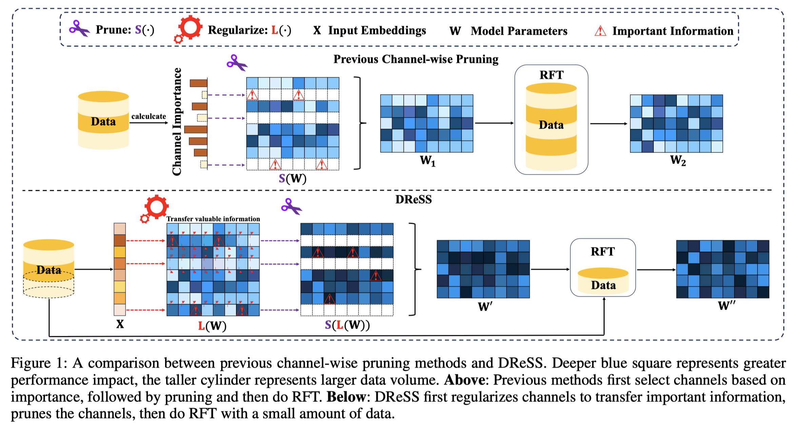 |  |  | [note](./notes/2025/DReSS/note.md) |
| [KeepKV](./meta/2025/KeepKV.prototxt) | [KeepKV: Eliminating Output Perturbation in KV Cache Compression for Efficient LLMs Inference](http://arxiv.org/abs/2504.09936v1) |  |  |  | [note](./notes/2025/KeepKV/note.md) |
| [LeanK](./meta/2025/LeanK.prototxt) | [LeanK: Learnable K Cache Channel Pruning for Efficient Decoding](http://arxiv.org/abs/2508.02215v1) |  |  |  | [note](./notes/2025/LeanK/note.md) |
| [MoBA](./meta/2025/MoBA.prototxt) | [MoBA: Mixture of Block Attention for Long-Context LLMs](http://arxiv.org/abs/2502.13189v1) |  |  |  | [note](./notes/2025/MoBA/note.md) |
| [ReSA](./meta/2025/ReSA.prototxt) | [Rectified Sparse Attention](http://arxiv.org/abs/2506.04108v2) |  |  |  | [note](./notes/2025/ReSA/note.md) |
| [SageAttention3](./meta/2025/SageAttention3.prototxt) | [SageAttention3: Microscaling FP4 Attention for Inference and An Exploration of 8-Bit Training](http://arxiv.org/abs/2505.11594v1) |  |  |  | [note](./notes/2025/SageAttention3/note.md) |
| [SeerAttention-R](./meta/2025/SeerAttention-R.prototxt) | [SeerAttention-R: Sparse Attention Adaptation for Long Reasoning](http://arxiv.org/abs/2506.08889v1) |  |  |  | [note](./notes/2025/SeerAttention-R/note.md) |
| [Super-Experts-Profilling](./meta/2025/Super-Experts-Profilling.prototxt) | [Unveiling Super Experts in Mixture-of-Experts Large Language Models](http://arxiv.org/abs/2507.23279v1) |  |  |  | [note](./notes/2025/Super-Experts-Profilling/note.md) |
| [FlashOverlap](./meta/2026/FlashOverlap.prototxt) | [FlashOverlap: A Lightweight Design for Efficiently Overlapping Communication and Computation](http://arxiv.org/abs/2504.19519v1) |  |  |  | [note](./notes/2026/FlashOverlap/note.md) |

<b>UC Berkeley</b>
 

| Meta | Title | Cover | Publish | Code | Note |
|:-----|:------|:------|:--------|:-----|:-----|
| [ActNN](./meta/2019/actnn.prototxt) | [ActNN: Reducing Training Memory Footprint via 2-Bit Activation Compressed Training](https://arxiv.org/abs/2104.14129) |  |  |  |  |
| [FisherPruning](./meta/2022/fisherpruning.prototxt) | [A Fast Post-Training Pruning Framework for Transformers](http://arxiv.org/abs/2204.09656v2) |  |  |  | [note](./notes/2022/fisherpruning/note.md) |
| [PagedAttention](./meta/2023/PagedAttention.prototxt) | [Efficient Memory Management for Large Language Model Serving with PagedAttention](http://arxiv.org/abs/2309.06180v1) |  |  |  | [note](./notes/2023/PagedAttention/note.md) |
| [LoRA+](./meta/2024/LoRA+.prototxt) | [LoRA+: Efficient Low Rank Adaptation of Large Models](http://arxiv.org/abs/2402.12354v1) |  |  |  | [note](./notes/2024/LoRA+/note.md) |
| [SqueezeLLM](./meta/2024/SqueezeLLM.prototxt) | [SqueezeLLM: Dense-and-Sparse Quantization](http://arxiv.org/abs/2306.07629v4) |  |  |  | [note](./notes/2024/SqueezeLLM/note.md) |
| [SGLang](./meta/2024/SGLang.prototxt) | [SGLang: Efficient Execution of Structured Language Model Programs](http://arxiv.org/abs/2312.07104v2) |  |  |  | [note](./notes/2024/SGLang/note.md) |
| [KVQuant](./meta/2024/KVQuant.prototxt) | [KVQuant: Towards 10 Million Context Length LLM Inference with KV Cache Quantization](http://arxiv.org/abs/2401.18079v2) |  |  |  | [note](./notes/2024/KVQuant/note.md) |
| [DoubleSparsity](./meta/2024/DoubleSparsity.prototxt) | [Post-Training Sparse Attention with Double Sparsity](http://arxiv.org/abs/2408.07092v2) |  |  |  | [note](./notes/2024/DoubleSparsity/note.md) |
| [HashAttention](./meta/2025/HashAttention.prototxt) | [HashAttention: Semantic Sparsity for Faster Inference](https://openreview.net/forum?id=Em2oaXd8Dc) |  |  |  | [note](./notes/2025/HashAttention/note.md) |

<b>UC Santa Barbara</b>
 

| Meta | Title | Cover | Publish | Code | Note |
|:-----|:------|:------|:--------|:-----|:-----|
| [FlexiDepth](./meta/2025/FlexiDepth.prototxt) | [Adaptive Layer-skipping in Pre-trained LLMs](http://arxiv.org/abs/2503.23798v1) |  |  |  | [note](./notes/2025/FlexiDepth/note.md) |
| [IFPruning](./meta/2025/IFPruning.prototxt) | [Instruction-Following Pruning for Large Language Models](http://arxiv.org/abs/2501.02086v2) |  |  |  | [note](./notes/2025/IFPruning/note.md) |
| [KVLink](./meta/2025/KVLink.prototxt) | [KVLink: Accelerating Large Language Models via Efficient KV Cache Reuse](http://arxiv.org/abs/2502.16002v1) |  |  |  | [note](./notes/2025/KVLink/note.md) |

<b>UCSD</b>
 

| Meta | Title | Cover | Publish | Code | Note |
|:-----|:------|:------|:--------|:-----|:-----|
| [GPFQ](./meta/2021/gpfq.prototxt) | [A Greedy Algorithm for Quantizing Neural Networks](https://jmlr.csail.mit.edu/papers/volume22/20-1233/20-1233.pdf) |  |  |  |  |
| [GPFQv2](./meta/2023/gpfqv2.prototxt) | [Post-training Quantization for Neural Networks with Provable Guarantees](https://arxiv.org/pdf/2201.11113.pdf) |  |  |  |  |

<b>Univeristy of Sydney</b>
 

| Meta | Title | Cover | Publish | Code | Note |
|:-----|:------|:------|:--------|:-----|:-----|
| [Flash-LLM](./meta/2024/flash_llm.prototxt) | [Flash-LLM: Enabling Cost-Effective and Highly-Efficient Large Generative Model Inference with Unstructured Sparsity](https://arxiv.org/abs/2309.10285) |  |  |  | [note](./notes/2024/flash_llm/index.md) |

<b>Universidade da Coruña</b>
 

| Meta | Title | Cover | Publish | Code | Note |
|:-----|:------|:------|:--------|:-----|:-----|
| [VENOM](./meta/2023/VENOM.prototxt) | [VENOM: A Vectorized N:M Format for Unleashing the Power of Sparse Tensor Cores](http://arxiv.org/abs/2310.02065v1) |  |  |  | [note](./notes/2023/VENOM/note.md) |

<b>Universidade de Lisboa</b>
 

| Meta | Title | Cover | Publish | Code | Note |
|:-----|:------|:------|:--------|:-----|:-----|
| [AdaSplash](./meta/2025/AdaSplash.prototxt) | [AdaSplash: Adaptive Sparse Flash Attention](http://arxiv.org/abs/2502.12082) |  |  |  | [note](./notes/2025/AdaSplash/note.md) |

<b>University College London</b>
 

| Meta | Title | Cover | Publish | Code | Note |
|:-----|:------|:------|:--------|:-----|:-----|
| [CATS](./meta/2024/CATS.prototxt) | [CATS: Contextually-Aware Thresholding for Sparsity in Large Language Models](http://arxiv.org/abs/2404.08763v4) |  |  |  | [note](./notes/2024/CATS/note.md) |

<b>University of Basel</b>
 

| Meta | Title | Cover | Publish | Code | Note |
|:-----|:------|:------|:--------|:-----|:-----|
| [Adaptively Sparse Attention](./meta/2023/adaptively_sparse_attention.prototxt) | [Dynamic Context Pruning for Efficient and Interpretable Autoregressive Transformers](https://arxiv.org/abs/2305.15805) |  |  |  |  |

<b>University of California</b>
 

| Meta | Title | Cover | Publish | Code | Note |
|:-----|:------|:------|:--------|:-----|:-----|
| [DSA](./meta/2022/DSA.prototxt) | [Transformer Acceleration with Dynamic Sparse Attention](http://arxiv.org/abs/2110.11299v1) | 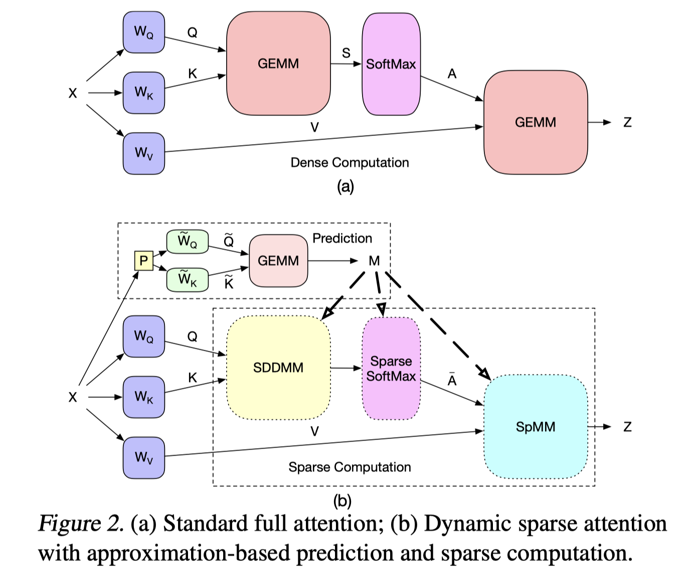 |  |  | [note](./notes/2022/DSA/note.md) |

<b>University of California, Berkeley</b>
 

| Meta | Title | Cover | Publish | Code | Note |
|:-----|:------|:------|:--------|:-----|:-----|
| [H2O](./meta/2023/H2O.prototxt) | [H$_2$O: Heavy-Hitter Oracle for Efficient Generative Inference of Large Language Models](http://arxiv.org/abs/2306.14048) |  |  |  | [note](./notes/2023/H2O/note.md) |
| [APEX](./meta/2024/APEX.prototxt) | [APEX: An Extensible and Dynamism-Aware Simulator for Automated Parallel Execution in LLM Serving](http://arxiv.org/abs/2411.17651v2) |  |  |  | [note](./notes/2024/APEX/note.md) |
| [XGrammar](./meta/2024/XGrammar.prototxt) | [XGrammar: Flexible and Efficient Structured Generation Engine for Large Language Models](http://arxiv.org/abs/2411.15100v2) |  |  |  | [note](./notes/2024/XGrammar/note.md) |
| [SpargeAttn](./meta/2025/SpargeAttn.prototxt) | [SpargeAttn: Accurate Sparse Attention Accelerating Any Model Inference](https://openreview.net/forum?id=74c3Wwk8Tc) |  |  |  | [note](./notes/2025/SpargeAttn/note.md) |

<b>University of California, Riverside</b>
 

| Meta | Title | Cover | Publish | Code | Note |
|:-----|:------|:------|:--------|:-----|:-----|
| [CoCoNet](./meta/2022/CoCoNet.prototxt) | [Breaking the Computation and Communication Abstraction Barrier in Distributed Machine Learning Workloads](http://arxiv.org/abs/2105.05720v5) |  |  |  | [note](./notes/2022/CoCoNet/note.md) |

<b>University of California, San Diego</b>
 

| Meta | Title | Cover | Publish | Code | Note |
|:-----|:------|:------|:--------|:-----|:-----|
| [H2O](./meta/2023/H2O.prototxt) | [H$_2$O: Heavy-Hitter Oracle for Efficient Generative Inference of Large Language Models](http://arxiv.org/abs/2306.14048) |  |  |  | [note](./notes/2023/H2O/note.md) |

<b>University of Cambridge, United Kingdom</b>
 

| Meta | Title | Cover | Publish | Code | Note |
|:-----|:------|:------|:--------|:-----|:-----|
| [TinyTrain](./meta/2024/TinyTrain.prototxt) | [TinyTrain: Resource-Aware Task-Adaptive Sparse Training of DNNs at the Data-Scarce Edge](http://arxiv.org/abs/2307.09988v2) |  |  |  | [note](./notes/2024/TinyTrain/note.md) |

<b>University of Chinese Academy of Sciences</b>
 

| Meta | Title | Cover | Publish | Code | Note |
|:-----|:------|:------|:--------|:-----|:-----|
| [Q-Sparse](./meta/2024/Q-Sparse.prototxt) | [Q-Sparse: All Large Language Models can be Fully Sparsely-Activated](http://arxiv.org/abs/2407.10969v1) |  |  |  | [note](./notes/2024/Q-Sparse/note.md) |
| [COMET](./meta/2025/COMET.prototxt) | [COMET: Towards Partical W4A4KV4 LLMs Serving](http://arxiv.org/abs/2410.12168v1) |  |  |  | [note](./notes/2025/COMET/note.md) |

<b>University of Connecticut</b>
 

| Meta | Title | Cover | Publish | Code | Note |
|:-----|:------|:------|:--------|:-----|:-----|
| [m](./meta/2022/XZBX1Z9G.prototxt) | [Sparse Progressive Distillation: Resolving Overfitting under Pretrain-and-Finetune Paradigm](https://aclanthology.org/2022.acl-long.16/) |  |  |  |  |

<b>University of Edinburgh</b>
 

| Meta | Title | Cover | Publish | Code | Note |
|:-----|:------|:------|:--------|:-----|:-----|
| [sparse-frontier](./meta/2025/sparse-frontier.prototxt) | [The Sparse Frontier: Sparse Attention Trade-offs in Transformer LLMs](http://arxiv.org/abs/2504.17768v1) |  |  |  | [note](./notes/2025/sparse-frontier/note.md) |

<b>University of Electronic Science and Technology of China</b>
 

| Meta | Title | Cover | Publish | Code | Note |
|:-----|:------|:------|:--------|:-----|:-----|
| [BRECQ](./meta/2021/brecq.prototxt) | [BRECQ: Pushing the Limit of Post-Training Quantization by Block Reconstruction](https://openreview.net/pdf?id=POWv6hDd9XH) |  |  |  |  |

<b>University of Hong Kong</b>
 

| Meta | Title | Cover | Publish | Code | Note |
|:-----|:------|:------|:--------|:-----|:-----|
| [SeerAttention](./meta/2024/SeerAttention.prototxt) | [SeerAttention: Learning Intrinsic Sparse Attention in Your LLMs](http://arxiv.org/abs/2410.13276v2) |  |  |  | [note](./notes/2024/SeerAttention/note.md) |

<b>University of Illinois Urbana-Champaign</b>
 

| Meta | Title | Cover | Publish | Code | Note |
|:-----|:------|:------|:--------|:-----|:-----|
| [LISA](./meta/2024/LISA.prototxt) | [LISA: Layerwise Importance Sampling for Memory-Efficient Large Language Model Fine-Tuning](http://arxiv.org/abs/2403.17919v1) |  |  |  | [note](./notes/2024/LISA/note.md) |
| [SnapKV](./meta/2024/SnapKV.prototxt) | [SnapKV: LLM Knows What You are Looking for Before Generation](http://arxiv.org/abs/2404.14469v2) |  |  |  | [note](./notes/2024/SnapKV/note.md) |

<b>University of Macau</b>
 

| Meta | Title | Cover | Publish | Code | Note |
|:-----|:------|:------|:--------|:-----|:-----|
| [Awesome-Efficient-Arch](./meta/2025/Awesome-Efficient-Arch.prototxt) | [Speed Always Wins: A Survey on Efficient Architectures for Large Language Models](http://arxiv.org/abs/2508.09834v1) |  |  |  | [note](./notes/2025/Awesome-Efficient-Arch/note.md) |

<b>University of Maryland</b>
 

| Meta | Title | Cover | Publish | Code | Note |
|:-----|:------|:------|:--------|:-----|:-----|
| [topk-decoding](./meta/2025/topk-decoding.prototxt) | [Exploiting Sparsity for Long Context Inference: Million Token Contexts on Commodity GPUs](http://arxiv.org/abs/2502.06766v2) |  |  |  | [note](./notes/2025/topk-decoding/note.md) |

<b>University of Massachusetts Amherst</b>
 

| Meta | Title | Cover | Publish | Code | Note |
|:-----|:------|:------|:--------|:-----|:-----|
| [CoCoNet](./meta/2022/CoCoNet.prototxt) | [Breaking the Computation and Communication Abstraction Barrier in Distributed Machine Learning Workloads](http://arxiv.org/abs/2105.05720v5) |  |  |  | [note](./notes/2022/CoCoNet/note.md) |

<b>University of Oxford</b>
 

| Meta | Title | Cover | Publish | Code | Note |
|:-----|:------|:------|:--------|:-----|:-----|
| [SMAT](./meta/2024/SMAT.prototxt) | [Unleashing the Power of Meta-tuning for Few-shot Generalization Through Sparse Interpolated Experts](http://arxiv.org/abs/2403.08477v3) |  |  |  | [note](./notes/2024/SMAT/note.md) |

<b>University of Science and Technology</b>
 

| Meta | Title | Cover | Publish | Code | Note |
|:-----|:------|:------|:--------|:-----|:-----|
| [AMALI](./meta/2025/AMALI.prototxt) | [AMALI: An Analytical Model for Accurately Modeling LLM Inference on Modern GPUs](https://dl.acm.org/doi/10.1145/3695053.3731064) |  |  |  | [note](./notes/2025/AMALI/note.md) |

<b>University of Science and Technology of China</b>
 

| Meta | Title | Cover | Publish | Code | Note |
|:-----|:------|:------|:--------|:-----|:-----|
| [AdaKV](./meta/2024/AdaKV.prototxt) | [Ada-KV: Optimizing KV Cache Eviction by Adaptive Budget Allocation for Efficient LLM Inference](http://arxiv.org/abs/2407.11550v3) |  |  |  | [note](./notes/2024/AdaKV/note.md) |
| [AttentionPredictor](./meta/2025/AttentionPredictor.prototxt) | [AttentionPredictor: Temporal Pattern Matters for Efficient LLM Inference](http://arxiv.org/abs/2502.04077v1) |  |  |  | [note](./notes/2025/AttentionPredictor/note.md) |
| [HATA](./meta/2025/HATA.prototxt) | [HATA: Trainable and Hardware-Efficient Hash-Aware Top-k Attention for Scalable Large Model Inference](http://arxiv.org/abs/2506.02572v1) |  |  |  | [note](./notes/2025/HATA/note.md) |

<b>University of Seoul</b>
 

| Meta | Title | Cover | Publish | Code | Note |
|:-----|:------|:------|:--------|:-----|:-----|
| [SparseInfer](./meta/2024/SparseInfer.prototxt) | [SparseInfer: Training-free Prediction of Activation Sparsity for Fast LLM Inference](http://arxiv.org/abs/2411.12692v1) |  |  |  | [note](./notes/2024/SparseInfer/note.md) |

<b>University of Southern California</b>
 

| Meta | Title | Cover | Publish | Code | Note |
|:-----|:------|:------|:--------|:-----|:-----|
| [APEX](./meta/2024/APEX.prototxt) | [APEX: An Extensible and Dynamism-Aware Simulator for Automated Parallel Execution in LLM Serving](http://arxiv.org/abs/2411.17651v2) |  |  |  | [note](./notes/2024/APEX/note.md) |

<b>University of St Andrews</b>
 

| Meta | Title | Cover | Publish | Code | Note |
|:-----|:------|:------|:--------|:-----|:-----|
| [Mosaic](./meta/2025/Mosaic.prototxt) | [Mosaic: Composite Projection Pruning for Resource-efficient LLMs](http://arxiv.org/abs/2504.06323v1) |  |  |  | [note](./notes/2025/Mosaic/note.md) |

<b>University of Surrey</b>
 

| Meta | Title | Cover | Publish | Code | Note |
|:-----|:------|:------|:--------|:-----|:-----|
| [MInference](./meta/2024/MInference.prototxt) | [MInference 1.0: Accelerating Pre-filling for Long-Context LLMs via Dynamic Sparse Attention](http://arxiv.org/abs/2407.02490v1) |  |  |  | [note](./notes/2024/MInference/note.md) |
| [SCBench](./meta/2024/SCBench.prototxt) | [SCBench: A KV Cache-Centric Analysis of Long-Context Methods](http://arxiv.org/abs/2412.10319v2) |  |  |  | [note](./notes/2024/SCBench/note.md) |
| [MMInference](./meta/2025/MMInference.prototxt) | [MMInference: Accelerating Pre-filling for Long-Context VLMs via Modality-Aware Permutation Sparse Attention](https://openreview.net/forum?id=me6PfbATWM) |  |  |  | [note](./notes/2025/MMInference/note.md) |
| [R-KV](./meta/2025/R-KV.prototxt) | [R-KV: Redundancy-aware KV Cache Compression for Training-Free Reasoning Models Acceleration](http://arxiv.org/abs/2505.24133v2) |  |  |  | [note](./notes/2025/R-KV/note.md) |

<b>University of Surrey, UK</b>
 

| Meta | Title | Cover | Publish | Code | Note |
|:-----|:------|:------|:--------|:-----|:-----|
| [Selective Context](./meta/2023/selective_context.prototxt) | [Unlocking Context Constraints of LLMs: Enhancing Context Efficiency of LLMs with Self-Information-Based Content Filtering](https://arxiv.org/abs/2304.12102) |  |  |  |  |

<b>University of Texas at Austin</b>
 

| Meta | Title | Cover | Publish | Code | Note |
|:-----|:------|:------|:--------|:-----|:-----|
| [H2O](./meta/2023/H2O.prototxt) | [H$_2$O: Heavy-Hitter Oracle for Efficient Generative Inference of Large Language Models](http://arxiv.org/abs/2306.14048) |  |  |  | [note](./notes/2023/H2O/note.md) |
| [Essential Sparsity](./meta/2023/EssentialSparsity.prototxt) | [The Emergence of Essential Sparsity in Large Pre-trained Models: The Weights that Matter](https://arxiv.org/abs/2306.03805) |  |  |  |  |
| [LLM-KICK](./meta/2024/VB8C61V6.prototxt) | [Compressing LLMs: The Truth is Rarely Pure and Never Simple](http://arxiv.org/abs/2310.01382v2) |  |  |  | [note](./notes/2024/VB8C61V6/note.md) |
| [OWL](./meta/2024/owl.prototxt) | [Outlier Weighed Layerwise Sparsity (OWL): A Missing Secret Sauce for Pruning LLMs to High Sparsity](https://arxiv.org/pdf/2310.05175.pdf) |  |  |  |  |

<b>University of Toronto</b>
 

| Meta | Title | Cover | Publish | Code | Note |
|:-----|:------|:------|:--------|:-----|:-----|
| [Seesaw](./meta/2025/Seesaw.prototxt) | [Seesaw: High-throughput LLM Inference via Model Re-sharding](http://arxiv.org/abs/2503.06433v1) |  |  |  | [note](./notes/2025/Seesaw/note.md) |

<b>University of Washington</b>
 

| Meta | Title | Cover | Publish | Code | Note |
|:-----|:------|:------|:--------|:-----|:-----|
| [QLoRA](./meta/2023/qlora.prototxt) | [QLoRA: Efficient Finetuning of Quantized LLMs](https://arxiv.org/abs/2305.14314) |  |  |  |  |
| [OWL](./meta/2024/owl.prototxt) | [Outlier Weighed Layerwise Sparsity (OWL): A Missing Secret Sauce for Pruning LLMs to High Sparsity](https://arxiv.org/pdf/2310.05175.pdf) |  |  |  |  |
| [Splitwise](./meta/2024/Splitwise.prototxt) | [Splitwise: Efficient generative LLM inference using phase splitting](http://arxiv.org/abs/2311.18677v2) |  |  |  | [note](./notes/2024/Splitwise/note.md) |
| [SeerAttention](./meta/2024/SeerAttention.prototxt) | [SeerAttention: Learning Intrinsic Sparse Attention in Your LLMs](http://arxiv.org/abs/2410.13276v2) |  |  |  | [note](./notes/2024/SeerAttention/note.md) |
| [NSA](./meta/2025/NSA.prototxt) | [Native Sparse Attention: Hardware-Aligned and Natively Trainable Sparse Attention](http://arxiv.org/abs/2502.11089v1) |  |  |  | [note](./notes/2025/NSA/note.md) |
| [POD-Attention](./meta/2025/POD-Attention.prototxt) | [POD-Attention: Unlocking Full Prefill-Decode Overlap for Faster LLM Inference](http://arxiv.org/abs/2410.18038v2) |  |  |  | [note](./notes/2025/POD-Attention/note.md) |
| [NanoFlow](./meta/2025/NanoFlow.prototxt) | [NanoFlow: Towards Optimal Large Language Model Serving Throughput](http://arxiv.org/abs/2408.12757v2) |  |  |  | [note](./notes/2025/NanoFlow/note.md) |
| [FlashInfer](./meta/2025/FlashInfer.prototxt) | [FlashInfer: Efficient and Customizable Attention Engine for LLM Inference Serving](http://arxiv.org/abs/2501.01005v2) |  |  |  | [note](./notes/2025/FlashInfer/note.md) |

<b>University of Waterloo</b>
 

| Meta | Title | Cover | Publish | Code | Note |
|:-----|:------|:------|:--------|:-----|:-----|
| [EAGLE](./meta/2024/Eagle.prototxt) | [EAGLE: Speculative Sampling Requires Rethinking Feature Uncertainty](http://arxiv.org/abs/2401.15077v2) |  |  |  | [note](./notes/2024/Eagle/note.md) |

<b>University of Wisconsin</b>
 

| Meta | Title | Cover | Publish | Code | Note |
|:-----|:------|:------|:--------|:-----|:-----|
| [R-KV](./meta/2025/R-KV.prototxt) | [R-KV: Redundancy-aware KV Cache Compression for Training-Free Reasoning Models Acceleration](http://arxiv.org/abs/2505.24133v2) |  |  |  | [note](./notes/2025/R-KV/note.md) |

<b>University of Wisconsin-Madison</b>
 

| Meta | Title | Cover | Publish | Code | Note |
|:-----|:------|:------|:--------|:-----|:-----|
| [T3](./meta/2024/T3.prototxt) | [T3: Transparent Tracking & Triggering for Fine-grained Overlap of Compute & Collectives](http://arxiv.org/abs/2401.16677v1) |  |  |  | [note](./notes/2024/T3/note.md) |
| [FrameQuant](./meta/2024/FrameQuant.prototxt) | [FrameQuant: Flexible Low-Bit Quantization for Transformers](http://arxiv.org/abs/2403.06082v1) |  |  |  | [note](./notes/2024/FrameQuant/note.md) |

<b>VITA Group</b>
 

| Meta | Title | Cover | Publish | Code | Note |
|:-----|:------|:------|:--------|:-----|:-----|
| [m](./meta/2023/AYB1XUO5.prototxt) | [Ten Lessons We Have Learned in the New Sparseland: A Short Handbook for Sparse Neural Network Researchers](https://arxiv.org/abs/2302.02596) |  |  |  |  |
| [Essential Sparsity](./meta/2023/EssentialSparsity.prototxt) | [The Emergence of Essential Sparsity in Large Pre-trained Models: The Weights that Matter](https://arxiv.org/abs/2306.03805) |  |  |  |  |

<b>Vector Institute</b>
 

| Meta | Title | Cover | Publish | Code | Note |
|:-----|:------|:------|:--------|:-----|:-----|
| [EAGLE](./meta/2024/Eagle.prototxt) | [EAGLE: Speculative Sampling Requires Rethinking Feature Uncertainty](http://arxiv.org/abs/2401.15077v2) |  |  |  | [note](./notes/2024/Eagle/note.md) |
| [Seesaw](./meta/2025/Seesaw.prototxt) | [Seesaw: High-throughput LLM Inference via Model Re-sharding](http://arxiv.org/abs/2503.06433v1) |  |  |  | [note](./notes/2025/Seesaw/note.md) |

<b>Vizuara AI Labs</b>
 

| Meta | Title | Cover | Publish | Code | Note |
|:-----|:------|:------|:--------|:-----|:-----|
| [MoE-MLA-RoPE](./meta/2025/MoE-MLA-RoPE.prototxt) | [Unifying Mixture of Experts and Multi-Head Latent Attention for Efficient Language Models](http://arxiv.org/abs/2508.01261v1) |  |  |  | [note](./notes/2025/MoE-MLA-RoPE/note.md) |

<b>Vokram Group</b>
 

| Meta | Title | Cover | Publish | Code | Note |
|:-----|:------|:------|:--------|:-----|:-----|
| [52A7RO95](./meta/2025/52A7RO95.prototxt) | [Mixture of Experts in Large Language Models](http://arxiv.org/abs/2507.11181v1) |  |  |  | [note](./notes/2025/52A7RO95/note.md) |

<b>WeChat AI</b>
 

| Meta | Title | Cover | Publish | Code | Note |
|:-----|:------|:------|:--------|:-----|:-----|
| [DBudgetKV](./meta/2025/DBudgetKV.prototxt) | [DBudgetKV: Dynamic Budget in KV Cache Compression for Ensuring Optimal Performance](http://arxiv.org/abs/2502.16886v1) |  |  |  | [note](./notes/2025/DBudgetKV/note.md) |

<b>Wuhan University</b>
 

| Meta | Title | Cover | Publish | Code | Note |
|:-----|:------|:------|:--------|:-----|:-----|
| [m](./meta/2024/JSHWEV0S.prototxt) | [Keep the Cost Down: A Review on Methods to Optimize LLM' s KV-Cache Consumption](http://arxiv.org/abs/2407.18003v3) |  |  |  | [note](./notes/2024/JSHWEV0S/note.md) |
| [SIFT](./meta/2024/SIFT.prototxt) | [Sparse is Enough in Fine-tuning Pre-trained Large Language Models](http://arxiv.org/abs/2312.11875v3) |  |  |  | [note](./notes/2024/SIFT/note.md) |
| [CHESS](./meta/2024/CHESS.prototxt) | [Optimizing LLM Inference via Channel-Wise Thresholding and Selective Sparsification](http://arxiv.org/abs/2409.01366v1) |  |  | [Pytorch](https://anonymous.4open.science/r/CHESS-BA40/README.md) | [note](./notes/2024/CHESS/note.md) |
| [SpindleKV](./meta/2025/SpindleKV.prototxt) | [SpindleKV: A Novel KV Cache Reduction Method Balancing Both Shallow and Deep Layers](http://arxiv.org/abs/2507.06517v1) |  |  |  | [note](./notes/2025/SpindleKV/note.md) |

<b>Xiamen University</b>
 

| Meta | Title | Cover | Publish | Code | Note |
|:-----|:------|:------|:--------|:-----|:-----|
| [Compresso](./meta/2023/Compresso.prototxt) | [Compresso: Structured Pruning with Collaborative Prompting Learns Compact Large Language Models](https://arxiv.org/abs/2310.05015) |  |  |  | [note](./notes/2023/Compresso/note.md) |

<b>Xiaohongshu</b>
 

| Meta | Title | Cover | Publish | Code | Note |
|:-----|:------|:------|:--------|:-----|:-----|
| [ZigZagKV](./meta/2024/ZigZagKV.prototxt) | [ZigZagkv: Dynamic KV Cache Compression for Long-context Modeling based on Layer Uncertainty](http://arxiv.org/abs/2412.09036v1) |  |  |  | [note](./notes/2024/ZigZagKV/note.md) |

<b>Xiaomi</b>
 

| Meta | Title | Cover | Publish | Code | Note |
|:-----|:------|:------|:--------|:-----|:-----|
| [SpindleKV](./meta/2025/SpindleKV.prototxt) | [SpindleKV: A Novel KV Cache Reduction Method Balancing Both Shallow and Deep Layers](http://arxiv.org/abs/2507.06517v1) |  |  |  | [note](./notes/2025/SpindleKV/note.md) |

<b>Yale University</b>
 

| Meta | Title | Cover | Publish | Code | Note |
|:-----|:------|:------|:--------|:-----|:-----|
| [Diffuser](./meta/2023/diffuser.prototxt) | [Diffuser: Efficient Transformers with Multi-hop Attention Diffusion for Long Sequences](https://arxiv.org/abs/2210.11794) |  |  |  |  |

<b>Zhe Jiang University</b>
 

| Meta | Title | Cover | Publish | Code | Note |
|:-----|:------|:------|:--------|:-----|:-----|
| [Deja Vu](./meta/2023/dejavu.prototxt) | [Deja Vu: Contextual Sparsity for Efficient LLMs at Inference Time](https://openreview.net/forum?id=wIPIhHd00i) |  |  |  |  |

<b>Zhejiang University</b>
 

| Meta | Title | Cover | Publish | Code | Note |
|:-----|:------|:------|:--------|:-----|:-----|
| [SharePrefill](./meta/2025/SharePrefill.prototxt) | [Accelerating Prefilling for Long-Context LLMs via Sparse Pattern Sharing](http://arxiv.org/abs/2505.19578v1) |  |  |  | [note](./notes/2025/SharePrefill/note.md) |
| [MoBA](./meta/2025/MoBA.prototxt) | [MoBA: Mixture of Block Attention for Long-Context LLMs](http://arxiv.org/abs/2502.13189v1) |  |  |  | [note](./notes/2025/MoBA/note.md) |

<b>Zhipu.AI</b>
 

| Meta | Title | Cover | Publish | Code | Note |
|:-----|:------|:------|:--------|:-----|:-----|
| [CodeGeeX](./meta/2023/CodeGeeX.prototxt) | [CodeGeeX: A Pre-Trained Model for Code Generation with Multilingual Benchmarking on HumanEval-X](http://arxiv.org/abs/2303.17568v2) |  |  |  | [note](./notes/2023/CodeGeeX/note.md) |
| [SampleAttention](./meta/2024/SampleAttention.prototxt) | [SampleAttention: Near-Lossless Acceleration of Long Context LLM Inference with Adaptive Structured Sparse Attention](http://arxiv.org/abs/2406.15486v2) |  |  |  | [note](./notes/2024/SampleAttention/note.md) |

<b>Zhongguancun Laboratory</b>
 

| Meta | Title | Cover | Publish | Code | Note |
|:-----|:------|:------|:--------|:-----|:-----|
| [SMP](./meta/2023/smp.prototxt) | [Pruning Pre-trained Language Models Without Fine-Tuning](https://aclanthology.org/2023.acl-long.35.pdf) |  |  |  |  |

<b>baidu</b>
 

| Meta | Title | Cover | Publish | Code | Note |
|:-----|:------|:------|:--------|:-----|:-----|
| [FlashMask](./meta/2024/FlashMask.prototxt) | [FlashMask: Efficient and Rich Mask Extension of FlashAttention](http://arxiv.org/abs/2410.01359v1) |  |  |  | [note](./notes/2024/FlashMask/note.md) |

<b>iFLYTEK Research</b>
 

| Meta | Title | Cover | Publish | Code | Note |
|:-----|:------|:------|:--------|:-----|:-----|
| [GRAIN](./meta/2023/grain.prototxt) | [Gradient-based Intra-attention Pruning on Pre-trained Language Models](https://arxiv.org/abs/2212.07634) |  |  |  | [note](./notes/2023/grain/index.md) |

<b>inst1</b>
 

| Meta | Title | Cover | Publish | Code | Note |
|:-----|:------|:------|:--------|:-----|:-----|
| [Sparse-IFT](./meta/2024/Sparse-IFT.prototxt) | [Sparse-IFT: Sparse Iso-FLOP Transformations for Maximizing Training Efficiency](http://arxiv.org/abs/2303.11525v3) |  |  |  | [note](./notes/2024/Sparse-IFT/note.md) |
| [YS9YTT55](./meta/2024/YS9YTT55.prototxt) | [LLM Inference Serving: Survey of Recent Advances and Opportunities](http://arxiv.org/abs/2407.12391v1) |  |  |  | [note](./notes/2024/YS9YTT55/note.md) |
| [CacheBlend](./meta/2025/CacheBlend.prototxt) | [CacheBlend: Fast Large Language Model Serving for RAG with Cached Knowledge Fusion](http://arxiv.org/abs/2405.16444v3) |  |  |  | [note](./notes/2025/CacheBlend/note.md) |
| [AhaKV](./meta/2025/AhaKV.prototxt) | [AhaKV: Adaptive Holistic Attention-Driven KV Cache Eviction for Efficient Inference of Large Language Models](http://arxiv.org/abs/2506.03762v1) |  |  |  | [note](./notes/2025/AhaKV/note.md) |
| [CCQ](./meta/2025/CCQ.prototxt) | [CCQ: Convolutional Code for Extreme Low-bit Quantization in LLMs](http://arxiv.org/abs/2507.07145v1) |  |  |  | [note](./notes/2025/CCQ/note.md) |
| [209M5GA7](./meta/2025/209M5GA7.prototxt) | [KV Cache Compression for Inference Efficiency in LLMs: A Review](http://arxiv.org/abs/2508.06297v1) |  |  |  | [note](./notes/2025/209M5GA7/note.md) |
| [QuickSilver](./meta/2025/QuickSilver.prototxt) | [QuickSilver -- Speeding up LLM Inference through Dynamic Token Halting, KV Skipping, Contextual Token Fusion, and Adaptive Matryoshka Quantization](http://arxiv.org/abs/2506.22396v1) |  |  |  | [note](./notes/2025/QuickSilver/note.md) |
| [RadialAttention](./meta/2025/RadialAttention.prototxt) | [Radial Attention: $O(n\log n)$ Sparse Attention with Energy Decay for Long Video Generation](http://arxiv.org/abs/2506.19852v1) |  |  |  | [note](./notes/2025/RadialAttention/note.md) |

<b>inst2</b>
 

| Meta | Title | Cover | Publish | Code | Note |
|:-----|:------|:------|:--------|:-----|:-----|
| [Flash-Decoding](./meta/2023/FlashDecoding.prototxt) | [Flash-Decoding for long-context inference](https://crfm.stanford.edu/2023/10/12/flashdecoding.html) |  |  |  | [note](./notes/2023/FlashDecoding/note.md) |
| [Sparse-IFT](./meta/2024/Sparse-IFT.prototxt) | [Sparse-IFT: Sparse Iso-FLOP Transformations for Maximizing Training Efficiency](http://arxiv.org/abs/2303.11525v3) |  |  |  | [note](./notes/2024/Sparse-IFT/note.md) |
| [KVQuant](./meta/2024/KVQuant.prototxt) | [KVQuant: Towards 10 Million Context Length LLM Inference with KV Cache Quantization](http://arxiv.org/abs/2401.18079v2) |  |  |  | [note](./notes/2024/KVQuant/note.md) |
| [YS9YTT55](./meta/2024/YS9YTT55.prototxt) | [LLM Inference Serving: Survey of Recent Advances and Opportunities](http://arxiv.org/abs/2407.12391v1) |  |  |  | [note](./notes/2024/YS9YTT55/note.md) |
| [CacheBlend](./meta/2025/CacheBlend.prototxt) | [CacheBlend: Fast Large Language Model Serving for RAG with Cached Knowledge Fusion](http://arxiv.org/abs/2405.16444v3) |  |  |  | [note](./notes/2025/CacheBlend/note.md) |
| [AhaKV](./meta/2025/AhaKV.prototxt) | [AhaKV: Adaptive Holistic Attention-Driven KV Cache Eviction for Efficient Inference of Large Language Models](http://arxiv.org/abs/2506.03762v1) |  |  |  | [note](./notes/2025/AhaKV/note.md) |
| [CCQ](./meta/2025/CCQ.prototxt) | [CCQ: Convolutional Code for Extreme Low-bit Quantization in LLMs](http://arxiv.org/abs/2507.07145v1) |  |  |  | [note](./notes/2025/CCQ/note.md) |
| [209M5GA7](./meta/2025/209M5GA7.prototxt) | [KV Cache Compression for Inference Efficiency in LLMs: A Review](http://arxiv.org/abs/2508.06297v1) |  |  |  | [note](./notes/2025/209M5GA7/note.md) |
| [QuickSilver](./meta/2025/QuickSilver.prototxt) | [QuickSilver -- Speeding up LLM Inference through Dynamic Token Halting, KV Skipping, Contextual Token Fusion, and Adaptive Matryoshka Quantization](http://arxiv.org/abs/2506.22396v1) |  |  |  | [note](./notes/2025/QuickSilver/note.md) |
| [RadialAttention](./meta/2025/RadialAttention.prototxt) | [Radial Attention: $O(n\log n)$ Sparse Attention with Energy Decay for Long Video Generation](http://arxiv.org/abs/2506.19852v1) |  |  |  | [note](./notes/2025/RadialAttention/note.md) |

