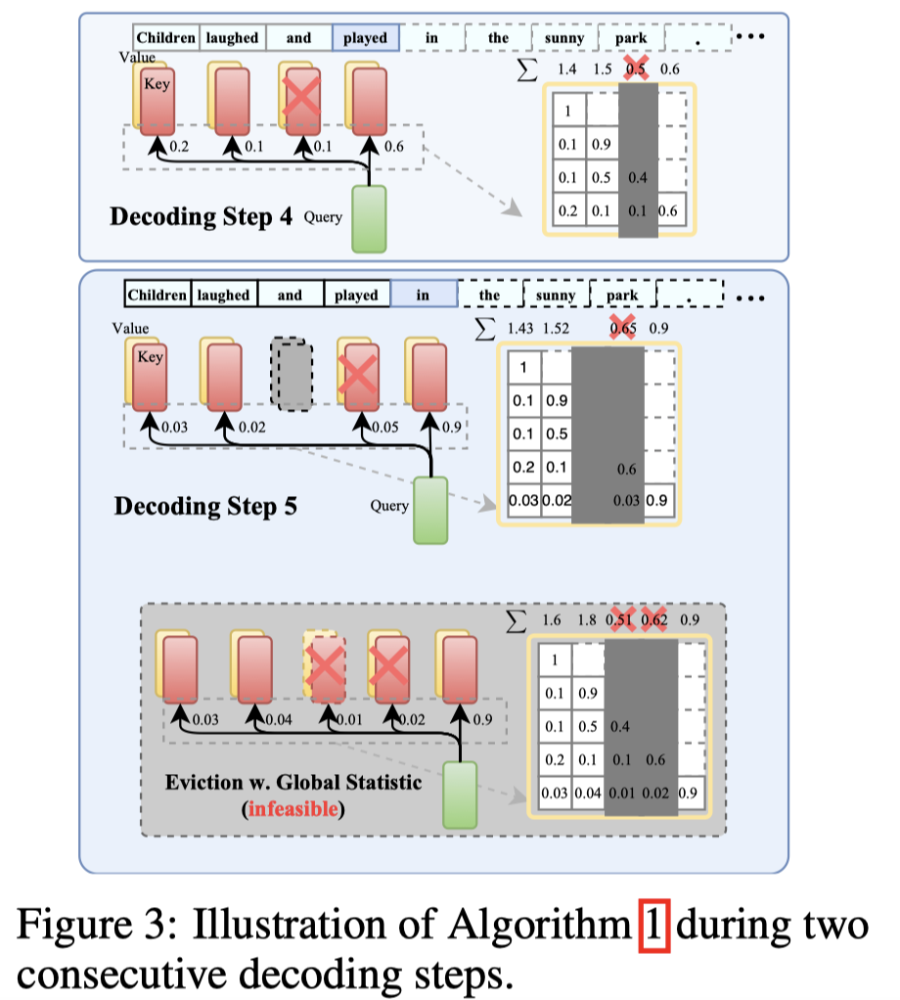
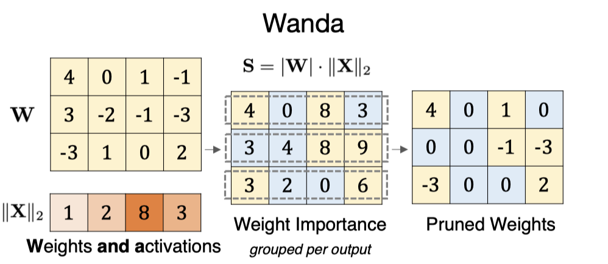
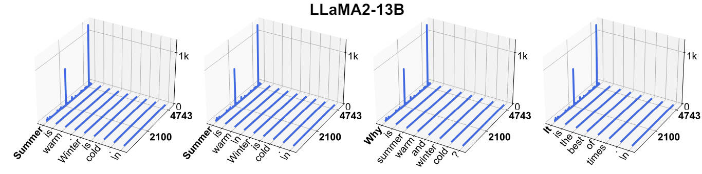

### institution

 

<b>AMD</b>
 

|    | meta                            | ttttttttttttttttttttttttttttttitle                                                                                               | ccccccccccccccccccover                                       | pub   |   year | codeeeee   | note                             |
|---:|:--------------------------------|:---------------------------------------------------------------------------------------------------------------------------------|:-------------------------------------------------------------|:------|-------:|:-----------|:---------------------------------|
|  0 | [SDS](./meta/2024/SDS.prototxt) | [Enhancing One-shot Pruned Pre-trained Language Models through Sparse-Dense-Sparse Mechanism](http://arxiv.org/abs/2408.10473v1) |  | arXiv |   2024 |            | [note](./notes/2024/SDS/note.md) |

<b>AWS AI Labs</b>
 

|    | meta                               | ttttttttttttttttttttttttttttttitle                                                                                       | ccccccccccccccccccover                                                       | pub             |   year | codeeeee                                                                    | note   |
|---:|:-----------------------------------|:-------------------------------------------------------------------------------------------------------------------------|:-----------------------------------------------------------------------------|:----------------|-------:|:----------------------------------------------------------------------------|:-------|
|  0 | [m](./meta/2023/WDCO13S6.prototxt) | [Structural Pruning of Large Language Models via Neural Architecture Search](https://openreview.net/forum?id=SHlZcInS6C) |  | AutoML Workshop |   2023 |  |        |

<b>Alibaba Group</b>
 

|    | meta                                        | ttttttttttttttttttttttttttttttitle                                                                                                                      | ccccccccccccccccccover                                               | pub   |   year | codeeeee                                                                            | note                                    |
|---:|:--------------------------------------------|:--------------------------------------------------------------------------------------------------------------------------------------------------------|:---------------------------------------------------------------------|:------|-------:|:------------------------------------------------------------------------------------|:----------------------------------------|
|  0 | [Flash-LLM](./meta/2024/flash_llm.prototxt) | [Flash-LLM: Enabling Cost-Effective and Highly-Efficient Large Generative Model Inference with Unstructured Sparsity](https://arxiv.org/abs/2309.10285) |  | VLDB  |   2024 |  | [note](./notes/2024/flash_llm/index.md) |

<b>Apple</b>
 

|    | meta                                                  | ttttttttttttttttttttttttttttttitle                                                                              | ccccccccccccccccccover                                                          | pub       |   year | codeeeee                                                                        | note                                        |
|---:|:------------------------------------------------------|:----------------------------------------------------------------------------------------------------------------|:--------------------------------------------------------------------------------|:----------|-------:|:--------------------------------------------------------------------------------|:--------------------------------------------|
|  0 | [LLM in a flash](./meta/2023/LLM_in_a_flash.prototxt) | [LLM in a flash: Efficient Large Language Model Inference with Limited Memory](http://arxiv.org/abs/2312.11514) |      | arXiv     |   2023 |                                                                                 | [note](./notes/2023/LLM_in_a_flash/note.md) |
|  1 | [LLM-KICK](./meta/2024/VB8C61V6.prototxt)             | [Compressing LLMs: The Truth is Rarely Pure and Never Simple](http://arxiv.org/abs/2310.01382v2)                |           | ICLR      |   2024 |    | [note](./notes/2024/VB8C61V6/note.md)       |
|  2 | [ReLU Strikes Back](./meta/2024/HMR7HKFV.prototxt)    | [ReLU Strikes Back: Exploiting Activation Sparsity in Large Language Models](https://arxiv.org/abs/2310.04564)  |  | ICLR oral |   2024 |  |                                             |

<b>Beihang University</b>
 

|    | meta                            | ttttttttttttttttttttttttttttttitle                                                                       | ccccccccccccccccccover                                       | pub   |   year | codeeeee                                                             | note   |
|---:|:--------------------------------|:---------------------------------------------------------------------------------------------------------|:-------------------------------------------------------------|:------|-------:|:---------------------------------------------------------------------|:-------|
|  0 | [SMP](./meta/2023/smp.prototxt) | [Pruning Pre-trained Language Models Without Fine-Tuning](https://aclanthology.org/2023.acl-long.35.pdf) |  | ACL   |   2023 |  |        |

<b>CPII under InnoHK</b>
 

|    | meta                            | ttttttttttttttttttttttttttttttitle                                                                                     | ccccccccccccccccccover                                       | pub   |   year | codeeeee                                                                  | note                             |
|---:|:--------------------------------|:-----------------------------------------------------------------------------------------------------------------------|:-------------------------------------------------------------|:------|-------:|:--------------------------------------------------------------------------|:---------------------------------|
|  0 | [SPP](./meta/2024/SPP.prototxt) | [SPP: Sparsity-Preserved Parameter-Efficient Fine-Tuning for Large Language Models](http://arxiv.org/abs/2405.16057v1) |  | ICML  |   2024 |  | [note](./notes/2024/SPP/note.md) |

<b>Carnegie Mellon University</b>
 

|    | meta                                                | ttttttttttttttttttttttttttttttitle                                                                                         | ccccccccccccccccccover                                                       | pub   |   year | codeeeee                                                                            | note                                       |
|---:|:----------------------------------------------------|:---------------------------------------------------------------------------------------------------------------------------|:-----------------------------------------------------------------------------|:------|-------:|:------------------------------------------------------------------------------------|:-------------------------------------------|
|  0 | [GBLM-Pruner](./meta/2023/GBLM-Pruner.prototxt)     | [Beyond Size: How Gradients Shape Pruning Decisions in Large Language Models](http://arxiv.org/abs/2311.04902v2)           |  | arXiv |   2023 |       | [note](./notes/2023/GBLM-Pruner/note.md)   |
|  1 | [H2O](./meta/2023/H2O.prototxt)                     | [H$_2$O: Heavy-Hitter Oracle for Efficient Generative Inference of Large Language Models](http://arxiv.org/abs/2306.14048) |                  | arXiv |   2023 |            | [note](./notes/2023/H2O/note.md)           |
|  2 | [Wanda](./meta/2024/Wanda.prototxt)                 | [A Simple and Effective Pruning Approach for Large Language Models](http://arxiv.org/abs/2306.11695)                       |              | ICLR  |   2024 |             | [note](./notes/2024/Wanda/note.md)         |
|  3 | [streaming-llm](./meta/2024/streaming-llm.prototxt) | [Efficient Streaming Language Models with Attention Sinks](http://arxiv.org/abs/2309.17453v4)                              |      | ICLR  |   2024 |  | [note](./notes/2024/streaming-llm/note.md) |
|  4 | [Bonsa](./meta/2024/Bonsa.prototxt)                 | [Everybody Prune Now: Structured Pruning of LLMs with only Forward Passes](https://arxiv.org/abs/2402.05406)               |                                                                              | arXiv |   2024 |               |                                            |

<b>Cerebras Systems</b>
 

|    | meta                                          | ttttttttttttttttttttttttttttttitle                                                                                              | ccccccccccccccccccover   | pub   |   year | codeeeee                                                                              | note                                  |
|---:|:----------------------------------------------|:--------------------------------------------------------------------------------------------------------------------------------|:-------------------------|:------|-------:|:--------------------------------------------------------------------------------------|:--------------------------------------|
|  0 | [SPDF](./meta/2023/spdf.prototxt)             | [SPDF: Sparse Pre-training and Dense Fine-tuning for Large Language Models](https://arxiv.org/abs/2303.10464)                   |                          | UAI   |   2023 |                                                                                       |                                       |
|  1 | [Sparse-IFT](./meta/2023/Sparse-IFT.prototxt) | [Sparse Iso-FLOP Transformations for Maximizing Training Efficiency](https://arxiv.org/abs/2303.11525)                          |                          | arXiv |   2023 |  |                                       |
|  2 | [m](./meta/2024/ULY1AZGY.prototxt)            | [Enabling High-Sparsity Foundational Llama Models with Efficient Pretraining and Deployment](http://arxiv.org/abs/2405.03594v1) |                          | arXiv |   2024 |          | [note](./notes/2024/ULY1AZGY/note.md) |

<b>Chongqing University</b>
 

|    | meta                              | ttttttttttttttttttttttttttttttitle                                                       | ccccccccccccccccccover                                         | pub   |   year | codeeeee   | note   |
|---:|:----------------------------------|:-----------------------------------------------------------------------------------------|:---------------------------------------------------------------|:------|-------:|:-----------|:-------|
|  0 | [GBDT](./meta/2023/gbdt.prototxt) | [Pruning Large Language Models via Accuracy Predictor](https://arxiv.org/abs/2309.09507) |  | arXiv |   2023 |            |        |

<b>City University of Hong Kong</b>
 

|    | meta                                | ttttttttttttttttttttttttttttttitle                                                                                       | ccccccccccccccccccover   | pub   |   year | codeeeee                                                          | note                               |
|---:|:------------------------------------|:-------------------------------------------------------------------------------------------------------------------------|:-------------------------|:------|-------:|:------------------------------------------------------------------|:-----------------------------------|
|  0 | [CHESS](./meta/2024/CHESS.prototxt) | [Optimizing LLM Inference via Channel-Wise Thresholding and Selective Sparsification](http://arxiv.org/abs/2409.01366v1) |                          | arXiv |   2024 | [Pytorch](https://anonymous.4open.science/r/CHESS-BA40/README.md) | [note](./notes/2024/CHESS/note.md) |

<b>Comenius University</b>
 

|    | meta                                              | ttttttttttttttttttttttttttttttitle                                                                     | ccccccccccccccccccover   | pub   |   year | codeeeee                                                                            | note                                      |
|---:|:--------------------------------------------------|:-------------------------------------------------------------------------------------------------------|:-------------------------|:------|-------:|:------------------------------------------------------------------------------------|:------------------------------------------|
|  0 | [ADMM-pruning](./meta/2024/ADMM-pruning.prototxt) | [Fast and Effective Weight Update for Pruned Large Language Models](http://arxiv.org/abs/2401.02938v2) |                          | TMLR  |   2024 |  | [note](./notes/2024/ADMM-pruning/note.md) |

<b>Cornell University</b>
 

|    | meta                                                      | ttttttttttttttttttttttttttttttitle                                                                            | ccccccccccccccccccover                                                   | pub     |   year | codeeeee                                                                                     | note                                   |
|---:|:----------------------------------------------------------|:--------------------------------------------------------------------------------------------------------------|:-------------------------------------------------------------------------|:--------|-------:|:---------------------------------------------------------------------------------------------|:---------------------------------------|
|  0 | [Movement Pruning](./meta/2020/movement_pruning.prototxt) | [Movement Pruning: Adaptive Sparsity by Fine-Tuning](https://arxiv.org/abs/2005.07683)                        |  | NeurIPS |   2020 |  |                                        |
|  1 | [QuIP](./meta/2023/QuIP.prototxt)                         | [QuIP: Quantization with Incoherence Processing](https://arxiv.org/pdf/2307.13304.pdf)                        |                                                                          | arXiv   |   2023 |                     |                                        |
|  2 | [ShadowLLM](./meta/2024/ShadowLLM.prototxt)               | [ShadowLLM: Predictor-based Contextual Sparsity for Large Language Models](http://arxiv.org/abs/2406.16635v1) |  | arXiv   |   2024 |          | [note](./notes/2024/ShadowLLM/note.md) |

<b>DENSO IT Lab</b>
 

|    | meta                            | ttttttttttttttttttttttttttttttitle                                                     | ccccccccccccccccccover                                       | pub   |   year | codeeeee                                                                  | note                             |
|---:|:--------------------------------|:---------------------------------------------------------------------------------------|:-------------------------------------------------------------|:------|-------:|:--------------------------------------------------------------------------|:---------------------------------|
|  0 | [SAS](./meta/2024/SAS.prototxt) | [SAS: Structured Activation Spasification](https://openreview.net/forum?id=vZfi5to2Xl) |  | ICLR  |   2024 |  | [note](./notes/2024/SAS/note.md) |

<b>DeepMind</b>
 

|    | meta                               | ttttttttttttttttttttttttttttttitle                                                                                            | ccccccccccccccccccover   | pub   |   year | codeeeee                                                                        | note   |
|---:|:-----------------------------------|:------------------------------------------------------------------------------------------------------------------------------|:-------------------------|:------|-------:|:--------------------------------------------------------------------------------|:-------|
|  0 | [m](./meta/2020/2AL79IUH.prototxt) | [Fast Sparse ConvNets](https://openaccess.thecvf.com/content_CVPR_2020/papers/Elsen_Fast_Sparse_ConvNets_CVPR_2020_paper.pdf) |                          | CVPR  |   2020 |  |        |

<b>ETH Zurich</b>
 

|    | meta                                      | ttttttttttttttttttttttttttttttitle                                                                         | ccccccccccccccccccover                                                 | pub   |   year | codeeeee                                                                                   | note                                  |
|---:|:------------------------------------------|:-----------------------------------------------------------------------------------------------------------|:-----------------------------------------------------------------------|:------|-------:|:-------------------------------------------------------------------------------------------|:--------------------------------------|
|  0 | [SliceGPT](./meta/2024/SliceGPT.prototxt) | [SliceGPT: Compress Large Language Models by Deleting Rows and Columns](http://arxiv.org/abs/2401.15024v2) |  | ICLR  |   2024 |  | [note](./notes/2024/SliceGPT/note.md) |

<b>ETH Zürich</b>
 

|    | meta                                | ttttttttttttttttttttttttttttttitle                                                                                  | ccccccccccccccccccover                                         | pub   |   year | codeeeee                                                                | note                               |
|---:|:------------------------------------|:--------------------------------------------------------------------------------------------------------------------|:---------------------------------------------------------------|:------|-------:|:------------------------------------------------------------------------|:-----------------------------------|
|  0 | [VENOM](./meta/2023/VENOM.prototxt) | [VENOM: A Vectorized N:M Format for Unleashing the Power of Sparse Tensor Cores](http://arxiv.org/abs/2310.02065v1) |  | SC    |   2023 |  | [note](./notes/2023/VENOM/note.md) |

<b>Eindhoven University of Technology</b>
 

|    | meta                            | ttttttttttttttttttttttttttttttitle                                                                                                         | ccccccccccccccccccover                                         | pub   |   year | codeeeee                                                             | note   |
|---:|:--------------------------------|:-------------------------------------------------------------------------------------------------------------------------------------------|:---------------------------------------------------------------|:------|-------:|:---------------------------------------------------------------------|:-------|
|  0 | [OWL](./meta/2024/owl.prototxt) | [Outlier Weighed Layerwise Sparsity (OWL): A Missing Secret Sauce for Pruning LLMs to High Sparsity](https://arxiv.org/pdf/2310.05175.pdf) |  | ICML  |   2024 |  |        |

<b>Emory University</b>
 

|    | meta                                        | ttttttttttttttttttttttttttttttitle                                                                     | ccccccccccccccccccover   | pub     |   year | codeeeee                                                                       | note                                   |
|---:|:--------------------------------------------|:-------------------------------------------------------------------------------------------------------|:-------------------------|:--------|-------:|:-------------------------------------------------------------------------------|:---------------------------------------|
|  0 | [SparseLLM](./meta/2024/SparseLLM.prototxt) | [SparseLLM: Towards Global Pruning for Pre-trained Language Models](http://arxiv.org/abs/2402.17946v3) |                          | NeurIPS |   2024 |  | [note](./notes/2024/SparseLLM/note.md) |

<b>FAIR</b>
 

|    | meta                              | ttttttttttttttttttttttttttttttitle                                     | ccccccccccccccccccover                                         | pub   |   year | codeeeee                                                                        | note                              |
|---:|:----------------------------------|:-----------------------------------------------------------------------|:---------------------------------------------------------------|:------|-------:|:--------------------------------------------------------------------------------|:----------------------------------|
|  0 | [TOVA](./meta/2024/TOVA.prototxt) | [Transformers are Multi-State RNNs](http://arxiv.org/abs/2401.06104v2) |  | arXiv |   2024 |  | [note](./notes/2024/TOVA/note.md) |

<b>Gaoling School of Artificial Intelligence, Renmin University of China</b>
 

|    | meta                               | ttttttttttttttttttttttttttttttitle                                                          | ccccccccccccccccccover                                                     | pub   |   year | codeeeee   | note   |
|---:|:-----------------------------------|:--------------------------------------------------------------------------------------------|:---------------------------------------------------------------------------|:------|-------:|:-----------|:-------|
|  0 | [m](./meta/2023/L5D7520E.prototxt) | [A Survey on Model Compression for Large Language Models](https://arxiv.org/abs/2308.07633) |  | arXiv |   2023 |            |        |

<b>Georgia Institute of Technology</b>
 

|    | meta                                    | ttttttttttttttttttttttttttttttitle                                                                              | ccccccccccccccccccover                                               | pub   |   year | codeeeee                                                                      | note                               |
|---:|:----------------------------------------|:----------------------------------------------------------------------------------------------------------------|:---------------------------------------------------------------------|:------|-------:|:------------------------------------------------------------------------------|:-----------------------------------|
|  0 | [AdaLoRA](./meta/2023/adalora.prototxt) | [AdaLoRA: Adaptive Budget Allocation for Parameter-Efficient Fine-Tuning](https://arxiv.org/pdf/2303.10512.pdf) |  | ICLR  |   2023 |  |                                    |
|  1 | [LoftQ](./meta/2023/loftq.prototxt)     | [LoftQ: LoRA-Fine-Tuning-Aware Quantization for Large Language Models](https://arxiv.org/abs/2310.08659)        |      | arXiv |   2023 |       | [note](./notes/2023/loftq/note.md) |

<b>Google</b>
 

|    | meta                                        | ttttttttttttttttttttttttttttttitle                                                                                             | ccccccccccccccccccover                                                   | pub   |   year | codeeeee                                                                             | note                                   |
|---:|:--------------------------------------------|:-------------------------------------------------------------------------------------------------------------------------------|:-------------------------------------------------------------------------|:------|-------:|:-------------------------------------------------------------------------------------|:---------------------------------------|
|  0 | [m](./meta/2020/2AL79IUH.prototxt)          | [Fast Sparse ConvNets](https://openaccess.thecvf.com/content_CVPR_2020/papers/Elsen_Fast_Sparse_ConvNets_CVPR_2020_paper.pdf)  |                                                                          | CVPR  |   2020 |       |                                        |
|  1 | [Sprint](./meta/2022/Sprint.prototxt)       | [Sparse Attention Acceleration with Synergistic In-Memory Pruning and On-Chip Recomputation](https://arxiv.org/abs/2209.00606) |                                                                          | MICRO |   2022 |                                                                                      |                                        |
|  2 | [m](./meta/2023/WMMGA0AR.prototxt)          | [The Lazy Neuron Phenomenon: On Emergence of Activation Sparsity in Transformers](https://openreview.net/forum?id=TJ2nxciYCk-) |                                                                          | ICLR  |   2023 |                                                                                      |                                        |
|  3 | [KCM](./meta/2023/kcm.prototxt)             | [Gradient-Free Structured Pruning with Unlabeled Data](https://arxiv.org/abs/2303.04185)                                       |              | arXiv |   2023 |                                                                                      |                                        |
|  4 | [ShadowLLM](./meta/2024/ShadowLLM.prototxt) | [ShadowLLM: Predictor-based Contextual Sparsity for Large Language Models](http://arxiv.org/abs/2406.16635v1)                  |  | arXiv |   2024 |  | [note](./notes/2024/ShadowLLM/note.md) |

<b>Google DeepMind</b>
 

|    | meta                            | ttttttttttttttttttttttttttttttitle                                                                                          | ccccccccccccccccccover                                       | pub   |   year | codeeeee   | note                             |
|---:|:--------------------------------|:----------------------------------------------------------------------------------------------------------------------------|:-------------------------------------------------------------|:------|-------:|:-----------|:---------------------------------|
|  0 | [MoD](./meta/2024/MoD.prototxt) | [Mixture-of-Depths: Dynamically allocating compute in transformer-based language models](http://arxiv.org/abs/2404.02258v1) |  | arXiv |   2024 |            | [note](./notes/2024/MoD/note.md) |

<b>Google Research</b>
 

|    | meta                                          | ttttttttttttttttttttttttttttttitle                                                                                                         | ccccccccccccccccccover                                                     | pub   |   year | codeeeee                                                                          | note                                    |
|---:|:----------------------------------------------|:-------------------------------------------------------------------------------------------------------------------------------------------|:---------------------------------------------------------------------------|:------|-------:|:----------------------------------------------------------------------------------|:----------------------------------------|
|  0 | [FrameQuant](./meta/2024/FrameQuant.prototxt) | [FrameQuant: Flexible Low-Bit Quantization for Transformers](http://arxiv.org/abs/2403.06082v1)                                            |  | ICML  |   2024 |  | [note](./notes/2024/FrameQuant/note.md) |
|  1 | [OSSCAR](./meta/2024/OSSCAR.prototxt)         | [OSSCAR: One-Shot Structured Pruning in Vision and Language Models with Combinatorial Optimization](http://arxiv.org/abs/2403.12983v1)     |                                                                            | ICML  |   2024 |      | [note](./notes/2024/OSSCAR/note.md)     |
|  2 | [OWL](./meta/2024/owl.prototxt)               | [Outlier Weighed Layerwise Sparsity (OWL): A Missing Secret Sauce for Pruning LLMs to High Sparsity](https://arxiv.org/pdf/2310.05175.pdf) |              | ICML  |   2024 |               |                                         |
|  3 | [Bonsa](./meta/2024/Bonsa.prototxt)           | [Everybody Prune Now: Structured Pruning of LLMs with only Forward Passes](https://arxiv.org/abs/2402.05406)                               |                                                                            | arXiv |   2024 |             |                                         |

<b>Graphcore Research</b>
 

|    | meta                                | ttttttttttttttttttttttttttttttitle                                                      | ccccccccccccccccccover   | pub   |   year | codeeeee   | note                               |
|---:|:------------------------------------|:----------------------------------------------------------------------------------------|:-------------------------|:------|-------:|:-----------|:-----------------------------------|
|  0 | [SparQ](./meta/2024/SparQ.prototxt) | [SparQ Attention: Bandwidth-Efficient LLM Inference](http://arxiv.org/abs/2312.04985v5) |                          | ICML  |   2024 |            | [note](./notes/2024/SparQ/note.md) |

<b>Habana Labs</b>
 

|    | meta                              | ttttttttttttttttttttttttttttttitle                                                                           | ccccccccccccccccccover   | pub   |   year | codeeeee   | note   |
|---:|:----------------------------------|:-------------------------------------------------------------------------------------------------------------|:-------------------------|:------|-------:|:-----------|:-------|
|  0 | [MVUE](./meta/2023/MVUE.prototxt) | [Minimum Variance Unbiased N:M Sparsity for the Neural Gradients](https://openreview.net/pdf?id=vuD2xEtxZcj) |                          | ICLR  |   2023 |            |        |

<b>Harbin Institute of Technology</b>
 

|    | meta                                          | ttttttttttttttttttttttttttttttitle                                                                        | ccccccccccccccccccover                                                     | pub   |   year | codeeeee                                                                     | note                                |
|---:|:----------------------------------------------|:----------------------------------------------------------------------------------------------------------|:---------------------------------------------------------------------------|:------|-------:|:-----------------------------------------------------------------------------|:------------------------------------|
|  0 | [TextPruner](./meta/2022/TextPruner.prototxt) | [TextPruner: A Model Pruning Toolkit for Pre-Trained Language Models](https://arxiv.org/abs/2203.15996)   |  | ACL   |   2022 |  |                                     |
|  1 | [GRAIN](./meta/2023/grain.prototxt)           | [Gradient-based Intra-attention Pruning on Pre-trained Language Models](https://arxiv.org/abs/2212.07634) |            | ACL   |   2023 |       | [note](./notes/2023/grain/index.md) |

<b>Houmo AI</b>
 

|    | meta                              | ttttttttttttttttttttttttttttttitle                                                                               | ccccccccccccccccccover   | pub   |   year | codeeeee                                                                    | note            |
|---:|:----------------------------------|:-----------------------------------------------------------------------------------------------------------------|:-------------------------|:------|-------:|:----------------------------------------------------------------------------|:----------------|
|  0 | [RPTQ](./meta/2023/RPTQ.prototxt) | [RPTQ: Reorder-based Post-training Quantization for Large Language Models](https://arxiv.org/pdf/2304.01089.pdf) |                          | arXiv |   2023 |  | [note](note.md) |

<b>Huawei</b>
 

|    | meta                                    | ttttttttttttttttttttttttttttttitle                                                                           | ccccccccccccccccccover                                              | pub   |   year | codeeeee                                                                      | note                                 |
|---:|:----------------------------------------|:-------------------------------------------------------------------------------------------------------------|:--------------------------------------------------------------------|:------|-------:|:------------------------------------------------------------------------------|:-------------------------------------|
|  0 | [QA-LoRA](./meta/2024/QA-LoRA.prototxt) | [QA-LoRA: Quantization-Aware Low-Rank Adaptation of Large Language Models](https://arxiv.org/abs/2309.14717) |  | ICLR  |   2024 |  | [note](./notes/2024/QA-LoRA/note.md) |

<b>Huawei Noah's Ark Lab</b>
 

|    | meta                                  | ttttttttttttttttttttttttttttttitle                                                                                               | ccccccccccccccccccover                                            | pub          |   year | codeeeee                                                                                                                    | note                                 |
|---:|:--------------------------------------|:---------------------------------------------------------------------------------------------------------------------------------|:------------------------------------------------------------------|:-------------|-------:|:----------------------------------------------------------------------------------------------------------------------------|:-------------------------------------|
|  0 | [SIMPLE](./meta/2023/simple.prototxt) | [Structured Pruning for Efficient Generative Pre-trained Language Models](https://aclanthology.org/2023.findings-acl.692.pdf)    |  | ACL Findings |   2023 |                                                                                                                             | [note](./notes/2023/simple/index.md) |
|  1 | [RIA](./meta/2024/IA8CS3VH.prototxt)  | [Plug-and-Play: An Efficient Post-training Pruning Method for Large Language Models](https://openreview.net/forum?id=Tr0lPx9woF) |  | ICLR         |   2024 |  |                                      |

<b>Huawei Technologies</b>
 

|    | meta                                | ttttttttttttttttttttttttttttttitle                                                                         | ccccccccccccccccccover                                           | pub   |   year | codeeeee                                                               | note                               |
|---:|:------------------------------------|:-----------------------------------------------------------------------------------------------------------|:-----------------------------------------------------------------|:------|-------:|:-----------------------------------------------------------------------|:-----------------------------------|
|  0 | [DSnoT](./meta/2024/DSnoT.prototxt) | [Dynamic Sparse No Training: Training-Free Fine-tuning for Sparse LLMs](http://arxiv.org/abs/2310.08915v3) |  | ICLR  |   2024 |  | [note](./notes/2024/DSnoT/note.md) |

<b>Hugging Face</b>
 

|    | meta                                                      | ttttttttttttttttttttttttttttttitle                                                     | ccccccccccccccccccover                                                   | pub     |   year | codeeeee                                                                                     | note   |
|---:|:----------------------------------------------------------|:---------------------------------------------------------------------------------------|:-------------------------------------------------------------------------|:--------|-------:|:---------------------------------------------------------------------------------------------|:-------|
|  0 | [Movement Pruning](./meta/2020/movement_pruning.prototxt) | [Movement Pruning: Adaptive Sparsity by Fine-Tuning](https://arxiv.org/abs/2005.07683) |  | NeurIPS |   2020 |  |        |

<b>IST</b>
 

|    | meta                               | ttttttttttttttttttttttttttttttitle                                                              | ccccccccccccccccccover                                                   | pub   |   year | codeeeee   | note   |
|---:|:-----------------------------------|:------------------------------------------------------------------------------------------------|:-------------------------------------------------------------------------|:------|-------:|:-----------|:-------|
|  0 | [m](./meta/2023/68I8KKBV.prototxt) | [Efficient Methods for Natural Language Processing: A Survey](https://arxiv.org/abs/2209.00099) |  | TACL  |   2023 |            |        |

<b>IST Austria</b>
 

|    | meta                                          | ttttttttttttttttttttttttttttttitle                                                                                                        | ccccccccccccccccccover                                                | pub     |   year | codeeeee                                                                              | note                                  |
|---:|:----------------------------------------------|:------------------------------------------------------------------------------------------------------------------------------------------|:----------------------------------------------------------------------|:--------|-------:|:--------------------------------------------------------------------------------------|:--------------------------------------|
|  0 | [m](./meta/2020/V3MFIRLV.prototxt)            | [Inducing and Exploiting Activation Sparsity for Fast Neural Network Inference](http://proceedings.mlr.press/v119/kurtz20a/kurtz20a.pdf)  |                                                                       | ICML    |   2020 |                                                                                       |                                       |
|  1 | [m](./meta/2021/ITZS3TU3.prototxt)            | [Sparsity in Deep Learning: Pruning and growth for efficient inference and training in neural networks](https://arxiv.org/abs/2102.00554) |                                                                       | arXiv   |   2021 |                                                                                       |                                       |
|  2 | [SPDY](./meta/2022/spdy.prototxt)             | [SPDY: Accurate Pruning with Speedup Guarantees](https://arxiv.org/abs/2201.13096)                                                        |        | ICML    |   2022 |              | [note](./notes/2022/spdy/index.md)    |
|  3 | [OBC](./meta/2022/obc.prototxt)               | [Optimal Brain Compression: A Framework for Accurate Post-Training Quantization and Pruning](https://openreview.net/pdf?id=ksVGCOlOEba)   |                                                                       | NeurIPS |   2022 |               |                                       |
|  4 | [oBERT](./meta/2022/oBERT.prototxt)           | [The Optimal BERT Surgeon: Scalable and Accurate Second-Order Pruning for Large Language Models](https://arxiv.org/pdf/2203.07259.pdf)    |                                                                       | arXiv   |   2022 |         |                                       |
|  5 | [GPTQ](./meta/2023/gptq.prototxt)             | [GPTQ: Accurate Post-Training Quantization for Generative Pre-trained Transformers](https://arxiv.org/pdf/2210.17323.pdf)                 |                                                                       | ICLR    |   2023 |              |                                       |
|  6 | [SparseGPT](./meta/2023/sparsegpt.prototxt)   | [SparseGPT: Massive Language Models Can be Accurately Pruned in one-shot.](https://arxiv.org/pdf/2301.00774.pdf)                          |                                                                       | ICML    |   2023 |         |                                       |
|  7 | [ZipLM](./meta/2023/ZipLM.prototxt)           | [ZipLM: Inference-Aware Structured Pruning of Language Models](https://openreview.net/pdf?id=bPFFPueAxm)                                  |       | NeurIPS |   2023 |             |                                       |
|  8 | [SpQR](./meta/2023/spqr.prototxt)             | [SpQR: A Sparse-Quantized Representation for Near-Lossless LLM Weight Compression](https://arxiv.org/pdf/2306.03078.pdf)                  |                                                                       | arXiv   |   2023 |                |                                       |
|  9 | [SquareHead](./meta/2023/SquareHead.prototxt) | [Sparse Fine-tuning for Inference Acceleration of Large Language Models](https://arxiv.org/pdf/2310.06927.pdf)                            |  | arXiv   |   2023 |  |                                       |
| 10 | [m](./meta/2024/ULY1AZGY.prototxt)            | [Enabling High-Sparsity Foundational Llama Models with Efficient Pretraining and Deployment](http://arxiv.org/abs/2405.03594v1)           |                                                                       | arXiv   |   2024 |          | [note](./notes/2024/ULY1AZGY/note.md) |

<b>Institute of Automation, Chinese Academy of Sciences</b>
 

|    | meta                                 | ttttttttttttttttttttttttttttttitle                                                                                               | ccccccccccccccccccover                                            | pub   |   year | codeeeee                                                                                                                    | note                                                                  |
|---:|:-------------------------------------|:---------------------------------------------------------------------------------------------------------------------------------|:------------------------------------------------------------------|:------|-------:|:----------------------------------------------------------------------------------------------------------------------------|:----------------------------------------------------------------------|
|  0 | [FLAP](./meta/2024/flap.prototxt)    | [Fluctuation-based Adaptive Structured Pruning for Large Language Models](https://arxiv.org/abs/2312.11983)                      |           | AAAI  |   2024 |                                                 | [note](https://z6oqkldvmo.feishu.cn/docx/JFFQdAxz3oWX2Kx6j91c2kamnqd) |
|  1 | [RIA](./meta/2024/IA8CS3VH.prototxt) | [Plug-and-Play: An Efficient Post-training Pruning Method for Large Language Models](https://openreview.net/forum?id=Tr0lPx9woF) |  | ICLR  |   2024 |  |                                                                       |

<b>Institute of Computing Technology, Chinese Academy of Sciences</b>
 

|    | meta                                        | ttttttttttttttttttttttttttttttitle                                                                                                  | ccccccccccccccccccover                                                   | pub   |   year | codeeeee                                                                                       | note                                   |
|---:|:--------------------------------------------|:------------------------------------------------------------------------------------------------------------------------------------|:-------------------------------------------------------------------------|:------|-------:|:-----------------------------------------------------------------------------------------------|:---------------------------------------|
|  0 | [ProSparse](./meta/2024/ProSparse.prototxt) | [ProSparse: Introducing and Enhancing Intrinsic Activation Sparsity within Large Language Models](https://arxiv.org/abs/2402.13516) |  | arXiv |   2024 |  | [note](./notes/2024/ProSparse/note.md) |

<b>Institute of Information Engineering, Chinese Academy of Sciences</b>
 

|    | meta                               | ttttttttttttttttttttttttttttttitle                                                          | ccccccccccccccccccover                                                     | pub   |   year | codeeeee   | note   |
|---:|:-----------------------------------|:--------------------------------------------------------------------------------------------|:---------------------------------------------------------------------------|:------|-------:|:-----------|:-------|
|  0 | [m](./meta/2023/L5D7520E.prototxt) | [A Survey on Model Compression for Large Language Models](https://arxiv.org/abs/2308.07633) |  | arXiv |   2023 |            |        |

<b>Intel Corporation</b>
 

|    | meta                                      | ttttttttttttttttttttttttttttttitle                                                                                                                                                                                                       | ccccccccccccccccccover   | pub           |   year | codeeeee   | note   |
|---:|:------------------------------------------|:-----------------------------------------------------------------------------------------------------------------------------------------------------------------------------------------------------------------------------------------|:-------------------------|:--------------|-------:|:-----------|:-------|
|  0 | [OpenVINO](./meta/2021/OpenVINO.prototxt) | [Post-training deep neural network pruning via layer-wise calibration](https://openaccess.thecvf.com/content/ICCV2021W/LPCV/papers/Lazarevich_Post-Training_Deep_Neural_Network_Pruning_via_Layer-Wise_Calibration_ICCVW_2021_paper.pdf) |                          | ICCV workshop |   2021 |            |        |

<b>Key Laboratory of Multimedia Trusted Perception and Efficient Computing</b>
 

|    | meta                                | ttttttttttttttttttttttttttttttitle                                                                         | ccccccccccccccccccover                                           | pub   |   year | codeeeee                                                               | note                               |
|---:|:------------------------------------|:-----------------------------------------------------------------------------------------------------------|:-----------------------------------------------------------------|:------|-------:|:-----------------------------------------------------------------------|:-----------------------------------|
|  0 | [DSnoT](./meta/2024/DSnoT.prototxt) | [Dynamic Sparse No Training: Training-Free Fine-tuning for Sparse LLMs](http://arxiv.org/abs/2310.08915v3) |  | ICLR  |   2024 |  | [note](./notes/2024/DSnoT/note.md) |

<b>MBZUAI</b>
 

|    | meta                                | ttttttttttttttttttttttttttttttitle                                                                                       | ccccccccccccccccccover   | pub   |   year | codeeeee                                                          | note                               |
|---:|:------------------------------------|:-------------------------------------------------------------------------------------------------------------------------|:-------------------------|:------|-------:|:------------------------------------------------------------------|:-----------------------------------|
|  0 | [CHESS](./meta/2024/CHESS.prototxt) | [Optimizing LLM Inference via Channel-Wise Thresholding and Selective Sparsification](http://arxiv.org/abs/2409.01366v1) |                          | arXiv |   2024 | [Pytorch](https://anonymous.4open.science/r/CHESS-BA40/README.md) | [note](./notes/2024/CHESS/note.md) |

<b>MIT</b>
 

|    | meta                                              | ttttttttttttttttttttttttttttttitle                                                                                                                                           | ccccccccccccccccccover                                                   | pub           |   year | codeeeee                                                                          | note                                    |
|---:|:--------------------------------------------------|:-----------------------------------------------------------------------------------------------------------------------------------------------------------------------------|:-------------------------------------------------------------------------|:--------------|-------:|:----------------------------------------------------------------------------------|:----------------------------------------|
|  0 | [SparseViT](./meta/2023/SparseViT.prototxt)       | [SparseViT: Revisiting Activation Sparsity for Efficient High-Resolution Vision Transformer](https://arxiv.org/abs/2303.17605)                                               |  | CVPR          |   2023 |    | [note](./notes/2023/sparsevit/index.md) |
|  1 | [TorchSparse++](./meta/2023/TorchSparse.prototxt) | [TorchSparse++: Efficient Point Cloud Engine](https://openaccess.thecvf.com/content/CVPR2023W/WAD/papers/Tang_TorchSparse_Efficient_Point_Cloud_Engine_CVPRW_2023_paper.pdf) |                                                                          | CVPR workshop |   2023 |  |                                         |
|  2 | [AWQ](./meta/2023/awq.prototxt)                   | [AWQ: Activation-aware Weight Quantization for LLM Compression and Acceleration](https://arxiv.org/abs/2306.00978)                                                           |                                                                          | arXiv         |   2023 |      |                                         |
|  3 | [Quest](./meta/2024/Quest.prototxt)               | [Quest: Query-Aware Sparsity for Efficient Long-Context LLM Inference](http://arxiv.org/abs/2406.10774)                                                                      |          | ICML          |   2024 |        | [note](./notes/2024/Quest/note.md)      |
|  4 | [QServe](./meta/2024/QServer.prototxt)            | [QServe: W4A8KV4 Quantization and System Co-design for Efficient LLM Serving](http://arxiv.org/abs/2405.04532v2)                                                             |                                                                          | arXiv         |   2024 | [Pytorch](https://hanlab.mit.edu/projects/qserve)                                 | [note](./notes/2024/QServer/note.md)    |

<b>Massachusetts Institute of Technology</b>
 

|    | meta                                                | ttttttttttttttttttttttttttttttitle                                                                                                     | ccccccccccccccccccover                                                   | pub   |   year | codeeeee                                                                            | note                                       |
|---:|:----------------------------------------------------|:---------------------------------------------------------------------------------------------------------------------------------------|:-------------------------------------------------------------------------|:------|-------:|:------------------------------------------------------------------------------------|:-------------------------------------------|
|  0 | [streaming-llm](./meta/2024/streaming-llm.prototxt) | [Efficient Streaming Language Models with Attention Sinks](http://arxiv.org/abs/2309.17453v4)                                          |  | ICLR  |   2024 |  | [note](./notes/2024/streaming-llm/note.md) |
|  1 | [OSSCAR](./meta/2024/OSSCAR.prototxt)               | [OSSCAR: One-Shot Structured Pruning in Vision and Language Models with Combinatorial Optimization](http://arxiv.org/abs/2403.12983v1) |                                                                          | ICML  |   2024 |        | [note](./notes/2024/OSSCAR/note.md)        |
|  2 | [TEAL](./meta/2024/TEAL.prototxt)                   | [Training-Free Activation Sparsity in Large Language Models](http://arxiv.org/abs/2408.14690v1)                                        |                                                                          | arXiv |   2024 |        | [note](./notes/2024/TEAL/note.md)          |

<b>Meta</b>
 

|    | meta                                | ttttttttttttttttttttttttttttttitle                                                                   | ccccccccccccccccccover                                           | pub   |   year | codeeeee                                                                 | note                               |
|---:|:------------------------------------|:-----------------------------------------------------------------------------------------------------|:-----------------------------------------------------------------|:------|-------:|:-------------------------------------------------------------------------|:-----------------------------------|
|  0 | [Wanda](./meta/2024/Wanda.prototxt) | [A Simple and Effective Pruning Approach for Large Language Models](http://arxiv.org/abs/2306.11695) |  | ICLR  |   2024 |  | [note](./notes/2024/Wanda/note.md) |

<b>Meta AI</b>
 

|    | meta                                                | ttttttttttttttttttttttttttttttitle                                                            | ccccccccccccccccccover                                                   | pub   |   year | codeeeee                                                                            | note                                       |
|---:|:----------------------------------------------------|:----------------------------------------------------------------------------------------------|:-------------------------------------------------------------------------|:------|-------:|:------------------------------------------------------------------------------------|:-------------------------------------------|
|  0 | [streaming-llm](./meta/2024/streaming-llm.prototxt) | [Efficient Streaming Language Models with Attention Sinks](http://arxiv.org/abs/2309.17453v4) |  | ICLR  |   2024 |  | [note](./notes/2024/streaming-llm/note.md) |

<b>Meta AI (FAIR)</b>
 

|    | meta                            | ttttttttttttttttttttttttttttttitle                                                                                         | ccccccccccccccccccover                                       | pub   |   year | codeeeee                                                                  | note                             |
|---:|:--------------------------------|:---------------------------------------------------------------------------------------------------------------------------|:-------------------------------------------------------------|:------|-------:|:--------------------------------------------------------------------------|:---------------------------------|
|  0 | [H2O](./meta/2023/H2O.prototxt) | [H$_2$O: Heavy-Hitter Oracle for Efficient Generative Inference of Large Language Models](http://arxiv.org/abs/2306.14048) |  | arXiv |   2023 |  | [note](./notes/2023/H2O/note.md) |

<b>Michigan State University</b>
 

|    | meta                               | ttttttttttttttttttttttttttttttitle                                                                                          | ccccccccccccccccccover   | pub   |   year | codeeeee                                                                  | note                                  |
|---:|:-----------------------------------|:----------------------------------------------------------------------------------------------------------------------------|:-------------------------|:------|-------:|:--------------------------------------------------------------------------|:--------------------------------------|
|  0 | [m](./meta/2024/SN1PK7EK.prototxt) | [Revisiting Zeroth-Order Optimization for Memory-Efficient LLM Fine-Tuning: A Benchmark](http://arxiv.org/abs/2402.11592v2) |                          | arXiv |   2024 |  | [note](./notes/2024/SN1PK7EK/note.md) |

<b>Microsoft</b>
 

|    | meta                                                  | ttttttttttttttttttttttttttttttitle                                                                                                               | ccccccccccccccccccover                                                            | pub     |   year | codeeeee                                                                                   | note                                        |
|---:|:------------------------------------------------------|:-------------------------------------------------------------------------------------------------------------------------------------------------|:----------------------------------------------------------------------------------|:--------|-------:|:-------------------------------------------------------------------------------------------|:--------------------------------------------|
|  0 | [LoRA](./meta/2022/lora.prototxt)                     | [LoRA: Low-rank adaptation of large language models](https://arxiv.org/abs/2106.09685)                                                           |                     | ICLR    |   2022 |                    |                                             |
|  1 | [ZeroQuant](./meta/2022/zeroquant.prototxt)           | [ZeroQuant: Efficient and Affordable Post-Training Quantization for Large-Scale Transformers](https://openreview.net/forum?id=f-fVCElZ-G1)       |                                                                                   | NeurIPS |   2022 |               |                                             |
|  2 | [LoSparse](./meta/2023/LoSparse.prototxt)             | [Structured Compression of Large Language Models based on Low-Rank and Sparse Approximation](https://arxiv.org/abs/2306.11222)                   |             | ICML    |   2023 |                 |                                             |
|  3 | [Compresso](./meta/2023/Compresso.prototxt)           | [Compresso: Structured Pruning with Collaborative Prompting Learns Compact Large Language Models](https://arxiv.org/abs/2310.05015)              |               | arXiv   |   2023 |                 | [note](./notes/2023/Compresso/note.md)      |
|  4 | [LoRAShear](./meta/2023/lorashear.prototxt)           | [LoRAShear: Efficient Large Language Model Structured Pruning and Knowledge Recovery](https://arxiv.org/abs/2310.18356)                          |                                                                                   | arXiv   |   2023 |                                                                                            |                                             |
|  5 | [ZeroQuant-V2](./meta/2023/ZeroQuant-V2.prototxt)     | [ZeroQuant-V2: Exploring Post-training Quantization in LLMs from Comprehensive Study to Low Rank Compensation](https://arxiv.org/abs/2303.08302) |                                                                                   | arXiv   |   2023 |               |                                             |
|  6 | [ChunkAttention](./meta/2024/ChunkAttention.prototxt) | [ChunkAttention: Efficient Self-Attention with Prefix-Aware KV Cache and Two-Phase Partition](http://arxiv.org/abs/2402.15220v4)                 |      | ACL     |   2024 |         | [note](./notes/2024/ChunkAttention/note.md) |
|  7 | [SliceGPT](./meta/2024/SliceGPT.prototxt)             | [SliceGPT: Compress Large Language Models by Deleting Rows and Columns](http://arxiv.org/abs/2401.15024v2)                                       |             | ICLR    |   2024 |  | [note](./notes/2024/SliceGPT/note.md)       |
|  8 | [MInference](./meta/2024/MInference.prototxt)         | [MInference 1.0: Accelerating Pre-filling for Long-Context LLMs via Dynamic Sparse Attention](http://arxiv.org/abs/2407.02490v1)                 |  | arXiv   |   2024 |              | [note](./notes/2024/MInference/note.md)     |

<b>Microsoft Azure</b>
 

|    | meta                                | ttttttttttttttttttttttttttttttitle                                                                       | ccccccccccccccccccover                                           | pub   |   year | codeeeee                                                                 | note                               |
|---:|:------------------------------------|:---------------------------------------------------------------------------------------------------------|:-----------------------------------------------------------------|:------|-------:|:-------------------------------------------------------------------------|:-----------------------------------|
|  0 | [LoftQ](./meta/2023/loftq.prototxt) | [LoftQ: LoRA-Fine-Tuning-Aware Quantization for Large Language Models](https://arxiv.org/abs/2310.08659) |  | arXiv |   2023 |  | [note](./notes/2023/loftq/note.md) |

<b>Microsoft Azure AI</b>
 

|    | meta                                    | ttttttttttttttttttttttttttttttitle                                                                              | ccccccccccccccccccover                                               | pub   |   year | codeeeee                                                                      | note   |
|---:|:----------------------------------------|:----------------------------------------------------------------------------------------------------------------|:---------------------------------------------------------------------|:------|-------:|:------------------------------------------------------------------------------|:-------|
|  0 | [AdaLoRA](./meta/2023/adalora.prototxt) | [AdaLoRA: Adaptive Budget Allocation for Parameter-Efficient Fine-Tuning](https://arxiv.org/pdf/2303.10512.pdf) |  | ICLR  |   2023 |  |        |

<b>Microsoft Research</b>
 

|    | meta                                                | ttttttttttttttttttttttttttttttitle                                                                                                                                              | ccccccccccccccccccover                                                 | pub   |   year | codeeeee                                                                          | note                                       |
|---:|:----------------------------------------------------|:--------------------------------------------------------------------------------------------------------------------------------------------------------------------------------|:-----------------------------------------------------------------------|:------|-------:|:----------------------------------------------------------------------------------|:-------------------------------------------|
|  0 | [nmSPARSE](./meta/2023/nmSPARSE.prototxt)           | [Efficient GPU Kernels for N:M-Sparse Weights in Deep Learning](https://proceedings.mlsys.org/paper_files/paper/2023/file/4552cedd396a308320209f75f56a5ad5-Paper-mlsys2023.pdf) |                                                                        | MLSys |   2023 |         |                                            |
|  1 | [m](./meta/2023/ELILXDQG.prototxt)                  | [A Survey on Evaluation of Large Language Models](https://arxiv.org/abs/2307.03109)                                                                                             |     | arXiv |   2023 |                                                                                   |                                            |
|  2 | [EAGLE](./meta/2024/Eagle.prototxt)                 | [EAGLE: Speculative Sampling Requires Rethinking Feature Uncertainty](http://arxiv.org/abs/2401.15077v2)                                                                        |        | ICML  |   2024 |          | [note](./notes/2024/Eagle/note.md)         |
|  3 | [Q-Sparse](./meta/2024/Q-Sparse.prototxt)           | [Q-Sparse: All Large Language Models can be Fully Sparsely-Activated](http://arxiv.org/abs/2407.10969v1)                                                                        |  | arXiv |   2024 |                                                                                   | [note](./notes/2024/Q-Sparse/note.md)      |
|  4 | [SeerAttention](./meta/2024/SeerAttention.prototxt) | [SeerAttention: Learning Intrinsic Sparse Attention in Your LLMs](http://arxiv.org/abs/2410.13276v2)                                                                            |                                                                        | arXiv |   2024 |  | [note](./notes/2024/SeerAttention/note.md) |

<b>Ministry of Education of China, Xiamen University</b>
 

|    | meta                                | ttttttttttttttttttttttttttttttitle                                                                         | ccccccccccccccccccover                                           | pub   |   year | codeeeee                                                               | note                               |
|---:|:------------------------------------|:-----------------------------------------------------------------------------------------------------------|:-----------------------------------------------------------------|:------|-------:|:-----------------------------------------------------------------------|:-----------------------------------|
|  0 | [DSnoT](./meta/2024/DSnoT.prototxt) | [Dynamic Sparse No Training: Training-Free Fine-tuning for Sparse LLMs](http://arxiv.org/abs/2310.08915v3) |  | ICLR  |   2024 |  | [note](./notes/2024/DSnoT/note.md) |

<b>Mohamed bin Zayed University of AI</b>
 

|    | meta                                            | ttttttttttttttttttttttttttttttitle                                                                               | ccccccccccccccccccover                                                       | pub   |   year | codeeeee                                                                       | note                                     |
|---:|:------------------------------------------------|:-----------------------------------------------------------------------------------------------------------------|:-----------------------------------------------------------------------------|:------|-------:|:-------------------------------------------------------------------------------|:-----------------------------------------|
|  0 | [GBLM-Pruner](./meta/2023/GBLM-Pruner.prototxt) | [Beyond Size: How Gradients Shape Pruning Decisions in Large Language Models](http://arxiv.org/abs/2311.04902v2) |  | arXiv |   2023 |  | [note](./notes/2023/GBLM-Pruner/note.md) |

<b>Multimedia Laboratory (MMLab)</b>
 

|    | meta                            | ttttttttttttttttttttttttttttttitle                                                                                     | ccccccccccccccccccover                                       | pub   |   year | codeeeee                                                                  | note                             |
|---:|:--------------------------------|:-----------------------------------------------------------------------------------------------------------------------|:-------------------------------------------------------------|:------|-------:|:--------------------------------------------------------------------------|:---------------------------------|
|  0 | [SPP](./meta/2024/SPP.prototxt) | [SPP: Sparsity-Preserved Parameter-Efficient Fine-Tuning for Large Language Models](http://arxiv.org/abs/2405.16057v1) |  | ICML  |   2024 |  | [note](./notes/2024/SPP/note.md) |

<b>NVIDIA</b>
 

|    | meta                                                | ttttttttttttttttttttttttttttttitle                                                                                                     | ccccccccccccccccccover                                                   | pub     |   year | codeeeee                                                                            | note                                       |
|---:|:----------------------------------------------------|:---------------------------------------------------------------------------------------------------------------------------------------|:-------------------------------------------------------------------------|:--------|-------:|:------------------------------------------------------------------------------------|:-------------------------------------------|
|  0 | [m](./meta/2021/K7GSWQIC.prototxt)                  | [Channel Permutations for N:M Sparsity](https://proceedings.neurips.cc/paper/2021/hash/6e8404c3b93a9527c8db241a1846599a-Abstract.html) |                                                                          | NeurIPS |   2021 |                |                                            |
|  1 | [NMSparse](./meta/2021/PUHJMVCM.prototxt)           | [Accelerating Sparse Deep Neural Networks](https://arxiv.org/abs/2104.08378)                                                           |                                                                          | arXiv   |   2021 |                                                                                     |                                            |
|  2 | [FT](./meta/2023/fastertransfomer.prototxt)         | [FasterTransformer](https://github.com/NVIDIA/FasterTransformer)                                                                       |                                                                          | github  |   2023 |   |                                            |
|  3 | [streaming-llm](./meta/2024/streaming-llm.prototxt) | [Efficient Streaming Language Models with Attention Sinks](http://arxiv.org/abs/2309.17453v4)                                          |  | ICLR    |   2024 |  | [note](./notes/2024/streaming-llm/note.md) |
|  4 | [MaskLLM](./meta/2024/MaskLLM.prototxt)             | [MaskLLM: Learnable Semi-Structured Sparsity for Large Language Models](http://arxiv.org/abs/2409.17481v1)                             |      | NeurIPS |   2024 |             | [note](./notes/2024/MaskLLM/note.md)       |
|  5 | [QServe](./meta/2024/QServer.prototxt)              | [QServe: W4A8KV4 Quantization and System Co-design for Efficient LLM Serving](http://arxiv.org/abs/2405.04532v2)                       |                                                                          | arXiv   |   2024 | [Pytorch](https://hanlab.mit.edu/projects/qserve)                                   | [note](./notes/2024/QServer/note.md)       |

<b>Nanjing University</b>
 

|    | meta                                 | ttttttttttttttttttttttttttttttitle                                                                                        | ccccccccccccccccccover   | pub   |   year | codeeeee   | note   |
|---:|:-------------------------------------|:--------------------------------------------------------------------------------------------------------------------------|:-------------------------|:------|-------:|:-----------|:-------|
|  0 | [STA](./meta/2022/44KWQAWO.prototxt) | [An Algorithm-Hardware Co-Optimized Framework for Accelerating N:M Sparse Transformers](https://arxiv.org/abs/2208.06118) |                          | VLSI  |   2022 |            |        |

<b>Nanyang Technological University</b>
 

|    | meta                               | ttttttttttttttttttttttttttttttitle                                                                                  | ccccccccccccccccccover   | pub     |   year | codeeeee                                                               | note   |
|---:|:-----------------------------------|:--------------------------------------------------------------------------------------------------------------------|:-------------------------|:--------|-------:|:-----------------------------------------------------------------------|:-------|
|  0 | [L-OBS](./meta/2017/lobs.prototxt) | [Learning to Prune Deep Neural Networks via Layer-wise Optimal Brain Surgeon](https://arxiv.org/pdf/1705.07565.pdf) |                          | NeurIPS |   2017 |  |        |

<b>National University of Singapore</b>
 

|    | meta                                          | ttttttttttttttttttttttttttttttitle                                                                         | ccccccccccccccccccover                                                | pub     |   year | codeeeee                                                                     | note                                    |
|---:|:----------------------------------------------|:-----------------------------------------------------------------------------------------------------------|:----------------------------------------------------------------------|:--------|-------:|:-----------------------------------------------------------------------------|:----------------------------------------|
|  0 | [LLM-Pruner](./meta/2023/LLM-Pruner.prototxt) | [LLM-Pruner: On the Structural Pruning of Large Language Models](http://arxiv.org/abs/2305.11627v3)        |  | arXiv   |   2023 |  | [note](./notes/2023/LLM-Pruner/note.md) |
|  1 | [MaskLLM](./meta/2024/MaskLLM.prototxt)       | [MaskLLM: Learnable Semi-Structured Sparsity for Large Language Models](http://arxiv.org/abs/2409.17481v1) |   | NeurIPS |   2024 |      | [note](./notes/2024/MaskLLM/note.md)    |

<b>Neural Magic</b>
 

|    | meta                                          | ttttttttttttttttttttttttttttttitle                                                                                                       | ccccccccccccccccccover                                                | pub     |   year | codeeeee                                                                              | note                                  |
|---:|:----------------------------------------------|:-----------------------------------------------------------------------------------------------------------------------------------------|:----------------------------------------------------------------------|:--------|-------:|:--------------------------------------------------------------------------------------|:--------------------------------------|
|  0 | [m](./meta/2020/V3MFIRLV.prototxt)            | [Inducing and Exploiting Activation Sparsity for Fast Neural Network Inference](http://proceedings.mlr.press/v119/kurtz20a/kurtz20a.pdf) |                                                                       | ICML    |   2020 |                                                                                       |                                       |
|  1 | [SPDY](./meta/2022/spdy.prototxt)             | [SPDY: Accurate Pruning with Speedup Guarantees](https://arxiv.org/abs/2201.13096)                                                       |        | ICML    |   2022 |              | [note](./notes/2022/spdy/index.md)    |
|  2 | [OBC](./meta/2022/obc.prototxt)               | [Optimal Brain Compression: A Framework for Accurate Post-Training Quantization and Pruning](https://openreview.net/pdf?id=ksVGCOlOEba)  |                                                                       | NeurIPS |   2022 |               |                                       |
|  3 | [oBERT](./meta/2022/oBERT.prototxt)           | [The Optimal BERT Surgeon: Scalable and Accurate Second-Order Pruning for Large Language Models](https://arxiv.org/pdf/2203.07259.pdf)   |                                                                       | arXiv   |   2022 |         |                                       |
|  4 | [GPTQ](./meta/2023/gptq.prototxt)             | [GPTQ: Accurate Post-Training Quantization for Generative Pre-trained Transformers](https://arxiv.org/pdf/2210.17323.pdf)                |                                                                       | ICLR    |   2023 |              |                                       |
|  5 | [SparseGPT](./meta/2023/sparsegpt.prototxt)   | [SparseGPT: Massive Language Models Can be Accurately Pruned in one-shot.](https://arxiv.org/pdf/2301.00774.pdf)                         |                                                                       | ICML    |   2023 |         |                                       |
|  6 | [ZipLM](./meta/2023/ZipLM.prototxt)           | [ZipLM: Inference-Aware Structured Pruning of Language Models](https://openreview.net/pdf?id=bPFFPueAxm)                                 |       | NeurIPS |   2023 |             |                                       |
|  7 | [SpQR](./meta/2023/spqr.prototxt)             | [SpQR: A Sparse-Quantized Representation for Near-Lossless LLM Weight Compression](https://arxiv.org/pdf/2306.03078.pdf)                 |                                                                       | arXiv   |   2023 |                |                                       |
|  8 | [SquareHead](./meta/2023/SquareHead.prototxt) | [Sparse Fine-tuning for Inference Acceleration of Large Language Models](https://arxiv.org/pdf/2310.06927.pdf)                           |  | arXiv   |   2023 |  |                                       |
|  9 | [m](./meta/2024/ULY1AZGY.prototxt)            | [Enabling High-Sparsity Foundational Llama Models with Efficient Pretraining and Deployment](http://arxiv.org/abs/2405.03594v1)          |                                                                       | arXiv   |   2024 |          | [note](./notes/2024/ULY1AZGY/note.md) |

<b>Northeastern University</b>
 

|    | meta                                          | ttttttttttttttttttttttttttttttitle                                                                                              | ccccccccccccccccccover   | pub   |   year | codeeeee                                                                                | note   |
|---:|:----------------------------------------------|:--------------------------------------------------------------------------------------------------------------------------------|:-------------------------|:------|-------:|:----------------------------------------------------------------------------------------|:-------|
|  0 | [ADMM-pruning](./meta/2018/Z9R72EAT.prototxt) | [A Systematic DNN Weight Pruning Framework using Alternating Direction Method of Multipliers](https://arxiv.org/abs/1804.03294) |                          | ECCV  |   2018 |  |        |

<b>Northwestern University</b>
 

|    | meta                                  | ttttttttttttttttttttttttttttttitle                                                                                     | ccccccccccccccccccover                                             | pub   |   year | codeeeee                                                                      | note   |
|---:|:--------------------------------------|:-----------------------------------------------------------------------------------------------------------------------|:-------------------------------------------------------------------|:------|-------:|:------------------------------------------------------------------------------|:-------|
|  0 | [SR-STE](./meta/2021/sr-ste.prototxt) | [Learning N:M Fine-grained Structured Sparse Neural Networks From Scratch](https://openreview.net/forum?id=K9bw7vqp_s) |  | ICLR  |   2021 |  |        |

<b>Numenta</b>
 

|    | meta                                                                 | ttttttttttttttttttttttttttttttitle                                                                                                                              | ccccccccccccccccccover                                                           | pub                                    |   year | codeeeee   | note                                               |
|---:|:---------------------------------------------------------------------|:----------------------------------------------------------------------------------------------------------------------------------------------------------------|:---------------------------------------------------------------------------------|:---------------------------------------|-------:|:-----------|:---------------------------------------------------|
|  0 | [Complementary Sparsity](./meta/2022/ComplementarySparsity.prototxt) | [Two Sparsities Are Better Than One: Unlocking the Performance Benefits of Sparse-Sparse Networks](https://iopscience.iop.org/article/10.1088/2634-4386/ac7c8a) |  | Neuromorphic Computing and Engineering |   2022 |            | [note](./notes/2022/ComplementarySparsity/note.md) |

<b>OpenAI</b>
 

|    | meta                                            | ttttttttttttttttttttttttttttttitle                                                              | ccccccccccccccccccover   | pub   |   year | codeeeee                                                                     | note   |
|---:|:------------------------------------------------|:------------------------------------------------------------------------------------------------|:-------------------------|:------|-------:|:-----------------------------------------------------------------------------|:-------|
|  0 | [blocksparse](./meta/2020/blocksparse.prototxt) | [GPU Kernels for Block-Sparse Weights](https://cdn.openai.com/blocksparse/blocksparsepaper.pdf) |                          | arXiv |   2020 |  |        |

<b>OpenGVLab</b>
 

|    | meta                                        | ttttttttttttttttttttttttttttttitle                                                                                 | ccccccccccccccccccover                                                   | pub   |   year | codeeeee                                                                      | note   |
|---:|:--------------------------------------------|:-------------------------------------------------------------------------------------------------------------------|:-------------------------------------------------------------------------|:------|-------:|:------------------------------------------------------------------------------|:-------|
|  0 | [OmniQuant](./meta/2023/omniquant.prototxt) | [OmniQuant: Omnidirectionally Calibrated Quantization for Large Language Models](https://arxiv.org/abs/2308.13137) |  | arXiv |   2023 |  |        |

<b>Peking University</b>
 

|    | meta                                                    | ttttttttttttttttttttttttttttttitle                                                                                                                       | ccccccccccccccccccover                                                           | pub   |   year | codeeeee                                                                  | note                                         |
|---:|:--------------------------------------------------------|:---------------------------------------------------------------------------------------------------------------------------------------------------------|:---------------------------------------------------------------------------------|:------|-------:|:--------------------------------------------------------------------------|:---------------------------------------------|
|  0 | [EAGLE](./meta/2024/Eagle.prototxt)                     | [EAGLE: Speculative Sampling Requires Rethinking Feature Uncertainty](http://arxiv.org/abs/2401.15077v2)                                                 |                  | ICML  |   2024 |  | [note](./notes/2024/Eagle/note.md)           |
|  1 | [m](./meta/2024/DHIB73MC.prototxt)                      | [A Survey on Efficient Inference for Large Language Models](http://arxiv.org/abs/2404.14294v2)                                                           |  | arXiv |   2024 |                                                                           | [note](./notes/2024/DHIB73MC/note.md)        |
|  2 | [SampleAttention](./meta/2024/SampleAttention.prototxt) | [SampleAttention: Near-Lossless Acceleration of Long Context LLM Inference with Adaptive Structured Sparse Attention](http://arxiv.org/abs/2406.15486v2) |        | arXiv |   2024 |                                                                           | [note](./notes/2024/SampleAttention/note.md) |

<b>Princeton University</b>
 

|    | meta                                              | ttttttttttttttttttttttttttttttitle                                                                                             | ccccccccccccccccccover                                                  | pub   |   year | codeeeee                                                                             | note                                      |
|---:|:--------------------------------------------------|:-------------------------------------------------------------------------------------------------------------------------------|:------------------------------------------------------------------------|:------|-------:|:-------------------------------------------------------------------------------------|:------------------------------------------|
|  0 | [AdaLoRA](./meta/2023/adalora.prototxt)           | [AdaLoRA: Adaptive Budget Allocation for Parameter-Efficient Fine-Tuning](https://arxiv.org/pdf/2303.10512.pdf)                |     | ICLR  |   2023 |         |                                           |
|  1 | [MeZO](./meta/2023/MeZO.prototxt)                 | [Fine-Tuning Language Models with Just Forward Passes](http://arxiv.org/abs/2305.17333v3)                                      |                                                                         | arXiv |   2023 |          | [note](./notes/2023/MeZO/note.md)         |
|  2 | [LLM-shearing](./meta/2023/LLM_shearing.prototxt) | [Sheared LLaMA: Accelerating Language Model Pre-training via Structured Pruning](https://xiamengzhou.github.io/sheared-llama/) |  | arXiv |   2023 |  | [note](./notes/2023/LLM_shearing/note.md) |
|  3 | [TEAL](./meta/2024/TEAL.prototxt)                 | [Training-Free Activation Sparsity in Large Language Models](http://arxiv.org/abs/2408.14690v1)                                |                                                                         | arXiv |   2024 |         | [note](./notes/2024/TEAL/note.md)         |

<b>Rice University</b>
 

|    | meta                                   | ttttttttttttttttttttttttttttttitle                                                                              | ccccccccccccccccccover                                             | pub   |   year | codeeeee                                                                     | note   |
|---:|:---------------------------------------|:----------------------------------------------------------------------------------------------------------------|:-------------------------------------------------------------------|:------|-------:|:-----------------------------------------------------------------------------|:-------|
|  0 | [Deja Vu](./meta/2023/dejavu.prototxt) | [Deja Vu: Contextual Sparsity for Efficient LLMs at Inference Time](https://openreview.net/forum?id=wIPIhHd00i) |  | ICML  |   2023 |  |        |

<b>Salesforce AI Research</b>
 

|    | meta                            | ttttttttttttttttttttttttttttttitle                                                                                     | ccccccccccccccccccover                                       | pub   |   year | codeeeee                                                                  | note                             |
|---:|:--------------------------------|:-----------------------------------------------------------------------------------------------------------------------|:-------------------------------------------------------------|:------|-------:|:--------------------------------------------------------------------------|:---------------------------------|
|  0 | [SPP](./meta/2024/SPP.prototxt) | [SPP: Sparsity-Preserved Parameter-Efficient Fine-Tuning for Large Language Models](http://arxiv.org/abs/2405.16057v1) |  | ICML  |   2024 |  | [note](./notes/2024/SPP/note.md) |

<b>Samsung</b>
 

|    | meta                                                | ttttttttttttttttttttttttttttttitle                                                           | ccccccccccccccccccover                                                   | pub     |   year | codeeeee                                                                                     | note                                       |
|---:|:----------------------------------------------------|:---------------------------------------------------------------------------------------------|:-------------------------------------------------------------------------|:--------|-------:|:---------------------------------------------------------------------------------------------|:-------------------------------------------|
|  0 | [FisherPruning](./meta/2022/fisherpruning.prototxt) | [A Fast Post-Training Pruning Framework for Transformers](http://arxiv.org/abs/2204.09656v2) |  | NeurIPS |   2022 |  | [note](./notes/2022/fisherpruning/note.md) |

<b>School of Cyber Security, University of Chinese Academy of Sciences</b>
 

|    | meta                               | ttttttttttttttttttttttttttttttitle                                                          | ccccccccccccccccccover                                                     | pub   |   year | codeeeee   | note   |
|---:|:-----------------------------------|:--------------------------------------------------------------------------------------------|:---------------------------------------------------------------------------|:------|-------:|:-----------|:-------|
|  0 | [m](./meta/2023/L5D7520E.prototxt) | [A Survey on Model Compression for Large Language Models](https://arxiv.org/abs/2308.07633) |  | arXiv |   2023 |            |        |

<b>SenseTime Research</b>
 

|    | meta                                  | ttttttttttttttttttttttttttttttitle                                                                                          | ccccccccccccccccccover                                             | pub   |   year | codeeeee                                                                      | note   |
|---:|:--------------------------------------|:----------------------------------------------------------------------------------------------------------------------------|:-------------------------------------------------------------------|:------|-------:|:------------------------------------------------------------------------------|:-------|
|  0 | [BRECQ](./meta/2021/brecq.prototxt)   | [BRECQ: Pushing the Limit of Post-Training Quantization by Block Reconstruction](https://openreview.net/pdf?id=POWv6hDd9XH) |                                                                    | ICLR  |   2021 |         |        |
|  1 | [SR-STE](./meta/2021/sr-ste.prototxt) | [Learning N:M Fine-grained Structured Sparse Neural Networks From Scratch](https://openreview.net/forum?id=K9bw7vqp_s)      |  | ICLR  |   2021 |  |        |

<b>Seoul National University</b>
 

|    | meta                                        | ttttttttttttttttttttttttttttttitle                                                                                                  | ccccccccccccccccccover                                            | pub   |   year | codeeeee   | note                                   |
|---:|:--------------------------------------------|:------------------------------------------------------------------------------------------------------------------------------------|:------------------------------------------------------------------|:------|-------:|:-----------|:---------------------------------------|
|  0 | [K-pruning](./meta/2023/k_pruning.prototxt) | [Knowledge-preserving Pruning for Pre-trained Language Models without Retraining](https://arxiv.org/abs/2308.03449)                 |  | arXiv |   2023 |            | [note](./notes/2023/k_pruning/note.md) |
|  1 | [L4Q](./meta/2024/L4Q.prototxt)             | [L4Q: Parameter Efficient Quantization-Aware Training on Large Language Models via LoRA-wise LSQ](https://arxiv.org/abs/2402.04902) |       | arXiv |   2024 |            | [note](./notes/2024/L4Q/note.md)       |

<b>Shanghai Artificial Intelligence Laboratory</b>
 

|    | meta                                             | ttttttttttttttttttttttttttttttitle                                                                                  | ccccccccccccccccccover   | pub   |   year | codeeeee                                     | note                                     |
|---:|:-------------------------------------------------|:--------------------------------------------------------------------------------------------------------------------|:-------------------------|:------|-------:|:---------------------------------------------|:-----------------------------------------|
|  0 | [Turbo Sparse](./meta/2024/TurboSparse.prototxt) | [Turbo Sparse: Achieving LLM SOTA Performance with Minimal Activated Parameters](http://arxiv.org/abs/2406.05955v2) |                          | arXiv |   2024 | [Pytorch](https://huggingface.co/PowerInfer) | [note](./notes/2024/TurboSparse/note.md) |

<b>Shanghai Artificial Intelligence Laboratorys</b>
 

|    | meta                            | ttttttttttttttttttttttttttttttitle                                                                                     | ccccccccccccccccccover                                       | pub   |   year | codeeeee                                                                  | note                             |
|---:|:--------------------------------|:-----------------------------------------------------------------------------------------------------------------------|:-------------------------------------------------------------|:------|-------:|:--------------------------------------------------------------------------|:---------------------------------|
|  0 | [SPP](./meta/2024/SPP.prototxt) | [SPP: Sparsity-Preserved Parameter-Efficient Fine-Tuning for Large Language Models](http://arxiv.org/abs/2405.16057v1) |  | ICML  |   2024 |  | [note](./notes/2024/SPP/note.md) |

<b>Shanghai Jiao Tong University</b>
 

|    | meta                                                  | ttttttttttttttttttttttttttttttitle                                                                                                        | ccccccccccccccccccover                                                 | pub          |   year | codeeeee                                                                                | note                                        |
|---:|:------------------------------------------------------|:------------------------------------------------------------------------------------------------------------------------------------------|:-----------------------------------------------------------------------|:-------------|-------:|:----------------------------------------------------------------------------------------|:--------------------------------------------|
|  0 | [PINS](./meta/2023/PINS.prototxt)                     | [Pruning Pre-trained Language Models with Principled Importance and Self-regularization](https://aclanthology.org/2023.findings-acl.573/) |                                                                        | ACL Findings |   2023 |                      |                                             |
|  1 | [PowerInfer](./meta/2023/PowerInfer.prototxt)         | [PowerInfer: Fast Large Language Model Serving with a Consumer-grade GPU](http://arxiv.org/abs/2312.12456v1)                              |                                                                        | arXiv        |   2023 |          | [note](./notes/2023/PowerInfer/note.md)     |
|  2 | [m](./meta/2024/JSHWEV0S.prototxt)                    | [Keep the Cost Down: A Review on Methods to Optimize LLM' s KV-Cache Consumption](http://arxiv.org/abs/2407.18003v3)                      |  | COLM         |   2024 |  | [note](./notes/2024/JSHWEV0S/note.md)       |
|  3 | [Quest](./meta/2024/Quest.prototxt)                   | [Quest: Query-Aware Sparsity for Efficient Long-Context LLM Inference](http://arxiv.org/abs/2406.10774)                                   |        | ICML         |   2024 |              | [note](./notes/2024/Quest/note.md)          |
|  4 | [SIFT](./meta/2024/SIFT.prototxt)                     | [Sparse is Enough in Fine-tuning Pre-trained Large Language Models](http://arxiv.org/abs/2312.11875v3)                                    |                                                                        | ICML         |   2024 |                   | [note](./notes/2024/SIFT/note.md)           |
|  5 | [DoubleSparsity](./meta/2024/DoubleSparsity.prototxt) | [Post-Training Sparse Attention with Double Sparsity](http://arxiv.org/abs/2408.07092v2)                                                  |                                                                        | arXiv        |   2024 |       | [note](./notes/2024/DoubleSparsity/note.md) |
|  6 | [PowerInfer-2](./meta/2024/PowerInfer-2.prototxt)     | [PowerInfer-2: Fast Large Language Model Inference on a Smartphone](http://arxiv.org/abs/2406.06282v2)                                    |                                                                        | arXiv        |   2024 | [Website](https://powerinfer.ai/v2/)                                                    | [note](./notes/2024/PowerInfer-2/note.md)   |
|  7 | [ReLU2](./meta/2024/ReLU2.prototxt)                   | [ReLU2 Wins: Discovering Efficient Activation Functions for Sparse LLMs](https://arxiv.org/abs/2402.03804)                                |   | arXiv        |   2024 |                                                                                         | [note](./notes/2024/ReLU2/note.md)          |
|  8 | [Turbo Sparse](./meta/2024/TurboSparse.prototxt)      | [Turbo Sparse: Achieving LLM SOTA Performance with Minimal Activated Parameters](http://arxiv.org/abs/2406.05955v2)                       |                                                                        | arXiv        |   2024 | [Pytorch](https://huggingface.co/PowerInfer)                                            | [note](./notes/2024/TurboSparse/note.md)    |

<b>Shanghai Jiaotong University</b>
 

|    | meta                               | ttttttttttttttttttttttttttttttitle                                                             | ccccccccccccccccccover                                                           | pub   |   year | codeeeee   | note                                  |
|---:|:-----------------------------------|:-----------------------------------------------------------------------------------------------|:---------------------------------------------------------------------------------|:------|-------:|:-----------|:--------------------------------------|
|  0 | [m](./meta/2024/DHIB73MC.prototxt) | [A Survey on Efficient Inference for Large Language Models](http://arxiv.org/abs/2404.14294v2) |  | arXiv |   2024 |            | [note](./notes/2024/DHIB73MC/note.md) |

<b>Stanford</b>
 

|    | meta                                                  | ttttttttttttttttttttttttttttttitle                                                       | ccccccccccccccccccover   | pub   |   year | codeeeee                                                                           | note                                        |
|---:|:------------------------------------------------------|:-----------------------------------------------------------------------------------------|:-------------------------|:------|-------:|:-----------------------------------------------------------------------------------|:--------------------------------------------|
|  0 | [DoubleSparsity](./meta/2024/DoubleSparsity.prototxt) | [Post-Training Sparse Attention with Double Sparsity](http://arxiv.org/abs/2408.07092v2) |                          | arXiv |   2024 |  | [note](./notes/2024/DoubleSparsity/note.md) |

<b>Stanford University</b>
 

|    | meta                                                     | ttttttttttttttttttttttttttttttitle                                                                                                               | ccccccccccccccccccover                                                    | pub     |   year | codeeeee                                                                            | note                                        |
|---:|:---------------------------------------------------------|:-------------------------------------------------------------------------------------------------------------------------------------------------|:--------------------------------------------------------------------------|:--------|-------:|:------------------------------------------------------------------------------------|:--------------------------------------------|
|  0 | [Deep Compression](./meta/2016/deepcompression.prototxt) | [Deep Compression: Compressing Deep Neural Networks with Pruning, Trained Quantization and Huffman Coding](https://arxiv.org/pdf/1510.00149.pdf) |                                                                           | ICLR    |   2016 |                                                                                     |                                             |
|  1 | [DSD](./meta/2017/dsd.prototxt)                          | [DSD: Dense-Sparse-Dense Training for Deep Neural Networks](https://arxiv.org/pdf/1607.04381.pdf)                                                |                                                                           | ICLR    |   2017 |                                                                                     |                                             |
|  2 | [FlashAttention](./meta/2022/flashattention.prototxt)    | [FlashAttention: Fast and Memory-Efficient Exact Attention with IO-Awareness](https://arxiv.org/abs/2205.14135)                                  |  | NeurIPS |   2022 |  |                                             |
|  3 | [Deja Vu](./meta/2023/dejavu.prototxt)                   | [Deja Vu: Contextual Sparsity for Efficient LLMs at Inference Time](https://openreview.net/forum?id=wIPIhHd00i)                                  |         | ICML    |   2023 |         |                                             |
|  4 | [Paged Attention](./meta/2023/PagedAttention.prototxt)   | [Efficient Memory Management for Large Language Model Serving with PagedAttention](http://arxiv.org/abs/2309.06180v1)                            |   | SOSP    |   2023 |          | [note](./notes/2023/PagedAttention/note.md) |
|  5 | [FlashAttention-2](./meta/2023/flashattention2.prototxt) | [FlashAttention-2: Faster Attention with Better Parallelism and Work Partitioning](https://arxiv.org/abs/2307.08691)                             |                                                                           | arXiv   |   2023 |  |                                             |
|  6 | [H2O](./meta/2023/H2O.prototxt)                          | [H$_2$O: Heavy-Hitter Oracle for Efficient Generative Inference of Large Language Models](http://arxiv.org/abs/2306.14048)                       |               | arXiv   |   2023 |            | [note](./notes/2023/H2O/note.md)            |

<b>Sungkyunkwan University</b>
 

|    | meta                            | ttttttttttttttttttttttttttttttitle                                                                                                  | ccccccccccccccccccover                                       | pub   |   year | codeeeee   | note                             |
|---:|:--------------------------------|:------------------------------------------------------------------------------------------------------------------------------------|:-------------------------------------------------------------|:------|-------:|:-----------|:---------------------------------|
|  0 | [L4Q](./meta/2024/L4Q.prototxt) | [L4Q: Parameter Efficient Quantization-Aware Training on Large Language Models via LoRA-wise LSQ](https://arxiv.org/abs/2402.04902) |  | arXiv |   2024 |            | [note](./notes/2024/L4Q/note.md) |

<b>Synthesia</b>
 

|    | meta                                | ttttttttttttttttttttttttttttttitle                                                      | ccccccccccccccccccover   | pub   |   year | codeeeee   | note                               |
|---:|:------------------------------------|:----------------------------------------------------------------------------------------|:-------------------------|:------|-------:|:-----------|:-----------------------------------|
|  0 | [SparQ](./meta/2024/SparQ.prototxt) | [SparQ Attention: Bandwidth-Efficient LLM Inference](http://arxiv.org/abs/2312.04985v5) |                          | ICML  |   2024 |            | [note](./notes/2024/SparQ/note.md) |

<b>Tencent AI Lab</b>
 

|    | meta                              | ttttttttttttttttttttttttttttttitle                                                                               | ccccccccccccccccccover   | pub   |   year | codeeeee                                                                    | note            |
|---:|:----------------------------------|:-----------------------------------------------------------------------------------------------------------------|:-------------------------|:------|-------:|:----------------------------------------------------------------------------|:----------------|
|  0 | [RPTQ](./meta/2023/RPTQ.prototxt) | [RPTQ: Reorder-based Post-training Quantization for Large Language Models](https://arxiv.org/pdf/2304.01089.pdf) |                          | arXiv |   2023 |  | [note](note.md) |

<b>Tencent Machine Learning Platform</b>
 

|    | meta                                        | ttttttttttttttttttttttttttttttitle                                                                                                  | ccccccccccccccccccover                                                   | pub   |   year | codeeeee                                                                                       | note                                   |
|---:|:--------------------------------------------|:------------------------------------------------------------------------------------------------------------------------------------|:-------------------------------------------------------------------------|:------|-------:|:-----------------------------------------------------------------------------------------------|:---------------------------------------|
|  0 | [ProSparse](./meta/2024/ProSparse.prototxt) | [ProSparse: Introducing and Enhancing Intrinsic Activation Sparsity within Large Language Models](https://arxiv.org/abs/2402.13516) |  | arXiv |   2024 |  | [note](./notes/2024/ProSparse/note.md) |

<b>Tencent Youtu Lab</b>
 

|    | meta                                | ttttttttttttttttttttttttttttttitle                                                                         | ccccccccccccccccccover                                           | pub   |   year | codeeeee                                                               | note                               |
|---:|:------------------------------------|:-----------------------------------------------------------------------------------------------------------|:-----------------------------------------------------------------|:------|-------:|:-----------------------------------------------------------------------|:-----------------------------------|
|  0 | [DSnoT](./meta/2024/DSnoT.prototxt) | [Dynamic Sparse No Training: Training-Free Fine-tuning for Sparse LLMs](http://arxiv.org/abs/2310.08915v3) |  | ICLR  |   2024 |  | [note](./notes/2024/DSnoT/note.md) |

<b>The Chinese University of Hong Kong</b>
 

|    | meta                                                    | ttttttttttttttttttttttttttttttitle                                                                                                                       | ccccccccccccccccccover                                                     | pub   |   year | codeeeee                                                                  | note                                         |
|---:|:--------------------------------------------------------|:---------------------------------------------------------------------------------------------------------------------------------------------------------|:---------------------------------------------------------------------------|:------|-------:|:--------------------------------------------------------------------------|:---------------------------------------------|
|  0 | [SPP](./meta/2024/SPP.prototxt)                         | [SPP: Sparsity-Preserved Parameter-Efficient Fine-Tuning for Large Language Models](http://arxiv.org/abs/2405.16057v1)                                   |                | ICML  |   2024 |  | [note](./notes/2024/SPP/note.md)             |
|  1 | [SampleAttention](./meta/2024/SampleAttention.prototxt) | [SampleAttention: Near-Lossless Acceleration of Long Context LLM Inference with Adaptive Structured Sparse Attention](http://arxiv.org/abs/2406.15486v2) |  | arXiv |   2024 |                                                                           | [note](./notes/2024/SampleAttention/note.md) |

<b>The Hebrew University of Jerusalem</b>
 

|    | meta                              | ttttttttttttttttttttttttttttttitle                                     | ccccccccccccccccccover                                         | pub   |   year | codeeeee                                                                        | note                              |
|---:|:----------------------------------|:-----------------------------------------------------------------------|:---------------------------------------------------------------|:------|-------:|:--------------------------------------------------------------------------------|:----------------------------------|
|  0 | [TOVA](./meta/2024/TOVA.prototxt) | [Transformers are Multi-State RNNs](http://arxiv.org/abs/2401.06104v2) |  | arXiv |   2024 |  | [note](./notes/2024/TOVA/note.md) |

<b>The Hebrew University of Jerusalem, Israel</b>
 

|    | meta                               | ttttttttttttttttttttttttttttttitle                                                              | ccccccccccccccccccover                                                   | pub   |   year | codeeeee   | note   |
|---:|:-----------------------------------|:------------------------------------------------------------------------------------------------|:-------------------------------------------------------------------------|:------|-------:|:-----------|:-------|
|  0 | [m](./meta/2023/68I8KKBV.prototxt) | [Efficient Methods for Natural Language Processing: A Survey](https://arxiv.org/abs/2209.00099) |  | TACL  |   2023 |            |        |

<b>The Hong Kong University of Science and Technology</b>
 

|    | meta                              | ttttttttttttttttttttttttttttttitle                                                                                             | ccccccccccccccccccover   | pub   |   year | codeeeee   | note                              |
|---:|:----------------------------------|:-------------------------------------------------------------------------------------------------------------------------------|:-------------------------|:------|-------:|:-----------|:----------------------------------|
|  0 | [LISA](./meta/2024/LISA.prototxt) | [LISA: Layerwise Importance Sampling for Memory-Efficient Large Language Model Fine-Tuning](http://arxiv.org/abs/2403.17919v1) |                          | arXiv |   2024 |            | [note](./notes/2024/LISA/note.md) |

<b>The University of Hong Kong</b>
 

|    | meta                                        | ttttttttttttttttttttttttttttttitle                                                                                            | ccccccccccccccccccover                                                   | pub          |   year | codeeeee                                                                      | note                                 |
|---:|:--------------------------------------------|:------------------------------------------------------------------------------------------------------------------------------|:-------------------------------------------------------------------------|:-------------|-------:|:------------------------------------------------------------------------------|:-------------------------------------|
|  0 | [SIMPLE](./meta/2023/simple.prototxt)       | [Structured Pruning for Efficient Generative Pre-trained Language Models](https://aclanthology.org/2023.findings-acl.692.pdf) |         | ACL Findings |   2023 |                                                                               | [note](./notes/2023/simple/index.md) |
|  1 | [OmniQuant](./meta/2023/omniquant.prototxt) | [OmniQuant: Omnidirectionally Calibrated Quantization for Large Language Models](https://arxiv.org/abs/2308.13137)            |  | arXiv        |   2023 |  |                                      |

<b>The University of North Carolina</b>
 

|    | meta                               | ttttttttttttttttttttttttttttttitle                                                                                          | ccccccccccccccccccover   | pub   |   year | codeeeee                                                                  | note                                  |
|---:|:-----------------------------------|:----------------------------------------------------------------------------------------------------------------------------|:-------------------------|:------|-------:|:--------------------------------------------------------------------------|:--------------------------------------|
|  0 | [m](./meta/2024/SN1PK7EK.prototxt) | [Revisiting Zeroth-Order Optimization for Memory-Efficient LLM Fine-Tuning: A Benchmark](http://arxiv.org/abs/2402.11592v2) |                          | arXiv |   2024 |  | [note](./notes/2024/SN1PK7EK/note.md) |

<b>The University of Texas at Austin</b>
 

|    | meta                               | ttttttttttttttttttttttttttttttitle                                                                                                            | ccccccccccccccccccover   | pub   |   year | codeeeee   | note   |
|---:|:-----------------------------------|:----------------------------------------------------------------------------------------------------------------------------------------------|:-------------------------|:------|-------:|:-----------|:-------|
|  0 | [m](./meta/2023/AYB1XUO5.prototxt) | [Ten Lessons We Have Learned in the New Sparseland: A Short Handbook for Sparse Neural Network Researchers](https://arxiv.org/abs/2302.02596) |                          | arXiv |   2023 |            |        |

<b>Together AI</b>
 

|    | meta                              | ttttttttttttttttttttttttttttttitle                                                              | ccccccccccccccccccover   | pub   |   year | codeeeee                                                                      | note                              |
|---:|:----------------------------------|:------------------------------------------------------------------------------------------------|:-------------------------|:------|-------:|:------------------------------------------------------------------------------|:----------------------------------|
|  0 | [TEAL](./meta/2024/TEAL.prototxt) | [Training-Free Activation Sparsity in Large Language Models](http://arxiv.org/abs/2408.14690v1) |                          | arXiv |   2024 |  | [note](./notes/2024/TEAL/note.md) |

<b>Tongji University</b>
 

|    | meta                              | ttttttttttttttttttttttttttttttitle                                                       | ccccccccccccccccccover                                         | pub   |   year | codeeeee   | note   |
|---:|:----------------------------------|:-----------------------------------------------------------------------------------------|:---------------------------------------------------------------|:------|-------:|:-----------|:-------|
|  0 | [GBDT](./meta/2023/gbdt.prototxt) | [Pruning Large Language Models via Accuracy Predictor](https://arxiv.org/abs/2309.09507) |  | arXiv |   2023 |            |        |

<b>Tsinghua University</b>
 

|    | meta                                                     | ttttttttttttttttttttttttttttttitle                                                                                                                                              | ccccccccccccccccccover                                                           | pub   |   year | codeeeee                                                                                                                    | note                                         |
|---:|:---------------------------------------------------------|:--------------------------------------------------------------------------------------------------------------------------------------------------------------------------------|:---------------------------------------------------------------------------------|:------|-------:|:----------------------------------------------------------------------------------------------------------------------------|:---------------------------------------------|
|  0 | [Deep Compression](./meta/2016/deepcompression.prototxt) | [Deep Compression: Compressing Deep Neural Networks with Pruning, Trained Quantization and Huffman Coding](https://arxiv.org/pdf/1510.00149.pdf)                                |                                                                                  | ICLR  |   2016 |                                                                                                                             |                                              |
|  1 | [nmSPARSE](./meta/2023/nmSPARSE.prototxt)                | [Efficient GPU Kernels for N:M-Sparse Weights in Deep Learning](https://proceedings.mlsys.org/paper_files/paper/2023/file/4552cedd396a308320209f75f56a5ad5-Paper-mlsys2023.pdf) |                                                                                  | MLSys |   2023 |                                                   |                                              |
|  2 | [AWQ](./meta/2023/awq.prototxt)                          | [AWQ: Activation-aware Weight Quantization for LLM Compression and Acceleration](https://arxiv.org/abs/2306.00978)                                                              |                                                                                  | arXiv |   2023 |                                                |                                              |
|  3 | [m](./meta/2023/23LQ9SVH.prototxt)                       | [Training Transformers with 4-bit Integers](https://arxiv.org/abs//2306.11987)                                                                                                  |                                                                                  | arXiv |   2023 |                                |                                              |
|  4 | [RIA](./meta/2024/IA8CS3VH.prototxt)                     | [Plug-and-Play: An Efficient Post-training Pruning Method for Large Language Models](https://openreview.net/forum?id=Tr0lPx9woF)                                                |                 | ICLR  |   2024 |  |                                              |
|  5 | [m](./meta/2024/HYPL7G37.prototxt)                       | [Accelerating Transformer Pre-training with 2:4 Sparsity](http://arxiv.org/abs/2404.01847v2)                                                                                    |                                                                                  | ICML  |   2024 |                                             | [note](./notes/2024/HYPL7G37/note.md)        |
|  6 | [m](./meta/2024/DHIB73MC.prototxt)                       | [A Survey on Efficient Inference for Large Language Models](http://arxiv.org/abs/2404.14294v2)                                                                                  |  | arXiv |   2024 |                                                                                                                             | [note](./notes/2024/DHIB73MC/note.md)        |
|  7 | [ProSparse](./meta/2024/ProSparse.prototxt)              | [ProSparse: Introducing and Enhancing Intrinsic Activation Sparsity within Large Language Models](https://arxiv.org/abs/2402.13516)                                             |          | arXiv |   2024 |                               | [note](./notes/2024/ProSparse/note.md)       |
|  8 | [ReLU2](./meta/2024/ReLU2.prototxt)                      | [ReLU2 Wins: Discovering Efficient Activation Functions for Sparse LLMs](https://arxiv.org/abs/2402.03804)                                                                      |             | arXiv |   2024 |                                                                                                                             | [note](./notes/2024/ReLU2/note.md)           |
|  9 | [SampleAttention](./meta/2024/SampleAttention.prototxt)  | [SampleAttention: Near-Lossless Acceleration of Long Context LLM Inference with Adaptive Structured Sparse Attention](http://arxiv.org/abs/2406.15486v2)                        |        | arXiv |   2024 |                                                                                                                             | [note](./notes/2024/SampleAttention/note.md) |
| 10 | [Turbo Sparse](./meta/2024/TurboSparse.prototxt)         | [Turbo Sparse: Achieving LLM SOTA Performance with Minimal Activated Parameters](http://arxiv.org/abs/2406.05955v2)                                                             |                                                                                  | arXiv |   2024 | [Pytorch](https://huggingface.co/PowerInfer)                                                                                | [note](./notes/2024/TurboSparse/note.md)     |

<b>UC Berkeley</b>
 

|    | meta                                                   | ttttttttttttttttttttttttttttttitle                                                                                       | ccccccccccccccccccover                                                     | pub     |   year | codeeeee                                                                                     | note                                        |
|---:|:-------------------------------------------------------|:-------------------------------------------------------------------------------------------------------------------------|:---------------------------------------------------------------------------|:--------|-------:|:---------------------------------------------------------------------------------------------|:--------------------------------------------|
|  0 | [ActNN](./meta/2019/actnn.prototxt)                    | [ActNN: Reducing Training Memory Footprint via 2-Bit Activation Compressed Training](https://arxiv.org/abs/2104.14129)   |                                                                            | ICML    |   2019 |                       |                                             |
|  1 | [FisherPruning](./meta/2022/fisherpruning.prototxt)    | [A Fast Post-Training Pruning Framework for Transformers](http://arxiv.org/abs/2204.09656v2)                             |    | NeurIPS |   2022 |  | [note](./notes/2022/fisherpruning/note.md)  |
|  2 | [Paged Attention](./meta/2023/PagedAttention.prototxt) | [Efficient Memory Management for Large Language Model Serving with PagedAttention](http://arxiv.org/abs/2309.06180v1)    |    | SOSP    |   2023 |                   | [note](./notes/2023/PagedAttention/note.md) |
|  3 | [LoRA+](./meta/2024/LoRA+.prototxt)                    | [LoRA+: Efficient Low Rank Adaptation of Large Models](http://arxiv.org/abs/2402.12354v1)                                |                                                                            | ICML    |   2024 |      | [note](./notes/2024/LoRA+/note.md)          |
|  4 | [SqueezeLLM](./meta/2024/SqueezeLLM.prototxt)          | [SqueezeLLM: Dense-and-Sparse Quantization](http://arxiv.org/abs/2306.07629v4)                                           |  | ICML    |   2024 |             | [note](./notes/2024/SqueezeLLM/note.md)     |
|  5 | [KVQuant](./meta/2024/KVQuant.prototxt)                | [KVQuant: Towards 10 Million Context Length LLM Inference with KV Cache Quantization](http://arxiv.org/abs/2401.18079v2) |                                                                            | arXiv   |   2024 |                | [note](./notes/2024/KVQuant/note.md)        |
|  6 | [DoubleSparsity](./meta/2024/DoubleSparsity.prototxt)  | [Post-Training Sparse Attention with Double Sparsity](http://arxiv.org/abs/2408.07092v2)                                 |                                                                            | arXiv   |   2024 |            | [note](./notes/2024/DoubleSparsity/note.md) |

<b>UCSD</b>
 

|    | meta                                  | ttttttttttttttttttttttttttttttitle                                                                                  | ccccccccccccccccccover   | pub   |   year | codeeeee                                                                                       | note   |
|---:|:--------------------------------------|:--------------------------------------------------------------------------------------------------------------------|:-------------------------|:------|-------:|:-----------------------------------------------------------------------------------------------|:-------|
|  0 | [GPFQ](./meta/2021/gpfq.prototxt)     | [A Greedy Algorithm for Quantizing Neural Networks](https://jmlr.csail.mit.edu/papers/volume22/20-1233/20-1233.pdf) |                          | JMLR  |   2021 |  |        |
|  1 | [GPFQv2](./meta/2023/gpfqv2.prototxt) | [Post-training Quantization for Neural Networks with Provable Guarantees](https://arxiv.org/pdf/2201.11113.pdf)     |                          | arXiv |   2023 |  |        |

<b>Univeristy of Sydney</b>
 

|    | meta                                        | ttttttttttttttttttttttttttttttitle                                                                                                                      | ccccccccccccccccccover                                               | pub   |   year | codeeeee                                                                            | note                                    |
|---:|:--------------------------------------------|:--------------------------------------------------------------------------------------------------------------------------------------------------------|:---------------------------------------------------------------------|:------|-------:|:------------------------------------------------------------------------------------|:----------------------------------------|
|  0 | [Flash-LLM](./meta/2024/flash_llm.prototxt) | [Flash-LLM: Enabling Cost-Effective and Highly-Efficient Large Generative Model Inference with Unstructured Sparsity](https://arxiv.org/abs/2309.10285) |  | VLDB  |   2024 |  | [note](./notes/2024/flash_llm/index.md) |

<b>Universidade da Coruña</b>
 

|    | meta                                | ttttttttttttttttttttttttttttttitle                                                                                  | ccccccccccccccccccover                                         | pub   |   year | codeeeee                                                                | note                               |
|---:|:------------------------------------|:--------------------------------------------------------------------------------------------------------------------|:---------------------------------------------------------------|:------|-------:|:------------------------------------------------------------------------|:-----------------------------------|
|  0 | [VENOM](./meta/2023/VENOM.prototxt) | [VENOM: A Vectorized N:M Format for Unleashing the Power of Sparse Tensor Cores](http://arxiv.org/abs/2310.02065v1) |  | SC    |   2023 |  | [note](./notes/2023/VENOM/note.md) |

<b>University of Basel</b>
 

|    | meta                                                                            | ttttttttttttttttttttttttttttttitle                                                                                      | ccccccccccccccccccover                                                                                       | pub   |   year | codeeeee   | note   |
|---:|:--------------------------------------------------------------------------------|:------------------------------------------------------------------------------------------------------------------------|:-------------------------------------------------------------------------------------------------------------|:------|-------:|:-----------|:-------|
|  0 | [Adaptively Sparse Attention](./meta/2023/adaptively_sparse_attention.prototxt) | [Dynamic Context Pruning for Efficient and Interpretable Autoregressive Transformers](https://arxiv.org/abs/2305.15805) |  | arXiv |   2023 |            |        |

<b>University of California, Berkeley</b>
 

|    | meta                            | ttttttttttttttttttttttttttttttitle                                                                                         | ccccccccccccccccccover                                       | pub   |   year | codeeeee                                                                  | note                             |
|---:|:--------------------------------|:---------------------------------------------------------------------------------------------------------------------------|:-------------------------------------------------------------|:------|-------:|:--------------------------------------------------------------------------|:---------------------------------|
|  0 | [H2O](./meta/2023/H2O.prototxt) | [H$_2$O: Heavy-Hitter Oracle for Efficient Generative Inference of Large Language Models](http://arxiv.org/abs/2306.14048) |  | arXiv |   2023 |  | [note](./notes/2023/H2O/note.md) |

<b>University of California, San Diego</b>
 

|    | meta                            | ttttttttttttttttttttttttttttttitle                                                                                         | ccccccccccccccccccover                                       | pub   |   year | codeeeee                                                                  | note                             |
|---:|:--------------------------------|:---------------------------------------------------------------------------------------------------------------------------|:-------------------------------------------------------------|:------|-------:|:--------------------------------------------------------------------------|:---------------------------------|
|  0 | [H2O](./meta/2023/H2O.prototxt) | [H$_2$O: Heavy-Hitter Oracle for Efficient Generative Inference of Large Language Models](http://arxiv.org/abs/2306.14048) |  | arXiv |   2023 |  | [note](./notes/2023/H2O/note.md) |

<b>University of Chinese Academy of Sciences</b>
 

|    | meta                                      | ttttttttttttttttttttttttttttttitle                                                                       | ccccccccccccccccccover                                                 | pub   |   year | codeeeee   | note                                  |
|---:|:------------------------------------------|:---------------------------------------------------------------------------------------------------------|:-----------------------------------------------------------------------|:------|-------:|:-----------|:--------------------------------------|
|  0 | [Q-Sparse](./meta/2024/Q-Sparse.prototxt) | [Q-Sparse: All Large Language Models can be Fully Sparsely-Activated](http://arxiv.org/abs/2407.10969v1) |  | arXiv |   2024 |            | [note](./notes/2024/Q-Sparse/note.md) |

<b>University of Connecticut</b>
 

|    | meta                               | ttttttttttttttttttttttttttttttitle                                                                                                        | ccccccccccccccccccover   | pub   |   year | codeeeee                                                                                            | note   |
|---:|:-----------------------------------|:------------------------------------------------------------------------------------------------------------------------------------------|:-------------------------|:------|-------:|:----------------------------------------------------------------------------------------------------|:-------|
|  0 | [m](./meta/2022/XZBX1Z9G.prototxt) | [Sparse Progressive Distillation: Resolving Overfitting under Pretrain-and-Finetune Paradigm](https://aclanthology.org/2022.acl-long.16/) |                          | ACL   |   2022 |  |        |

<b>University of Electronic Science and Technology of China</b>
 

|    | meta                                | ttttttttttttttttttttttttttttttitle                                                                                          | ccccccccccccccccccover   | pub   |   year | codeeeee                                                               | note   |
|---:|:------------------------------------|:----------------------------------------------------------------------------------------------------------------------------|:-------------------------|:------|-------:|:-----------------------------------------------------------------------|:-------|
|  0 | [BRECQ](./meta/2021/brecq.prototxt) | [BRECQ: Pushing the Limit of Post-Training Quantization by Block Reconstruction](https://openreview.net/pdf?id=POWv6hDd9XH) |                          | ICLR  |   2021 |  |        |

<b>University of Hong Kong</b>
 

|    | meta                                                | ttttttttttttttttttttttttttttttitle                                                                   | ccccccccccccccccccover   | pub   |   year | codeeeee                                                                          | note                                       |
|---:|:----------------------------------------------------|:-----------------------------------------------------------------------------------------------------|:-------------------------|:------|-------:|:----------------------------------------------------------------------------------|:-------------------------------------------|
|  0 | [SeerAttention](./meta/2024/SeerAttention.prototxt) | [SeerAttention: Learning Intrinsic Sparse Attention in Your LLMs](http://arxiv.org/abs/2410.13276v2) |                          | arXiv |   2024 |  | [note](./notes/2024/SeerAttention/note.md) |

<b>University of Illinois Urbana-Champaign</b>
 

|    | meta                              | ttttttttttttttttttttttttttttttitle                                                                                             | ccccccccccccccccccover   | pub   |   year | codeeeee   | note                              |
|---:|:----------------------------------|:-------------------------------------------------------------------------------------------------------------------------------|:-------------------------|:------|-------:|:-----------|:----------------------------------|
|  0 | [LISA](./meta/2024/LISA.prototxt) | [LISA: Layerwise Importance Sampling for Memory-Efficient Large Language Model Fine-Tuning](http://arxiv.org/abs/2403.17919v1) |                          | arXiv |   2024 |            | [note](./notes/2024/LISA/note.md) |

<b>University of Surrey</b>
 

|    | meta                                          | ttttttttttttttttttttttttttttttitle                                                                                               | ccccccccccccccccccover                                                            | pub   |   year | codeeeee                                                                       | note                                    |
|---:|:----------------------------------------------|:---------------------------------------------------------------------------------------------------------------------------------|:----------------------------------------------------------------------------------|:------|-------:|:-------------------------------------------------------------------------------|:----------------------------------------|
|  0 | [MInference](./meta/2024/MInference.prototxt) | [MInference 1.0: Accelerating Pre-filling for Long-Context LLMs via Dynamic Sparse Attention](http://arxiv.org/abs/2407.02490v1) |  | arXiv |   2024 |  | [note](./notes/2024/MInference/note.md) |

<b>University of Surrey, UK</b>
 

|    | meta                                                        | ttttttttttttttttttttttttttttttitle                                                                                                                            | ccccccccccccccccccover                                                                   | pub   |   year | codeeeee                                                                                | note   |
|---:|:------------------------------------------------------------|:--------------------------------------------------------------------------------------------------------------------------------------------------------------|:-----------------------------------------------------------------------------------------|:------|-------:|:----------------------------------------------------------------------------------------|:-------|
|  0 | [Selective Context](./meta/2023/selective_context.prototxt) | [Unlocking Context Constraints of LLMs: Enhancing Context Efficiency of LLMs with Self-Information-Based Content Filtering](https://arxiv.org/abs/2304.12102) |  | arXiv |   2023 |  |        |

<b>University of Texas at Austin</b>
 

|    | meta                                                         | ttttttttttttttttttttttttttttttitle                                                                                                         | ccccccccccccccccccover                                                 | pub   |   year | codeeeee                                                                                | note                                  |
|---:|:-------------------------------------------------------------|:-------------------------------------------------------------------------------------------------------------------------------------------|:-----------------------------------------------------------------------|:------|-------:|:----------------------------------------------------------------------------------------|:--------------------------------------|
|  0 | [H2O](./meta/2023/H2O.prototxt)                              | [H$_2$O: Heavy-Hitter Oracle for Efficient Generative Inference of Large Language Models](http://arxiv.org/abs/2306.14048)                 |            | arXiv |   2023 |                | [note](./notes/2023/H2O/note.md)      |
|  1 | [Essential Sparsity](./meta/2023/EssentialSparsity.prototxt) | [The Emergence of Essential Sparsity in Large Pre-trained Models: The Weights that Matter](https://arxiv.org/abs/2306.03805)               |                                                                        | arXiv |   2023 |  |                                       |
|  2 | [LLM-KICK](./meta/2024/VB8C61V6.prototxt)                    | [Compressing LLMs: The Truth is Rarely Pure and Never Simple](http://arxiv.org/abs/2310.01382v2)                                           |  | ICLR  |   2024 |            | [note](./notes/2024/VB8C61V6/note.md) |
|  3 | [OWL](./meta/2024/owl.prototxt)                              | [Outlier Weighed Layerwise Sparsity (OWL): A Missing Secret Sauce for Pruning LLMs to High Sparsity](https://arxiv.org/pdf/2310.05175.pdf) |          | ICML  |   2024 |                     |                                       |

<b>University of Washington</b>
 

|    | meta                                                | ttttttttttttttttttttttttttttttitle                                                                                                         | ccccccccccccccccccover                                           | pub   |   year | codeeeee                                                                          | note                                       |
|---:|:----------------------------------------------------|:-------------------------------------------------------------------------------------------------------------------------------------------|:-----------------------------------------------------------------|:------|-------:|:----------------------------------------------------------------------------------|:-------------------------------------------|
|  0 | [QLoRA](./meta/2023/qlora.prototxt)                 | [QLoRA: Efficient Finetuning of Quantized LLMs](https://arxiv.org/abs/2305.14314)                                                          |  | arXiv |   2023 |           |                                            |
|  1 | [OWL](./meta/2024/owl.prototxt)                     | [Outlier Weighed Layerwise Sparsity (OWL): A Missing Secret Sauce for Pruning LLMs to High Sparsity](https://arxiv.org/pdf/2310.05175.pdf) |    | ICML  |   2024 |               |                                            |
|  2 | [SeerAttention](./meta/2024/SeerAttention.prototxt) | [SeerAttention: Learning Intrinsic Sparse Attention in Your LLMs](http://arxiv.org/abs/2410.13276v2)                                       |                                                                  | arXiv |   2024 |  | [note](./notes/2024/SeerAttention/note.md) |

<b>University of Waterloo</b>
 

|    | meta                                | ttttttttttttttttttttttttttttttitle                                                                       | ccccccccccccccccccover                                           | pub   |   year | codeeeee                                                                  | note                               |
|---:|:------------------------------------|:---------------------------------------------------------------------------------------------------------|:-----------------------------------------------------------------|:------|-------:|:--------------------------------------------------------------------------|:-----------------------------------|
|  0 | [EAGLE](./meta/2024/Eagle.prototxt) | [EAGLE: Speculative Sampling Requires Rethinking Feature Uncertainty](http://arxiv.org/abs/2401.15077v2) |  | ICML  |   2024 |  | [note](./notes/2024/Eagle/note.md) |

<b>University of Wisconsin-Madison</b>
 

|    | meta                                          | ttttttttttttttttttttttttttttttitle                                                              | ccccccccccccccccccover                                                     | pub   |   year | codeeeee                                                                          | note                                    |
|---:|:----------------------------------------------|:------------------------------------------------------------------------------------------------|:---------------------------------------------------------------------------|:------|-------:|:----------------------------------------------------------------------------------|:----------------------------------------|
|  0 | [FrameQuant](./meta/2024/FrameQuant.prototxt) | [FrameQuant: Flexible Low-Bit Quantization for Transformers](http://arxiv.org/abs/2403.06082v1) |  | ICML  |   2024 |  | [note](./notes/2024/FrameQuant/note.md) |

<b>VITA Group</b>
 

|    | meta                                                         | ttttttttttttttttttttttttttttttitle                                                                                                            | ccccccccccccccccccover   | pub   |   year | codeeeee                                                                                | note   |
|---:|:-------------------------------------------------------------|:----------------------------------------------------------------------------------------------------------------------------------------------|:-------------------------|:------|-------:|:----------------------------------------------------------------------------------------|:-------|
|  0 | [m](./meta/2023/AYB1XUO5.prototxt)                           | [Ten Lessons We Have Learned in the New Sparseland: A Short Handbook for Sparse Neural Network Researchers](https://arxiv.org/abs/2302.02596) |                          | arXiv |   2023 |                                                                                         |        |
|  1 | [Essential Sparsity](./meta/2023/EssentialSparsity.prototxt) | [The Emergence of Essential Sparsity in Large Pre-trained Models: The Weights that Matter](https://arxiv.org/abs/2306.03805)                  |                          | arXiv |   2023 |  |        |

<b>Vector Institute</b>
 

|    | meta                                | ttttttttttttttttttttttttttttttitle                                                                       | ccccccccccccccccccover                                           | pub   |   year | codeeeee                                                                  | note                               |
|---:|:------------------------------------|:---------------------------------------------------------------------------------------------------------|:-----------------------------------------------------------------|:------|-------:|:--------------------------------------------------------------------------|:-----------------------------------|
|  0 | [EAGLE](./meta/2024/Eagle.prototxt) | [EAGLE: Speculative Sampling Requires Rethinking Feature Uncertainty](http://arxiv.org/abs/2401.15077v2) |  | ICML  |   2024 |  | [note](./notes/2024/Eagle/note.md) |

<b>Wuhan University</b>
 

|    | meta                                | ttttttttttttttttttttttttttttttitle                                                                                       | ccccccccccccccccccover                                                 | pub   |   year | codeeeee                                                                                | note                                  |
|---:|:------------------------------------|:-------------------------------------------------------------------------------------------------------------------------|:-----------------------------------------------------------------------|:------|-------:|:----------------------------------------------------------------------------------------|:--------------------------------------|
|  0 | [m](./meta/2024/JSHWEV0S.prototxt)  | [Keep the Cost Down: A Review on Methods to Optimize LLM' s KV-Cache Consumption](http://arxiv.org/abs/2407.18003v3)     |  | COLM  |   2024 |  | [note](./notes/2024/JSHWEV0S/note.md) |
|  1 | [SIFT](./meta/2024/SIFT.prototxt)   | [Sparse is Enough in Fine-tuning Pre-trained Large Language Models](http://arxiv.org/abs/2312.11875v3)                   |                                                                        | ICML  |   2024 |                   | [note](./notes/2024/SIFT/note.md)     |
|  2 | [CHESS](./meta/2024/CHESS.prototxt) | [Optimizing LLM Inference via Channel-Wise Thresholding and Selective Sparsification](http://arxiv.org/abs/2409.01366v1) |                                                                        | arXiv |   2024 | [Pytorch](https://anonymous.4open.science/r/CHESS-BA40/README.md)                       | [note](./notes/2024/CHESS/note.md)    |

<b>Xiamen University</b>
 

|    | meta                                        | ttttttttttttttttttttttttttttttitle                                                                                                  | ccccccccccccccccccover                                               | pub   |   year | codeeeee                                                                    | note                                   |
|---:|:--------------------------------------------|:------------------------------------------------------------------------------------------------------------------------------------|:---------------------------------------------------------------------|:------|-------:|:----------------------------------------------------------------------------|:---------------------------------------|
|  0 | [Compresso](./meta/2023/Compresso.prototxt) | [Compresso: Structured Pruning with Collaborative Prompting Learns Compact Large Language Models](https://arxiv.org/abs/2310.05015) |  | arXiv |   2023 |  | [note](./notes/2023/Compresso/note.md) |

<b>Yale University</b>
 

|    | meta                                      | ttttttttttttttttttttttttttttttitle                                                                                         | ccccccccccccccccccover                                                 | pub   |   year | codeeeee                                                                  | note   |
|---:|:------------------------------------------|:---------------------------------------------------------------------------------------------------------------------------|:-----------------------------------------------------------------------|:------|-------:|:--------------------------------------------------------------------------|:-------|
|  0 | [Diffuser](./meta/2023/diffuser.prototxt) | [Diffuser: Efficient Transformers with Multi-hop Attention Diffusion for Long Sequences](https://arxiv.org/abs/2210.11794) |  | AAAI  |   2023 |  |        |

<b>Zhe Jiang University</b>
 

|    | meta                                   | ttttttttttttttttttttttttttttttitle                                                                              | ccccccccccccccccccover                                             | pub   |   year | codeeeee                                                                     | note   |
|---:|:---------------------------------------|:----------------------------------------------------------------------------------------------------------------|:-------------------------------------------------------------------|:------|-------:|:-----------------------------------------------------------------------------|:-------|
|  0 | [Deja Vu](./meta/2023/dejavu.prototxt) | [Deja Vu: Contextual Sparsity for Efficient LLMs at Inference Time](https://openreview.net/forum?id=wIPIhHd00i) |  | ICML  |   2023 |  |        |

<b>Zhipu.AI</b>
 

|    | meta                                                    | ttttttttttttttttttttttttttttttitle                                                                                                                       | ccccccccccccccccccover                                                     | pub   |   year | codeeeee   | note                                         |
|---:|:--------------------------------------------------------|:---------------------------------------------------------------------------------------------------------------------------------------------------------|:---------------------------------------------------------------------------|:------|-------:|:-----------|:---------------------------------------------|
|  0 | [SampleAttention](./meta/2024/SampleAttention.prototxt) | [SampleAttention: Near-Lossless Acceleration of Long Context LLM Inference with Adaptive Structured Sparse Attention](http://arxiv.org/abs/2406.15486v2) |  | arXiv |   2024 |            | [note](./notes/2024/SampleAttention/note.md) |

<b>Zhongguancun Laboratory</b>
 

|    | meta                            | ttttttttttttttttttttttttttttttitle                                                                       | ccccccccccccccccccover                                       | pub   |   year | codeeeee                                                             | note   |
|---:|:--------------------------------|:---------------------------------------------------------------------------------------------------------|:-------------------------------------------------------------|:------|-------:|:---------------------------------------------------------------------|:-------|
|  0 | [SMP](./meta/2023/smp.prototxt) | [Pruning Pre-trained Language Models Without Fine-Tuning](https://aclanthology.org/2023.acl-long.35.pdf) |  | ACL   |   2023 |  |        |

<b>baidu</b>
 

|    | meta                                        | ttttttttttttttttttttttttttttttitle                                                                  | ccccccccccccccccccover                                                   | pub   |   year | codeeeee                                                                         | note                                   |
|---:|:--------------------------------------------|:----------------------------------------------------------------------------------------------------|:-------------------------------------------------------------------------|:------|-------:|:---------------------------------------------------------------------------------|:---------------------------------------|
|  0 | [FlashMask](./meta/2024/FlashMask.prototxt) | [FlashMask: Efficient and Rich Mask Extension of FlashAttention](http://arxiv.org/abs/2410.01359v1) |  | arXiv |   2024 |  | [note](./notes/2024/FlashMask/note.md) |

<b>iFLYTEK Research</b>
 

|    | meta                                | ttttttttttttttttttttttttttttttitle                                                                        | ccccccccccccccccccover                                           | pub   |   year | codeeeee                                                                | note                                |
|---:|:------------------------------------|:----------------------------------------------------------------------------------------------------------|:-----------------------------------------------------------------|:------|-------:|:------------------------------------------------------------------------|:------------------------------------|
|  0 | [GRAIN](./meta/2023/grain.prototxt) | [Gradient-based Intra-attention Pruning on Pre-trained Language Models](https://arxiv.org/abs/2212.07634) |  | ACL   |   2023 |  | [note](./notes/2023/grain/index.md) |

<b>inst1</b>
 

|    | meta                                                            | ttttttttttttttttttttttttttttttitle                                                                                           | ccccccccccccccccccover                                                               | pub   |   year | codeeeee                                                                               | note                                             |
|---:|:----------------------------------------------------------------|:-----------------------------------------------------------------------------------------------------------------------------|:-------------------------------------------------------------------------------------|:------|-------:|:---------------------------------------------------------------------------------------|:-------------------------------------------------|
|  0 | [Sparse-IFT](./meta/2024/Sparse-IFT.prototxt)                   | [Sparse-IFT: Sparse Iso-FLOP Transformations for Maximizing Training Efficiency](http://arxiv.org/abs/2303.11525v3)          |             | ICML  |   2024 |   | [note](./notes/2024/Sparse-IFT/note.md)          |
|  1 | [TinyTrain](./meta/2024/TinyTrain.prototxt)                     | [TinyTrain: Resource-Aware Task-Adaptive Sparse Training of DNNs at the Data-Scarce Edge](http://arxiv.org/abs/2307.09988v2) |                                                                                      | ICML  |   2024 |        | [note](./notes/2024/TinyTrain/note.md)           |
|  2 | [massive-activations](./meta/2024/massive-activations.prototxt) | [Massive Activations in Large Language Models](http://arxiv.org/abs/2402.17762v2)                                            |  | arXiv |   2024 |  | [note](./notes/2024/massive-activations/note.md) |

<b>inst2</b>
 

|    | meta                                                            | ttttttttttttttttttttttttttttttitle                                                                                           | ccccccccccccccccccover                                                               | pub   |   year | codeeeee                                                                               | note                                             |
|---:|:----------------------------------------------------------------|:-----------------------------------------------------------------------------------------------------------------------------|:-------------------------------------------------------------------------------------|:------|-------:|:---------------------------------------------------------------------------------------|:-------------------------------------------------|
|  0 | [Sparse-IFT](./meta/2024/Sparse-IFT.prototxt)                   | [Sparse-IFT: Sparse Iso-FLOP Transformations for Maximizing Training Efficiency](http://arxiv.org/abs/2303.11525v3)          |             | ICML  |   2024 |   | [note](./notes/2024/Sparse-IFT/note.md)          |
|  1 | [TinyTrain](./meta/2024/TinyTrain.prototxt)                     | [TinyTrain: Resource-Aware Task-Adaptive Sparse Training of DNNs at the Data-Scarce Edge](http://arxiv.org/abs/2307.09988v2) |                                                                                      | ICML  |   2024 |        | [note](./notes/2024/TinyTrain/note.md)           |
|  2 | [KVQuant](./meta/2024/KVQuant.prototxt)                         | [KVQuant: Towards 10 Million Context Length LLM Inference with KV Cache Quantization](http://arxiv.org/abs/2401.18079v2)     |                                                                                      | arXiv |   2024 |          | [note](./notes/2024/KVQuant/note.md)             |
|  3 | [massive-activations](./meta/2024/massive-activations.prototxt) | [Massive Activations in Large Language Models](http://arxiv.org/abs/2402.17762v2)                                            |  | arXiv |   2024 |  | [note](./notes/2024/massive-activations/note.md) |

<b>nvidia</b>
 

|    | meta                                      | ttttttttttttttttttttttttttttttitle                                                                   | ccccccccccccccccccover                                                 | pub   |   year | codeeeee                                                                  | note                                  |
|---:|:------------------------------------------|:-----------------------------------------------------------------------------------------------------|:-----------------------------------------------------------------------|:------|-------:|:--------------------------------------------------------------------------|:--------------------------------------|
|  0 | [Minitron](./meta/2024/Minitron.prototxt) | [Compact Language Models via Pruning and Knowledge Distillation](https://arxiv.org/abs/2408.11796v2) |  | arXiv |   2024 |  | [note](./notes/2024/Minitron/note.md) |

