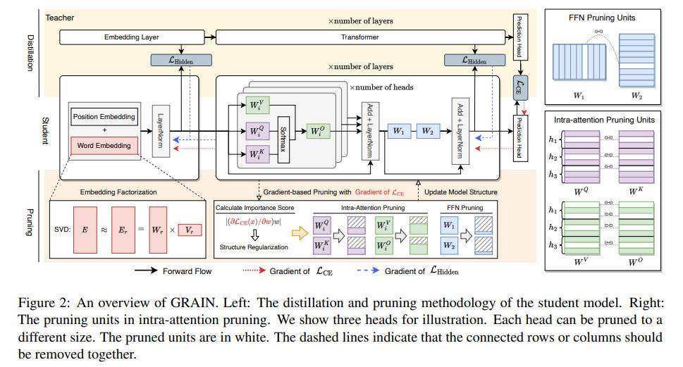

### publication

 

<b>AAAI</b>
 

|    | meta                                      | ttttttttttttttttttttttttttttttitle                                                                                         | ccccccccccccccccccover                                                 | pub   |   year | codeeeee                                                                     | note                                                                  |
|---:|:------------------------------------------|:---------------------------------------------------------------------------------------------------------------------------|:-----------------------------------------------------------------------|:------|-------:|:-----------------------------------------------------------------------------|:----------------------------------------------------------------------|
|  0 | [Diffuser](./meta/2023/diffuser.prototxt) | [Diffuser: Efficient Transformers with Multi-hop Attention Diffusion for Long Sequences](https://arxiv.org/abs/2210.11794) |  | AAAI  |   2023 |     |                                                                       |
|  1 | [FLAP](./meta/2024/flap.prototxt)         | [Fluctuation-based Adaptive Structured Pruning for Large Language Models](https://arxiv.org/abs/2312.11983)                |                    | AAAI  |   2024 |  | [note](https://z6oqkldvmo.feishu.cn/docx/JFFQdAxz3oWX2Kx6j91c2kamnqd) |

<b>ACL</b>
 

|    | meta                                          | ttttttttttttttttttttttttttttttitle                                                                                                        | ccccccccccccccccccover                                                     | pub   |   year | codeeeee                                                                                            | note                                |
|---:|:----------------------------------------------|:------------------------------------------------------------------------------------------------------------------------------------------|:---------------------------------------------------------------------------|:------|-------:|:----------------------------------------------------------------------------------------------------|:------------------------------------|
|  0 | [m](./meta/2022/XZBX1Z9G.prototxt)            | [Sparse Progressive Distillation: Resolving Overfitting under Pretrain-and-Finetune Paradigm](https://aclanthology.org/2022.acl-long.16/) |                                                                            | ACL   |   2022 |  |                                     |
|  1 | [TextPruner](./meta/2022/TextPruner.prototxt) | [TextPruner: A Model Pruning Toolkit for Pre-Trained Language Models](https://arxiv.org/abs/2203.15996)                                   |  | ACL   |   2022 |                         |                                     |
|  2 | [GRAIN](./meta/2023/grain.prototxt)           | [Gradient-based Intra-attention Pruning on Pre-trained Language Models](https://arxiv.org/abs/2212.07634)                                 |            | ACL   |   2023 |                              | [note](./notes/2023/grain/index.md) |
|  3 | [SMP](./meta/2023/smp.prototxt)               | [Pruning Pre-trained Language Models Without Fine-Tuning](https://aclanthology.org/2023.acl-long.35.pdf)                                  |                | ACL   |   2023 |                                 |                                     |

<b>ACL Findings</b>
 

|    | meta                                  | ttttttttttttttttttttttttttttttitle                                                                                                        | ccccccccccccccccccover                                            | pub          |   year | codeeeee                                                            | note                                 |
|---:|:--------------------------------------|:------------------------------------------------------------------------------------------------------------------------------------------|:------------------------------------------------------------------|:-------------|-------:|:--------------------------------------------------------------------|:-------------------------------------|
|  0 | [PINS](./meta/2023/PINS.prototxt)     | [Pruning Pre-trained Language Models with Principled Importance and Self-regularization](https://aclanthology.org/2023.findings-acl.573/) |                                                                   | ACL Findings |   2023 |  |                                      |
|  1 | [SIMPLE](./meta/2023/simple.prototxt) | [Structured Pruning for Efficient Generative Pre-trained Language Models](https://aclanthology.org/2023.findings-acl.692.pdf)             |  | ACL Findings |   2023 |                                                                     | [note](./notes/2023/simple/index.md) |

<b>AutoML Workshop</b>
 

|    | meta                               | ttttttttttttttttttttttttttttttitle                                                                                       | ccccccccccccccccccover                                                  | pub             |   year | codeeeee                                                                    | note   |
|---:|:-----------------------------------|:-------------------------------------------------------------------------------------------------------------------------|:------------------------------------------------------------------------|:----------------|-------:|:----------------------------------------------------------------------------|:-------|
|  0 | [m](./meta/2023/WDCO13S6.prototxt) | [Structural Pruning of Large Language Models via Neural Architecture Search](https://openreview.net/forum?id=SHlZcInS6C) |  | AutoML Workshop |   2023 |  |        |

<b>Blog</b>
 

|    | meta                               | ttttttttttttttttttttttttttttttitle                                                                                                       | ccccccccccccccccccover   | pub   |   year | codeeeee   | note   |
|---:|:-----------------------------------|:-----------------------------------------------------------------------------------------------------------------------------------------|:-------------------------|:------|-------:|:-----------|:-------|
|  0 | [m](./meta/2022/2EQV34KV.prototxt) | [Creating Sparse GPT-3 Models with Iterative Pruning](https://www.cerebras.net/blog/creating-sparse-gpt-3-models-with-iterative-pruning) |                          | Blog  |   2022 |            |        |

<b>CVPR</b>
 

|    | meta                                        | ttttttttttttttttttttttttttttttitle                                                                                             | ccccccccccccccccccover                                                   | pub   |   year | codeeeee                                                                        | note                                    |
|---:|:--------------------------------------------|:-------------------------------------------------------------------------------------------------------------------------------|:-------------------------------------------------------------------------|:------|-------:|:--------------------------------------------------------------------------------|:----------------------------------------|
|  0 | [m](./meta/2020/2AL79IUH.prototxt)          | [Fast Sparse ConvNets](https://openaccess.thecvf.com/content_CVPR_2020/papers/Elsen_Fast_Sparse_ConvNets_CVPR_2020_paper.pdf)  |                                                                          | CVPR  |   2020 |  |                                         |
|  1 | [SparseViT](./meta/2023/SparseViT.prototxt) | [SparseViT: Revisiting Activation Sparsity for Efficient High-Resolution Vision Transformer](https://arxiv.org/abs/2303.17605) |  | CVPR  |   2023 |  | [note](./notes/2023/sparsevit/index.md) |

<b>CVPR workshop</b>
 

|    | meta                                              | ttttttttttttttttttttttttttttttitle                                                                                                                                           | ccccccccccccccccccover   | pub           |   year | codeeeee                                                                          | note   |
|---:|:--------------------------------------------------|:-----------------------------------------------------------------------------------------------------------------------------------------------------------------------------|:-------------------------|:--------------|-------:|:----------------------------------------------------------------------------------|:-------|
|  0 | [TorchSparse++](./meta/2023/TorchSparse.prototxt) | [TorchSparse++: Efficient Point Cloud Engine](https://openaccess.thecvf.com/content/CVPR2023W/WAD/papers/Tang_TorchSparse_Efficient_Point_Cloud_Engine_CVPRW_2023_paper.pdf) |                          | CVPR workshop |   2023 |  |        |

<b>ECCV</b>
 

|    | meta                                          | ttttttttttttttttttttttttttttttitle                                                                                              | ccccccccccccccccccover   | pub   |   year | codeeeee                                                                                | note   |
|---:|:----------------------------------------------|:--------------------------------------------------------------------------------------------------------------------------------|:-------------------------|:------|-------:|:----------------------------------------------------------------------------------------|:-------|
|  0 | [ADMM-pruning](./meta/2018/Z9R72EAT.prototxt) | [A Systematic DNN Weight Pruning Framework using Alternating Direction Method of Multipliers](https://arxiv.org/abs/1804.03294) |                          | ECCV  |   2018 |  |        |

<b>ICCV workshop</b>
 

|    | meta                                      | ttttttttttttttttttttttttttttttitle                                                                                                                                                                                                       | ccccccccccccccccccover   | pub           |   year | codeeeee   | note   |
|---:|:------------------------------------------|:-----------------------------------------------------------------------------------------------------------------------------------------------------------------------------------------------------------------------------------------|:-------------------------|:--------------|-------:|:-----------|:-------|
|  0 | [OpenVINO](./meta/2021/OpenVINO.prototxt) | [Post-training deep neural network pruning via layer-wise calibration](https://openaccess.thecvf.com/content/ICCV2021W/LPCV/papers/Lazarevich_Post-Training_Deep_Neural_Network_Pruning_via_Layer-Wise_Calibration_ICCVW_2021_paper.pdf) |                          | ICCV workshop |   2021 |            |        |

<b>ICLR</b>
 

|    | meta                                                     | ttttttttttttttttttttttttttttttitle                                                                                                               | ccccccccccccccccccover                                                   | pub   |   year | codeeeee                                                                                                                    | note                                       |
|---:|:---------------------------------------------------------|:-------------------------------------------------------------------------------------------------------------------------------------------------|:-------------------------------------------------------------------------|:------|-------:|:----------------------------------------------------------------------------------------------------------------------------|:-------------------------------------------|
|  0 | [Deep Compression](./meta/2016/deepcompression.prototxt) | [Deep Compression: Compressing Deep Neural Networks with Pruning, Trained Quantization and Huffman Coding](https://arxiv.org/pdf/1510.00149.pdf) |                                                                          | ICLR  |   2016 |                                                                                                                             |                                            |
|  1 | [DSD](./meta/2017/dsd.prototxt)                          | [DSD: Dense-Sparse-Dense Training for Deep Neural Networks](https://arxiv.org/pdf/1607.04381.pdf)                                                |                                                                          | ICLR  |   2017 |                                                                                                                             |                                            |
|  2 | [BRECQ](./meta/2021/brecq.prototxt)                      | [BRECQ: Pushing the Limit of Post-Training Quantization by Block Reconstruction](https://openreview.net/pdf?id=POWv6hDd9XH)                      |                                                                          | ICLR  |   2021 |                                                       |                                            |
|  3 | [SR-STE](./meta/2021/sr-ste.prototxt)                    | [Learning N:M Fine-grained Structured Sparse Neural Networks From Scratch](https://openreview.net/forum?id=K9bw7vqp_s)                           |        | ICLR  |   2021 |                                                |                                            |
|  4 | [LoRA](./meta/2022/lora.prototxt)                        | [LoRA: Low-rank adaptation of large language models](https://arxiv.org/abs/2106.09685)                                                           |            | ICLR  |   2022 |                                                     |                                            |
|  5 | [AdaLoRA](./meta/2023/adalora.prototxt)                  | [AdaLoRA: Adaptive Budget Allocation for Parameter-Efficient Fine-Tuning](https://arxiv.org/pdf/2303.10512.pdf)                                  |      | ICLR  |   2023 |                                                |                                            |
|  6 | [GPTQ](./meta/2023/gptq.prototxt)                        | [GPTQ: Accurate Post-Training Quantization for Generative Pre-trained Transformers](https://arxiv.org/pdf/2210.17323.pdf)                        |                                                                          | ICLR  |   2023 |                                                    |                                            |
|  7 | [MVUE](./meta/2023/MVUE.prototxt)                        | [Minimum Variance Unbiased N:M Sparsity for the Neural Gradients](https://openreview.net/pdf?id=vuD2xEtxZcj)                                     |                                                                          | ICLR  |   2023 |                                                                                                                             |                                            |
|  8 | [m](./meta/2023/WMMGA0AR.prototxt)                       | [The Lazy Neuron Phenomenon: On Emergence of Activation Sparsity in Transformers](https://openreview.net/forum?id=TJ2nxciYCk-)                   |                                                                          | ICLR  |   2023 |                                                                                                                             |                                            |
|  9 | [Wanda](./meta/2024/wanda.prototxt)                      | [A Simple and Effective Pruning Approach for Large Language Models](https://arxiv.org/pdf/2306.11695.pdf)                                        |                                                                          | ICLR  |   2024 |                                                     |                                            |
| 10 | [LLM-KICK](./meta/2024/VB8C61V6.prototxt)                | [Compressing LLMs: The Truth is Rarely Pure and Never Simple](http://arxiv.org/abs/2310.01382v2)                                                 |    | ICLR  |   2024 |                                                | [note](./notes/2024/VB8C61V6/note.md)      |
| 11 | [DSnoT](./meta/2024/DSnoT.prototxt)                      | [Dynamic Sparse No Training: Training-Free Fine-tuning for Sparse LLMs](http://arxiv.org/abs/2310.08915v3)                                       |          | ICLR  |   2024 |                                                       | [note](./notes/2024/DSnoT/note.md)         |
| 12 | [streaming-llm](./meta/2024/streaming-llm.prototxt)      | [Efficient Streaming Language Models with Attention Sinks](http://arxiv.org/abs/2309.17453v4)                                                    |  | ICLR  |   2024 |                                          | [note](./notes/2024/streaming-llm/note.md) |
| 13 | [RIA](./meta/2024/IA8CS3VH.prototxt)                     | [Plug-and-Play: An Efficient Post-training Pruning Method for Large Language Models](https://openreview.net/forum?id=Tr0lPx9woF)                 |             | ICLR  |   2024 |  |                                            |
| 14 | [QA-LoRA](./meta/2024/QA-LoRA.prototxt)                  | [QA-LoRA: Quantization-Aware Low-Rank Adaptation of Large Language Models](https://arxiv.org/abs/2309.14717)                                     |       | ICLR  |   2024 |                                                | [note](./notes/2024/QA-LoRA/note.md)       |
| 15 | [SAS](./meta/2024/SAS.prototxt)                          | [SAS: Structured Activation Spasification](https://openreview.net/forum?id=vZfi5to2Xl)                                                           |              | ICLR  |   2024 |                                                    | [note](./notes/2024/SAS/note.md)           |
| 16 | [SliceGPT](./meta/2024/SliceGPT.prototxt)                | [SliceGPT: Compress Large Language Models by Deleting Rows and Columns](http://arxiv.org/abs/2401.15024v2)                                       |    | ICLR  |   2024 |                                   | [note](./notes/2024/SliceGPT/note.md)      |

<b>ICLR oral</b>
 

|    | meta                                               | ttttttttttttttttttttttttttttttitle                                                                             | ccccccccccccccccccover                                            | pub       |   year | codeeeee                                                                        | note   |
|---:|:---------------------------------------------------|:---------------------------------------------------------------------------------------------------------------|:------------------------------------------------------------------|:----------|-------:|:--------------------------------------------------------------------------------|:-------|
|  0 | [ReLU Strikes Back](./meta/2024/HMR7HKFV.prototxt) | [ReLU Strikes Back: Exploiting Activation Sparsity in Large Language Models](https://arxiv.org/abs/2310.04564) |  | ICLR oral |   2024 |  |        |

<b>ICML</b>
 

|    | meta                                          | ttttttttttttttttttttttttttttttitle                                                                                                         | ccccccccccccccccccover                                                     | pub   |   year | codeeeee                                                                                 | note                                    |
|---:|:----------------------------------------------|:-------------------------------------------------------------------------------------------------------------------------------------------|:---------------------------------------------------------------------------|:------|-------:|:-----------------------------------------------------------------------------------------|:----------------------------------------|
|  0 | [ActNN](./meta/2019/actnn.prototxt)           | [ActNN: Reducing Training Memory Footprint via 2-Bit Activation Compressed Training](https://arxiv.org/abs/2104.14129)                     |                                                                            | ICML  |   2019 |                   |                                         |
|  1 | [m](./meta/2020/V3MFIRLV.prototxt)            | [Inducing and Exploiting Activation Sparsity for Fast Neural Network Inference](http://proceedings.mlr.press/v119/kurtz20a/kurtz20a.pdf)   |                                                                            | ICML  |   2020 |                                                                                          |                                         |
|  2 | [SPDY](./meta/2022/spdy.prototxt)             | [SPDY: Accurate Pruning with Speedup Guarantees](https://arxiv.org/abs/2201.13096)                                                         |             | ICML  |   2022 |                 | [note](./notes/2022/spdy/index.md)      |
|  3 | [Deja Vu](./meta/2023/dejavu.prototxt)        | [Deja Vu: Contextual Sparsity for Efficient LLMs at Inference Time](https://openreview.net/forum?id=wIPIhHd00i)                            |          | ICML  |   2023 |              |                                         |
|  4 | [LoSparse](./meta/2023/LoSparse.prototxt)     | [Structured Compression of Large Language Models based on Low-Rank and Sparse Approximation](https://arxiv.org/abs/2306.11222)             |      | ICML  |   2023 |               |                                         |
|  5 | [m](./meta/2024/HYPL7G37.prototxt)            | [Accelerating Transformer Pre-training with 2:4 Sparsity](http://arxiv.org/abs/2404.01847v2)                                               |                                                                            | ICML  |   2024 |          | [note](./notes/2024/HYPL7G37/note.md)   |
|  6 | [EAGLE](./meta/2024/Eagle.prototxt)           | [EAGLE: Speculative Sampling Requires Rethinking Feature Uncertainty](http://arxiv.org/abs/2401.15077v2)                                   |            | ICML  |   2024 |                 | [note](./notes/2024/Eagle/note.md)      |
|  7 | [FrameQuant](./meta/2024/FrameQuant.prototxt) | [FrameQuant: Flexible Low-Bit Quantization for Transformers](http://arxiv.org/abs/2403.06082v1)                                            |  | ICML  |   2024 |         | [note](./notes/2024/FrameQuant/note.md) |
|  8 | [LoRA+](./meta/2024/LoRA+.prototxt)           | [LoRA+: Efficient Low Rank Adaptation of Large Models](http://arxiv.org/abs/2402.12354v1)                                                  |                                                                            | ICML  |   2024 |  | [note](./notes/2024/LoRA+/note.md)      |
|  9 | [OSSCAR](./meta/2024/OSSCAR.prototxt)         | [OSSCAR: One-Shot Structured Pruning in Vision and Language Models with Combinatorial Optimization](http://arxiv.org/abs/2403.12983v1)     |                                                                            | ICML  |   2024 |             | [note](./notes/2024/OSSCAR/note.md)     |
| 10 | [OWL](./meta/2024/owl.prototxt)               | [Outlier Weighed Layerwise Sparsity (OWL): A Missing Secret Sauce for Pruning LLMs to High Sparsity](https://arxiv.org/pdf/2310.05175.pdf) |              | ICML  |   2024 |                      |                                         |
| 11 | [Quest](./meta/2024/Quest.prototxt)           | [Quest: Query-Aware Sparsity for Efficient Long-Context LLM Inference](http://arxiv.org/abs/2406.10774v1)                                  |            | ICML  |   2024 |               | [note](./notes/2024/Quest/note.md)      |
| 12 | [SPP](./meta/2024/SPP.prototxt)               | [SPP: Sparsity-Preserved Parameter-Efficient Fine-Tuning for Large Language Models](http://arxiv.org/abs/2405.16057v1)                     |                | ICML  |   2024 |                 | [note](./notes/2024/SPP/note.md)        |
| 13 | [SparQ](./meta/2024/SparQ.prototxt)           | [SparQ Attention: Bandwidth-Efficient LLM Inference](http://arxiv.org/abs/2312.04985v5)                                                    |                                                                            | ICML  |   2024 |                                                                                          | [note](./notes/2024/SparQ/note.md)      |
| 14 | [SIFT](./meta/2024/SIFT.prototxt)             | [Sparse is Enough in Fine-tuning Pre-trained Large Language Models](http://arxiv.org/abs/2312.11875v3)                                     |                                                                            | ICML  |   2024 |                    | [note](./notes/2024/SIFT/note.md)       |
| 15 | [Sparse-IFT](./meta/2024/Sparse-IFT.prototxt) | [Sparse-IFT: Sparse Iso-FLOP Transformations for Maximizing Training Efficiency](http://arxiv.org/abs/2303.11525v3)                        |   | ICML  |   2024 |     | [note](./notes/2024/Sparse-IFT/note.md) |
| 16 | [SqueezeLLM](./meta/2024/SqueezeLLM.prototxt) | [SqueezeLLM: Dense-and-Sparse Quantization](http://arxiv.org/abs/2306.07629v4)                                                             |  | ICML  |   2024 |         | [note](./notes/2024/SqueezeLLM/note.md) |
| 17 | [TinyTrain](./meta/2024/TinyTrain.prototxt)   | [TinyTrain: Resource-Aware Task-Adaptive Sparse Training of DNNs at the Data-Scarce Edge](http://arxiv.org/abs/2307.09988v2)               |                                                                            | ICML  |   2024 |          | [note](./notes/2024/TinyTrain/note.md)  |

<b>JMLR</b>
 

|    | meta                              | ttttttttttttttttttttttttttttttitle                                                                                  | ccccccccccccccccccover   | pub   |   year | codeeeee                                                                                       | note   |
|---:|:----------------------------------|:--------------------------------------------------------------------------------------------------------------------|:-------------------------|:------|-------:|:-----------------------------------------------------------------------------------------------|:-------|
|  0 | [GPFQ](./meta/2021/gpfq.prototxt) | [A Greedy Algorithm for Quantizing Neural Networks](https://jmlr.csail.mit.edu/papers/volume22/20-1233/20-1233.pdf) |                          | JMLR  |   2021 |  |        |

<b>MICRO</b>
 

|    | meta                                  | ttttttttttttttttttttttttttttttitle                                                                                             | ccccccccccccccccccover   | pub   |   year | codeeeee   | note   |
|---:|:--------------------------------------|:-------------------------------------------------------------------------------------------------------------------------------|:-------------------------|:------|-------:|:-----------|:-------|
|  0 | [Sprint](./meta/2022/Sprint.prototxt) | [Sparse Attention Acceleration with Synergistic In-Memory Pruning and On-Chip Recomputation](https://arxiv.org/abs/2209.00606) |                          | MICRO |   2022 |            |        |

<b>MLSys</b>
 

|    | meta                                      | ttttttttttttttttttttttttttttttitle                                                                                                                                              | ccccccccccccccccccover   | pub   |   year | codeeeee                                                                   | note   |
|---:|:------------------------------------------|:--------------------------------------------------------------------------------------------------------------------------------------------------------------------------------|:-------------------------|:------|-------:|:---------------------------------------------------------------------------|:-------|
|  0 | [nmSPARSE](./meta/2023/nmSPARSE.prototxt) | [Efficient GPU Kernels for N:M-Sparse Weights in Deep Learning](https://proceedings.mlsys.org/paper_files/paper/2023/file/4552cedd396a308320209f75f56a5ad5-Paper-mlsys2023.pdf) |                          | MLSys |   2023 |  |        |

<b>NeurIPS</b>
 

|    | meta                                                      | ttttttttttttttttttttttttttttttitle                                                                                                         | ccccccccccccccccccover                                                    | pub     |   year | codeeeee                                                                                     | note                                       |
|---:|:----------------------------------------------------------|:-------------------------------------------------------------------------------------------------------------------------------------------|:--------------------------------------------------------------------------|:--------|-------:|:---------------------------------------------------------------------------------------------|:-------------------------------------------|
|  0 | [OBD](./meta/1989/obd.prototxt)                           | [Optimal Brain Damage](https://proceedings.neurips.cc/paper_files/paper/1989/file/6c9882bbac1c7093bd25041881277658-Paper.pdf)              |                                                                           | NeurIPS |   1989 |                                                                                              |                                            |
|  1 | [L-OBS](./meta/2017/lobs.prototxt)                        | [Learning to Prune Deep Neural Networks via Layer-wise Optimal Brain Surgeon](https://arxiv.org/pdf/1705.07565.pdf)                        |                                                                           | NeurIPS |   2017 |                        |                                            |
|  2 | [Movement Pruning](./meta/2020/movement_pruning.prototxt) | [Movement Pruning: Adaptive Sparsity by Fine-Tuning](https://arxiv.org/abs/2005.07683)                                                     |   | NeurIPS |   2020 |  |                                            |
|  3 | [m](./meta/2021/K7GSWQIC.prototxt)                        | [Channel Permutations for N:M Sparsity](https://proceedings.neurips.cc/paper/2021/hash/6e8404c3b93a9527c8db241a1846599a-Abstract.html)     |                                                                           | NeurIPS |   2021 |                         |                                            |
|  4 | [FisherPruning](./meta/2022/fisherpruning.prototxt)       | [A Fast Post-Training Pruning Framework for Transformers](http://arxiv.org/abs/2204.09656v2)                                               |   | NeurIPS |   2022 |  | [note](./notes/2022/fisherpruning/note.md) |
|  5 | [FlashAttention](./meta/2022/flashattention.prototxt)     | [FlashAttention: Fast and Memory-Efficient Exact Attention with IO-Awareness](https://arxiv.org/abs/2205.14135)                            |  | NeurIPS |   2022 |           |                                            |
|  6 | [OBC](./meta/2022/obc.prototxt)                           | [Optimal Brain Compression: A Framework for Accurate Post-Training Quantization and Pruning](https://openreview.net/pdf?id=ksVGCOlOEba)    |                                                                           | NeurIPS |   2022 |                      |                                            |
|  7 | [ZeroQuant](./meta/2022/zeroquant.prototxt)               | [ZeroQuant: Efficient and Affordable Post-Training Quantization for Large-Scale Transformers](https://openreview.net/forum?id=f-fVCElZ-G1) |                                                                           | NeurIPS |   2022 |                 |                                            |
|  8 | [ZipLM](./meta/2023/ZipLM.prototxt)                       | [ZipLM: Inference-Aware Structured Pruning of Language Models](https://openreview.net/pdf?id=bPFFPueAxm)                                   |           | NeurIPS |   2023 |                    |                                            |

<b>Neuromorphic Computing and Engineering</b>
 

|    | meta                                                                 | ttttttttttttttttttttttttttttttitle                                                                                                                              | ccccccccccccccccccover                                                           | pub                                    |   year | codeeeee   | note                                               |
|---:|:---------------------------------------------------------------------|:----------------------------------------------------------------------------------------------------------------------------------------------------------------|:---------------------------------------------------------------------------------|:---------------------------------------|-------:|:-----------|:---------------------------------------------------|
|  0 | [Complementary Sparsity](./meta/2022/ComplementarySparsity.prototxt) | [Two Sparsities Are Better Than One: Unlocking the Performance Benefits of Sparse-Sparse Networks](https://iopscience.iop.org/article/10.1088/2634-4386/ac7c8a) |  | Neuromorphic Computing and Engineering |   2022 |            | [note](./notes/2022/ComplementarySparsity/note.md) |

<b>TACL</b>
 

|    | meta                               | ttttttttttttttttttttttttttttttitle                                                              | ccccccccccccccccccover                                               | pub   |   year | codeeeee   | note   |
|---:|:-----------------------------------|:------------------------------------------------------------------------------------------------|:---------------------------------------------------------------------|:------|-------:|:-----------|:-------|
|  0 | [m](./meta/2023/68I8KKBV.prototxt) | [Efficient Methods for Natural Language Processing: A Survey](https://arxiv.org/abs/2209.00099) |  | TACL  |   2023 |            |        |

<b>TMLR</b>
 

|    | meta                                              | ttttttttttttttttttttttttttttttitle                                                                     | ccccccccccccccccccover   | pub   |   year | codeeeee                                                                            | note                                      |
|---:|:--------------------------------------------------|:-------------------------------------------------------------------------------------------------------|:-------------------------|:------|-------:|:------------------------------------------------------------------------------------|:------------------------------------------|
|  0 | [ADMM-pruning](./meta/2024/ADMM-pruning.prototxt) | [Fast and Effective Weight Update for Pruned Large Language Models](http://arxiv.org/abs/2401.02938v2) |                          | TMLR  |   2024 |  | [note](./notes/2024/ADMM-pruning/note.md) |

<b>UAI</b>
 

|    | meta                              | ttttttttttttttttttttttttttttttitle                                                                            | ccccccccccccccccccover   | pub   |   year | codeeeee   | note   |
|---:|:----------------------------------|:--------------------------------------------------------------------------------------------------------------|:-------------------------|:------|-------:|:-----------|:-------|
|  0 | [SPDF](./meta/2023/spdf.prototxt) | [SPDF: Sparse Pre-training and Dense Fine-tuning for Large Language Models](https://arxiv.org/abs/2303.10464) |                          | UAI   |   2023 |            |        |

<b>VLDB</b>
 

|    | meta                                        | ttttttttttttttttttttttttttttttitle                                                                                                                      | ccccccccccccccccccover                                               | pub   |   year | codeeeee                                                                            | note                                    |
|---:|:--------------------------------------------|:--------------------------------------------------------------------------------------------------------------------------------------------------------|:---------------------------------------------------------------------|:------|-------:|:------------------------------------------------------------------------------------|:----------------------------------------|
|  0 | [Flash-LLM](./meta/2024/flash_llm.prototxt) | [Flash-LLM: Enabling Cost-Effective and Highly-Efficient Large Generative Model Inference with Unstructured Sparsity](https://arxiv.org/abs/2309.10285) |  | VLDB  |   2024 |  | [note](./notes/2024/flash_llm/index.md) |

<b>VLSI</b>
 

|    | meta                                 | ttttttttttttttttttttttttttttttitle                                                                                        | ccccccccccccccccccover   | pub   |   year | codeeeee   | note   |
|---:|:-------------------------------------|:--------------------------------------------------------------------------------------------------------------------------|:-------------------------|:------|-------:|:-----------|:-------|
|  0 | [STA](./meta/2022/44KWQAWO.prototxt) | [An Algorithm-Hardware Co-Optimized Framework for Accelerating N:M Sparse Transformers](https://arxiv.org/abs/2208.06118) |                          | VLSI  |   2022 |            |        |

<b>arXiv</b>
 

|    | meta                                                                            | ttttttttttttttttttttttttttttttitle                                                                                                                            | ccccccccccccccccccover                                                                                       | pub   |   year | codeeeee                                                                                       | note                                                                  |
|---:|:--------------------------------------------------------------------------------|:--------------------------------------------------------------------------------------------------------------------------------------------------------------|:-------------------------------------------------------------------------------------------------------------|:------|-------:|:-----------------------------------------------------------------------------------------------|:----------------------------------------------------------------------|
|  0 | [blocksparse](./meta/2020/blocksparse.prototxt)                                 | [GPU Kernels for Block-Sparse Weights](https://cdn.openai.com/blocksparse/blocksparsepaper.pdf)                                                               |                                                                                                              | arXiv |   2020 |                    |                                                                       |
|  1 | [NMSparse](./meta/2021/PUHJMVCM.prototxt)                                       | [Accelerating Sparse Deep Neural Networks](https://arxiv.org/abs/2104.08378)                                                                                  |                                                                                                              | arXiv |   2021 |                                                                                                |                                                                       |
|  2 | [m](./meta/2021/ITZS3TU3.prototxt)                                              | [Sparsity in Deep Learning: Pruning and growth for efficient inference and training in neural networks](https://arxiv.org/abs/2102.00554)                     |                                                                                                              | arXiv |   2021 |                                                                                                |                                                                       |
|  3 | [oBERT](./meta/2022/oBERT.prototxt)                                             | [The Optimal BERT Surgeon: Scalable and Accurate Second-Order Pruning for Large Language Models](https://arxiv.org/pdf/2203.07259.pdf)                        |                                                                                                              | arXiv |   2022 |                  |                                                                       |
|  4 | [m](./meta/2023/ELILXDQG.prototxt)                                              | [A Survey on Evaluation of Large Language Models](https://arxiv.org/abs/2307.03109)                                                                           |                                               | arXiv |   2023 |                                                                                                |                                                                       |
|  5 | [m](./meta/2023/L5D7520E.prototxt)                                              | [A Survey on Model Compression for Large Language Models](https://arxiv.org/abs/2308.07633)                                                                   |                                        | arXiv |   2023 |                                                                                                |                                                                       |
|  6 | [AWQ](./meta/2023/awq.prototxt)                                                 | [AWQ: Activation-aware Weight Quantization for LLM Compression and Acceleration](https://arxiv.org/abs/2306.00978)                                            |                                                                                                              | arXiv |   2023 |                   |                                                                       |
|  7 | [GBLM-Pruner](./meta/2023/GBLM-Pruner.prototxt)                                 | [Beyond Size: How Gradients Shape Pruning Decisions in Large Language Models](http://arxiv.org/abs/2311.04902v2)                                              |                                  | arXiv |   2023 |                  | [note](./notes/2023/GBLM-Pruner/note.md)                              |
|  8 | [Compresso](./meta/2023/Compresso.prototxt)                                     | [Compresso: Structured Pruning with Collaborative Prompting Learns Compact Large Language Models](https://arxiv.org/abs/2310.05015)                           |                                          | arXiv |   2023 |                     | [note](./notes/2023/Compresso/note.md)                                |
|  9 | [Adaptively Sparse Attention](./meta/2023/adaptively_sparse_attention.prototxt) | [Dynamic Context Pruning for Efficient and Interpretable Autoregressive Transformers](https://arxiv.org/abs/2305.15805)                                       |  | arXiv |   2023 |                                                                                                |                                                                       |
| 10 | [MeZO](./meta/2023/MeZO.prototxt)                                               | [Fine-Tuning Language Models with Just Forward Passes](http://arxiv.org/abs/2305.17333v3)                                                                     |                                                                                                              | arXiv |   2023 |                    | [note](./notes/2023/MeZO/note.md)                                     |
| 11 | [FlashAttention-2](./meta/2023/flashattention2.prototxt)                        | [FlashAttention-2: Faster Attention with Better Parallelism and Work Partitioning](https://arxiv.org/abs/2307.08691)                                          |                                                                                                              | arXiv |   2023 |             |                                                                       |
| 12 | [KCM](./meta/2023/kcm.prototxt)                                                 | [Gradient-Free Structured Pruning with Unlabeled Data](https://arxiv.org/abs/2303.04185)                                                                      |                                                  | arXiv |   2023 |                                                                                                |                                                                       |
| 13 | [K-pruning](./meta/2023/k_pruning.prototxt)                                     | [Knowledge-preserving Pruning for Pre-trained Language Models without Retraining](https://arxiv.org/abs/2308.03449)                                           |                                             | arXiv |   2023 |                                                                                                | [note](./notes/2023/k_pruning/note.md)                                |
| 14 | [LLM-Pruner](./meta/2023/LLM-Pruner.prototxt)                                   | [LLM-Pruner: On the Structural Pruning of Large Language Models](http://arxiv.org/abs/2305.11627v3)                                                           |                                         | arXiv |   2023 |                    | [note](./notes/2023/LLM-Pruner/note.md)                               |
| 15 | [LoRAShear](./meta/2023/lorashear.prototxt)                                     | [LoRAShear: Efficient Large Language Model Structured Pruning and Knowledge Recovery](https://arxiv.org/abs/2310.18356)                                       |                                                                                                              | arXiv |   2023 |                                                                                                |                                                                       |
| 16 | [LoftQ](./meta/2023/loftq.prototxt)                                             | [LoftQ: LoRA-Fine-Tuning-Aware Quantization for Large Language Models](https://arxiv.org/abs/2310.08659)                                                      |                                              | arXiv |   2023 |                        | [note](./notes/2023/loftq/note.md)                                    |
| 17 | [OmniQuant](./meta/2023/omniquant.prototxt)                                     | [OmniQuant: Omnidirectionally Calibrated Quantization for Large Language Models](https://arxiv.org/abs/2308.13137)                                            |                                      | arXiv |   2023 |                   |                                                                       |
| 18 | [GPFQv2](./meta/2023/gpfqv2.prototxt)                                           | [Post-training Quantization for Neural Networks with Provable Guarantees](https://arxiv.org/pdf/2201.11113.pdf)                                               |                                                                                                              | arXiv |   2023 |  |                                                                       |
| 19 | [m](./meta/2023/PowerInfer.prototxt)                                            | [PowerInfer: Fast Large Language Model Serving with a Consumer-grade GPU](http://arxiv.org/abs/2312.12456v1)                                                  |                                                                                                              | arXiv |   2023 |                 | [note](./notes/2023/PowerInfer/note.md)                               |
| 20 | [GBDT](./meta/2023/gbdt.prototxt)                                               | [Pruning Large Language Models via Accuracy Predictor](https://arxiv.org/abs/2309.09507)                                                                      |                                                | arXiv |   2023 |                                                                                                |                                                                       |
| 21 | [QLoRA](./meta/2023/qlora.prototxt)                                             | [QLoRA: Efficient Finetuning of Quantized LLMs](https://arxiv.org/abs/2305.14314)                                                                             |                                              | arXiv |   2023 |                        |                                                                       |
| 22 | [QuIP](./meta/2023/QuIP.prototxt)                                               | [QuIP: Quantization with Incoherence Processing](https://arxiv.org/pdf/2307.13304.pdf)                                                                        |                                                                                                              | arXiv |   2023 |                       |                                                                       |
| 23 | [RPTQ](./meta/2023/RPTQ.prototxt)                                               | [RPTQ: Reorder-based Post-training Quantization for Large Language Models](https://arxiv.org/pdf/2304.01089.pdf)                                              |                                                                                                              | arXiv |   2023 |                     | [note](note.md)                                                       |
| 24 | [LLM-shearing](./meta/2023/LLM_shearing.prototxt)                               | [Sheared LLaMA: Accelerating Language Model Pre-training via Structured Pruning](https://xiamengzhou.github.io/sheared-llama/)                                |                                       | arXiv |   2023 |            | [note](./notes/2023/LLM_shearing/note.md)                             |
| 25 | [SpQR](./meta/2023/spqr.prototxt)                                               | [SpQR: A Sparse-Quantized Representation for Near-Lossless LLM Weight Compression](https://arxiv.org/pdf/2306.03078.pdf)                                      |                                                                                                              | arXiv |   2023 |                         |                                                                       |
| 26 | [SquareHead](./meta/2023/SquareHead.prototxt)                                   | [Sparse Fine-tuning for Inference Acceleration of Large Language Models](https://arxiv.org/pdf/2310.06927.pdf)                                                |                                         | arXiv |   2023 |           |                                                                       |
| 27 | [Sparse-IFT](./meta/2023/Sparse-IFT.prototxt)                                   | [Sparse Iso-FLOP Transformations for Maximizing Training Efficiency](https://arxiv.org/abs/2303.11525)                                                        |                                                                                                              | arXiv |   2023 |           |                                                                       |
| 28 | [SMS](./meta/2023/sms.prototxt)                                                 | [Sparse Model Soups: A Recipe for Improved Pruning via Model Averaging](https://arxiv.org/abs/2306.16788)                                                     |                                                  | arXiv |   2023 |                           |                                                                       |
| 29 | [SparseGPT](./meta/2023/sparsegpt.prototxt)                                     | [SparseGPT: Massive Language Models Can be Accurately Pruned in one-shot.](https://arxiv.org/pdf/2301.00774.pdf)                                              |                                                                                                              | arXiv |   2023 |                  | [note](./notes/SparseGPT.md)                                          |
| 30 | [m](./meta/2023/AYB1XUO5.prototxt)                                              | [Ten Lessons We Have Learned in the New Sparseland: A Short Handbook for Sparse Neural Network Researchers](https://arxiv.org/abs/2302.02596)                 |                                                                                                              | arXiv |   2023 |                                                                                                |                                                                       |
| 31 | [Essential Sparsity](./meta/2023/EssentialSparsity.prototxt)                    | [The Emergence of Essential Sparsity in Large Pre-trained Models: The Weights that Matter](https://arxiv.org/abs/2306.03805)                                  |                                                                                                              | arXiv |   2023 |         |                                                                       |
| 32 | [m](./meta/2023/23LQ9SVH.prototxt)                                              | [Training Transformers with 4-bit Integers](https://arxiv.org/abs//2306.11987)                                                                                |                                                                                                              | arXiv |   2023 |   |                                                                       |
| 33 | [Selective Context](./meta/2023/selective_context.prototxt)                     | [Unlocking Context Constraints of LLMs: Enhancing Context Efficiency of LLMs with Self-Information-Based Content Filtering](https://arxiv.org/abs/2304.12102) |                      | arXiv |   2023 |         |                                                                       |
| 34 | [ZeroQuant-V2](./meta/2023/ZeroQuant-V2.prototxt)                               | [ZeroQuant-V2: Exploring Post-training Quantization in LLMs from Comprehensive Study to Low Rank Compensation](https://arxiv.org/abs/2303.08302)              |                                                                                                              | arXiv |   2023 |                   |                                                                       |
| 35 | [m](./meta/2024/DHIB73MC.prototxt)                                              | [A Survey on Efficient Inference for Large Language Models](http://arxiv.org/abs/2404.14294v2)                                                                |                              | arXiv |   2024 |                                                                                                | [note](./notes/2024/DHIB73MC/note.md)                                 |
| 36 | [Minitron](./meta/2024/Minitron.prototxt)                                       | [Compact Language Models via Pruning and Knowledge Distillation](http://arxiv.org/abs/2407.14679v1)                                                           |                                        | arXiv |   2024 |                       | [note](./notes/2024/Minitron/note.md)                                 |
| 37 | [SDS](./meta/2024/SDS.prototxt)                                                 | [Enhancing One-shot Pruned Pre-trained Language Models through Sparse-Dense-Sparse Mechanism](http://arxiv.org/abs/2408.10473v1)                              |                                                  | arXiv |   2024 |                                                                                                | [note](./notes/2024/SDS/note.md)                                      |
| 38 | [Bonsa](./meta/2024/Bonsa.prototxt)                                             | [Everybody Prune Now: Structured Pruning of LLMs with only Forward Passes](https://arxiv.org/abs/2402.05406)                                                  |                                                                                                              | arXiv |   2024 |                          |                                                                       |
| 39 | [KVQuant](./meta/2024/KVQuant.prototxt)                                         | [KVQuant: Towards 10 Million Context Length LLM Inference with KV Cache Quantization](http://arxiv.org/abs/2401.18079v2)                                      |                                                                                                              | arXiv |   2024 |                  | [note](./notes/2024/KVQuant/note.md)                                  |
| 40 | [L4Q](./meta/2024/L4Q.prototxt)                                                 | [L4Q: Parameter Efficient Quantization-Aware Training on Large Language Models via LoRA-wise LSQ](https://arxiv.org/abs/2402.04902)                           |                                                  | arXiv |   2024 |                                                                                                | [note](./notes/2024/L4Q/note.md)                                      |
| 41 | [LISA](./meta/2024/LISA.prototxt)                                               | [LISA: Layerwise Importance Sampling for Memory-Efficient Large Language Model Fine-Tuning](http://arxiv.org/abs/2403.17919v1)                                |                                                                                                              | arXiv |   2024 |                                                                                                | [note](./notes/2024/LISA/note.md)                                     |
| 42 | [LLM in a flash](./meta/2024/5JWFQDDP.prototxt)                                 | [LLM in a flash: Efficient Large Language Model Inference with Limited Memory](https://arxiv.org/abs/2312.11514)                                              |                                 | arXiv |   2024 |                                                                                                | [note](https://z6oqkldvmo.feishu.cn/docx/GBVrdR4iyotc83xMU1Hc9ZOGntb) |
| 43 | [MInference](./meta/2024/MInference.prototxt)                                   | [MInference 1.0: Accelerating Pre-filling for Long-Context LLMs via Dynamic Sparse Attention](http://arxiv.org/abs/2407.02490v1)                              |                             | arXiv |   2024 |                  | [note](./notes/2024/MInference/note.md)                               |
| 44 | [massive-activations](./meta/2024/massive-activations.prototxt)                 | [Massive Activations in Large Language Models](http://arxiv.org/abs/2402.17762v2)                                                                             |                          | arXiv |   2024 |          | [note](./notes/2024/massive-activations/note.md)                      |
| 45 | [MoD](./meta/2024/MoD.prototxt)                                                 | [Mixture-of-Depths: Dynamically allocating compute in transformer-based language models](http://arxiv.org/abs/2404.02258v1)                                   |                                                  | arXiv |   2024 |                                                                                                | [note](./notes/2024/MoD/note.md)                                      |
| 46 | [DoubleSparsity](./meta/2024/DoubleSparsity.prototxt)                           | [Post-Training Sparse Attention with Double Sparsity](http://arxiv.org/abs/2408.07092v2)                                                                      |                                                                                                              | arXiv |   2024 |              | [note](./notes/2024/DoubleSparsity/note.md)                           |
| 47 | [m](./meta/2024/PowerInfer-2.prototxt)                                          | [PowerInfer-2: Fast Large Language Model Inference on a Smartphone](http://arxiv.org/abs/2406.06282v2)                                                        |                                                                                                              | arXiv |   2024 | [Website](https://powerinfer.ai/v2/)                                                           | [note](./notes/2024/PowerInfer-2/note.md)                             |
| 48 | [ProSparse](./meta/2024/ProSparse.prototxt)                                     | [ProSparse: Introducing and Enhancing Intrinsic Activation Sparsity within Large Language Models](https://arxiv.org/abs/2402.13516)                           |                                      | arXiv |   2024 |  | [note](./notes/2024/ProSparse/note.md)                                |
| 49 | [Q-Sparse](./meta/2024/Q-Sparse.prototxt)                                       | [Q-Sparse: All Large Language Models can be Fully Sparsely-Activated](http://arxiv.org/abs/2407.10969v1)                                                      |                                        | arXiv |   2024 |                                                                                                | [note](./notes/2024/Q-Sparse/note.md)                                 |
| 50 | [QServe](./meta/2024/QServer.prototxt)                                          | [QServe: W4A8KV4 Quantization and System Co-design for Efficient LLM Serving](http://arxiv.org/abs/2405.04532v2)                                              |                                                                                                              | arXiv |   2024 | [Pytorch](https://hanlab.mit.edu/projects/qserve)                                              | [note](./notes/2024/QServer/note.md)                                  |
| 51 | [ReLU2](./meta/2024/ReLU2.prototxt)                                             | [ReLU2 Wins: Discovering Efficient Activation Functions for Sparse LLMs](https://arxiv.org/abs/2402.03804)                                                    |                                         | arXiv |   2024 |                                                                                                | [note](./notes/2024/ReLU2/note.md)                                    |
| 52 | [m](./meta/2024/SN1PK7EK.prototxt)                                              | [Revisiting Zeroth-Order Optimization for Memory-Efficient LLM Fine-Tuning: A Benchmark](http://arxiv.org/abs/2402.11592v2)                                   |                                                                                                              | arXiv |   2024 |                       | [note](./notes/2024/SN1PK7EK/note.md)                                 |
| 53 | [Turbo Sparse](./meta/2024/TurboSparse.prototxt)                                | [Turbo Sparse: Achieving LLM SOTA Performance with Minimal Activated Parameters](http://arxiv.org/abs/2406.05955v2)                                           |                                                                                                              | arXiv |   2024 | [Pytorch](https://huggingface.co/PowerInfer)                                                   | [note](./notes/2024/TurboSparse/note.md)                              |

<b>github</b>
 

|    | meta                                        | ttttttttttttttttttttttttttttttitle                               | ccccccccccccccccccover   | pub    |   year | codeeeee                                                                           | note   |
|---:|:--------------------------------------------|:-----------------------------------------------------------------|:-------------------------|:-------|-------:|:-----------------------------------------------------------------------------------|:-------|
|  0 | [FT](./meta/2023/fastertransfomer.prototxt) | [FasterTransformer](https://github.com/NVIDIA/FasterTransformer) |                          | github |   2023 |  |        |

