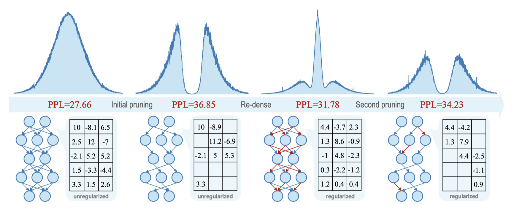
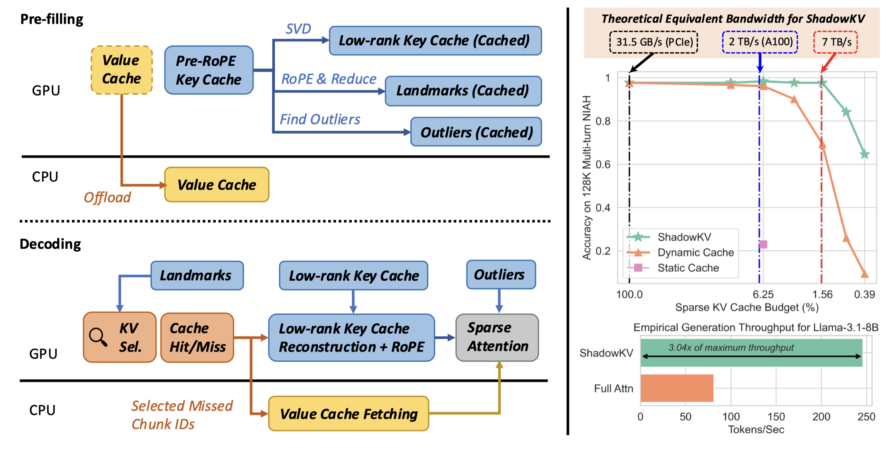
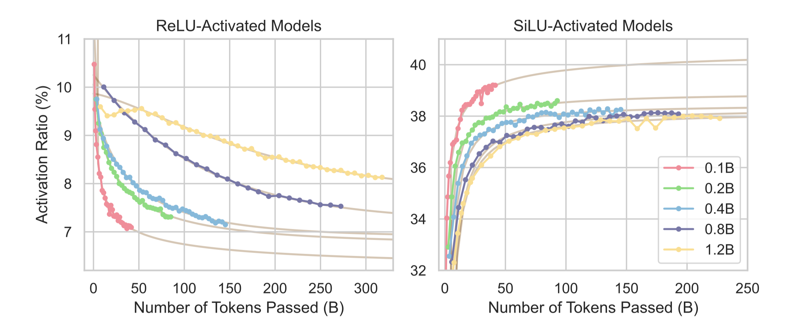
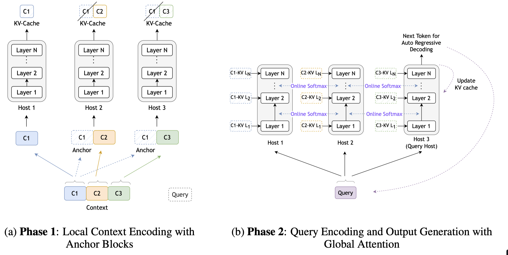

### year

 

<b>2025</b>
 

|    | meta                                                          | ttttttttttttttttttttttttttttttitle                                                                                                       | ccccccccccccccccccover                                                       | pub    |   year | codeeeee                                                                                     | note                                            |
|---:|:--------------------------------------------------------------|:-----------------------------------------------------------------------------------------------------------------------------------------|:-----------------------------------------------------------------------------|:-------|-------:|:---------------------------------------------------------------------------------------------|:------------------------------------------------|
|  0 | [vAttention](./meta/2025/vAttention.prototxt)                 | [vAttention: Dynamic Memory Management for Serving LLMs without PagedAttention](http://arxiv.org/abs/2405.04437v3)                       |          | ASPLOS |   2025 |                | [note](./notes/2025/vAttention/note.md)         |
|  1 | [SDS](./meta/2025/SDS.prototxt)                               | [Enhancing One-shot Pruned Pre-trained Language Models through Sparse-Dense-Sparse Mechanism](http://arxiv.org/abs/2408.10473v1)         |                  | Coling |   2025 |                                                                                              | [note](./notes/2025/SDS/note.md)                |
|  2 | [FlexPrefill](./meta/2025/FlexPrefill.prototxt)               | [FlexPrefill: A Context-Aware Sparse Attention Mechanism for Efficient Long-Sequence Inference](http://arxiv.org/abs/2502.20766v1)       |         | ICLR   |   2025 |               | [note](./notes/2025/FlexPrefill/note.md)        |
|  3 | [FoX](./meta/2025/FoX.prototxt)                               | [Forgetting Transformer: Softmax Attention with a Forget Gate](http://arxiv.org/abs/2503.02130v2)                                        |                                                                              | ICLR   |   2025 |  | [note](./notes/2025/FoX/note.md)                |
|  4 | [TEAL](./meta/2025/TEAL.prototxt)                             | [Training-Free Activation Sparsity in Large Language Models](http://arxiv.org/abs/2408.14690v1)                                          |                | ICLR   |   2025 |                 | [note](./notes/2025/TEAL/note.md)               |
|  5 | [PoD](./meta/2025/PoD.prototxt)                               | [Compressing KV Cache for Long-Context LLM Inference with Inter-Layer Attention Similarity](http://arxiv.org/abs/2412.02252v1)           |                 | ICML   |   2025 |                                                                                              | [note](./notes/2025/PoD/note.md)                |
|  6 | [SpecEE](./meta/2025/SpecEE.prototxt)                         | [SpecEE: Accelerating Large Language Model Inference with Speculative Early Exiting](http://arxiv.org/abs/2504.08850v1)                  |              | ISCA   |   2025 |                  | [note](./notes/2025/SpecEE/note.md)             |
|  7 | [Acc-SpMM](./meta/2025/Acc-SpMM.prototxt)                     | [Acc-SpMM: Accelerating General-purpose Sparse Matrix-Matrix Multiplication with GPU Tensor Cores](http://arxiv.org/abs/2501.09251v1)    |            | arXiv  |   2025 |                                                                                              | [note](./notes/2025/Acc-SpMM/note.md)           |
|  8 | [07NWF4VE](./meta/2025/07NWF4VE.prototxt)                     | [Accelerating LLM Inference Throughput via Asynchronous KV Cache Prefetching](http://arxiv.org/abs/2504.06319v1)                         |            | arXiv  |   2025 |                                                                                              | [note](./notes/2025/07NWF4VE/note.md)           |
|  9 | [AdaSplash](./meta/2025/AdaSplash.prototxt)                   | [AdaSplash: Adaptive Sparse Flash Attention](http://arxiv.org/abs/2502.12082v1)                                                          |                                                                              | arXiv  |   2025 |                 | [note](./notes/2025/AdaSplash/note.md)          |
| 10 | [ACP](./meta/2025/ACP.prototxt)                               | [Adaptive Computation Pruning for the Forgetting Transformer](http://arxiv.org/abs/2504.06949v1)                                         |                                                                              | arXiv  |   2025 |              | [note](./notes/2025/ACP/note.md)                |
| 11 | [FlexiDepth](./meta/2025/FlexiDepth.prototxt)                 | [Adaptive Layer-skipping in Pre-trained LLMs](http://arxiv.org/abs/2503.23798v1)                                                         |          | arXiv  |   2025 |                                                                                              | [note](./notes/2025/FlexiDepth/note.md)         |
| 12 | [AttentionPredictor](./meta/2025/AttentionPredictor.prototxt) | [AttentionPredictor: Temporal Pattern Matters for Efficient LLM Inference](http://arxiv.org/abs/2502.04077v1)                            |  | arXiv  |   2025 |                                                                                              | [note](./notes/2025/AttentionPredictor/note.md) |
| 13 | [ChunkKV](./meta/2025/ChunkKV.prototxt)                       | [ChunkKV: Semantic-Preserving KV Cache Compression for Efficient Long-Context LLM Inference](http://arxiv.org/abs/2502.00299v1)          |             | arXiv  |   2025 |                                                                                              | [note](./notes/2025/ChunkKV/note.md)            |
| 14 | [DBudgetKV](./meta/2025/DBudgetKV.prototxt)                   | [DBudgetKV: Dynamic Budget in KV Cache Compression for Ensuring Optimal Performance](http://arxiv.org/abs/2502.16886v1)                  |           | arXiv  |   2025 |                                                                                              | [note](./notes/2025/DBudgetKV/note.md)          |
| 15 | [DeepSeek-R1](./meta/2025/DeepSeek-R1.prototxt)               | [DeepSeek-R1: Incentivizing Reasoning Capability in LLMs via Reinforcement Learning](http://arxiv.org/abs/2501.12948v1)                  |         | arXiv  |   2025 |             | [note](./notes/2025/DeepSeek-R1/note.md)        |
| 16 | [RaaS](./meta/2025/RaaS.prototxt)                             | [Efficient Long-Decoding Inference with Reasoning-Aware Attention Sparsity](http://arxiv.org/abs/2502.11147v1)                           |                | arXiv  |   2025 |                                                                                              | [note](./notes/2025/RaaS/note.md)               |
| 17 | [topk-decoding](./meta/2025/topk-decoding.prototxt)           | [Exploiting Sparsity for Long Context Inference: Million Token Contexts on Commodity GPUs](http://arxiv.org/abs/2502.06766v2)            |       | arXiv  |   2025 |              | [note](./notes/2025/topk-decoding/note.md)      |
| 18 | [FastKV](./meta/2025/FastKV.prototxt)                         | [FastKV: KV Cache Compression for Fast Long-Context Processing with Token-Selective Propagation](http://arxiv.org/abs/2502.01068v1)      |              | arXiv  |   2025 |                    | [note](./notes/2025/FastKV/note.md)             |
| 19 | [FlashInfer](./meta/2025/FlashInfer.prototxt)                 | [FlashInfer: Efficient and Customizable Attention Engine for LLM Inference Serving](http://arxiv.org/abs/2501.01005v2)                   |                                                                              | arXiv  |   2025 |            | [note](./notes/2025/FlashInfer/note.md)         |
| 20 | [IFPruning](./meta/2025/IFPruning.prototxt)                   | [Instruction-Following Pruning for Large Language Models](http://arxiv.org/abs/2501.02086v2)                                             |           | arXiv  |   2025 |                                                                                              | [note](./notes/2025/IFPruning/note.md)          |
| 21 | [KVLink](./meta/2025/KVLink.prototxt)                         | [KVLink: Accelerating Large Language Models via Efficient KV Cache Reuse](http://arxiv.org/abs/2502.16002v1)                             |              | arXiv  |   2025 |               | [note](./notes/2025/KVLink/note.md)             |
| 22 | [KeepKV](./meta/2025/KeepKV.prototxt)                         | [KeepKV: Eliminating Output Perturbation in KV Cache Compression for Efficient LLMs Inference](http://arxiv.org/abs/2504.09936v1)        |              | arXiv  |   2025 |                                                                                              | [note](./notes/2025/KeepKV/note.md)             |
| 23 | [LServer](./meta/2025/LServer.prototxt)                       | [LServe: Efficient Long-sequence LLM Serving with Unified Sparse Attention](http://arxiv.org/abs/2502.14866v1)                           |             | arXiv  |   2025 |               | [note](./notes/2025/LServer/note.md)            |
| 24 | [MoBA](./meta/2025/MoBA.prototxt)                             | [MoBA: Mixture of Block Attention for Long-Context LLMs](http://arxiv.org/abs/2502.13189v1)                                              |                | arXiv  |   2025 |                     | [note](./notes/2025/MoBA/note.md)               |
| 25 | [Mosaic](./meta/2025/Mosaic.prototxt)                         | [Mosaic: Composite Projection Pruning for Resource-efficient LLMs](http://arxiv.org/abs/2504.06323v1)                                    |              | arXiv  |   2025 |                                                                                              | [note](./notes/2025/Mosaic/note.md)             |
| 26 | [NSA](./meta/2025/NSA.prototxt)                               | [Native Sparse Attention: Hardware-Aligned and Natively Trainable Sparse Attention](http://arxiv.org/abs/2502.11089v1)                   |                 | arXiv  |   2025 |                                                                                              | [note](./notes/2025/NSA/note.md)                |
| 27 | [PowerAttention](./meta/2025/PowerAttention.prototxt)         | [PowerAttention: Exponentially Scaling of Receptive Fields for Effective Sparse Attention](http://arxiv.org/abs/2503.03588v1)            |      | arXiv  |   2025 |                                                                                              | [note](./notes/2025/PowerAttention/note.md)     |
| 28 | [PSA](./meta/2025/PSA.prototxt)                               | [Progressive Sparse Attention: Algorithm and System Co-design for Efficient Attention in LLM Serving](http://arxiv.org/abs/2503.00392v1) |                 | arXiv  |   2025 |                  | [note](./notes/2025/PSA/note.md)                |
| 29 | [0VRXJQ3F](./meta/2025/0VRXJQ3F.prototxt)                     | [Rethinking Key-Value Cache Compression Techniques for Large Language Model Serving](http://arxiv.org/abs/2503.24000v1)                  |            | arXiv  |   2025 |     | [note](./notes/2025/0VRXJQ3F/note.md)           |
| 30 | [SpargeAttn](./meta/2025/SpargeAttn.prototxt)                 | [SpargeAttn: Accurate Sparse Attention Accelerating Any Model Inference](http://arxiv.org/abs/2502.18137v1)                              |          | arXiv  |   2025 |                   | [note](./notes/2025/SpargeAttn/note.md)         |
| 31 | [Task-KV](./meta/2025/Task-KV.prototxt)                       | [Task-KV: Task-aware KV Cache Optimization via Semantic Differentiation of Attention Heads](http://arxiv.org/abs/2501.15113v1)           |             | arXiv  |   2025 |                                                                                              | [note](./notes/2025/Task-KV/note.md)            |
| 32 | [XAttention](./meta/2025/XAttention.prototxt)                 | [XAttention: Block Sparse Attention with Antidiagonal Scoring](http://arxiv.org/abs/2503.16428v1)                                        |          | arXiv  |   2025 |             | [note](./notes/2025/XAttention/note.md)         |
| 33 | [kvpress](./meta/2025/kvpress.prototxt)                       | kvpress                                                                                                                                  |                                                                              | github |   2025 |                      | [note](./notes/2025/kvpress/note.md)            |

<b>2024</b>
 

|    | meta                                                            | ttttttttttttttttttttttttttttttitle                                                                                                                       | ccccccccccccccccccover                                                               | pub       |   year | codeeeee                                                                                                                    | note                                                                  |
|---:|:----------------------------------------------------------------|:---------------------------------------------------------------------------------------------------------------------------------------------------------|:-------------------------------------------------------------------------------------|:----------|-------:|:----------------------------------------------------------------------------------------------------------------------------|:----------------------------------------------------------------------|
|  0 | [FLAP](./meta/2024/flap.prototxt)                               | [Fluctuation-based Adaptive Structured Pruning for Large Language Models](https://arxiv.org/abs/2312.11983)                                              |                              | AAAI      |   2024 |                                                 | [note](https://z6oqkldvmo.feishu.cn/docx/JFFQdAxz3oWX2Kx6j91c2kamnqd) |
|  1 | [ChunkAttention](./meta/2024/ChunkAttention.prototxt)           | [ChunkAttention: Efficient Self-Attention with Prefix-Aware KV Cache and Two-Phase Partition](http://arxiv.org/abs/2402.15220v4)                         |         | ACL       |   2024 |                                          | [note](./notes/2024/ChunkAttention/note.md)                           |
|  2 | [CATS](./meta/2024/CATS.prototxt)                               | [CATS: Contextually-Aware Thresholding for Sparsity in Large Language Models](http://arxiv.org/abs/2404.08763v4)                                         |                        | COLM      |   2024 |                                           | [note](./notes/2024/CATS/note.md)                                     |
|  3 | [m](./meta/2024/JSHWEV0S.prototxt)                              | [Keep the Cost Down: A Review on Methods to Optimize LLM' s KV-Cache Consumption](http://arxiv.org/abs/2407.18003v3)                                     |                | COLM      |   2024 |                                      | [note](./notes/2024/JSHWEV0S/note.md)                                 |
|  4 | [SparseInfer](./meta/2024/SparseInfer.prototxt)                 | [SparseInfer: Training-free Prediction of Activation Sparsity for Fast LLM Inference](http://arxiv.org/abs/2411.12692v1)                                 |                                                                                      | DATE      |   2024 |                                                                                                                             | [note](./notes/2024/SparseInfer/note.md)                              |
|  5 | [SCAP](./meta/2024/SCAP.prototxt)                               | [Post-Training Statistical Calibration for Higher Activation Sparsity](http://arxiv.org/abs/2412.07174v1)                                                |                        | ENLSP     |   2024 |                                                     | [note](./notes/2024/SCAP/note.md)                                     |
|  6 | [Wanda](./meta/2024/Wanda.prototxt)                             | [A Simple and Effective Pruning Approach for Large Language Models](http://arxiv.org/abs/2306.11695)                                                     |                      | ICLR      |   2024 |                                                     | [note](./notes/2024/Wanda/note.md)                                    |
|  7 | [LLM-KICK](./meta/2024/VB8C61V6.prototxt)                       | [Compressing LLMs: The Truth is Rarely Pure and Never Simple](http://arxiv.org/abs/2310.01382v2)                                                         |                | ICLR      |   2024 |                                                | [note](./notes/2024/VB8C61V6/note.md)                                 |
|  8 | [DSnoT](./meta/2024/DSnoT.prototxt)                             | [Dynamic Sparse No Training: Training-Free Fine-tuning for Sparse LLMs](http://arxiv.org/abs/2310.08915v3)                                               |                      | ICLR      |   2024 |                                                       | [note](./notes/2024/DSnoT/note.md)                                    |
|  9 | [streaming-llm](./meta/2024/streaming-llm.prototxt)             | [Efficient Streaming Language Models with Attention Sinks](http://arxiv.org/abs/2309.17453v4)                                                            |              | ICLR      |   2024 |                                          | [note](./notes/2024/streaming-llm/note.md)                            |
| 10 | [RIA](./meta/2024/IA8CS3VH.prototxt)                            | [Plug-and-Play: An Efficient Post-training Pruning Method for Large Language Models](https://openreview.net/forum?id=Tr0lPx9woF)                         |                     | ICLR      |   2024 |  |                                                                       |
| 11 | [QA-LoRA](./meta/2024/QA-LoRA.prototxt)                         | [QA-LoRA: Quantization-Aware Low-Rank Adaptation of Large Language Models](https://arxiv.org/abs/2309.14717)                                             |                   | ICLR      |   2024 |                                                | [note](./notes/2024/QA-LoRA/note.md)                                  |
| 12 | [SAS](./meta/2024/SAS.prototxt)                                 | [SAS: Structured Activation Spasification](https://openreview.net/forum?id=vZfi5to2Xl)                                                                   |                          | ICLR      |   2024 |                                                    | [note](./notes/2024/SAS/note.md)                                      |
| 13 | [SliceGPT](./meta/2024/SliceGPT.prototxt)                       | [SliceGPT: Compress Large Language Models by Deleting Rows and Columns](http://arxiv.org/abs/2401.15024v2)                                               |                | ICLR      |   2024 |                                   | [note](./notes/2024/SliceGPT/note.md)                                 |
| 14 | [ReLU Strikes Back](./meta/2024/HMR7HKFV.prototxt)              | [ReLU Strikes Back: Exploiting Activation Sparsity in Large Language Models](https://arxiv.org/abs/2310.04564)                                           |       | ICLR oral |   2024 |                                              |                                                                       |
| 15 | [m](./meta/2024/HYPL7G37.prototxt)                              | [Accelerating Transformer Pre-training with 2:4 Sparsity](http://arxiv.org/abs/2404.01847v2)                                                             |                                                                                      | ICML      |   2024 |                                             | [note](./notes/2024/HYPL7G37/note.md)                                 |
| 16 | [EAGLE](./meta/2024/Eagle.prototxt)                             | [EAGLE: Speculative Sampling Requires Rethinking Feature Uncertainty](http://arxiv.org/abs/2401.15077v2)                                                 |                      | ICML      |   2024 |                                                    | [note](./notes/2024/Eagle/note.md)                                    |
| 17 | [FrameQuant](./meta/2024/FrameQuant.prototxt)                   | [FrameQuant: Flexible Low-Bit Quantization for Transformers](http://arxiv.org/abs/2403.06082v1)                                                          |            | ICML      |   2024 |                                            | [note](./notes/2024/FrameQuant/note.md)                               |
| 18 | [LoRA+](./meta/2024/LoRA+.prototxt)                             | [LoRA+: Efficient Low Rank Adaptation of Large Models](http://arxiv.org/abs/2402.12354v1)                                                                |                                                                                      | ICML      |   2024 |                                     | [note](./notes/2024/LoRA+/note.md)                                    |
| 19 | [OSSCAR](./meta/2024/OSSCAR.prototxt)                           | [OSSCAR: One-Shot Structured Pruning in Vision and Language Models with Combinatorial Optimization](http://arxiv.org/abs/2403.12983v1)                   |                                                                                      | ICML      |   2024 |                                                | [note](./notes/2024/OSSCAR/note.md)                                   |
| 20 | [OWL](./meta/2024/owl.prototxt)                                 | [Outlier Weighed Layerwise Sparsity (OWL): A Missing Secret Sauce for Pruning LLMs to High Sparsity](https://arxiv.org/pdf/2310.05175.pdf)               |                        | ICML      |   2024 |                                                         |                                                                       |
| 21 | [Quest](./meta/2024/Quest.prototxt)                             | [Quest: Query-Aware Sparsity for Efficient Long-Context LLM Inference](http://arxiv.org/abs/2406.10774)                                                  |                      | ICML      |   2024 |                                                  | [note](./notes/2024/Quest/note.md)                                    |
| 22 | [SPP](./meta/2024/SPP.prototxt)                                 | [SPP: Sparsity-Preserved Parameter-Efficient Fine-Tuning for Large Language Models](http://arxiv.org/abs/2405.16057v1)                                   |                          | ICML      |   2024 |                                                    | [note](./notes/2024/SPP/note.md)                                      |
| 23 | [SparQ](./meta/2024/SparQ.prototxt)                             | [SparQ Attention: Bandwidth-Efficient LLM Inference](http://arxiv.org/abs/2312.04985v5)                                                                  |                                                                                      | ICML      |   2024 |                                                                                                                             | [note](./notes/2024/SparQ/note.md)                                    |
| 24 | [SIFT](./meta/2024/SIFT.prototxt)                               | [Sparse is Enough in Fine-tuning Pre-trained Large Language Models](http://arxiv.org/abs/2312.11875v3)                                                   |                                                                                      | ICML      |   2024 |                                                       | [note](./notes/2024/SIFT/note.md)                                     |
| 25 | [Sparse-IFT](./meta/2024/Sparse-IFT.prototxt)                   | [Sparse-IFT: Sparse Iso-FLOP Transformations for Maximizing Training Efficiency](http://arxiv.org/abs/2303.11525v3)                                      |             | ICML      |   2024 |                                        | [note](./notes/2024/Sparse-IFT/note.md)                               |
| 26 | [SqueezeLLM](./meta/2024/SqueezeLLM.prototxt)                   | [SqueezeLLM: Dense-and-Sparse Quantization](http://arxiv.org/abs/2306.07629v4)                                                                           |            | ICML      |   2024 |                                            | [note](./notes/2024/SqueezeLLM/note.md)                               |
| 27 | [TinyTrain](./meta/2024/TinyTrain.prototxt)                     | [TinyTrain: Resource-Aware Task-Adaptive Sparse Training of DNNs at the Data-Scarce Edge](http://arxiv.org/abs/2307.09988v2)                             |                                                                                      | ICML      |   2024 |                                             | [note](./notes/2024/TinyTrain/note.md)                                |
| 28 | [AWQ](./meta/2024/awq.prototxt)                                 | [AWQ: Activation-aware Weight Quantization for LLM Compression and Acceleration](https://arxiv.org/abs/2306.00978)                                       |                                                                                      | MLSys     |   2024 |                                                |                                                                       |
| 29 | [MInference](./meta/2024/MInference.prototxt)                   | [MInference 1.0: Accelerating Pre-filling for Long-Context LLMs via Dynamic Sparse Attention](http://arxiv.org/abs/2407.02490v1)                         |     | NeurIPS   |   2024 |                                               | [note](./notes/2024/MInference/note.md)                               |
| 30 | [MaskLLM](./meta/2024/MaskLLM.prototxt)                         | [MaskLLM: Learnable Semi-Structured Sparsity for Large Language Models](http://arxiv.org/abs/2409.17481v1)                                               |                  | NeurIPS   |   2024 |                                                     | [note](./notes/2024/MaskLLM/note.md)                                  |
| 31 | [SGLang](./meta/2024/SGLang.prototxt)                           | [SGLang: Efficient Execution of Structured Language Model Programs](http://arxiv.org/abs/2312.07104v2)                                                   |                      | NeurIPS   |   2024 |                                                 | [note](./notes/2024/SGLang/note.md)                                   |
| 32 | [SlimGPT](./meta/2024/SlimGPT.prototxt)                         | [SlimGPT: Layer-wise Structured Pruning for Large Language Models](http://arxiv.org/abs/2412.18110v1)                                                    |                     | NeurIPS   |   2024 |                                                                                                                             | [note](./notes/2024/SlimGPT/note.md)                                  |
| 33 | [SparseLLM](./meta/2024/SparseLLM.prototxt)                     | [SparseLLM: Towards Global Pruning for Pre-trained Language Models](http://arxiv.org/abs/2402.17946v3)                                                   |                                                                                      | NeurIPS   |   2024 |                                               | [note](./notes/2024/SparseLLM/note.md)                                |
| 34 | [ADMM-pruning](./meta/2024/ADMM-pruning.prototxt)               | [Fast and Effective Weight Update for Pruned Large Language Models](http://arxiv.org/abs/2401.02938v2)                                                   |                                                                                      | TMLR      |   2024 |                                          | [note](./notes/2024/ADMM-pruning/note.md)                             |
| 35 | [Flash-LLM](./meta/2024/flash_llm.prototxt)                     | [Flash-LLM: Enabling Cost-Effective and Highly-Efficient Large Generative Model Inference with Unstructured Sparsity](https://arxiv.org/abs/2309.10285)  |                  | VLDB      |   2024 |                                          | [note](./notes/2024/flash_llm/index.md)                               |
| 36 | [m](./meta/2024/DHIB73MC.prototxt)                              | [A Survey on Efficient Inference for Large Language Models](http://arxiv.org/abs/2404.14294v2)                                                           |      | arXiv     |   2024 |                                                                                                                             | [note](./notes/2024/DHIB73MC/note.md)                                 |
| 37 | [PWGG5HBE](./meta/2024/PWGG5HBE.prototxt)                       | [A Survey on Large Language Model Acceleration based on KV Cache Management](http://arxiv.org/abs/2412.19442v2)                                          |                    | arXiv     |   2024 |                             | [note](./notes/2024/PWGG5HBE/note.md)                                 |
| 38 | [AVSS](./meta/2024/AVSS.prototxt)                               | [AVSS: Layer Importance Evaluation in Large Language Models via Activation Variance-Sparsity Analysis](http://arxiv.org/abs/2411.02117v1)                |                        | arXiv     |   2024 |                                                                                                                             | [note](./notes/2024/AVSS/note.md)                                     |
| 39 | [AdaKV](./meta/2024/AdaKV.prototxt)                             | [Ada-KV: Optimizing KV Cache Eviction by Adaptive Budget Allocation for Efficient LLM Inference](http://arxiv.org/abs/2407.11550v3)                      |                       | arXiv     |   2024 |                                                         | [note](./notes/2024/AdaKV/note.md)                                    |
| 40 | [m](./meta/2024/0Y41U1N2.prototxt)                              | [Beyond 2:4: exploring V:N:M sparsity for efficient transformer inference on GPUs](http://arxiv.org/abs/2410.16135v1)                                    |                   | arXiv     |   2024 |                                                                                                                             | [note](./notes/2024/0Y41U1N2/note.md)                                 |
| 41 | [SharedAttention](./meta/2024/SharedAttention.prototxt)         | [Beyond KV Caching: Shared Attention for Efficient LLMs](http://arxiv.org/abs/2407.12866v1)                                                              |             | arXiv     |   2024 |                                                | [note](./notes/2024/SharedAttention/note.md)                          |
| 42 | [Minitron](./meta/2024/Minitron.prototxt)                       | [Compact Language Models via Pruning and Knowledge Distillation](https://arxiv.org/abs/2408.11796v2)                                                     |                | arXiv     |   2024 |                                                    | [note](./notes/2024/Minitron/note.md)                                 |
| 43 | [CoreInfer](./meta/2024/CoreInfer.prototxt)                     | [CoreInfer: Accelerating Large Language Model Inference with Semantics-Inspired Adaptive Sparse Activation](http://arxiv.org/abs/2410.18311v1)           |              | arXiv     |   2024 |                                               | [note](./notes/2024/CoreInfer/note.md)                                |
| 44 | [DeepSeek-V2](./meta/2024/DeepSeek-V2.prototxt)                 | [DeepSeek-V2: A Strong, Economical, and Efficient Mixture-of-Experts Language Model](http://arxiv.org/abs/2405.04434v5)                                  |                 | arXiv     |   2024 |                                            | [note](./notes/2024/DeepSeek-V2/note.md)                              |
| 45 | [DeepSeek-V3](./meta/2024/DeepSeek-V3.prototxt)                 | [DeepSeek-V3 Technical Report](http://arxiv.org/abs/2412.19437v1)                                                                                        |                 | arXiv     |   2024 |                                            | [note](./notes/2024/DeepSeek-V3/note.md)                              |
| 46 | [DeepSeekMoE](./meta/2024/DeepSeekMoE.prototxt)                 | [DeepSeekMoE: Towards Ultimate Expert Specialization in Mixture-of-Experts Language Models](http://arxiv.org/abs/2401.06066v1)                           |                 | arXiv     |   2024 |                                           | [note](./notes/2024/DeepSeekMoE/note.md)                              |
| 47 | [DuoAttention](./meta/2024/DuoAttention.prototxt)               | [DuoAttention: Efficient Long-Context LLM Inference with Retrieval and Streaming Heads](http://arxiv.org/abs/2410.10819v1)                               |        | arXiv     |   2024 |                                          | [note](./notes/2024/DuoAttention/note.md)                             |
| 48 | [m](./meta/2024/ULY1AZGY.prototxt)                              | [Enabling High-Sparsity Foundational Llama Models with Efficient Pretraining and Deployment](http://arxiv.org/abs/2405.03594v1)                          |                                                                                      | arXiv     |   2024 |                                                | [note](./notes/2024/ULY1AZGY/note.md)                                 |
| 49 | [Bonsa](./meta/2024/Bonsa.prototxt)                             | [Everybody Prune Now: Structured Pruning of LLMs with only Forward Passes](https://arxiv.org/abs/2402.05406)                                             |                                                                                      | arXiv     |   2024 |                                                       |                                                                       |
| 50 | [FlashMask](./meta/2024/FlashMask.prototxt)                     | [FlashMask: Efficient and Rich Mask Extension of FlashAttention](http://arxiv.org/abs/2410.01359v1)                                                      |              | arXiv     |   2024 |                                             | [note](./notes/2024/FlashMask/note.md)                                |
| 51 | [KVQuant](./meta/2024/KVQuant.prototxt)                         | [KVQuant: Towards 10 Million Context Length LLM Inference with KV Cache Quantization](http://arxiv.org/abs/2401.18079v2)                                 |                                                                                      | arXiv     |   2024 |                                               | [note](./notes/2024/KVQuant/note.md)                                  |
| 52 | [L4Q](./meta/2024/L4Q.prototxt)                                 | [L4Q: Parameter Efficient Quantization-Aware Training on Large Language Models via LoRA-wise LSQ](https://arxiv.org/abs/2402.04902)                      |                          | arXiv     |   2024 |                                                                                                                             | [note](./notes/2024/L4Q/note.md)                                      |
| 53 | [LISA](./meta/2024/LISA.prototxt)                               | [LISA: Layerwise Importance Sampling for Memory-Efficient Large Language Model Fine-Tuning](http://arxiv.org/abs/2403.17919v1)                           |                                                                                      | arXiv     |   2024 |                                                                                                                             | [note](./notes/2024/LISA/note.md)                                     |
| 54 | [massive-activations](./meta/2024/massive-activations.prototxt) | [Massive Activations in Large Language Models](http://arxiv.org/abs/2402.17762v2)                                                                        |  | arXiv     |   2024 |                                       | [note](./notes/2024/massive-activations/note.md)                      |
| 55 | [MiniKV](./meta/2024/MiniKV.prototxt)                           | [MiniKV: Pushing the Limits of LLM Inference via 2-Bit Layer-Discriminative KV Cache](http://arxiv.org/abs/2411.18077v2)                                 |                    | arXiv     |   2024 |                                                                                                                             | [note](./notes/2024/MiniKV/note.md)                                   |
| 56 | [MoD](./meta/2024/MoD.prototxt)                                 | [Mixture-of-Depths: Dynamically allocating compute in transformer-based language models](http://arxiv.org/abs/2404.02258v1)                              |                          | arXiv     |   2024 |                                                                                                                             | [note](./notes/2024/MoD/note.md)                                      |
| 57 | [MoA](./meta/2024/MoA.prototxt)                                 | [MoA: Mixture of Sparse Attention for Automatic Large Language Model Compression](http://arxiv.org/abs/2406.14909v2)                                     |                          | arXiv     |   2024 |                                                       | [note](./notes/2024/MoA/note.md)                                      |
| 58 | [CHESS](./meta/2024/CHESS.prototxt)                             | [Optimizing LLM Inference via Channel-Wise Thresholding and Selective Sparsification](http://arxiv.org/abs/2409.01366v1)                                 |                                                                                      | arXiv     |   2024 | [Pytorch](https://anonymous.4open.science/r/CHESS-BA40/README.md)                                                           | [note](./notes/2024/CHESS/note.md)                                    |
| 59 | [DoubleSparsity](./meta/2024/DoubleSparsity.prototxt)           | [Post-Training Sparse Attention with Double Sparsity](http://arxiv.org/abs/2408.07092v2)                                                                 |                                                                                      | arXiv     |   2024 |                                           | [note](./notes/2024/DoubleSparsity/note.md)                           |
| 60 | [PowerInfer-2](./meta/2024/PowerInfer-2.prototxt)               | [PowerInfer-2: Fast Large Language Model Inference on a Smartphone](http://arxiv.org/abs/2406.06282v2)                                                   |                                                                                      | arXiv     |   2024 | [Website](https://powerinfer.ai/v2/)                                                                                        | [note](./notes/2024/PowerInfer-2/note.md)                             |
| 61 | [ProSparse](./meta/2024/ProSparse.prototxt)                     | [ProSparse: Introducing and Enhancing Intrinsic Activation Sparsity within Large Language Models](https://arxiv.org/abs/2402.13516)                      |              | arXiv     |   2024 |                               | [note](./notes/2024/ProSparse/note.md)                                |
| 62 | [Q-Sparse](./meta/2024/Q-Sparse.prototxt)                       | [Q-Sparse: All Large Language Models can be Fully Sparsely-Activated](http://arxiv.org/abs/2407.10969v1)                                                 |                | arXiv     |   2024 |                                                                                                                             | [note](./notes/2024/Q-Sparse/note.md)                                 |
| 63 | [QServe](./meta/2024/QServer.prototxt)                          | [QServe: W4A8KV4 Quantization and System Co-design for Efficient LLM Serving](http://arxiv.org/abs/2405.04532v2)                                         |                                                                                      | arXiv     |   2024 | [Pytorch](https://hanlab.mit.edu/projects/qserve)                                                                           | [note](./notes/2024/QServer/note.md)                                  |
| 64 | [ReLU2](./meta/2024/ReLU2.prototxt)                             | [ReLU2 Wins: Discovering Efficient Activation Functions for Sparse LLMs](https://arxiv.org/abs/2402.03804)                                               |                 | arXiv     |   2024 |                                                                                                                             | [note](./notes/2024/ReLU2/note.md)                                    |
| 65 | [ReMoE](./meta/2024/ReMoE.prototxt)                             | [ReMoE: Fully Differentiable Mixture-of-Experts with ReLU Routing](http://arxiv.org/abs/2412.14711v1)                                                    |                       | arXiv     |   2024 |                                                       | [note](./notes/2024/ReMoE/note.md)                                    |
| 66 | [Recycled Attention](./meta/2024/RecycledAttention.prototxt)    | [Recycled Attention: Efficient inference for long-context language models](http://arxiv.org/abs/2411.05787v1)                                            |           | arXiv     |   2024 |                                         | [note](./notes/2024/RecycledAttention/note.md)                        |
| 67 | [CLA](./meta/2024/CLA.prototxt)                                 | [Reducing Transformer Key-Value Cache Size with Cross-Layer Attention](http://arxiv.org/abs/2405.12981v1)                                                |                         | arXiv     |   2024 |                                  | [note](./notes/2024/CLA/note.md)                                      |
| 68 | [m](./meta/2024/SN1PK7EK.prototxt)                              | [Revisiting Zeroth-Order Optimization for Memory-Efficient LLM Fine-Tuning: A Benchmark](http://arxiv.org/abs/2402.11592v2)                              |                                                                                      | arXiv     |   2024 |                                                    | [note](./notes/2024/SN1PK7EK/note.md)                                 |
| 69 | [SCBench](./meta/2024/SCBench.prototxt)                         | [SCBench: A KV Cache-Centric Analysis of Long-Context Methods](http://arxiv.org/abs/2412.10319v2)                                                        |                                                                                      | arXiv     |   2024 |                                               | [note](./notes/2024/SCBench/note.md)                                  |
| 70 | [SampleAttention](./meta/2024/SampleAttention.prototxt)         | [SampleAttention: Near-Lossless Acceleration of Long Context LLM Inference with Adaptive Structured Sparse Attention](http://arxiv.org/abs/2406.15486v2) |            | arXiv     |   2024 |                                                                                                                             | [note](./notes/2024/SampleAttention/note.md)                          |
| 71 | [SeerAttention](./meta/2024/SeerAttention.prototxt)             | [SeerAttention: Learning Intrinsic Sparse Attention in Your LLMs](http://arxiv.org/abs/2410.13276v2)                                                     |      | arXiv     |   2024 |                                            | [note](./notes/2024/SeerAttention/note.md)                            |
| 72 | [ShadowKV](./meta/2024/ShadowKV.prototxt)                       | [ShadowKV: KV Cache in Shadows for High-Throughput Long-Context LLM Inference](http://arxiv.org/abs/2410.21465v1)                                        |                | arXiv     |   2024 |                                                 | [note](./notes/2024/ShadowKV/note.md)                                 |
| 73 | [ShadowLLM](./meta/2024/ShadowLLM.prototxt)                     | [ShadowLLM: Predictor-based Contextual Sparsity for Large Language Models](http://arxiv.org/abs/2406.16635v1)                                            |              | arXiv     |   2024 |                                         | [note](./notes/2024/ShadowLLM/note.md)                                |
| 74 | [SnapKV](./meta/2024/SnapKV.prototxt)                           | [SnapKV: LLM Knows What You are Looking for Before Generation](http://arxiv.org/abs/2404.14469v2)                                                        |                      | arXiv     |   2024 |                                              | [note](./notes/2024/SnapKV/note.md)                                   |
| 75 | [SparsingLaw](./meta/2024/SparsingLaw.prototxt)                 | [Sparsing Law: Towards Large Language Models with Greater Activation Sparsity](http://arxiv.org/abs/2411.02335v1)                                        |                 | arXiv     |   2024 |                                                 | [note](./notes/2024/SparsingLaw/note.md)                              |
| 76 | [StarAttention](./meta/2024/StarAttention.prototxt)             | [Star Attention: Efficient LLM Inference over Long Sequences](http://arxiv.org/abs/2411.17116v2)                                                         |               | arXiv     |   2024 |                                              | [note](./notes/2024/StarAttention/note.md)                            |
| 77 | [TOVA](./meta/2024/TOVA.prototxt)                               | [Transformers are Multi-State RNNs](http://arxiv.org/abs/2401.06104v2)                                                                                   |                        | arXiv     |   2024 |                                              | [note](./notes/2024/TOVA/note.md)                                     |
| 78 | [Turbo Sparse](./meta/2024/TurboSparse.prototxt)                | [Turbo Sparse: Achieving LLM SOTA Performance with Minimal Activated Parameters](http://arxiv.org/abs/2406.05955v2)                                      |                                                                                      | arXiv     |   2024 | [Pytorch](https://huggingface.co/PowerInfer)                                                                                | [note](./notes/2024/TurboSparse/note.md)                              |
| 79 | [XGrammar](./meta/2024/XGrammar.prototxt)                       | [XGrammar: Flexible and Efficient Structured Generation Engine for Large Language Models](http://arxiv.org/abs/2411.15100v2)                             |                    | arXiv     |   2024 |                                                    | [note](./notes/2024/XGrammar/note.md)                                 |
| 80 | [ZigZagKV](./meta/2024/ZigZagKV.prototxt)                       | [ZigZagkv: Dynamic KV Cache Compression for Long-context Modeling based on Layer Uncertainty](http://arxiv.org/abs/2412.09036v1)                         |                    | arXiv     |   2024 |                                                                                                                             | [note](./notes/2024/ZigZagKV/note.md)                                 |

<b>2023</b>
 

|    | meta                                                                            | ttttttttttttttttttttttttttttttitle                                                                                                                                              | ccccccccccccccccccover                                                                                       | pub             |   year | codeeeee                                                                                       | note                                        |
|---:|:--------------------------------------------------------------------------------|:--------------------------------------------------------------------------------------------------------------------------------------------------------------------------------|:-------------------------------------------------------------------------------------------------------------|:----------------|-------:|:-----------------------------------------------------------------------------------------------|:--------------------------------------------|
|  0 | [Diffuser](./meta/2023/diffuser.prototxt)                                       | [Diffuser: Efficient Transformers with Multi-hop Attention Diffusion for Long Sequences](https://arxiv.org/abs/2210.11794)                                                      |                                        | AAAI            |   2023 |                       |                                             |
|  1 | [GRAIN](./meta/2023/grain.prototxt)                                             | [Gradient-based Intra-attention Pruning on Pre-trained Language Models](https://arxiv.org/abs/2212.07634)                                                                       |                                              | ACL             |   2023 |                         | [note](./notes/2023/grain/index.md)         |
|  2 | [SMP](./meta/2023/smp.prototxt)                                                 | [Pruning Pre-trained Language Models Without Fine-Tuning](https://aclanthology.org/2023.acl-long.35.pdf)                                                                        |                                                  | ACL             |   2023 |                            |                                             |
|  3 | [PINS](./meta/2023/PINS.prototxt)                                               | [Pruning Pre-trained Language Models with Principled Importance and Self-regularization](https://aclanthology.org/2023.findings-acl.573/)                                       |                                                                                                              | ACL Findings    |   2023 |                             |                                             |
|  4 | [SIMPLE](./meta/2023/simple.prototxt)                                           | [Structured Pruning for Efficient Generative Pre-trained Language Models](https://aclanthology.org/2023.findings-acl.692.pdf)                                                   |                                             | ACL Findings    |   2023 |                                                                                                | [note](./notes/2023/simple/index.md)        |
|  5 | [m](./meta/2023/WDCO13S6.prototxt)                                              | [Structural Pruning of Large Language Models via Neural Architecture Search](https://openreview.net/forum?id=SHlZcInS6C)                                                        |                                  | AutoML Workshop |   2023 |                     |                                             |
|  6 | [SparseViT](./meta/2023/SparseViT.prototxt)                                     | [SparseViT: Revisiting Activation Sparsity for Efficient High-Resolution Vision Transformer](https://arxiv.org/abs/2303.17605)                                                  |                                      | CVPR            |   2023 |                 | [note](./notes/2023/sparsevit/index.md)     |
|  7 | [TorchSparse++](./meta/2023/TorchSparse.prototxt)                               | [TorchSparse++: Efficient Point Cloud Engine](https://openaccess.thecvf.com/content/CVPR2023W/WAD/papers/Tang_TorchSparse_Efficient_Point_Cloud_Engine_CVPRW_2023_paper.pdf)    |                                                                                                              | CVPR workshop   |   2023 |               |                                             |
|  8 | [AdaLoRA](./meta/2023/adalora.prototxt)                                         | [AdaLoRA: Adaptive Budget Allocation for Parameter-Efficient Fine-Tuning](https://arxiv.org/pdf/2303.10512.pdf)                                                                 |                                          | ICLR            |   2023 |                   |                                             |
|  9 | [GPTQ](./meta/2023/gptq.prototxt)                                               | [GPTQ: Accurate Post-Training Quantization for Generative Pre-trained Transformers](https://arxiv.org/pdf/2210.17323.pdf)                                                       |                                                                                                              | ICLR            |   2023 |                       |                                             |
| 10 | [MVUE](./meta/2023/MVUE.prototxt)                                               | [Minimum Variance Unbiased N:M Sparsity for the Neural Gradients](https://openreview.net/pdf?id=vuD2xEtxZcj)                                                                    |                                                                                                              | ICLR            |   2023 |                                                                                                |                                             |
| 11 | [m](./meta/2023/WMMGA0AR.prototxt)                                              | [The Lazy Neuron Phenomenon: On Emergence of Activation Sparsity in Transformers](https://openreview.net/forum?id=TJ2nxciYCk-)                                                  |                                                                                                              | ICLR            |   2023 |                                                                                                |                                             |
| 12 | [Deja Vu](./meta/2023/dejavu.prototxt)                                          | [Deja Vu: Contextual Sparsity for Efficient LLMs at Inference Time](https://openreview.net/forum?id=wIPIhHd00i)                                                                 |                                            | ICML            |   2023 |                    |                                             |
| 13 | [SparseGPT](./meta/2023/sparsegpt.prototxt)                                     | [SparseGPT: Massive Language Models Can be Accurately Pruned in one-shot.](https://arxiv.org/pdf/2301.00774.pdf)                                                                |                                                                                                              | ICML            |   2023 |                  |                                             |
| 14 | [LoSparse](./meta/2023/LoSparse.prototxt)                                       | [Structured Compression of Large Language Models based on Low-Rank and Sparse Approximation](https://arxiv.org/abs/2306.11222)                                                  |                                        | ICML            |   2023 |                     |                                             |
| 15 | [nmSPARSE](./meta/2023/nmSPARSE.prototxt)                                       | [Efficient GPU Kernels for N:M-Sparse Weights in Deep Learning](https://proceedings.mlsys.org/paper_files/paper/2023/file/4552cedd396a308320209f75f56a5ad5-Paper-mlsys2023.pdf) |                                                                                                              | MLSys           |   2023 |                      |                                             |
| 16 | [ZipLM](./meta/2023/ZipLM.prototxt)                                             | [ZipLM: Inference-Aware Structured Pruning of Language Models](https://openreview.net/pdf?id=bPFFPueAxm)                                                                        |                                              | NeurIPS         |   2023 |                      |                                             |
| 17 | [VENOM](./meta/2023/VENOM.prototxt)                                             | [VENOM: A Vectorized N:M Format for Unleashing the Power of Sparse Tensor Cores](http://arxiv.org/abs/2310.02065v1)                                                             |                                                | SC              |   2023 |                         | [note](./notes/2023/VENOM/note.md)          |
| 18 | [Paged Attention](./meta/2023/PagedAttention.prototxt)                          | [Efficient Memory Management for Large Language Model Serving with PagedAttention](http://arxiv.org/abs/2309.06180v1)                                                           |                                      | SOSP            |   2023 |                     | [note](./notes/2023/PagedAttention/note.md) |
| 19 | [m](./meta/2023/68I8KKBV.prototxt)                                              | [Efficient Methods for Natural Language Processing: A Survey](https://arxiv.org/abs/2209.00099)                                                                                 |                                      | TACL            |   2023 |                                                                                                |                                             |
| 20 | [SPDF](./meta/2023/spdf.prototxt)                                               | [SPDF: Sparse Pre-training and Dense Fine-tuning for Large Language Models](https://arxiv.org/abs/2303.10464)                                                                   |                                                                                                              | UAI             |   2023 |                                                                                                |                                             |
| 21 | [m](./meta/2023/ELILXDQG.prototxt)                                              | [A Survey on Evaluation of Large Language Models](https://arxiv.org/abs/2307.03109)                                                                                             |                                           | arXiv           |   2023 |                                                                                                |                                             |
| 22 | [m](./meta/2023/L5D7520E.prototxt)                                              | [A Survey on Model Compression for Large Language Models](https://arxiv.org/abs/2308.07633)                                                                                     |                                    | arXiv           |   2023 |                                                                                                |                                             |
| 23 | [GBLM-Pruner](./meta/2023/GBLM-Pruner.prototxt)                                 | [Beyond Size: How Gradients Shape Pruning Decisions in Large Language Models](http://arxiv.org/abs/2311.04902v2)                                                                |                                  | arXiv           |   2023 |                  | [note](./notes/2023/GBLM-Pruner/note.md)    |
| 24 | [Compresso](./meta/2023/Compresso.prototxt)                                     | [Compresso: Structured Pruning with Collaborative Prompting Learns Compact Large Language Models](https://arxiv.org/abs/2310.05015)                                             |                                          | arXiv           |   2023 |                     | [note](./notes/2023/Compresso/note.md)      |
| 25 | [Adaptively Sparse Attention](./meta/2023/adaptively_sparse_attention.prototxt) | [Dynamic Context Pruning for Efficient and Interpretable Autoregressive Transformers](https://arxiv.org/abs/2305.15805)                                                         |  | arXiv           |   2023 |                                                                                                |                                             |
| 26 | [m](./meta/2023/IHOT8YP4.prototxt)                                              | [Efficient Guided Generation for Large Language Models](http://arxiv.org/abs/2307.09702v4)                                                                                      |                                            | arXiv           |   2023 |                                                                                                | [note](./notes/2023/IHOT8YP4/note.md)       |
| 27 | [MeZO](./meta/2023/MeZO.prototxt)                                               | [Fine-Tuning Language Models with Just Forward Passes](http://arxiv.org/abs/2305.17333v3)                                                                                       |                                                                                                              | arXiv           |   2023 |                    | [note](./notes/2023/MeZO/note.md)           |
| 28 | [Flash-Decoding](./meta/2023/FlashDecoding.prototxt)                            | [Flash-Decoding for long-context inference](https://crfm.stanford.edu/2023/10/12/flashdecoding.html)                                                                            |                                                                                                              | arXiv           |   2023 |                                                                                                | [note](./notes/2023/FlashDecoding/note.md)  |
| 29 | [FlashAttention-2](./meta/2023/flashattention2.prototxt)                        | [FlashAttention-2: Faster Attention with Better Parallelism and Work Partitioning](https://arxiv.org/abs/2307.08691)                                                            |                                                                                                              | arXiv           |   2023 |             |                                             |
| 30 | [KCM](./meta/2023/kcm.prototxt)                                                 | [Gradient-Free Structured Pruning with Unlabeled Data](https://arxiv.org/abs/2303.04185)                                                                                        |                                                  | arXiv           |   2023 |                                                                                                |                                             |
| 31 | [H2O](./meta/2023/H2O.prototxt)                                                 | [H$_2$O: Heavy-Hitter Oracle for Efficient Generative Inference of Large Language Models](http://arxiv.org/abs/2306.14048)                                                      |                                                  | arXiv           |   2023 |                       | [note](./notes/2023/H2O/note.md)            |
| 32 | [K-pruning](./meta/2023/k_pruning.prototxt)                                     | [Knowledge-preserving Pruning for Pre-trained Language Models without Retraining](https://arxiv.org/abs/2308.03449)                                                             |                                             | arXiv           |   2023 |                                                                                                | [note](./notes/2023/k_pruning/note.md)      |
| 33 | [LLM in a flash](./meta/2023/LLM_in_a_flash.prototxt)                           | [LLM in a flash: Efficient Large Language Model Inference with Limited Memory](http://arxiv.org/abs/2312.11514)                                                                 |                                   | arXiv           |   2023 |                                                                                                | [note](./notes/2023/LLM_in_a_flash/note.md) |
| 34 | [LLM-Pruner](./meta/2023/LLM-Pruner.prototxt)                                   | [LLM-Pruner: On the Structural Pruning of Large Language Models](http://arxiv.org/abs/2305.11627v3)                                                                             |                                         | arXiv           |   2023 |                    | [note](./notes/2023/LLM-Pruner/note.md)     |
| 35 | [LoRAShear](./meta/2023/lorashear.prototxt)                                     | [LoRAShear: Efficient Large Language Model Structured Pruning and Knowledge Recovery](https://arxiv.org/abs/2310.18356)                                                         |                                                                                                              | arXiv           |   2023 |                                                                                                |                                             |
| 36 | [LoftQ](./meta/2023/loftq.prototxt)                                             | [LoftQ: LoRA-Fine-Tuning-Aware Quantization for Large Language Models](https://arxiv.org/abs/2310.08659)                                                                        |                                              | arXiv           |   2023 |                        | [note](./notes/2023/loftq/note.md)          |
| 37 | [OmniQuant](./meta/2023/omniquant.prototxt)                                     | [OmniQuant: Omnidirectionally Calibrated Quantization for Large Language Models](https://arxiv.org/abs/2308.13137)                                                              |                                      | arXiv           |   2023 |                   |                                             |
| 38 | [GPFQv2](./meta/2023/gpfqv2.prototxt)                                           | [Post-training Quantization for Neural Networks with Provable Guarantees](https://arxiv.org/pdf/2201.11113.pdf)                                                                 |                                                                                                              | arXiv           |   2023 |  |                                             |
| 39 | [PowerInfer](./meta/2023/PowerInfer.prototxt)                                   | [PowerInfer: Fast Large Language Model Serving with a Consumer-grade GPU](http://arxiv.org/abs/2312.12456v1)                                                                    |                                                                                                              | arXiv           |   2023 |                 | [note](./notes/2023/PowerInfer/note.md)     |
| 40 | [GBDT](./meta/2023/gbdt.prototxt)                                               | [Pruning Large Language Models via Accuracy Predictor](https://arxiv.org/abs/2309.09507)                                                                                        |                                                | arXiv           |   2023 |                                                                                                |                                             |
| 41 | [QLoRA](./meta/2023/qlora.prototxt)                                             | [QLoRA: Efficient Finetuning of Quantized LLMs](https://arxiv.org/abs/2305.14314)                                                                                               |                                              | arXiv           |   2023 |                        |                                             |
| 42 | [QuIP](./meta/2023/QuIP.prototxt)                                               | [QuIP: Quantization with Incoherence Processing](https://arxiv.org/pdf/2307.13304.pdf)                                                                                          |                                                                                                              | arXiv           |   2023 |                       |                                             |
| 43 | [RPTQ](./meta/2023/RPTQ.prototxt)                                               | [RPTQ: Reorder-based Post-training Quantization for Large Language Models](https://arxiv.org/pdf/2304.01089.pdf)                                                                |                                                                                                              | arXiv           |   2023 |                     | [note](note.md)                             |
| 44 | [LLM-shearing](./meta/2023/LLM_shearing.prototxt)                               | [Sheared LLaMA: Accelerating Language Model Pre-training via Structured Pruning](https://xiamengzhou.github.io/sheared-llama/)                                                  |                                       | arXiv           |   2023 |            | [note](./notes/2023/LLM_shearing/note.md)   |
| 45 | [SpQR](./meta/2023/spqr.prototxt)                                               | [SpQR: A Sparse-Quantized Representation for Near-Lossless LLM Weight Compression](https://arxiv.org/pdf/2306.03078.pdf)                                                        |                                                                                                              | arXiv           |   2023 |                         |                                             |
| 46 | [SquareHead](./meta/2023/SquareHead.prototxt)                                   | [Sparse Fine-tuning for Inference Acceleration of Large Language Models](https://arxiv.org/pdf/2310.06927.pdf)                                                                  |                                         | arXiv           |   2023 |           |                                             |
| 47 | [Sparse-IFT](./meta/2023/Sparse-IFT.prototxt)                                   | [Sparse Iso-FLOP Transformations for Maximizing Training Efficiency](https://arxiv.org/abs/2303.11525)                                                                          |                                                                                                              | arXiv           |   2023 |           |                                             |
| 48 | [SMS](./meta/2023/sms.prototxt)                                                 | [Sparse Model Soups: A Recipe for Improved Pruning via Model Averaging](https://arxiv.org/abs/2306.16788)                                                                       |                                                  | arXiv           |   2023 |                           |                                             |
| 49 | [m](./meta/2023/AYB1XUO5.prototxt)                                              | [Ten Lessons We Have Learned in the New Sparseland: A Short Handbook for Sparse Neural Network Researchers](https://arxiv.org/abs/2302.02596)                                   |                                                                                                              | arXiv           |   2023 |                                                                                                |                                             |
| 50 | [Essential Sparsity](./meta/2023/EssentialSparsity.prototxt)                    | [The Emergence of Essential Sparsity in Large Pre-trained Models: The Weights that Matter](https://arxiv.org/abs/2306.03805)                                                    |                                                                                                              | arXiv           |   2023 |         |                                             |
| 51 | [m](./meta/2023/23LQ9SVH.prototxt)                                              | [Training Transformers with 4-bit Integers](https://arxiv.org/abs//2306.11987)                                                                                                  |                                                                                                              | arXiv           |   2023 |   |                                             |
| 52 | [Selective Context](./meta/2023/selective_context.prototxt)                     | [Unlocking Context Constraints of LLMs: Enhancing Context Efficiency of LLMs with Self-Information-Based Content Filtering](https://arxiv.org/abs/2304.12102)                   |                      | arXiv           |   2023 |         |                                             |
| 53 | [ZeroQuant-V2](./meta/2023/ZeroQuant-V2.prototxt)                               | [ZeroQuant-V2: Exploring Post-training Quantization in LLMs from Comprehensive Study to Low Rank Compensation](https://arxiv.org/abs/2303.08302)                                |                                                                                                              | arXiv           |   2023 |                   |                                             |
| 54 | [FT](./meta/2023/fastertransfomer.prototxt)                                     | [FasterTransformer](https://github.com/NVIDIA/FasterTransformer)                                                                                                                |                                                                                                              | github          |   2023 |              |                                             |

<b>2022</b>
 

|    | meta                                                                 | ttttttttttttttttttttttttttttttitle                                                                                                                              | ccccccccccccccccccover                                                           | pub                                    |   year | codeeeee                                                                                            | note                                               |
|---:|:---------------------------------------------------------------------|:----------------------------------------------------------------------------------------------------------------------------------------------------------------|:---------------------------------------------------------------------------------|:---------------------------------------|-------:|:----------------------------------------------------------------------------------------------------|:---------------------------------------------------|
|  0 | [m](./meta/2022/XZBX1Z9G.prototxt)                                   | [Sparse Progressive Distillation: Resolving Overfitting under Pretrain-and-Finetune Paradigm](https://aclanthology.org/2022.acl-long.16/)                       |                                                                                  | ACL                                    |   2022 |  |                                                    |
|  1 | [TextPruner](./meta/2022/TextPruner.prototxt)                        | [TextPruner: A Model Pruning Toolkit for Pre-Trained Language Models](https://arxiv.org/abs/2203.15996)                                                         |        | ACL                                    |   2022 |                         |                                                    |
|  2 | [m](./meta/2022/2EQV34KV.prototxt)                                   | [Creating Sparse GPT-3 Models with Iterative Pruning](https://www.cerebras.net/blog/creating-sparse-gpt-3-models-with-iterative-pruning)                        |                                                                                  | Blog                                   |   2022 |                                                                                                     |                                                    |
|  3 | [LoRA](./meta/2022/lora.prototxt)                                    | [LoRA: Low-rank adaptation of large language models](https://arxiv.org/abs/2106.09685)                                                                          |                    | ICLR                                   |   2022 |                             |                                                    |
|  4 | [SPDY](./meta/2022/spdy.prototxt)                                    | [SPDY: Accurate Pruning with Speedup Guarantees](https://arxiv.org/abs/2201.13096)                                                                              |                   | ICML                                   |   2022 |                            | [note](./notes/2022/spdy/index.md)                 |
|  5 | [Sprint](./meta/2022/Sprint.prototxt)                                | [Sparse Attention Acceleration with Synergistic In-Memory Pruning and On-Chip Recomputation](https://arxiv.org/abs/2209.00606)                                  |                                                                                  | MICRO                                  |   2022 |                                                                                                     |                                                    |
|  6 | [FisherPruning](./meta/2022/fisherpruning.prototxt)                  | [A Fast Post-Training Pruning Framework for Transformers](http://arxiv.org/abs/2204.09656v2)                                                                    |          | NeurIPS                                |   2022 |         | [note](./notes/2022/fisherpruning/note.md)         |
|  7 | [FlashAttention](./meta/2022/flashattention.prototxt)                | [FlashAttention: Fast and Memory-Efficient Exact Attention with IO-Awareness](https://arxiv.org/abs/2205.14135)                                                 |         | NeurIPS                                |   2022 |                  |                                                    |
|  8 | [OBC](./meta/2022/obc.prototxt)                                      | [Optimal Brain Compression: A Framework for Accurate Post-Training Quantization and Pruning](https://openreview.net/pdf?id=ksVGCOlOEba)                         |                                                                                  | NeurIPS                                |   2022 |                             |                                                    |
|  9 | [ZeroQuant](./meta/2022/zeroquant.prototxt)                          | [ZeroQuant: Efficient and Affordable Post-Training Quantization for Large-Scale Transformers](https://openreview.net/forum?id=f-fVCElZ-G1)                      |                                                                                  | NeurIPS                                |   2022 |                        |                                                    |
| 10 | [Complementary Sparsity](./meta/2022/ComplementarySparsity.prototxt) | [Two Sparsities Are Better Than One: Unlocking the Performance Benefits of Sparse-Sparse Networks](https://iopscience.iop.org/article/10.1088/2634-4386/ac7c8a) |  | Neuromorphic Computing and Engineering |   2022 |                                                                                                     | [note](./notes/2022/ComplementarySparsity/note.md) |
| 11 | [STA](./meta/2022/44KWQAWO.prototxt)                                 | [An Algorithm-Hardware Co-Optimized Framework for Accelerating N:M Sparse Transformers](https://arxiv.org/abs/2208.06118)                                       |                                                                                  | VLSI                                   |   2022 |                                                                                                     |                                                    |
| 12 | [oBERT](./meta/2022/oBERT.prototxt)                                  | [The Optimal BERT Surgeon: Scalable and Accurate Second-Order Pruning for Large Language Models](https://arxiv.org/pdf/2203.07259.pdf)                          |                                                                                  | arXiv                                  |   2022 |                       |                                                    |

<b>2021</b>
 

|    | meta                                      | ttttttttttttttttttttttttttttttitle                                                                                                                                                                                                       | ccccccccccccccccccover                                             | pub           |   year | codeeeee                                                                                       | note   |
|---:|:------------------------------------------|:-----------------------------------------------------------------------------------------------------------------------------------------------------------------------------------------------------------------------------------------|:-------------------------------------------------------------------|:--------------|-------:|:-----------------------------------------------------------------------------------------------|:-------|
|  0 | [OpenVINO](./meta/2021/OpenVINO.prototxt) | [Post-training deep neural network pruning via layer-wise calibration](https://openaccess.thecvf.com/content/ICCV2021W/LPCV/papers/Lazarevich_Post-Training_Deep_Neural_Network_Pruning_via_Layer-Wise_Calibration_ICCVW_2021_paper.pdf) |                                                                    | ICCV workshop |   2021 |                                                                                                |        |
|  1 | [BRECQ](./meta/2021/brecq.prototxt)       | [BRECQ: Pushing the Limit of Post-Training Quantization by Block Reconstruction](https://openreview.net/pdf?id=POWv6hDd9XH)                                                                                                              |                                                                    | ICLR          |   2021 |                          |        |
|  2 | [SR-STE](./meta/2021/sr-ste.prototxt)     | [Learning N:M Fine-grained Structured Sparse Neural Networks From Scratch](https://openreview.net/forum?id=K9bw7vqp_s)                                                                                                                   |  | ICLR          |   2021 |                   |        |
|  3 | [GPFQ](./meta/2021/gpfq.prototxt)         | [A Greedy Algorithm for Quantizing Neural Networks](https://jmlr.csail.mit.edu/papers/volume22/20-1233/20-1233.pdf)                                                                                                                      |                                                                    | JMLR          |   2021 |  |        |
|  4 | [m](./meta/2021/K7GSWQIC.prototxt)        | [Channel Permutations for N:M Sparsity](https://proceedings.neurips.cc/paper/2021/hash/6e8404c3b93a9527c8db241a1846599a-Abstract.html)                                                                                                   |                                                                    | NeurIPS       |   2021 |                           |        |
|  5 | [NMSparse](./meta/2021/PUHJMVCM.prototxt) | [Accelerating Sparse Deep Neural Networks](https://arxiv.org/abs/2104.08378)                                                                                                                                                             |                                                                    | arXiv         |   2021 |                                                                                                |        |
|  6 | [m](./meta/2021/ITZS3TU3.prototxt)        | [Sparsity in Deep Learning: Pruning and growth for efficient inference and training in neural networks](https://arxiv.org/abs/2102.00554)                                                                                                |                                                                    | arXiv         |   2021 |                                                                                                |        |

<b>2020</b>
 

|    | meta                                                      | ttttttttttttttttttttttttttttttitle                                                                                                       | ccccccccccccccccccover                                                   | pub     |   year | codeeeee                                                                                     | note   |
|---:|:----------------------------------------------------------|:-----------------------------------------------------------------------------------------------------------------------------------------|:-------------------------------------------------------------------------|:--------|-------:|:---------------------------------------------------------------------------------------------|:-------|
|  0 | [m](./meta/2020/2AL79IUH.prototxt)                        | [Fast Sparse ConvNets](https://openaccess.thecvf.com/content_CVPR_2020/papers/Elsen_Fast_Sparse_ConvNets_CVPR_2020_paper.pdf)            |                                                                          | CVPR    |   2020 |               |        |
|  1 | [m](./meta/2020/V3MFIRLV.prototxt)                        | [Inducing and Exploiting Activation Sparsity for Fast Neural Network Inference](http://proceedings.mlr.press/v119/kurtz20a/kurtz20a.pdf) |                                                                          | ICML    |   2020 |                                                                                              |        |
|  2 | [Movement Pruning](./meta/2020/movement_pruning.prototxt) | [Movement Pruning: Adaptive Sparsity by Fine-Tuning](https://arxiv.org/abs/2005.07683)                                                   |  | NeurIPS |   2020 |  |        |
|  3 | [blocksparse](./meta/2020/blocksparse.prototxt)           | [GPU Kernels for Block-Sparse Weights](https://cdn.openai.com/blocksparse/blocksparsepaper.pdf)                                          |                                                                          | arXiv   |   2020 |                  |        |

<b>2019</b>
 

|    | meta                                | ttttttttttttttttttttttttttttttitle                                                                                     | ccccccccccccccccccover   | pub   |   year | codeeeee                                                                | note   |
|---:|:------------------------------------|:-----------------------------------------------------------------------------------------------------------------------|:-------------------------|:------|-------:|:------------------------------------------------------------------------|:-------|
|  0 | [ActNN](./meta/2019/actnn.prototxt) | [ActNN: Reducing Training Memory Footprint via 2-Bit Activation Compressed Training](https://arxiv.org/abs/2104.14129) |                          | ICML  |   2019 |  |        |

<b>2018</b>
 

|    | meta                                          | ttttttttttttttttttttttttttttttitle                                                                                              | ccccccccccccccccccover   | pub   |   year | codeeeee                                                                                | note   |
|---:|:----------------------------------------------|:--------------------------------------------------------------------------------------------------------------------------------|:-------------------------|:------|-------:|:----------------------------------------------------------------------------------------|:-------|
|  0 | [ADMM-pruning](./meta/2018/Z9R72EAT.prototxt) | [A Systematic DNN Weight Pruning Framework using Alternating Direction Method of Multipliers](https://arxiv.org/abs/1804.03294) |                          | ECCV  |   2018 |  |        |

<b>2017</b>
 

|    | meta                               | ttttttttttttttttttttttttttttttitle                                                                                  | ccccccccccccccccccover   | pub     |   year | codeeeee                                                               | note   |
|---:|:-----------------------------------|:--------------------------------------------------------------------------------------------------------------------|:-------------------------|:--------|-------:|:-----------------------------------------------------------------------|:-------|
|  0 | [DSD](./meta/2017/dsd.prototxt)    | [DSD: Dense-Sparse-Dense Training for Deep Neural Networks](https://arxiv.org/pdf/1607.04381.pdf)                   |                          | ICLR    |   2017 |                                                                        |        |
|  1 | [L-OBS](./meta/2017/lobs.prototxt) | [Learning to Prune Deep Neural Networks via Layer-wise Optimal Brain Surgeon](https://arxiv.org/pdf/1705.07565.pdf) |                          | NeurIPS |   2017 |  |        |

<b>2016</b>
 

|    | meta                                                     | ttttttttttttttttttttttttttttttitle                                                                                                               | ccccccccccccccccccover   | pub   |   year | codeeeee   | note   |
|---:|:---------------------------------------------------------|:-------------------------------------------------------------------------------------------------------------------------------------------------|:-------------------------|:------|-------:|:-----------|:-------|
|  0 | [Deep Compression](./meta/2016/deepcompression.prototxt) | [Deep Compression: Compressing Deep Neural Networks with Pruning, Trained Quantization and Huffman Coding](https://arxiv.org/pdf/1510.00149.pdf) |                          | ICLR  |   2016 |            |        |

<b>1993</b>
 

|    | meta                            | ttttttttttttttttttttttttttttttitle                                                                                         | ccccccccccccccccccover   | pub   |   year | codeeeee   | note   |
|---:|:--------------------------------|:---------------------------------------------------------------------------------------------------------------------------|:-------------------------|:------|-------:|:-----------|:-------|
|  0 | [OBS](./meta/1993/obs.prototxt) | [Optimal Brain Surgeon and general network pruning](https://ieeexplore.ieee.org/stamp/stamp.jsp?tp=&arnumber=298572&tag=1) |                          |       |   1993 |            |        |

<b>1989</b>
 

|    | meta                            | ttttttttttttttttttttttttttttttitle                                                                                            | ccccccccccccccccccover   | pub     |   year | codeeeee   | note   |
|---:|:--------------------------------|:------------------------------------------------------------------------------------------------------------------------------|:-------------------------|:--------|-------:|:-----------|:-------|
|  0 | [OBD](./meta/1989/obd.prototxt) | [Optimal Brain Damage](https://proceedings.neurips.cc/paper_files/paper/1989/file/6c9882bbac1c7093bd25041881277658-Paper.pdf) |                          | NeurIPS |   1989 |            |        |

