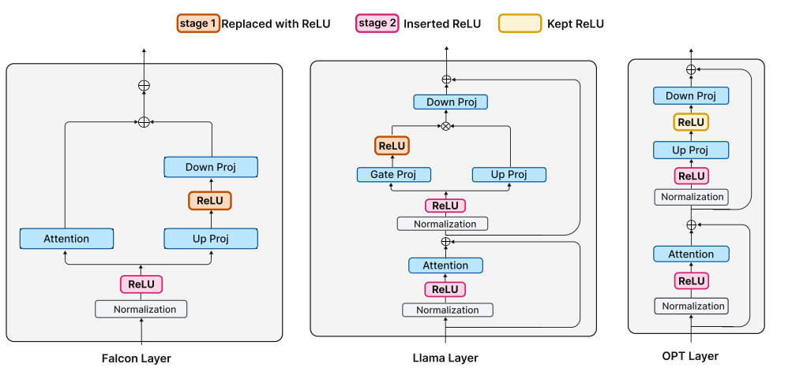
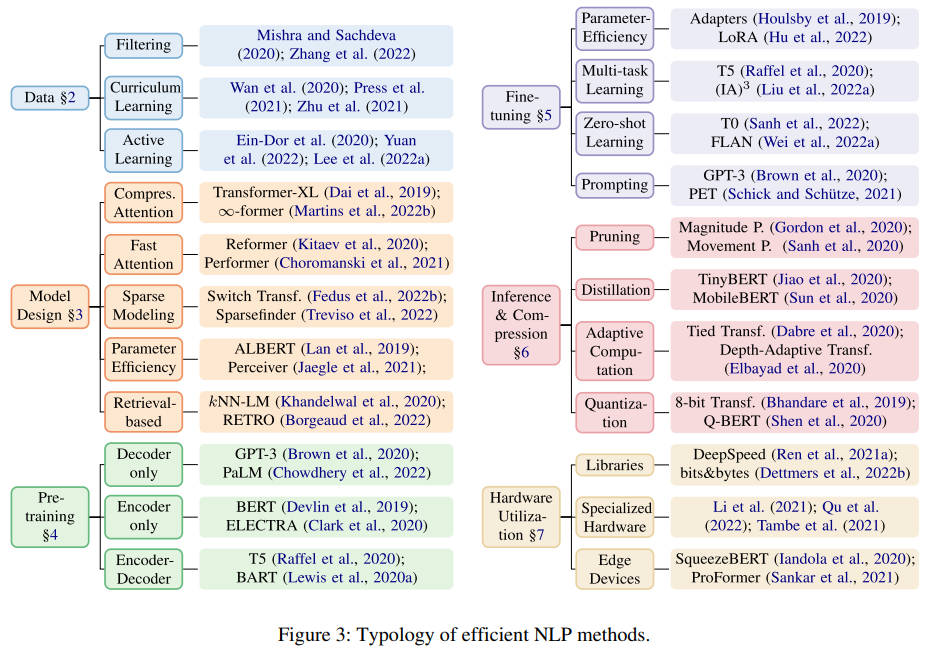
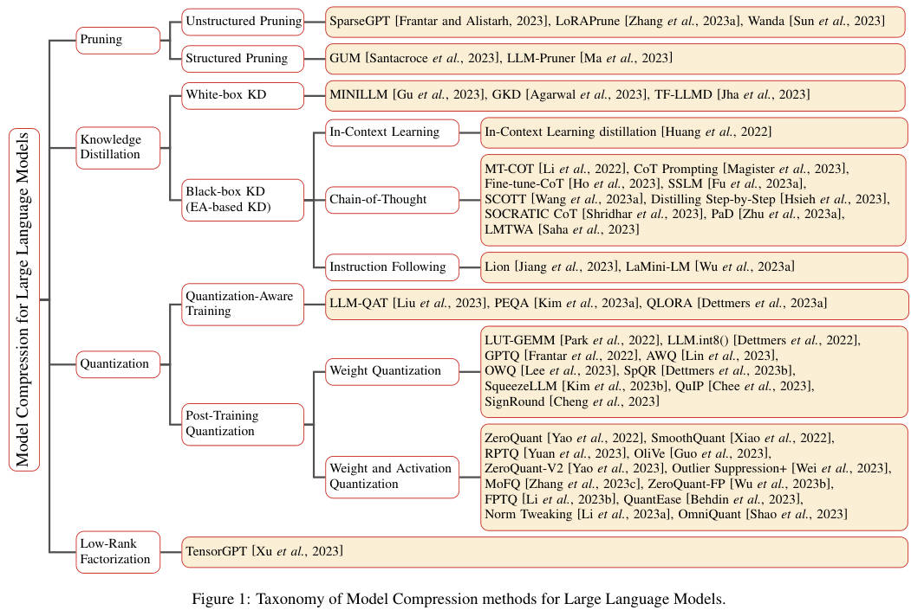

### year

 

<b>2024</b>
 

|    | meta                                          | ttttttttttttttttttttttttttttttitle                                                                                                                      | ccccccccccccccccccover                                                        | pub       |   year | codeeeee                                                                                                                    | note                                                                                                                              |
|---:|:----------------------------------------------|:--------------------------------------------------------------------------------------------------------------------------------------------------------|:------------------------------------------------------------------------------|:----------|-------:|:----------------------------------------------------------------------------------------------------------------------------|:----------------------------------------------------------------------------------------------------------------------------------|
|  0 | [FLAP](./meta/flap.prototxt)                  | [Fluctuation-based Adaptive Structured Pruning for Large Language Models](https://arxiv.org/abs/2312.11983)                                             |                           | AAAI      |   2024 |                                                 | [note](https://z6oqkldvmo.feishu.cn/docx/JFFQdAxz3oWX2Kx6j91c2kamnqd)                                                             |
|  1 | [Plug-and-Play](./meta/IA8CS3VH.prototxt)     | [Plug-and-Play: An Efficient Post-training Pruning Method for Large Language Models](https://openreview.net/forum?id=Tr0lPx9woF)                        |                  | ICLR      |   2024 |  |                                                                                                                                   |
|  2 | [QA-LoRA](./meta/QA-LoRA.prototxt)            | [QA-LoRA: Quantization-Aware Low-Rank Adaptation of Large Language Models](https://arxiv.org/abs/2309.14717)                                            |                 | ICLR      |   2024 |                                                | [note](./notes/QA-LoRA/note.md)                                                                                                   |
|  3 | [ReLU Strikes Back](./meta/HMR7HKFV.prototxt) | [ReLU Strikes Back: Exploiting Activation Sparsity in Large Language Models](https://arxiv.org/abs/2310.04564)                                          |              | ICLR oral |   2024 |                                              | [note](https://confluence.xilinx.com/display/aialgo/ReLU+Strikes+Back%3A+Exploiting+Activation+Sparsity+in+Large+Language+Models) |
|  4 | [Flash-LLM](./meta/flash_llm.prototxt)        | [Flash-LLM: Enabling Cost-Effective and Highly-Efficient Large Generative Model Inference with Unstructured Sparsity](https://arxiv.org/abs/2309.10285) |                | VLDB      |   2024 |                                          | [note](./notes/flash_llm/index.md)                                                                                                |
|  5 | [Bonsa](./meta/Bonsa.prototxt)                | [Everybody Prune Now: Structured Pruning of LLMs with only Forward Passes](https://arxiv.org/abs/2402.05406)                                            |                                                                               | arXiv     |   2024 |                                                       |                                                                                                                                   |
|  6 | [L4Q](./meta/L4Q.prototxt)                    | [L4Q: Parameter Efficient Quantization-Aware Training on Large Language Models via LoRA-wise LSQ](https://arxiv.org/abs/2402.04902)                     |                        | arXiv     |   2024 |                                                                                                                             | [note](./notes/L4Q/note.md)                                                                                                       |
|  7 | [LISA](./meta/LISA.prototxt)                  | [LISA: Layerwise Importance Sampling for Memory-Efficient Large Language Model Fine-Tuning](http://arxiv.org/abs/2403.17919v1)                          |                                                                               | arXiv     |   2024 |                                                                                                                             |                                                                                                                                   |
|  8 | [LLM in a flash](./meta/5JWFQDDP.prototxt)    | [LLM in a flash: Efficient Large Language Model Inference with Limited Memory](https://arxiv.org/abs/2312.11514)                                        |  | arXiv     |   2024 |                                                                                                                             | [note](https://z6oqkldvmo.feishu.cn/docx/GBVrdR4iyotc83xMU1Hc9ZOGntb)                                                             |
|  9 | [ProSparse](./meta/ProSparse.prototxt)        | [ProSparse: Introducing and Enhancing Intrinsic Activation Sparsity within Large Language Models](https://arxiv.org/abs/2402.13516)                     |            | arXiv     |   2024 |                                                                                                                             | [note](./notes/ProSparse/note.md)                                                                                                 |
| 10 | [ReLU2](./meta/ReLU2.prototxt)                | [ReLU2 Wins: Discovering Efficient Activation Functions for Sparse LLMs](https://arxiv.org/abs/2402.03804)                                              |               | arXiv     |   2024 |                                                                                                                             | [note](./notes/ReLU2/note.md)                                                                                                     |

<b>2023</b>
 

|    | meta                                                                       | ttttttttttttttttttttttttttttttitle                                                                                                                                              | ccccccccccccccccccover                                                                                  | pub             |   year | codeeeee                                                                                      | note                                                                                                                             |
|---:|:---------------------------------------------------------------------------|:--------------------------------------------------------------------------------------------------------------------------------------------------------------------------------|:--------------------------------------------------------------------------------------------------------|:----------------|-------:|:----------------------------------------------------------------------------------------------|:---------------------------------------------------------------------------------------------------------------------------------|
|  0 | [Diffuser](./meta/diffuser.prototxt)                                       | [Diffuser: Efficient Transformers with Multi-hop Attention Diffusion for Long Sequences](https://arxiv.org/abs/2210.11794)                                                      |                                        | AAAI            |   2023 |                      |                                                                                                                                  |
|  1 | [GRAIN](./meta/grain.prototxt)                                             | [Gradient-based Intra-attention Pruning on Pre-trained Language Models](https://arxiv.org/abs/2212.07634)                                                                       |                                              | ACL             |   2023 |                        | [note](./notes/grain/index.md)                                                                                                   |
|  2 | [SMP](./meta/smp.prototxt)                                                 | [Pruning Pre-trained Language Models Without Fine-Tuning](https://aclanthology.org/2023.acl-long.35.pdf)                                                                        |                                                  | ACL             |   2023 |                           |                                                                                                                                  |
|  3 | [PINS](./meta/PINS.prototxt)                                               | [Pruning Pre-trained Language Models with Principled Importance and Self-regularization](https://aclanthology.org/2023.findings-acl.573/)                                       |                                                                                                         | ACL Findings    |   2023 |                            |                                                                                                                                  |
|  4 | [SIMPLE](./meta/simple.prototxt)                                           | [Structured Pruning for Efficient Generative Pre-trained Language Models](https://aclanthology.org/2023.findings-acl.692.pdf)                                                   |                                             | ACL Findings    |   2023 |                                                                                               | [note](./notes/simple/index.md)                                                                                                  |
|  5 | [m](./meta/WDCO13S6.prototxt)                                              | [Structural Pruning of Large Language Models via Neural Architecture Search](https://openreview.net/forum?id=SHlZcInS6C)                                                        |                                  | AutoML Workshop |   2023 |                    |                                                                                                                                  |
|  6 | [SparseViT](./meta/SparseViT.prototxt)                                     | [SparseViT: Revisiting Activation Sparsity for Efficient High-Resolution Vision Transformer](https://arxiv.org/abs/2303.17605)                                                  |                                      | CVPR            |   2023 |                | [note](./notes/sparsevit/index.md)                                                                                               |
|  7 | [TorchSparse++](./meta/TorchSparse.prototxt)                               | [TorchSparse++: Efficient Point Cloud Engine](https://openaccess.thecvf.com/content/CVPR2023W/WAD/papers/Tang_TorchSparse_Efficient_Point_Cloud_Engine_CVPRW_2023_paper.pdf)    |                                                                                                         | CVPR workshop   |   2023 |              |                                                                                                                                  |
|  8 | [AdaLoRA](./meta/adalora.prototxt)                                         | [AdaLoRA: Adaptive Budget Allocation for Parameter-Efficient Fine-Tuning](https://arxiv.org/pdf/2303.10512.pdf)                                                                 |                                          | ICLR            |   2023 |                  |                                                                                                                                  |
|  9 | [GPTQ](./meta/gptq.prototxt)                                               | [GPTQ: Accurate Post-Training Quantization for Generative Pre-trained Transformers](https://arxiv.org/pdf/2210.17323.pdf)                                                       |                                                                                                         | ICLR            |   2023 |                      |                                                                                                                                  |
| 10 | [MVUE](./meta/MVUE.prototxt)                                               | [Minimum Variance Unbiased N:M Sparsity for the Neural Gradients](https://openreview.net/pdf?id=vuD2xEtxZcj)                                                                    |                                                                                                         | ICLR            |   2023 |                                                                                               |                                                                                                                                  |
| 11 | [m](./meta/WMMGA0AR.prototxt)                                              | [The Lazy Neuron Phenomenon: On Emergence of Activation Sparsity in Transformers](https://openreview.net/forum?id=TJ2nxciYCk-)                                                  |                                                                                                         | ICLR            |   2023 |                                                                                               |                                                                                                                                  |
| 12 | [Deja Vu](./meta/dejavu.prototxt)                                          | [Deja Vu: Contextual Sparsity for Efficient LLMs at Inference Time](https://openreview.net/forum?id=wIPIhHd00i)                                                                 |                                            | ICML            |   2023 |                   |                                                                                                                                  |
| 13 | [LoSparse](./meta/LoSparse.prototxt)                                       | [Structured Compression of Large Language Models based on Low-Rank and Sparse Approximation](https://arxiv.org/abs/2306.11222)                                                  |                                        | ICML            |   2023 |                    |                                                                                                                                  |
| 14 | [nmSPARSE](./meta/nmSPARSE.prototxt)                                       | [Efficient GPU Kernels for N:M-Sparse Weights in Deep Learning](https://proceedings.mlsys.org/paper_files/paper/2023/file/4552cedd396a308320209f75f56a5ad5-Paper-mlsys2023.pdf) |                                                                                                         | MLSys           |   2023 |                     |                                                                                                                                  |
| 15 | [ZipLM](./meta/ZipLM.prototxt)                                             | [ZipLM: Inference-Aware Structured Pruning of Language Models](https://openreview.net/pdf?id=bPFFPueAxm)                                                                        |                                              | NeurIPS         |   2023 |                     |                                                                                                                                  |
| 16 | [m](./meta/68I8KKBV.prototxt)                                              | [Efficient Methods for Natural Language Processing: A Survey](https://arxiv.org/abs/2209.00099)                                                                                 |                                     | TACL            |   2023 |                                                                                               |                                                                                                                                  |
| 17 | [SPDF](./meta/spdf.prototxt)                                               | [SPDF: Sparse Pre-training and Dense Fine-tuning for Large Language Models](https://arxiv.org/abs/2303.10464)                                                                   |                                                                                                         | UAI             |   2023 |                                                                                               | [note](https://confluence.amd.com/display/~xiandong/SPDF%3A+Sparse+Pre-training+and+Dense+Fine-tuning+for+Large+Language+Models) |
| 18 | [Wanda](./meta/wanda.prototxt)                                             | [A Simple and Effective Pruning Approach for Large Language Models](https://arxiv.org/pdf/2306.11695.pdf)                                                                       |                                                                                                         | arXiv           |   2023 |                       | [note](https://confluence.xilinx.com/display/aialgo/Wanda%3A+A+Simple+and+Effective+Pruning+Approach+for+Large+Language+Models)  |
| 19 | [m](./meta/ELILXDQG.prototxt)                                              | [A Survey on Evaluation of Large Language Models](https://arxiv.org/abs/2307.03109)                                                                                             |                                          | arXiv           |   2023 |                                                                                               |                                                                                                                                  |
| 20 | [m](./meta/L5D7520E.prototxt)                                              | [A Survey on Model Compression for Large Language Models](https://arxiv.org/abs/2308.07633)                                                                                     |                                   | arXiv           |   2023 |                                                                                               |                                                                                                                                  |
| 21 | [AWQ](./meta/awq.prototxt)                                                 | [AWQ: Activation-aware Weight Quantization for LLM Compression and Acceleration](https://arxiv.org/abs/2306.00978)                                                              |                                                                                                         | arXiv           |   2023 |                  |                                                                                                                                  |
| 22 | [Compresso](./meta/Compresso.prototxt)                                     | [Compresso: Structured Pruning with Collaborative Prompting Learns Compact Large Language Models](https://arxiv.org/abs/2310.05015)                                             |                                          | arXiv           |   2023 |                    | [note](./notes/compresso/note.md)                                                                                                |
| 23 | [Adaptively Sparse Attention](./meta/adaptively_sparse_attention.prototxt) | [Dynamic Context Pruning for Efficient and Interpretable Autoregressive Transformers](https://arxiv.org/abs/2305.15805)                                                         |  | arXiv           |   2023 |                                                                                               |                                                                                                                                  |
| 24 | [MeZO](./meta/mezo.prototxt)                                               | [Fine-Tuning Language Models with Just Forward Passes](https://arxiv.org/pdf/2305.17333.pdf)                                                                                    |                                                                                                         | arXiv           |   2023 |                   | [note](https://confluence.xilinx.com/display/aialgo/Fine-Tuning+Language+Models+with+Just+Forward+Passes)                        |
| 25 | [FlashAttention-2](./meta/flashattention2.prototxt)                        | [FlashAttention-2: Faster Attention with Better Parallelism and Work Partitioning](https://arxiv.org/abs/2307.08691)                                                            |                                                                                                         | arXiv           |   2023 |            |                                                                                                                                  |
| 26 | [KCM](./meta/kcm.prototxt)                                                 | [Gradient-Free Structured Pruning with Unlabeled Data](https://arxiv.org/abs/2303.04185)                                                                                        |                                                  | arXiv           |   2023 |                                                                                               | [note](https://confluence.xilinx.com/display/aialgo/Gradient-Free+Structured+Pruning+with+Unlabeled+Data?moved=true)             |
| 27 | [K-pruning](./meta/k_pruning.prototxt)                                     | [Knowledge-preserving Pruning for Pre-trained Language Models without Retraining](https://arxiv.org/abs/2308.03449)                                                             |                                             | arXiv           |   2023 |                                                                                               | [note](./notes/k_pruning/note.md)                                                                                                |
| 28 | [LLM-Pruner](./meta/llmpruner.prototxt)                                    | [LLM-Pruner: On the Structural Pruning of Large Language Models](https://arxiv.org/abs/2305.11627)                                                                              |                                         | arXiv           |   2023 |                   | [note](https://confluence.xilinx.com/display/aialgo/LLM-Pruner%3A+On+the+Structural+Pruning+of+Large+Language+Models)            |
| 29 | [LoRAShear](./meta/lorashear.prototxt)                                     | [LoRAShear: Efficient Large Language Model Structured Pruning and Knowledge Recovery](https://arxiv.org/abs/2310.18356)                                                         |                                                                                                         | arXiv           |   2023 |                                                                                               |                                                                                                                                  |
| 30 | [LoftQ](./meta/loftq.prototxt)                                             | [LoftQ: LoRA-Fine-Tuning-Aware Quantization for Large Language Models](https://arxiv.org/abs/2310.08659)                                                                        |                                              | arXiv           |   2023 |                       | [note](./notes/loftq/note.md)                                                                                                    |
| 31 | [OmniQuant](./meta/omniquant.prototxt)                                     | [OmniQuant: Omnidirectionally Calibrated Quantization for Large Language Models](https://arxiv.org/abs/2308.13137)                                                              |                                      | arXiv           |   2023 |                  |                                                                                                                                  |
| 32 | [OWL](./meta/owl.prototxt)                                                 | [Outlier Weighed Layerwise Sparsity (OWL): A Missing Secret Sauce for Pruning LLMs to High Sparsity](https://arxiv.org/pdf/2310.05175.pdf)                                      |                                                | arXiv           |   2023 |                           |                                                                                                                                  |
| 33 | [GPFQv2](./meta/gpfqv2.prototxt)                                           | [Post-training Quantization for Neural Networks with Provable Guarantees](https://arxiv.org/pdf/2201.11113.pdf)                                                                 |                                                                                                         | arXiv           |   2023 | [Pytorch](https://gitenterprise.xilinx.com/xiandong/GPFA)                                     | [note](https://confluence.xilinx.com/pages/viewpage.action?pageId=1005133974)                                                    |
| 34 | [GBDT](./meta/gbdt.prototxt)                                               | [Pruning Large Language Models via Accuracy Predictor](https://arxiv.org/abs/2309.09507)                                                                                        |                                                | arXiv           |   2023 |                                                                                               |                                                                                                                                  |
| 35 | [QLoRA](./meta/qlora.prototxt)                                             | [QLoRA: Efficient Finetuning of Quantized LLMs](https://arxiv.org/abs/2305.14314)                                                                                               |                                              | arXiv           |   2023 |                       |                                                                                                                                  |
| 36 | [QuIP](./meta/QuIP.prototxt)                                               | [QuIP: Quantization with Incoherence Processing](https://arxiv.org/pdf/2307.13304.pdf)                                                                                          |                                                                                                         | arXiv           |   2023 |                      |                                                                                                                                  |
| 37 | [RPTQ](./meta/RPTQ.prototxt)                                               | [RPTQ: Reorder-based Post-training Quantization for Large Language Models](https://arxiv.org/pdf/2304.01089.pdf)                                                                |                                                                                                         | arXiv           |   2023 |                    |                                                                                                                                  |
| 38 | [LLM-shearing](./meta/LLM_shearing.prototxt)                               | [Sheared LLaMA: Accelerating Language Model Pre-training via Structured Pruning](https://xiamengzhou.github.io/sheared-llama/)                                                  |                                       | arXiv           |   2023 |           | [note](./notes/llm_shearing/note.md)                                                                                             |
| 39 | [SpQR](./meta/spqr.prototxt)                                               | [SpQR: A Sparse-Quantized Representation for Near-Lossless LLM Weight Compression](https://arxiv.org/pdf/2306.03078.pdf)                                                        |                                                                                                         | arXiv           |   2023 |                        |                                                                                                                                  |
| 40 | [SquareHead](./meta/SquareHead.prototxt)                                   | [Sparse Fine-tuning for Inference Acceleration of Large Language Models](https://arxiv.org/pdf/2310.06927.pdf)                                                                  |                                         | arXiv           |   2023 |          |                                                                                                                                  |
| 41 | [Sparse-IFT](./meta/Sparse-IFT.prototxt)                                   | [Sparse Iso-FLOP Transformations for Maximizing Training Efficiency](https://arxiv.org/abs/2303.11525)                                                                          |                                                                                                         | arXiv           |   2023 |          | [note](https://confluence.amd.com/display/~xiandong/Sparse+Iso-FLOP+Transformations+for+Maximizing+Training+Efficiency)          |
| 42 | [SMS](./meta/sms.prototxt)                                                 | [Sparse Model Soups: A Recipe for Improved Pruning via Model Averaging](https://arxiv.org/abs/2306.16788)                                                                       |                                                  | arXiv           |   2023 |                          | [note](https://confluence.xilinx.com/display/aialgo/Sparse+Model+Soups%3A+A+Recipe+for+Improved+Pruning+via+Model+Averaging)     |
| 43 | [SparseGPT](./meta/sparsegpt.prototxt)                                     | [SparseGPT: Massive Language Models Can be Accurately Pruned in one-shot.](https://arxiv.org/pdf/2301.00774.pdf)                                                                |                                                                                                         | arXiv           |   2023 |                 | [note](./notes/SparseGPT.md)                                                                                                     |
| 44 | [SqueezeLLM](./meta/SqueezeLLM.prototxt)                                   | [SqueezeLLM: Dense-and-Sparse Quantization](https://arxiv.org/abs/2306.07629)                                                                                                   |                                                                                                         | arXiv           |   2023 |              |                                                                                                                                  |
| 45 | [m](./meta/AYB1XUO5.prototxt)                                              | [Ten Lessons We Have Learned in the New Sparseland: A Short Handbook for Sparse Neural Network Researchers](https://arxiv.org/abs/2302.02596)                                   |                                                                                                         | arXiv           |   2023 |                                                                                               |                                                                                                                                  |
| 46 | [Essential Sparsity](./meta/EssentialSparsity.prototxt)                    | [The Emergence of Essential Sparsity in Large Pre-trained Models: The Weights that Matter](https://arxiv.org/abs/2306.03805)                                                    |                                                                                                         | arXiv           |   2023 |        |                                                                                                                                  |
| 47 | [m](./meta/23LQ9SVH.prototxt)                                              | [Training Transformers with 4-bit Integers](https://arxiv.org/abs//2306.11987)                                                                                                  |                                                                                                         | arXiv           |   2023 |  |                                                                                                                                  |
| 48 | [Selective Context](./meta/selective_context.prototxt)                     | [Unlocking Context Constraints of LLMs: Enhancing Context Efficiency of LLMs with Self-Information-Based Content Filtering](https://arxiv.org/abs/2304.12102)                   |                      | arXiv           |   2023 |        |                                                                                                                                  |
| 49 | [ZeroQuant-V2](./meta/ZeroQuant-V2.prototxt)                               | [ZeroQuant-V2: Exploring Post-training Quantization in LLMs from Comprehensive Study to Low Rank Compensation](https://arxiv.org/abs/2303.08302)                                |                                                                                                         | arXiv           |   2023 |                  |                                                                                                                                  |
| 50 | [FT](./meta/fastertransfomer.prototxt)                                     | [FasterTransformer](https://github.com/NVIDIA/FasterTransformer)                                                                                                                |                                                                                                         | github          |   2023 |             |                                                                                                                                  |

<b>2022</b>
 

|    | meta                                                            | ttttttttttttttttttttttttttttttitle                                                                                                                              | ccccccccccccccccccover                                                      | pub                                    |   year | codeeeee                                                                                            | note                                                                         |
|---:|:----------------------------------------------------------------|:----------------------------------------------------------------------------------------------------------------------------------------------------------------|:----------------------------------------------------------------------------|:---------------------------------------|-------:|:----------------------------------------------------------------------------------------------------|:-----------------------------------------------------------------------------|
|  0 | [m](./meta/XZBX1Z9G.prototxt)                                   | [Sparse Progressive Distillation: Resolving Overfitting under Pretrain-and-Finetune Paradigm](https://aclanthology.org/2022.acl-long.16/)                       |                                                                             | ACL                                    |   2022 |  |                                                                              |
|  1 | [TextPruner](./meta/TextPruner.prototxt)                        | [TextPruner: A Model Pruning Toolkit for Pre-Trained Language Models](https://arxiv.org/abs/2203.15996)                                                         |        | ACL                                    |   2022 |                         |                                                                              |
|  2 | [m](./meta/2EQV34KV.prototxt)                                   | [Creating Sparse GPT-3 Models with Iterative Pruning](https://www.cerebras.net/blog/creating-sparse-gpt-3-models-with-iterative-pruning)                        |                                                                             | Blog                                   |   2022 |                                                                                                     |                                                                              |
|  3 | [LoRA](./meta/lora.prototxt)                                    | [LoRA: Low-rank adaptation of large language models](https://arxiv.org/abs/2106.09685)                                                                          |                    | ICLR                                   |   2022 |                             |                                                                              |
|  4 | [SPDY](./meta/spdy.prototxt)                                    | [SPDY: Accurate Pruning with Speedup Guarantees](https://arxiv.org/abs/2201.13096)                                                                              |                   | ICML                                   |   2022 |                            | [note](./notes/spdy/index.md)                                                |
|  5 | [Sprint](./meta/Sprint.prototxt)                                | [Sparse Attention Acceleration with Synergistic In-Memory Pruning and On-Chip Recomputation](https://arxiv.org/abs/2209.00606)                                  |                                                                             | MICRO                                  |   2022 |                                                                                                     |                                                                              |
|  6 | [FisherPruning](./meta/QA8XN7TU.prototxt)                       | [A Fast Post-Training Pruning Framework for Transformers](https://arxiv.org/abs/2204.09656)                                                                     |         | NeurIPS                                |   2022 |         | [note](https://confluence.xilinx.com/pages/viewpage.action?pageId=969271620) |
|  7 | [FlashAttention](./meta/flashattention.prototxt)                | [FlashAttention: Fast and Memory-Efficient Exact Attention with IO-Awareness](https://arxiv.org/abs/2205.14135)                                                 |         | NeurIPS                                |   2022 |                  |                                                                              |
|  8 | [m](./meta/QZ2EJHG9.prototxt)                                   | [On-Device Training Under 256KB Memory](https://arxiv.org/abs/2206.15472)                                                                                       |     | NeurIPS                                |   2022 | [mit.edu](https://tinyml.mit.edu/on-device-training/)                                               | [note](https://tinyml.mit.edu/on-device-training/)                           |
|  9 | [OBC](./meta/obc.prototxt)                                      | [Optimal Brain Compression: A Framework for Accurate Post-Training Quantization and Pruning](https://openreview.net/pdf?id=ksVGCOlOEba)                         |                                                                             | NeurIPS                                |   2022 |                             |                                                                              |
| 10 | [ZeroQuant](./meta/zeroquant.prototxt)                          | [ZeroQuant: Efficient and Affordable Post-Training Quantization for Large-Scale Transformers](https://openreview.net/forum?id=f-fVCElZ-G1)                      |                                                                             | NeurIPS                                |   2022 |                        |                                                                              |
| 11 | [Complementary Sparsity](./meta/ComplementarySparsity.prototxt) | [Two Sparsities Are Better Than One: Unlocking the Performance Benefits of Sparse-Sparse Networks](https://iopscience.iop.org/article/10.1088/2634-4386/ac7c8a) |  | Neuromorphic Computing and Engineering |   2022 |                                                                                                     | [note](./notes/ComplementarySparsity/note.md)                                |
| 12 | [STA](./meta/44KWQAWO.prototxt)                                 | [An Algorithm-Hardware Co-Optimized Framework for Accelerating N:M Sparse Transformers](https://arxiv.org/abs/2208.06118)                                       |                                                                             | VLSI                                   |   2022 |                                                                                                     |                                                                              |
| 13 | [oBERT](./meta/oBERT.prototxt)                                  | [The Optimal BERT Surgeon: Scalable and Accurate Second-Order Pruning for Large Language Models](https://arxiv.org/pdf/2203.07259.pdf)                          |                                                                             | arXiv                                  |   2022 |                       |                                                                              |

<b>2021</b>
 

|    | meta                                 | ttttttttttttttttttttttttttttttitle                                                                                                                                                                                                       | ccccccccccccccccccover                                        | pub           |   year | codeeeee                                                                                           | note                                                                                        |
|---:|:-------------------------------------|:-----------------------------------------------------------------------------------------------------------------------------------------------------------------------------------------------------------------------------------------|:--------------------------------------------------------------|:--------------|-------:|:---------------------------------------------------------------------------------------------------|:--------------------------------------------------------------------------------------------|
|  0 | [OpenVINO](./meta/OpenVINO.prototxt) | [Post-training deep neural network pruning via layer-wise calibration](https://openaccess.thecvf.com/content/ICCV2021W/LPCV/papers/Lazarevich_Post-Training_Deep_Neural_Network_Pruning_via_Layer-Wise_Calibration_ICCVW_2021_paper.pdf) |                                                               | ICCV workshop |   2021 | [EfficientCNN](https://gitenterprise.xilinx.com/xiandong/EfficientCNN/tree/post-training-sparsity) | [note](https://confluence.xilinx.com/pages/viewpage.action?pageId=1005133974)               |
|  1 | [BRECQ](./meta/brecq.prototxt)       | [BRECQ: Pushing the Limit of Post-Training Quantization by Block Reconstruction](https://openreview.net/pdf?id=POWv6hDd9XH)                                                                                                              |                                                               | ICLR          |   2021 |                              |                                                                                             |
|  2 | [SR-STE](./meta/sr-ste.prototxt)     | [Learning N:M Fine-grained Structured Sparse Neural Networks From Scratch](https://openreview.net/forum?id=K9bw7vqp_s)                                                                                                                   |  | ICLR          |   2021 |                       |                                                                                             |
|  3 | [GPFQ](./meta/gpfq.prototxt)         | [A Greedy Algorithm for Quantizing Neural Networks](https://jmlr.csail.mit.edu/papers/volume22/20-1233/20-1233.pdf)                                                                                                                      |                                                               | JMLR          |   2021 | [Pytorch](https://gitenterprise.xilinx.com/xiandong/GPFA)                                          | [note](https://confluence.xilinx.com/pages/viewpage.action?pageId=1005133974)               |
|  4 | [m](./meta/K7GSWQIC.prototxt)        | [Channel Permutations for N:M Sparsity](https://proceedings.neurips.cc/paper/2021/hash/6e8404c3b93a9527c8db241a1846599a-Abstract.html)                                                                                                   |                                                               | NeurIPS       |   2021 | [Pytorch](https://gitenterprise.xilinx.com/xiandong/permutation_nm_sparse)                         | [note](https://confluence.xilinx.com/display/aialgo/Channel+Permutation+for+N%3AM+Sparsity) |
|  5 | [NMSparse](./meta/PUHJMVCM.prototxt) | [Accelerating Sparse Deep Neural Networks](https://arxiv.org/abs/2104.08378)                                                                                                                                                             |                                                               | arXiv         |   2021 |                                                                                                    |                                                                                             |
|  6 | [m](./meta/ITZS3TU3.prototxt)        | [Sparsity in Deep Learning: Pruning and growth for efficient inference and training in neural networks](https://arxiv.org/abs/2102.00554)                                                                                                |                                                               | arXiv         |   2021 |                                                                                                    |                                                                                             |

<b>2020</b>
 

|    | meta                                                 | ttttttttttttttttttttttttttttttitle                                                                                                       | ccccccccccccccccccover                                              | pub     |   year | codeeeee                                                                                     | note   |
|---:|:-----------------------------------------------------|:-----------------------------------------------------------------------------------------------------------------------------------------|:--------------------------------------------------------------------|:--------|-------:|:---------------------------------------------------------------------------------------------|:-------|
|  0 | [m](./meta/2AL79IUH.prototxt)                        | [Fast Sparse ConvNets](https://openaccess.thecvf.com/content_CVPR_2020/papers/Elsen_Fast_Sparse_ConvNets_CVPR_2020_paper.pdf)            |                                                                     | CVPR    |   2020 |               |        |
|  1 | [m](./meta/V3MFIRLV.prototxt)                        | [Inducing and Exploiting Activation Sparsity for Fast Neural Network Inference](http://proceedings.mlr.press/v119/kurtz20a/kurtz20a.pdf) |                                                                     | ICML    |   2020 |                                                                                              |        |
|  2 | [Movement Pruning](./meta/movement_pruning.prototxt) | [Movement Pruning: Adaptive Sparsity by Fine-Tuning](https://arxiv.org/abs/2005.07683)                                                   |  | NeurIPS |   2020 |  |        |
|  3 | [blocksparse](./meta/blocksparse.prototxt)           | [GPU Kernels for Block-Sparse Weights](https://cdn.openai.com/blocksparse/blocksparsepaper.pdf)                                          |                                                                     | arXiv   |   2020 |                  |        |

<b>2019</b>
 

|    | meta                           | ttttttttttttttttttttttttttttttitle                                                                                     | ccccccccccccccccccover   | pub   |   year | codeeeee                                                                | note   |
|---:|:-------------------------------|:-----------------------------------------------------------------------------------------------------------------------|:-------------------------|:------|-------:|:------------------------------------------------------------------------|:-------|
|  0 | [ActNN](./meta/actnn.prototxt) | [ActNN: Reducing Training Memory Footprint via 2-Bit Activation Compressed Training](https://arxiv.org/abs/2104.14129) |                          | ICML  |   2019 |  |        |

<b>2018</b>
 

|    | meta                                     | ttttttttttttttttttttttttttttttitle                                                                                              | ccccccccccccccccccover   | pub   |   year | codeeeee                                                                                | note   |
|---:|:-----------------------------------------|:--------------------------------------------------------------------------------------------------------------------------------|:-------------------------|:------|-------:|:----------------------------------------------------------------------------------------|:-------|
|  0 | [ADMM-pruning](./meta/Z9R72EAT.prototxt) | [A Systematic DNN Weight Pruning Framework using Alternating Direction Method of Multipliers](https://arxiv.org/abs/1804.03294) |                          | ECCV  |   2018 |  |        |

<b>2017</b>
 

|    | meta                          | ttttttttttttttttttttttttttttttitle                                                                                  | ccccccccccccccccccover   | pub     |   year | codeeeee                                                               | note                                                                                                             |
|---:|:------------------------------|:--------------------------------------------------------------------------------------------------------------------|:-------------------------|:--------|-------:|:-----------------------------------------------------------------------|:-----------------------------------------------------------------------------------------------------------------|
|  0 | [DSD](./meta/dsd.prototxt)    | [DSD: Dense-Sparse-Dense Training for Deep Neural Networks](https://arxiv.org/pdf/1607.04381.pdf)                   |                          | ICLR    |   2017 |                                                                        | [note](https://confluence.xilinx.com/display/aialgo/DSD%3A+Dense-Sparse-Dense+Training+for+Deep+Neural+Networks) |
|  1 | [L-OBS](./meta/lobs.prototxt) | [Learning to Prune Deep Neural Networks via Layer-wise Optimal Brain Surgeon](https://arxiv.org/pdf/1705.07565.pdf) |                          | NeurIPS |   2017 |  |                                                                                                                  |

<b>2016</b>
 

|    | meta                                                | ttttttttttttttttttttttttttttttitle                                                                                                               | ccccccccccccccccccover   | pub   |   year | codeeeee   | note   |
|---:|:----------------------------------------------------|:-------------------------------------------------------------------------------------------------------------------------------------------------|:-------------------------|:------|-------:|:-----------|:-------|
|  0 | [Deep Compression](./meta/deepcompression.prototxt) | [Deep Compression: Compressing Deep Neural Networks with Pruning, Trained Quantization and Huffman Coding](https://arxiv.org/pdf/1510.00149.pdf) |                          | ICLR  |   2016 |            |        |

<b>1993</b>
 

|    | meta                       | ttttttttttttttttttttttttttttttitle                                                                                         | ccccccccccccccccccover   | pub   |   year | codeeeee   | note   |
|---:|:---------------------------|:---------------------------------------------------------------------------------------------------------------------------|:-------------------------|:------|-------:|:-----------|:-------|
|  0 | [OBS](./meta/obs.prototxt) | [Optimal Brain Surgeon and general network pruning](https://ieeexplore.ieee.org/stamp/stamp.jsp?tp=&arnumber=298572&tag=1) |                          |       |   1993 |            |        |

<b>1989</b>
 

|    | meta                       | ttttttttttttttttttttttttttttttitle                                                                                            | ccccccccccccccccccover   | pub     |   year | codeeeee   | note   |
|---:|:---------------------------|:------------------------------------------------------------------------------------------------------------------------------|:-------------------------|:--------|-------:|:-----------|:-------|
|  0 | [OBD](./meta/obd.prototxt) | [Optimal Brain Damage](https://proceedings.neurips.cc/paper_files/paper/1989/file/6c9882bbac1c7093bd25041881277658-Paper.pdf) |                          | NeurIPS |   1989 |            |        |

