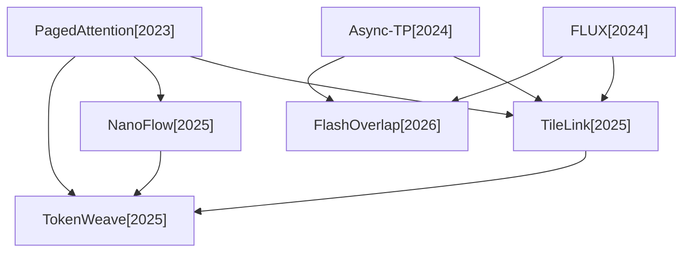
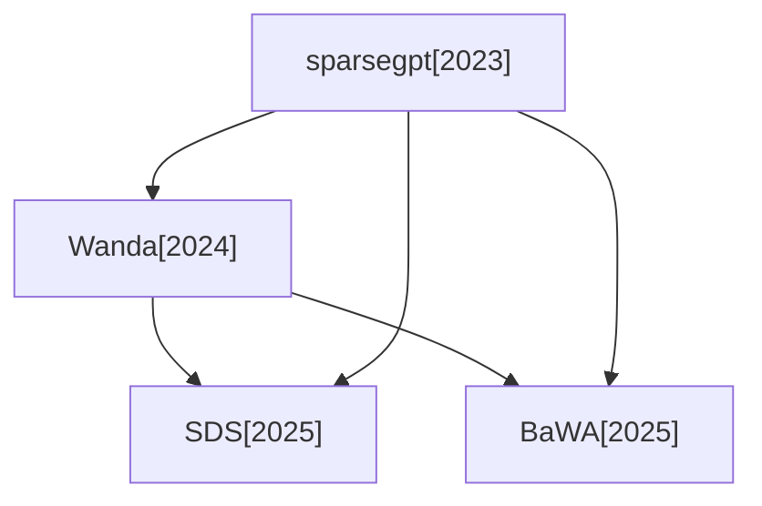
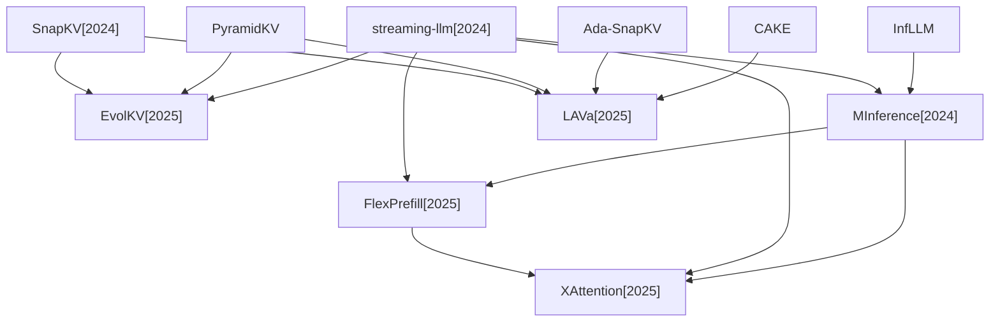
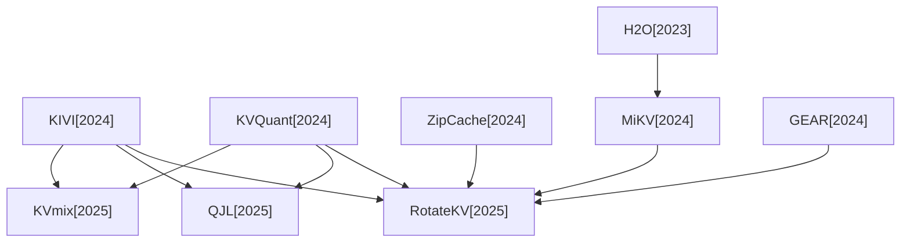

# Baseline Methods Graph

This page visualizes baseline-method relationships extracted from meta files.

## Component 1

```mermaid
flowchart TD
    2025_TileLink["TileLink[2025]"]
    2024_FLUX["FLUX[2024]"]
    2025_TokenWeave["TokenWeave[2025]"]
    2023_PagedAttention["PagedAttention[2023]"]
    2025_NanoFlow["NanoFlow[2025]"]
    2024_Async_TP["Async-TP[2024]"]
    2026_FlashOverlap["FlashOverlap[2026]"]
    2025_TileLink --> 2025_TokenWeave
    2024_FLUX --> 2025_TileLink
    2024_FLUX --> 2026_FlashOverlap
    2023_PagedAttention --> 2025_TileLink
    2023_PagedAttention --> 2025_NanoFlow
    2023_PagedAttention --> 2025_TokenWeave
    2025_NanoFlow --> 2025_TokenWeave
    2024_Async_TP --> 2025_TileLink
    2024_Async_TP --> 2026_FlashOverlap
```

## Component 2

```mermaid
flowchart TD
    2024_Wanda["Wanda[2024]"]
    2025_SDS["SDS[2025]"]
    2023_sparsegpt["sparsegpt[2023]"]
    2025_BaWA["BaWA[2025]"]
    2024_Wanda --> 2025_SDS
    2024_Wanda --> 2025_BaWA
    2023_sparsegpt --> 2025_SDS
    2023_sparsegpt --> 2025_BaWA
    2023_sparsegpt --> 2024_Wanda
```

## Component 3

```mermaid
flowchart TD
    CAKE["CAKE"]
    2025_EvolKV["EvolKV[2025]"]
    InfLLM["InfLLM"]
    Ada_SnapKV["Ada-SnapKV"]
    2024_MInference["MInference[2024]"]
    2024_streaming_llm["streaming-llm[2024]"]
    PyramidKV["PyramidKV"]
    2025_FlexPrefill["FlexPrefill[2025]"]
    2025_XAttention["XAttention[2025]"]
    2025_LAVa["LAVa[2025]"]
    2024_SnapKV["SnapKV[2024]"]
    CAKE --> 2025_LAVa
    InfLLM --> 2024_MInference
    Ada_SnapKV --> 2025_LAVa
    2024_MInference --> 2025_FlexPrefill
    2024_MInference --> 2025_XAttention
    2024_streaming_llm --> 2025_EvolKV
    2024_streaming_llm --> 2025_FlexPrefill
    2024_streaming_llm --> 2025_XAttention
    2024_streaming_llm --> 2024_MInference
    PyramidKV --> 2025_EvolKV
    PyramidKV --> 2025_LAVa
    2025_FlexPrefill --> 2025_XAttention
    2024_SnapKV --> 2025_EvolKV
    2024_SnapKV --> 2025_LAVa
```

## Component 4

```mermaid
flowchart TD
    2024_KIVI["KIVI[2024]"]
    2025_KVmix["KVmix[2025]"]
    2024_KVQuant["KVQuant[2024]"]
    2025_QJL["QJL[2025]"]
    2025_RotateKV["RotateKV[2025]"]
    2023_H2O["H2O[2023]"]
    2024_ZipCache["ZipCache[2024]"]
    2024_MiKV["MiKV[2024]"]
    2024_GEAR["GEAR[2024]"]
    2024_KIVI --> 2025_KVmix
    2024_KIVI --> 2025_QJL
    2024_KIVI --> 2025_RotateKV
    2024_KVQuant --> 2025_KVmix
    2024_KVQuant --> 2025_QJL
    2024_KVQuant --> 2025_RotateKV
    2023_H2O --> 2024_MiKV
    2024_ZipCache --> 2025_RotateKV
    2024_MiKV --> 2025_RotateKV
    2024_GEAR --> 2025_RotateKV
```
