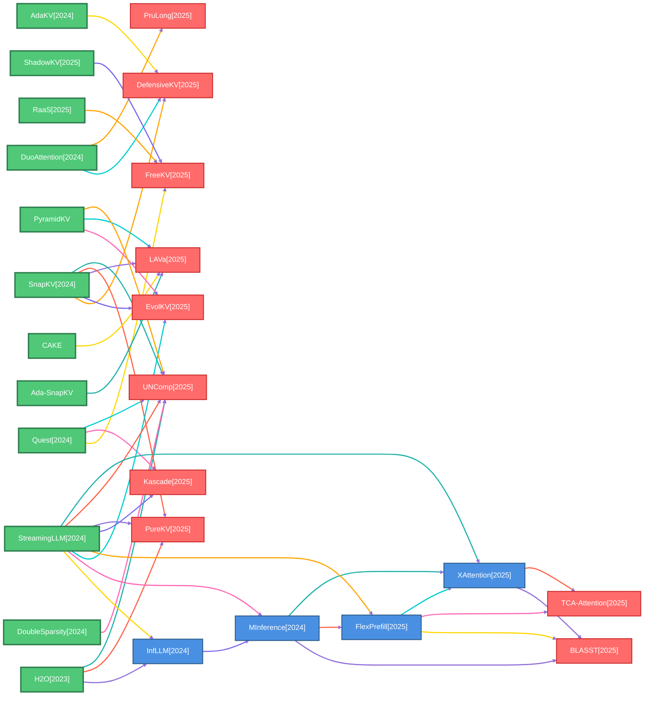
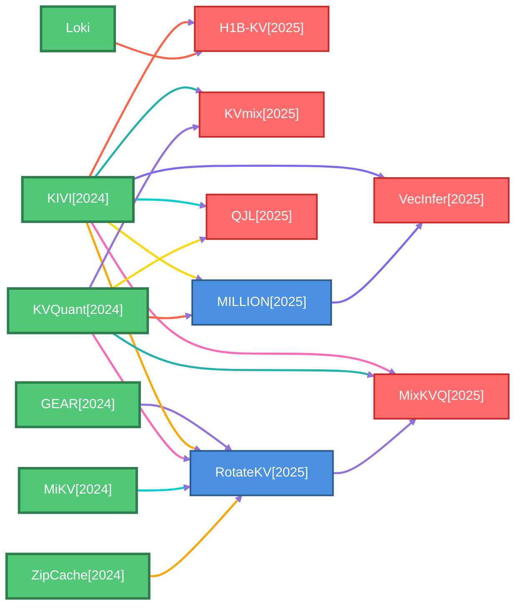
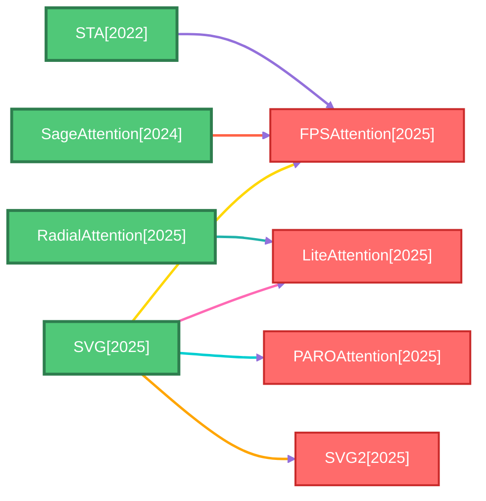
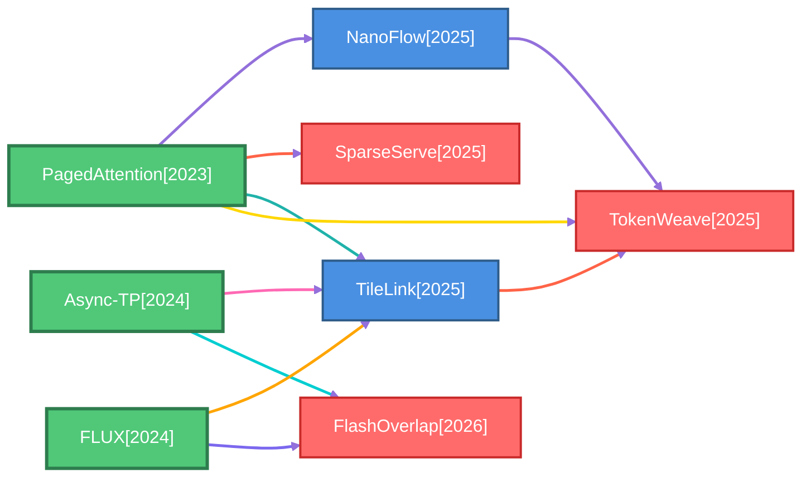
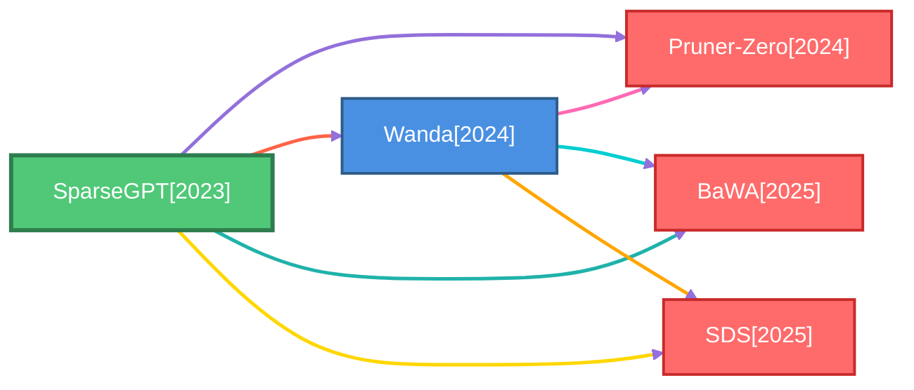

# Baseline Methods Graph

This page visualizes baseline-method relationships extracted from meta files.

Each component represents a family of related methods, showing how newer papers build upon previous baseline methods.

## StreamingLLM Family

*26 methods, 39 relationships*

## KIVI Family

*13 methods, 18 relationships*

## SVG Family

*8 methods, 7 relationships*

## PagedAttention Family

*8 methods, 10 relationships*

## SparseGPT Family

*5 methods, 7 relationships*

## GPTQ Family

*2 methods, 1 relationships*

## DHC Family

*2 methods, 1 relationships*

## NSA Family

*2 methods, 1 relationships*

