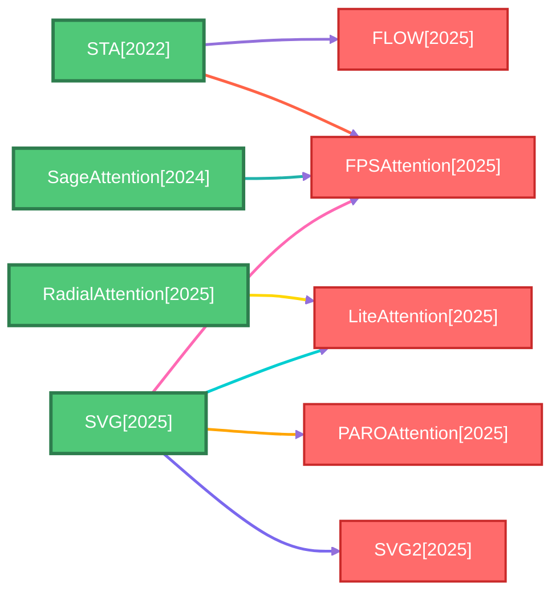
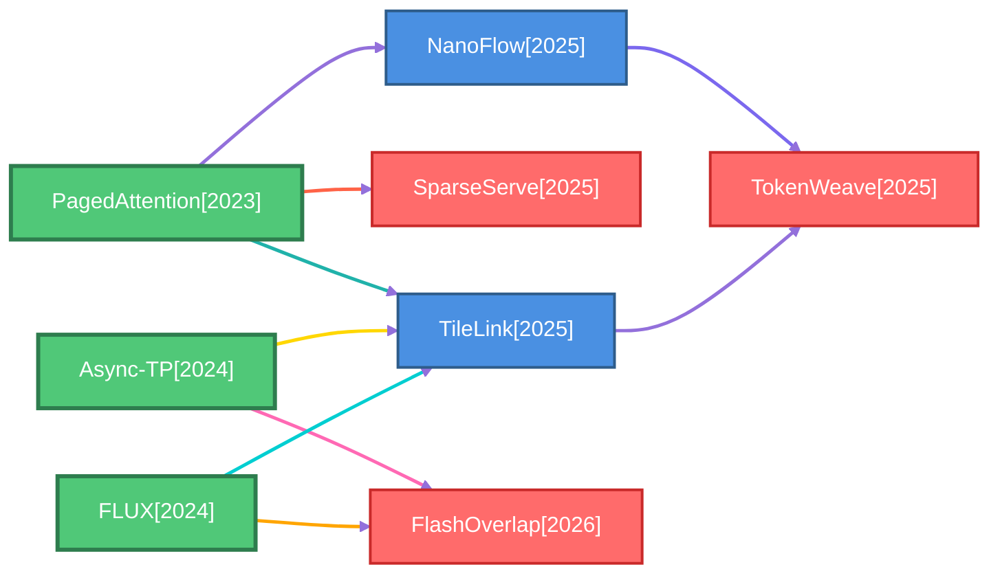
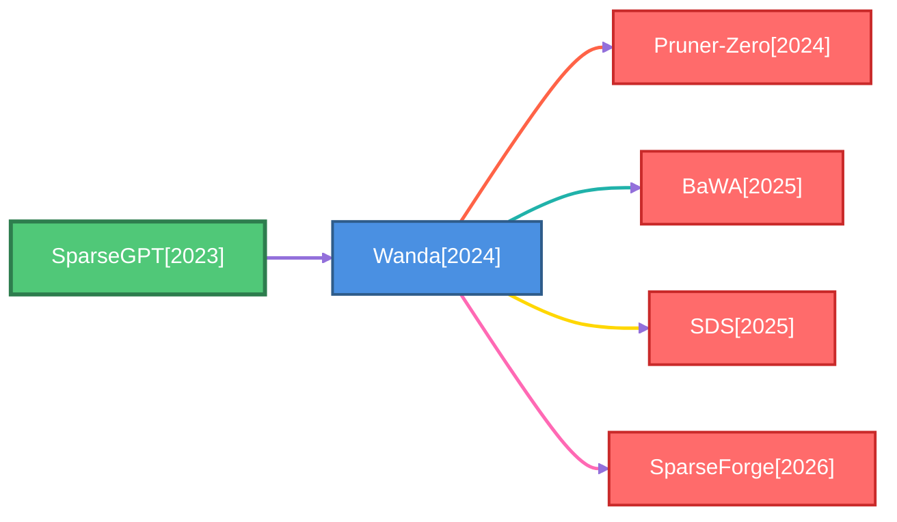
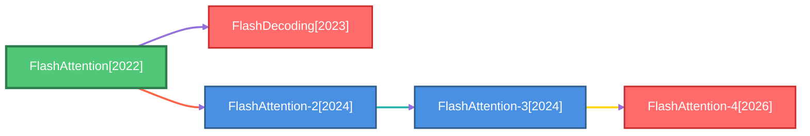
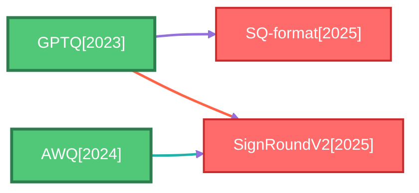
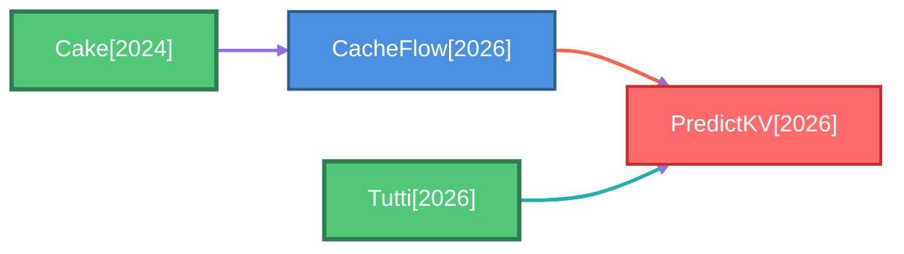
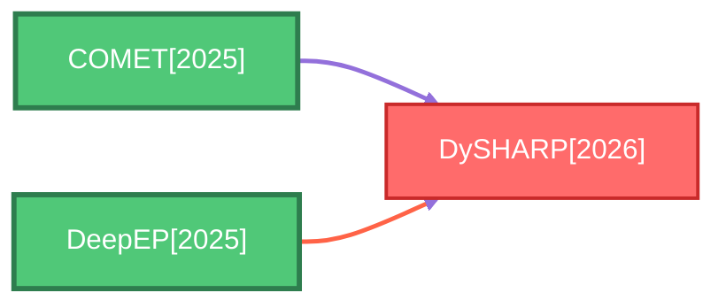
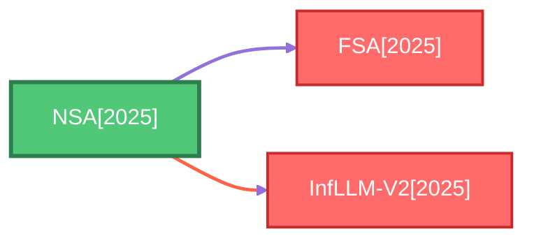
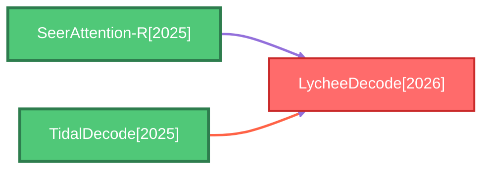

# Baseline Methods Graph

This page visualizes baseline-method relationships extracted from meta files.

Each component represents a family of related methods, showing how newer papers build upon previous baseline methods.

## KIVI Family

*74 methods, 88 relationships*

```mermaid
flowchart LR
    classDef defaultNode fill:#4A90E2,stroke:#2E5C8A,stroke-width:2px,color:#fff
    classDef rootNode fill:#50C878,stroke:#2E7D4E,stroke-width:3px,color:#fff
    classDef leafNode fill:#FF6B6B,stroke:#C92A2A,stroke-width:2px,color:#fff
    linkStyle default stroke:#9370DB,stroke-width:2px

    2023_CacheGen["CacheGen[2023]"]
    class 2023_CacheGen rootNode
    click 2023_CacheGen "../?search=CacheGen" _blank
    2023_FlexGen["FlexGen[2023]"]
    class 2023_FlexGen rootNode
    click 2023_FlexGen "../?search=FlexGen" _blank
    2023_H2O["H2O[2023]"]
    class 2023_H2O rootNode
    click 2023_H2O "../?search=H2O" _blank
    2023_QuIP["QuIP[2023]"]
    class 2023_QuIP rootNode
    click 2023_QuIP "../?search=QuIP" _blank
    2023_vLLM["vLLM[2023]"]
    class 2023_vLLM rootNode
    click 2023_vLLM "../?search=vLLM" _blank
    2024_AdaKV["AdaKV[2024]"]
    class 2024_AdaKV rootNode
    click 2024_AdaKV "../?search=AdaKV" _blank
    2024_CachedAttention["CachedAttention[2024]"]
    class 2024_CachedAttention rootNode
    click 2024_CachedAttention "../?search=CachedAttention" _blank
    2024_DoubleSparsity["DoubleSparsity[2024]"]
    class 2024_DoubleSparsity rootNode
    click 2024_DoubleSparsity "../?search=DoubleSparsity" _blank
    2024_DuoAttention["DuoAttention[2024]"]
    class 2024_DuoAttention rootNode
    click 2024_DuoAttention "../?search=DuoAttention" _blank
    2024_GEAR["GEAR[2024]"]
    class 2024_GEAR rootNode
    click 2024_GEAR "../?search=GEAR" _blank
    2024_InfLLM["InfLLM[2024]"]
    class 2024_InfLLM defaultNode
    click 2024_InfLLM "../?search=InfLLM" _blank
    2024_KIVI["KIVI[2024]"]
    class 2024_KIVI rootNode
    click 2024_KIVI "../?search=KIVI" _blank
    2024_KVQuant["KVQuant[2024]"]
    class 2024_KVQuant rootNode
    click 2024_KVQuant "../?search=KVQuant" _blank
    2024_LazyLLM["LazyLLM[2024]"]
    class 2024_LazyLLM rootNode
    click 2024_LazyLLM "../?search=LazyLLM" _blank
    2024_MInference["MInference[2024]"]
    class 2024_MInference defaultNode
    click 2024_MInference "../?search=MInference" _blank
    2024_MiKV["MiKV[2024]"]
    class 2024_MiKV rootNode
    click 2024_MiKV "../?search=MiKV" _blank
    2024_Mooncake["Mooncake[2024]"]
    class 2024_Mooncake rootNode
    click 2024_Mooncake "../?search=Mooncake" _blank
    2024_PyramidKV["PyramidKV[2024]"]
    class 2024_PyramidKV defaultNode
    click 2024_PyramidKV "../?search=PyramidKV" _blank
    2024_QuaRot["QuaRot[2024]"]
    class 2024_QuaRot defaultNode
    click 2024_QuaRot "../?search=QuaRot" _blank
    2024_Quest["Quest[2024]"]
    class 2024_Quest rootNode
    click 2024_Quest "../?search=Quest" _blank
    2024_RazorAttention["RazorAttention[2024]"]
    class 2024_RazorAttention leafNode
    click 2024_RazorAttention "../?search=RazorAttention" _blank
    2024_SeerAttention["SeerAttention[2024]"]
    class 2024_SeerAttention rootNode
    click 2024_SeerAttention "../?search=SeerAttention" _blank
    2024_SliceGPT["SliceGPT[2024]"]
    class 2024_SliceGPT rootNode
    click 2024_SliceGPT "../?search=SliceGPT" _blank
    2024_SnapKV["SnapKV[2024]"]
    class 2024_SnapKV rootNode
    click 2024_SnapKV "../?search=SnapKV" _blank
    2024_StreamingLLM["StreamingLLM[2024]"]
    class 2024_StreamingLLM rootNode
    click 2024_StreamingLLM "../?search=StreamingLLM" _blank
    2024_TOVA["TOVA[2024]"]
    class 2024_TOVA rootNode
    click 2024_TOVA "../?search=TOVA" _blank
    2024_ZipCache["ZipCache[2024]"]
    class 2024_ZipCache rootNode
    click 2024_ZipCache "../?search=ZipCache" _blank
    2025_BLASST["BLASST[2025]"]
    class 2025_BLASST leafNode
    click 2025_BLASST "../?search=BLASST" _blank
    2025_CTkvr["CTkvr[2025]"]
    class 2025_CTkvr leafNode
    click 2025_CTkvr "../?search=CTkvr" _blank
    2025_DefensiveKV["DefensiveKV[2025]"]
    class 2025_DefensiveKV leafNode
    click 2025_DefensiveKV "../?search=DefensiveKV" _blank
    2025_EvolKV["EvolKV[2025]"]
    class 2025_EvolKV leafNode
    click 2025_EvolKV "../?search=EvolKV" _blank
    2025_FastKV["FastKV[2025]"]
    class 2025_FastKV leafNode
    click 2025_FastKV "../?search=FastKV" _blank
    2025_FlexPrefill["FlexPrefill[2025]"]
    class 2025_FlexPrefill defaultNode
    click 2025_FlexPrefill "../?search=FlexPrefill" _blank
    2025_FreeKV["FreeKV[2025]"]
    class 2025_FreeKV leafNode
    click 2025_FreeKV "../?search=FreeKV" _blank
    2025_H1B_KV["H1B-KV[2025]"]
    class 2025_H1B_KV leafNode
    click 2025_H1B_KV "../?search=H1B-KV" _blank
    2025_HashAttention["HashAttention[2025]"]
    class 2025_HashAttention leafNode
    click 2025_HashAttention "../?search=HashAttention" _blank
    2025_KVmix["KVmix[2025]"]
    class 2025_KVmix leafNode
    click 2025_KVmix "../?search=KVmix" _blank
    2025_KVzip["KVzip[2025]"]
    class 2025_KVzip defaultNode
    click 2025_KVzip "../?search=KVzip" _blank
    2025_Kascade["Kascade[2025]"]
    class 2025_Kascade leafNode
    click 2025_Kascade "../?search=Kascade" _blank
    2025_LAVa["LAVa[2025]"]
    class 2025_LAVa leafNode
    click 2025_LAVa "../?search=LAVa" _blank
    2025_LMCache["LMCache[2025]"]
    class 2025_LMCache rootNode
    click 2025_LMCache "../?search=LMCache" _blank
    2025_MILLION["MILLION[2025]"]
    class 2025_MILLION defaultNode
    click 2025_MILLION "../?search=MILLION" _blank
    2025_MixKVQ["MixKVQ[2025]"]
    class 2025_MixKVQ leafNode
    click 2025_MixKVQ "../?search=MixKVQ" _blank
    2025_PQCache["PQCache[2025]"]
    class 2025_PQCache rootNode
    click 2025_PQCache "../?search=PQCache" _blank
    2025_PruLong["PruLong[2025]"]
    class 2025_PruLong leafNode
    click 2025_PruLong "../?search=PruLong" _blank
    2025_PureKV["PureKV[2025]"]
    class 2025_PureKV leafNode
    click 2025_PureKV "../?search=PureKV" _blank
    2025_QJL["QJL[2025]"]
    class 2025_QJL leafNode
    click 2025_QJL "../?search=QJL" _blank
    2025_R_KV["R-KV[2025]"]
    class 2025_R_KV rootNode
    click 2025_R_KV "../?search=R-KV" _blank
    2025_RaaS["RaaS[2025]"]
    class 2025_RaaS rootNode
    click 2025_RaaS "../?search=RaaS" _blank
    2025_RotateKV["RotateKV[2025]"]
    class 2025_RotateKV defaultNode
    click 2025_RotateKV "../?search=RotateKV" _blank
    2025_ShadowKV["ShadowKV[2025]"]
    class 2025_ShadowKV rootNode
    click 2025_ShadowKV "../?search=ShadowKV" _blank
    2025_SharePrefill["SharePrefill[2025]"]
    class 2025_SharePrefill leafNode
    click 2025_SharePrefill "../?search=SharePrefill" _blank
    2025_SlimInfer["SlimInfer[2025]"]
    class 2025_SlimInfer leafNode
    click 2025_SlimInfer "../?search=SlimInfer" _blank
    2025_TCA_Attention["TCA-Attention[2025]"]
    class 2025_TCA_Attention leafNode
    click 2025_TCA_Attention "../?search=TCA-Attention" _blank
    2025_Twilight["Twilight[2025]"]
    class 2025_Twilight leafNode
    click 2025_Twilight "../?search=Twilight" _blank
    2025_UNComp["UNComp[2025]"]
    class 2025_UNComp leafNode
    click 2025_UNComp "../?search=UNComp" _blank
    2025_VecInfer["VecInfer[2025]"]
    class 2025_VecInfer leafNode
    click 2025_VecInfer "../?search=VecInfer" _blank
    2025_XAttention["XAttention[2025]"]
    class 2025_XAttention defaultNode
    click 2025_XAttention "../?search=XAttention" _blank
    2026_Bidaw["Bidaw[2026]"]
    class 2026_Bidaw leafNode
    click 2026_Bidaw "../?search=Bidaw" _blank
    2026_CompactAttention["CompactAttention[2026]"]
    class 2026_CompactAttention leafNode
    click 2026_CompactAttention "../?search=CompactAttention" _blank
    2026_ContiguousKV["ContiguousKV[2026]"]
    class 2026_ContiguousKV leafNode
    click 2026_ContiguousKV "../?search=ContiguousKV" _blank
    2026_Double_P["Double-P[2026]"]
    class 2026_Double_P leafNode
    click 2026_Double_P "../?search=Double-P" _blank
    2026_FastKVzip["FastKVzip[2026]"]
    class 2026_FastKVzip leafNode
    click 2026_FastKVzip "../?search=FastKVzip" _blank
    2026_FlashPrefill["FlashPrefill[2026]"]
    class 2026_FlashPrefill defaultNode
    click 2026_FlashPrefill "../?search=FlashPrefill" _blank
    2026_KVDrive["KVDrive[2026]"]
    class 2026_KVDrive leafNode
    click 2026_KVDrive "../?search=KVDrive" _blank
    2026_KVServe["KVServe[2026]"]
    class 2026_KVServe leafNode
    click 2026_KVServe "../?search=KVServe" _blank
    2026_KVTC["KVTC[2026]"]
    class 2026_KVTC leafNode
    click 2026_KVTC "../?search=KVTC" _blank
    2026_KunServe["KunServe[2026]"]
    class 2026_KunServe leafNode
    click 2026_KunServe "../?search=KunServe" _blank
    2026_Prism["Prism[2026]"]
    class 2026_Prism leafNode
    click 2026_Prism "../?search=Prism" _blank
    2026_Tactic["Tactic[2026]"]
    class 2026_Tactic leafNode
    click 2026_Tactic "../?search=Tactic" _blank
    2026_TriAttention["TriAttention[2026]"]
    class 2026_TriAttention leafNode
    click 2026_TriAttention "../?search=TriAttention" _blank
    2026_TurboQuant["TurboQuant[2026]"]
    class 2026_TurboQuant leafNode
    click 2026_TurboQuant "../?search=TurboQuant" _blank
    2026_UniPrefill["UniPrefill[2026]"]
    class 2026_UniPrefill leafNode
    click 2026_UniPrefill "../?search=UniPrefill" _blank
    2026_VQKV["VQKV[2026]"]
    class 2026_VQKV leafNode
    click 2026_VQKV "../?search=VQKV" _blank

    2023_CacheGen ==>|" "| 2026_KVServe
    linkStyle 0 stroke:#9370DB,stroke-width:2.5px
    2023_FlexGen ==>|" "| 2026_ContiguousKV
    linkStyle 1 stroke:#FF6347,stroke-width:2.5px
    2023_H2O ==>|" "| 2024_InfLLM
    linkStyle 2 stroke:#20B2AA,stroke-width:2.5px
    2023_H2O ==>|" "| 2024_PyramidKV
    linkStyle 3 stroke:#FFD700,stroke-width:2.5px
    2023_H2O ==>|" "| 2024_RazorAttention
    linkStyle 4 stroke:#FF69B4,stroke-width:2.5px
    2023_H2O ==>|" "| 2025_HashAttention
    linkStyle 5 stroke:#00CED1,stroke-width:2.5px
    2023_H2O ==>|" "| 2025_PureKV
    linkStyle 6 stroke:#FFA500,stroke-width:2.5px
    2023_H2O ==>|" "| 2025_UNComp
    linkStyle 7 stroke:#7B68EE,stroke-width:2.5px
    2023_H2O ==>|" "| 2026_ContiguousKV
    linkStyle 8 stroke:#9370DB,stroke-width:2.5px
    2023_H2O ==>|" "| 2026_KVTC
    linkStyle 9 stroke:#FF6347,stroke-width:2.5px
    2023_QuIP ==>|" "| 2024_QuaRot
    linkStyle 10 stroke:#20B2AA,stroke-width:2.5px
    2023_vLLM ==>|" "| 2026_Bidaw
    linkStyle 11 stroke:#FFD700,stroke-width:2.5px
    2023_vLLM ==>|" "| 2026_KunServe
    linkStyle 12 stroke:#FF69B4,stroke-width:2.5px
    2024_AdaKV ==>|" "| 2025_DefensiveKV
    linkStyle 13 stroke:#00CED1,stroke-width:2.5px
    2024_AdaKV ==>|" "| 2025_FastKV
    linkStyle 14 stroke:#FFA500,stroke-width:2.5px
    2024_CachedAttention ==>|" "| 2026_Bidaw
    linkStyle 15 stroke:#7B68EE,stroke-width:2.5px
    2024_DoubleSparsity ==>|" "| 2025_UNComp
    linkStyle 16 stroke:#9370DB,stroke-width:2.5px
    2024_DuoAttention ==>|" "| 2025_DefensiveKV
    linkStyle 17 stroke:#FF6347,stroke-width:2.5px
    2024_DuoAttention ==>|" "| 2025_PruLong
    linkStyle 18 stroke:#20B2AA,stroke-width:2.5px
    2024_DuoAttention ==>|" "| 2026_KVServe
    linkStyle 19 stroke:#FFD700,stroke-width:2.5px
    2024_GEAR ==>|" "| 2025_RotateKV
    linkStyle 20 stroke:#FF69B4,stroke-width:2.5px
    2024_InfLLM ==>|" "| 2024_MInference
    linkStyle 21 stroke:#00CED1,stroke-width:2.5px
    2024_KIVI ==>|" "| 2024_QuaRot
    linkStyle 22 stroke:#FFA500,stroke-width:2.5px
    2024_KIVI ==>|" "| 2025_H1B_KV
    linkStyle 23 stroke:#7B68EE,stroke-width:2.5px
    2024_KIVI ==>|" "| 2025_KVmix
    linkStyle 24 stroke:#9370DB,stroke-width:2.5px
    2024_KIVI ==>|" "| 2025_MILLION
    linkStyle 25 stroke:#FF6347,stroke-width:2.5px
    2024_KIVI ==>|" "| 2025_QJL
    linkStyle 26 stroke:#20B2AA,stroke-width:2.5px
    2024_KIVI ==>|" "| 2025_RotateKV
    linkStyle 27 stroke:#FFD700,stroke-width:2.5px
    2024_KIVI ==>|" "| 2026_KVTC
    linkStyle 28 stroke:#FF69B4,stroke-width:2.5px
    2024_KIVI ==>|" "| 2026_TurboQuant
    linkStyle 29 stroke:#00CED1,stroke-width:2.5px
    2024_KIVI ==>|" "| 2026_VQKV
    linkStyle 30 stroke:#FFA500,stroke-width:2.5px
    2024_KVQuant ==>|" "| 2024_QuaRot
    linkStyle 31 stroke:#7B68EE,stroke-width:2.5px
    2024_KVQuant ==>|" "| 2025_KVmix
    linkStyle 32 stroke:#9370DB,stroke-width:2.5px
    2024_KVQuant ==>|" "| 2025_MILLION
    linkStyle 33 stroke:#FF6347,stroke-width:2.5px
    2024_KVQuant ==>|" "| 2025_QJL
    linkStyle 34 stroke:#20B2AA,stroke-width:2.5px
    2024_KVQuant ==>|" "| 2025_RotateKV
    linkStyle 35 stroke:#FFD700,stroke-width:2.5px
    2024_LazyLLM ==>|" "| 2025_SlimInfer
    linkStyle 36 stroke:#FF69B4,stroke-width:2.5px
    2024_MInference ==>|" "| 2025_FlexPrefill
    linkStyle 37 stroke:#00CED1,stroke-width:2.5px
    2024_MiKV ==>|" "| 2025_RotateKV
    linkStyle 38 stroke:#FFA500,stroke-width:2.5px
    2024_Mooncake ==>|" "| 2026_Bidaw
    linkStyle 39 stroke:#7B68EE,stroke-width:2.5px
    2024_PyramidKV ==>|" "| 2025_EvolKV
    linkStyle 40 stroke:#9370DB,stroke-width:2.5px
    2024_PyramidKV ==>|" "| 2026_TriAttention
    linkStyle 41 stroke:#FF6347,stroke-width:2.5px
    2024_QuaRot ==>|" "| 2026_KVServe
    linkStyle 42 stroke:#20B2AA,stroke-width:2.5px
    2024_Quest ==>|" "| 2025_CTkvr
    linkStyle 43 stroke:#FFD700,stroke-width:2.5px
    2024_Quest ==>|" "| 2025_FreeKV
    linkStyle 44 stroke:#FF69B4,stroke-width:2.5px
    2024_Quest ==>|" "| 2025_Kascade
    linkStyle 45 stroke:#00CED1,stroke-width:2.5px
    2024_Quest ==>|" "| 2025_Twilight
    linkStyle 46 stroke:#FFA500,stroke-width:2.5px
    2024_Quest ==>|" "| 2025_UNComp
    linkStyle 47 stroke:#7B68EE,stroke-width:2.5px
    2024_Quest ==>|" "| 2026_Double_P
    linkStyle 48 stroke:#9370DB,stroke-width:2.5px
    2024_Quest ==>|" "| 2026_KVDrive
    linkStyle 49 stroke:#FF6347,stroke-width:2.5px
    2024_Quest ==>|" "| 2026_Tactic
    linkStyle 50 stroke:#20B2AA,stroke-width:2.5px
    2024_SeerAttention ==>|" "| 2026_CompactAttention
    linkStyle 51 stroke:#FFD700,stroke-width:2.5px
    2024_SliceGPT ==>|" "| 2024_QuaRot
    linkStyle 52 stroke:#FF69B4,stroke-width:2.5px
    2024_SnapKV ==>|" "| 2024_PyramidKV
    linkStyle 53 stroke:#00CED1,stroke-width:2.5px
    2024_SnapKV ==>|" "| 2025_CTkvr
    linkStyle 54 stroke:#FFA500,stroke-width:2.5px
    2024_SnapKV ==>|" "| 2025_DefensiveKV
    linkStyle 55 stroke:#7B68EE,stroke-width:2.5px
    2024_SnapKV ==>|" "| 2025_KVzip
    linkStyle 56 stroke:#9370DB,stroke-width:2.5px
    2024_SnapKV ==>|" "| 2025_LAVa
    linkStyle 57 stroke:#FF6347,stroke-width:2.5px
    2024_SnapKV ==>|" "| 2025_PureKV
    linkStyle 58 stroke:#20B2AA,stroke-width:2.5px
    2024_SnapKV ==>|" "| 2025_UNComp
    linkStyle 59 stroke:#FFD700,stroke-width:2.5px
    2024_StreamingLLM ==>|" "| 2024_InfLLM
    linkStyle 60 stroke:#FF69B4,stroke-width:2.5px
    2024_StreamingLLM ==>|" "| 2024_PyramidKV
    linkStyle 61 stroke:#00CED1,stroke-width:2.5px
    2024_StreamingLLM ==>|" "| 2024_RazorAttention
    linkStyle 62 stroke:#FFA500,stroke-width:2.5px
    2024_StreamingLLM ==>|" "| 2025_HashAttention
    linkStyle 63 stroke:#7B68EE,stroke-width:2.5px
    2024_StreamingLLM ==>|" "| 2025_PureKV
    linkStyle 64 stroke:#9370DB,stroke-width:2.5px
    2024_StreamingLLM ==>|" "| 2025_UNComp
    linkStyle 65 stroke:#FF6347,stroke-width:2.5px
    2024_TOVA ==>|" "| 2026_KVTC
    linkStyle 66 stroke:#20B2AA,stroke-width:2.5px
    2024_ZipCache ==>|" "| 2025_RotateKV
    linkStyle 67 stroke:#FFD700,stroke-width:2.5px
    2025_FlexPrefill ==>|" "| 2025_SharePrefill
    linkStyle 68 stroke:#FF69B4,stroke-width:2.5px
    2025_FlexPrefill ==>|" "| 2025_SlimInfer
    linkStyle 69 stroke:#00CED1,stroke-width:2.5px
    2025_FlexPrefill ==>|" "| 2025_XAttention
    linkStyle 70 stroke:#FFA500,stroke-width:2.5px
    2025_FlexPrefill ==>|" "| 2026_FlashPrefill
    linkStyle 71 stroke:#7B68EE,stroke-width:2.5px
    2025_FlexPrefill ==>|" "| 2026_Prism
    linkStyle 72 stroke:#9370DB,stroke-width:2.5px
    2025_KVzip ==>|" "| 2026_FastKVzip
    linkStyle 73 stroke:#FF6347,stroke-width:2.5px
    2025_LMCache ==>|" "| 2026_Bidaw
    linkStyle 74 stroke:#20B2AA,stroke-width:2.5px
    2025_LMCache ==>|" "| 2026_KVServe
    linkStyle 75 stroke:#FFD700,stroke-width:2.5px
    2025_MILLION ==>|" "| 2025_VecInfer
    linkStyle 76 stroke:#FF69B4,stroke-width:2.5px
    2025_PQCache ==>|" "| 2026_KVDrive
    linkStyle 77 stroke:#00CED1,stroke-width:2.5px
    2025_R_KV ==>|" "| 2026_TriAttention
    linkStyle 78 stroke:#FFA500,stroke-width:2.5px
    2025_RaaS ==>|" "| 2025_FreeKV
    linkStyle 79 stroke:#7B68EE,stroke-width:2.5px
    2025_RotateKV ==>|" "| 2025_MixKVQ
    linkStyle 80 stroke:#9370DB,stroke-width:2.5px
    2025_ShadowKV ==>|" "| 2025_FreeKV
    linkStyle 81 stroke:#FF6347,stroke-width:2.5px
    2025_ShadowKV ==>|" "| 2026_KVDrive
    linkStyle 82 stroke:#20B2AA,stroke-width:2.5px
    2025_XAttention ==>|" "| 2025_BLASST
    linkStyle 83 stroke:#FFD700,stroke-width:2.5px
    2025_XAttention ==>|" "| 2025_TCA_Attention
    linkStyle 84 stroke:#FF69B4,stroke-width:2.5px
    2025_XAttention ==>|" "| 2026_CompactAttention
    linkStyle 85 stroke:#00CED1,stroke-width:2.5px
    2025_XAttention ==>|" "| 2026_UniPrefill
    linkStyle 86 stroke:#FFA500,stroke-width:2.5px
    2026_FlashPrefill ==>|" "| 2026_CompactAttention
    linkStyle 87 stroke:#7B68EE,stroke-width:2.5px
```

## SVG Family

*9 methods, 8 relationships*


```mermaid
flowchart LR
    classDef defaultNode fill:#4A90E2,stroke:#2E5C8A,stroke-width:2px,color:#fff
    classDef rootNode fill:#50C878,stroke:#2E7D4E,stroke-width:3px,color:#fff
    classDef leafNode fill:#FF6B6B,stroke:#C92A2A,stroke-width:2px,color:#fff
    linkStyle default stroke:#9370DB,stroke-width:2px

    2022_STA["STA[2022]"]
    class 2022_STA rootNode
    click 2022_STA "../?search=STA" _blank
    2024_SageAttention["SageAttention[2024]"]
    class 2024_SageAttention rootNode
    click 2024_SageAttention "../?search=SageAttention" _blank
    2025_FLOW["FLOW[2025]"]
    class 2025_FLOW leafNode
    click 2025_FLOW "../?search=FLOW" _blank
    2025_FPSAttention["FPSAttention[2025]"]
    class 2025_FPSAttention leafNode
    click 2025_FPSAttention "../?search=FPSAttention" _blank
    2025_LiteAttention["LiteAttention[2025]"]
    class 2025_LiteAttention leafNode
    click 2025_LiteAttention "../?search=LiteAttention" _blank
    2025_PAROAttention["PAROAttention[2025]"]
    class 2025_PAROAttention leafNode
    click 2025_PAROAttention "../?search=PAROAttention" _blank
    2025_RadialAttention["RadialAttention[2025]"]
    class 2025_RadialAttention rootNode
    click 2025_RadialAttention "../?search=RadialAttention" _blank
    2025_SVG["SVG[2025]"]
    class 2025_SVG rootNode
    click 2025_SVG "../?search=SVG" _blank
    2025_SVG2["SVG2[2025]"]
    class 2025_SVG2 leafNode
    click 2025_SVG2 "../?search=SVG2" _blank

    2022_STA ==>|" "| 2025_FLOW
    linkStyle 0 stroke:#9370DB,stroke-width:2.5px
    2022_STA ==>|" "| 2025_FPSAttention
    linkStyle 1 stroke:#FF6347,stroke-width:2.5px
    2024_SageAttention ==>|" "| 2025_FPSAttention
    linkStyle 2 stroke:#20B2AA,stroke-width:2.5px
    2025_RadialAttention ==>|" "| 2025_LiteAttention
    linkStyle 3 stroke:#FFD700,stroke-width:2.5px
    2025_SVG ==>|" "| 2025_FPSAttention
    linkStyle 4 stroke:#FF69B4,stroke-width:2.5px
    2025_SVG ==>|" "| 2025_LiteAttention
    linkStyle 5 stroke:#00CED1,stroke-width:2.5px
    2025_SVG ==>|" "| 2025_PAROAttention
    linkStyle 6 stroke:#FFA500,stroke-width:2.5px
    2025_SVG ==>|" "| 2025_SVG2
    linkStyle 7 stroke:#7B68EE,stroke-width:2.5px
```

## PagedAttention Family

*8 methods, 9 relationships*


```mermaid
flowchart LR
    classDef defaultNode fill:#4A90E2,stroke:#2E5C8A,stroke-width:2px,color:#fff
    classDef rootNode fill:#50C878,stroke:#2E7D4E,stroke-width:3px,color:#fff
    classDef leafNode fill:#FF6B6B,stroke:#C92A2A,stroke-width:2px,color:#fff
    linkStyle default stroke:#9370DB,stroke-width:2px

    2023_PagedAttention["PagedAttention[2023]"]
    class 2023_PagedAttention rootNode
    click 2023_PagedAttention "../?search=PagedAttention" _blank
    2024_Async_TP["Async-TP[2024]"]
    class 2024_Async_TP rootNode
    click 2024_Async_TP "../?search=Async-TP" _blank
    2024_FLUX["FLUX[2024]"]
    class 2024_FLUX rootNode
    click 2024_FLUX "../?search=FLUX" _blank
    2025_NanoFlow["NanoFlow[2025]"]
    class 2025_NanoFlow defaultNode
    click 2025_NanoFlow "../?search=NanoFlow" _blank
    2025_SparseServe["SparseServe[2025]"]
    class 2025_SparseServe leafNode
    click 2025_SparseServe "../?search=SparseServe" _blank
    2025_TileLink["TileLink[2025]"]
    class 2025_TileLink defaultNode
    click 2025_TileLink "../?search=TileLink" _blank
    2025_TokenWeave["TokenWeave[2025]"]
    class 2025_TokenWeave leafNode
    click 2025_TokenWeave "../?search=TokenWeave" _blank
    2026_FlashOverlap["FlashOverlap[2026]"]
    class 2026_FlashOverlap leafNode
    click 2026_FlashOverlap "../?search=FlashOverlap" _blank

    2023_PagedAttention ==>|" "| 2025_NanoFlow
    linkStyle 0 stroke:#9370DB,stroke-width:2.5px
    2023_PagedAttention ==>|" "| 2025_SparseServe
    linkStyle 1 stroke:#FF6347,stroke-width:2.5px
    2023_PagedAttention ==>|" "| 2025_TileLink
    linkStyle 2 stroke:#20B2AA,stroke-width:2.5px
    2024_Async_TP ==>|" "| 2025_TileLink
    linkStyle 3 stroke:#FFD700,stroke-width:2.5px
    2024_Async_TP ==>|" "| 2026_FlashOverlap
    linkStyle 4 stroke:#FF69B4,stroke-width:2.5px
    2024_FLUX ==>|" "| 2025_TileLink
    linkStyle 5 stroke:#00CED1,stroke-width:2.5px
    2024_FLUX ==>|" "| 2026_FlashOverlap
    linkStyle 6 stroke:#FFA500,stroke-width:2.5px
    2025_NanoFlow ==>|" "| 2025_TokenWeave
    linkStyle 7 stroke:#7B68EE,stroke-width:2.5px
    2025_TileLink ==>|" "| 2025_TokenWeave
    linkStyle 8 stroke:#9370DB,stroke-width:2.5px
```

## Wanda Family

*6 methods, 5 relationships*


```mermaid
flowchart LR
    classDef defaultNode fill:#4A90E2,stroke:#2E5C8A,stroke-width:2px,color:#fff
    classDef rootNode fill:#50C878,stroke:#2E7D4E,stroke-width:3px,color:#fff
    classDef leafNode fill:#FF6B6B,stroke:#C92A2A,stroke-width:2px,color:#fff
    linkStyle default stroke:#9370DB,stroke-width:2px

    2023_SparseGPT["SparseGPT[2023]"]
    class 2023_SparseGPT rootNode
    click 2023_SparseGPT "../?search=SparseGPT" _blank
    2024_Pruner_Zero["Pruner-Zero[2024]"]
    class 2024_Pruner_Zero leafNode
    click 2024_Pruner_Zero "../?search=Pruner-Zero" _blank
    2024_Wanda["Wanda[2024]"]
    class 2024_Wanda defaultNode
    click 2024_Wanda "../?search=Wanda" _blank
    2025_BaWA["BaWA[2025]"]
    class 2025_BaWA leafNode
    click 2025_BaWA "../?search=BaWA" _blank
    2025_SDS["SDS[2025]"]
    class 2025_SDS leafNode
    click 2025_SDS "../?search=SDS" _blank
    2026_SparseForge["SparseForge[2026]"]
    class 2026_SparseForge leafNode
    click 2026_SparseForge "../?search=SparseForge" _blank

    2023_SparseGPT ==>|" "| 2024_Wanda
    linkStyle 0 stroke:#9370DB,stroke-width:2.5px
    2024_Wanda ==>|" "| 2024_Pruner_Zero
    linkStyle 1 stroke:#FF6347,stroke-width:2.5px
    2024_Wanda ==>|" "| 2025_BaWA
    linkStyle 2 stroke:#20B2AA,stroke-width:2.5px
    2024_Wanda ==>|" "| 2025_SDS
    linkStyle 3 stroke:#FFD700,stroke-width:2.5px
    2024_Wanda ==>|" "| 2026_SparseForge
    linkStyle 4 stroke:#FF69B4,stroke-width:2.5px
```

## FlashAttention Family

*5 methods, 4 relationships*


```mermaid
flowchart LR
    classDef defaultNode fill:#4A90E2,stroke:#2E5C8A,stroke-width:2px,color:#fff
    classDef rootNode fill:#50C878,stroke:#2E7D4E,stroke-width:3px,color:#fff
    classDef leafNode fill:#FF6B6B,stroke:#C92A2A,stroke-width:2px,color:#fff
    linkStyle default stroke:#9370DB,stroke-width:2px

    2022_FlashAttention["FlashAttention[2022]"]
    class 2022_FlashAttention rootNode
    click 2022_FlashAttention "../?search=FlashAttention" _blank
    2023_FlashDecoding["FlashDecoding[2023]"]
    class 2023_FlashDecoding leafNode
    click 2023_FlashDecoding "../?search=FlashDecoding" _blank
    2024_FlashAttention_2["FlashAttention-2[2024]"]
    class 2024_FlashAttention_2 defaultNode
    click 2024_FlashAttention_2 "../?search=FlashAttention-2" _blank
    2024_FlashAttention_3["FlashAttention-3[2024]"]
    class 2024_FlashAttention_3 defaultNode
    click 2024_FlashAttention_3 "../?search=FlashAttention-3" _blank
    2026_FlashAttention_4["FlashAttention-4[2026]"]
    class 2026_FlashAttention_4 leafNode
    click 2026_FlashAttention_4 "../?search=FlashAttention-4" _blank

    2022_FlashAttention ==>|" "| 2023_FlashDecoding
    linkStyle 0 stroke:#9370DB,stroke-width:2.5px
    2022_FlashAttention ==>|" "| 2024_FlashAttention_2
    linkStyle 1 stroke:#FF6347,stroke-width:2.5px
    2024_FlashAttention_2 ==>|" "| 2024_FlashAttention_3
    linkStyle 2 stroke:#20B2AA,stroke-width:2.5px
    2024_FlashAttention_3 ==>|" "| 2026_FlashAttention_4
    linkStyle 3 stroke:#FFD700,stroke-width:2.5px
```

## GPTQ Family

*4 methods, 3 relationships*


```mermaid
flowchart LR
    classDef defaultNode fill:#4A90E2,stroke:#2E5C8A,stroke-width:2px,color:#fff
    classDef rootNode fill:#50C878,stroke:#2E7D4E,stroke-width:3px,color:#fff
    classDef leafNode fill:#FF6B6B,stroke:#C92A2A,stroke-width:2px,color:#fff
    linkStyle default stroke:#9370DB,stroke-width:2px

    2023_GPTQ["GPTQ[2023]"]
    class 2023_GPTQ rootNode
    click 2023_GPTQ "../?search=GPTQ" _blank
    2024_AWQ["AWQ[2024]"]
    class 2024_AWQ rootNode
    click 2024_AWQ "../?search=AWQ" _blank
    2025_SQ_format["SQ-format[2025]"]
    class 2025_SQ_format leafNode
    click 2025_SQ_format "../?search=SQ-format" _blank
    2025_SignRoundV2["SignRoundV2[2025]"]
    class 2025_SignRoundV2 leafNode
    click 2025_SignRoundV2 "../?search=SignRoundV2" _blank

    2023_GPTQ ==>|" "| 2025_SQ_format
    linkStyle 0 stroke:#9370DB,stroke-width:2.5px
    2023_GPTQ ==>|" "| 2025_SignRoundV2
    linkStyle 1 stroke:#FF6347,stroke-width:2.5px
    2024_AWQ ==>|" "| 2025_SignRoundV2
    linkStyle 2 stroke:#20B2AA,stroke-width:2.5px
```

## Cake Family

*4 methods, 3 relationships*


```mermaid
flowchart LR
    classDef defaultNode fill:#4A90E2,stroke:#2E5C8A,stroke-width:2px,color:#fff
    classDef rootNode fill:#50C878,stroke:#2E7D4E,stroke-width:3px,color:#fff
    classDef leafNode fill:#FF6B6B,stroke:#C92A2A,stroke-width:2px,color:#fff
    linkStyle default stroke:#9370DB,stroke-width:2px

    2024_Cake["Cake[2024]"]
    class 2024_Cake rootNode
    click 2024_Cake "../?search=Cake" _blank
    2026_CacheFlow["CacheFlow[2026]"]
    class 2026_CacheFlow defaultNode
    click 2026_CacheFlow "../?search=CacheFlow" _blank
    2026_PredictKV["PredictKV[2026]"]
    class 2026_PredictKV leafNode
    click 2026_PredictKV "../?search=PredictKV" _blank
    2026_Tutti["Tutti[2026]"]
    class 2026_Tutti rootNode
    click 2026_Tutti "../?search=Tutti" _blank

    2024_Cake ==>|" "| 2026_CacheFlow
    linkStyle 0 stroke:#9370DB,stroke-width:2.5px
    2026_CacheFlow ==>|" "| 2026_PredictKV
    linkStyle 1 stroke:#FF6347,stroke-width:2.5px
    2026_Tutti ==>|" "| 2026_PredictKV
    linkStyle 2 stroke:#20B2AA,stroke-width:2.5px
```

## DeepEP Family

*3 methods, 2 relationships*


```mermaid
flowchart LR
    classDef defaultNode fill:#4A90E2,stroke:#2E5C8A,stroke-width:2px,color:#fff
    classDef rootNode fill:#50C878,stroke:#2E7D4E,stroke-width:3px,color:#fff
    classDef leafNode fill:#FF6B6B,stroke:#C92A2A,stroke-width:2px,color:#fff
    linkStyle default stroke:#9370DB,stroke-width:2px

    2025_COMET["COMET[2025]"]
    class 2025_COMET rootNode
    click 2025_COMET "../?search=COMET" _blank
    2025_DeepEP["DeepEP[2025]"]
    class 2025_DeepEP rootNode
    click 2025_DeepEP "../?search=DeepEP" _blank
    2026_DySHARP["DySHARP[2026]"]
    class 2026_DySHARP leafNode
    click 2026_DySHARP "../?search=DySHARP" _blank

    2025_COMET ==>|" "| 2026_DySHARP
    linkStyle 0 stroke:#9370DB,stroke-width:2.5px
    2025_DeepEP ==>|" "| 2026_DySHARP
    linkStyle 1 stroke:#FF6347,stroke-width:2.5px
```

## DHC Family

*3 methods, 2 relationships*


```mermaid
flowchart LR
    classDef defaultNode fill:#4A90E2,stroke:#2E5C8A,stroke-width:2px,color:#fff
    classDef rootNode fill:#50C878,stroke:#2E7D4E,stroke-width:3px,color:#fff
    classDef leafNode fill:#FF6B6B,stroke:#C92A2A,stroke-width:2px,color:#fff
    linkStyle default stroke:#9370DB,stroke-width:2px

    2025_DHC["DHC[2025]"]
    class 2025_DHC rootNode
    click 2025_DHC "../?search=DHC" _blank
    2025_mHC["mHC[2025]"]
    class 2025_mHC defaultNode
    click 2025_mHC "../?search=mHC" _blank
    2026_AttentionResiduals["AttentionResiduals[2026]"]
    class 2026_AttentionResiduals leafNode
    click 2026_AttentionResiduals "../?search=AttentionResiduals" _blank

    2025_DHC ==>|" "| 2025_mHC
    linkStyle 0 stroke:#9370DB,stroke-width:2.5px
    2025_mHC ==>|" "| 2026_AttentionResiduals
    linkStyle 1 stroke:#FF6347,stroke-width:2.5px
```

## NSA Family

*3 methods, 2 relationships*


```mermaid
flowchart LR
    classDef defaultNode fill:#4A90E2,stroke:#2E5C8A,stroke-width:2px,color:#fff
    classDef rootNode fill:#50C878,stroke:#2E7D4E,stroke-width:3px,color:#fff
    classDef leafNode fill:#FF6B6B,stroke:#C92A2A,stroke-width:2px,color:#fff
    linkStyle default stroke:#9370DB,stroke-width:2px

    2025_FSA["FSA[2025]"]
    class 2025_FSA leafNode
    click 2025_FSA "../?search=FSA" _blank
    2025_InfLLM_V2["InfLLM-V2[2025]"]
    class 2025_InfLLM_V2 leafNode
    click 2025_InfLLM_V2 "../?search=InfLLM-V2" _blank
    2025_NSA["NSA[2025]"]
    class 2025_NSA rootNode
    click 2025_NSA "../?search=NSA" _blank

    2025_NSA ==>|" "| 2025_FSA
    linkStyle 0 stroke:#9370DB,stroke-width:2.5px
    2025_NSA ==>|" "| 2025_InfLLM_V2
    linkStyle 1 stroke:#FF6347,stroke-width:2.5px
```

## SeerAttention-R Family

*3 methods, 2 relationships*


```mermaid
flowchart LR
    classDef defaultNode fill:#4A90E2,stroke:#2E5C8A,stroke-width:2px,color:#fff
    classDef rootNode fill:#50C878,stroke:#2E7D4E,stroke-width:3px,color:#fff
    classDef leafNode fill:#FF6B6B,stroke:#C92A2A,stroke-width:2px,color:#fff
    linkStyle default stroke:#9370DB,stroke-width:2px

    2025_SeerAttention_R["SeerAttention-R[2025]"]
    class 2025_SeerAttention_R rootNode
    click 2025_SeerAttention_R "../?search=SeerAttention-R" _blank
    2025_TidalDecode["TidalDecode[2025]"]
    class 2025_TidalDecode rootNode
    click 2025_TidalDecode "../?search=TidalDecode" _blank
    2026_LycheeDecode["LycheeDecode[2026]"]
    class 2026_LycheeDecode leafNode
    click 2026_LycheeDecode "../?search=LycheeDecode" _blank

    2025_SeerAttention_R ==>|" "| 2026_LycheeDecode
    linkStyle 0 stroke:#9370DB,stroke-width:2.5px
    2025_TidalDecode ==>|" "| 2026_LycheeDecode
    linkStyle 1 stroke:#FF6347,stroke-width:2.5px
```

## CLA Family

*2 methods, 1 relationships*


```mermaid
flowchart LR
    classDef defaultNode fill:#4A90E2,stroke:#2E5C8A,stroke-width:2px,color:#fff
    classDef rootNode fill:#50C878,stroke:#2E7D4E,stroke-width:3px,color:#fff
    classDef leafNode fill:#FF6B6B,stroke:#C92A2A,stroke-width:2px,color:#fff
    linkStyle default stroke:#9370DB,stroke-width:2px

    2024_CLA["CLA[2024]"]
    class 2024_CLA rootNode
    click 2024_CLA "../?search=CLA" _blank
    2025_FusedKV["FusedKV[2025]"]
    class 2025_FusedKV leafNode
    click 2025_FusedKV "../?search=FusedKV" _blank

    2024_CLA ==>|" "| 2025_FusedKV
    linkStyle 0 stroke:#9370DB,stroke-width:2.5px
```

## DeepSeek-V3 Family

*2 methods, 1 relationships*


```mermaid
flowchart LR
    classDef defaultNode fill:#4A90E2,stroke:#2E5C8A,stroke-width:2px,color:#fff
    classDef rootNode fill:#50C878,stroke:#2E7D4E,stroke-width:3px,color:#fff
    classDef leafNode fill:#FF6B6B,stroke:#C92A2A,stroke-width:2px,color:#fff
    linkStyle default stroke:#9370DB,stroke-width:2px

    2024_DeepSeek_V3["DeepSeek-V3[2024]"]
    class 2024_DeepSeek_V3 rootNode
    click 2024_DeepSeek_V3 "../?search=DeepSeek-V3" _blank
    2026_DeepSeek_V4["DeepSeek-V4[2026]"]
    class 2026_DeepSeek_V4 leafNode
    click 2026_DeepSeek_V4 "../?search=DeepSeek-V4" _blank

    2024_DeepSeek_V3 ==>|" "| 2026_DeepSeek_V4
    linkStyle 0 stroke:#9370DB,stroke-width:2.5px
```

## AdaSplash Family

*2 methods, 1 relationships*


```mermaid
flowchart LR
    classDef defaultNode fill:#4A90E2,stroke:#2E5C8A,stroke-width:2px,color:#fff
    classDef rootNode fill:#50C878,stroke:#2E7D4E,stroke-width:3px,color:#fff
    classDef leafNode fill:#FF6B6B,stroke:#C92A2A,stroke-width:2px,color:#fff
    linkStyle default stroke:#9370DB,stroke-width:2px

    2025_AdaSplash["AdaSplash[2025]"]
    class 2025_AdaSplash rootNode
    click 2025_AdaSplash "../?search=AdaSplash" _blank
    2026_AdaSplash_2["AdaSplash-2[2026]"]
    class 2026_AdaSplash_2 leafNode
    click 2026_AdaSplash_2 "../?search=AdaSplash-2" _blank

    2025_AdaSplash ==>|" "| 2026_AdaSplash_2
    linkStyle 0 stroke:#9370DB,stroke-width:2.5px
```

## DSA Family

*2 methods, 1 relationships*


```mermaid
flowchart LR
    classDef defaultNode fill:#4A90E2,stroke:#2E5C8A,stroke-width:2px,color:#fff
    classDef rootNode fill:#50C878,stroke:#2E7D4E,stroke-width:3px,color:#fff
    classDef leafNode fill:#FF6B6B,stroke:#C92A2A,stroke-width:2px,color:#fff
    linkStyle default stroke:#9370DB,stroke-width:2px

    2025_DSA["DSA[2025]"]
    class 2025_DSA rootNode
    click 2025_DSA "../?search=DSA" _blank
    2026_HISA["HISA[2026]"]
    class 2026_HISA leafNode
    click 2026_HISA "../?search=HISA" _blank

    2025_DSA ==>|" "| 2026_HISA
    linkStyle 0 stroke:#9370DB,stroke-width:2.5px
```

## MXFP4Train Family

*2 methods, 1 relationships*


```mermaid
flowchart LR
    classDef defaultNode fill:#4A90E2,stroke:#2E5C8A,stroke-width:2px,color:#fff
    classDef rootNode fill:#50C878,stroke:#2E7D4E,stroke-width:3px,color:#fff
    classDef leafNode fill:#FF6B6B,stroke:#C92A2A,stroke-width:2px,color:#fff
    linkStyle default stroke:#9370DB,stroke-width:2px

    2025_MXFP4Train["MXFP4Train[2025]"]
    class 2025_MXFP4Train rootNode
    click 2025_MXFP4Train "../?search=MXFP4Train" _blank
    2026_nGPT_NVFP4["nGPT-NVFP4[2026]"]
    class 2026_nGPT_NVFP4 leafNode
    click 2026_nGPT_NVFP4 "../?search=nGPT-NVFP4" _blank

    2025_MXFP4Train ==>|" "| 2026_nGPT_NVFP4
    linkStyle 0 stroke:#9370DB,stroke-width:2.5px
```
