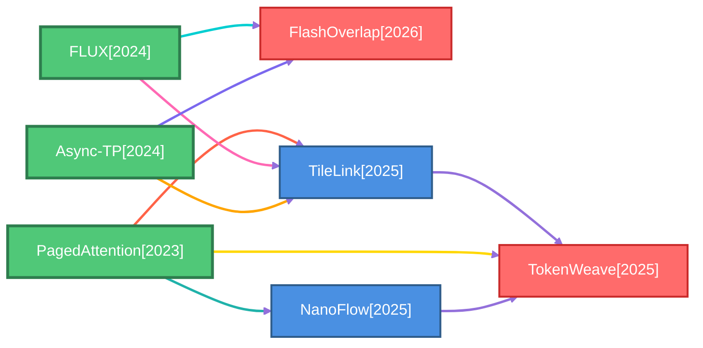
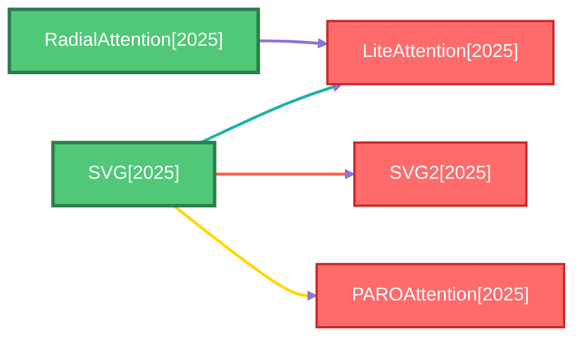
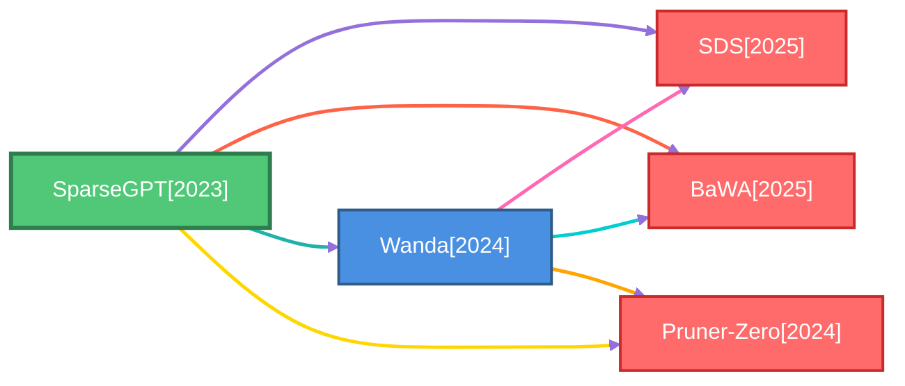
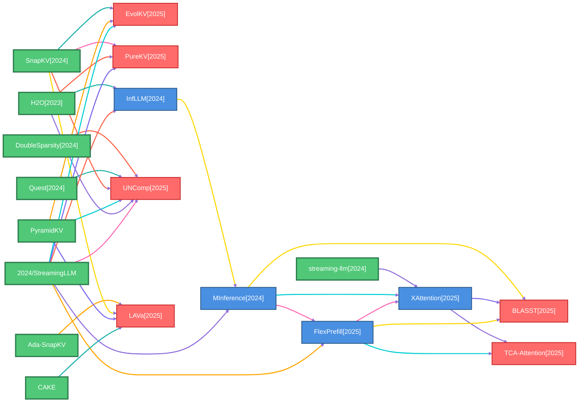
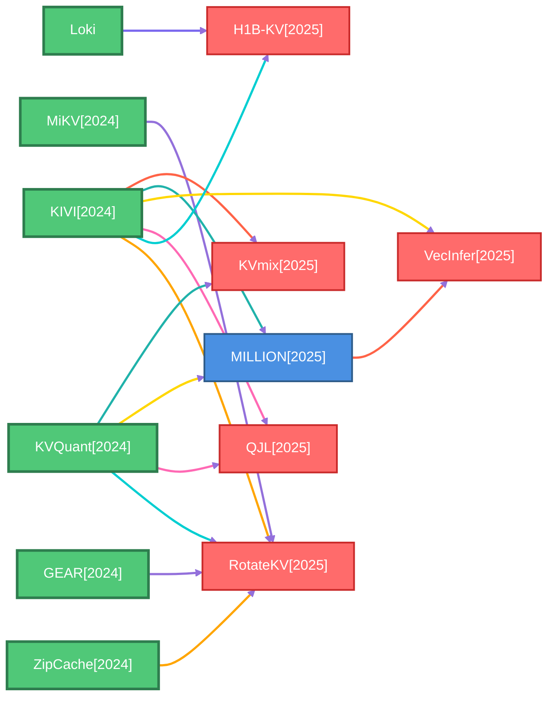

# Baseline Methods Graph

This page visualizes baseline-method relationships extracted from meta files.

Each component represents a family of related methods, showing how newer papers build upon previous baseline methods.

## PagedAttention Family

*7 methods, 9 relationships*

## SVG Family

*5 methods, 4 relationships*

## SparseGPT Family

*5 methods, 7 relationships*

## 2024/StreamingLLM Family

*19 methods, 30 relationships*

## KIVI Family

*12 methods, 15 relationships*

## NSA Family

*2 methods, 1 relationships*

