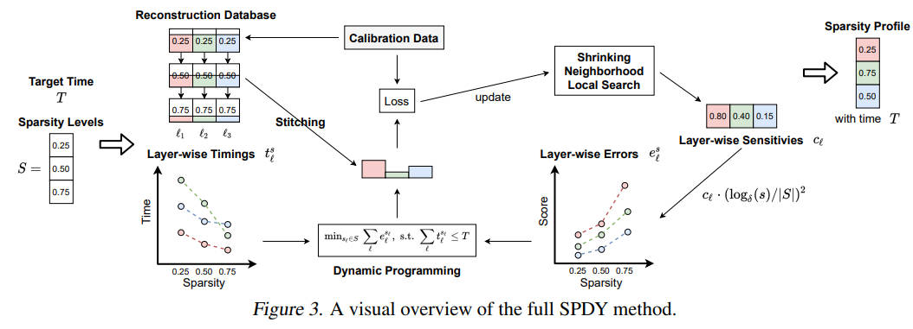

# SPDY: Accurate Pruning with Speedup Guarantees

> "SPDY can be seen as a fusion of global search based approaches like AMC and layer-wise constraint-solver methods like AdaQuant; combining the respective advantages of both schemes."
> 
> dynamic programming algorithm

