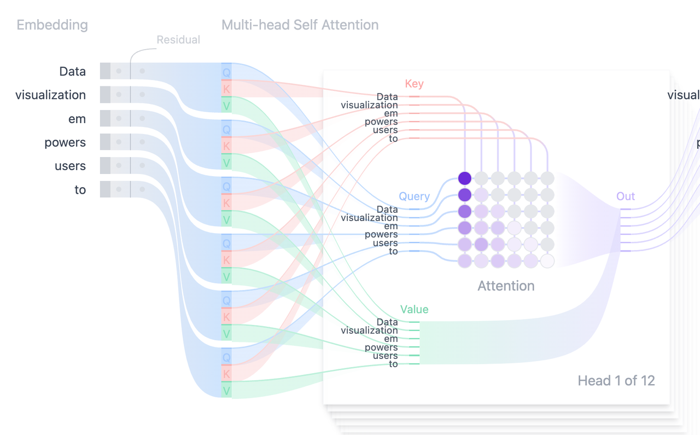
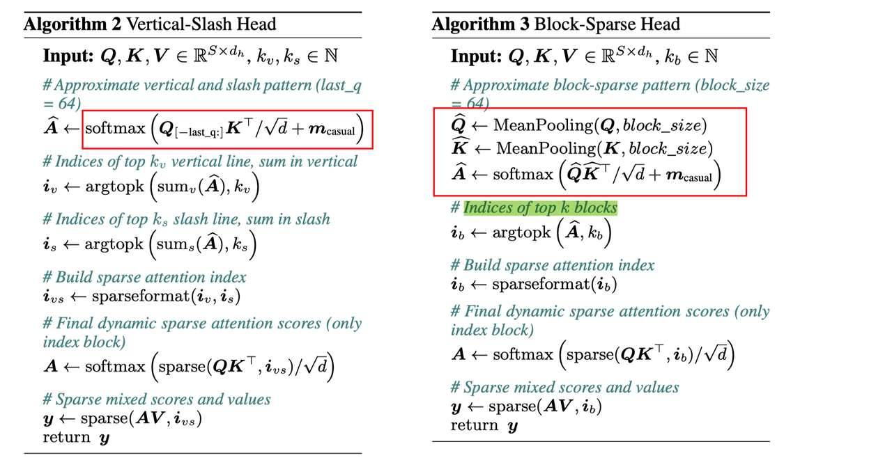
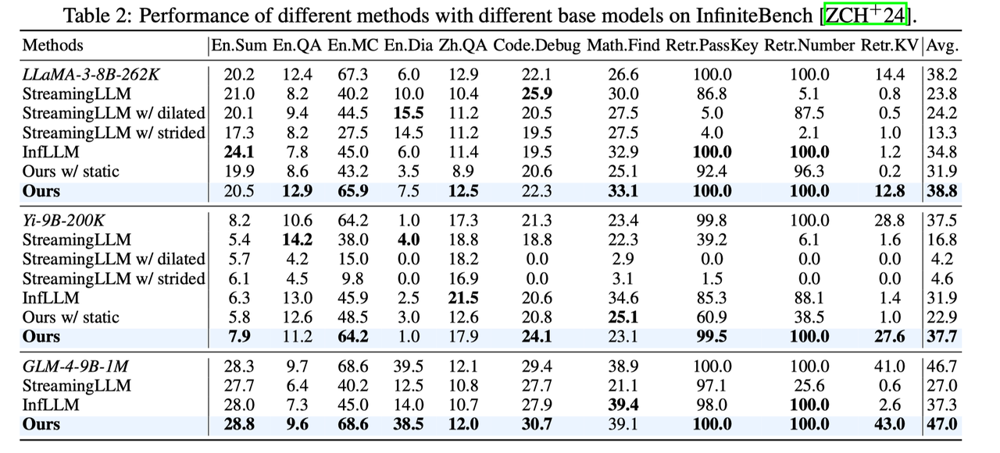

# MInference 1.0: Accelerating Pre-filling for Long-Context LLMs via Dynamic Sparse Attention

## Abstract

The computational challenges of Large Language Model (LLM) inference remain a
significant barrier to their widespread deployment, especially as prompt
lengths continue to increase. Due to the quadratic complexity of the attention
computation, it takes 30 minutes for an 8B LLM to process a prompt of 1M tokens
(i.e., the pre-filling stage) on a single A100 GPU. Existing methods for
speeding up prefilling often fail to maintain acceptable accuracy or efficiency
when applied to long-context LLMs. To address this gap, we introduce MInference
(Milliontokens Inference), a sparse calculation method designed to accelerate
pre-filling of long-sequence processing. Specifically, we identify three unique
patterns in long-context attention matrices-the A-shape, Vertical-Slash, and
Block-Sparsethat can be leveraged for efficient sparse computation on GPUs. We
determine the optimal pattern for each attention head offline and dynamically
build sparse indices based on the assigned pattern during inference. With the
pattern and sparse indices, we perform efficient sparse attention calculations
via our optimized GPU kernels to significantly reduce the latency in the
pre-filling stage of long-context LLMs. Our proposed technique can be directly
applied to existing LLMs without any modifications to the pre-training setup or
additional fine-tuning. By evaluating on a wide range of downstream tasks,
including InfiniteBench, RULER, PG-19, and Needle In A Haystack, and models
including LLaMA-3-1M, GLM4-1M, Yi-200K, Phi-3-128K, and Qwen2-128K, we
demonstrate that MInference effectively reduces inference latency by up to 10x
for pre-filling on an A100, while maintaining accuracy. Our code is available
at https://aka.ms/MInference.

MInference 针对prefill阶段 long-context场景，利用attention的运算动态稀疏行进行加速。

论文中将attention 中sparse的稀疏分为三种模式：

1. A-shape的模式，只保留最开始几列和最近的几列运算，因此也是静态的sparse，直接可以减少运算开销；
2. Vertial-slash 模式，如名称含义一样，竖着保留几列，斜着保留几列，同时sparse index需要根据输入来动态的生成，也可以减少运算；
3. Block-sparse模式，按照block粒度来选择一部分block进行稀疏运算；

加速实现：
attention一般有多个head，文中首先使用一小部分sample 来对attention head进行评估，确定每个head选择三种稀疏模式的其中一种；

其次，对应三种稀疏模式的加速实现
1. A-shape模式，由于是静态的sparse，所以加速实现比较直接；
2. Vertial-slash 模式，需要动态的决定保留的index，会有额外的评估的开销，sparse加速部分需要实现对应attention kernel进行加速；
3. Block-sparse模式，同样需要动态决定保留的block index，会引入额外的评估开销，同时sparse加速也需要对应的attention kernel。

由于模式2和3均引入了额外的runtime的评估开销，这部分开销要尽可能高效，设计如下：

1. Vertial-slash 模式的评估开销主要为最后一行Q涉及的运算
2. Block-sparse模式的评估开销主要为Pool之后的缩小后的QK涉及的运算
可以发现，这部分评估开销相较于dense attention运算是非常小的，当获取到当前的动态sparse mask后，使用对应的sparse attention kernel便可以进行加速。

实验部分：
精度结果：
由于加速来源于跳过了一部分运算，且评估跳过的位置可能会存在与实际稀疏位置有偏差的情况，所以模型的精度会受到一定的影响，文中使用InfiniteBench进行了对比，可以发现精度相较于baseline确实有一些波动，但是平均正确率没有下降，这也证明了方法的鲁棒性。

加速结果：
可以看到随着context size提升，最高能有10倍的加速。

