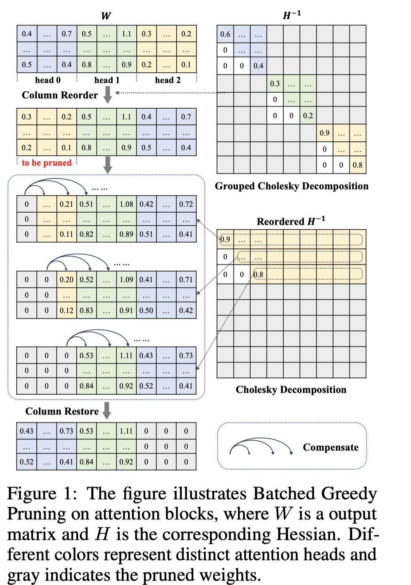
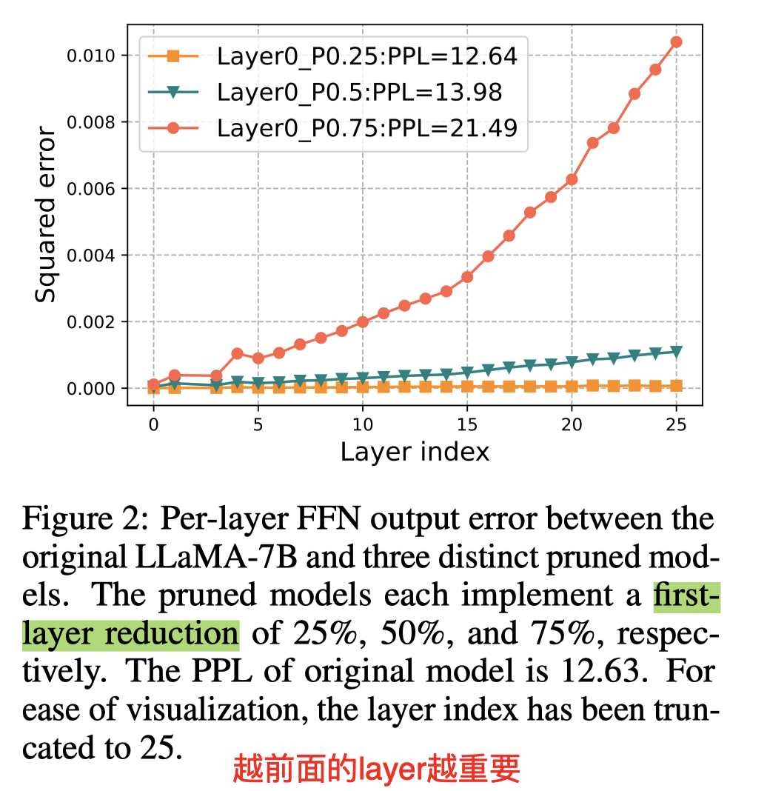
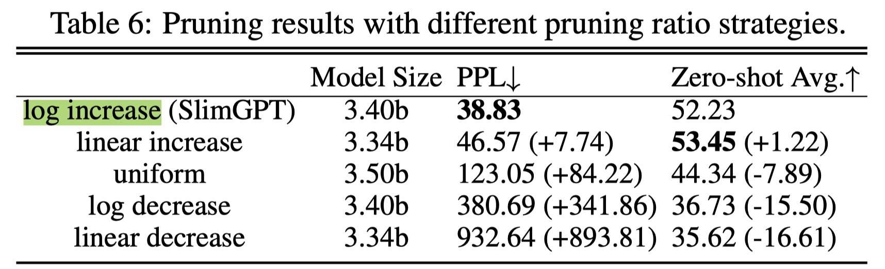

# SlimGPT: Layer-wise Structured Pruning for Large Language Models

## Abstract

Large language models (LLMs) have garnered significant attention for their
remarkable capabilities across various domains, whose vast parameter scales
present challenges for practical deployment. Structured pruning is an effective
method to balance model performance with efficiency, but performance
restoration under computational resource constraints is a principal challenge
in pruning LLMs. Therefore, we present a low-cost and fast structured pruning
method for LLMs named SlimGPT based on the Optimal Brain Surgeon framework. We
propose Batched Greedy Pruning for rapid and near-optimal pruning, which
enhances the accuracy of head-wise pruning error estimation through grouped
Cholesky decomposition and improves the pruning efficiency of FFN via Dynamic
Group Size, thereby achieving approximate local optimal pruning results within
one hour. Besides, we explore the limitations of layer-wise pruning from the
perspective of error accumulation and propose Incremental Pruning Ratio, a
non-uniform pruning strategy to reduce performance degradation. Experimental
results on the LLaMA benchmark show that SlimGPT outperforms other methods and
achieves state-of-the-art results.

Batched Greedy Pruning 这个算法[TODO]

对第一层进行剪枝，测量每层的误差，发现越到最后一层误差越大，因此第一层最重要，最后一层最不重要，所以按照log增加

