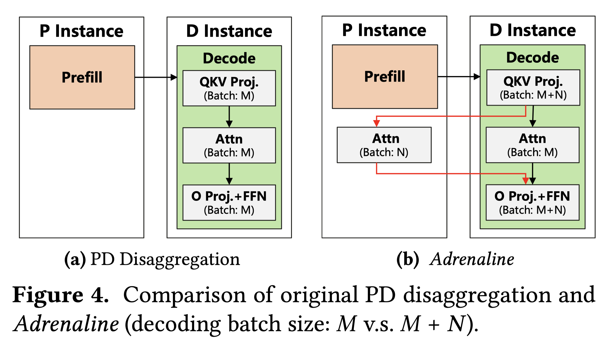

# Injecting Adrenaline into LLM Serving: Boosting Resource Utilization and Throughput via Attention Disaggregation

## Abstract

In large language model (LLM) serving systems, executing each request
consists of two phases: the compute-intensive prefill phase and the
memory-intensive decoding phase. To prevent performance interference between
the two phases, current LLM serving systems typically adopt prefill-decoding
disaggregation, where the two phases are split across separate machines.
However, we observe this approach leads to significant resource
underutilization. Specifically, prefill instances that are compute-intensive
suffer from low memory utilization, while decoding instances that are
memory-intensive experience low compute utilization. To address this problem,
this paper proposes Adrenaline, an attention disaggregation and offloading
mechanism designed to enhance resource utilization and performance in LLM
serving systems. Adrenaline's key innovation lies in disaggregating part of the
attention computation in the decoding phase and offloading them to prefill
instances. The memory-bound nature of decoding-phase attention computation
inherently enables an effective offloading strategy, yielding two complementary
advantages: 1) improved memory capacity and bandwidth utilization in prefill
instances, and 2) increased decoding batch sizes that enhance compute
utilization in decoding instances, collectively boosting overall system
performance. Adrenaline achieves these gains through three key techniques:
low-latency decoding synchronization, resource-efficient prefill colocation,
and load-aware offloading scheduling. Experimental results show that Adrenaline
achieves 2.28x higher memory capacity and 2.07x better memory bandwidth
utilization in prefill instances, up to 1.67x improvements in compute
utilization for decoding instances, and 1.68x higher overall inference
throughput compared to state-of-the-art systems.
