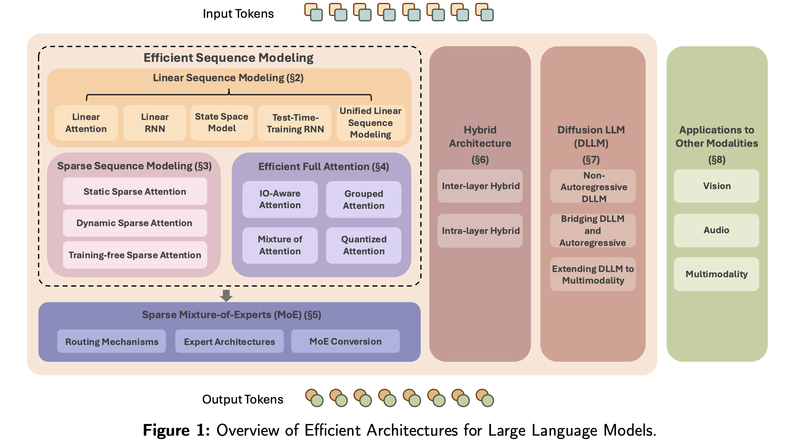

# Speed Always Wins: A Survey on Efficient Architectures for Large Language Models

> Weigao Sun, Jiaxi Hu, Yucheng Zhou, Jusen Du, Disen Lan, Kexin Wang, Tong Zhu, Xiaoye Qu, Yu Zhang, Xiaoyu Mo, Daizong Liu, Yuxuan Liang, Wenliang Chen, Guoqi Li, Yu Cheng

## Abstract

Large Language Models (LLMs) have delivered impressive results in language
understanding, generation, reasoning, and pushes the ability boundary of
multimodal models. Transformer models, as the foundation of modern LLMs, offer
a strong baseline with excellent scaling properties. However, the traditional
transformer architecture requires substantial computations and poses
significant obstacles for large-scale training and practical deployment. In
this survey, we offer a systematic examination of innovative LLM architectures
that address the inherent limitations of transformers and boost the efficiency.
Starting from language modeling, this survey covers the background and
technical details of linear and sparse sequence modeling methods, efficient
full attention variants, sparse mixture-of-experts, hybrid model architectures
incorporating the above techniques, and emerging diffusion LLMs. Additionally,
we discuss applications of these techniques to other modalities and consider
their wider implications for developing scalable, resource-aware foundation
models. By grouping recent studies into the above category, this survey
presents a blueprint of modern efficient LLM architectures, and we hope this
could help motivate future research toward more efficient, versatile AI
systems.
