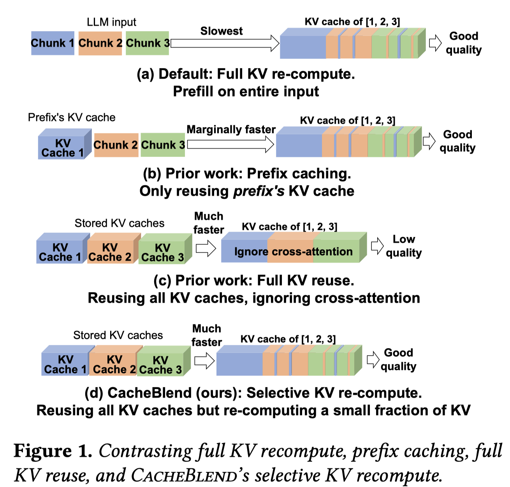

# CacheBlend: Fast Large Language Model Serving for RAG with Cached Knowledge Fusion

> Jiayi Yao, Hanchen Li, Yuhan Liu, Siddhant Ray, Yihua Cheng, Qizheng Zhang, Kuntai Du, Shan Lu, Junchen Jiang

## Abstract

Large language models (LLMs) often incorporate multiple text chunks in their
inputs to provide the necessary contexts. To speed up the prefill of the long
LLM inputs, one can pre-compute the KV cache of a text and re-use the KV cache
when the context is reused as the prefix of another LLM input. However, the
reused text chunks are not always the input prefix, which makes precomputed KV
caches not directly usable since they ignore the text's cross-attention with
the preceding texts. Thus, the benefits of reusing KV caches remain largely
unrealized.
  This paper tackles just one challenge: when an LLM input contains multiple
text chunks, how to quickly combine their precomputed KV caches in order to
achieve the same generation quality as the expensive full prefill (i.e.,
without reusing KV cache)? This challenge naturally arises in
retrieval-augmented generation (RAG) where the input is supplemented with
multiple retrieved texts as the context. We present CacheBlend, a scheme that
reuses the precomputed KV caches, regardless prefix or not, and selectively
recomputes the KV values of a small subset of tokens to partially update each
reused KV cache. In the meantime, the small extra delay for recomputing some
tokens can be pipelined with the retrieval of KV caches within the same job,
allowing CacheBlend to store KV caches in slower devices with more storage
capacity while retrieving them without increasing the inference delay. By
comparing CacheBlend with the state-of-the-art KV cache reusing schemes on
three open-source LLMs of various sizes and four popular benchmark datasets of
different tasks, we show that CacheBlend reduces time-to-first-token (TTFT) by
2.2-3.3x and increases the inference throughput by 2.8-5x from full KV
recompute without compromising generation quality. The code is available at
https://github.com/LMCache/LMCache.
