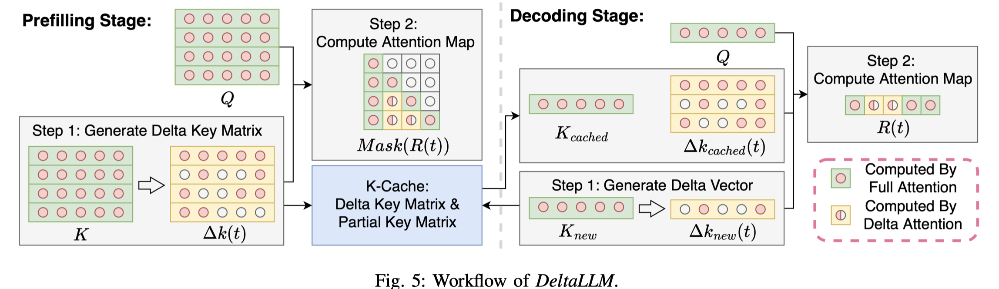

# DeltaLLM: A Training-Free Framework Exploiting Temporal Sparsity for Efficient Edge LLM Inference

> Jiawen Qi, Chang Gao, Zhaochun Ren, Qinyu Chen

## Abstract

Deploying Large Language Models (LLMs) on edge devices remains challenging
due to their quadratically increasing computations with the sequence length.
Existing studies for dynamic attention pruning are designed for hardware with
massively parallel computation capabilities, such as GPUs or TPUs, and aim at
long context lengths (e.g., 64K), making them unsuitable for edge scenarios. We
present DeltaLLM, a training-free framework that exploits temporal sparsity in
attention patterns to enable efficient LLM inference across both the prefilling
and decoding stages, on resource-constrained edge devices. DeltaLLM introduces
an accuracy- and memory-aware delta matrix construction strategy that
introduces temporal sparsity, and a context-aware hybrid attention mechanism
that combines full attention in a local context window with delta approximation
outside it to increase accuracy. We evaluate our framework on the
edge-device-friendly BitNet-b1.58-2B-4T model and Llama3.2-1B-Instruct model
across diverse language tasks. The results show that on BitNet, our framework
increases the attention sparsity from 0% to 60% during the prefilling stage
with slight accuracy improvement on the WG task, and 0% to 57% across both the
prefilling and decoding stages, with even higher F1 score from 29.63 to 30.97
on SQuAD-v2 task. On the Llama model, it can also achieve up to 60% sparsity
during the prefilling stage and around 57% across both stages with negligible
accuracy drop. These results demonstrate that DeltaLLM offers a promising
solution for efficient edge deployment, requiring no fine-tuning and seamlessly
integrating with existing inference pipelines.
