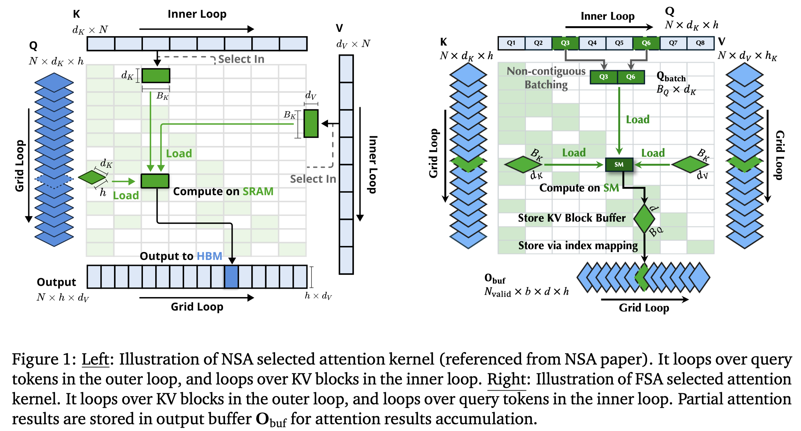

# Flash Sparse Attention: An Alternative Efficient Implementation of Native Sparse Attention Kernel

> Ran Yan, Youhe Jiang, Binhang Yuan

## Abstract

Recent progress in sparse attention mechanisms has demonstrated strong
potential for reducing the computational cost of long-context training and
inference in large language models (LLMs). Native Sparse Attention (NSA), a
state-of-the-art approach, introduces natively trainable, hardware-aligned
sparse attention that delivers substantial system-level performance gains while
maintaining accuracy comparable to full attention. However, the kernel
implementation of NSA relies on a query-grouping strategy that is efficient
only with large Grouped Query Attention (GQA) sizes, whereas modern LLMs
typically adopt much smaller GQA groups, which limits the applicability of this
sparse algorithmic advance. In this work, we propose Flash Sparse Attention
(FSA), which includes an alternative kernel design that enables efficient NSA
computation across a wide range of popular LLMs with varied smaller GQA group
sizes on modern GPUs. Compared to vanilla NSA kernel implementation, our
empirical evaluation demonstrates that FSA achieves (i) up to 3.5$\times$ and
on average 1.6$\times$ kernel-level latency reduction, (ii) up to 1.25$\times$
and 1.09$\times$ on average end-to-end training speedup on state-of-the-art
LLMs, and (iii) up to 1.36$\times$ and 1.11$\times$ on average end-to-end
prefill speedup on state-of-the-art LLMs. The source code is open-sourced and
publicly available at
https://github.com/Relaxed-System-Lab/Flash-Sparse-Attention.
