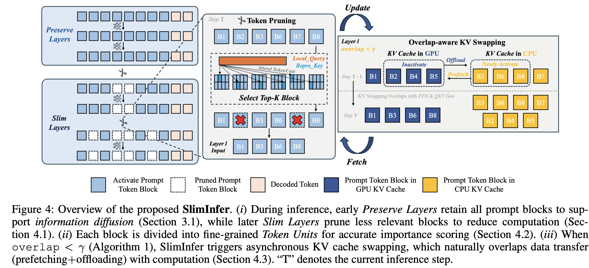

# SlimInfer: Accelerating Long-Context LLM Inference via Dynamic Token Pruning

> Lingkun Long, Rubing Yang, Yushi Huang, Desheng Hui, Ao Zhou, Jianlei Yang

## Abstract

Long-context inference for Large Language Models (LLMs) is heavily limited by
high computational demands. While several existing methods optimize attention
computation, they still process the full set of hidden states at each layer,
limiting overall efficiency. In this work, we propose SlimInfer, an innovative
framework that aims to accelerate inference by directly pruning less critical
prompt tokens during the forward pass. Our key insight is an information
diffusion phenomenon: As information from critical tokens propagates through
layers, it becomes distributed across the entire sequence. This diffusion
process suggests that LLMs can maintain their semantic integrity when excessive
tokens, even including these critical ones, are pruned in hidden states.
Motivated by this, SlimInfer introduces a dynamic fine-grained pruning
mechanism that accurately removes redundant tokens of hidden state at
intermediate layers. This layer-wise pruning naturally enables an asynchronous
KV cache manager that prefetches required token blocks without complex
predictors, reducing both memory usage and I/O costs. Extensive experiments
show that SlimInfer can achieve up to $\mathbf{2.53\times}$ time-to-first-token
(TTFT) speedup and $\mathbf{1.88\times}$ end-to-end latency reduction for
LLaMA3.1-8B-Instruct on a single RTX 4090, without sacrificing performance on
LongBench. Our code will be released upon acceptance.
