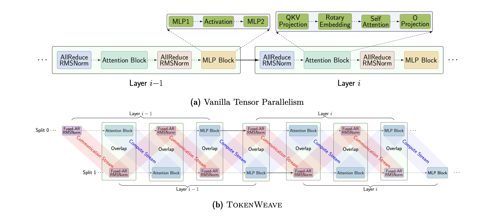

# TokenWeave: Efficient Compute-Communication Overlap for Distributed LLM Inference

> Raja Gond, Nipun Kwatra, Ramachandran Ramjee

## Abstract

Distributed inference of large language models (LLMs) can introduce overheads
of up to 20% even over GPUs connected via high-speed interconnects such as
NVLINK. Multiple techniques have been proposed to mitigate these overheads by
decomposing computations into finer-grained tasks and overlapping communication
with sub-tasks as they complete. However, fine-grained decomposition of a large
computation into many smaller computations on GPUs results in overheads.
Further, the communication itself uses many streaming multiprocessors (SMs),
adding to the overhead.
  We present TokenWeave to address these challenges. TokenWeave proposes a
Token-Splitting technique that divides the tokens in the inference batch into
two approximately equal subsets in a wave-aware manner. The computation of one
subset is then overlapped with the communication of the other. In addition,
TokenWeave optimizes the order of the layer normalization computation with
respect to communication operations and implements a novel fused
AllReduce-RMSNorm kernel carefully leveraging Multimem instruction support
available on NVIDIA Hopper GPUs. These optimizations allow TokenWeave to
perform communication and RMSNorm using only 2-8 SMs. Moreover, our kernel
enables the memory bound RMSNorm to be overlapped with the other batch's
computation, providing additional gains. Our evaluations demonstrate up to 29%
latency gains and up to 26% throughput gains across multiple models and
workloads. In several settings, TokenWeave results in better performance
compared to an equivalent model with all communication removed.

TokenWeave 主要用到了三个技术点：
1. Token-Splitting，将一个大batch的任务拆分成两个batch，通过这种可以将计算与通信进行overlap；但由于GPU的wave-quantization原因，Naive的拆分方式可能导致两个小的kernel的开销大于原本的一个大kernel，造成额外的overhead；这里的wave指的是GPU并行运算的波束，一个大的kernel通常能跑满GPU的并行运算资源，拆分为两个小kernel后，有可能造成小kernel的最后一个wave并行效率低；TokenWeave提出使用smart的方法来拆分，使得拆分后的两个kernel比一个kernel额外引入的开销最小。
2. RMSNorm优化，TileLink, Flux和Nanoflow等工作没有考虑对Norm函数的优化，实测发现RMSNorm时间占比在8%左右；TokenWeave提出将原本的AllReduce-RMSNorm运算改为ReduceScatter-RMSNorm-AllGather操作，保证数学计算的等价性的同时，减少RMSNorm的计算开销；但简单的拆分后的效率会变差，TokenWeave设计了高效的kernel来优化这个问题。
3. 新特性的引入减少SM的资源占用，通过使用Multimem instruction将reduce offload到NVSwitch上，从而减少了SM的使用。通过这种方式，将第二点RMSNorm的kernel实现由需要16-20 SMs减少到2-8 SMs
TokenWeave在vLLM v1版本上实现，带来29% latency收益，最多26%的throughput收益。