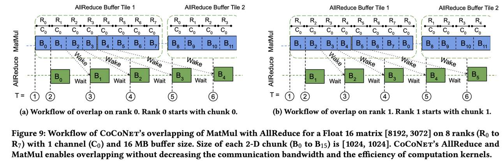

# Breaking the Computation and Communication Abstraction Barrier in Distributed Machine Learning Workloads

> Abhinav Jangda, Jun Huang, Guodong Liu, Amir Hossein Nodehi Sabet, Saeed Maleki, Youshan Miao, Madanlal Musuvathi, Todd Mytkowicz, Olli Sarikivi

## 一句话总结

CoCoNet 是一种面向分布式机器学习的 DSL 和编译器，通过打破计算与通信之间的抽象壁垒，将二者作为一等公民统一表达，从而实现计算与通信的融合（fusion）、重排（reorder）和重叠（overlap）等优化，在数据并行、模型并行和流水线并行场景下显著提升大规模语言模型的训练和推理性能。

## 摘要翻译

近年来，大规模机器学习模型的发展趋势要求训练和推理任务都必须分布式执行。考虑到训练这些模型的巨大成本，必须在计算和通信中释放优化空间以获得最佳性能。然而，当前深度学习框架中计算和通信内核之间的逻辑分离错过了跨此边界进行优化的机会。打破这一抽象壁垒，通过整体考虑可以提供许多优化，从而提升分布式工作负载的性能。然而，手动应用这些优化需要针对每种场景修改底层计算和通信库，这既耗时又容易出错。

因此，我们提出 CoCoNet，它包含一个 DSL，用于以计算和通信操作的形式表达程序。CoCoNet 包含多种机器学习感知的变换来优化程序，以及一个编译器来生成高性能内核。将计算和通信作为一等构造提供，允许用户在高级抽象上工作，并应用强大的优化，如融合或通信与计算的重叠。CoCoNet 使我们能够仅用几行代码就优化大型语言模型中的数据并行、模型并行和流水线并行工作负载。实验表明，CoCoNet 显著优于最先进的分布式机器学习实现。

## 研究动机

在当前的机器学习系统中，计算和通信被视为独立的抽象，分别在不同的库中实现（例如 cuBLAS、cuDNN 用于计算，NCCL 用于通信）。PyTorch 等框架分别调用这些库中的计算和通信内核，导致两者被独立调用。

这种分离虽然允许独立优化，但跨越此抽象边界可以解锁新的优化机会，包括：
- **接口优化**：消除调用者与被调用者之间的不匹配（例如，模型参数存储在非连续缓冲区中，需要在调用集合通信前复制到单个缓冲区）。
- **融合优化**：通过生成单个内核来执行多个通信和计算操作，减少内存带宽使用。
- **重排优化**：将计算移到通信之前或之后，从而分布计算或启用新的融合可能性。
- **重叠优化**：以细粒度方式编排多个计算和通信操作，充分利用网络和计算资源。

然而，手动编写这些优化既低效又容易出错，例如实现 MatMul 与 AllReduce 的细粒度重叠需要约 2000 行 CUDA 代码。因此，需要一个系统化的方法来自动生成这些优化。

## 方法（技术细节）

### 1. CoCoNet DSL

CoCoNet DSL 嵌入在 C++ 中，扩展了现有机器学习框架的数据表示，提供表达计算和通信的构造。

#### 张量布局
CoCoNet 将张量的概念从单一设备数据扩展为分布式形式。张量包含三种布局：
- **Sliced（切片）**：在组中沿指定维度均匀分布，RANK 标识该进程的切片。
- **Replicated（复制）**：在组中所有 rank 上具有相同的值，没有 rank 标识符。
- **Local（局部）**：在所有 rank 上具有相同的形状但不同的值，需要 RANK 标识。

#### 操作类型
CoCoNet 程序继承数据流图（DFG）的概念，操作分为：
- **本地计算**：逐点计算、矩阵乘法、卷积等。
- **跨 rank 通信操作**：AllReduce、AllGather、ReduceScatter、Reduce、Broadcast、P2P Send-Recv。

### 2. 四种语义保持变换

CoCoNet 提供四种变换来优化程序：

#### 2.1 Splitting Communication（通信分割）
将 AllReduce 拆分为 ReduceScatter + AllGather，生成切片张量和复制张量。此变换总是有效的。

#### 2.2 Reordering Operations（操作重排）
将计算与 AllGather 交换，改变操作的布局、输入和输出。通过将 AllGather 后的计算移到 AllGather 之前，可以避免冗余通信。仅在操作可沿 AllGather 的维度切片时有效。

#### 2.3 Fusing Operations（操作融合）
将多个计算和通信操作融合为单个操作，包括：
- **Computation Fuse**：将一系列计算融合为单个操作。
- **AllReduce Fuse**：将 ReduceScatter、切片计算和 AllGather 融合为单个 FusedAllReduce。
融合的通信操作直接通过寄存器传递中间值，避免了内存存储和加载的开销。

#### 2.4 Overlapping Operations（操作重叠）
将一系列生产者-消费者操作重叠，以同时利用硬件的多种资源。此变换仅在所有操作之间存在生产者-消费者关系时有效。

### 3. 自动调度器（Autotuner）

CoCoNet 提供自动调度器，自动探索程序的所有调度空间，返回在底层架构和输入大小下性能最佳的调度。调度器首先将所有逐点计算融合到预定义阈值以下，然后以广度优先搜索方式穷举调度空间，生成所有调度的代码并执行，返回最小执行时间的调度。自动调度器通常仅需几秒即可探索调度空间。

### 4. 代码生成器

CoCoNet 为分布式系统中的 NVIDIA GPU 生成 CUDA 内核，包括：
- 集合通信操作调用
- 融合计算的 CUDA 内核
- 融合集体通信的 CUDA 内核
- 通信与计算重叠的 CUDA 内核
- 对非连续张量的操作

代码生成器适配 NCCL（NVIDIA Collective Communications Library），支持三种通信协议（LL、LL128、Simple）以及不同精度、切片张量和张量归约的代码生成。生成的程序作为自定义算子集成到 PyTorch 中，可直接被 Megatron-LM 等应用调用。

### 5. 特定工作负载优化

#### Adam 优化器优化
CoCoNet 通过将 AllReduce 拆分为 ReduceScatter + AllGather，将 AllGather 与融合的优化器计算重排，从而将参数更新分布在所有 rank 上，减少内存使用。

#### 流水线并行优化
CoCoNet 通过将 AllReduce 拆分为 ReduceScatter + AllGather，将 P2P 发送与计算重排，减少组间通信（减少为组大小的 1/group_size）。进一步通过将缓冲区分割为多个 tile，实现组内和组间通信的重叠。

## 实验结果

实验在 16 个 NVIDIA DGX-2 节点上进行，每个节点包含 16 个 NVIDIA Tesla V100 GPU（共 256 个 GPU）。

### 数据并行训练
- **Adam 优化器**：CoCoNet 提供 1.2× 到 1.7× 的加速。
- **LAMB 优化器**：CoCoNet 提供 1.35× 到 2.0× 的加速。
- **BERT 模型集成**：
  - BERT 336M：CoCoNet 在所有基线上均有加速。
  - BERT 1.2B：CoCoNet 提供 1.53× 的加速（相对于 NV BERT 和 PyTorch DDP）。
  - BERT 3.9B：NV BERT 和 PyTorch 因内存不足而失败，CoCoNet 可以训练（仅用数据并行）。
  - LAMB 加速高达 1.64×，尤其在 ZeRO 不支持分布式 LAMB 状态时优势更明显。

### 模型并行
- CoCoNet 的模型并行内核在 BERT 3.9B 和 GPT-2 8.2B 的推理中加速高达 1.51×。
- MatMul 与 AllReduce 的细粒度重叠隐藏了超过 80% 的 MatMul 执行时间，提供 1.36× 的加速。

### 流水线并行
- CoCoNet 的流水线并行内核在 GPT-2 8.2B 和 GPT-3 175B 的推理中加速高达 1.77×。
- 通过将缓冲区分割为多个 tile，实现了组内和组间通信的重叠，进一步提升了性能。

### 自动生成开销
- 自动调度器通常在 10 秒内探索所有调度空间。
- CoCoNet 用 10-18 行代码表达的程序，生成的 CUDA 代码可达 20-220 行（手动实现约 2000 行）。

## 优势

1. **统一抽象**：将计算和通信作为一等公民统一表达，消除了两者之间的抽象壁垒。
2. **自动化优化**：通过自动调度器自动探索最优调度，避免手动优化的繁琐和易错性。
3. **显著性能提升**：在数据并行、模型并行和流水线并行场景下均实现显著加速（最高 2.0×）。
4. **代码简洁**：用少量代码（10-18 行）即可表达复杂优化，生成的代码质量高。
5. **内存优化**：通过融合和重排减少内存使用，支持更大批量大小和更大模型的训练。
6. **可扩展性**：支持多种并行策略（数据、模型、流水线），适用于多种大规模语言模型。
7. **与现有框架兼容**：生成的程序可作为 PyTorch 自定义算子集成，直接被 Megatron-LM 等应用调用。

## 局限

1. **硬件依赖**：主要针对 NVIDIA GPU 和 NCCL 集合通信库，对其他硬件和通信库的支持有限。
2. **融合的局限性**：对于较小的张量，融合操作可能不如非融合操作，因为融合内核的寄存器使用较高，限制了线程级并行度。
3. **特定场景优化**：优化主要针对特定的分布式机器学习工作负载（如 Transformer 模型），对其他类型的工作负载的适用性有待验证。
4. **调度空间探索**：自动调度器采用穷举搜索，虽然当前调度空间较小（几秒内完成），但对于更复杂的程序可能需要更长时间。
5. **代码生成复杂度**：对于复杂的操作（如矩阵乘法和卷积），代码生成可能需要数百行代码，虽然可以调用现有库，但增加了系统的复杂性。
6. **缺乏对所有优化器的全面支持**：虽然支持 Adam 和 LAMB，但对其他优化器（如 SGD）的优化可能需要额外工作。

## 与 EfficientPaper 相关的研究方向

CoCoNet 与 EfficientPaper 项目中关注的高效 AI 研究方向密切相关：

1. **通信优化**：CoCoNet 通过融合、重排和重叠优化减少了通信开销，这是分布式训练效率提升的关键方向。
2. **编译器优化**：CoCoNet 作为一个编译器系统，通过自动化优化生成高性能内核，与编译器驱动的 AI 系统优化方向一致。
3. **大规模语言模型训练**：CoCoNet 专注于优化大规模语言模型的训练和推理，这是当前 AI 研究的热点方向。
4. **并行计算策略**：CoCoNet 支持数据并行、模型并行和流水线并行，与并行计算和分布式系统的研究方向相关。
5. **代码生成与 DSL**：CoCoNet 通过 DSL 和代码生成实现优化，与领域特定语言和自动代码生成的研究方向一致。
6. **内存优化**：CoCoNet 通过融合和重排减少内存使用，支持更大模型的训练，与高效内存利用的研究方向相关。

---

> 本笔记由 AI Agent 自动生成，基于论文原文内容进行总结和翻译。内容仅供学习和参考，不构成学术建议。
