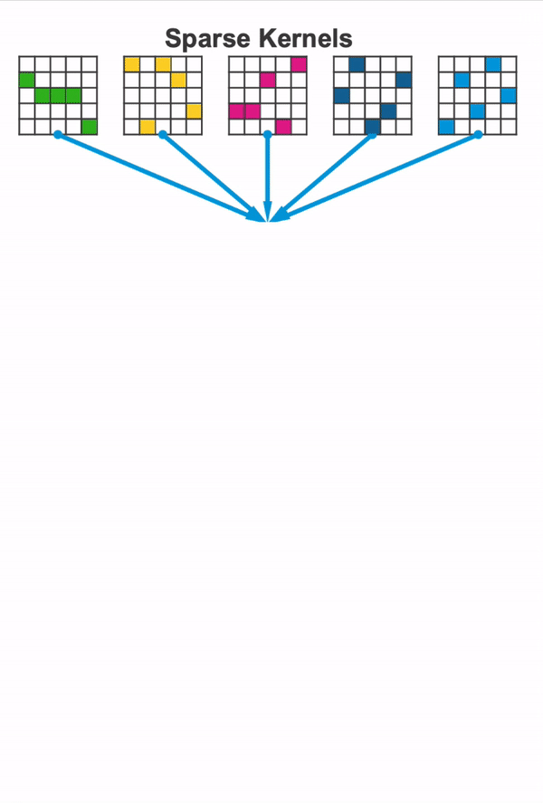
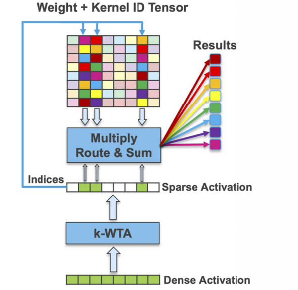

# Two Sparsities Are Better Than One: Unlocking the Performance Benefits of Sparse-Sparse Networks

> Combine weight sparsity and activation sparsity

## Table of Contents
- [Two Sparsities Are Better Than One: Unlocking the Performance Benefits of Sparse-Sparse Networks](#two-sparsities-are-better-than-one-unlocking-the-performance-benefits-of-sparse-sparse-networks)
    - [Method](#method)
        - [sparse weight and dense activation](#sparse-weight-and-dense-activation)
        - [sparse weight and sparse activation](#sparse-weight-and-sparse-activation)    

## Method

### sparse weight and dense activation
- a) **Combine**: multiple sparse weight structures are overlaid to form a single dense entity. This is done offline as a preprocessing step.
- (b) **Multiply**: each element of the activation is multiplied by the corresponding weight elements in the dense entity (Hadamard product).
- (c) **Route**: the appropriate element-wise products are routed separately for each output.
- (d) **Sum**: routed products are aggregated and summed to form a separate result for each sparse entity.

### sparse weight and sparse activation

- a) **Combine**: multiple sparse weight structures are overlaid to form a single dense structure. This is done offline as a preprocessing step.
- (b) **Select**: a k-WTA component is used to determine the top-k activations and their indices.
- (c) **Multiply**: each non-zero activation is multiplied by the corresponding weight elements in the dense structure (Hadamard product).
- (d) **Route**: the appropriate element-wise products are routed separately for each output.
- (e) **Sum**: routed products are aggregated and summed to form a separate result for each sparse matrix.
