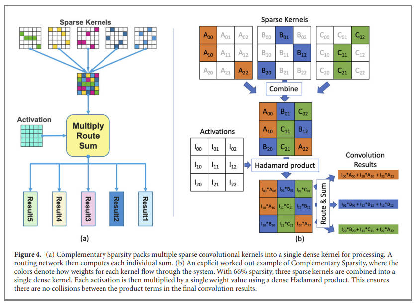

# Two Sparsities Are Better Than One: Unlocking the Performance Benefits of Sparse-Sparse Networks

> 将权重稀疏和激活稀疏结合起来，通过互补稀疏技术在现有硬件上实现高效推理

## Table of Contents
- [Two Sparsities Are Better Than One: Unlocking the Performance Benefits of Sparse-Sparse Networks](#two-sparsities-are-better-than-one-unlocking-the-performance-benefits-of-sparse-sparse-networks)
    - [一句话总结](#一句话总结)
    - [摘要翻译](#摘要翻译)
    - [研究动机](#研究动机)
    - [方法（技术细节）](#方法技术细节)
    - [实验结果](#实验结果)
    - [优势](#优势)
    - [局限](#局限)
    - [与 EfficientPaper 相关的研究方向](#与-efficientpaper-相关的研究方向)
    - [AI 生成声明](#ai-生成声明)

## 一句话总结

本文提出了一种名为"互补稀疏"（Complementary Sparsity）的结构化稀疏技术，通过将多个稀疏权重矩阵叠加为单一密集结构，使得在现有硬件（FPGA）上能够同时利用权重稀疏和激活稀疏，实现高达 110 倍的吞吐量提升和能效改善，为高效 AI 推理开辟了新的路径。

## 摘要翻译

在原则上，稀疏神经网络应该比传统的密集网络效率更高。大脑中的神经元表现出两种类型的稀疏性：连接稀疏（权重稀疏）和活动稀疏（激活稀疏）。当这两种稀疏性结合起来时，有可能将神经网络的计算成本降低两个数量级。然而，尽管具有这种潜力，当今的神经网络仅利用权重稀疏性就获得了适度的性能提升，因为传统计算硬件无法高效处理稀疏网络。在本文中，我们引入了"互补稀疏"（Complementary Sparsity）这一新技术，显著提高了双稀疏网络在现有硬件上的性能。我们证明可以实现高权重稀疏网络的高性能运行，并且通过引入激活稀疏性可以将这些加速倍数相乘。使用互补稀疏技术，我们在 FPGA 上进行推理时，吞吐量和能效可提高高达 100 倍。我们分析了商用卷积网络（如 ResNet-50 和 MobileNetV2）中典型内核的可扩展性和资源权衡。我们的结果表明，权重加激活稀疏性可以成为高效扩展未来 AI 模型的强大组合。

## 研究动机

### 背景挑战

1. **模型规模膨胀**：近年来，更大更复杂的深度神经网络（DNN）推动了 AI 的显著进步，但模型的指数级增长威胁着进一步发展。训练需要大量 GPU/TPU，耗时数天甚至数周，产生巨大的碳排放和不断攀升的云计算成本。

2. **稀疏性的理论优势未被充分释放**：受神经科学启发，稀疏性被提出作为解决模型规模快速增长的方案。稀疏网络通过限制神经元的连接（权重稀疏）或活动（激活稀疏），显著减少模型的大小和计算复杂度。当权重稀疏和激活稀疏同时利用时，计算节省是乘法性的——例如，90% 权重稀疏和 90% 激活稀疏的组合理论上可实现 100 倍的计算节省。

3. **硬件与稀疏的"阻抗不匹配"**：现有硬件针对规则密集数据结构进行优化，稀疏网络引入的不规则模式难以高效利用。例如，在 CPU 上，即使权重稀疏率达到 95%，性能提升通常不到 4 倍。几乎没有技术能同时利用权重和激活稀疏。

4. **传统结构化稀疏的局限**：分区稀疏和块稀疏等结构化稀疏技术虽然改善了硬件效率，但施加的约束限制了可获得的稀疏性和准确性，导致性能提升远低于理论潜力。

### 核心思路

作者提出一种"反转"稀疏问题的思路：不是为非结构化稀疏网络创建专用硬件，而是将稀疏矩阵结构化为与目标硬件要求匹配的形式——具体方法是将多个稀疏矩阵叠加形成单个密集结构，使其几乎与密集矩阵无异。

## 方法（技术细节）

### 1. 互补稀疏的基本原理

互补稀疏的核心思想是：将多个稀疏权重结构叠加，形成单个密集实体。只要两个稀疏矩阵不在完全相同的位置包含非零元素，就能实现最优打包。对于输入的激活，可以执行逐元素乘积（密集操作），然后为每个稀疏实体单独重新生成累加结果。

**关键约束**：叠加的稀疏矩阵的非零元素不应相互冲突（即不重叠）。

**灵活性**：该技术可应用于卷积核，通过叠加层的 3D 稀疏权重张量中的多个 2D 稀疏矩阵。可以分别在滤波器维度或通道维度叠加。实践中，使用互补稀疏约束训练的网络与非结构化稀疏相比，精度不妥协。

**乘法性能**：随着非零元素数量减少，互补稀疏提供了线性性能改进的路径。

### 2. 稀疏-密集网络（Sparse-Dense Networks）

对于稀疏权重 + 密集激活的网络，处理过程包含四个步骤：

1. **Combine（组合）**：多个稀疏权重结构叠加形成单个密集实体（离线预处理步骤）
2. **Multiply（乘法）**：激活的每个元素与密集实体中对应的权重元素相乘（Hadamard 乘积）
3. **Route（路由）**：逐元素乘积按输出分别路由
4. **Sum（求和）**：路由后的乘积分别聚合求和，形成每个稀疏实体的独立结果

### 3. 稀疏-稀疏网络（Sparse-Sparse Networks）

将稀疏-密集方案扩展到同时具有稀疏激活和稀疏权重的网络。处理过程包含五个步骤：

1. **Combine（组合）**：多个稀疏权重结构叠加形成单个密集结构（离线预处理）
2. **Select（选择）**：使用 k-WTA（k-Winner-Take-All）组件确定 top-k 激活及其索引
3. **Multiply（乘法）**：每个非零激活与密集结构中对应的权重元素相乘
4. **Route（路由）**：逐元素乘积按输出分别路由
5. **Sum（求和）**：路由后的乘积聚合求和，形成每个稀疏矩阵的独立结果

**核心优势**：通过互补稀疏，稀疏-稀疏问题被简化为稀疏激活 + 密集权重的问题，消除了传统稀疏-稀疏矩阵计算中处理动态非零激活与权重匹配的开销。

### 4. FPGA 实现细节

#### 4.1 Sparse-Sparse Hadamard 乘积计算

- 每个非零激活的相关权重从权重张量中提取，然后与激活值相乘（Hadamard 乘积）
- 稀疏滤波器核被转换为密集核，存储在 FPGA 上的一系列内存中
- 每个权重附带一个内核 ID（Kernel ID），用于后续路由
- 使用 K 端口的权重张量内存，以并行处理 K 个非零激活值
- 激活稀疏度越高，所需端口越少；权重稀疏度越高，每个端口越小

#### 4.2 Sparse-Sparse Hadamard 乘积路由

- 核心挑战：将子乘积高效路由到正确的累加器
- **串行路由**：通过多路复用器网络将每个乘积按 Kernel ID 路由到累加器
- **并行路由**：所有激活的乘积并行处理，路由到加法树进行求和
- 使用仲裁模块（Arbitration Module）生成低位地址位，避免冲突
- 仲裁模块使用前缀和（prefix sum）算法生成低位地址位

#### 4.3 激活稀疏性实现（k-WTA）

- **全局 k-WTA**：检查激活的所有元素以确定 K 个最大值（用于线性层）
- **局部 k-WTA**：将激活划分为较小单元，仅比较同一分区内的元素（用于卷积层）
- 基于直方图的实现（用于 8 位激活值）：构建 256 元素数组的直方图，按最大值读取确定阈值
- 使用排序网络 + FIFO + 比较器树实现高效的局部 k-WTA
- 实现中，64 元素向量被分为 8 个 8 元素子向量，排序网络由 19 个比较器组成，深度 6 层

### 5. 资源权衡分析

- 激活稀疏度增加时，所有 FPGA 资源（LUT、FF、URAM）的使用量显著减少
- URAM 消耗与激活稀疏度呈线性关系
- 权重稀疏度增加时，资源减少是亚线性的（路由开销限制了减少幅度）
- k-WTA 的资源消耗相对于卷积操作而言较小
- 内存带宽需求与权重和激活稀疏度成反比

## 实验结果

### 实验设置

- **数据集**：Google Speech Commands (GSC)，包含 65,000 条一秒长的语音关键词录音
- **网络**：标准卷积网络，包含两个卷积层、一个线性隐藏层和一个输出层
- **平台**：Xilinx Alveo U250（高端数据中心 FPGA）和 UltraScale ZU3EG（嵌入式 FPGA）
- **基线**：Dense 实现使用 Vitis AI；Sparse-Dense 和 Sparse-Sparse 使用 Vivado HLS

### 网络参数

| 层 | 通道数 | 卷积核大小 | 步长 | 输出形状 |
|---|---|---|---|---|
| 输入 | - | - | - | 32×32×1 |
| Conv-1 | 64 | 5×5×1 | 1 | 28×28×64 |
| MaxPool-1 | - | 2×2×1 | 2 | 14×14×64 |
| Conv-2 | 64 | 5×5×64 | 1 | 10×10×64 |
| MaxPool-2 | - | 2×2×1 | 2 | 5×5×64 |
| Flatten | - | - | - | 1600×1 |
| Linear-1 | 1500 | 1600×1 | - | 1500×1 |
| Output | 12 | 1500×1 | - | 12×1 |

- Dense 模型参数：2,522,128 个参数
- Sparse 模型非零权重：127,696 个（约 95% 稀疏）
- 激活稀疏度：88%–90%（仅 10%–12% 的神经元为"获胜者"）
- 密集和稀疏模型在 GSC 数据集上达到相似精度（96.4%–96.9%）
- 激活和权重均量化为 8 位

### 单网络性能（Table 2）

| FPGA 平台 | 网络实现 | 吞吐量（词/秒） | 加速比 |
|---|---|---|---|
| U250 | Dense | 3,049 | 1.0 |
| U250 | Sparse-Dense | 35,714 | 11.71X |
| U250 | Sparse-Sparse | 102,564 | **33.63X** |
| ZU3EG | Dense | 0（不适用） | - |
| ZU3EG | Sparse-Dense | 21,053 | N/A |
| ZU3EG | Sparse-Sparse | 45,455 | N/A |

**关键发现**：
- 在 U250 上，Sparse-Sparse 比 Dense 快 33.6 倍，比 Sparse-Dense 快 2.8 倍
- 在 ZU3EG 上，Dense 无法运行（资源不足），但 Sparse-Dense 和 Sparse-Sparse 均可运行
- Sparse-Dense 在 ZU3EG 上比 Dense 在 U250 上还快 6.9 倍，展示了稀疏网络在嵌入式场景中的潜力

### 全芯片性能（Table 3）

| FPGA 平台 | 网络实现 | 网络数 | 吞吐量（词/秒） | 加速比 |
|---|---|---|---|---|
| U250 | Dense | 4 | 12,195 | 1.0 |
| U250 | Sparse-Dense | 24 | 689,655 | 56.5X |
| U250 | Sparse-Sparse | 20 | 1,369,863 | **112.3X** |

**关键发现**：
- Sparse-Sparse 在全芯片上比 Dense 快 112.3 倍
- Sparse-Sparse 可在 U250 上部署 20 个网络实例（Dense 仅 4 个）
- 虽然 Sparse-Sparse 实例数（20）少于 Sparse-Dense（24），但整体吞吐量仍接近翻倍

### CPU 推理引擎比较

- 在 CPU（3.0GHz 24 核 Intel Xeon 8275CL）上测试了多个推理引擎
- ONNX Runtime 和 OpenVINO 无法利用稀疏性
- Neural Magic 的 Deepsparse 实现 2X 加速
- Apache TVM 实现 3X 加速
- 所有 CPU 引擎的加速远低于 FPGA，且无法同时利用权重和激活稀疏

### 能效（Table 4）

| 平台 | 实现 | 网络数 | 系统功耗 (W) | 词/秒/瓦 | 相对效率 |
|---|---|---|---|---|---|
| U250 | Dense | 4 | 225 | 54 | 100% |
| U250 | Sparse-Dense | 24 | 225 | 3065 | 5675% |
| U250 | Sparse-Sparse | 20 | 225 | 6088 | **11274%** |
| ZU3EG | Sparse-Dense | 1 | 24 | 877 | 1624% |
| ZU3EG | Sparse-Sparse | 1 | 24 | 1893 | 3505% |

**关键发现**：Sparse-Sparse 在 U250 上的能效比 Dense 高出 112 倍，同时吞吐量和能效同步提升（而非以增加能耗为代价）。

### ResNet-50 和 MobileNetV2 资源分析

- 对 1×1 和 3×3 卷积内核进行了详细的资源权衡分析
- 通道数为 64（[64:64] 配置）
- 随着激活稀疏度增加，LUT 使用量显著下降（例如 93.75% 权重稀疏时，激活稀疏从 16/64 增加到 4/64，LUT 减少 4.1 倍）
- URAM 消耗与激活稀疏度呈线性关系
- k-WTA 的资源消耗相对较小（与卷积操作相比）
- 互补稀疏成功应用于 ResNet-50 的 7×7 "stem" 层（仅使用权重稀疏）

## 优势

1. **显著的性能提升**：单网络加速 33.6 倍，全芯片加速 112.3 倍，能效提升 112 倍
2. **同时利用两种稀疏性**：首次在 FPGA 上实现同时利用权重稀疏和激活稀疏，性能提升是乘法性的
3. **硬件友好的结构化稀疏**：将稀疏矩阵转化为几乎等价于密集矩阵的结构，避免了传统稀疏的开销
4. **嵌入式部署能力**：稀疏网络可在资源受限的嵌入式 FPGA（如 ZU3EG）上运行，而密集网络无法运行
5. **精度不妥协**：使用互补稀疏约束训练的网络与非结构化稀疏相比，精度不损失
6. **可扩展的资源效益**：增加稀疏度会线性或超线性减少硬件资源消耗
7. **无需专用硬件**：在现有 FPGA 上实现，无需定制 ASIC
8. **模块化设计**：k-WTA 资源消耗小，路由模块可定制化
9. **适用于多种网络结构**：针对 ResNet-50、MobileNetV2 等商用网络的核心组件进行了分析
10. **节能同步提升**：同时改善吞吐量和能效，而非以增加能耗为代价

## 局限

1. **仅在 FPGA 上验证**：目前仅在 FPGA 平台上实现和评估，未在 GPU 或 CPU 上展示同等性能
2. **仅针对推理**：本文主要关注推理阶段，未涉及训练加速
3. **网络结构有限**：仅在小型卷积网络（GSC）和卷积层组件上验证，未在大规模端到端网络（如 ImageNet 上的 ResNet-50）上完整实现
4. **对非结构化稀疏的处理**：仍需要非零元素的索引信息，在激活稀疏度较低时性能提升有限
5. **训练中的稀疏约束**：互补稀疏要求非零元素不重叠，这可能限制训练时的灵活性
6. **路由开销**：路由模块的资源消耗随稀疏度增加而降低，但在低稀疏度时仍可能成为瓶颈
7. **嵌入式平台的资源限制**：虽然 Sparse-Sparse 可在 ZU3EG 上运行，但受限于资源，仅能运行 1 个网络实例
8. **未与 NVIDIA Ampere 等硬件加速器比较**：未与 NVIDIA GPU 的原生稀疏支持进行端到端比较
9. **缺乏复杂网络的完整验证**：对于 ResNet-50 等复杂网络，需要考虑通道分区、流水线延迟平衡等额外问题
10. **未开源代码**：无公开代码，难以复现

## 与 EfficientPaper 相关的研究方向

1. **稀疏网络加速**：本文是 EfficientPaper 中"稀疏化"（sparse_pruning）关键词下的重要研究，与权重量化、知识蒸馏等高效推理技术互补
2. **结构化稀疏**：互补稀疏是一种新颖的结构化稀疏方法，可与块稀疏、分区稀疏等技术结合
3. **FPGA 加速器设计**：本文提供了 FPGA 上稀疏计算的详细实现指南，对 ASIC 设计也有参考价值
4. **稀疏-稀疏网络训练**：本文指出同时具有权重和激活稀疏的网络训练仍是开放问题，值得进一步研究
5. **边缘部署**：稀疏网络在嵌入式设备上的部署是 EfficientPaper 关注的重点之一
6. **能效优化**：本文的能效提升结果与 EfficientPaper 中的能效研究方向一致
7. **神经启发的稀疏性**：本文受大脑中神经元稀疏连接和活动的启发，与神经形态计算方向相关
8. **Transformer 架构的稀疏化**：作者指出将互补稀疏应用于 Transformer 和深度推荐系统是未来方向

## AI 生成声明

本笔记由 AI Agent 自动提取论文内容并生成，基于对论文 PDF 全文（通过 PyMuPDF/fitz 提取）的分析。笔记内容包括摘要翻译、方法描述、实验结果总结、优势与局限分析等。笔记内容应被视为论文内容的概括和解读，读者应以原始论文为准。本文 AI 生成声明旨在确保透明度，不构成对论文内容的替代或背书。
