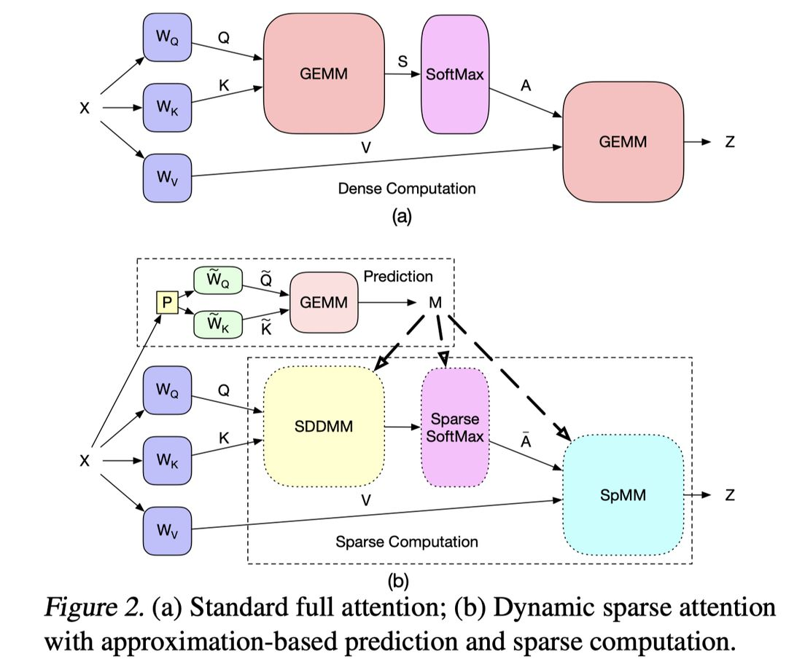

# Transformer Acceleration with Dynamic Sparse Attention

> Liu Liu, Zheng Qu, Zhaodong Chen, Yufei Ding, Yuan Xie

## 一句话总结

DSA（动态稀疏注意力）通过引入一个可训练的轻量预测路径来预测输入依赖的动态稀疏注意力模式，从而在不损失模型精度的情况下将注意力计算量降低至原来的 1/5（95% 稀疏度），并在 GPU 上实现实际加速。

## 摘要翻译

Transformer 已成为 NLP 应用的主流，并在计算机视觉等领域也越来越受欢迎。尽管模型质量不断提高，但巨大的计算成本使得 Transformer 在部署时面临挑战，特别是在新兴应用中序列长度较大的情况下。注意力机制作为 Transformer 的核心组件，由于二次复杂度而成为执行瓶颈。现有工作通过稀疏模式来支持长序列建模，但这些方法基于静态或固定模式。本文证明了稀疏模式本质上是动态的，取决于输入序列。因此，本文提出了动态稀疏注意力（DSA），能够高效利用 Transformer 注意力中的动态稀疏性。与其他方法相比，DSA 在精度和模型复杂度之间实现了更好的权衡。此外，本文识别了挑战并提供了在现有硬件（GPU）和专用硬件上实现 DSA 的方案，以实现 Transformer 执行的实际加速和效率提升。

## 研究动机

1. **计算瓶颈问题**：Transformer 的自注意力机制复杂度为 O(l²d)，当序列长度 l 较大时，计算开销成为严重瓶颈，使得部署困难。
2. **静态稀疏的局限性**：现有稀疏注意力方法（如 Longformer、BigBird、Sparse Transformer）采用固定的稀疏模式（局部窗口、块状、随机等），无法适应不同输入序列的动态注意力模式。
3. **注意力权重的冗余性**：论文通过可视化原始注意力权重矩阵发现，只有少量注意力权重具有较大值，大部分接近零，说明注意力机制天然存在冗余。
4. **动态稀疏性**：不同输入序列和不同注意力头的稀疏模式各不相同，静态约束无法捕捉这种动态性，而 DSA 能够有效识别和利用这种输入依赖的动态稀疏模式。
5. **与 SeerAttention 的相似性**：笔记中提到该论文的思路与 SeerAttention 非常相似，都是通过预测来识别稀疏模式，需要训练。

## 方法（技术细节）

### 3.1 预测路径设计（Prediction Path）

DSA 的核心思想是构建一个轻量级的预测路径来预测稀疏注意力模式，而非直接使用完整注意力。

- **近似查询和键变换**：定义近似查询 ˜Q 和近似键 ˜K 为：
  ˜Q, ˜K = XP ˜WQ, XP ˜WK
  其中 P ∈ {−1, 0, 1}^{d×k} 是稀疏随机投影矩阵（共享），˜WQ, ˜WK ∈ R^{k×k} 是可训练的近似参数。

- **近似注意力分数**：˜S = ˜Q ˜K⊤，然后根据 ˜S 的大小预测稀疏注意力掩码 M（通过阈值或 top-k 搜索）。

- **稀疏注意力输出**：使用预测的稀疏掩码 M 对完整注意力矩阵进行掩码处理，只保留重要的注意力权重，从而节省计算。

### 3.2 模型适应（Model Adaptation）

- 联合优化模型参数和预测路径参数，损失函数为：
  L = LModel + λLMSE
  其中 LMSE = (1/B)||S − ˜S||²₂，λ 是正则化因子。

- LMSE 损失不仅使 ˜S 更好地近似 S，还使 S 更容易被低秩矩阵近似（降低 S 的秩）。
- LModel 保证 S 的秩足够高以保持模型精度，两者联合优化隐式学习一个与任务难度相关的可学习秩。
- DSA 从预训练模型微调或从头训练均可，不改变原始计算图和损失函数。

### 3.3 计算节省分析

- 完整注意力的复杂度为 O(l²dk + l²dv)。
- DSA 引入稀疏因子 α 和量化因子 β：
  - DSA 预测：O(βldk² + βl²k) MACs
  - DSA 注意力：O(αl²dk + αl²dv) MACs
- 在实验中，α 在 90%~98% 之间，预测使用 INT4 量化，实际 GPU 上可实现加速。

### 3.4 硬件部署考虑

- **GPU 加速**：将 QK⊤ 重构为 SDDMM（采样稠密-稠密矩阵乘），将 AV 重构为 SpMM（稀疏矩阵乘）。引入结构化稀疏（向量级、块级）以提高数据复用。
- **专用硬件**：支持多精度计算（FP32/FP16 和 INT2/INT4），可采用解耦或耦合的 PE 阵列设计；利用稀疏局部性和计算重排序优化数据复用。
- **稀疏 Softmax**：在长序列场景下 softmax 占注意力层执行时间的 47%，DSA 通过稀疏化可实现 3.0~709.9× 的加速。

## 实验结果

### 数据集与基准

- 使用 Long-Range Arena (LRA) 基准套件中的三个任务：文本分类（Text Classification）、文档检索（Document Retrieval）和图像分类（Image Classification）。
- 基线模型为 LRA 中提供的 vanilla Transformer。

### 精度结果

| 模型 | 文本分类 | 检索 | 图像 | 平均 |
|------|---------|------|------|------|
| Transformer | 65.12 | 62.50 | 42.74 | 56.79 |
| Local Attention | 52.98 | 53.39 | 41.46 | 50.89 |
| Sparse Transformer | 63.58 | 59.59 | 44.24 | 55.80 |
| Longformer | 62.85 | 56.89 | 42.22 | 53.99 |
| BigBird | 64.02 | 59.29 | 40.83 | 54.71 |
| **DSA-90%** | **65.62** | **63.07** | **43.75** | **57.48** |

- DSA-90% 在所有三个任务上均达到第一梯队，并在 LRA 基准上取得了领先平均分。
- 在 95% 稀疏度下，DSA 仍可保持与全注意力相当的精度；即使在 99% 稀疏度下，精度损失也可忽略。
- 预测准确率约为 85%~95%，预测路径的近似计算误差仅引入 1.17%~1.33% 的额外计算开销。

### GPU 加速结果

- 在 NVIDIA V100 GPU 上（90% 稀疏度）：
  - 注意力分数计算加速 1.15×（向量级稀疏）
  - Softmax 计算加速 14.6×
  - 注意力输出计算加速 1.94×
  - 精度损失仅 0.1%

### 计算量节省

- 整体计算量节省 2.79~4.35×（对比全注意力）
- 专用硬件可进一步降低内存访问量达 2.54×（通过计算重排序）

### 稀疏掩码效果

- 使用随机掩码（随机选择 10% 重要位置）准确率仅为 60.42%，远低于 DSA-99% 的 64.04%。
- 静态局部注意力在 99% 稀疏度下准确率仅为 53.24%。
- 这表明 DSA 的动态预测能力对于保持精度至关重要。

## 优势

1. **动态性**：与静态稀疏方法不同，DSA 能够根据输入序列自适应地预测稀疏模式，捕捉输入依赖的注意力分布。
2. **高精度保持**：在高达 95% 的稀疏度下几乎不损失精度，甚至在 90%~95% 稀疏度下略优于全注意力基线。
3. **灵活的计算-精度权衡**：通过调整预测路径的参数规模（σ = k/d）和量化精度（INT2~FP32），可以灵活权衡计算成本与模型精度。
4. **可与结构化稀疏结合**：DSA 可以扩展到块级或向量级结构化稀疏，提高 GPU 上的内存复用和实际加速。
5. **硬件友好**：支持多精度计算（低精度预测 + 高精度注意力），可同时适用于 GPU 和专用硬件加速器。
6. **联合优化**：LMSE 和 LModel 的联合优化使得 S 的秩可以根据任务难度自动调整，简单任务获得更高速度，困难任务获得更高精度。
7. **低开销预测**：预测路径使用随机投影矩阵和低精度计算，计算开销仅占总计算的 1.17%~1.33%。
8. **与 SeerAttention 相似思路**：该方法与 SeerAttention 的思路非常相似，都是通过预测来识别稀疏注意力模式，但 DSA 更早地提出了这一方法。

## 局限

1. **需要训练**：DSA 需要额外的训练（从头训练或微调）来学习预测路径参数，不能直接应用于现有预训练模型而无需微调。
2. **GPU 加速受限**：在半精度（FP16）场景下，细粒度稀疏 GPU 内核难以与 GEMM 竞争，需要引入结构化稀疏来实现实际加速。
3. **结构化稀疏的精度损失**：向量级结构化稀疏（如 1×4）虽然能加速，但精度略低于细粒度稀疏方案。
4. **预测路径的额外开销**：虽然开销较小，但仍引入了额外的低精度计算和内存访问。
5. **实验范围有限**：主要在 LRA 基准的三个任务上评估，未在大规模真实场景（如大规模语言模型推理）上验证。
6. **专用硬件设计复杂**：多精度计算和稀疏感知执行的硬件实现存在负载不平衡和 PE 利用率低的问题。
7. **序列长度依赖性**：在较短序列（如图像分类 1024）上的加速效果不如长序列（如文本分类 4000）显著。

## 与 EfficientPaper 相关的研究方向

1. **高效 Transformer 推理**：DSA 是高效 Transformer 推理的重要方向，通过动态稀疏模式减少注意力计算量，与 Linear Transformer、Performer、Longformer 等方法互补。
2. **稀疏注意力与硬件协同设计**：DSA 的算法-硬件协同设计思路（GPU 内核优化、专用硬件架构）与 EfficientPaper 关注的计算效率主题高度相关。
3. **动态稀疏与预测执行**：DSA 的预测路径设计思路（通过低精度近似预测计算模式）在深度学习加速领域具有广泛适用性，可应用于卷积、线性层等其他操作。
4. **SeerAttention**：与 DSA 思路非常相似，都是通过预测来识别稀疏模式，需要训练，是后续相关工作的重要参考。
5. **结构化稀疏**：DSA 将细粒度动态稀疏扩展到结构化模式（块级、向量级）的思路，为硬件友好的稀疏计算提供了新思路。
6. **长序列建模**：DSA 在长序列场景下的稀疏化策略，对高效处理长文档、长音频等应用场景具有重要价值。

---

*本笔记由 AI Agent 自动生成，基于论文 PDF 文本提取和元数据分析。内容经过整理和翻译，可能存在部分翻译或理解偏差，请以原文为准。*
