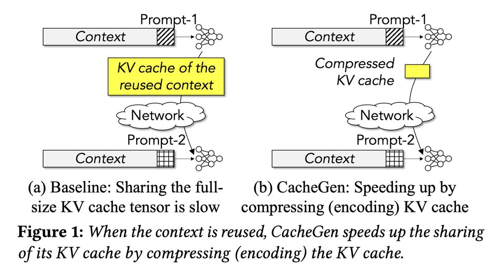

# CacheGen: KV Cache Compression and Streaming for Fast Large Language Model Serving

> Yuhan Liu, Hanchen Li, Yihua Cheng, Siddhant Ray, Yuyang Huang, Qizheng Zhang, Kuntai Du, Jiayi Yao, Shan Lu, Ganesh Ananthanarayanan, Michael Maire, Henry Hoffmann, Ari Holtzman, Junchen Jiang

## 一句话总结

CacheGen 是一种面向 LLM 推理系统的 KV Cache 压缩与流式传输模块，通过自定义编码器将 KV Cache 编码为紧凑的比特流表示，并自适应调整压缩级别以应对带宽变化，在几乎不影响生成质量的前提下将 KV Cache 传输大小降低 3.5–4.3 倍，端到端延迟降低 3.2–3.7 倍。

---

## 摘要翻译

随着大语言模型（LLM）承担越来越复杂的任务，输入往往需要补充更长的上下文以融入领域知识。然而，使用长上下文面临挑战——必须等到整个上下文被 LLM 处理完毕后才能开始生成。虽然通过跨不同输入复用上下文的 KV Cache 可以减少上下文处理延迟，但通过网络获取包含大型张量的 KV Cache 会产生高额的额外网络延迟。

CacheGen 是一个面向 LLM 系统的快速上下文加载模块。首先，CacheGen 使用一个自定义张量编码器，利用 KV Cache 的分布特性，将其编码为更紧凑的比特流表示，且解码开销可忽略不计，从而节省带宽。其次，CacheGen 自适应地调整 KV Cache 不同部分的压缩级别，以应对可用带宽的变化，从而在维持低上下文加载延迟的同时保持高生成质量。在流行的 LLM 和数据集上测试表明，与最近复用 KV Cache 的系统相比，CacheGen 将 KV Cache 大小减少了 3.5–4.3 倍，获取和处理上下文的总延迟减少了 3.2–3.7 倍，且对 LLM 响应质量的影响可忽略不计。

---

## 研究动机

### LLM 长上下文的挑战

大语言模型在处理复杂任务时需要将长上下文（如领域知识文档、对话历史等）附加到输入中。长上下文可以显著提升生成质量，但也带来了两个核心问题：

1. **计算开销超线性增长**：处理长上下文的计算量随上下文长度超线性增长，导致 Time-to-First-Token (TTFT) 可达数秒。
2. **KV Cache 传输延迟被忽视**：现有系统（如 Prompt Cache）假设 KV Cache 始终驻留在本地 GPU 内存中，但实际中 KV Cache 可能需要从其他机器获取，导致显著的网络延迟。

### KV Cache 的规模问题

以 Llama-34B 模型处理 Amazon 2023 年年报（约 80,000 tokens）为例，产生的 KV Cache 大小可达 19 GB，与模型本身大小相当。在 1–10 Gbps 的云服务器带宽下，传输 KV Cache 的延迟可达 100 毫秒到 10 秒以上，严重影响交互体验。

### 与现有工作的区别

现有 KV Cache 优化工作（如智能量化、token 裁剪）主要关注运行时 GPU 内存占用，保留了 KV Cache 的张量格式。而 CacheGen 关注的是传输时大小，将 KV Cache 编码为更紧凑的比特流表示，两者可以互补（CacheGen 可进一步压缩已被其他方法缩小的 KV Cache）。

---

## 方法（技术细节）

### 整体架构

CacheGen 是一个 KV Cache 流式传输器（KV Cache Streamer），包含三个角色：
1. **离线编码**：将 KV Cache 编码为紧凑的比特流（KV bitstream）
2. **自适应流式传输**：根据网络带宽变化动态调整每个 chunk 的编码级别
3. **在线解码**：将接收的比特流解码恢复为 KV Cache

### 三个核心观察（Empirical Insights）

CacheGen 的设计基于对 KV Cache 分布特性的三个关键观察：

1. **Token-wise Locality（Token 级局部性）**：同一层和通道内，相邻 token 的 K/V 张量值更加相似（delta 值的方差比原始值低 2.4–2.9 倍）。这启发 CacheGen 使用 delta 编码而非原始值。

2. **Layer-wise Sensitivity（层级敏感性）**：LLM 输出质量对浅层 KV Cache 值的损失更敏感，对深层的损失不太敏感。这启发 CacheGen 对不同层采用不同量化级别。

3. **Distribution along Layers, Channels, Tokens（维度分布）**：按通道和层分组的 KV 值信息增益显著高于按 token 位置分组的，说明相同通道/层的值更相似。这启发 CacheGen 使用按通道-层分组的概率分布进行算术编码。

### KV Cache 编码器（KV Cache Encoder）

编码器包含三个主要步骤：

#### 1. Change-based Encoding（基于变化的编码）

- 将上下文分割为 **10 个连续 token 的分组**
- 每组中，第一个 token 作为 **anchor token**（锚定 token），独立压缩
- 其余 token 压缩其与 anchor token 的 **delta 张量**
- 类似视频编码的帧间编码，但引用同一 anchor token 以实现并行压缩/解压

#### 2. Layer-wise Quantization（分层量化）

- 将 transformer 层分为三组（前 1/3、中间 1/3、后 1/3）
- **浅层使用更保守的量化**（更精确，更多比特），深层使用更激进的量化（更大误差）
- 使用 vector-wise 量化方法
- Anchor token 始终使用 8-bit 量化以保持精度（因为其影响所有后续 delta 值）

#### 3. Arithmetic Coding（算术编码）

- 使用改进的算术编码（AC）库将量化后的离散符号无损压缩为比特流
- 按通道-层分组获取概率分布（每个通道-层组合有独立的概率分布）
- AC 将更频繁的符号用更少的比特编码，不频繁的用更多比特
- 使用 CUDA 加速编解码，编解码与传输流水线化
- 与使用全局符号分布相比，比特流大小减少最多 53%

### KV Cache 流式传输自适应（Streaming Adaptation）

#### 传输流程

- 将上下文分割为多个 **context chunk**（默认 1.5K tokens/chunk）
- 每个 chunk 在离线编码为多个不同编码级别的比特流
- 传输时逐 chunk 发送，每个 chunk 可选择：
  - 以某个编码级别发送
  - 以文本格式发送（让 LLM 重新计算 KV Cache）

#### 自适应决策

- CacheGen 通过测量前一个 chunk 的吞吐量估计带宽
- 假设该带宽将在剩余 chunk 保持不变
- 计算最佳的流式配置（编码级别或文本回退）
- 目标：保持 TTFT 在 SLO 之内同时最大化生成质量

#### 设计考量

- **Chunk 长度**：不能太长（无法及时响应带宽变化），也不能太短（无法充分利用 GPU 批处理能力），默认 1.5K tokens
- **不同配置的兼容性**：各 chunk 独立编码，不同编码级别的 chunk 可独立解码后拼接重建完整 KV Cache
- **质量影响**：单个 chunk 的高压缩损失不影响其他 chunk，但若带宽过低导致多数 chunk 被压缩，质量仍会下降

---

## 实验结果

### 实验设置

- **模型**：Mistral-7B、Llama-7B、Llama-13B、Llama-70B（7B 到 70B 规模）
- **数据集**：LongChat（100 个长上下文，9.2K–9.6K tokens）、LongBench、PIQA 等（共 662 个上下文，1.4K–16K tokens）
- **评估指标**：TTFT（Time-to-First-Token）、KV Cache 大小、F1 分数、Perplexity
- **对比基线**：8-bit 量化、文本上下文加载、H2O、LLMLingua 等

### 关键结果

#### 1. 延迟降低

- **TTFT 降低 3.2–3.7 倍**：相比量化基线，在类似生成质量（F1 分数和 perplexity）下
- **TTFT 降低 3.1–4.7 倍**：相比文本上下文加载，精度损失不到 2%
- **TTFT 降低 1.67–1.81 倍**：相比 8-bit 量化（近乎无损的 KV Cache 压缩）

#### 2. 带宽节省

- **带宽减少 3.5–4.3 倍**：在相同生成质量下，相比量化基线

#### 3. 与上下文压缩方法结合

- CacheGen + H2O：KV Cache 进一步缩小（Mistral-7B 上从 282MB 降至 71MB），精度保持 0.97
- CacheGen + LLMLingua：KV Cache 进一步缩小（从 492MB 降至 183MB），精度保持 0.94

#### 4. 示例对比（Mistral-7B + LongChat）

| 技术 | KV Cache 大小 (MB) | 精度 (F1) |
|---|---|---|
| 8-bit 量化 | 622 | 1.00 |
| CacheGen | 176 | 0.98 |
| H2O | 282 | 0.97 |
| CacheGen + H2O | 71 | 0.97 |
| LLMLingua | 492 | 0.94 |
| CacheGen + LLMLingua | 183 | 0.94 |

#### 5. SLO 违反率

- SLO=0.5s：CacheGen 比量化基线降低 60% 的 SLO 违反率
- SLO=1s：CacheGen 将 SLO 违反率从 81% 降至 8%

#### 6. 带宽敏感性

- 在 0.4–15 Gbps 和 15–400 Gbps 的广泛带宽范围内，CacheGen 均优于基线
- 高带宽（>20Gbps）时优势缩小，因为量化基线也能快速传输

#### 7. 用户体验研究（QoE）

- 经过 IRB 批准的用户研究
- 270 个评分（Amazon MTurk）
- CacheGen 在 QoE 上显著优于其他方案

### 开销分析

- **解码开销**：可忽略，GPU 实现 + 与传输流水线化
- **离线编码延迟**：约 200ms，与基线相当
- **存储开销**：虽需存储多个版本，总量与量化基线相当
- **计算量**：CacheGen 解码的计算量远小于从文本重新计算 KV Cache 的计算量

---

## 优势

1. **大幅降低传输延迟**：TTFT 降低 3.2–3.7 倍，显著改善交互体验
2. **极低的精度损失**：F1 分数损失不超过 2%，对生成质量影响极小
3. **自适应带宽变化**：动态调整编码级别，适应波动的网络条件
4. **与现有方法互补**：可与 H2O、LLMLingua 等上下文压缩方法结合使用
5. **无需修改 LLM**：作为模块化组件，可即插即用
6. **GPU 加速解码**：解码开销可忽略
7. **离线编码 + 在线流式**：编码一次，多次传输，适应不同带宽
8. **支持回退到文本**：带宽极低时可回退到发送文本上下文

---

## 局限

1. **假设上下文可复用**：需要上下文在不同请求间重复使用，不适用于实时搜索结果等易变上下文
2. **未在高端 GPU 上评估**：使用 NVIDIA A40 GPU，未在更高端 GPU（如 H100）上验证
3. **未评估超大模型**：由于 GPU 内存限制，未在 OPT-175B 等超大模型上测试
4. **网络模型有限**：未涵盖极高带宽场景
5. **存储开销**：需存储多个编码级别的比特流（虽然总量与量化基线相当）
6. **质量受限于带宽**：若带宽过低导致多数 chunk 被高压缩，质量仍会下降
7. **未评估自由文本生成**：如故事生成等任务，质量指标不够明确
8. **需离线编码**：编码需提前进行，不支持完全在线实时编码
9. **chunk 大小固定**：默认 1.5K tokens，未针对不同场景优化

---

## 与 EfficientPaper 相关的研究方向

CacheGen 与 EfficientPaper 项目中以下研究方向密切相关：

1. **KV Cache 量化（kv_cache_quant）**：CacheGen 在量化基础上进一步使用 delta 编码和算术编码，是 KV Cache 量化工作的延伸
2. **KV Cache 管理（kv_cache_management）**：CacheGen 作为 KV Cache 流式传输器，属于 KV Cache 管理的重要组成部分
3. **LLM 推理优化**：与 FlashAttention、SARATHI 等推理加速方法相关
4. **上下文压缩**：与 H2O、LLMLingua、Gisting 等上下文压缩方法互补
5. **RAG（检索增强生成）**：CacheGen 与 RAG 场景天然契合，可加速检索文档的 KV Cache 加载
6. **分布式 LLM 服务**：关注跨机器 KV Cache 传输，与分布式推理系统相关

---

## AI 生成声明

本笔记由 AI Agent（Hermes Agent）自动生成。笔记内容基于论文原文（arXiv:2310.07240v6）的文本提取和分析，包括摘要翻译、方法总结、实验结果归纳等。AI 生成过程中未对论文内容进行创造性改写或添加未经证实的信息。所有技术细节、数据和结论均来源于原文。本笔记仅供学习参考，不构成对论文内容的权威解读。
