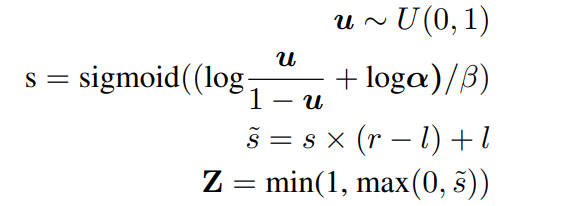
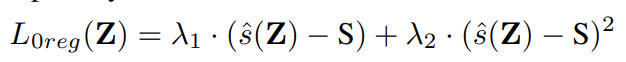
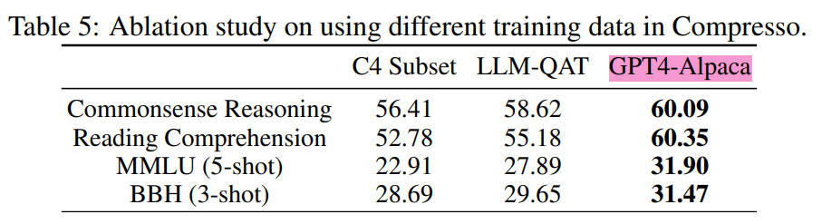
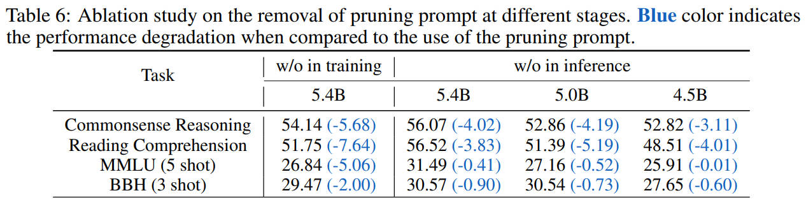
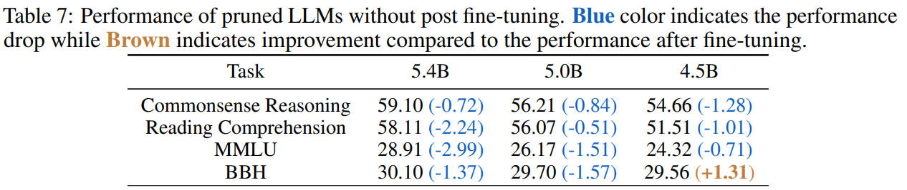

# Compresso: Structured Pruning with Collaborative Prompting Learns Compact Large Language Models

> This is a training-based structured pruning approach.

  

The limitations of one-shot pruning:
- It depends heavily on pre-defined weight importance metrics for pruning decisions, and thus adopts a **uniform-sparsity ratio across all layers** without considering the different redundancy at each layer.
- **Error recovery** for remaining model parameters is limited compared to training-based pruning, potentially affecting the final performance.

## Method

### Challenges
- Training-based pruning is resource-intensive.
- Hard to preserve the generalization capability of LLM.
    - dataset selection

### Training data for pruning
- We use instruction tuning datasets as pruning data.
    - The distribution of pruning data should align with the pre-training data. However, it is hard to satisfy this.
    - GPT4-Alpaca dataset

### Efficient training-based structured pruning

Structured pruning:
- attention heads
- FFN intermediate dimension
- hidden dimension

Learning pruning mask values with augmented L0 regularization

- 重参数化mask, $\alpha$ is the learnable parameter:

  

- Mask regularization for the expected pruning ratio:

  

## Experiments

**The impact of pruning data.** GPT4-Alpaca is the best from the three datasets.

  

**The effectiveness of collaborative pruning.** Table 6 indicates that removing the pruning prompt at either stage significantly reduces the performance of pruned LLMs, particularly on commonsense reasoning and reading comprehension tasks. This demonstrates the effectiveness of our proposed collaborative pruning. **Pruning prompt** 很重要！

  

The effectiveness of post fine-tuning. fine-tuning可以轻微提高表现，但是在特定任务上会产生负面的影响；去掉fine-tuning后，大部分任务的结果会有所下降，但是也存在异常提高的情况，说明fine-tuning并不是必须的，不应过分依赖fine-tuning.

  

