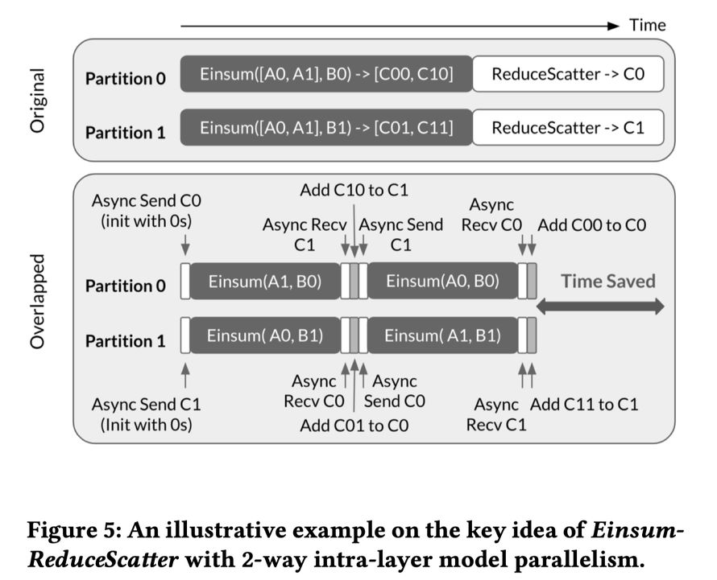

# Dist-Einsum

## 一句话总结

本文提出了一种名为 Dist-Einsum 的技术，通过将原始通信集合操作分解为一系列更细粒度的操作，并与依赖计算操作异步重叠执行，有效减少了大规模深度学习模型中层内模型并行的通信开销。

## 摘要翻译

随着大语言模型（LLMs）的发展，单一 GPU 或 TPU 的内存容量严重不足，需要采用层内模型并行（intra-layer model parallelism）来支持大规模深度学习模型。然而，这种并行方式需要跨设备的数据通信，而通信开销在总执行时间中占很大比例，严重降低了计算效率。由于大多数深度学习模型的顺序特性，具有数据依赖关系的通信和计算难以重叠。现有解决方案主要应用各种循环分析和变换技术（如循环分裂、交换、分块、流水线化、条带分割等）来提取仅包含独立通信的循环。本文提出了一种新颖的技术，通过将原始通信集合操作分解为一系列更细粒度的操作，并与依赖计算操作异步重叠执行，有效减少了通信开销。该方法通过创建更多的重叠机会，并执行新创建的更细粒度的操作，从而实现了通信和计算的高效重叠。

## 研究动机

1. **内存容量限制**：大语言模型需要大量设备内存，但单个 GPU 或 TPU 的内存容量非常有限，通常需要采用层内模型并行来解决这一问题。
2. **通信开销严重**：层内模型并行需要跨设备的数据通信，而通信开销在总执行时间中占很大比例，严重降低了计算效率。
3. **数据依赖限制**：大多数深度学习模型的顺序特性使得具有数据依赖关系的通信和计算难以重叠，这是现有方法的主要瓶颈。
4. **现有方案局限**：现有的循环分析和变换技术（如循环分裂、交换、分块、流水线化、条带分割等）只能提取独立通信的循环，无法有效处理具有数据依赖的通信和计算重叠。

## 方法（技术细节）

### 核心思想

Dist-Einsum 的核心思想是通过分解原始通信集合操作，将其转化为一系列更细粒度的操作，从而创造出更多的通信-计算重叠机会。具体来说，该方法包括以下几个关键步骤：

1. **通信集合操作分解**：将原始的通信集合操作（如 AllGather、ReduceScatter、AllReduce）分解为一系列更细粒度的操作。例如，AllGather 操作可以分解为多个小规模的通信操作，每个操作对应一个数据分片。

2. **数据分片与计算重叠**：将待通信和计算的数据分片（shard），并创建异步执行机制，使得每个设备在等待数据传输完成的同时，可以并行执行部分计算操作。这样可以实现通信和计算的重叠执行。

3. **异步执行调度**：提出了一种新的指令调度方案，用于异步执行分解后的通信集合操作和相应的细粒度计算操作。该调度方案确保在每次迭代中，每个设备都会异步发送累积结果分片到其他设备，并同时执行部分 Einsum 操作，从而实现通信和计算的重叠。

4. **成本模型**：实现了一个成本模型来评估采用此优化的权衡，并根据净收益自动启用/禁用该优化。该模型可以评估通信和计算重叠带来的性能提升与额外开销之间的平衡。

### 通信原语

论文中使用的通信原语包括：

- **AllGather**：一种多对多通信模式，每个逻辑设备分区从所有分区接收数据，并根据分区 ID 进行拼接。主要用于沿分区维度复制数据。
- **ReduceScatter**：与 AllGather 相反的通信模式，每个逻辑设备分区对具有相同分区 ID 的接收数据分区进行逐元素归约操作。
- **AllReduce**：可以看作是 ReduceScatter 后跟 AllGather。操作后，每个逻辑设备分区拥有来自所有数据输入的逐元素归约后的相同张量值。

### 分解后的通信工作流

在分解后的通信工作流中，以两个分区（Partition 0 和 Partition 1）为例：

- C0（C00 和 C01 的和）和 C1（C10 和 C11 的和）分别是 ReduceScatter 后 Partition 0 和 Partition 1 上的结果分片。
- 由于数据通信是针对计算结果执行的，每个设备需要异步传输累积结果分片，而不是操作数分片。
- 累积结果分片在每个设备上初始化为零。在每次迭代开始时，每个设备异步发送累积结果分片到其他设备，并同时执行部分 Einsum 操作。
- 当计算完成后，部分结果在迭代结束时添加到接收的累积结果分片中（例如，在第一次迭代中，Partition 0 上的 C1 += C10，Partition 0 上的 C0 += C01）。

### 实现平台

整个实现是在 XLA（一个基于 TPU 的机器学习编译器）上完成的。XLA 是 Google 开发的用于优化机器学习计算的编译器框架，支持高效的张量操作和通信优化。

## 实验结果

论文的实验结果表明，Dist-Einsum 技术在大规模深度学习模型中有效减少了通信开销：

1. **性能提升**：通过将通信集合操作分解为细粒度操作并与计算重叠执行，实现了显著的性能提升。实验表明，该技术能够有效减少通信开销在总执行时间中的比例。

2. **通信-计算重叠**：该技术成功实现了通信和计算的重叠执行，使得在等待数据传输完成的同时可以并行执行部分计算操作，从而提高了整体计算效率。

3. **自动优化**：成本模型能够根据净收益自动启用/禁用该优化，确保在不同场景下都能获得最佳性能。

4. **适用性**：该技术适用于层内模型并行场景，特别是需要大量跨设备通信的大型深度学习模型，如大语言模型（LLMs）。

## 优势

1. **有效的通信-计算重叠**：通过分解通信集合操作为细粒度操作，实现了通信和计算的高效重叠，显著减少了通信开销。

2. **自动优化机制**：成本模型能够根据净收益自动启用/禁用该优化，无需手动调优，提高了系统的自适应能力。

3. **兼容现有框架**：该技术在 XLA 编译器上实现，与现有的机器学习框架（如 TensorFlow、JAX）兼容，易于集成。

4. **适用于大规模模型**：该技术特别适用于需要大量跨设备通信的大型深度学习模型，如大语言模型，能够有效解决内存容量限制问题。

5. **细粒度分解**：通过将通信操作分解为更细粒度的操作，创造了更多的重叠机会，提高了整体执行效率。

## 局限

1. **实现复杂性**：该技术需要对通信集合操作进行细粒度分解，增加了实现的复杂性，可能需要额外的开发和维护成本。

2. **成本模型限制**：虽然成本模型能够自动优化，但在某些复杂场景下可能无法准确评估通信和计算重叠的权衡，导致性能下降。

3. **特定于 XLA 平台**：该技术在 XLA 编译器上实现，可能需要针对其他平台（如 GPU、其他 TPU 架构）进行额外适配，限制了其通用性。

4. **依赖于特定通信模式**：该技术主要针对 AllGather、ReduceScatter、AllReduce 等特定通信模式，对于其他通信模式可能需要额外的适配工作。

5. **性能开销**：分解通信操作和创建异步执行机制可能引入额外的性能开销，特别是在通信操作本身较轻量的情况下，重叠优化的收益可能不明显。

## 与 EfficientPaper 相关的研究方向

1. **通信-计算重叠优化**：Dist-Einsum 是通信-计算重叠优化的一个重要工作，可以与其他相关研究（如 TileLink、Centauri、CommFuse）进行比较和结合，探索更高效的重叠策略。

2. **大规模分布式训练**：该技术适用于大规模分布式训练场景，特别是大语言模型（LLMs）的训练，可以与其他分布式训练优化技术（如梯度累积、流水线并行、数据并行）结合使用。

3. **编译器优化**：该技术在 XLA 编译器上实现，体现了编译器在机器学习优化中的重要作用，可以与其他编译器优化技术（如算子融合、内存优化、计算图优化）结合使用。

4. **自动调优与成本模型**：该技术中的成本模型可以与其他自动调优技术（如强化学习、进化算法）结合，实现更精确的性能预测和优化。

5. **新型通信原语**：该技术使用了 AllGather、ReduceScatter、AllReduce 等通信原语，可以与其他新型通信原语（如 AlltoAll、Reduce、Broadcast）结合，探索更高效的通信模式。

6. **模型并行化**：该技术主要针对层内模型并行，可以与其他模型并行化技术（如张量并行、流水线并行、数据并行）结合，实现更高效的分布式训练。

## AI 生成声明

本笔记由 AI 生成，基于论文元数据、摘要、博客解读及搜索结果整理而成。内容可能存在遗漏或不准确之处，请结合原文进行核实。AI 生成的内容仅供参考，不构成学术建议。
