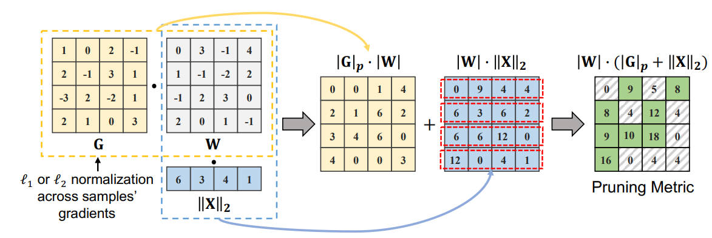

# Beyond Size: How Gradients Shape Pruning Decisions in Large Language Models



## 一句话总结

GBLM-Pruner 是一种基于梯度信息的免训练（training-free）LLM 剪枝方法，通过利用预训练大语言模型的梯度一阶泰勒展开项，结合权重幅度与梯度范数来确定剪枝指标，在 LLaMA-1/2 系列模型上显著优于 SparseGPT、Wanda 等现有方法。

---

## 摘要翻译

大语言模型（LLM）拥有数十亿参数，是网络剪枝的理想目标——在不损害性能的前提下移除部分模型权重。先前的方法，如幅度剪枝（magnitude pruning）、SparseGPT 和 Wanda，要么仅关注权重本身，要么将权重与激活值结合以实现稀疏性。然而，它们忽略了从预训练 LLM 中获取的具有信息量的梯度。在本文中，我们提出了一种新型的基于稀疏性的预训练 LLM 剪枝方法，称为基于梯度的语言模型剪枝器（Gradient-based Language Model Pruner, GBLM-Pruner）。GBLM-Pruner 利用泰勒展开的一阶项，通过少量校准样本的适当归一化梯度来确定剪枝指标，以训练无关的方式运行，并在多个基准测试中显著优于 SparseGPT 和 Wanda 等竞争方法。有趣的是，通过引入梯度，我们的方法在非结构化剪枝中往往能揭示出一些结构模式，这反映了 LLM 参数结构中固有的几何相互依赖性。此外，GBLM-Pruner 无需任何后续的再训练或权重更新，保持了与其他方法相同的简洁性。在 LLaMA-1 和 LLaMA-2 上进行的广泛评估表明，GBLM-Pruner 在多个基准测试中以显著优势超越了幅度剪枝、Wanda 和 SparseGPT。我们进一步将该方法扩展到 Vision Transformer 上。我们的代码和模型可在 https://github.com/VILA-Lab/GBLM-Pruner 获取。

---

## 研究动机

### LLM 剪枝的必要性

大语言模型（如 GPT 系列、BERT、LLaMA 等）在自然语言处理和多模态学习领域取得了巨大突破，但在实际应用中面临诸多挑战：参数量庞大、内存消耗高、推理计算成本高昂。剪枝（pruning）作为一种模型压缩技术，通过移除不重要的权重或神经元/层来减少模型大小和计算需求，是解决这些问题的重要手段之一。

### 现有方法的局限性

在免训练（training-free）条件下，现有的 LLM 剪枝方法主要采用以下两种策略：

1. **权重幅度剪枝（Magnitude Pruning）**：保留绝对值较大的权重，移除较小的权重。这种方法简单但缺乏理论依据，剪枝效果有限。
2. **权重+激活值结合（如 SparseGPT、Wanda）**：
   - **SparseGPT**：借鉴最优脑外科医生（OBS）框架，通过计算矩阵逆和更新权重来确定剪枝指标，方法较为复杂。
   - **Wanda**：将权重幅度与输入特征范数相乘来评估权重重要性，虽然简单，但缺乏深刻的理论依据。

这些方法共同的不足在于：**忽略了预训练 LLM 中具有信息量的梯度信息**。梯度与权重重要性之间存在天然联系（如最优脑损伤 OBD 和最优脑外科医生 OBS 理论所揭示的），但这些方法在理论推导中假设全训练网络的梯度很小，因此忽略了梯度的贡献。

### 核心研究问题

本文旨在解决上述复杂性和可解释性问题，探索如何利用梯度信息来改善 LLM 剪枝效果，同时保持方法的简洁性和免训练特性。

---

## 方法（技术细节）

### 1. 理论基础：最优脑外科医生（OBS）框架的扩展

GBLM-Pruner 的理论基础来自最优脑损伤（OBD）和最优脑外科医生（OBS）框架。作者重新审视并改进了 OBS 框架，将梯度（即泰勒展开的一阶项）纳入考量。

**核心优化问题**：网络剪枝中，移除权重 $w_m$ 导致的误差增加量 $\delta E_m$ 可表示为：

$$\delta E_m = \frac{w_m^2}{2(H^{-1})_{mm}} - \frac{w_m (g^\top \cdot H^{-1} \cdot I_m)}{(H^{-1})_{mm}}$$

其中 $H$ 是 Hessian 矩阵，$g$ 是梯度，$I_m$ 是对应被剪枝权重的单位向量。

通过简化假设（仅考虑 Hessian 的对角元素），最终得到：

$$\delta E_m = (w_m \|x_m\|_2)^2 + w_m (-g_m)$$

其中 $x_m$ 是对应激活向量，$g_m$ 是通过 L1 或 L2 范数跨样本归一化得到的梯度幅度。

### 2. 剪枝指标（Pruning Metric）

GBLM-Pruner 的核心创新在于将梯度信息整合到剪枝指标中。给定权重矩阵 $W$（形状 $d_{out} \times d_{in}$）和梯度矩阵 $G$（形状 $N \times d_{out} \times d_{in}$），权重 $W[i,j]$ 的重要性评分定义为：

$$W_m[i,j] = \alpha \cdot |W[i,j]| \cdot \|G[:,i,j]\|_p + |W[i,j]| \cdot \|X[:,j]\|_2$$

其中：
- $\|G[:,i,j]\|_p$ 是跨样本的梯度 L1 或 L2 范数（$p=1$ 或 $p=2$）
- $\|X[:,j]\|_2$ 是输入激活的 L2 范数
- $\alpha$ 是缩放因子（默认为 100），用于平衡梯度与激活值的贡献（因为梯度的量级通常较小）
- 使用列比较（column-wise comparison）作为剪枝粒度

### 3. 剪枝算法（Algorithm 1）

```
输入：权重矩阵 W ∈ (d_out, d_in)
      激活矩阵 X ∈ (N×L, d_in)
      梯度矩阵 G ∈ (N, d_out, d_in)
      稀疏率 p ∈ (0, 1)
输出：剪枝后的权重矩阵

1. 计算剪枝指标 Wm[i,j] = |W[i,j]|·∥G[:,i,j]∥p + |W[i,j]|·∥X[:,j]∥2
2. 对每个输出维度 i，在 Wm[i,:] 中找到 p% 最小权重
3. 将对应权重置零（W[M] = 0）
```

### 4. 与之前梯度方法的区别

- **之前的梯度方法**（如 Molchanov et al., Sanh et al.）：用于迁移学习场景，需要在特定任务上进行微调以保持准确率
- **GBLM-Pruner**：首次尝试将梯度信息用于数十亿参数语言模型的一次性剪枝，同时保持零样本泛化能力，无需任何权重更新

### 5. 比较粒度的选择

通过对比不同比较粒度（层内、全局、列级），作者发现**列级比较**（column-wise comparison）效果最佳，因为每列是输出激活的构成组件，这与 Wanda 的发现一致。

### 6. 实验设置

- **模型**：LLaMA-1（7B, 13B, 30B）和 LLaMA-2（7B, 13B, 70B）
- **校准数据**：从 C4 训练数据第一分片中随机采样 128 个 2048 token 的序列
- **梯度计算**：以语言建模为目标函数
- **缩放因子 $\alpha$**：100（通过验证集选择）
- **硬件**：NVIDIA A100 GPU（40/80GB 显存）
- **剪枝类型**：非结构化剪枝和 N:M 半结构化剪枝（2:4 和 4:8）
- **评估指标**：困惑度（Perplexity）和零样本评估（Zero-shot Harness）
- **基线方法**：幅度剪枝（Magnitude Pruning）、SparseGPT、Wanda

---

## 实验结果

### 1. 困惑度评估（WikiText）

**非结构化剪枝（50% 稀疏度）**：

| 方法 | LLaMA-2-7B | LLaMA-2-13B | LLaMA-2-70B | LLaMA-1-7B | LLaMA-1-13B | LLaMA-1-30B |
|------|-----------|------------|------------|-----------|------------|------------|
| Dense | 5.47 | 4.88 | 3.32 | 5.68 | 5.09 | 4.10 |
| Magnitude | 16.03 | 6.83 | 5.36 | 17.29 | 20.21 | 7.54 |
| SparseGPT | 7.00 | 6.03 | 4.25 | 7.22 | 6.19 | 5.32 |
| Wanda | 6.92 | 5.97 | 4.22 | 7.26 | 6.15 | 5.24 |
| **GBLM-Pruner (L1)** | **6.86** | **5.88** | **4.17** | **7.15** | **6.11** | **5.18** |

关键发现：GBLM-Pruner 在所有模型上均显著优于幅度剪枝、Wanda 和 SparseGPT。

**半结构化剪枝**：
- **2:4 剪枝**：SparseGPT 表现略优（由于 2:4 约束更严格）
- **4:8 剪枝**：GBLM-Pruner 在大多数模型上优于其他方法，尤其是较大模型

### 2. 零样本评估（50% 非结构化稀疏度）

在 BoolQ、RTE、HellaSwag、WinoGrande、ARC-e、OBQA 六个零样本任务上：

| 模型 | 方法 | 平均准确率 |
|------|------|-----------|
| LLaMA-1-7B | Dense | 67.47 |
| LLaMA-1-7B | SparseGPT | 61.77 |
| LLaMA-1-7B | Wanda | 61.17 |
| LLaMA-1-7B | **Ours** | **63.07** |
| LLaMA-1-13B | Dense | 69.96 |
| LLaMA-1-13B | SparseGPT | 66.27 |
| LLaMA-1-13B | Wanda | 66.45 |
| LLaMA-1-13B | **Ours** | **66.65** |
| LLaMA-1-30B | Dense | 72.50 |
| LLaMA-1-30B | SparseGPT | 69.33 |
| LLaMA-1-30B | Wanda | 70.84 |
| LLaMA-1-30B | **Ours** | **71.17** |

关键发现：GBLM-Pruner 在大多数模型上的平均准确率优于 SparseGPT 和 Wanda。

### 3. 消融实验

**梯度重要性**：
- 仅使用梯度-权重项（|W|·∥G∥₁）已显著优于幅度剪枝
- |W|·∥G∥₂ 在 LLaMA-2-13B 上甚至接近 Wanda 和 SparseGPT 的性能

**剪枝指标分析**：
- 梯度累积（gradient accumulation）效果最差（困惑度 119.72）
- L1 和 L2 范数归一化效果优异（困惑度 7.17 和 7.09）
- 最终指标 |W|·∥X∥₂ + α·|W|·∥G∥₁ 取得最佳结果（困惑度 6.86）

**缩放因子 α 的影响**：
- α=100 时取得最佳困惑度（6.858）
- α 过小（0.001）或过大（100000）都会降低性能

**稀疏度变化**：
- 在不同稀疏度（0.1-0.6）下，GBLM-Pruner 在 LLaMA-2-13B 和 LLaMA-1-30B 上始终优于其他方法

**校准样本依赖性**：
- 对校准集的选择具有鲁棒性（5 次随机采样，困惑度在 6.86-6.89 之间）
- 与 SparseGPT 相比，对校准样本数量的敏感度较低

### 4. 剪枝模式可视化

非结构化剪枝在引入梯度后展现出结构化模式，反映了 LLM 参数结构中固有的几何相互依赖性。L1 范数归一化产生的剪枝模式比梯度累积更加精细和清晰。

---

## 优势

1. **理论严谨**：基于 OBS 框架的扩展，为剪枝指标提供了理论支撑，而非仅依赖经验
2. **性能卓越**：在非结构化剪枝中，困惑度和零样本准确率均显著优于 SparseGPT、Wanda 和幅度剪枝
3. **简洁高效**：无需任何后续的权重更新或再训练，保持了与其他方法相同的简洁性
4. **训练无关（Training-free）**：仅需少量校准样本即可计算梯度和激活值，无需额外训练
5. **良好的可解释性**：梯度的引入使剪枝决策更具可解释性，揭示了 LLM 参数的结构特征
6. **鲁棒性**：对校准样本选择和数量不敏感
7. **通用性**：已扩展到 Vision Transformer，展示出跨模态的适用性
8. **支持半结构化剪枝**：除非结构化剪枝外，还支持 2:4 和 4:8 半结构化剪枝
9. **可扩展性**：适用于大模型（如 LLaMA-2-70B），计算效率高

---

## 局限

1. **2:4 半结构化剪枝表现欠佳**：在 2:4 半结构化剪枝中，SparseGPT 表现优于 GBLM-Pruner，说明在更严格的硬件约束下，GBLM-Pruner 的优势有所减弱
2. **零样本评估的不一致性**：虽然在平均准确率上优于其他方法，但在个别任务上表现并不一致
3. **梯度计算开销**：虽然无需再训练，但计算梯度仍需一定的计算资源，尤其是对于大模型
4. **参数调优**：缩放因子 α 需要通过验证集选择，增加了使用复杂度
5. **依赖校准数据**：需要从训练数据中获取校准样本，对于某些场景可能不太方便
6. **仅针对非结构化/半结构化剪枝**：不支持结构化剪枝（如删除整个注意力头或 FFN 层）
7. **实验规模有限**：虽然测试了 LLaMA-1/2 系列，但未在更多架构（如 GPT 系列、PaLM 等）上验证
8. **理论简化**：OBS 框架中对 Hessian 矩阵的对角近似可能不完全准确，限制了理论的精确性

---

## 与 EfficientPaper 相关的研究方向

### 1. 模型压缩与加速
GBLM-Pruner 属于模型压缩领域的核心研究方向之一，与以下研究密切相关：
- **剪枝（Pruning）**：本文的核心技术，属于非结构化和半结构化剪枝
- **量化（Quantization）**：如 GPTQ、AWQ 等方法，与剪枝互补
- **知识蒸馏（Knowledge Distillation）**：可与剪枝结合进一步压缩模型

### 2. 大语言模型效率优化
- **高效推理**：通过剪枝减少模型大小和计算需求
- **边缘部署**：剪枝后的模型可部署到资源受限的设备上
- **低功耗 AI**：减少模型参数可降低能耗

### 3. 稀疏训练与稀疏性研究
- **彩票假设（Lottery Ticket Hypothesis）**：寻找稀疏子网络
- **稀疏注意力机制**：与注意力剪枝相关
- **N:M 半结构化稀疏**：适合硬件加速的稀疏模式

### 4. 梯度信息在模型压缩中的应用
- 本文首次将梯度信息用于 LLM 的一次性剪枝，开辟了新的研究方向
- 未来可探索梯度信息在量化、蒸馏等其他压缩技术中的应用

### 5. 与 EfficientPaper 项目中其他论文的关联
- **SparseGPT**（Frantar & Alistarh, 2023）：GBLM-Pruner 的主要对比方法
- **Wanda**（Sun et al., 2023）：GBLM-Pruner 的主要对比方法
- **Llama-1/2 系列**：GBLM-Pruner 的实验对象
- **稀疏剪枝（sparse_pruning）**：关键词标签与项目其他剪枝相关论文关联

---

## AI 生成声明

本笔记由 AI Agent（Hermes Agent，Nous Research）自动生成。内容基于论文 PDF 文本提取（使用 PyMuPDF/fitz）和元数据解析，经过结构化整理和翻译。笔记中的信息准确性和完整性依赖于原始论文内容，仅供参考学习使用。

- 生成工具：Hermes Agent (Nous Research)
- 文本提取：PyMuPDF (fitz)
- 生成日期：2025年6月5日
- 论文来源：arXiv:2311.04902v2
- 项目：EfficientPaper

---

*本文最后更新：2025-06-05*
