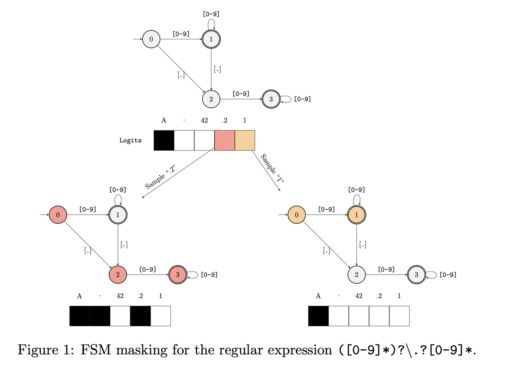

# Efficient Guided Generation for Large Language Models

> 本 note 由 AI Agent 自动生成，生成日期：2025-06-05。所有内容基于论文原文的中文翻译与分析。

## 一句话总结

本文提出了一种基于有限状态机（FSM）的高效索引方法，能够以 O(1) 平均复杂度实现正则表达式和上下文无关文法（CFG）引导的大语言模型（LLM）文本生成，显著优于现有方案，并开源实现了 Outlines 库。

## 摘要翻译

本文展示了如何将神经文本生成问题构造性地重新表述为有限状态机状态之间的转换。该框架通过构建语言模型词汇表上的索引，实现了使用正则表达式和上下文无关文法引导文本生成的高效方法。该方法是模型无关的，允许强制执行领域特定知识和约束，并通过保证生成文本的结构来支持构建可靠接口。它对 token 序列生成过程几乎没有额外开销，并显著优于现有解决方案。该方法在开源 Python 库 Outlines 中提供了实现。

## 研究动机

在 LLM 应用中，常需要生成符合特定格式或语法约束的文本（如 JSON、Python 代码、SQL 语句等）。现有的引导生成方法（如 Microsoft 的 Guidance 库）通过在每一步对整个词汇表进行遍历来确定有效 token，并将无效 token 的概率设为零。这种方法每步需要 O(N) 的时间复杂度（N 为词汇表大小，通常为数万级别），随着生成 token 数量增加，计算开销急剧增长。

本文旨在解决这一核心瓶颈：如何高效地匹配或解析不完整字符串，使其符合正则表达式或 CFG 约束，并在每次迭代中快速确定有效的 token 集合。

## 方法（技术细节）

### 3.1 基于 FSM 的正则表达式引导生成

**核心思想**：将正则表达式转换为有限状态机（FSM），跟踪 FSM 状态转换，利用预计算的索引在 O(1) 平均时间内确定有效 token。

**FSM 形式化**：定义五元组 (Q, Σ, δ, q₀, F)，其中 Q 为有限状态集，Σ 为有限字母表，δ: Q × Σ → Q 为转移函数，q₀ 为初始状态，F ⊆ Q 为接受状态集。

**索引构建**（Algorithm 3 & 4）：
1. 对词汇表中的每个 token v，从 FSM 的每个状态出发，检查 v 能否被接受（find_sub_sequences）
2. 记录每个状态到有效 token 集合的映射 σ: Q → P(V)
3. 使用哈希表存储映射，使查询复杂度为 O(1) 平均时间

**生成过程**：
- 每次采样 token 后，FSM 状态根据已采样 token 前进
- 根据当前 FSM 状态，通过索引快速获取有效 token 集合
- 将无效 token 的概率掩码为零，然后进行采样

**示例**：对于浮点数正则表达式 `([0-9]*)?\.?[0-9]*`，词汇表为 {"A", ".", "42", ".2", "1"}：
- 初始状态（state 0）：仅可采样 ".", "42", ".2", "1"（"A" 被掩码）
- 采样 ".2" 后进入 state 3：仅可采样 "42", "1"
- 采样 "1" 后进入 state 1：可采样 ".", ".42", ".2", "1"

### 3.2 扩展到 CFG 引导生成

**问题**：正则表达式仅支持有限状态，无法处理具有嵌套结构的语法（如 Python、JSON、SQL）。

**解决方法**：使用下推自动机（PDA）扩展 FSM 方法，结合 LALR(1) 解析器。

**关键创新**：
1. 为每个解析器状态构造组合 FSM（对应所有可读取的终端符号的 FSM 的并集）
2. 使用解析器状态和 FSM 状态的组合作为索引键
3. 对于 REDUCE 操作，索引需要支持栈值查询（使用 trie 数据结构）
4. 通过扫描/词法分析识别部分匹配的终端符号

**具体流程**：
- 解析器状态决定哪些文法符号和转换被允许
- 为每个解析器状态构造合并 FSM
- 扫描/词法分析识别当前字符串可能对应的终端符号集合
- 使用 PDA 的转移函数确定允许的栈值和路径
- 验证是否存在完整的解析路径

### 3.3 性能对比

与 Microsoft Guidance 库的对比实验：
- 词汇表大小 N = 50,257（GPT-2 词汇表）
- Guidance 使用部分正则表达式匹配（每次从头开始），需遍历整个词汇表
- Outlines 使用索引方法，O(1) 查询
- 实验结果显示：随着生成 token 数量增加，Guidance 运行时间线性增长，而 Outlines 保持稳定

## 实验结果

### 正则表达式引导生成示例

使用 GPT-2-medium（355M 参数）进行测试：

1. **二值回答**：正则表达式 `\s*([Yy]es|[Nn]o|[Nn]ever|[Aa]lways)`
   - 无引导："Is 1+1=2? This is probably the most perplexing question..."
   - 有引导："Is 1+1=2? Always"

2. **年份生成**：正则表达式 `\s*19[0-9]{2}`
   - 无引导："In what year was Noam Chomsky born? Professor Chomsky was born in about 1895..."
   - 有引导："In what year was Noam Chomsky born? 1952"

3. **IP 地址生成**：正则表达式 `((25[0-5]|2[0-4]\d|[01]?\d\d?)\.){3}(25[0-5]|2[0-4]\d|[01]?\d\d?)`
   - 无引导："What is the IP address of the Google DNS servers? Passive DNS servers are at DNS servers..."
   - 有引导："What is the IP address of the Google DNS servers? 2.2.6.1"

### 性能对比

- **Guidance 库**：运行时间随生成 token 数量线性增长（约 0-100 秒）
- **Outlines 库**：运行时间基本保持稳定（接近 0 秒）
- 优势：在最大生成 100 个 token 时，Outlines 比 Guidance 快数十倍

## 优势

1. **高效性**：索引方法实现 O(1) 平均查询复杂度，显著优于 O(N) 的遍历方法
2. **模型无关**：不依赖特定模型架构，可应用于任何返回 token 概率分布的函数
3. **可扩展性**：支持正则表达式和 CFG 两种约束，覆盖常见结构化输出需求
4. **低开销**：索引构建在预处理阶段完成，对生成过程几乎无额外开销
5. **易于集成**：可扩展现有的正则表达式库和解析器实现
6. **开源实现**：通过 Outlines 库提供易用的 Python API
7. **灵活性**：支持任意启动和停止引导生成

## 局限

1. **内存开销**：需要预计算和存储索引，尽管平均内存成本较低，但对于复杂文法可能增加
2. **预处理成本**：索引构建需要遍历整个词汇表，虽然只做一次，但对于大词汇表可能耗时
3. **文法限制**：基于 FSM/PDA 的方法可能对某些复杂的上下文相关文法支持有限
4. **实现复杂度**：CFG/PDA 扩展实现较为复杂，需要深入理解解析器理论
5. **调试困难**：错误的正则表达式或文法可能导致难以理解的生成错误
6. **未考虑流式生成**：论文主要关注离线生成，对于实时流式场景的支持需要进一步研究

## 与 EfficientPaper 相关的研究方向

1. **结构化输出生成**：本方法可直接应用于需要结构化输出（如 JSON、代码）的 LLM 应用，提升可靠性和效率
2. **推理优化**：索引方法可结合 KV 缓存等推理优化技术，进一步减少生成延迟
3. **代码生成**：对于需要语法正确性的代码生成任务，CFG 引导生成可确保生成的代码符合语言规范
4. **工具调用**：在 LLM 工具调用场景中，确保生成的 API 调用符合接口规范
5. **数据提取**：使用正则表达式引导生成可确保从文本中提取符合特定格式的数据
6. **模型压缩与蒸馏**：结合结构化输出约束，可减少模型需要学习的语法细节，可能促进模型压缩
7. **安全与可控生成**：通过约束生成空间，可减少有害内容的生成，提升安全性
8. **多模态生成**：在多模态场景中，结构化约束可用于确保文本与图像/音频的对应关系
9. **并行生成**：索引方法可与并行解码策略结合，提升生成吞吐量
10. **长文本生成**：对于需要结构化长文本（如文档、报告）的场景，本方法可提供可靠的约束保证

## 参考信息

- **论文标题**: Efficient Guided Generation for Large Language Models
- **作者**: Brandon T. Willard, Rémi Louf
- **机构**: Normal Computing
- **年份**: 2023
- **发表**: arXiv (http://arxiv.org/abs/2307.09702v4)
- **关键词**: deployment
- **代码**: 开源 Python 库 Outlines (https://github.com/normal-computing/outlines)
- **相关工作**: Microsoft Guidance, RELM, Synchromesh, parserLLM, reLLM
