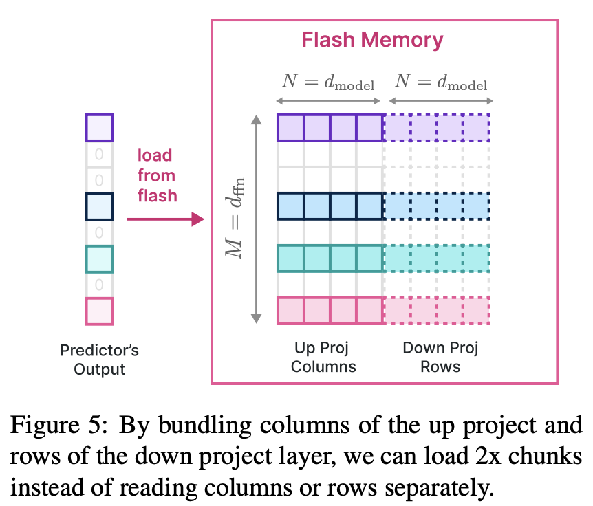

# LLM in a flash: Efficient Large Language Model Inference with Limited Memory

## Abstract

Large language models (LLMs) are central to modern natural language
processing, delivering exceptional performance in various tasks. However, their
substantial computational and memory requirements present challenges,
especially for devices with limited DRAM capacity. This paper tackles the
challenge of efficiently running LLMs that exceed the available DRAM capacity
by storing the model parameters in flash memory, but bringing them on demand to
DRAM. Our method involves constructing an inference cost model that takes into
account the characteristics of flash memory, guiding us to optimize in two
critical areas: reducing the volume of data transferred from flash and reading
data in larger, more contiguous chunks. Within this hardware-informed
framework, we introduce two principal techniques. First, "windowing"
strategically reduces data transfer by reusing previously activated neurons,
and second, "row-column bundling", tailored to the sequential data access
strengths of flash memory, increases the size of data chunks read from flash
memory. These methods collectively enable running models up to twice the size
of the available DRAM, with a 4-5x and 20-25x increase in inference speed
compared to naive loading approaches in CPU and GPU, respectively. Our
integration of sparsity awareness, context-adaptive loading, and a
hardware-oriented design paves the way for effective inference of LLMs on
devices with limited memory.

1. slidling windows 替换最近没有使用的weight
2. weight bundling，由于mlp的up和down具有关联性，他们的对应行和列会被同时激活，所以存储时可以放在一起，从而增加flash读取时的block size，提高flash IO效率。