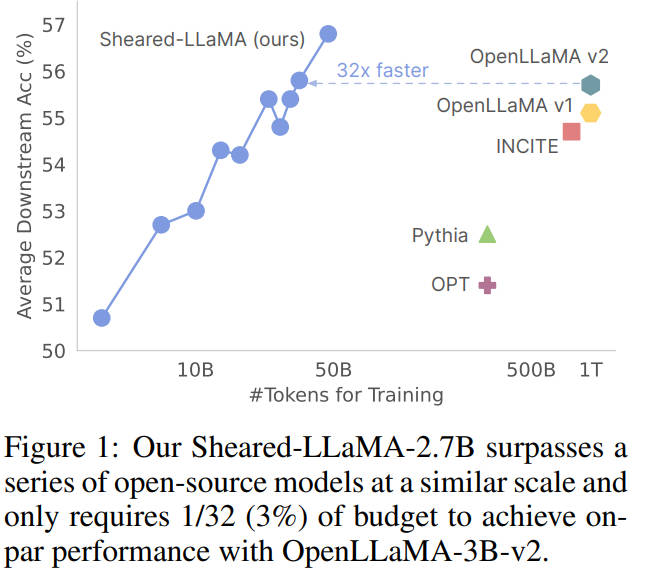

# Sheared LLaMA: Accelerating Language Model Pre-training via Structured Pruning

> **一句话总结**：通过定向结构化剪枝（targeted structured pruning）和动态批次加载（dynamic batch loading），从 LLaMA2-7B 模型高效剪枝出 1.3B 和 2.7B 参数的小模型，仅用 3% 的计算量即可超越同等规模的开源模型。

---

## 摘要翻译

LLaMA 等中等规模大语言模型的流行突显了构建更小但更强大模型的潜力。然而，从零开始在数万亿 token 上训练此类模型的成本依然很高。本工作研究结构化剪枝作为一种从预训练大模型开发小模型的有效方法。我们的方法采用两项关键技术：（1）**定向结构化剪枝**，通过以端到端的方式移除层、注意力头、中间维度和隐藏维度，将大模型剪枝到指定的目标形状；（2）**动态批次加载**，根据不同领域损失的变化动态调整每个训练批次中采样数据的组合。我们通过 Sheared-LLaMA 系列展示了该方法的有效性，将 LLaMA2-7B 模型剪枝至 1.3B 和 2.7B 参数。Sheared-LLaMA 模型在多种下游任务和指令微调评估中超越了同等规模的最先进开源模型（如 Pythia、INCITE、OpenLLaMA 和 TinyLlama），而仅需要从零训练的 3% 计算量。这项工作提供了令人信服的证据，证明利用现有 LLM 进行结构化剪枝是构建有竞争力的小型 LLM 的更具成本效益的方法。

---

## 研究动机

1. **训练成本高昂**：即使是最小的十亿参数模型，从零开始训练也需要大量计算资源，对大多数组织而言成本过高。
2. **现有剪枝方法的局限**：
   - **结构次优**：现有结构化剪枝方法（如 CoFiPruning）产生的模型结构不规范（如不同层的注意力头数不一致），导致推理效率低下。
   - **域能力保留不均**：剪枝后的模型在不同任务上保留的知识水平不同，直接使用原始预训练数据分布进行训练效率低下（例如 GitHub 等低熵小域的知识保留较好，而 C4 等高熵大域表现较差）。
3. **核心问题**：能否利用现有的预训练 LLM，通过更少的计算量生成一个更小、通用且具有竞争力的 LLM？

---

## 方法（技术细节）

### 2.1 定向结构化剪枝（Targeted Structured Pruning）

**核心思想**：在源模型中搜索与预定义目标架构匹配的子网络，同时最大化性能。

**技术细节**：
- **目标架构选择**：利用已有预训练模型的配置作为目标架构（如 INCITE-Base-3B 作为 2.7B 模型的目标架构），这些配置已经过优化以平衡模型表达力和推理效率。
- **多粒度剪枝掩码**：在不同粒度上学习剪枝掩码：
  - **全局粒度**：层（zlayer ∈ R^LS）和隐藏维度（zhidden ∈ RdS）
  - **局部粒度**：注意力头（zhead ∈ R^HS×LS）和中间维度（zint ∈ R^mS×LS）
- **参数化方法**：使用硬混凝土分布（hard concrete distribution）参数化剪枝掩码，这些分布在 [0,1] 上有支撑但概率质量集中在 0 或 1，实现离散的剪枝/保留决策。
- **约束优化**：将剪枝形式化为约束优化问题，使用 Lagrange 乘子对目标形状施加约束。目标函数为 min--max 问题：min_θ,z max_λ,ϕ L_prune(θ, z, λ, ϕ) = L(θ, z) + 约束项（对层、头、中间维度、隐藏维度的约束）。
- **最终架构**：在剪枝后，保留每个子结构中得分最高的组件，固定为最终架构。

### 2.2 动态批次加载（Dynamic Batch Loading）

**核心思想**：动态调整训练批次中各领域数据的比例，使模型在不同领域以大致相同的速度达到参考损失。

**技术细节**：
- **问题设置**：预训练数据包含 k 个领域（D1, D2, ..., Dk），每个领域有独立的验证集。为每个领域设置参考损失 ℓref(Di)。
- **更新规则**：每 m 步评估模型在各领域的验证损失 ℓt，并基于损失差 Δt(Di) = max{ℓt[i] - ℓref[i], 0} 更新数据加载权重。
- **指数上升公式**：αt = w_{t-m} · exp(Δt)；wt = αt / Σi αt[i]
- **应用阶段**：在剪枝阶段和持续预训练阶段都使用动态批次加载。
- **参考损失选择**：
  - **缩放参考**（默认）：使用拟合缩放函数预测的损失作为参考（基于 LLaMA2 系列模型的 scaling law）。
  - **源模型参考**：直接使用源模型的领域验证损失作为参考。
- **核心优势**：无需训练辅助模型，仅依赖验证集上的参考损失进行在线调整，开销极小。

---

## 实验结果

### 模型配置
- **源模型**：LLaMA2-7B（6.7B 参数）
- **目标模型**：Sheared-LLaMA-1.3B（使用 Pythia-1.4B 架构）、Sheared-LLaMA-2.7B（使用 INCITE-Base-3B 架构）
- **训练数据**：RedPajama（LLaMA1 的复现数据集），包含 7 个领域：CommonCrawl、C4、GitHub、Wikipedia、Books、ArXiv、StackExchange
- **训练预算**：剪枝阶段 0.4B tokens + 持续预训练 50B tokens = 总共约 50B tokens

### 主要结果

| 模型 | 训练 tokens | 平均下游准确率 |
|------|------------|--------------|
| OPT-1.3B | 300B | 48.2% |
| Pythia-1.4B | 300B | 48.9% |
| TinyLlama-1.1B | 3T | 50.0% |
| **Sheared-LLaMA-1.3B** | **50B** | **51.0%** |
| OPT-2.7B | 300B | 51.4% |
| Pythia-2.8B | 300B | 52.5% |
| INCITE-Base-3B | 800B | 54.7% |
| OpenLLaMA-3B-v1 | 1T | 55.1% |
| OpenLLaMA-3B-v2 | 1T | 55.7% |
| **Sheared-LLaMA-2.7B** | **50B** | **56.7%** |

### 关键发现

1. **Sheared-LLaMA-1.3B** 仅用 50B tokens（3% 的 OpenLLaMA 预算）超越了 OPT-1.3B、Pythia-1.4B 和 TinyLlama-1.1B（训练了 3T tokens！）。
2. **Sheared-LLaMA-2.7B** 超越了 INCITE-Base-3B（800B tokens）、OpenLLaMA-3B-v1（1T tokens）和 OpenLLaMA-3B-v2（1T tokens），且仅用了 1/32 的计算量。
3. **指令微调**：Sheared-LLaMA 在指令微调后也优于同等规模的基线模型，生成的回复更长、连贯且信息丰富。
4. **动态批次加载的效果**：
   - 使用原始数据比例训练时，不同领域的损失差异大（GitHub 低于参考损失，C4 显著高于参考损失）。
   - 使用动态批次加载后，各领域损失更均衡，下游性能更好。
   - 动态加载自动增加 C4 和 Books 的数据比例（C4 从 15% 增至 49.2%），表明这些领域对剪枝模型而言更难恢复。
5. **与其他剪枝方法的比较**：
   - 相比 CoFiPruning：虽然剪枝后困惑度略高，但推理速度更快（因为产生的模型结构更均匀、更高效）。需要额外约 0.5B tokens 的持续预训练即可匹配 CoFiPruning 的困惑度。
   - 相比 LLM-Pruner：在相同计算预算和稀疏度下，Sheared-LLaMA 的困惑度更低，架构更优，推理速度更快。
6. **预算分配**：在固定 5B tokens 总预算下，增加剪枝预算可改善困惑度，但考虑到剪枝阶段更昂贵（约 5× 慢于标准训练），作者分配 0.4B tokens 给剪枝。

---

## 优势

1. **极高的计算效率**：仅用 3% 的计算量（50B vs 1.5T-3T tokens）即可达到或超越同等规模的从零训练模型。
2. **目标架构灵活**：可以将大模型剪枝为任意预定义的目标架构，利用已有模型的架构设计。
3. **端到端剪枝**：对层、注意力头、中间维度和隐藏维度进行联合优化，产生规范、均匀的模型结构。
4. **动态批次加载**：无需训练辅助模型，在线调整数据比例，开销极小，显著提升训练效率。
5. **推理效率**：产生的模型结构均匀，推理速度优于非均匀剪枝方法（如 CoFiPruning）。
6. **可扩展性**：方法具有高度通用性，可扩展到更大规模的模型。
7. **实际应用价值**：为从已有大模型高效获取小模型提供了一条实用路径。

---

## 局限

1. **依赖开源数据和模型**：方法严重依赖开源预训练数据集和模型的可用性。如果某个特定领域不在预训练数据中，该方法可能无法有效恢复该领域的性能。
2. **源模型规模限制**：由于计算约束，实验仅在 7B 参数的源模型上进行，更大规模模型的验证有待未来研究。
3. **剪枝阶段计算成本**：剪枝阶段比标准语言模型训练慢约 5 倍，虽然分配了有限的预算，但仍有一定计算开销。
4. **目标架构限制**：目标架构需来自已有模型配置，可能无法探索全新的架构设计。
5. **头维度继承**：剪枝算法需要继承源模型的头维度，限制了架构灵活性。

---

## 与 EfficientPaper 相关的研究方向

1. **结构化剪枝（Structured Pruning）**：作为模型压缩的核心方法，与 EfficientPaper 的 sparse_pruning 和 structured_sparsity 关键词直接相关。
2. **高效预训练（Efficient Pre-training）**：展示了通过剪枝+持续预训练替代从零训练的高效范式。
3. **动态数据混合（Dynamic Data Mixing）**：动态批次加载算法与数据混合优化相关，可推广到其他预训练场景。
4. **Scaling Laws 应用**：利用 scaling law 预测参考损失，为动态批次加载提供理论基础。
5. **知识蒸馏（Knowledge Distillation）的替代方案**：在 LLM 场景中，剪枝比蒸馏更具成本效益（无需持续运行教师模型）。
6. **模型架构搜索（Architecture Search）**：定向剪枝本质上是一种架构搜索方法，与 NAS 相关。
7. **小模型训练（Small Model Training）**：为从大模型高效生成小模型提供了实用方法，与 TinyLlama 等工作互补。
8. **指令微调（Instruction Tuning）**：展示了剪枝模型在指令微调中的良好表现，可作为指令调优的高效起点。

---

> ⚠️ **生成声明**：本 note 由 AI Agent 自动生成，基于论文全文内容的中文摘要和分析。生成时间为 2026 年 6 月 5 日。
