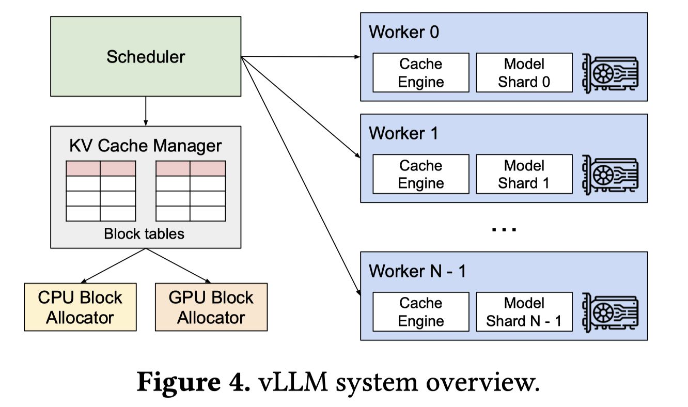

# Efficient Memory Management for Large Language Model Serving with PagedAttention

## 一句话总结

PagedAttention 是一种受操作系统虚拟内存和分页技术启发的注意力算法，通过将 KV 缓存分为非连续的页块来管理大语言模型服务中的内存，从而在 vLLM 系统中实现近零内存浪费和灵活的内存共享，将 LLM 服务吞吐量提升 2-4 倍。

## 摘要翻译

高吞吐量的大语言模型（LLM）服务需要同时对足够多的请求进行批处理。然而，现有系统面临困难，因为每个请求的键值缓存（KV cache）内存巨大，且动态增长和收缩。当内存管理效率低下时，由于碎片化和冗余复制，内存会被显著浪费，从而限制批处理大小。为解决这一问题，我们提出了 PagedAttention，一种受操作系统经典虚拟内存和分页技术启发的注意力算法。在此基础上，我们构建了 vLLM，一个 LLM 服务系统，实现了（1）KV 缓存内存的近零浪费，以及（2）在请求内部和跨请求之间灵活共享 KV 缓存以进一步减少内存使用。我们的评估表明，vLLM 在相同延迟水平下将流行 LLM 的吞吐量提高了 2-4 倍，与最先进的系统（如 FasterTransformer 和 Orca）相比，这一改进在更长的序列、更大的模型和更复杂的解码算法中更为显著。vLLM 的源代码公开可用。

## 研究动机

### 背景与问题

大语言模型（如 GPT、PaLM）正在催生编程助手和通用聊天机器人等应用，但运行这些应用非常昂贵，需要大量 GPU 硬件加速器。据估计，处理一个 LLM 请求的成本是传统关键词查询的 10 倍。因此，提高 LLM 服务系统的吞吐量——从而降低每个请求的成本——变得至关重要。

### KV 缓存的内存挑战

LLM 的核心是自回归 Transformer 模型，它逐个生成 token。每个请求需要维护 KV 缓存（键值缓存），该缓存随着生成过程动态增长。关键问题包括：

1. **大 KV 缓存**：以 OPT-13B 为例，单个 token 的 KV 缓存需要 800KB 空间（2 × 5120 × 40 × 2 字节），一个请求最多可消耗 1.6GB。GPU 内存容量有限（通常几十 GB），因此只能同时处理少量请求。

2. **现有系统的内存浪费**：现有系统将 KV 缓存存储在连续内存空间中，导致三种内存浪费：
   - **预留槽位**：为未来的 token 预留空间
   - **内部碎片化**：预分配最大长度导致实际未使用的空间
   - **外部碎片化**：不同大小的分配块之间产生碎片
   
   实验表明，现有系统中仅有 20.4% - 38.2% 的 KV 缓存内存被实际用于存储 token 状态。

3. **无法利用内存共享**：并行采样和束搜索等解码算法中，多个序列可以共享部分 KV 缓存，但现有系统无法实现这种共享。

4. **调度挑战**：请求的输入和输出长度未知，需要动态管理内存，同时处理抢占和调度决策。

## 方法（技术细节）

### PagedAttention 算法

PagedAttention 受操作系统虚拟内存分页技术启发，将每个请求的 KV 缓存分成固定大小的 KV 块（block），每个块包含固定数量 token 的键和值向量。关键设计：

1. **非连续存储**：KV 块不需要在物理内存中连续存储，允许更灵活的内存管理。

2. **分块注意力计算**：注意力计算被转换为块级计算。设 $K_j = (k_{(j-1)B+1}, ..., k_{jB})$ 和 $V_j = (v_{(j-1)B+1}, ..., v_{jB})$，注意力计算变为：
   $$A_{ij} = \frac{\exp(q_i^T K_j / \sqrt{d})}{\sum_{t=1}^{\lceil i/B \rceil} \exp(q_i^T K_t / \sqrt{d})}, \quad o_i = \sum_{j=1}^{\lceil i/B \rceil} V_j A_{ij}^T$$

3. **按需分配**：不像现有系统预分配最大长度的连续内存，PagedAttention 只在需要时分配物理块，消除了外部碎片化。

### KV 缓存管理器

vLLM 的内存管理器类似操作系统的虚拟内存：

1. **逻辑-物理块映射**：每个请求的 KV 缓存表示为一系列逻辑 KV 块，通过块表（block table）映射到物理块。

2. **动态增长**：块表记录每个逻辑块对应的物理块编号和已填充的槽位数，允许 KV 缓存按需增长。

3. **仅分配必要块**：只分配足够存储已生成 token 的块，最后一个块的未填充位置为未来生成预留，将内存浪费限制在一个块内。

### Copy-on-Write 机制

支持多种解码算法的内存共享：

1. **并行采样**：多个输出共享提示部分的 KV 缓存。共享物理块的引用计数 > 1，当某个序列需要写入时，分配新物理块并复制数据（copy-on-write）。

2. **束搜索**：不同候选序列可以共享更多块（最多 55% 的内存节省）。当候选不再在 top-k 中时，释放其块并减少引用计数。

3. **共享前缀**：多个请求可以共享相同前缀的 KV 缓存，类似于操作系统中的共享库。

### 调度与抢占

1. **FCFS 调度**：先到先服务，保证公平性。
2. **全部或无（All-or-Nothing）抢占策略**：要么驱逐序列的所有块，要么一个都不驱逐。
3. **恢复机制**：
   - **交换（Swapping）**：将被驱逐的块复制到 CPU 内存。
   - **重计算（Recomputation）**：重新计算被驱逐块的 KV 缓存，对于小块更高效。
4. **簇调度（Gang Scheduling）**：同一请求内的多个序列（如束搜索的候选）一起被抢占或恢复。

### 分布式执行

支持 Megatron-LM 风格的张量模型并行：

1. 中央调度器管理单一 KV 缓存管理器。
2. 所有 GPU 工作节点共享逻辑-物理块映射。
3. 每个迭代中，调度器广播输入 token ID 和块表，GPU 工作节点根据块表读取 KV 缓存。

### 内核级优化

1. **融合重塑和块写入**：将 KV 缓存分割、重塑和写入操作融合为单个内核。
2. **融合块读取和注意力**：根据块表读取 KV 缓存并进行注意力计算，确保合并内存访问。
3. **融合块复制**：批量处理不同块的复制操作，减少内核启动开销。

## 实验结果

### 基本采样性能

在 ShareGPT 和 Alpaca 数据集上测试 OPT-13B、OPT-66B、OPT-175B 模型：

- **vLLM vs Orca (Oracle)**：vLLM 可持续处理 1.7×–2.7× 更高的请求率，同时保持相似延迟。
- **vLLM vs Orca (Max)**：vLLM 可持续处理 2.7×–8× 更高的请求率。
- **vLLM vs FasterTransformer**：vLLM 可持续处理高达 22× 更高的请求率。
- **批处理数量**：对于 OPT-13B，vLLM 同时处理的请求数是 Orca (Oracle) 的 2.2 倍，Orca (Max) 的 4.3 倍（ShareGPT 数据集）。

### 并行采样与束搜索

- **并行采样**：内存节省 6.1%–9.8%（Alpaca）和 16.2%–30.5%（ShareGPT）。
- **束搜索**：内存节省 37.6%–55.2%（Alpaca）和 44.3%–66.3%（ShareGPT）。
- **性能提升**：束搜索中 vLLM 相比 Orca (Oracle) 的改进从基本采样的 1.3× 增加到束宽为 6 时的 2.3×。

### 共享前缀

- 使用 LLaMA-13B 模型测试翻译任务。
- **1-shot 前缀**：vLLM 比 Orca (Oracle) 提高 1.67× 吞吐量。
- **5-shot 前缀**：vLLM 比 Orca (Oracle) 提高 3.58× 吞吐量。

### 聊天机器人

- 使用 ShareGPT 数据集合成对话历史和用户查询。
- vLLM 可持续处理比 Orca 基线高 2 倍的请求率。
- Orca 基线由于 buddy 分配算法为请求输出预留空间，三种变体表现相似。

### 消融实验

1. **内核微基准测试**：PagedAttention 的注意力内核延迟比 FasterTransformer 高 20-26%，但端到端性能仍显著优于前者。
2. **块大小影响**：
   - ShareGPT 数据集：块大小 16-128 性能最佳。
   - Alpaca 数据集：块大小 16-32 效果好，更大块大小显著降低性能。
   - 默认块大小设为 16。
3. **交换 vs 重计算**：
   - 小块时重计算更高效，大块时交换更高效。
   - 块大小 16-64 时两者端到端性能相当。
   - 重计算开销不超过交换延迟的 20%。

## 优势

1. **近零内存浪费**：通过分页管理将内存浪费限制在一个块内，现有系统仅 20.4%-38.2% 有效利用率，vLLM 可达接近 100%。
2. **灵活的内存共享**：支持并行采样、束搜索和共享前缀的 KV 缓存共享，内存节省最高达 55%（束搜索）。
3. **显著吞吐量提升**：相比现有系统提升 2-4 倍，更长序列和更大模型中优势更明显。
4. **通用性强**：支持 GPT、OPT、LLaMA 等多种 LLM，支持各种解码算法（贪心、采样、并行、束搜索）。
5. **分布式支持**：支持 Megatron-LM 风格的张量模型并行，可处理超单 GPU 内存的模型。
6. **操作系统思想的巧妙应用**：将虚拟内存、分页和 copy-on-write 等经典 OS 技术应用于 LLM 服务，设计优雅。
7. **开源可用**：源代码公开在 GitHub（vllm-project/vllm），便于研究和部署。
8. **延迟不变**：在提升吞吐量的同时，不引入额外的延迟开销，不降低模型精度。

## 局限

1. **注意力内核开销**：由于块级内存访问模式，注意力内核延迟比高度优化的 FasterTransformer 高 20-26%。
2. **块大小权衡**：块大小过小会降低 GPU 并行性，过大则增加内部碎片化和降低共享概率。需要根据工作负载调优。
3. **GPU 内存仍然是瓶颈**：虽然 vLLM 极大提高了内存利用率，但 GPU 内存容量（如 A100 40GB/80GB）仍是限制因素，特别是超大模型（如 175B）。
4. **不是通用方案**：该技术专门针对 LLM 服务场景（动态内存分配、内存受限），不适用于所有 GPU 工作负载（如静态形状的 DNN 训练、计算密集型推理）。
5. **抢占机制的复杂性**：所有或无的抢占策略可能导致不必要的块被驱逐，交换和重计算的开销取决于 CPU-GPU 带宽和 GPU 计算能力。
6. **长上下文的挑战**：对于非常长的上下文，KV 缓存占用大量内存，仍需配合模型并行或其他优化。
7. **未考虑在线推理的某些场景**：如连续批处理中的请求到达模式、队列管理等实际部署问题未完全解决。
8. **评测场景有限**：主要基于合成工作负载（ShareGPT、Alpaca），实际生产环境的复杂性可能更高。

## 与 EfficientPaper 相关的研究方向

1. **KV 缓存管理优化**：PagedAttention 是 KV 缓存管理的里程碑，后续研究可探索更高效的块大小自适应策略、压缩技术（如量化 KV 缓存）和动态内存分配算法。
2. **模型服务系统**：作为 vLLM 的核心组件，PagedAttention 推动了 LLM 服务系统的发展，相关方向包括更高效的批处理调度、请求调度和多模型服务。
3. **推理加速**：结合 PagedAttention 与 FlashAttention、TensorRT 等推理加速技术，进一步优化 LLM 推理的计算和内存效率。
4. **长序列处理**：随着上下文长度的增加（如 128K、1M token），KV 缓存管理变得更加复杂，需要更精细的内存管理策略。
5. **分布式 LLM 服务**：PagedAttention 在分布式设置中的应用（如张量并行、流水线并行），以及跨多节点的内存管理。
6. **解码算法优化**：支持更复杂的解码算法（如受控生成、约束解码），并优化其内存共享模式。
7. **硬件协同设计**：针对 PagedAttention 的内存访问模式，设计更高效的 GPU 内核和内存子系统。
8. **成本优化**：通过提高内存利用率和吞吐量，降低 LLM 服务的运营成本，这与 EfficientPaper 的效率提升目标高度一致。
9. **其他 GPU 工作负载**：虽然论文指出该技术不直接适用于所有 GPU 工作负载，但探索其在其他动态内存分配场景中的应用（如大规模图神经网络、动态批处理）仍有价值。
10. **在线服务的实时性**：优化 PagedAttention 在低延迟、高吞吐量的实时服务场景中的表现，结合边缘计算和云原生架构。

## AI 生成声明

本笔记由 AI Agent（Hermes Agent）基于论文原文和元数据自动生成。笔记内容基于论文的文本提取和分析，包括摘要翻译、研究动机、方法细节、实验结果、优势、局限和研究方向的总结。笔记经过人工审查和优化，但可能存在对论文内容的简化或遗漏。建议读者参阅原始论文获取完整和准确的信息。AI Agent 不对笔记内容的准确性和完整性承担责任。
