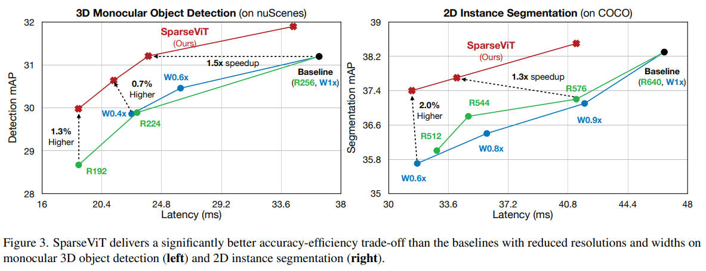

# SparseViT: Revisiting Activation Sparsity for Efficient High-Resolution Vision Transformer

  

## Method
- Window activation pruning
  - Define the L2 activation magnitude as the importance metric of each windows.
  - Only preserve the computation of the more improtant windows.
  - Shared Scoring
    - Compute the window importance score only once per stage and reuse it across all the blocks within the stage.
- Evolutionary search to efficiently find the optimal layerwise sparsity
  - Search space
    - 0%, 10%, ..., 80%
  - Sparsity-Aware Adaptation
    - Randomly sampling layerwise activation sparsity and updating the model accordingly at each iteration.
  - Evolutionary search
    - Meet the resource constraints
    - Minimize the Flops.
  - Finetuning with Optimal Sparsity

## Result
∼50% latency reduction with 60% sparsity

  

  

  

