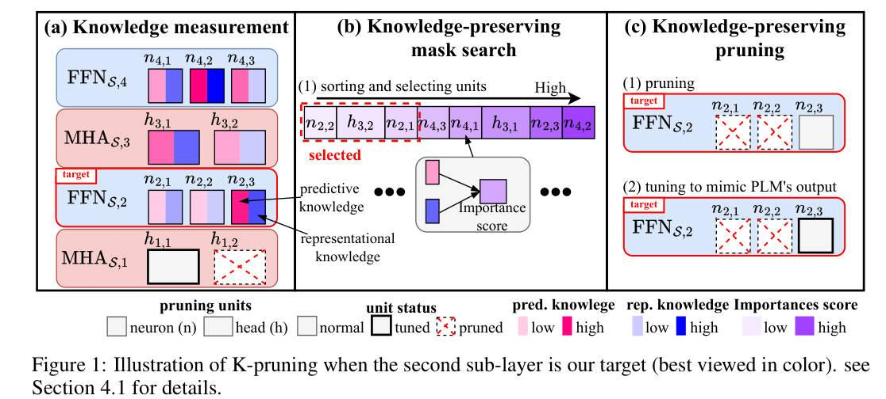

# Knowledge-preserving Pruning for Pre-trained Language Models without Retraining

> This is a retraining-free structured pruning approach.

## 一句话总结

K-Prune 提出了一种无需重训练的结构化剪枝算法，通过知识测量、知识保持掩码搜索和知识保持权重调优三个步骤，在保留预训练语言模型知识的同时实现高效压缩，在 SQuAD 基准上达到比现有方法高 58.02%p 的 F1 分数提升。

## 摘要翻译

给定一个预训练的编码器语言模型，如何在不重新训练的情况下准确地压缩它？无重训练的结构化剪枝算法在预训练语言模型压缩中至关重要，因为它们具有显著降低的剪枝成本和能够剪枝大型语言模型的能力。然而，现有的无重训练算法在高压缩率下会遇到严重的精度下降问题，因为它们无法处理剪枝误差。本文提出了 K-Prune（知识保持剪枝），一种用于预训练编码器语言模型的准确无重训练结构化剪枝算法。K-Prune 专注于保留预训练模型的有用知识，通过精心设计的迭代剪枝过程来最小化剪枝误差，该过程由知识测量、知识保持掩码搜索和知识保持权重调优组成。结果表明，在 SQuAD 基准上，在 80% 的高压缩率下，K-Prune 相比现有无重训练剪枝算法显示出高达 58.02%p 的 F1 分数提升，且无需任何重训练过程。

## 研究动机

### 背景与问题

- **预训练语言模型的规模问题**：Transformer 架构的预训练语言模型（如 BERT、DistilBERT）在自然语言处理领域表现出色，但其庞大的模型规模带来了部署成本和推理延迟的挑战。
- **重训练的高成本**：现有的结构化剪枝方法主要分为重训练类和无重训练类。重训练类方法（如 DynaBERT、EBERT）需要完整的训练数据和大量的计算资源，在大规模语言模型上不可行。
- **无重训练方法的精度下降**：无重训练方法（如 Kwon et al.、KCM）虽然成本低，但在高压缩率下会出现严重的精度下降问题，主要原因是无法处理累积的剪枝误差（即被剪枝中间层输出的变形导致的模型预测失真）。
- **关键洞察**：作者将剪枝误差概念化为有用知识的损失，观察到先前无重训练剪枝算法中严重精度下降的主要原因是来自多层的不可恢复的知识损失。

## 方法（技术细节）

K-Prune 由三个核心组件组成，通过自底向上的子层迭代剪枝过程实现：

### 1. 知识测量（Knowledge Measurement）

K-Prune 使用两种知识指标来评估每个注意力头和神经元的重要性：

- **预测知识（Predictive Knowledge）**：定义为压缩模型与预训练模型之间 logits 的 KL 散度，表示模型标签预测的知识损失：

$$K_{pred}(x; m, \gamma) = \gamma^2 D_{KL}(s_\gamma(\hat{z}_T(x; 1_{|m|})) \| s_\gamma(\hat{z}_S(x; m)))$$

  其中 $\gamma$ 为温度参数，$s_\gamma$ 为带温度的 softmax 函数，$\hat{z}_T$ 和 $\hat{z}_S$ 分别为预训练模型和压缩模型的 logits。

- **表征知识（Representational Knowledge）**：定义为预训练模型和压缩模型子层输出的 Frobenius 范数（MSE 损失）：

$$K_{rep,l}(X_{T,l}, X_{S,l}; m_l) = \|X_{T,l} + Sub_{T,l}(X_{T,l}; 1_{|m_l|}) - X_{S,l} - Sub_{S,l}(X_{S,l}; m_l)\|_F^2$$

  其中 $Sub_l$ 为子层函数（MHA 或 FFN），$m_l$ 为子层掩码变量。

- **重要性评分**：结合预测知识和表征知识，通过 Taylor 展开和 Fisher 信息进行近似计算。对于 MHA 子层，每个注意力头的重要性得分定义为：

$$Z_{head} = \mu (K_{head}^{pred} + \lambda K_{head}^{rep}) / F_h$$

  对于 FFN 子层的神经元：

$$Z_{neuron} = (K_{neuron}^{pred} + \lambda K_{neuron}^{rep}) / F_n$$

  其中 $\lambda$ 为平衡系数（$\{0.00025, 1\}$），$\mu = 64$ 为注意力头与神经元之间的平衡系数，$F_h$ 和 $F_n$ 分别为注意力头和神经元的 FLOPs。$\lambda$ 的引入使得 MLP 和 MHA 之间的重要性得分可以进行跨层比较。

### 2. 知识保持掩码搜索（KPMS）

KPMS 是一个自适应掩码搜索算法，旨在为每个子层找到精确的非均匀剪枝掩码：

- **全局重要性评估**：不仅在目标子层，还在目标子层以上的所有子层中评估重要性，以考虑全局重要性。
- **剪枝阈值搜索**：将注意力头和神经元的重要性得分拼接后按升序排序，逐步选择重要性最低的组件进行剪枝，直到满足 FLOPs 预算约束。
- **算法流程（Algorithm 1）**：
  1. 计算所有注意力头和神经元的预测知识和表征知识
  2. 评估重要性得分（方程 9）
  3. 拼接并排序
  4. 迭代选择阈值，直到满足 FLOPs 约束
  5. 确定被剪枝的注意力头和神经元集合

### 3. 知识保持权重调优（KPWT）

KPWT 是一个高效的权重调优过程，在每次剪枝迭代后重建被扭曲的知识：

- **问题形式化**：将知识重建问题形式化为最小化子层表征知识损失的线性最小二乘问题。
- **权重更新**：
  - 对于 MHA 子层，求解关于输出投影 $\{W_{l,i}^{out}\}_{i=1}^H$ 的线性最小二乘问题：
  
$$\arg\min_{\{W_{l,i}^{out}\}_{i=1}^H} \|X_{T,l} + M_{T,l}(X_{T,l}; 1_H) - X_{S,l} - \sum_{i=1}^H \zeta_{l,i}^* W_{l,i}^{out} f_{l,i}(X_{S,l}) - B_{l}^{out}\|_F^2$$

  - 对于 FFN 子层，类似地求解关于 $\{v_{l,i}^{out}\}_{i=1}^N$ 的问题。
- **效率**：使用 PyTorch 的线性求解器（torch.linalg.lstsq），在典型桌面电脑上单次调用时间不到一秒，远小于传统的重训练过程。
- **预计算优化**：在 K-Prune 的第一次迭代中收集预训练模型的子层输出，并在每次迭代中重复使用。

### 迭代剪枝流程

K-Prune 从底层到顶层进行子层级别的迭代剪枝：
1. 在每个子层中，通过知识测量评估重要性
2. 通过 KPMS 选择要剪枝的组件
3. 通过 KPWT 重建知识
4. 减少 FLOPs 约束，移动到下一个子层

关键优势：与传统的一次性剪枝不同，K-Prune 通过迭代剪枝将知识损失分散到多次迭代中，从而有效解决精度下降问题。

## 实验结果

### 实验设置
- **模型**：BERT、DistilBERT
- **数据集**：GLUE（MRPC、STS-B、MNLI、QNLI 等）、SQuAD v1.1、SQuAD v2
- **压缩率**：75%、80% 等
- **硬件**：NVIDIA 1080 Ti
- **超参数**：100K tokens 作为样本数据集，5 次随机种子平均结果

### 准确性（Q1）
- 在所有设置中，K-Prune 显著优于所有竞争者，最大优势达 **58.02%p** 的 F1 分数提升。
- 在高压缩率（80%）下，精度差距更大，因为其他方法的一次性剪枝无法应对剪枝误差。
- KCM 表现最差，因为它无法剪枝注意力头。

### 推理速度（Q2）
- K-Prune 在所有任务上一致显示最高加速比，最高达 **2.93×** 的推理速度提升。
- 对比：KCM 最高 1.23×，Kwon et al. 最高 2.10×，K-prune 平均 2.65×。

### 与重训练方法的比较（Q3）
- 在 75% 压缩率下，K-Prune 在 MNLI 和 QNLI 上与 DynaBERT-w、DynaBERT-d、EBERT 等重训练方法精度相当或更高。
- K-Prune 的剪枝成本比重训练方法低最多 **422×**。
- K-Prune 展示了最佳的精度-成本权衡。

### 消融实验（Q4）
- 在 80% 压缩率下对 MRPC 和 SQuAD1.1 进行消融研究：
  - 去除知识度量（-Kpred, Krep）：MRPC 84.07，SQuAD 72.55
  - 去除 KPMS（-KPMS）：MRPC 81.71，SQuAD 67.10
  - 去除 KPWT（-KPWT）：MRPC 68.38，SQuAD 16.50
- **KPWT 贡献最大**，是 K-Prune 性能提升的核心组件。
- 所有技术都对性能提升有贡献。

## 优势

1. **无需重训练**：K-Prune 完全不需要重训练过程，只需少量样本数据集（约 0.64% 的 MNLI 数据集），剪枝成本极低。
2. **高精度**：在 80% 压缩率下，相比现有无重训练方法 F1 分数提升高达 58.02%p。
3. **快速推理**：在商用硬件上实现最高 2.93× 的推理速度提升。
4. **最佳精度-成本权衡**：相比重训练方法，剪枝成本低最多 422×，同时保持或提高精度。
5. **可扩展的迭代框架**：通过迭代剪枝和知识重建，有效处理高压缩率下的剪枝误差。
6. **高效权重调优**：KPWT 使用线性最小二乘求解器，单次调用不到一秒，无需超参数调优。
7. **全局重要性评估**：KPMS 在目标子层和上方子层中评估重要性，实现更准确的剪枝决策。

## 局限

1. **仅适用于编码器模型**：K-Prune 目前仅适用于编码器架构的预训练语言模型（如 BERT、DistilBERT），尚未扩展到解码器模型（如 GPT 系列）。
2. **依赖样本数据集**：需要使用小样本数据集（约 100K tokens）来计算知识度量，样本的质量和代表性可能影响结果。
3. **结构化剪枝的局限**：与非结构化剪枝相比，结构化剪枝的压缩率上限可能受限，且无法实现完全稀疏化。
4. **超参数敏感性**：虽然只使用两组超参数（γ, λ, µ），但 λ 和 µ 的取值对性能有影响，特别是 λ 对 MLP 和 MHA 的影响。
5. **仅支持 Transformer 架构**：方法基于 Transformer 的 MHA 和 FFN 子层结构，对其他架构的适用性未验证。
6. **迭代剪枝的计算开销**：虽然是无重训练方法，但迭代过程仍需多次计算知识度量和权重调优，计算量比一次性剪枝高。

## 与 EfficientPaper 相关的研究方向

- **模型压缩与剪枝**：K-Prune 属于模型压缩领域，特别是结构化剪枝。可与量化（Quantization）、低秩近似（Low-rank Approximation）、知识蒸馏（Knowledge Distillation）等方法结合，实现更高的压缩率。
- **无重训练剪枝**：K-Prune 推动了无重训练剪枝的研究，特别是针对高压缩率场景。后续研究可探索：
  - 扩展到解码器模型（如 GPT、LLaMA）
  - 与其他无重训练方法（如 SparseGPT、LLM-Pruner）的对比与融合
  - 更高效的权重调优策略
- **Transformer 压缩**：K-Prune 是 Transformer 压缩领域的重要贡献，与其他压缩方法（如量化、参数共享）互补，共同推动高效的预训练语言模型部署。
- **知识保持**：K-Prune 的核心思想是保留预训练模型的知识，这与知识蒸馏、模型迁移等研究方向密切相关。
- **高效推理**：K-Prune 在商用硬件上的加速效果显著，对于实际部署场景（如移动端、边缘计算）具有重要价值。

## AI 生成声明

本笔记由 AI Agent（Hermes Agent）根据论文原文自动生成，内容基于论文的 PDF 提取和元数据信息。笔记中的翻译和分析可能存在不准确之处，建议读者参考原文进行验证。所有引用的公式和数据均来自原文，不保证完全准确。本笔记仅供参考学习使用，不构成学术评价。

---

**论文信息**：
- **标题**：Knowledge-preserving Pruning for Pre-trained Language Models without Retraining
- **作者**：Seungcheol Park, Hojun Choi, U Kang
- **机构**：Seoul National University, KAIST
- **发表**：arXiv 2023
- **关键词**：sparse_pruning, structured_sparsity
- **代码**：https://github.com/snudm-starlab/K-prune
- **PDF**：https://arxiv.org/abs/2308.03449
