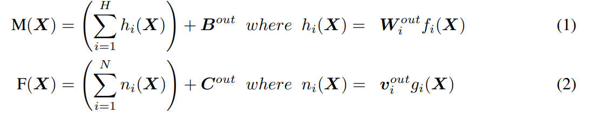
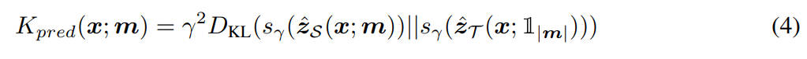
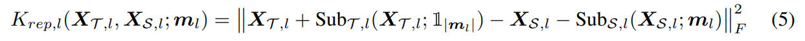
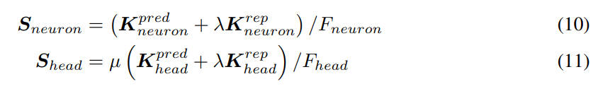
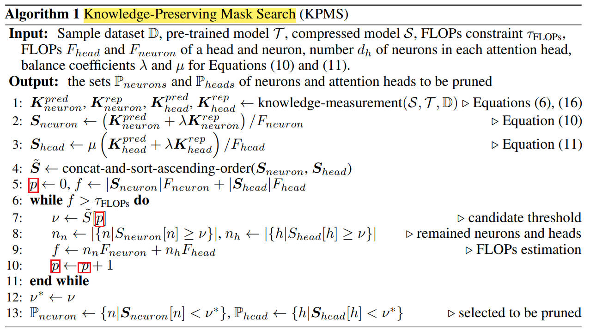
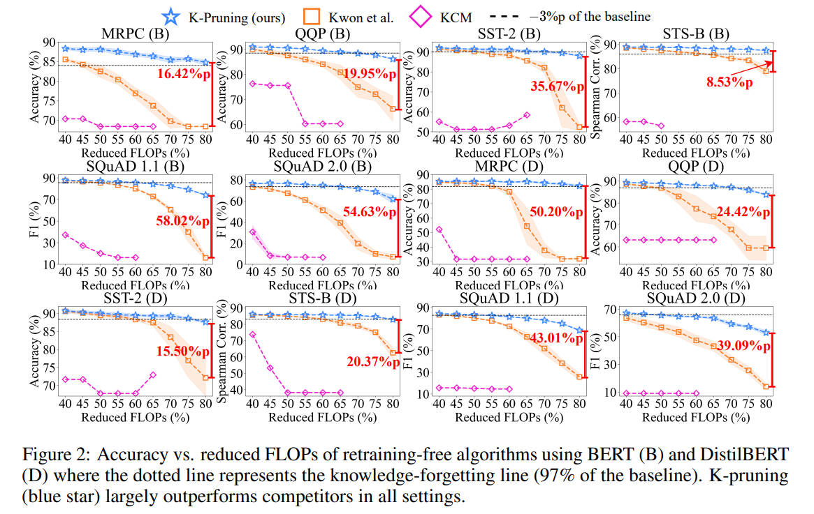
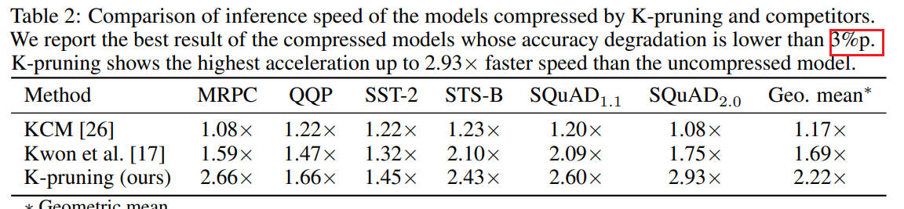

# Knowledge-preserving Pruning for Pre-trained Language Models without Retraining

> This is a retraning-free structured pruning approach.

  

## Method
- Key idea
  - **Selecting pruning targets**
    - Neurons and attention heads that minimally reduce the PLM’s knowledge
  - **Iterative pruning**
    - Use knowledge reconstruction for each sub-layer to handle the distorted inputs by pruning.
- K-pruning (Knowledge-preserving pruning)
  - knowledge measurement
  - knowledge-preserving mask search
  - knowledge-preserving pruning

Transformer Block consists of MHA and MLP.

  

The model-wise predictive knowledge loss is defined as the KL-divergence of logits between the pruned model and the dense model.

  

The sub-layerwise representational knowledge loss is defined as the F-norm (MSE loss) of the outputs.

  

The improtance scores are defined as:

  

where $\lambda = \\{0.00025, 1\\}$ and $\mu = 64$.

- 不同层之间的score是可以互相比较的吗？
  - 对于MLP， $\lambda$ 取值非常小，只看predictive loss，可以跨层比较
  - 但是对于MHA， $\lambda$ 取值比较大，predictive/representational 都看，两者兼顾
- MHA 与 MLP 也可以互相比较？
  - 通过配比 $\mu$ 来实现

总之，这些超参数的引入用来均衡，跨层与跨算子的比较。

  

## Results

  

  

