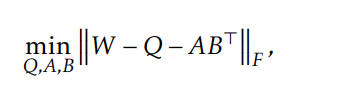

# LoftQ: LoRA-Fine-Tuning-Aware Quantization for Large Language Models

## Method

对QLoRA方法的改进，QLoRA在初始化时，

Q = Quantize(W)

A = 正态分布, B = 0

这种初始化方法非常差，导致模型在一开始就偏离最优解太多，最终导致训练变差，论文中使用LoftQ算法对Q, A, B进行优化，优化目标如下：

