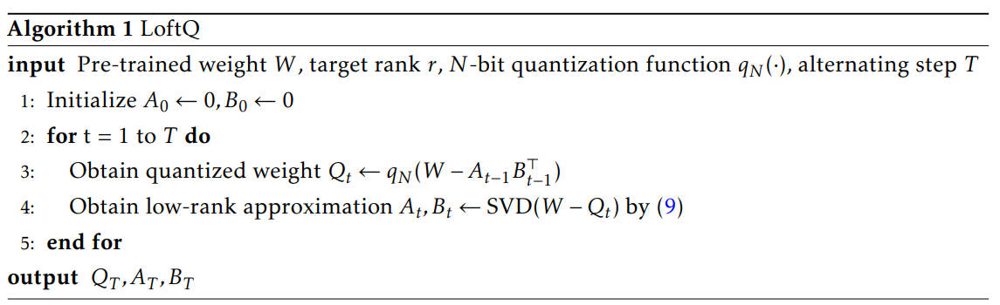

# LoftQ: LoRA-Fine-Tuning-Aware Quantization for Large Language Models



## 一句话总结

LoftQ 提出了一种联合量化与低秩近似的优化框架，通过交替量化和 SVD 分解为 LoRA 微调寻找最优初始化，显著改善了量化模型在下游任务中的表现，尤其在 2-bit 等极低比特场景下效果突出。

## 摘要翻译

量化是部署大语言模型（LLM）不可或缺的技术，近年来也被引入 LoRA 微调中。本文聚焦于量化与 LoRA 微调同时应用于预训练模型的场景。在这种情况下，全量微调与量化加 LoRA 微调之间通常存在性能差距。为此，我们提出 LoftQ（LoRA-Fine-Tuning-aware Quantization），一种新颖的量化框架，同时对 LLM 进行量化并寻找合适的 LoRA 微调低秩初始化。这种初始化减轻了量化模型与全精度模型之间的差异，显著提升了下游任务的泛化能力。我们在自然语言理解、问答、摘要和自然语言生成任务上评估了该方法。实验表明，该方法非常有效，优于现有量化方法，尤其是在具有挑战性的 2-bit 和 2/4-bit 混合精度场景中。

## 研究动机

- **量化 + LoRA 微调的性能差距**：QLoRA 将量化与 LoRA 结合使用，但在量化过程中忽略了后续 LoRA 微调的初始化问题。
- **低比特量化的困境**：QLoRA 在 3-bit 以下性能急剧下降，2-bit 时甚至无法收敛。原因在于量化引入的误差与 LoRA 初始化之间存在显著的不一致性（discrepancy）。
- **初始化偏差问题**：QLoRA 使用标准 LoRA 初始化（A ~ N(0, σ²), B = 0），在量化模型上起始权重 Q + AB⊤ 与原始预训练权重 W 存在较大偏差，导致训练效果不佳。
- **目标**：设计一种"量化感知"的 LoRA 初始化方案，使量化权重与低秩适配器联合逼近原始高精度权重。

## 方法（技术细节）

### 核心思想

LoftQ 的核心是联合优化量化权重 Q 和低秩适配器 A、B，以最小化与原始预训练权重 W 的差异：

```
min_{Q,A,B} ||W - Q - AB⊤||_F
```

### 交替优化算法（Algorithm 1）

算法交替进行两步操作：

**第一步：量化**
- 在第 t 步，将原始权重 W 减去上一步的低秩近似后进行量化：
- Q_t = q_N(W - A_{t-1}B_{t-1}^⊤)
- 这里 q_N(·) 可以是任意 N-bit 量化函数（支持 Uniform、NF4、NF2 等）

**第二步：SVD 低秩近似**
- 计算量化残差 R_t = W - Q_t
- 对 R_t 进行 SVD 分解：R_t = Σ σ_{t,i} u_{t,i} v_{t,i}^⊤
- 取前 r 个奇异值构成低秩近似：A_t = [√σ_{t,1}u_{t,1}, ..., √σ_{t,r}u_{t,r}]，B_t = [√σ_{t,1}v_{t,1}, ..., √σ_{t,r}v_{t,r}]

### 初始化流程

1. 初始化 A_0 = 0, B_0 = 0
2. 重复 T 次交替优化（通常 T=1 即可获得显著改善，T=5 效果更佳）
3. 输出 Q_T, A_T, B_T 作为 LoRA 微调的初始化

### 训练阶段

- 骨干网络权重 M（整数矩阵）保持冻结
- 只更新低秩适配器 A、B
- 前向传播时通过查找表 T 将整数权重反量化为模拟高精度权重
- 反向传播仅涉及低秩适配器的梯度，大幅降低训练成本

### 关键特性

- **计算开销可忽略**：LoftQ 作用于单个权重矩阵，可并行执行
- **一次初始化，多次复用**：LoftQ 可对预训练模型执行一次，获得的初始化可用于不同下游任务
- **与不同量化方法兼容**：支持 Uniform、NF4、NF2 等量化函数
- **支持混合精度**：可对不同层使用不同比特数（如前 4 层 4-bit，其余 2-bit）

## 实验结果

### 评估模型与任务

- **DeBERTaV3-base**（Encoder-only）：GLUE、SQuADv1.1、ANLI
- **BART-large**（Encoder-Decoder）：XSum、CNN/DailyMail 摘要
- **LLAMA-2-7b/13b**（Decoder-only）：WikiText-2、GSM8K

### 核心实验数据

**DeBERTaV3-base 2-bit（Uniform 量化，rank=32）：**
- MNLI: LoftQ 88.0% vs QLoRA 79.9%（提升 8.1%）
- QNLI: LoftQ 92.2% vs QLoRA 83.7%（提升 8.5%）
- SST: LoftQ 94.7% vs QLoRA 86.9%（提升 7.8%）
- SQuAD: LoftQ 85.2/91.6 vs QLoRA 71.6/80.2（显著提升）
- CoLA: LoftQ 60.5 vs QLoRA N.A.（QLoRA 无法收敛）

**BART-large 4-bit（NF4 量化，rank=16）：**
- XSum: LoftQ 44.51/21.14/36.18 vs QLoRA 43.29/20.05/35.15（ROUGE-1 提升 1.2）
- CNN/DailyMail: LoftQ 43.96/21.06/40.96 vs QLoRA 43.42/20.62/40.44
- 甚至在 XSum 上超越全精度 LoRA（43.95/20.72/35.68）

**BART-large 2-bit（NF2 量化）：**
- QLoRA 在所有设置下无法收敛，LoftQ 可以正常训练
- XSum: LoftQ 40.81/17.85/32.80（rank=16）

**LLAMA-2-13b 2-bit（NF2）：**
- WikiText-2: LoftQ 7.69 困惑度 vs QLoRA N.A.
- GSM8K: LoftQ 25.4% 准确率 vs QLoRA N.A.

**混合精度（2.25-bit）：**
- LLAMA-2-13b GSM8K: LoftQ 38.1% vs QLoRA N.A.
- LLAMA-2-7b GSM8K: LoftQ 26.5% vs QLoRA N.A.

### 交替优化分析

- T=1 时已可显著改善（如 XSum ROUGE-2 从 20.05 提升到 21.14）
- T=5 时在 MNLI 上达到 88.0%
- 超过一定步数后收益递减，但整体对 T 不敏感
- 压缩比：4-bit 约 15-20%，2-bit 约 25-30%

### 与剪枝方法对比

- LoftQ（2-bit Uniform，15.6% 剩余）显著优于 LoSparse（剪枝，15% 剩余）
- MNLI: LoftQ 87.3/87.1 vs LoSparse 83.3/82.9
- LoftQ 还能在训练时减少内存占用，而剪枝需要训练完整精度矩阵

## 优势

1. **显著的性能提升**：在所有精度水平和所有任务上均优于 QLoRA
2. **极低比特可用性**：在 2-bit 甚至 2.25-bit 下仍可正常收敛，而 QLoRA 无法工作
3. **鲁棒性好**：QLoRA 在低比特时可能不收敛（如 CoLA），LoftQ 在所有情况下均能收敛
4. **计算开销极低**：仅作用于单个权重矩阵，可并行执行，且可一次初始化多次复用
5. **兼容性强**：支持多种量化方法（Uniform、NF4、NF2）和混合精度策略
6. **隐式正则化**：量化本身提供正则化效果，可缓解大模型过拟合（如 LLAMA-2-13b 在 GSM8K 上超越全精度 LoRA）
7. **扩展性好**：论文还展示了对卷积层的扩展方案

## 局限

1. **依赖 LoRA 框架**：LoftQ 本质上是 LoRA 微调的初始化优化，受限于 LoRA 的低秩假设
2. **交替优化收敛性分析不充分**：虽然实验表明对 T 不敏感，但理论上的收敛性保证不够严格
3. **仅在特定模型上验证**：实验覆盖 DeBERTaV3、BART、LLAMA-2，但对更大型模型（如 70B+）的验证不足
4. **量化误差的根源未彻底解决**：低比特量化本身的精度损失依然存在，LoftQ 主要通过更好的初始化来缓解而非完全消除
5. **量化后推理速度未重点讨论**：虽然减少了存储和训练内存，但推理加速效果（相比全精度）未作为主要关注点
6. **交替优化顺序的影响**：先量化后 SVD（默认）优于先 SVD 后量化，但差异背后的理论解释不够充分

## 与 EfficientPaper 相关的研究方向

1. **量化 + 低秩适配的联合优化**：LoftQ 展示了量化和低秩近似可以联合优化，这一思路可扩展到更多压缩方法的协同设计
2. **极低比特微调**：在 2-bit 甚至更低比特下实现有效的微调是 LLM 高效部署的关键，LoftQ 提供了一种可行路径
3. **混合精度量化**：对不同层使用不同比特数（如前几层 4-bit，其余 2-bit）可提供灵活的性能-精度权衡
4. **量化感知的参数高效微调**：QLoRA、LoftQ 等工作推动了量化与 PEFT（Parameter-Efficient Fine-Tuning）的深度融合
5. **量化正则化效应**：LoftQ 的实验表明量化具有隐式正则化作用，可能启发新的训练策略
6. **与剪枝等压缩方法的比较**：LoftQ 在相同压缩率下显著优于剪枝方法（LoSparse），表明量化 + 低秩适配是更有效的压缩路径
7. **卷积层的低秩量化**：论文提出的卷积层扩展方案对多模态模型（如 Vision Transformer）的压缩有参考价值

---

> **生成声明**：本 note 由 AI Agent（Hermes）自动生成，基于论文全文阅读和分析。生成时间：2026-06-05。内容仅供学术参考，请以原文为准。
