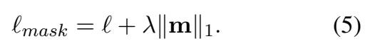
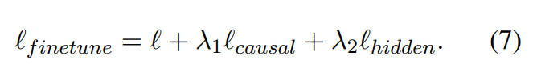
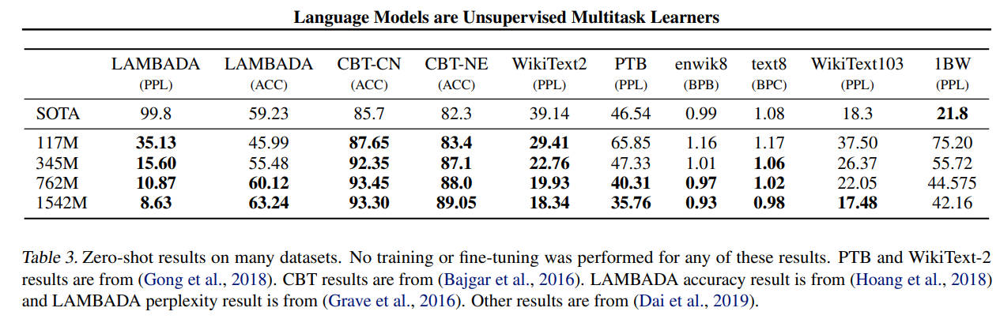

# Structured Pruning for Efficient Generative Pre-trained Language Models

## Method

- Sparsity-induced Mask Learning
    - Teacher-Student KD loss and L1 regularization to optimize sparse mask.
    - The learnable sparse mask is initialized to 1, and is updated with gradient descent during training. After learning the mask, these masks are binarized according to a threshold determined by a given sparsity.

- Fine-tuning
    - Fix sparse mask and finetune weights
    - KD Loss + Local KD loss

MSE loss of K, V

$\ell_{hidden}$ is hidden state distillation loss:

## Results

论文中没有给出具体的GPT2，按照模型大小推测应该是GPT2-small，ppl=29，所以论文中的结果可能在wikitext2上进行了finetune
