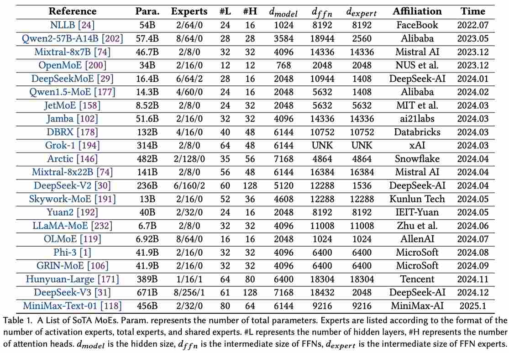

# A Survey on Inference Optimization Techniques for Mixture of Experts Models

> Jiacheng Liu, Peng Tang, Wenfeng Wang, Yuhang Ren, Xiaofeng Hou, Pheng-Ann Heng, Minyi Guo, Chao Li

## 一句话总结

本文是一篇全面的综述论文，系统地梳理了混合专家模型（MoE）推理优化技术，从模型层、系统层和硬件层三个抽象层次构建了完整的分类框架，覆盖了高效专家设计、模型压缩、动态路由、分布式并行、专家卸载和硬件加速等关键领域，为 MoE 模型的高效部署提供了结构化的技术路线图。

## 摘要翻译

大规模混合专家（MoE）模型的出现代表了人工智能领域的重大进展，通过条件计算提供了增强的模型容量和计算效率。然而，部署和运行这些模型的推理过程在计算资源、延迟和能源效率方面带来了重大挑战。本综合综述分析了整个系统栈中 MoE 模型的优化技术。我们首先建立了一个分类框架，将优化方法分为模型层、系统层和硬件层优化。在模型层，我们研究了包括高效专家设计、注意力机制、各种压缩技术（如剪枝、量化和知识蒸馏）以及算法改进（包括动态路由策略和专家合并方法）在内的架构创新。在系统层，我们研究了分布式计算方法、负载均衡机制和高效调度算法，以实现可扩展部署。此外，我们深入探讨了硬件特定优化和协同设计策略，以最大化吞吐量和能源效率。本综述既提供了现有解决方案的结构化概述，也确定了 MoE 推理优化中的关键挑战和有前景的研究方向。为了促进 MoE 推理优化研究的持续更新和前沿进展的共享，我们建立了一个可访问的仓库：https://github.com/MoE-Inf/awesome-moe-inference/。

## 研究动机

### 1. MoE 模型的崛起与推理挑战

大语言模型（LLM）通过 GPT-4、Claude、Gemini 等取得了显著进展，但其规模增长带来了巨大的计算效率挑战。MoE 通过稀疏激活机制，将模型容量分布在多个专家子网络上，仅对每个输入选择性激活相关专家，从而在保持大规模参数的同时控制计算成本。Mixtral 8x7B、DeepSeek-V3、DBRX 等模型已证明 MoE 在扩展语言模型方面的有效性。

### 2. 高效推理部署的独特困难

MoE 模型的高效推理部署面临三大挑战：
- **模型层**：专家架构设计需平衡模型容量与计算效率，路由机制需优化专家选择和负载分配
- **系统层**：分布式计算需要复杂的调度算法管理专家放置和激活，负载均衡需处理动态工作负载变化，内存管理需高效处理专家参数的加载和卸载
- **硬件层**：传统硬件架构为密集计算优化，与 MoE 推理的稀疏、动态特性存在根本性不匹配

### 3. 缺乏系统化框架

现有文献的缺口在于缺乏系统化框架来分析和开发 MoE 模型的全面推理优化解决方案。虽然相关综述讨论了 LLM 效率和 MoE 架构，但尚无专门聚焦于 MoE 推理优化技术的综述。

## 方法（技术细节）

### 分类框架概览

本文提出了三层分类框架（如图 1 所示）：

### 1. 模型层优化（Model-level）

#### 1.1 高效模型架构设计

**MoE-based 注意力设计**：
- **MAE**：首个从 MoE 视角解释多头注意力机制，使用学习到的门控函数为不同输入激活不同专家
- **MoA** 和 **BAM**：选择 k 个注意力头，共享键投影和值投影权重
- **SwitchHead**：共享键投影和查询投影权重以提高计算效率
- **MoH**：引入共享头和两阶段路由过程，优于 MoA
- **ModuleFormer**：扩展稀疏模块到注意力和前馈层
- **JetMoE-8B**：开发强大的开源模型，具有稀疏注意力和稀疏前馈层
- **DS-MoE**：提出混合密集训练和稀疏推理框架
- **SUT** 和 **MoEUT**：使用稀疏注意力和稀疏前馈层构建高效的稀疏通用 Transformer 模型

**MoE-based FFN 设计**：
- **MoE++**：引入三种基于标准专家的零计算专家，减少计算开销
- **SCoMoE**：利用结构化全对全通信降低并行 MoE 计算的通信成本
- **Pre-gated MoE**：提出预门控 MoE 模块，预取所需专家以提高推理速度
- **COMET**：引入基于树的稀疏专家选择机制优化传统门控模块
- **MoELoRA**：将 LoRA 重新想象为 MoE，实现更参数高效的微调

#### 1.2 模型压缩技术

**专家剪枝**（表 2 总结）：
- **结构化剪枝**：直接移除不重要的专家或将多组合并为一个专家
- **非结构化剪枝**：基于权重幅度进行剪枝
- **TSEP**：移除非目标任务的非专业专家，同时微调专业专家
- **NAEE**：通过评估校准数据集上的专家组合消除不重要专家
- **UNCURL**：基于 MoE 路由器 logits 减少专家数量
- **PEMPE**：剪枝路由器 l2 范数变化较小的专家
- **SEER-MoE**：采用重击者计数方法进行专家剪枝
- **MoE-I²**：提出层遗传搜索和块级 KT 接收域，使用非均匀剪枝比率
- **MoE-Pruner**：基于路由器提示剪枝幅度最小的权重
- **MoE-Compression**：提出统一框架，结合结构化和非结构化剪枝
- **Branch-Train-Merge / Branch-Train-Mix**：独立训练不同部分后合并参数
- **HC-SMoE**：使用层次聚类合并专家，无需重新训练
- **MEO**：系统研究 MoE 的计算成本

**专家量化**（表 3 总结）：
- **MC-MoE**：利用访问频率和激活权重评估专家重要性，通过整数规划确定最佳量化配置
- **MoE-CSP**：将专家权重量化为 4 位或 8 位，设计特定 CUDA 内核加速计算
- **MoQE**：将专家权重量化为 2 位，基于观察到量化 FFN 层到 2 位不会显著影响模型质量
- **QMoE** 和 **CMoE**：激进压缩至 1 位
- **MoE-MPTQS** 和 **HOBBIT**：基于当前输入动态选择量化专家
- **EdgeMoE**：通过校准数据集确定适当的专家位宽

**专家知识蒸馏**（图 4-c）：
- **LLaVA-MoD**：结合 MoE 结构与知识蒸馏，通过模仿蒸馏和偏好蒸馏训练小模型
- **DeepSpeed-MoE**：采用分阶段知识蒸馏创建蒸馏版本 MoS
- **OneS**：通过知识收集和知识蒸馏两步从 MoE 生成密集模型
- **MoE-KD** 和 **CMoE**：将 MoE 语音识别模型蒸馏为密集模型
- **Switch Transformers** 和 **ELSM**：探索将稀疏模型转换为密集模型
- **LaDiMo**：通过层间蒸馏将密集模型转换为稀疏 MoE 模型

**专家分解**（图 4-d）：
- **MPOE**：采用张量分解技术将专家权重矩阵分解为中心张量和辅助张量
- **MC-SMoE**：先分组合并专家，再应用低秩分解
- **MoE-I²**：识别专家重要性，为重要专家分配更高秩

#### 1.3 算法改进

**动态门控**（表 4 总结）：
- **Li et al.**：提出自适应门控机制，动态确定每个 token 所需专家数量
- **DynMoE**：引入两种创新方法：自上而下门控和自适应机制
- **XMoE**：采用较小但更多的专家策略，基于阈值动态激活
- **AdapMoE**：边设备上的协同设计框架，自适应应用专家激活、预取和 GPU 缓存分配
- **DA-MoE**：引入基于注意力机制的 token 重要性预测方法指导专家分配

**稀疏到密集**：
- **XFT**：通过可学习的合并机制将稀疏 MoE 转换为高效的密集 LLM
- **Switch Transformers**：蒸馏压缩 97% 参数后保留 30% 以上性能
- **ELSM**：密集学生模型可匹配甚至超越教师模型
- **OneS**：使用四种方法生成密集模型
- **EWA**：训练时用 MoE 替换 FFN，推理时恢复密集 ViT
- **AdaMoLE**：结合 LoRA 结构和专用网络调整激活阈值

### 2. 系统层优化（System-level）

#### 2.1 专家并行（图 7-a）

**并行策略设计**（表 5 总结训练加速比）：
- **Tutel**：动态切换并行策略，无额外开销
- **Alpa**：重新分类为算子内和算子间并行，自动推导高效执行计划
- **DeepSpeed-TED**：混合数据、张量和专家并行，设计分片优化器降低峰值内存
- **BaGuaLu**：提出 MoDa 策略，结合 MoE 并行和数据并行
- **SmartMoE**：探索异构工作负载感知的混合并行空间
- **MPMoE**：基于轻量级配置文件的算法，运行时优化流水线并行
- **MoE-SLC**：贝叶斯优化框架，优化服务器计算中的 MoE 部署

**负载均衡**：
- **Switch Transformers / Gshard**：添加辅助负载均衡损失项
- **HashLayer**：使用特殊哈希函数的门控模块防止负载不均衡
- **Prophet**：构建负载均衡性能模型，使用贪心搜索算法
- **MoE-Prediction**：跟踪和分析训练过程中每个专家的负载
- **Lazarus**：使用最优放置算法为热门专家分配更多副本
- **FlexMoE**：采用细粒度复制策略，动态调整运行时映射
- **MoE-Deploy / Brainstorm**：依赖历史分配数据和专家重排序
- **Lynx**：减少批量推理中的活跃专家数量
- **BaseLayers**：将 token 到专家分配建模为线性分配问题
- **MoE-ECR**：允许专家选择 top-k token

**全对全通信优化**：
- **Tutel / HetuMoE / DeepSpeed-MoE**：使用层次全对全算法优化通信
- **DeepSpeed-TED / TA-MoE**：数据压缩策略减少传输开销
- **Janus**：数据为中心方法，移动专家而非 token
- **ExFlow**：将全对全操作从两次减少到一次
- **Aurora**：对 token 传输排序避免带宽竞争
- **LocMoE / Parm**：将节点间通信转换为节点内操作
- **Lina**：优先全对全操作而非全归约操作

**任务调度**：
- **ScMoE**：引入快捷连接 MoE 架构，有效解耦通信
- **HiDup**：将输入数据分成两个微批次并行训练
- **MoESys**：弹性 MoE 训练策略，2D 预取和融合通信
- **ScheMoE**：模块化计算和通信任务，自适应调度算法
- **PipeMoE**：性能模型预测计算和通信成本
- **EPS-MoE**：动态选择最优内核实现自适应重叠

**推理加速性能**（表 6、7）：
- DeepSpeed-MoE 在推理时加速 7.25x（基于 PyTorch 基线）
- Lina 实现 1.63x 推理加速，优先全对全通信
- Brainstorm 实现 3.33x 推理加速，使用配置文件预加载权重

#### 2.2 专家卸载（图 7-b）

**专家预取**：
- **Mixtral-Offloading / AdapMoE / HOBBIT**：使用当前门控输入预测下一层所需专家，预测准确率约 90%
- **Pre-gated MoE**：在当前层计算时识别下一层所需专家并预加载
- **EdgeMoE**：使用校准数据集构建预测表
- **DyNN-Offload**：训练先导模型预测下一层所需专家
- **MoE-Infinity**：基于请求级使用频率追踪预取高优先级专家
- **ProMoE**：使用学习到的预测器滑动窗口预取
- **ExpertFlow**：训练基于 Transformer 的预测器预测当前前向传递所需全部专家
- **SiDA**：使用基于网络的哈希函数预测激活专家
- **Read-ME**：构建预门控路由器预测所有所需专家

**专家缓存**（表 8、9 总结卸载系统性能）：
- **LRU 策略**：Mixtral-Offloading、AdapMoE、EdgeMoE 等
- **MoE-Infinity**：使用变体 LFU 策略
- **Fiddler**：静态数据集分析专家活跃次数
- **SwapMoE**：基于专家重要性分数存储关键专家
- **AdapMoE**：为不同模型层引入动态缓存大小
- **HOBBIT**：多维缓存策略，结合 LRU、LFU 和 LHU（最少高精度使用）
- **CacheMoE**：缓存感知策略调整路由器 logits

**专家加载**：
- **EdgeMoE / HOBBIT**：使用低精度专家减少加载时间
- **HOBBIT**：token 级动态专家加载机制，基于门控模块输出计算专家重要性分数
- **AdapMoE**：使用 Fisher 信息矩阵计算专家重要性

**CPU 协助**：
- **Fiddler**：在 CPU 上执行 MoE 计算，实现 8.20x 加速
- **HOBBIT**：使用低精度专家在 CPU 上计算
- **MoE-Lightning**：引入 CPU-GPU-I/O 流水线策略，实现 3.50x 加速

**框架统计**（表 10）：
- 并行系统：PyTorch（12）、Transformers（5）、DeepSpeed（9）
- 卸载系统：Transformers（7）、PyTorch（4）
- 其他：Llama.cpp、vLLM、FasterTransformer

### 3. 硬件层优化（Hardware-level）

- **MoNDE**：引入近数据处理（NDP）方案，集成 CXL 控制器和专用 NDP 核心，GPU 处理热专家，NDP 单元处理冷专家，实现并发执行
- **FLAME**：首个在 FPGA 上利用 MoE 稀疏性的加速框架，使用 M:N 剪枝减少不必要的计算，通过圆形专家预测（CEPR）提高专家预测准确率，使用双缓冲机制加载预测专家
- **M3ViT / Edge-MoE**：基于多任务场景中注意力计算重排序构建 FPGA 架构
- **Duplex**：结合 xPU 和逻辑 PIM 的设备执行每层，通过 PIM 微架构优化低 Op/B 操作
- **Space-mate**：用于移动设备 SLAM 任务的加速器设计，包含乱序 SMoE 路由器和异构核心架构

## 实验结果

### 模型层压缩结果
- **量化方法**（表 3）：大多数方法实现 4x 以上内存减少；QMoE 可达 20x 内存减少但有 5% 开销；CMoE 实现 150x 压缩但准确率下降 23.81%；EdgeMoE 在 2-8 位量化下实现 1.05-1.18x 内存减少和 1.11-2.78x 推理加速
- **剪枝方法**（表 2）：支持 25%-96.875% 的最大剪枝比率，包含结构化和非结构化方法
- **动态门控**（表 4）：Li et al. 实现 38.2% FLOPs 减少和 1.32x 加速；DynMoE 实现 9% FLOPs 减少和 1.37x 加速；XMoE 实现 75% FLOPs 减少；AdapMoE 减少 25% 专家

### 系统层性能
- **并行系统训练加速**（表 5）：
  - HetuMoE：相比 DeepSpeed-MoE 加速 5.88x
  - Lazarus：加速 3.40x（tokens/sec）
  - Parm：加速 3.00x
  - Prophet：加速 2.39x
- **推理加速**（表 6）：
  - DeepSpeed-MoE（PyTorch 基线）：7.25x
  - Brainstorm（Tutel 基线）：3.33x
  - MoE-Deploy（Tutel 基线）：3.32x tokens/sec
  - ExFlow（DeepSpeed-MoE 基线）：2.2x tokens/sec
- **卸载系统性能**（表 8、9）：
  - Fiddler（Mixtral-8x7B）：8.20x tokens/sec
  - ExpertFlow（Switch Transformer）：5.23x tokens/sec
  - MoE-Infinity（Switch Transformer）：4.53x latency/token
  - SIDA（Switch Transformer）：3.93x samples/sec
  - MoE-Lightning（FlexGen 基线）：3.50x tokens/sec

### 硬件层性能
- MoNDE 通过 NDP 架构实现热/冷专家并发执行
- FLAME 在 FPGA 上实现 MoE 稀疏性加速
- Space-mate 在 303.5mW 功耗下实现 SLAM 任务实时处理

## 优势

1. **系统化分类框架**：首次专门针对 MoE 推理优化的三层分类框架（模型、系统、硬件），为研究者提供清晰的技术路线图
2. **全面覆盖**：涵盖 200+ 相关方法，从架构设计到硬件加速，从理论到实践，全面覆盖 MoE 推理优化的各个方面
3. **详细对比分析**：提供多张对比表格（表 2-10），系统比较不同方法的性能指标、优劣势和适用场景
4. **实用性强**：对每种方法进行了深入分析，包括技术细节、实现方式和实际效果，对工程师和研究者具有很高的参考价值
5. **前沿性**：涵盖了截至 2024 年底/2025 年初的最新进展，包括 DeepSeek-V3、Mixtral 等最新 MoE 模型
6. **开源仓库**：配套的 awesome-moe-inference 仓库持续更新，方便研究者跟踪最新进展
7. **多层次优化视角**：从模型架构、系统调度到硬件加速的多维度视角，帮助读者全面理解 MoE 推理优化的全貌

## 局限

1. **实验结果对比困难**：由于不同系统使用不同的基线和评估配置，跨系统比较性能存在挑战（如表 6、8、9 所示）
2. **缺乏统一基准**：当前缺乏针对 MoE 的标准化基准测试框架，现有评估方法在不同研究之间差异显著
3. **硬件层覆盖有限**：硬件层优化部分相对较薄，仅有少数方法（MoNDE、FLAME、M3ViT、Edge-MoE、Duplex、Space-mate），缺乏对更多新型硬件加速器的深入讨论
4. **能耗分析不足**：虽然提到了能耗效率的重要性，但本文主要关注吞吐量和延迟指标，能耗和碳排放优化方面讨论较少
5. **实时性和可靠性**：对 MoE 推理中的实时性保证和系统可靠性（如故障容错）讨论不够深入
6. **跨模态适用性**：主要聚焦于语言模型，对 MoE 在计算机视觉、多模态任务中的推理优化讨论较少
7. **时间约束**：论文为预印本（arXiv），部分最新进展可能未被纳入

## 与 EfficientPaper 相关的研究方向

基于 EfficientPaper 项目对高效 AI 研究的持续关注，本论文提供了多个相关的研究方向：

1. **结构设计（structure_design）**：
   - 高效专家架构设计（MoE-based Attention / FFN）
   - 稀疏激活模式优化
   - 动态路由策略和专家合并方法

2. **模型压缩（model_compression）**：
   - 专家剪枝、量化和知识蒸馏
   - 低秩分解技术
   - 稀疏到密集的转换

3. **分布式推理（distributed_inference）**：
   - 专家并行和负载均衡
   - 全对全通信优化
   - 任务调度策略

4. **内存优化（memory_optimization）**：
   - 专家卸载和预取
   - 专家缓存策略
   - CPU-GPU 协同计算

5. **硬件协同设计（hardware_co_design）**：
   - 近数据处理架构
   - FPGA 上的 MoE 加速
   - 异构计算架构

6. **评测基准（benchmarking）**：
   - 建立统一的 MoE 推理评估基准
   - 标准化的性能指标和评估方法

7. **新兴方向**：
   - 能耗感知部署策略
   - 量子计算与 MoE 结合
   - 神经形态计算与 MoE 结合
   - 多模态 MoE 推理优化

## AI 生成声明

> 本笔记由 AI Agent（Hermes Agent）自动生成，基于论文全文文本提取和分析。笔记内容仅供参考，不构成对原论文的完全准确引用。如需准确引用，请参考原论文：arXiv:2412.14219v2。生成时间：2026年6月5日。
