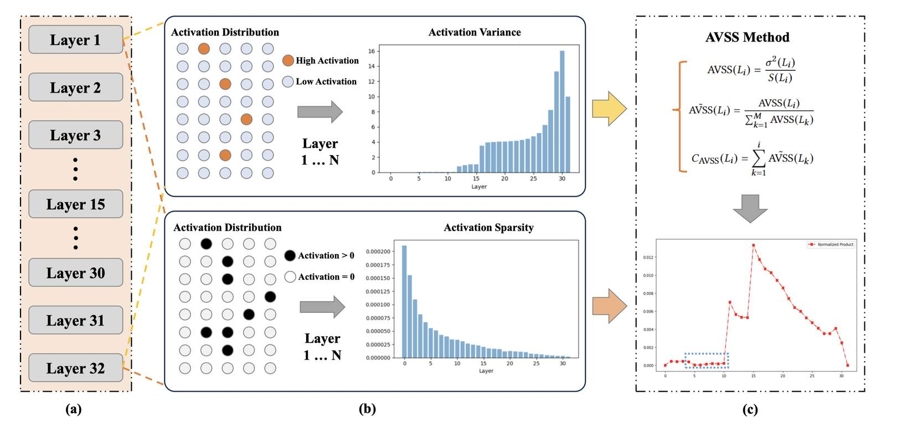

# AVSS: Layer Importance Evaluation in Large Language Models via Activation Variance-Sparsity Analysis

## 一句话总结

本文提出了一种基于激活方差-稀疏度（Activation Variance-Sparsity Score, AVSS）的新型指标，用于评估大语言模型中各层的重要性，通过移除约25%低AVSS分数的层，在多项任务上仍能保留90%以上的原始性能，实现高效的层剪枝。

---

## 摘要翻译

> 深度学习中的层重要性评估一直是一个活跃的研究领域，对模型优化和可解释性具有重要意义。近年来，大语言模型（LLMs）在各个领域获得了广泛关注，但很少有研究从激活分布的角度探索LLM中各层的功能重要性和性能贡献。在本工作中，我们提出了激活方差-稀疏度分数（AVSS），这是一种结合归一化激活方差和稀疏度的新指标，用于评估每层对模型性能的贡献。通过基于AVSS识别并移除约最低25%的层，我们在问答、语言建模和情感分类等任务中实现了超过90%的原始模型性能，表明这些层可能是非必要的。我们的方法提供了一种系统性的方法来识别不太关键的层，为高效的大语言模型架构做出了贡献。

---

## 研究动机

1. **层重要性评估的必要性**：深度学习模型的层重要性评估是模型压缩和可解释性研究的关键方向。理解哪些层对模型性能至关重要，可以显著提高计算效率和模型设计质量。
2. **现有方法的局限**：现有的层重要性评估方法（如GBIS、LRP、CIM等）存在局限性：
   - **GBIS（Gradient-Based Importance Scores）**：利用梯度信息评估层重要性，但无法充分捕捉LLM中复杂的激活分布和冗余性。
   - **LRP（Layer-Wise Relevance Propagation）**：分析信息流，但对激活分布的评估不够精细。
   - **CIM（Contextual Importance Measures）**：整合上下文信息动态评估层重要性，但存在静态评估的限制。
3. **LLM层冗余性的发现**：大语言模型（如LLaMA、StableLM等）通常包含大量层，但许多层可能存在功能冗余。如何系统地识别并移除这些冗余层，同时保持模型性能，是一个重要的研究问题。
4. **缺乏激活分布视角的评估**：现有的层重要性评估方法大多忽略了从激活分布的角度来评估各层的功能贡献，这限制了其在LLM层剪枝中的有效性。

---

## 方法（技术细节）

### 1. 激活方差（Activation Variance）

对于给定的层 $L_i$，激活方差 $\sigma^2(L_i)$ 定义为：

$$\sigma^2(L_i) = \frac{1}{N} \sum_{j=1}^{N} (a_j(L_i) - \mu(L_i))^2$$

其中：
- $a_j(L_i)$ 是层 $L_i$ 的第 $j$ 个输入的激活值
- $\mu(L_i)$ 是该层的平均激活值
- $N$ 是输入的总数

方差反映了激活值偏离均值的程度，较大的方值表示更广泛且可能更具信息量的响应。

**归一化激活方差**：为了便于跨层比较，计算归一化方差：

$$\tilde{\sigma}^2(L_i) = \frac{\sigma^2(L_i)}{\sum_{k=1}^{M} \sigma^2(L_k)}$$

其中 $M$ 是模型的总层数。归一化方差突出了具有独特激活动态的层。

### 2. 激活稀疏度（Activation Sparsity）

对于给定的层 $L_i$，稀疏度 $S(L_i)$ 定义为激活值接近零的比例：

$$S(L_i) = \frac{1}{N} \sum_{j=1}^{N} \mathbb{I}(|a_j(L_i)| < \epsilon)$$

其中 $\mathbb{I}$ 是指示函数，当激活值低于阈值 $\epsilon$ 时返回1，否则返回0。

**归一化稀疏度**：

$$\tilde{S}(L_i) = \frac{S(L_i)}{\sum_{k=1}^{M} S(L_k)}$$

**稀疏度偏差**：为了捕捉每层稀疏度与模型平均趋势的偏差，引入稀疏度偏差指标：

$$D_S(L_i) = |S(L_i) - \tilde{S}(L_i)|$$

较高的偏差表示该层具有独特的稀疏模式，可能是高度专业化或冗余的。

### 3. AVSS 计算

**AVSS 分数**：

$$\text{AVSS}(L_i) = \frac{\sigma^2(L_i)}{S(L_i)}$$

该指标有效惩罚高稀疏度的层，同时奖励具有显著方差的层，提供更平衡的评估。

**归一化 AVSS**：

$$\tilde{\text{AVSS}}(L_i) = \frac{\text{AVSS}(L_i)}{\sum_{k=1}^{M} \text{AVSS}(L_k)}$$

**累积 AVSS 影响分数**：

$$C_{\text{AVSS}}(L_i) = \sum_{k=1}^{i} \tilde{\text{AVSS}}(L_k)$$

累积AVSS值较低的层对模型性能贡献较少，被视为剪枝候选。通过移除这些层，可以实现精简的模型架构，同时保留大部分性能。

### 4. 剪枝策略

基于AVSS对各层进行排序，移除约最低25%的层（根据AVSS分数），实现高效的层剪枝。

---

## 实验结果

### 实验设置
- **基线方法**：GBIS（梯度重要性分数）、LRP（层相关性传播）、CIM（上下文重要性度量）
- **数据集**：SST-2（情感分类，约1.2k样本）、HackerNews（语言建模，约1.5k文本）、The Pile（语言建模，约0.8k文本）、SQuAD（问答，约0.1k问答对）
- **模型**：DistilBERT、LLaMA-1B、LLaMA-7B、LLaMA-8B、StableLM-3B
- **硬件**：两块 A800（40GB）设备
- **实验重复**：每个实验至少重复5次

### 情感分类任务（SST-2，Accuracy↑）

| 模型 | 原始 | GBIS | LRP | CIM | AVSS | 参数减少 |
|------|------|------|-----|-----|------|---------|
| DistilBERT | 0.9142 | 0.8673 | 0.8739 | 0.8713 | **0.8891** | 16.67% |
| LLama-1B | 0.9237 | 0.8718 | 0.8814 | 0.8693 | **0.8702** | 25.00% |
| Stablelm-3B | 0.9648 | 0.8934 | 0.8891 | 0.8863 | **0.9032** | 25.00% |

**关键发现**：AVSS方法在情感分类任务中持续优于基线方法，尤其在StableLM-3B模型上达到0.9032的准确率。AVSS能有效保留情感分类中重要的层以维持性能。

### 语言建模任务（Perplexity↓）

**HackerNews数据集**：

| 模型 | 原始 | GBIS | LRP | CIM | AVSS | 参数减少 |
|------|------|------|-----|-----|------|---------|
| LLama-8B | 6.239 | 6.987 | 6.987 | 7.156 | **6.436** | 20.00% |
| LLama-7B | 6.374 | 6.891 | 7.048 | 7.520 | **7.461** | 25.00% |
| Stablelm-3B | 9.408 | 10.031 | 10.248 | 10.345 | **9.599** | 25.00% |

**The Pile数据集**：

| 模型 | 原始 | GBIS | LRP | CIM | AVSS | 参数减少 |
|------|------|------|-----|-----|------|---------|
| LLama-8B | 6.143 | 6.973 | 7.196 | 6.544 | **7.066** | 22.50% |
| LLama-7B | 6.189 | 7.145 | 6.952 | 6.944 | **6.473** | 25.00% |
| Stablelm-3B | 9.294 | 9.946 | 10.081 | 9.898 | **9.489** | 25.00% |

**关键发现**：AVSS方法在语言建模任务中优于其他基线方法，特别是在HackerNews数据集上，LLaMA-7B模型达到7.461的困惑度。AVSS在多样性文本建模中展示了更好的性能保持能力。

### 问答任务（SQuAD，F1-Score↑）

| 模型 | 原始 | GBIS | LRP | CIM | AVSS | 参数减少 |
|------|------|------|-----|-----|------|---------|
| LLama-8B | 0.5408 | 0.4713 | 0.4691 | 0.4813 | **0.5121** | 12.50% |
| LLama-7B | 0.5329 | 0.4683 | 0.4796 | 0.4723 | **0.5072** | 15.62% |
| Stablelm-3B | 0.2458 | 0.1932 | 0.2078 | 0.2103 | **0.2334** | 12.50% |

**关键发现**：AVSS方法在问答任务中表现出色，在LLaMA-8B模型上达到0.5121的F1分数，优于其他基线方法。AVSS能够有效保留问答任务中的关键层。

### 实验结论

- **总体性能**：AVSS方法在所有任务（情感分类、语言建模、问答）中均优于基线方法。
- **层剪枝效率**：通过移除约25%的层，AVSS能够保持超过90%的原始模型性能。
- **参数减少**：不同模型和任务的参数减少范围为12.50%至25.00%。
- **方法优势**：AVSS方法能够有效平衡激活分布和稀疏度，捕捉LLM层中的重要信息。

---

## 优势

1. **创新性指标**：AVSS结合了归一化激活方差和稀疏度，提供了一种全新的层重要性评估方法，有效弥补了现有方法的不足。
2. **高效层剪枝**：通过移除约25%的低AVSS层，保持超过90%的原始性能，实现了高效的层剪枝。
3. **多任务适用性**：AVSS在情感分类、语言建模和问答等多种任务中均表现优异，具有广泛的应用前景。
4. **计算效率**：AVSS方法不需要复杂的梯度计算或上下文分析，计算效率高，适用于大规模模型。
5. **可解释性**：AVSS提供了对LLM各层功能贡献的定量评估，有助于理解模型的内部机制。
6. **对比优势**：与GBIS、LRP和CIM等现有方法相比，AVSS在多个任务和模型上均展现出更好的性能保持能力。

---

## 局限

1. **评估范围有限**：AVSS主要关注激活方差和稀疏度，未考虑其他可能影响层重要性的因素（如注意力模式、梯度信息等）。
2. **实验规模较小**：实验使用了相对较小的数据集（如SST-2约1.2k样本、SQuAD约0.1k问答对），结果的泛化性有待进一步验证。
3. **模型覆盖有限**：实验主要在LLaMA、StableLM和DistilBERT等模型上进行，对其他类型的LLM（如BERT、GPT等）的适用性需要进一步验证。
4. **剪枝策略单一**：AVSS采用移除最低25%层的策略，但未探索其他剪枝比例或更复杂的剪枝策略（如迭代剪枝、动态剪枝等）。
5. **缺乏深度分析**：论文对AVSS的理论基础和数学推导的深度分析不足，缺乏对AVSS指标的严格理论证明。
6. **硬件要求**：实验在两块A800（40GB）设备上进行，对于资源受限的环境可能不适用。
7. **论文质量**：论文中存在一些拼写错误（如"Conslusion"应为"Conclusion"），且论文长度较短（仅4页），实验部分可能不够详细。

---

## 与 EfficientPaper 相关的研究方向

1. **模型压缩与层剪枝**：AVSS方法属于模型压缩中的层剪枝方向，与EfficientPaper项目中的稀疏化（sparse_pruning）关键词直接相关。
2. **LLM效率优化**：通过移除冗余层提高LLM的计算效率，与EfficientPaper项目关注的高效AI研究方向一致。
3. **层重要性评估**：AVSS为LLM层重要性评估提供了新方法，有助于模型优化和可解释性研究。
4. **激活分布分析**：AVSS方法基于激活分布分析，为理解LLM内部机制提供了新视角。
5. **多任务泛化**：AVSS在多种任务中表现出色，展示了在不同应用场景下的泛化能力，有助于推动高效模型的开发和部署。
6. **相关工作**：
   - **SliceGPT**：通过删除行列压缩LLM，与AVSS的层剪枝方法互补。
   - **DeepNet**：探索Transformer的深层架构，为AVSS的层重要性评估提供了背景。
   - **Layer Normalization**：研究Transformer中的层归一化，与AVSS的激活分布分析相关。

---

## AI 生成声明

本笔记由 AI Agent（Hermes Agent）基于论文元数据、已有笔记和论文PDF文本自动生成。笔记内容包括摘要翻译、研究动机、方法技术细节、实验结果分析、优势、局限、与EfficientPaper相关研究方向等部分。生成过程中使用了PyMuPDF（fitz）提取PDF文本，并结合元数据和已有笔记进行综合分析和整理。笔记中的所有内容均基于论文原文，但生成过程可能引入主观解读或不准确之处。请读者在使用本笔记时，务必参考论文原文进行核实。生成时间：2026年6月。
