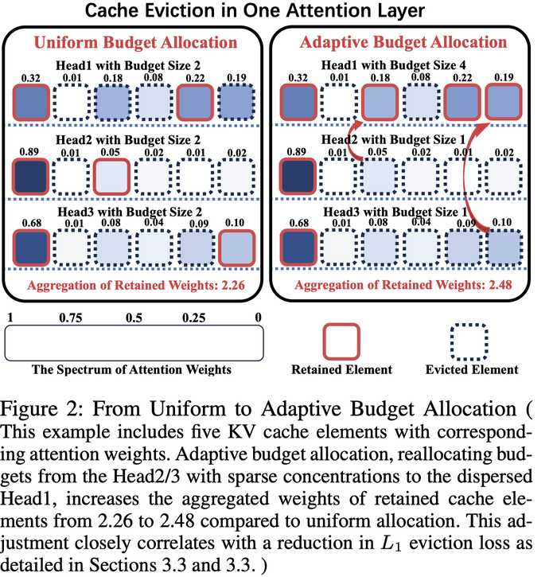

# Ada-KV: Optimizing KV Cache Eviction by Adaptive Budget Allocation for Efficient LLM Inference

## 一句话总结

AdaKV 提出了一种自适应预算分配算法，通过根据不同注意力头的注意力集中程度动态分配 KV 缓存预算（而非均匀分配），从而优化缓存驱逐策略，显著提升大语言模型长序列推理的效率和生成质量。

---

## 摘要翻译

大语言模型（LLMs）在各个领域表现出色，但由于长序列推理所需的 Key-Value（KV）缓存不断膨胀，面临内存和时间效率方面的挑战。最近的研究尝试在运行时通过驱逐大量非关键缓存元素，将 KV 缓存大小缩减到给定的内存预算范围内，同时保持生成质量。我们对当前驱逐方法的重新审视揭示：这些方法本质上是在最小化多头自注意力机制中驱逐前后输出之间 $L_1$ 驱逐损失的上界。此外，我们的分析表明，在不同注意力头之间统一分配预算的常见做法会损害驱逐后的生成质量。基于这些发现，我们提出了一种简单而有效的自适应预算分配算法。该算法不仅优化了理论上界，还通过适应不同头部的特征差异在实践中降低了 $L_1$ 驱逐损失。通过将该算法集成到两种最先进（SOTA）的方法中，我们验证了自适应预算分配在优化 KV 缓存驱逐方面的有效性。在 16 个数据集和 Needle-in-a-Haystack 测试上的广泛评估证实了其在各种任务中的显著性能提升。

---

## 研究动机

### 1. KV 缓存导致的内存与效率瓶颈
- 现代 LLM（如 GPT-4、Claude3、Gemini-Pro-1.5）支持越来越长的上下文（128K~1M tokens），KV 缓存大小随序列长度增长，甚至远超模型参数大小。
- 在预填充（prefilling）和解码（decoding）阶段，KV 缓存带来巨大的内存负担和 I/O 延迟，成为解码瓶颈。

### 2. 现有驱逐方法的不足
- 当前主流的 Top-k 驱逐方法（如 SnapKV、PyramidKV）通过注意力权重选择保留关键缓存元素，但普遍采用**统一预算分配**（uniform budget allocation）策略。
- 不同注意力头的注意力集中程度（attention concentration）差异显著：有些头高度集中（仅需少量缓存即可达到近最优效果），有些头则高度分散（需要更多缓存）。
- 统一预算分配会导致在稀疏头浪费预算，在分散头预算不足，严重损害驱逐后的生成质量。

### 3. 理论动机
- 从理论角度重新审视现有驱逐方法，发现它们本质上是在最小化 $L_1$ 驱逐损失的上界。
- 自适应预算分配能够从理论上降低该上界，从而提供更优的理论保证。

---

## 方法（技术细节）

### 1. 多头自注意力形式化描述

对于每个注意力头 $i \in [1, h]$，定义变换矩阵 $W_Q^i, W_K^i, W_V^i \in \mathbb{R}^{d \times d_h}$，将 token 嵌入映射为 Query、Key、Value。在每个时间步，KV 缓存不断更新，输出 $y$ 通过注意力权重计算：

$$y = \sum_{i \in [1,h]} A_i V_i W_O^i, \quad A_i = \text{softmax}(q_i K_i^T)$$

### 2. $L_1$ 驱逐损失定义与理论分析

引入指示变量 $I_i \in \mathbb{R}^{1 \times n}$ 表示驱逐决策，驱逐后的输出为 $\hat{y}$。定义驱逐损失为驱逐前后输出的 $L_1$ 距离：

$$L_1 \text{ Eviction Loss} = \|y - \hat{y}\|_1$$

**定理 2** 证明了 $L_1$ 驱逐损失的上界 $\epsilon$：

$$\epsilon = 2hC - 2C \sum_{i \in [1,h]} \sum_{j \in [1,n]} I_j^i A_j^i$$

其中 $C = \max \|V_i W_O^i\|_\infty$ 是一个常数。

**定理 3** 证明了 Top-k 驱逐方法本质上是在最小化该上界 $\epsilon$。

### 3. 自适应预算分配算法（核心贡献）

**算法 2**（Adaptive Budget Allocation）：

1. **拼接**：将所有头部的观测注意力权重拼接为一个序列 $A = \text{Cat}(\{A_i\}, \text{dim}=1)$
2. **创建头部指示符**：创建 $I = [1...1 : ... : h...h]$，每个头部索引重复 $n$ 次
3. **Top-k 选择**：从拼接序列中选取全局 Top-k 权重的索引 $T = \text{Top-k}(A, B)$
4. **频率统计**：统计每个头部在全局 Top-k 中的出现频率，即为该头部的分配预算 $B_i^*$
5. **返回**：输出自适应预算分配结果 $\{B_i^*\}$

**定理 4** 证明了自适应分配的上界 $\epsilon^*$ 始终不高于统一分配的上界 $\epsilon'$：

$$\epsilon^* \leq \epsilon'$$

### 4. 与 SOTA 方法的集成

**算法 3**（Ada-SnapKV/Ada-Pyramid in One Layer）：

1. 计算观测窗口内的注意力权重 $\bar{A}_i = \text{softmax}(Q_{win}^i K_i^T)$
2. 通过 max-pooling 和 mean 操作处理权重
3. 调用算法 2 获取自适应预算分配 $\{B_i^*\}$
4. 引入安全超参数 $\alpha$（默认 0.5），防止稀疏头分配过小预算：$\{B_i^*\} = \alpha \times \{B_i^*\} + (1-\alpha) \times (B/h - \text{winsize})$
5. 执行 Top-k 选择保留关键缓存，与观测窗口内的缓存拼接
6. 使用自定义 CUDA kernel 实现扁平化存储，结合 Flash Attention 技术确保计算效率

---

## 实验结果

### 评估设置
- **数据集**：LongBench 中的 16 个数据集，涵盖单文档 QA、多文档 QA、摘要、少样本学习、合成任务和代码生成等任务
- **基准方法**：H2O、StreamingLLM、SnapKV、PyramidKV
- **预算设置**：B = 128h、256h、512h、1024h（h 为头数）
- **模型**：Mistral-7B-instruct-v0.2

### 主要结果

| 预算 | 方法 | 平均分数 |
|------|------|---------|
| Full Cache | Full Cache | 42.51 |
| B=128h | Ada-SnapKV | 36.71 |
| B=128h | Ada-Pyramid | 36.81 |
| B=256h | Ada-SnapKV | 39.72 |
| B=256h | Ada-Pyramid | 39.28 |
| B=512h | Ada-SnapKV | 40.57 |
| B=512h | Ada-Pyramid | 40.45 |
| B=1024h | Ada-SnapKV | 41.54 |
| B=1024h | Ada-Pyramid | ~41.0+ |

- **Ada-SnapKV 和 Ada-Pyramid 在所有预算设置下均优于对应的原始版本**
- 在 B=128h（最小预算）下，Ada-Pyramid 的平均分数（36.81）比原始 Pyramid（35.58）提升约 1.2 分
- 在 B=1024h 下，Ada-SnapKV（41.54）接近全缓存性能（42.51）
- 在 Needle-in-a-Haystack 测试中，自适应分配显著提升了模型的长上下文检索能力
- 驱逐损失分析：自适应分配在所有样本上均产生更低的相对驱逐损失

---

## 优势

1. **理论与实践双重优化**：不仅从理论上降低了 $L_1$ 驱逐损失的上界（定理 4），而且在实践中验证了更低的实际驱逐损失。
2. **即插即用**：作为自适应预算分配算法，可无缝集成到任何 Top-k 驱逐方法中（如 SnapKV、PyramidKV），无需额外训练或微调。
3. **计算高效**：通过自定义 CUDA kernel 和 Flash Attention 技术，保持与原方法一致的计算效率。
4. **安全机制**：引入超参数 $\alpha$ 防止稀疏头分配过小预算，增强容错性。
5. **广泛适用性**：在 16 个数据集和 Needle-in-a-Haystack 测试中均表现优异，适用于多种任务类型。
6. **概念简洁**：算法设计简单直观，易于理解和实现。

---

## 局限

1. **仅适用于 Top-k 驱逐方法**：自适应预算分配针对 Top-k 驱逐策略设计，可能不直接适用于滑动窗口驱逐等其他方法。
2. **依赖观测窗口**：预算分配基于观测窗口内的注意力权重，窗口大小（默认 32）和超参数 $\alpha$（默认 0.5）的选择可能需要针对不同模型和任务进行调优。
3. **仅在单一模型上验证**：实验主要使用 Mistral-7B-instruct-v0.2，对更大规模模型（如 70B+）或不同架构的适用性有待进一步验证。
4. **缓存稳定性假设**：算法假设关键缓存元素在未来生成过程中保持稳定（top-k 假设），这一假设在极长序列或高动态场景下可能不成立。
5. **开销分析不充分**：虽然提到 CUDA kernel 实现，但对内存和计算开销的具体分析不够详尽。
6. **未考虑动态预算调整**：预算分配在预填充阶段一次性确定，未考虑解码过程中的动态调整。

---

## 与 EfficientPaper 相关的研究方向

1. **KV 缓存压缩与优化**：AdaKV 属于 KV 缓存驱逐方法的改进方向，与 EfficientPaper 中的 KV 缓存稀疏化研究（kv_cache_sparse）直接相关。
2. **注意力机制效率提升**：与注意力头剪枝（attention head pruning）、稀疏注意力（sparse attention）等方向互补。
3. **长上下文推理优化**：在长序列 LLM 推理中，如何在有限内存预算下最大化推理质量是核心问题，AdaKV 提供了预算分配层面的解决方案。
4. **动态资源分配**：启发了在其他推理场景（如推理时计算、模型并行）中采用自适应资源分配策略。
5. **与 Flash Attention 的协同**：AdaKV 的 CUDA kernel 实现与 Flash Attention 技术结合，展示了底层优化与高层算法设计的协同。
6. **无训练推理加速**：作为一种即插即用方法，无需额外训练即可提升推理效率，与 EfficientPaper 中其他无训练方法（如 quantization、pruning）具有相同的设计理念。

---

## AI 生成声明

本笔记由 AI Agent（Hermes Agent）自动生成，基于论文 Ada-KV: Optimizing KV Cache Eviction by Adaptive Budget Allocation for Efficient LLM Inference 的 PDF 文本提取和元数据信息。笔记内容经过结构化整理，包含一句话总结、摘要翻译、研究动机、方法（技术细节）、实验结果、优势、局限和相关研究方向等部分。AI 生成内容可能存在对原文理解的偏差，请以原始论文为准。

生成时间：2025年6月
