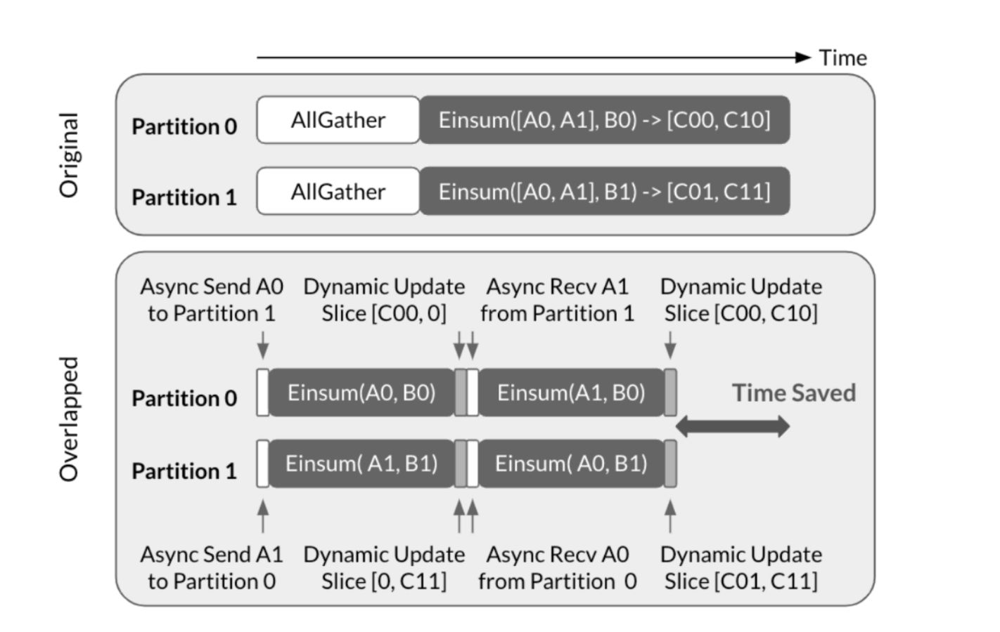

# Async-TP

> **本文由 AI Agent 自动生成，内容基于 PyTorch 博客文章全文阅读与分析，仅供参考。**
>
> 生成时间：2025-06-05 | 生成模型：Hermes Agent | 来源：[PyTorch Discussion](https://discuss.pytorch.org/t/distributed-w-torchtitan-introducing-async-tensor-parallelism-in-pytorch/209487/1)

---

## 一句话总结

PyTorch 团队通过异步张量并行（Async Tensor Parallelism）技术，将通信操作分解并与计算重叠，利用 CUDA P2P 机制和交替流策略隐藏通信延迟，在 Llama3 7B 上实现约 29% 的前向加速和约 8% 的端到端加速。

---

## 摘要翻译

本文介绍了 PyTorch 中实验性的异步张量并行（Async TP）支持，并在 TorchTitan 中集成测试。主要成果包括：

- **Llama3 8B**：前向传播加速约 29%，端到端加速约 8%；
- **Llama3 70B**：前向传播加速约 20%，端到端加速约 8%。

文章简要讨论了实现过程中遇到的性能挑战及所设计的解决方案。

---

## 研究动机

张量并行（Tensor Parallelism, TP）是大规模 LLM 训练中广泛使用的模型并行技术。与数据并行不同，TP 沿特征维度分布计算，允许多个 GPU 同时处理同一样本。标准 TP 实现中，通信（all-gather、reduce-scatter）与计算是串行的，通信开销成为瓶颈。

**核心问题**：如何在保持 TP 通信语义的前提下，将通信与计算重叠，从而减少通信对训练效率的影响？

---

## 方法（技术细节）

### 1. 异步张量并行的基本思想

Async-TP 的核心思想来源于论文 *"Breaking the Computation and Communication Abstraction Barrier in Distributed Machine Learning Workloads"*。其关键洞察是：通过将依赖的通信和计算操作分解，可以创造原本无法实现的重叠机会。

具体地，将 all-gather 分解为 send 和 recv 操作，将 matmul 分解为子矩阵乘法（sub-matmuls）。这样，可以在执行一个子矩阵乘法的同时，传输下一个子矩阵乘法所需的数据，从而有效隐藏通信延迟。

### 2. 通信开销优化：CUDA P2P 与 SymmetricMemory

直接使用 NCCL send/recv 会遇到两个问题：
- **SM 竞争**：NCCL send/recv 内核占用 SM，导致 matmul 内核可用 SM 减少，且 cuBLAS 可能因 SM 不足而额外增加 wave，导致性能下降超过通信内核本身占用的资源比例。
- **双向同步**：NCCL send/recv 是双向同步的，双方都需要等待操作完成，在数据传输场景中并不总是最优的。

**解决方案**：利用 CUDA 的 P2P（Peer-to-Peer）机制，通过将对端设备的内存映射到本设备的虚拟地址空间，实现通过 NVLink 的 load/store 操作。使用 `cudaMemcpyAsync` 传输连续数据时，由 copy engine 处理，不占用 SM，从而避免 SM 竞争问题。

为此，PyTorch 团队开发了实验性抽象 **SymmetricMemory**：在一组设备上对称分配缓冲区，通过虚拟内存/多播地址为每个 GPU 提供对其对端缓冲区的访问。

### 3. 放大的量化低效性与交替流策略

将 matmul 分解为多个子矩阵乘法会导致 **量化低效性放大**（magnified wave quantization inefficiency）：
- 标准 matmul 按 SM 数量以 wave 形式执行；
- 分解后每个子矩阵乘法的 tile 数量减少，最后一个 wave 的利用率降低；
- 多个分解后的子矩阵乘法的总量化低效性可能超过原始 matmul。

**解决方案**：采用**交替流**（alternating-stream）策略。不再使用专用的计算流和通信流，而是使用两个对称流交替切换角色。这样不仅允许计算与通信重叠，还能让当前子矩阵乘法的 partial wave 与下一个子矩阵乘法重叠，从而缓解分解带来的额外量化低效性。

### 4. 集成与使用方式

- **TorchTitan 集成**：通过 `--experimental.enable_async_tensor_parallel` 选项启用；
- **torch.compile 集成**（推荐方式）：
  - 自动检测 TP 模式并重写为 async-TP 操作；
  - 自动确保上游操作输出符合所需布局；
  - 能够检测 all-gather 可与多个 matmul 重叠的情况（如 QKV 投影）；
- **Eager 模式集成**：直接调用 async-TP 算子，如 `fused_all_gather_matmul` 和 `fused_matmul_reduce_scatter`。

---

## 实验结果

### 基准配置
- 64 张 H100 GPU（每节点 8 GPU + NVSwitch）
- 基线和 async-TP 均启用 `torch.compile`
- 训练精度：bf16
- Llama3 8B 使用选择性激活检查点，Llama3 70B 使用完整激活检查点

### 性能数据

| 模型 | 前向加速 | 端到端加速 |
|------|----------|------------|
| Llama3 8B | ~29% | ~8% |
| Llama3 70B | ~20% | ~8% |

### 关键观察
- 前向传播的加速远大于端到端加速，说明反向传播部分的通信重叠效果相对有限（受梯度计算和反向通信模式的制约）；
- 在 Llama 3.1 405B 上也进行了基准测试（详见原文链接）。

---

## 优势

1. **显著的前向加速**：在 7B 和 70B 模型上均实现了 20%~29% 的前向加速，对训练吞吐量有明显提升；
2. **优雅的集成方式**：通过 torch.compile 自动检测和重写，无需修改模型代码；
3. **灵活的使用方式**：支持 torch.compile 和 eager 模式两种集成方式；
4. **SymmetricMemory 抽象**：提供了通用的低级抽象，可被其他 intra-op 优化复用；
5. **交替流策略**：巧妙地解决了分解带来的量化低效性问题，使性能接近理论最优。

---

## 局限

1. **针对大矩阵乘法优化**：当前实现对大矩阵乘法效果最佳，对小问题（如推理场景）的性能尚待优化；
2. **依赖 NVSwitch**：需要 NVSwitch 硬件才能实现加速，NVLink 环形拓扑暂不支持；
3. **仅支持节点内配置**：当前仅支持单节点内的 TP，跨节点场景暂不支持；
4. **H100 GPU 非标准**：基准测试使用的 H100 为 HBM2e 版本，TDP 较低，实际 MFU 可能高于报告值；
5. **端到端加速有限**：前向加速显著但端到端加速仅约 8%，受反向传播等瓶颈制约。

---

## 与 EfficientPaper 相关的研究方向

1. **通信-计算重叠优化**：Async-TP 是通信-计算重叠在张量并行中的典型应用，与 FSDP、流水线并行等场景的重叠优化有相似的技术路线；
2. **内存优化与数据布局**：SymmetricMemory 抽象与高效内存管理、数据布局优化密切相关，可扩展到其他并行策略；
3. **自动编译与优化**：torch.compile 自动检测 TP 模式并应用异步优化，体现了编译器在分布式训练优化中的潜力；
4. **Intra-op 优化**：交替流策略是 intra-op 优化的典型案例，与 kernel fusion、流水线执行等方向高度相关；
5. **大规模 LLM 训练效率**：Async-TP 直接服务于 LLM 训练效率提升，是 EfficientPaper 关注的高效训练方向的重要组成部分。

---

*本笔记由 AI Agent 自动生成，基于 PyTorch 博客文章的全文分析。内容仅供参考，具体技术细节请以原文为准。*
