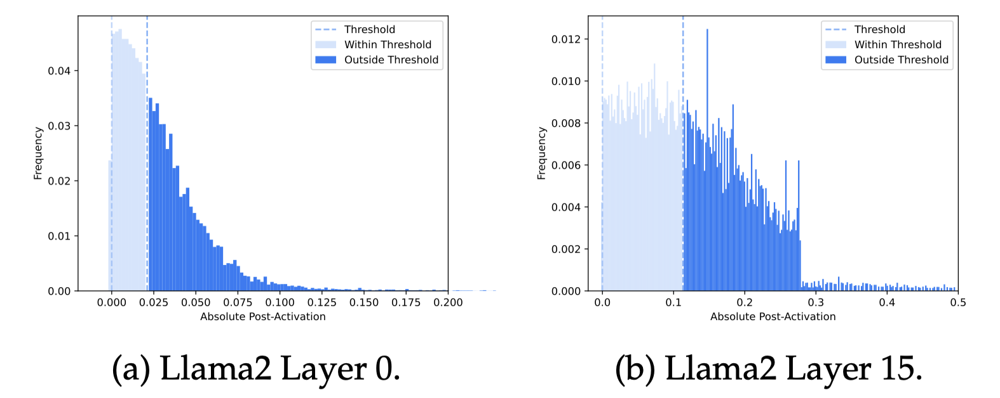

# CATS: Contextually-Aware Thresholding for Sparsity in Large Language Models



## 一句话总结

CATS 提出了一种基于上下文感知阈值的激活稀疏化框架，通过在 Gated-MLP 块中引入新的非线性激活函数，实现可控稀疏度的推理加速，且在无微调条件下仍能保持与基线模型相近的下游任务性能，同时通过自定义 GPU kernel 实现了约 15% 的实际墙钟时间加速。

---

## 摘要翻译

大型语言模型（LLM）在 AI 应用中取得了显著进展，但其部署仍面临巨大挑战，主要原因是推理成本高昂。近期研究通过增加激活稀疏度来降低 LLM 的计算成本，但在下游任务中会出现显著的性能退化。本文提出了一种新的框架——上下文感知阈值稀疏化（Contextually Aware Thresholding for Sparsity, CATS），用于稀疏化 LLM 的激活并降低推理成本。CATS 算法相对简单、易于实现且效果显著。其核心是引入了一种新的非线性激活函数。研究表明，CATS 可应用于多种基线模型，包括 Mistral-7B 和 Llama2-7B，在下游任务性能上优于现有的稀疏化技术。具体而言，基于 CATS 的模型在 50% 激活稀疏度下，即使不进行微调，也能在下游任务中达到基线模型约 99% 的性能。此外，当进行微调时，基于 CATS 的模型收敛更快，任务表现优于竞争技术。最后，作者开发了自定义 GPU kernel 以高效实现 CATS，将激活稀疏性转化为实际的墙钟时间加速。在 Llama-7B 和 Mistral-7B 上，自定义 kernel 实现了约 15% 的推理延迟改善。代码已发布于 https://github.com/ScalingIntelligence/CATS。

---

## 研究动机

1. **LLM 推理成本高昂**：大型语言模型（如 GPT-3）的训练消耗了超过 300 万 GPU 小时，推理成本往往超过训练成本，亟需降低推理成本的方案。

2. **现有稀疏化方法的局限性**：已有研究通过增加激活稀疏度来降低计算成本，但往往导致下游任务性能显著退化。特别是，现有方法如 ReLUfication（将 SiLU/GeLU 替换为 ReLU）缺乏可控的稀疏度，且性能下降明显。

3. **LLM 激活的固有稀疏性**：研究发现 LLM 的 Gated-MLP 层激活值大量集中在 0 附近（如图 1 所示），这意味着许多神经元对输出影响极小，可以被安全地置零。

4. **MoE 框架的启发**：Mixture-of-Experts（MoE）模型通过路由器选择性激活专家子网络，CATS 将 Gated-MLP 块中的权重矩阵行/列视为"专家"，将 SiLU 激活视为"路由器"，从而在密集模型中实现类似 MoE 的稀疏化效果。

---

## 方法（技术细节）

### 核心思想

CATS 将 Gated-MLP 块中的激活视为 MoE 框架中的路由器，通过引入可控阈值，将接近零的激活值置零，从而实现激活稀疏化。这一方法不改变模型架构，仅修改激活函数。

### Gated-MLP 块结构

Gated-MLP 块是 LLM（如 Llama2、Mistral、Gemma）中的常见组件，其计算公式为：

```
Gated-MLP(x) := (SiLU(xWgate) * (xWup))Wdown
```

其中 `SiLU(x) = x * sigmoid(x)`。关键观察是：SiLU(xWgate) 可以视为 MoE 中的路由器，`Wup` 的列和 `Wdown` 的行可以视为专家。

### 第一阶段：确定截断阈值

1. 给定目标稀疏度 k（例如 70%）
2. 随机选取训练数据的子集（仅 500 个数据点）
3. 计算每个 Gated-MLP 块的激活值
4. 计算截断阈值 t，使得绝对值低于 t 的激活值占比达到 k

数学定义：
```
t := min{t' : F(t') ≥ k}
```
其中 F 是激活绝对值的经验累积分布函数。

### 第二阶段：稀疏化 Gated-MLP 块

CATS 激活函数定义为：
```
CATS_t(x_j) := x_j    if |x_j| ≥ t
                0      if |x_j| < t
```

新的激活函数为：
```
CATS_t(SiLU(xWgate)) = SiLU(xWgate)  if |SiLU(xWgate)| ≥ t
                         0              if |SiLU(xWgate)| < t
```

这一操作将接近零的激活值置零，从而产生稀疏激活的模型。

### 自定义 GPU Kernel

为了将激活稀疏性转化为实际的墙钟时间加速，作者设计了自定义 GPU kernel：

```
1. 输入：阈值 t，隐藏层 x，权重 Wgate, Wdown, Wup
2. v ← SiLU(xWgate)
3. Mask ← 1 if |v| ≥ t else 0
4. x1 ← (xWup[Mask] * v[Mask])
5. y ← x1Wdown[Mask]
```

关键技术要点：
- **融合操作**：将 v[Mask] 的逐元素乘法融合到 xWup[Mask] 的每个 tiling 中，减少内存操作
- **掩码控制**：直接使用 Mask 控制 Wup 和 Wdown 的加载，避免昂贵的同步操作
- **内存优化**：MLP 块在小 batch 推理时是内存受限的（memory-bound），该 kernel 通过减少内存访问来降低延迟

---

## 实验结果

### 实验设置
- **基线模型**：Mistral-7B、Llama2-7B、Llama2-13B
- **CATS 变体**：50%、70%、90% 稀疏度
- **对比方法**：ReLUfication（将 SiLU/GeLU 替换为 ReLU）
- **评估任务**：OpenBookQA、ARC Easy、Winogrande、HellaSwag、ARC Challenge、PIQA、BoolQ、SCI-Q（共 8 个基准）
- **硬件**：单机 8×L40S GPU，延迟实验在单个 L40S 上进行
- **微调**：LoRA（仅 1% 参数），目标参数包括 Query、Key、Wgate、Wdown

### 关键结果

#### 1. 无微调的零样本性能（Table 1）
- **Mistral-7B**：CATS-50% 平均准确率 0.6890 vs 基线 0.6994（仅下降 1.5%）
- **Llama2-7B**：CATS-50% 平均准确率 0.6433 vs 基线 0.6589（仅下降 2.4%）
- **CATS 在 90% 稀疏度下仍显著优于 ReLUfication**（Mistral: 0.4368 vs 0.3230; Llama2: 0.4764 vs 0.3525）
- **13B 模型的性能退化更小**：CATS-50% 从 7B 的 1.46% 降至 13B 的 0.65%

#### 2. 通用微调性能（Figure 2）
- CATS-50% 无需微调即可达到基线模型性能
- CATS 模型收敛更快，微调效率更高
- CATS-70% 在 500 步内即可达到基线模型性能
- ReLUfication 在相同微调步数下性能明显更差

#### 3. 任务特定微调（Table 2，Mistral-7B）
- **Cola**：CATS-50% 0.8658 vs 基线 0.8667（仅 -0.10%），ReLUfication 0.6922（-20.13%）
- **SST2**：CATS-50% 0.9656 vs 基线 0.9644（+0.12%），ReLUfication 0.7856（-18.55%）
- **BoolQ**：CATS-50% 0.8862 vs 基线 0.8905（-0.48%），ReLUfication 0.6624（-25.61%）

#### 4. 生成任务性能（Table 3）
- **Llama-7B**：CATS-50% 困惑度增加仅 1.06%（微调后降至 0.60%），ReLUfication 增加 42.38%（微调后 20.04%）
- **Mistral-7B**：CATS-50% 困惑度增加仅 1.21%（微调后降至 0.45%），ReLUfication 增加 25.34%（微调后 14.68%）

#### 5. 墙钟时间加速（Figures 3-4）
- **MLP 块延迟**：50% 稀疏度约 40% 加速，70% 稀疏度约 70% 加速
- **生成吞吐量**：Llama2-7B 约 18% 提升，Mistral-7B 约 21% 提升（50% 稀疏度）
- 自定义 kernel 性能接近"Optimal"上限（低稀疏度下）

---

## 优势

1. **简单高效**：CATS 算法实现简单，仅需两步（计算阈值 + 应用激活函数），易于集成到现有模型中。

2. **可控稀疏度**：用户可以精确控制稀疏度水平（如 50%、70%、90%），这是相比 ReLUfication 等方法的重要优势。

3. **无需微调即可保持性能**：在 50% 稀疏度下，CATS 无需任何微调即可保持基线模型约 99% 的性能，而 ReLUfication 在相同稀疏度下性能大幅下降。

4. **广泛的适用性**：可应用于多种基线模型（Mistral-7B、Llama2-7B/13B），且在更大模型上性能退化更小。

5. **实际加速**：通过自定义 GPU kernel，将激活稀疏性转化为约 15% 的实际墙钟时间加速，MLP 块层面可达 40-70% 加速。

6. **微调效率高**：CATS 模型收敛更快，在相同微调步数下性能优于竞争方法。

7. **与现有框架正交**：虽然仅在 HuggingFace 上测试，但方法可应用于 DeepSpeed、TensorRT-LLM 等其他 LLM 服务系统。

---

## 局限

1. **模型规模受限**：实验仅在 Mistral-7B 和 Llama2-7B/13B 上进行，尚未在更大模型（如 70B+）上验证，作者也指出这一点。

2. **架构限制**：目前仅适用于 Gated-MLP 块，尚未扩展到其他 MLP 架构或注意力层（尽管作者建议可以结合注意力加速技术）。

3. **阈值依赖训练数据**：截断阈值需要从训练数据的子集中计算（仅 500 个数据点），阈值的选择可能影响不同分布下的性能。

4. **高稀疏度下的性能下降**：在 90% 稀疏度下，性能下降明显（如 Mistral-7B 的 CATS-90% 平均准确率仅 0.4368 vs 基线 0.6994）。

5. **与 Optimal 的差距**：在高稀疏度下，自定义 kernel 性能与"Optimal"上限存在差距，且不同 GPU 硬件上的表现可能不同。

6. **未与其他稀疏化技术组合**：CATS 仅与 ReLUfication 进行对比，未与其他稀疏化方法（如结构化剪枝、量化等）进行组合实验。

---

## 与 EfficientPaper 相关的研究方向

1. **激活稀疏化**（Activation Sparsity）：CATS 是激活稀疏化领域的核心工作，关键词 `activation_sparsity` 直接相关，属于 LLM 推理加速的重要方向。

2. **稀疏化剪枝**（Sparse Pruning）：关键词 `sparse_pruning` 与 CATS 密切相关，CATS 提供了一种基于激活的稀疏化方法，与权重剪枝形成互补。

3. **MoE 与稀疏专家模型**：CATS 将 MLP 块的行/列视为专家，与 Mixture-of-Experts 框架有深刻的理论联系，可作为 MoE 研究的替代方案。

4. **自定义 GPU kernel 优化**：CATS 的硬件感知优化（减少内存访问、融合操作）是高效推理的重要技术方向，与 FlashAttention 等工作类似。

5. **参数高效微调（PEFT）**：CATS 使用 LoRA 进行参数高效微调，与高效微调领域的研究方向相关。

6. **推理延迟优化**：CATS 在 token 生成阶段的加速属于 LLM 推理优化的核心研究方向，与量化、知识蒸馏等技术互补。

---

## AI 生成声明

本笔记由 AI Agent（Hermes Agent）自动生成，基于对论文 CATS: Contextually-Aware Thresholding for Sparsity in Large Language Models 的 PDF 全文提取和分析。笔记内容经过结构化整理，包含一句话总结、摘要翻译、研究动机、方法技术细节、实验结果、优势、局限性及与 EfficientPaper 相关的研究方向。AI Agent 在生成过程中使用了 PyMuPDF（fitz）进行 PDF 文本提取，并结合论文元数据（prototxt）信息。笔记中的翻译和总结可能存在偏差，建议读者查阅原文获取准确信息。

生成时间：2026-06-05
工具：Hermes Agent (Nous Research)
